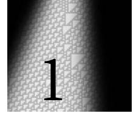
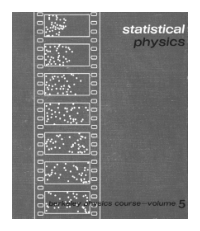
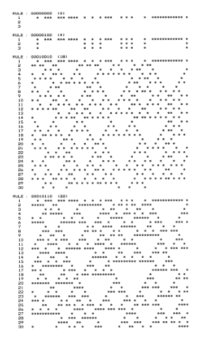

# 第 1 章：一种新科学的基础

[[PDF page 17]]

<!-- ORIGINAL_FIGURES page=0017 start -->

<!-- ORIGINAL_FIGURES page=0017 end -->

# 一种新科学的基础

## 基本思想纲要

三百年前，科学被一个戏剧性的新思想改变了：可以用基于数学方程的规则来描述自然世界。本书的目的，是开启另一场这样的转变，并介绍一种新的科学；这种科学不是基于数学方程这种特定规则，而是基于简单计算机程序中可以体现出来的更一般类型的规则。

为了建立所需的思想结构，我花了将近二十年时间，而它的结果令我惊讶。因为我发现，借助我所发展出的这种新科学，人们突然能够在一系列重要的根本问题上取得进展，而这些问题此前从未被任何既有科学成功处理过。

如果理论科学毕竟是可能的，那么在某个层面上，它所研究的系统就必须遵循确定的规则。然而，在过去的精确科学中，人们通常假定这些规则必须是基于传统数学的规则。但促使我发展本书中这种新科学的关键认识是：事实上，没有理由认为我们在自然中看到的那些系统，只应当遵循这类传统数学规则。

在更早的历史时期，人们也许很难想象更一般类型的规则会是什么样子。但今天，我们周围到处都是计算机，而计算机中的程序实际上实现着数量巨大的各种规则。

---

[[PDF page 18]]

我们实际使用的程序，大多基于极其复杂的规则，这些规则被专门设计出来执行特定任务。但原则上，一个程序可以遵循几乎任何确定的规则。而本书所描述的新科学的核心，正是我关于一些具有可能最简单规则的程序所作出的发现。

人们也许会以为，正如我最初也确实以为的那样，如果一个程序的规则很简单，那么它的行为也一定相应地简单。因为我们日常建造事物的经验倾向于给我们一种直觉：创造复杂性在某种意义上是困难的，需要本身就复杂的规则或计划。但大约十八年前我所作出的关键发现是，在程序的世界里，这种直觉远远不正确。

我做了一个从某种意义上说几乎最初等的计算机实验：我取出一系列简单程序，然后系统地运行它们，观察它们的行为。令我大为惊讶的是，我发现尽管这些程序的规则很简单，它们的行为却往往远不简单。事实上，在我考察过的那些最简单的程序中，有些程序的行为复杂程度不亚于我曾见过的任何东西。

我花了十多年才真正接受这一结果，并认识到它的后果有多么根本、多么深远。回头看，这个结果没有理由不能在几个世纪以前就被发现；但我越来越把它看作理论科学整个历史中最重要的单个发现之一。因为它除了打开巨大的新探索领域之外，还意味着必须从根本上重新思考自然以及其他地方的过程是如何运作的。

也许最直接、最引人注目的是，它为一个长期被视为自然世界最大奥秘的问题提供了解答：自然似乎如此轻而易举地产生出那么多在我们看来复杂的东西，它的秘密究竟是什么。

毕竟，本来可能出现的是，在自然世界中我们主要看到像正方形和圆形那样被我们认为简单的形式。但实际上，自然世界最显著的特征之一，是在广泛的物理、生物和其他系统中，

---

[[PDF page 19]]

我们不断面对看起来巨大的复杂性。事实上，在历史的大部分时期，人们几乎理所当然地认为，这种复杂性如此远远超过人类作品中的复杂性，只可能是某种超自然存在的作品。

但我发现许多非常简单的程序能够产生巨大的复杂性，这立刻提示了一种相当不同的解释。只要自然中的系统像典型程序那样运作，那么它们的行为就往往会是复杂的。而在人造物中通常看不到这种复杂性的原因，只是我们在建造这些东西时，实际上倾向于使用经过特别选择的程序，使其只产生足够简单的行为，以便我们能够看出它们会实现我们想要的目的。

人们也许会以为，既有科学在过去几个世纪取得了那么多成功，早就应该已经处理了复杂性问题。但事实上，它们并没有。并且，在很大程度上，它们还特意界定自己的范围，以避免与复杂性发生直接接触。因为用数学方程描述行为这一基本思想，在行星运动这类行为相当简单的情形中很有效，但一旦行为更复杂，几乎不可避免地就会失效。生物学中基于自然选择等思想的描述，也大体如此。但通过从程序的角度思考，我在本书中发展的这种新科学第一次能够对极其复杂的行为作出有意义的陈述。

在既有科学中，过去一个世纪左右的许多重点，是把系统拆解开来，寻找其底层组成部分，然后尽可能详细地分析这些部分。尤其在物理学中，这种方法已经相当成功，以至于日常系统的基本组成部分如今已经完全为人所知。但这些组成部分究竟怎样共同作用，才产生出我们所看到的整体行为中那些甚至最明显的特征，这在过去几乎一直是一个完整的谜。在我于本书中发展的这种新科学框架内，这样的问题终于可以得到处理。

---

[[PDF page 20]]

按照既有科学的传统，人们也许会预期，这个问题的答案会取决于各种细节，并且会随着物理、生物及其他系统类型的不同而大不相同。但在简单程序的世界中，我发现同样的基本行为形式会一再出现，几乎与底层细节无关。这提示我们，存在相当普遍的原则，决定着整体行为；而这些原则不仅可以预期适用于简单程序，也可以预期适用于整个自然世界以及其他地方的系统。

在既有科学中，每当遇到一个看起来复杂的现象，人们几乎理所当然地认为，这个现象必定是某种本身复杂的底层机制的结果。但我发现简单程序能够产生巨大的复杂性，这清楚表明事实并非如此。事实上，在本书后面的部分中，我会说明，即使是一些异常简单的程序，也似乎能够把握各种重要现象背后的核心机制，而这些现象过去一直显得过于复杂，不可能有任何简单解释。

在科学史上，新的思考方式最终使长期存在的问题得以处理，这并不罕见。但令我惊讶的是，仅仅通过用简单程序来思考，我竟然能够处理如此之多处于既有科学基础核心的问题。例如，一个多世纪以来，人们一直困惑于物理学中的热力学行为究竟如何产生。但根据我关于简单程序的发现，我发展出了一种相当直接的解释。而在生物学中，我的发现第一次提供了一种明确方式，使我们能够理解为什么如此多的生物体会展现出如此巨大的复杂性。事实上，我还越来越多地看到证据表明，用简单程序来思考将使我们有可能构造出一个真正单一而基本的物理学理论，从中可以涌现出空间、时间、量子力学以及我们宇宙的所有其他已知特征。

数学被引入科学时，它第一次提供了一个抽象框架，使科学结论可以在不直接指涉物理现实的情况下得出。然而，尽管数学本身在过去几千年中经历了全部发展，

---

[[PDF page 21]]

它仍然一直集中在相当特定的抽象系统类型上，最常见的是以某种方式来源于算术或几何的系统。但本书所描述的新科学引入的，在某种意义上是更一般的抽象系统，它们基于几乎任何类型的规则。

人们也许会以为，这类系统过于多样，无法对它们作出有意义的一般性陈述。但一个关键思想使我能够为本书所描述的新科学建立统一框架：正如任何系统的规则都可以看作对应于一个程序，它的行为也可以看作对应于一种计算。

传统直觉也许会提示我们，要做更复杂的计算，就总是需要更复杂的底层规则。但整个计算机革命得以启动，依赖的是一个非凡事实：可以构造出具有固定底层规则的通用系统，而这些系统实际上能够执行任何可能的计算。

不过，人们通常假定，达到这种通用性的门槛很高，只有典型电子计算机这类精巧而特殊的系统才能达到。但本书中的一个惊人发现是，事实上存在一些系统，它们的规则简单到只用一句话就能描述，却仍然是通用的。这立刻提示我们，通用性这一现象，无论在抽象系统中还是在自然中，都比以往想象的普遍得多，也重要得多。

但在许多发现的基础上，我被引向了一个更为广泛的结论。我把它概括为计算等价性原理：只要在几乎任何系统中看到并非显然简单的行为，这种行为都可以被看作对应于同等复杂程度的计算。而这个极其基本的原理，对科学和科学思维有着一系列前所未有的含义。

首先，它立刻给出了一个基本解释，说明为什么简单程序能够表现出在我们看来复杂的行为。因为像其他过程一样，我们自己的感知与分析过程也可以被看作计算。

---

[[PDF page 22]]

我们本来也许会想象，这些计算总会比简单程序所执行的计算复杂得多；但计算等价性原理意味着事实并非如此。正是我们作为观察者与我们所观察的系统之间的这种等价性，使这些系统的行为在我们看来显得复杂。

原则上，人们总能通过运行实验并观察发生了什么，来弄清一个特定系统会怎样表现。但理论科学在历史上的巨大成功，通常围绕着寻找数学公式；这些公式可以不这样做，而是直接让人预测结果。然而，这实际上依赖于一种能力：绕过系统自身所执行的计算工作。

而计算等价性原理现在意味着，通常只有具有简单行为的相当特殊的系统，才有可能被这样绕过。因为其他系统倾向于执行和我们所能执行的计算同样复杂的计算，即便我们拥有全部数学和计算机也是如此。这意味着这些系统是计算不可约的；也就是说，寻找它们行为的唯一方式，实际上就是追踪它们的每一步，付出大约与这些系统自身相当的计算努力。

因此，从某种意义上说，这意味着理论科学存在一种根本限制。但它也表明，时间流逝能够实现某种不可约的东西。它还导向了一种解释：我们作为人类，即使可能遵循确定的底层规则，仍然能够以一种有意义的方式表现出自由意志。

科学史上许多最重要进步的一个特征，是它们展示了人类并不特殊的新方式。在某个层面上，计算等价性原理也做到了这一点。因为它意味着，就计算或智能而言，我们最终并不比各种简单程序、以及自然中的各种系统更加精妙。

但从计算等价性原理中，也涌现出一种新的统一性：在从简单程序到大脑再到整个宇宙的广泛系统中，

---

[[PDF page 23]]

这一原理意味着存在一种基本等价性，使相同的根本现象能够发生，也使相同的基本科学思想和方法能够被使用。正是这一点，最终赋予了本书所描述的新科学以巨大力量。

## 与其他领域的关系

**数学。** 人们通常假定，数学关心的是任意一般的抽象系统的研究。但本书表明，事实上存在大量基于简单程序的抽象系统，而传统数学从未考虑过它们。并且，由于这些系统在构造上以许多方式比传统数学中的大多数系统更简单，采用适当方法时，实际上就有可能把对它们的研究推进得更远。

于是，人们发现的某些东西，只是现代数学中已有现象前所未有地清楚的例子。但人们也会发现一些戏剧性的新现象。最直接明显的是，许多系统在行为中表现出极高程度的复杂性，而它们的底层规则却比标准数学教科书中大多数系统的规则简单得多。

这种复杂性的一个后果是，它会给证明这一传统数学核心观念带来根本限制。早在 1930 年代，哥德尔定理就已经给出过这种限制的一些迹象。但在过去，它们似乎始终与大多数实际进行的数学无关。

然而，本书中的发现表明，这在很大程度上只是反映了如今被认为属于数学的范围有多么狭窄。事实上，本书的核心可以被看作引入了一种对数学的重大推广：它带来新的思想和方法，也带来巨大的新探索领域。

我在本书中发展的框架还表明，如果把做数学的过程以根本上计算的方式来看待，就有可能处理甚至既有数学基础中的重要问题。

---

[[PDF page 24]]

**物理学。** 传统的数学科学方法在历史上最大的成功是在物理学中取得的；到现在，人们几乎普遍假定，任何严肃的物理理论都必须建立在数学方程之上。然而，采用这种方法时，物理学对许多常见物理现象仍然几乎无话可说。但借助我在本书中发展的、从简单程序角度思考的方法，终于似乎有可能取得一些戏剧性的进展。事实上，在本书过程中我们会看到，一些极其简单的程序似乎能够把握许多物理现象的核心机制，而这些现象此前一直显得完全神秘。

理论物理学中既有的方法，往往围绕连续数和微积分的思想，有时也围绕概率的思想。但本书中的大多数系统只涉及具有确定规则的简单离散元素。而从许多方面看，正是这种底层结构的更大简单性，最终使识别如此之多根本新现象成为可能。

关于物理系统的普通模型，是一些理想化，它们捕捉某些特征而忽略其他特征。过去最常见的是捕捉某些简单的数值关系，比如那些可以用光滑曲线表示的关系。但借助我在本书中探索的、基于简单程序的新模型，就有可能捕捉各种复杂得多的特征，而这些特征只有在行为的明确图像中才能真正看到。

在物理学的未来，最大的胜利无疑将是为我们的整个宇宙找到一个真正基本的理论。然而，尽管偶尔会有乐观情绪，传统方法并不让人觉得这件事近在眼前。但凭借我在本书中发展的方法和直觉，我相信终于有了一个严肃的可能性：这样的理论实际上可以被找到。

**生物学。** 关于生物体细节的知识如今已经极其丰富，但从来没有出现多少一般理论。生物学的经典领域倾向于把自然选择进化当作基础，这导致一种观念：关于生命系统的一般观察，通常应当依据进化史而不是抽象理论来分析。

---

[[PDF page 25]]

造成这种情况的部分原因是，传统数学模型似乎从未接近于捕捉我们在生物学中看到的那种复杂性。但本书中的发现表明，简单程序能够产生很高程度的复杂性。事实上，结果显示，这类程序能够复现生物体的许多特征，并且例如似乎能够把握基因程序得以生成我们所见实际生物形态的一些核心机制。因此，这意味着我们可以为生物系统建立范围广泛的新模型，并且潜在地看到怎样模拟其运作的本质，比如用于医学目的。并且，只要简单程序存在一般原则，这些原则也应当适用于生物体，从而使人们能够设想在生物学中构造新型的一般抽象理论。

**社会科学。** 从经济学到心理学，长期存在一种广泛但有争议的假定：毫无疑问，这种假定源自物理科学的成功，即可靠的理论必须总是用数字、方程和传统数学来表述。但我怀疑，在捕捉社会科学现象的根本机制时，人们往往更有机会使用我在本书中基于简单程序发展出的这种新科学。毫无疑问，很快就会出现各种关于把我的思想应用于社会科学的主张。事实上，本书中涌现出来的新直觉也很可能几乎立刻解释一些过去显得相当神秘的现象。但本书自身的结果表明，科学方法的应用不可避免地会存在根本限制。新的问题会被提出，但要过一段时间人们才会清楚：什么时候一般理论是可能的，什么时候则不可避免地必须依赖对具体情形细节的判断。

---

[[PDF page 26]]

**计算机科学。** 在其短暂历史中，计算机科学几乎完全专注于研究被设置来执行特定任务的具体计算系统。但本书的一个核心思想，是考虑一个更一般的科学问题：任意计算系统会做什么。而我发现的许多东西，与人们根据既有计算机科学可能预期的情况大为不同。因为传统上由计算机科学研究的系统，在构造上往往相当复杂，却产生相当简单的行为，并且这种行为可识别地实现某个特定目的。但我在本书中表明，即使构造极其简单的系统，也能够产生极其复杂的行为。而以计算方式思考这一点，人们会形成一种关于计算本性的新直觉。

一个后果是，计算思想可应用的领域被戏剧性地扩展，尤其扩展到包括关于自然和数学的各种根本问题。另一个后果是，它为计算机科学中既有问题提供了新的视角，特别是那些涉及执行一般类型计算任务最终需要什么资源的问题。

**哲学。** 在历史上的任何时期，关于宇宙以及我们在其中的位置，总有一些问题似乎只能由哲学的一般论证来触及。但科学进步最终常常会提供一个更确定的语境。我相信，本书中的新科学会为若干自古以来就被视为根本的问题做到这一点。其中包括关于知识的终极限制、自由意志、人类处境的独特性以及数学的不可避免性的问题。在哲学史上，关于这些问题已经说过很多。但不可避免的是，这些讨论只受到当时关于事物应当如何运作的直觉所塑造。而本书中的发现导向了根本上新的直觉。借助这种直觉，人们第一次能够开始看到许多长期问题的解答，而且这些解答通常会沿着与传统哲学一般论证所预期的相当不同的路线展开。

---

[[PDF page 27]]

**艺术。** 自然似乎如此轻易地就能产生极美的形式。然而过去艺术大多只能满足于模仿这些形式。但现在，随着人们发现简单程序能够捕捉自然中各种复杂行为的核心机制，就可以想象通过采样这类程序，来探索我们在自然中所见形式的推广。传统科学直觉以及早期计算机艺术也许会使人以为，简单程序总会产生过于简单、过于僵硬的图像，缺乏艺术上的兴趣。但翻阅本书就会清楚，即使一个规则可能极其简单的程序，也常常能够生成具有强烈审美品质的图像；有时这些图像让人想起自然，有时却又不像以往见过的任何东西。

**技术。** 尽管技术已经取得种种成功，自然中仍然有许多过程显得比技术曾经能够产生的任何东西都更加复杂、更加精妙。但本书中的发现现在表明，通过使用简单程序所体现的规则类型，人们可以捕捉自然的许多核心机制。由此就有可能设想一种全新的技术，它实际上达到与自然相同的精妙程度。传统工程经验导致了一种普遍假定：要执行一项精妙任务，就需要构造一个其基本规则在某种意义上相应复杂的系统。但本书中的发现表明，事实并非如此；事实上，极其简单的底层规则，甚至例如有可能直接在原子层面实现的规则，往往就是所需要的一切。本书的主要重点是基础科学问题。但我毫不怀疑，在几十年内，我所做的工作会导致技术基础发生某些戏剧性的变化，也会改变我们把宇宙所提供的东西用于自身人类目的的基本能力。

---

[[PDF page 28]]

## 过去的一些尝试

本书的目标足够广泛、足够根本，因此不可避免地，以前也曾有人试图至少实现其中一部分。但如果没有本书中的思想和方法，每一种曾经尝试过的主要方法，最终都会遇到一些基本问题，而这些问题几乎形成无法逾越的障碍。

**人工智能。** 电子计算机刚被发明时，人们普遍相信，用不了多久它们就会具备类似人类的思维能力。到 1960 年代，人工智能领域兴起，其目标是理解人类思维过程，并在计算机上实现它们。但事实证明，这比预期困难得多；除了一些派生成果外，根本性进展很少。在某个层面上，基本问题始终是理解大脑中看似简单的组成部分怎样导致思维的全部复杂性。但现在，凭借本书所发展的框架，人们终于有可能拥有一个有意义的基础来做这件事。事实上，基于本书中的理论思想和实践思想，我怀疑，最终将有可能在创造能够进行类人思维的技术系统方面取得戏剧性进展。

**人工生命。** 自从机器存在以来，人们就一直想知道机器能在多大程度上模仿生命系统。在 1980 年代中期到 1990 年代中期最为活跃的人工生命领域，主要关心的是表明计算机程序可以被构造出来模拟生物系统的各种特征。但通常人们假定，所需程序会相当复杂。然而，本书中的发现表明，事实上非常简单的程序就可以足够。而这样的程序会使行为的基本机制更清楚，也很可能更接近真实生物系统中实际发生的事情。

**突变理论。** 传统数学模型通常基于连续变化的量。然而，在自然中人们常常看到离散变化。突变理论在 1970 年代曾经流行，它关注的是表明即使在传统数学模型中，

---

[[PDF page 29]]

某些简单的离散变化仍然可以发生。本书并不从任何连续性假设出发；而我所研究的行为类型，也往往比突变理论中的行为复杂得多。

**混沌理论。** 混沌理论领域基于这样一种观察：某些数学系统的行为会以任意敏感的方式依赖于初始条件的细节。这一点最早在 1800 年代末被注意到，后来在 1960 年代和 1970 年代的计算机模拟之后变得显著。它的主要意义在于，它意味着如果初始条件中的任何细节是不确定的，那么最终就会不可能预测系统的行为。但尽管通俗叙述中有些说法与此相反，仅凭这一事实并不意味着行为必然会复杂。事实上，它所表明的只是：如果初始条件的细节中存在复杂性，那么这种复杂性最终会出现在系统的大尺度行为中。但如果初始条件很简单，就没有理由认为行为不会相应地简单。然而，我在本书中表明，即使初始条件非常简单，许多系统仍然会产生高度复杂的行为。而我主张，正是这种现象，例如负责了我们在自然中看到的大多数显而易见的复杂性。

**复杂性理论。** 我在 1980 年代早期的发现，使我产生了一个想法：复杂性可以作为一种基本而独立的现象来研究。这个想法逐渐变得相当流行。但后来完成的大多数科学工作，最终只建立在我最早那些发现之上，并且仍然非常处于某一种既有科学的框架内；结果是，它几乎没能在任何一般而根本的问题上取得进展。我在本书中描述的新科学的一个特点，是它终于使我们有可能发展出对复杂性这一一般现象及其起源的基本理解。

---

[[PDF page 30]]

**计算复杂性理论。** 计算复杂性理论主要在 1970 年代发展起来，试图刻画执行某些计算任务有多困难。它的具体结果往往基于相当特定的程序，这些程序结构复杂，但行为相当简单。然而，本书中的新科学探索的是更一般的程序类别，并且通过这样做，开始为计算复杂性理论中若干长期问题带来新的光亮。

**控制论。** 在 1940 年代，人们曾认为，也许可以基于与电气机器的类比来理解生物系统。但由于当时可用的分析方法本质上只有来自传统数学的方法，典型生物系统的大部分复杂行为都没有被成功捕捉。

**动力系统理论。** 动力系统理论是大约一个世纪前开始的一个数学分支，它关心的是研究按照某些数学方程随时间演化的系统，并使用传统的几何方法和其他数学方法来刻画这类系统可能产生的行为形式。但我在本书中主张，事实上许多系统的行为从根本上说过于复杂，无法以这种方式有用地捕捉。

**进化理论。** 达尔文的自然选择进化理论常常被认为解释了我们在生物系统中看到的复杂性；事实上，近年来这一理论也越来越多地被应用于生物学之外。但完全不清楚的是，为什么这一理论应当意味着复杂性会被生成。并且，我会在本书中主张，在许多方面，它往往反而抵制复杂性。但本书中的发现提示了一种新的、相当不同的机制；我相信，我们在生物学中看到的大多数高度复杂性例子，事实上正是由这种机制负责。

**实验数学。** 通过观察计算数据来探索数学系统，这个想法有很长的历史；随着计算机的出现，它也逐渐变得更普遍。

---

[[PDF page 31]]

Mathematica 的出现也推动了这一点。但过去几乎没有例外的是，它只被应用于那些已经由其他数学手段研究过的系统和问题，也就是那些非常处在数学正常传统之内的系统和问题。然而，我在本书中的方法，是把计算机实验作为一种基本方式，用来探索更一般的系统；这些系统从未出现在传统数学中，而且通常远非既有数学手段所能触及。

**分形几何。** 直到不久前，科学和数学中广泛讨论的形状，几乎只有规则或光滑的形状。但从 1970 年代末开始，分形几何领域强调嵌套形状的重要性，这些形状包含任意精细的部分，并主张这类形状在自然中很常见。本书中我们会遇到相当数量产生这类嵌套形状的系统。但我们也会发现许多系统产生的形状复杂得多，并且没有嵌套结构。

**一般系统论。** 一般系统论尤其在 1960 年代流行，它主要关心的是研究由元素组成的大型网络，并且常常把人类组织理想化。但由于完全缺乏类似我在本书中使用的那类方法，它几乎不可能得出任何确定结论。

**纳米技术。** 自 1990 年代早期以来迅速发展的纳米技术，其目标是在原子尺度上实现技术系统。但到目前为止，纳米技术大多关心的是缩小相当熟悉的机械装置和其他装置。然而，本书中的发现现在表明，存在各种系统，它们结构简单得多，却仍然能够执行非常精妙的任务。而其中一些系统在许多方面似乎更适合在原子尺度上直接实现。

**非线性动力学。** 具有线性性质的数学方程通常相当容易求解，因此被广泛用于纯科学和应用科学。非线性动力学领域关心的是分析更复杂的方程。它最大的成功来自所谓孤子方程；对于这类方程，

---

[[PDF page 32]]

仔细操作会导向一种类似线性的性质。但我在本书中讨论的系统类型，通常表现出复杂得多的行为，并不具有这类简化性质。

**科学计算。** 科学计算领域通常关心的是采用传统数学模型，最常见的是关于各种流体和固体的模型，然后尝试用数值近似方案在计算机上实现它们。通常，除了相当简单的现象以外，很难把真正现象同所用近似带来的效应分离开来。而我在本书中引入的模型，在计算机上实现时不涉及近似，因此很容易使人识别复杂得多的现象。

**自组织。** 在自然中，人们相当常见地看到一些系统起初无序且没有特征，随后却自发组织起来，产生确定结构。松散形成的自组织领域关心的就是理解这一现象。但它大多使用传统数学方法，因此只能研究相当简单结构的形成。然而，借助本书中的思想，人们有可能理解复杂得多的结构是怎样形成的。

**统计力学。** 自大约一个世纪前发展以来，被称为统计力学的物理学分支，主要关心的是理解由大量气体分子或其他组成部分构成的系统的平均行为。在任何具体情形中，这类系统常常以复杂方式行为。但通过考察许多情形上的平均，统计力学通常得以避开这种复杂性。然而，为了接触真实情形，它常常不得不使用所谓热力学第二定律，或熵增原理。但一个多世纪以来，人们在理解这一原理的基础方面一直存在挥之不去的困难。不过，借助本书中的思想，我相信现在终于有了一个框架，可以在其中解决这些困难。

---

[[PDF page 33]]

<!-- ORIGINAL_FIGURES page=0033 start -->

<!-- ORIGINAL_FIGURES page=0033 end -->

## 本书科学的个人故事

我可以相当准确地把自己对本书所讨论的这类科学问题产生严肃兴趣的开端，追溯到 1972 年夏天，那时我十二岁。我买了一本右图所示的物理学教科书，并对其封面上展示的随机化过程产生了强烈好奇。但我远没有被书中给出的数学解释说服，于是决定自己在计算机上模拟这一过程。

图注：最初激发我对本书所讨论某些问题产生兴趣的那本书的封面。

按照现代标准，我当时能使用的计算机非常原始。结果，我别无选择，只能研究书中过程的一个极其简化版本。我从一开始就怀疑，自己构造的系统可能过于简单，不会表现出我想看到的任何现象。经过大量编程努力后，我设法让自己确信这些怀疑是正确的。

然而，事实证明，我当时考察的是本书所考虑的主要系统类型之一，也就是元胞自动机的一个特例。并且，如果不是因为我希望让模拟尽可能具有物理现实性而引出的一个主要是技术性的问题，很有可能到 1974 年时，我就已经发现了我现在在本书中描述的一些主要现象。

不过，实际情况是，我当时决定把精力投入到在那时看来最根本的科学领域：理论粒子物理学。在接下来的几年里，我确实在粒子物理学和宇宙学的若干领域取得了重要进展。但过了一段时间，我开始怀疑，我所遇到的许多最重要、最根本的问题，其实与这些领域中艰深细节相当无关。

事实上，我意识到，即使关于普通日常现象，也存在许多相关问题仍然完全没有答案。例如，我们在湍流流体中看到的复杂图案，其根本起源是什么？雪花的精细图案是怎样产生的？使植物和动物能够以如此复杂方式生长的基本机制是什么？

---

[[PDF page 34]]

令我惊讶的是，这类问题似乎几乎没有得到什么研究。起初我以为，也许只要应用一些我在理论物理学中使用过的复杂数学技术，就能取得进展。但很快就清楚了：对于我所研究的现象，传统数学结果即使不是不可能找到，也会非常困难。

那么我能做什么呢？碰巧，作为我物理学工作的一个副产品，我在 1981 年刚刚完成了一个大型软件系统的开发，这个系统在某些方面是 Mathematica 部分内容的前身。而至少在思想层面上，这个项目最困难的部分，是设计系统所基于的符号语言。但在发展这种语言时，我相当清楚地看到，我提出的少数几个原始操作，最终能够成功覆盖范围巨大的复杂计算任务。

于是我想到，也许我可以在自然科学中做某种类似的事：也许我能够找到一些合适的原语，它们可以成功捕捉范围巨大的自然现象。当时我的想法并没有非常清晰地形成，但我相信自己隐约设想的是，事情会这样运作：这些原语可以被用来构建计算机程序，而这些程序会模拟我感兴趣的各种自然系统。

在许多情形中，这类系统的单个组成部分已有成熟的数学模型。但有两个实际问题阻碍了把这些模型作为模拟基础。第一，这些模型通常相当复杂，因此在现实可用的计算资源下，很难包含足够多组成部分，使有趣现象得以发生。第二，即使人们确实看到了这类现象，也几乎无法判断它们事实上是底层模型的真正后果，还是只是模型在计算机上实现时所作近似的结果。

但我意识到，至少对于我想研究的许多现象，并不关键的是为单个组成部分使用尽可能准确的模型。其中一个原因是，自然中有证据表明，在许多情形中组成部分的细节并不十分重要；例如，同样复杂的流动图案会同时出现在空气和水中。

---

[[PDF page 35]]

<!-- ORIGINAL_FIGURES page=0035 start -->

<!-- ORIGINAL_FIGURES page=0035 end -->

考虑到这一点，我决定，与其从详细而现实的模型开始，不如从某种意义上尽可能简单、并且易于在计算机上设置成程序的模型开始。

一开始，我不知道这会怎样运作，也不知道我所需的程序必须有多复杂。事实上，当我考察各种简单程序时，它们似乎总是产生远比我想研究的任何系统都简单得多的行为。

但在 1981 年夏天，我做了一个自己认为相当直接的计算机实验，考察某一特定类型的所有程序会怎样行为。我对这个实验其实没有太高期待。但事实上，它的结果如此惊人而戏剧性，以至于随着我逐渐理解这些结果，它们迫使我改变了自己对科学的整个看法，并最终发展出我现在在本书中描述的这种新科学的整个思想结构。

右图展示的是我最初实验的一份典型输出复本。图形很原始，但其中包含的精细图案，是我以前从未见过的东西。起初我不相信它们可能是正确的。但过了一段时间，我确信它们确实正确，并意识到自己看到了一个相当非凡、出乎意料的现象的迹象：即使从非常简单的程序中，也能够涌现出高度复杂的行为。

图注：这份计算机打印输出的复本，最早让我看到本书中一些核心现象的线索。

但像这样根本的东西，怎么会以前从未被注意到呢？我查阅科学文献，与许多人交谈，发现与我所研究系统相似的系统，约三十年前已经被命名为“元胞自动机”。但尽管曾有少数相当接近的尝试，却没有人真正做过任何与我所做实验类型相当相似的事情。

不过，我仍然怀疑，我所看到的基本现象一定以某种方式是某个已知科学原理的显然结果。但我虽然确实发现混沌理论、分形几何等领域的思想有助于解释某些具体特征，却没有发现任何接近这一整体现象的东西曾被研究过。

我关于元胞自动机行为的早期发现，在科学共同体中激发了相当多活动。

---

[[PDF page 36]]

到 1980 年代中期，物理学、生物学、计算机科学、数学以及其他领域已经找到了许多应用。事实上，我发现的某些现象也开始被用作一个新研究领域的基础，我把这个领域称为复杂系统理论。

然而，在这一切过程中，我一直继续研究更基本的问题。到大约 1985 年，我开始意识到，自己此前看到的只是某种更加戏剧性、更加根本的东西的一点线索。但要理解我正在发现的东西很困难，需要直觉发生重大转变。

不过，我能看到前方存在一些非凡的思想机会。我最初的想法是组织学术共同体来利用这些机会。于是我创办了一个研究中心和一份期刊，发表了一份需要攻克的问题清单，并努力传达我正在定义的方向的重要性。

但尽管兴奋感越来越强，尤其围绕一些潜在应用，人们似乎很少成功摆脱传统方法和传统直觉。过了一段时间，我意识到，如果要取得任何戏剧性的进展，必须由我自己来取得。于是我决定建立自己所能建立的最好工具和基础设施，然后亲自尽可能高效地推进我认为应该完成的研究。

在 1980 年代早期，我最大的单一障碍，是用当时可用的各种相当低层次工具做计算机实验在实践上非常困难。但到 1986 年，我已经意识到，凭借我拥有的一些新思想，可以构建一个统一而连贯的系统，用来完成各种技术计算。既然除此之外似乎不可能出现这样的东西，我决定亲自构建它。

结果就是 Mathematica。

接下来的五年里，构建 Mathematica 以及围绕它建立公司的过程占据了我。但在 1991 年，我已经不再是学者，而是一家成功公司的 CEO，于是能够重新回到本书所处理的这类问题上。

装备了 Mathematica 之后，我开始尝试各种新实验。结果十分壮观；短短几个月内，我关于简单程序会做什么所作出的新发现，就已经超过了此前十年加起来的总和。

---

[[PDF page 37]]

我早先的工作让我看到了某些出乎意料而又相当非凡的现象的开端。但现在，通过新的实验，我开始看到这些现象的全部力量和一般性。

随着我的方法和直觉不断改进，我的发现速度进一步提高；只用了几年时间，我就把自己对简单程序世界的探索推进到这样一种程度：我所积累的事实信息，其纯粹数量会令许多历史悠久的科学领域羡慕。

在这个过程相当早的时候，我已经开始形成若干相当一般的原则。而我走得越远，这些原则就越得到确认，我也越意识到它们有多强大、多一般。

1980 年代初我刚开始时，目标大多只是理解复杂性现象。但到 1990 年代中期，我已经建立起一个完整的思想结构；它能够做的远不止这些，并且事实上为一种只能被视为根本上新的科学奠定了基础。

对我来说，那是一个最令人兴奋的时期。因为无论我转向哪里，都有大片未被触及的新领域，能够由我第一次探索。每个领域都有自己的特殊特征。但借助我所发展的总体框架，我逐渐能够回答我所提出的、看起来最明显的问题中的几乎全部。

起初，我主要关心的是一些新问题，这些问题从来没有特别处在任何既有科学领域的中心。但我逐渐意识到，我正在建立的这种新科学，也应当提供一种根本上新的方式来处理既有领域中的基本问题。

因此，大约从 1994 年开始，我系统地考察各个主要传统科学领域。我长期以来一直对其中许多领域的根本问题感兴趣。但通常我倾向于相信关于它们的大多数传统看法。然而，当我开始在自己的新科学语境中研究它们时，我不断看到迹象表明，这些传统看法的大部分不可能是正确的。

典型情形是，某个领域存在一个核心问题，传统方法或直觉从未能够成功处理；

---

[[PDF page 38]]

而这个领域又在某种程度上发展出回避这个问题的习惯。但我一再兴奋地发现，借助我的新科学，我突然能够开始取得重大进展，甚至对于某些已经数百年没有答案的问题也是如此。

考虑到我所建立的整个框架，我发现的许多东西最终显得令人惊讶地简单。但要到达这些发现，往往涉及数量惊人的科学工作。因为仅仅能够采取几个具体技术步骤是不够的。相反，在每个领域中，都必须发展出足够广泛、足够深入的理解，才能识别真正本质性的特征；然后，这些特征才可以根据我的新科学重新思考。

做到这一点当然需要在各种不同科学领域中的经验。但也许对我来说最关键的是，这个过程有点像我在设计 Mathematica 时最终无数次做过的事：从复杂的技术思想出发，然后逐渐看出怎样用某种惊人简单的东西捕捉它们的本质特征。事实上，我曾经在 Mathematica 中多次成功做到这一点，这也是给我信心、让我尝试在各种科学领域做类似事情的部分原因。

回头看，我最终达到的结论以前竟然从未被达到，这常常显得几乎有些奇异。但研究每个领域的历史时，我在许多情形中都能看到，这个领域如何因为缺少某个关键的方法论或直觉片段而被引入歧途；而这个片段如今已经在我所发展的新科学中出现。

当我在 1980 年代早期作出关于元胞自动机的最初发现时，我怀疑自己已经看到了某种重要东西的开端。但我完全不知道这一切最终会变得多么重要。事实上，在过去二十年中，我作出的发现比自己曾经以为可能作出的还多。而我投入如此多努力建立起来的这种新科学，已经显得越来越像是未来思想发展中一个中心而关键的方向。
