# 第 2 章：关键实验

[[PDF page 39]]

<!-- ORIGINAL_FIGURES page=0039 start -->
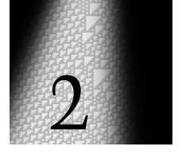
<!-- ORIGINAL_FIGURES page=0039 end -->

# 关键实验

## 简单程序如何行为？

科学中的新方向，通常由某些核心观察或实验开启。而对于我在本书中描述的这种科学来说，这些观察和实验所涉及的是简单程序的行为。

在我们关于计算机的日常经验中，遇到的程序通常被设置来执行非常确定的任务。但将近二十年前我产生了一个关键想法，后来它最终导向了本书中的整个新科学：如果人们不去看那些为了特定任务而写成的程序，而是去看一些简单的、任意选择的程序，它们并没有任何特定任务，那么会发生什么？这类程序通常会怎样行为？

过去主导理论科学的数学方法，对这样的问题帮助不大。但有了计算机，就可以直接开始做实验来研究它。因为人们所需要做的，只是列出一系列可能的简单程序，然后运行它们，看看它们怎样行为。

在某个层面上，任何程序都可以被看作由一组规则组成，这些规则规定它在每一步应当做什么。设置这些规则有许多可能方式；事实上，在本书过程中我们会研究其中不少方式。但现在，我先考虑一类叫作元胞自动机的例子。它们是我在 1980 年代早期最先研究的简单程序类型。

---

[[PDF page 40]]

<!-- ORIGINAL_FIGURES page=0040 start -->
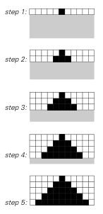
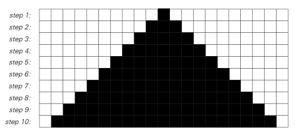
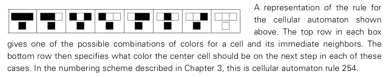
<!-- ORIGINAL_FIGURES page=0040 end -->

元胞自动机的一个重要特点，是它们的行为很容易以视觉方式呈现。因此，下图展示了一个元胞自动机在十步中的行为。

图注：一个元胞自动机行为的视觉表示，其中每一行元胞对应一步。在第一步，中间的元胞为黑色，其他所有元胞为白色。随后在每一步中，只要某个元胞自身或它的任一邻居在前一步为黑色，该元胞就变为黑色。如图所示，这会产生一个简单的扩展图案，图案内部均匀地填满黑色。

这个元胞自动机由一行元胞组成，每个元胞要么是黑色，要么是白色。在每一步，都有一个确定的规则，根据某个元胞及其紧邻的左右两个元胞在前一步的颜色，来决定这个元胞的颜色。

对于这里展示的这个特定元胞自动机，规则规定，如下图所示，只要一个元胞自身或它的任一邻居在前一步为黑色，这个元胞就应当变为黑色。

图注：上方元胞自动机所用规则的表示。每个方框的上排给出一个元胞及其相邻元胞颜色的可能组合之一；下排则规定，在每种情形下，中间元胞在下一步应当是什么颜色。按照第 3 章所描述的编号方案，这是元胞自动机规则 254。

页首图表明，从中间单个黑色元胞开始，这个规则会导向一个简单的增长图案，图案内部均匀地填满黑色。但只要稍微修改规则，就能立刻得到一个不同的图案。

作为第一个例子，对页页首图展示了这样一个规则会发生什么：当前一步两个邻居都是白色时，这个规则会使一个元胞变为白色，即使这个元胞自身前一步是黑色。这样，它不再产生一个均匀填满黑色的图案，而是产生一个像棋盘一样在黑白之间反复交替的图案。

---

[[PDF page 41]]

<!-- ORIGINAL_FIGURES page=0041 start -->
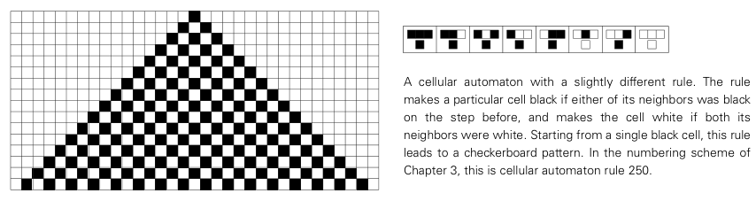
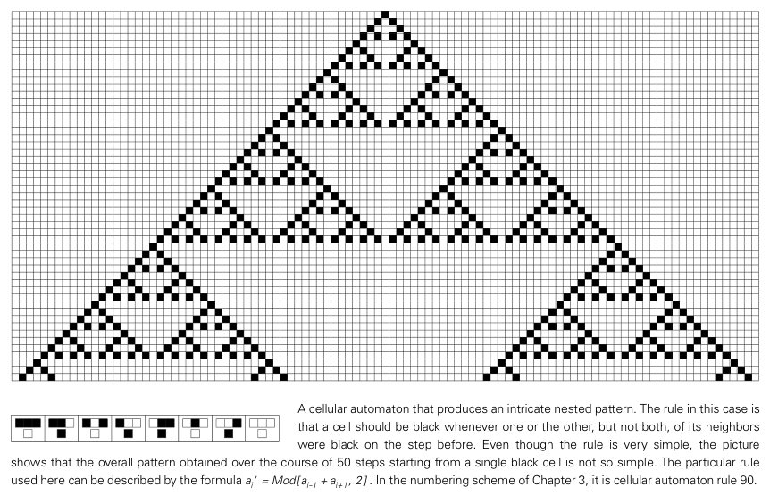
<!-- ORIGINAL_FIGURES page=0041 end -->

图注：规则略有不同的一个元胞自动机。这个规则使某个元胞在它的任一邻居前一步为黑色时变为黑色，而在它的两个邻居都是白色时变为白色。从单个黑色元胞开始，这个规则会导向棋盘图案。按照第 3 章的编号方案，这是元胞自动机规则 250。

不过，这个图案同样相当简单。于是我们也许会以为，至少对于我们正在考虑的这种元胞自动机，无论我们选择什么规则，都会得到相当简单的图案。但现在，我们将迎来第一个惊讶。

下图展示了与前面同一类型的一个元胞自动机产生的图案，只是规则略有不同。

图注：一个产生精细嵌套图案的元胞自动机。在这个例子中，规则是：当前一步两个邻居中恰好有一个为黑色，而不是两个都为黑色时，元胞应当变为黑色。尽管规则非常简单，图中却显示，从单个黑色元胞开始，经过 50 步得到的整体图案并不那么简单。这里所用的特定规则可以用公式 `a_i' = Mod[a_{i-1} + a_{i+1}, 2]` 描述。按照第 3 章的编号方案，它是元胞自动机规则 90。

---

[[PDF page 42]]

<!-- ORIGINAL_FIGURES page=0042 start -->
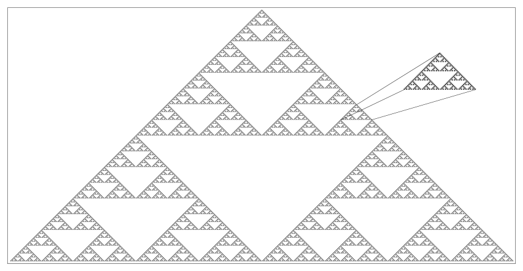
<!-- ORIGINAL_FIGURES page=0042 end -->

这一次，规则规定：当前一步某个元胞的左邻居或右邻居为黑色，但二者不同时为黑色时，这个元胞应当变为黑色。这个规则同样不可否认地相当简单。但现在，图中显示它产生的图案并不那么简单。

而如果像下图那样让这个元胞自动机运行更多步，就会出现一个相当精细的图案。不过现在可以看到，这个图案具有非常确定的规则性。因为尽管它很精细，人们可以看出它实际上由许多嵌套的三角形部分组成，而这些部分都具有完全相同的形式。并且如图所示，每一个这样的部分本质上都只是整个图案的一个较小副本，而其中又以非常规则的方式嵌套着更小的副本。

图注：上一页图案的更大版本，这里不再显式显示每个元胞的网格。图中展示了五百步元胞自动机演化。得到的图案很精细，但具有确定的嵌套结构。事实上，正如图中所示，每个三角形区域本质上都只是整个图案的一个较小副本，而其中又嵌套着更小副本。具有这种嵌套结构的图案常被称为“分形”或“自相似”图案。

因此，在我们到目前为止看到的三个元胞自动机中，所有自动机最终都会产生高度规则的图案：第一个是简单的均匀图案，第二个是重复图案，第三个则是精细但仍然嵌套的图案。于是我们也许会以为，至少对于规则像我们一直使用的这些规则一样简单的元胞自动机，

---

[[PDF page 43]]

<!-- ORIGINAL_FIGURES page=0043 start -->
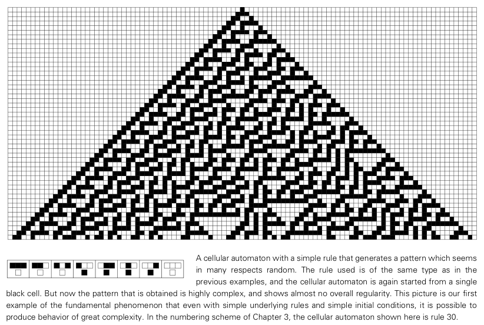
<!-- ORIGINAL_FIGURES page=0043 end -->

这三种行为形式就是我们所能得到的全部。

但非凡的事实是，这一点最终证明是错误的。

下图给出了一个例子。所用规则，我称之为规则 30，与前面的规则属于完全相同的类型，可以描述如下。首先观察每个元胞及其右侧邻居。如果它们二者在前一步都是白色，那么这个元胞的新颜色就取为其左侧邻居在前一步的颜色。否则，就取为相反颜色。

图注：一个具有简单规则、却生成在许多方面看起来随机的图案的元胞自动机。所用规则与前面例子中的规则属于同一类型，元胞自动机也同样从单个黑色元胞开始。但现在得到的图案高度复杂，几乎看不出任何整体规则性。这幅图是一个基本现象的第一个例子：即使底层规则简单、初始条件简单，也可能产生高度复杂的行为。按照第 3 章的编号方案，这里展示的元胞自动机是规则 30。

图中显示了从一个黑色元胞开始，并反复应用这个规则时会发生什么。人们看到的是某种十分惊人的东西，也许是我曾作出的最令人惊讶的单个科学发现。我们本来也许预期会得到简单规则图案，但这个元胞自动机却产生了一个看起来极其不规则、极其复杂的图案。

---

[[PDF page 44]]

但这种复杂性从哪里来？我们在设置系统时，当然没有以任何直接方式把它放进系统里。因为我们只是使用了一个简单的元胞自动机规则，并且只是从包含单个黑色元胞的简单初始条件开始。

然而，图中显示，尽管如此，涌现出来的行为中却有巨大的复杂性。事实上，我们在这里看到的是一个极其一般、极其根本的现象的第一个例子，而这个现象位于我在本书中发展的新科学的最核心。我们会一再看到同类事情：即使一个系统的底层规则很简单，即使这个系统从简单初始条件开始，它所表现出的行为仍然可以高度复杂。我将主张，正是这个基本现象最终负责了我们在自然中看到的大部分复杂性。

接下来的两页展示了前一页规则 30 元胞自动机演化中的更多步骤。人们本来也许会以为，经过也许一千步之后，行为最终会化为某种简单的东西。但接下来两页的图显示，并没有发生任何类似事情。

不过，仍然可以看到一些规则性。例如，在左侧有明显的对角条带。图案中还到处分布着各种白色三角形和其他小结构。然而，考虑到底层规则如此简单，人们会预期看到多得多的规则性。或许有人会想象，我们在接下来两页的图中看不到更多规则性，只是反映了人类视觉系统的某种不足。

但结果表明，即使最精密的数学和统计分析方法似乎也做得并不更好。例如，可以观察初始黑色元胞正下方的颜色序列。在这个序列的前一百万步中，它从不重复；事实上，我曾对它做过的所有检验，都没有显示出任何有意义地偏离完美随机性的地方。

不过，从某种意义上说，这种完美随机性本身也有某种简单性。因为尽管也许无法预测在任何特定步骤会出现什么颜色，

---

[[PDF page 45]]

<!-- ORIGINAL_FIGURES page=0045 start -->
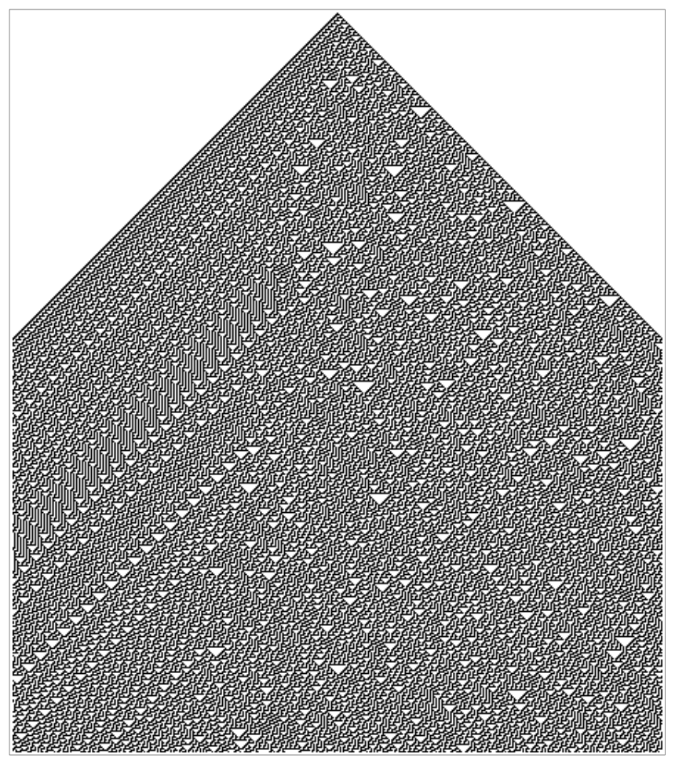
<!-- ORIGINAL_FIGURES page=0045 end -->

图注：第 43 页规则 30 元胞自动机演化的五百步。产生的图案继续向左和向右扩展，但这里仅显示能横跨本页的部分。左右两侧之间的不对称，是所用特定底层元胞自动机规则中存在的不对称性的直接后果。

---

[[PDF page 46]]

<!-- ORIGINAL_FIGURES page=0046 start -->
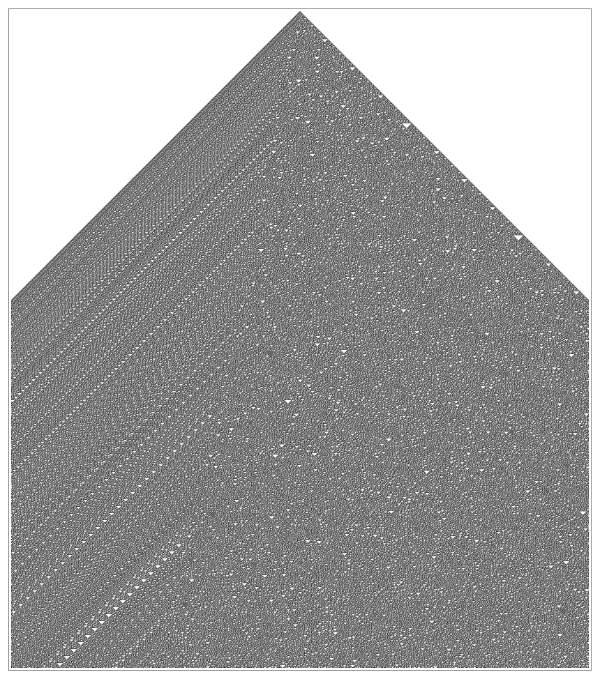
<!-- ORIGINAL_FIGURES page=0046 end -->

图注：规则 30 演化的一千五百步。某些规则性很明显，尤其在左侧。但即使经过所有这些步骤，仍然没有整体规则性的迹象；事实上，即便继续到一百万步，所得图案的许多方面按标准数学和统计检验看来仍然完全随机。这里的图总共显示了将近两百万个独立元胞。

---

[[PDF page 47]]

人们仍然知道，例如黑色和白色平均起来总会同样频繁地出现。

但结果表明，有些元胞自动机的行为实际上还要更复杂；在这些自动机中，甚至这样的平均值也变得非常难以预测。接下来几页的图给出了一个相当戏剧性的例子。规则的基本形式与前面完全相同。但现在所用的具体规则，我称之为规则 110，它规定：除非前一步这个元胞及其两个邻居的颜色全都相同，或者左邻居为黑色而该元胞及其右邻居都为白色，否则这个元胞的新颜色都取为黑色。

用这个规则得到的图案显示出规则性和不规则性的非凡混合。几乎在整个图案中，都有一种非常规则的背景纹理，由每 7 步重复一次的小白三角阵列构成。从靠近左边缘的位置开始，还出现一些对角条纹，它们以恰好 80 步的间隔出现。

但在右侧，图案要不规则得多。事实上，在最初几百步中，有一个看起来本质上随机的区域。但到第一页底部时，这个区域所剩下的只是某个相当简单的重复结构的三个副本。

然而，在下一页顶部，一条来自左侧的对角条纹到达后，又触发了更复杂的行为。随着系统继续推进，各种确定的局部结构被产生出来。

这些结构中有些保持静止，例如第一页底部的那些；另一些则以不同速度稳定地向右或向左移动。单独来看，每个这样的结构都以相当简单的方式运作。但如图所示，它们之间的各种相互作用会产生非常复杂的效果。

结果，哪怕只是近似预测这个元胞自动机会做什么，也变得几乎不可能。

产生出来的所有结构最终会彼此湮灭，只留下非常规则的图案吗？还是会有越来越多结构出现，直到整个图案变得相当随机？

看起来，回答这些问题的唯一可靠方式，就是让元胞自动机运行所需的步数，

---

[[PDF page 48]]

<!-- ORIGINAL_FIGURES page=0048 start -->
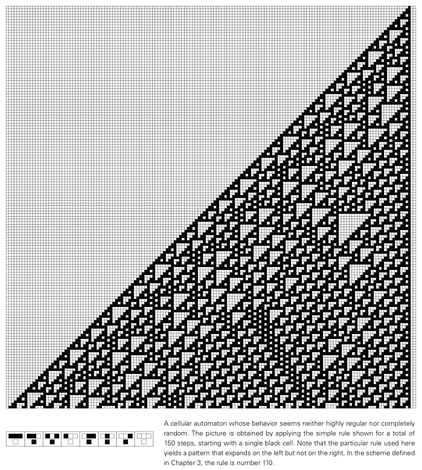
<!-- ORIGINAL_FIGURES page=0048 end -->

并观察会发生什么。而事实证明，在这里展示的特定例子中，大约 2780 步之后结果终于清楚了：一个结构存留下来，并且这个结构与来自左侧的周期性条纹相互作用，产生每 240 步重复一次的行为。

图注：一个行为似乎既不是高度规则也不是完全随机的元胞自动机。图案是从单个黑色元胞开始，应用所示简单规则总共 150 步得到的。注意，这里所用的特定规则会产生一个向左扩展但不向右扩展的图案。在第 3 章定义的方案中，这个规则编号为 110。

图注：上图所示图案的更多步骤。后续每一页总共显示 700 步。图案永远继续向左扩展，但每页只显示能横跨该页的部分。很长时间里，人们并不清楚图案右侧最终会是什么样子。但在 2780 步之后，一个相当简单的重复结构出现。注意，要生成接下来的图，需要对单个元胞应用底层元胞自动机规则总共约 1200 万次。

---

[[PDF page 49]]

<!-- ORIGINAL_FIGURES page=0049 start -->
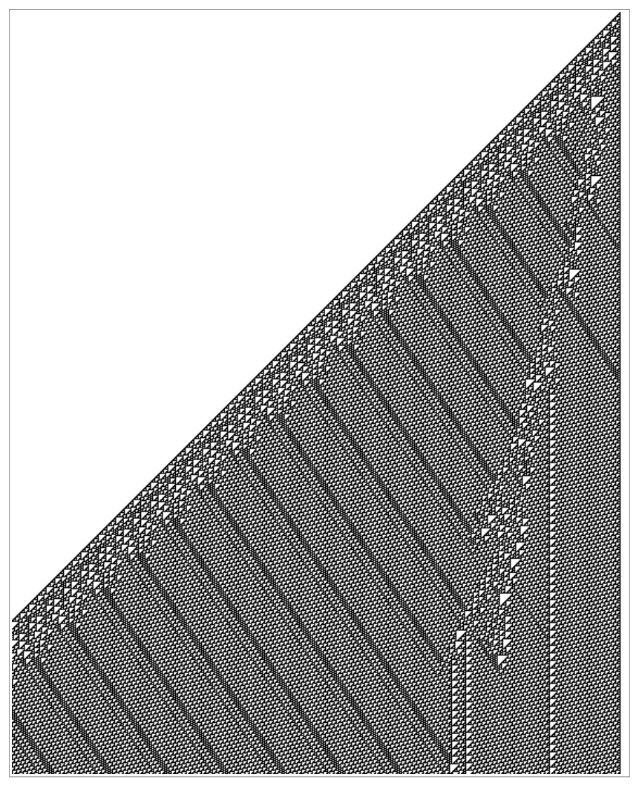
<!-- ORIGINAL_FIGURES page=0049 end -->

图示续：规则 110 元胞自动机演化的连续页面，展示从局部结构相互作用到最终周期行为出现的过程。

[[PDF page 50]]

<!-- ORIGINAL_FIGURES page=0050 start -->
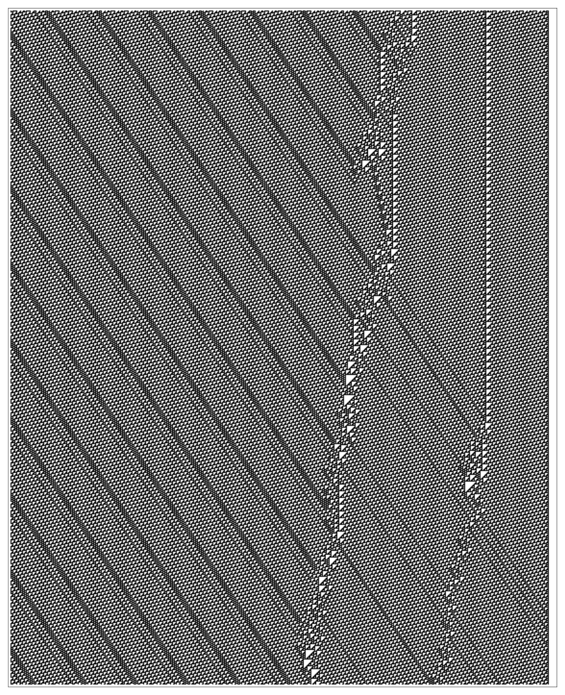
<!-- ORIGINAL_FIGURES page=0050 end -->

[[PDF page 51]]

<!-- ORIGINAL_FIGURES page=0051 start -->
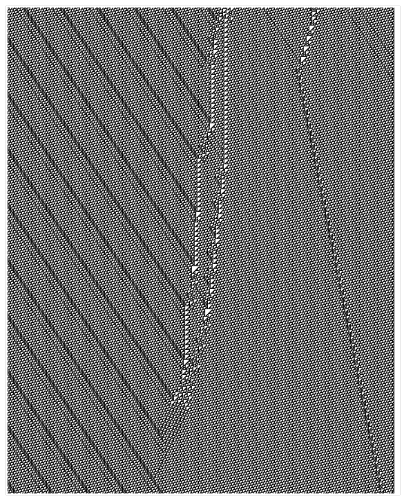
<!-- ORIGINAL_FIGURES page=0051 end -->

[[PDF page 52]]

<!-- ORIGINAL_FIGURES page=0052 start -->
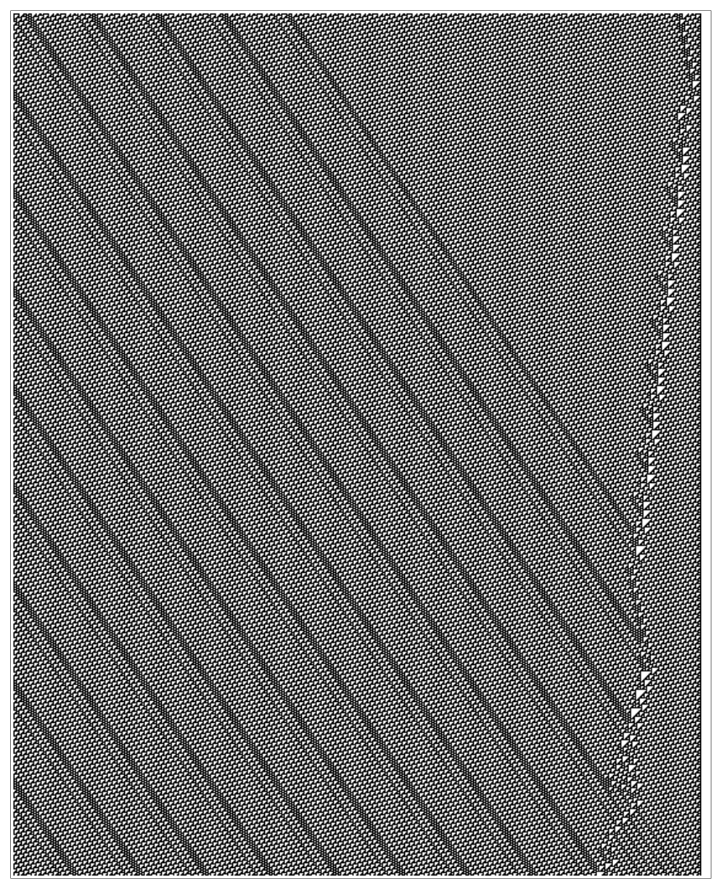
<!-- ORIGINAL_FIGURES page=0052 end -->

[[PDF page 53]]

<!-- ORIGINAL_FIGURES page=0053 start -->
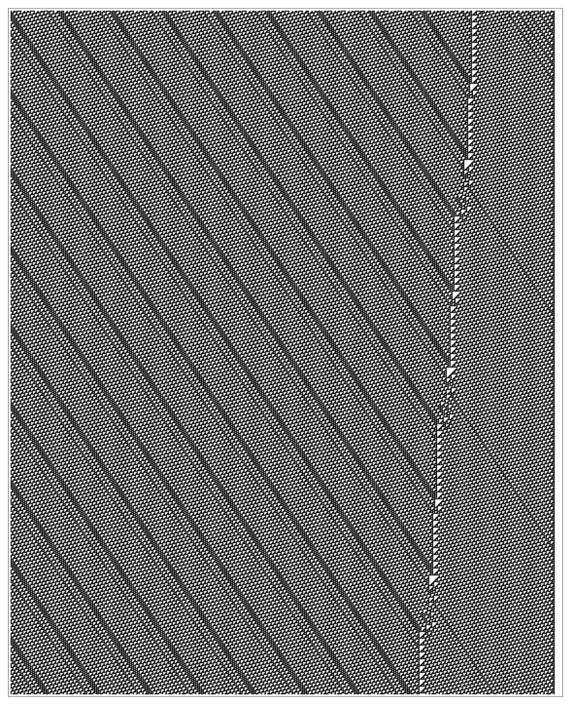
<!-- ORIGINAL_FIGURES page=0053 end -->

[[PDF page 54]]

<!-- ORIGINAL_FIGURES page=0054 start -->
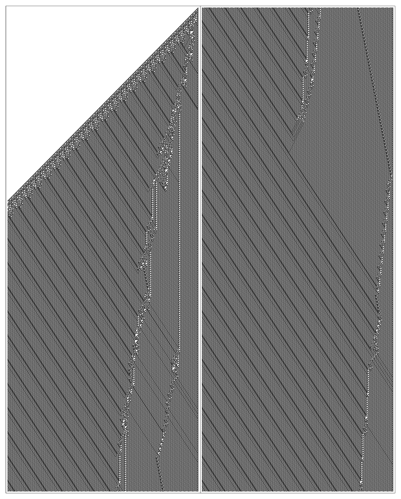
<!-- ORIGINAL_FIGURES page=0054 end -->

---

[[PDF page 55]]

无论一个人曾多么确信简单程序永远只能产生简单行为，过去几页的图都应当永远消除这种观念。事实上，这些图最怪异之处也许正是，它们最终几乎不显示出用来产生它们的底层元胞自动机规则有多么简单。

例如，人们也许会以为，元胞自动机中的所有元胞都遵循完全相同的规则，这会意味着在过去几页那样的图中，所有元胞都会以某种明显方式做同一件事。但相反，它们似乎在做相当不同的事情。例如，有些元胞是规则背景的一部分，而另一些则是某个局部结构的一部分。使这一点成为可能的是，尽管单个元胞遵循同一个规则，不同颜色序列形成的不同元胞构型，却能够一起产生各种不同类型的行为。

仅仅看原始元胞自动机规则，人们没有现实可行的方式预见这一切。但通过做适当的计算机实验，人们很容易发现实际会发生什么，并且实际上开始探索一个与简单程序有关、充满非凡现象的全新世界。

## 对新直觉的需要

上一节中的图清楚显示，只需要非常简单的规则，就能产生高度复杂的行为。然而，一开始这似乎几乎无法相信。因为它违背了我们关于事物通常如何运作的一些最基本直觉。

图注：前五页行为的一张合成图。共显示 3200 步。注意，这比第 43 页图中显示的步数多一倍以上。

---

[[PDF page 56]]

我们的日常经验使我们预期，一个看起来复杂的对象，一定是以复杂方式构造出来的。因此，例如，如果我们看到一个复杂的机械装置，通常会假定建造这个装置所依据的图纸，在某种意义上也必定相应复杂。

但上一节末尾的结果表明，至少有时这种假定可以完全错误。因为我们所看到的图案，实际上是按照非常简单的图纸构造出来的：这些图纸只是告诉我们从单个黑色元胞开始，然后反复应用一个简单的元胞自动机规则。然而，从这些图纸中涌现出来的东西，却显示出巨大的复杂性水平。

那么是什么使我们的通常直觉失效？最重要的一点似乎是，这种直觉主要来自建造事物和做工程的经验；而在这些经验中，碰巧会避免遇到上一节中那些系统。

因为通常我们会从自己想得到的行为出发，然后试图设计一个能产生这种行为的系统。但要可靠地做到这一点，我们必须把自己限制在行为容易理解和预测的系统上；因为除非我们能够预见一个系统会怎样行为，否则就无法确定这个系统会做我们想要它做的事情。

但自然不同于工程，它不受这种约束。因此，没有什么会阻止上一节末尾那样的系统出现。事实上，本书的一个重要结论是，这样的系统在自然中其实非常常见。

可是，因为我们日常中唯一经常同时意识到底层规则和整体行为的情形，是我们建造事物或做工程的情形，所以我们通常根本得不到关于上一节末尾那类系统的任何直觉。

那么，日常经验中有没有任何方面应当给我们一点关于这些系统中现象的提示？最接近的，大概是思考实际计算的一些特征。

因为我们知道计算机可以执行许多复杂任务。然而，在基本硬件层面上，一台典型计算机只能执行几十种简单的逻辑、算术和其他指令。在某种程度上，通过执行大量这样的指令可以得到各种复杂行为，这一点类似于我们在元胞自动机中看到的现象。

---

[[PDF page 57]]

但这里有一个重要区别。计算机执行的单条机器指令可能相当简单，但由程序定义的这类指令序列可能很长、很复杂。事实上，正如在其他工程领域中一样，开发软件时的典型经验是，要让计算机做复杂事情，就需要设置一个本身在某种意义上相应复杂的程序。

在元胞自动机这样的系统中，底层规则可以粗略看作类似于计算机的机器指令，而初始条件可以粗略看作类似于程序。然而，上一节中我们看到的是，在元胞自动机中，不仅底层规则可以简单，初始条件也可以简单，比如只由单个黑色元胞组成，而产生出来的行为仍然可以高度复杂。

因此，实际计算只提示了我们上一节所见现象的一部分；整个现象要大得多，也强得多。并且在某种意义上，它最令人困惑的一面，是它看起来像是从无中得到有。

因为我们设置的元胞自动机，无论按什么标准都很容易描述。然而当我们运行它们时，最终得到的图案复杂到似乎抗拒任何简单描述。

人们也许希望能够借助某种已有直觉来理解这样一个根本现象。但事实上，日常经验中似乎没有任何分支能提供所需的东西。因此，我们别无选择，只能努力发展一种全新的直觉。

做到这一点唯一合理的方式，是让自己接触大量例子。到目前为止，我们只看到了少数例子，而且都在元胞自动机中。但在接下来的几章中，我们会看到更多例子，既包括元胞自动机中的例子，也包括各种其他系统中的例子。通过吸收这些例子，人们最终能够发展出一种直觉，使我所发现的基本现象在某种意义上显得几乎显然且不可避免。

---

[[PDF page 58]]

## 为什么这些发现以前没有被作出

本章的主要结果，也就是基于简单规则的程序能够产生高度复杂的行为，似乎如此根本，以至于人们也许会以为它一定早就被发现了。但事实并非如此；理解它为什么没有被发现，是有用的。

在科学史上，新技术最终使基础科学的新领域发展起来，这是相当常见的。例如，望远镜技术导向了现代天文学，显微镜技术导向了现代生物学。而现在，以几乎同样的方式，正是计算机技术导向了我在本书中描述的新科学。

事实上，本章以及后面几章中的若干章，在某种意义上可以看作对一些可以用计算机完成的最简单实验的叙述。但为什么这样简单的实验以前从未被做过？

一个原因只是，它们并不处在任何既有科学或数学领域的主流中。但一个更重要的原因是，传统科学中的标准直觉没有给出任何理由，使人认为它们的结果会有趣。

事实上，如果人们知道这些实验值得做，那么其中许多实验甚至可以在计算机出现很久以前就完成。因为虽然这也许有些乏味，但完全可以手工推算像元胞自动机这样的东西的行为。事实上，要做到这一点绝不需要来自数学或其他地方的任何复杂思想；所需要的只是理解如何反复应用简单规则。

观察对页上的装饰艺术历史例子，似乎没有什么理由认为，许多元胞自动机的行为不可能在许多世纪甚至许多千年前就被推算出来。也许有一天，人们会挖掘出一件使用第 43 页规则 30 元胞自动机创作的巴比伦文物。但我对此非常怀疑。因为我倾向于认为，如果第 43 页那样的图案确实曾在古代被看到，那么科学就会被引向一条与它实际所走路径非常不同的道路。

---

[[PDF page 59]]

<!-- ORIGINAL_FIGURES page=0059 start -->
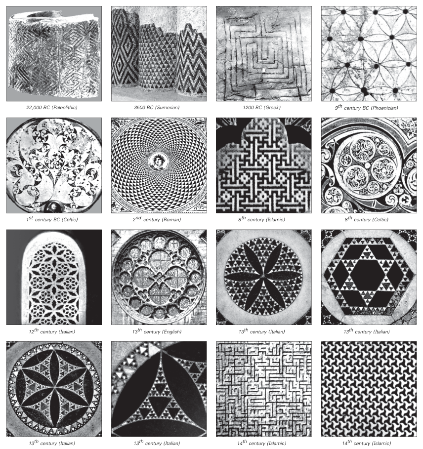
<!-- ORIGINAL_FIGURES page=0059 end -->

图注：装饰艺术的历史例子。重复图案很常见，也可以看到一些嵌套图案，但本章讨论的更复杂图案似乎从未被使用过。注意，倒数第二幅图并不是抽象设计，而是以一种高度风格化的阿拉伯文字形式写成的文本。

---

[[PDF page 60]]

即使在古代早期，人们大概也曾尝试看看简单抽象规则是否能够复现自然系统的行为。但就我们所能判断的，尝试过的规则类型只有那些与标准几何和算术有关的规则。使用这些规则，只能得到相当简单的行为，足以解释天文学中观察到的一些规则性，但无法捕捉自然中其他许多地方所见的东西。

也许正因为如此，人们通常逐渐假定，自然世界的许多方面根本超出人类理解能力。但最终，1600 年代末基于微积分取得的成功开始推翻这种信念。因为有了微积分，人们终于真正成功地把人类思维创造出的抽象规则用于复现自然世界中的各种现象。

不过，被发现有效的那些特定规则，是基于特定类型数学方程的相当复杂的规则。看到这些规则的复杂性之后，人们开始形成一种隐含信念：几乎在任何重要情形中，更简单的规则都不会有助于复现自然系统的行为。

在 1700 年代和 1800 年代，用基于数学方程的规则分析物理现象取得了越来越多成功。到 1900 年代早期，数学方程在物理学中取得壮观成果之后，几乎普遍出现了一种信念：自然世界的绝对每一个方面，最终都会用这样的方程来解释。

不用说，有许多现象并不容易屈服于这种方法，但人们通常假定，只要必要的计算能够完成，那么最终就会找到用数学方程来表达的解释。

从 1940 年代开始，电子计算机的发展极大扩展了可完成计算的范围。但令人失望的是，实际尝试的大多数计算并没有产生根本的新洞见。因此，许多人开始相信，有些人直到今天仍然相信，计算机永远不可能对基础科学问题作出真正贡献。

---

[[PDF page 61]]

但人们错过的关键点是，计算机并不仅限于推演数学方程的后果。事实上，我们在本章中看到的是，如果直接研究甚至某些最简单计算机程序的行为，就能够作出根本发现。

回头看，简单程序作为自然系统模型的思想没有在计算早期浮现，也许有些讽刺。因为像元胞自动机这样的系统，在早期计算机上会比数学方程容易处理得多。问题在于，计算机时间是一种昂贵资源，因此人们认为不值得冒险尝试那些并非成熟数学模型的东西。

不过，到 1970 年代末，情况已经改变，大量计算机时间变得容易获得。正是这一点使我在 1981 年能够开始关于元胞自动机的实验。

如我上面提到的，原则上并没有什么要求必须用计算机来研究元胞自动机。但从实践上说，很难想象现代会有人有耐心手工生成许多元胞自动机图像。因为手工制作第 43 页的图大约需要一个小时，而制作第 42 页的图则需要几周。

然而，即使用早期大型机，这些图的数据也分别可以在几秒钟和几分钟内生成。关键在于，仅仅看一两幅图，一个人非常不可能发现本章讨论的这类根本现象。事实上，对我而言，要做到这一点确实需要对相当数量不同的元胞自动机进行颇大规模的计算机实验。

如果一个人已经对某个特定现象的基本特征有了清楚想法，那么往往可以通过相当具体的实验得到更多细节。但以我的经验，发现那些自己并不知道已经存在的现象，唯一方式是做非常系统、非常一般的实验，然后尽可能少带先入之见地观察结果。虽然只需相当基本的计算机技术就能制作单张元胞自动机图片，

---

[[PDF page 62]]

但要做大规模系统实验，则需要多得多的技术。

事实上，我关于元胞自动机的许多发现，都是使用逐渐更好的计算机技术的直接后果。

举一个例子，当我第一次在高分辨率图形显示器上同时观察大量不同元胞自动机时，我发现了第 6 章开头所描述的、具有随机初始条件的元胞自动机分类方案。类似地，当我正在为一台早期并行处理计算机设置大型模拟时，我发现了规则 30 的随机性（第 43 页）。而在更近一些的年份里，由于能够在 Mathematica 中轻松设置大量计算机实验，我发现了范围巨大的新现象。

因此，毫无疑问，我在本章中描述的发现没有在 1980 年代以前被作出的一个主要原因，只是当时还不存在足够强大的计算机技术，可以完成所需的探索性实验。

但除了实际执行这类实验以外，还必须首先产生这样的想法：这些实验也许值得做。而在这里，计算机技术再次发挥了关键作用。因为正是通过使用计算机的实践经验，我发展出了许多必要直觉。

举一个简单例子，人们也许会想象，像元胞自动机这样的系统由离散元胞构成，因此永远无法复现真实的自然形状。但了解计算机显示器后就清楚，情况并非如此。因为计算机显示器和元胞自动机一样，由规则排列的离散元胞或像素组成。然而实际经验表明，即使像素数量相当少，这样的显示器也能产生相当逼真的图像。

再举一个更重要的例子，人们也许会想象，元胞自动机程序的简单结构会使人很容易预见它们的行为。但从实际计算经验可知，预见即使一个简单程序会做什么通常也非常困难。事实上，这正是程序中错误如此常见的原因。因为如果人们只要看一眼程序就能立刻知道它会做什么，

---

[[PDF page 63]]

那么检查程序不包含任何错误就会是一件容易的事。

像查找程序错误的困难这类观念，与科学中的传统思想没有显然联系。也许正因为如此，即使计算机已经使用了几十年，来自实际计算的这类直觉本质上也没有进入基础科学。但在 1981 年，碰巧我多年来同时深度参与实际计算和基础科学，因此几乎处在一个独特位置，能够把源自实际计算的思想应用到基础科学中。

然而，即便如此，我关于元胞自动机的发现仍然包含相当大的运气成分。因为正如我在第 19 页提到的，我最初的元胞自动机实验只显示出非常简单的行为；只是因为继续做进一步实验对我来说在技术上非常容易，我才坚持了下去。

并且，即使我已经在元胞自动机中看到复杂性的最初迹象，仍然又过了几年，我才发现本章给出的全部例子范围，并认识到复杂性能够如此容易地在元胞自动机这样的系统中生成。

造成这件事花了这么久的部分原因，是它涉及使用越来越复杂的计算机技术来做实验。但更重要的原因是，它需要发展出新的直觉。而几乎在每一个阶段，来自传统科学的直觉都把我带向错误方向。但我发现，来自实际计算的直觉表现得更好。尽管它有时也会误导，但最终它在把我引到正确道路上相当重要。

因此，为什么本章结果很难在计算机技术达到 1980 年代那种水平之前很久就被发现，有两个相当不同的原因。第一，必要的计算机实验无法足够容易地完成，因此不太可能有人尝试。第二，如果没有广泛接触实际计算，关于计算的必要直觉也不容易发展出来。

---

[[PDF page 64]]

但现在，本章结果已经为人所知，人们可以回头看到，过去有相当多次它们至少有些接近被发现。

事实证明，二维版本的元胞自动机早在 1950 年代早期就已经被考虑过，作为生物系统的可能理想化模型。但直到我在 1980 年代的工作以前，人们实际进行的元胞自动机研究，主要是构造相当复杂的规则集合，并证明它们会导向某些特定类型的相当简单行为。

元胞自动机中是否可能出现复杂行为，这个问题偶尔被提出过；但基于工程直觉，人们通常假定，要得到任何实质复杂性，就必须拥有非常复杂的底层规则。结果，研究具有简单规则的元胞自动机这一想法从未浮现，于是也从未有人做过类似本章所描述的实验。

不过，在其他领域中，人们相当经常地研究了实际上基于简单规则的系统，并且有时确实看到了复杂行为。但由于没有一个框架来理解其意义，这类行为往往要么被完全忽视，要么被当作某种没有特别根本意义的奇闻。

事实上，甚至在传统数学史的非常早期，就已经出现了复杂性这一基本现象的迹象。一个已知超过两千年的例子涉及素数的分布（见第 132 页）。生成素数的规则很简单，但它们的分布在许多方面看起来随机。但几乎无一例外，关于素数的数学工作并没有集中于这种随机性，而是集中于证明分布中各种规则性的存在。

复杂性现象的另一个早期迹象，本可以在像 `π = 3.141592653...` 这样的数字序列中看到（见第 136 页）。到 1700 年代，人们已经计算出 π 的一百多位数字，而这些数字看起来相当随机。但这一事实本质上被当作奇闻处理，似乎从未出现过这样的想法：

---

[[PDF page 65]]

可能存在一种一般现象，使得像计算 π 的规则这样简单的规则能够产生复杂结果。

在 1900 年代早期，数学的若干领域中构造出了各种明确例子，其中简单规则被反复应用于数字、序列或几何图案。有时人们看到了嵌套或分形行为。少数情形中，人们也看到了实质上更复杂的行为。但这种行为的复杂性通常被认为恰恰说明它不可能与真正的数学工作有关，而只可能具有娱乐性兴趣。

当电子计算机在 1940 年代开始被使用时，人们有了更多机会看到复杂性现象。事实上，回头看，显著复杂性很可能确实出现在许多科学计算中。但这些计算几乎总是基于传统数学模型，而由于此前对这些模型的分析没有揭示复杂性，人们往往假定计算机计算中的任何复杂性都只是所用近似造成的虚假后果。

有一类系统在 1950 年代被注意到某些复杂性类型，它们被称为迭代映射。但正如我将在第 149 页讨论的，用来分析这类系统的传统数学最终只集中于某些特定特征，而完全错过了本章所发现的主要现象。

在实际计算中，产生看起来随机的数列常常很有用。从 1940 年代开始，人们发明了若干生成这类序列的简单过程。但也许因为这些过程总是显得相当临时拼凑，人们没有从中得出关于随机性和复杂性的一般结论。

沿着类似路线，在 1950 年代末，人们为生成密码学中使用的随机序列，研究过与本章讨论的元胞自动机并不相差很远的系统。所得到的几乎所有结果至今仍属军事机密，但我不认为其中发现了像本章描述的那类现象。

一般说来，在主流科学语境内，已经发展出的标准直觉使任何人都很难想象，研究本章讨论的那种非常简单的计算机程序的行为会值得做。

---

[[PDF page 66]]

但在主流科学之外，确实有人沿着这样的方向做过一些工作。例如，在 1960 年代，早期计算机爱好者尝试运行各种简单程序，并发现某些情况下这些程序能够成功产生嵌套图案。

随后，在 1970 年代早期，人们对一种特定二维元胞自动机产生了相当大的娱乐性计算兴趣，这个元胞自动机被称为生命游戏，其行为在某些方面类似于本章讨论的规则 110 元胞自动机。人们花了很大努力，试图寻找足够简单、足够可预测的结构，以便把它们用作工程中的理想化组成部分。尽管复杂行为被看到了，但它通常被当作一种麻烦，能避免时就尽量避免。

从某种意义上说，人们能够围绕生命游戏做这么多工作，却从未研究本章中简单得多的一维元胞自动机，这相当令人惊讶。毫无疑问，缺少与基础科学的联系至少负有部分责任。

但无论原因是什么，事实仍然是，尽管几个世纪以来曾有许多线索，我在本章中描述的基本现象以前从未被发现。

在科学史上，一旦一个一般的新现象被识别出来，人们常常可以看到早得多的时候已经存在关于它的证据。但关键在于，如果没有来自已知一般现象的框架，这类证据几乎不可避免地会被忽略。

科学进步还有一个讽刺之处：某些结果在某个时期如此出乎意料，以至于尽管有许多线索仍然被错过，后来却最终变得几乎显而易见。与本章结果相处将近二十年后，我现在很难想象事情还有可能以任何其他方式运作。但我在本节概述的历史，正如许多其他科学发现的历史一样，给人一个令人清醒的提醒：错过后来显得显然的东西，是多么容易。
