# 第 3 章：简单程序的世界

[[PDF page 67]]

<!-- ORIGINAL_FIGURES page=0067 start -->
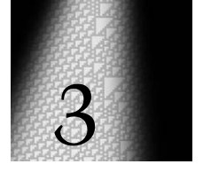
<!-- ORIGINAL_FIGURES page=0067 end -->

# 简单程序的世界

## 寻找一般特征

上一章开头，我们提出了一个基本问题：简单程序通常会做什么？作为回答这个问题的第一步，我们考察了一类叫作元胞自动机的程序中的若干具体例子。

我们发现的基本行为类型，在下一页的图中有所展示。第一幅图中是纯粹重复，形成的是一个非常简单的图案。第二幅图中有许多精细细节，但从整体层面看，涌现出来的仍然是一种非常规则的嵌套结构。

然而在第三幅图中，人们不再看到这种规则性，而是看到在许多方面显得随机的行为。最后，在第四幅图中，出现的似乎是更加复杂的行为：精细的局部结构被生成出来，并以复杂方式相互作用。

一开始，没有任何迹象表明简单程序竟然能够产生如此多样而且往往复杂的行为。但现在看过这些例子之后，问题就变成：它们有多典型？是不是只有具有非常特定底层规则的元胞自动机才会产生这类行为？还是说，这种行为事实上在各种简单程序中都很常见？

本章的目的，是通过考察范围广泛的不同程序类型来回答这个问题。从某种意义上说，我的方法像一个博物学家：探索和研究简单程序世界中存在的各种形式。

---

[[PDF page 68]]

<!-- ORIGINAL_FIGURES page=0068 start -->
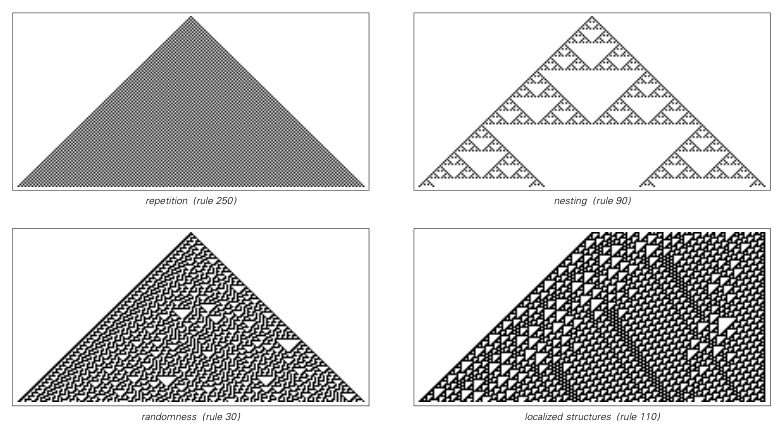
<!-- ORIGINAL_FIGURES page=0068 end -->

图注：上一章中由具有简单底层规则的元胞自动机产生的四个基本行为例子：重复（规则 250）、嵌套（规则 90）、随机性（规则 30）和局部结构（规则 110）。每个例子中，最明显可见的特征都不同。注意，所有图都以相同比例显示；最后一幅图看起来较粗，是因为其中包含的结构更大。

我先考虑更一般的元胞自动机，然后继续考虑一整串其他类型的程序；它们的底层结构会越来越远离上一章元胞自动机中黑白元胞阵列的形式。

而我发现的是，无论使用哪一种底层规则，涌现出来的行为最终都与我们已经在元胞自动机中看到的基本例子惊人地相似。

在整个简单程序世界中，可以产生的整体行为类型似乎具有很强的通用性。从某种意义上说，正是这一点最终使我能够构造出本书所描述的连贯的新科学，并用它阐明大量现象，而不依赖这些现象所在系统的具体细节。

---

[[PDF page 69]]

<!-- ORIGINAL_FIGURES page=0069 start -->
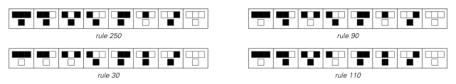
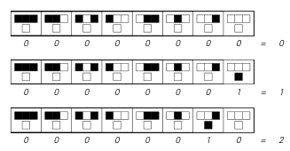
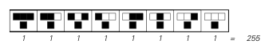
<!-- ORIGINAL_FIGURES page=0069 end -->

## 更多元胞自动机

下图展示了对页四个元胞自动机所使用的规则。这些规则的整体结构在每个例子中都相同；不同的是，对于一个元胞及其两个邻居此前颜色的每一种可能组合，新颜色的具体选择不同。

图注：对页四个元胞自动机例子所用的规则。在每种情形下，规则都指定了当前一步一个元胞及其紧邻邻居颜色的每种可能组合，下一步这个元胞的新颜色是什么。这些规则按照下面描述的方案编号。

结果表明，总共有 256 种可能的选择集合。按照我最初关于元胞自动机的工作，这些选择可以像下图那样从 0 编到 255。

图注：上方所示类型的 256 种可能元胞自动机规则序列。如图所示，这些规则可以方便地从 0 编到 255。所赋予的编号在写成二进制时，给出一串 0 和 1，对应于该规则覆盖的八种可能情形中所选择的新颜色序列。

那么，具有所有这些不同规则的元胞自动机会怎样行为？下一页展示了若干详细例子，随后两页展示所有 256 种可能情形中会发生什么。

起初，人们看到的多样性有点令人应接不暇。但更仔细考察之后，一些明确主题开始显现出来。

在最简单的情形中，元胞自动机中的所有元胞在一步之后最终都具有相同颜色。例如，

---

[[PDF page 70]]

<!-- ORIGINAL_FIGURES page=0070 start -->
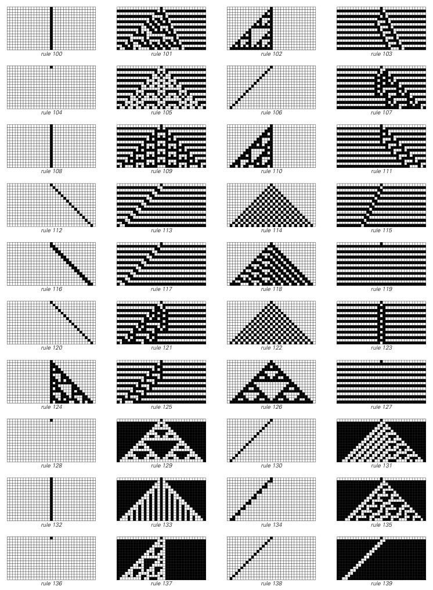
<!-- ORIGINAL_FIGURES page=0070 end -->

图注：从单个黑色元胞开始，具有一系列不同可能规则的元胞自动机的演化示例。

---

[[PDF page 71]]

<!-- ORIGINAL_FIGURES page=0071 start -->
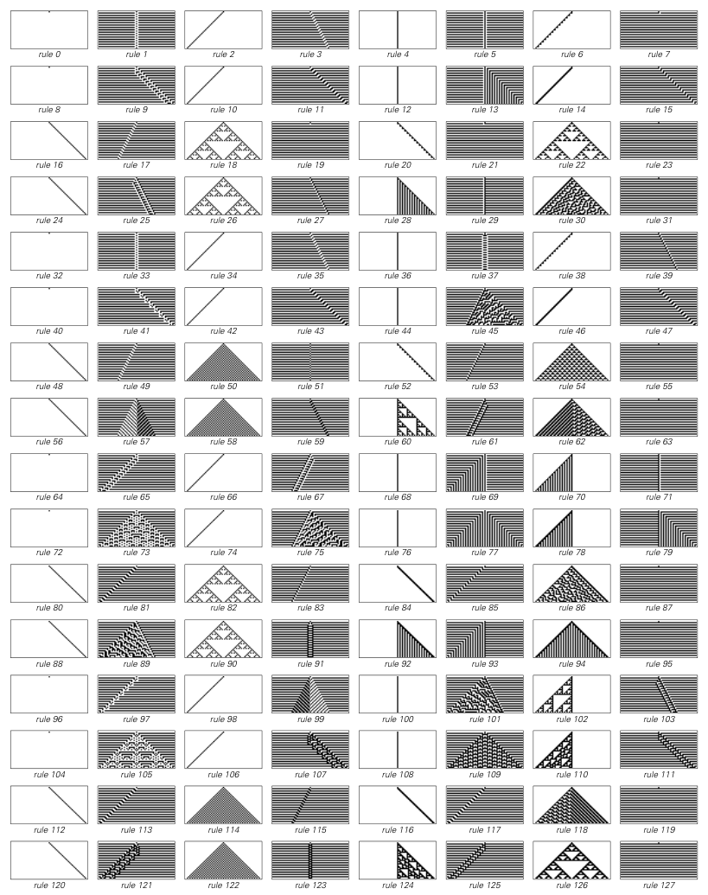
<!-- ORIGINAL_FIGURES page=0071 end -->

图示续：规则 0 到规则 127 的初等元胞自动机行为，每个例子从单个黑色元胞开始。

---

[[PDF page 72]]

<!-- ORIGINAL_FIGURES page=0072 start -->
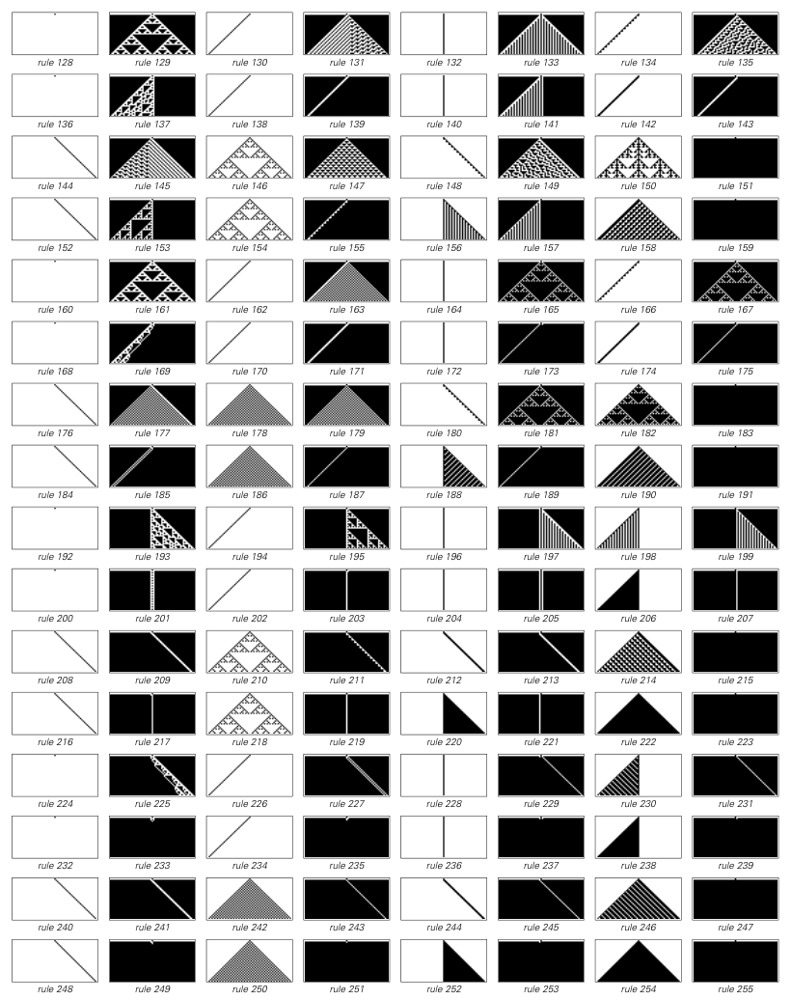
<!-- ORIGINAL_FIGURES page=0072 end -->

图示续：规则 128 到规则 255 的初等元胞自动机行为，每个例子从单个黑色元胞开始。

---

[[PDF page 73]]

在规则 0 和规则 128 中，所有元胞都变成白色；而在规则 255 中，它们全都变成黑色。还有一些规则，例如规则 7 和规则 127，在其中所有元胞会在连续步骤中在黑白之间交替。

但在过去几页展示的规则中，最常见的单一行为类型，是由单个元胞或一小组元胞组成的图案持续存在。有时这个图案保持静止，如规则 4 和规则 123；但在其他情形中，例如规则 2 和规则 103，它会向左或向右移动。

结果表明，这里讨论的元胞自动机的基本结构意味着，任何这种运动的最大速度必定是每步一个元胞。而在许多规则中，这个最大速度确实达到，尽管在规则 3 和规则 103 等规则中，平均速度只有每步半个元胞。

在过去几页展示的所有元胞自动机中，大约三分之二产生的图案保持固定大小。但在大约三分之一情形中，图案会永远增长。在这些增长图案中，最简单的一类是纯粹重复图案，例如规则 50 和规则 109 中所见。但虽然重复图案略微占多数，约 14% 的元胞自动机会产生更复杂的图案。

其中最常见的是嵌套图案，如下一页所示。结果表明，尽管总共有 24 个规则会产生这类嵌套图案，但出现的根本不同形式只有三种。最简单且最常见的形式，以规则 22 和规则 60 为代表。但下一页图像表明，其他嵌套形式也是可能的。（在规则 225 的情形中，整体图案的宽度并不以固定速率增长，而是平均上与步数的平方根成比例。）

图注：所有 256 种可能元胞自动机的行为，这些自动机具有两种颜色并只涉及最近邻元胞。每个例子中，从单个黑色元胞开始，显示三十步演化。注意，有些规则只是通过左右互换或黑白互换彼此相关（例如规则 2 和 16，或规则 126 和 129）。这类初等规则中有 88 个根本不等价的规则。

---

[[PDF page 74]]

<!-- ORIGINAL_FIGURES page=0074 start -->
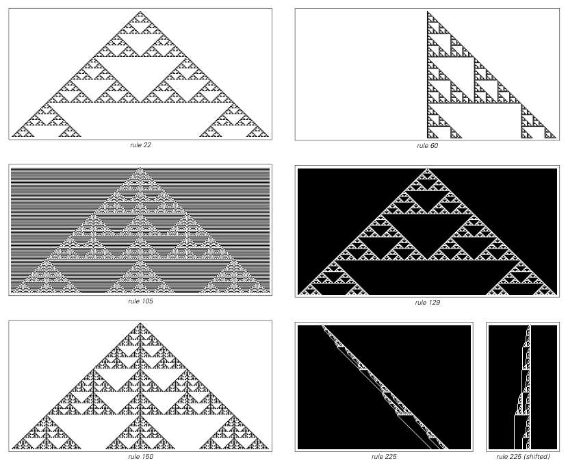
<!-- ORIGINAL_FIGURES page=0074 end -->

图注：产生嵌套或分形图案的元胞自动机例子。规则 22 与第 41 页的规则 90 类似，会产生分形维数 `Log[2,3] ≈ 1.59` 的图案；规则 150 会产生分形维数 `Log[2,1 + sqrt(5)] ≈ 1.69` 的图案。从规则 225 得到的图案，其宽度随步数的平方根增长。

重复和嵌套，是许多元胞自动机中广泛存在的主题。但正如我们在上一章看到的，元胞自动机也可能产生在许多方面显得随机的图案。在这里讨论的 256 个规则中，结果表明有 10 个规则会产生这种表观随机性。它们有三种基本形式，如对页所示。

图注：产生具有许多表观随机特征的图案的元胞自动机例子。每个例子都从单个黑色元胞开始，显示三百步演化。

---

[[PDF page 75]]

<!-- ORIGINAL_FIGURES page=0075 start -->
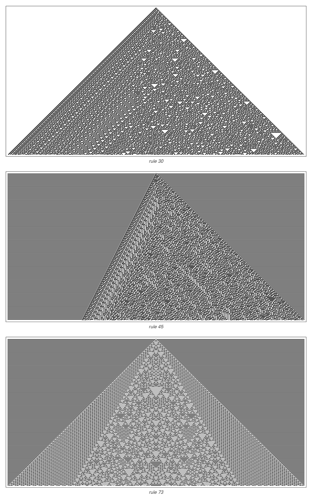
<!-- ORIGINAL_FIGURES page=0075 end -->

图示：规则 30、规则 45 和规则 73 产生的具有表观随机特征的图案。

---

[[PDF page 76]]

<!-- ORIGINAL_FIGURES page=0076 start -->
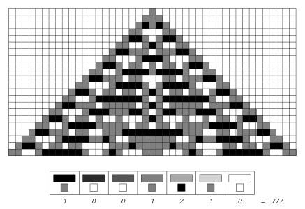
<!-- ORIGINAL_FIGURES page=0076 end -->

除了随机性之外，上一章最后一个例子是规则 110：一个元胞自动机，其行为被分割成规则部分和不规则部分的复杂混合。在这里考虑的 256 个规则中，这个特定元胞自动机本质上是唯一的：出现这类行为的四个情形，只要互换左右或黑白角色，彼此就是等价的。

那么，更复杂的元胞自动机规则又如何？

我们到目前为止讨论的 256 个“初等”规则，按大多数标准都是可能的最简单规则，也是我最先研究的规则。但例如，人们也可以考察涉及三种颜色而不是两种颜色的规则，使元胞不仅可以是黑色和白色，也可以是灰色。这类可能规则的总数极其巨大，总共有 7,625,597,484,987 个；但如果只考虑所谓“总和型”规则，数量就变得容易处理得多。

总和型规则的思想，是让每个元胞的新颜色只依赖相邻元胞颜色的平均值，而不依赖它们各自的颜色。下图展示了这一点如何运作的一个例子。当每个元胞有三种可能颜色时，共有 2187 个可能的总和型规则，每个都可以方便地用图中方式用一个代码编号识别。对页展示了这类规则的一个代表性序列。

图注：一个具有三种可能元胞颜色的总和型元胞自动机例子。规则设置为：每个元胞的新颜色由该元胞及其紧邻邻居此前颜色的平均值决定。用 0 表示白色、1 表示灰色、2 表示黑色时，规则最右侧的元素给出平均颜色为 0 的结果，紧挨它左侧的元素给出平均颜色为 1/3 的结果，依此类推。把新颜色序列解释为三进制数字序列，就可以给每个总和型规则赋予一个代码编号。

人们本来也许会预期，只要允许三种颜色而不是两种颜色，立刻就会得到明显更复杂的行为。

---

[[PDF page 77]]

<!-- ORIGINAL_FIGURES page=0077 start -->
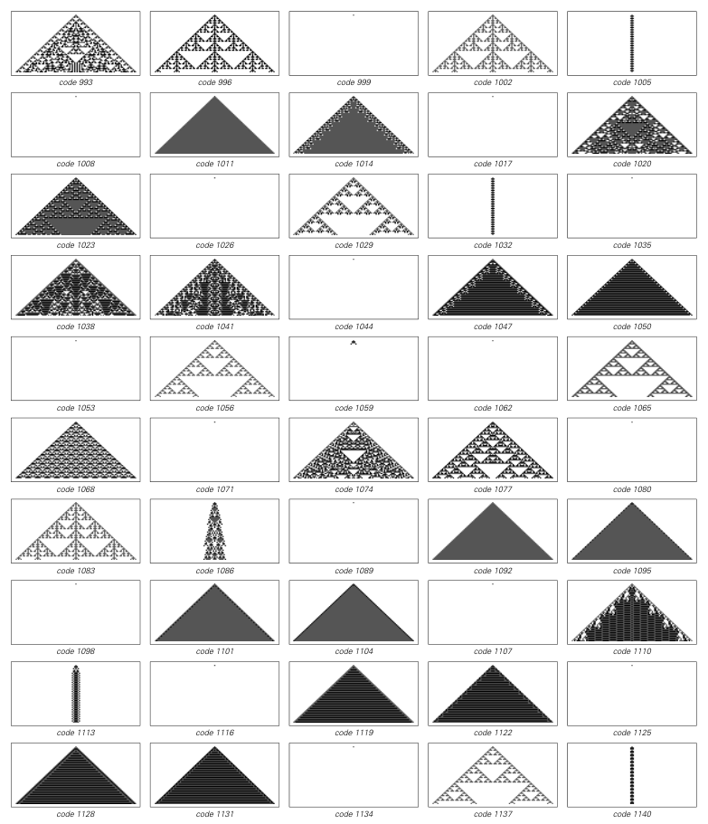
<!-- ORIGINAL_FIGURES page=0077 end -->

图注：一组三色总和型元胞自动机。虽然它们的基本规则更复杂，但这里展示的元胞自动机似乎并没有比前几页的二色元胞自动机具有根本上更复杂的行为。注意，在这里展示的规则序列中，那些会改变白色背景的规则没有包括在内。所有图案的对称性，是总和型规则基本结构的后果。

---

[[PDF page 78]]

<!-- ORIGINAL_FIGURES page=0078 start -->
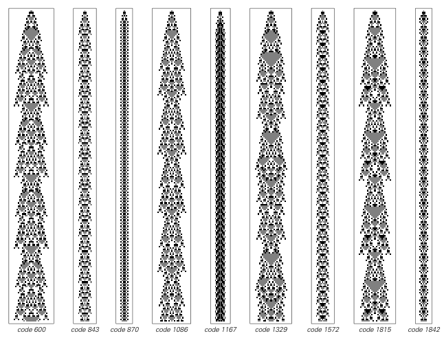
<!-- ORIGINAL_FIGURES page=0078 end -->

但事实上，上一页中看到的行为，与几页前在许多初等元胞自动机中已经看到的行为并无太大不同。看起来，更复杂的底层规则并没有导致整体行为复杂性大幅增加。

事实上，这是一个重要一般现象的第一个迹象：至少超过某个点以后，给一个系统的底层规则增加复杂性，最终并不会导致更复杂的整体行为。因此，例如在元胞自动机的情形中，似乎连最复杂行为所需的全部本质成分，都已经存在于初等规则中。

如果人们想复现某些特定自然系统的细节，使用更复杂的规则也许很方便，但这并不会增加根本上新的特征。事实上，观察上一页的图，人们看到的正是初等元胞自动机中的同样基本主题。有些图案达到确定大小之后永远重复，如下方所示；另一些图案继续增长，但具有重复形式，如对页顶部所示；还有一些图案则产生嵌套或分形图案，如对页底部所示。

图注：若干三色总和型规则的例子，它们产生达到某一大小后永远重复的图案。发现的最大重复周期是 78 步，由代码编号 1329 的规则实现。在这里及随后几页展示的图中，所用初始条件包含单个灰色元胞。

---

[[PDF page 79]]

<!-- ORIGINAL_FIGURES page=0079 start -->
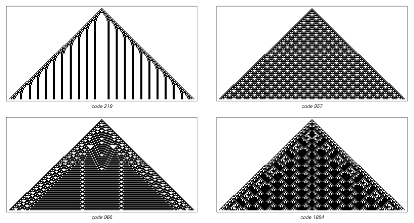
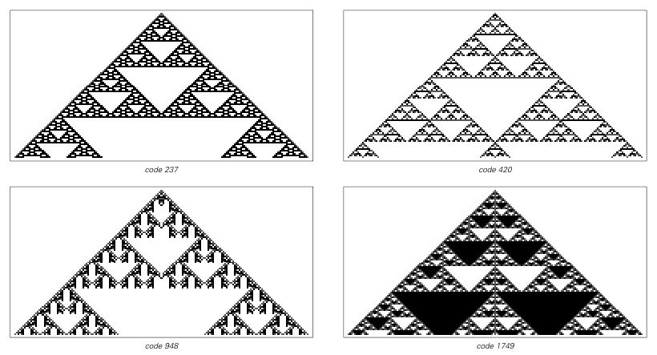
<!-- ORIGINAL_FIGURES page=0079 end -->

图注：产生永远增长、但具有根本重复结构的图案的三色总和型规则例子。

图注：产生嵌套图案的三色总和型规则例子。大多数情形中，这些图案具有的整体形式，与二色规则中发现的类似。但例如代码 420 会产生结构略有不同的图案。

---

[[PDF page 80]]

<!-- ORIGINAL_FIGURES page=0080 start -->
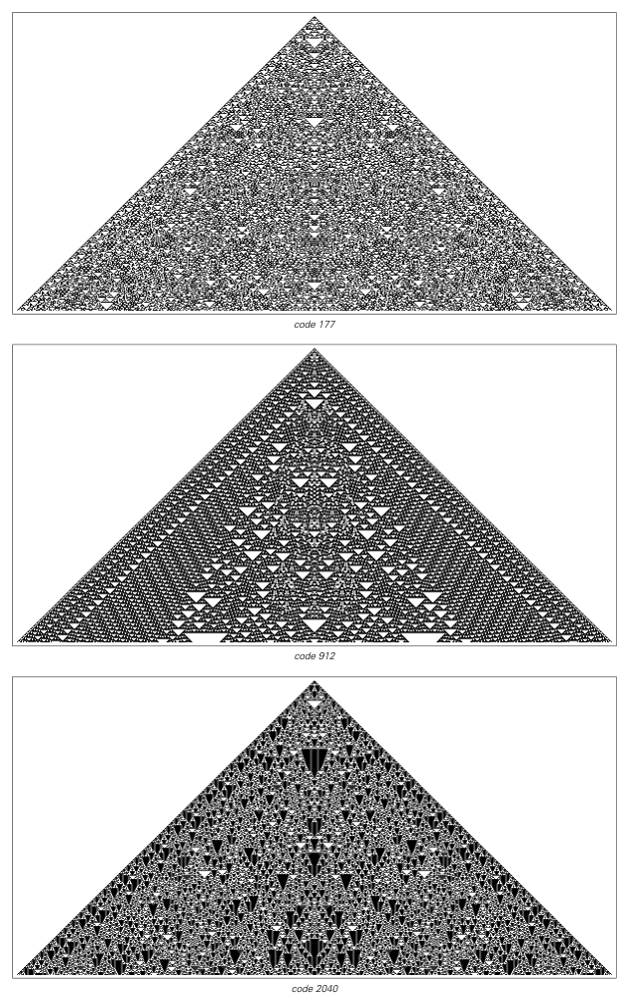
<!-- ORIGINAL_FIGURES page=0080 end -->

图注：产生带有看似随机特征的图案的三色总和型规则例子。每个例子都显示三百步演化。

---

[[PDF page 81]]

在细节上，有些图案确实比初等规则中所见更复杂。但在整体行为层面，并不存在根本差异。而在嵌套图案的情形中，所见的具体结构通常也与初等规则中的相同。因此，例如代码 237 和 948 中的结构最常见，其次是代码 1749 中的结构。唯一一个在初等规则中尚未见过的新结构，是代码 420 中的结构，但它只相当少见地出现。

约 85% 的三色总和型元胞自动机会产生最终相当规则的行为。但正如在初等元胞自动机中一样，也有一些规则会产生在许多方面显得随机的行为。对页给出了几个例子。

除了相当均匀的随机行为之外，还有类似初等规则 110 的情形，其中会产生确定结构，并以复杂方式相互作用。下一页给出几个例子。在展示的第一个情形中，图案在大约 150 步后变得重复。但在另两个情形中，最终会发生什么则远不那么清楚。后续几页把这些图案继续到 3000 步。但即使经过这么多步，最终行为仍然相当不清楚。

观察这样的图，一开始很难相信它们竟然只需遵循非常简单的底层元胞自动机规则就能生成。事实上，即使接受这一点，人们仍然倾向于假定，自己所看到的东西一定以某种方式是元胞自动机某种非常特殊特征的后果。

结果表明，复杂性在元胞自动机中特别普遍；因此，元胞自动机恰好是我最初决定研究的第一类系统，这是一件幸运的事。

但正如我们将在本章剩余部分看到的，上一章中发现的根本现象绝不限于元胞自动机。并且，虽然元胞自动机仍然是某些最好的例子，我们会看到，范围巨大的、完全不同的系统最终都会表现出极其相似的行为类型。

---

[[PDF page 82]]

<!-- ORIGINAL_FIGURES page=0082 start -->
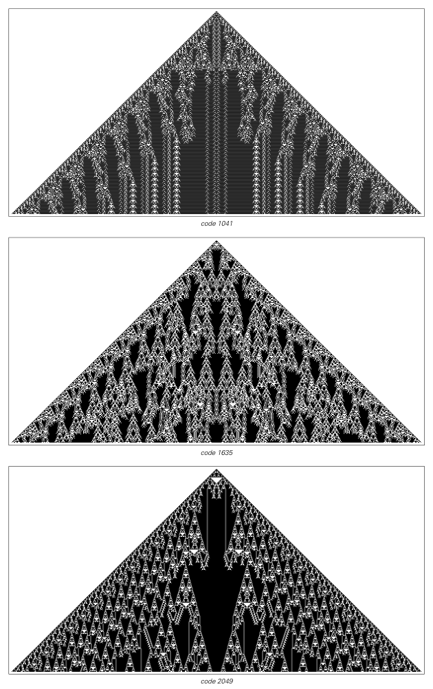
<!-- ORIGINAL_FIGURES page=0082 end -->

图注：具有高度复杂行为的三色总和型规则例子，显示规则性和不规则性的混合。它们被分割成可识别结构的方式，类似于第 47 页规则 110 中所见。

---

[[PDF page 83]]

<!-- ORIGINAL_FIGURES page=0083 start -->
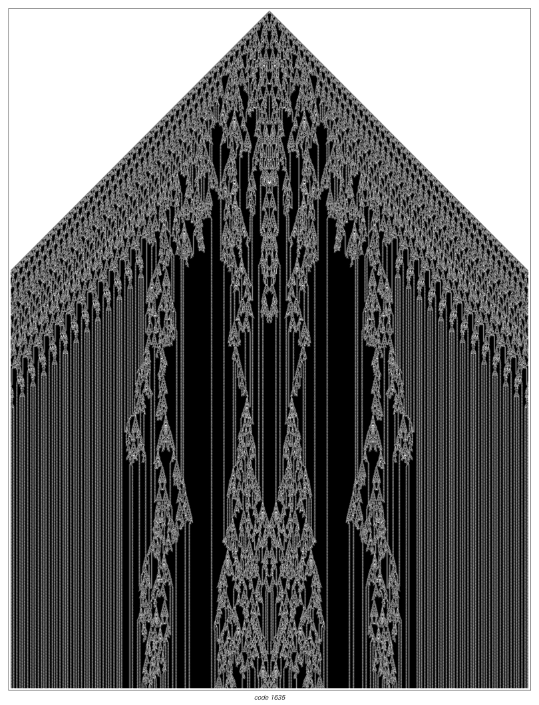
<!-- ORIGINAL_FIGURES page=0083 end -->

图示续：代码 1635 的三色总和型元胞自动机演化。

---

[[PDF page 84]]

<!-- ORIGINAL_FIGURES page=0084 start -->
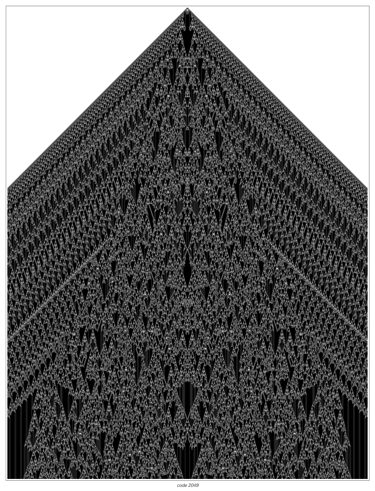
<!-- ORIGINAL_FIGURES page=0084 end -->

图示续：代码 2049 的三色总和型元胞自动机演化。

---

[[PDF page 85]]

<!-- ORIGINAL_FIGURES page=0085 start -->
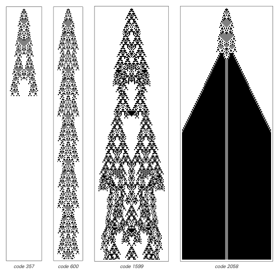
<!-- ORIGINAL_FIGURES page=0085 end -->

下图展示了一些总和型元胞自动机，它们的整体增长图案至少一开始看起来相当复杂。但结果表明，仅经过大约 100 步之后，这四个图案中有三个已经化为简单形式。

图注：产生似乎处在增长与消亡边缘的图案的规则例子。除代码 1599 外，所有图案的命运事实上在不到 100 步后就变得清楚。这里总共显示 250 步。

剩下的一个图案则复杂得多。如下一页所示，在几千步中它只是增长，尽管有些不规则。但随后它的增长变慢。图案内部的一些部分开始消亡。然而，仍然不断有偶发的增长爆发。最终，在总共 8282 步之后，图案化为 31 个简单的重复结构。

图注：第 81 页最后两个元胞自动机演化的三千步。尽管它们的底层规则简单，最终产生的图案仍显示出巨大复杂性。在两个例子中，都不清楚最终结果会是什么：是表观随机性占据主导，还是会出现简单重复形式。

---

[[PDF page 86]]

<!-- ORIGINAL_FIGURES page=0086 start -->
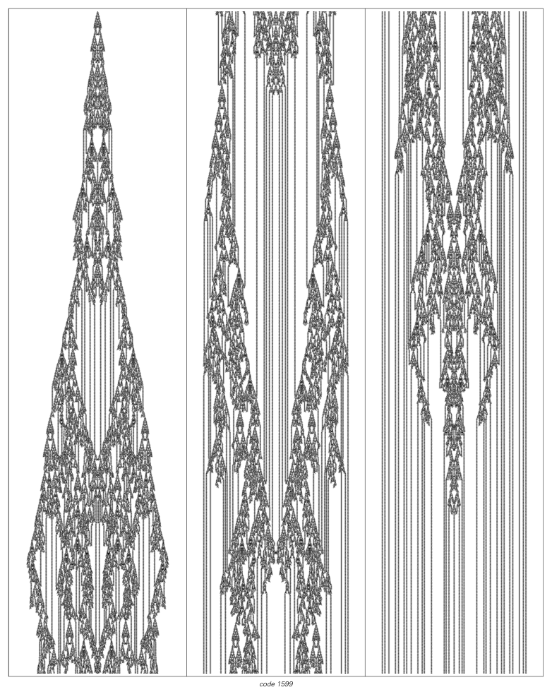
<!-- ORIGINAL_FIGURES page=0086 end -->

图注：代码编号 1599 的三色总和型元胞自动机演化九千步。从单个灰色元胞开始，每一列对应 3000 步。演化结果最终在 8282 步后变得清楚，那时图案化为 31 个简单重复结构。

---

[[PDF page 87]]

<!-- ORIGINAL_FIGURES page=0087 start -->
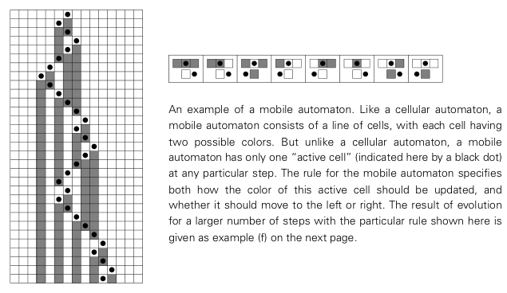
<!-- ORIGINAL_FIGURES page=0087 end -->

## 移动自动机

元胞自动机的一个基本特征是，它所包含的所有元胞的颜色都会在演化的每一步中并行更新。

但这个特征对于决定所发生的整体行为有多重要？为了处理这个问题，我在本节中考虑一类我称为“移动自动机”的系统。

移动自动机类似于元胞自动机，只是它们并不并行更新所有元胞，而是在每一步只有一个“活动元胞”被更新；然后它们有一些规则，规定这个活动元胞应当怎样从一步移动到下一步。

下图展示了一个移动自动机例子。活动元胞用黑点表示。规则只应用于这个活动元胞。它观察活动元胞及其紧邻邻居的颜色，然后规定活动元胞的新颜色应当是什么，以及活动元胞应当向左还是向右移动。

图注：一个移动自动机例子。与元胞自动机一样，移动自动机由一行元胞组成，每个元胞有两种可能颜色。但不同于元胞自动机，移动自动机在任何特定步骤只有一个“活动元胞”（这里用黑点表示）。移动自动机的规则既规定这个活动元胞的颜色应当怎样更新，也规定它应当向左还是向右移动。这里所示特定规则在更多步中的演化结果，是下一页例 (f)。

与元胞自动机很类似，人们可以枚举这种类型的所有可能规则；结果表明总共有 65,536 个。下一页顶部的图展示了用这类规则得到的典型行为。在情形 (a) 和 (b) 中，活动元胞保持局限在一个小区域内，行为非常简单且重复。情形 (c) 到 (f) 类似，

---

[[PDF page 88]]

<!-- ORIGINAL_FIGURES page=0088 start -->
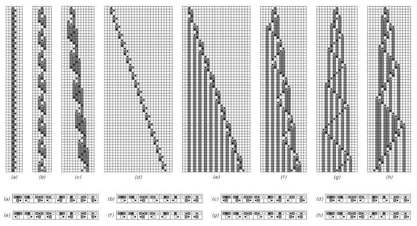
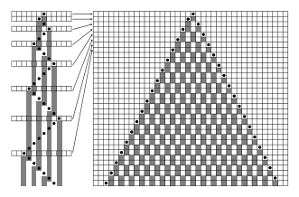
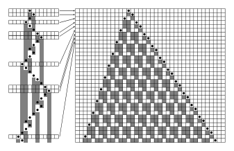
<!-- ORIGINAL_FIGURES page=0088 end -->

只是整个图案系统地向右移动，并且在情形 (e) 和 (f) 中留下一串条纹。

图注：具有各种规则的移动自动机例子。在情形 (a) 到 (f) 中，活动元胞的运动是纯粹重复的。在情形 (g) 和 (h) 中则不是。这些情形中的图案宽度在 `t` 步后大致像 `sqrt(t)` 那样增长。

但在 65,536 个可能规则中，总共有 218 个会产生有些不同的行为，如上方情形 (g) 和 (h) 所示。在这些情形中，活动元胞并不以严格重复方式运动，而是来回扫动，每次都逐渐走得更远。

不过，产生的整体图案仍然相当简单。事实上，在下方的压缩形式中，它是纯粹重复的。

图注：上方移动自动机 (g) 和 (h) 演化的压缩版本，只显示活动元胞比此前任何时候都更靠左或更靠右的那些步骤。

---

[[PDF page 89]]

<!-- ORIGINAL_FIGURES page=0089 start -->
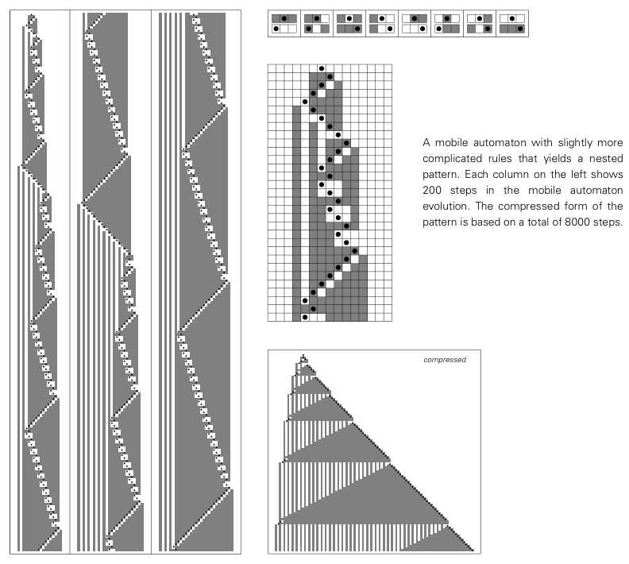
<!-- ORIGINAL_FIGURES page=0089 end -->

在到目前为止所讨论类型的 65,536 个可能移动自动机中，结果表明没有一个表现出更复杂的行为。那么，这类行为究竟会不会在移动自动机中出现？

可以扩展所考虑的规则集合，允许每一步不仅更新活动元胞自身的颜色，也更新它紧邻邻居的颜色。经过这种扩展后，总共有 4,294,967,296 个可能规则。

如果随机抽样这些规则，会发现其中超过 99% 只产生简单重复行为。但大约每几千个规则中会出现一次下图所示的行为：它不是纯粹重复的，而是具有某种嵌套结构。

图注：一个具有稍复杂规则、产生嵌套图案的移动自动机。左侧每一列显示 200 步移动自动机演化。图案的压缩形式基于总共 8000 步。

---

[[PDF page 90]]

<!-- ORIGINAL_FIGURES page=0090 start -->
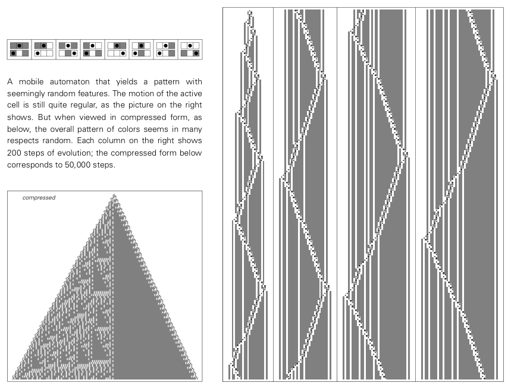
<!-- ORIGINAL_FIGURES page=0090 end -->

不过，整体图案仍然非常规则。但在搜索了也许 50,000 个规则后，人们最终会遇到下图所示的规则；在这个规则中，压缩图案表现出与规则 30 等元胞自动机中所见几乎相同的表观随机性。

图注：一个产生带有看似随机特征图案的移动自动机。活动元胞的运动仍然相当规则，如右图所示。但如果像下方那样用压缩形式观察，整体颜色图案在许多方面看起来随机。右侧每一列显示 200 步演化；下方压缩形式对应 50,000 步。

不过，虽然上图中活动元胞最终留下的图案在许多方面显得随机，活动元胞自身的运动仍然相当规则。那么，是否存在活动元胞运动本身也显得随机的移动自动机？起初，我以为也许没有。但在搜索了几百万个规则后，我最终找到了对页所示的例子。

---

[[PDF page 91]]

<!-- ORIGINAL_FIGURES page=0091 start -->
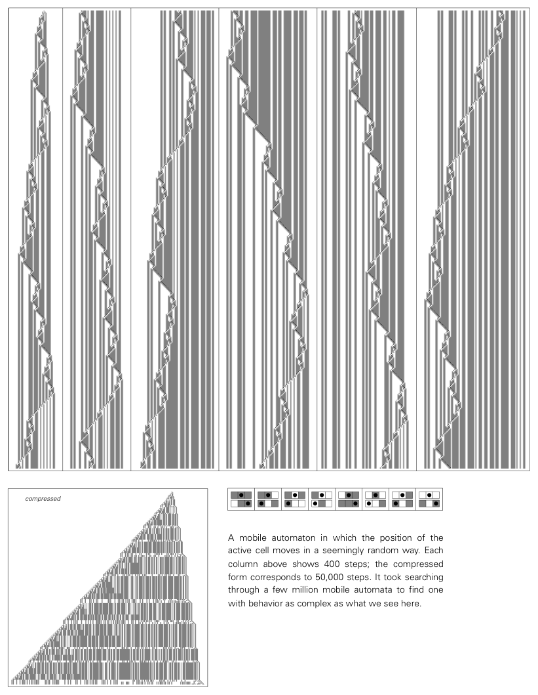
<!-- ORIGINAL_FIGURES page=0091 end -->

图注：一个活动元胞位置以看似随机方式运动的移动自动机。上方每一列显示 400 步；压缩形式对应 50,000 步。为了找到一个具有这里所见复杂行为的移动自动机，需要搜索几百万个移动自动机。

---

[[PDF page 92]]

<!-- ORIGINAL_FIGURES page=0092 start -->
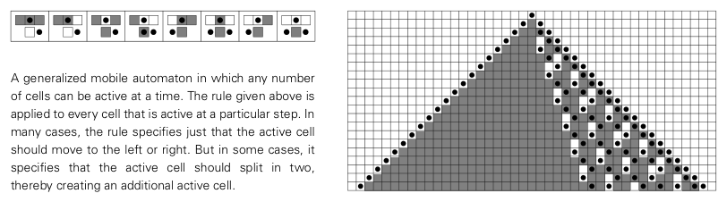
<!-- ORIGINAL_FIGURES page=0092 end -->

因此，尽管移动自动机每次只更新一个元胞，它们仍然可能产生高度复杂的行为。不过，我们发现这类行为在元胞自动机中相当常见，而本节所见则表明，它在移动自动机中相当少见。

通过研究一类广义移动自动机，可以对这种差异的起源有所了解；这种系统在某种意义上介于普通移动自动机和元胞自动机之间。

这类广义移动自动机的基本思想，是允许同时有不止一个元胞处于活动状态。底层规则通常设置为：在某些情形下，一个活动元胞可以分裂成两个，或者可以完全消失。

因此，例如在下图中，每隔几步最终就会产生新的活动元胞。

图注：一个广义移动自动机，其中任意数量的元胞可以同时处于活动状态。上方给出的规则应用于特定步骤中的每个活动元胞。在许多情形中，规则只是规定活动元胞应当向左或向右移动。但在某些情形中，它规定活动元胞应当分裂成两个，从而产生一个额外的活动元胞。

如果随机选择广义移动自动机，大多数会产生简单行为，如对页最初几幅图所示。但在所有情形中的几个百分点中，行为要复杂得多。活动元胞的排列常常仍然相当规则，尽管有时并非如此。

但观察许多例子后，会显现出一个主题：复杂行为几乎从不发生，除非大量元胞同时处于活动状态。事实上，整体活动程度与复杂行为出现的可能性之间似乎存在显著相关性。这也是为什么复杂行为在元胞自动机中比在移动自动机中常见得多的部分原因。

---

[[PDF page 93]]

<!-- ORIGINAL_FIGURES page=0093 start -->
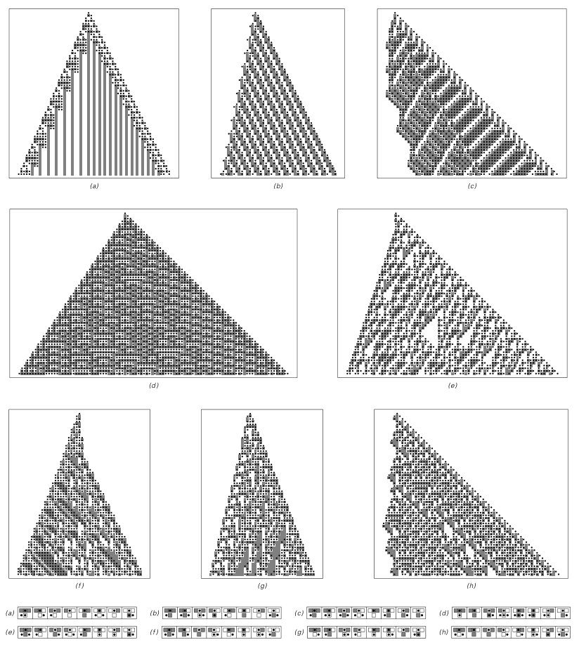
<!-- ORIGINAL_FIGURES page=0093 end -->

图注：具有各种规则的广义移动自动机例子。在情形 (a) 中，只有有限数量的元胞曾经变成活动元胞。但在展示的其他所有情形中，活动元胞会永远增殖。在情形 (d) 中，几乎所有元胞都是活动的，系统本质上像元胞自动机一样运行。在其余情形中，活动元胞形成某种复杂图案。注意，与普通移动自动机不同，像这里展示的复杂行为例子相对容易找到。

---

[[PDF page 94]]

<!-- ORIGINAL_FIGURES page=0094 start -->
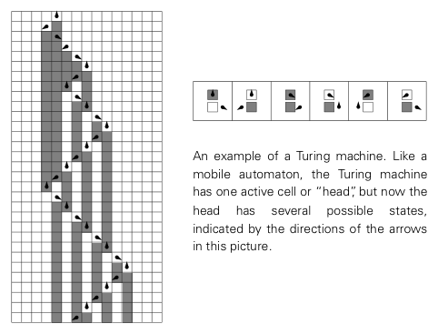
<!-- ORIGINAL_FIGURES page=0094 end -->

## 图灵机

在计算史上，最早得到广泛理解的理论计算机程序，是基于一类如今叫作图灵机的系统构造的。

图灵机类似于移动自动机，因为它们由一行元胞，也就是“纸带”，以及一个单独的活动元胞，也就是“读写头”组成。但不同于移动自动机，图灵机中的读写头可以有若干可能状态，在下图中用若干可能的箭头方向表示。

此外，图灵机的规则可以依赖读写头的状态，以及读写头所在位置的元胞颜色，但不依赖任何邻近元胞的颜色。

图注：一个图灵机例子。像移动自动机一样，图灵机有一个活动元胞或“读写头”，但现在读写头有若干可能状态，在图中用箭头方向表示。

图灵机在理论计算机科学中仍然被广泛使用。但几乎在所有情形中，人们设想构造例子来执行特定任务，并为每个元胞使用巨大数量的可能状态和巨大数量的可能颜色。

但事实上，存在一些非平凡图灵机，其读写头只有两种可能状态，每个元胞也只有两种可能颜色。对页图展示了这种类型 4096 个机器中的一些例子。可以看到重复行为和嵌套行为发生，但没有发现更复杂的行为。

---

[[PDF page 95]]

<!-- ORIGINAL_FIGURES page=0095 start -->
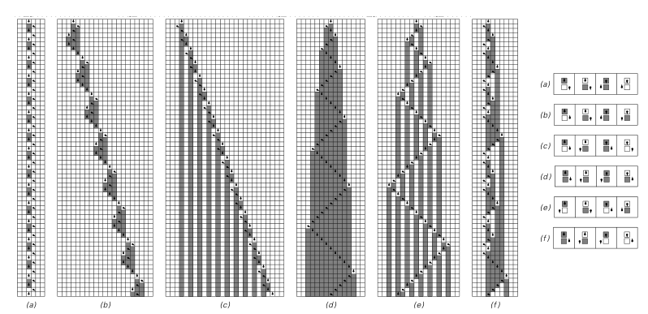
<!-- ORIGINAL_FIGURES page=0095 end -->

图注：读写头有两种可能状态的图灵机例子。这类规则总共有 4096 个。可以看到重复图案和嵌套图案，但从不出现更复杂的东西。

然而，根据我们关于移动自动机的经验，我们预期应当存在具有更复杂行为的图灵机。

当读写头有三种状态时，可能的图灵机约有三百万个。虽然其中有些机器产生的行为在细节上看起来稍微更复杂，例如下一页中的情形 (a) 和 (b)，但至少当它们从所有元胞为白色开始时，最终都只会产生重复或嵌套图案。

但当有四种状态时，更复杂的行为立刻成为可能。事实上，在这类规则中，每一百万个大约有五个会产生带有许多方面看似随机特征的图案，如接下来两页的图所示。

那么，如果允许读写头有超过四种状态，会发生什么？结果表明，人们看到的行为类型几乎没有变化。表观随机性会稍微更常见，但除此之外，结果本质上相同。

又一次，似乎存在一个复杂行为的阈值；只要至少有四种状态，就达到了这个阈值。并且正如在元胞自动机中一样，给底层规则增加更多复杂性，并不会产生最终更复杂的行为。

---

[[PDF page 96]]

<!-- ORIGINAL_FIGURES page=0096 start -->
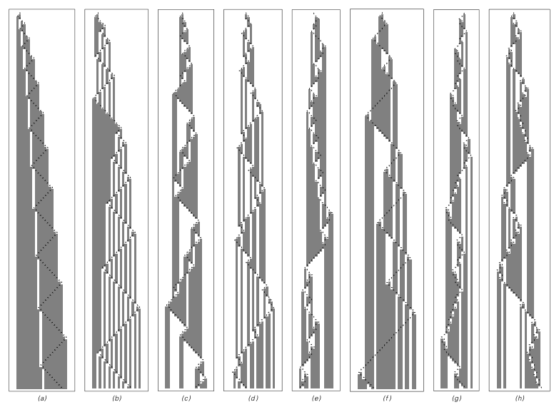
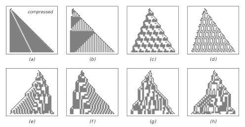
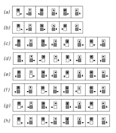
<!-- ORIGINAL_FIGURES page=0096 end -->

图注：具有三种和四种可能状态的图灵机例子。读写头有三种可能状态时，至少从所有元胞为白色开始，最终只会产生重复或嵌套图案。但有四种状态时，会生成更复杂的图案。上方一组图显示从读写头处于第一状态（箭头向上）、所有元胞为白色开始，按照不同规则演化的前 150 步。下方一组图以压缩形式显示每种情形中的演化。每幅图都包括读写头比此前任何时候更靠左或更靠右的前 50 步。

---

[[PDF page 97]]

<!-- ORIGINAL_FIGURES page=0097 start -->
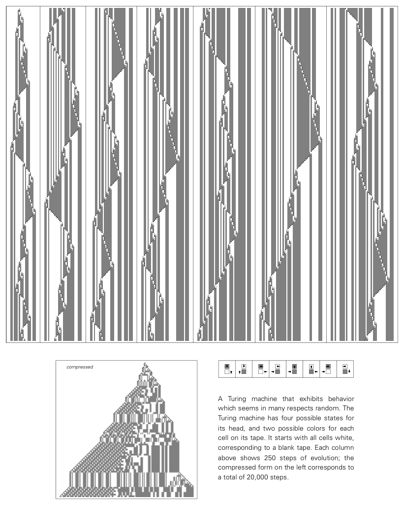
<!-- ORIGINAL_FIGURES page=0097 end -->

图注：一个表现出在许多方面看似随机行为的图灵机。该图灵机的读写头有四种可能状态，纸带上的每个元胞有两种可能颜色。它从所有元胞为白色开始，对应于空白纸带。上方每一列显示 250 步演化；左侧压缩形式对应总共 20,000 步。

---

[[PDF page 98]]

<!-- ORIGINAL_FIGURES page=0098 start -->
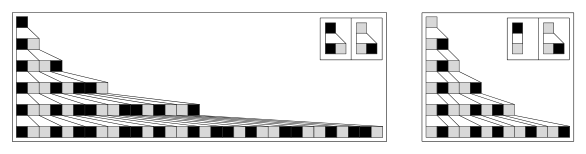
<!-- ORIGINAL_FIGURES page=0098 end -->

## 替换系统

元胞自动机、移动自动机和图灵机共有的一个特征，是它们在最低层都由固定元胞阵列组成。这意味着，虽然这些元胞的颜色可以按照范围广泛的不同可能规则更新，但底层元胞的数量和组织始终保持不变。

不过，替换系统被设置为元素数量可以改变。在下方展示的典型情形中，有一个元素序列，例如每个元素为黑色或白色；在每一步中，这些元素中的每一个都会被一个新的元素块替代。

在展示的简单情形中，规则规定，每个特定颜色的元素都应当被一个固定的新元素块替代，而与任何邻近元素的颜色无关。

图注：具有两种可能元素类型的替换系统例子，其中每一步每种元素都会被一个固定的新元素块替代。在展示的第一个情形中，得到的元素总数每一步都会翻倍；在第二个情形中，它遵循斐波那契序列，并且每一步大约按 `(1 + sqrt(5))/2 ≈ 1.618` 的因子增加。这里展示的两个替换系统，对应于接下来两页图中的第二个和第三个例子。

使用这类规则时，元素总数通常增长得非常快，因此像上面那样的图很快就会变得相当笨重。但至少对于这类规则，人们可以通过一种方式得到更清晰的图：不要把每一步看作每个元素都被一个用相同大小绘制的元素序列替代，而是把每个元素看作被细分成几个画得更小的元素。

在对页的情形中，我从单个元素开始，它由一个横跨整幅图的长方框表示。随后在连续步骤中，替换系统的规则规定每个方框应当怎样被细分成一串越来越短的方框。

---

[[PDF page 99]]

<!-- ORIGINAL_FIGURES page=0099 start -->
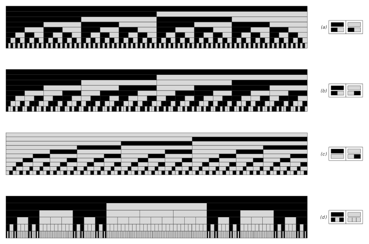
<!-- ORIGINAL_FIGURES page=0099 end -->

图注：替换系统例子，其中每个元素在每一步都被画成细分为一串新元素。在所有情形中，得到的整体图案都可以看出具有非常规则的嵌套形式。规则 (b) 给出所谓 Thue-Morse 序列，本书会多次遇到它。规则 (c) 与斐波那契序列有关。规则 (d) 给出康托集的一个版本。

下一页顶部的图展示了更多例子。我们看到，在所有情形中，产生的图案都有明显规则性。事实上，如果仔细观察，可以看到每个图案都只是由一组相同的嵌套部分组成。

这归根到底并不令人惊讶。毕竟，这些替换系统的基本规则规定：任何时候只要出现某种特定颜色的元素，它总会以同样方式被细分。

如果不用方框表示元素，而是用树上的分枝表示，嵌套结构会变得更加清楚。在这种设置中，思想是从树干开始，然后每一步使用替换系统的规则来决定每根分枝应当怎样分裂成更小的分枝。

---

[[PDF page 100]]

<!-- ORIGINAL_FIGURES page=0100 start -->
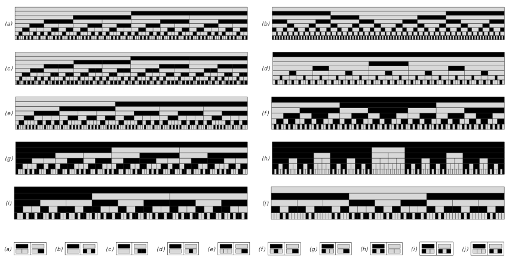
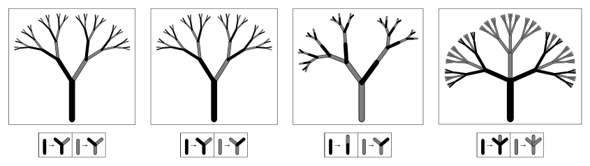
<!-- ORIGINAL_FIGURES page=0100 end -->

图注：更多与上一页类似、与邻居无关的替换系统例子。每个规则都产生不同的元素序列，但它们最终全都具有简单嵌套形式。

关键在于，由于规则只依赖特定分枝的颜色，而不依赖任何邻近分枝的颜色，从所有相同颜色分枝生成的子树就必须具有完全相同的结构，如下图所示。

图注：与上一页相同替换系统的演化，但现在以树的形式显示。从底部树干开始，规则规定每一步每根特定颜色的分枝都应当以同样方式分裂成较小分枝。结果是，每棵树都由一组逐渐变小、结构相同的子树组成。在第 400 页，我会用类似系统来讨论真实树木和叶子的生长。

---

[[PDF page 101]]

<!-- ORIGINAL_FIGURES page=0101 start -->
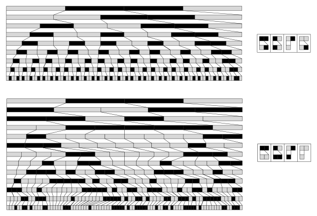
<!-- ORIGINAL_FIGURES page=0101 end -->

因此，要得到比简单嵌套更复杂的行为，就必须考虑规则不仅依赖单个元素颜色、也依赖至少一个邻居颜色的替换系统。下图展示了若干例子，其中替换一个元素的规则不仅依赖它自身的颜色，也依赖紧挨其右侧元素的颜色。

图注：替换系统例子，其规则不仅依赖元素自身颜色，也依赖紧挨其右侧元素的颜色。这类规则不容易解释为把一个元素简单细分为若干元素。因此，在图中选择多大方框来表示每个元素，并没有显然方法。这里我只是把图的整个宽度在每一步出现的所有元素之间平均分配。注意，每一步最右端的元素总会被丢弃，因为没有给出如何替代它的规则。

在第一个例子中，得到的图案仍然具有简单嵌套结构。但在第二个例子中，行为更复杂，并且没有明显嵌套结构。

不过，这两个例子的一个特征是，元素总数从一步到下一步从不减少。原因在于，我们使用的基本规则规定，每个单独元素都至少应当被一个新元素替代。

---

[[PDF page 102]]

<!-- ORIGINAL_FIGURES page=0102 start -->
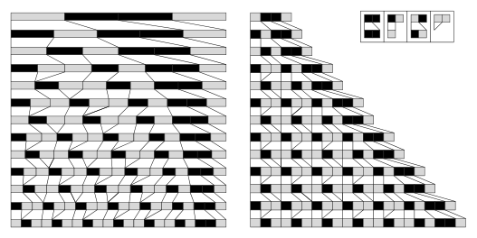
<!-- ORIGINAL_FIGURES page=0102 end -->

然而，也可以考虑一些元素可以直接消失的替换系统。如果这种消失的速率太大，那么几乎任何图案都会很快消亡。如果消失太少，那么大多数图案会非常迅速地增长。

但总会有少数规则，其中元素的创造和毁灭几乎完美平衡。

图注：一个替换系统的两种视图，其规则允许元素的创造和毁灭。左侧视图中，表示每个元素的方框经过缩放，以保持总宽度相同；右侧视图中，每个方框大小固定，如我们在第 98 页最初的替换系统图中那样。右侧视图显示，元素的创造和毁灭速率足够接近平衡，以至于元素总数每一步只增加一个固定量。

上图展示了一个例子。在这个特定例子中，元素数量最终确实会增加，但每一步只增加一个固定量。由于增长如此缓慢，我们又可以像第 98 页最初的替换系统图那样，用同样大小的方框表示每个元素。

然而，以这种方式观察时，上方替换系统产生的图案可以看出具有简单重复形式。结果表明，在具有同一类型规则的替换系统中，所有产生缓慢增长的系统似乎也都只产生这种简单重复图案。

知道这一点后，我们也许会得出结论，以某种方式说，替换系统就是不能产生我们在元胞自动机等系统中看到的那种复杂性。但正如移动自动机和图灵机的情形一样，我们又会错。事实上，正如对页图所表明的，只要允许元素具有三种或四种颜色，而不是仅有两种颜色，复杂得多的行为就立刻成为可能。

---

[[PDF page 103]]

<!-- ORIGINAL_FIGURES page=0103 start -->
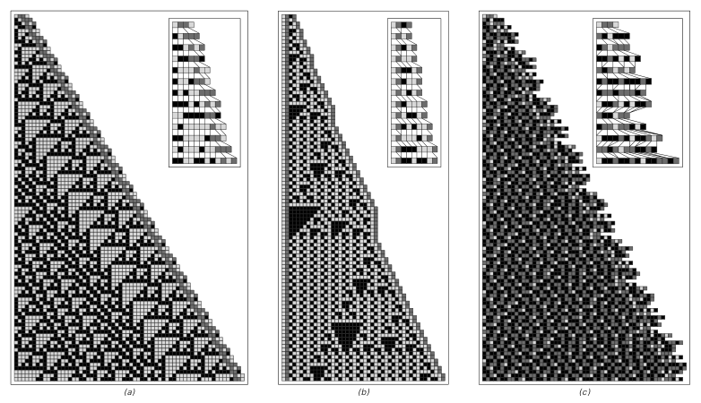
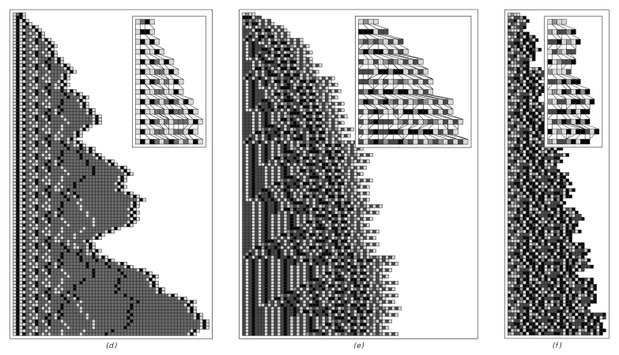
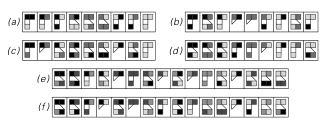
<!-- ORIGINAL_FIGURES page=0103 end -->

图注：每个元素具有三种和四种可能颜色的替换系统例子。这里展示的特定规则，会导致元素总数缓慢增长。注意，在每幅图的每一行中，重要的只是元素的次序；如插图所示，某个特定元素可能会由于其左侧元素的添加或删除而改变位置。注意，情形 (a) 中的图案最终确实会重复，而情形 (b) 中的图案最终会显示嵌套结构。

---

[[PDF page 104]]

结果表明，展示的第一个替换系统几乎完全像一个元胞自动机那样运作。事实上，远离右侧边缘时，所有元素实际上都好像位于规则网格上，每个元素的颜色只依赖这个元素此前的颜色和紧挨其右侧元素的颜色。

展示的第二个替换系统同样有一些表现出规则网格结构的片段。但在这些片段之间，存在元素被创造和毁灭的区域。在展示的其他替换系统中，元素到处被创造和毁灭，不留下任何简单网格结构的痕迹。因此，最终我们得到的图案可以看起来和元胞自动机等系统中看到的一样随机。

## 顺序替换系统

本章到目前为止讨论的系统，乍看之下都可能不太像我们实际通常使用的那类计算机程序。但结果表明，例如替换系统的一些变体，本质上就像标准文本编辑器一样工作。

理解这种对应关系的第一步，是把替换系统看作不是作用于有颜色元素序列，而是作用于元素或字母构成的字符串。因此，例如一个替换系统在某一步的状态，可以由字符串 `ABBBABA` 表示，其中 `A` 对应白色元素，`B` 对应黑色元素。

上一节中讨论的替换系统，通过把这种字符串中的每个元素替换成一个新的元素序列来运作；因此，从某种意义上说，这些系统在每一步对字符串中存在的所有元素并行操作。

但也可以考虑顺序替换系统，其中思想是从左到右扫描字符串，寻找某个特定元素序列，然后对找到的第一个这样的序列执行替换。这个设置现在就直接类似于典型文本编辑器中的搜索并替换功能。

---

[[PDF page 105]]

<!-- ORIGINAL_FIGURES page=0105 start -->
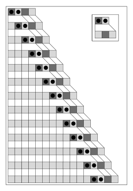
<!-- ORIGINAL_FIGURES page=0105 end -->

下图展示了一个顺序替换系统例子，其中规则简单地规定，每一步找到的第一个 `BA` 形式的序列应当被序列 `ABA` 替代。

图注：一个非常简单的顺序替换系统例子。浅色方块可以看作对应元素 `A`，深色方块对应元素 `B`。在每一步，规则规定扫描当时存在的字符串，从左到右寻找第一个序列 `BA`，并用 `ABA` 替代。图中黑点表示每一步被替换的元素。在展示的情形中，初始字符串是 `BABA`。每一步，规则的效果是在字符串内部添加一个 `A`。

这个情形中的行为非常简单，每一步都产生形式相同但越来越长的字符串。但如果使用涉及不止一种可能替换的规则，就可以得到更复杂的行为。在这种情形中，思想是在每一步反复扫描字符串，在连续扫描中尝试连续的替换，并在找到一个可用替换时停止。

下一页图展示了一个顺序替换系统，其规则 `ABA -> AAB, A -> ABA` 涉及两个可能替换。由于初始字符串中出现序列 `ABA`，第一步使用第一个替换。但第二步产生的字符串 `BAAB` 不包含 `ABA`，因此第一个替换现在不能使用。不过，由于字符串确实包含单个元素 `A`，第二个替换仍然可以使用。

然而，尽管会在不同替换之间这样交替，最终涌现出来的图案仍然非常规则。事实上，如果只允许两种可能替换和两种可能元素，

---

[[PDF page 106]]

<!-- ORIGINAL_FIGURES page=0106 start -->
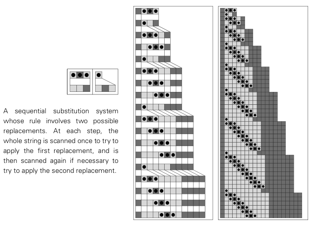
<!-- ORIGINAL_FIGURES page=0106 end -->

图注：一个规则涉及两种可能替换的顺序替换系统。每一步，整个字符串会先被扫描一次以尝试应用第一个替换；如有必要，再扫描一次以尝试应用第二个替换。

那么似乎没有任何规则会产生比上图复杂得多的行为。

由此，人们也许会被引向一个结论：顺序替换系统永远不能产生任何实质复杂性。但现在我们已经在许多其他类型系统中看到复杂性，人们也许会怀疑，复杂性在顺序替换系统中也应当可能出现。

结果表明，如果允许超过两种可能替换，确实可以立刻得到更复杂的行为。对页图给出了几个例子。在许多情形中，仍然产生相当规则的重复或嵌套图案。

但大约每 10,000 个随机选择的规则中，就会出现一次相当不同的行为。事实上，后一页图表明，可以产生在许多方面显得随机的图案，非常类似于我们在元胞自动机和其他系统中见过的图案。

因此，这导向了一个相当非凡的结论：即使只使用一个非常基本的文本编辑器中可用的简单操作，最终仍然可能产生高度复杂的行为。

---

[[PDF page 107]]

<!-- ORIGINAL_FIGURES page=0107 start -->
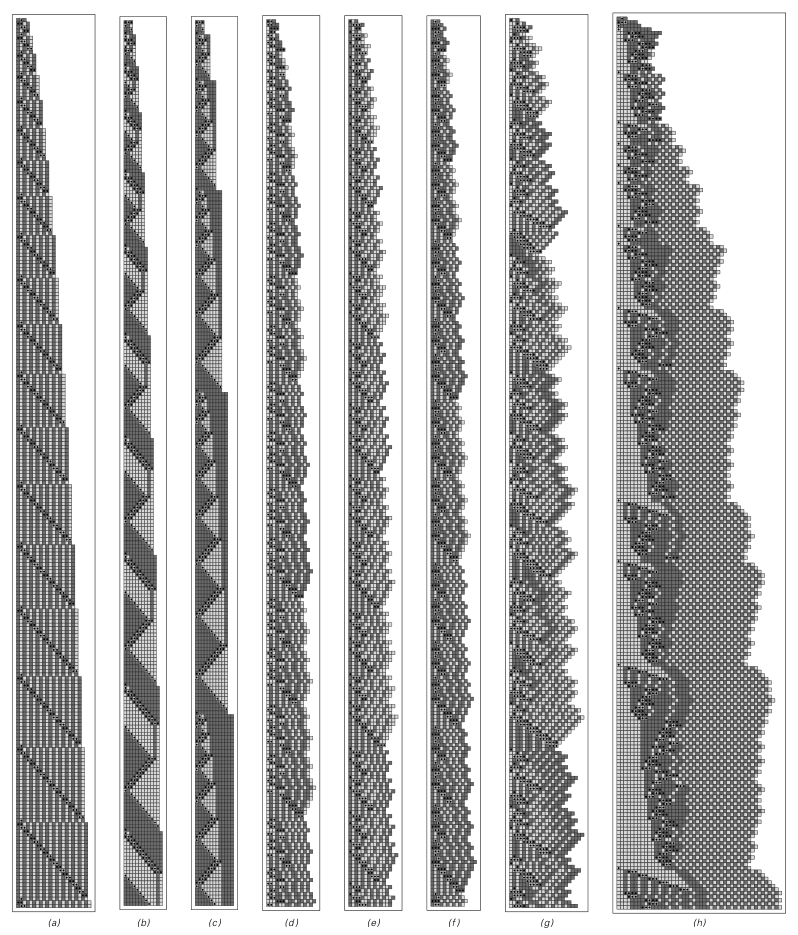
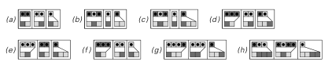
<!-- ORIGINAL_FIGURES page=0107 end -->

图注：规则涉及三种可能替换的顺序替换系统例子。所有情形中，系统都从初始字符串 `BAB` 开始。黑点表示每一步被替换的元素。

---

[[PDF page 108]]

<!-- ORIGINAL_FIGURES page=0108 start -->
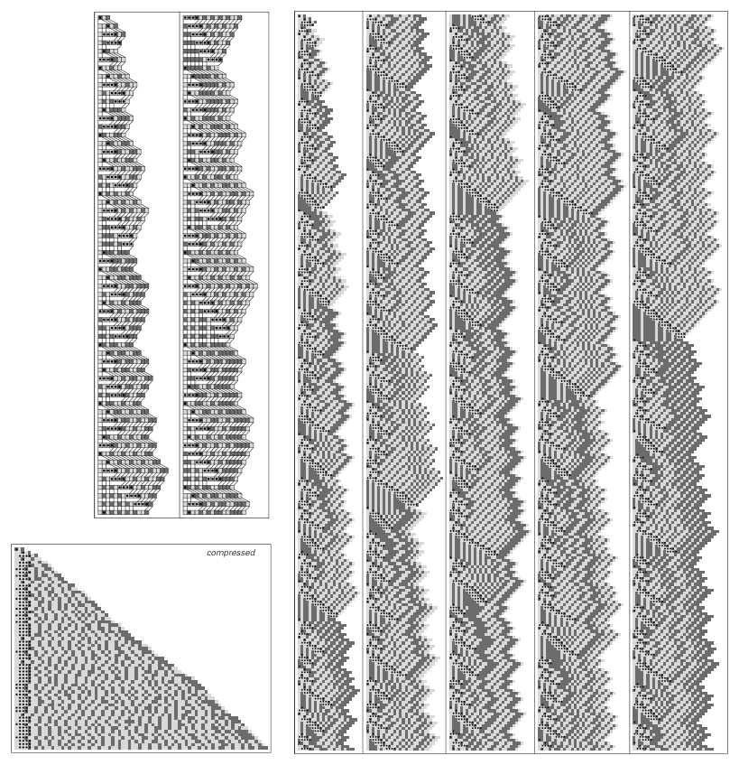
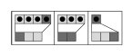
<!-- ORIGINAL_FIGURES page=0108 end -->

图注：一个产生表观随机行为的顺序替换系统例子。右侧每一列显示系统演化 250 步。左侧压缩图通过演化一百万步生成，但只显示字符串变得比此前任何时候更长的那些步骤。（规则与上一页情形 (g) 相同。）

---

[[PDF page 109]]

<!-- ORIGINAL_FIGURES page=0109 start -->
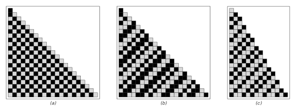
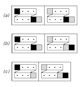
<!-- ORIGINAL_FIGURES page=0109 end -->

## 标记系统

本章的目标之一，是弄清一个系统的底层结构可以简单到什么程度，而整个系统仍然能够产生复杂行为。作为一类底层结构特别简单的系统的例子，我在这里考虑有时被称为标记系统的东西。

一个标记系统由一串元素组成，每个元素例如可以着为黑色或白色。系统的规则规定，每一步应当从序列开头移除固定数量的元素。然后，根据这些元素的颜色，把若干可能元素块之一标记到序列末尾。

下图展示了每一步只移除一个元素的标记系统例子。在这些系统中，人们已经有时会看到看起来有些复杂的行为。

图注：每一步从序列开头移除单个元素，并按所示规则把一个新元素块添加到序列末尾的标记系统例子。由于每一步只移除单个元素，系统实际上只是循环通过所有元素，依次替换每一个元素。每完成一个完整循环后，得到的序列恰好对应于第 98 页前三个普通的、与邻居无关的替换系统在连续步骤中产生的序列。

但事实上，结果表明，如果每一步只移除一个元素，那么标记系统总是实际上像一种缓慢版本的、与邻居无关的替换系统那样运作，也就是类似于第 98 页讨论的系统。结果是，它产生的图案最终必须具有简单重复或嵌套形式。

然而，如果每一步移除两个元素，情况就不再如此。事实上，正如下一页图所表明的，在这种情形中得到的行为常常可以非常复杂。

---

[[PDF page 110]]

<!-- ORIGINAL_FIGURES page=0110 start -->
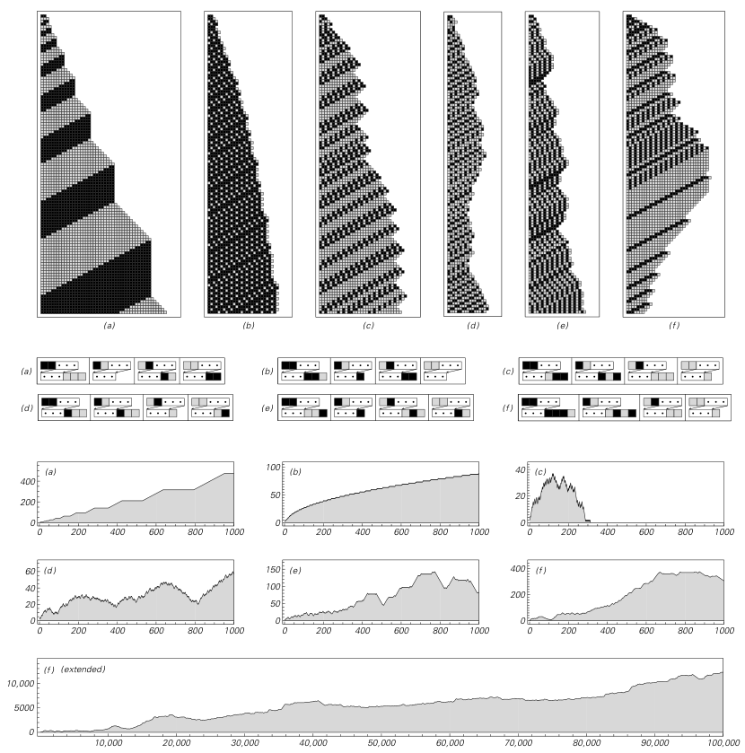
<!-- ORIGINAL_FIGURES page=0110 end -->

图注：标记系统例子，其中每一步从序列开头移除两个元素，然后根据这些元素是什么，把一个指定的新元素块添加到序列末尾。（每个规则表示中的三个点代表序列中的其余元素。）顶部图片显示从一对白色元素开始、按不同规则演化的前一百步。图表显示每种情形中得到的序列总长度。注意，在情形 (c) 中，所有元素最终都会从序列中被移除。

---

[[PDF page 111]]

<!-- ORIGINAL_FIGURES page=0111 start -->
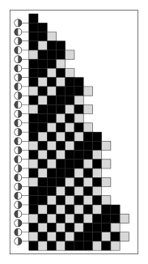
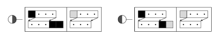

<!-- ORIGINAL_FIGURES page=0111 end -->

## 循环标记系统

上一节讨论的标记系统的基本操作极其简单。但结果表明，通过使用一种稍有不同的设置，可以构造出在某些方面操作甚至更简单的系统。在普通标记系统中，人们事先并不知道每一步会添加若干可能元素块中的哪一个。但循环标记系统的思想，是让底层规则已经确切指定每一步可以添加什么元素块。

在最简单情形中，有两个可能的元素块，规则只是在连续步骤中在这些元素块之间交替，并且当该步序列的第一个元素为黑色时，在这个特定步骤添加一个元素块。下图展示了这一点如何运作。

图注：一个循环标记系统例子。规则中有两种情形，并且这些情形在交替步骤中使用，如左侧圆形图标所示。在每种情形中，从序列开头移除单个元素；每当被移除的元素为黑色时，就在末尾添加一个新元素块。规则可以仅通过给出每种情形所使用的元素块来概括，如下方所示。

下一页展示了若干循环标记系统例子。在情形 (a) 和 (b) 中，得到简单行为。情形 (c) 的行为稍微复杂一些，但如果以适当方式观察图案，结果表明它具有与第 98 页第三个与邻居无关的替换系统相同的嵌套形式。

那么情形 (d) 和 (e) 呢？在这两个情形中，连续步骤中得到的序列平均而言逐渐变长。但如果观察这种增长中的波动，如下一页图表所示，就会发现这些波动在许多方面是随机的。

---

[[PDF page 112]]

<!-- ORIGINAL_FIGURES page=0112 start -->
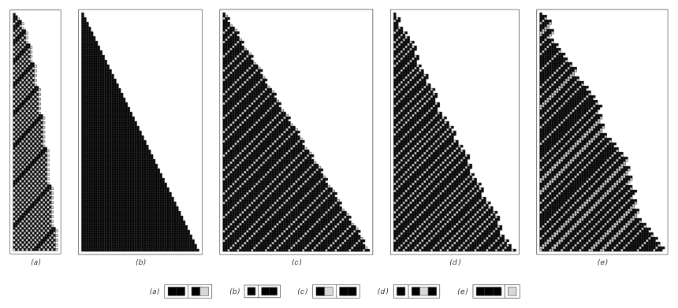
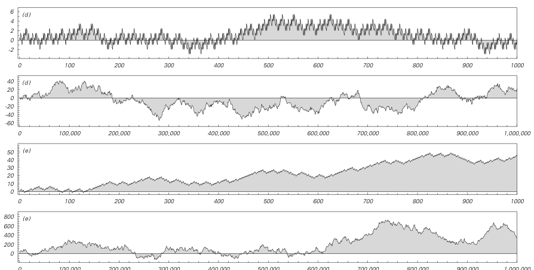
<!-- ORIGINAL_FIGURES page=0112 end -->

图注：循环标记系统例子。每个例子中的初始条件都由单个黑色元素组成。在情形 (c) 中，最左列中的交替步骤（在所有循环标记系统中，它决定整体行为）具有与第 98 页第三个与邻居无关的替换系统相同的嵌套形式。

图注：上方循环标记系统 (d) 和 (e) 的序列增长波动。这里显示的是相对于每步半个元素平均增长率的波动。

---

[[PDF page 113]]

## 寄存器机

本章到目前为止讨论的各种系统，都可以容易地在实际计算机上实现。但它们在底层层面上实际运作的方式，并不太像典型计算机。寄存器机则是专门设计来作为当代计算机的非常简单理想化。

在大多数日常情形中，我们使用的计算机的硬件构造被许多层软件隐藏起来。但在最低层，所有标准计算机的 CPU 都有存储数字的寄存器，而我们写的任何程序，最终都会被转换成一串简单指令，规定要在这些寄存器上执行的操作。

大多数实际计算机有相当多寄存器，并支持也许几十种不同指令。但作为一种简单理想化，可以考虑只有两个寄存器的寄存器机，每个寄存器存储任意大小的数字，并且只有两种指令：“增量”和“减量跳转”。这类寄存器机的规则于是就是实际程序的理想化，并被看作由固定指令序列组成，依次执行。

增量指令只设置为把特定寄存器中存储的数字增加一。另一方面，减量跳转指令做两件事。首先，它把特定寄存器中的数字减少一。但随后，它不是继续执行程序中的下一条指令，而是跳到程序中某个指定位置，并从那里重新开始执行。

不过，由于我们假定寄存器中的数字不能为负，已经为零的寄存器不能被减小。因此，减量跳转指令被设置为：如果应用于包含零的寄存器，它本质上什么也不做；它让寄存器保持不变，然后继续执行程序中的下一条指令，而不跳到任何地方。

减量跳转指令的这一特征也许看起来像个细节，但事实上它至关重要，因为正是它使我们的寄存器机能够根据寄存器中的值，在给定程序中采取不同路径。

---

[[PDF page 114]]

<!-- ORIGINAL_FIGURES page=0114 start -->
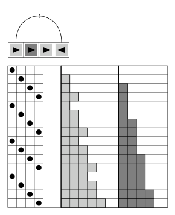
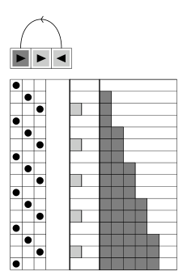
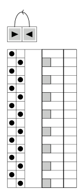
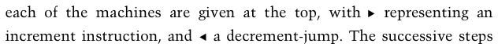
<!-- ORIGINAL_FIGURES page=0114 end -->

图注：简单寄存器机例子，它们被设置来模拟实际计算机的低层操作。这里展示的机器有两个寄存器，其连续步骤中的值在页面向下的连续行中给出。每台机器都遵循顶部给出的固定程序。程序由一串增量指令和减量跳转指令组成。浅灰色方框所示指令指向第一个寄存器；深灰色方框所示指令指向第二个寄存器。页面向下的每一行中，左侧黑点表示对应步骤正在执行程序中的哪条指令。对于这里展示的特定程序，每台机器只是依次执行连续指令，并在到达程序末尾时再次跳回开头。

在这种设置下，上方图展示了三个非常简单的双寄存器寄存器机例子。每台机器的程序在顶部给出，其中图标表示增量指令和减量跳转指令。每台机器演化的连续步骤在页面向下的连续行中显示。每一步正在执行的指令由左侧点的位置表示，而两个寄存器中的数字由右侧灰色方块表示。

展示的所有寄存器机都从执行其程序中的第一条指令开始。对于这里所用的特定程序，机器随后被设置为依次执行程序中的所有其他指令，并在每次到达程序末尾时跳回程序开头。

每台机器中的两个寄存器最初都是零。在第一台机器中，第一个寄存器在 0 和 1 之间交替，而第二个保持为零。但在第二台机器中，第一个寄存器同样在 0 和 1 之间交替，

---

[[PDF page 115]]

<!-- ORIGINAL_FIGURES page=0115 start -->
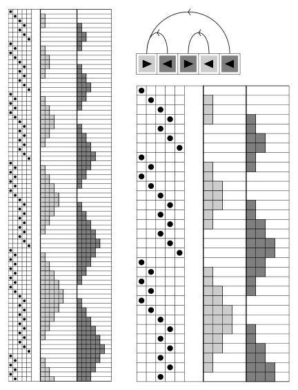
<!-- ORIGINAL_FIGURES page=0115 end -->

但第二个寄存器逐渐增长。最后，在第三台机器中，两个寄存器都增长。

不过，在这三个例子中，整体行为本质上都是重复的。事实上，结果表明，在程序长度为四条或更少指令的 10,552 个可能寄存器机中，没有一个表现出更复杂的行为。

然而，当有五条指令时，稍微更复杂的行为成为可能，如下图所示。但即使在这个例子中，仍然存在高度规则的嵌套结构。

图注：一个显示嵌套而非严格重复行为的寄存器机。该寄存器机的程序长度为五条指令。结果表明，在 248,832 个可能的五指令程序中，只有两个程序会产生严格重复以外的东西，而这个程序就是其中之一（另一个只是在第一和第二寄存器互换方面不同）。

结果还表明，即使最多有七条指令，可能的 276,224,376 个程序中也没有任何一个导向实质上更复杂的行为。但当有八条指令时，在 11,019,960,576 个可能程序中，终于有 126 个显示出更复杂的行为。下一页给出一个例子。

---

[[PDF page 116]]

<!-- ORIGINAL_FIGURES page=0116 start -->
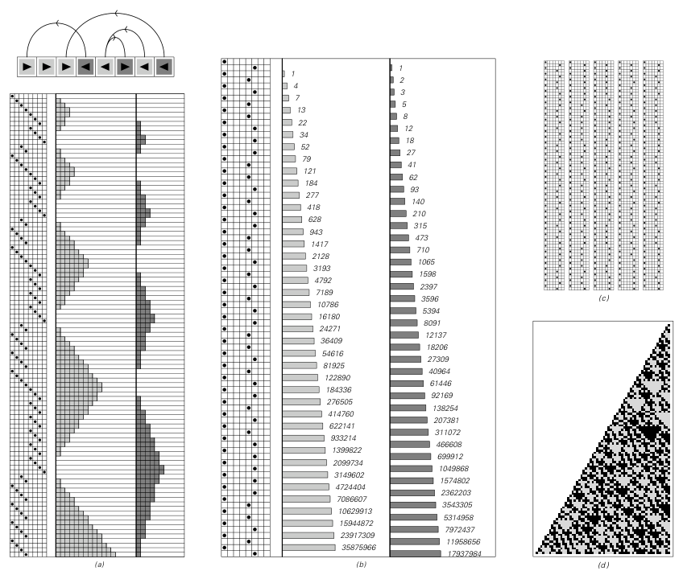
<!-- ORIGINAL_FIGURES page=0116 end -->

图注：一个行为在某些方面显得随机的寄存器机。这个寄存器机的程序长度为八条指令。测试所有 11,019,960,576 个长度为八的可能程序，揭示出只有这个以及 125 个类似情形具有复杂行为。部分 (b) 以压缩形式显示演化，只包括任一寄存器刚刚减小到零的那些步骤。非零寄存器的值用对数尺度显示。部分 (c) 显示某个寄存器减小到零的前 400 次所执行的指令。最后，部分 (d) 给出当第一个寄存器刚刚减小到零时，第二个寄存器所达到的连续值。这些值在这里以二进制数字序列给出。正如第 122 页讨论的，这些值事实上可以由一个简单算术规则得到，而不必显式追踪寄存器机演化中的每一步。如果一个值为 `n`，那么下一个值在 `n` 为偶数时是 `3n/2`，在 `n` 为奇数时是 `(3n+1)/2`。初始条件是 `n = 1`。

不过，如果只看标为 (a) 的普通演化，系统可能仍然显得具有相当简单和规则的行为。但更仔细的考察会揭示不规则性。图的部分 (b) 展示了演化的一个压缩版本，它只包括两个寄存器之一刚刚减小到零的那些步骤。

---

[[PDF page 117]]

在这幅图中，人们立刻看到所执行指令中存在一些表观随机变化。

图的部分 (c) 显示某个寄存器刚刚减小到零的前 400 次中执行了哪些指令。部分 (d) 最后显示当第一个寄存器刚刚减小到零时，第二个寄存器所达到连续值的二进制数字。结果看起来显示出相当多随机性。

因此，虽然它也许不像我们研究过的其他某些系统那样明显，对页这个简单寄存器机仍然能够生成复杂而看起来相当随机的行为。

那么，更复杂的寄存器机又如何？

一个明显可能性是允许超过两个寄存器。但结果表明，这样做通常几乎没有收获。例如，有三个寄存器时，可以用七条而不是八条指令的程序得到看似随机的行为。但程序的实际行为与我们已经在两个寄存器中看到的几乎无法区分。

设置更复杂寄存器机的另一种方式，是扩展所允许的底层指令类型。例如，可以引入一次指向两个寄存器的指令，对它们的内容进行相加、相减或比较。但结果表明，这类指令的存在，似乎很少对可能出现的复杂行为形式或其常见程度产生多大影响。

不过，尤其在使用这类扩展指令集时，寄存器机可以为真实计算机的低层操作提供相当准确的理想化。因此，寄存器机程序常常非常像用 C、BASIC、Java 或汇编等真实低层计算机语言写成的程序。

在典型情形中，这类程序中的每个变量只对应于寄存器机中的一个寄存器，并且不允许数组或指针。在这种对应下，我们关于寄存器机的一般结果，也可以预期适用于用真实低层计算机语言写成的简单程序。

---

[[PDF page 118]]

<!-- ORIGINAL_FIGURES page=0118 start -->
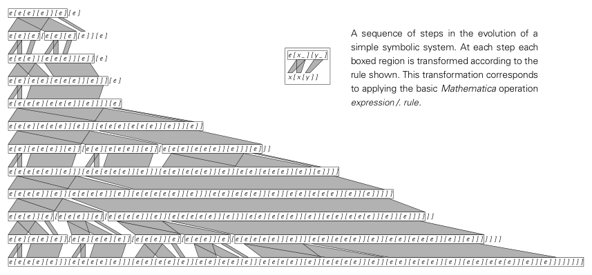
<!-- ORIGINAL_FIGURES page=0118 end -->

实际细节使得对这类程序做系统实验有些困难。但我所进行的实验确实提示，正如简单寄存器机一样，在数百万个短程序中搜索，通常至少会找到少数表现出复杂且看似随机行为的程序。

## 符号系统

寄存器机为典型低层计算机语言提供了简单理想化。但 Mathematica 又如何？怎样才能为 Mathematica 对符号表达式所做的变换设置一种简单理想化？组合子这一来自 1920 年代的思想提示的一种方法，是考虑形如 `e[e[e][e]][e][e]` 的表达式，然后通过反复应用形如 `e[x_][y_] -> x[x[y]]` 的规则来对它们作变换，其中 `x_` 和 `y_` 代表任意表达式。

下图展示了一个例子。在每一步，变换通过从左到右扫描一次来完成，并且在任何可能且不重叠的位置应用规则。

图注：一个简单符号系统演化中的步骤序列。每一步中，每个方框区域都按照所示规则变换。这种变换对应于应用基本 Mathematica 操作 `expression /. rule`。

---

[[PDF page 119]]

<!-- ORIGINAL_FIGURES page=0119 start -->
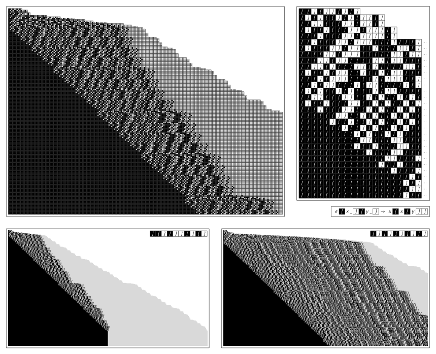
<!-- ORIGINAL_FIGURES page=0119 end -->

对页中那样的表达式，其结构只由左括号和右括号的序列决定。把这些括号分别用深色方块和浅色方块表示，下图显示了生成的整体行为图案。

图注：上一页演化的更多步骤，其中左括号用深色方块表示，右括号用浅色方块表示。在每种情形中，宽于图像的构型在右侧被截断。对于上一页的初始条件，系统在 264 步后演化到一个固定构型，其中包含 256 个左括号，后接 256 个右括号。对于右下方的初始条件，系统同样演化到固定构型，但这一次需要 65,555 步，构型包含 65,536 个左括号和右括号。注意，演化规则高度非局部，因而与比如元胞自动机中的规则相当不同。结果表明，这个特定系统总是演化到固定构型，但对于大小为 `n` 的初始条件，可能需要大约 `n` 层迭代的 2 的幂次才能做到。

---

[[PDF page 120]]

<!-- ORIGINAL_FIGURES page=0120 start -->
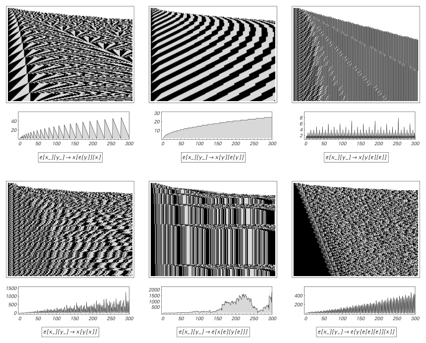
<!-- ORIGINAL_FIGURES page=0120 end -->

使用所示特定规则时，行为总会最终稳定，尽管有时只会在天文数字般漫长的时间后才稳定。

但完全可以找到不会发生这种情况的符号系统，如下图所示。有时这类系统生成的行为具有简单重复或嵌套形式。但常常，正如在许多其他类型系统中一样，行为会是复杂而看起来相当随机的。

图注：从初始条件 `-[ -[-][-] ][-][-]` 出发，各种符号系统的行为。底部图表显示连续步骤中所得表达式大小的差异。

---

[[PDF page 121]]

## 一些结论

在上一章中，我们发现了一个非凡事实：尽管某些元胞自动机的底层规则极其简单，它们仍然能够产生高度复杂的行为。

然而一开始，这一点如此令人惊讶，也如此超出我们的通常经验，以至于我们也许倾向于假定，它一定是元胞自动机某些罕见而特殊特征的后果，并且不会出现在其他类型系统中。

元胞自动机确实有许多特殊特征。例如，它们的所有元素总是排列在刚性阵列中，并且在每一步总是并行更新。人们也许会以为，正是这类特征对于让简单底层规则能够产生复杂行为至关重要。

但从本章前面对替换系统的研究中我们知道，例如元素事实上并不需要排列在刚性阵列中。从移动自动机的研究中，我们也知道，并行更新同样不是关键。

事实上，我在本章中特意选择这一系列系统，就是为了看看当元胞自动机的各种特殊特征一个个被拿掉时会发生什么。非凡的结论是，最终这些特征其实都没有多大关系。因为本章中的每一种系统类型，最终都证明能够产生与我们在元胞自动机中看到的复杂性非常相似的复杂性。

因此，这提示我们，复杂性现象事实上相当普遍，并且相当独立于特定系统的细节。

但一般说来，复杂性什么时候会出现？

本章中的例子提示，如果某个系统的规则足够简单，那么这个系统只会表现出纯粹重复行为。如果规则稍微更复杂，那么嵌套也常常会出现。但要在系统整体行为中得到复杂性，就需要超过其底层规则复杂性中的某个阈值。

---

[[PDF page 122]]

然而，我们作出的非凡发现是，这个阈值通常极低。事实上，在本章过程中我们已经看到，在我们讨论过的每一种一般系统类型中，最终只需要非常简单的规则，就能产生高度复杂的行为。

不过，人们也许仍然会以为，如果增加规则的复杂性，那么得到的行为也会相应变得更复杂。但正如对页图所示，这通常并不会发生。

相反，一旦达到复杂行为的阈值，通常会发现，给底层规则增加复杂性，并不会使所产生行为的整体复杂性有任何可感知的增加。

看起来，复杂行为所需的关键成分已经存在于具有非常简单规则的系统中；因此，当规则变得更复杂时，通常不会发生根本上新的事情。事实上，正如对页图所展示的，规则复杂性与它们产生的行为复杂性之间常常没有清楚相关性。这意味着，例如即使规则高度复杂，仍然常常会出现非常简单的行为。

从本章例子中可以作出的一个观察是，当一个系统的行为看起来不复杂时，它往往由重复或嵌套主导。事实上，上一章中我们已经在特定元胞自动机中看到的重复、嵌套、随机性和局部结构这些基本主题，似乎实际上非常一般，并且代表了范围巨大的不同系统行为中的主导主题。

某个具体系统的底层规则细节，当然会影响它所产生行为的细节。但本章中我们看到的是，在整体层面上，出现的典型行为类型相当通用，几乎完全独立于底层规则的细节。

这一事实对于我努力发展本书所描述的那种连贯科学至关重要。因为它意味着，

---

[[PDF page 123]]

<!-- ORIGINAL_FIGURES page=0123 start -->
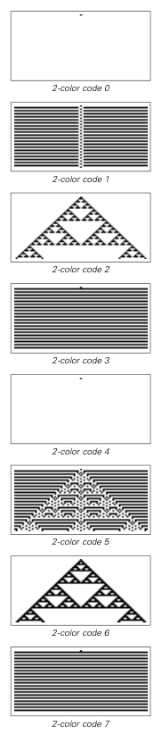
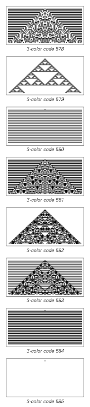
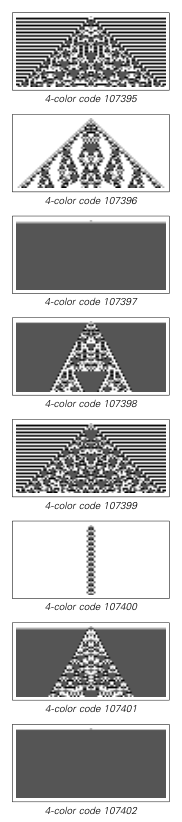
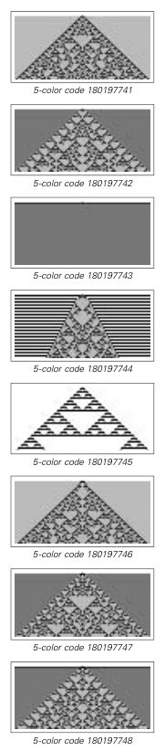
<!-- ORIGINAL_FIGURES page=0123 end -->

图注：具有不同复杂程度规则的元胞自动机例子。所用规则属于第 76 页描述的所谓总和型。对于两种可能颜色，这类规则只需指定 4 种情形，共有 16 个可能规则。但随着颜色数量增加，规则很快变得更复杂。三种颜色时，需要指定 7 种情形，共有 2187 个可能规则；五种颜色时，需要指定 13 种情形，共有 1,220,703,125 个可能规则。但即使底层规则复杂性迅速增加，我们看到的整体行为形式并没有多大变化。两种颜色时，结果表明没有任何总和型规则会产生重复或嵌套之外的行为。但只要允许三种颜色，更复杂的行为就立刻成为可能。然而，允许四种或更多颜色，并不会进一步增加行为复杂性；如图所示，即使有五种颜色，仍然会出现简单重复和嵌套行为。

---

[[PDF page 124]]

存在一些一般原则，支配着范围广泛系统的行为，而不依赖每个系统的精确细节。

正是这一点意味着，即使我们不知道自然中某个具体系统内部的全部细节，我们仍然潜在地可以对它的整体行为作出基本陈述。事实上，在大多数情形中，这种行为的重要特征最终会证明正是我们已经在本章讨论过的各种非常简单规则中看到过的那些特征。

## 本章发现是怎样作出的

本章以及上一章描述了我关于简单程序通常会做什么所作出的一系列惊人发现。在作出这些发现的过程中，我最终发展出了一种有些新的方法论；我预期它会成为本书所描述的新科学中几乎任何根本研究的核心。

传统数学和既有理论科学会提示一种基本方法论：从人们想研究的行为出发，然后尝试构造表现出这种行为的例子。但我确信，如果我采用这种方法，我不会走得很远。因为我只会寻找自己已经相信可能存在的行为类型。而在研究元胞自动机时，这例如很可能意味着我只会寻找重复和嵌套。

但使我能够发现更多东西的是，我改用了一种根本上基于计算机实验的方法论。

在传统科学实验中，人们设置一个自然系统，然后观察它怎样行为。几乎以同样的方式，人们可以在计算机上设置一个程序，然后观察它怎样行为。这种实验方法的巨大优势在于，它不要求人们事先确切知道可能出现什么行为。正是这一点使人有可能发现真正新的、自己没有预料到的现象。

然而，传统实验科学的经验也许会提示，实验在某种意义上总是根本不精确的。

---

[[PDF page 125]]

因为当人们处理自然中的系统时，通常不可能以完美精度设置或测量它们；事实上，甚至让一个传统实验具有可重复性也可能是一个挑战。

但对于我在本书中所做的这类计算机实验，并没有这样的问题。因为在几乎所有情形中，它们涉及的程序，其规则和初始条件都可以用完美精度指定，因此无论何时何地运行，它们都会以完全相同的方式工作。

因此，在许多方面，这类计算机实验设法结合了科学中理论方法和实验方法的优点。因为它们的结果具有理论或数学陈述所预期的那种精确性和清晰性。然而，这些结果仍然可以纯粹通过观察发现。

不过，正如所有类型的实验一样，要知道怎样设置一个会产生有意义结果的计算机实验，需要相当多技巧和判断。事实上，在过去二十年左右，我自己做这类实验的方法论已经大大改进。

我一再学到的最重要的单一原则，是最好的计算机实验是那些尽可能简单、直接的实验。这个原则既适用于所研究实际系统的结构，也适用于研究这些系统所使用的过程。

在某个层面上，考察具有尽可能简单结构的系统这一原则，可以被看作一种抽象的审美原则。但结果表明，它也有一些非常具体的后果。

首先，一个结构越简单，就越可能出现在各种各样的地方。这意味着，研究具有尽可能简单结构的系统，往往会得到具有最广泛、最根本意义的结果。

此外，考察具有更简单底层结构的系统，会使人更有机会判断自己看到的任何现象究竟真正由什么负责，因为放入系统中、可能把人引入歧途的特征更少。

在纯粹实践层面上，研究具有更简单结构的系统也有一个优势：这些系统通常更容易在计算机上实现，因此通常可以用给定计算资源进行更广泛的研究。

---

[[PDF page 126]]

但说人们应当研究具有尽可能简单结构的系统，一个明显问题是，这类系统也许根本不能表现出人们可能认为有趣，或自然中实际出现的那些行为。

事实上，来自传统科学和数学的直觉一直倾向于提示，除非加入各种复杂因素，大多数系统永远不能表现出任何非常相关的行为。但本书到目前为止的结果已经表明，这种直觉远远不正确；现实中，即使具有极其简单规则的系统，也能够产生高度复杂的行为。

这一事实对计算机实验的后果相当深刻。因为它意味着，并没有直接理由要超出具有相当简单底层规则的系统研究范围。但吸收这一点并不容易。事实上，以我的经验，做计算机实验时最常见的单一错误，就是考察远比必要复杂得多的系统。

这种情况发生的典型原因是，人们根本想象不出一个更简单系统可以怎样表现出有趣行为。于是人们决定考察一个更复杂的系统，通常还专门插入一些特征来产生某种特定行为形式。

很久以后，人们也许会回过头来再次考察那个更简单的系统。这常常是一种令人谦卑的经验，因为常见情况是，人们发现该系统事实上确实设法产生了有趣行为，只是方式不是自己有足够想象力猜到的方式。

因此，在多次看到这一点之后，我现在总是努力遵循一个原则：从过于简单的系统开始是不可能的。最坏情况下，人们只是确立了有趣行为出现所需条件的一个下界。但更常见的是，人们会发现自己从未认为可能的行为。

不过，必须强调，即使在实验中，发现自己没有预料到的现象也从来不是完全直接的。因为在设置实验时，人们不可避免地要对可能出现的行为类型作出假设。如果结果表明存在某种行为恰好不符合这些假设，那么实验通常就不会注意到它。

---

[[PDF page 127]]

不过，以我的经验，在计算机实验中最有机会发现新现象的方式，是让实验设计尽可能简单、直接。例如，对大量可能情形做一种无脑搜索，通常远好于对较少情形做精心设计的搜索。因为缩小搜索范围时，人们不可避免地会作出假设，而这些假设最终可能漏掉最有趣的情形。

沿着类似思路，我一直发现，明确观察系统的实际行为，远比从某种摘要出发要好。因为制作摘要时，人们不可避免地必须只挑出某些特征；这样做可能去除或遮蔽最有趣的效应。

但非常直接的实验有一个问题：它们常常生成巨大数量的原始数据。然而，我通常发现，如果设法把这些数据以图像形式呈现出来，就实际上可以非常迅速地只用眼睛进行分析。事实上，以我的经验，用这种方式识别意外现象通常比使用任何自动数据分析过程都容易得多。

从某种意义上说，一维元胞自动机恰好是我研究的第一批简单程序例子，这是幸运的。因为在这些系统中，人们通常只要观察一个也许包含 10,000 个元胞的阵列，就能对整体行为有很好的认识；而这样的阵列很容易显示在几平方英寸内。

并且，由于 256 个初等元胞自动机规则中已有若干个会生成巨大复杂性，原则上，只要研究本章开头那样几页图，就应当足以发现元胞自动机中的复杂性基本现象。

但事实上，我并不是以这样直接的方式作出这个发现的。一开始，我确实有过观察元胞自动机演化图像的想法。但生成这些图像的技术困难，使我想尽量减少图像数量。因此，起初我只观察了 32 个具有左右对称性、并使空白背景保持不变的规则。

在这些规则中，我发现了重复和嵌套的例子。而在随机初始条件下，我发现了更复杂的行为。

---

[[PDF page 128]]

但由于我并不预期在简单初始条件下可能出现任何复杂行为，我没有尝试考察其他规则来寻找它。尽管如此，碰巧的是，我在 1983 年发表的第一篇关于元胞自动机的论文，事实上确实包含了第 43 页规则 30 的一幅图，作为非对称规则的例子。但那幅图只显示了 20 步演化，当时我没有仔细看它，当然也没有领会它的意义。

在几年时间里，我对元胞自动机做了越来越复杂的计算机实验，并在这个过程中设法阐明了它们的许多性质。但最终，当技术已经发展到让我做这件事几乎变得微不足道时，我回过头去，生成了一些直观页面，展示所有 256 个初等规则从简单初始条件演化的图像。正是在看到这些图像时，我终于开始领会像规则 30 这样的系统中发生的非凡现象。

七年后，在通过观察规则 30 这类元胞自动机吸收了一些基本直觉之后，我决定弄清类似现象是否也出现在其他类型系统中。我研究的第一类这样的系统就是移动自动机。

相对于元胞自动机，移动自动机在某种意义上演化得非常慢；因此，为了制作更高效的图像，我想出一种方案，用压缩形式显示它们的演化。然后我开始生成前一百个、前一千个、前一万个移动自动机的图像。但在所有这些图像中，我没有发现重复和嵌套之外的东西。

不过，我确信更复杂的行为一定可能出现，于是决定坚持下去，写了一个程序来自动搜索大量移动自动机。我根据自己预期移动自动机可能怎样行为，为搜索设置了各种标准。很快，我已经让程序搜索了一百万个移动自动机，然后是一千万个。

---

[[PDF page 129]]

但我仍然一无所获。

于是我回过头，开始用肉眼观察大量随机选择规则的移动自动机。过了一段时间，我意识到，按我使用的压缩方案，可能有些移动自动机会根据我的搜索标准被丢弃，但它们仍然具有有趣行为。在修改搜索程序以考虑这一点之后不到一个小时，我就找到了第 74 页所示的例子。

然而，即使在这之后，我的搜索程序中仍然隐含着许多假设。又过了一段时间，我才识别并移除了它们。这样做之后，找到第 75 页所示的例子就相当直接了。

本章描述的大多数其他系统，都重复了某种类似模式。主要挑战始终是避免假设，并设置足够简单、足够直接的实验，使它们不会错过重要的新现象。

在许多情形中，需要大量迭代才能弄清应当做哪些正确实验。如果不是因为我可以用 Mathematica 轻松设置新实验，我很可能永远无法在本章讨论的大多数系统研究中走得很远。但最终，在运行程序总计相当于数年计算机时间、对应超过一百万个十亿次逻辑操作，并创造相当于数万页图像之后，我终于能够找到本章以及后续章节中展示的各种例子。
