# 第 4 章：基于数字的系统

[[PDF page 131]]

<!-- ORIGINAL_FIGURES page=0131 start -->
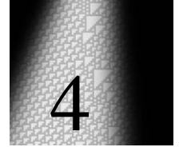
<!-- ORIGINAL_FIGURES page=0131 end -->

# 基于数字的系统

## 数字的观念

过去，科学在很大程度上最终关心的，是设法找到用数字描述自然系统的方式。

不过，到目前为止，我在本书中几乎还没有谈到数字。本章的目的，是研究一系列基于数字的系统，并看看它们的行为与我们在其他系统中发现的行为相比如何。

基于数字的系统之所以在传统科学中如此流行，主要原因是人们已经发展出大量数学工具来处理它们。事实上，有些类型的基于数字的系统，其行为已经可以用微积分等数学方法作几乎完整的分析。

然而，不可避免的是，只要这种完整分析成为可能，最终发现的行为通常就相当简单。

那么，基于数字的系统事实上是否有可能产生复杂行为？翻看大多数科学和数学教科书，人们很可能会得出否定答案。但必须意识到，这些教科书讨论的系统通常是专门挑选出来、便于相当完整分析的系统；因此它们的行为也必然相当简单。

而实际上，正如我们将在本章看到的，如果忽略可分析性的要求，转而只看计算机实验的结果，那么人们很快就会发现，即使相当简单的基于数字的系统，也能导致高度复杂的行为。

---

[[PDF page 132]]

<!-- ORIGINAL_FIGURES page=0132 start -->
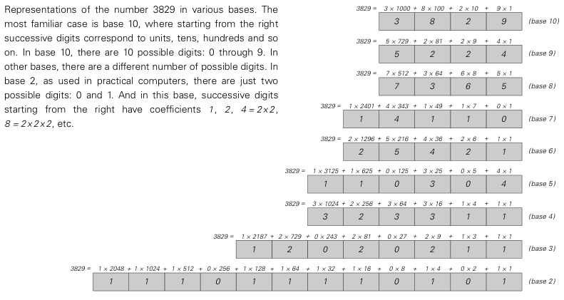
<!-- ORIGINAL_FIGURES page=0132 end -->

但这种复杂性的来源是什么？它又怎样与我们在元胞自动机这类系统中看到的复杂性联系起来？

人们或许会以为，既然已经有如此多数学被发展出来用于研究基于数字的系统，那么回答这类问题应当很容易。但事实上，传统数学在很大程度上似乎带来的困惑多于帮助。

一个基本问题是，传统数学处理数字的方式，与计算机和计算机程序处理数字的方式非常不同。因为在某种意义上，传统数学作出了一个根本理想化：它假设数字是基本对象，而它们唯一相关的属性就是大小。但在计算机中，数字并不是基本对象。相反，它们必须被显式表示，通常是通过给出一串数字位。

用一串数字位表示一个数，这个想法在日常生活中很熟悉：事实上，我们书写数字的标准方式，恰好就对应于给出十进制下的数字位序列。所谓十进制，意思是每一位都有十种可能选择：0 到 9。但如对页底部图示，完全也可以使用其他进制。而在实际计算机中，例如，使用的几乎总是二进制。

图注：数 3829 在不同进制中的表示。最熟悉的是十进制；从右侧开始，连续数字位分别对应个、十、百，依此类推。在十进制中有十个可能数字位：0 到 9。在其他进制中，可能数字位的数量不同。在实际计算机使用的二进制中，只有两个可能数字位：0 和 1。在这个进制中，从右侧开始的连续数字位，系数依次是 1、2、4、8 等。

---

[[PDF page 133]]

<!-- ORIGINAL_FIGURES page=0133 start -->
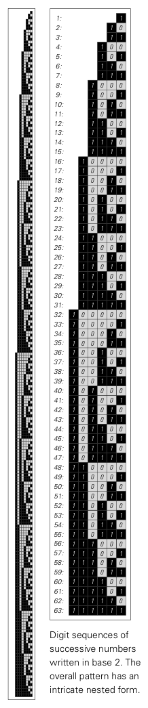
<!-- ORIGINAL_FIGURES page=0133 end -->

这意味着，在计算机中，数字由 0 和 1 的序列表示，很像元胞自动机这类系统中的白色和黑色元胞序列。于是，对数字的运算就对应于更新 0 和 1 序列的方式。

在传统数学中，对数字进行的运算会怎样影响数字位序列，这些细节通常被认为相当无关紧要。但我们将在本章发现，恰恰通过观察这些细节，我们将能更清楚地看到复杂性如何在基于数字的系统中发展出来。

在许多情形中，我们发现的行为与上一章看到的行为惊人相似。事实上，到最后，尽管传统数学给出了某些令人困惑的暗示，我们仍会发现，基于数字的系统的一般行为，与我们已经讨论过的简单程序的一般行为非常相似。

## 初等算术

初等算术的运算如此简单，以至于它们似乎不可能导致任何高度复杂的行为。但我们将在本节发现，事实上它们可以。

首先，考虑也许能想象到的最简单算术过程：从数字 1 开始，然后在连续步骤中每一步只加 1。

这个过程的结果，是生成连续数字 1、2、3、4、5、6、7、8，……这些数字的大小显然形成一个非常简单的进程。

但如果人们看的不是这些整体大小，而是数字位序列，那么所看到的就复杂得多。事实上，右图显示，这些连续数字的数字位序列形成了一个具有精细嵌套结构的图案。

图注：连续数字以二进制写出时的数字位序列。整体图案具有精细的嵌套形式。

---

[[PDF page 134]]

<!-- ORIGINAL_FIGURES page=0134 start -->
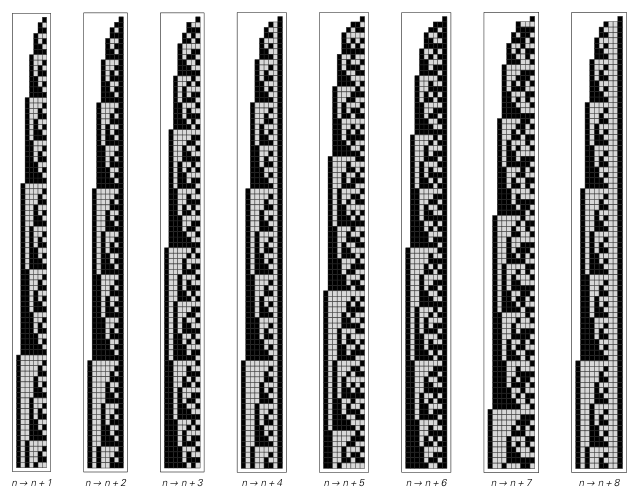
<!-- ORIGINAL_FIGURES page=0134 end -->

下图显示，如果每一步加的不是 1，而是另一个数，会发生什么。在每个图案的右边缘附近，具体形状略有不同。但从整体层面看，所有这些图案都具有完全相同的基本嵌套结构。

图注：从 1 开始，然后每一步连续加上一个常数所得到数字的二进制数字位序列。所有这些图案最终都具有同样的整体嵌套形式。

然而，如果不用加法而用乘法，那么得到的结果可以非常不同。对页顶部第一幅图显示，如果从 1 开始，然后每一步连续乘以 2，会发生什么。

结果表明，如果用二进制数字位序列表示数字，那么乘以 2 的操作具有非常简单的效果：它只是把数字位序列向左移动一位，并在右侧加上一个 0。因此，由连续乘以 2 得到的整体图案具有非常简单的形式。

---

[[PDF page 135]]

<!-- ORIGINAL_FIGURES page=0135 start -->
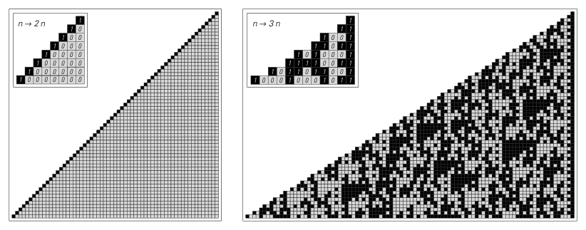
<!-- ORIGINAL_FIGURES page=0135 end -->

图注：从数字 1 开始，然后连续乘以因子 2 和因子 3 所产生的图案。在每种情形中，每一步得到的数字都以二进制显示其数字位序列。乘以 2 在二进制中只对应于把所有数字位向左移动一位，因此这种情形产生的整体图案非常简单。但如右图所示，乘以 3 会产生复杂得多的图案。注意，在这些图中，每一步得到的完整数字分别对应于 2 和 3 的连续整数次幂。

但如果每一步的乘法因子不是 2，而是 3，那么得到的图案就相当不同，如上方第二幅图所示。事实上，虽然所用的操作只是简单乘法，但在这种情形中得到的最终图案高度复杂。

下一页图显示该系统更多步骤中的演化。在小尺度上，可以看到一些明显的三角形和其他结构，但除此之外，图案看起来本质上是随机的。

因此，就像元胞自动机这样的简单程序一样，基于数字的简单系统似乎同样能够产生高度复杂、表面随机的行为。

不过，我们也许会想象，在下一页这样的图中看到的复杂性，必定在某种意义上是我们按数字位序列观察数字的结果；如果只按数字的整体大小观察，就不会出现这种复杂性。

然而，几个例子会说明事实并非如此。

第一个例子从每一步乘以 `3/2`，也就是 1.5 开始。以 1 为起点，用这种方式连续得到的数为 `1`、`3/2 = 1.5`、`9/4 = 2.25`、`27/8 = 3.375`、`81/16 = 5.0625`、`243/32 = 7.59375`、`729/64 = 11.390625`，……

---

[[PDF page 136]]

<!-- ORIGINAL_FIGURES page=0136 start -->
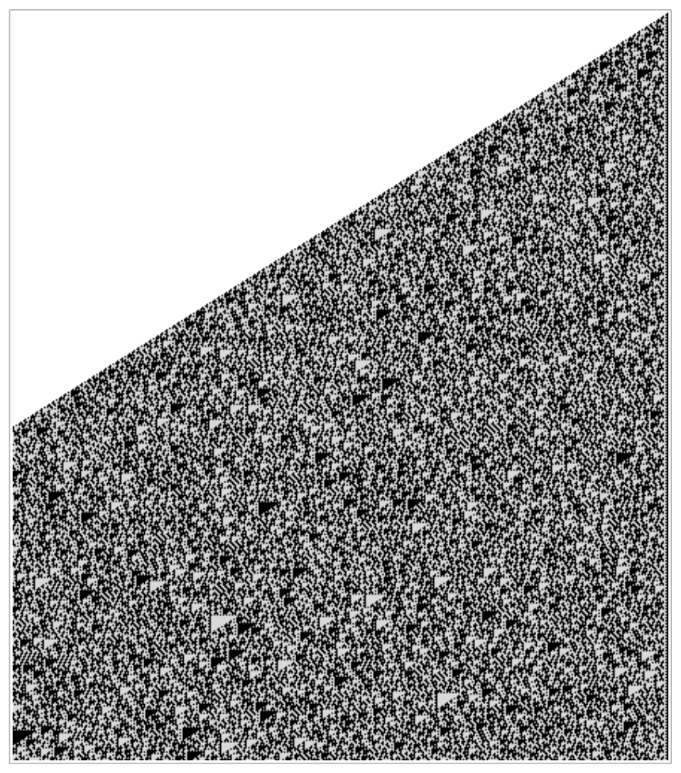
<!-- ORIGINAL_FIGURES page=0136 end -->

图注：前 500 个 3 的幂，以二进制显示。小尺度结构可见，但在更大尺度上，这个图案在所有实际意义上都显得随机。注意，这里显示的图案在页面左边缘被截断，虽然事实上整个图案会一直向左扩展，平均斜率为 `Log[2, 3] ≈ 1.58`。

---

[[PDF page 137]]

<!-- ORIGINAL_FIGURES page=0137 start -->
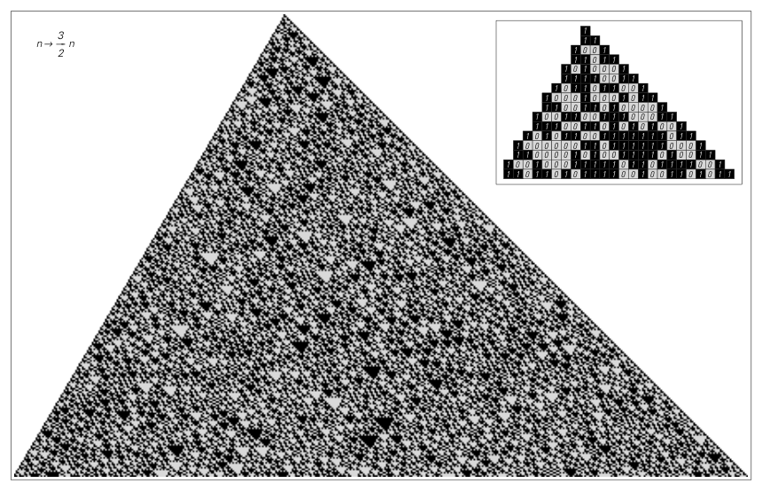
<!-- ORIGINAL_FIGURES page=0137 end -->

下图显示这些数字以二进制给出的数字位序列。直接位于图案顶部原始 1 的下方和左方的数字位，对应于每个连续数字的整数部分（例如 3.375 中的 3）；右侧的数字位对应于小数部分（例如 3.375 中的 0.375）。

图注：`3/2` 的连续幂，以二进制显示。乘以 `3/2` 可以看作乘以 3 再除以 2。但除以 2 只是乘以 2 的反操作，因此在二进制中它只是把所有数字位向右移动一位。整体图案因此就是对页图案的移位版本。

并且，不必显式观察完整的数字位图案，人们也可以只考虑每个连续数字的小数部分有多大。这些大小画在下一页顶部。图中显示，它们同样表现出在数字位层面显而易见的那种复杂性和表观随机性。

---

[[PDF page 138]]

<!-- ORIGINAL_FIGURES page=0138 start -->
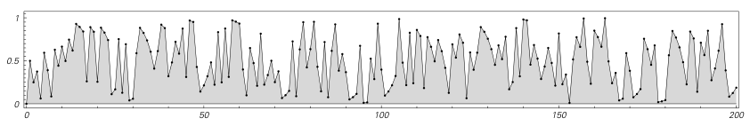
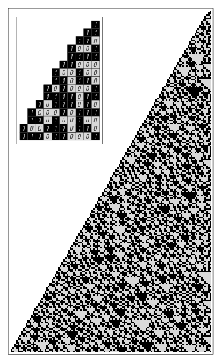
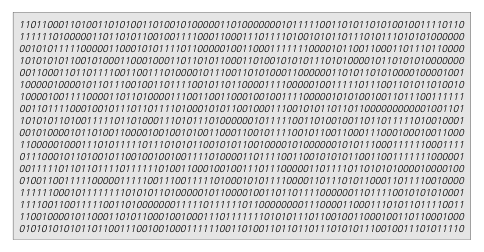
<!-- ORIGINAL_FIGURES page=0138 end -->

图注：`3/2` 的连续幂的小数部分大小。这些大小完全独立于表示数字所用的进制。只有点本身有意义；阴影和点之间的连线只是为了让图更容易阅读。

刚才给出的例子涉及带小数部分的数字。但结果表明，在只涉及整数的系统中，也能发现类似现象。

第一个例子，是对上面使用的乘以 `3/2` 操作作轻微变体：如果某一步的数字是偶数（能被 2 整除），就直接把它乘以 `3/2`，得到一个整数作为结果。但如果这个数字是奇数，就先加 1，使它变成偶数，然后再乘以 `3/2`。

图注：从数字 1 开始，然后应用如下规则的结果：如果某一步的数字是偶数，就乘以 `3/2`；否则先加 1，再乘以 `3/2`。这个过程产生一串整数，其二进制数字位序列显示在右侧。每一步得到的最右数字位显示在上方。当数字为偶数时该位为 0，为奇数时该位为 1；如图所示，这些数字位以看似随机的方式交替。结果表明，这里描述的系统与第 100 页所示寄存器机研究中出现的一个系统密切相关。这里的系统可以由规则 `n -> If[EvenQ[n], 3 n/2, 3 (n + 1)/2]` 表示，而第 100 页的系统遵循规则 `n -> If[EvenQ[n], 3 n/2, (3 n + 1)/2]`。第一步之后，这两个系统给出相同的数字序列，只差一个整体因子 3。

---

[[PDF page 139]]

<!-- ORIGINAL_FIGURES page=0139 start -->
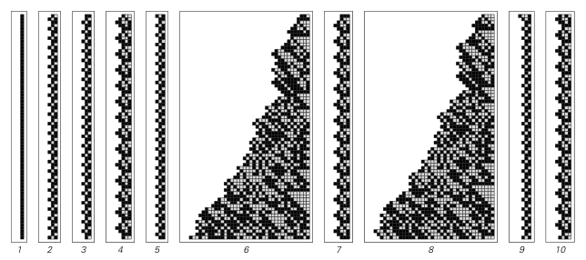
<!-- ORIGINAL_FIGURES page=0139 end -->

这个过程总能保证给出整数。从 1 开始，得到的数字序列为 1、3、6、9、15、24、36、54、81、123、186、279、420、630、945、1419、2130、3195、4794，……

这些数字中有些是偶数，有些是奇数。但如对页底部的结果所示，哪些数字为偶数、哪些为奇数的序列似乎完全随机。

不过，尽管存在这种随机性，得到的数字的整体大小仍然以相当规则的方式增长。但只要稍微改变过程，就能得到远不那么规则的增长。

例如考虑如下过程：如果某一步得到的数字是偶数，就把这个数字乘以 `5/2`；否则，先加 1，然后把结果乘以 `1/2`。

如果从 1 开始，那么这个过程在每一步都只给出 1。事实上，对许多起始数字来说，这个过程会产生纯粹重复的行为。但如下图所示，它也可以给出更复杂的行为。

图注：从不同初始 `n` 值出发，应用规则 `n -> If[EvenQ[n], 5 n/2, (n + 1)/2]` 的结果。在许多情形中，得到的行为纯粹重复。但在某些情形中并非如此。

例如从数字 6 开始，连续步骤中得到的数字大小显示出总体增加趋势，但存在相当大的波动，并且这些波动似乎本质上是随机的。事实上，即使经过一百万步，当得到的数字已经有 48,554 个十进制数字位时，仍没有重复或任何其他显著规则性的迹象。

---

[[PDF page 140]]

<!-- ORIGINAL_FIGURES page=0140 start -->
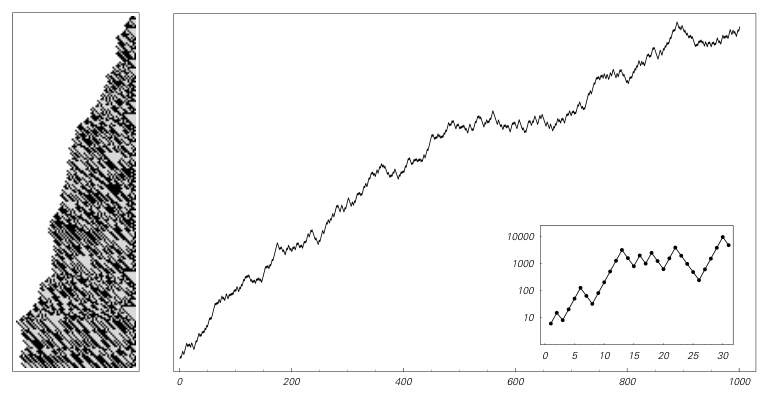
<!-- ORIGINAL_FIGURES page=0140 end -->

图注：从值 6 出发，遵循上一页同一规则得到的结果。右侧绘出前一千步所得数字的整体大小。图采用对数尺度，因此每个点的高度本质上就是它所代表数字的数字位序列长度，也就是左侧对应行的宽度。

因此，即使人们只看整数的整体大小，也仍然可能在基于数字的系统中得到巨大复杂性。

不过，虽然复杂性在这个层面上可见，要真正理解它为何出现，通常仍需要进入更细致的层面。事实上，本节发现的是，如果观察数字位序列，那么人们会看到复杂图案，而这些图案与元胞自动机等系统产生的图案惊人相似。

不过，元胞自动机这类系统的底层规则通常与基于数字的系统相当不同。关键点在于，元胞自动机的规则总是局部的：任何特定元胞的新颜色，只取决于该元胞此前的颜色及其紧邻邻居的颜色。但在基于数字的系统中，通常没有这种局部性。

人们从手算中知道，即使加法这样的操作，也能导致“进位”数字任意远地向左传播。事实上，大多数简单算术运算都有这样的性质：其结果中特定位置出现的一个数字位，可能依赖于原本离它很远的数字位。

---

[[PDF page 141]]

<!-- ORIGINAL_FIGURES page=0141 start -->
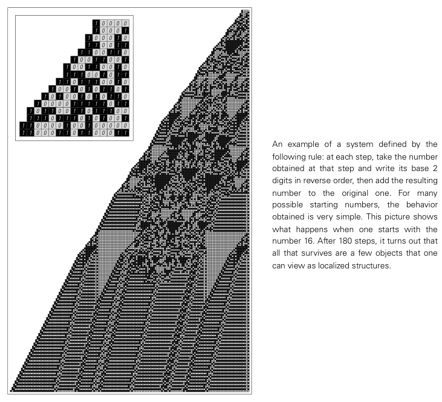
<!-- ORIGINAL_FIGURES page=0141 end -->

但尽管底层规则存在这类根本差异，基于数字的系统所产生的整体行为，仍然与比如元胞自动机中看到的行为非常相似。

所以，就像上一章讨论的各种程序一样，底层规则的细节似乎仍然不会对可能出现的行为类型产生关键影响。

事实上，尽管底层规则缺少局部性，下面以及后续几页的图仍显示，甚至可以找到基于数字的系统，表现出某种类似第 32 页元胞自动机中看到的局部结构。

图注：一个由如下规则定义的系统例子：每一步取该步得到的数字，把它的二进制数字位按逆序写出，然后把所得数字加到原来的数字上。对许多可能起始数字来说，得到的行为非常简单。本图显示从数字 16 开始时会发生什么。结果表明，在 180 步后，留下来的只是少数几个可以看作局部结构的对象。

---

[[PDF page 142]]

<!-- ORIGINAL_FIGURES page=0142 start -->
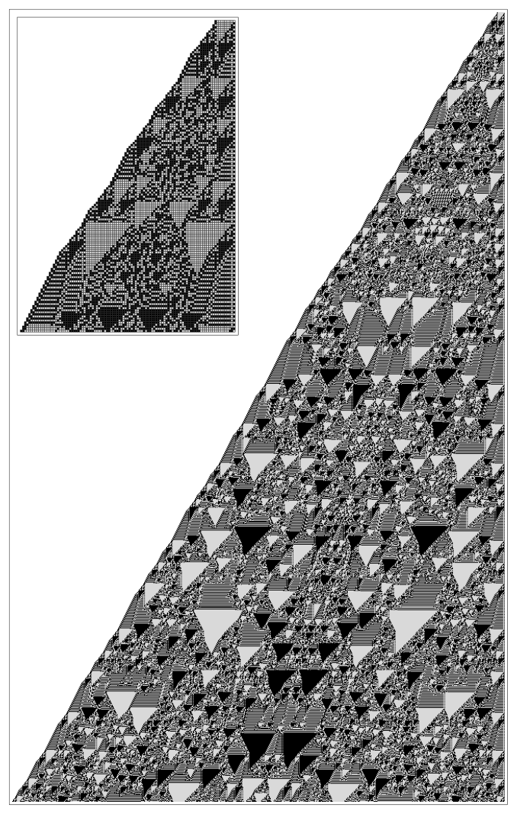
<!-- ORIGINAL_FIGURES page=0142 end -->

图注：与上一页同一规则的系统演化一千步，但现在从数字 512 开始。可以看到局部结构，但整体图案似乎从未采取任何简单重复形式。

---

[[PDF page 143]]

<!-- ORIGINAL_FIGURES page=0143 start -->
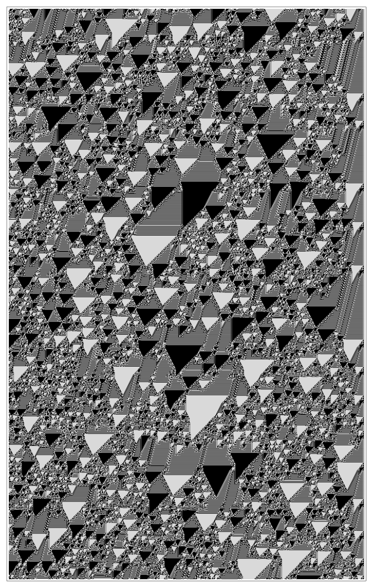
<!-- ORIGINAL_FIGURES page=0143 end -->

图注：对页图案的延续，从第一百万步开始。图中显示图案的右边缘；完整图案向左延伸约为页面宽度的 700 倍。

---

[[PDF page 144]]

<!-- ORIGINAL_FIGURES page=0144 start -->
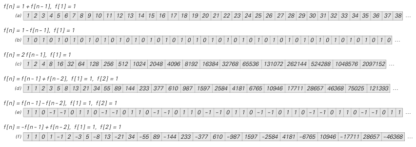
<!-- ORIGINAL_FIGURES page=0144 end -->

## 递归序列

上一节中，我们看到，只要应用多种基于简单算术的操作，就有可能得到相当复杂的行为。本节我要说明的是，在适当设置下，加法和减法在某种意义上就是所需要的唯一操作。

基本想法是考虑一个数字序列，其中存在一条确定规则，用于从先前数字得到序列中的下一个数字。把每个序列中的第一个数字称为 `f[1]`，第二个称为 `f[2]`，依此类推，这样第 `n` 个数字就记为 `f[n]`。用这种记法，规则所做的就是指定应怎样从序列中先前的数字计算 `f[n]`。

在最简单情形中，`f[n]` 只依赖于序列中紧挨它前面的数字，记为 `f[n - 1]`。但也可以设置这样的规则：`f[n]` 不仅依赖于 `f[n - 1]`，还依赖于 `f[n - 2]`，以及序列中更早的数字。

下表给出几个特定规则得到的结果。在所示所有情形中，这些结果都相当简单，包含均匀增长或以纯粹重复方式波动的序列。

图注：若干简单递归序列的例子。每个序列中的第 `n` 个元素记为 `f[n]`，规则指定该元素怎样由先前元素决定。对于这里展示的所有规则，连续元素要么平滑增加，要么以纯粹重复方式波动。序列 (c) 是 2 的幂；(d) 是所谓斐波那契序列，与黄金比例 `(1 + sqrt(5))/2 ≈ 1.618` 的幂有关。这里展示的这类所有规则，都会导致 `f[n]` 可以表示成形如 `a^n` 的幂的简单和。

---

[[PDF page 145]]

<!-- ORIGINAL_FIGURES page=0145 start -->
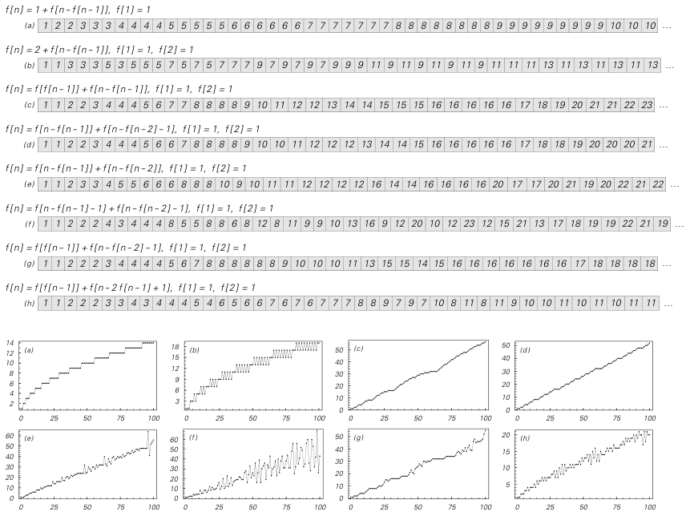
<!-- ORIGINAL_FIGURES page=0145 end -->

但结果表明，只要规则稍微复杂一点，就有可能得到复杂得多的行为。关键想法是考虑这样的规则：它们查看的不是序列中固定距离以前的数字。这意味着，`f[n]` 的规则除了只依赖 `f[n - 1]` 和 `f[n - 2]` 这类量之外，还可以例如依赖 `f[n - f[n - 1]]` 这样的量。

这里有一点微妙之处，因为抽象地说，没有任何东西保证 `n - f[n - 1]` 一定是正数。如果它不是正数，那么应用规则得到的结果可能涉及 `f[0]`、`f[-1]` 和 `f[-2]` 这类无意义的量。

图注：由不只依赖固定距离以前元素的规则生成的序列例子。大多数这类规则最终都会涉及 `f[0]` 和 `f[-1]` 这类无意义的量，但这里展示的特定规则都避免了这个问题。

---

[[PDF page 146]]

<!-- ORIGINAL_FIGURES page=0146 start -->
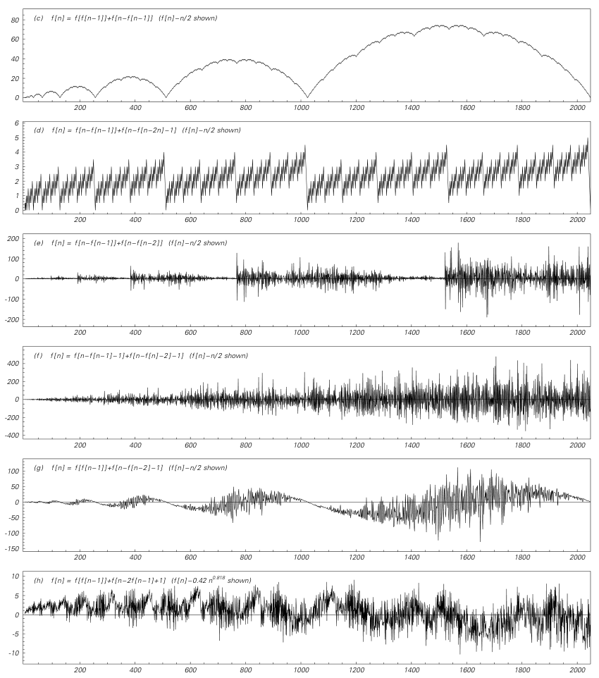
<!-- ORIGINAL_FIGURES page=0146 end -->

图注：上一页序列总体增长中的波动。在情形 (c) 和 (d) 中，波动具有规则嵌套形式，并且结果表明与 `n` 的二进制数字位序列直接相关。在其他情形中，波动更复杂，并且在许多方面似乎随机。所有展示的规则都从 `f[1] = f[2] = 1` 开始。

---

[[PDF page 147]]

对绝大多数随机写下的规则来说，这类问题确实会发生。但可以找到不会出现这些问题的规则，前两页的图展示了我发现的若干例子。在情形 (a) 和 (b) 中，行为相当简单。但在其他情形中，行为则复杂得多。

存在一个稳定的总体增长，但叠加在这种增长之上的，是对页图中所示的波动。

在情形 (c) 和 (d) 中，这些波动结果表明具有非常规则的嵌套形式。但在其他情形中，波动反而在许多方面看似随机。因此例如在情形 (f) 中，即使经过一百万步，正波动和负波动的数量平均看来仍相等。

但从某种意义上说，对页最令人惊讶的特征之一，是它显示的波动如此剧烈。人们可能会以为，从比如 `f[2000]` 到 `f[2001]`，只会有很小变化。毕竟，在 `n = 2000` 和 2001 之间，`n` 的大小只变化了 0.05%。

但很像上一节所见，结果表明，似乎真正重要的并不是 `n` 的大小，而是其表示的各个方面。事实上，例如在情形 (c) 和 (d) 中，`f[n]` 的波动与 `n` 的二进制数字位序列之间碰巧存在直接关系。

在情形 (d) 中，每个 `f[n]` 的波动本质上只是 `n` 的二进制数字位序列中出现的 1 的数量。而在情形 (c) 中，波动由所有小于 `n` 的数字的数字位序列中出现的 1 的总数决定。

对页展示的其他规则没有这类简单关系。但一般而言，人们会怀疑所有这些规则都可以被看作类似简单计算机程序，这些程序以 `n` 的某种表示作为输入。

本节我们发现的是，尽管规则归根到底只涉及加法和减法，它们仍然对应于能够产生高度复杂行为的程序。

---

[[PDF page 148]]

<!-- ORIGINAL_FIGURES page=0148 start -->
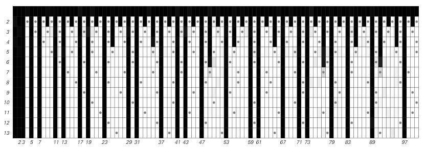
<!-- ORIGINAL_FIGURES page=0148 end -->

## 素数序列

在所有可能数字的序列 1、2、3、4、5、6、7、8，……中，大多数都能被其他数字整除，例如 6 能被 2 和 3 整除。但并非每个数字都是如此。例如 5 和 7 就不能被其他数字整除（除了平凡地被 1 整除）。事实上，两千多年前人们就已经知道，存在一个所谓素数的无穷序列，它们不能被其他数字整除；开头几个是 2、3、5、7、11、13、17、19、23、29、31、37，……

下图显示一种简单规则，可以由此得到这些素数。想法是从第一行的所有可能数字开始。然后在第二行中，去掉所有大于 2 且能被 2 整除的数字。在第三行中去掉能被 3 整除的数字，依此类推。随着过程继续，留下的数字越来越少。但总有一些数字留下来，而这些数字恰好就是素数。

图注：一个产生素数的筛选过程。第一行从 1 到 100 之间的所有数字开始。然后在第二行中，移除所有大于 2 且能被 2 整除的数字，如灰点所示。在第三行中，移除所有大于 3 且能被 3 整除的数字。如果一直继续下去，就会有一些数字始终留下来，它们恰好就是素数。图中所示过程本质上是埃拉托色尼筛法，早在公元前 200 年就已为人所知。

考虑到这条规则的简单性，人们可能会想象它生成的素数序列也会相应地简单。但正如本书中许多其他例子一样，事实上并非如此。对页图显示这个序列的各种特征，表明它在许多方面相当随机。

---

[[PDF page 149]]

<!-- ORIGINAL_FIGURES page=0149 start -->
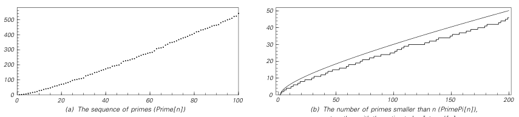
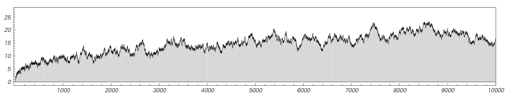
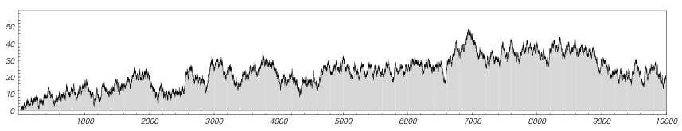
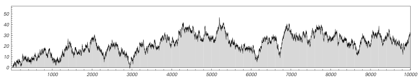
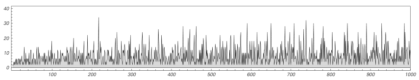
<!-- ORIGINAL_FIGURES page=0149 end -->

图注：素数序列的若干特征。尽管对页产生素数的规则很简单，实际得到的素数序列在许多方面看起来惊人地随机。图中包括：(a) 素数序列 `Prime[n]`；(b) 小于 `n` 的素数数量 `PrimePi[n]`，以及估计 `LogIntegral[n]`；(c) 差值 `LogIntegral[n] - PrimePi[n]`；(d) 形如 `3k - 1` 的素数相对于形如 `3k + 1` 的素数的超额；(e) 形如 `4k - 1` 的素数相对于形如 `4k + 1` 的素数的超额；(f) 连续素数之间的间隔。

---

[[PDF page 150]]

到目前为止，我在本书中展示的复杂性例子几乎全都是完全新的。但最初几百个素数毫无疑问即使在古代也已经为人所知，而且它们分布中至少存在某些复杂性一定已经显而易见。

然而，如果没有我在本书中发展出来的整个智识结构，这一观察的含义，以及它与自然现象等事物的潜在联系，就没有被认识到。并且，虽然几个世纪以来人们已经对素数序列做了大量数学工作，但几乎无一例外，这些工作关心的不是复杂性的基本问题，而是试图寻找特定类型的规则性。

然而结果表明，事实上发现的规则性很少；已经建立的结果往往只支持这样一种观念：这个序列具有许多随机性特征。举一个例子，从上一页图看，(c)、(d) 和 (e) 似乎会始终系统地保持在轴线上方。但事实上，经过相当努力，人们已经证明它们在某种意义上更加随机，最终会无限多次穿过轴线，而且实际上会向上或向下达到任意距离。

那么，我们在素数序列中看到的复杂性，在基于数字的序列中是否不同寻常？对页图展示了另外几个例子，它们按照基于数字性质的简单规则生成。

每种情形中，我们再次看到惊人的复杂程度。

如果我们不是按整体大小观察每个数字，而是按其数字位序列或可能因子的集合观察，那么这种复杂性中的某些部分可以被理解。但在大多数情形中，尽管数论中常常已有几个世纪的工作，仍有相当多复杂性保留下来。

事实上，唯一合理的结论似乎是，正如本书中许多其他系统一样，这类数字序列表现出的复杂性，在某种意义上是由生成这些序列的规则所导致的基本后果。

---

[[PDF page 151]]

<!-- ORIGINAL_FIGURES page=0151 start -->
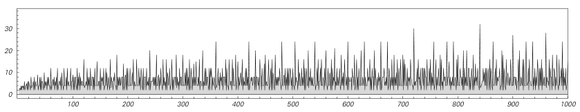
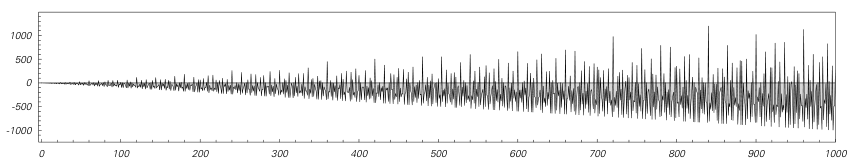
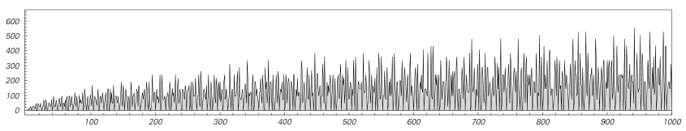
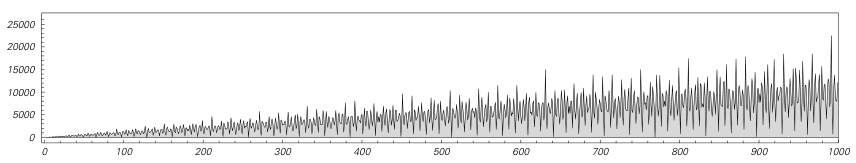
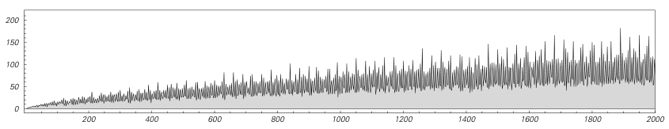
<!-- ORIGINAL_FIGURES page=0151 end -->

图注：基于数字各种简单性质的序列。数论中的大量工作只设法建立了这些序列的少数性质。例如已知 (d) 永远不会达到零，而曲线 (c) 只有在数字形如 `4^r (8s + 7)` 时才达到零。序列 (b) 在所谓完全数处为零。偶完全数总是具有一种已知形式，但是否存在奇完全数，是一个两千多年来仍未解决的问题。断言序列 (e) 永远不会达到零，就是所谓哥德巴赫猜想。它于 1742 年提出，但至今既没有证明，也没有反例。

---

[[PDF page 152]]

<!-- ORIGINAL_FIGURES page=0152 start -->
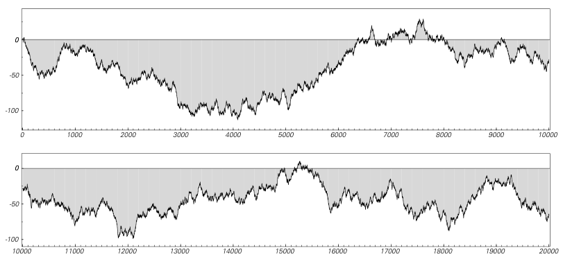
<!-- ORIGINAL_FIGURES page=0152 end -->

## 数学常数

前几节已经表明，人们可以设置各种基于数字的系统，其中能够出现巨大复杂性。但结果表明，出现这种复杂性的可能性，已经由初等数学中的一些著名事实暗示出来。

相关事实涉及像 `Pi`（圆周率）这样的数字中的数字位序列。极粗略地说，`Pi` 近似为 3.14。更准确的近似是 3.14159265358979323846264338327950288。

但这个数字位序列会怎样继续？

人们也许会假定，在某个层面上它必定相当简单而规则。因为 `Pi` 的值由一个简单定义指定：任何圆的周长与其直径之比。

但结果表明，尽管这个定义简单，`Pi` 的数字位序列一点也不简单。对页显示该序列的前 4000 个数字位，既有通常的十进制情形，也有二进制情形。下图则以图像方式表示了该序列的前 20,000 个二进制数字位。

图注：`Pi` 的前 20,000 个二进制数字位的图像表示。曲线在数字位为 1 时上升，在数字位为 0 时下降。明显可以看到巨大复杂性。如果曲线继续延伸，它会在轴线上方停留更长时间；而所见内容没有任何方面为数字位序列不是完全随机这一点提供证据。

---

[[PDF page 153]]

<!-- ORIGINAL_FIGURES page=0153 start -->
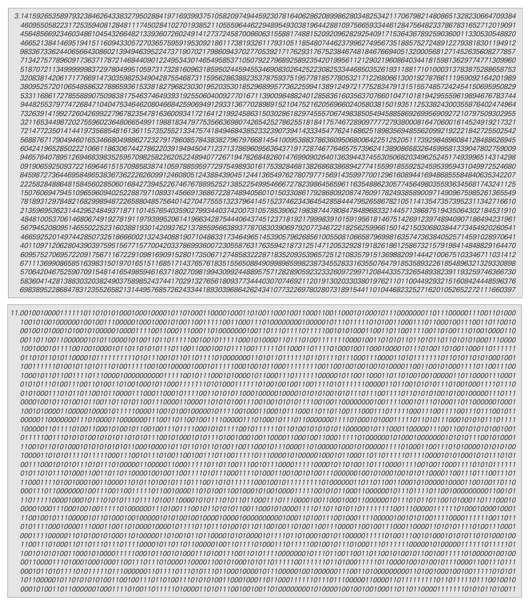
<!-- ORIGINAL_FIGURES page=0153 end -->

图注：`Pi` 在十进制和二进制中的前 4000 个数字位。尽管 `Pi` 的定义很简单，只是圆的周长与直径之比，它的数字位序列却复杂到在实际意义上显得随机。

---

[[PDF page 154]]

<!-- ORIGINAL_FIGURES page=0154 start -->
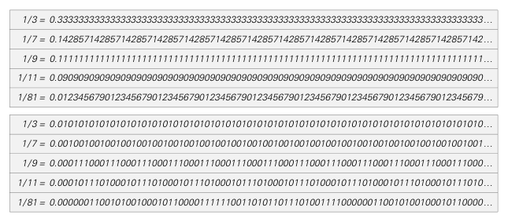
<!-- ORIGINAL_FIGURES page=0154 end -->

在任何情形中都没有明显规则性。事实上，在迄今已经计算出的 `Pi` 的超过两千亿个数字位中，从未发现任何种类的显著规则性。尽管定义简单，`Pi` 的数字位序列在实际意义上似乎完全随机。

但其他数字又如何？`Pi` 是特殊情形，还是其他熟悉的数学常数也具有复杂的数字位序列？有些数字的数字位序列实际上长度有限。例如，`3/8` 在十进制中的数字位序列是 0.375。（严格地说，其数字位序列是 0.3750000000……，但这些 0 不影响该数字的值，因此通常被省略。）

不过，很容易找到数字位序列不会终止的数字。例如，`1/3` 在十进制中的精确值是 0.3333333333333……，其中 3 永远重复。类似地，`1/7` 是 0.142857142857142857142857142857……，现在重复的是数字块 142857。下表给出若干通过整数相除得到的有理数的数字位序列。在所有情形中，我们看到这类数字的数字位序列都具有简单重复形式。事实上，结果表明，绝对所有有理数的数字位序列最终都会重复。

图注：若干有理数在十进制（上方）和二进制（下方）中的数字位序列。对于形如 `p/q` 的数字，数字位序列总会以至多 `q - 1` 步为周期重复。

通过观察除法过程的具体细节，可以理解为什么会如此。下面的图显示一种计算有理数 `p/q` 的二进制数字位序列的方法的连续步骤。

---

[[PDF page 155]]

<!-- ORIGINAL_FIGURES page=0155 start -->
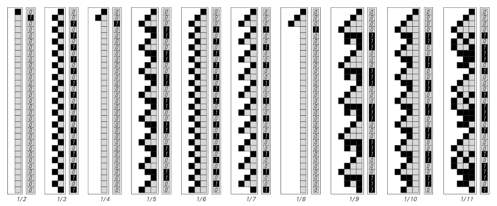
<!-- ORIGINAL_FIGURES page=0155 end -->

图注：计算各种有理数时的连续步骤。在每种情形中，右侧列显示该数字中的二进制数字位序列，而左侧方框显示计算每一步中的余数。

这个方法本质上是标准长除法，不过在二进制中比通常的十进制情形稍微简单。想法是有一个数 `r`，它本质上记录除法每一步的余数。开始时把 `r` 设为 `p`。然后每一步比较 `2r` 和 `q` 的值。如果 `2r` 小于 `q`，该步生成的数字位就是 0，并把 `r` 替换为 `2r`。否则，把 `r` 替换为 `2r - q`。在这个过程中，`r` 的值总是小于 `q`。因此，得到的数字位序列总会至多每 `q - 1` 步重复一次。

不过，结果表明，有理数具有这种简单数字位序列是非常不寻常的。事实上，如果人们例如观察平方根，情况就完全不同。

完全平方数，例如 `4 = 2 x 2` 和 `9 = 3 x 3`，被专门设置成具有整数平方根。但如下一页顶部表格所示，其他平方根具有复杂得多的数字位序列。事实上，据人们所能看出，除完全平方数外，所有整数的平方根，其数字位序列都显得完全随机。

---

[[PDF page 156]]

<!-- ORIGINAL_FIGURES page=0156 start -->
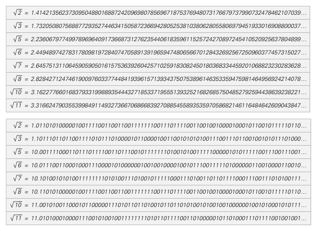
<!-- ORIGINAL_FIGURES page=0156 end -->

图注：若干平方根在十进制（顶部）和二进制（底部）中的数字位序列。尽管它们的定义简单，所有这些序列在实际意义上都显得随机。

但这种随机性是怎样产生的？对页顶部图给出一个过程例子，用来生成给定数字 `n` 的平方根的二进制数字位序列。

这个过程只比上面讨论的除法过程稍微复杂。它涉及两个数 `r` 和 `s`，起初分别设为 `n` 和 0。每一步它比较 `r` 和 `s` 的值；如果 `r` 大于 `s`，就把 `r` 和 `s` 分别替换为 `4 (r - s - 1)` 和 `2 (s + 2)`；否则就只把它们替换为 `4r` 和 `2s`。于是结果表明，`s` 的二进制数字位恰好对应于 `sqrt(n)` 的二进制数字位，每一步生成一个新的数字位。

如图所示，这个过程的结果表现出相当大的复杂性。事实上，它似乎就像本书讨论过的许多其他例子一样：生成平方根的过程基于简单规则，却仍然产生巨大复杂性的行为。

---

[[PDF page 157]]

<!-- ORIGINAL_FIGURES page=0157 start -->
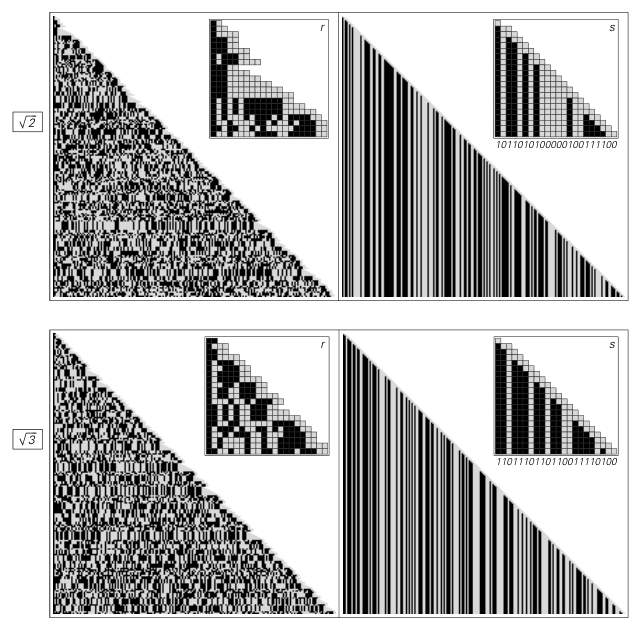
<!-- ORIGINAL_FIGURES page=0157 end -->

图注：一种生成平方根数字位序列的过程。涉及两个数字 `r` 和 `s`。为了求 `sqrt(n)`，开始时设置 `r = n` 且 `s = 0`。然后每一步应用规则 `{r, s} -> If[r > s, {4 (r - s - 1), 2 (s + 2)}, {4 r, 2 s}]`。结果是，`s` 在二进制中的数字位恰好对应于 `sqrt(n)` 的数字位。注意，如果 `n` 不在 1 和 4 之间，那么在开始这个过程之前，必须先用适当的 4 的幂去乘或除 `n`。

结果表明，平方根绝不是唯一具有表观随机数字位序列的数字。作为例子，下一页表格给出一些立方根和四次方根，以及一些对数和指数的数字位序列。据人们所能看出，几乎所有这类数字也都具有表观随机的数字位序列。

事实上，有理数结果表明是唯一具有重复数字位序列的一类数字。至少对于平方根、立方根等，人们知道不会出现嵌套数字位序列。用例如第 83 页的替换系统来构造嵌套数字位序列是直接的，但重点在于，这种数字位序列永远不对应于一个可以通过开根这一数学运算得到的数字。

---

[[PDF page 158]]

<!-- ORIGINAL_FIGURES page=0158 start -->
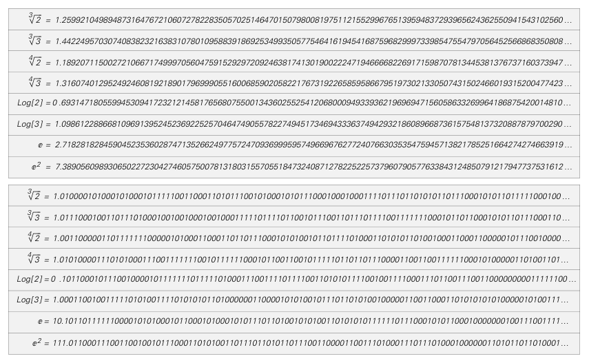
<!-- ORIGINAL_FIGURES page=0158 end -->

图注：立方根、四次方根、对数和指数的数字位序列，顶部以十进制给出，底部以二进制给出。这些序列同样在实际意义上显得随机。

到目前为止，在本章中我们一直使用数字位序列作为表示数字的方式。但人们也许会想象，也许这种表示在某种程度上很别扭；如果我们只选择另一种表示，那么由简单数学运算生成的数字就不再显得复杂。

任何数字的表示，在某种意义上都可以看作指定一个构造该数字的过程。例如，对页顶部图显示，`Pi` 的十进制和二进制数字位序列表示，可以怎样用来构造数字 `Pi`。

---

[[PDF page 159]]

<!-- ORIGINAL_FIGURES page=0159 start -->
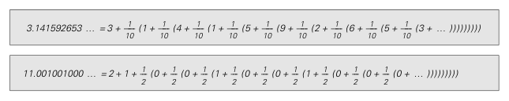
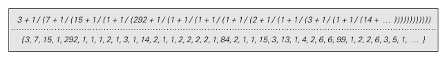
<!-- ORIGINAL_FIGURES page=0159 end -->

图注：用 `Pi` 的十进制和二进制数字位序列表示来逐步构造 `Pi` 的过程。

把上面出现的加法和乘法换成其他运算，就能得到数字的其他表示。一个常见例子是所谓连分数表示，其中使用加法和除法，如下方所示。

图注：`Pi` 的连分数表示。在这种表示中，`Pi` 的值通过连续的加法和除法构造出来，而不是通过连续的加法和乘法。

下一页表格给出各种数字的连分数表示。对于有理数，结果总是长度有限。但对其他数字而言，它们会无限继续。平方根结果表明具有纯粹重复的连分数表示。`e`（约 2.718）及其各次根的表示也显示明确规则性。但对于 `Pi`，以及立方根、四次方根等，得到的连分数表示似乎本质上随机。

其他数字表示又如何？在某个层面上，人们总可以用 `sqrt(2) + sqrt(3)` 这样的符号表达式来表示数字。并且几乎按定义，能够通过简单数学运算得到的数字，会对应于简单的这类表达式。但问题在于，从用于表示一个数字的符号表达式出发，要计算该数字的实际值究竟会有多困难，并没有保证。

因此，在思考数字表示时，似乎适合把自己限制在这样一些情形：从表示中找出数字值所需的工作量，对所有数字来说本质上相同。

---

[[PDF page 160]]

<!-- ORIGINAL_FIGURES page=0160 start -->
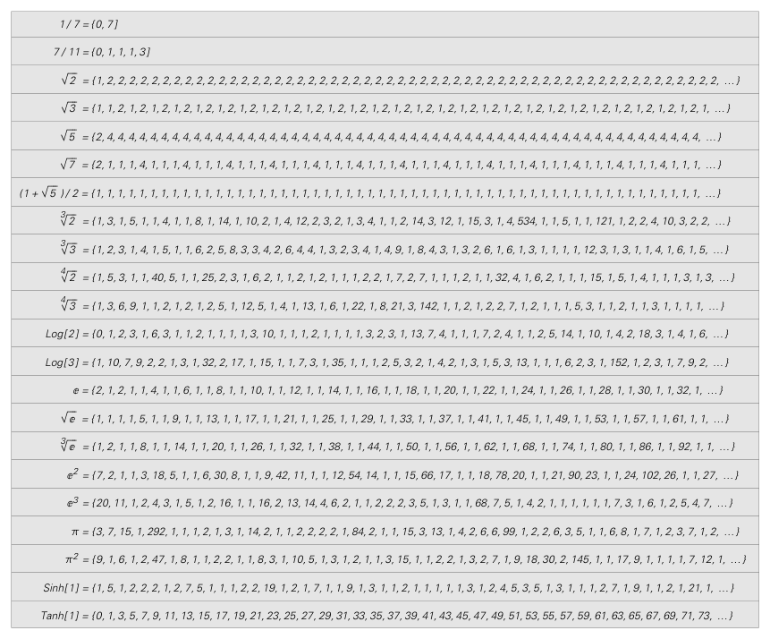
<!-- ORIGINAL_FIGURES page=0160 end -->

图注：若干数字的连分数表示。平方根在这种表示中给出重复序列，但立方根和更高次根则给出看似随机的序列。

如果这样做，那么典型经验是，在任何特定表示中，某一类数字会具有简单形式。但其他数字，即使它们是简单数学运算的结果，也往往具有看似随机的形式。

由此看来，适合得出的结论是：由简单数学运算生成的数字，常常在某种内在意义上是复杂的，独立于人们用来观察它们的特定表示。

---

[[PDF page 161]]

<!-- ORIGINAL_FIGURES page=0161 start -->
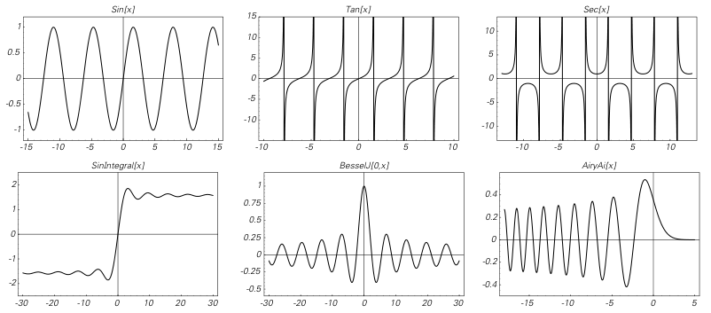
<!-- ORIGINAL_FIGURES page=0161 end -->

## 数学函数

上一节表明，通过应用各种简单数学函数得到的单个数字，可以具有相当复杂的特征。但这些函数本身又如何？

下图显示的是绘制标准数学函数所得的曲线。所有这些曲线都具有相当简单、本质上重复的形式。事实上，结果表明，例如在 Mathematica 中定义的几乎所有标准数学函数，都会给出类似简单的曲线。

图注：若干标准数学函数的图像。上排显示三个三角函数。下排显示三个所谓特殊函数，它们常见于数学物理和传统科学的其他领域。在所有情形中，所示曲线都具有相当简单的重复形式。

但如果观察这些标准函数的组合，就相当容易得到更复杂的结果。下一页图显示，例如把各种正弦函数相加会发生什么。第一幅图中，所得曲线具有相当简单的重复结构。第二幅图中，曲线更复杂，但仍然具有整体重复结构。但在第三幅和第四幅图中，不存在这种重复结构，曲线事实上在许多方面看似随机。

---

[[PDF page 162]]

<!-- ORIGINAL_FIGURES page=0162 start -->
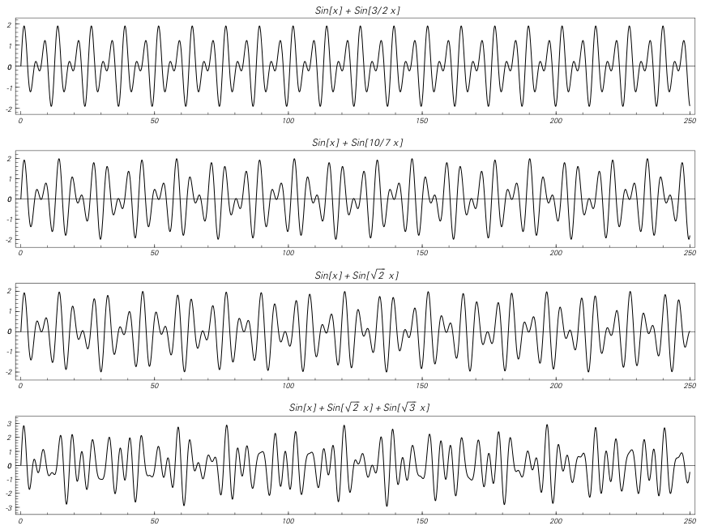
<!-- ORIGINAL_FIGURES page=0162 end -->

图注：把各种正弦函数相加所得的曲线。在前两种情形中，曲线最终是重复的；在后两种情形中则不是。如果把它们看作声音的波形，那么这些曲线对应于和弦。第一条曲线给出纯五度，而第三条曲线在平均律音阶中给出减五度（或三全音）。

不过，在第三幅图中，曲线穿过轴线的位置形成两个规则间隔的族。正如对页图所示，对任何形如 `Sin[x] + Sin[alpha x]` 的曲线来说，这些交叉点的相对排列结果表明与一个广义替换系统的输出有关；该系统每一步的规则由 `(alpha - 1)/(alpha + 1)` 的连分数表示中的一个项得到。

当 `alpha` 是平方根时，如上一节讨论的，连分数表示是纯粹重复的，

---

[[PDF page 163]]

<!-- ORIGINAL_FIGURES page=0163 start -->
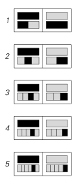
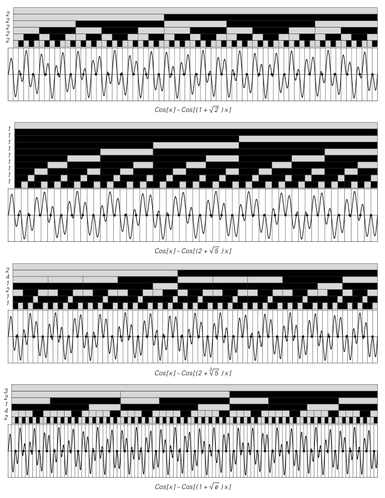
<!-- ORIGINAL_FIGURES page=0163 end -->

图注：把恰好两个正弦或余弦函数相加或相减得到的曲线，其轴线交叉点模式结果表明可以由一个广义替换系统重现。一般而言，当广义替换系统中对应元素为黑色时，相应区间中存在一次轴线交叉；当元素为白色时则不存在。在 `Cos[x] - Cos[a x]` 的情形中，广义替换系统每一步的规则由左侧所示、从 `(a - 1)/(a + 1)` 的连分数表示中的一项确定。在前两个例子中，`a` 是二次无理数，因此连分数是重复的，得到的图案是纯粹嵌套的。（第二个例子类似于第 83 页的斐波那契替换系统。）但在后两个例子中，不存在这种规则性。注意，每个连分数中的连续项，与沿页面向上的替换系统连续步骤并列显示。

---

[[PDF page 164]]

<!-- ORIGINAL_FIGURES page=0164 start -->
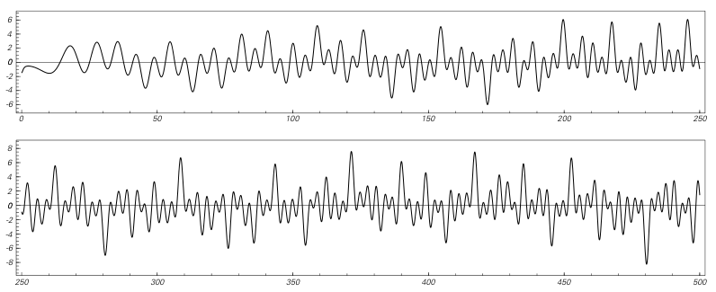
<!-- ORIGINAL_FIGURES page=0164 end -->

于是生成的图案是嵌套的。但当 `alpha` 不是平方根时，图案可以更复杂。而如果涉及两个以上正弦函数，那么似乎不再与广义替换系统或连分数有任何特定联系。

在例如 Mathematica 中定义的各种数学函数中，结果表明也有少数函数会给出复杂曲线，但并不显得明确依赖于单个数字的表示；这些函数在传统自然科学中并不常见。其中许多与所谓黎曼 zeta 函数有关，下图显示了它的一个版本。

这个函数的基本定义相当简单。但最终结果表明，该函数与素数分布有关，它生成的曲线相当复杂。事实上，尽管一个多世纪以来人们投入了巨大数学努力，迄今甚至还无法证明例如所谓黎曼猜想；这个猜想实质上只是说，曲线中的所有峰都位于轴线上方，所有谷都位于轴线下方。

图注：与所谓黎曼 zeta 函数相关的一条曲线。zeta 函数 `Zeta[s]` 定义为 `Sum[1/k^s, {k, infinity}]`。这里显示的曲线是所谓 Riemann-Siegel Z 函数，它本质上是 `Zeta[1/2 + 5 t]`。著名的黎曼猜想实质上断言，这条曲线中第一个峰之后的所有峰都必须位于轴线上方。

---

[[PDF page 165]]

## 迭代映射与混沌现象

迭代映射的基本想法是取一个 0 到 1 之间的数字，然后在连续步骤中按照一条固定规则或“映射”来更新这个数字。我将考虑的许多映射可以用标准数学函数表示，但一般来说，所需要的只是：映射能把 0 到 1 之间的任何可能数字，变成另一个同样位于 0 到 1 之间的确定数字。

接下来两页图展示了用四种不同映射选择得到的行为例子。

第一页中的情形 (a) 和 (b)，在数字位序列和数字大小上，都显示出与本章许多其他系统中看到的相同类型的复杂性。情形 (c) 在数字位序列中显示复杂性，但它生成的数字大小会迅速趋向于 0。情形 (d) 则似乎本质上平凡，在数字位序列和数字大小上都不显示复杂性。

接下来两页中的第一页，所有例子都从数字 `1/2` 开始，而这个数字具有简单的数字位序列。但第二页上的例子改为从数字 `Pi/4` 开始，而它具有看似随机的数字位序列。

在两页上，情形 (a)、(b) 和 (c) 看起来非常相似，特别是在数字大小方面。但情形 (d) 看起来相当不同。因为在第一页上，它只产生 0。但在第二页上，它产生的数字大小会以看似随机的方式连续变化。

如果观察数字位序列，为什么会发生这一点就相当清楚。因为如图所示，情形 (d) 使用的所谓移位映射，只是在每一步把所有数字位向左移动一位。这意味着，在系统演化过程中，原始数字中更靠右的数字位会逐渐一路移到左边；因此，只要这些数字位显示随机性，生成数字的大小就会出现随机性。

不过，重要的是要意识到，在任何真实意义上，这个系统的演化实际上并没有生成任何随机性。相反，只是原始数字的数字位序列中所插入的随机性，在人们得到的结果中表现出来。

---

[[PDF page 166]]

<!-- ORIGINAL_FIGURES page=0166 start -->
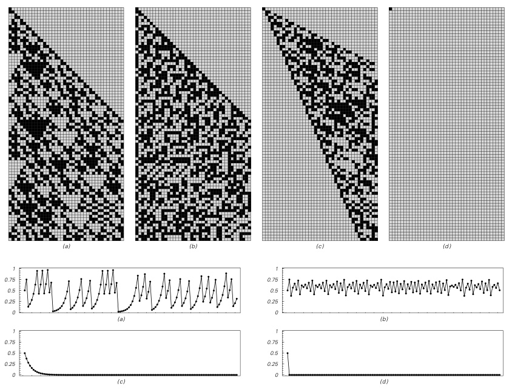
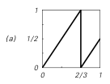
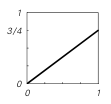
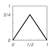
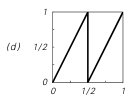
<!-- ORIGINAL_FIGURES page=0166 end -->

图注：从简单初始条件出发的迭代映射例子。每一步都有一个 0 到 1 之间的数字 `x`，它通过应用一个固定映射而更新。这里考虑的四种映射在上方既以公式给出，也以图像给出。页面顶部的图显示对该映射进行迭代后连续得到数字的二进制数字位序列；页面中部的图则绘出这些数字的大小。在所有情形中，初始条件都是数字 `1/2`，它具有非常简单的数字位序列。然而尽管如此简单，情形 (a) 和 (b) 在所产生数字的数字位序列和大小上都显示出相当大的复杂性（比较第 122 页）。在情形 (c) 中，数字位序列复杂，但数字大小会迅速趋向零。最后，在情形 (d) 中，无论数字位序列还是数字大小都只是平凡的。注意，上方图中每一水平行数字位对应一个数字，而越靠左的数字位对这个数字的大小贡献越大。

---

[[PDF page 167]]

<!-- ORIGINAL_FIGURES page=0167 start -->
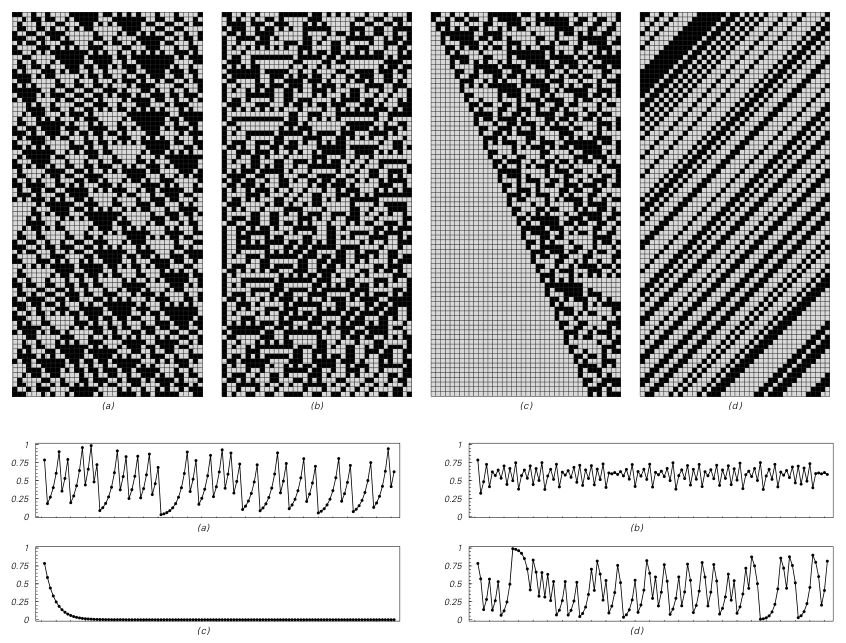
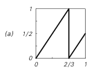
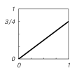
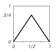
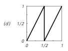
<!-- ORIGINAL_FIGURES page=0167 end -->

图注：与对页相同的迭代映射，但现在从初始条件 `Pi/4` 开始；这是一个具有看似随机数字位序列的数字。经过相当少的步骤后，情形 (a) 和 (b) 产生的行为几乎无法与对页简单初始条件下看到的行为区分。情形 (c) 中，数字大小仍然像以前一样指数衰减。但在情形 (d) 中，行为复杂得多。事实上，如果只看所产生数字的大小，那么人们会看到与情形 (a) 和 (b) 相同类型的复杂性。但观察数字位序列就会意识到，这种复杂性实际上只是对由一个看似随机数字位序列的初始条件引入的复杂性的直接抄写。情形 (d) 是所谓移位映射，是表现出通常称为混沌的初始条件敏感依赖的经典例子。

---

[[PDF page 168]]

这与情形 (a) 和 (b) 中发生的事情非常不同。因为在这些情形中，即使在前两页中的第一页，也就是原始数字具有非常简单的数字位序列时，也会得到复杂而看似随机的结果。关键在于，这些映射实际上内在地生成复杂性和随机性；它们不是只在初始条件中插入这些东西时才抄写它们。

在本书已经发展出来的方法背景下，这一区分很容易理解。但在传统数学方法中，事情可能变得相当混乱。主要问题，也就是本章开头已经提到的问题，是在这种方法中，通常被认为有意义的数字唯一属性就是大小。这意味着，任何基于显式讨论数字位序列的问题，例如它们是简单还是复杂，往往至多显得很古怪。

事实上，如果纯粹按大小思考数字，人们也许会想象，只要两个数字在大小上足够接近，它们就不可避免地会导致某种同样接近的结果。事实上，传统数学中微积分的许多形式化体系，正是以这一点为基础。

但所谓混沌现象的本质在于，有些系统中，数字大小中任意小的改变，最终都能对产生的结果造成巨大影响。前两页情形 (d) 所示的移位映射，结果表明就是一个经典例子。

对页顶部的图显示，如果把这个系统的初始条件取为两个大小只相差十亿亿分之一的数字，会发生什么。观察产生数字大小的图，人们会看到在相当长时间内，这两个不同初始条件导致的结果近得无法区分。但在某一点它们分离，并很快变得相当不同。

至少如果只看数字大小，这似乎相当神秘。但一旦观察数字位序列，事情立刻就清楚得多。因为如对页顶部的图所示，用作初始条件的两个数字在大小上只差很小，只意味着它们的前若干数字位相同。在一段时间里，重要的正是这些数字位。但由于系统演化不断把数字位向左移动，后面数字位中存在的差异最终必然会变得重要。

---

[[PDF page 169]]

<!-- ORIGINAL_FIGURES page=0169 start -->
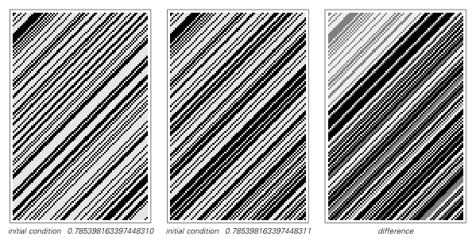
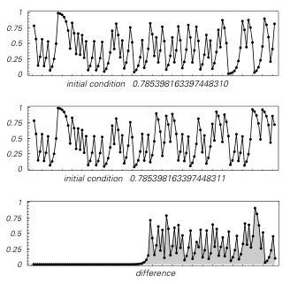
<!-- ORIGINAL_FIGURES page=0169 end -->

图注：对移位映射的初始条件作微小改变所产生的影响；移位映射是第 150 和 151 页情形 (d) 所示系统。第一幅图显示与第 151 页相同初始条件下的结果。第二幅图显示，如果把该初始条件中数字的大小只改变十亿亿分之一，会发生什么。左侧图表表明，在一段时间内，这两种情形中系统演化得到的数字大小无法区分。但突然之间结果分离并变得完全不同。观察上方数字位序列就能看出为什么会发生这种情况。关键在于，初始条件中数字大小的微小改变，对应于远在右侧的数字位改变。但系统演化会逐步把数字位向左移动，因此不同的数字位最终会变得重要。被大量研究的混沌现象，本质上就是这种效应。

初始条件中的小变化可以导致结果中的大变化，这是一个有些有趣的现象。但正如我将在第 7 章详细讨论的，必须意识到，就其本身而言，这不能解释为什么任何特定情形中会出现随机性或复杂性。事实上，对移位映射来说，我们已经看到，只有在给定初始条件恰好是一个数字位序列随机的数字时，随机性才会出现。

但过去经常令人困惑的是，传统数学隐含地倾向于假设这类初始条件在某种意义上是不可避免的。因为如果纯粹按大小来思考数字，那么人们就不应在大小足够接近的数字之间作区分。

---

[[PDF page 170]]

这意味着，在为移位映射这类系统选择初始条件时，人们因此不应在精确数字 `1/2` 与大小足够接近 `1/2` 的数字之间作区分。

但结果表明，如果随机选择一个数字，而唯一约束是它的大小位于某个范围内，那么得到的数字以压倒性概率会具有本质上随机的数字位序列。如果随后把这个数字用作移位映射的初始条件，结果也会相应随机，就像上一页中的结果一样。

过去，这一事实有时被用来说明移位映射以某种方式从根本上产生随机性。但如我在上面讨论的，能从这种系统中实际出来的唯一随机性，是通过其初始条件的细节明确放进去的随机性。这意味着，任何关于该系统产生随机性的说法，实际上都必须是关于通常为它给定怎样的初始条件的说法。

原则上，我想自然界可能会有效地遵循传统数学中的同一种理想化，并最终纯粹按大小来选择数字。如果真是这样，那么移位映射这类系统的初始条件自然几乎总是会具有随机数字位序列。

但这条推理路线最终永远不会太有用。因为它所说的是，我们看到的随机性以某种方式来自已经存在的随机性，而它并没有解释那种随机性来自哪里。事实上，如我将在第 7 章讨论的，如果只观察移位映射这类系统，就并不清楚任何新的随机性是否真的能够生成。

但本书中的一个关键发现是，第 150 和 151 页中的情形 (a) 和 (b) 这类系统，能够表现出在许多方面看似随机的行为，即使它们的初始条件没有任何随机性迹象，事实上还极其简单。

然而，情形 (a) 和 (b) 这类系统即使从简单初始条件也能内在地产生随机性，并不意味着它们不表现出初始条件敏感依赖。事实上，下图说明，即使在这类情形中，数字位序列的变化也会像移位映射情形 (d) 中一样被逐步放大。

---

[[PDF page 171]]

<!-- ORIGINAL_FIGURES page=0171 start -->
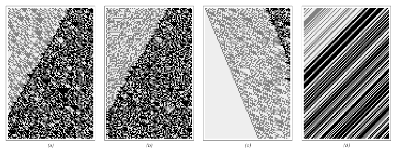
<!-- ORIGINAL_FIGURES page=0171 end -->

图注：本节讨论的四种迭代映射中，由初始条件微小改变产生的数字位序列差异。情形 (a)、(b) 和 (d) 表现出初始条件敏感依赖，也就是说，远在右侧、不重要数字位中的改变最终会增长到影响所有数字位。情形 (c) 不显示这种初始条件敏感性，而是不论初始条件如何，都会演化到 0。

但我将在第 7 章进一步讨论的关键点是，在情形 (a) 和 (b) 这类系统中，存在初始条件敏感依赖，并不以任何方式意味着这就是我们在这些系统中看到的随机性和复杂性的原因。事实上，从数字位序列角度观察移位映射所显示的是，这个现象本身根本不能对我们合理认为的随机性的最终产生作出任何贡献。

## 连续元胞自动机

尽管上一章讨论的各种程序彼此之间有许多差异，但它们有一个共同点：它们都基于只能采取一组离散可能形式的元素，典型情形只是黑色和白色两种颜色。而在本章中，我们通过考虑数字位序列，把类似的离散性引入了对基于数字的系统的研究；每个数字位也只能有一组离散可能值，典型情形只是 0 和 1。

---

[[PDF page 172]]

<!-- ORIGINAL_FIGURES page=0172 start -->
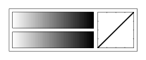
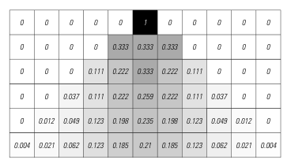
<!-- ORIGINAL_FIGURES page=0172 end -->

于是现在出现一个问题：过去三章中我们看到的所有复杂性，是否在某种意义上依赖于我们所观察系统中元素的离散性？

为了处理这个问题，本节我要考虑一种元胞自动机的推广，其中每个元胞不只是黑色或白色，而是可以取连续灰度范围中的任何灰度。人们可以用这样的规则来更新每个元胞的灰度：它们在某种意义上是上一章开头讨论的总和型元胞自动机规则与上一节刚讨论的迭代映射之间的交叉。

想法是观察一个元胞及其紧邻邻居的平均灰度，然后通过对结果应用一个固定映射，得到该元胞下一步的灰度。下图显示一个非常简单的情形，其中每个元胞的新灰度恰好就是该元胞及其紧邻邻居灰度的平均值。从单个黑色元胞开始，这种情形中发生的是灰度本质上只是扩散开来，最终留下一个均匀图案。

图注：一个连续元胞自动机，其中每个元胞可以具有从白色（0）到黑色（1）之间的任何灰度。这里展示的规则把每个元胞的新灰度取为它自身灰度与其紧邻邻居灰度的平均值。

对页图显示，当规则稍微复杂一些时会发生什么：把平均灰度乘以 `3/2`，如果结果大于 1，就只保留其小数部分。

---

[[PDF page 173]]

<!-- ORIGINAL_FIGURES page=0173 start -->
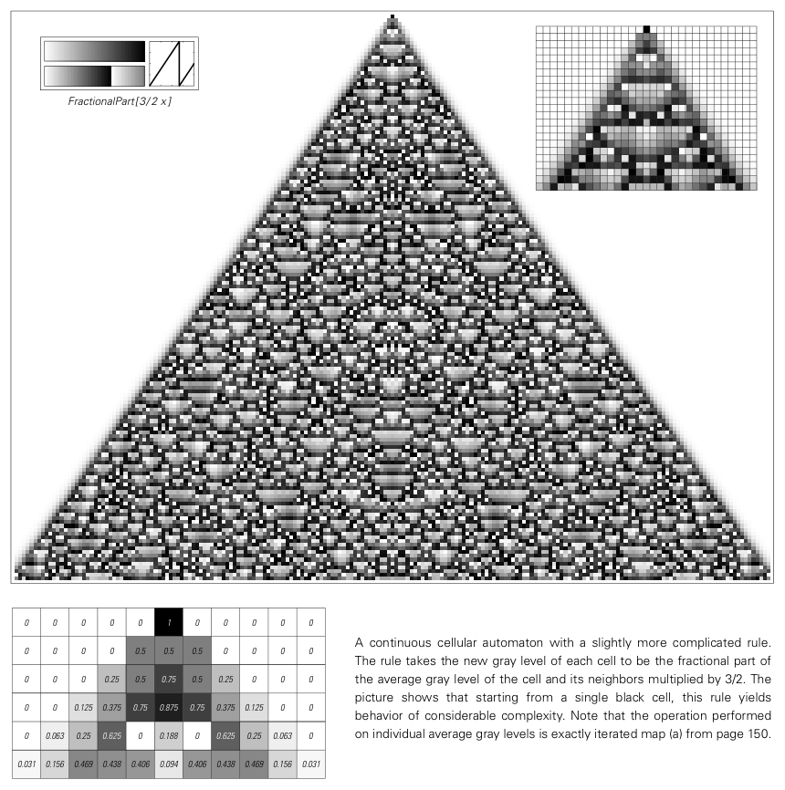
<!-- ORIGINAL_FIGURES page=0173 end -->

图注：一个规则稍微复杂的连续元胞自动机。规则把每个元胞的新灰度取为该元胞及其邻居平均灰度乘以 `3/2` 后的小数部分。图中显示，从单个黑色元胞开始，该规则会产生相当复杂的行为。注意，对单个平均灰度执行的操作，恰好就是第 150 页迭代映射 (a)。

我们看到的是，尽管存在连续灰度，产生的行为仍表现出与许多普通元胞自动机以及其他具有离散底层元素的系统中看到的同一类复杂性。

---

[[PDF page 174]]

<!-- ORIGINAL_FIGURES page=0174 start -->
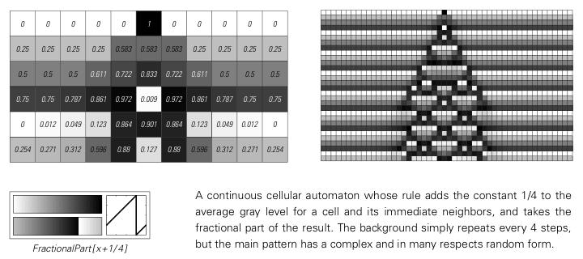
<!-- ORIGINAL_FIGURES page=0174 end -->

事实上，结果表明，在连续元胞自动机中，只需要极其简单的规则就能生成相当复杂的行为。作为例子，下图显示一条规则，它通过只把常数 `1/4` 加到一个元胞及其紧邻邻居的平均灰度上，然后取结果的小数部分，来决定该元胞的新灰度。

图注：一个连续元胞自动机，其规则把常数 `1/4` 加到一个元胞及其紧邻邻居的平均灰度上，并取结果的小数部分。背景只是每 4 步重复一次，但主体图案具有复杂且在许多方面随机的形式。

对页以及再下一页显示，当选择不同被加常数时会发生什么。可以看到惊人的行为多样性。有时行为纯粹重复，但经常具有一些实际看似随机的特征。

事实上，如第 160 页中部图所示，甚至可以找到表现出局部结构的情形，非常类似于普通元胞自动机中偶尔看到的局部结构。

图注：与上图同类规则的连续元胞自动机，但加入各种不同常数。注意，决定每种情形中产生的整体行为形式的，似乎并不太是常数的大小，而是其数字位序列这类性质。

---

[[PDF page 175]]

<!-- ORIGINAL_FIGURES page=0175 start -->
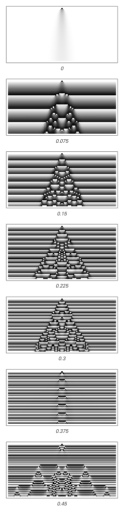
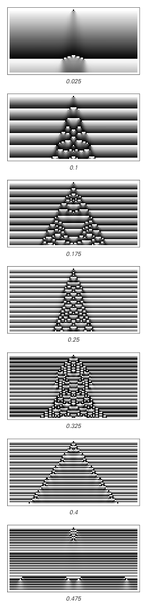
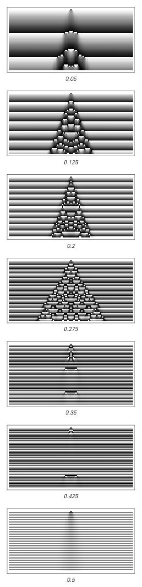
<!-- ORIGINAL_FIGURES page=0175 end -->

图示续：加入不同常数的连续元胞自动机演化例子。

---

[[PDF page 176]]

<!-- ORIGINAL_FIGURES page=0176 start -->
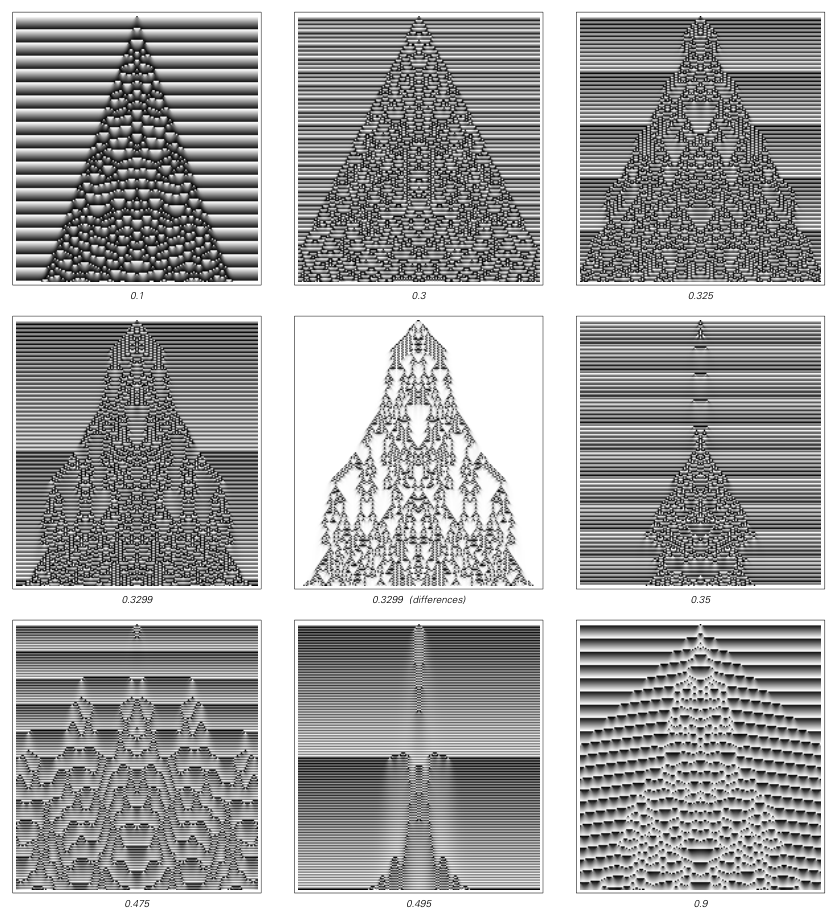
<!-- ORIGINAL_FIGURES page=0176 end -->

图注：与上一页同类规则的连续元胞自动机在更多步骤中的演化。为了去除均匀条纹，中间图显示每个元胞的灰度与其紧邻邻居灰度之间的差。注意，尽管系统底层规则涉及连续灰度，仍然出现了离散的局部结构。

---

[[PDF page 177]]

## 偏微分方程

通过引入具有连续灰度范围的连续元胞自动机，我们已经成功去除了普通元胞自动机中存在的某些离散性。但仍有许多离散性保留下来：连续元胞自动机仍然由离散元胞组成，并在离散时间步中更新。

那么，事实上能否构造完全不存在这种离散性的系统？结果表明，至少原则上可以，虽然这样做需要比本书目前所需更高层次的数学抽象。

基本想法是，想象灰度这样的量可以在空间和时间中连续变化。这意味着，不再只是离散时间步中的离散元胞具有灰度，而是假定在空间中每一点、时间中每一刻都存在一个确定灰度，仿佛取了无限多个元胞和时间步的极限，每个元胞都有无穷小尺寸，每个时间步都持续无穷小时间。

但怎样给出这样一个系统的演化规则？由于没有显式时间步可用，人们必须改为指定空间中每一点的灰度随时间变化的速率。通常，人们把这个速率给成一个简单公式，它依赖于空间中每一点的灰度，以及该灰度随位置变化的速率。

这类规则在数学中称为偏微分方程，事实上它们已经被广泛研究了大约两百年。结果表明，物理学和科学其他领域中几乎所有传统数学模型，最终都基于偏微分方程。因此，例如麦克斯韦电磁方程、爱因斯坦引力方程、量子力学的薛定谔方程，以及神经细胞电化学的 Hodgkin-Huxley 方程，都是偏微分方程的例子。

从某种意义上说，涉及如此高层次数学抽象的系统竟然在实践中如此广泛地被使用，是令人惊讶的。因为正如我们稍后将在本书中看到的，自然界当然并不是从根本上遵循这些抽象。

---

[[PDF page 178]]

我怀疑，偏微分方程目前的主导地位，在许多方面其实是历史偶然；如果计算机技术在数学史中更早发展出来，今天的情形很可能会非常不同。

但尤其在计算机出现以前，偏微分方程最大的吸引力在于，至少在简单情形中，可以为其行为找到显式数学公式。这意味着，例如，人们可以只通过计算一个单一数学公式，就求出空间和时间中特定点的灰度，而不必在某种意义上追踪偏微分方程的完整演化。

对页图显示多年来已经被研究过的三个常见偏微分方程。

第一幅图显示扩散方程，可以把它看作第 156 页连续元胞自动机的一种极限情形。它的行为总是非常简单：任何初始灰度都会逐渐扩散开，最终只剩下均匀白色。

第二幅图显示波动方程。对这个方程来说，所示的初始灰度团块只是分裂为两个相同部分，它们无变化地分别向左和向右传播。

第三幅图显示 sine-Gordon 方程。它导致的行为比其他方程稍微复杂，虽然它生成的图案仍具有简单重复形式。

考虑到人们已经在偏微分方程上做了大量数学工作，人们可能会以为，到现在已经研究了范围极广的不同方程。但事实上，至少在一维情形中，几乎所有工作都集中在对页三个具体方程，以及少数本质上等价于它们的其他方程上。

如我们已经看到的，这些方程只产生简单行为。

那么，在偏微分方程中事实上是否可能得到更复杂的行为？本书关于其他类型系统的结果强烈暗示应当可以。但传统数学方法对于怎样找到这类行为几乎不给出任何指导。

---

[[PDF page 179]]

<!-- ORIGINAL_FIGURES page=0179 start -->
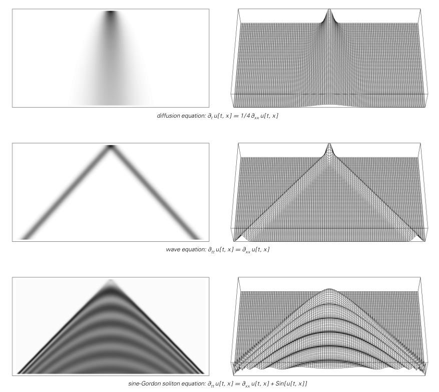
<!-- ORIGINAL_FIGURES page=0179 end -->

图注：历史上被广泛研究的三个偏微分方程。就像本书其他图一样，位置沿页面横向展开，时间向页面下方推进。在每个方程中，`u` 是特定点的灰度，`partial_t u` 是灰度随时间变化的速率（一阶导数），`partial_tt u` 是这种变化速率自身的变化速率（二阶导数）。类似地，`partial_x u` 是随空间位置变化的速率，`partial_xx u` 是这种变化速率自身的变化速率。在本页及后续几页中，所用初始条件为 `u = 4^-x`，`partial_t u = 0`。

---

[[PDF page 180]]

事实上，最好的方法似乎本质上只是搜索许多不同偏微分方程，寻找那些结果显示复杂行为的方程。

但一个立即出现的困难是，没有明显方式对可能的偏微分方程进行抽样。在元胞自动机这类离散系统中，总有一组离散的可能规则。但在偏微分方程中，任何数学公式都可以出现。

尽管如此，通过把公式表示为由离散可能组件组成的符号表达式，人们至少可以设计出某些偏微分方程抽样方案。

然而，即使给定一个特定偏微分方程，也无法保证该方程会给出自洽结果。事实上，对极大比例随机选择的偏微分方程来说，人们发现只经过很短时间，得到的灰度要么变得无限大，要么开始在空间或时间中无限快地变化。而一旦出现这类现象，原方程就不再能用于决定未来行为。

但尽管有这些困难，我最终还是找到了接下来两页所示的偏微分方程。

这些方程的数学陈述相当简单。但如图所示，它们的行为高度复杂。

事实上，颇为奇怪的是，尽管底层方程是连续的，它们产生的图案似乎包含一些具有某种离散结构的斑块。

不过，接下来两页图展示的关键点是，本书中看到的这类复杂行为，绝不局限于基于离散元素的系统。在这些离散系统中发现和研究这类行为当然容易得多；但通过本节学到的内容，我们现在知道，同类行为也可以出现在偏微分方程这类完全连续的系统中。

---

[[PDF page 181]]

<!-- ORIGINAL_FIGURES page=0181 start -->
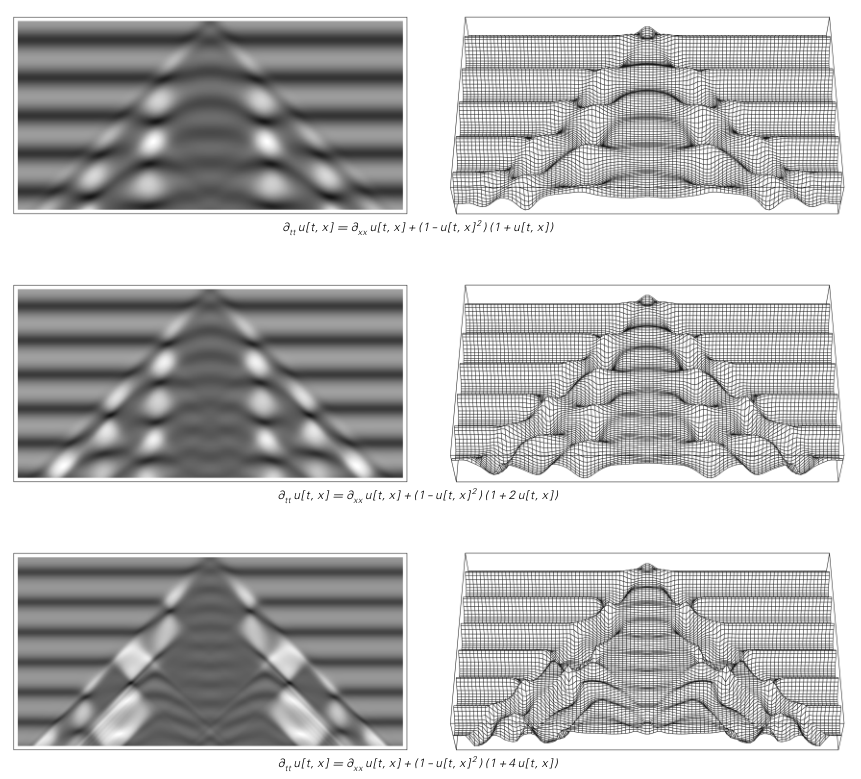
<!-- ORIGINAL_FIGURES page=0181 end -->

图注：我找到的若干具有更复杂行为的偏微分方程例子。每种情形中的背景纯粹重复，但图案主体复杂，并让人想到连续元胞自动机以及本书讨论的许多其他类型系统所产生的行为。

---

[[PDF page 182]]

<!-- ORIGINAL_FIGURES page=0182 start -->
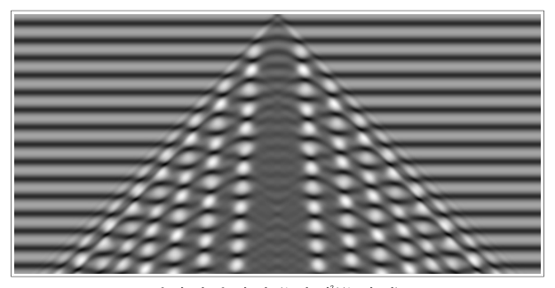
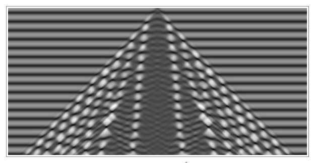
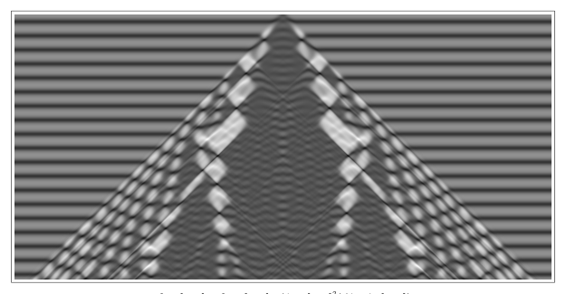
<!-- ORIGINAL_FIGURES page=0182 end -->

图示续：与上一页相同方程在更长时间中的解。

---

[[PDF page 183]]

## 连续系统与离散系统

我基于简单程序的科学方法，与基于数学方程的传统方法之间，最明显的差异之一是：程序倾向于涉及离散元素，而方程倾向于涉及连续量。

但这种差异最终有多重要？

人们可能会以为，我识别出的复杂性基本现象也许只能出现在离散系统中。但从前几节的结果，我们知道事实并非如此。

不过，确实成立的是，在离散系统中发现这一现象，要比在连续系统中容易得多。复杂性在任何根本意义上大概并不比在离散系统中更罕见于连续系统。但关键在于，离散系统通常可以用直接得多的方式研究。

事实上，给定一个离散系统的规则，做一个计算机实验来弄清该系统会怎样行为，通常是相当直接的事情。但给定一个连续系统的方程，常常需要相当多分析，才能哪怕近似弄清该系统会怎样行为。事实上，最终人们通常很难知道，自己看到的哪些方面是真正属于系统的特征，哪些只是用于研究它的特定方法和近似所造成的伪迹。

在传统科学和数学史中，人们对连续系统做了如此多工作，因此毫无疑问，有许多情形中已经看到了与复杂性现象相关的效应。但因为复杂性的基本现象并不为人所知，也不被期待，这类效应很可能总是被当作某种并非所研究系统真正特征的东西而被排除。然而，当我来研究离散系统时，并没有可能以这种方式排除我看到的东西。因此，在某种意义上，我被迫承认复杂性的基本现象。

图注：与上一页相同方程在更长时间中的解。注意离散结构的出现。特别是在最后一幅图中，有些细节对计算方程解时使用的数值近似方案敏感。

---

[[PDF page 184]]

但现在，有了这种现象存在的知识，就可以回过头重新观察连续系统。

尽管存在显著技术困难，正如前几节所显示的，人们会发现复杂性现象能够在连续系统中出现，正如它在离散系统中出现一样。

确定离散系统中正在发生什么，仍然比确定连续系统中正在发生什么容易得多。但我怀疑，过去几章中我们在离散系统里观察到的各种现象，事实上本质上全都可以在规则相当简单的连续系统中找到。
