# 第 5 章：二维及更高维

[[PDF page 185]]

<!-- ORIGINAL_FIGURES page=0185 start -->
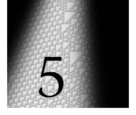
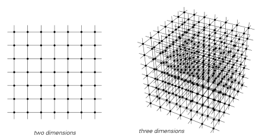
<!-- ORIGINAL_FIGURES page=0185 end -->

# 二维及更高维

## 引言

我们生活的物理世界包含三个空间维度。然而到目前为止，本书中讨论的所有系统，实际上都只限于一维。

因此，本章的目的，是考察允许超过一个维度会造成多大差异。

至少在简单情形中，基本想法如下面图中所示，是考虑这样的系统：它们的元素并不只沿一条一维直线排列，而是例如排布在二维网格上。

图注：元素在一维、二维和三维中的简单排布例子。在二维中，所示的是方形网格；三角形和六边形网格也同样可能。在三维中，所示的是立方格；类似于规则晶体的各种其他晶格也可能存在，非重复排布也可能存在。

---

[[PDF page 186]]

<!-- ORIGINAL_FIGURES page=0186 start -->
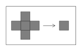
<!-- ORIGINAL_FIGURES page=0186 end -->

传统科学往往暗示，允许超过一个维度会产生非常重要的后果。事实上，结果表明，传统科学中研究最多的许多现象，在只有一维时根本不会发生。

例如，涉及几何形状的现象通常至少需要二维，而依赖纽结结构存在的现象则需要三维。但复杂性现象又如何？它在多大程度上依赖维度？

可能发生的是，一旦超出一维，我们看到的行为性质就会立刻改变。事实上，在本章过程中，我们会遇到许多依赖超过一个维度才有的具体效应。

但我们最终会发现，从整体层面看，我们在二维或更高维中看到的行为，与一维中的行为并没有根本性的巨大差异。事实上，尽管传统科学可能让我们预期相反，增加更多维度最终似乎并不会对任何显著复杂行为的出现产生多大影响。

## 元胞自动机

到目前为止，本书讨论的元胞自动机全都是纯粹一维的，因此每一步只涉及一行元胞。但也可以考虑二维元胞自动机，它涉及整张元胞网格，每个元胞的颜色都按照依赖其在网格四个方向上邻居的规则更新，如下图所示。

图注：典型二维元胞自动机规则的形式。本节讨论的情形中，每个元胞不是黑色就是白色。我通常考虑所谓总和型规则，其中中心元胞的新颜色只取决于其四个邻居此前颜色的平均值，以及它自身此前的颜色。

---

[[PDF page 187]]

<!-- ORIGINAL_FIGURES page=0187 start -->
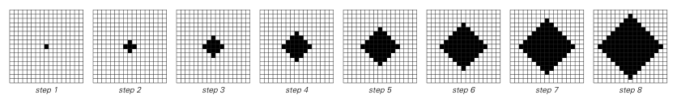
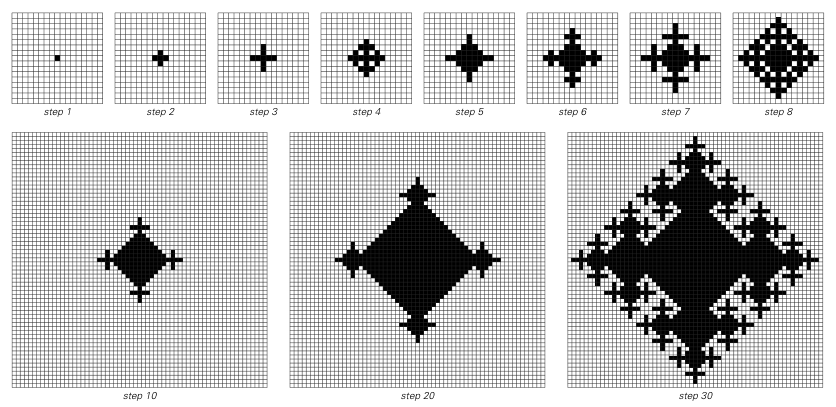
<!-- ORIGINAL_FIGURES page=0187 end -->

下图显示一个特别简单的规则会发生什么：如果某个元胞的四个邻居中有任意一个在上一步是黑色，那么该元胞就变成黑色。

图注：一个二维元胞自动机的连续演化步骤，其规则规定，如果某个元胞的任意邻居在上一步是黑色，该元胞就应当变成黑色。（按第 173 页描述的编号方案，该规则代码为 1022。）

从单个黑色元胞开始，这条规则只会产生一个均匀扩张的菱形黑色区域。但只要稍微改变规则，就可以得到更复杂的增长图案。下面图中显示的例子使用这样一条规则：如果某个元胞恰好有一个邻居或全部四个邻居在上一步是黑色，它就变成黑色，否则保持原来的颜色不变。

图注：一个二维元胞自动机的演化步骤，其规则规定，如果某个元胞恰好有一个或全部四个邻居在上一步是黑色，该元胞就应当变成黑色，否则保持同一颜色。从单个黑色元胞开始，这条规则产生一个精细但非常规则的增长图案。（按第 173 页的编号方案，该规则代码为 942。）

---

[[PDF page 188]]

<!-- ORIGINAL_FIGURES page=0188 start -->
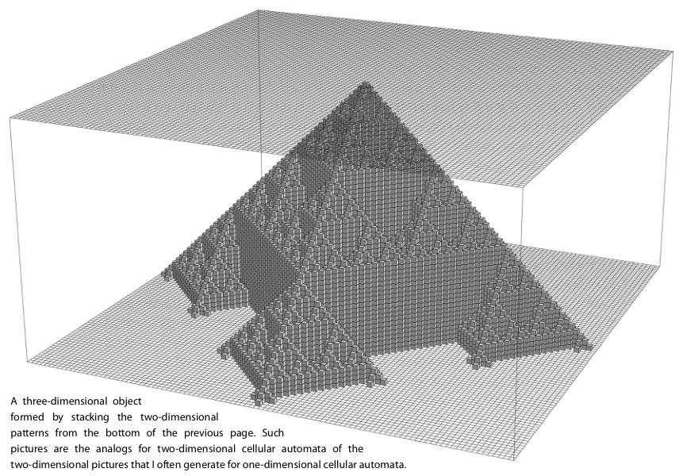
<!-- ORIGINAL_FIGURES page=0188 end -->

这种情形中产生的图案不再具有简单几何形式，而是常常表现出某种让人想起雪花的精细结构。然而，尽管如此精细，这些图案仍然显示出很强规则性。事实上，如果把连续步骤中的图案叠放起来，形成如下图那样的三维对象，那么这个对象具有非常规则的嵌套结构。

图注：把上一页底部的二维图案叠放起来形成的三维对象。这类图像对于二维元胞自动机而言，相当于我经常为一维元胞自动机生成的二维图像。

但其他规则又如何？对页和再下一页显示了一串不同规则的二维元胞自动机所产生的图案。每个图案内部往往有相当大的复杂性。但结果表明，这种复杂性非常类似于我们已经在一维元胞自动机中看到的复杂性。

---

[[PDF page 189]]

<!-- ORIGINAL_FIGURES page=0189 start -->
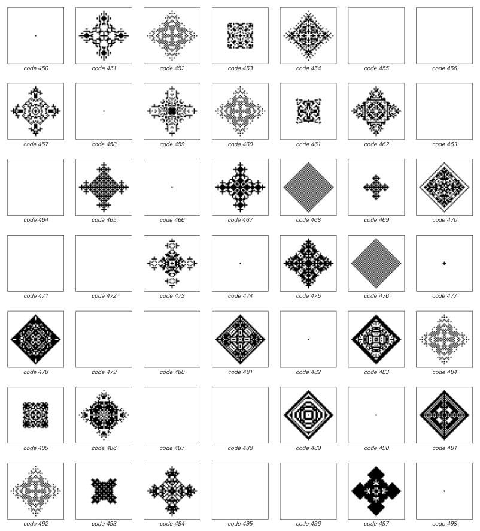
<!-- ORIGINAL_FIGURES page=0189 end -->

图注：由一系列二维元胞自动机规则生成的图案。这些图案从单个黑色方块开始，运行 22 步产生。在每种情形中，代码编号的二进制数字位序列按如下方式指定规则：最后一位指定如果中心元胞在上一步为白色且所有邻居也都是白色，中心元胞应是什么颜色；倒数第二位指定如果所有邻居为白色但中心元胞本身为黑色时会发生什么；更前面的每一位则依次指定随着黑色邻居数量逐渐增多时应发生什么。（比较第 60 页。）

---

[[PDF page 190]]

<!-- ORIGINAL_FIGURES page=0190 start -->
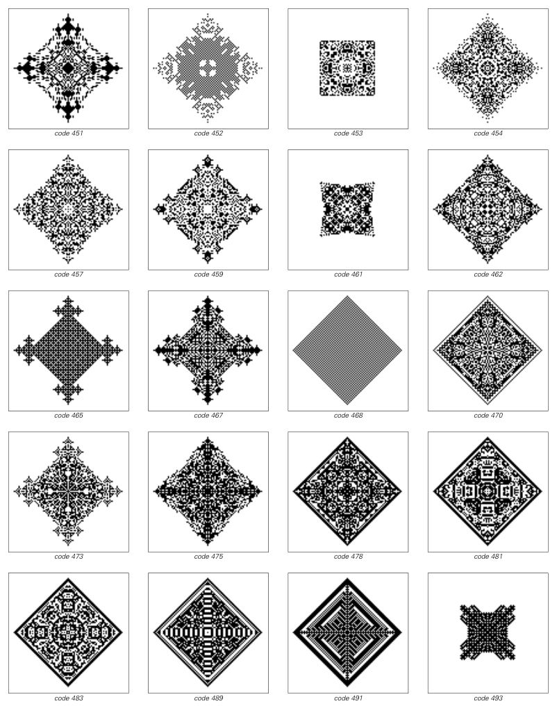
<!-- ORIGINAL_FIGURES page=0190 end -->

图注：上一页若干二维元胞自动机生成的图案，但现在演化步数加倍。

---

[[PDF page 191]]

<!-- ORIGINAL_FIGURES page=0191 start -->
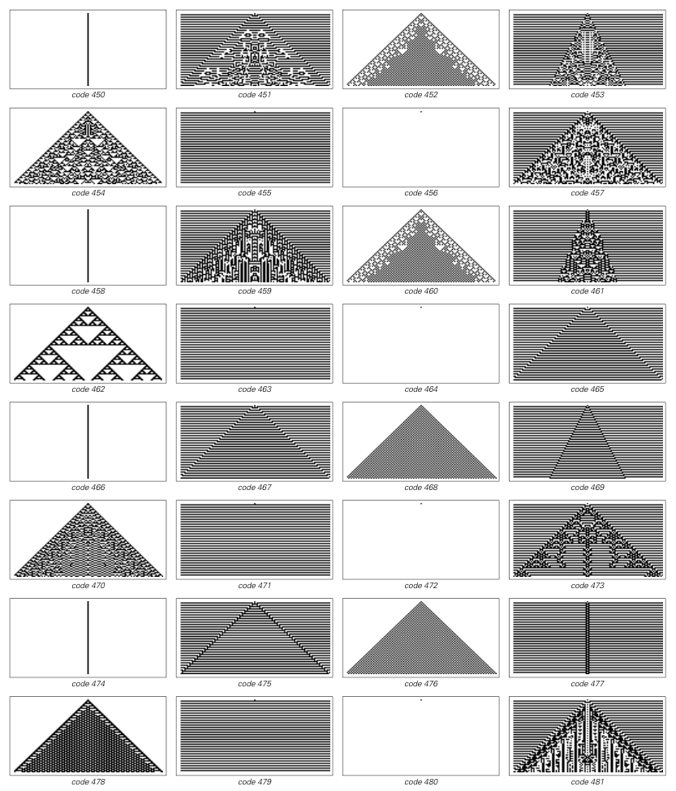
<!-- ORIGINAL_FIGURES page=0191 end -->

图注：穿过前两页若干二维元胞自动机的一维切片的演化。每幅图显示位于穿过每个二维图案中心的一维直线上的元胞颜色。结果与前几章在纯粹一维元胞自动机中看到的结果惊人相似。

---

[[PDF page 192]]

事实上，上一页显示，如果观察穿过每个二维图案的一维切片的演化，得到的结果与我们在普通一维元胞自动机中看到的结果惊人相似。

但观察这类切片，无法揭示二维图案整体形状的许多内容。事实上，结果表明，前几页展示的所有二维元胞自动机，其整体形状总是非常规则。

不过，仍然可以找到产生不那么规则形状的二维元胞自动机。作为第一个例子，对页图展示了一条规则，它产生的图案表面至少在小尺度上具有看似随机的不规则性。

然而，在这个特定情形中，结果表明，从更大尺度看，表面遵循一条相当平滑的曲线。事实上，如第 178 页图所示，甚至可以找到其整体形状非常接近完美圆形的元胞自动机。

但并不是所有二维元胞自动机都只产生简单整体形状。第 179-181 页的图展示了一个不会这样做的规则例子。这条规则实际相当简单：只要某个元胞的八个邻居中，包括对角邻居在内，恰好有三个是黑色，它就变成黑色；否则保持原来的颜色不变。

为了让这条规则产生任何增长，初始条件中必须至少有三个黑色元胞。第 179 页顶部图显示从不同数量黑色元胞出发会发生什么。在某些情形中，产生的图案相当简单，通常只经过几步后就停止增长。但在其他情形中，会产生复杂得多的图案，而且常常似乎会永远增长下去。

第 181 页的图显示从一行十一个黑色元胞出发，然后演化数百步所产生的行为。得到的形状似乎不断变化，从未产生简单整体形式。

因此，二维元胞自动机图案中的巨大复杂性，似乎不仅可以存在于黑白元胞的具体排布中，也可以存在于图案的整体形状中。

---

[[PDF page 193]]

<!-- ORIGINAL_FIGURES page=0193 start -->
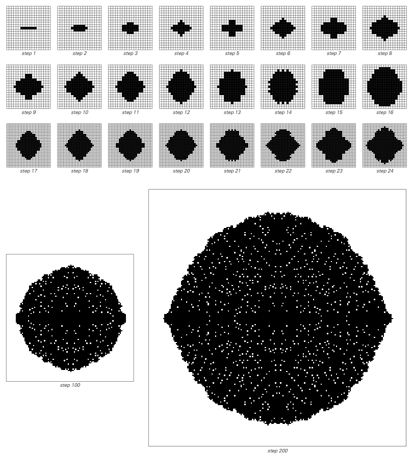
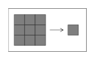
<!-- ORIGINAL_FIGURES page=0193 end -->

图注：一个产生粗糙表面图案的二维元胞自动机。这里使用的规则包括对角邻居，因此每个元胞总共涉及 8 个邻居，如左侧图标所示。规则规定，如果中心元胞的 8 个邻居中有 3 个或 5 个在前一步为黑色，那么中心元胞就应当变成黑色，否则保持原来的颜色不变。所示情形的初始条件是一行 7 个黑色元胞。按前几页图片所用方案扩展到 8 个邻居时，该规则代码编号为 175850。

---

[[PDF page 194]]

<!-- ORIGINAL_FIGURES page=0194 start -->
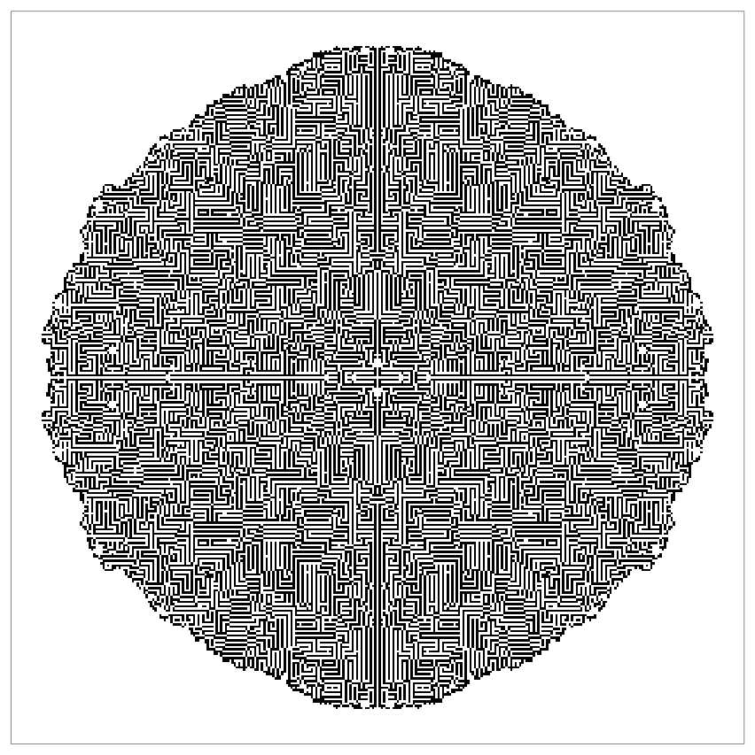
<!-- ORIGINAL_FIGURES page=0194 end -->

图注：一个产生近似圆形图案的元胞自动机。所用规则与上一页属于同一类，但现在只有当中心元胞恰好有 3 个黑色邻居时才使其变成黑色。如果它有 1、2 或 4 个黑色邻居，就保持原来的颜色不变；如果它有 5 个或更多黑色邻居，那么下一步变成白色（代码编号 746）。初始条件与上一页图中一样，是一行 7 个黑色元胞。这里显示的图案是系统演化 400 步的结果。经过 `t` 步后，近似圆的半径约为 `0.37 t`。

---

[[PDF page 195]]

<!-- ORIGINAL_FIGURES page=0195 start -->
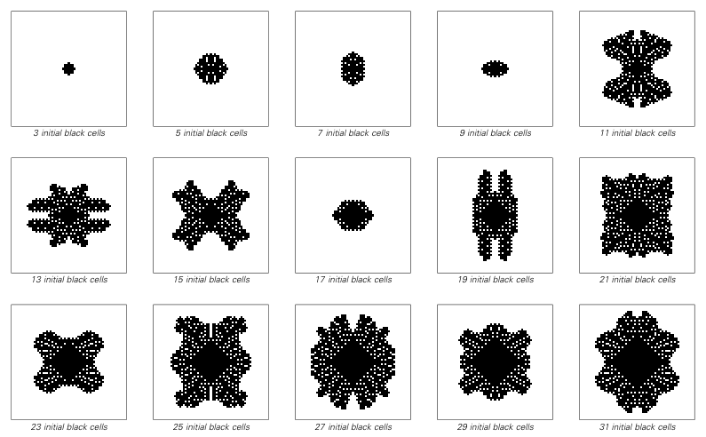
<!-- ORIGINAL_FIGURES page=0195 end -->

图注：从不同长度的黑色元胞行出发，按照一条简单二维元胞自动机规则演化所产生的图案。所用规则规定，如果某个元胞的八个邻居（包括对角邻居）中恰好有三个是黑色，它就应当变成黑色（代码编号 174826）。图中的图案是按这条规则演化 60 步得到的。上方较小图案在这个步数后都已经停止增长，但许多其他图案显然会永远继续增长。

那么，三维元胞自动机又如何？把二维规则的设置推广到三维情形是直接的。但尤其在印刷页面上，要以容易被吸收的方式显示三维元胞自动机的演化相当困难。

不过，第 182 和 183 页确实显示了若干三维元胞自动机例子。正如二维情形一样，可以看到一些具体的新现象。但总体看来，所产生的基本行为类型与一维和二维中的行为并无不同。特别是，复杂性的基本现象似乎并不以任何关键方式依赖所观察系统的维数。

---

[[PDF page 196]]

<!-- ORIGINAL_FIGURES page=0196 start -->
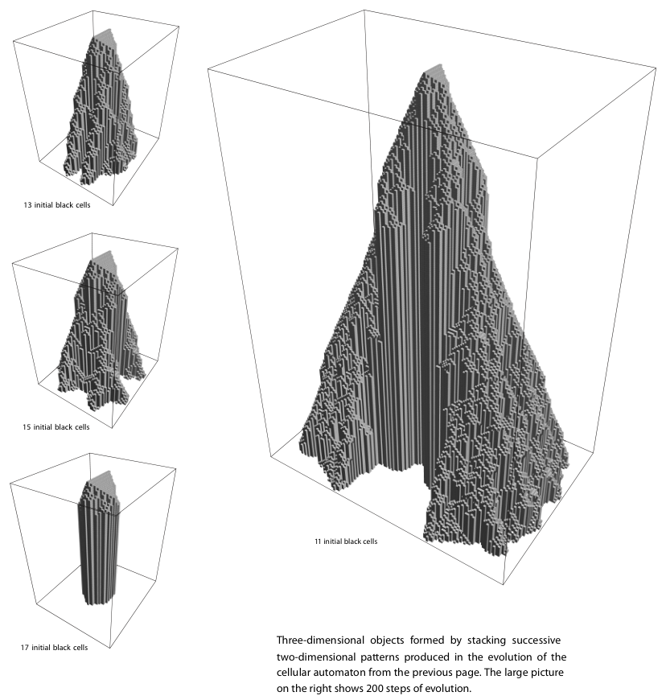
<!-- ORIGINAL_FIGURES page=0196 end -->

图注：把上一页元胞自动机演化中产生的连续二维图案叠放起来形成的三维对象。右侧大图显示 200 步演化。

---

[[PDF page 197]]

<!-- ORIGINAL_FIGURES page=0197 start -->
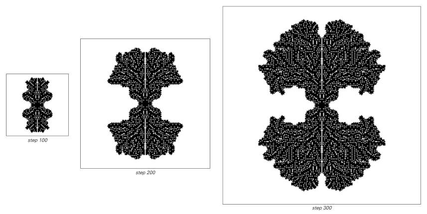
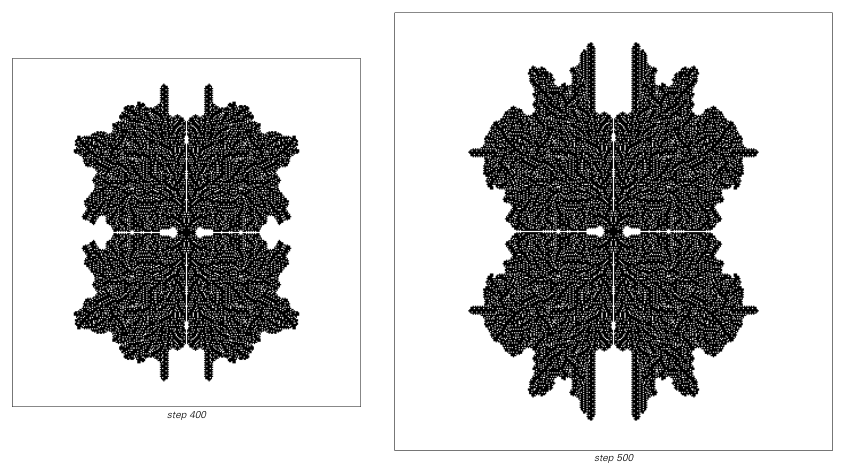
<!-- ORIGINAL_FIGURES page=0197 end -->

图注：对页元胞自动机的演化阶段，从初始条件为一行 11 个黑色元胞开始。

---

[[PDF page 198]]

<!-- ORIGINAL_FIGURES page=0198 start -->
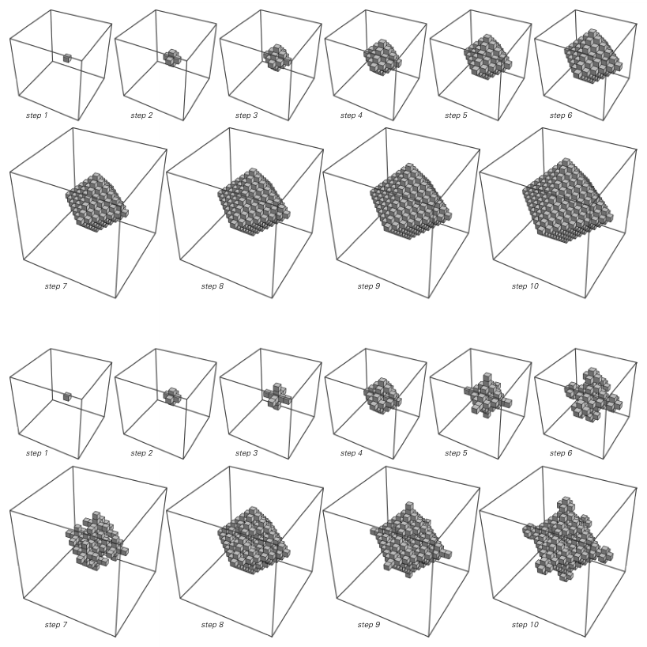
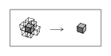
<!-- ORIGINAL_FIGURES page=0198 end -->

图注：三维元胞自动机例子。上方一组图中，规则规定，只要一个元胞与其共享面的六个邻居中有任何一个在前一步为黑色，该元胞就应变成黑色。下方图中，规则规定，只有当一个元胞的六个邻居中恰好有一个在前一步为黑色时，它才应变成黑色。两种情形中，初始条件都包含单个黑色元胞。上方图中，得到的极限形状是规则八面体。下方图中，它是类似于第 171 页二维图案的嵌套图案。

---

[[PDF page 199]]

<!-- ORIGINAL_FIGURES page=0199 start -->
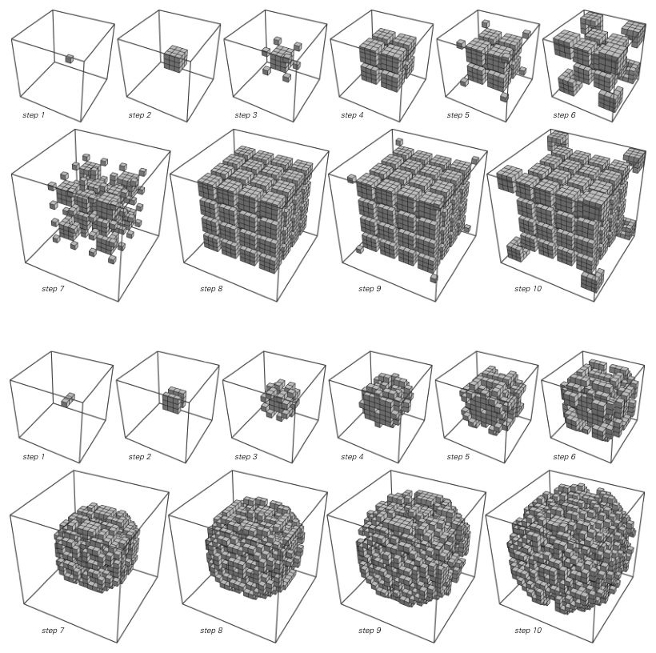
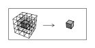
<!-- ORIGINAL_FIGURES page=0199 end -->

图注：更多三维元胞自动机例子，但现在规则依赖于与特定元胞共享面或角的全部 26 个邻居。上方图中，规则规定，当一个元胞的 26 个邻居中恰好有一个在前一步为黑色时，该元胞应变成黑色。下方图中，规则规定，只有当一个元胞的 26 个邻居中恰好有两个在前一步为黑色时，它才应变成黑色。上方图中，初始条件包含单个黑色元胞；下方图中，初始条件包含一条由三个黑色元胞组成的线。

---

[[PDF page 200]]

<!-- ORIGINAL_FIGURES page=0200 start -->
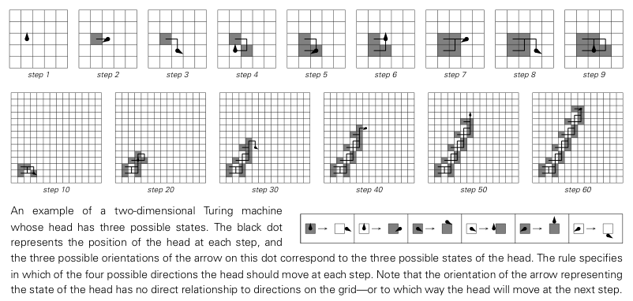
<!-- ORIGINAL_FIGURES page=0200 end -->

## 图灵机

很像元胞自动机，图灵机也可以直接推广到二维。基本想法如下图所示：允许图灵机的读写头在二维网格上移动，而不只是沿一维纸带来回移动。

图注：一个二维图灵机例子，其读写头有三种可能状态。黑点表示每一步读写头的位置，黑点上箭头的三种可能方向对应于读写头的三种可能状态。规则指定读写头每一步应向四个可能方向中的哪个方向移动。注意，表示读写头状态的箭头方向，与网格方向或读写头下一步会向哪个方向移动，并没有直接关系。

在本书前面观察一维图灵机时，我们发现它们可能表现出复杂行为，但这种行为相当罕见。

进入二维后，我们也许预期复杂行为会以某种方式立即变得更常见。但事实上我们发现，情形与一维惊人相似。

对具有两种或三种可能状态的图灵机而言，通常似乎只会出现重复和嵌套行为。有四种状态时，更复杂的行为成为可能，但仍然相当罕见。

对页显示若干具有四种状态的二维图灵机例子。简单行为占压倒多数。但在一百万条随机选择的规则中，通常会有少数几条显示复杂行为。第 186 页显示一个例子，其中行为在许多方面似乎完全随机。

---

[[PDF page 201]]

<!-- ORIGINAL_FIGURES page=0201 start -->
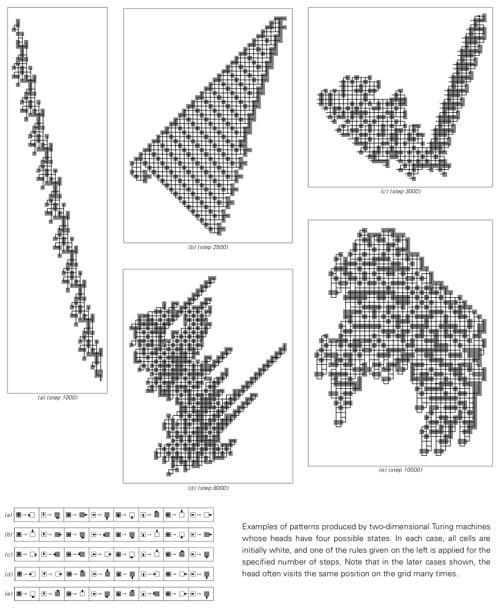
<!-- ORIGINAL_FIGURES page=0201 end -->

图注：由读写头具有四种可能状态的二维图灵机产生的图案例子。每种情形中，所有元胞初始都为白色，并按左侧给出的某条规则应用指定步数。注意，在后面所示的若干情形中，读写头经常会多次访问网格上的同一位置。

---

[[PDF page 202]]

<!-- ORIGINAL_FIGURES page=0202 start -->
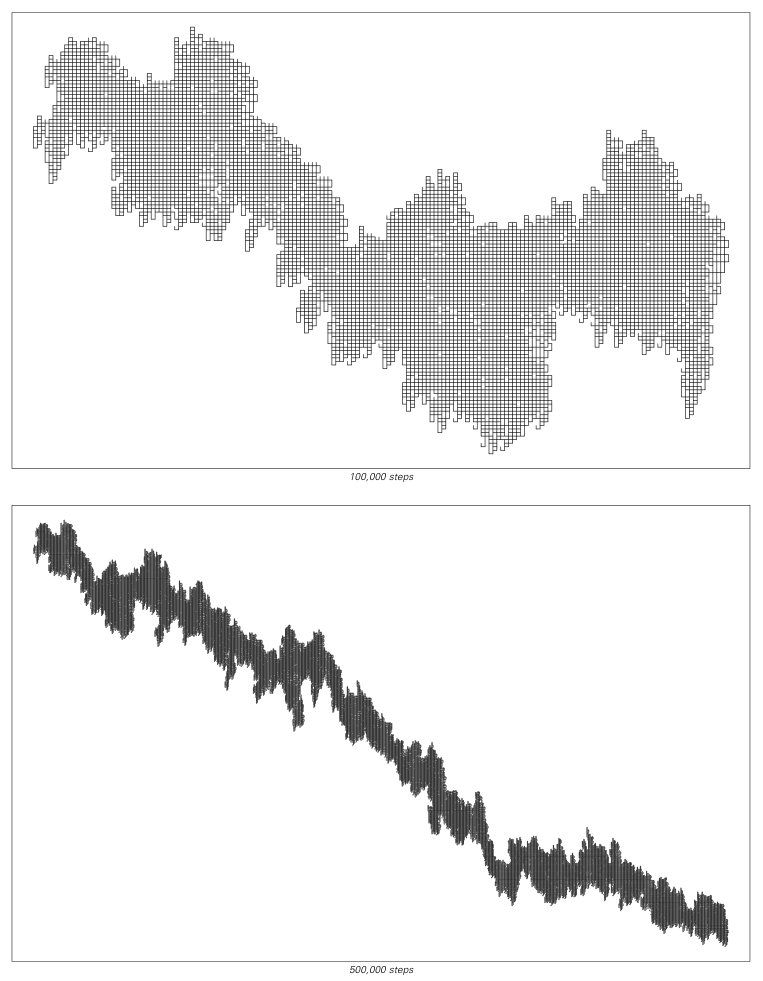
<!-- ORIGINAL_FIGURES page=0202 end -->

图注：上一页规则 (e) 的二维图灵机读写头所描出的路径。路径中有许多看似随机的波动，不过总体上倾向于向右增长。

---

[[PDF page 203]]

<!-- ORIGINAL_FIGURES page=0203 start -->
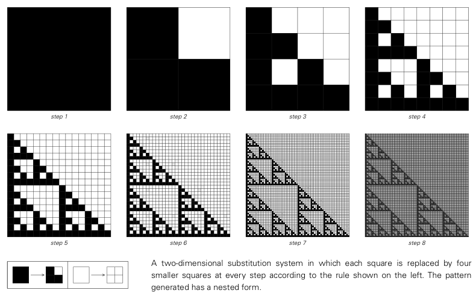
<!-- ORIGINAL_FIGURES page=0203 end -->

## 替换系统和分形

第 82 页讨论的那类一维替换系统，可以看作通过逐步把其中每个元素细分为若干较小元素来运作。

人们可以构造本质上以同样方式运作的二维替换系统，如下图所示。

图注：一个二维替换系统，其中每个方块在每一步都按左侧规则替换为四个较小方块。生成的图案具有嵌套形式。

下一页给出更多二维替换系统例子。产生的图案当然相当精细。但它们的整体形式仍然具有很强规则性。事实上，就像第 83 页的一维替换系统产生的图案一样，这里展示的所有图案最终都具有简单嵌套结构。

为什么会出现这种嵌套？基本原因是，在每一步，替换系统的规则只是把每个黑色方块替换为若干较小黑色方块。后续步骤中，这些新的黑色方块中的每一个，又会以完全相同的方式被替换，于是它最终会演化出整个图案的一个相同副本。

---

[[PDF page 204]]

<!-- ORIGINAL_FIGURES page=0204 start -->
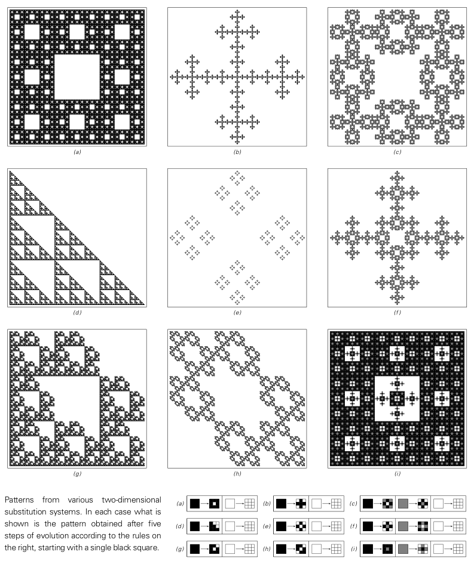
<!-- ORIGINAL_FIGURES page=0204 end -->

图注：来自各种二维替换系统的图案。每种情形中，所示都是从单个黑色方块开始，按照右侧规则演化五步后得到的图案。

---

[[PDF page 205]]

<!-- ORIGINAL_FIGURES page=0205 start -->
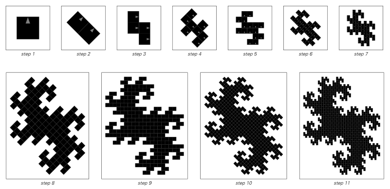
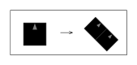
<!-- ORIGINAL_FIGURES page=0205 end -->

但事实上，这个基本过程并不依赖方块必须按任何刚性网格排列。下图显示，如果只使用一条简单几何规则把每个黑色方块替换成两个较小黑色方块，会发生什么。结果再次是得到一个精细但高度规则的嵌套图案。

图注：从单个黑色方块开始，然后每一步按左侧所示简单几何规则，把每个黑色元胞替换为两个较小黑色元胞所得到的图案。注意，把规则应用于某个特定方块时，必须考虑该方块的方向。最终得到的图案具有精细的嵌套结构。

在黑色方块排布在网格上的替换系统中，人们可以确信不同方块永远不会重叠。但如果只用一条几何规则来替换每个黑色方块，那么产生的方块就可能重叠，如下一页图所示。然而至少在这个例子中，最终得到的整体图案仍然具有纯粹嵌套结构。

通过反复应用几何规则来构建图案这一一般想法，正是所谓分形几何的核心。

---

[[PDF page 206]]

<!-- ORIGINAL_FIGURES page=0206 start -->
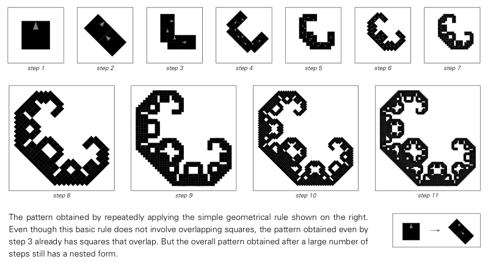
<!-- ORIGINAL_FIGURES page=0206 end -->

图注：反复应用右侧所示简单几何规则得到的图案。尽管这条基本规则本身不涉及重叠方块，但甚至到第 3 步时，得到的图案已经有方块重叠。不过，大量步骤之后得到的整体图案仍具有嵌套形式。

对页图显示用这种方式产生的更多分形图案例子。

每种情形中使用的几何规则细节都不同。但所有这些规则的共同点在于，它们都涉及把一个黑色方块替换成两个或更多较小黑色方块。在这种设置下，所有产生的图案最终都必然具有完全规则的嵌套结构。

那么，要得到结构更复杂的图案需要什么？基本答案很像第 85 页一维替换系统中所见，需要不同元素之间存在某种形式的相互作用，使得某一步中特定元素的替换，不仅可以依赖该元素自身的特征，也可以依赖其他邻近元素的特征。

但对于对页所示那种几何替换规则而言，这里有一个问题。因为元素最终可以位于平面中的任何地方，因而很难定义一种显然的邻居概念。其结果是，在传统分形几何中，人们并不考虑元素之间相互作用的想法，因此产生的所有图案都具有纯粹嵌套形式。

---

[[PDF page 207]]

<!-- ORIGINAL_FIGURES page=0207 start -->
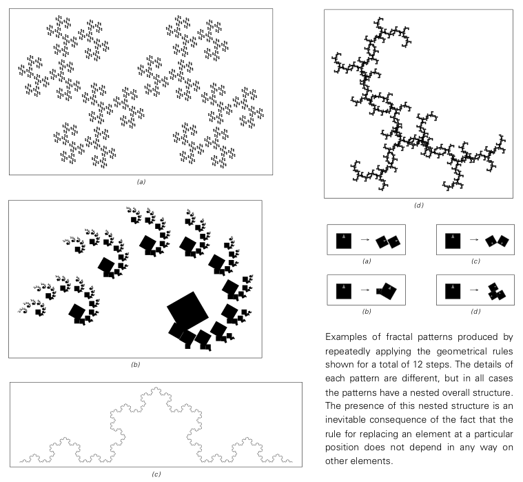
<!-- ORIGINAL_FIGURES page=0207 end -->

图注：通过总共 12 步反复应用所示几何规则产生的分形图案例子。每个图案的细节不同，但所有情形中，图案都具有嵌套的整体结构。这种嵌套结构的存在，是特定位置上一个元素的替换规则完全不依赖其他元素这一事实的必然后果。

但如果把元素设置在网格上，就可以直接允许给定元素的替换依赖其邻居，如下一页顶部图所示。而一旦这样做，人们立即会得到各种相当复杂、常常并非纯粹嵌套的图案，如下一页图中所示。

在第 3 章中，我们讨论了普通一维替换系统和顺序替换系统：前者每一步替换每个元素，后者每一步只替换单个元素块。我们寻找某一步应替换哪个元素块的方法，是从左到右扫描整个元素序列。

---

[[PDF page 208]]

<!-- ORIGINAL_FIGURES page=0208 start -->
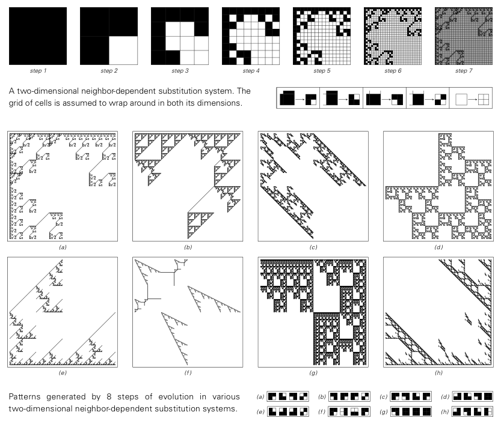
<!-- ORIGINAL_FIGURES page=0208 end -->

图注：一个二维、依赖邻居的替换系统。这里假定元胞网格在两个维度上都会环绕。

图注：各种二维、依赖邻居的替换系统演化 8 步生成的图案。

那么，怎样把这一点推广到更高维？在二维网格上，人们当然可以想象以蛇形来回扫描，或以螺旋方式向外扫描所有元素。但只要为元素定义任何特定次序，无论它们怎样排布，实际上就已经把问题化约为处理一维系统。

事实上，似乎没有直接方式把顺序替换系统推广到二维或更高维。不过，在第 9 章中，我们会看到借助更复杂的思想，事实上可以在任意维数中设置替换系统，其中元素按顺序扫描，但无论使用什么顺序，结果在某种意义上总是相同的。

---

[[PDF page 209]]

## 网络系统

元胞自动机这类系统的一个特征是，它们的元素总是设置在规则阵列中，而且这个阵列从一步到下一步保持不变。在带有几何替换规则的替换系统中，自由度略高一些，但元素最终仍然受限于位于二维平面中。

事实上，在目前讨论过的所有系统中，实际上总有一个固定的底层几何结构，并且它在系统演化全过程中保持不变。

然而，结果表明，可以构造这样的系统：其基本结构中不存在这种不变性。本节我将讨论一种我称为网络系统的版本，作为例子。

网络系统从根本上说就是一组节点，以及这些节点之间的各种连接，再加上一些规则，指定这些连接怎样从一步到下一步改变。

在其演化的某个特定步骤中，网络系统可以有点像电路：网络中的节点对应于电路中的元件，连接对应于把这些元件连在一起的导线。

并且与电路一样，系统性质只依赖于节点彼此怎样连接，而不依赖于为这些节点碰巧使用的任何具体布局。

当然，为了画出一个网络系统的图，必须为每个节点选择特定位置。但关键点是，这些位置没有根本意义；它们只是为了视觉表示而引入的。

构造网络系统时，一般可以允许每个节点有任意数量的连接发出。但至少就本节目的而言，如果把自己限制在每个节点恰好有两条出连接的情形，并不会失去任何根本内容；每条连接可以通向另一个节点，也可以回环到原节点本身。

在这种设置下，最简单的可能网络只包含一个节点，并且从该节点发出的两条连接都回环回来，如下方顶部图所示。

---

[[PDF page 210]]

<!-- ORIGINAL_FIGURES page=0210 start -->
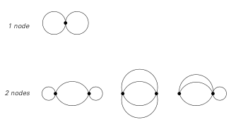
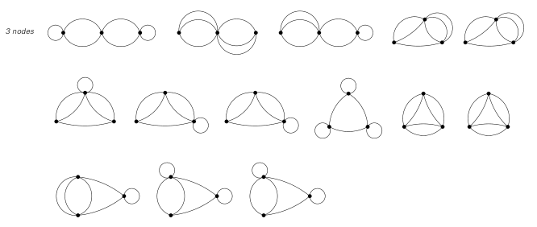
<!-- ORIGINAL_FIGURES page=0210 end -->

有两个节点时，已经有三种可能的连接图案，如下面第二行所示。随着节点数增加，可能不同网络的数量增长得非常快。

图注：由一个、两个或三个节点形成的可能网络，每个节点有两条连接发出。图中显示的是忽略标签后的所有不等价情形，但排除了那些包含不能通过其他节点连接到达的节点的网络。

对这些网络中的大多数来说，并没有办法布置其节点，使得图像看起来不像一团随机缠绕的导线。但仍然可以构造许多具有容易识别形式的具体网络，如对页图所示。

对页顶部图示的每个网络，在最低层面上都由一组相同节点组成。但我们看到的惊人事实是，只要改变这些节点之间的连接图案，就可能得到实际上对应于不同维数阵列的结构。

---

[[PDF page 211]]

<!-- ORIGINAL_FIGURES page=0211 start -->
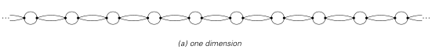
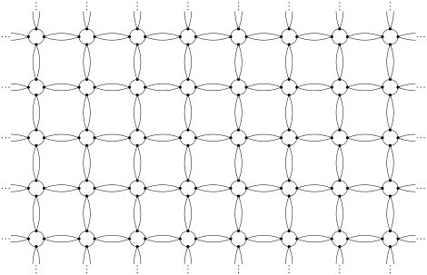
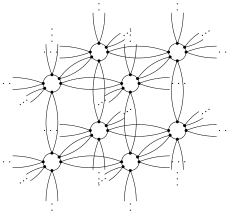
<!-- ORIGINAL_FIGURES page=0211 end -->

图注：对应于一维、二维和三维阵列的网络例子。在底层层面上，每个网络都只由一组节点组成，每个节点发出两条连接。但通过为这些连接设置适当图案，就可以得到具有非常不同有效几何结构的网络。

例 (a) 显示一个实际上是一维的网络。这个网络由成对节点组成，可以排列成一个序列，其中每一对都连接到左侧另一对和右侧另一对。

但网络系统的结构并没有什么内在一维性。正如例 (b) 所展示，只要重排连接，就能得到一个看起来像二维阵列而不是一维阵列的网络。例 (b) 中每个单独节点仍然恰好有两条连接发出，但现在整体连接图案使每个节点块连接到四个而不是两个相邻节点块，因此该网络实际上形成一个二维方形网格。

---

[[PDF page 212]]

<!-- ORIGINAL_FIGURES page=0212 start -->
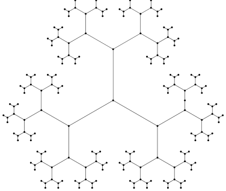
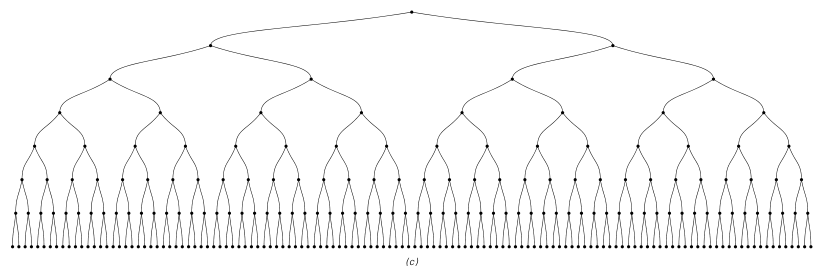
<!-- ORIGINAL_FIGURES page=0212 end -->

例 (c) 进一步显示，通过适当连接，也可以得到三维阵列；事实上，使用同样原则，可以很容易得到任意维数的阵列。

下图显示的是形成无限树而不是阵列的网络例子。注意，所示第一个和最后一个网络实际上具有相同连接图案；但由于节点在页面上的排布方式不同，它们在这里看起来不同。

图注：对应于无限树的网络例子。注意，网络 (a) 和 (c) 是相同的，虽然因为节点在页面上的布局不同而看起来不同。所有展示的网络都在每棵树的叶子处截断。

---

[[PDF page 213]]

<!-- ORIGINAL_FIGURES page=0213 start -->
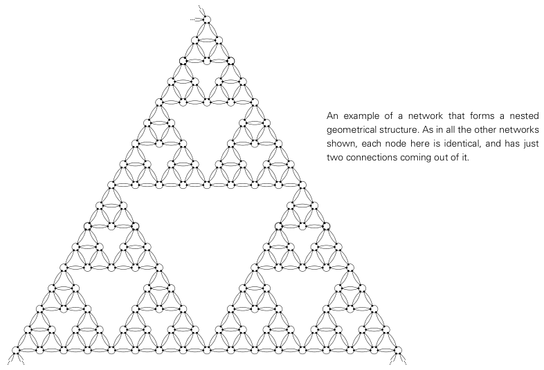
<!-- ORIGINAL_FIGURES page=0213 end -->

一般而言，网络系统中可以设置的结构种类非常丰富；作为另一个例子，下图显示了一个形成嵌套图案的网络。

图注：一个形成嵌套几何结构的网络例子。如所有其他展示的网络一样，这里的每个节点都是相同的，并且只有两条连接发出。

上面的图中，我们已经看到了在网络系统演化的某个特定步骤中可能存在的各种单个网络例子。但现在必须考虑，这类网络怎样从演化中的一步变换到下一步。

基本想法是，设置一些规则，根据每个节点周围网络的局部结构，指定从该节点发出的连接应怎样改道。

但为了看出任何这类规则的效果，人们必须先找到一种统一方式来显示可能产生的网络。下一页顶部图显示了一种可能方法：总是把每个网络中的节点排成跨越页面的一条线。虽然这种表示会遮蔽特定网络的几何结构，如下面第二和第三种情形所示，但它更容易让不同网络彼此比较。

---

[[PDF page 214]]

<!-- ORIGINAL_FIGURES page=0214 start -->
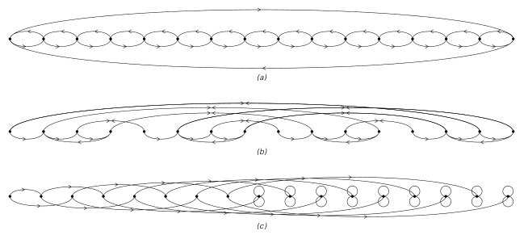
<!-- ORIGINAL_FIGURES page=0214 end -->

图注：前面图中的网络以统一方式布局。网络 (a) 对应于一维阵列，(b) 对应于二维阵列，(c) 对应于一棵树。在这里所示布局中，所有网络的节点都沿一条线排列。注意，在情形 (a) 和 (b) 中，连接被安排成使阵列实际上环绕起来；在情形 (c) 中，树的叶子被看作具有回环到自身的连接。

在设置网络系统规则时，方便的做法是区分每个节点发出的两条连接。因此在上图中，一条连接总是显示为走在节点线的上方，另一条则总是显示为走在下方。

对页图显示四种不同底层规则选择得到的演化例子。在第一种情形中，规则规定，每个节点的“上方”连接应被改道，使其通向这样一个节点：先沿“下方”连接走到一个节点，再从该节点沿“上方”连接走到的节点。“下方”连接保持不变。

其他所示规则在结构上类似，只是在情形 (c) 和 (d) 中，每个节点的“上方”连接被改道，使其直接回环到该节点本身。

在情形 (d) 中，其结果是网络分裂成若干不连通部分。结果表明，我在这里考虑的规则都永远不能再把这些部分重新连接起来。因此，作为后果，本节余下部分中我只追踪包含上面这类图中第一个节点的那一部分。实际上，这意味着其他节点会从网络中丢弃，从而网络总大小减小。

---

[[PDF page 215]]

<!-- ORIGINAL_FIGURES page=0215 start -->
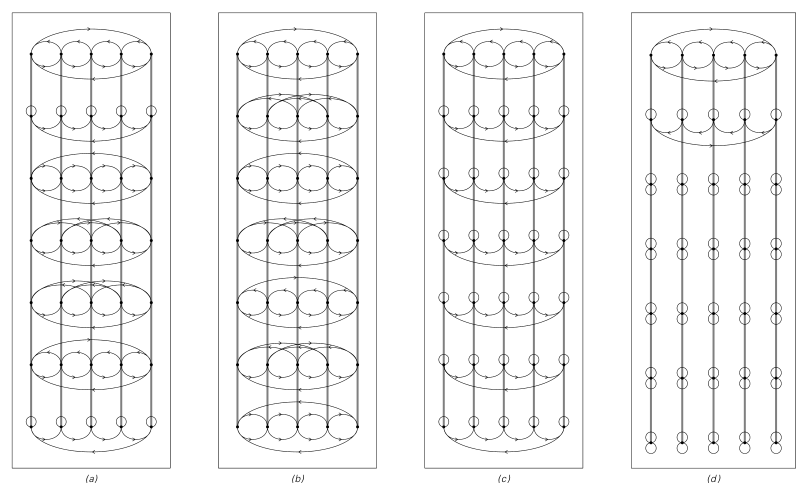
<!-- ORIGINAL_FIGURES page=0215 end -->

图注：四种不同底层规则选择下网络系统的演化。连续演化步骤按页面向下的连续行显示。在情形 (a) 中，每个节点的“上方”连接在每一步改道到这样一个节点：先沿下方连接，再沿该节点的上方连接而到达的节点；下方连接保持不变。在情形 (b) 中，每个节点的上方连接改道到连续两次沿上方连接到达的节点；下方连接保持不变。在情形 (c) 中，上方连接改道为回环到节点本身，而下方连接保持不变。在情形 (d) 中，上方连接改道为回环，而下方连接改道到沿上方连接到达的节点。若把“上方”连接标记为 1，“下方”连接标记为 2，这些规则对应于把每个节点处的连接 `{{1}, {2}}` 分别替换为 (a) `{{2, 1}, {2}}`，(b) `{{1, 1}, {2}}`，(c) `{{}, {2}}`，以及 (d) `{{}, {1}}`。

不过，通过改变底层规则，网络中的节点数也可以增加。做到这一点的基本方式是，把从某个特定节点发出的连接断开，插入一个新节点，然后把这个新节点连接到从原始节点沿连接可到达的节点。

下一页图显示使用这种机制的两条规则所产生的行为例子。在两种情形中，一个新节点都被插入到网络中每个已有节点的“上方”连接中。

---

[[PDF page 216]]

<!-- ORIGINAL_FIGURES page=0216 start -->
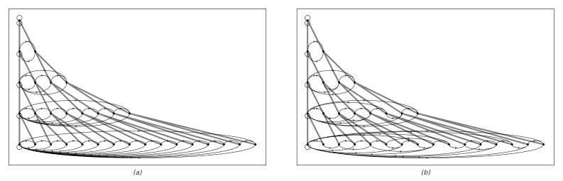
<!-- ORIGINAL_FIGURES page=0216 end -->

第一种情形中，新节点发出的连接与已有节点发出的连接完全相同；第二种情形中，新节点的“上方”和“下方”连接被互换。

图注：规则涉及增加新节点的网络系统演化。两种情形中，新节点都被插入每个节点的“上方”连接中。在情形 (a) 中，新节点发出的连接通向与原节点发出的连接相同的节点。在情形 (b) 中，新节点的上方和下方连接被反转。在上图中，新节点被放在产生它们的节点后面，灰线用于表示每个节点的来源。注意，初始条件是一个只包含单个节点的网络。

但两种情形中得到的行为都相当简单。不过，很像与邻居无关的替换系统，这些网络系统具有这样的性质：每一步总是在每个节点上执行完全相同的操作。

一般而言，人们可以设置规则，使网络系统在不同节点执行不同操作，具体取决于每个节点附近网络的局部结构。

一种简单方案基于观察每个节点发出的两条连接：如果这两条连接通向同一节点，就执行一种操作；如果通向不同节点，就执行另一种操作。

对页图显示这种方案可能发生的一些例子。结果再次表明，行为总是相当简单，网络结构不可避免地以本质上重复的方式增长。

但一旦允许依赖网络中稍长程的特征，复杂得多的行为立刻成为可能。

---

[[PDF page 217]]

<!-- ORIGINAL_FIGURES page=0217 start -->
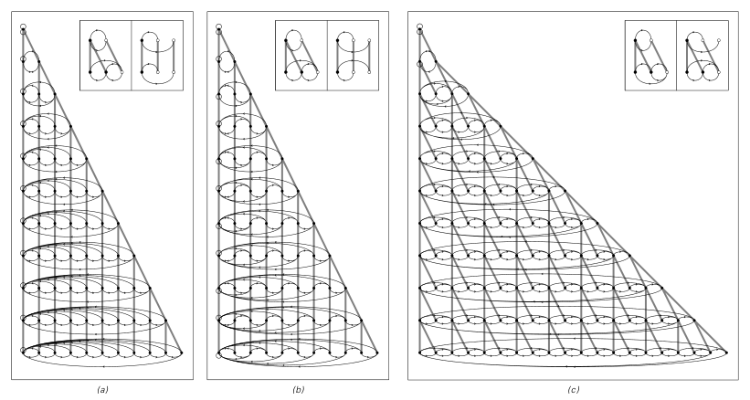
<!-- ORIGINAL_FIGURES page=0217 end -->

图注：规则导致不同节点执行不同操作的网络系统例子。每条规则包含两种情形，如上方所示。第一种情形指定当从某个特定节点发出的两条连接都通向同一节点时应做什么；第二种情形指定当它们通向不同节点时应做什么。在所示规则中，从某个特定节点（实心圆表示）以及从该节点创建的新节点发出的连接，总是通向那些通过只沿原始节点的一条上方或下方连接即可到达的、由空心圆表示的节点。不过，即使去除这一限制，也似乎看不到更复杂的行为。

事实上，接下来两页图显示，如果允许规则依赖于从每个节点出发沿最多两条连续连接所能到达的不同节点数量，会发生什么。

有了这类规则，得到的网络序列不再需要形成任何简单进程；事实上，人们发现，甚至每一步的节点总数也可以以许多方面完全随机的方式变化。

当我们在第 9 章讨论基础物理问题时，会遇到各种其他类型的网络系统；我怀疑，这些系统中的某些最终会被证明与我们宇宙中空间和时空的基本结构密切相关。

---

[[PDF page 218]]

<!-- ORIGINAL_FIGURES page=0218 start -->
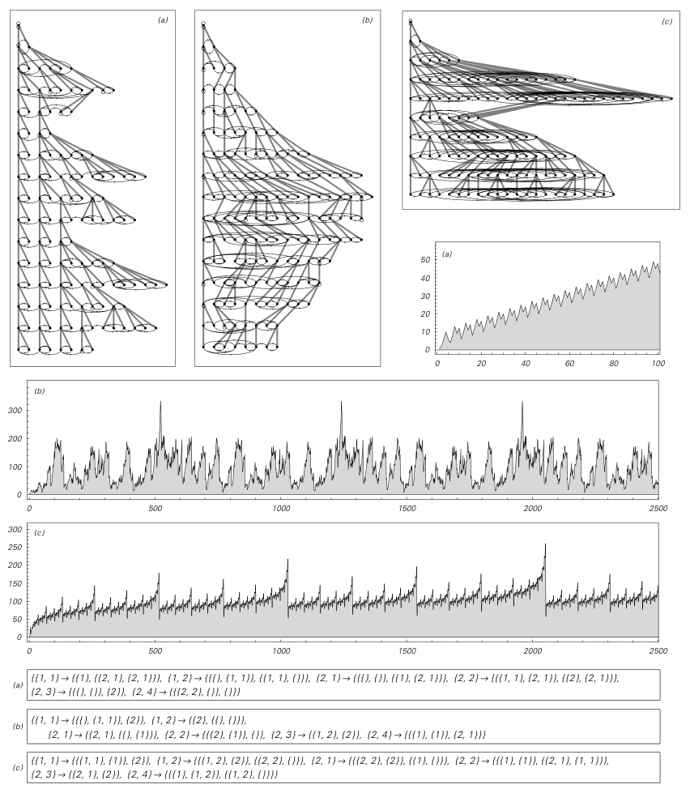
<!-- ORIGINAL_FIGURES page=0218 end -->

图注：规则依赖于从每个节点出发、走到距离最多为二处所能到达的不同节点数量的网络系统。图表显示每一步得到的节点总数。在情形 (a) 和 (b) 中，系统行为最终重复。在情形 (c) 中，行为是嵌套的：第 `t` 步网络大小与 `t` 的二进制数字位序列中 1 的数量有关。

---

[[PDF page 219]]

<!-- ORIGINAL_FIGURES page=0219 start -->
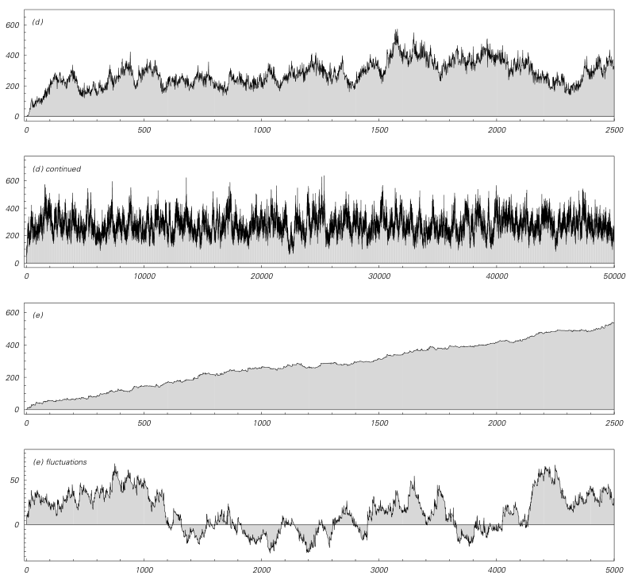
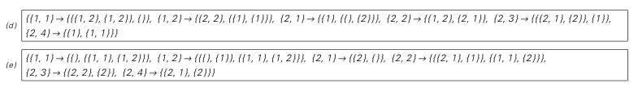
<!-- ORIGINAL_FIGURES page=0219 end -->

图注：网络系统中连续步骤得到的节点总数似乎会永远以大体随机的方式变化。大约每 10,000 个随机选择的网络系统中，有一个似乎会表现出这里显示的这类行为。

---

[[PDF page 220]]

<!-- ORIGINAL_FIGURES page=0220 start -->
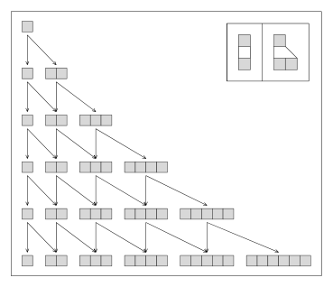
<!-- ORIGINAL_FIGURES page=0220 end -->

## 多路系统

上一节讨论的网络系统，在空间中并没有底层元素网格。但它们在某种意义上仍然具有简单的一维时间状态排列。事实上，到目前为止本书考虑的所有系统，都可以被看作在时间中具有同样简单的结构。因为它们最终全都只是设置为从一个状态逐步演化到下一个状态。

不过，多路系统被定义成这样：在任意给定步骤上，它们不仅可以有单个状态，而可以有一整组可能状态。

下图显示这样一个系统的非常简单例子。

图注：一个非常简单的多路系统，其中每一步每个序列中的一个元素会被替换为一个或两个元素。多路系统的主要特征是，所有得到的不同序列都会被保留下来。

系统中的每个状态由一串元素组成。在上图所示特定情形中，规则规定，每一步这些元素中的每个要么保持不变，要么替换为一对元素。从由单个元素组成的单个状态开始，图中显示，应用这些规则会立即给出两个可能状态：一个包含单个元素，另一个包含两个元素。

一般而言，多路系统可以使用任何一组规则，只要这些规则定义了序列中元素块的替换。我们在第 88 页讨论顺序替换系统时，已经见过正是这类规则。但在顺序替换系统中，想法是每一步只做一次替换。而在多路系统中，

---

[[PDF page 221]]

<!-- ORIGINAL_FIGURES page=0221 start -->
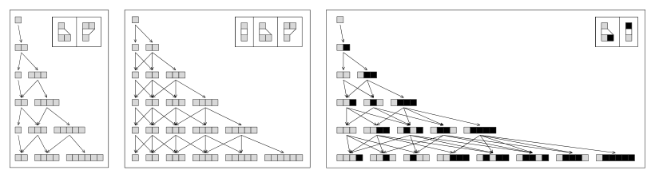
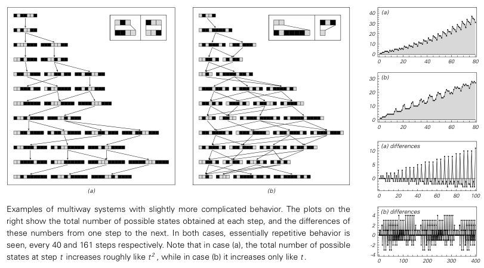
<!-- ORIGINAL_FIGURES page=0221 end -->

想法是每一步做所有可能替换，然后保留生成的所有可能不同序列。

下图显示若干非常简单规则会发生什么。在这些例子中，行为都相当简单；例如可能序列的数量总是从一步到下一步均匀增加。

图注：简单多路系统例子。三个系统在第 `t` 步的不同序列数量分别为 `Ceiling[t/2]`、`t` 和 `Fibonacci[t + 1]`（后者大约按 `1.618^t` 增长）。

不过，一般来说，这个数量不必表现出这种均匀增长；下图显示出现波动的例子。

图注：行为稍复杂的多路系统例子。右侧图表显示每一步得到的可能状态总数，以及这些数量从一步到下一步的差值。两种情形中都看到本质上重复的行为，周期分别为 40 和 161 步。注意，在情形 (a) 中，第 `t` 步可能状态总数大致像 `t^2` 那样增加，而在情形 (b) 中只像 `t` 那样增加。

---

[[PDF page 222]]

<!-- ORIGINAL_FIGURES page=0222 start -->
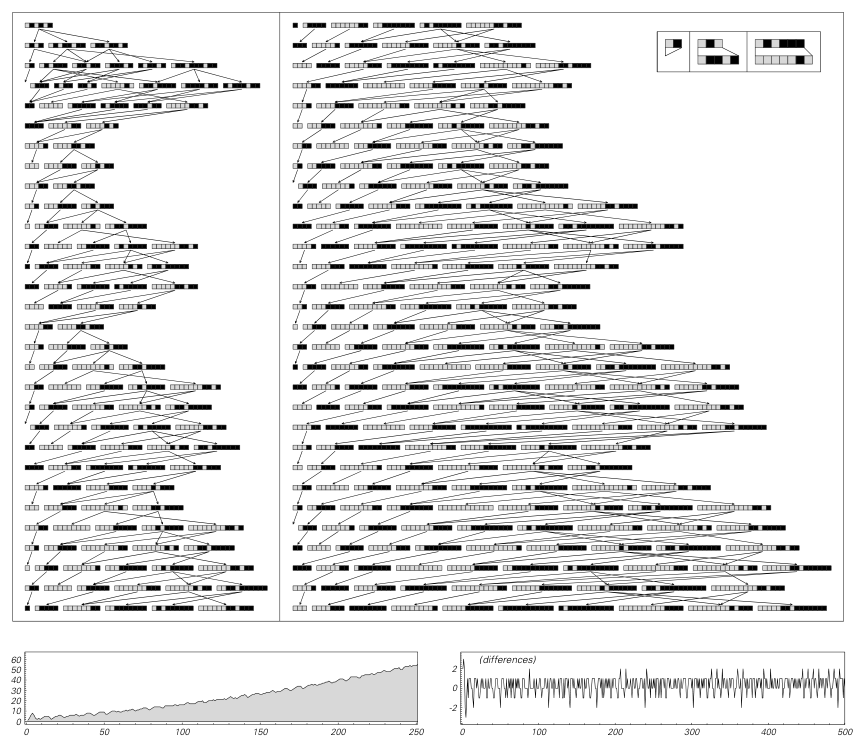
<!-- ORIGINAL_FIGURES page=0222 end -->

但在这两种情形中，结果表明不用太久这些波动就会本质上重复。下图显示一个例子，其中可以看到更大量的表观随机性。然而，即使在这个例子中，人们最终也会再次发现本质重复，虽然现在每 1071 步才重复一次。

图注：一个多路系统，其行为显示出某些表观随机性迹象。该系统规则涉及三种可能替换。注意，第一种替换只移除元素，不插入新元素。因此在图中，有时会出现包含零个元素的序列。至少在这里使用的初始条件下，尽管早期表观随机性相当明显，元素数量差值仍会每 1071 步重复（平移 1 后）。

---

[[PDF page 223]]

<!-- ORIGINAL_FIGURES page=0223 start -->
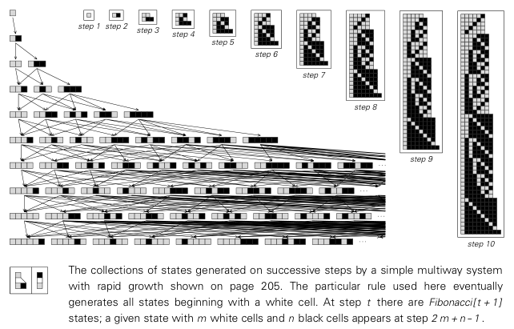
<!-- ORIGINAL_FIGURES page=0223 end -->

如果观察许多多路系统，大多数要么指数级快速增长，要么根本不增长；像对页所见那样的缓慢增长相当罕见。事实上，即使这种增长导致一定程度的表观随机性，最终通常似乎也会表现出某种形式的重复。不过，如果允许更快增长，那么大概会开始出现各种永远不显示这种规则性的多路系统。但在实践中，这类多路系统往往相当难以研究，因为它们生成的状态数量很快变得过大而无法处理。

不过，仅通过观察早期步骤中出现的状态，就可以对这类系统的行为有所了解。下图显示一个例子，最终具有相当简单的嵌套行为。

图注：第 205 页所示一个快速增长的简单多路系统在连续步骤中生成的状态集合。这里使用的特定规则最终会生成所有以白色元胞开头的状态。在第 `t` 步有 `Fibonacci[t + 1]` 个状态；一个含有 `m` 个白色元胞和 `n` 个黑色元胞的给定状态，会在第 `2m + n - 1` 步出现。

下一页图显示更多例子。有时，在特定步骤生成的状态集合表现出本质重复，虽然周期常常很长。有时，这个集合实际上包括给定长度可能数字位序列中的很大一部分，因此本质上显示出嵌套。但在其他情形中，至少有相当多复杂性的迹象，尽管状态总数最终仍可能相当平滑地增长。

---

[[PDF page 224]]

<!-- ORIGINAL_FIGURES page=0224 start -->
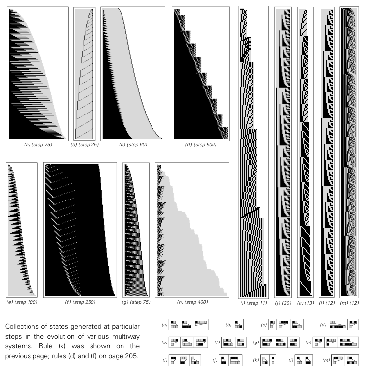
<!-- ORIGINAL_FIGURES page=0224 end -->

图注：各种多路系统演化中特定步骤生成的状态集合。规则 (k) 已在上一页展示；规则 (d) 和 (f) 在第 205 页展示。

仔细观察前几页的多路系统演化图，人们会注意到一个特征：同样的序列常常出现在几个不同步骤上。然而，多路系统基本设置的一个后果是，只要任何特定序列出现，它就必然总是导致完全相同的行为。

这意味着完整演化可以按对页顶部图那样表示，其中每个序列只显式显示一次，而任何生成多次的序列，只通过一条箭头回指其第一次出现来表示。

---

[[PDF page 225]]

<!-- ORIGINAL_FIGURES page=0225 start -->
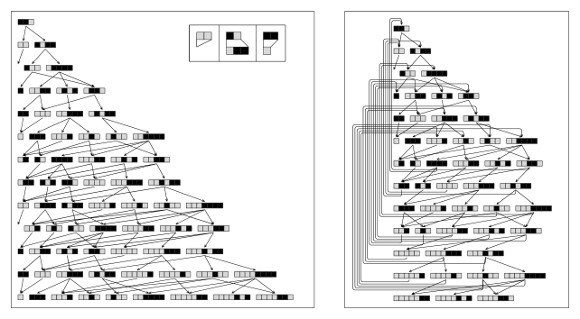
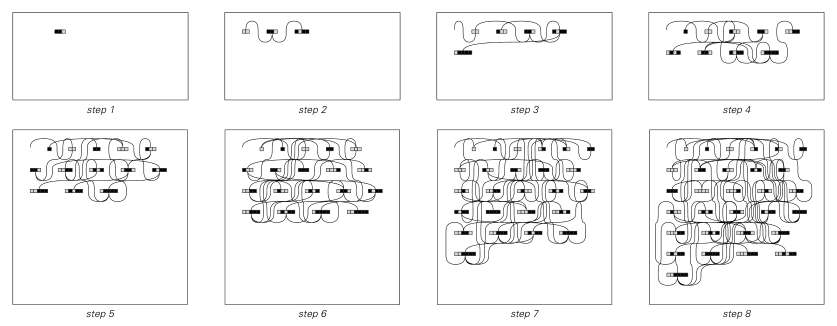
<!-- ORIGINAL_FIGURES page=0225 end -->

图注：一个多路系统的演化，先是每一步都显式显示每个序列，然后是每个序列只显示一次。

但并不需要把图像排成这样：因为在某种意义上，多路系统的整个行为可以仅通过给出“哪个序列通向哪个其他序列”的网络来捕捉。下图显示逐步构建这样一个网络的阶段。我们看到，正如上一节讨论的网络系统可以在空间中构建出自己的连接图案，多路系统实际上也可以在时间中构建出自己的连接图案，而且这种图案常常可以相当复杂。

图注：由页面顶部多路系统演化建立起来的网络。这个网络实际上表示多路系统状态之间在时间中的连接网络。

---

[[PDF page 226]]

<!-- ORIGINAL_FIGURES page=0226 start -->

<!-- ORIGINAL_FIGURES page=0226 end -->

## 基于约束的系统

在本书过程中，我们已经观察了许多不同类型的系统。但在一个方面，所有这些系统最终都以同样基本方式设置：它们都基于显式规则，指定系统怎样从一步演化到下一步。

然而，在传统科学中，常常会考虑以相当不同方式设置的系统：它们没有显式演化规则，而只是被给定要满足的约束。

作为简单例子，考虑一行黑白元胞，其中颜色排列受到这样的约束：每个元胞都应恰好有一个黑色邻居和一个白色邻居。仅知道这条约束，并不给出任何显式过程来确定每个元胞的颜色。事实上，一开始甚至可能不清楚是否会存在任何颜色排列能够满足该约束。但结果表明确实存在，如下方所示。

图注：一个由一行黑白元胞组成的系统，其形式由这样的约束定义：每个元胞都应恰好有一个黑色邻居和一个白色邻居。所示图案是满足这条约束的唯一可能图案。通过给出系统必须满足的约束来隐式决定系统行为，这种想法在传统科学和数学中很常见。

看到这幅图之后，人们也许会想象，一定还有许多其他图案也能满足该约束。毕竟，这条约束是相对于邻近元胞的局部约束，所以人们可能会假定，图案中相隔足够远的部分应总是彼此独立。但事实上并非如此；相反，这个系统有点像一个拼图，每一块都只有一种放置方式。最终，只有上面展示的完美重复图案，才能在每个元胞处满足所要求的约束。

然而，其他约束可以允许更多自由。例如，如果约束是每个元胞必须至少有一个颜色不同于自己的邻居，那么对页顶部图中的任意图案都是允许的，事实上任何不包含超过两个连续同色元胞的图案也都允许。

---

[[PDF page 227]]

<!-- ORIGINAL_FIGURES page=0227 start -->
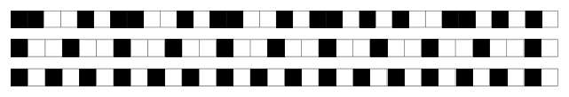
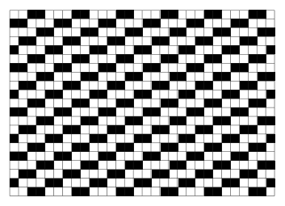
<!-- ORIGINAL_FIGURES page=0227 end -->

图注：一个由一行黑白元胞组成的系统，其形式由这样的约束定义：每个元胞都应至少有一个颜色不同于自己的邻居。有许多可能的颜色排列满足这条约束。有些像上方第一种排列，看起来相当随机。但另一些像上方后两种排列，则简单而重复。结果表明，在一维系统中，没有任何一组局部约束能够迫使更复杂类型的排列出现。

但虽然上方展示的第一种颜色排列看起来有些随机，后两种却简单且纯粹重复。

那么，其他约束选择又如何？本书中已经见过许多简单规则集产生高度复杂行为的系统例子。但基于约束的系统又如何？是否存在简单约束集，能够迫使复杂图案出现？

结果表明，在一维系统中不存在。因为在一维中可以证明，任何只要能被满足的局部约束集，总能由某个简单且纯粹重复的颜色排列满足。

那么二维又如何？一维的证明在二维中失效，因此至少可以设想，一组简单约束能够迫使复杂图案发生。

作为二维系统的第一个例子，考虑一个黑白元胞阵列，其中施加的约束是：每个黑色元胞都应恰好有一个黑色邻居，每个白色元胞都应恰好有两个白色邻居。

图注：一个由黑白元胞网格组成的系统，其约束为：每个黑色元胞在其四个邻居中应恰好有一个黑色邻居，每个白色元胞应恰好有两个白色邻居。这里展示的无限重复图案，连同它的旋转和反射，是唯一满足该约束的图案。（图中假定每条边都会环绕连接。）该图案可以看作由 `5 x 5` 元胞块平铺而成。

---

[[PDF page 228]]

<!-- ORIGINAL_FIGURES page=0228 start -->
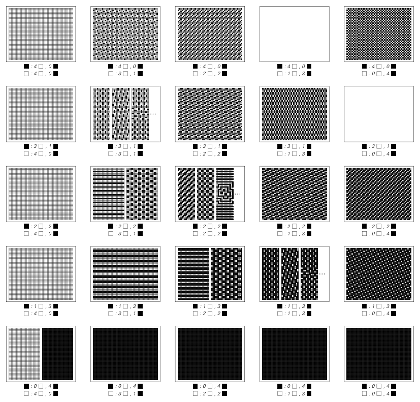
<!-- ORIGINAL_FIGURES page=0228 end -->

如一维情形一样，仅知道约束并不会立即提供找到满足它的图案的过程。但稍作实验就会发现，上方的简单重复图案满足约束，事实上它也是唯一能满足约束的图案。

图注：满足约束的图案，其中约束指定每个黑色元胞和每个白色元胞都必须有某个固定数量的黑色和白色邻居。右上方空白矩形表示没有任何图案能够满足的约束。大多数约束由单个图案满足，连同其旋转和反射。在某些情形中，可能有两个不同图案；在少数情形中，可能有无限多个图案。在所有能够被满足的情形中，一个简单重复图案仍然足够。

---

[[PDF page 229]]

<!-- ORIGINAL_FIGURES page=0229 start -->
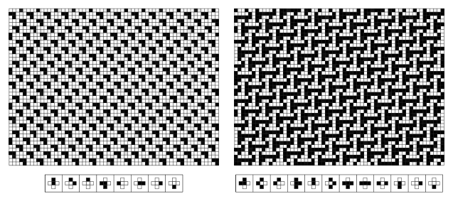
<!-- ORIGINAL_FIGURES page=0229 end -->

其他约束又如何？对页图以示意方式显示了要求每个元胞具有各种数量黑色和白色邻居的约束会发生什么。

可以看到几类结果。在右上方显示为空白矩形的两个情形中，没有任何图案能满足约束。但在其他每种情形中，约束都能被满足，虽然通常只由一个，有时两个简单无限重复图案满足。在中心展示的三种情形中，可能有一整组不同重复图案的混合。但最终，在每一种存在某种可行图案的情形中，一个简单重复图案就是所需的一切。

那么，更复杂的约束又如何？下图显示若干例子，它们基于这样的约束：每个元胞周围的局部颜色排列必须匹配某个固定的可能模板集合。

图注：由约束指定的系统，其中每个元胞周围的局部颜色排列必须匹配所示的固定可能模板集合。注意，这些模板适用于每个元胞，而且相邻元胞的模板彼此重叠。图案 (a) 可以看作由 `5 x 10` 元胞块平铺而成；图案 (b) 可以看作由 `24 x 24` 元胞块平铺而成。按接下来两页使用的约束编号方案，这里展示的情形对应于 1384774 和 328778790。

这类模板集合总共有 4,294,967,296 种可能。其中 766,979,044 种会导致没有任何图案能满足的约束。但在剩余 3,527,988,252 种中，结果表明每一种都可以由简单重复图案满足。事实上，曾经需要的不同重复图案数量相当少：如果某个特定约束能够由任何图案满足，那么接下来两页的 171 个重复图案之一总是足够。

---

[[PDF page 230]]

<!-- ORIGINAL_FIGURES page=0230 start -->
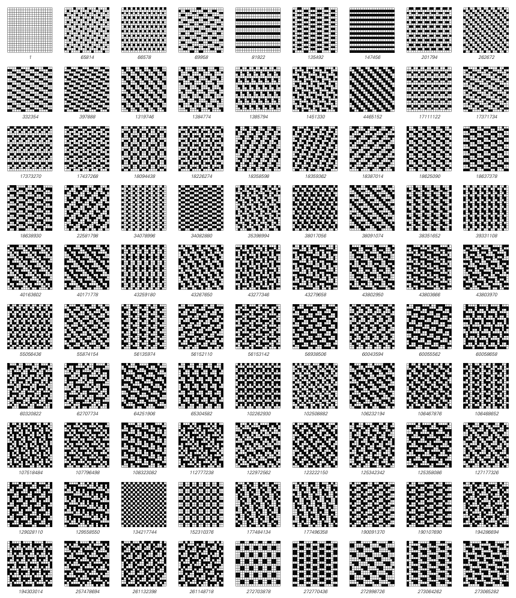
<!-- ORIGINAL_FIGURES page=0230 end -->

图示续：用于满足上一页所示类型约束的 171 个重复图案集合的一部分。

---

[[PDF page 231]]

<!-- ORIGINAL_FIGURES page=0231 start -->
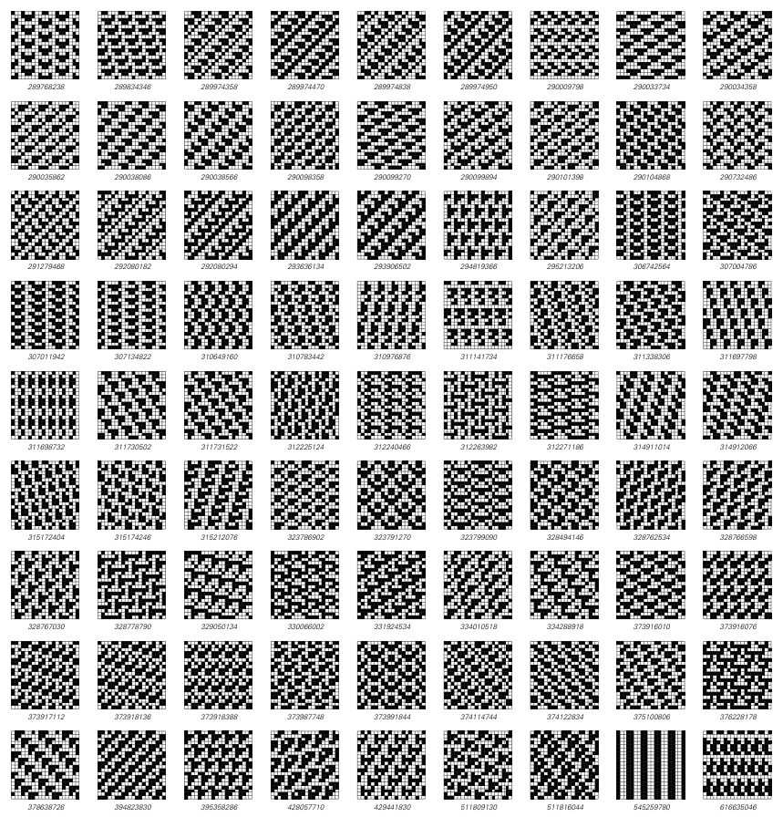
<!-- ORIGINAL_FIGURES page=0231 end -->

图注：满足上一页所示类型约束所需的全部 171 个图案。如果这 171 个图案中没有一个满足某个特定约束，那么就可推出根本没有任何图案会满足该约束。这些图案用数字标记，数字指定要求给定图案的最小约束。没有显示只在整体反射、旋转或黑白互换上不同的图案。

---

[[PDF page 232]]

<!-- ORIGINAL_FIGURES page=0232 start -->
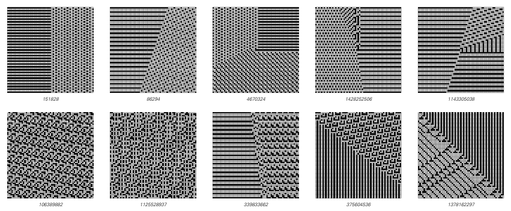
<!-- ORIGINAL_FIGURES page=0232 end -->

那么，怎样才能迫使更复杂的图案出现？

基本答案是，必须至少稍微扩展所考虑的约束类型。一种方式是，不仅要求每个元胞周围的颜色匹配某组模板，还要求该集合中的某个特定模板至少在元胞阵列中的某处出现一次。

下图显示由这类约束决定的若干图案例子。一个典型特征是，图案被分成若干独立区域，常常从某种中心发出。但至少在下面所有例子中，每个单独区域中出现的图案仍然简单而重复。

图注：这些系统产生的图案中，不仅每个邻域中的颜色排列必须匹配某个固定模板集合中的一个模板，而且该集合中的某个模板还必须至少在图案中出现一次。约束编号与之前相同，每幅图中必须出现的模板显示在中心。约束 1125528937 导致一个以 `98 x 98` 块重复的图案。最后展示的图案也是重复的，在对角线上每 56 个元胞重复一次。

那么，怎样找到迫使更复杂图案出现的约束？做到这一点相当困难，事实上几乎耗费了本书中任何单个结果所需的最大计算量。

基本问题在于，给定一条约束，要找出什么图案，如果存在的话，能够满足它，可以极其困难。

在元胞自动机这类基于显式规则的系统中，拿到规则并应用它来查看产生什么图案，总是很直接的。

---

[[PDF page 233]]

但在基于约束的系统中，不存在这种直接过程；相反，人们实际上总是必须走到系统之外，去弄清楚哪些图案能够出现。

最直接的方法也许只是枚举每一个可能图案，然后看其中是否有图案满足某个特定约束。但在包含不止少数元胞的系统中，可能图案的总数绝对是天文数字，因此枚举它们变得完全不可行。

更实际的替代方法是迭代地构建图案，从一个小区域开始，然后以本质上所有可能方式添加新元胞；在每个阶段，如果系统约束最终不能被满足，就回溯。

下一页图显示这种方法产生的若干图案序列。在某些情形中，很快会出现满足约束的简单重复图案。但在其他情形中，必须考察巨大数量的可能性，才能找到任何合适图案。

如果根本不存在任何图案能够满足某个特定约束，又该怎么办？人们也许会以为，要证明这一点，就实际上必须考察无限元胞网格上的每一个可想象图案。但事实上，如果能证明在某个有限区域中不存在满足该约束的图案，那么这就证明在整个网格上也没有图案能够满足该约束。确实，对许多约束来说，已经有相当小的区域可以用来确定找不到任何图案。

但偶尔，如下一页第三幅图所示，人们会遇到这样的约束：它们可以在包含数千个元胞的区域中被满足，但不能在整个网格中被满足。分析这类情形不可避免地需要考察巨大数量的可能图案。

不过，有了一套适当技巧，最终可以可行地处理这里讨论类型的几乎任何系统，并确定有什么图案，如果存在的话，能满足其约束。

那么，可能需要什么样的图案？在绝大多数情形中，唯一需要的是简单重复图案，或这类图案的混合。

---

[[PDF page 234]]

<!-- ORIGINAL_FIGURES page=0234 start -->
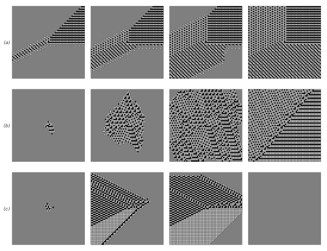
<!-- ORIGINAL_FIGURES page=0234 end -->

图注：寻找满足约束 (a) 4670324、(b) 373384574 和 (c) 387520105 的图案时的若干阶段。灰色用于表示颜色尚未确定的元胞。每种情形中显示的第一阶段，对应于由中心某个特定模板的存在立刻可以推导出的元胞颜色。在情形 (a) 中，可以直接选择额外元胞，并且不需要任何回溯就能构建出一个无限规则图案。在情形 (b) 中，必须尝试许多额外元胞选择，并进行大量回溯，自动过程最终未能找到重复图案。不过，如最后阶段所示，重复图案事实上确实存在。在情形 (c) 中，自动过程找到一个相当大且几乎规则、满足约束的图案，但在这种情形中结果表明不存在无限图案。

但如果按第 214 和 215 页所示顺序系统地考察可能约束，结果表明，在考察超过 1800 万个约束后，最终会发现对页所示的系统。在这个系统中，与它之前所有系统不同，不可能有重复图案；唯一满足约束的是图中所示的非重复嵌套图案。

因此，在测试了数百万条约束和数百亿个候选图案之后，终于可以确立：一种这里讨论类型的、基于简单约束的系统，能够被迫表现出比纯粹重复更复杂的行为。

---

[[PDF page 235]]

<!-- ORIGINAL_FIGURES page=0235 start -->
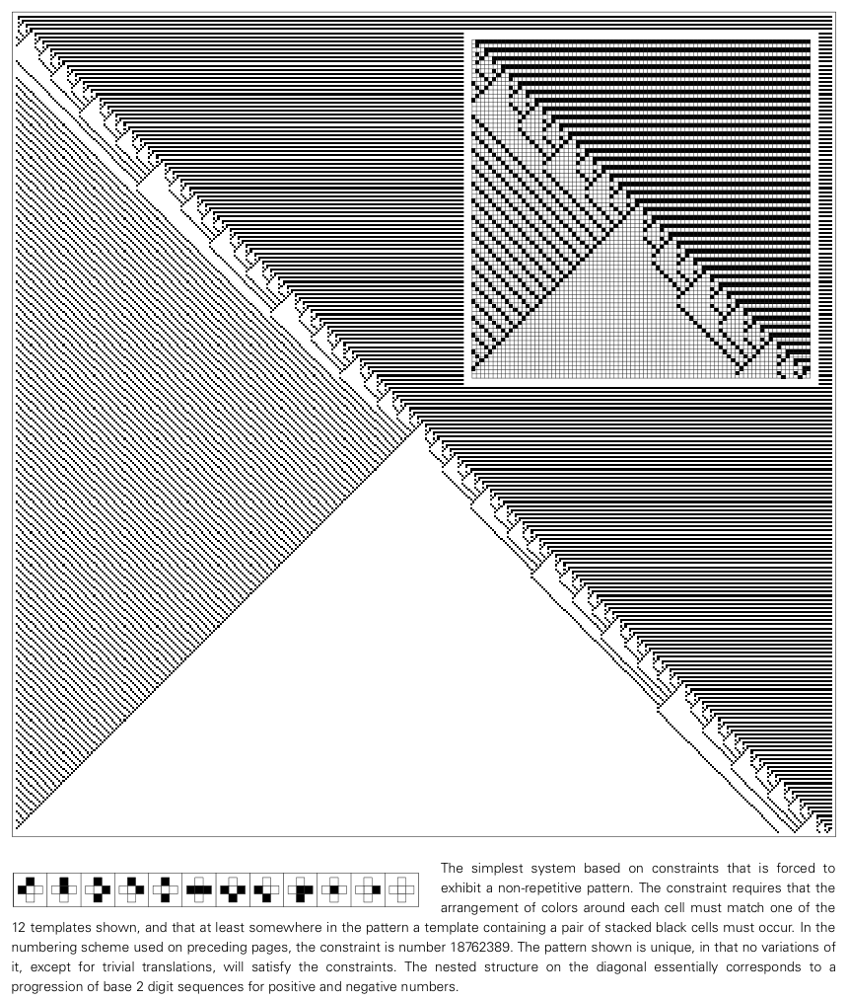
<!-- ORIGINAL_FIGURES page=0235 end -->

图注：最简单的、被迫表现出非重复图案的基于约束的系统。该约束要求每个元胞周围的颜色排列必须匹配所示 12 个模板之一，并且图案中至少某处必须出现一个包含一对上下相叠黑色元胞的模板。按前几页使用的编号方案，该约束编号为 18762389。所示图案是唯一的，也就是说，除平凡平移之外，没有任何变体会满足这些约束。对角线上的嵌套结构本质上对应于正数和负数的二进制数字位序列进程。

---

[[PDF page 236]]

<!-- ORIGINAL_FIGURES page=0236 start -->
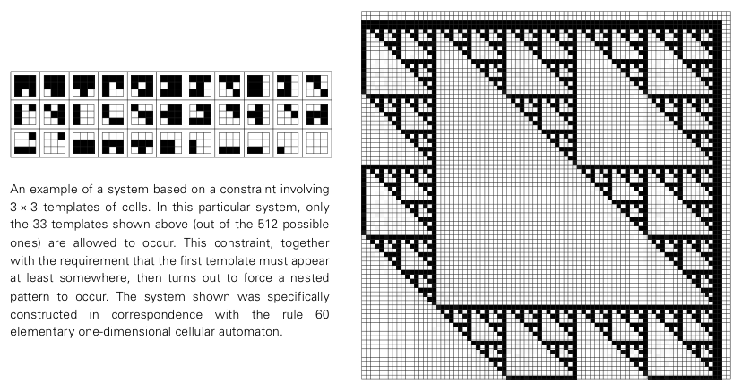
<!-- ORIGINAL_FIGURES page=0236 end -->

更复杂的行为又如何？

第 216 页所示类型的约束总共有 137,438,953,472 个。在我测试的数百万个这类约束中，没有一个迫使比上一页所见嵌套行为更复杂的东西出现。但如果再次扩展所考虑的约束类型，结果表明可以构造出迫使更复杂行为出现的例子。

想法是设置涉及完整 `3 x 3` 元胞块的模板，包括对角邻居。下图展示了这样一个系统例子，其中只允许一组特定的 33 个模板，由此迫使嵌套图案出现。

图注：一个基于约束的系统例子，该约束涉及元胞的 `3 x 3` 模板。在这个特定系统中，只允许上方所示 33 个模板（共 512 个可能模板中）出现。这个约束加上第一个模板必须至少在某处出现的要求，结果迫使一个嵌套图案出现。所示系统是专门构造出来，与规则 60 初等一维元胞自动机相对应的。

更复杂的图案又如何？搜索没有成功找到任何例子。但基于与一维元胞自动机的对应关系进行显式构造，会得到对页顶部所示例子：一个有 56 个允许模板的系统，其中唯一满足约束的图案复杂且大体随机，源自规则 30 元胞自动机。

---

[[PDF page 237]]

<!-- ORIGINAL_FIGURES page=0237 start -->
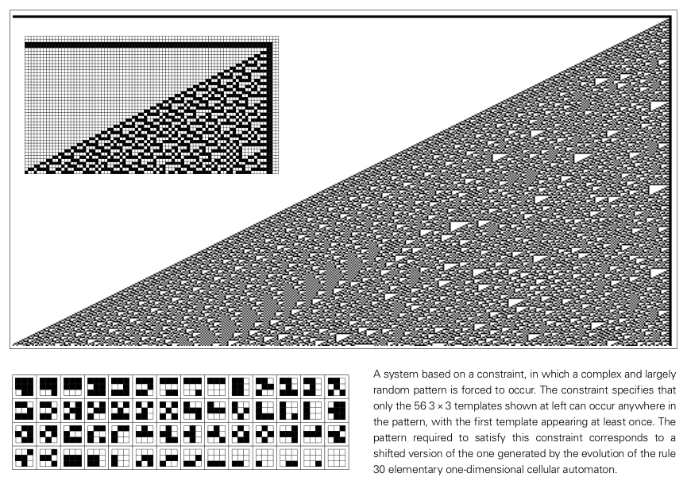
<!-- ORIGINAL_FIGURES page=0237 end -->

图注：一个基于约束的系统，其中复杂且大体随机的图案被迫出现。约束指定左侧所示的 56 个 `3 x 3` 模板是唯一可在图案任意位置出现的模板，并要求第一个模板至少出现一次。满足该约束所需的图案，对应于规则 30 初等一维元胞自动机演化生成图案的一个移位版本。

所以，这最终表明，确实有可能在基于约束的系统中迫使复杂行为出现。但从本节所见，这类行为似乎相当罕见：不同于本书讨论过的许多简单规则，几乎所有简单约束似乎都只导致相当简单的图案。

任何基于规则的现象，最终总是也可以用约束来描述。但本节结果表明，为了让复杂行为出现，这类描述可能必须相当复杂。因此，传统科学和数学倾向于集中研究像约束那样运作的方程这一事实，为它们未能识别本书讨论的复杂性基本现象又提供了一个原因。
