# 第 6 章：从随机性开始

[[PDF page 239]]

<!-- ORIGINAL_FIGURES page=0239 start -->
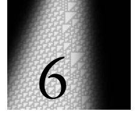
<!-- ORIGINAL_FIGURES page=0239 end -->

# 从随机性开始

## 秩序的涌现

过去几章中，我们已经看到简单程序能够产生的许多行为例子。不过，虽然我们讨论了各种不同类型的底层规则，但大多数时候我们只考虑了最简单的可能初始条件，比如通常只从单个黑色元胞开始。

本章的目的，是走到相反的极端，考虑完全随机的初始条件，例如每个元胞都随机选择为黑色或白色。

人们也许会认为，从这种随机性出发，永远不会有秩序涌现。但事实上，本章将发现，许多系统会自发地倾向于组织自身，因此即使初始条件完全随机，它们最终也会产生带有许多完全不随机特征的行为。

下一页顶部图给出第一个简单例子：一个元胞自动机从典型随机初始条件开始，然后按照一条非常简单的规则向页面下方演化：如果一个元胞的任一邻居为黑色，该元胞就变成黑色。

图中显示，初始条件中存在的每个白色区域都会逐渐被黑色填满，最终留下的只是所有元胞都为黑色的均匀状态。

---

[[PDF page 240]]

<!-- ORIGINAL_FIGURES page=0240 start -->
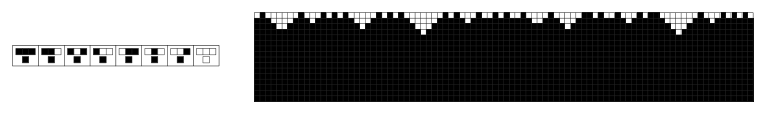
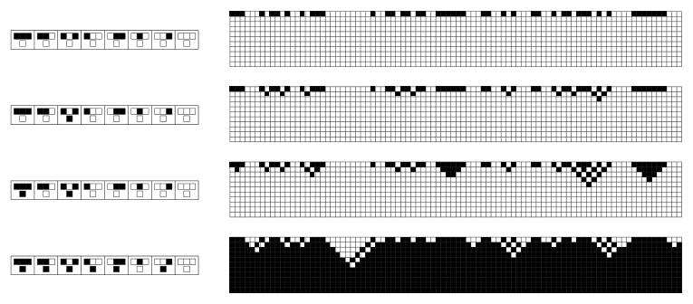
<!-- ORIGINAL_FIGURES page=0240 end -->

图注：一个元胞自动机，从任何随机初始条件出发都会演化到简单均匀状态。本情形中的规则最早显示在第 24 页，按第 53 页描述的方案编号为 254。它规定，只要一个元胞的任一邻居已经是黑色，该元胞就应当变成黑色。

下面的图显示其他元胞自动机例子，它们表现出同样的基本现象。每种情形中，初始条件都是随机的，但系统仍然会迅速组织自身，变成均匀白色或均匀黑色。

图注：另外四个元胞自动机例子，它们从随机初始条件演化到完全均匀状态。这里展示的规则分别对应编号 0、32、160 和 250。

对页显示的是行为稍微复杂一些的元胞自动机。从随机初始条件开始，这些元胞自动机也会迅速稳定到稳定状态。但现在这些稳定状态不只是颜色均匀，而是包含一组确定结构；这些结构要么在连续步骤中保持不动，要么周期性重复。

那么，如果底层规则简单，所有从随机初始条件开始的元胞自动机最终都会稳定下来，给出某种看起来简单的稳定状态吗？

---

[[PDF page 241]]

<!-- ORIGINAL_FIGURES page=0241 start -->
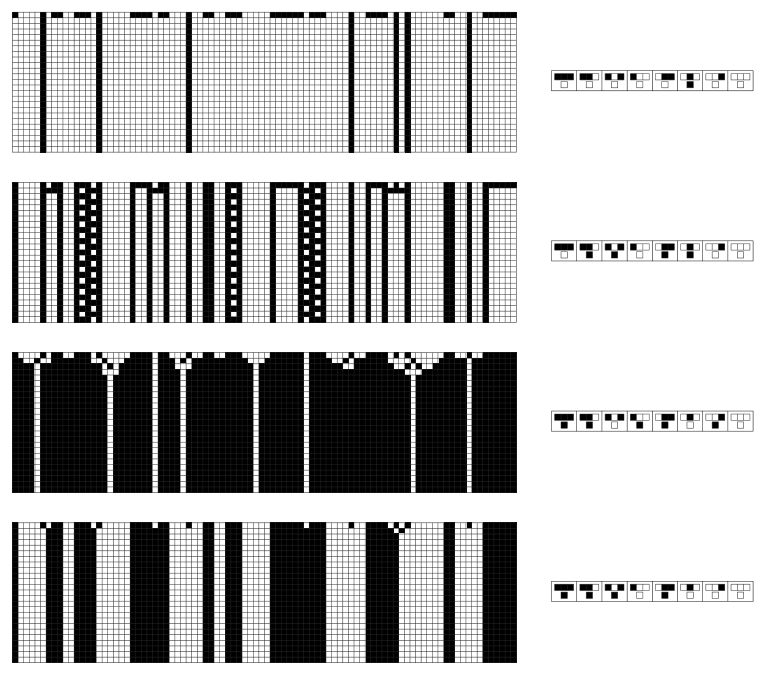
<!-- ORIGINAL_FIGURES page=0241 end -->

图注：从随机初始条件演化并产生一组确定简单结构的元胞自动机例子。对任何特定规则而言，这些结构的形式总是相同的。但它们的位置依赖于给定初始条件的细节；在许多情形中，最终结构排列可以看作初始条件的一种过滤版本。例如，这里展示的第一条规则中，只要初始条件中存在一个孤立黑色元胞，最终就会在该处出现由一个黑色元胞组成的结构。所示规则编号为 4、108、218 和 232。

结果表明，并非如此。事实上，下一页图显示许多例子中的一个：从随机初始条件开始，复杂行为会永远持续下去。产生的行为在许多方面似乎完全随机。但散布在图中的许多确定白色三角形和其他小结构，表明至少存在某种程度的组织。

---

[[PDF page 242]]

<!-- ORIGINAL_FIGURES page=0242 start -->
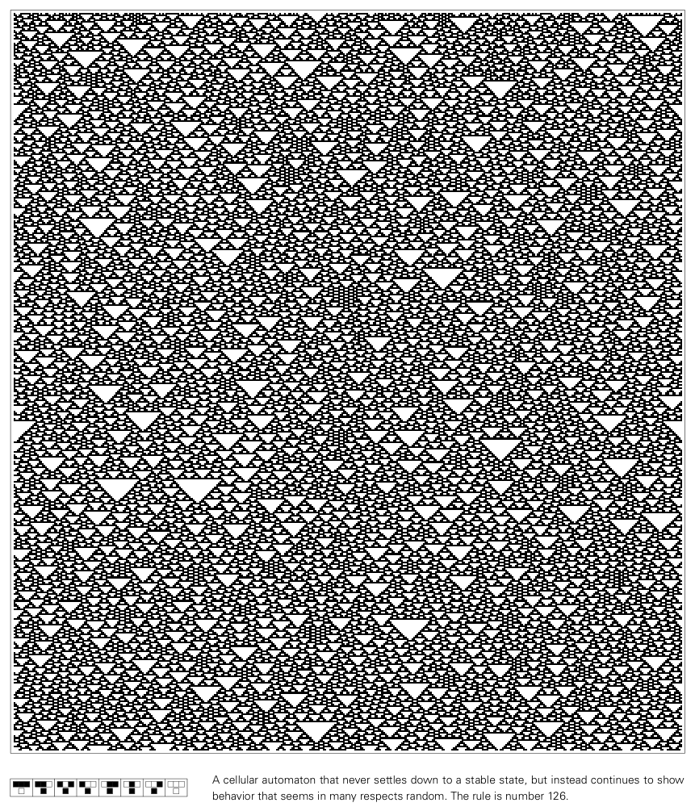
<!-- ORIGINAL_FIGURES page=0242 end -->

图注：一个元胞自动机，它永远不会稳定到稳定状态，而是持续表现出在许多方面看似随机的行为。该规则编号为 126。

---

[[PDF page 243]]

<!-- ORIGINAL_FIGURES page=0243 start -->
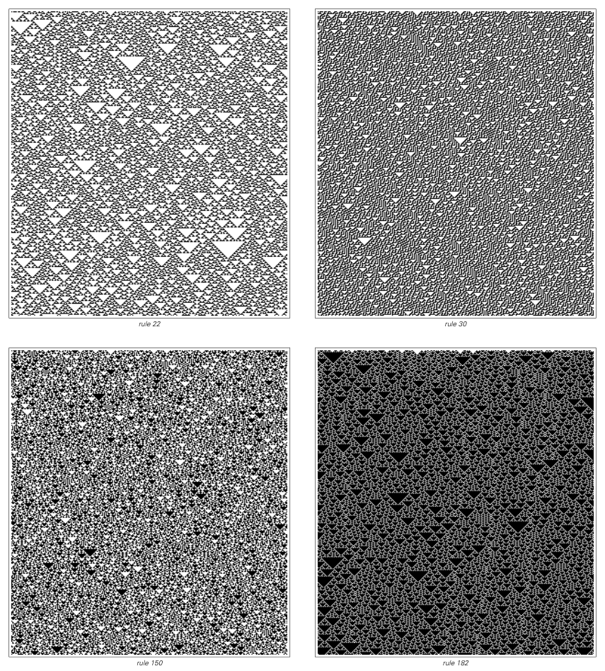
<!-- ORIGINAL_FIGURES page=0243 end -->

图注：其他元胞自动机例子，从随机初始条件开始时，它们永远不会稳定到稳定状态。每幅图总宽度为 300 个元胞。注意，所有图中都散布着三角形和其他小结构。

---

[[PDF page 244]]

<!-- ORIGINAL_FIGURES page=0244 start -->
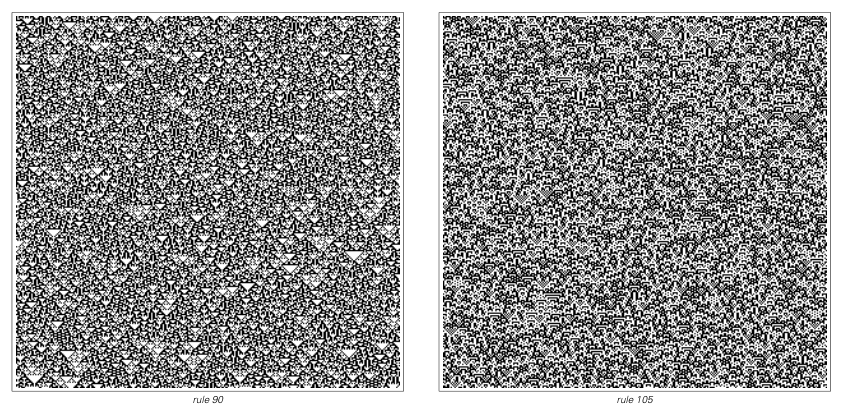
<!-- ORIGINAL_FIGURES page=0244 end -->

图注：另外两个元胞自动机，它们生成各种小结构，但会永远持续显示相当随机的行为。

上图和上一页图给出了更多具有类似行为的元胞自动机例子。每种情形中产生的图案都有相当多随机性。但尽管存在这种随机性，系统演化中总会涌现出三角形和其他小结构。

那么，从随机初始条件出发的元胞自动机，其行为究竟能复杂到什么程度？我们已经看到一些行为会迅速稳定的例子，也看到另一些会永远保持相当随机的例子。但从某种意义上说，最大复杂性位于这两个极端之间，也就是既不完全稳定，也不永远表现出接近均匀随机性的系统。

对页和再下一页以我们最早在第 32 页讨论的元胞自动机为例。所用初始条件再次完全随机。但这个元胞自动机会迅速组织成一组确定的局部结构。只是现在这些结构并不只是保持不动，而是四处移动，并以复杂方式相互作用。其结果是一个精致的图案，混合了秩序和随机性，其复杂程度不亚于本书中已经见过的任何东西。

---

[[PDF page 245]]

<!-- ORIGINAL_FIGURES page=0245 start -->
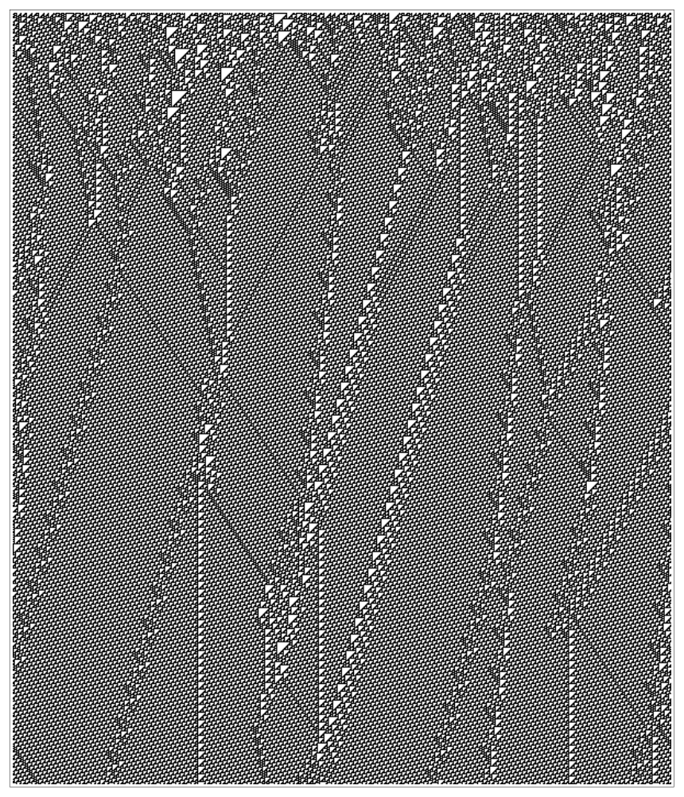
<!-- ORIGINAL_FIGURES page=0245 end -->

图注：规则 110 元胞自动机从随机初始条件出发的复杂行为。系统迅速组织自身，产生一组确定的局部结构，这些结构随后四处移动，并以复杂方式相互作用。

---

[[PDF page 246]]

<!-- ORIGINAL_FIGURES page=0246 start -->
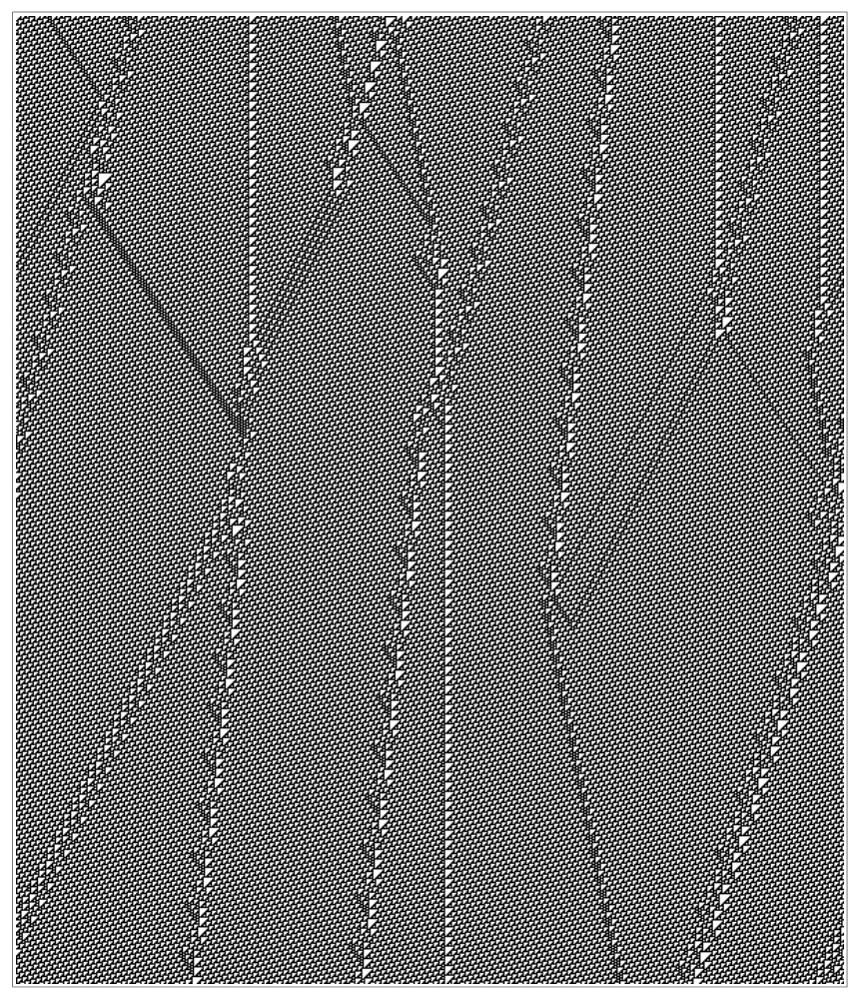
<!-- ORIGINAL_FIGURES page=0246 end -->

图注：上一页图案的延续。每页显示该元胞自动机演化 700 步。

---

[[PDF page 247]]

<!-- ORIGINAL_FIGURES page=0247 start -->
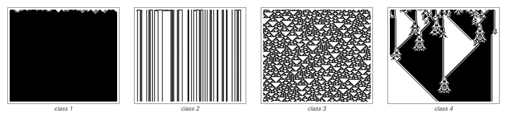
<!-- ORIGINAL_FIGURES page=0247 end -->

## 四类行为

上一节中，我们看到若干具体元胞自动机从随机初始条件开始会做什么。但本节我想提出更一般的问题：任意元胞自动机从随机初始条件开始会做什么？

一开始，人们也许会假定，这样的一般问题永远不会有有用答案。毕竟，每一个元胞自动机最终都有不同底层规则，带有不同性质和潜在不同后果。

但接下来几页显示若干元胞自动机序列，它们全都从随机初始条件开始。

的确，几乎对每条规则来说，产生的具体图案至少都有些不同。但如果把所有规则放在一起观察，就会看到某种相当惊人的事实：尽管每个图案在细节上都不同，根本不同的图案类型数量却非常有限。

事实上，在各种元胞自动机中，出现的图案几乎总是可以相当容易地归入下面展示的四个基本类别之一。

图注：从随机初始条件演化的元胞自动机中所见四个基本行为类别的例子。我最早在 1983 年发展出这种分类。

这些类别方便地按复杂性增加的顺序编号，每一类都有某些立即可见的鲜明特征。

在第 1 类中，行为非常简单，几乎所有初始条件都会导致完全相同的均匀最终状态。

---

[[PDF page 248]]

<!-- ORIGINAL_FIGURES page=0248 start -->
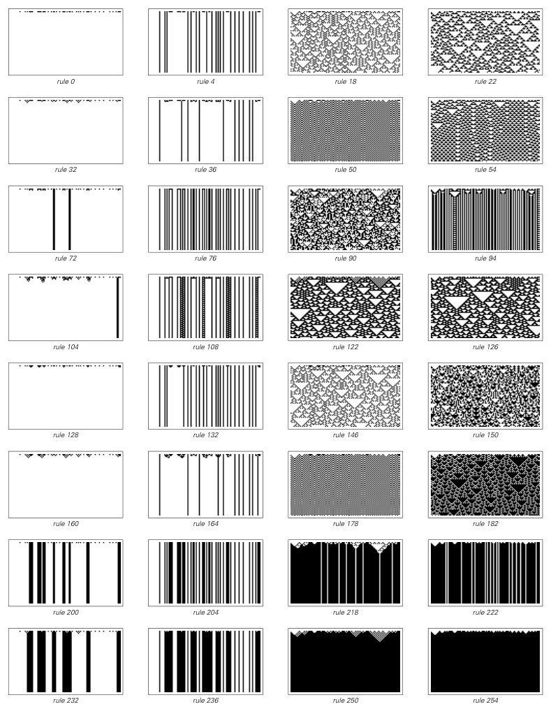
<!-- ORIGINAL_FIGURES page=0248 end -->

图注：所有只以对称方式涉及最近邻、每个元胞有两种可能颜色，并使全白状态保持不变的元胞自动机的行为。

---

[[PDF page 249]]

<!-- ORIGINAL_FIGURES page=0249 start -->
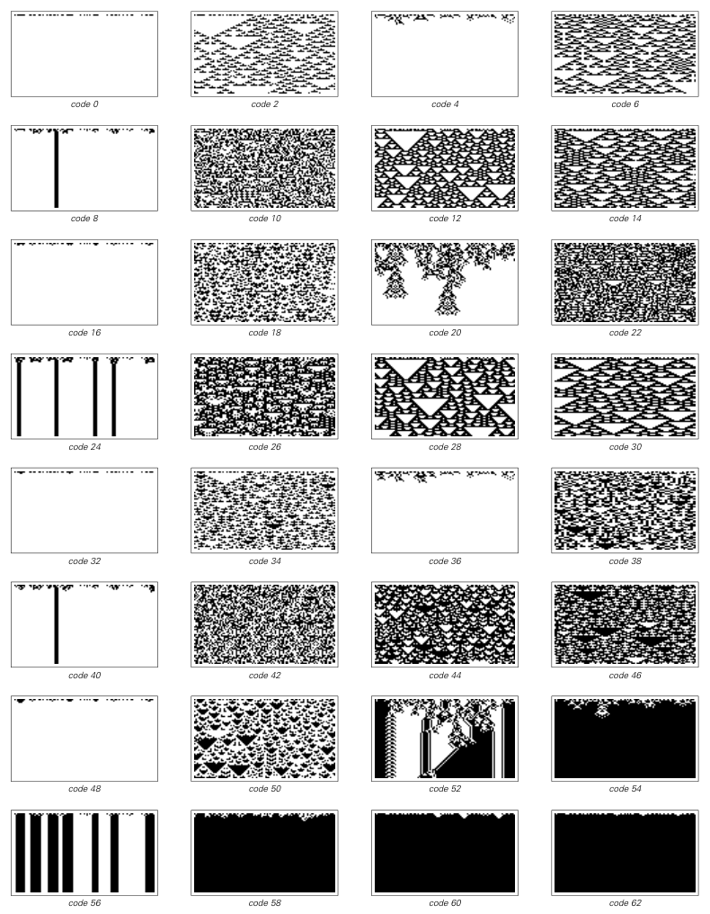
<!-- ORIGINAL_FIGURES page=0249 end -->

图注：总和型元胞自动机，其规则涉及最近邻和次近邻，且每个元胞有两种可能颜色。

---

[[PDF page 250]]

<!-- ORIGINAL_FIGURES page=0250 start -->
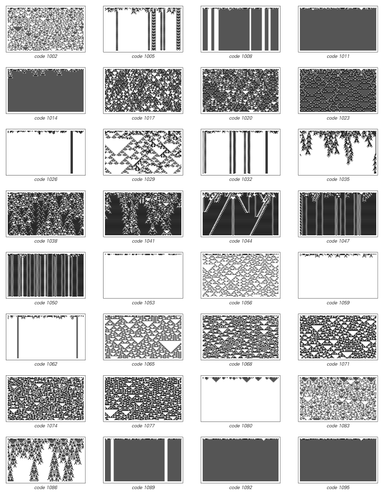
<!-- ORIGINAL_FIGURES page=0250 end -->

图注：一系列总和型元胞自动机，其规则只涉及最近邻，但每个元胞可以有三种可能颜色。

---

[[PDF page 251]]

在第 2 类中，有许多不同可能的最终状态，但它们全都只由一组特定简单结构组成，这些结构要么永远保持相同，要么每隔几步重复。

在第 3 类中，行为更复杂，并且在许多方面显得随机，虽然三角形和其他小尺度结构本质上总会在某个层面上被看到。

最后，如接下来几页所示，第 4 类涉及秩序与随机性的混合：系统产生局部结构，这些结构本身相当简单，但它们会四处移动并以非常复杂的方式相互作用。

我最初在大约十七年前，通过观察数千张类似前几页的图，发现了这四类行为。一开始，很像我在这里所做的，我纯粹根据所见图案的一般视觉外观进行分类。

但当我研究元胞自动机更具体的性质时，我发现，大多数这类性质都与我已经识别出的类别密切相关。事实上，在试图预测某个特定元胞自动机的具体性质时，通常只需要知道该元胞自动机属于哪一类就足够。

从某种意义上说，这种情形类似于比如把材料分为固体、液体和气体，或把生物分为植物和动物。起初，分类纯粹根据一般外观作出。但后来，当更具体的性质变得已知时，这些性质结果表明与已经识别出的类别相关。

通常可以用这类具体性质来为原始类别给出更精确定义。而通常所有合理定义都会把任何特定系统归入同一类别。

图注：具有最近邻总和型规则、每个元胞有三种可能颜色的第 4 类元胞自动机例子。每幅图显示从随机初始条件出发演化 1500 步。

---

[[PDF page 252]]

<!-- ORIGINAL_FIGURES page=0252 start -->
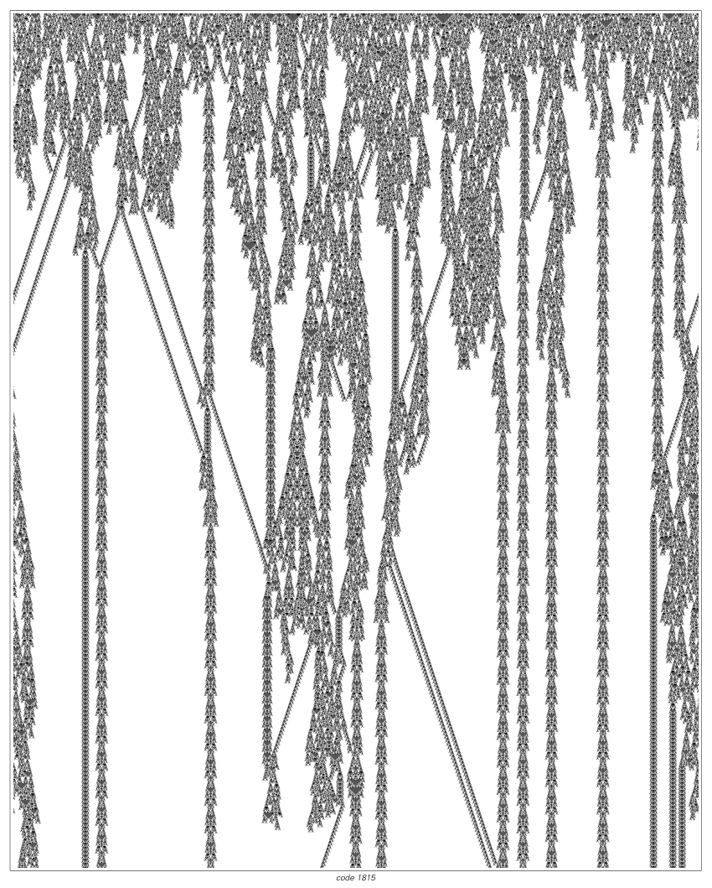
<!-- ORIGINAL_FIGURES page=0252 end -->

图示：代码 1815 的第 4 类元胞自动机行为。

---

[[PDF page 253]]

<!-- ORIGINAL_FIGURES page=0253 start -->
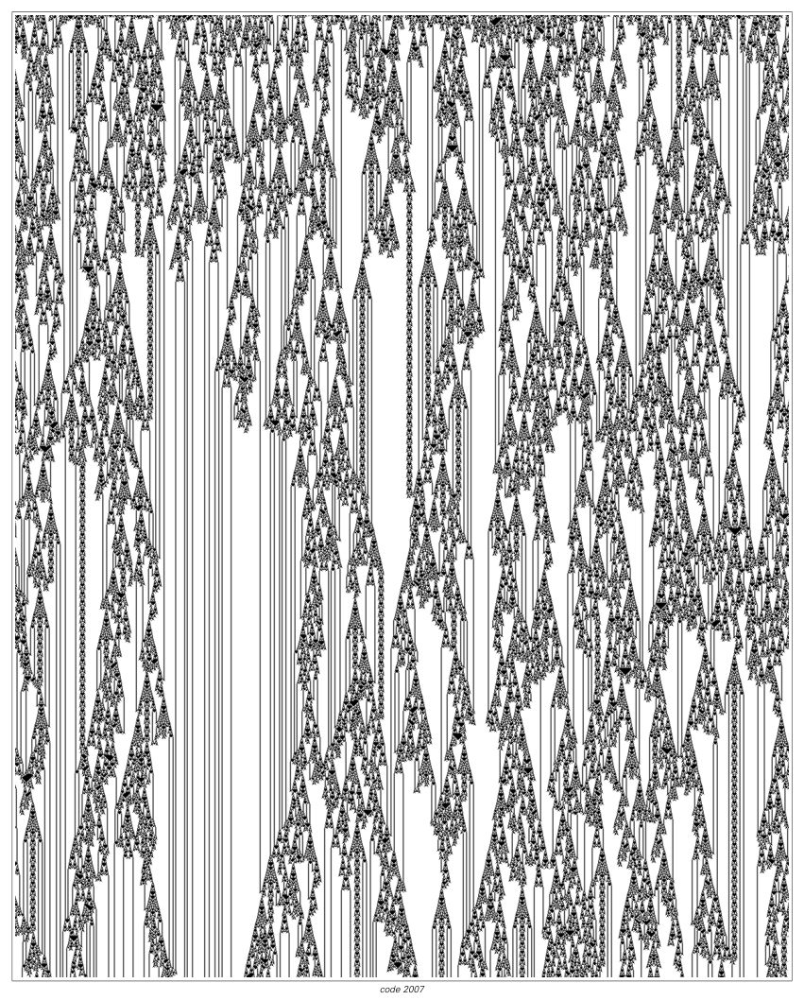
<!-- ORIGINAL_FIGURES page=0253 end -->

图示：代码 2007 的第 4 类元胞自动机行为。

---

[[PDF page 254]]

<!-- ORIGINAL_FIGURES page=0254 start -->
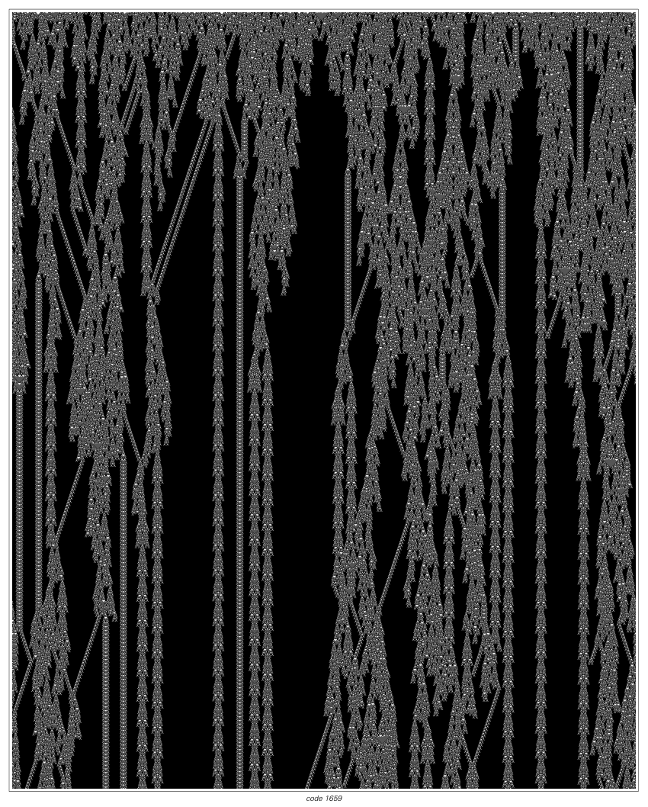
<!-- ORIGINAL_FIGURES page=0254 end -->

图示：代码 1659 的第 4 类元胞自动机行为。

---

[[PDF page 255]]

<!-- ORIGINAL_FIGURES page=0255 start -->
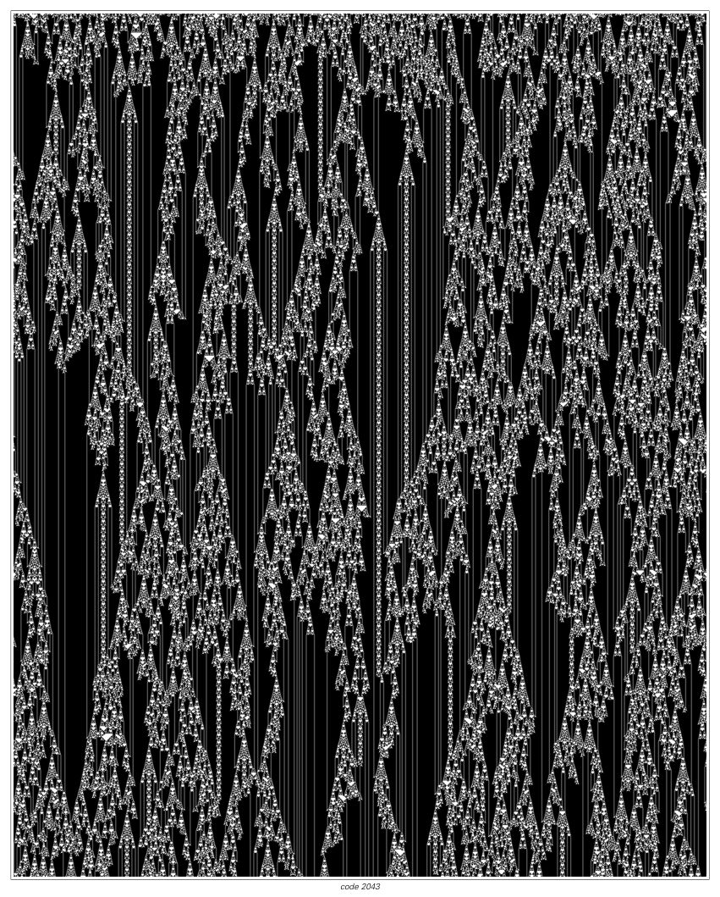
<!-- ORIGINAL_FIGURES page=0255 end -->

图示：代码 2043 的第 4 类元胞自动机行为。

---

[[PDF page 256]]

<!-- ORIGINAL_FIGURES page=0256 start -->
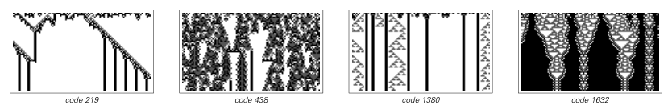
<!-- ORIGINAL_FIGURES page=0256 end -->

不过，对几乎任何一般分类方案来说，不可避免都会有边界情形：一种定义把它们归入某一类，另一种定义则归入另一类。元胞自动机也是如此：偶尔会有如下图中的规则，显示出某一类的某些特征，又显示出另一类的某些特征。

图注：不完全适合归入文本所述四个基本类别中任何一个的罕见边界元胞自动机例子。基于不同具体性质的不同定义，会把这些元胞自动机归入不同类别。所示规则是最近邻总和型规则，每个元胞有三种可能颜色。第一条规则可以是第 2 类或第 4 类，第二条可以是第 3 类或第 4 类，第三条可以是第 2 类或第 3 类，第四条可以是第 1、2 或 3 类。

但这类规则相当罕见；大多数情形中，所见行为会清楚地落入上面描述的四类之一。

那么，给定某个元胞自动机的底层规则，能否判断这个元胞自动机会产生哪一类行为？

大多数情形中，没有容易办法做到这一点；事实上，几乎只能运行该元胞自动机，看看它会做什么。

但有时仅从底层规则形式，就可以判断至少某些内容。例如，第 232 页前两列中的所有规则都可以证明永远不可能产生第 1 类或第 2 类之外的任何行为。

此外，即使从单条规则中能判断的信息很少，也常常会出现这样的情况：在某个序列中相邻出现的规则具有相似行为。对页图中就可以看到这一点。顶部一行规则全都具有第 1 类行为。随后看到第 2 类行为，然后是第 4 类，再然后是第 3 类。此后，其余规则大多是第 3 类。

对页图中第 4 类出现在第 2 类和第 3 类之间，这种情况并不罕见。因为虽然从表观复杂性看，第 4 类高于第 3 类，但从可以称为整体活动性的角度看，它在某种意义上介于第 2 类和第 3 类之间。

---

[[PDF page 257]]

<!-- ORIGINAL_FIGURES page=0257 start -->
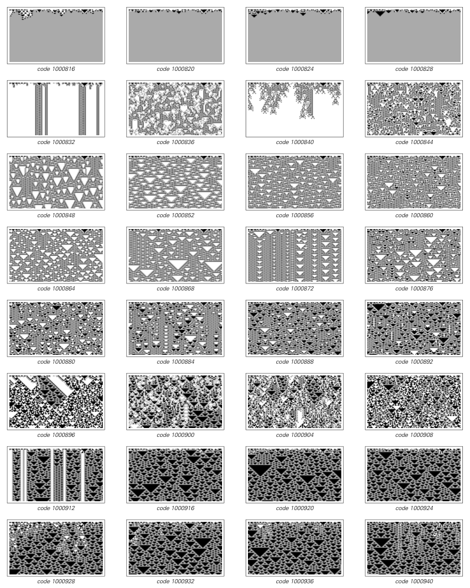
<!-- ORIGINAL_FIGURES page=0257 end -->

图注：一系列涉及最近邻、每个元胞有四种可能颜色的总和型规则，被选择来显示具有不同类别行为的规则之间的过渡。注意，第 4 类似乎出现在第 2 类和第 3 类之间。

---

[[PDF page 258]]

关键在于，第 1 类和第 2 类系统会迅速稳定到本质上不再有进一步活动的状态。但第 3 类系统会继续有许多元胞在每一步发生变化，因此在某种意义上会永远维持高活动水平。第 4 类系统则居中：它们显示的活动既不像第 2 类那样完全消亡，也不像第 3 类所见那样维持在高水平。

事实上，当观察某个特定第 4 类系统时，它常常似乎在第 2 类和第 3 类行为之间摇摆，从未坚定稳定到其中任何一边。

从某些方面说，在所有可能元胞自动机中可以识别出实际上位于第 2 类和第 3 类边界上的一些，并不令人意外。但在实践中找到的真正第 4 类系统，令人瞩目之处在于它们具有自身明确特征，最显著的是局部结构的存在；这些特征似乎与它们以某种方式位于第 2 类和第 3 类之间的边界上没有直接关系。

结果表明，具有相同一般特征的第 4 类系统，不仅出现在普通元胞自动机中，也出现在连续元胞自动机等系统中。

对页显示一系列第 155 页讨论过的那类连续元胞自动机。这类系统的底层规则包含一个可以从 0 到 1 平滑变化的参数。

对这个参数的不同取值，人们看到的行为也不同。但这种行为似乎本质上落入我们已经在普通元胞自动机中看到的同样四个类别。事实上，甚至存在相当直接的类比物，例如普通第 3 类元胞自动机中看到的三角形结构。

不过，由于连续元胞自动机的底层规则基于连续参数，人们可以问，当平滑改变这个参数时会发生什么，特别是最终会看到怎样的行为类别序列。

答案是，通常会有一些第 1 类或第 2 类行为区段，也会有一些第 3 类行为区段。但在这些过渡处，结果表明通常会看到第 4 类行为，如对页所示。

---

[[PDF page 259]]

<!-- ORIGINAL_FIGURES page=0259 start -->
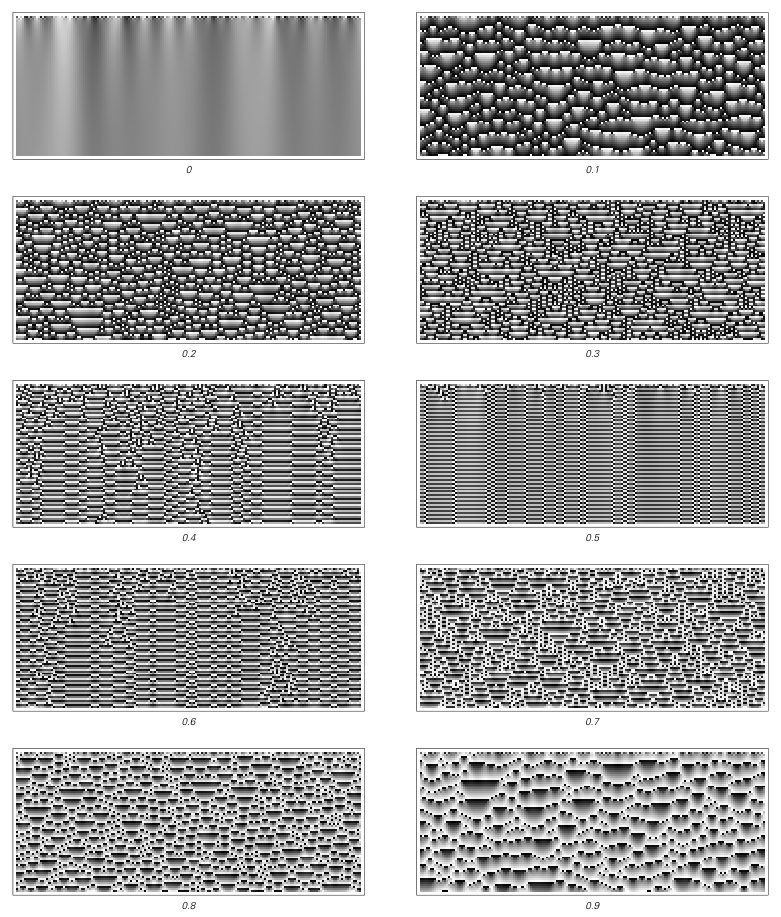
<!-- ORIGINAL_FIGURES page=0259 end -->

图注：连续元胞自动机从随机初始条件出发演化的例子。如第 155 页所述，这里每个元胞可以有 0 到 1 之间的任意灰度；每一步，一个给定元胞的灰度通过取该元胞及其两个邻居灰度的平均值、加上指定常数、然后只保留结果的小数部分来确定。产生的行为再次落入不同类别，并且与前几页普通元胞自动机中看到的四类行为很好对应。

---

[[PDF page 260]]

<!-- ORIGINAL_FIGURES page=0260 start -->
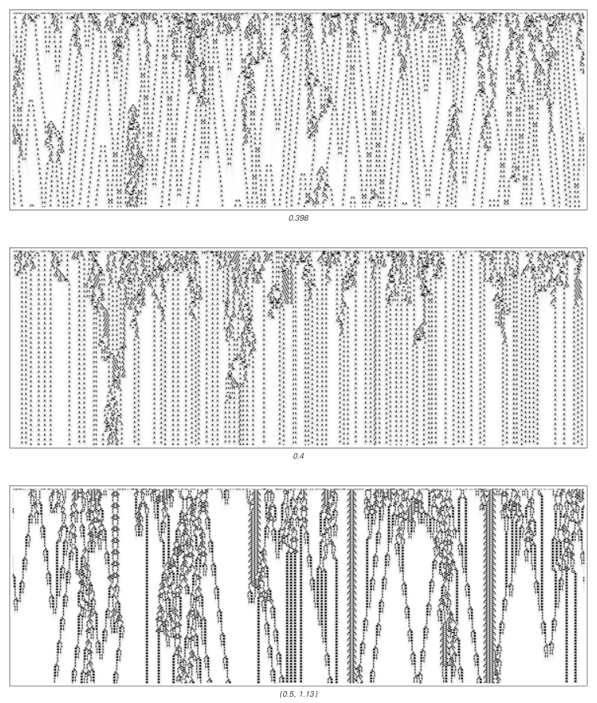
<!-- ORIGINAL_FIGURES page=0260 end -->

图注：表现出第 4 类行为的连续元胞自动机例子。规则与上一幅图属于同一类，但这里展示的第三种情形中，每个邻近元胞的灰度在取平均之前都会乘以 1.13。此外，这些图中的实际灰度通过取每个元胞与其邻居灰度之间的差值得到，从而去除上一幅图中可见的均匀条纹。令人惊讶的是，在这里展示的连续系统中，带有离散局部结构的第 4 类行为仍然能够出现。

---

[[PDF page 261]]

尤其令人瞩目的是，这种行为包含与我们在普通离散第 4 类元胞自动机中看到的同类局部结构和其他特征。

那么二维元胞自动机又如何？它们也表现出我们在一维中看到的同样四类行为吗？接下来两页图显示若干简单二维元胞自动机从随机初始条件开始演化的各个步骤。正如一维情形一样，几种不同类别的行为立刻可见。

但如果不只观察二维元胞自动机在几个具体步骤上的完整状态，而是观察系统在一整串步骤中穿过它的一维切片，那么与一维情形的对应会变得明显得多。

第 248 页图显示这类切片的例子。我们看到，这些切片中的图案与我们已经在普通一维元胞自动机中看到的图案惊人相似。事实上，通过观察这类切片，人们可以很容易识别出与一维元胞自动机中完全相同的四类行为。

因此，特别可以看到第 4 类行为。不过，在第 248 页的例子中，这类行为似乎总是叠加在某种重复背景上，很像第 229 页规则 110 一维元胞自动机的情形。

那么，能否在简单白色背景上得到第 4 类行为？很像一维情形，在最简单可能类型的规则中似乎不会发生这一点。但只要进入稍微复杂一些但仍然非常简单的规则，就能找到例子。

因此，作为一个例子，第 249 页显示一个二维元胞自动机，休闲计算中常称为生命游戏；即使在白色背景上，其中也会出现各种局部结构。如果观看这个元胞自动机行为的影片，它与一维第 4 类系统的对应并不特别明显。但只要观察一维切片，如第 249 页所示，看到的内容立即就与许多一维第 4 类元胞自动机中看到的内容惊人相似。

---

[[PDF page 262]]

<!-- ORIGINAL_FIGURES page=0262 start -->
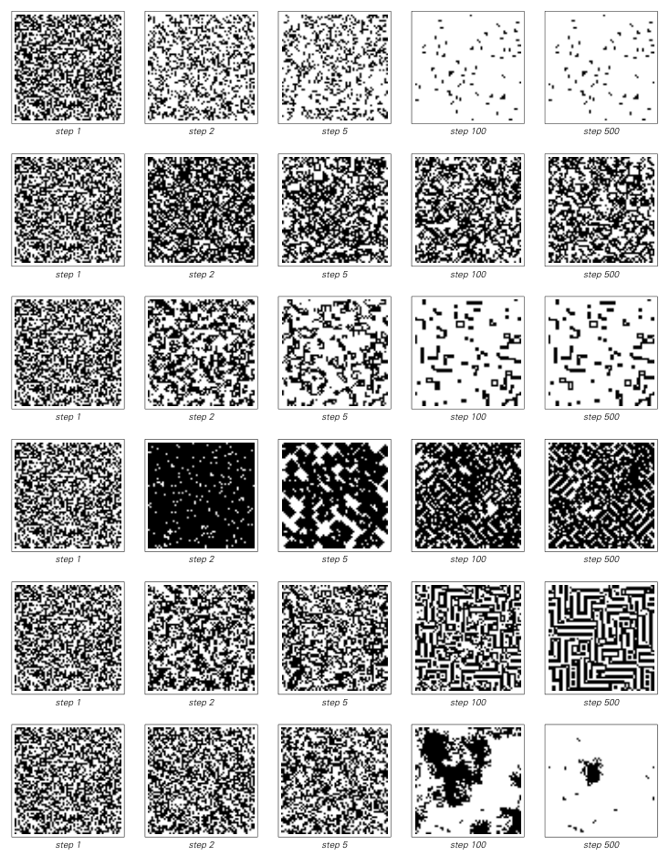
<!-- ORIGINAL_FIGURES page=0262 end -->

图注：具有各种总和型规则的二维元胞自动机从随机初始条件开始演化的例子。规则涉及一个元胞及其四个直接邻居。规则代码编号中的连续二进制数字位，分别给出该元胞及其四个邻居总数从 5 递减到 0 时的结果。

---

[[PDF page 263]]

<!-- ORIGINAL_FIGURES page=0263 start -->
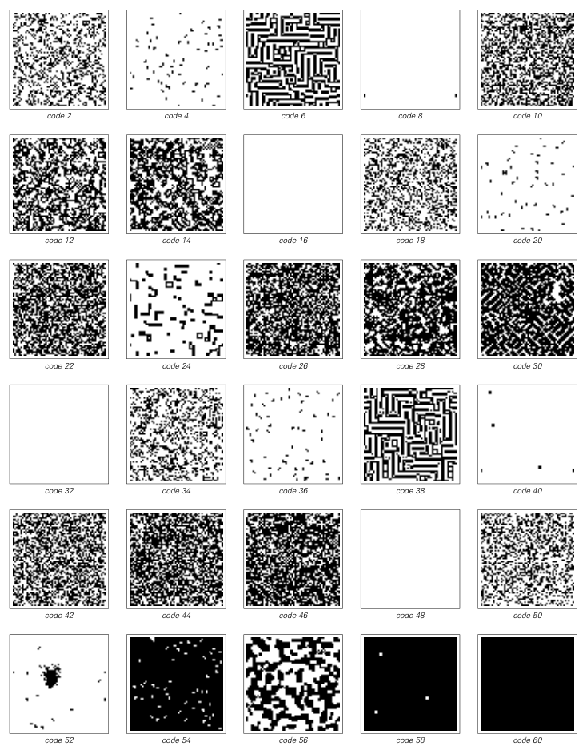
<!-- ORIGINAL_FIGURES page=0263 end -->

图注：一系列二维元胞自动机从随机初始条件开始演化 500 步后产生的图案。所示规则与对页属于同一类，并包括 64 种可能规则中多数会使全白状态保持不变的规则。

---

[[PDF page 264]]

<!-- ORIGINAL_FIGURES page=0264 start -->
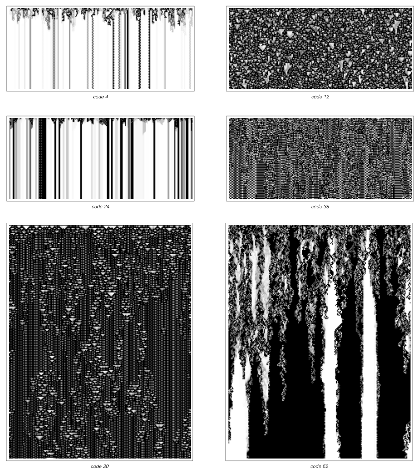
<!-- ORIGINAL_FIGURES page=0264 end -->

图注：穿过各种二维元胞自动机演化的一维切片。每幅图中，切片位置后方的黑色元胞以逐渐变浅的灰度显示，仿佛它们正退入某种雾中。注意其中存在第 3 类和第 4 类行为例子，它们看起来与一维中的例子惊人相似。

---

[[PDF page 265]]

<!-- ORIGINAL_FIGURES page=0265 start -->
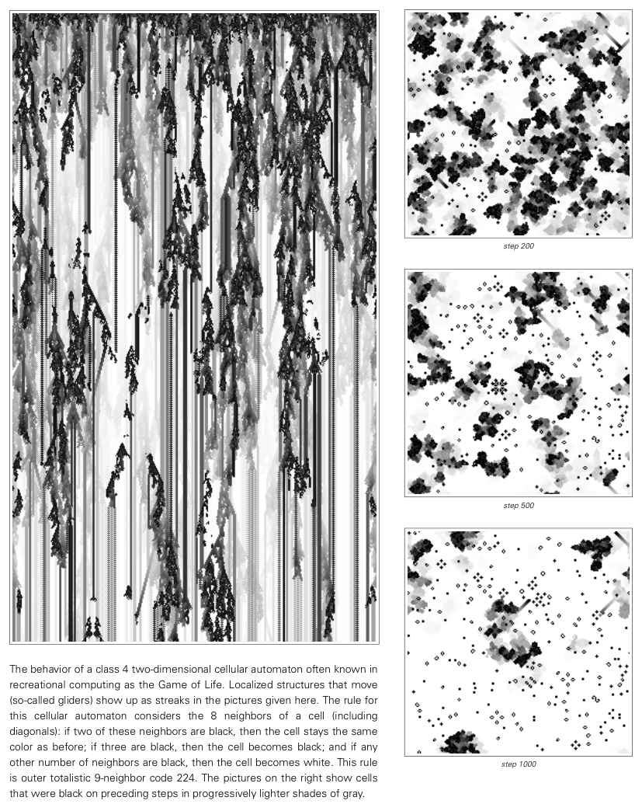
<!-- ORIGINAL_FIGURES page=0265 end -->

图注：一个第 4 类二维元胞自动机的行为，在休闲计算中常称为生命游戏。移动的局部结构（所谓滑翔机）在这里给出的图中显示为条纹。这个元胞自动机的规则考虑一个元胞的 8 个邻居（包括对角邻居）：如果其中两个邻居为黑色，那么该元胞保持原来的颜色；如果三个为黑色，那么该元胞变成黑色；如果黑色邻居数量为其他任意值，那么该元胞变成白色。该规则是外总和型 9 邻域代码 224。右侧图显示前面步骤中曾为黑色的元胞，并以逐渐变浅的灰度表示。

---

[[PDF page 266]]

<!-- ORIGINAL_FIGURES page=0266 start -->
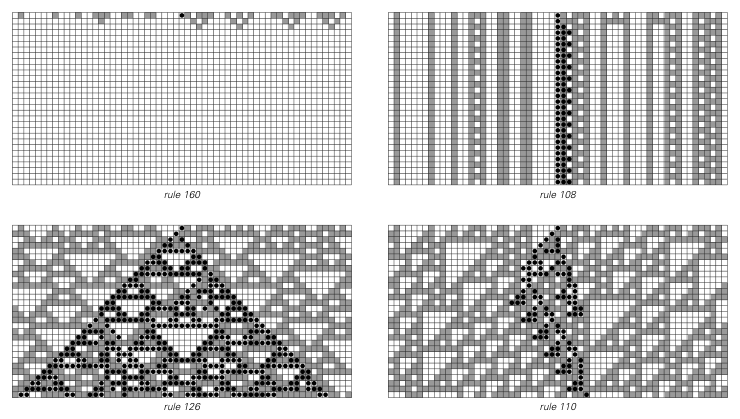
<!-- ORIGINAL_FIGURES page=0266 end -->

## 对初始条件的敏感性

上一节中，我们通过观察元胞自动机产生图案的整体外观，识别出四个基本类别。但这四个类别还有其他重要区别特征，其中一个重要例子就是它们对初始条件微小改变的敏感性。

下图显示，在上一节识别出的四个元胞自动机类别中，各取一个典型元胞自动机，改变其初始条件中单个元胞的初始颜色会产生什么效果。

图注：对上一节识别出的四个类别中典型元胞自动机，改变初始条件中单个元胞颜色的效果。黑点表示所有发生改变的元胞。这类改变的行为方式，对四类系统各有典型差异。

每一类的结果相当不同。

在第 1 类中，改变总是消亡；事实上无论使用什么初始条件，都会到达完全相同的最终状态。在第 2 类中，改变可能持续存在，但总是局限在系统中的一个小区域内。然而在第 3 类中，行为相当不同。因为如对页所示，任何作出的改变通常都会以均匀速度扩散，最终影响系统的每个部分。在第 4 类中，改变也可以扩散，但只会以零星方式扩散，如对页和再下一页所示。

---

[[PDF page 267]]

<!-- ORIGINAL_FIGURES page=0267 start -->
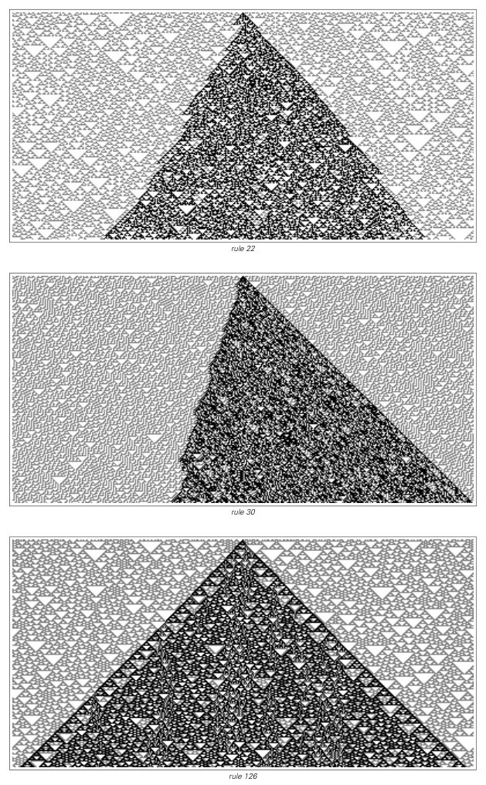
<!-- ORIGINAL_FIGURES page=0267 end -->

图注：在三个典型第 3 类元胞自动机中，改变单个初始元胞颜色的效果。

---

[[PDF page 268]]

那么，对初始条件改变的这些不同响应，真正意义是什么？从某种意义上说，它们揭示了每类系统处理信息方式的基本差异。

在第 1 类中，关于初始条件的信息总是迅速被遗忘，因为无论初始条件是什么，系统都会很快演化到一个单一最终状态，其中没有任何初始条件痕迹。

在第 2 类中，关于初始条件的某些信息保留在最终结构构型中，但这些信息总是完全局部化，从不以任何方式从系统的一部分传递到另一部分。

另一方面，第 3 类系统的一个特征是，它们显示信息的长程通信：因此，在系统中任何地方作出的任何改变，几乎总是最终会被传达到系统中哪怕最遥远的部分。

第 4 类系统再次有些介于第 2 类和第 3 类之间。信息的长程通信在原则上是可能的，但它并不总是发生，因为任何特定改变只有在碰巧影响某个穿过系统移动的局部结构时，才会被传达到系统其他部分。

上一节识别出的四类系统之间，有许多典型差异。但它们在信息处理方面的差异，从某些方面说尤其根本。事实上，正如本书稍后会看到的，常常只要观察自然中出现的系统，其信息处理方式怎样对应于我们在这里识别的基本系统类别中看到的方式，就可以理解这些系统的一些最重要特征。

图注：规则 110 第 4 类元胞自动机中初始条件微小改变的效果。只有当这些改变实际上由穿过系统传播的局部结构携带时，它们才会扩散。

---

[[PDF page 269]]

<!-- ORIGINAL_FIGURES page=0269 start -->
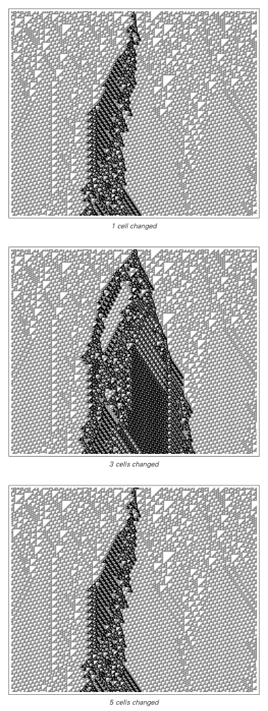
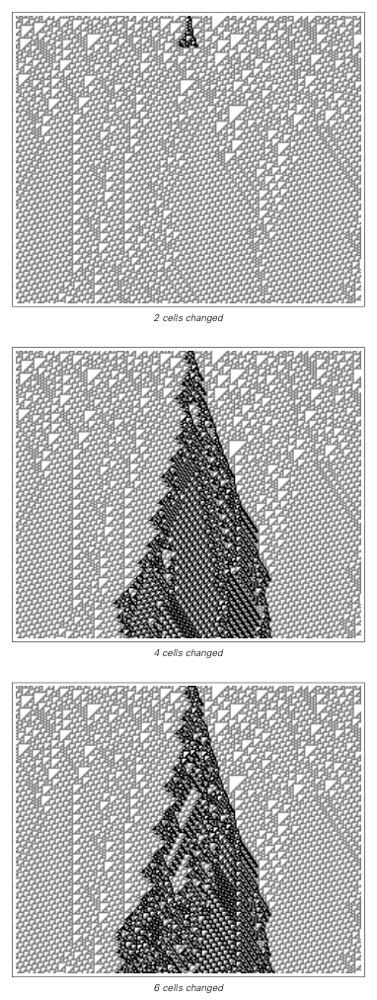
<!-- ORIGINAL_FIGURES page=0269 end -->

图示：规则 110 中分别改变 1 到 6 个初始元胞时产生的影响。

---

[[PDF page 270]]

<!-- ORIGINAL_FIGURES page=0270 start -->
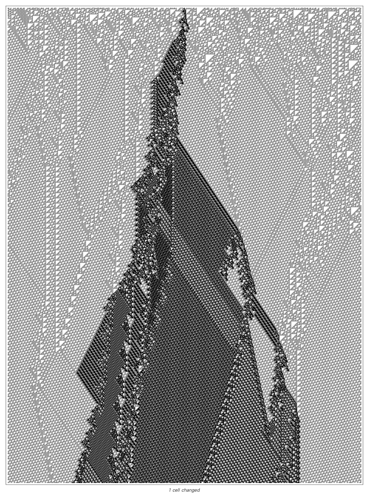
<!-- ORIGINAL_FIGURES page=0270 end -->

图示续：规则 110 中改变 1 个初始元胞时产生的影响。

---

[[PDF page 271]]

<!-- ORIGINAL_FIGURES page=0271 start -->
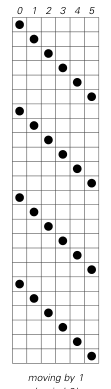
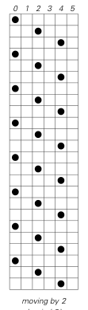
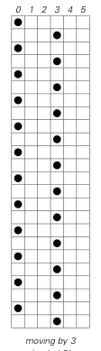
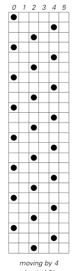
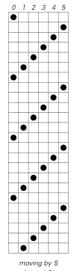
<!-- ORIGINAL_FIGURES page=0271 end -->

## 有限大小系统与第 2 类行为

过去两节中，我们看到第 2 类系统的两个重要特征：第一，它们的行为最终总是重复的；第二，它们不支持任何长程通信。

那么，这两个特征之间有什么联系？

答案是，缺少长程通信实际上迫使第 2 类系统的每一部分都像一个有限大小系统那样行为。于是有一个一般结果：任何由离散元素组成并遵循确定规则的有限大小系统，最终都必然表现出重复行为。事实上，正如下一章将讨论的，正是这一现象最终负责自然中我们看到的许多重复行为。

下图显示这个基本现象的一个非常简单例子。每种情形中都有一个点，它可以处于六个可能位置之一。每一步，这个点向右移动固定数量的位置；一旦到达右端，就环绕回去。

图注：一个简单系统，包含单个点，该点可以处于六个可能位置之一。每一步，该点向右移动若干位置，一旦到达右端就环绕回去。这个系统的行为，与其他有限大小系统一样，总是重复的。

---

[[PDF page 272]]

<!-- ORIGINAL_FIGURES page=0272 start -->
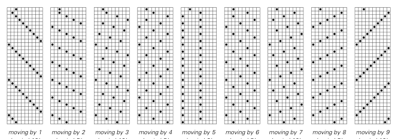
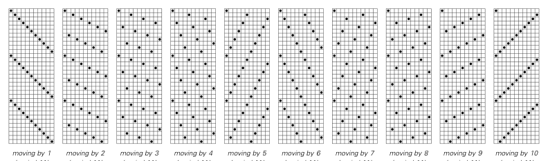
<!-- ORIGINAL_FIGURES page=0272 end -->

观察这些图，我们看到所得行为总是纯粹重复的，虽然不同情形中的重复周期不同。重复行为的基本原因是，只要这个点最终到达某个特定位置，它就必然总是重复上次位于该位置时所做的事情。

但由于总共只有六个可能位置，最多经过六步之后，这个点必然总会到达一个以前到过的位置。这意味着行为必然以至多六步的周期重复。

下图显示同一设置的更多例子，现在可能位置的数量为 10 和 11。在所有情形中，行为都是重复的，最大重复周期等于可能位置的数量。

图注：上一页所示类型系统的更多例子，但现在点有 10 个和 11 个可能位置。行为总会在至多 10 或 11 步中重复自身。但每种情形中的确切步数取决于定义该系统的数字的素因子。

---

[[PDF page 273]]

<!-- ORIGINAL_FIGURES page=0273 start -->
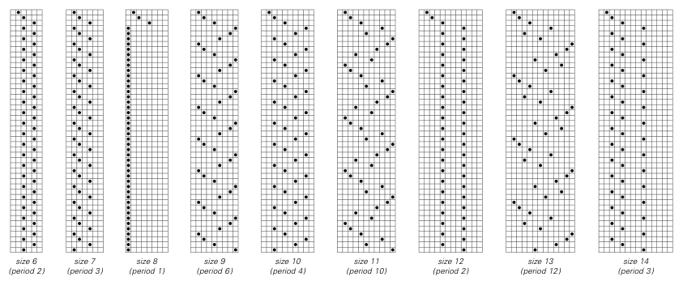
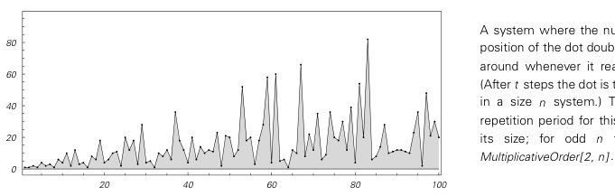
<!-- ORIGINAL_FIGURES page=0273 end -->

有时实际重复周期等于这个最大值。但它常常更小。事实上，有限大小系统的一个常见特征是，所见重复周期可以强烈依赖于系统的确切大小和它遵循的确切规则。

在对页所示系统类型中，结果表明，只要每一步移动的位置数量与可能位置总数没有公因子，重复周期就是最大的；例如当这两个量中任一个是素数时，就能做到这一点。

下图显示另一个基于简单规则的有限大小系统例子。特定规则是，每一步把表示点位置的数字加倍；一旦超过右端，就环绕回去。

图注：一个系统，其中表示点位置的数字每一步都会加倍，一旦到达右端就环绕回去。（因此在大小为 `n` 的系统中，经过 `t` 步后，点位于位置 `Mod[2^t, n]`。）左侧图给出这个系统的重复周期随其大小变化的情况；对奇数 `n`，该周期等于 `MultiplicativeOrder[2, n]`。

---

[[PDF page 274]]

再一次，所得行为总是重复的，而且重复周期永远不会大于点的可能位置总数。但如图所示，随着系统大小改变，实际重复周期会相当大幅度地跳变。结果表明，重复周期再次与点的可能位置数量的因子有关，并且在该数字为素数的那些情形中往往最大。

那么，元胞自动机这类系统中会发生什么？

对页图显示若干具有有限数量元胞的元胞自动机例子。每种情形中，元胞实际上都排列成一个圆，因此最右元胞的右邻居就是最左元胞，反之亦然。

这些系统的行为最终也会重复。但重复周期往往相当大。

任何系统的最大可能重复周期，总是等于该系统可能状态总数。

对上面讨论的单点系统来说，可能状态只对应于点的可能位置，因此状态数量等于系统大小。

但在元胞自动机中，黑白元胞的每一种可能排列都对应于系统的一个可能状态。因此有 `n` 个元胞时，就有 `2^n` 个可能状态。这个数量随大小 `n` 增长非常快：5 个元胞时已经有 32 个状态，10 个元胞时有 1024 个状态，20 个元胞时有 1,048,576 个状态，30 个元胞时有 1,073,741,824 个状态。

下一页图显示各种元胞自动机的实际重复周期。一般而言，随大小迅速增加是第 3 类行为的特征。不过，在初等规则中，似乎只有规则 45 会产生始终接近最大值 `2^n` 的周期。在所有情形中，随着大小变化，出现的周期都会有相当大的波动。

那么，所有这些怎样与第 2 类行为相关？在刚才讨论的例子中，我们明确设置了有限大小的系统。但即使一个系统原则上包含无限多个元胞，该系统中的某个特定图案仍然可能只增长到占据有限数量的元胞。在任何这种情形中，如果图案大小为 `n`，它必然以至多 `2^n` 步为周期重复自身。

---

[[PDF page 275]]

<!-- ORIGINAL_FIGURES page=0275 start -->
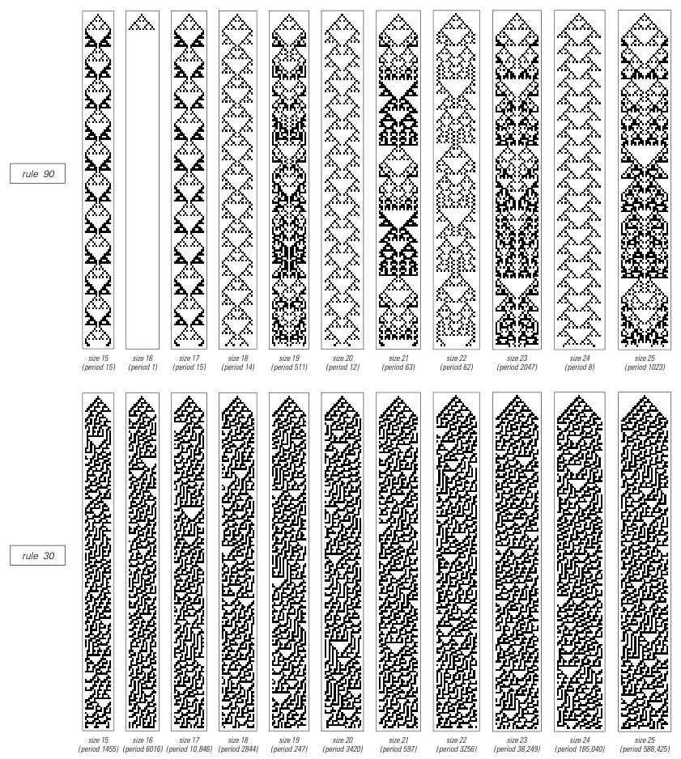
<!-- ORIGINAL_FIGURES page=0275 end -->

图注：具有有限数量元胞的元胞自动机行为。每种情形中，最右元胞的右邻居被看作最左元胞，反之亦然。产生的图案最终总会重复，但重复周期可以随系统大小迅速增加。

---

[[PDF page 276]]

<!-- ORIGINAL_FIGURES page=0276 start -->
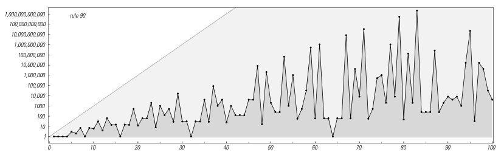
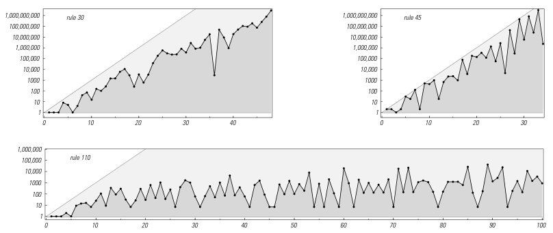
<!-- ORIGINAL_FIGURES page=0276 end -->

图注：各种元胞自动机的重复周期随大小变化的情况。每种情形使用的初始条件都由单个黑色元胞组成，如上一页图中一样。灰色虚线表示最大可能重复周期 `2^n`。规则 90 的最大重复周期为 `2^((n - 1)/2) - 1`。对规则 30，峰值重复周期量级为 `2^(0.63 n)`；对规则 45，它们接近 `2^n`（例如 `n = 29` 时，周期为 463,347,935，是最大可能值的 86%）。对规则 110，峰值似乎大致像 `n^3` 增长。

在随机初始条件下的第 2 类系统中，也会发生类似事情：由于系统的不同部分彼此不通信，它们全都像有限大小的独立图案那样行为。事实上，在大多数第 2 类元胞自动机中，这些图案实际上只有几个元胞宽，因此它们的重复周期必然相当短。

---

[[PDF page 277]]

<!-- ORIGINAL_FIGURES page=0277 start -->
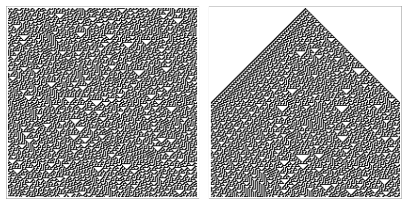
<!-- ORIGINAL_FIGURES page=0277 end -->

## 第 3 类系统中的随机性

观察第 3 类系统时，其行为最明显的特征是表观随机性。但这种随机性最终来自哪里？它是否也许全都只是初始条件中插入的随机性的反映？

初始条件中存在随机性，再加上对初始条件的敏感依赖，确实意味着任何第 3 类系统的行为中至少会有某种程度的随机性。事实上，当我最初看到第 3 类元胞自动机时，我以为这就是它们随机性的基本来源。

但我过了一段时间才发现的关键点是，即使初始条件中没有随机性，也同样可以出现随机行为。事实上，在本书前面章节中，我们已经看到这一基本现象的许多例子。

下面的图现在比较第 27 页规则 30 元胞自动机在两种情形下会发生什么：一种从随机初始条件开始，另一种从只包含单个黑色元胞的初始条件开始。

图注：规则 30 元胞自动机从随机初始条件和从只涉及单个黑色元胞的简单初始条件开始时产生的图案比较。离开第二幅图的边缘之后，这些图案看起来惊人相似。

---

[[PDF page 278]]

<!-- ORIGINAL_FIGURES page=0278 start -->
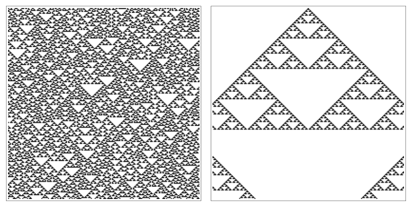
<!-- ORIGINAL_FIGURES page=0278 end -->

我们在两种情形中看到的行为很快变得几乎无法区分。第一幅图中，随机初始条件当然会影响得到的具体图案。但关键点在于，即使没有任何初始随机性，我们在第二幅图中看到的大部分内容仍然看起来像典型随机第 3 类行为。

那么，其他第 3 类元胞自动机又如何？这类系统即使在简单初始条件下也总会产生随机性吗？

下图显示一个例子，其中当初始条件随机时得到随机第 3 类行为，但如果从单个黑色元胞开始，产生的图案只是一个简单嵌套形式。

图注：规则 22 元胞自动机从随机初始条件和从包含单个黑色元胞的初始条件开始所产生的图案。使用随机初始条件时，可以看到典型第 3 类行为。但使用右侧所示特定初始条件时，则产生简单嵌套图案。

尽管如此，对页图显示，如果使用稍微不同但仍然简单的初始条件，那么在这个特定元胞自动机的行为中仍能看到随机性。

---

[[PDF page 279]]

<!-- ORIGINAL_FIGURES page=0279 start -->
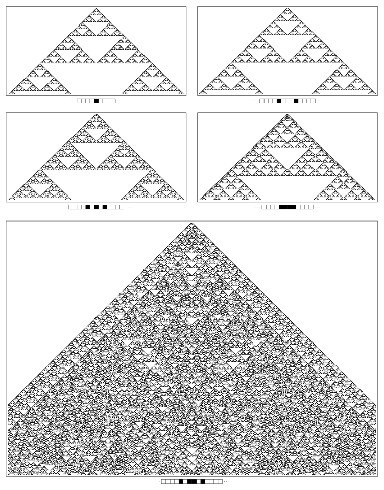
<!-- ORIGINAL_FIGURES page=0279 end -->

图注：规则 22 使用各种不同简单初始条件的情形。上方四种情形中，产生的图案最终具有简单嵌套形式。但在底部情形中，图案在许多方面是随机的，很像规则 30。

---

[[PDF page 280]]

<!-- ORIGINAL_FIGURES page=0280 start -->
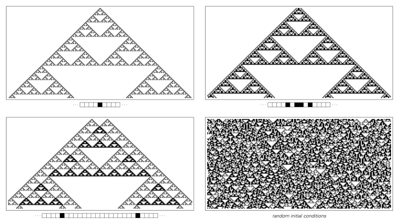
<!-- ORIGINAL_FIGURES page=0280 end -->

不过，也有少数元胞自动机，在随机初始条件下得到第 3 类行为，但在简单初始条件下永远不会产生显著随机性。

下面图中显示一个例子。在这种情形中，结果表明，所有图案实际上都只是从单个黑色元胞开始得到的基本嵌套图案的简单叠加。

图注：规则 90 在各种初始条件下生成的图案。这个特定元胞自动机规则具有加性这一特殊性质，它意味着在任何初始条件下，它产生的图案都可以作为上方第一幅图的简单叠加得到。因此，任何只在有限区域内包含黑色元胞的初始条件，最终都会导致具有简单嵌套形式的图案。所以不同于规则 30 或规则 22，规则 90 无法从简单初始条件内在地产生随机性。这里最后一幅图中的随机性纯粹是其初始条件中随机性的后果。注意，上方图显示的演化步数只有上一页对应规则 22 图的一半。

结果是，当初始条件只涉及有限区域的黑色元胞时，产生的整体图案总是最终具有简单嵌套形式。事实上，在每个新的白色三角形从中心开始的步骤上，整个图案都只由初始条件中黑色元胞区域的两个副本组成。

因此，得到随机图案的唯一方式，是在初始条件中有无限多个随机放置的黑色元胞。

---

[[PDF page 281]]

<!-- ORIGINAL_FIGURES page=0281 start -->
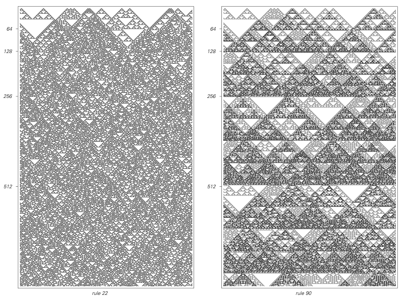
<!-- ORIGINAL_FIGURES page=0281 end -->

确实，当使用随机初始条件时，规则 90 会设法产生第 3 类中预期的那种随机行为。

但如果初始条件偏离完美随机性，那么这种偏离几乎必然会在系统演化中显示出来。因此，例如，如果黑色元胞的初始密度较低，那么在后面多个步骤上又会出现相应较低密度，如下面第二幅图所示。

另一方面，在规则 22 中没有这种效应；相反，只经过几步后，初始黑色元胞低密度的可见痕迹就不再保留。

图注：从黑色元胞密度较低的随机初始条件开始的演化例子。在规则 22 中，较低初始密度没有长期影响。但在规则 90 中，其影响会永远持续。造成这种差异的原因是，规则 22 中我们看到的随机性由系统演化内在生成，而规则 90 中的随机性来自初始条件中的随机性。

---

[[PDF page 282]]

<!-- ORIGINAL_FIGURES page=0282 start -->
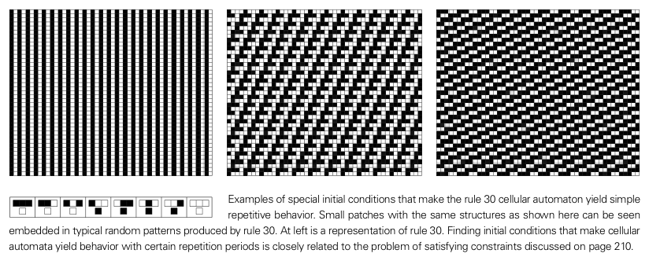
<!-- ORIGINAL_FIGURES page=0282 end -->

几节前我们看到，所有第 3 类系统都具有这样的性质：它们产生的具体图案对初始条件的具体改变高度敏感。但尽管在细节层面有这种敏感性，关键点在于，规则 22 或规则 30 这类系统产生的图案，其整体性质几乎不依赖给定初始条件的形式。

通过内在生成随机性，这类系统在某种意义上具有某种根本稳定性：无论怎样改变其初始条件，它们仍然给出相同的整体随机行为，并具有相同的大尺度性质。正如我们将在接下来几章看到的，自然中事实上有许多系统，其表观稳定性最终正是这类现象的后果。

## 特殊初始条件

我们已经看到，规则 30 这类元胞自动机无论从随机初始条件还是简单初始条件开始，都会生成看似随机的行为。因此人们可能会问，是否事实上存在任何初始条件能让规则 30 以简单方式行为。

作为一个相当平凡的例子，人们当然知道，如果其初始状态是均匀白色，那么规则 30 会永远只给出均匀白色。但如下图所示，也可以找到不那么平凡、却仍然使规则 30 以简单方式行为的初始条件。

图注：使规则 30 元胞自动机产生简单重复行为的特殊初始条件例子。在规则 30 产生的典型随机图案中，可以看到嵌入其中、具有这里所示相同结构的小片区域。左侧是规则 30 的表示。寻找使元胞自动机产生具有某些重复周期行为的初始条件，与第 210 页讨论的满足约束问题密切相关。

---

[[PDF page 283]]

<!-- ORIGINAL_FIGURES page=0283 start -->
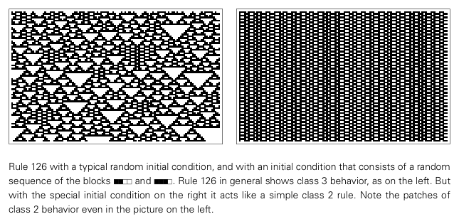
<!-- ORIGINAL_FIGURES page=0283 end -->

事实上，结果表明，在任何元胞自动机中，只由某个固定元胞块无限重复组成的初始条件，必然会导致简单重复行为。

其原因是，每个元胞块实际上独立地像一个有限大小系统那样行为。任何特定元胞块中最右元胞的右邻居，是下一个元胞块中的最左元胞；但由于所有元胞块都相同，这个元胞总是具有与该块本身最左元胞相同的颜色。结果，这个元胞块演化起来就像第 255 页讨论的有限大小系统之一。因此，如果给定一个宽度为 `n` 个元胞的元胞块，得到的重复周期必然至多为 `2^n` 步。

但如果想要短重复周期，就会有一个问题：是否存在任何大小的元胞块可以产生它。下一页图显示，在规则 30 中要得到至多 10 步重复周期所需的元胞块。结果表明，没有任何大小的元胞块给出恰好 2 步的周期，但至少到 15 步为止，所有更大周期都可以找到对应元胞块。

但如果初始条件不只是由单个元胞块无限重复组成，又会怎样？结果表明，对规则 30 来说，没有任何其他类型的初始条件能够产生重复行为。

但对许多规则，包括相当多第 3 类规则，情形则不同。作为一个例子，下方右图显示了规则 126 的一种初始条件，它涉及两个不同元胞块，却仍然产生重复行为。

图注：规则 126 使用典型随机初始条件，以及使用由两种元胞块随机序列组成的初始条件。规则 126 一般显示第 3 类行为，如左图。但在右侧特殊初始条件下，它表现得像一条简单第 2 类规则。注意，左图中甚至也有第 2 类行为的小片区域。

---

[[PDF page 284]]

<!-- ORIGINAL_FIGURES page=0284 start -->
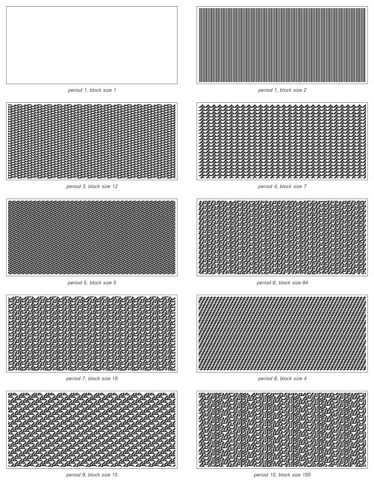
<!-- ORIGINAL_FIGURES page=0284 end -->

图注：按规则 30 演化时，在 10 步或更少步骤内重复的所有图案。每种情形中，初始条件由一个固定元胞块一遍又一遍重复组成。注意，没有任何初始条件能产生恰好 2 步的重复周期。要得到周期 11，需要一个包含 275 个元胞的元胞块。

---

[[PDF page 285]]

<!-- ORIGINAL_FIGURES page=0285 start -->
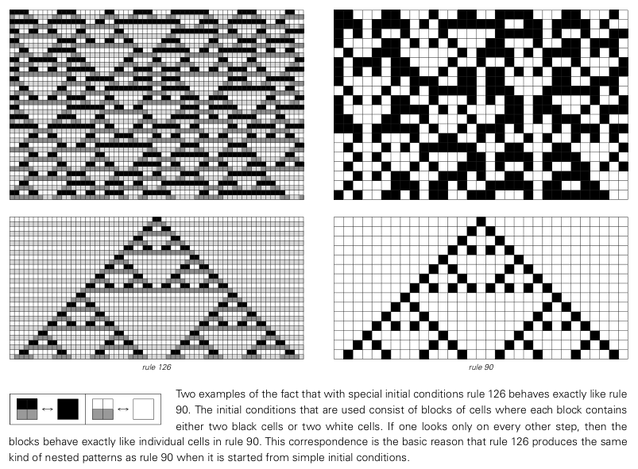
<!-- ORIGINAL_FIGURES page=0285 end -->

从某种意义上说，这里发生的是，尽管规则 126 通常显示第 3 类行为，人们仍然可以找到特殊初始条件，使它表现得像一条简单第 2 类规则。

事实上，某个元胞自动机的特殊初始条件能使它表现得完全像另一个元胞自动机，这种情况相当常见。

例如，如果从只包含由黑白元胞成对组成的元胞块的特殊初始条件开始，规则 126 就会表现得完全像规则 90。

下面的图显示这是怎样运作的：在交替步骤上，规则 126 中元胞块的排列与规则 90 中单个元胞的排列完全对应。这还解释了为什么规则 126 从简单初始条件开始时，会产生与规则 90 完全相同类型的嵌套图案。

图注：两个例子，说明在特殊初始条件下规则 126 的行为完全像规则 90。所用初始条件由若干元胞块组成，其中每个元胞块要么包含两个黑色元胞，要么包含两个白色元胞。如果只观察每隔一步的状态，那么这些元胞块的行为就完全像规则 90 中的单个元胞。这种对应是规则 126 从简单初始条件开始时产生与规则 90 相同类型嵌套图案的基本原因。

---

[[PDF page 286]]

<!-- ORIGINAL_FIGURES page=0286 start -->
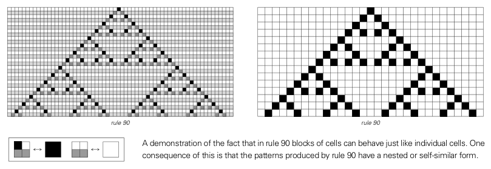
<!-- ORIGINAL_FIGURES page=0286 end -->

关键在于，这些初始条件实际上只包含这样的元胞块：对这些元胞块，规则 126 表现得像规则 90。结果，在这种情形中规则 126 产生的整体图案必然与规则 90 产生的图案完全相同。

那么，其他能够产生类似图案的元胞自动机又如何？在本书中，凡是得到类似规则 90 的嵌套图案的例子，结果表明，负责这些图案的底层规则都可以被设置为表现得完全像规则 90。有时这会发生在例如任何黑色元胞只位于有限区域中的初始条件下。但在其他情形中，如第 263 页规则 22 的例子，规则 90 行为只会在相当特定的初始条件下得到。

那么规则 90 本身又如何？它为什么会产生嵌套图案？

基本原因可以这样理解：正如其他规则可以在其初始条件只包含某些元胞块时模拟规则 90，规则 90 也能够以这种方式模拟自身。

下图显示这是怎样运作的。想法是，不把初始条件看作单个元胞的序列，而是看作一串元胞块，每个元胞块包含两个相邻元胞。对这些元胞块使用适当形式时，人们会发现，元胞块构型完全按照规则 90 演化。

图注：说明在规则 90 中，元胞块可以表现得像单个元胞。其一个后果是，规则 90 产生的图案具有嵌套或自相似形式。

---

[[PDF page 287]]

<!-- ORIGINAL_FIGURES page=0287 start -->
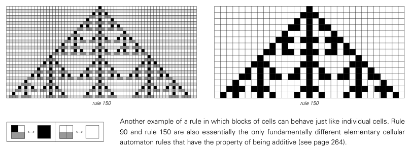
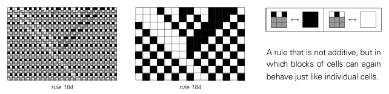
<!-- ORIGINAL_FIGURES page=0287 end -->

于是，单个元胞和整个元胞块都按照同一规则演化，这意味着无论按单个元胞观察，还是按元胞块观察，产生的任何图案都必须具有完全相同的结构。而这只能通过两种方式实现：要么图案本质上均匀，要么它必须具有嵌套结构，就像我们在规则 90 中看到的那样。

其他规则会怎样？结果表明，自模拟性质在元胞自动机规则中相当罕见。但另一个例子是规则 150，如下图所示。

图注：另一个规则例子，其中元胞块可以表现得像单个元胞。规则 90 和规则 150 也本质上是唯一两个具有加性性质的根本不同初等元胞自动机规则（见第 264 页）。

那么规则 90 和规则 150 还有什么共同点？结果表明，它们都是加性规则，这意味着它们产生的图案可以按照第 264 页讨论的方式叠加。事实上可以证明，任何加性规则都能模拟自身，因此会产生嵌套图案。但加性规则相当少；事实上，对两种颜色和最近邻而言，唯一根本不同的加性规则正是规则 90 和 150。

不过，归根到底，加性规则并不是唯一能够模拟自身的规则。另一种例子是规则 184，其中三个元胞组成的元胞块可以像单个元胞那样行动，如下所示。

图注：一条非加性规则，但其中元胞块仍然可以表现得像单个元胞。

---

[[PDF page 288]]

<!-- ORIGINAL_FIGURES page=0288 start -->
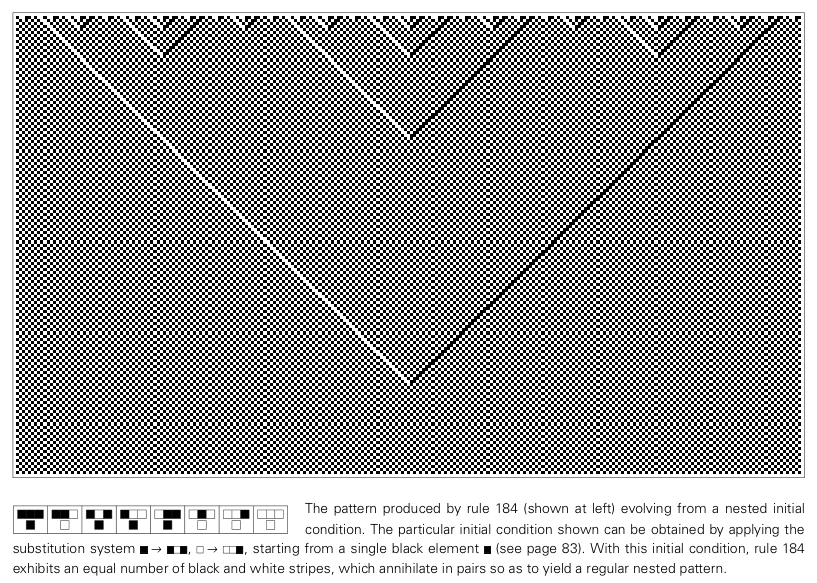
<!-- ORIGINAL_FIGURES page=0288 end -->

使用迄今为止我们所用那类简单初始条件时，这条规则总会产生本质上平凡的行为。但观察该规则性质的一种方式，是使用嵌套初始条件，例如从第 82 页讨论的那类替换系统获得。

对大多数规则，包括规则 90 和 150，这类嵌套初始条件通常会给出最终无法与典型随机初始条件所得结果区分的结果。但对规则 184，适当选择嵌套初始条件会产生下方所示的高度规则图案。

图注：规则 184（左侧所示）从一个嵌套初始条件演化产生的图案。所示特定初始条件可以通过应用替换系统，从单个黑色元素开始获得（见第 83 页）。在该初始条件下，规则 184 表现出数量相等的黑色和白色条纹，它们成对湮灭，从而产生规则嵌套图案。

---

[[PDF page 289]]

<!-- ORIGINAL_FIGURES page=0289 start -->
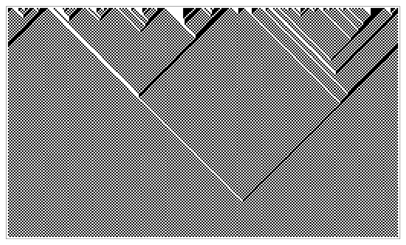
<!-- ORIGINAL_FIGURES page=0289 end -->

这个图案中看到的嵌套结构，可以看作规则 184 能够模拟自身这一事实的后果。下图显示，与任何加性规则不同，规则 184 即使在所用初始条件随机时，仍然会产生可辨认的嵌套图案。

图注：规则 184 从随机初始条件演化。仍然可以看到与上一幅图中类似的嵌套结构。当初始条件中黑色和白色元胞数量相等时，这类结构最明显，但它并不依赖这些元胞排列的任何规则性。

正如第 338 页将看到的，当初始条件中黑白元胞数量相等时，这类图案的存在尤其清楚；但这些元胞怎样排列通常并不重要。一般而言，可以找到相当多元胞自动机，即使从随机初始条件开始，也会产生类似规则 184 的嵌套图案。下一页图显示一个特别醒目的例子，其中形成了明确区域，区域中包含与规则 90 具有相同整体结构的图案。

---

[[PDF page 290]]

<!-- ORIGINAL_FIGURES page=0290 start -->
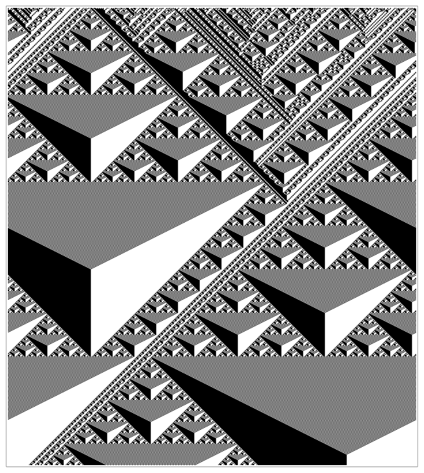
<!-- ORIGINAL_FIGURES page=0290 end -->

图注：另一个元胞自动机例子，即使从随机初始条件开始，也会产生嵌套图案。所示特定规则既涉及次近邻也涉及最近邻，规则编号为 4067213884。与规则 184 一样，当初始条件中黑色和白色元胞密度相等时，这里看到的嵌套行为最明显。

---

[[PDF page 291]]

<!-- ORIGINAL_FIGURES page=0291 start -->
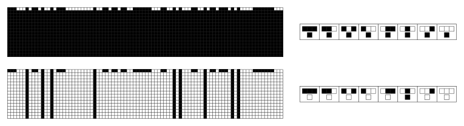
<!-- ORIGINAL_FIGURES page=0291 end -->

## 吸引子的观念

本章中，我们已经看到许多图案例子，它们可以通过从随机初始条件开始，然后让元胞自动机演化许多步而产生。

但每一步出现的黑白元胞的单个构型，又能说些什么？在随机初始条件中，绝对任何黑白元胞序列都可以存在。但大多数元胞自动机的一个特征是，在随后的步骤中，可以产生的序列会逐渐变得更受限制。

下面第一幅图显示一个第 1 类元胞自动机的极端例子，其中只经过一步，能够出现的唯一序列就是只包含黑色元胞的序列。

图注：简单元胞自动机例子，它们只经过一步就演化到吸引子，在这些吸引子中只有某些黑白元胞序列能够出现。第一种情形中，能够出现的是只涉及黑色元胞的序列。第二种情形中，能够出现的是每个黑色元胞都被白色元胞围住的序列。所示规则编号为 255 和 4。

所得构型可以看作该元胞自动机演化的所谓吸引子。无论从什么初始条件开始，最终总会到达同一个全黑吸引子。情形有点类似于物理摆这类机械系统中发生的事情。可以让摆从任意构型开始摆动，但它总会倾向于演化到竖直下垂的构型。

上方第二幅图显示一个第 2 类元胞自动机，它同样只经过一步就演化到吸引子。但现在吸引子并不只由单个构型组成，而是由所有黑色元胞只在其两侧至少各有一个白色元胞围住时才出现的构型组成。

---

[[PDF page 292]]

<!-- ORIGINAL_FIGURES page=0292 start -->
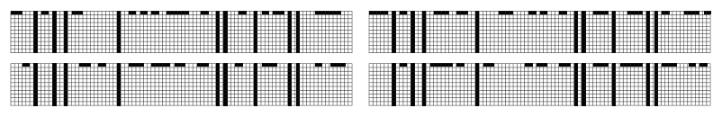
<!-- ORIGINAL_FIGURES page=0292 end -->

下图显示，对这类任何特定构型而言，一般会有许多不同初始条件能够导向它。在机械类比中，每个可能最终构型都像一个盆地中的最低点；而从该盆地中任意位置开始的小球，都会滚向那个最低点。

图注：四种不同初始条件，它们都导向上一页所示规则 4 元胞自动机中的同一最终状态。这个最终状态可以看作元胞自动机演化的可能吸引子之一；所示初始条件则代表该吸引子的吸引盆中的不同元素。

对一维元胞自动机来说，结果表明有一种相当紧凑的方式，可以概括其演化中任意给定步骤上可能出现的所有黑白元胞序列。

基本想法是构造一个网络，使每个这样的黑白元胞序列对应于一条可能路径。

在对页顶部图中，每种情形中的第一个网络表示随机初始条件，其中任何可能黑白元胞序列都可以出现。从中间节点开始，人们可以以任意次序绕网络左环或右环走任意次数，表示黑色和白色元胞可以以任意次序出现任意次数。

然而，在对页规则 255 例子的第 2 步，网络只有一个环，表示这一步中该规则唯一可能出现的序列是纯粹由黑色元胞组成的序列，正如上一页所见。

规则 4 的情形稍微复杂：在第 2 步，现在可能出现的序列由一个有两个节点的网络表示。从右侧节点开始，人们可以任意多次绕右侧环走，对应于任意数量白色元胞的序列。在任意点上，人们可以沿箭头向左得到一个黑色元胞，但网络形式意味着这个黑色元胞后面总必须至少跟着一个白色元胞。

---

[[PDF page 293]]

<!-- ORIGINAL_FIGURES page=0293 start -->
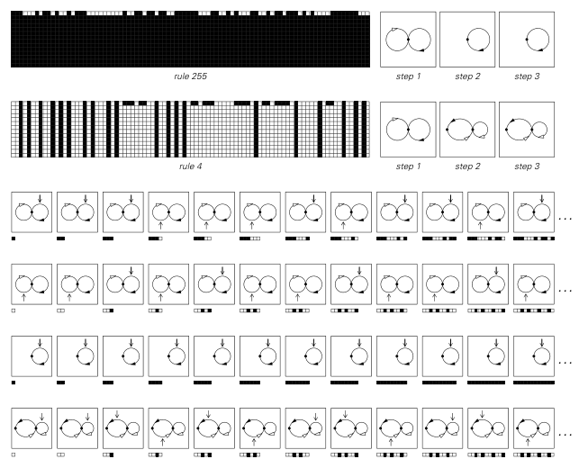
<!-- ORIGINAL_FIGURES page=0293 end -->

图注：表示两个左侧所示元胞自动机演化中连续步骤上可能出现的黑白元胞序列的网络。在每种情形中，可能序列对应于穿过网络的可能路径。两条规则在第 1 步都从随机初始条件开始，其中所有黑白元胞序列都允许出现。在后续步骤中，规则 255 只允许包含黑色元胞的序列，而规则 4 允许包含黑色和白色元胞的序列，但要求每个黑色元胞都被白色元胞围住。

下一页图显示更多第 1 类和第 2 类元胞自动机例子。与上图不同，这些规则不会一步到达最终状态，而是逐渐向这些状态演化。在这种演化过程中，能够出现的序列集合逐渐变小。

例如在规则 128 中，黑色区域每一步在两侧各缩小一个元胞，这意味着经过 `t` 步后存在的任何黑色区域，其两侧都必须至少有 `t` 个白色元胞。

下一页所示网络捕捉所有这类效应。为做到这一点，我们看到它们在连续步骤中变得稍微更复杂。但至少对这些第 1 类和第 2 类例子而言，网络的进程总是继续具有相当简单的形式。

---

[[PDF page 294]]

<!-- ORIGINAL_FIGURES page=0294 start -->
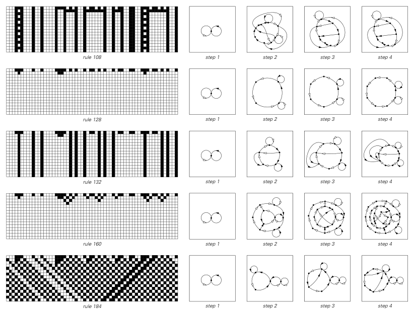
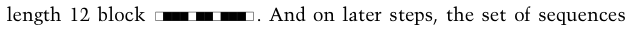
<!-- ORIGINAL_FIGURES page=0294 end -->

图注：表示若干第 1 类和第 2 类元胞自动机演化中连续步骤上可能出现的黑白元胞序列的网络。经过 `t` 步后，这些网络节点数从不会超过约 `t^2`。

那么，第 3 类和第 4 类系统中会发生什么？对页图显示两个例子。在规则 126 中，第 2 步的唯一效果是黑色元胞不再能单独出现：它们必须总是成组出现，数量为两个或更多。到第 3 步，如果只观察元胞自动机演化的显式图像，就很难看出任何变化。但从网络中可以发现，现在有无限多个其他元胞块被禁止，开头是长度为 12 的某个元胞块。在后续步骤中，允许出现的序列集合会迅速变得更复杂，这反映为对应网络复杂性的迅速增加。

---

[[PDF page 295]]

<!-- ORIGINAL_FIGURES page=0295 start -->
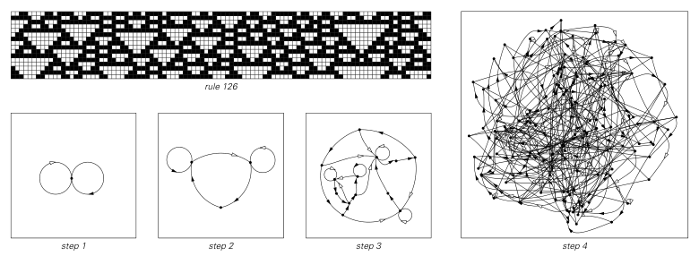
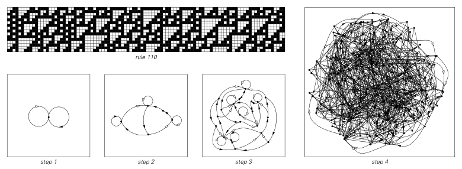
<!-- ORIGINAL_FIGURES page=0295 end -->

图注：表示典型第 3 类和第 4 类元胞自动机演化中连续步骤上可能出现的黑白元胞序列的网络。这些网络的节点数量似乎至少以指数速度增长。

事实上，这类网络复杂性的迅速增长，是大多数第 3 类和第 4 类规则的一般特征。但结果表明，有少数规则起初似乎是例外。

下一页顶部图显示四条不同规则，它们都具有这样的性质：如果从所有可能元胞序列都允许出现的初始条件开始，那么在演化的任何后续步骤中，这些同样的序列全都仍然可以出现。

所示前两条规则表现出非常简单的第 2 类行为。但后两条显示典型第 3 类行为。

不过，正在发生的事情是，从某种意义上说，允许所有可能序列的特定初始条件，对这些规则而言是特殊的。

---

[[PDF page 296]]

<!-- ORIGINAL_FIGURES page=0296 start -->
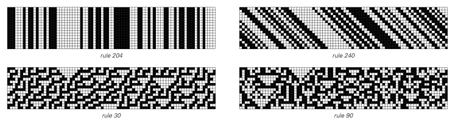
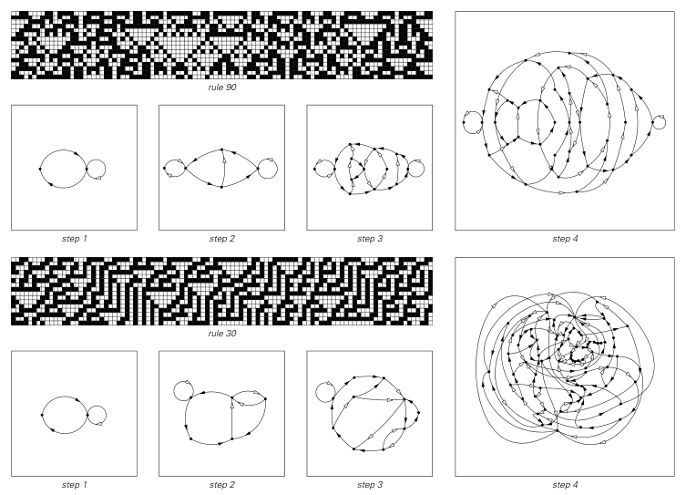
<!-- ORIGINAL_FIGURES page=0296 end -->

图注：在演化的任意步骤上，仍然允许所有可能黑白元胞序列的元胞自动机例子。这类元胞自动机实际上定义了所谓满射映射。

事实上，如果从几乎任何其他初始条件开始，例如从不允许任意一对黑色元胞相邻出现的初始条件开始，那么如下图所示，允许序列集合的复杂性又会迅速增加。

图注：表示页面顶部元胞自动机演化中可能出现序列的网络，但初始条件为黑色元胞只允许成对出现。

---

[[PDF page 297]]

## 第 4 类系统中的结构

下一页显示三个典型第 4 类元胞自动机例子。每种情形中使用的初始条件都是完全随机的。但只经过几步之后，系统就会组织到确定结构变得可见的程度。

这些结构中的大多数最终都会消亡，有时消亡方式相当复杂。但任何第 4 类系统的一个关键特征是，其中总必须有某些可以永远持续存在的结构。

那么，对某个特定元胞自动机来说，怎样找出这些结构是什么？一种方法是依次尝试每个可能初始条件，看看它是否会导致一种新的持久结构。以下一页顶部的代码 20 元胞自动机为例，再下一页显示该系统在前几百个可能初始条件下会发生什么。

大多数情形中，一切只是消亡。但当我们到达初始条件编号 151 时，终于看到一个持续存在的结构。

这个特定结构相当简单：它只保持在固定位置，并每两步重复。但并非所有持久结构都这么简单。事实上，在初始条件 187 处，我们看到一个复杂得多的结构，它不是静止不动，而是系统地向右移动，并且每 9 步才重复其基本形式。

移动结构的存在是第 4 类系统的基本特征。因为正如第 252 页讨论的，正是这类结构使信息可以从第 4 类系统的一部分传达到另一部分，并最终允许第 4 类特有的复杂行为发生。

不过，现在已经看到初始条件 187 得到的结构，我们也许会假设，代码 20 元胞自动机中后续出现的所有结构都必定至少同样复杂。然而结果表明，初始条件 189 突然产生一个简单得多的结构，它每一步都只在同一位置保持不变。

但继续到初始条件 195，我们又发现一个更复杂的结构，这一次它每 22 步才重复。

---

[[PDF page 298]]

<!-- ORIGINAL_FIGURES page=0298 start -->
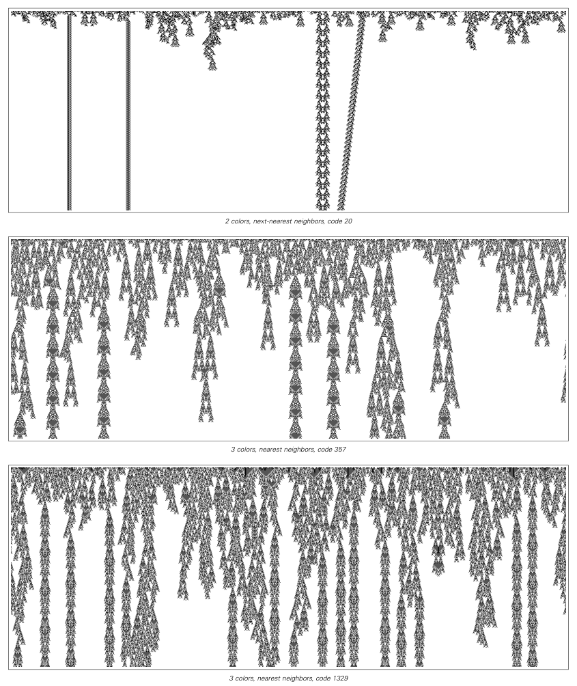
<!-- ORIGINAL_FIGURES page=0298 end -->

图注：三个典型第 4 类元胞自动机例子。每种情形中都可以看到各种持久结构。

---

[[PDF page 299]]

<!-- ORIGINAL_FIGURES page=0299 start -->
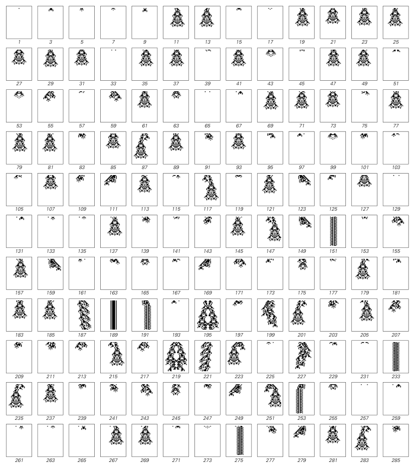
<!-- ORIGINAL_FIGURES page=0299 end -->

图注：对页顶部代码 20 元胞自动机，在所有黑色元胞位于小于九个元胞大小区域中的初始条件下的行为。大多数情形中，产生的图案只是消亡。但在某些初始条件下，会形成持久结构。每个初始条件都被赋予一个编号，其二进制数字位序列给出该初始条件中的黑白元胞构型。注意，初始条件 195 和 219 都产生下一页所示的周期 22 持久结构。

---

[[PDF page 300]]

<!-- ORIGINAL_FIGURES page=0300 start -->
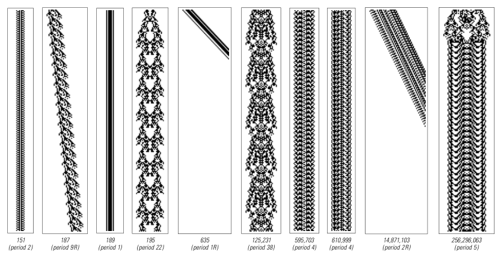
<!-- ORIGINAL_FIGURES page=0300 end -->

那么，代码 20 元胞自动机最终支持怎样的一组结构？似乎没有容易办法判断，但下图显示了我通过显式观察前 250 亿个可能初始条件的演化所找到的所有结构。

图注：通过测试代码 20 元胞自动机的前 250 亿个可能初始条件而发现的持久结构，该元胞自动机显示在上一页。注意，所示结构的反射版本也同样可能出现。给出的数字的二进制数字位序列对应于每种情形中的初始条件，如上一页一样。

还有其他结构可能存在吗？上图中最大的结构从一个宽 30 个元胞的元胞块开始。在宽度介于 30 和 34 个元胞之间的超过一百亿个元胞块中，没有出现任何新结构。但事实上，其他结构确实可能存在。判断这一点的方法是：对较小重复周期，有一个系统过程可以让人找到具有给定周期的绝对所有结构。

对页图显示使用这个过程直到重复周期 15 所得结果。到重复周期 10 为止，除 7 以外，每个周期最终都至少存在一个固定或移动结构。不过，给定周期的最小结构常常相当大；例如在周期 6 的情形中，最小可能结构宽 64 个元胞。

---

[[PDF page 301]]

<!-- ORIGINAL_FIGURES page=0301 start -->
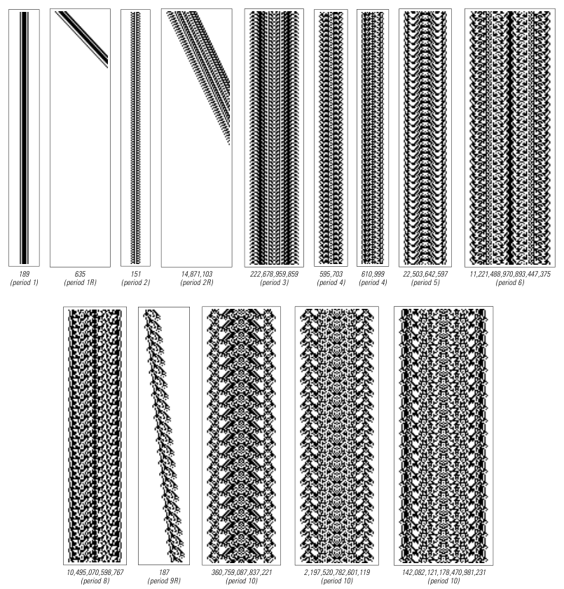
<!-- ORIGINAL_FIGURES page=0301 end -->

图注：代码 20 元胞自动机中重复周期至多 15 步的所有持久结构。所示结构是用类似于第 268 页寻找所有满足约束的序列的方法系统地找到的。

那么，其他第 4 类元胞自动机，例如本节开头展示的那些，是否也最终具有复杂的可能持久结构集合？

---

[[PDF page 302]]

<!-- ORIGINAL_FIGURES page=0302 start -->
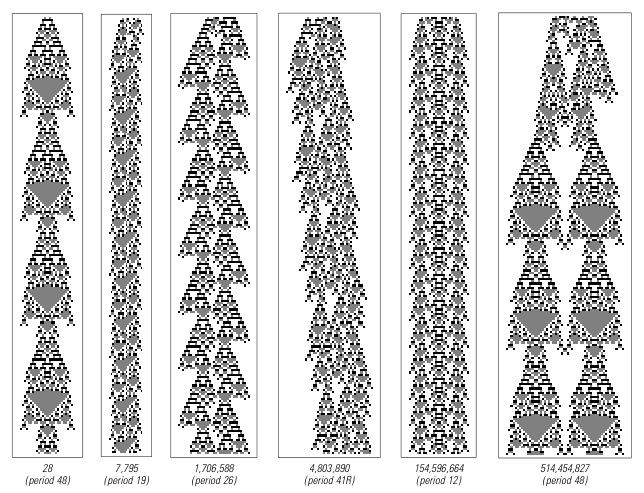
<!-- ORIGINAL_FIGURES page=0302 end -->

下图显示，通过显式测试第 282 页代码 357 元胞自动机的前 20 亿个可能初始条件而找到的结构。

图注：第 282 页代码 357 元胞自动机中的持久结构，通过测试前 20 亿个可能初始条件得到。这个元胞自动机允许每个元胞有三种可能颜色；因此初始条件对应于所给数字的三进制数字位。这个元胞自动机中不存在任何大小、重复周期小于 5 步的持久结构。

已经在初始条件编号 28 处，就可以看到一个相当复杂、重复周期为 48 的结构。但在最初一百万个初始条件中，只产生另外一个结构，而这个结构同样不会移动。

那么，在代码 357 元胞自动机中，移动结构事实上是否可能？我对许多不同规则的经验是，只要出现足够复杂的持久结构，最终就可以找到会移动的结构。事实上在代码 357 中，初始条件 4,803,890 就产生了这样的结构。

---

[[PDF page 303]]

<!-- ORIGINAL_FIGURES page=0303 start -->
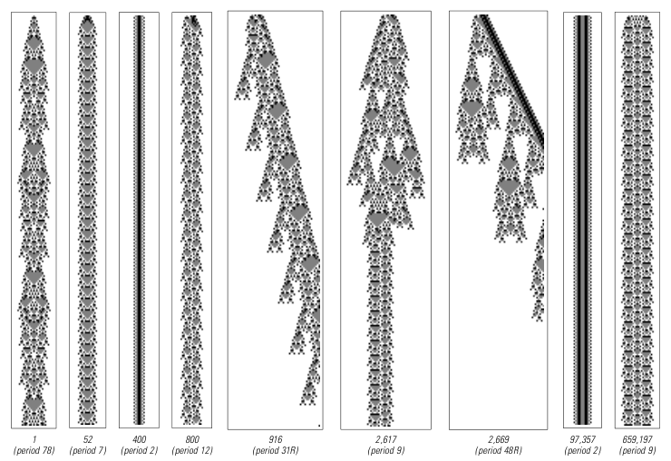
<!-- ORIGINAL_FIGURES page=0303 end -->

如果移动结构在第 4 类系统中不可避免，那么如果观察足够多的大初始条件，还可能看到哪些根本不同类型的结构？

下图显示第 282 页底部代码 1329 元胞自动机中最早找到的几个持久结构。最小结构是静止的，但在初始条件 916 处，会找到一个移动结构，这与刚刚讨论的另外两个第 4 类元胞自动机非常相似。

图注：第 282 页所示代码 1329 元胞自动机中的持久结构。

但当到达初始条件 54,889 时，人们突然看到下一页所示的相当不同类型结构。这个结构的右侧部分只是以 256 步为周期重复，但随着这一部分移动，它会在身后留下一串其他持久结构。其结果是，整个结构永远持续增长，逐渐添加越来越多元胞。

---

[[PDF page 304]]

<!-- ORIGINAL_FIGURES page=0304 start -->
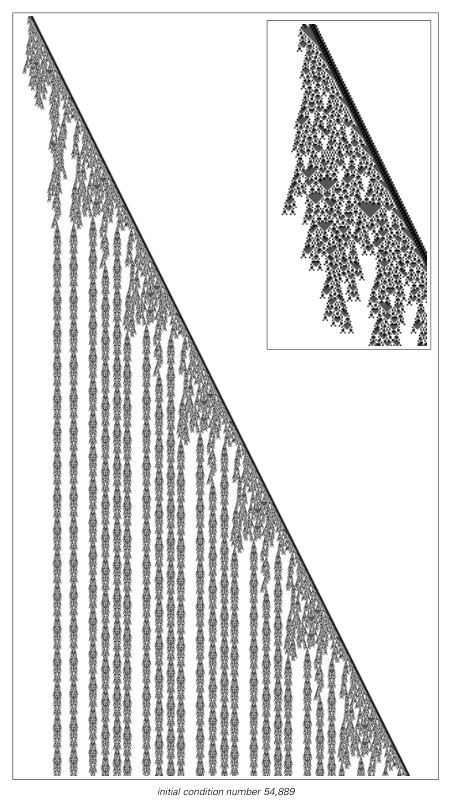
<!-- ORIGINAL_FIGURES page=0304 end -->

图注：代码 1329 中的无界增长。初始条件包含一个 10 个元胞的元胞块。图案右侧每 256 步重复一次，并且随着它移动，会在身后留下一串无限持久结构。初始条件编号为 54,889。

不过，观察上图，人们也许会假定，当无限增长发生时，产生的图案必然相当复杂。但代码 1329 再次给出一个意外。因为对页显示，当到达初始条件 97,439 时，又会有无限增长，但现在产生的图案非常简单。事实上，如果人们只看到这个图案，很可能会假设它来自一条典型行为远比代码 1329 简单的规则。

---

[[PDF page 305]]

<!-- ORIGINAL_FIGURES page=0305 start -->
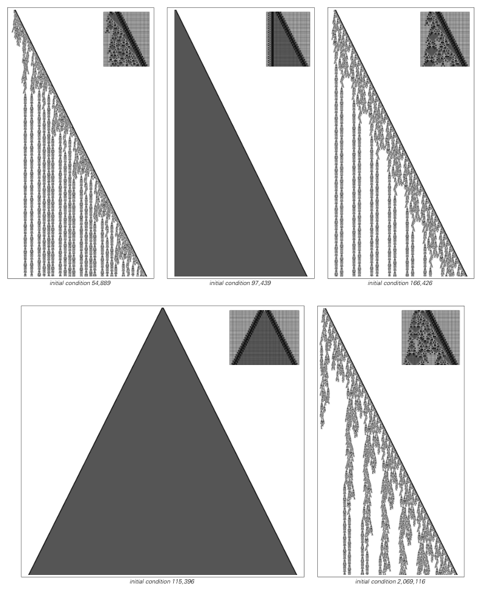
<!-- ORIGINAL_FIGURES page=0305 end -->

图注：代码 1329 中无界增长的更多例子。产生的大多数图案是复杂的，但有些是简单的。

---

[[PDF page 306]]

<!-- ORIGINAL_FIGURES page=0306 start -->
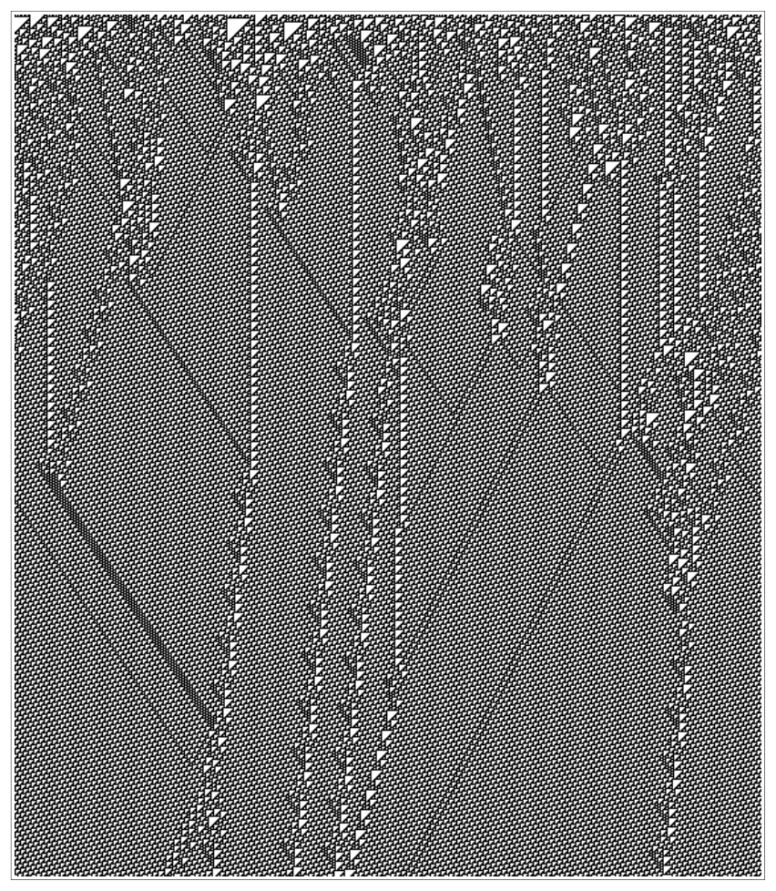
<!-- ORIGINAL_FIGURES page=0306 end -->

图注：规则 110 元胞自动机在随机初始条件下的典型行为例子。背景图案由每 7 步重复一次的 14 个元胞块组成。

---

[[PDF page 307]]

事实上，第 4 类元胞自动机的一个一般特征是，在适当初始条件下，它们能够模拟各种其他系统的行为。当我们在第 11 章讨论计算和普适性概念时，会看到这最终为何如此的根本原因。但现在的重点只是，第 4 类元胞自动机的行为可以多么多样和复杂，即使它们的底层规则非常简单。

也许最醒目的例子是我们最早在第 32 页看到的规则 110 元胞自动机。它的规则极其简单，只涉及最近邻和两种元胞颜色。但其整体行为与我们见过的任何系统一样复杂。

对页显示一个随机初始条件下的典型例子。与我们讨论过的其他第 4 类规则相比，一个立即可见的小差异是，规则 110 中的结构并不存在于空白背景上；相反，它们表现为某个规则重复图案中的扰动，该背景图案由每 7 步重复一次的 14 个元胞块组成。

下一页显示规则 110 中可以由小于 40 个元胞宽的元胞块生成的持久结构类型。就像其他第 4 类规则一样，有静止结构和移动结构，也有可以通过重复其中包含的元胞块而扩展的结构。

那么，规则 110 中是否也存在表现出无界增长的结构？它们当然并不容易找到。但如果观察宽度为 41 的元胞块，最终确实会出现这类结构，如第 293 页图所示。

那么，规则 110 中各种结构怎样相互作用？答案如第 294-296 页所示，可以非常复杂。

在某些情形中，一个结构本质上只是略带延迟地穿过另一个结构。但两个结构之间的碰撞常常会产生一整串新结构。有时碰撞结果经过几步后就很明显。但相当常见的是，必须经过大量步骤才能确定会发生什么。

因此，即使规则 110 这类第 4 类系统中的单个结构也许以相当重复的方式行为，这些结构之间的相互作用仍能导致极其巨大的复杂性。

---

[[PDF page 308]]

<!-- ORIGINAL_FIGURES page=0308 start -->
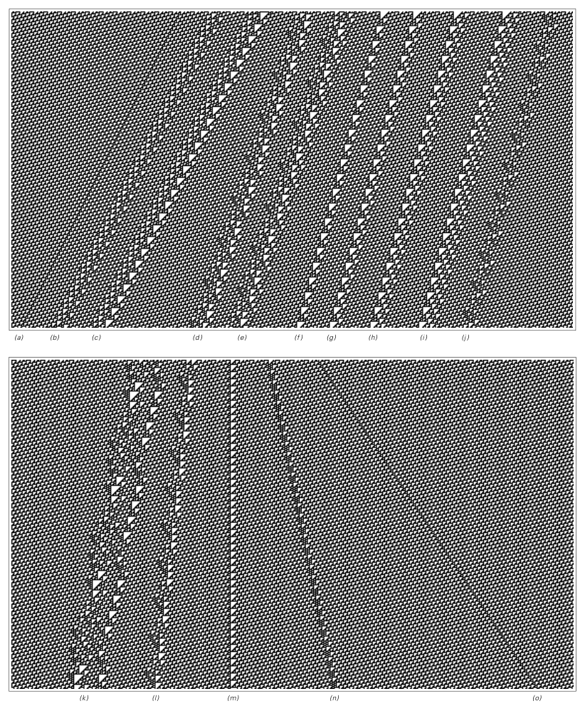
<!-- ORIGINAL_FIGURES page=0308 end -->

图注：规则 110 中发现的持久结构。除结构 (a) 和 (j) 之外，所有结构都存在扩展版本。结构 (m) 和 (n) 也存在相对于背景平移的替代形式。

---

[[PDF page 309]]

<!-- ORIGINAL_FIGURES page=0309 start -->
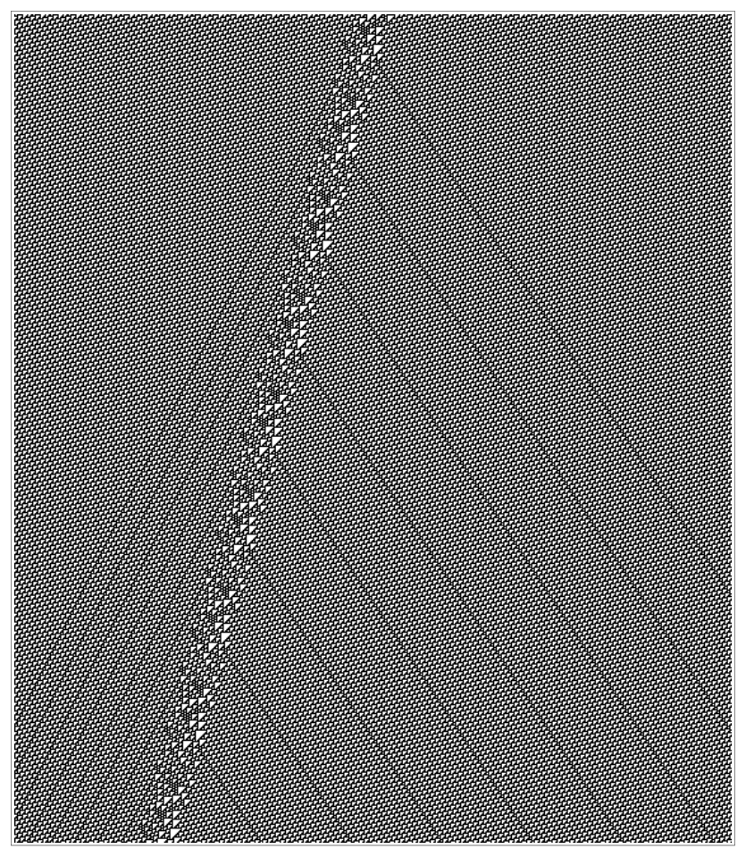
<!-- ORIGINAL_FIGURES page=0309 end -->

图注：规则 110 中无界增长的一个例子。初始条件由一个长度为 41 的元胞块插入背景元胞块之间组成。左右两侧每 77 步都会产生新结构；中心结构在每个周期中向左移动 20 个元胞，因此左侧结构相隔 37 步，右侧结构相隔 107 步。

---

[[PDF page 310]]

<!-- ORIGINAL_FIGURES page=0310 start -->
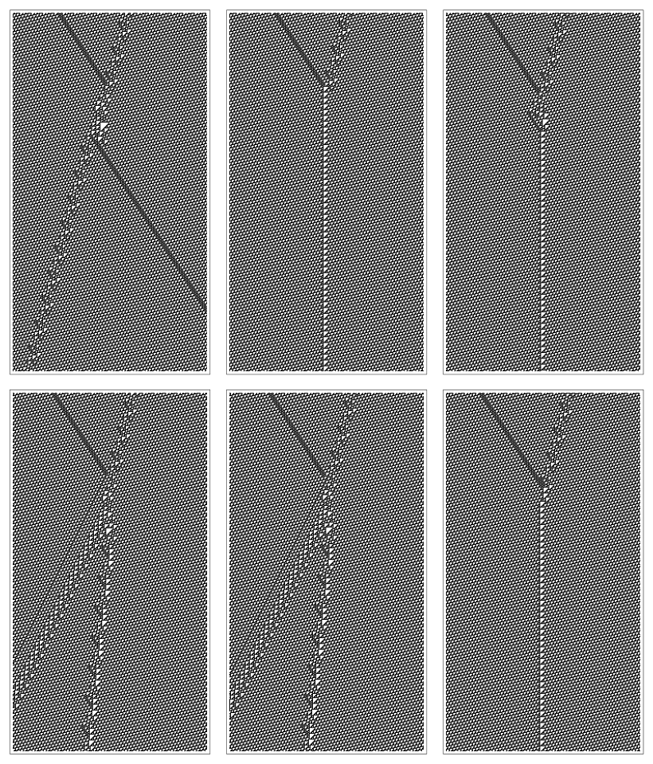
<!-- ORIGINAL_FIGURES page=0310 end -->

图注：第 292 页持久结构 (o) 和 (j) 之间的碰撞。（第一个结构实际上是一个扩展形式，包含第 292 页结构 (o) 的四个副本。）每幅连续图显示当原始结构逐渐相距更远时会发生什么。

---

[[PDF page 311]]

<!-- ORIGINAL_FIGURES page=0311 start -->
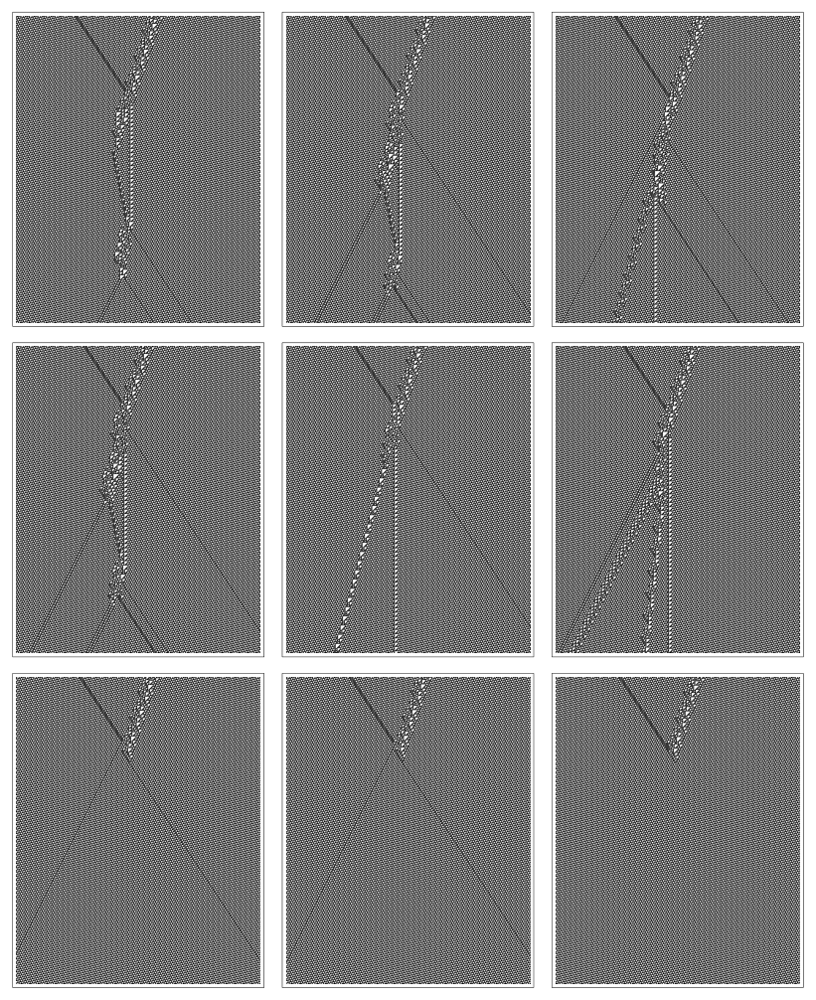
<!-- ORIGINAL_FIGURES page=0311 end -->

图注：第 292 页结构 (e) 和 (o) 之间的碰撞。

---

[[PDF page 312]]

<!-- ORIGINAL_FIGURES page=0312 start -->
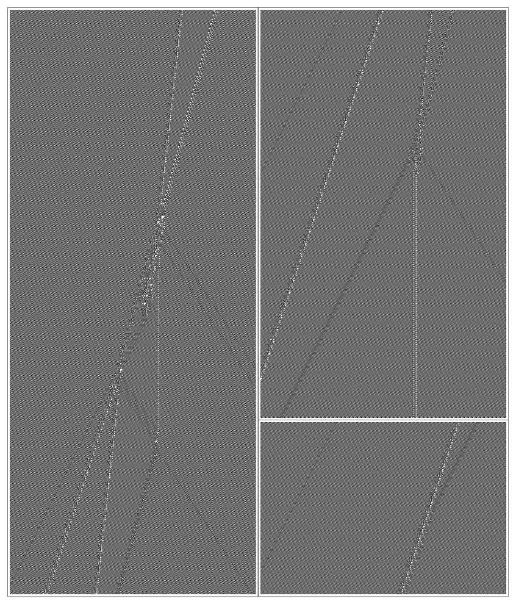
<!-- ORIGINAL_FIGURES page=0312 end -->

图注：第 292 页结构 (l) 和 (i) 之间的一次碰撞。最终涉及 8 个独立结构的结果，要经过超过 4000 步才变得清楚。图像高度对应 2000 步，第三幅图结束于第 4300 步。
