# 第 7 章：程序与自然中的机制

[[PDF page 313]]

<!-- ORIGINAL_FIGURES page=0313 start -->
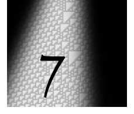
<!-- ORIGINAL_FIGURES page=0313 end -->

# 程序与自然中的机制

## 行为的普遍性

过去几章中，我的主要目的，是处理一个基本问题：简单程序怎样行为。本章中，我现在的目的，是把我们已经学到的东西拿来，开始应用于对自然中实际现象的研究。

一开始，人们也许会以为这永远行不通。因为人们可能会假设，任何基于简单规则的程序，总会导致过于简单的行为，以至于与我们在自然中看到的大多数东西无关。但本书的主要发现之一是，基于简单规则的程序并不总是产生简单行为。

事实上，在过去几章中，我们已经看到许多例子，其中极其简单的规则导致了高度复杂的行为。但简单程序得到的行为，在多大程度上类似于我们在自然中看到的行为？

对此获得一些认识的一种方式，就是直接观察自然系统的图像，并把它们与简单程序的图像作比较。

在细节层面，当然存在差异。但在整体层面，存在醒目的相似性。事实上，自然中的系统最终竟然如此经常表现出几乎与本书某处某个简单程序所见行为相同的行为，这一点相当惊人。

---

[[PDF page 314]]

那么，为什么会这样？我相信，这不是任何巧合，也不是感知上的把戏。相反，我怀疑它反映了简单程序与自然系统之间的深层对应。

观察自然中的系统时，一个醒目的事实是，即使不同系统具有相当不同的底层物理、生物或其他组件，它们的整体行为模式却常常显得惊人相似。

而在我对简单程序的研究中，我看到了本质上同样的现象：即使程序具有相当不同的底层规则，它们的整体行为也可以惊人相似。

这提示我们，可能出现的行为类型中存在某种普遍性，它独立于底层规则的细节。

关键点在于，我相信这种普遍性不仅横跨简单程序，也延伸到自然系统。因此，这意味着一个系统的组件是真实分子还是理想化黑白元胞，并不应有多大关系；所产生的整体行为应当显示同样的普遍特征。

如果真是这样，那么就意味着，研究简单程序的行为确实可以让我们洞察自然系统的行为。因为这提示我们，负责自然中所见现象的基本机制，在某种意义上与负责简单程序中所见现象的机制相同。

本章的目的，是讨论自然中最常见的一些现象，并研究它们怎样对应于简单程序中发生的现象。

我讨论的某些现象，至少在某种程度上已经被传统科学分析过。但我们会发现，通过按简单程序来思考，通常可以比以前清楚得多地看出正在起作用的基本机制。

更重要的是，我考虑的许多现象，特别是那些涉及显著复杂性的现象，在传统科学背景下从未得到令人满意的解释。但本章将发现，通过利用我关于简单程序的发现，其中大量现象现在第一次可以被成功解释。

---

[[PDF page 315]]

<!-- ORIGINAL_FIGURES page=0315 start -->
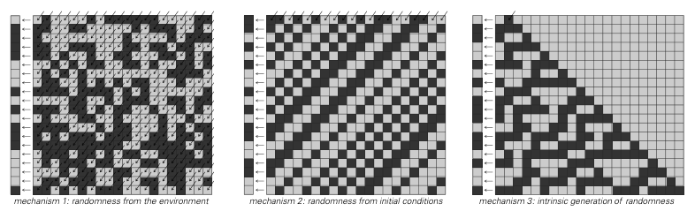
<!-- ORIGINAL_FIGURES page=0315 end -->

## 随机性的三种机制

自然中最常见的单一事物之一，是表观随机性。事实上，有非常多不同类型的系统都会表现出随机性。也许每种情形中随机性的原因都不同。但根据我对简单程序的研究，我得出的结论是，事实上可以识别出随机性的三种基本机制，如下图所示。

图注：可能负责随机性的三种机制。斜箭头表示外部输入。第一种情形中，每一步都有来自环境的随机输入。第二种情形中，随机输入只在初始条件中出现。第三种情形中，实际上完全没有随机输入。然而，尽管底层结构不同，这些机制中的每一种都会在左侧显示的列中导致随机性。第一种机制对应于由外部噪声产生的随机性，如所谓随机模型所捕捉的那样。第二种机制本质上是混沌理论所提示的机制。第三种机制是新的，由本书关于简单程序行为的结果提示。我将给出证据，说明第三种机制是自然中最常见的机制。

在第一种机制中，随机性被显式引入系统底层规则，因此每一步为每个元胞选择一个随机颜色。

这种机制是传统科学中最常考虑的机制。它本质上对应于假设存在一个随机的外部环境，该环境不断影响所观察的系统，并不断向其中注入随机性。

在上方所示第二种机制中，不存在这种与环境的相互作用。系统的初始条件随机选择，但随后系统的演化被假定遵循不包含随机性的确定规则。

---

[[PDF page 316]]

不过，这些规则的一个关键特征是，它们使系统以一种对初始条件细节敏感依赖的方式行为。在所示特定情形中，规则只是被设置为每一步把每个颜色向左移动一个位置。

这会使任何特定元胞所取的颜色序列，依赖于初始条件中越来越靠右的元胞颜色。因此，只要初始条件是随机的，任何特定元胞的颜色序列也会相应随机。

一般而言，规则可以比上一页例子中所示更复杂。但这种随机性机制的基本想法是，人们看到的随机性来自对初始条件中存在的随机性的某种转写。

刚才讨论的两种随机性机制有一个重要共同特征：它们都假定任何特定系统中看到的随机性，最终必定来自该系统之外。因此从某种意义上说，这两种机制都没有真正承担解释随机性起源的责任：它们最终都只是说，随机性来自人们碰巧观察的系统之外。

然而，多年以来，这种相当不令人满意的陈述一直是人们所能作出的最好说法。但本书关于简单程序的发现，终于允许取得新的进展。

关键点是，我们最早在第 27 页看到，简单程序即使完全没有被给定随机输入，也能产生表观随机行为。这意味着存在第三种可能的随机性机制，而这一次它并不以任何方式依赖所观察系统之外已经存在随机性。

如果我们只找到少数几个能够用这种方式生成随机性的程序例子，那么也许会认为第三种机制罕见而特殊。但事实上，过去几章已经看到，我们能够构造的几乎每一种简单程序都能够生成这种随机性。

---

[[PDF page 317]]

因此，合理的预期是，同样机制也应当出现在自然中的许多系统里。事实上，正如我将在本章及后续章节讨论的，我相信这种机制最终负责自然界中我们看到的一大部分，甚至实质上全部随机性。

但这并不是说另外两种机制在实践中永远无关。因为即使它们不能解释随机性在最低层面的产生方式，它们仍然可以用于描述特定系统中关于随机性的观察。

在接下来的几节中，我将讨论几类系统，其中所见随机性最适合分别由这里识别出的三种随机性机制来描述。

## 来自环境的随机性

按照上一节讨论的第一种随机性机制，任何特定系统的随机性被看作该系统与其环境中的随机性持续相互作用的结果。

作为日常例子，我们可以考虑一艘船在粗糙海面上上下颠簸。船本身并没有内在随机性。但关键在于，作为船的环境的、不断变化的海面中存在随机性。由于船的运动跟随这个海面，它也显得随机。

但这种表观随机性的真正起源是什么？从某种意义上说，这是因为海洋有无数细节很难知道，但这些细节仍能影响船的运动。例如，撞击船的一道特定波浪，可能是附近飑风、海底山脊，甚至前一天发生在几百英里之外的一场风暴的结果。但由于现实中无法追踪所有这些东西，海洋就必然在许多方面显得不可预测和随机。

观察更小尺度系统时，同样的基本效应可能更明显。经典例子是所谓布朗运动。

---

[[PDF page 318]]

在布朗运动中，人们取一个小颗粒，例如花粉颗粒，把它放入液体中，然后在显微镜下观察其运动。

人们发现这个颗粒会以表观随机方式跳动。正如 1820 年代最初注意到这一现象时就有人怀疑的，发生的事情是，液体中的分子不断撞击颗粒并使其运动。但即使在一小滴液体中，已经有数量巨大的分子。由于人们当然不知道在任何给定时刻所有这些分子到底在哪里，它们对颗粒运动影响的细节就必然显得相当随机。

不过，要观察随机布朗运动，需要显微镜。人们也许会想象，由任何类似分子过程产生的随机性也都会小到与日常生活无关。但事实上，这类随机性在许多电子设备的运行中非常明显。

举例来说，考虑一个调到错误频率或没有连接天线的无线电接收机。无线电接收机被构造成会放大它接收到的任何信号。但当没有信号可供放大时，会发生什么？

答案是接收机会产生噪声。结果表明，在大多数情形中，这种噪声不过是接收机内部发生的微观过程的高度放大版本。

在实践中，这类噪声通常被认为是麻烦；现代数字电子系统通常确实被设计成在每个阶段消除它。但至少从 1940 年代以来，人们已经构造了各种设备，专门利用电子噪声来生成随机性。

通常，这些设备的工作方式是让相当标准的电子元件在极端条件下运行；在这些条件下通常没有输出信号，但微观涨落可以引发击穿过程，从而产生大的输出信号。

一个大尺度例子是两块金属板之间夹着空气。通常不会有电流穿过这个空气间隙，但当两板之间电压足够大时，空气会击穿，火花可以产生，并出现电流尖峰。不过，火花究竟何时何地出现，取决于气体中分子的具体微观运动，因此潜在地相当随机。

---

[[PDF page 319]]

为了获得尽可能多的随机性，实际沿这条思路工作的设备通常使用越来越小的元件：先是真空管，后来是半导体。事实上，在现代半导体二极管中，例如，一次击穿事件可以由单个电子的运动引发。

但尽管对微观效应如此敏感，实践中一贯发现，这类设备的输出与完美随机性存在显著偏差。

起初，这相当令人惊讶。因为人们也许会以为，微观物理过程总会产生最佳可能随机性。但有两个重要效应会限制这种随机性，事实上也会限制任何通过与环境相互作用机制得到的随机性。

第一个效应涉及用于采样环境随机性的任何设备的内部细节。

每当设备接收一份输入，它的内部状态就会改变。但为了使连续的输入片段被以独立且不相关的方式处理，设备在接收每份输入时必须处于完全相同的状态。问题在于，虽然实际设备最终也许会松弛到本质上相同的状态，但这只能以一定速率发生。

例如，在产生火花的设备中，火花路径中的热气体被清除必然需要一些时间。如果在这之前又产生另一个火花，第二个火花的路径就不会独立于第一个。

人们也许会认为，可以通过在连续事件之间允许某种“死时间”来避免这类效应。但事实上，正如我们在量子力学相关讨论中也会看到的，执行放大的系统有一个相当一般的特征：回到正常状态的松弛实际上只能逐渐发生，因此要使这种松弛绝对完成，就必须等待无限长时间。

不过，即使用来采样环境的设备不做放大，也没有相关内部结构，人们仍可能看不到完美随机性。

---

[[PDF page 320]]

原因在于，即使在所谓随机环境中，也几乎不可避免存在相关性。

例如在海洋中，水的惯性本质上迫使海面上存在某些尺度的波浪。在船被卷入某一特定波浪期间，它的运动总是相当规则的；只有观察一串波浪的效应时，才会看到以任何方式显得随机的行为。

不过，从某种意义上说，这一点只是强调了本节讨论的随机性机制的不完整性。因为要以任何真正方式知道船的运动为什么随机，就必然必须进一步询问海面随机性的问题。事实上，只有在相当表层的描述层面上，说船的运动随机性来自与一个环境的相互作用才有用；而对这个环境，人们除了说它是随机的以外不再多说。

## 混沌理论和来自初始条件的随机性

在本章开头，我概述了能导致表观随机性的三种基本机制。上一节讨论了第一种机制，即系统演化受到来自环境的随机性持续影响。

但事实证明，要在某个特定系统中得到随机性，并不需要系统与外部随机环境持续相互作用。本章开头讨论的第二种随机性机制中，在系统演化期间没有显式随机性被插入。但初始条件中仍存在随机性，关键在于随着系统演化，它会采样越来越多这种随机性，结果产生相应随机的行为。

作为一个相当简单的例子，可以想象汽车沿一条颠簸道路行驶。不同于海洋上的波浪，道路上的所有颠簸在汽车开始行驶时已经存在，因此可以把这些颠簸看作系统初始条件的一部分。但关键在于，随着时间推移，汽车会采样越来越多颠簸；如果这些颠簸中有随机性，它就会导致汽车运动中相应的随机性。

---

[[PDF page 321]]

<!-- ORIGINAL_FIGURES page=0321 start -->
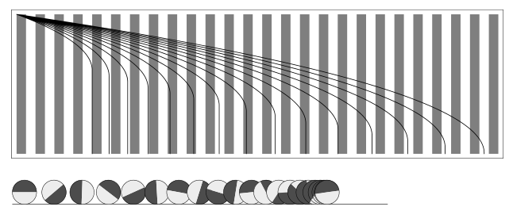
<!-- ORIGINAL_FIGURES page=0321 end -->

一个有些类似的例子，是让球沿粗糙表面滚动。诸如球停在哪里这类问题，会依赖于表面上凸起的图案。但现在初始条件的另一个特征也很重要：球的初始速度。

有些令人意外的是，即使表面上没有显著凸起，这类系统的行为在实践中也已经存在某些表观随机性。事实上，基于掷骰子、抛硬币等的机会游戏，都依赖的正是这类随机性。

作为简单例子，考虑一个半球为白色、另半球为黑色的球。可以像掷骰子一样滚动这个球，然后看球停止时哪种颜色在上面。如果在实践中这样做，通常会发现结果似乎相当随机。但这种随机性来自哪里？

答案是，它来自球被滚出时初始速度中的随机性。下图显示一个球在一系列不同初始速度下的运动。人们看到，只需对初始速度作很小改变，就能使球以完全不同的方向停止。

图注：以各种初始速度滚动的球的位置图。时间沿页面向下。球从左侧开始，初始速度由曲线的初始斜率给出。由于摩擦，球会减速并最终停止。球一半白一半黑，图中的条纹表示球在特定位置时哪种颜色在上面。图中曲线的分离，表明运动对球的确切初始速度敏感。可以看到，初始速度的微小改变，会使球停止时上方颜色不同。正是这种对初始条件中随机性的敏感性，使掷骰子或抛硬币等过程产生看似随机的输出。

---

[[PDF page 322]]

关键是，滚动这个球的人通常无法以足够精度控制初始速度，从而决定最终是黑色还是白色在上面。事实上，在连续试验中，初始速度通常会有足够大的随机变化，使结果显得完全随机。

抛硬币、幸运轮、轮盘赌轮以及类似随机性生成器，本质上都以同样方式工作。每种情形中，导致我们看到随机性的基本机制，都是对典型给定初始条件中存在的随机性的敏感依赖。

不过，如果初始条件中没有随机性，这些系统的输出就没有随机性。事实上，构造用于抛硬币、滚动球等的精密机器，使其总是产生一个确定结果且完全没有随机性，是相当可行的。

但启动后来称为混沌理论的发现是，至少原则上可能存在这样的系统：它们对初始条件的敏感性如此之高，以至于任何具有固定公差的机器都不能被期望产生可重复结果。

一个经典例子，是理想化版本的揉捏过程，例如制作面条或太妃糖时使用的过程。基本想法是取一团类似面团的材料，反复把它拉伸到原来长度的两倍，切成两半，再把两半叠在一起。对页顶部图显示这个过程的若干步骤。需要注意的重要点是，每次材料被拉伸，相邻点之间的距离都会加倍。

其结果是，点的初始位置中的任何改变，都会在每一步被放大两倍。某台特定机器也许能以某种精度控制一个点的初始位置，但这种反复放大最终会导致对更小改变的敏感性。

但这对材料中一个点的运动实际意味着什么？对页底部图显示两组起初非常接近的点会发生什么。最明显的效应是，这些点在连续步骤中迅速分离。但过一段时间后，它们到达材料边缘，不能再继续分离。

---

[[PDF page 323]]

<!-- ORIGINAL_FIGURES page=0323 start -->
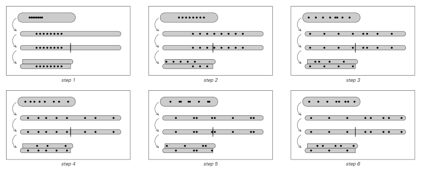
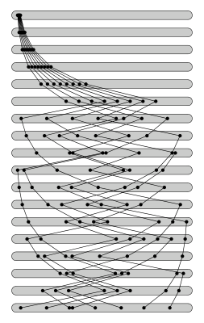
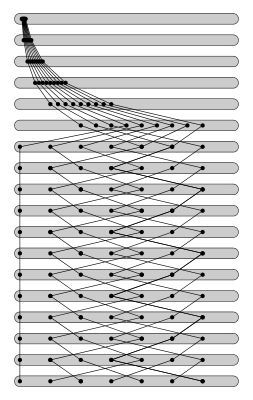
<!-- ORIGINAL_FIGURES page=0323 end -->

图注：一个类似制作面条或太妃糖时所用的揉捏过程，它表现出对初始条件的高度敏感依赖。每一步的第一部分中，材料被拉伸到原来长度的两倍。然后它被切成两半，并把两半叠在一起。图中显示，起初彼此接近的点会迅速分开。（更真实的揉捏过程会折叠材料，而不是切开它，但同样会出现对初始条件的敏感依赖。）

图注：上方揉捏过程应用于相邻点集合时可能发生的两个例子。两种情形中，如混沌理论所暗示，点最初都指数式分离。但过一段时间后，它们到达材料边缘；第一种情形中，它们随后显示相当随机的行为，第二种情形中则只显示简单重复行为。两种情形的差别在于点的位置的具体数字位序列：第一种情形中，这些数字位序列相当随机，而第二种情形中，它们具有简单重复形式。

第一种情形中，后续运动看起来相当随机。但第二种情形中则相当规则。为什么会这样？

稍作分析就能看出正在发生什么。基本想法是，把每一步每个点的位置表示成一个数，比如 `x`，取值范围从 0 到 1。材料被拉伸时，这个数字被加倍。

---

[[PDF page 324]]

<!-- ORIGINAL_FIGURES page=0324 start -->
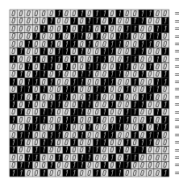
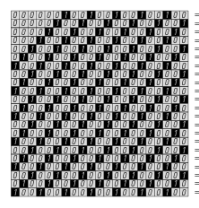
<!-- ORIGINAL_FIGURES page=0324 end -->

当材料被切开并叠放时，对这个数字的效果就是取其小数部分。

但结果表明，这个过程恰好与我们在基于数字的系统那一章第 153 页讨论的过程相同。

我们在那里发现，关键是不要按数字 `x` 的大小思考，而要按其二进制表示中的数字位序列来思考。事实上，就这类数字位序列而言，揉捏过程只是在每一步把所有数字位向左移动一位，如下图所示。

图注：上一页底部两个揉捏过程例子中，连续步骤上点的位置数字位序列。每一步这些数字位序列都向左移动一位。因此，如果初始数字位序列是随机的，如第一个例子，那么后续行为也会相应随机。但如果初始数字位序列是简单的，如第二个例子，那么行为也会相应简单。一般而言，某一步位置为 `x` 的点，会在下一步移动到位置 `FractionalPart[2 x]`。

按数字位序列的工作方式，一个数字中越靠右的数字位，对其整体大小的贡献总是越小。因此，人们也许会认为，初始条件中远在右侧的数字位永远不会重要。但上图显示，这些数字位总会被移到左侧，因此最终它们事实上会变得重要。于是随着时间推移，系统实际上正在采样初始条件中越来越靠右的数字位。

从某种意义上说，这与本节开头讨论的汽车沿颠簸道路行驶的例子并不不同。事实上，在许多方面，唯一真正差别是，不是看到道路上一串显式颠簸，而是揉捏过程中一个点位置的初始条件以更抽象形式编码为一串数字位。

---

[[PDF page 325]]

但关键点是，我们看到的行为只会像初始条件中的数字位序列那样随机。对页第一种情形中，碰巧所示每个初始点的数字位序列确实相当随机，因此我们看到的行为相应随机。但第二种情形中，数字位序列是规则的，因此行为也相应规则。

因此，对初始条件的敏感依赖本身并不意味着系统会以随机方式行为。事实上，它所做的只是使那些对初始条件中数字大小贡献任意小的数字位，最终产生显著影响。但为了让系统行为随机，还需要数字位序列本身是随机的。事实上，本节随机性机制的整个想法恰恰是：我们看到的任何随机性都必须来自所观察系统初始条件中的随机性。

那么，为什么这些初始条件中会有随机性，这是一个另外的问题。归根到底，这个问题只能通过走到所观察系统之外，并研究是什么设置了它的初始条件来回答。

不过，近些年关于混沌理论的叙述常常在这一点上引入混乱。发生的事情是，人们从混沌理论数学中一个隐含假设出发，得出结论说，在实践中出现的数字中，随机数字位序列应当几乎不可避免。

其基础是传统数学理想化：任何数字唯一相关的属性就是其大小。如第 152 页所讨论，这种理想化暗示，所有大小足够接近的数字都应在某种意义上同样常见。若这是真的，那么它确实意味着典型初始条件必然涉及随机数字位序列。

但没有特别理由相信，一个碰巧便于数学分析的理想化就应适用于自然世界。

---

[[PDF page 326]]

事实上，假定它适用，实际上只是忽视自然中随机性来自哪里这一根本问题。

甚至除了这些原则问题之外，至少对上面讨论的揉捏过程来说，从初始条件获得随机性的想法还存在严重实践问题。

问题在于，我们使用的揉捏过程描述忽略了某些显而易见的物理现实。其中最重要的是，人们处理的任何材料大概都由原子组成。因此，能够对一个点的位置作任意小改变这一概念并不现实。

人们也许会认为原子总是小到在实践中无关紧要。但关键恰恰在于，揉捏过程不断放大距离。事实上，只经过三十步，上面给出的揉捏过程描述就意味着两个初始只相隔一个原子的点最终会相隔将近一米。

然而，在实践中远早于这种情况发生之前，我们的简单揉捏过程描述没有考虑的其他效应必然也会变得重要。而这些效应常常会倾向于从环境引入新的随机性。因此，随机性纯粹来自初始条件这一想法，只能在相当少的步骤内现实；此后看到的随机性通常必须归因于其他机制。

人们也许会认为，我们一直讨论的揉捏过程只是个坏例子，而在其他情形中，来自初始条件的随机性会更重要。

对页图显示一个系统，其中一束光反复从一串镜子上反射。该系统被设置成这样：光每绕行一次，其位置都会以完全类似揉捏过程中点的位置的方式改变。就像揉捏过程一样，它对初始条件细节有很强敏感依赖，所见行为反映这些初始条件的数字位序列。

但再一次，在任何实际实现中，光只会绕行几十次，就会受到镜子中的微观扰动以及我们给出的简单描述没有考虑的其他现象影响。

---

[[PDF page 327]]

<!-- ORIGINAL_FIGURES page=0327 start -->
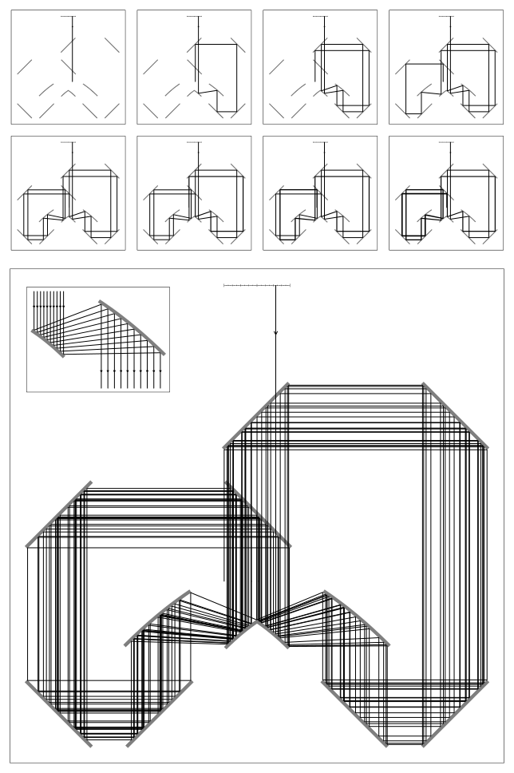
<!-- ORIGINAL_FIGURES page=0327 end -->

图注：一种镜子排列，被设置为表现出来自初始条件敏感依赖的随机性。系统的初始条件由每幅图顶部灰色区域中入射光线的位置指定。光线每一步向左还是向右，随后由给出初始条件的数字的二进制表示中的连续数字位决定。系统核心是左侧显示的“放大器”，它使用一对抛物面镜，把每条入射光线的位移加倍。这里使用的初始条件是 `Pi/4`，其数字位序列为 0.1100100100001111111。

---

[[PDF page 328]]

<!-- ORIGINAL_FIGURES page=0328 start -->
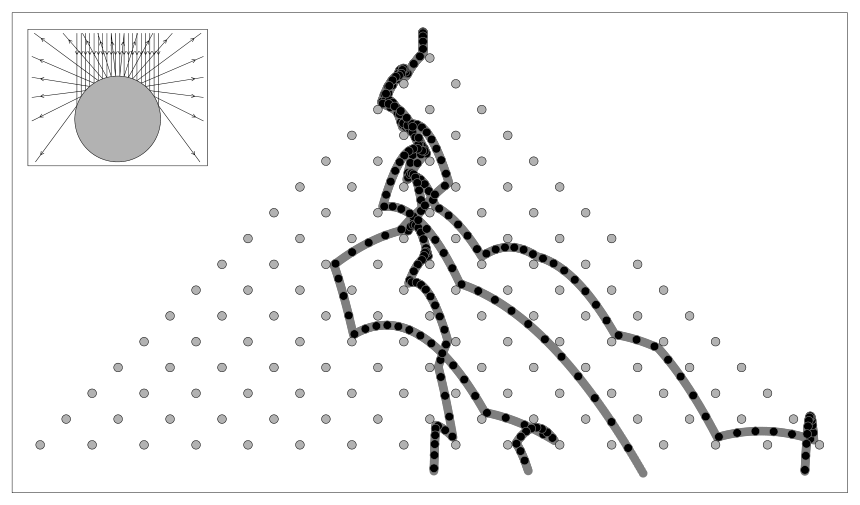
<!-- ORIGINAL_FIGURES page=0328 end -->

上一页所示系统的核心，是一套稍复杂的抛物面镜排列。但结果表明，几乎任何凸反射体都会导致获得初始条件敏感依赖所需的轨迹分离。

事实上，下面显示的简单钉板表现出同样现象：即使球从相差无穷小的初始位置落下，最终也会沿着非常不同的轨迹运动。

图注：四个理想化小球从相差千分之一的初始位置落入一组相同圆形钉子阵列中所遵循的路径。假定小球在重力下下落，并在撞击钉子时弹性反弹。如插图所示，方向上的微小差别会在每次反弹时被放大，大约加倍；结果是，经过几次反弹后，三个小球的轨迹相当不同。在该系统的物理版本中，如果小球实际大小与本页相同，那么来自环境的扰动将不可避免地在大约图中所示反弹次数之后被放大到对轨迹产生显著影响。这里展示系统的若干版本，特别是钉距更小的版本，有时称为高尔顿板或梅花板，自 1800 年代末以来一直用于演示概率论原理。如果假定小球会随机落在每个钉子的两侧，那么大量小球的最终位置会近似二项分布。

---

[[PDF page 329]]

虽然这些轨迹的细节不能像以前那样直接从初始位置的数字位序列中推出，但同样的现象仍会发生：连续采样越来越不重要的数字位。再一次，至少在一段时间内，球运动中的任何随机性都可以归因于这个初始数字位序列中的随机性。

但最多经过十来次碰撞后，许多其他效应，主要与环境的持续相互作用有关，在实践中总会变得重要，因此后续任何随机性都不能只归因于初始条件。

事实上，在任何系统中，初始条件细节能够被认为是随机性主导来源的时间长度，必然会受到这样一种分离程度的限制：一边是人们观察到的大尺度特征，另一边是不容易控制的小尺度特征。

那么，什么类型的系统中会出现最大的这种分离？答案往往是天文学中的系统。结果表明，天文学中的所谓三体问题，正是初始条件敏感依赖最早被广泛研究的地方。

三体问题是确定三个通过引力吸引相互作用的物体，例如地球、太阳和月亮，的运动。只有两个物体时，近四百年来人们已经知道出现的轨道是简单椭圆或双曲线。但有三个物体时，运动可以复杂得多，并且正如 1800 年代末所显示的，它可以对给定初始条件敏感依赖。

下一页图显示三体问题的一个特定情形，其中有两个大质量物体处于简单椭圆轨道中，同时有一个无穷小质量物体上下穿过这个轨道平面。图中显示，即使这个质量的初始位置只改变一亿分之一，在大质量物体 50 次公转以内，小质量物体的轨迹最终也会几乎完全不同。

那么，在实践中，我们太阳系中的行星和其他天体会发生什么？观测提示，至少在人类时间尺度上，它们的大多数运动相当规则。事实上，过去这种规则性曾被当作简单自然定律可能存在的关键证据之一。

---

[[PDF page 330]]

<!-- ORIGINAL_FIGURES page=0330 start -->
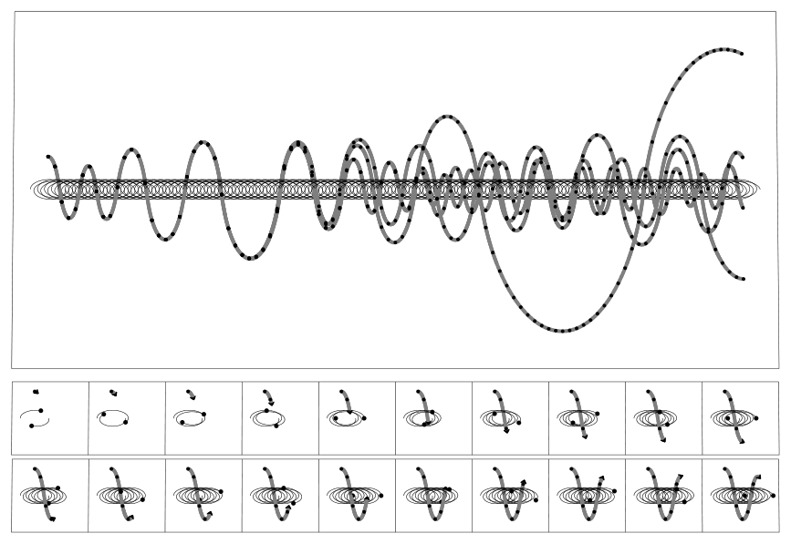
<!-- ORIGINAL_FIGURES page=0330 end -->

图注：三体问题的一个例子，其中一个理想化行星在两个等质量理想化恒星所处完美椭圆轨道的平面上下运动。图中显示四种可能初始位置得到的轨迹，这些初始位置相差 `10^-8`。作图时假定该系统以匀速从左向右运动。连续黑点表示恒星每次公转时行星所在的位置。主图显示 100 次公转过程中会发生什么。假定行星质量相对于恒星可以忽略，并且以零竖直速度从恰好位于两颗恒星之间等距离处开始。初始竖直位置稍有不同的轨迹发生分离，表明对初始条件的敏感依赖。

但计算暗示，即使在我们的太阳系中，初始条件敏感依赖最终也应当出现。不用说，我们没有显式设置不同初始条件的选择。但如果能够观察太阳系几百万年，那么就应当会有显著随机性，可以归因于初始条件数字位序列的敏感依赖；这种随机性过去的存在，可能解释我们太阳系今天观察到的某些特征。

---

[[PDF page 331]]

<!-- ORIGINAL_FIGURES page=0331 start -->
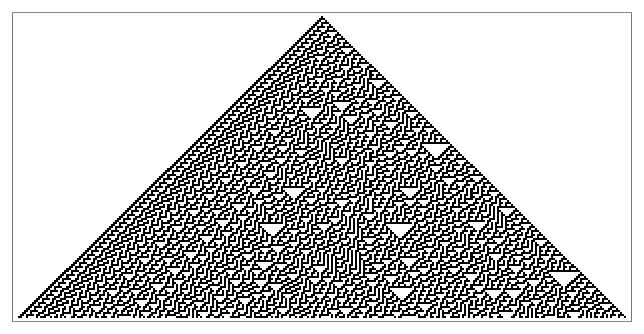
<!-- ORIGINAL_FIGURES page=0331 end -->

## 随机性的内在生成

过去两节中，我们研究了两种可能导致所观察随机性的机制。但正如已经讨论的，这两种机制本身并不以任何真实意义生成随机性。相反，它们本质上只是接收来自外部的随机输入，并把它传递给所观察的任何系统。

不过，本书的一个重要结果是，还存在第三种可能的随机性机制：不需要外部随机输入，随机性反而在所观察系统内部内在生成。

下图显示规则 30 元胞自动机，我正是在它中首次识别出这种随机性机制。系统的基本规则非常简单。初始条件也非常简单。

图注：第 27 页的规则 30 元胞自动机，是我发现的第一个内在随机性生成例子。这个系统没有随机输入，但其行为在许多方面似乎随机。我怀疑，我们在自然中看到的大量随机性正是这样产生的。

然而，尽管没有任何可以合理看作随机输入的东西，系统演化仍然内在地产生了在许多方面看似随机的行为。

正如之前讨论的，传统直觉使人很难相信这种复杂性可以从如此简单的底层过程出现。

---

[[PDF page 332]]

但过去几章已经证明，这不仅可能，而且实际上相当常见。

不过，观察上一页的元胞自动机，其产生的图案显然至少有某些规则性，比如左侧的对角条纹。但如果例如专门取出连续步骤中中心元胞的颜色，那么得到的内容看起来像一个完全随机序列。

但这个序列究竟有多随机？

对我们这里的目的来说，最相关的一点是，据人们所能判断，这个序列至少与我们通常认为随机的任何自然现象中得到的序列一样随机。

当人们说某物似乎随机时，在实践中通常意思是看不到其中有任何规则性。因此，当我们说自然中的某个特定现象似乎随机时，我们的意思是，我们的标准分析方法没有成功在其中找到规则性。因此，要评估类似元胞自动机这样的东西产生的序列的随机性，必须把应用于自然系统的同样分析方法应用于它。

正如我将在第 10 章讨论的，这些方法中有一些已在标准数学和统计学中良好编码，另一些实际上隐含在我们的视觉和其他感知过程中。但惊人事实是，这些方法似乎没有揭示规则 30 元胞自动机序列中的任何真正规则性。因此，据人们所能判断，这个序列至少与我们在自然中看到的任何东西一样随机。

但它真的随机吗？

过去一个世纪左右，人们提出了各种真正随机性的定义。按大多数这类定义，这个序列确实真正随机。但有一类定义并不认为它真正随机。

因为这些定义基于这样一种观念：只有那些永远不能由任何简单过程生成的序列，才被归类为真正随机。然而，从简单初始条件开始，再应用一条简单元胞自动机规则，这就构成了一个简单过程。

---

[[PDF page 333]]

因此，按这类定义，规则 30 的中心列不能被认为真正随机。

不过，虽然这类定义有某种概念吸引力，但它们在讨论自然中的随机性时并不可能有用。因为正如本书稍后会看到的，几乎可以肯定，任何自然过程都不可能生成一个按这类定义保证为真正随机的序列。

对我们的目的来说，更有用的定义往往不太集中于原则上是否存在某种生成特定序列的简单方式，而是集中于通过对该序列应用各种分析方法，是否现实地能够识别出这样的方式。正如上面所讨论，有充分证据表明，规则 30 的中心列确实按所有这类合理定义都是随机的。

因此，无论是否选择说这个序列真正随机，它据人们所能判断，至少在所有实际目的上是随机的。事实上，与它密切相关的序列已经非常成功地被用作实际计算中的随机性来源。

多年来，大多数计算机系统和语言都有生成通常称为随机数的设施。在 Mathematica 中，从它首次发布以来，`Random[Integer]` 就一直使用规则 30 元胞自动机生成 0 和 1。

其工作方式是，每次调用 `Random[Integer]` 时，元胞自动机演化就执行另一步，并返回中心元胞的值。但与两页前的图相比，一个区别是，出于实践原因，图案不允许永远变得越来越宽。相反，它会在一个宽几百个元胞的区域中环绕。

如第 259 页所讨论，这样做的一个后果是，生成的 0 和 1 序列最终必然重复。但即使用可以预见的最快计算机，实际重复周期通常也会超过宇宙年龄的一十亿亿倍。

另一个问题是，如果总是用第 315 页元胞自动机所示特定初始条件运行，就总会得到完全相同的 0 和 1 序列。但通过使用不同初始条件，可以得到完全不同的序列。

---

[[PDF page 334]]

实践中，如果没有显式指定初始条件，例如 Mathematica 会把首次调用 `Random` 时计算机系统确切状态的各种特征的一种表示，用作初始条件。

规则 30 元胞自动机提供了内在随机性生成的一个特别清楚、特别好的例子。但在前几章中，我们已经看到许多其他系统例子，也会内在地产生表观随机性。结果表明，其中一个系统与自 1940 年代末以来几乎所有实际计算机系统中用于生成随机数的方法有关。

对页图显示，如果连续把一个数字乘以各种常数因子，然后观察所得数字的数字位序列，会发生什么。正如我们最早在第 119 页看到的，用这种方式得到的数字位图案看起来相当随机。所谓线性同余随机数生成器的想法，恰恰就是利用这种随机性。

出于实践原因，这类生成器通常在每一步数字中只保留例如最右侧 31 个数字位。即使有这种限制，所生成序列仍然足够随机，至少直到不久前，它们几乎普遍被用作实际计算中的随机性来源。

因此，从某种意义上说，线性同余生成器是内在随机性生成这一一般现象的另一个例子。但结果表明，在某些方面它们相当不寻常，并且有误导性。

每一步只保留有限数量数字位，使产生的序列不可避免最终会重复。线性同余生成器流行的原因之一是，用相当直接的数学分析，可以准确判断哪些乘法因子会最大化这个重复周期。

于是，人们常常假定，具有最大重复周期会以某种方式意味着所得序列在所有方面都具有最大随机性。但多年实践中，人们一次又一次发现，为具有最大重复周期而构造的线性同余生成器，会表现出与完美随机性非常显著的偏差。

---

[[PDF page 335]]

<!-- ORIGINAL_FIGURES page=0335 start -->
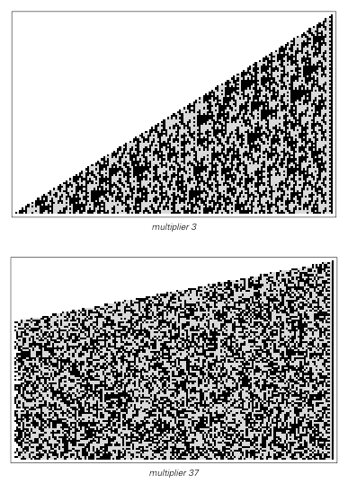
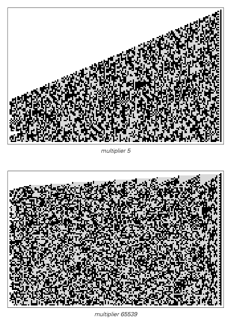
<!-- ORIGINAL_FIGURES page=0335 end -->

图注：从数字 1 开始，然后反复乘以各种固定常数所产生的二进制数字位图案。所有情形中，完整图案都具有三角形形式，但除第一种情形外，这里在左侧被截断。然而这些系统的数学结构使得更靠左的数字位不会影响所示数字位：每一步得到的数字实际上都按 `2^n` 取模，其中 `n` 是图像宽度。

下一页图中展示的一种典型失败是：用生成器连续数字决定坐标的点，结果以令人尴尬的规则方式分布。起初，这类失败也许提示人们，如果要得到良好随机性，就必须使用更复杂的方案。抱着这种想法，人们已经提出了各种精巧的线性同余生成器和其他生成器组合。但尽管这类系统行为的某些方面可以变得相当随机，仍经常发现与完美随机性的偏差。

看到这一点，人们也许会得出结论：用任何具有相当简单规则的系统产生良好随机性，本质上必定是不可能的。但上面讨论的规则 30 元胞自动机证明，事实绝对不是这样。

---

[[PDF page 336]]

<!-- ORIGINAL_FIGURES page=0336 start -->
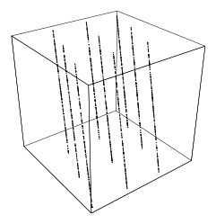
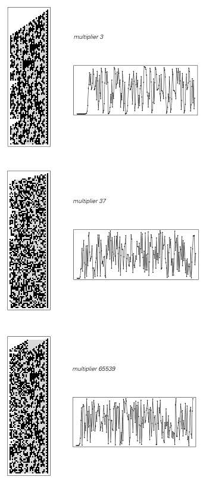
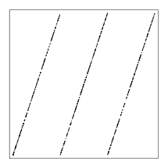
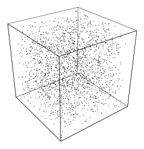
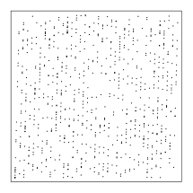
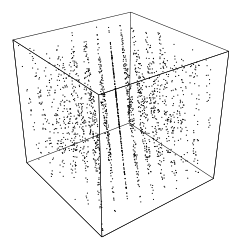
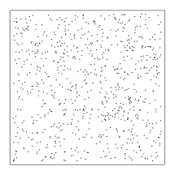
<!-- ORIGINAL_FIGURES page=0336 end -->

图注：三个所谓线性同余随机数生成器例子。每种情形中，它们从数字 1 开始，然后连续乘以指定乘数，只保留每一步所得数字二进制表示中最右侧 31 个数字位。乘数 3 的一个版本已经显示在第 120 页。乘数 65539 从 1960 年代大型机开始，被用作许多计算机系统上的随机数生成器。上方每一行最后两幅图给出点的分布，这些点在二维和三维中的坐标由线性同余生成器的连续数字得到。如果生成器输出完美随机，那么每种情形中这些点都应均匀分布。但如图所示，在二维或三维之一，或二者中，都可以看到条纹。

---

[[PDF page 337]]

事实上，这个元胞自动机的规则在某些方面甚至比相当基本的线性同余生成器还要简单得多。但它产生的序列似乎完全随机，并不遭受线性同余生成器中通常发现的任何问题。

那么，为什么线性同余生成器不能产生更好的随机性？讽刺的是，基本原因也正是它们流行的原因。关键在于，不同于上面讨论的规则 30 元胞自动机，线性同余生成器很容易接受具体数学分析。因此，例如可以保证某个特定生成器确实具有最大重复周期。

然而，几乎不可避免的是，具有这样的最大周期意味着某种规则性。事实上，正如本书稍后将看到的，任何具体数学分析的可能性本身，往往都意味着至少存在某些与完美随机性的偏差。

但如果不受这种分析需求约束，那么如上面的元胞自动机例子所示，惊人简单的规则可以成功生成高度随机的行为。

事实上，这类简单规则的存在，对于让内在随机性生成这一一般机制可能在自然中广泛存在至关重要。因为如果内在随机性生成只有通过非常复杂的规则集才能发生，那么人们会预期实践中只在少数非常特殊情形中看到这种机制。

但简单元胞自动机规则足以导致内在随机性生成这一事实，提示现实中这种机制相当容易发生。因此，人们可以预期这种机制会经常在自然中找到。

那么，这种机制的出现，与我们讨论过的前两种随机性机制相比如何？

我相信，基本答案是：每当大量随机性在短时间内产生时，内在随机性生成极有可能就是负责的机制。

上一节中我们看到，系统初始条件的随机细节可以导致系统行为中一定程度的随机性。

---

[[PDF page 338]]

但如我们所讨论，在大多数实际情形中，能够现实地把随机性归因于这种机制的序列长度是有限的。然而，对内在随机性生成来说，没有这种限制：例如在上面的元胞自动机中，要得到更长随机序列，所需的只是让元胞自动机运行更多步骤。

不过，通过与随机外部环境持续相互作用，也可以得到长随机序列，正如本章讨论的第一种随机性机制。

这种机制的问题在于，从中得到给定数量的高质量随机性可能需要很长时间。关键在于，大多数情形中，内在随机性生成能够在短得多的时间内产生类似随机性。

事实上，一般而言，内在随机性生成往往比从环境取得随机性高效得多。基本原因是，内在随机性生成在某种意义上让系统中的所有组件都参与产生新随机性，而从环境取得随机性则没有这样做。

例如，在上面讨论的规则 30 元胞自动机中，每个元胞实际上都主动贡献于我们看到的随机性。但在一个只放大环境随机性的系统中，系统内部的任何组件都从未贡献任何新的随机性。颇具讽刺意味的是，参与放大过程的组件越多，通常获得每个新的随机输出片段就越慢。因为正如两节前讨论的，每个组件在某种意义上都会给放大过程增加可以看作更多惯性的东西。

但随着组件数量增加，通过内在随机性生成产生随机性会变得越来越容易。事实上，除非系统底层规则以某种方式显式阻止它，最终结果表明内在随机性生成几乎不可避免地发生；它常常产生如此多随机性，以至于完全淹没另外两种机制可能产生的任何随机性。

---

[[PDF page 339]]

不过，说了这些之后，人们还可以问：在对自然中某个特定系统做实际实验时，怎样判断内在随机性生成在多大程度上真的是负责所观察表观随机行为的机制？

最清楚的迹象是一个有些意外的现象：随机行为的细节可以在一次实验运行到另一次实验运行之间重复。行为的一般特征相同并不令人惊讶。但令人瞩目的是，如果起作用的是内在随机性生成机制，那么行为的精确细节也可以重复。

在随机性来自与环境持续相互作用的机制中，不能期待重复性。因为每次运行实验时，环境状态都会不同，因此人们看到的行为也会相应不同。类似地，在随机性来自初始条件细节的机制中，也几乎不会有重复性。因为初始条件的细节通常受系统环境影响，不可能现实地从一次运行到下一次运行保持相同。

但关键在于，在内在随机性生成机制中，不存在对环境的依赖。结果是，只要所观察系统的设置保持相同，它产生的行为就会完全相同。因此，例如，无论运行规则 30 元胞自动机多少次，只要从单个黑色元胞开始，得到的行为总会完全相同。例如中心元胞颜色序列虽然看似随机，也会完全相同。

不过，这个序列有多容易被扰动？如果作相当剧烈的扰动，例如把元胞颜色一路从白色改成黑色，那么序列确实常常会改变，如下一页顶部图所示。

但对不那么剧烈的扰动，序列可以相当稳健。作为例子，可以考虑允许每个元胞不只是黑色或白色，而是任意灰度，如第 155 页讨论的连续元胞自动机。在这类系统中，可以研究如果每一步都把每个元胞的灰度随机扰动一小点会发生什么。

---

[[PDF page 340]]

<!-- ORIGINAL_FIGURES page=0340 start -->
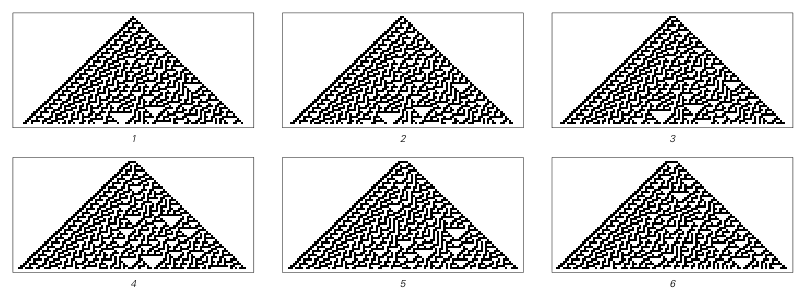
<!-- ORIGINAL_FIGURES page=0340 end -->

图注：改变上方所示规则 30 元胞自动机中初始黑色元胞数量的效果。只有 2 个或 3 个黑色元胞时，图案中心的序列不会改变。但一旦加入更多黑色元胞，它就会改变。

对页图显示各种大小扰动的结果。可以看到，当扰动足够大时，中心元胞颜色序列确实会改变。但关键点在于，扰动低于某个临界大小时，该序列总是本质上保持不变。

即使小扰动不断被加入，系统演化仍会使这些扰动衰减，并产生在实践中无法与没有扰动时所见行为区分的行为。

能容忍多大扰动而不产生显著影响，取决于底层规则的细节。正如图片提示，产生更复杂行为的规则往往只能容忍更小扰动。但关键点是，即使行为涉及内在随机性生成，也仍能容忍至少某种大小的扰动。

这一点之所以重要，是因为任何真实实验中，所观察系统都不可避免会受到扰动。

更加仔细地设置实验，通常可以实现更高程度的环境隔离。但绝不可能完全消除与环境的所有相互作用。

---

[[PDF page 341]]

<!-- ORIGINAL_FIGURES page=0341 start -->
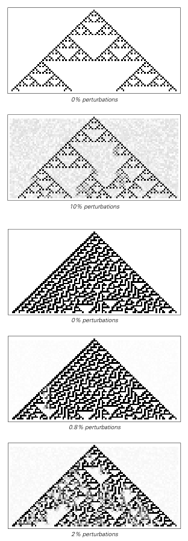
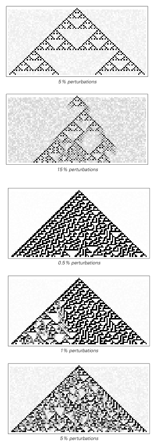
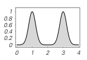
<!-- ORIGINAL_FIGURES page=0341 end -->

图注：各种水平外部随机性对规则 90 和规则 30 的连续推广行为的影响。每个元胞的值可以是 0 到 1 之间的任意灰度。对规则 90 的推广，把左右元胞的值相加，然后用右侧所示模 2 函数的连续推广，求出该元胞下一步的值。对规则 30 的推广，使用基于该规则代数表示的类似方案。两种情形中，每一步每个值也都会按每幅图标出的百分比，受到一个随机量扰动。

---

[[PDF page 342]]

因此，所观察系统总会受到来自环境的某种水平随机扰动。

但上一页图证明，当这类扰动足够小时，它们本质上没有影响。这意味着，当内在随机性生成是主导机制时，确实可以现实地期待在真实实验中看到的随机行为具有至少某种程度的可重复性。

那么，实践中是否已经真的看到这种可重复性？

不幸的是，到目前为止，关于这一点的良好信息很少；因为如果没有内在随机性生成的想法，当实验中观察到看似随机的行为时，过去从来没有理由去寻找这种可重复性。

不过，在科学文献的各个角落，包括物理、化学、生物等领域，我设法找到至少一些案例，其中报告了同一精心控制实验的多次运行，并且即使在看起来相当随机的行为中，也有清楚的可重复性迹象。

如果超越传统科学实验收集的纯数值数据，转而观察例如系统的视觉外观，那么有时可重复性现象会变得更明显。事实上，例如正如我将在第 8 章讨论的，同一生物物种的不同成员，常常在许多视觉细节上有许多相似之处，甚至在那些单独看来复杂且表观随机的特征中也是如此。

例如，当某个特定系统有两个对称侧面时，常常可以比较两侧产生的视觉图案，看看其中存在什么相似性。正如第 8 章各种例子所展示的，在相当广泛的物理、生物和其他系统中，确实可以存在惊人的相似性。

因此，在所有这些情形中，人们看到的随机性都不能合理地归因于从环境引入的随机性，无论是持续引入，还是通过初始条件引入。相反，只能得出结论：这种随机性事实上必定来自我在简单程序中发现并在本节讨论的内在随机性生成机制。

---

[[PDF page 343]]

## 连续性现象

我们在自然中遇到的许多系统，其行为似乎在某种意义上平滑或连续。然而，元胞自动机和我们讨论过的大多数其他程序只涉及离散元素。那么，这类系统怎么可能再现我们在自然中看到的东西？

关键点在于，即使一个系统中的单个组成部分是离散的，通过观察大量这类组成部分得到的平均行为，仍可能显得平滑而连续。事实上，自然中有许多熟悉系统正是这样。

例如，空气和水看起来像连续流体，尽管我们知道在微观层面上它们实际上都由离散分子组成。类似地，沙子很像连续流体那样流动，尽管我们很容易看到它实际上由离散颗粒组成。那么，使具有离散组成部分的系统产生看似平滑连续行为的基本机制是什么？

最常见的是，关键成分是随机性。

如果没有随机性，人们看到的整体形式往往会反映底层组成部分的离散性。例如，晶体的多面体形状反映了晶体中离散原子的规则微观排列。

但当存在随机性时，这类微观细节常常会被平均掉，最终不留下任何离散性痕迹，结果看起来平滑而连续。下一页显示这一现象的经典例子，基于所谓随机游走。

每个随机游走由取一个离散粒子，并在每一步随机把该粒子向左或向右移动一个位置来生成。如果从若干粒子开始，那么在任何特定时间，每个粒子都位于某个确定的离散位置。但如果观察的不是每个单个粒子的位置，而是所有粒子的整体分布，会发生什么？

答案如下一页所示：如果粒子足够多，那么人们看到的分布会呈现平滑连续形式，不显示系统底层离散性的痕迹。

---

[[PDF page 344]]

<!-- ORIGINAL_FIGURES page=0344 start -->
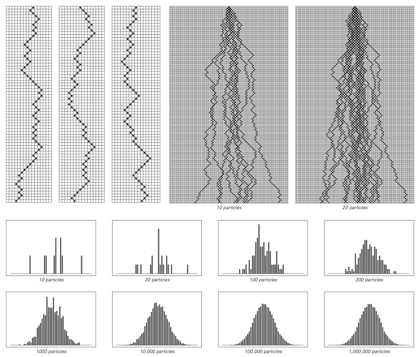
<!-- ORIGINAL_FIGURES page=0344 end -->

图注：遵循随机游走的粒子所到达位置的分布。左上方显示三个单独随机游走例子，其中每个粒子随机向左或向右移动一个位置。尽管单个粒子是离散的，图中显示，当考虑大量粒子时，得到的整体行为显得平滑而连续。

随机性在某种意义上成功洗去了系统本质上所有微观细节。

对页顶部图显示，如果对每个粒子的运动使用几种不同底层规则，会发生什么。可以看到，尽管微观层面存在差异，每种情形得到的整体分布都具有完全相同的连续形式。

---

[[PDF page 345]]

<!-- ORIGINAL_FIGURES page=0345 start -->
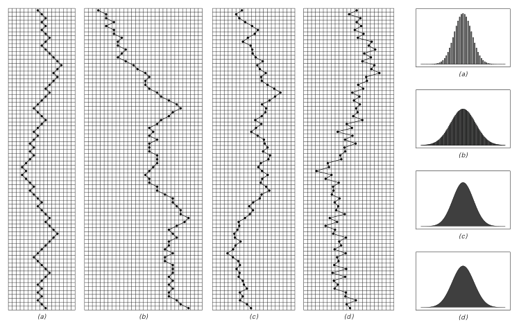
<!-- ORIGINAL_FIGURES page=0345 end -->

图注：说明对随机游走每一步使用范围很广的底层规则时，得到的整体分布总具有同样连续形式。情形 (a) 中，每个粒子每一步只向左或向右移动一个位置。情形 (b) 中，它可以移动 0、1 或 2 个位置；情形 (c) 中，它每一步可以移动 0 到 1 之间的任意距离。最后，在情形 (d) 中，粒子在交替步骤上总是向右或总是向左移动。

事实上，在随机游走这类系统的特定情形中，两百多年前提出的中心极限定理保证，对非常广泛的底层微观规则，总会得到同一种连续的所谓高斯分布。

这种对微观细节的独立性有许多重要后果。例如，下一页图显示，如果观察方形和六边形晶格上的二维随机游走，会发生什么。

人们也许会预期，这些晶格不同的底层形式会导致整体分布中的不同形状。但下一页展示的惊人事实是，当考虑足够多粒子时，最终得到的分布具有纯粹圆形形状，完全没有显示底层晶格不同离散结构的痕迹。

---

[[PDF page 346]]

<!-- ORIGINAL_FIGURES page=0346 start -->
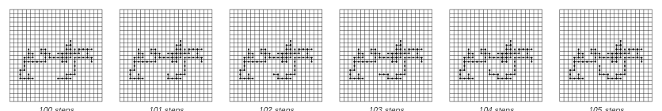
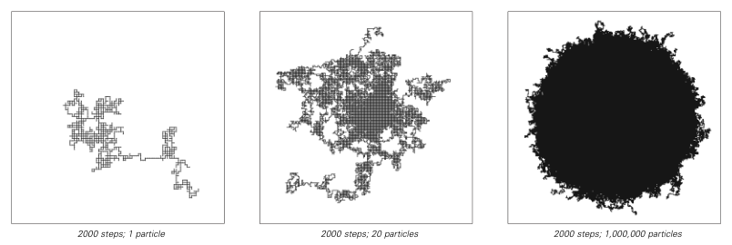
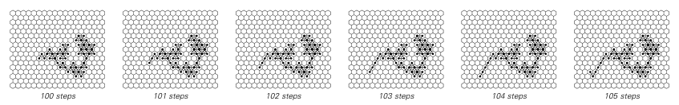
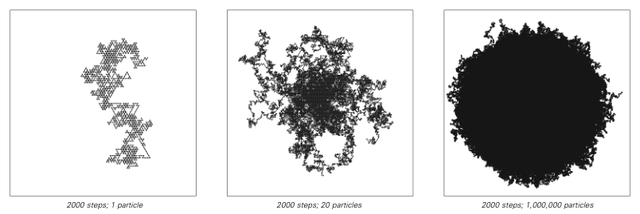
<!-- ORIGINAL_FIGURES page=0346 end -->

图注：方形和六边形晶格上的随机游走例子。尽管底层晶格不同，足够多粒子的平均最终在两种情形中都会给出圆形行为，正如中心极限定理所暗示的那样。

---

[[PDF page 347]]

<!-- ORIGINAL_FIGURES page=0347 start -->
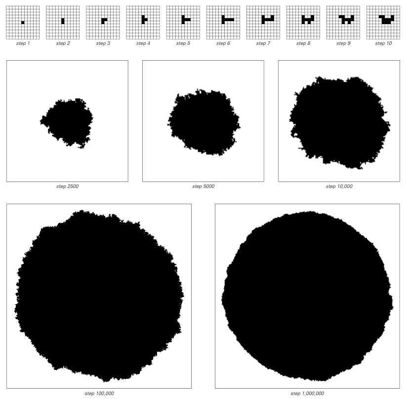
<!-- ORIGINAL_FIGURES page=0347 end -->

除了随机游走之外，还有许多其他基于离散组成部分的系统，其中微观层面的随机性同样会在大尺度上导致连续行为。下图显示一个例子，即一个简单聚集模型中发生的事情。

图注：一个简单聚集模型的行为，其中每一步都会在现有黑色元胞团簇旁边的随机选择位置添加一个新的黑色元胞。该系统是所谓 Eden 模型的一个版本。得到的形状最终几乎是一个完美圆形。

---

[[PDF page 348]]

<!-- ORIGINAL_FIGURES page=0348 start -->
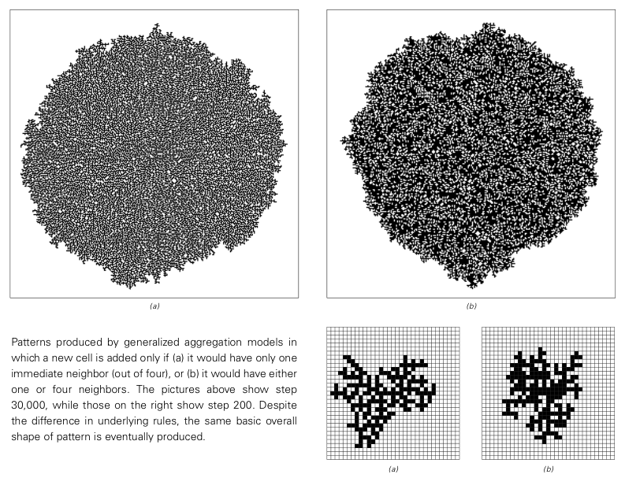
<!-- ORIGINAL_FIGURES page=0348 end -->

这个模型的想法，是通过每一步只添加一个新元胞来构建黑色元胞团簇。这个元胞的位置完全随机选择，唯一约束是它应当与团簇中已有元胞相邻。

在早期阶段，以这种方式增长的团簇看起来相当不规则。但经过几千步之后，平滑的整体近圆形状开始涌现。不同于随机游走的情形，目前还没有已知方式对这个过程作严格数学分析。但就像随机游走一样，系统底层规则的细节似乎再次对所见行为的主要特征没有多大影响。

例如，下面图中显示聚集模型的一些推广，其中新元胞只会被添加到具有某些数量已有邻居的位置。尽管底层规则有这些改变，所产生团簇的整体形状仍然非常相似。

图注：广义聚集模型产生的图案，其中只有当一个新元胞 (a) 只有一个直接邻居（四个邻居中），或 (b) 有一个或四个邻居时，才会被添加。上方图显示第 30,000 步，右侧图显示第 200 步。尽管底层规则不同，最终产生的图案具有同样基本整体形状。

---

[[PDF page 349]]

然而，在所有这些例子中，涉及的随机性都来自同一种基本机制：它在系统演化的每一步从外部显式插入。

但结果表明，真正重要的似乎只是随机性的存在；它通过什么机制出现，很大程度上无关紧要。特别是，这意味着来自上一节所讨论内在随机性生成机制的随机性，能够使具有离散组成部分的系统以看似连续的方式行为。

下一页图显示一个发生这种情况的二维元胞自动机。这个系统的规则或初始条件中都没有随机性。但通过内在随机性生成机制，系统行为表现出相当多随机性。结果表明，这种随机性导致一种整体增长图案，给出与聚集模型中相同基本类型的平滑近圆形式。

看到这一点之后，人们也许会问，是否事实上任何涉及随机性的系统最终都会产生平滑整体增长图案。答案明确是否定的。例如，在第 5 章讨论二维元胞自动机时，我们看到许多随机性出现的例子，但所产生的整体增长形式具有复杂结构，并没有特定的平滑性或连续性。

作为粗略指导，似乎只有当小尺度随机改变发生的速率显著大于整体增长速率时，连续增长图案才可能出现。因为从某种意义上说，只有这样才有足够时间让随机性平均掉底层离散结构的效应。

事实上，同样问题也存在于增长之外的过程中。一般而言，关键在于，具有离散组成部分的系统只有在存在一些特征相对于小尺度随机改变速率演化较慢时，才会产生连续行为。

---

[[PDF page 350]]

<!-- ORIGINAL_FIGURES page=0350 start -->
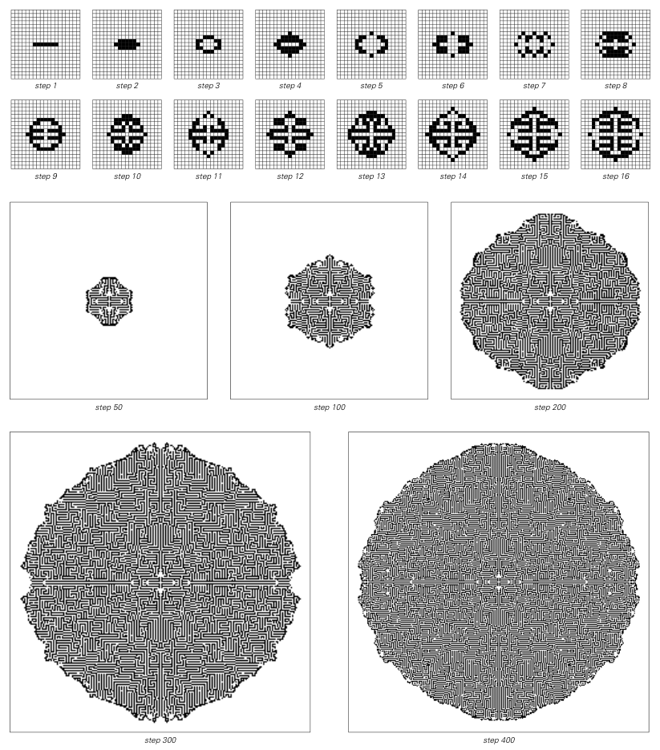
<!-- ORIGINAL_FIGURES page=0350 end -->

图注：第 178 页最早显示的一个二维元胞自动机，其规则为：如果某个给定元胞周围八个邻居（包括对角邻居）中恰好有三个黑色元胞，那么该元胞下一步变成黑色。如果它有 1、2 或 4 个黑色邻居，就保持原来的颜色；如果有 5 个或更多黑色邻居，那么下一步变成白色。（外总和型代码 746。）这条简单规则通过内在随机性生成机制产生随机性，而这种随机性又导致一种增长图案，呈现越来越平滑、大致圆形的形式。

---

[[PDF page 351]]

<!-- ORIGINAL_FIGURES page=0351 start -->
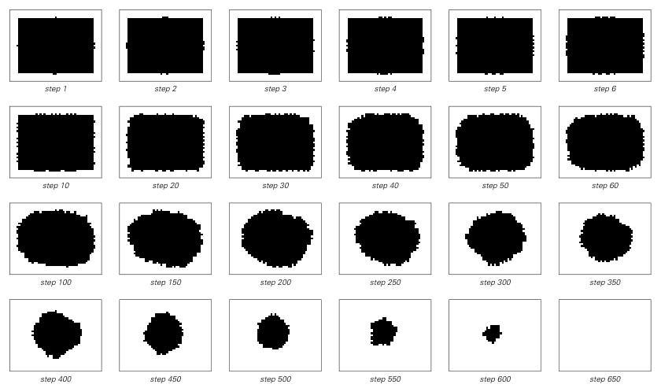
<!-- ORIGINAL_FIGURES page=0351 end -->

下一页图显示一个发生这种情况的例子。这些图中黑白元胞的具体图案每一步都在改变。但关键点在于，形成的大块黑白区域，其边界移动得相当缓慢。在整体层面上，这些边界随后以一种看起来相当平滑连续的方式行为。

不过，在小尺度上边界仍然由离散元胞组成。但如下图所示，这些元胞的具体构型会以看似随机的方式迅速改变。就像我们讨论过的其他系统一样，从所有这些小尺度随机改变中平均涌现出的，是在许多方面再次显得平滑连续的整体行为。

图注：下一页所示元胞自动机中单个黑色元胞区域的行为。该区域边界表现出看似随机的涨落。但在整体层面上，产生的行为在许多方面显得相当平滑连续。该区域实际上像具有表面张力那样行为，因此它先演化到大致圆形形状，然后最终收缩为无。主黑色矩形最初大小为 `39 x 29` 个元胞。

---

[[PDF page 352]]

<!-- ORIGINAL_FIGURES page=0352 start -->
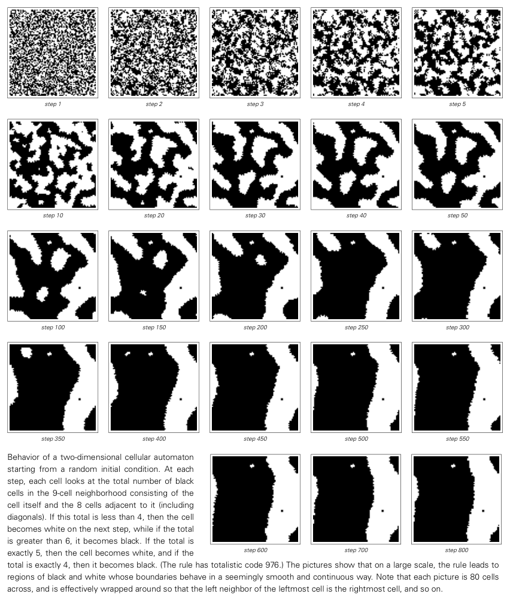
<!-- ORIGINAL_FIGURES page=0352 end -->

图注：一个二维元胞自动机从随机初始条件开始的行为。每一步，每个元胞都查看由该元胞本身及其相邻 8 个元胞（包括对角邻居）组成的 9 元胞邻域中黑色元胞总数。如果这个总数小于 4，那么该元胞下一步变成白色；如果总数大于 6，则变成黑色。如果总数恰好为 5，则元胞变成白色；如果恰好为 4，则变成黑色。（该规则总和型代码为 976。）图中显示，在大尺度上，这条规则导致黑白区域，其边界以看似平滑连续的方式行为。注意，每幅图宽 80 个元胞，并且实际上会环绕，因此最左元胞的左邻居是最右元胞，依此类推。

---

[[PDF page 353]]

## 离散性的来源

上一节中我们看到，即使一个系统在小尺度上由离散组成部分构成，系统整体仍可能表现出看似平滑连续的行为。正如之前讨论过的，传统数学模型的绝大多数事实上正是基于这种连续性。

但观察自然中的实际系统时，结果表明人们常常会看到离散行为。例如，斑马的皮毛具有离散的黑白条纹，而不是连续灰度。事实上，许多表现出复杂行为的系统至少会显示某种层次的整体离散性。

那么，这对连续模型意味着什么？上一节中，我们发现离散模型可以产生连续行为。本节将发现，反过来也成立：连续模型有时可以产生看似离散的行为。

不用说，如果想研究基于离散性的现象，通常从一个根本上离散的模型开始更有意义。但为了与已有科学模型和结果建立联系，看看离散行为怎样能从连续过程涌现出来，是有用的。

水的沸腾提供了一个经典例子。如果取一些水并连续增加其温度，一段时间内不会发生太多事情。但当温度达到 100°C 时，一个离散转变会发生，所有水蒸发成蒸汽。

结果表明，有许多类型的系统中，连续变化可以导致这种离散转变。

下一页顶部图显示一个基于一维元胞自动机的简单例子。想法是连续改变黑色元胞的初始密度，然后看看这些改变对系统整体行为有什么影响。

人们也许会认为，如果所作改变总是连续的，那么效应也会相应连续。但下一页图证明事实并非如此。

---

[[PDF page 354]]

<!-- ORIGINAL_FIGURES page=0354 start -->
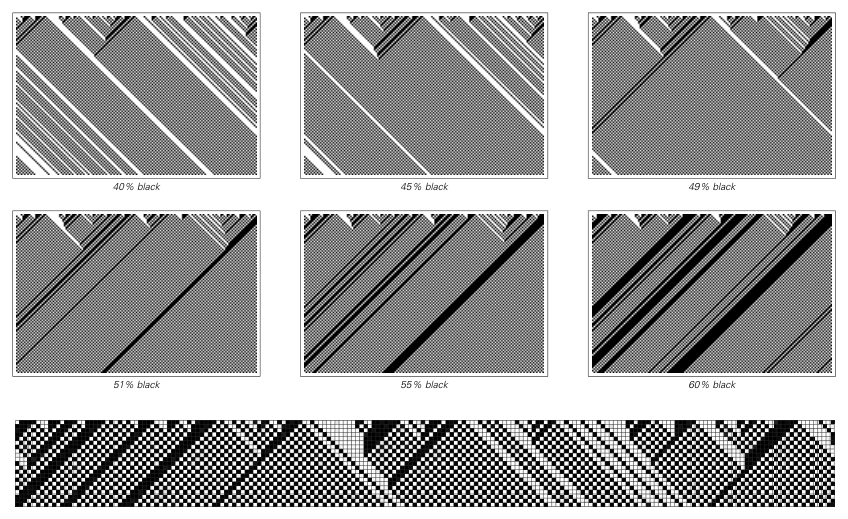
<!-- ORIGINAL_FIGURES page=0354 end -->

图注：一个一维元胞自动机，当其初始条件性质连续变化时，会显示行为中的离散改变。如果黑色元胞初始密度小于 50%，那么最终只有白色条纹存活。但只要密度增加到超过 50%，白色条纹就会消失，黑色条纹占据主导。所示元胞自动机的底层规则把一个元胞的新颜色取为：若该元胞为黑色，则取其右邻居的颜色；若该元胞为白色，则取其左邻居的颜色。（这对应于第 53 页描述方案中的规则 184。）

当黑色元胞初始密度为任何小于 50% 的值时，只有白色条纹会存活。但只要初始密度增加到超过 50%，一个离散转变就会发生，存活的不是白色，而是黑色条纹。

对页图显示同一基本现象的另一个例子。当黑色元胞初始密度小于 50% 时，所有黑色区域最终都会消失，系统变成完全白色。但只要密度增加到超过 50%，行为会突然改变，系统最终变成完全黑色。

结果表明，这类离散转变在一维元胞自动机中相当罕见，但在二维和更高维中变得越来越常见。

---

[[PDF page 355]]

<!-- ORIGINAL_FIGURES page=0355 start -->
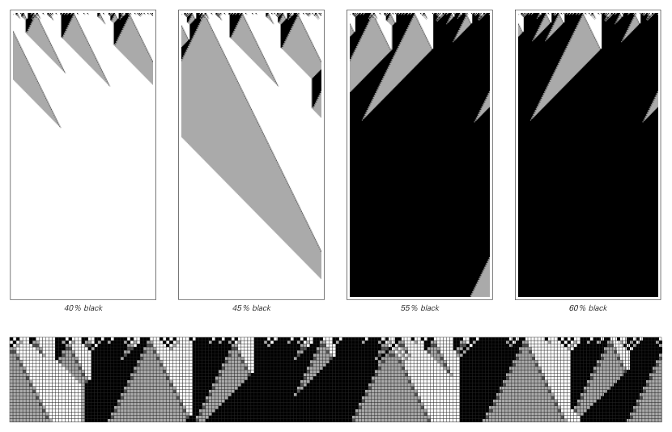
<!-- ORIGINAL_FIGURES page=0355 end -->

图注：一个一维元胞自动机，当黑色元胞初始密度连续增加时，大量步骤后得到的黑色元胞密度会发生离散变化。初始密度低于 50% 时，黑色区域总是最终消失。但只要密度增加到超过 50%，黑色区域就会逐步扩张，并最终接管整个系统。底层规则允许每个元胞有四种可能颜色。规则被设置为：只要黑色区域出现在白色区域左侧，两者之间就会出现一个扩张的灰色区域。关键点在于，如果白色区域窄于黑色区域，那么灰色会先到达白色边缘，早于到达黑色边缘。当这种情况发生时，黑色会扩张，灰色则逐渐变窄消失。

下一页图显示两个例子，第二个对应于我们在上一节末尾另一个背景中见过的一条规则。

两个例子中，本质上发生的事情是，在黑色相对于白色占优的区域中，越来越大比例的元胞变成黑色；而在白色相对于黑色占优的区域中，反过来发生。只要这些区域边界不会像许多一维元胞自动机中那样卡住，其结果就是初始时更常见的颜色最终接管整个系统。

---

[[PDF page 356]]

<!-- ORIGINAL_FIGURES page=0356 start -->
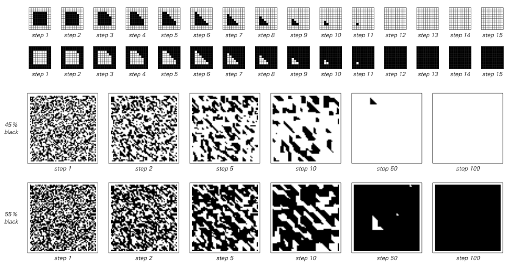
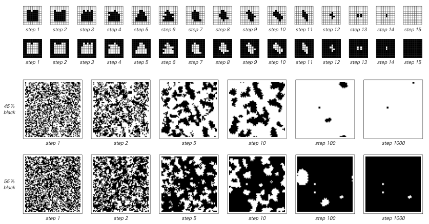
<!-- ORIGINAL_FIGURES page=0356 end -->

图注：两个二维元胞自动机例子，当初始黑色元胞密度连续改变时，行为会显示离散转变。顶部规则中，某个特定元胞的新颜色只需观察该元胞及其正上方和右方直接邻居即可得到。如果这三个元胞中有两个或更多为黑色，那么新颜色为黑色；否则为白色。中间图显示，使用这条规则时，反色元胞块会逐步被破坏，因此初始更常见的颜色最终完全占主导。底部规则与第 336 页所示规则完全相同。初始更常见的颜色同样最终占主导，虽然使用这条规则发生这一点所需时间稍长。

---

[[PDF page 357]]

<!-- ORIGINAL_FIGURES page=0357 start -->
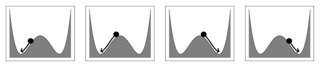
<!-- ORIGINAL_FIGURES page=0357 end -->

在大多数元胞自动机中，长时间后得到的行为要么在很大程度上独立于初始密度，要么随初始密度相当平滑地变化。但对页所示元胞自动机的特殊特征在于，它们有两个非常不同的稳定状态，即全白或全黑；当改变初始密度时，这两个状态之间会发生离散转变。

人们也许会认为，这种离散转变的存在必定以某种方式与底层元胞自动机规则的离散性质相关。但结果表明，在具有连续底层规则的系统中，也可以得到这类转变。

下面图中显示一个标准而非常简单的例子，说明这怎样发生。如果从中心凸起左侧开始，那么球总会滚入左侧极小点。但如果逐步改变球的初始位置，一旦越过中心，离散转变就会发生，球会滚入右侧极小点。

图注：一个连续系统的标准简单例子，其中初始条件的连续改变会导致行为的离散改变。当球从中心线左侧任意位置开始时，它滚入左侧极小点。但如果它从右侧开始，那么它滚入右侧极小点。自然中有许多系统遵循与描述该球能量和运动的数学方程相同的一般形式。

因此，尽管支配球运动的数学方程具有简单连续形式，它们产生的行为仍涉及离散转变。虽然这个特定例子也许显得刻意，但结果表明，本质上同样的数学方程也出现在许多其他情形中，例如各种化学反应中化学浓度的演化。

只要这类方程出现，它们就不可避免地导致系统具有有限数量的稳定状态，并且当系统参数变化时，这些状态之间会发生离散转变。

---

[[PDF page 358]]

所以，即使一个系统在某个层面上遵循连续规则，它仍然可能表现出离散整体行为。事实上，这类行为相当常见地成为一个系统最明显的特征之一，这就是为什么元胞自动机这类离散系统最终常常是最合适模型的原因。

## 满足约束的问题

程序的一个特征是，它们立即提供可以遵循的显式规则，以决定系统会怎样行为。但在传统科学中，人们常常试图改用约束来工作；这些约束只是被假定会隐式地迫使某些行为出现。

在第 5 章末尾，我给出了一些约束例子，并显示确实存在可以迫使相当复杂行为出现的约束。但尽管如此，我强烈怀疑，在自然中看到的所有复杂行为例子中，几乎没有一个最终最适合用约束来解释。

基本原因是，要找出什么行为图案会满足给定约束，通常似乎过于困难，不像是自然中会例行发生的事情。

许多类型的约束，包括第 5 章中的那些，具有这样的性质：给定一个具体图案，检查它是否满足约束相当容易。但关键点是，这一事实绝不意味着从约束出发找到一个满足它们的图案也必然容易。

这与显式演化规则发生的事情相当不同。因为如果知道这类规则，这些规则立即给出一个过程，用于算出会发生什么行为。然而，如果只知道约束，那么这些约束本身不会立即给出任何具体过程来算出会发生什么行为。

原则上，人们可以想象观察每一个可能图案，然后挑出满足约束的图案。但即使只有一个 `10 x 10` 黑白方块阵列，可能图案的数量已经是 1,267,650,600,228,229,401,496,703,205,376。

---

[[PDF page 359]]

<!-- ORIGINAL_FIGURES page=0359 start -->
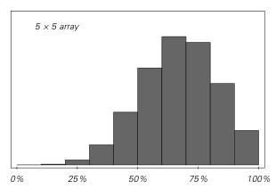
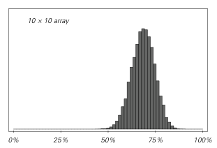
<!-- ORIGINAL_FIGURES page=0359 end -->

而对一个 `20 x 20` 阵列，这个数量比宇宙中的粒子总数还大。因此，自然系统似乎完全不可想象会执行这种穷尽搜索。

不过，人们也许会想象，如果这类系统只是随机尝试图案，那么尽管极少有图案会精确满足任何给定约束，仍可能有相当多图案至少接近满足。但通常结果表明，即使这一点也不成立。作为例子，下图显示，随机选择的图案中，有多大比例会有给定百分比的方块违反第 211 页描述的约束。

图注：所有可能图案中，有一定百分比方块违反第 211 页所讨论约束的比例。只有少数图案精确满足约束（也就是 0% 方块错误）。对于大阵列，绝大多数可能图案都有大约 70% 的方块错误。

对多数图案来说，约 70% 的方块结果会违反约束。在 `10 x 10` 阵列中，找到一个违反约束方块比例甚至低于 50% 的图案的概率只有千分之一，而低于 25% 的概率是四万亿分之一。

这意味着，基于随机挑选图案的过程，极不可能得到甚至接近满足约束的结果。

那么，怎样能做得更好？自然系统和实际计算中常用的方法，是使用某种形式的迭代过程：从一个随机选择的图案开始，然后逐步修改图案，使其更接近满足约束。

---

[[PDF page 360]]

<!-- ORIGINAL_FIGURES page=0360 start -->
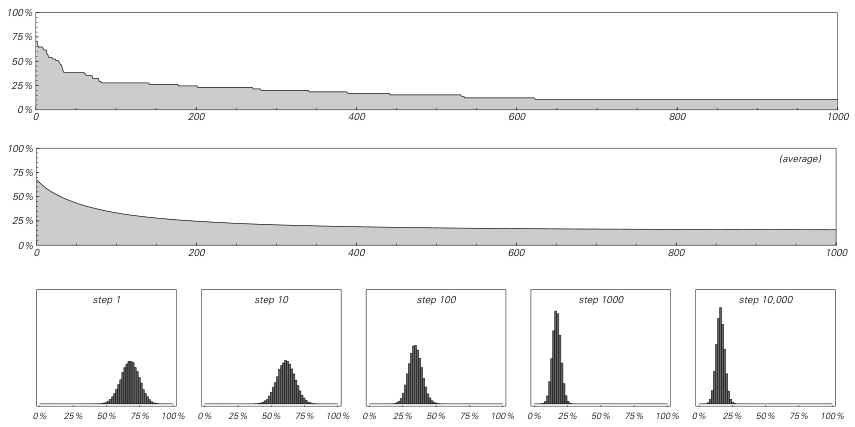
<!-- ORIGINAL_FIGURES page=0360 end -->

作为具体例子，考虑采取一系列步骤，每一步随机选择上面讨论的阵列中的一个方块，然后只要反转这个方块的颜色不会增加阵列中违反约束方块总数，就反转它的颜色。

下图显示使用这个过程得到的结果。最初几步中，改善很快。但随着继续，可以看到改善速率变得越来越慢。即使经过一百万步，结果表明一个 `10 x 10` 阵列中平均仍有 15% 的方块不满足约束。

在实际情形中，这类近似结果有时有用，但对页顶部图显示，实际得到的图案与我们在第 5 章中看到的这个系统的精确结果并不太像。

图注：一个过程的结果，该过程旨在产生越来越接近满足第 211 页所述约束的图案。过程从随机选择的图案开始，然后每一步随机选择图案中的一个方块；只要反转该方块颜色不会增加图案中违反约束的方块总数，就反转它的颜色。顶部图显示该过程的一次特定运行。第二幅图显示许多次运行所得平均行为。最后，底部图显示随着过程推进，具有不同百分比违反约束方块的图案比例怎样变化。所有情形中都使用 `10 x 10` 图案。

---

[[PDF page 361]]

<!-- ORIGINAL_FIGURES page=0361 start -->
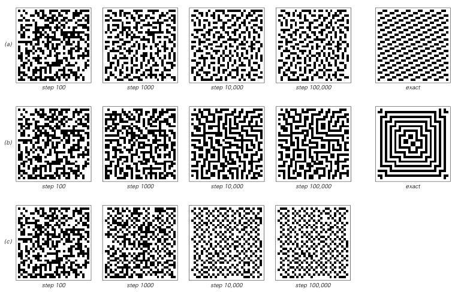
<!-- ORIGINAL_FIGURES page=0361 end -->

图注：使用与上一幅图相同的过程，但针对三组不同约束生成的图案。情形 (a) 使用与上一幅图相同的约束；(b) 要求每个黑色方块和每个白色方块都恰好有两个相邻黑色方块；(c) 要求每个黑色方块有 3 个相邻黑色方块和 1 个白色方块，每个白色方块有 4 个相邻白色方块。在情形 (a) 和 (b) 中，可以精确满足约束；情形 (c) 中则不可以。图中显示一个 `30 x 30` 阵列的演化，其面积接近上一幅图所示阵列的 10 倍。虽然经过 100,000 步后违反约束的方块比例低于 20%，但整体图案仍然不太像精确结果。

那么，为什么这个过程不能更好地工作？问题结果表明相当一般。作为简单例子，考虑一行黑白方块，以及这样一条约束：每个方块都应与其右侧邻居具有相同颜色。这条约束只有当每个方块具有同一颜色，即全黑或全白，时才会被满足。但迭代过程能在多大程度上成功找到这个解？

作为第一个例子，考虑一个过程：每一步随机选择一个方块，然后只要反转其颜色能减少违反约束方块总数，就反转它的颜色。下一页顶部图显示这种情形中会发生什么。

---

[[PDF page 362]]

<!-- ORIGINAL_FIGURES page=0362 start -->
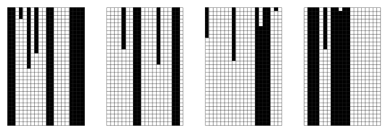
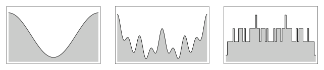
<!-- ORIGINAL_FIGURES page=0362 end -->

图注：四次尝试应用一个迭代过程，以寻找满足简单约束的构型；该约束要求每个方块都与其右侧方块具有相同颜色。（假定方块循环排列，因此最右方块的右邻居是最左方块。）过程从随机方块构型开始，然后每一步随机选择一个方块；只要反转这个方块颜色能减少违反约束的方块总数，就反转它。最终满足约束的唯一构型是全白和全黑。但该过程在到达这些构型之前很早就卡住了。问题在于，对任何宽度超过一个方块的块而言，改变其任一端方块的颜色都不会减少违反约束的方块总数。因此，这类块保持固定，不能消失。

结果非常糟糕：系统不是稳步演化到全黑或全白，而是很快卡在包含不同颜色区域的状态中。

结果表明，这种行为在迭代过程中并不罕见；事实上，即使在试图寻找曲线最低点这样的简单情形中也会看到。对这类问题，最显然的迭代过程是采取一系列小步，每一步的方向选择为局部向下。

对下方所示第一条曲线来说，这个过程确实工作良好，很快会通向最低点。但对第二条曲线，这个过程通常就已经不能工作；它通常会卡在一个局部极小点中，永远到不了全局极小点。

图注：三个曲线例子。第一种情形中，持续向下走的最显然机械或数学过程会成功通向最低点。但在另外两种情形中，这个过程通常最终会卡在局部极小点。这是使用基于逐步改善的过程精确寻找满足约束图案时困难的基本现象。上方第三幅图表示的是几乎所有基于约束的离散系统中出现的那类曲线。

---

[[PDF page 363]]

<!-- ORIGINAL_FIGURES page=0363 start -->
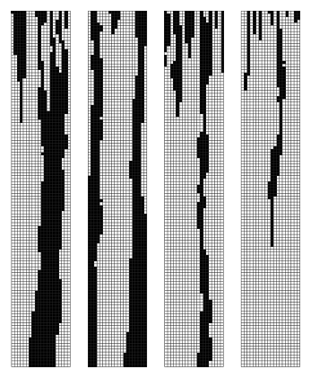
<!-- ORIGINAL_FIGURES page=0363 end -->

对涉及比如黑白方块的离散系统而言，结果表明，所产生曲线几乎不可避免会具有对页底部第三幅图所示那种锯齿形形式。因此，这导致一个总是试图向下走的简单迭代过程几乎总会卡住。

怎样避免这一点？一种一般策略是加入随机性，从而本质上不断摇动系统，防止它卡住。但怎样做到这一点的细节，往往会对结果产生巨大影响。

对页顶部的过程在某种意义上已经涉及随机性，因为它每一步随机选择一个方块。但正如我们看到的，用这个特定过程系统仍可能卡住。

不过，稍微修改过程就可以避免这一点。作为例子，下方图显示，如果每一步不仅在反转随机方块颜色会减少违反约束方块总数时反转它，而且在该数量保持不变时也反转它，会发生什么。此时系统永远不会永久卡住，而总会最终演化到满足约束。

图注：对页顶部图中过程的一个小修改所得结果。每一步仍随机选择一个方块。但现在不仅在这样做实际改变了违反约束方块总数时反转其颜色，也在该数量保持不变时反转其颜色。用这个过程，从任何初始条件出发的演化都能访问每个可能构型，因此满足约束的构型至少最终会被到达。

---

[[PDF page 364]]

<!-- ORIGINAL_FIGURES page=0364 start -->
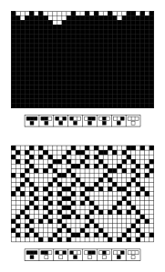
<!-- ORIGINAL_FIGURES page=0364 end -->

但这个过程仍可能需要非常长时间。事实上，在本节前面讨论的二维情形中，所需步骤数可以长到天文规模。

那么，能否加速？对某个特定系统知道得越多，就越能发明适用于该系统的技巧。但通常这些技巧结果只会带来有限加速；尽管多年来有各种希望，最终似乎没有任何技术能在非常广泛的系统范围内良好工作。

这提示我们，即使在某种理想化意义上，自然中的某个系统也许可以被预期满足某些约束，在实践中该系统也很可能事实上没有办法哪怕接近做到这一点。

在传统科学中，约束概念常被引入，试图概括演化规则的效应。通常想法是，经过足够长时间后，系统应当只出现在对其演化规则作用不变的状态中。相当常见的是，结果表明可以证明任何以这种方式不变的状态都必须满足相当简单的约束。但问题在于，除非整体行为非常简单，否则系统事实上往往不会演化到严格不变的状态。

左侧两个元胞自动机都以全白和全黑作为不变状态。第一种情形中，从随机初始条件开始，系统很快稳定到全黑不变状态。但第二种情形中，根本没有发生类似事情；相反，系统永远持续表现出复杂且看似随机的行为。

第 5 章末尾由约束产生的二维图案，结果都对应于各种二维元胞自动机的不变状态。例如，第 211 页图案结果是 4,294,967,296 种可能五邻域元胞自动机规则中 572,522 条规则的唯一不变状态。但如果从随机初始条件开始运行这些规则，通常永远不会得到第 211 页的图案。相反，如对页顶部图所示，人们看到的是各种图案，它们反映显式演化规则的程度远多于与不变状态相关的约束。

---

[[PDF page 365]]

<!-- ORIGINAL_FIGURES page=0365 start -->
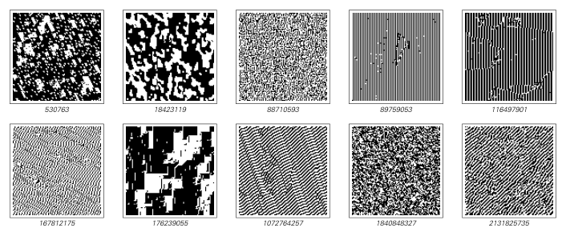
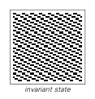
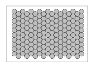
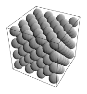
<!-- ORIGINAL_FIGURES page=0365 end -->

图注：若干二维元胞自动机的典型行为，它们只让右侧图案保持不变。所示结果来自从随机初始条件开始演化 500 步。没有任何情形中所见全局行为会接近满足决定不变状态的简单约束。

那么，物理中的实际系统又如何？它们行为是否不同？作为一个例子，考虑桌面上被推到一起的大量圆形硬币。可以把这类系统看作具有一个不变状态，满足硬币应尽可能密集堆积的约束。对相同硬币来说，这个约束由右侧所示简单重复图案满足。结果表明，在这个特定情形中，如果真正在桌面上把硬币推到一起，这个图案会很快产生。

图注：平面中相同圆的最密堆积。每个圆周围有六个其他圆。

但对三维中的球来说，情况相当不同。在这种情形中，已知最密堆积约束在球按右侧所示简单重复方式排布时被满足。但如果只是尝试把球推到一起，它们几乎总是会卡住，永远不会采取任何类似所示排列的东西。即使把球摇动来摇动去，本质上仍永远得不到这种排列。事实上，唯一做法似乎是小心地一个接一个放下这些球。

图注：三维空间中相同球的最密堆积。每个球周围有 12 个其他球。

在二维中，一旦有不止一种大小的硬币，就会出现类似问题。事实上，即使只有两种大小，要弄清楚怎样满足最密堆积约束，已经困难到大多数情形中仍不知道是哪种构型做到这一点。

---

[[PDF page 366]]

<!-- ORIGINAL_FIGURES page=0366 start -->
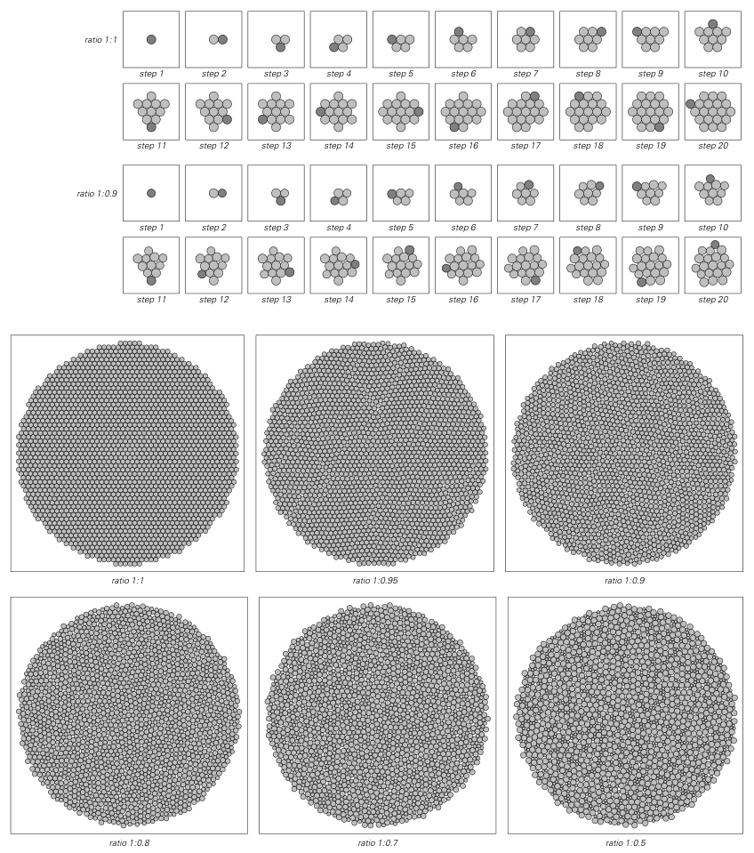
<!-- ORIGINAL_FIGURES page=0366 end -->

图注：依次放下圆所得到的图案，放置方式是使每个新圆的中心尽可能接近第一个圆的中心。除最初第一种情形外，这些图案在多大程度上表示最密可能堆积并不清楚；事实上，在大多数这类实际堆积中，不同大小的圆很可能只是分离为若干均匀区域。

---

[[PDF page 367]]

对页图显示，如果从单个圆开始，然后依次添加新圆，使每个新圆的中心尽可能靠近第一个圆的中心，会发生什么。当所有圆大小相同时，这个过程会产生简单重复图案。但只要圆的大小有显著差异，对页图显示这个过程往往产生复杂得多的图案，而这些图案最终也许与最密堆积约束并没有多大关系。

人们可以观察各种其他物理系统，但据我所能判断，故事总是大致相同：只要存在显著复杂性的行为，最可信的解释往往是某个显式演化过程，而不是对约束的隐式满足。

不过，人们也许仍会设想，生物系统中情形可能不同，自然选择过程可能以某种方式产生由满足约束成功决定的形式。

但正如我将在下一章讨论的，我强烈相信，最终很像物理系统中一样，以这种方式实际得到的只能是相当简单的形式；而当看到更复杂形式时，它们往往再次不与约束有关，而是与显式演化规则的效应有关，这些规则大多支配单个生物体的生长。

## 简单行为的来源

自然中有许多系统显示高度复杂行为。但也有许多系统显示相当简单的行为，最常见的是完全均匀、重复或嵌套。

本书中我们发现，程序也非常相似：有些显示高度复杂行为，另一些只显示相当简单的行为。

传统直觉也许会让人假定，所观察行为的复杂性与底层规则的复杂性之间必然存在直接对应。但本书的中心发现之一是，事实上并不存在这种对应。

---

[[PDF page 368]]

<!-- ORIGINAL_FIGURES page=0368 start -->
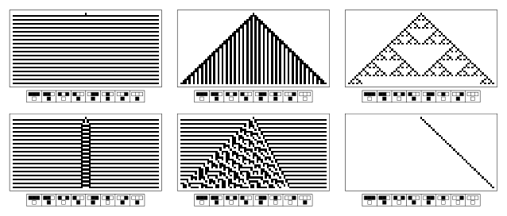
<!-- ORIGINAL_FIGURES page=0368 end -->

因为即使具有某些最简单可能规则的程序也会产生高度复杂行为，而具有相当复杂规则的程序往往只产生相当简单行为。事实上，正如本书中已经多次看到的，也如下面图所示，即使规则极其相似，也可以产生相当不同的行为。

图注：一系列初等元胞自动机，其规则相邻之间只在一个位置上不同（格雷码序列）。尽管规则相似，这些元胞自动机的整体行为差异很大。

如果只观察规则的原始形式，通常几乎不可能判断它会产生怎样的整体行为。但在行为最终简单的情形中，人们常常可以在其中识别出似乎正在起作用的具体机制。

如果一个系统的行为简单，那么这必然意味着它具有许多规则性。通常并没有确定方式可以说，这些规则性中哪些应被视为所见现象的原因，哪些应被视为结果。

但识别一些简单机制仍然常常有用，因为它们至少可以作为系统行为的描述。

从许多方面看，任何系统中最简单的可能行为类型都是纯粹均匀性。时间上的均匀性特别直接，因为它只对应于系统演化中没有发生改变。但空间上的均匀性已经稍微复杂一些，事实上可以涉及几种不同机制。一种相当直接的机制如下图所示：某个过程可以从空间中的一点开始，然后逐步扩散，在它到达的每一点做同样事情。

---

[[PDF page 369]]

<!-- ORIGINAL_FIGURES page=0369 start -->
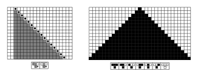
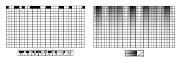
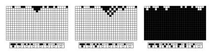
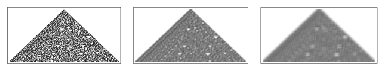
<!-- ORIGINAL_FIGURES page=0369 end -->

图注：从单点出发的均匀增长，是空间均匀性可以产生的一种直接方式，这里用一个移动自动机和一个元胞自动机说明。

另一种机制是，系统的每一部分可以完全独立地演化到同一状态，如下图所示。

图注：如果系统中的每个元素独立演化到同一状态，那么空间均匀性几乎可以平凡地实现。

稍微不那么直接的机制如下图所示。这里系统中的不同元素确实相互作用，但结果仍然是所有元素都演化到同一状态。

图注：第 1 类元胞自动机表现出演化到均匀状态，如第 6 章所讨论。

到目前为止，我提到的所有均匀性机制，都涉及在某种意义上每个层面都简单的行为。但在自然中，均匀性往往似乎与相当复杂的微观行为相关联。最常见的情况是，在小尺度上系统表现出随机性，但在较大尺度上这种随机性被平均掉，留下表观均匀性，如下图所示。

图注：小尺度随机性被平均掉会产生表观均匀性，这里以规则 30 图案说明。

---

[[PDF page 370]]

<!-- ORIGINAL_FIGURES page=0370 start -->
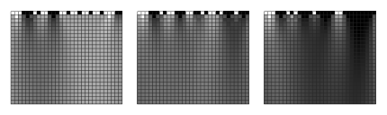
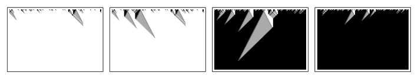
<!-- ORIGINAL_FIGURES page=0370 end -->

均匀行为常常相当独立于初始条件或系统的其他输入。但有时不同输入会得到不同均匀行为。

发生这种情况的一种方式如下图所示：系统守恒某个量，例如黑色总密度，而该量最终通过系统演化均匀分布到整个系统。

图注：当每个元胞在每一步的灰度为其前身和两个邻居灰度的平均值时，黑色总量守恒，但最终会均匀扩散到整个系统中。

另一种可能是，系统总是演化到某些特定均匀相，但选择哪个相可能取决于某个量的总值，如下图所示。

图注：使用不同初始条件时，第 339 页的这个元胞自动机可以演化到均匀白色或均匀黑色。这类离散转变在一维中比其他地方稍不常见。

约束是均匀性的另一个基础。作为平凡例子，在一行黑色或白色元胞中，若约束为每个元胞应与其两个邻居颜色相同，那么它立即意味着整行必须是均匀黑色或均匀白色。

在均匀性之外，重复可以被视为下一种最简单的行为形式。时间上的重复只对应于一个系统反复回到某个特定状态。

这可以在例如一个系统的行为实际上沿某条闭合曲线（如圆）运动并总会回到同一点时发生。一般而言，在任何具有确定规则且只访问有限数量状态的系统中，正如第 255 页所讨论并在上方图中说明的，系统行为最终必然重复。

---

[[PDF page 371]]

<!-- ORIGINAL_FIGURES page=0371 start -->
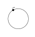
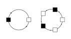
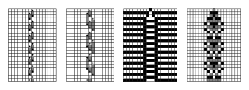
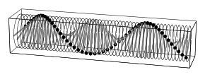
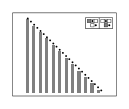
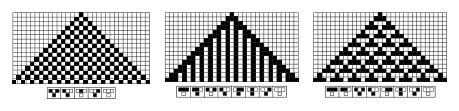
<!-- ORIGINAL_FIGURES page=0371 end -->

图注：当一个系统实际上沿着一条闭合曲线运动时，无论是字面上的空间曲线，还是它所访问状态的曲线，其行为都会在时间上重复。

有些情形中，系统基本结构也许只允许有限数量的可能状态。但在其他情形中，发生的是系统的实际演化从未到达超过有限数量的状态。

仅观察底层规则，常常很难预测是否会如此。但在元胞自动机这类系统中，其典型原因只是最终效应永远不会扩散超过有限区域，如下图例子所示。

图注：移动自动机和元胞自动机中的行为例子，它们保持局限于有限区域，因此最终总会重复。

只要有时间上的重复，当系统中系统性重复的元素在空间中移动时，就会随之出现空间上的重复。下面图中显示两个情形，第二幅图说明传统物理中常见的波概念。

图注：时间上的重复直接导致空间上重复的例子。第二幅图显示标准波动运动。

从简单种子出发的增长，也很容易导致空间和时间中的重复，如下图所示。

图注：若干元胞自动机，其中空间和时间中的重复图案由简单种子演化生成。

---

[[PDF page 372]]

<!-- ORIGINAL_FIGURES page=0372 start -->
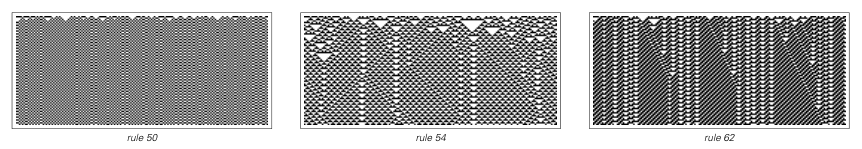
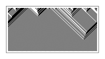
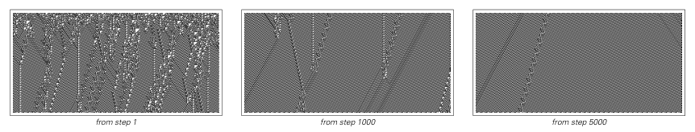
<!-- ORIGINAL_FIGURES page=0372 end -->

但随机初始条件又如何？时间上的重复仍然容易实现，例如只要系统的不同部分独立行为即可。但空间上的重复稍微更难实现。因为即使形成局部重复区域，它们也需要某种机制结合在一起。

而不同区域之间的墙往往最终不够可动，无法让这种事情发生，如下面例子所示。

图注：若干元胞自动机，其中重复行为区域形成，但这些区域之间的墙通常会永远保留。

不过，当然也存在一些情形，在一维中，尤其在更高维中，不同区域确实会结合，并实现精确重复。有时这发生得很快，如左图所示。

图注：一个元胞自动机（规则 184），其中区域迅速结合，使整个系统在空间中重复。

但在其他情形中，这只会相当缓慢地发生。一个例子是规则 110，其中会形成空间周期为 14、时间周期为 7 的重复区域；但如下图所示，分隔这些区域的局部结构需要很长时间才会消失。

图注：规则 110 从随机初始条件开始的行为。重复行为区域会形成；在大多数情形中，随着分隔它们的局部结构消失，这些区域会逐渐结合。

正如我们在第 5 章末尾看到的，许多基于约束的系统原则上也会产生重复，虽然根据上一节讨论，这似乎很少是对自然中实际所见重复的良好解释。

---

[[PDF page 373]]

<!-- ORIGINAL_FIGURES page=0373 start -->
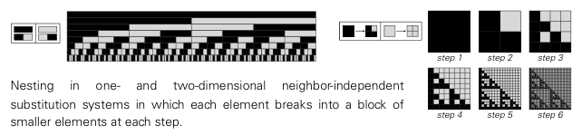
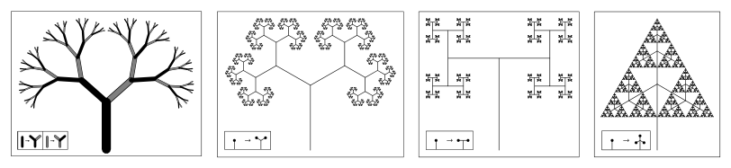
<!-- ORIGINAL_FIGURES page=0373 end -->

除了均匀和重复之外，本书中常遇到的另一类简单行为是嵌套。和均匀、重复一样，嵌套似乎也有几种相当不同的产生方式。

可以通过按某条固定规则分裂成越来越小的元素来定义嵌套。如下图所示，在替换系统中，每个元素连续显式分裂成越来越小的元素块，会非常直接地生成嵌套图案。

图注：一维和二维的与邻居无关替换系统中的嵌套，其中每个元素在每一步分裂为一个较小元素块。

一个本质上等价的过程，是每个元素分枝为越来越小的元素，并最终形成树状结构，如下图所示。

图注：由简单分枝过程生成的嵌套图案。（比较第 406 页。）

那么，是什么使自然中的系统以这种方式运作？部分原因是，相同基本规则必须不依赖于物理尺度而适用。但这本身完全也可以与各种均匀或螺旋增长相容，并不意味着会出现我们通常所说的嵌套。事实上，要得到嵌套，似乎还需要某种类型的离散分裂或分枝过程，其中一个单独元素会产生若干不同元素。

---

[[PDF page 374]]

<!-- ORIGINAL_FIGURES page=0374 start -->
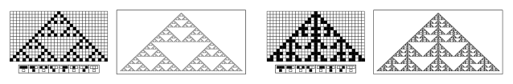
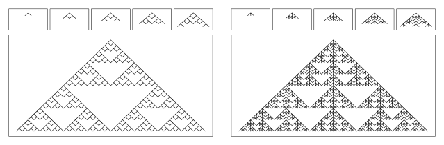
<!-- ORIGINAL_FIGURES page=0374 end -->

与许多数学系统相关的一个稍微类似的嵌套来源，是连续数字的数字位序列所形成的嵌套图案，如第 117 页所示。

但一般而言，嵌套并不一定只来自较大元素被分解成较小元素；正如本书中发现的，它也可以在较大元素由较小元素构建起来时出现。事实上，我怀疑这在自然中是更常见的来源。

作为例子，下图显示，从单个黑色元胞开始，然后遵循简单加性元胞自动机规则，怎样构建出具有越来越大特征的嵌套图案。

图注：规则 90 和规则 150 加性元胞自动机从单个黑色元胞开始演化而构建的嵌套图案。

结果表明，完全相同的图案也可以由下图所示过程产生，其中新分枝按规则间隔形成，并在任意一对分枝相撞时湮灭。

图注：由过程得到的嵌套图案，其中两个或三个分枝按规则间隔形成，并在任意一对分枝相撞时湮灭。

随机初始条件又如何？嵌套也能从中出现吗？结果表明可以。基本机制通常是某种元素的逐步湮灭，这些元素最初随机分布。

---

[[PDF page 375]]

<!-- ORIGINAL_FIGURES page=0375 start -->
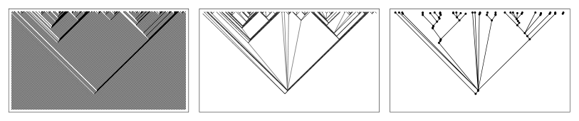
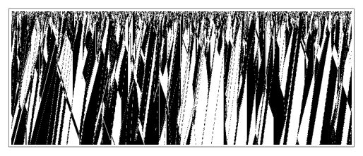
<!-- ORIGINAL_FIGURES page=0375 end -->

下面图中显示一个例子，基于规则 184 元胞自动机。从随机初始条件开始，这条规则产生一组条纹；这些条纹一旦相遇就会湮灭，导致一系列越来越大的嵌套区域。

图注：规则 184 从随机初始条件开始生成嵌套图案。该图案由一组条纹组成，第二幅图中加以突出显示，它们形成第三幅图中所示树状结构。所用初始条件具有完全相等数量的黑色和白色元胞，使所有条纹最终都会湮灭。

如图所示，这些区域形成的图案对应于一棵随机树，它从最小分枝构建起来，非常像河流从其支流构建起来的方式。

当初始条件中包含恰好相同数量的黑白元胞时，规则 184 中的嵌套最容易看见，因为左右条纹数量恰好平衡，所有条纹最终都会湮灭。但即使初始条件使某些条纹存活，湮灭的那些条纹仍会形成嵌套区域。事实上，基本上在任何系统中，只要有一些区域相当独立地增长，然后逐渐合并，就会看到同样基本的整体嵌套。

作为例子，下图显示规则 110 元胞自动机从随机初始条件演化。图中只采样每个 `14 x 7` 元胞块中的第一个元胞，使每个重复行为区域以均匀颜色突出显示。

图注：规则 110 从随机初始条件演化的高度压缩表示，其中只采样每个 `14 x 7` 块中的第一个元胞。

---

[[PDF page 376]]

<!-- ORIGINAL_FIGURES page=0376 start -->
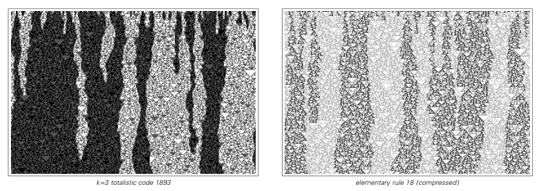
<!-- ORIGINAL_FIGURES page=0376 end -->

在分隔这些重复行为区域的各种局部结构的具体行为中，存在各种复杂性。但图像提示，在某个粗略整体层面上，这些结构逐渐倾向于彼此湮灭，并在此过程中形成近似嵌套图案。

结果表明，这个基本过程并不局限于产生简单均匀或重复区域的系统。下面图中例如展示了区域内部行为相当随机的情形。

图注：涉及包含表观随机性的区域的例子。第二幅图中，每个显示元素代表原始元胞的一个 `2 x 2` 块。两种情形中，区域之间的边界似乎遵循随机游走，并在相遇时湮灭，从而形成嵌套的整体图案。

这些区域的边界现在不再沿简单直线运动，而是执行看似随机的游走。但它们一旦相遇就会湮灭这一事实，再次倾向于导致整体嵌套的行为图案。

那么，基于约束的系统又如何？它们也能导致嵌套吗？第 5 章中我显示它们可以。但我发现，虽然至少原则上均匀和重复都能相当容易地由约束迫使出现，嵌套通常却不能。

起初，人们也许会以为每种简单行为类型只有一种确定机制。但本节看到的是，事实上通常存在几种表面上相当不同的可能机制。

---

[[PDF page 377]]

通常，可以在任何特定行为类型的各种机制之间识别出共同特征。但这些共同特征往往最终只是某种特定行为正在被产生这一事实的必然后果。

因此，例如人们也许会注意到，大多数嵌套机制在某个层面上都可以被看作涉及层级，其中较高组成部分影响较低组成部分，而反过来不成立。但从某种意义上说，这一观察不过是对嵌套本身一个性质的重述。

所以，到最后，人们确实可以把本节讨论的大多数机制视为在某种意义上真正不同。然而正如我们看到的，它们全都可以由相当简单的程序捕捉。在第 12 章中，我将讨论这与最终似乎只有很少几种根本不同的整体行为类型这一事实之间有什么关系。
