# 第 8 章：对日常系统的启示

[[PDF page 379]]

<!-- ORIGINAL_FIGURES page=0379 start -->
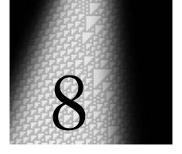
<!-- ORIGINAL_FIGURES page=0379 end -->

# 对日常系统的启示

## 建模问题

在上一章中，我说明了自然界常见的各种一般行为形式，怎样可以通过简单程序的思路来理解。本章我要做的是把我们已经学到的东西拿来，考察自然界以及其他领域中一系列相当具体的系统，并在每一种情况下讨论它们行为中最明显的特征是怎样产生的。

我所考察的大多数系统，在日常生活中都相当熟悉；一开始，人们或许会以为，它们行为的起源早就已经被发现了。但事实上，在几乎所有情况下，我们知道的其实都相当少；而且在基本层面上，过去观察到的行为常常显得颇为神秘。不过我们将在本章发现，只要用简单程序的方式来思考，这些行为的基本起源就会少很多神秘色彩。

开头就应该说明，我的目的并不是解释我所讨论的所有各类系统的每一个细节。事实上，哪怕只想对其中一种系统做到这一点，也很可能至少还要再写整整一本书，甚至远不止此。

但我确实想做的是，辨认出那些负责每一种系统行为中最明显特征的基本机制。举例说，我想从一般意义上理解，雪花为什么会具有它们那样精巧的形状。

---

[[PDF page 380]]

但我并不关心某些细节，例如雪花枝臂尖端的精确曲率到底是多少。

在大多数情况下，我采用的基本办法是，试着为每一种系统构造尽可能简单的模型。按传统科学的直觉，我们也许会认为，如果一个系统的行为是复杂的，那么它的任何模型也必然必须以某种方式相应地复杂。

但本书的核心发现之一正是：事实并非如此。至少当人们用程序而不是传统数学方程来思考时，即便基于极其简单底层规则的模型，也可以产生高度复杂的行为。事实上，在本章中，我将构造一整串极其简单的模型，而它们在复现许多日常自然系统及其他系统的复杂行为主要特征方面，都表现得相当好。

任何模型归根结底都是一种理想化：它只捕捉系统的某些方面，而忽略其他方面。对于我在这里考察的每一种系统，我所讨论的模型当然都有许多细节并未处理。但在多数情况下，过去实际上从来没有真正能够复现我们所见行为中最明显特征的模型。所以，我所讨论的模型能给出哪怕只是大致看起来正确的图像，本身就已经是重大进展。

在许多传统科学领域中，任何能够产生这种图像的模型都会立刻被认为是非常成功的。但在某些领域中，尤其是在传统数学被最广泛使用的领域中，人们逐渐相信，从某种意义上说，检验一个模型的唯一真正客观或科学的方法，是查看某些相当具体的细节。

最常见的做法，是从一个系统的观察行为中抽取出一小组数字，然后看模型能以多高的精度复现这些数字。对于总体行为相当简单的系统，这种做法的确往往相当有效。但一旦总体行为是复杂的，就不可能只用少数几个数字完整刻画它。

---

[[PDF page 381]]

事实上，在传统科学文献中，我相当常见到一些模型被很严肃地对待，仅仅因为它们可以被调到能复现少数几个特定数字；但只要把它们所蕴含的总体行为实际算出来，就会看出它们完全错误。按照我的经验，评估一个模型最好的第一步远不是看数字或其他细节，而只是用自己的眼睛去看，把系统的总体图像同模型给出的图像相比较。

如果几乎没有相似之处，那么可以合理地断定模型是错的。但如果有一些相似也有一些差异，就必须判断这些差异是否关键。很多时候，这至少部分取决于人们打算如何使用这个模型。不过，只要判断得当，通常不难通过观察总体行为获得某种感觉：某个特定模型是否走在正确方向上。

通常，如果一个模型最终几乎和它声称要描述的现象一样复杂，那并不是一个好迹象。如果每当有新观察出现，模型就必须不断打补丁来解释它们，那就是更糟的迹象。

相反，如果一个模型很简单，却仍然能哪怕相当粗略地复现某个特定系统的大量特征，通常就是好迹象。如果这些特征中有相当一部分，是模型最初构造时还不知道的，或者至少没有明确考虑过的，那就是更好的迹象。

人们或许会以为，最后总可以通过明确查看一个系统中足够低层的底层元素，并把它们与模型中的元素相比较，来判断模型是否正确。但必须认识到，模型始终只应该提供一个系统的抽象表示，并没有任何东西要求这种表示中的各种元素必须同系统本身的元素有任何直接对应。

例如，一个传统数学模型可以说，行星的运动由一组微分方程支配。但人们并不会认为，这意味着行星本身内部包含一个明确求解这些方程的装置。真正的想法是：

---

[[PDF page 382]]

这些方程为实际决定行星运动的物理效应提供了某种抽象表示。

然而，当我同其他科学家讨论本章这种模型时，经常会在这些问题上遇到很大的混淆。也许这是因为，在简单程序中，人们太容易看见底层元素以及支配它们的规则。但我已经被问过无数次：基于简单程序的模型怎么可能是正确的？因为即使它们能成功复现某个系统的行为，人们也明明可以看到，系统本身并不是真的由离散元胞组成，更不是这些元胞真的遵循某个元胞自动机的规则。

但关键正是：任何模型所应该做的全部事情，无论它是元胞自动机、微分方程，还是别的什么，都是为那些在决定系统行为中重要的效应提供一种抽象表示。在这些效应以下的层面，模型并没有理由必须实际像系统本身那样运行。

例如，可以很容易建立一个元胞自动机，用来表示一种效应：在雪花表面刚刚添加了新物质的位置附近，生长会受到抑制。但在元胞自动机中，这种效应只是由某些元胞构型的一条规则来实现，并不需要这条规则以任何方式对应于水分子的详细动力学。

因此，系统中的元素同模型中的元素之间未必需要有任何对应；不过，人们也许会想象，在效应之间仍然必须存在某种完整对应。但模型的全部意义就在于给出系统的简化表示，使人们感兴趣的那些特征可以容易地被推出或理解。而实现这一点的唯一方法，就是只挑出某些重要效应，并忽略其他全部效应。

事实上，在实践中，构造模型的主要挑战恰恰在于辨认哪些效应重要到必须保留，哪些效应并非如此。在某些简单情形中，有时可以建立实验，基本上隔离出每一个单独效应，并明确测量它的重要性。但

---

[[PDF page 383]]

在大多数情况下，证明某一组特定效应确实是重要效应的最佳证据，最终只是基于这些效应的模型获得成功。

我在本章讨论的系统大多足够复杂，以至于至少有几十种相当不同的效应可能会对它们的总体行为有所贡献。但在试图构造尽可能简单的模型时，我总是只挑出少数几个我认为最重要的效应。不可避免地，总会有一些现象依赖于其他效应，因此不会被我考虑的模型正确复现。所以，如果这些现象对某个具体应用至关重要，那么就别无选择，只能为那个应用扩展模型。

但只要目标是理解负责总体行为最明显特征的基本机制，就必须让底层模型尽可能简单。因为即便只加上少数扩展，模型通常也会变得复杂到几乎不可能分辨某个特定行为特征究竟来自哪里。

多年来，我曾观察过大约十几个重要模型的发展过程，这些模型是我为具有复杂行为的各种系统构造的，尽管多数情况下从未发表。我的原始模型通常极其简单。人们最初的反应通常是非常惊讶，惊讶于如此简单的模型竟然能产生哪怕大致具有正确特征的行为。但熟悉相关具体系统类型的专家，通常很快就会指出，我的模型有许多细节没有正确复现。

接着，在一段最初时期内，人们往往说这些模型太简化，不值得考虑；之后，各种扩展开始被加入，以试图捕捉更多效应和更多细节。结果几年之后，我原来的模型已经演化成几乎难以辨认的复杂模型。但这些模型后来常常在许多实际目的上取得巨大成功。到那时，在成功已经确立之后，有时人们又会更仔细地考察这些模型，并

---

[[PDF page 384]]

发现许多加入的扩展其实完全没有必要；于是最终，在也许十年过去之后，人们才认识到，同我最初提出的简单模型等价的模型的确运作得相当好。

人们也许会以为，在传统科学文献中，新模型会不断被提出。但事实上，几乎每个科学领域中绝大多数工作，涉及的都不是发展新模型，而是积累实验数据，或者推导既有模型的后果。

而在那些已经被使用的模型中，几乎所有超出纯粹描述层面的模型，最终都以非常相似的方式来表述：通常是一组数学方程。可是正如我在本书一开始就强调的那样，我相信这正是过去很难为行为复杂的系统找到可用模型的主要原因。事实上，本书的核心思想之一就是超越数学方程，考虑基于程序的模型，而程序实际上可以包含任何类型的规则。

在许多方面，使用程序比使用方程更容易。因为一旦有了一个程序，人们总能通过运行它来发现它会有什么行为。但对一个方程而言，人们也许需要进行复杂的数学分析，才能发现它会导致什么行为。基于方程的模型常常以纯粹隐式的形式陈述，这并不会有所帮助；因为它们不像程序那样给出一个实际步骤来决定系统将如何行为，而只是给出行为必须满足的约束，对于究竟有什么行为会实际满足这些约束则不提供特别的指引。

而且，即便基于方程的模型能够写成显式形式，它们通常仍然包含连续变量，这些变量例如无法由实际计算机直接处理。当它们的总体行为足够简单时，有时可以找到描述这种行为的完整数学公式。但只要行为更复杂，通常就别无选择，只能使用某种近似。在过去

---

[[PDF page 385]]

<!-- ORIGINAL_FIGURES page=0385 start -->
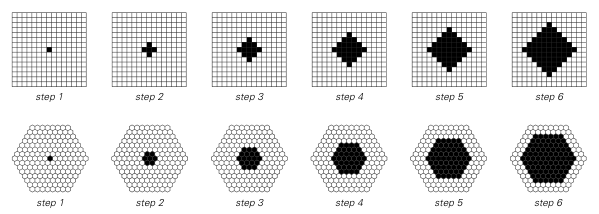
<!-- ORIGINAL_FIGURES page=0385 end -->

五十年左右，尽管人们做了许多尝试，却几乎从来无法证明由这些近似得到的结果，甚至能够正确复现原来的数学方程所蕴含的东西。

然而，基于简单程序的模型没有这类问题。因为基本上所有这些模型都只涉及离散元素，而这些元素可以由实际计算机相当直接地处理。这意味着，原则上推导出这些模型至少最基本的后果会变得很直接；在实践中也常常非常高效。

我在本章讨论的许多模型，实际上基于的是本书任何地方所考察过的最简单的程序类型。但正如我们将会看到的，即便这些模型，也似乎已经足以捕捉来自自然界及其他领域的范围惊人之广的系统行为；我相信，这无疑确立了用简单程序来思考的实际价值。

## 晶体的生长

在微观层面，晶体由规则排列的原子阵列组成，其布局很像元胞自动机中的元胞。当液体或气体被冷却到其凝固点以下时，晶体就会形成。晶体总是从一个晶种开始，常常是一个异物，例如一粒尘埃，然后通过逐渐向其表面添加更多原子而生长。

作为这个过程的一种理想化，可以考虑一个元胞自动机，其中黑色元胞表示固体区域，白色元胞表示液体或气体区域。如果假定任何与黑色元胞相邻的元胞都会在下一步自身变成黑色，就会得到下面所示的生长图案。

图：规则规定，只要某个元胞的任一邻居已经是黑色，该元胞就应变成黑色的元胞自动机。所产生的图案具有简单的晶面形式，直接反映了底层元胞格子的结构。

---

[[PDF page 386]]

<!-- ORIGINAL_FIGURES page=0386 start -->
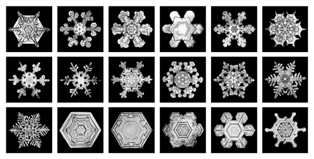
<!-- ORIGINAL_FIGURES page=0386 end -->

每一种情况下产生的形状都非常简单，最终只是一些平坦晶面以一种直接反映底层元胞格子结构的方式排列而成。自然界中的许多晶体，包括例如大多数宝石，也具有类似简单的晶面形态。但也有些晶体并非如此。一个著名例子是，雪花可以具有高度精巧的形态，如下图所示。

图：雪花典型形态的例子。注意不同图片的比例尺并不相同。

在很好的近似下，一片雪花中的所有分子最终都位于一个简单的六角网格上。但在雪花实际生长过程中，这个网格的每一个可能部分并不会都被冰填满。负责这一点的主要效应是：每当一块冰被添加到雪花上，就会释放出一些热量，而这又倾向于抑制附近继续添加更多冰块。

可以通过一个元胞自动机捕捉这种基本效应：规则规定，如果元胞恰好有一个黑色邻居，它就变成黑色；但如果它有一个以上黑色邻居，它就保持白色。对页上的图片显示了这种元胞自动机演化的一系列步骤。尽管其底层规则十分简单，我们看到它所产生的图案同真实雪花中看到的图案惊人地相似。

从元胞自动机的行为出发，可以立刻对雪花作出各种预测。例如，

---

[[PDF page 387]]

<!-- ORIGINAL_FIGURES page=0387 start -->
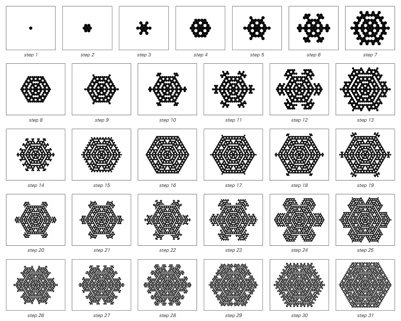
<!-- ORIGINAL_FIGURES page=0387 end -->

图：一个六角网格上的元胞自动机的演化，其中每个元胞只要在前一步恰好有一个邻居为黑色，就会变成黑色。这条规则捕捉了雪花中发生的基本生长抑制效应。在不同步骤得到的结果图案，看起来同许多真实雪花极为相似。

人们会预期，在某一片雪花的生长过程中，树状形状和晶面形状应当交替出现，因为新的枝条会生长出来，随后又彼此碰撞。

如果观察真实雪花，一切迹象都表明实际发生的正是这种情况。事实上，总体而言，上面显示的这个简单元胞自动机似乎非常成功地复现了雪花生长中各种明显特征。但不可避免的是，它没有捕捉许多细节。事实上，对页上的一些照片最终并不很像上面演化中任何一步产生的图案。

---

[[PDF page 388]]

但事实证明，只要试图建立更完整的模型，立刻就会出现数量巨大的问题，而且很难知道哪些真的重要，哪些并不重要。在基本层面上，人们知道雪花是在云中的水蒸气冻结成冰时形成的；一片给定雪花的结构由它生长环境中的温度和湿度，以及它在那里停留的时间决定。

上面提到的生长抑制来自这样一个事实：当水或水蒸气冻结成冰时，会释放一定量的潜热，这正好是一个反向现象：当冰被加热到 0°C 时，它仍然需要吸收热量才会真正融化。

但还有许多其他效应。例如，凝固温度实际上会随表面曲率而变化。热传导速率在六角网格的不同方向上不同。雪花周围的水蒸气中会形成对流。晶体在生长时会产生机械应力。

标准科学文献中有各种雪花生长模型，通常集中于其中一两种效应。但在大多数情况下，这些模型在某个基本层面上都相当不成功。因为它们基于传统数学方程，所以往往只能处理相当于比较简单、平滑的形状，因此从来没有真正能够处理真实雪花中那么醒目的精巧结构。

但在基于简单程序的模型中，例如元胞自动机，处理更复杂的形状并不存在问题；事实上，正如我们已经看到的，复现真实雪花中出现的总体行为基本特征其实相当容易。

那么其他类型的晶体又如何呢？

自然界中可以看到多种形态。对页上的图片表明，即便在规则非常简单的元胞自动机中也是如此。事实上，就像在自然界中一样，行为的多样性令人瞩目。有时会产生简单的晶面形态。但在其他情况下，会出现针状形态、树状或枝晶形态，以及圆润形态，还有在许多方面显得随机的形态。

---

[[PDF page 389]]

<!-- ORIGINAL_FIGURES page=0389 start -->
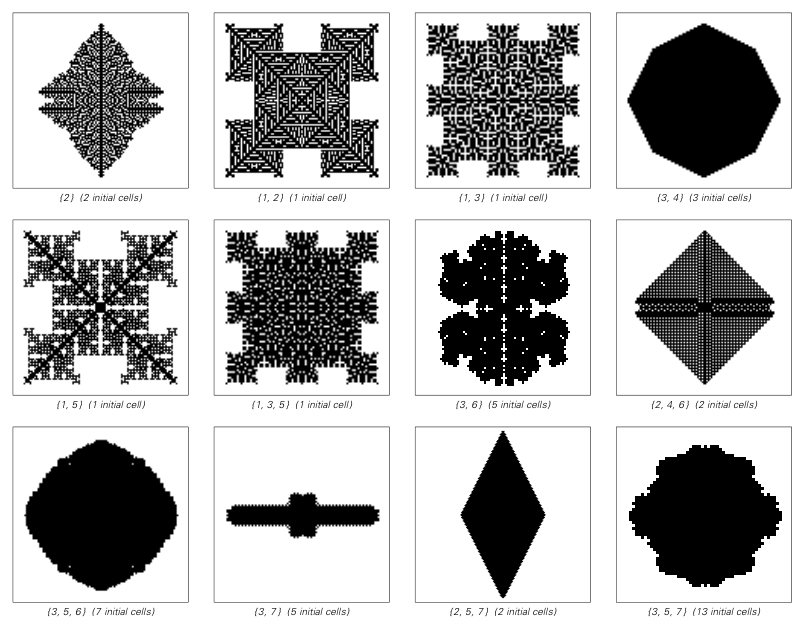
<!-- ORIGINAL_FIGURES page=0389 end -->

图：这些规则在每种情况下都规定：如果一个方形网格上的某个元胞在前一步有指定数量的邻居（包括对角邻居）为黑色，它就变成黑色。这些规则使得一个元胞一旦变成黑色，也就是对应于固体，就永远不会再变回白色。在每一种情况下，都使用了指定长度的一行初始黑色元胞。

这些最后一种形态的出现，一开始尤其令人惊讶。因为人们也许会假定，像晶体这种东西最终形状中的任何表观随机性，都必然总是来自其原始晶种中的随机性，或者来自其生长环境中的随机性。

但事实上，正如上面的图片所显示的，并且也正如我们在本书中已经多次看到的，随机性也可能仅仅通过简单底层规则的应用而内在地产生。与人们一贯假定的相反，我怀疑，我们有时在晶体材料形成的形状中看到的表观随机性，实际上常常就是这样产生的。

---

[[PDF page 390]]

## 材料的断裂

在日常生活中，产生随机性最熟悉的方式之一就是打破一个固体物体。因为尽管细节会随材料不同而变化，但几乎普遍如此：实际发生断裂的线或面显得粗糙，而且在许多方面是随机的。

那么这种随机性的起源是什么？一开始，人们也许会认为，它必定反映了材料内部小尺度的不规则性。确实，对于由许多分离晶体或颗粒组成的材料，断裂往往倾向于沿着这些元素之间的边界发生。

但如果取一个例如完美的单晶，比如标准的高纯工业硅晶体，并把它打断，会发生什么？答案是，除了少数特殊情形，得到的断裂图案看起来同其他材料中一样随机。

这说明，无论负责这种随机性的基本机制是什么，它都不可能依赖于特定材料的细节。事实上，几乎无法区分的断裂图案既出现在微观尺度上，也出现在尺度为公里量级的地质系统中，这也是一个线索，表明一定有更一般的机制在起作用。

那么这种机制可能是什么？

当一种固体材料断裂时，典型发生的是先形成一条裂纹，通常在材料边缘，然后这条裂纹扩展。

---

[[PDF page 391]]

<!-- ORIGINAL_FIGURES page=0391 start -->
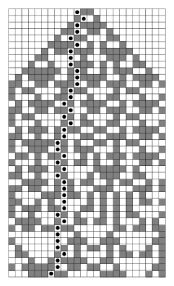
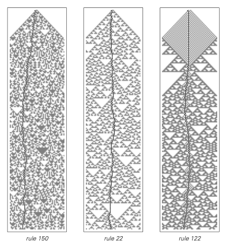
<!-- ORIGINAL_FIGURES page=0391 end -->

从手持物体到工程结构再到地震，各类系统中的经验表明，裂纹开始形成可能需要一些时间，但一旦开始，它往往会快速而剧烈地移动，通常还会在过程中产生大量噪声。

可以把固体的组成部分，无论是原子、分子还是岩石块层面，看作由某些力束缚在一起，这些力的作用有点像弹簧。当裂纹穿过固体传播时，这实际上会在这些弹簧中建立一种复杂的振动图案。裂纹的路径继而由哪些弹簧被拉伸到断裂程度来决定。

有许多因素会影响固体中位移和振动的细节。但作为粗略近似，也许可以假定固体的每个元素要么发生位移，要么不发生位移，而相邻元素的位移按某种确定规则相互作用，例如一条简单元胞自动机规则。

下面的图片显示了这种简单模型给出的行为。尽管模型中没有以任何方式明确加入随机性，产生出来的裂纹路径却仍然显得相当随机。

图：一个非常简单的断裂元胞自动机模型。在每一步中，每个元胞的颜色大致表示固体中一个元素的位移，并根据一条元胞自动机规则更新。黑点表示裂纹的位置，它根据相邻元胞的位移从一个元胞移动到另一个元胞，并在每一步把它到达的元胞设为白色。尽管没有从外部加入随机性，这个模型产生的裂纹路径在很大程度上仍显得随机。物理实验中有一些证据表明，裂纹周围的位错可以形成类似上面灰白背景的图案。

真实材料当然有许多方面是这个模型远远无法捕捉的。但我仍然怀疑，即便使用更真实的特定材料模型，负责随机性的基本机制仍会同这里显示的极其简单的模型中的机制非常相似。

---

[[PDF page 392]]

## 流体流动

自然界中有大量醒目的现象涉及空气和水等流体的流动，如对页所示。一个典型情形是水绕过固体物体流动时所看到的情况。在速度足够慢时，水实际上只是平滑地滑过物体周围，产生非常简单的层流图案。但在更高速度下，物体后方开始出现一片慢速水域，水旋入这一区域时形成一对涡旋。

随着速度增加，这些涡旋逐渐变得更细长。然后，当达到某个临界速度时，涡旋实际上开始脱落，并被带向下游。但每当一个涡旋脱落，另一个涡旋就开始形成，于是最终在物体后方的尾流中会看到一整列涡旋。

起初，这些涡旋排列得非常规则。但随着流速进一步增加，缺陷开始出现，最初是在远离物体的后方，最终则遍布整个尾流。即使在最高速度下，某种总体规则性仍然保留。但叠加在这种规则性之上的，是各种精细而看似相当随机的行为。

这只是流体湍流这一极为广泛现象的一个例子。正如对页上的图片所表明的，也正如普通经验所提示的，几乎任何时候，只要让流体快速流动，它往往就会形成复杂图案，而且这些图案在许多方面看起来是随机的。

那么从根本上说，为什么会发生这种情况？

以数学方程为基础的传统科学，从来没有真正能够提供任何令人信服的底层解释。但我发现，即便非常简单的程序，在某种意义上也很容易得到复杂而看似随机的行为；由此，流体湍流现象立刻开始显得不那么令人惊讶。

可是，简单程序真的能复现我们在流体中看到的特定种类的行为吗？在微观层面，物理流体由大量运动并相互碰撞的分子组成。因此，作为一种简单理想化，可以考虑让大量粒子在固定离散网格上运动，并经历由类似元胞自动机的简单规则支配的碰撞。

---

[[PDF page 393]]

<!-- ORIGINAL_FIGURES page=0393 start -->
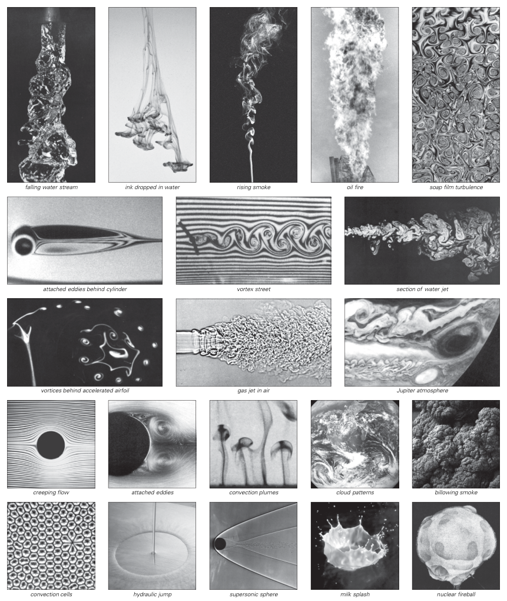
<!-- ORIGINAL_FIGURES page=0393 end -->

图：各种流体流动中生成的典型图案例子。注意，看似随机的湍流频繁出现。

---

[[PDF page 394]]

<!-- ORIGINAL_FIGURES page=0394 start -->
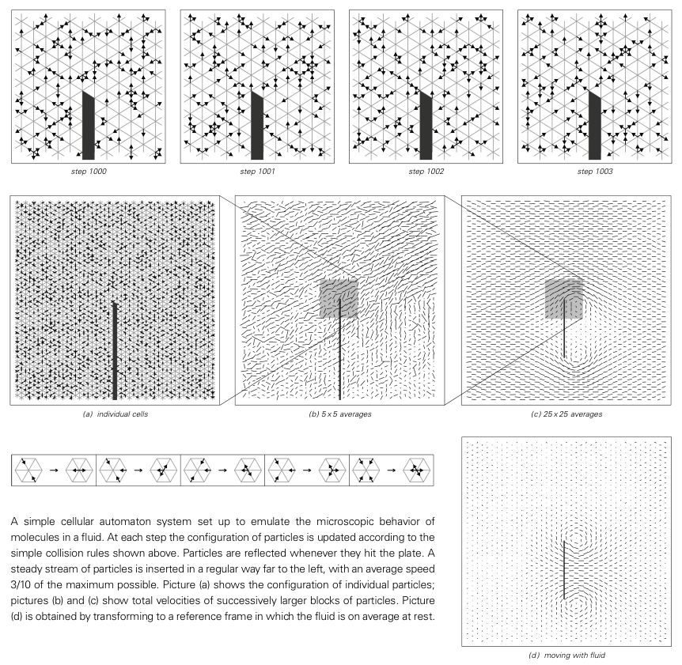
<!-- ORIGINAL_FIGURES page=0394 end -->

下面的图片给出了这样一个系统的例子。在最上面一行图片中，以及图片 (a) 中，人们看到的只是一些离散粒子弹来弹去。但如果拉远观察，并查看越来越大的粒子块的平均运动，如图片 (b) 和 (c) 中所示，那么开始显现出来的就是一种似乎平滑而连续的行为，正像我们预期在流体中看到的那样。

图：一个用来模拟流体中分子微观行为的简单元胞自动机系统。在每一步，粒子的构型按照上方所示的简单碰撞规则更新。粒子碰到板时会被反射。一个稳定粒子流以规则方式在很远的左侧注入，其平均速度为最大可能速度的 3/10。图片 (a) 显示单个粒子的构型；图片 (b) 和 (c) 显示逐渐更大粒子块的总速度，分别为 5 x 5 和 25 x 25 平均。图片 (d) 是转换到流体平均静止的参考系后得到的。

---

[[PDF page 395]]

这种情况发生的原因，同真实流体中的原因完全一样；就此而言，也同我们在第七章看到的各种例子一样：尽管在底层层面系统由离散粒子组成，但这些粒子微观运动细节中的有效随机性，使得它们的大尺度平均行为看起来平滑而连续。

我们从物理实验知道，空气、水以及所有其他普通流体的流动特性几乎完全相同。然而在底层层面，这些不同流体由性质非常不同的不同种分子组成。但不知怎的，只要查看大尺度的流体式行为，这种微观结构的细节就被冲洗掉了。

在本书中，我们已经多次看到不同系统可以产生非常相同的总体行为，尽管其底层规则的细节相当不同。但在流体这类系统的特定情况下，事实证明，只要粒子数和动量等某些物理量守恒，那么只要存在足够的微观随机性，几乎不可避免地就会得到相同的总体流体行为；我将在下一章讨论这一点。

这意味着，要复现物理流体的观察性质，并不需要建立一个包含真实分子的模型：对页上那些高度理想化的粒子，也应当会产生本质上相同的总体流体行为。

事实上，在图片 (c) 和 (d) 中，已经可以看到一对涡旋的形成，正如第 377 页上的一幅图片中那样。

那么如果增加流速会发生什么？会看到第 377 页上的同类现象吗？下一页的图片表明，确实会。在某个临界速度以下，会形成完全规则的涡旋阵列。但在下一页图片所使用的速度下，涡旋阵列已经开始显示随机的不规则性，正像真实流体湍流中相关的那些不规则性。

那么这种随机性来自哪里？

在过去几十年中，人们普遍相信，湍流流体中的随机性必定以某种方式与

---

[[PDF page 396]]

<!-- ORIGINAL_FIGURES page=0396 start -->
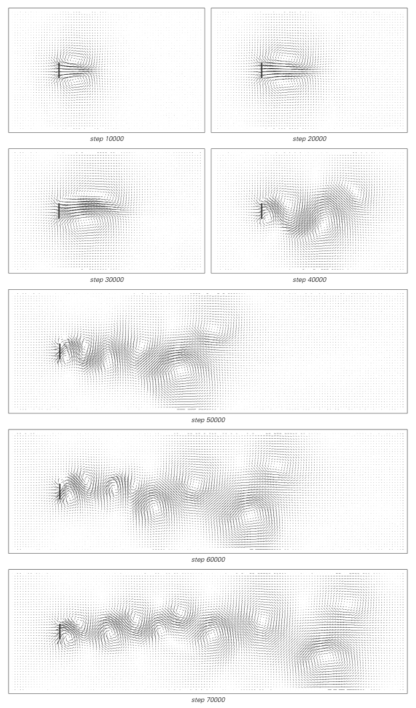
<!-- ORIGINAL_FIGURES page=0396 end -->

对初始条件的敏感依赖有关，也就是与我们在第四章讨论过的混沌现象有关。

图：前一页所示元胞自动机系统的一个更大例子。每幅图中共有 3000 万个底层元胞。所画的单个速度矢量对应于对 20 x 20 元胞块的平均。粒子以规则方式从左端注入，以维持约等于最大可能速度 0.4 的总体流速。为了让流动图案更容易看清，所示速度经过变换，使流体平均静止而板在运动。底层粒子密度大约为每个元胞 1 个，或最大可能密度的 1/6，这个密度大致使流体黏度最小。所示流动的雷诺数约为 100。它同实际流体流动实验结果的一致性令人瞩目。

---

[[PDF page 397]]

当然，确有一些数学方程表现出这种现象，但通常被研究的那些方程，没有一个同流体流动的真实描述有密切联系。

而在对页的模型中，事实证明，至少在总体流体行为层面，基本不存在对初始条件的敏感依赖。如果查看单个粒子，那么即使改变一个粒子的位置，通常也会产生迅速扩散的影响。但如果转而查看许多粒子的平均行为，这类影响就完全被冲洗掉了。事实上，就大尺度流体行为而言，几乎在所有情况下，不同详细初始条件导致的结果之间似乎都没有可辨别差异。

那么是否曾经存在对初始条件的敏感依赖呢？

大概确实存在某些情形，其中存在某种微妙平衡，例如第一个涡旋究竟从物体的上方还是下方脱落，在这些情形中，初始条件的微小变化可以有显著影响。但这类情形似乎更像例外而不是规则。在绝大多数情况下，小变化似乎会很快衰减，正如人们从流体黏性的日常经验中可能预期的那样。

这意味着，我们在流体流动中观察到的随机性，不能简单地是通过初始条件细节插入的随机性的反映。事实证明，在对页的图片中，初始条件是特意设得非常简单的。尽管如此，所看到的总体行为中仍有表观随机性。

因此，再一次，就像本书中我们研究过的许多其他系统一样，几乎别无选择，只能得出结论：在湍流流体中，我们看到的大部分随机性并不是以任何方式从外部插入的，而是在系统自身内部内在生成的。在第 378 页的图片中，单个粒子层面已经有相当多的随机性。但由于这些粒子构型的变化似乎不会对总体流动图案产生任何可辨别影响，

---

[[PDF page 398]]

<!-- ORIGINAL_FIGURES page=0398 start -->
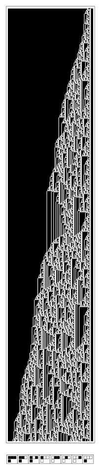
<!-- ORIGINAL_FIGURES page=0398 end -->

人们就无法现实地把湍流流体中看到的大尺度随机性归因于单个粒子层面存在的随机性。

相反，似乎发生的是，内在随机性生成直接发生在大尺度流体运动层面。作为一种简单建模方式的例子，可以考虑有一组离散涡旋，它们出现在流体中的离散位置，并通过简单元胞自动机规则相互作用。

左侧图片显示了可能发生的一个例子。尽管许多细节同真实流体中看到的不同，但规则性与随机性的总体混合却惊人地相似。

关于流体中存在内在随机性生成，而且它发生在大尺度流体运动层面这一想法，有一个后果：只要制备足够仔细，就应该有可能产生看起来相当随机、但实际上有效可重复的流动图案，也就是说，在实验的每一次连续运行中，它们看起来本质上都相同。

即使查看现有的流体流动实验，也会发现相当多的例子，尤其是涉及少数涡旋之间相互作用的例子，其中已知有些流体流动图案看起来很精巧，却仍然本质上可重复。虽然这些图案还没有复杂到可以合理地称为随机，但我怀疑，随着时间推移，会发现类似但复杂得多的例子。

第 377 页上的每一种流体流动图案都有自己的具体细节和特征。比较简单的一些，已经被基于传统数学方程的方法相当完整地捕捉。但更复杂的那些还没有。从本书的视角看，这并不令人惊讶。

但现在，凭借本书这些发现所带来的经验和直觉，我预期实际上将会找到极其简单的程序，能够成功复现甚至最精巧、最表观随机的流体流动形式的主要特征。

图：一个元胞自动机（规则 225），其行为让人想起湍流流体流动。

---

[[PDF page 399]]

## 生物学中的基本问题

生物系统常被称作自然界中复杂性的最高范例，而且人们常常假定，它们的复杂性必定以某种方式属于比其他系统更高的基本层级。

通常人们认为，这必定是生物系统中起作用的适应和自然选择这些相当独特的过程所导致的。但尽管多年来有各种讨论，人们从未清楚理解，为什么这类过程最终竟然应该导致多少复杂性。

事实上，我逐渐相信，生物系统中许多最明显的复杂性例子，实际上同适应或自然选择关系很小。我怀疑，它们主要只是我在本书中于简单程序语境下发现的那个非常基本现象的又一个后果：在几乎任何类型的系统中，许多底层规则的选择都会不可避免地导致高度复杂的行为。

用程序来思考这一一般观念，如果说有什么区别的话，在生物系统中甚至比在物理系统中更明显。因为在物理系统中，程序的规则通常必须从物理定律间接推导出来。但在生物有机体中，存在遗传物质，而遗传物质可以相当直接地被看作提供了有机体发育的程序。

不过，我在本书中讨论过的大多数程序都非常简单。而今天已知每一种生物有机体的遗传程序却又长又复杂：例如在人类中，它大概包含数百万条分离规则，按多数衡量标准看，它像 Mathematica 这样的大型实际软件系统一样复杂。

因此，人们也许会认为，我们在生物有机体中看到的复杂性，必定全都只是其底层规则复杂性的反映，从而关于简单程序的发现其实并不相关。一个典型完整有机体中存在许多不同类型的器官和其他元素，这当然很可能同底层

---

[[PDF page 400]]

程序中存在许多分离规则集有关。但如果不看完整有机体，而只看有机体的某个部分，又会怎样？

特别是在微观尺度上，人们看到的形态常常高度规则而且相当简单，如对页图片所示。看到这些形态时，认为它们实际上由相当简单的程序产生，是完全合理的。

但生物系统中那些复杂得多的形态又如何？根据传统直觉，人们也许会假定，这类形态绝不可能由简单程序产生。但从本书的发现中我们现在知道，事实上即使从非常简单的程序中也有可能得到惊人的复杂性。

那么这就是生物系统中实际发生的事吗？

复杂生物形态中出现的底层细胞类型或其他元素，同对页形态中的那些并没有什么戏剧性差异。由此，人们也许会开始怀疑，最终生成所有这些形态的程序类型相当相似，而且都有可能相当简单。

因为即使一个有机体完整的遗传程序又长又复杂，支配该有机体某个单独方面的子程序仍然可以很简单；而现在已经有大量具体的简单例子表明情况确实如此。不过，人们也许仍会假定，要得到显著复杂性，还需要更多东西。事实上，一开始人们也许会认为，只通过观察有机体的部分，根本不可能对复杂性说出多少东西。

但事实证明，生物复杂性最明显例子中有相当大一部分，似乎只涉及有机体中令人惊讶地有限的部分。例如，精巧的色素图案通常只存在于外层皮肤上，并且只由少数几类细胞构成。而绝大多数复杂的

图：生物系统中出现的高度规则形态例子。这些形态大多足够简单，以至于看上去很容易相信它们实际上可以由简单程序生成。大多数显示简单几何形状，或相同元素的重复。不过少数显示了各种类型的嵌套。注意，一个形态的复杂程度同它首次出现在地质时期中的时间，似乎没有明显相关。

---

[[PDF page 401]]

<!-- ORIGINAL_FIGURES page=0401 start -->
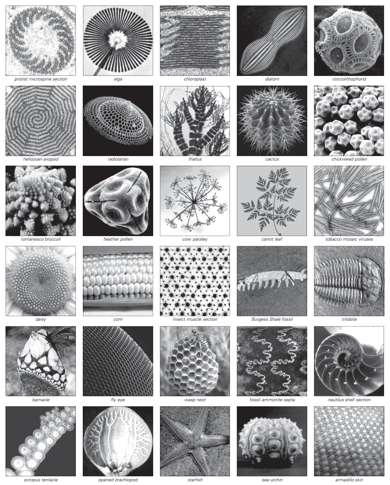
<!-- ORIGINAL_FIGURES page=0401 end -->

图示续：生物系统中的高度规则形态例子，包括原生生物微棘截面、藻类、叶绿体、硅藻、颗石藻、太阳虫轴足、放射虫、叶状体、仙人掌、繁缕花粉、罗马花椰菜、石南花粉、峨参、胡萝卜叶、烟草花叶病毒、雏菊、玉米、昆虫肌肉截面、伯吉斯页岩化石、三叶虫、藤壶、苍蝇复眼、蜂巢、菊石隔壁化石、鹦鹉螺壳截面、章鱼触手、打开的腕足动物、海星、海胆和犰狳皮肤。

---

[[PDF page 402]]

形态结构，其形式也来自数量非常有限的细胞或其他元素类型的排列。

但这些以及有机体其他特征的程序究竟是怎样确定的？在过去约一个世纪中，人们几乎普遍相信，在某个层面上，这些程序最终必定是那些使有机体适应度以及它所产生的可存活后代数量最大化的程序。

其观念是，如果某一有机体谱系携带某个特定程序，并且通常产生更多后代，那么几代之后，拥有这个程序的有机体就不可避免地会远多于拥有其他程序的有机体。如果假定每个新后代的程序都包含小的随机突变，那么这意味着，在许多代的过程中，生物演化实际上会对程序进行随机搜索，以最大化一个有机体的适应度。

但我们能期望这样的搜索有多成功？

最大化适应度的问题，本质上同我们在第七章末尾讨论的满足约束的问题相同。而我们在那里发现，对于足够简单的约束，尤其是连续约束，迭代随机搜索可以相当迅速地收敛到一个最优解。但只要约束更复杂，情况就不再如此。事实上，即使最优解比较简单，要接近它也可能需要天文数字的步骤。

生物系统似乎确实有一些技巧来加速搜索过程。例如，有性生殖允许相似程序发生大尺度混合，而不只是小尺度突变。分化成器官实际上也允许程序的不同部分分别被更新。但即便拥有一整套这样的技巧，要相信自地球生命开端以来约一万亿代有机体就足以找到任何显著复杂约束的最优解，仍然完全说不通。

事实上，人们会怀疑，生物有机体中绝大多数特征实际上并不对应于任何接近最优的解；相反，它们代表的是相当容易找到、但足够好而不会给有机体造成致命问题的解。

---

[[PDF page 403]]

有机体倾向于演化以达到最大适应度这一基本观念，过去当然非常有用：它为理解物种的历史进程提供了一般框架，也为特定物种的一些相当简单的性质给出了具体解释。

但在当代生物学思维中，这一观念往往被推到极端；于是，特别是在那些并不每天接触生物系统详细数据的人中间，人们开始假定每一种有机体的几乎每一种特征，都可以以某种最大化该有机体适应度的方式来解释。

当然，人们承认现存有机体的某些方面实际上是生物演化较早阶段遗留下来的。人们也越来越意识到，一个单独有机体内部实际的生长和发育过程，可能使某些类型的结构更容易或更难出现。

但除此之外，有一种惊人普遍的信念：人们在任何有机体中看到的任何显著性质之所以存在，必定是因为它本质上服务于最大化该有机体适应度的某个目的。

一开始，这个目的常常很不清楚；但至少在相当简单的情形中，通常总能构造出某种假说。于是，一旦选定一个所谓目的，生物学在寻找达成该目的的解时多么巧妙，往往看起来就相当令人惊叹。

例如，植物茎上枝条的黄金比例螺旋，可以被看作一种极妙的方式，用来最小化叶片遮阴；而某些软体动物壳上的精巧图案，则可以被看作极妙的方式，用来迷惑假想捕食者的视觉系统。

但我强烈怀疑，这些目的实际上同这些特定特征存在的真实原因关系很小。相反，正如我将在接下来几节中讨论的，我相信这些特征本质上只是因为它们很容易由相当简单的程序产生。事实上，当人们考察越来越复杂的生物有机体特征，尤其是纹理和色素图案时，越来越难找到任何可信的目的，来解释所看到细节的存在。

---

[[PDF page 404]]

过去，用于某种复杂目的的优化想法，似乎是解释许多生物系统中所见复杂程度的唯一可想象方式。但本书发现，只需一个简单程序就能产生高度复杂的行为，于是立刻出现了一种完全不同、并且最终更具预测性的解释。

在生物演化过程中，随机突变实际上会导致一整串程序被尝试。关键是，根据本书中的发现，我们现在知道，这些程序中有相当一部分几乎不可避免地会产生复杂行为。

有些程序大概会导致有机体比其他程序更成功，自然选择会使这些程序最终占据主导。但在大多数情况下，我强烈怀疑，决定有机体成功与否的往往是相对粗略的特征，而不是任何可能出现的复杂行为中的全部细节。

因此，在一个非常简单的情形中，例如很容易想象，如果某个有机体的皮肤是棕色和白色混合，而不是比如均匀的亮橙色，那么它也许更不容易被捕食者注意到，从而更有可能存活并更成功。但接下来可能发生的是，大多数产生任何颜色混合的程序，恰好也会使这些颜色以高度复杂的图案出现。

如果情况如此，那么在随机突变过程中，遇到的第一个足以成功存活的程序，很可能也会十分巧合地表现出复杂行为。

按照传统生物学思维，人们倾向于假定，凡是看到的复杂性，最终都必定是为了满足某个精巧约束集合而被精心塑造出来的。但我相信，生物系统中我们看到的绝大部分复杂性，实际上起源于一个纯粹抽象的事实：随机选择的程序中，有许多会产生复杂行为。

过去人们往往隐含地假定，要在生物系统中得到实质复杂性，必定以某种方式在根本上非常困难。但根据本书的发现，我得出的结论是，它其实相当容易。

那么如何判断事实是否真的如此？

---

[[PDF page 405]]

一个间接证据是，我们甚至在非常早期的化石有机体中就已经看到相当多的复杂性。在过去十亿年左右，越来越多的器官和其他装置出现了。但复杂性最明显的外在迹象，例如体现在纹理和其他形态特征中的那些，似乎甚至从非常早的时期就已经存在。

事实上，一切迹象都表明，至少几亿年来，有机体单个部分的复杂程度并没有多少变化。因此，这表明我们看到的复杂性必定以某种方式来自某个直接而一般的机制，而不是例如来自一种依赖长期生物演化过程进行精细改良的机制。

另一个间接证据说明，在生物系统中复杂性在某种意义上容易获得：在其他方面非常相似的现存有机体之间，色素图案等特征常常从非常简单变化到高度复杂。

无论观察鱼类、蝴蝶、软体动物，还是几乎任何其他类型的有机体，人们都常常发现，在物种之间，甚至在同一物种内部，生活在相同环境且内部结构基本相同的有机体，仍然可以表现出截然不同的色素图案。有些情况下图案可能很简单，但在另一些情况下则高度复杂。

关键是，为了得到这些更复杂的图案，似乎并不需要精巧的结构改变，也不需要复杂的适应过程。最终我怀疑，事情只是有些可能的底层遗传程序碰巧会产生复杂图案，而另一些不会。

再过两节，我会讨论一个相当醒目的潜在例子：如果观察各种类型的软体动物，就会发现它们壳上的色素图案范围，同基于元胞自动机的简单随机选择程序所产生的图案范围惊人地相符。

这样的例子，以及接下来几节中的许多其他例子，提供了证据，表明我们在生物有机体中看到的复杂性，确实可以由短小

---

[[PDF page 406]]

而简单的底层程序成功复现。不过仍然存在一个问题：实际生物有机体究竟是否真的使用这样的程序，还是它们以某种方式使用了复杂得多的程序。

现代分子生物学应该很快能够隔离出例如负责软体动物壳上图案的具体程序，并明确看到它们有多长。但已经有迹象表明，这些程序相当短。

因为程序短的一个后果是，它几乎没有空间容纳非必要元素。这意味着程序中几乎任何突变或变化，无论多么小，都倾向于至少对它产生图案的细节产生显著影响。

有时很难判断同一物种内部不同有机体之间的图案变化是否真正具有遗传起源。但在它们看起来确实具有遗传起源的情况下，常常会发现不同有机体显示出大量不同图案，这支持了负责这些图案的程序确实很短的想法。

那么实际的生物演化过程又如何？它怎样挑出要使用哪些程序？作为生物演化的一个非常简单的理想化，可以考虑一串元胞自动机程序，其中每一个后继程序都是由前一个程序经一次随机突变得到的，而这次突变会添加或修改一个单独元素。

对页上的图片显示了这种设定下发生的一个典型例子。如果从极短的程序开始，最初得到的行为相当简单。但只要底层程序变得稍微长一点，就会立即看到高度复杂的行为。

传统直觉会认为，如果程序继续变得更长，行为就会变得越来越丰富、越来越复杂。但从本书的发现中我们知道，情况通常并不是这样：超过一个相当低的阈值之后，向底层程序添加复杂性，并不会从根本上改变它能够产生的行为类型。

由此可以得出结论：生物系统在某种意义上应当能够使用只由少数突变形成的短程序，生成本质上任意的复杂性。

---

[[PDF page 407]]

<!-- ORIGINAL_FIGURES page=0407 start -->
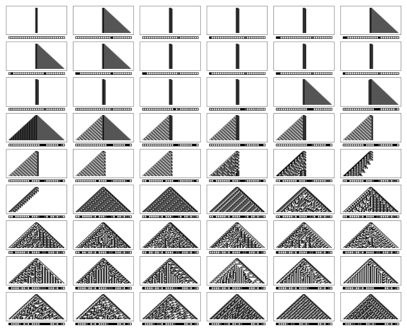
<!-- ORIGINAL_FIGURES page=0407 end -->

图：一串通过连续随机突变得到的元胞自动机程序的行为。第一个程序不包含任何用于改变带有任意邻域的元胞颜色的规则。连续程序中的突变会为具有特定邻域的元胞添加改变颜色的规则，或修改这些规则。序列中的每个程序都同前一个程序相差一次完全随机作出的单一突变。这个序列提供了一个没有显式自然选择的生物演化非常简单的理想化。这里显示的元胞自动机都有 3 种可能颜色和最近邻规则。每幅图的标签给出 27 种可能三元胞邻域中每一种的规则表示。圆点表示规则不改变该邻域中心元胞的颜色。

但如果复杂性这么容易获得，为什么它没有在生物学中更普遍地出现？因为尽管生物系统中确实有许多精巧形态和图案的例子，典型有机体的总体形状以及许多最明显特征通常却相当简单。

为什么会这样？我的猜测是，这本质上反映了同自然选择过程有关的限制。因为尽管自然选择常被吹捧为几乎拥有任意力量的作用力，我却越来越相信，它的力量事实上非常有限。确实，我怀疑自然选择最终只能以有意义的方式作用于那些行为在某种意义上相当简单的系统或系统部分。

---

[[PDF page 408]]

如果一个有机体的某个特定部分总是例如沿一条简单直线生长，那么很容易想象，自然选择可以成功为某个给定环境挑出最优长度。但如果一个有机体能够以更复杂的方式生长，比如像上一页图片中的那样，又会怎样？我强烈怀疑，在这种情况下，自然选择通常能实现的东西非常少。

这里有几个原因，而且它们彼此有些相关。

第一，对于更复杂的行为，通常存在数量巨大的可能变体；在一个真实的有机体种群中，要探索这些变体的任何显著部分都会变得不可行。

第二，复杂行为不可避免地涉及许多精细细节；而由于这些细节中的不同部分可能恰好成为决定单个有机体命运的因素，自然选择就很难以一致而确定的方式发挥作用。

第三，只要一个系统的总体行为比其底层程序更复杂，那么程序中几乎任何突变都会导致行为中的一整组详细变化；于是自然选择没有机会把有益变化同无益变化分别挑出来。

第四，如果随机突变只能例如增加或减少某个长度，那么即便一次突变朝错误方向走，另一场突变也很容易通过朝相反方向走来恢复。但如果实际上存在许多可能方向，那么从失误中恢复就变得困难得多，也更难表现出任何形式的系统性收敛。

最后，正如第七章的结果所提示的，对于超出最简单行为形式的任何东西，迭代随机搜索很快就倾向于卡住，至多也只能朝任何类型的全局最优极其缓慢地前进。

---

[[PDF page 409]]

从某种意义上说，当自然选择面对复杂行为时所能实现的东西很少，这并不奇怪。因为它实际上被要求预测：为了产生或增强某种总体行为形式，底层程序中需要作出哪些改变。然而本书的主要结论之一是，即便给定某个特定程序，要看出该程序会有什么行为也可能非常困难。而从行为反推程序，则是更加困难得多的任务。

在写这本书时，如果有一种系统方法能够找到表现出指定复杂行为形式的程序例子，当然会很方便。我的确也努力发展过能做到这一点的迭代搜索过程。但即便使用生物学提示的一整套技巧，以及相当多并非来自生物学的技巧，我也从未成功过。事实上，在每一个单独案例中，我最终都回到了穷举搜索或纯随机搜索，而没有试图进行迭代改进。

那么这对生物有机体意味着什么？它表明，如果一个有机体的某个特定特征要通过自然选择在不同环境中成功得到优化，那么这个特征就必须以某种方式相当简单。

毫无疑问，这在很大程度上解释了为什么生物有机体总是倾向于由分离的器官或其他部分组成，而每个部分都至少有一些相当简单的属性。因为这样最终会有一些组成部分足够简单，能够由自然选择以有意义的方式调节。

人们常常声称，正是自然选择使生物学中的系统能够表现出比我们在工程中明确构造的系统多得多的复杂性。但我强烈怀疑，事实上自然选择的主要作用几乎正好相反：它倾向于使生物系统避开复杂性，并更像工程中的系统。

做工程时，人们通常在一个约束下工作：自己建造的系统必须以一种容易预测和理解的方式行为。为了做到这一点，人们通常

---

[[PDF page 410]]

把自己限制在由相当少量的组成部分构造系统，而这些组成部分的行为和相互作用以某种方式是简单的。

但自然界中的系统一般并不需要在其行为应当可预测或可理解这一约束下运行。这意味着，从某种意义上说，它们可以使用任意数量、任意类型的组成部分；结果，正如我们在本书中看到的那样，它们产生的行为常常可以高度复杂。

然而，如果自然选择要成功地系统塑造一个系统的性质，那么对系统能够拥有的组成部分类型又会出现限制。事实上，所需要的似乎是那些以简单且某种程度上独立的方式行为的组成部分，很像传统工程中的组成部分。

在某个层面上，工程与自然选择之间存在类比并不令人惊讶。因为两种情况都可以被看作试图创造能够实现或优化某个目标的系统。

事实上，主要差别只是：在工程中，人类明确投入努力来为系统寻找适当形式；而在自然选择中，使用的是一种迭代随机搜索过程。关键在于，这两种方法能够奏效的条件最终并没有那么不同。

我怀疑，甚至在相当细节的问题上也存在相似性，例如能够对单个组成部分作出的调节类型。在工程中，人们常常使用其性质可以以某种方式平滑变化的组成部分，因此这些组成部分可以用微积分和传统连续数学的方法来分析。

事实证明，就像我们在第七章看到的那样，正是这种平滑变化也倾向于使自然选择这样的迭代搜索方法取得成功。

在基于离散遗传程序的生物系统中，平滑变化如何出现远非清楚。大概在某些情况下，它可以通过底层程序中重复片段数量的变化来近似。更常见的情况则可能是，大量元素组合在一起，而每个元素都产生相当随机的行为。

---

[[PDF page 411]]

但平滑变化的可能性似乎对自然选择的有效性足够重要，以至于它在实际生物系统中极其常见。确实，虽然有些性状，例如人类的眼睛颜色和血型，或多或少是离散的，但在动植物育种中看到的绝大多数性状，都显示出相当平滑的变化。

那么，生物演化的实际历史在多大程度上反映了我所论证的、应该从自然选择中预期的那些简单特征？

如果观察今天存在的物种，以及过去物种的化石记录，最醒目的特征之一就是跨越范围巨大的不同有机体之间有如此多共同之处。例如，动物的基本身体蓝图几亿年来几乎一直相同，而许多器官和发育通路很可能甚至更古老。

事实上，在演化过程中，绝大多数结构上重要的特征似乎只发生了相当缓慢而渐进的改变，正如人们会从一种基于相当简单性质的平滑变化的自然选择过程所预期的那样。

但尽管如此，实际出现的生物有机体形式中，至少在视觉外观层面上，显然仍有相当大的多样性。那么这种多样性又是怎样产生的？

一个效应，我将在下一节更详细地讨论，本质上只是几何问题。如果一个有机体不同部分的相对生长速率哪怕只发生轻微改变，事实证明，这有时会对有机体的总体形状以及其机械运作产生戏剧性后果。

这意味着，只要对相对生长速率之类的量作出渐进改变，自然选择就可以成功产生至少在某些方面看起来非常不同的有机体。

但有机体之间的其他差异又如何？它们在多大程度上全都由自然选择系统地决定？

按照本节前面的讨论，我强烈怀疑，至少许多视觉上最醒目的差异，

---

[[PDF page 412]]

例如同纹理和色素图案相关的差异，最终几乎同自然选择没有关系。

相反，我相信，这类差异本质上只是底层遗传程序中完全随机变化的反映，没有来自自然选择的系统性影响。

尤其是在亲缘关系很近的有机体物种之间，常常可以看到一种强烈对比：色素图案等特征中经常出现戏剧性差异，而其他特征却惊人地恒定。最可能的是，那些显示出高度恒定性的特征，恰恰就是已经被自然选择成功塑造的特征。

但正如我前面提到的，在物种之间变化最快的，几乎总是那些显示出最明显复杂性迹象的特征。而这一观察同以下想法精确吻合：通过随机抽样简单程序，复杂性容易获得；但自然选择很难以任何系统方式处理复杂性。

因此，最终我的结论是，生物有机体中许多最明显的复杂性特征，在某种意义上并不是因为自然选择而产生，而是尽管有自然选择仍然产生。

毫无疑问，许多人会很难放弃这样一种观念：自然选择以某种方式对生物有机体中复杂性的存在至关重要。因为传统直觉会让人以为，要得到生物系统中所见的复杂程度，必定需要巨大努力；而化石记录所揭示的漫长而沉重的演化过程，似乎正像是应该参与其中的那种过程。

但关键是，本书所发现的东西表明，事实上只要随机选择程序，就很容易得到高度复杂的行为。而我相信，正是这一点位于我们在自然界中看到的大多数复杂性的核心，无论是在生物系统还是非生物系统中。

只要自然选择是一个重要的决定因素，我怀疑人们就不可避免会看到许多同工程创造系统中相同的简化特征。因此，只有当自然选择并不关键时，生物系统才会

---

[[PDF page 413]]

能够表现出我们例如在许多物理系统中观察到的那种复杂程度。

在生物学中，含有许多分离部分的长程序的存在，可以导致一种相当直接的复杂性，类似于把许多不同种类的物理对象收集在一起。但生物学中最戏剧性的复杂性例子，往往出现在系统的单个部分中，而且常常涉及同物理学中的图案或结构极其相似的图案或结构。

然而，如果生物学本质上随机抽样底层遗传程序，为什么这些程序的行为会同由具体物理定律导出的程序有任何相似之处？

答案是，正如我们在本书中已经多次看到的，在范围非常广的程序中，所出现的行为具有很强的普遍性。细节取决于每个程序的精确规则，但总体特征仍然非常相同。

这一点的重要后果之一是，它表明也许有可能发展出一种相当一般的生物学预测理论，能够告诉人们，例如哪些基本形态可能在生物系统中出现，哪些不太可能出现。

人们也许会以为，认为有机体被选择为对其环境最优这一传统观念，早就应当导致某种预测理论。事实上，它确实已经例如使人们成功推导出同有机体种群相关的一些简单数值比率。但对于有机体可能出现什么形态这样的问题，它能说的就少得多。

有不少情形中，相当复杂的结构似乎在几种非常不同的有机体类型中独立出现。有人有时声称，这种趋同演化之所以发生，是因为这些结构在某种终极意义上是最优的，从而它们最终不可避免会被产生出来。

但如果这种解释正确，我会非常惊讶。相反，我强烈怀疑，某些结构之所以反复出现，只是因为它们以某种方式在某些类型程序中很常见；正如例如我们已经看到的，左侧显示的

---

[[PDF page 414]]

<!-- ORIGINAL_FIGURES page=0414 start -->
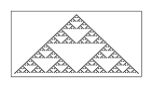
<!-- ORIGINAL_FIGURES page=0414 end -->

精巧嵌套图案会由许多不同的简单程序产生。

图：一种由范围很广的简单程序以若干变体产生的基本图案的例子。

自演化理论最初发展以来，一直有一种广泛信念，认为化石记录中所见向越来越复杂有机体类型形成的总体趋势，必定以某种方式同最优性的总体增加相关。

不用说，我们并不知道一个真正最优的有机体会是什么样。但如果最优性同拥有尽可能多的后代有关，那么病毒和原生动物这样非常简单的有机体似乎已经表现得非常好。

那么为什么更高等的有机体竟然会存在？我的猜测是，这几乎同最优性没有关系；相反，它本质上只是随机突变串的结果，这些突变碰巧添加了越来越多特征，却没有引入致命缺陷。

当然，情况并不像人们常常假定的那样：自然选择会以某种方式不可避免地导致有机体具有越来越精巧的结构和越来越多的部分。

首先，有些类型的有机体已经受自然选择作用超过十亿年，但从未最终变得复杂得多。尽管在某些情形中有机体确实最终变得更复杂，它们也常常变得更简单。

一种典型模式，碰巧同技术史中发生的情况惊人相似，是在化石记录中的某个时刻突然看到某种重大的新能力或新特征。起初随后会发生快速扩张，许多新物种尝试各种已经被打开的可能性。通常，其中有些可能性会变得相当华丽而精巧。但过一段时间以后，什么有意义、什么无意义会变得清楚。于是通常事情又会重新变得更简单。

那么自然选择在所有这些事情中扮演什么角色？我的猜测是，就像在其他情形中一样，它的主要系统性贡献是使事物更简单；而只要事物最终确实变得更复杂，这几乎总是底层程序本质上随机

---

[[PDF page 415]]

抽样的结果，并没有自然选择的任何系统性影响。

对于有机体中更表面的方面，例如色素图案，随机抽样的程序中相当一部分可能会产生对有机体并非灾难性的结果。但当处理有机体的基本结构时，随机抽样得到的绝大多数程序毫无疑问都会立即造成灾难性后果。从某种意义上说，正是自然选择负责使这类程序不能存活下来。

但关键是，在这种情况下，它的作用并不是系统性的或累积性的。事实上，我强烈怀疑，对于本质上所有目的而言，关于有机体重要新特征的唯一合理模型，就是它们来自纯粹随机选择的程序。

那么这是否意味着，不可能存在关于高等有机体所有特征的任何一般理论？生物演化历史中究竟哪些新特征在何时被添加，这种模式大概并不比人类历史中的具体事件进程更适合一般理论。但我强烈怀疑，出现在有机体中的绝大多数重要新特征，至少在最初都同相当短的底层程序相关。只要情况如此，本书的结果就应当使人们能够对可能发生的事情发展出某些相当一般的刻画。

因此，这一切意味着，我们在生物学中看到的许多东西，应当同简单程序的典型行为相当密切地对应，也就是同我们在本书中研究过的那类行为相对应；主要的注意事项只是，某些方面会被自然选择的效应平滑化和简化。看到本书前几章中简单程序能够做出的各种各样的事情，人们很容易想到生物动植物志的类比。但现在我们看到，这种类比事实上可能相当直接：实际生物有机体中许多最明显的特征，实际上可能就是我们在简单程序中看到的典型行为的直接反映。

---

[[PDF page 416]]

<!-- ORIGINAL_FIGURES page=0416 start -->
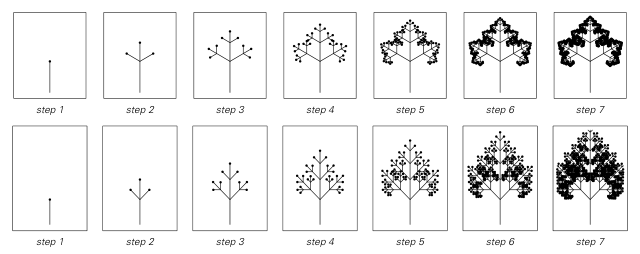
<!-- ORIGINAL_FIGURES page=0416 end -->

## 植物和动物的生长

看着植物和动物的各种精巧形态，人们一开始也许会假定，支配它们生长的底层规则必定高度复杂。但本书已经发现，即便遵循非常简单的规则，也有可能得到高度复杂的形态。我逐渐相信，事实上植物和动物生长的大多数方面，最终都由惊人简单的规则支配。

作为生物生长的第一个例子，考虑植物的茎。生长通常只发生在茎的顶端，而且很多时候，实际发生的全部事情只是茎逐渐变长。但最终导致许多种植物中我们看到的大部分结构的关键现象，是在茎的顶端可能形成新的茎并分枝出去。在最简单的情况下，这些新茎本质上只是原始茎的较小副本，具有相同的基本生长和分枝规则。

在这种设定下，连续分枝就可以由一个邻居无关替换系统的演化步骤来表示，其中每根茎的顶端在每一步都被某种固定构型中的一组更小的茎替换。

下面的图片显示了两个这样的替换系统例子。在两种情况下，规则都被设定为每根茎实际上在每一步都正好分枝成三根新茎。

图：替换系统的演化步骤，它们为植物生长提供简单模型。在每一步，每根生长中的茎都会按照所示规则被一组三根新茎替换。对于单根茎，这种分枝在植物学中称为单轴分枝。

---

[[PDF page 417]]

这意味着茎之间的连接网络必然具有非常简单的嵌套形式。但如果观察茎的实际几何排列，就不再有这种简单性；事实上，尽管底层规则非常简单，对页底部图片中甚至立刻就能看到相当多的复杂性。

下一页的图片显示了用各种新茎长度和角度选择序列得到的图案。少数情况下图案相当简单；但大多数情况下，它们结果高度复杂，而且极其多样。

这些图片立刻让人想到各种植物的总体分枝图案，从藻类到蕨类再到树木，以及许多开花植物。毫无疑问，大多数这种总体分枝图案都来自这样简单的生长规则。

但植物更细节的特征又如何？它们也可以被看作简单底层生长规则的后果吗？

许多年来，我尤其一直在思考叶子的形状。不同植物之间，这类形状有巨大多样性，如第 403 页上的图片所示。有些植物的叶子具有简单平滑的边界，人们也许会想象可以用传统数学函数描述。另一些植物的叶子则有各种尖角构型。还有一些叶子具有复杂且看似有些随机的边界。

因此，给定这种多样性，人们一开始也许会认为，不可能有任何单一类型的底层规则负责我们所看到的东西。但查看下一页那样的一组图片时，人们会有一个惊人的发现：简单替换系统能够生成的图案中，有些轮廓同各种类型叶子的轮廓极为相似。

有些图案边缘平滑，看起来像睡莲叶。有些图案带有尖角，看起来像各种多刺的叶子。还有一些图案具有精巧且看似有些随机的形状，看起来像悬铃木叶或葡萄叶。

过去人们从未真正清楚叶子怎样获得它们的形状。大概多数重要过程都发生在叶子仍然折叠在芽中、还不太坚固的时候。

---

[[PDF page 418]]

<!-- ORIGINAL_FIGURES page=0418 start -->
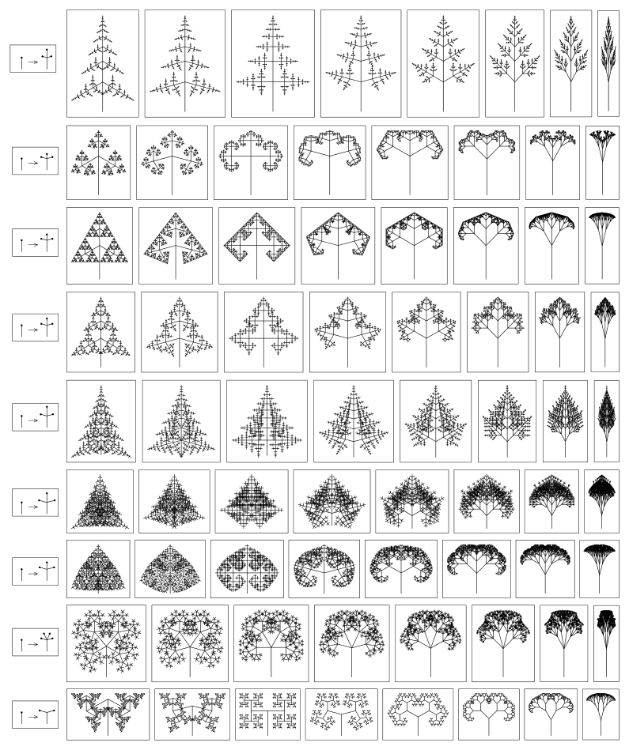
<!-- ORIGINAL_FIGURES page=0418 end -->

图：由上一幅图所示类型的替换系统产生的极限图案。每一行的图案来自一些规则，这些规则被设定为给出具有特定相对长度的枝条。沿每一行向右，枝条之间的角度在连续图片中每次增加 15°。注意，不同行上的图片使用了不同缩放比例，因此初始竖直茎并不总是显示为相同高度。本页图片同许多植物中的总体分枝图案和叶形之间的相似性令人瞩目。

---

[[PDF page 419]]

<!-- ORIGINAL_FIGURES page=0419 start -->
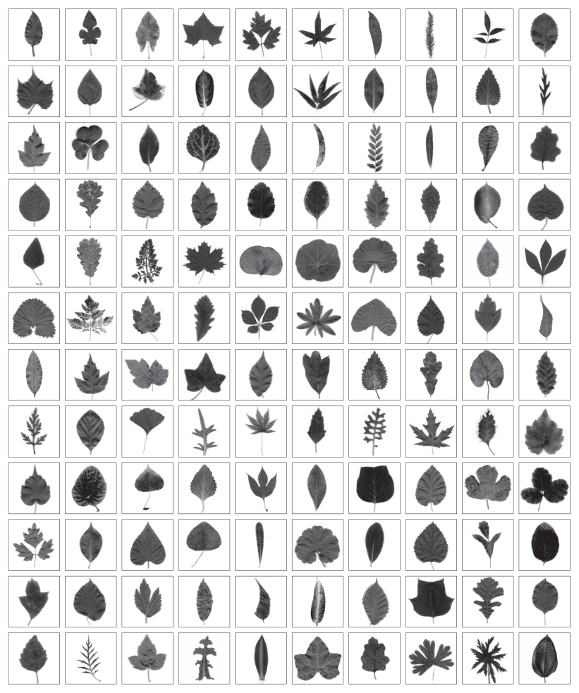
<!-- ORIGINAL_FIGURES page=0419 end -->

图：不同种类叶子的例子，主要来自常见开花植物。形状的多样性令人惊叹，它们同对页所示形态的相似性也同样令人惊叹。这些叶子的尺寸从不到一英寸到许多英尺不等。

---

[[PDF page 420]]

因为尽管叶子在伸出之后通常会显著扩张，它们形状的基本特征却几乎从不会改变。

有一些证据表明，至少叶脉图案的某些方面，是在叶子的主表面填充之前就已奠定的；也许我这里描述的分枝过程中的茎，对应于同叶脉相关结构的先体。事实上，高等植物叶子中叶脉的交叉，或许同两页前图片中茎常常彼此交叉并非没有关系，尽管实际成熟叶子中的许多叶脉当然很可能是在叶形确定很久之后才添加的。

一开始，人们也许会以为叶子通过某种同植物生长其他方面完全无关的机制获得形状。但我强烈怀疑，事实上最终正是同一种简单分枝过程，既负责植物的总体形态，也负责其叶子的形状。

在总体生长规则和叶子生长规则中出现的长度和角度之间，有时很可能至少存在某种对应。但一般而言，所有这些规则的细节无疑会依赖单个植物的非常具体的特征。

例如，新茎出现前的距离，很可能由植物激素及相关物质的产生和扩散速率决定；这些速率不可避免地既依赖茎的厚度和机械结构，也依赖植物的各种生化性质。至于旧茎和新茎之间的角度，如果发现它们由细胞的单个形状和细胞分裂的单个序列这样的微观细节支配，我也不会惊讶。

生物学的传统直觉会认为，凡是看到复杂性，例如叶子的形状，就必定是为了某个特定目的，由某种复杂的自然选择过程生成的。但前几页的图片表明，事实上高度复杂性可以在某种意义上相当轻易地产生，仅仅作为遵循某些简单生长规则的结果。

毫无疑问，植物的某些底层性质确实受自然选择引导。但我强烈怀疑，在

---

[[PDF page 421]]

绝大多数情况下，复杂性的出现，例如叶形中的复杂性，本质上只是某些特定生长规则的副作用，而这些规则碰巧来自植物的底层性质。

下一页的图片显示了这样一组可能形态：每一步中，每根茎正好分裂成两根新茎。页面左侧的竖直黑线实际上表示每一步的原始茎；这些图片被排列成这样：页面上某个位置出现的图，显示的是当右侧新茎的顶端相对于左侧所示原始茎到达该位置时所生成的图案。

有些情况下，得到的图案相当简单。但即便在这些情况下，图片也显示，底层规则中比较小的变化可以导致复杂得多的图案。因此，如果在生物演化过程中规则发生渐进变化，几乎不可避免地有时会看到复杂图案。

但图案究竟会多突然地改变？为了对此有所了解，可以为下一页的数组构造一种极限：其中图片总数实际上无限多，但每幅图片中只显示某个特定的无穷小区域。第 407 页给出了这一小区域相对于原始茎的四种位置选择的结果。并且，图片不是只根据图案是否有任何部分落入该区域来显示黑或白，而是用灰度表示它离该区域有多近。

因此，实心黑色区域对应于底层规则中一些参数范围，在这些范围内得到的图案总会到达某个特定位置。但我们看到，在这些区域的边缘，经常有本质上呈嵌套形式的精巧结构。这些结构的存在意味着，至少在某些参数范围内，底层规则中即使非常小的变化，也能导致所产生图案某些方面的巨大变化。

这表明，叶子形状等特征有时会发生巨大改变，几乎是不可避免的，即便植物底层性质只发生轻微变化。我怀疑

---

[[PDF page 422]]

<!-- ORIGINAL_FIGURES page=0422 start -->
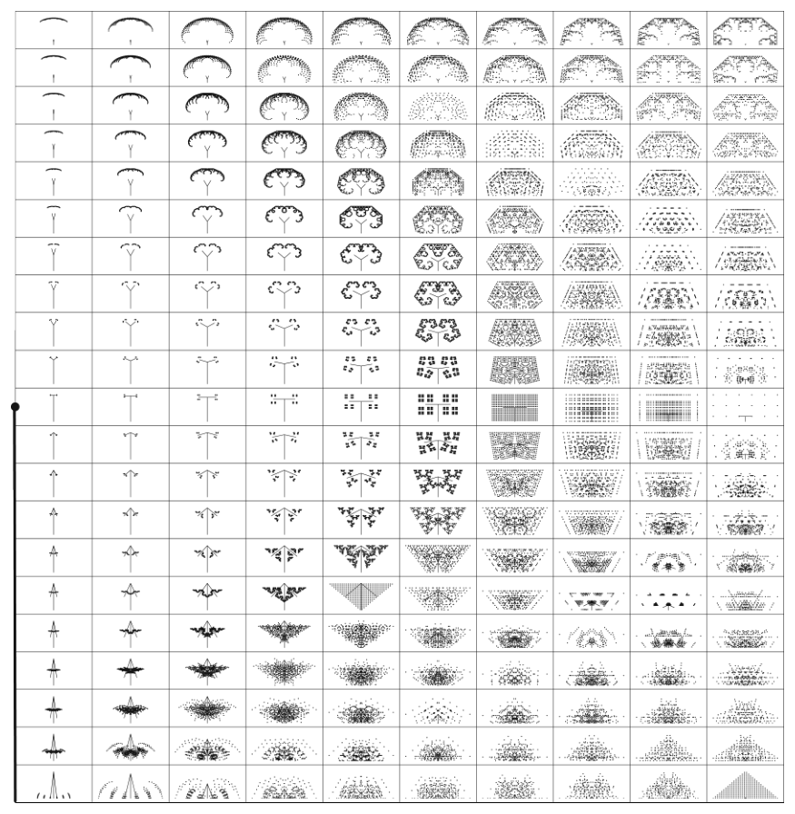
<!-- ORIGINAL_FIGURES page=0422 end -->

图：由简单替换系统产生的完整图案数组，其中每根茎在每一步都正好分枝成两根对称茎。这些图案在页面上的排列方式是：某一位置显示的图案，对应于这样一条规则所得到的结果，其中右侧茎的顶端相对于页面左侧显示为竖直线的原始茎到达该位置（已按数组纵横比校正）。每种情况下都显示 10 步演化的结果，并对图片进行缩放，使原始茎底部以上的所有点都能包含进来。注意，对于左侧点为圆心、接触页面其他三边的一个畸变半圆之外的规则，所生成图案会在每一步增长，而不是趋向固定尺寸的极限。

---

[[PDF page 423]]

<!-- ORIGINAL_FIGURES page=0423 start -->
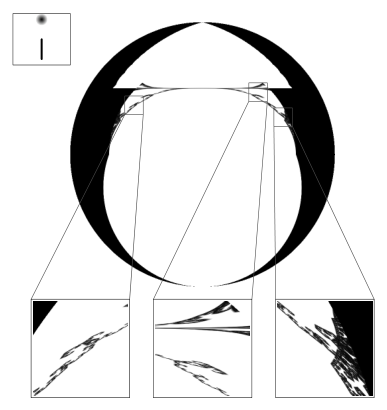
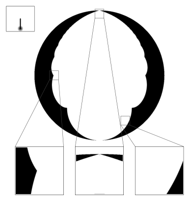
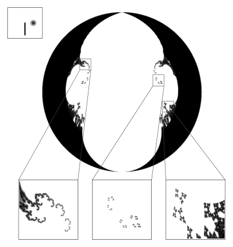
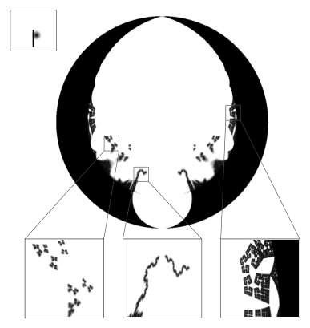
<!-- ORIGINAL_FIGURES page=0423 end -->

图：对页替换系统的参数空间中，所得图案与每幅图左上图标所示区域发生重叠的位置图。黑色对应于完全重叠，白色对应于没有重叠。这些图可以被看作是对页图片数组的无限稠密极限，但只保留通过一个相对于原始茎处于特定位置的小孔在每幅图片中看到的内容。

---

[[PDF page 424]]

这正是为什么即使在其他方面看起来非常相似的植物中，也偶尔会看到如此多样的叶形。

不过，虽然叶子形状等特征通常在不同植物之间差别巨大，但植物也有一些看似相当复杂的方面，通常在范围巨大的物种之间几乎完全相同。

一个例子是植物器官或其他元素围绕茎的序列排列。在某些情况下，例如连续叶片总会从茎的相对两侧长出，彼此相隔 180°。但更常见的是，叶片长出的位置相隔小于 180°；在大多数植物中，这个角度结果本质上相同，几乎精确等于 137.5°。

这样一个确定角度会在这么多植物的叶子排列，或所谓叶序，中出现，本身就已经令人惊讶。但事实证明，如对页顶部图片所示，正是同一个角度也出现在植物的各种其他特征中。尽管不同情况下几何形态不同，但接近 137.5° 的固定角度总会导致极其规则的螺旋图案。

多年来，人们已经写下大量关于这类图案及其数学性质的文字。因为事实证明，连续元素之间约 137.5° 的角度，等价于旋转若干圈，其圈数等于所谓黄金比例 `(1 + sqrt(5))/2 ~= 1.618`；这个数出现在各种数学语境中，尤其是作为斐波那契数的极限比。

毫无疑问，在很大程度上正因为这种优雅的数学联系，人们通常开始假定，137.5° 角以及它导致的螺旋图案，必定对应于某种由复杂自然选择过程找到的精巧优化。

但我并不认为事实如此。相反，我强烈怀疑，这些图案只是某种相当简单的生长过程的必然后果；近一个世纪前，人们至少已经从一般意义上讨论过类似过程。

---

[[PDF page 425]]

<!-- ORIGINAL_FIGURES page=0425 start -->
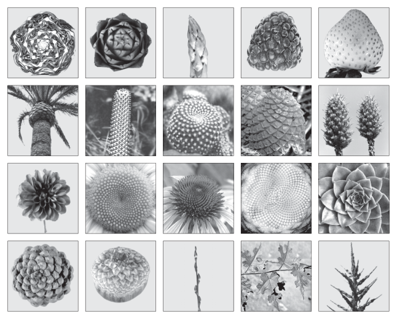
<!-- ORIGINAL_FIGURES page=0425 end -->

图：各种植物系统中元素螺旋排列的例子。最终几何形态的细节在不同情况下不同。但在所有情况下，连续元素之间的原始角度结果都几乎精确为 137.5°。第一行显示剖开的红甘蓝、洋蓟、芦笋、覆盆子和草莓。最后一行最前两个对象是松果和橡子。

新植物器官或其他元素围绕茎的位置，大概由生长茎顶端附近一小圈物质中发生的事情决定。我怀疑，如果在这圈物质的某个位置，某种化学物质的浓度达到某个临界水平，那么通常会在该位置形成一个新元素。

但只要一个元素形成，就可以预期它会耗尽其局部邻域中的这种化学物质浓度，从而抑制附近进一步形成元素。尽管如此，生长茎中的一般过程大概会使整个活跃物质环中的浓度稳步上升，最终这种浓度会再次在某个位置变得足够高，从而导致另一个元素形成。

---

[[PDF page 426]]

<!-- ORIGINAL_FIGURES page=0426 start -->
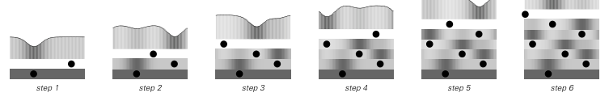
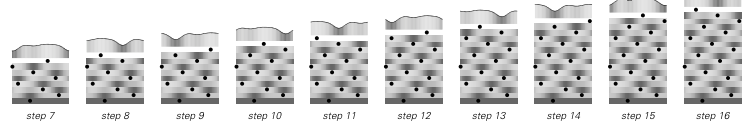
<!-- ORIGINAL_FIGURES page=0426 end -->

图：一个简单模型，用于说明植物茎生长顶端产生的叶片或其他元素的排列。茎被看作沿页面向上生长；为了显示，它被展开成一条线。叶片或其他元素的位置用黑点表示。化学物质浓度用灰度表示；在每一步最上面一行中，也将其绘出。系统规则是在这种浓度最大的任意位置放置一个新的黑点。然后假定这个黑点耗尽周围浓度，但在下一步之前，总体浓度会均匀增加。事实证明，连续黑点很快变得以几乎精确 137.5° 的角度间隔分布。

上面的图片显示了这种过程的一个例子。为了显示，活跃物质环被展开成一条线，这条线的连续状态在页面上自下而上一层层显示。在每一步，一个新元素，也就是黑点，被设定为在浓度最大的任意位置生成。然后，新元素被设定为在该位置周围产生一个浓度凹陷，而这个凹陷会在几步过程中逐渐被冲洗掉。

按图片的绘制方式，连续元素之间的角度对应于它们之间的水平距离。尽管这些距离在最初几步中有所变化，但我们总体看到的是，距离极其迅速地收敛到一个固定值，而这个值对应的角度几乎精确为 137.5°。

那么如果改变模型细节会发生什么？在所有先前行为的记忆都立刻衰减掉的极端情况下，对页顶部第一幅图片显示，连续元素以 180° 角形成。而在衰减非常小的情况下，最后两幅图片显示，至少在一段时间内，元素可以以相当随机的角度形成。但在大多数情况下，人们会看到相当迅速地收敛到几乎正好 137.5°。

---

[[PDF page 427]]

<!-- ORIGINAL_FIGURES page=0427 start -->
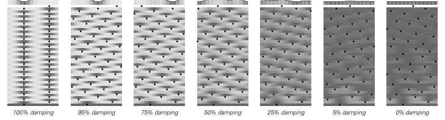
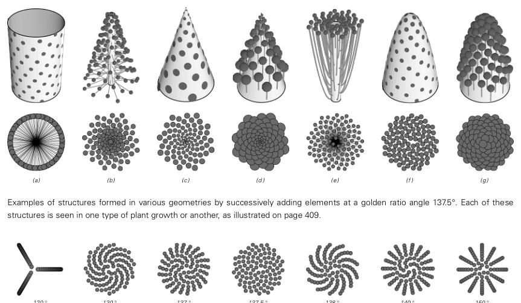
<!-- ORIGINAL_FIGURES page=0427 end -->

图：改变对页模型中所用衰减量的例子。100% 衰减对应于每一步都将总体浓度增加得如此之多，以至于没有任何前几步记忆留下。0% 对应于每一步总体浓度没有增加。只要离开这些极端情形，就会看到黑点之间的间距迅速收敛到几乎精确的 137.5°。

那么这个角度究竟怎样出现在实际植物系统中？如下方顶部图片所示，细节取决于新元素和原始茎的几何形态与相对生长速率。但在所有情况下，都会产生非常有特征的图案。

图：通过以黄金比例角 137.5° 连续添加元素，在各种几何形态中形成的结构例子。每种结构都见于某种植物生长，如第 409 页所示。

图：以各种不同角度连续添加元素所形成的总体图案。在每种情况下，第 `n` 个元素出现在坐标 `n {Cos[n theta], Sin[n theta]}`。如果 `theta/pi`（`theta` 以弧度计）容易被有理数近似，就会看到条纹。（条纹出现前的区域大小取决于 `Length[ContinuedFraction[theta/pi]]`。）

---

[[PDF page 428]]

<!-- ORIGINAL_FIGURES page=0428 start -->
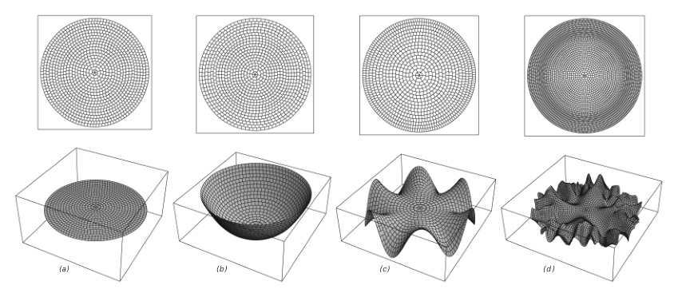
<!-- ORIGINAL_FIGURES page=0428 end -->

正如上一页底部图片所显示的，这些图案的形式对连续元素之间的精确角度非常敏感：事实上，即使小小偏离，也会导致视觉上相当不同的图案。一开始，人们也许会假定，要得到 137.5° 这样精确的角度，需要某种复杂而高度细致的过程。但正如我们在本书中已经看到的许多其他情形一样，我们看到，事实上最终所需要的只是一条非常简单的规则。

植物的一个一般特征是，它们的大多数细胞倾向于形成相当坚硬的纤维素壁，这使得新物质本质上不可能添加到植物体积内部，因此通常迫使新生长只发生在植物外部，最重要的是发生在茎的顶端。

但当植物形成片状物质，例如叶片或花瓣时，通常有一定灵活性允许生长发生在片内部。下面的图片显示了如果从一个平盘开始，然后在不同位置添加不同数量物质，会发生什么。

如果中心附近添加的物质多于边缘附近，如情形 (b)，那么平盘会被迫形成杯状，类似许多

图：在距离中心不同处含有不同数量物质的圆盘。上排中圆盘始终保持平坦，迫使物质元胞的大小和形状发生变化。下排中圆盘在三维中形成形状，其中所有元胞具有相同大小和形状。相对于情形 (a)，从中心向外的物质量在情形 (b) 中线性减少，在情形 (c) 中线性增加，在情形 (d) 中指数增加。

---

[[PDF page 429]]

<!-- ORIGINAL_FIGURES page=0429 start -->
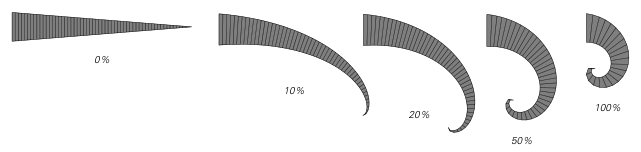
<!-- ORIGINAL_FIGURES page=0429 end -->

花朵。但如果边缘附近添加的物质多于中心附近，如情形 (c)，那么片状结构会在边缘变得波浪起伏，很像一些叶子。如果物质量从中心到边缘增加得足够快，如情形 (d)，那么圆盘会被迫变得高度皱褶，有点像莴苣叶。

那么动物又如何？它们的生长机制在多大程度上同植物相同？如果观察高等动物的气道或小血管，那么看到的分枝图案同植物中的图案相似。但在多数明显结构特征上，动物通常看起来完全不像植物。事实上，它们的生长机制大多也相当不同。

作为第一个例子，考虑角。人们也许会以为，像植物中的茎一样，角会通过在顶端添加物质而生长。但事实上，像指甲和毛发一样，角是通过在基部添加物质来生长的。其直接后果是，植物中看到的那种分枝通常不会出现在角中。

不过另一方面，卷曲很常见。因为为了得到完全笔直的结构，基部每一侧添加物质的速率必须完全相同。只要存在任何差异，所产生结构的一条边最终总会比另一条边更长，于是卷曲就会不可避免地产生，如下图所示。

图：通过逐渐添加新物质生成的理想化角，其中基部上边缘的物质量总是比下边缘大指定百分比。这些图片可以看作对页图片的一维类比。

正如几百年来人们一直认为的，事实证明，这一现象的三维版本本质上正是导致软体动物壳中所见精巧卷曲结构的原因。因为在一个典型情况下，生活在壳开口端的动物

---

[[PDF page 430]]

<!-- ORIGINAL_FIGURES page=0430 start -->
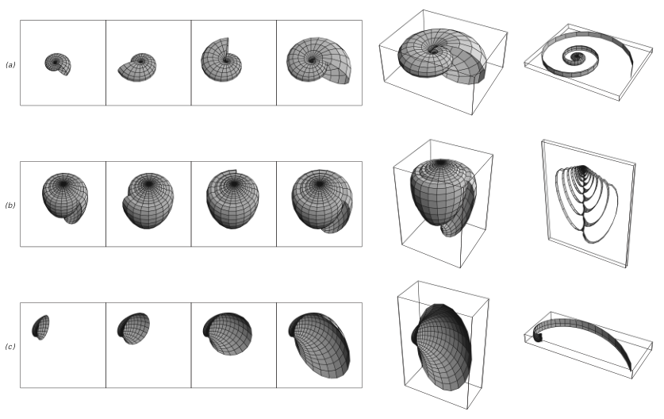
<!-- ORIGINAL_FIGURES page=0430 end -->

在一侧分泌新壳材料的速度比另一侧快，从而使壳以螺旋方式生长。壳开口周围不同点处壳材料的分泌速率，大概由动物解剖结构的细节决定。事实证明，就像本节前面分枝结构的情形一样，即使这些速率发生相当小的变化，也能对壳的总体形状产生相当戏剧性的影响。

下面的图片显示了可能发生的三种例子，而对页显示了系统改变某些生长速率所产生的效应。我们看到，尽管使用的是同一个非常简单的底层模型，却仍然可以产生各种视觉上非常不同的几何形态。

图：软体动物壳生长的一个简单模型。每一种情况下，新壳材料都会在壳的开口端逐渐添加。左侧规则显示每一阶段在开口周围不同点处添加的物质量；从中心伸出的线表示开口逐渐发生的侧向位移。情形 (a) 是鹦鹉螺壳的典型形式，(b) 是芋螺壳的典型形式，(c) 是蛤壳一半的典型形式。所有通过按这里所示固定规则添加物质而产生的壳，都具有这样一个性质：在整个生长过程中，它们保持相同的总体形状。

---

[[PDF page 431]]

<!-- ORIGINAL_FIGURES page=0431 start -->
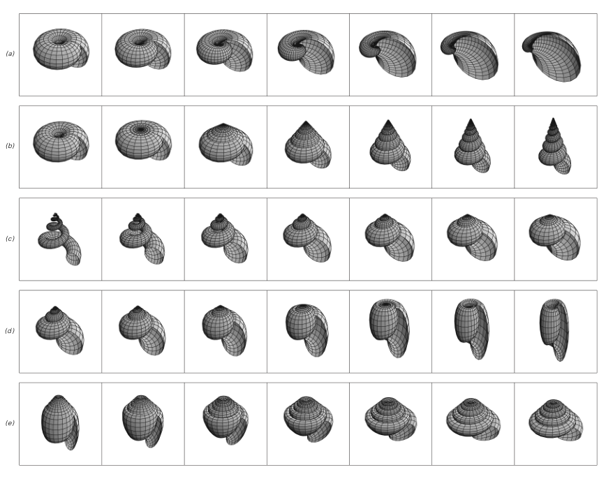
<!-- ORIGINAL_FIGURES page=0431 end -->

图：改变软体动物壳生长规则中五个简单特征的效应：(a) 每转一圈过程中尺寸增加的总体因子；(b) 每转一圈时开口向下位移的相对量；(c) 开口相对于壳总体尺寸的大小；(d) 开口的拉长程度；(e) 开口拉长方向。每一行开头和末尾的图片大致对应如下：(a) 椎实螺壳、鸟蛤壳；(b) 椎实螺壳、角贝壳；(c) 蠕虫螺壳、帽贝壳；(d) 滨螺壳、宝贝壳；(e) 榧螺壳、日晷螺壳。

那么在所有可能形态中，哪些实际出现在真实软体动物中？下一页说明的惊人事实是，基本上所有这些形态都可以在某种软体动物中找到。

如果只看到一枚软体动物壳，人们很可能会以为，它精巧的形态必定由某个漫长的自然选择过程精心塑造出来。但我们现在看到，事实上所观察到的各种不同形态，实际上都只是

---

[[PDF page 432]]

<!-- ORIGINAL_FIGURES page=0432 start -->
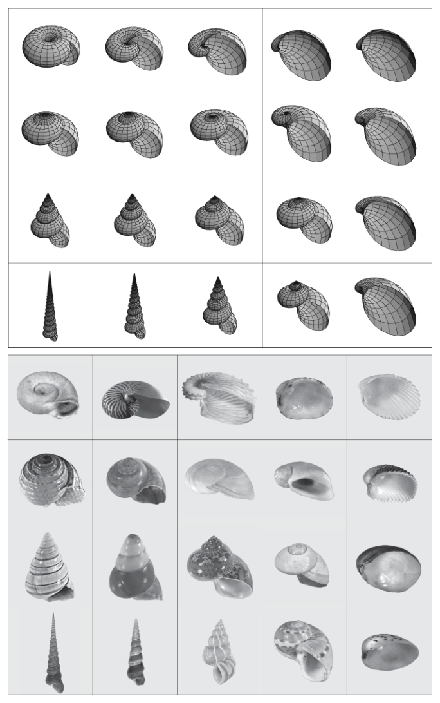
<!-- ORIGINAL_FIGURES page=0432 end -->

图：由简单模型生成并在自然界中发现的壳形。这个数组显示了前一页前两个参数的系统变化。其他参数也可以制成类似数组。

---

[[PDF page 433]]

三维几何应用于非常简单底层生长规则的后果。因此，再一次，自然选择不能合理地被看作我们所见精巧形态的来源。

离开软体动物壳，卷曲结构像分枝结构一样，在动物中并不特别常见。事实上，绝大多数动物的总体形态并不倾向于由任何单一结构类型支配。相反，它们通常由一组分离的、可识别的部分构成，例如头、尾、腿、眼睛等等，每一部分都有自己的具体结构。

有时，其中某些部分会重复，也许以一串体节的形式，也许以某种二维阵列的形式。而且，整个动物常常覆盖着相当均一的外皮。但许多动物最明显特征之一，最终仍是存在许多不同种类的部分。

那么所有这些部分是怎样产生的？基本机制似乎是，在发育中的动物内部，不同地点和不同时间会使用其遗传程序的不同片段，从而导致不同种类的生长发生，并产生不同结构。使这一切成为可能的部分原因是，特别是在胚胎阶段，动物中的大多数细胞并不是极其刚性的，因此即便动物的不同片段生长方式相当不同，它们仍然可以变形以相互贴合。

通常确实有一些元素，例如骨骼，最终会变得刚性。但关键是，在动物基本形态被决定的阶段，这些元素中的大多数尚未刚化。这就允许发生各种原本不可能的过程。

其中也许最重要的是折叠。因为折叠不仅参与产生牙齿表面和人类耳垂这样的形状，而且对使平坦组织片形成动物体内常见的各种囊袋和管道也至关重要。

折叠似乎由多种原因导致。有时它最可能是由微观纤维拉扯直接造成的。在其他情况下，它大概是不同位置以不同速率生长的后果，如第 412 页上的图片所示。

---

[[PDF page 434]]

<!-- ORIGINAL_FIGURES page=0434 start -->
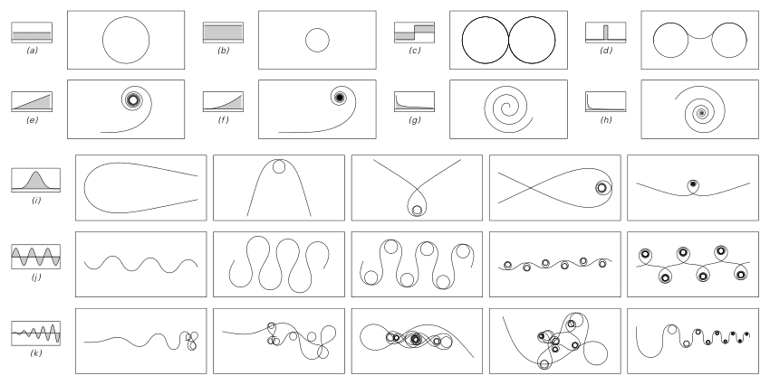
<!-- ORIGINAL_FIGURES page=0434 end -->

图：当沿着曲线从一端走向另一端时，按照确定规则改变局部曲率所得到的曲线。每一串曲线显示当局部曲率乘以逐渐更大的因子时会发生什么。某个特定点处的局部曲率定义为近似该点处曲线的圆的半径倒数。每组图片的局部曲率作为弧长函数的公式如下：`1`（圆）；`s`（科尔纽螺线或回旋曲线）；`s^2`；`1/s`（圆渐开线）；`1/s`（对数螺线或等角螺线）；`1/s^2`；`4 - s^2`；`Sin[s]`；`s Sin[s]`。曲率函数 `f[s]` 可以被看作指定车辆在每个时刻要转多少弯，才能沿着曲线行驶。曲线经过旋转，以适配给定框架。

但折叠能产生什么种类的形状？上面的图片显示了如果局部曲率，也就是本质上的局部折叠速率，在沿着曲线前进时按照几条简单规则变化，会发生什么。在少数情况下，产生的形状相当简单。但在大多数情况下，它们相当复杂。只需非常简单的规则，就可以生成看起来像绒毛以及动物中常见其他皱褶结构的形状。

除折叠以外，发育中动物缺乏刚性还使其他类型过程成为可能。一个是通过细胞之间黏附丧失而产生的组织沟裂或撕裂。另一个是基于化学或免疫亲和性的单个细胞显式迁移。

但所有这些不同过程怎样组织起来产生一个实际动物？如果观察一个

---

[[PDF page 435]]

典型动物胚胎中发生的事件序列，它们一开始显得相当杂乱无章。但大概正在发生的主要事情，如上所述，是在不同地点和不同时间使用底层遗传程序的不同片段；而这些不同片段可以导致非常不同的行为。有些可能只产生均匀生长。另一些可能导致各种局部折叠。还有一些可能使组织区域死亡，从而例如允许分离的手指和脚趾从一整片组织中显现出来。

但究竟怎样决定在动物发育的哪个时刻、哪个位置应使用底层遗传程序的哪个片段？一开始，人们也许会认为，每一个出现的单个细胞都可能使用底层遗传程序中的不同片段。在只有几百个细胞的非常简单动物中，这很可能实际就是发生的事情。

但一般而言，最终使用底层程序不同片段的，似乎不那么是单个细胞，而是发育中动物的各个区域。事实上，典型模式似乎是，每当动物的某个部分长到横跨几十分之一毫米时，该部分就可以分裂成少数几个更小区域，而每个区域使用底层遗传程序的不同片段。

这是怎样运作的？看起来，存在一些细胞会产生化学物质，而这些化学物质的浓度会在几十分之一毫米的距离上降低。过去十年左右发现的是，在所有动物以及植物中，都有少数所谓同源盒基因，它们似乎会在特定浓度水平上变得活跃或不活跃，并控制底层遗传程序的哪个片段将被使用。

这样一类过程存在固定长度尺度，几乎不可避免地意味着胚胎必须以某种层级方式发育。因为在足够早的阶段，整个胚胎会小到只能包含少数几个使用不同遗传程序片段的区域。在这个阶段，例如也许已经有腿区域，但还不会有独立的脚区域。

---

[[PDF page 436]]

<!-- ORIGINAL_FIGURES page=0436 start -->
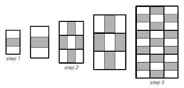
<!-- ORIGINAL_FIGURES page=0436 end -->

然而随着胚胎生长，腿区域最终会变得足够大，可以分化成几个分离区域。此时，一个独立的脚区域就可以出现。然后，当脚区域变得足够大，它也可以分裂成一些分离区域，例如将变成骨骼或软组织的区域。当某个将变成骨骼的区域变得足够大时，它还可以进一步分裂成一些区域，例如产生分离的单块骨头。

如果在每个阶段，每个产生区域中的组织都以相同速率生长，唯一不同的是每个区域中最终存在什么类型的细胞，那么就不可避免地会出现一种简单而高度规则的总体结构，如下面的理想化图片所示。对每种细胞类型使用不同替换规则时，结构通常会是嵌套的。事实上，例如动物骨骼中的某些部分似乎确实至少粗略表现出这种嵌套的若干层级。

图：动物生长中大概发生的连续细分的示意图。这里假定细分在两个方向上发生，总是给出三个简单矩形，并且它们都以相同速率生长。实践中，几何形态通常会复杂得多。

但在大多数情况下，并不存在这种明显的嵌套。一个原因是，区域可能不是分裂成一条简单的小区域序列，而是分裂成同心圆，或分裂成某种排列复杂得多的区域集合，例如我将在下一节讨论的那种。也许更重要的是，一个区域可能分裂成以不同速率生长的较小区域，并且可能折叠或以其他方式变形。当这种情况发生时，发展出来的几何形态继而会影响后续区域分裂的方式。

产生动物不同部分的基本机制，是横跨几十分之一毫米的区域分裂成分离的较小区域；这个想法最终竟然同植物茎在顶端约一毫米宽时

---

[[PDF page 437]]

通过分出更小茎来生长的想法奇异地相似。事实上，甚至已经知道其中涉及的某些遗传现象极其相似。

但关键是，由于植物在其最重要生长期中相对刚性，只有涉及相当显式分枝的结构能够产生。然而在动物中，缺乏刚性允许范围大得多的结构出现，因为现在不同区域中的组织不必只是均匀生长，而是可以以各种各样的方式改变形状。

到动物孵化或出生时，它的基本形态通常已经确定，并且已有骨骼或其他刚性元素就位以维持这种形态。但在大多数动物中，之后仍然会有显著的进一步尺寸增长。那么这是怎样运作的？

有些骨骼实际上只是通过向外表面添加物质来扩张。但在许多情况下，骨骼实际上被分成若干段，并且生长发生在这些段之间。因此，例如手臂和腿中的长骨，在其主干两端都有生长区域。头骨则被分成一组片状部分，每一片都围绕其边缘生长。

动物不同部分通常有稍微不同的生长速率，例如导致从出生到成年通常看到的相对头部尺寸减小。这不可避免地意味着，动物成熟时形状至少会发生一些变化。

但如果比较不同品种或物种的动物呢？一开始，它们的形状可能显得相当不同。但事实证明，在某一科甚至某一目动物内部，经常可以发现，它们的总体形状事实上由相当简单而平滑的几何变换联系起来。

事实上，很可能就像我们本节前面讨论的叶子和贝壳一样，动物形状和形态之间的差异，往往在很大程度上只是由于其不同部分生长速率的不同图案造成的。

不用说，正如叶子和贝壳那样，这些差异可以在视觉和机械上都产生相当戏剧性的效果，

---

[[PDF page 438]]

例如把一种四足行走的动物变成两足行走的动物。而且，再一次，就像叶子和贝壳一样，在我们看到的动物中，很可能有相当一部分对应于相对生长速率各种可能选择中的许多选择。

本节开始时，我们问：要产生植物和动物形态中所见的那种多样性和复杂性，需要什么底层生长规则？在我们考察的每一种情况下，发现的都是惊人简单的规则似乎已经足够。事实上，多数情况下，基本规则似乎比许多非生物系统中起作用的规则还要稍微简单。但使我们在生物系统中看到的醒目多样性成为可能的是，不同有机体以及不同有机体物种总是基于至少略有不同的规则。

上一节中我论证说，这类规则大体上并不是由自然选择仔细挑选的，而只是几乎随机地从各种可能性中选出的。然而，从传统数学模型的经验出发，人们也许会假定，这必然意味着所有植物和动物都会具有看起来相当相似的形态。

但本书所发现的是，当人们使用对应于简单程序的规则，而不是例如传统数学方程时，十分常见的是，不同规则会导致相当不同，而且常常高度复杂的行为图案。我怀疑，正是这种基本现象，负责了我们在植物和动物形态中看到的大部分多样性和复杂性。

## 生物色素图案

在视觉层面，色素图案代表了生物有机体中最明显的复杂性例子之一。过去人们通常假定，要得到这类图案中所见的复杂性，必定存在某种高度复杂的底层机制，大概同通过自然选择进行优化有关。

然而，根据本书的发现，我强烈怀疑，事实上生物有机体中绝大多数色素图案，是由基本规则极其简单，而且往往本质上随机选择的过程生成的。

---

[[PDF page 439]]

<!-- ORIGINAL_FIGURES page=0439 start -->
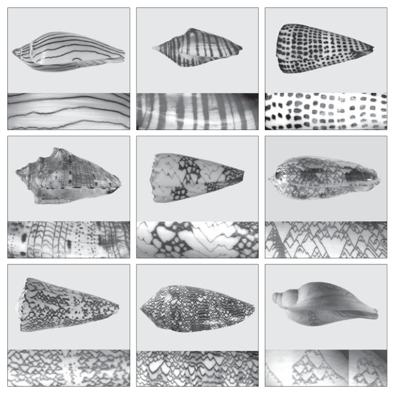
<!-- ORIGINAL_FIGURES page=0439 end -->

下面的图片显示了软体动物壳上发现的一些典型图案例子。这些图案中许多相当简单。但也有一些高度复杂。然而观察这些图案时，人们会注意到一个惊人的相似性：它们同本书中我们已经多次见过的、由简单一维元胞自动机生成的图案非常相似。

图：软体动物壳上的色素图案典型例子。在每个特写中，图案都从上到下生长，正像一维元胞自动机中那样。带三角形的图案常被称为“帐篷”或“叉分”形式。右下方的贝壳是一件略微罕见的标本，其中可以看到接近显式嵌套图案的东西。大多数贝壳长一到四英寸；右下方那枚长九英寸。所有图案都是大致白色背景上的各种棕色色调。这些贝壳的类型如下：第一行，Elliot 涡螺、旗状涡螺、字母芋螺；第二行，音乐涡螺、带纹大理石芋螺、帐篷榧螺；第三行，树枝芋螺、织锦芋螺、假瓜涡螺（Livonia mammilla）。

---

[[PDF page 440]]

<!-- ORIGINAL_FIGURES page=0440 start -->
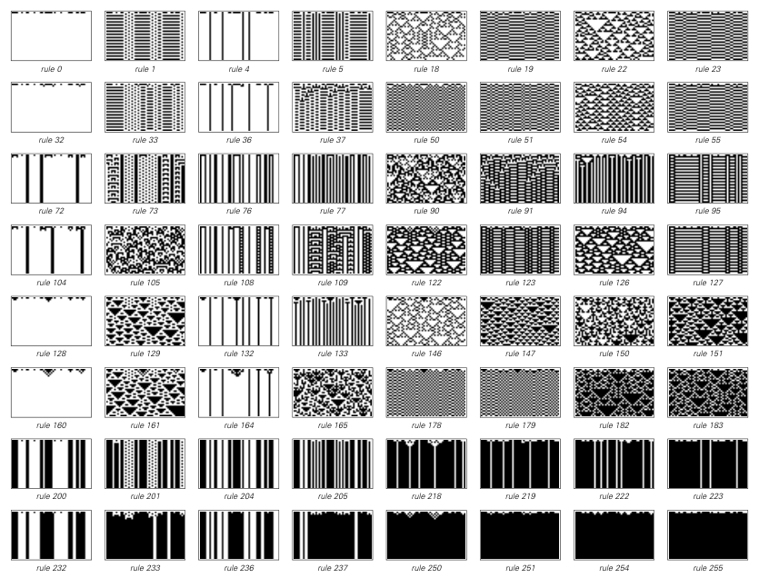
<!-- ORIGINAL_FIGURES page=0440 end -->

我相信，这种相似性并非巧合。软体动物壳像一维元胞自动机一样，实际上一次生长一条线；新的壳材料由壳内动物边缘处的一圈软组织产生。壳上的色素究竟怎样沉积，并不完全清楚。毫无疑问，软组织中存在一些元素，它们在任何一点要么会分泌色素，要么不会分泌色素。大概这些元素之间有某些相互作用。给定这一点，从某种意义上说，最简单的假设就是，一个元素的新状态由其邻居的先前状态决定，正像一维元胞自动机中那样。

图：从随机初始条件出发，每一种最简单的对称一维元胞自动机规则演化产生的图案例子。得到的图案类型同前一页软体动物壳上看到的图案显示出醒目的相似性。

---

[[PDF page 441]]

但某个给定软体动物究竟会使用哪一条具体元胞自动机规则？对页底部的图片显示了所有涉及两种颜色和最近邻的可能对称规则。把这些图片中的图案同实际软体动物壳上的图案相比较，会注意到一个惊人事实：两种情况下出现的图案范围极其相似。

传统观念也许会提示，每一种软体动物都会仔细优化其壳上的图案，以避开捕食者，或吸引配偶或猎物。但我认为，更可能的是，这些图案由实际上从一组最简单可能性中随机选择的规则生成。这意味着，只要这类图案中出现复杂性，它在某种意义上就是一种巧合。并不是有什么精巧机制专门发展出来产生这种复杂性。相反，它只是作为本书发现的基本现象的必然后果出现：简单规则常常会产生复杂行为。

事实上，许多软体动物物种壳上的图案，无论简单还是复杂，在动物整个生命过程中都被一层不透明外皮完全遮盖，因此大概不可能由任何仔细优化或自然选择过程决定。

那么其他类型动物身上的色素图案又如何？软体动物壳几乎是唯一一种图案逐线建立的情况；更常见的是，图案会在一个表面上同时到处发育出来。

最常见的情况似乎是，在胚胎生长的某个时刻，产生色素的细胞前体出现在其表面上，随后同不同颜色色素相关的这些细胞群排列成确定图案。通常每个单独细胞群最初横跨几十分之一毫米。但由于动物不同部分通常以不同速率生长，所以成年动物身上最终看到的图案，在不同位置会按不同尺度缩放；例如动物头部的图案尺度更小，因为头部生长更慢。

---

[[PDF page 442]]

<!-- ORIGINAL_FIGURES page=0442 start -->
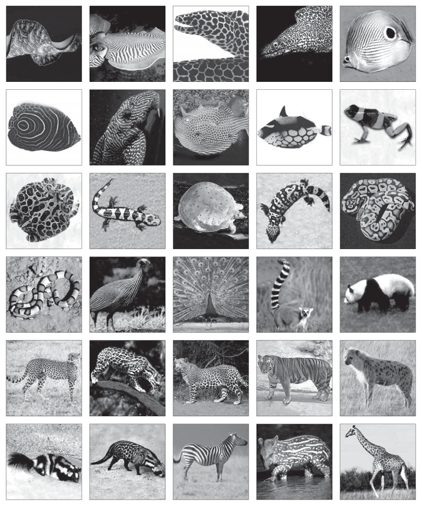
<!-- ORIGINAL_FIGURES page=0442 end -->

图：动物身上色素图案的典型例子。注意，许多非常不同的动物最终具有惊人相似的图案。

---

[[PDF page 443]]

<!-- ORIGINAL_FIGURES page=0443 start -->
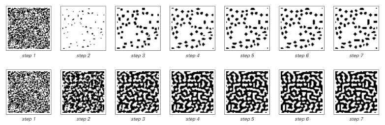
<!-- ORIGINAL_FIGURES page=0443 end -->

对页上的图片显示了动物中色素图案的典型例子，并表明即便跨越范围巨大的不同动物类型，只有少数几类图案反复出现。那么这些图案怎样产生？尽管其中有些显得相当复杂，事实证明，再一次，有一种相当简单的规则可以解释它们。

想法是，当图案形成时，每个元素的颜色会倾向于同附近元素的平均颜色相同，并同更远元素的平均颜色相反。这种效应可能源自激活剂和抑制剂化学物质的产生与扩散，或者例如源自不同类型细胞的实际运动。但无论其来源是什么，仅仅通过建立一个带有适当规则的二维元胞自动机，就可以很容易捕捉这种效应本身。

下面的图片显示了对更远元素相对重要性作出两个略微不同选择时发生的情况。在两种情况下，从黑白元素的随机分布出发，很快就会出现确定图案：第一种情况下是一组斑点，第二种情况下是迷宫式结构。

图：简单二维元胞自动机的演化，其中每个元胞在每一步的颜色由查看距离最多为 3 的元胞平均颜色的加权和来决定。所示两条规则中，元胞自身及其最近邻都以权重 1 进入。距离 2 和 3 的元胞以负权重进入，第一条规则每个元胞为 -0.4，第二条为 -0.2。如果加权和为正，元胞变成黑色，否则变成白色。从随机初始条件出发，两条规则都迅速演化到看起来非常像动物色素图案的静止状态。

下一页显示了对不同距离上元素的权重作出一整组不同选择时得到的最终图案。出现的是一定范围的图案，而其中几乎所有最终都同实际动物身上看到的图案相当相似。

---

[[PDF page 444]]

<!-- ORIGINAL_FIGURES page=0444 start -->
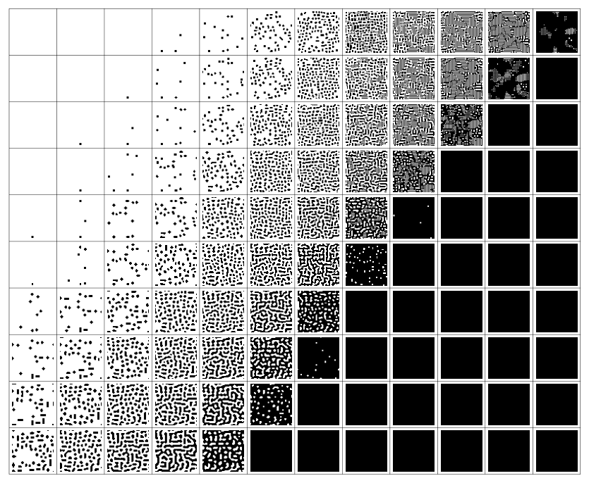
<!-- ORIGINAL_FIGURES page=0444 end -->

图：由上一页所示类型的规则生成的图案，其中对距离 2 和距离 3 的元胞权重作出一系列选择。距离 2 的权重沿页面向下从 -0.9 变化到 0，距离 3 的权重沿页面向右从 -0.7 变化到 0.4。所有情况下，演化都从同一个随机初始条件开始，并持续到稳定。注意，实际动物的色素图案可以包含比这里所示图案更多或更少的元素。

但所有这些图案，在某种意义上每个方向上都具有相同的基本形式。然而有许多动物的色素图案表现为具有确定方向的条纹。有时这些条纹非常规则，并且可能来自任何能够产生重复行为的机制。但当条纹不那么规则时，它们通常看起来非常像对页顶部图片中用上面所述简单机制的一个版本生成的图案。

---

[[PDF page 445]]

<!-- ORIGINAL_FIGURES page=0445 start -->
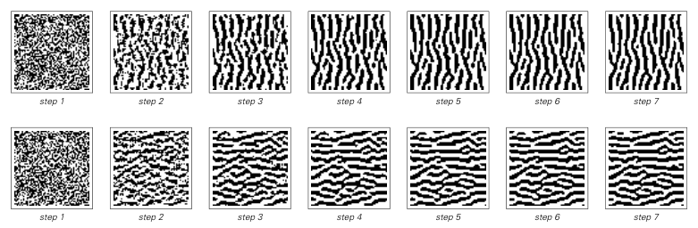
<!-- ORIGINAL_FIGURES page=0445 end -->

图：规则例子，其中水平和竖直方向的元胞被赋予不同权重。第一种情况下，距离 2 和 3 的元胞只在竖直方向上产生影响；第二种情况下，它们只在水平方向上产生影响。结果是形成竖直或水平条纹。

## 金融系统

在本书思想发展的过程中，很多次有人问我，这些思想是否可能应用于金融系统。毫无疑问，它们可以；作为一个例子，我将在这里简要讨论几乎所有金融市场中可能最明显的特征：价格倾向于以表观随机方式波动。

无论观察股票、债券、大宗商品、货币、衍生品，还是基本上任何其他类型的金融工具，连续时刻看到的价格序列都会显示某些总体趋势，但也表现出不同程度的表观随机性。

那么这种随机性的起源是什么？

在最天真的经济理论中，价格是价值的反映，而一项资产的价值等于将从中获得的全部未来收益，例如股息，并对为了等待这些收益而损失的利息作折现之后的总和。

然而按这种观点，很难理解为什么价格竟然会有任何显著波动。通常的说法是，价格事实上并不由真实价值决定，而由在任意给定时刻能够获得的对该价值的最佳估计决定。随后人们假定，这些估计最终会受到世界上正在发生的各种事件影响，从而价格的随机运动在某种意义上只是外部环境中随机变化的反映。

---

[[PDF page 446]]

但尽管这也许是在周或月量级时间尺度上的主导效应，而且在某些情况下或许甚至在小时或天的时间尺度上也是如此，要相信它能够解释分钟甚至秒这样短的时间尺度上常常看到的表观随机性，却很困难。

此外，人们偶尔可以识别出一些看似纯粹投机的情形，其中交易发生时不可能有任何显著外部输入；而在这类情形中，价格往往显示出更多而非更少的看似随机波动。

知道这一点之后，人们也许会认为，随机波动或许只是价格向其正确价值调整方式中的必然特征。但在两方谈判中，人们常常看到价格相当平滑地收敛到最终价格。当然，人们也可以构造在更多参与方之间运行的算法，并让它们同样导致相当平滑的行为。

所以在实际市场中，大概还有其他事情发生。毫无疑问，其中一部分只是因为被记录价格的一串交易，通常由一串不同实体执行，无论这些实体是人、组织还是程序；每个实体都有自己决定适当价格的具体方式。

但正如我们在本书研究过的许多其他系统中看到的那样，一旦一个系统中有足够多分离元素，就有理由预期，人们所看到的总体集体行为将会超出单个元素的细节。

有时人们声称，市场必然以某种方式必须是随机的，否则人们就能通过预测市场赚钱。然而，许多人相信自己每天正是以这种方式赚钱。并且，除某些简单情形外，很难看出会存在怎样的反馈机制，能够在可预测元素一被使用时就系统地消除它们。

毫无疑问，随机性有助于维持市场中的某种稳定性，正如它有助于维持本书讨论过的许多其他种类系统中的稳定性一样。事实上，大多数市场的设置方式，都会防止与

---

[[PDF page 447]]

某些随机性丧失相关的极端不稳定性，有时甚至通过明确暂停交易来做到这一点。

但市场中为什么一开始就有随机性？

实践经验表明，特别是在短时间尺度上，人们看到的随机性很大一部分纯粹是市场内部动力学的后果，几乎同被交易对象的性质或价值无关。

那么如何理解正在发生的事情？需要一个关于市场中大量实体的运作和相互作用的基本模型。但传统数学强调把一切化约为少数连续数值函数，在这方面能提供的东西相当少。

不过，用程序的方式来思考似乎更有前途。事实上，作为第一近似，可以想象市场中的实体很像元胞自动机中的元胞，可以按照基于其他实体行为的简单规则行动。

若要稍微现实一些，就必须建立一个精巧网络来表示不同实体之间的信息流。并且必须为每个实体分配相当复杂的规则，当然至少同典型程序化交易系统中的规则一样复杂。但从本书中我们已经学到的东西来看，系统底层结构中的这类复杂性似乎不太可能对其总体行为产生关键影响。

因此，作为最小理想化，例如可以尝试把市场看作类似一个简单一维元胞自动机。每个元胞对应一个单独交易实体，某一步中元胞的颜色指定该实体在那一步选择买入还是卖出。人们可以想象各种各样更新这些颜色的方案。但作为市场中信息流动方式的一种非常简单的理想化，例如可以让每个颜色由一条固定规则给出，而这条规则基于每个实体查看其邻居在前一步的行动。

按传统直觉，人们会假定这样简单的模型必定具有极其简单的行为，当然不可能像真实市场中看到的那样。但正如本书已经发现的，

---

[[PDF page 448]]

<!-- ORIGINAL_FIGURES page=0448 start -->
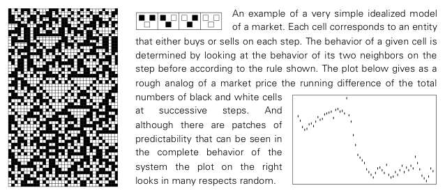
<!-- ORIGINAL_FIGURES page=0448 end -->

简单模型并不一定有简单行为。下面的图片确实显示了可能出现的一种行为例子。

图：一个非常简单的理想化市场模型例子。每个元胞对应一个实体，该实体在每一步要么买入，要么卖出。给定元胞的行为由查看它两个邻居在前一步的行为，并按照所示规则来决定。下面的曲线图给出连续步骤中黑色元胞和白色元胞总数的运行差，作为市场价格的粗略类比。尽管在系统完整行为中可以看到一些可预测的小片区域，右侧曲线图在许多方面仍看起来是随机的。

在真实市场中，通常不可能详细看到每个实体在做什么。事实上，人们常常只知道交易执行时的价格序列。在简单元胞自动机中，对此的粗略类比是连续步骤中得到的黑色和白色元胞总数的运行差。

只要元胞自动机的底层规则使得信息最终会从一个实体传播到所有其他实体，这实际上就是有效市场假说的一个最小版本，那么元胞数量的运行总和就基本不可避免地会表现出显著随机性。

人们总能让底层系统变得更复杂，例如使用元胞网络，或允许不同元胞拥有不同而且也许会变化的规则。但尽管这会使人们即便查看系统中每个元素的完整行为，也更难识别出确定规则，它并不影响这个基本观点：存在能够由系统演化内在生成的随机性。
