# 第 9 章：基础物理

[[PDF page 449]]

<!-- ORIGINAL_FIGURES page=0449 start -->
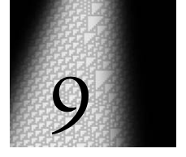
<!-- ORIGINAL_FIGURES page=0449 end -->

# 基础物理

## 物理学的问题

在上一章中，我们看到，各种日常系统中许多重要方面都可以通过简单程序的思路来理解。但基础物理又如何？从研究简单程序得到的思想也能应用在那里吗？

基础物理是传统数学科学方法获得最大成功的领域。但尽管有这些成功，仍然有许多核心问题远未解决。本章的目的，就是在我们通过研究简单程序所学到的东西的启发下，考察其中若干问题。

一开始，试图用简单程序作为理解基础物理的基础，似乎不太合理。因为物理系统中一些最稳固确立的特征，例如能量守恒或空间方向的等价性，在本书目前讨论过的大多数程序中似乎并没有明显对应物。

正如我们将看到的，简单程序实际上有可能显示出这类特征。但事实证明，物理学中一些最重要的未解问题，涉及的是在某种意义上更一般的现象，并不太依赖这类特征。

事实上，本章将表明，尽管传统努力相当不成功，极其简单的程序却常常能够捕捉正在发生的事情的本质。

---

[[PDF page 450]]

因此，例如在本章前半部分，我将讨论所谓热力学第二定律，或熵增加原理：观察到许多物理系统随着时间推进，倾向于不可逆地变得更随机。我会说明，这类行为的本质可以很容易地在简单程序中看到。

自第二定律最初被表述以来，已经过去了一个多世纪。尽管传统物理中有许多详细结果，它的起源仍然相当神秘。但本章我们将看到，通过在简单程序语境中研究第二定律，我们最终将能够清楚理解它为什么如此常常成立，以及它什么时候可能不成立。

我研究第二定律这类问题的方法，实际上是把简单程序作为物理系统的隐喻。但这类程序事实上能不能不只是隐喻？例如，是否可以想象，在某个层面上，物理系统实际上直接按照一个简单程序的规则运行？

从我们今天知道的物理定律来看，这似乎荒谬。因为一开始，这些定律可能显得过于复杂，无法对应于任何简单程序。但本书的关键发现之一是，即便底层规则非常简单的程序，也能产生巨大的复杂性。

基础物理也可能如此。在我们今天所知的物理定律之下，可能存在一个非常简单的程序；所有已知定律，以及最终我们在宇宙中看到的一切复杂性，都从这个程序中涌现出来。

假定我们的宇宙本质上只是一个简单程序，当然是一个大胆假说。但在本章后半部分，我将描述我在研究这个假说、并弄清可能涉及哪些简单程序的细节时所取得的一些重要进展。

还有一段路要走。但根据我迄今发现的东西，我极为乐观：利用本书的思想，物理学最根本的问题，也是全部科学的终极问题之一，最终也许已经有望被解决。

---

[[PDF page 451]]

<!-- ORIGINAL_FIGURES page=0451 start -->
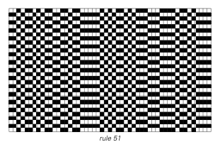
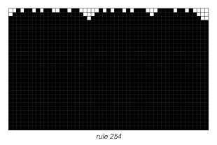
<!-- ORIGINAL_FIGURES page=0451 end -->

## 可逆性的概念

在像元胞自动机这样的系统的演化中，在任何特定步骤，系统的底层规则都会告诉人们如何前进到下一步。但如果人们想倒着走呢？能否从某一步黑白元胞的排列推断出此前各步元胞的排列必定是什么样？

目前所有证据都表明，物理学的底层定律具有这种可逆性。因此，这意味着，只要足够精确地知道某个物理系统当前的状态，就不仅可以推断它未来会做什么，也可以推断它过去做过什么。

在下面显示的第一个元胞自动机中，这也很直接。因为任何一个元胞如果在某一步具有某种颜色，那么在前一步它必定总是具有相反颜色。

图：可逆和不可逆元胞自动机的例子。规则 51 是可逆的，因此它保留了足够信息，使人们能够从任何特定步骤既向前也向后演化。规则 254 不可逆，因为它总是演化到均匀黑色，并且不保留关于较早步骤元胞排列的信息。

但第二个元胞自动机的工作方式不同，不允许人们倒推。因为仅仅几步之后，不管每个元胞原来是什么，它都会把所有元胞变成黑色；结果就无法判断较早步骤中可能出现过什么颜色。

自然界中有许多系统似乎会有点像上面的第二种情况那样组织自身。事实上，这同已知物理底层定律可逆性之间的冲突，正与本章下一节的主题有关。

---

[[PDF page 452]]

<!-- ORIGINAL_FIGURES page=0452 start -->
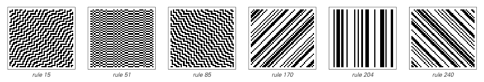
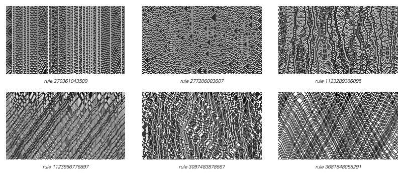
<!-- ORIGINAL_FIGURES page=0452 end -->

不过，我在这里的目的是探索什么样的系统可以是可逆的。在具有两种颜色和最近邻规则的 256 个初等元胞自动机中，事实证明只有下面显示的六个是可逆的。正如图片所显示的，它们都表现出相当平凡的行为，其中只对元胞初始构型作出相当简单的变换。

图：六个可逆初等元胞自动机的行为例子。在所有情况下，对初始条件所作的变换都足够简单，以至于在演化中向后和向前一样直接。

那么，是否可能在保持可逆性的同时得到更复杂的行为？具有三种颜色和最近邻规则的元胞自动机共有 7,625,597,484,987 个；在其中搜索，只发现 1800 个是可逆的。在这 1800 个中，许多也表现出简单行为，很像上面的图片。但也有一些表现出更复杂的行为，如下面的图片所示。

图：具有三种颜色和最近邻规则的 1800 个可逆元胞自动机中的一些例子。尽管这些系统表现出会搅乱初始条件的复杂行为，它们全都仍然是可逆的，因此从每幅图底部的元胞构型出发，总能推断出所有前面步骤上的构型。

---

[[PDF page 453]]

<!-- ORIGINAL_FIGURES page=0453 start -->
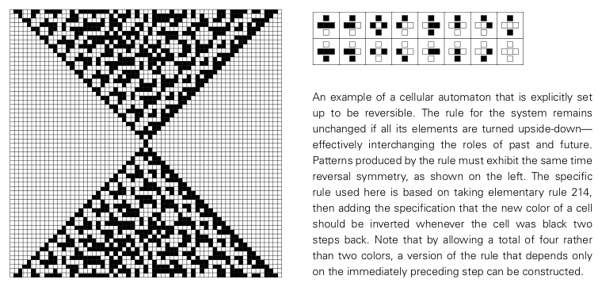
<!-- ORIGINAL_FIGURES page=0453 end -->

现在怎样判断这类系统是可逆的？它们的演化不再只是导致初始条件的简单变换。但人们仍可以检查：从每幅图底部的具体元胞构型出发，能否反向演化到图片顶部。给定一条特定规则后，事实证明进行详细分析来证明或否定它的可逆性是相当直接的。

不过，在试图理解可逆系统中可能出现的行为范围时，通常方便的做法是考虑一些元胞自动机类别，其中规则被专门构造成可逆的。下面说明了一类这样的系统。想法是让规则即使上下翻转后仍然明确保持相同，从而交换过去和未来的角色。

图：一个明确设定为可逆的元胞自动机例子。如果把所有元素上下翻转，系统规则保持不变，这实际上交换了过去和未来的角色。该规则产生的图案必须表现出同样的时间反演对称性，如左侧所示。这里使用的具体规则基于初等规则 214，然后加上一条规定：每当元胞在两步之前为黑色时，就把该元胞的新颜色反转。注意，如果允许总共四种颜色而不是两种颜色，就可以构造出一个只依赖紧前一步的规则版本。

这类规则可以通过取普通元胞自动机，并添加对两步之前颜色的依赖来构造。

所得规则可以向前也可以向后运行。在每一种情况下，它们都需要知道不止一步、而是连续两步上的元胞颜色。不过，只要给定这种知识，规则就可以用来决定未来或过去步骤上的元胞构型。

接下来两页显示了这类元胞自动机在随机初始条件和简单初始条件下的行为例子。

---

[[PDF page 454]]

<!-- ORIGINAL_FIGURES page=0454 start -->
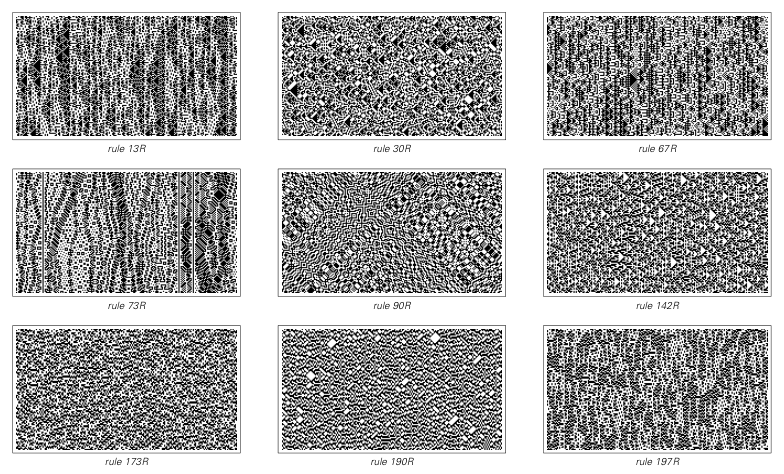
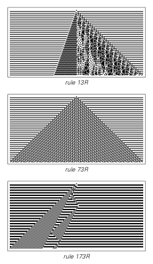
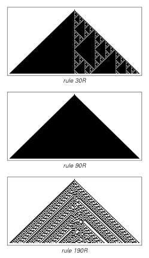
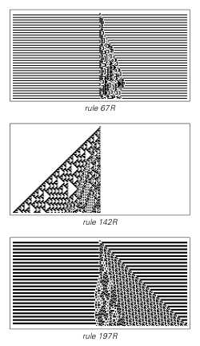
<!-- ORIGINAL_FIGURES page=0454 end -->

图：从随机初始条件和简单初始条件出发的可逆元胞自动机例子。在上方一组图片中，前两个连续步骤上的每个元胞都以相等概率被选为黑色或白色。在下方一组图片中，只有中心元胞在这些步骤上被设为黑色。

---

[[PDF page 455]]

<!-- ORIGINAL_FIGURES page=0455 start -->
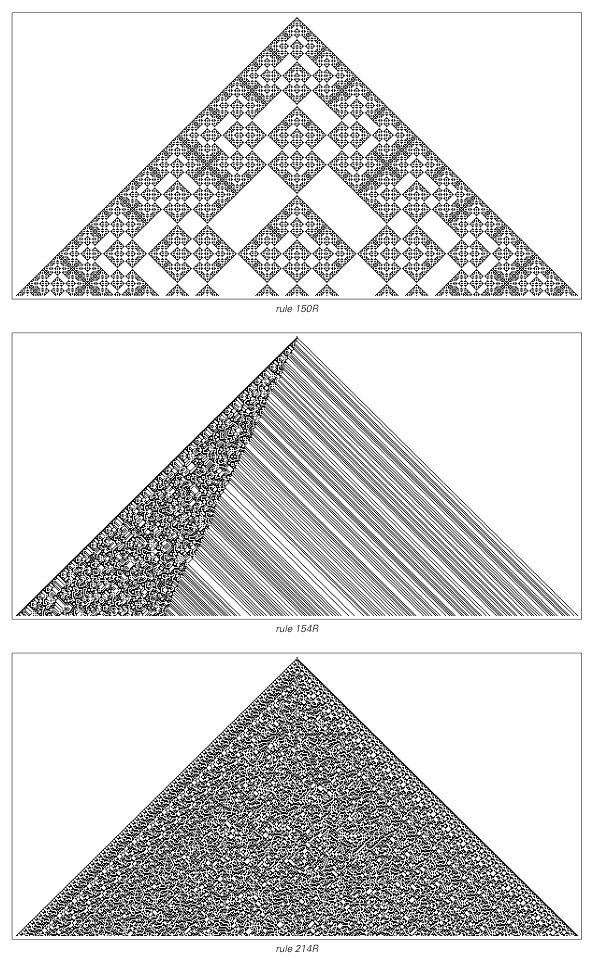
<!-- ORIGINAL_FIGURES page=0455 end -->

图：三个可逆元胞自动机演化 300 步。在第一种情况下，得到规则嵌套图案。在另外两种情况下，图案显示出许多随机性特征。

---

[[PDF page 456]]

<!-- ORIGINAL_FIGURES page=0456 start -->
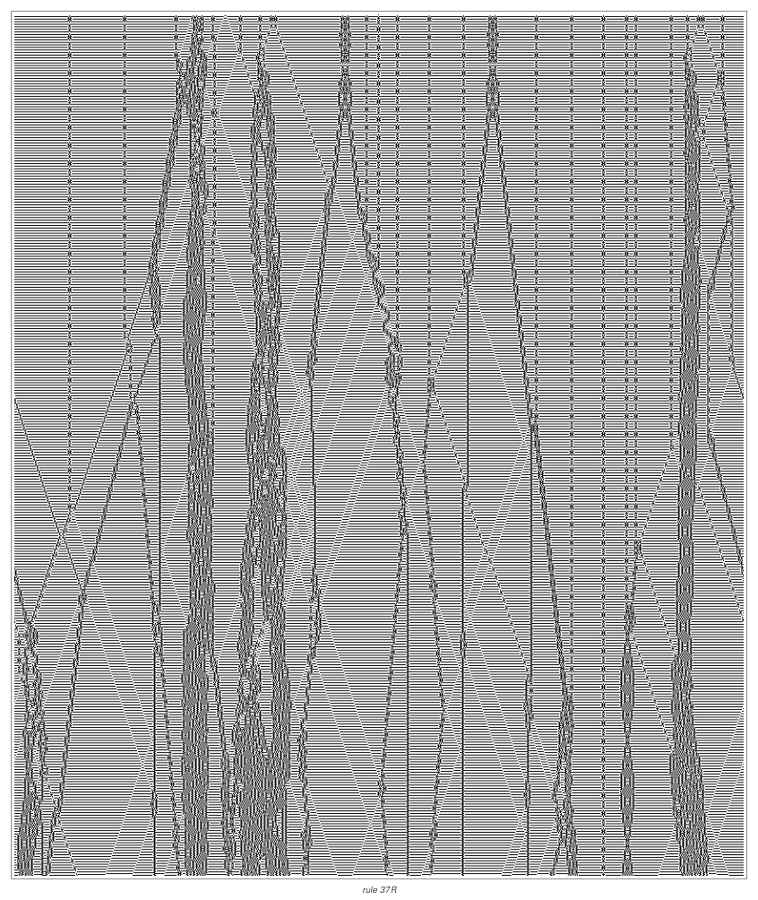
<!-- ORIGINAL_FIGURES page=0456 end -->

图：一个可逆元胞自动机例子，其演化支持局部结构。由于底层规则的可逆性，每一次碰撞在其初始状态和最终状态互换后，也必须能够同样发生。

---

[[PDF page 457]]

在某些情况下，行为相当简单，得到的图案具有简单重复或嵌套结构。但在许多情况下，即便使用简单初始条件，所产生的图案也高度复杂，而且在许多方面显得随机。

底层规则的可逆性有一些明显后果，例如存在指向侧方而不向下的三角形。但尽管这些规则是可逆的，它们仍然能够产生我们在本书中一再看到的、来自元胞自动机和许多其他系统的那类复杂行为。

那么局部结构又如何？

对页上的图片表明，它们也可以出现在可逆系统中。可能碰撞类型的细节确实受到一些约束，但可逆规则通常倾向于非常像普通规则那样工作。

因此，最终看来，尽管只有极小一部分可能系统具有可逆性，这类系统仍然可以表现出同任何其他地方所见一样复杂的行为。

## 不可逆性与热力学第二定律

我们从粒子物理及其他领域得到的所有证据都表明，在基本层面上物理定律精确可逆。然而，我们的日常经验充满了看似不可逆的现象。最常见的情况是，一个从相当规则或有组织状态开始的系统，会逐渐变得越来越随机、越来越无组织。事实证明，这种现象已经可以在许多简单程序中看到。

下一页顶部的图片显示了一个例子，它基于上一节讨论过的那类可逆元胞自动机。这个系统中的黑色元胞有点像粒子，它们在盒子内部弹来弹去，并在碰撞时相互作用。

起初，粒子被放在盒子中央的一个简单排列中。但随着时间推移，图片显示粒子的排列变得越来越随机。

---

[[PDF page 458]]

<!-- ORIGINAL_FIGURES page=0458 start -->
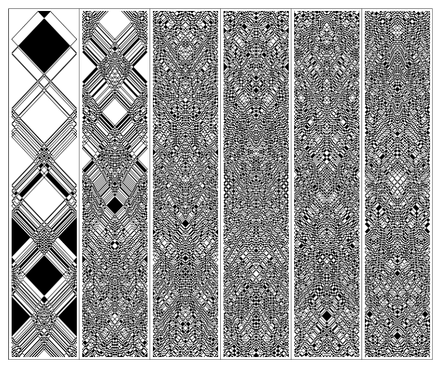
<!-- ORIGINAL_FIGURES page=0458 end -->

图：一个表现出看似不可逆行为的可逆元胞自动机。从所有黑色元胞或粒子都位于盒子中央的初始条件出发，分布逐渐变得更随机。这类行为似乎是热力学第二定律背后的中心现象。这里使用的具体元胞自动机是规则 122R。系统被限制在大小为 100 个元胞的区域中。

传统科学的典型直觉使人难以理解这种随机性怎么可能出现。但本书发现，大范围的系统即使在非常简单的初始条件下也能生成随机性；这使它显得不那么令人惊讶。

但可逆性怎么办？上图所用元胞自动机的底层规则精确可逆。然而这幅图本身起初似乎完全不可逆。因为沿页面上连续图板向下看，随机性似乎存在不可逆增加。

不过，这个表观冲突的解决相当直接。正如对页图片所表明的，如果

---

[[PDF page 459]]

<!-- ORIGINAL_FIGURES page=0459 start -->
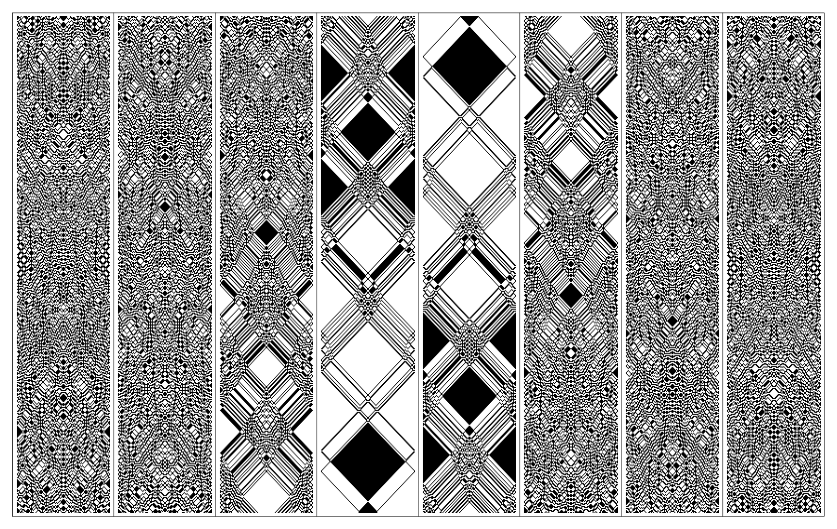
<!-- ORIGINAL_FIGURES page=0459 end -->

图：对页图片的扩展版本，其中底层元胞自动机的可逆性表现得更清楚。初始条件经过仔细构造，使得所示演化进行到一半时会产生一个简单的粒子排列。如果从这个排列开始，那么无论从该点向时间的未来还是过去走，系统随机性实际上都会增加。

简单粒子排列出现在演化中间，那么人们可以很容易看到，无论从那一点向前还是向后走，随机性都以完全相同的方式增加。

然而仍有某种神秘之处。因为我们的日常经验充满了这样的例子：随机性像上图后半部分那样增加。但我们基本上从未看到前半部分中那种随机性的系统性降低。

原则上，通过设定整幅图开头存在的精确初始条件，当然有可能得到这种行为。但不知何故，这类初始条件在实践中似乎基本从不会真正出现。

---

[[PDF page 460]]

过去人们曾相当困惑，为什么情况会如此。但理解正在发生的事情的关键，只是要意识到：人们不仅必须思考正在研究的系统，也必须思考研究这些系统时所使用的实验和观察类型。

随后关键点是，实际实验几乎不可避免地最终只会涉及对我们来说相当容易描述和构造的初始条件。而对于这些类型的初始条件，像上一页那样的系统总是倾向于表现出随机性增加。

但究竟是什么决定了实验中可以使用的初始条件类型？合理的假定是，在任何有意义的实验中，建立实验的过程以某种方式应该比实验打算观察的过程更简单。

但怎样比较这类过程？我将在本书后面相当详细地发展的答案，是把所有这类过程都看作计算。于是结论是，建立实验所涉及的计算，应当比实验所要研究的系统演化所涉及的计算更简单。

显然，从一个简单状态开始，然后沿一个可逆系统的实际演化向后追踪，人们可以找到会导致随机性降低的初始条件。但如果观察例如过去几页上的图片，行为的复杂性似乎排除了任何没那么费力的方式来找到这类初始条件。事实上，我将在第十二章论证，计算等价原理表明，一般而言不应存在这种化简了的过程。

其后果是，任何合理实验都永远不可能涉及设定那类会导致随机性降低的初始条件，因此所有实际实验都倾向于只显示随机性增加。

我相信，正是这个基本论证解释了物理学中所谓热力学第二定律的观察有效性。这条定律最初在一个多世纪前

---

[[PDF page 461]]

被表述出来，但尽管有许多相关技术结果，它为什么有效的基本原因直到现在仍然相当神秘。

热力学领域通常关心物理系统中的热和能量问题。自 19 世纪中叶以来，人们知道的一个基本事实是，热是一种能量形式，与大量原子或其他粒子的随机微观运动有关。

第二定律的一种表述是：任何同这类粒子的有组织运动相关的能量，都倾向于不可逆地退化为热。本节开头的图片显示的本质上正是这种现象。起初有一些粒子以相当规则而有组织的方式运动。但随着时间推移，发生的运动变得越来越随机。

上面使用的元胞自动机有若干细节不同于热力学通常研究的实际物理系统。但以增加一些技术复杂性为代价，建立一个更真实的系统是相当直接的。

接下来两页的图片显示了一个特定二维元胞自动机，其中表示粒子的黑色方块四处移动并相互碰撞，本质上像理想气体中的粒子。这个元胞自动机同本节开头的元胞自动机一样具有可逆性。但它还有一个额外特征：在每次碰撞中，粒子的总数保持不变。而由于每个粒子都可以被看作具有某种能量，于是系统的总能量守恒。

在显示的第一种情形中，粒子被设定为在一个空的方形盒子中弹来弹去。事实证明，在这个特定情况下，只会得到非常简单的重复行为。但几乎任何变化都会破坏这种简单性。

例如，在第二种情形中，一个小的固定障碍物的存在导致粒子排列迅速随机化，非常像我们在本节前面讨论过的一维元胞自动机中看到的随机化。

---

[[PDF page 462]]

<!-- ORIGINAL_FIGURES page=0462 start -->
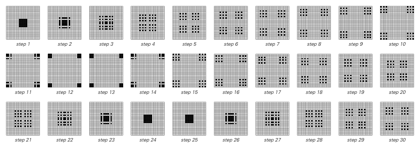
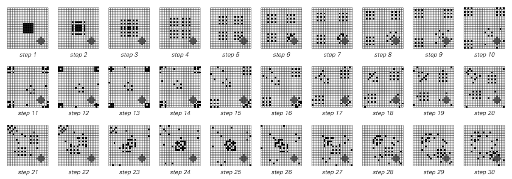
<!-- ORIGINAL_FIGURES page=0462 end -->

图：一个简单二维元胞自动机的行为，它模拟理想粒子气体。在上方一组图片中，粒子在一个空的方形盒子中弹来弹去。在下方一组图片中，盒子包含一个小的固定障碍物。上方一组图片中，粒子排列显示出简单重复行为。下方一组中，它却随时间变得越来越随机。这里使用的元胞自动机底层规则是可逆的，并守恒粒子总数。具体规则基于 2 x 2 块，是下一节将讨论的分块元胞自动机的二维推广。对于每个 2 x 2 块，粒子构型在某一步被设定为保持不变，除非块内恰好有两个粒子沿对角线排列；在这种情况下，粒子移动到相反的对角线。

因此，尽管所有粒子的总能量保持相同，这种能量的分布却逐渐变得更随机，正如通常的第二定律所暗示的那样。

一个重要的实际后果是，从系统中以系统性机械功的形式提取能量会变得越来越困难。在理想化层面，人们也许会想象通过向系统中插入某种桨来尝试做到这一点；粒子的撞击会使这块桨受到力。

---

[[PDF page 463]]

<!-- ORIGINAL_FIGURES page=0463 start -->
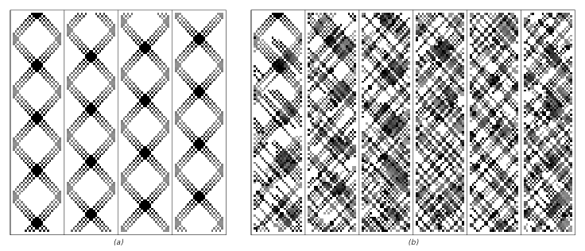
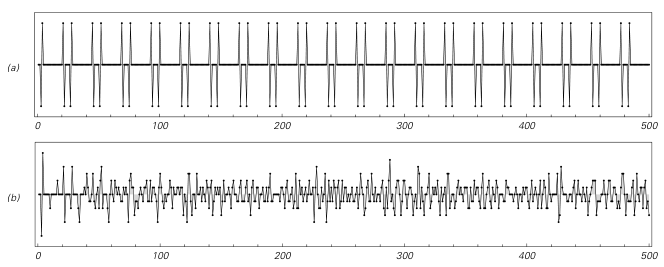
<!-- ORIGINAL_FIGURES page=0463 end -->

图：对页元胞自动机的时间历史。在每种情况下，都取穿过盒子中线的一条切片。离中线更远的黑色元胞以逐渐更浅的灰色显示。情形 (a) 对应一个空的方形盒子，并显示简单重复行为。情形 (b) 对应一个包含固定障碍物的盒子，在这种情况下可以看到迅速随机化。每个图板对应系统演化的 100 步；盒子宽 24 个元胞。

下面的图片显示了这种力在上面情形 (a) 和 (b) 中可能怎样随时间变化。在情形 (a) 中没有发生随机化，力可以很容易预测，并且很容易想象利用它产生系统性机械功。但在情形 (b) 中，力很快随机化，并没有明显办法从中获得系统性机械功。

图：放在上面系统中线上的一块理想化桨所受到的力。这个力反映了每一步从上方和下方到达中线的粒子数量之间的不平衡。在情形 (a) 中，这种不平衡很容易预测。但在情形 (b) 中，它很快就出于大多数实际目的变得随机。这种随机性本质上就是为什么不可能建造一台物理永动机，使其不断把热转化为机械功。

---

[[PDF page 464]]

尽管如此，人们也许仍会想象，可以设计一台复杂机器，也许带有精巧排列的桨，即使从表观随机的粒子分布中仍能提取系统性机械功。但事实证明，为了做到这一点，这台机器实际上必须能够预测每个粒子在每个时刻会在哪里。

正如我们将在第十二章讨论的，这意味着这台机器必须执行同系统本身实际演化所对应的计算一样复杂的计算。结果是，在实践中永远不可能建造永动机，使其不断取得热这种形式的能量，或者随机化粒子运动，并把它转化为有用机械功。

这类永动机的不可能性，是热力学第二定律的一种常见表述。另一种表述是，一个称为熵的量倾向于随时间增加。

熵被定义为，在对系统作出某一组测量之后，关于系统仍然未知的信息量。熵的具体值取决于人们作出哪些测量；但第二定律的内容是，如果在不同时刻重复同样测量，那么由这些测量推得的熵会倾向于随时间增加。

如果设法找到系统中所有粒子的位置和性质，那么关于系统就不会剩下任何未知信息，系统的熵也就只是零。但在实际实验中，人们不能期望作出任何接近这种完整程度的测量。

更现实地说，人们作出的测量也许例如给出盒子内部某些区域中的粒子总数。随后，会有大量可能的粒子详细排列都同这类测量结果一致。熵被定义为为了挑出实际发生的那个具体排列而还需要的额外信息量。

我们将在第十章更详细讨论信息量的概念。但在这里可以想象，为所有同我们

---

[[PDF page 465]]

<!-- ORIGINAL_FIGURES page=0465 start -->
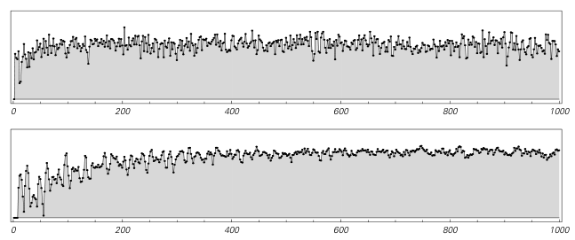
<!-- ORIGINAL_FIGURES page=0465 end -->

测量结果一致的可能粒子排列编号；那么挑出一个单独排列所需的信息量，本质上就是这样一个编号的位数长度。

下面的图片显示了对上面讨论的这类系统以这种方式计算出的熵的行为。我们看到，熵确实倾向于增加，正如第二定律所暗示的。

图：第 447 页情形 (b) 所示类型系统的熵随时间变化。上方曲线正是情形 (b)；下方曲线对应尺寸大三倍的系统。每种情况下，熵的求法都是计算出有多少可能粒子构型同系统内 6 x 6 区域网格中粒子总数的测量相一致。正如热力学第二定律所提示的，熵倾向于随时间增加。注意，如果上面的曲线向左延续，它们将完全对称：从所使用的简单初始条件出发，向前和向后走，熵都会以同样方式增加。

实际发生的是，我们所作的测量代表了一种确定系统状态的尝试。但随着系统中粒子排列变得更随机，这种尝试变得越来越不成功。

人们也许会想象，可能存在一组更精巧的测量，可以以某种方式避免这些问题，并且不会导致熵增加。但正如我们将在第十二章讨论的，事实再次表明，建立这类测量必须涉及同系统本身实际演化一样水平的计算努力。结果，人们得出结论：实际实验中完成的测量所关联的熵总会倾向于增加，正如第二定律所提示的。

---

[[PDF page 466]]

在第十二章，我们会更详细讨论得出这一结论所涉及的一些关键思想。但基本点是，第二定律所蕴含的熵增加现象，或多或少是本书所发现现象的直接后果：即使从简单初始条件出发，许多系统也能产生复杂而看似随机的行为。

我们在前几章已经多次注意到，随机性生成的一个方面是，一旦系统中产生了显著随机性，该系统的总体性质往往会在很大程度上独立于其初始条件细节。

在任何可逆系统中，不同初始条件必定总是导致至少稍有不同的状态，否则就没有唯一方式可以向后演化。但关键是，尽管不同初始条件的结果在细节上不同，它们的总体性质仍然可以非常相同。

对页上的图片显示了可能发生的一个例子。每一幅单独图片都有不同初始条件。但只要产生随机性，最终得到的总体图案看起来几乎无法区分。

底层规则的可逆性意味着，在某个层面上必须有可能识别来自不同初始条件的结果。但关键是，要做到这一点，需要远比任何能够作为实际测量过程一部分而有意义完成的计算更复杂的计算。

因此，这意味着，如果一个系统生成足够随机性，就可以把它看作演化到一个唯一平衡状态，而这个平衡状态的性质出于实际目的独立于初始条件。

事实证明，这一点在某种意义上隐含于物理学的许多日常应用中。因为正是它允许我们只通过指定少数参数，例如温度和化学组成，来刻画各种物理系统，而避免了我们总是必须知道每个系统的初始条件和历史细节。

任何特定系统倾向于演化到某个唯一平衡状态，这也是热力学第二定律的一种常见表述。

---

[[PDF page 467]]

<!-- ORIGINAL_FIGURES page=0467 start -->
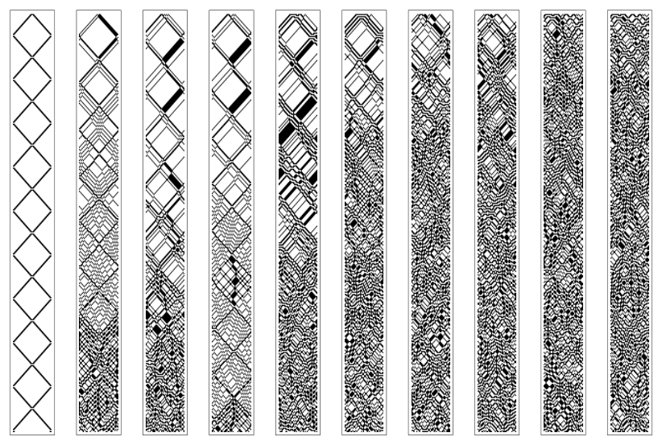
<!-- ORIGINAL_FIGURES page=0467 end -->

图：具有各种不同初始条件的可逆元胞自动机趋近平衡的过程。除了没有发生随机化的例外情形外，用不同初始条件得到的行为，最终在其总体性质上相当无法区分。然而，由于底层规则可逆，不同初始条件得到的细节总是至少稍有不同，否则就不可能以唯一方式向后演化。这里使用的规则是 122R。连续成对的图片，其初始条件只在中心一个元胞的颜色上有所不同。

因此，我们再一次发现，第二定律同本书早期已经看到的基本现象相关。

但第二定律究竟有多一般？它真的适用于我们在自然界中看到的各种系统吗？

大约一个世纪前开始，人们普遍相信第二定律是一个近乎普遍的原理。但现实中，支持这一点的证据少得惊人。

事实上，曾经对完整第二定律作出的几乎所有详细应用，都只涉及一个特定领域：气体的行为。因此到现在为止，有很好的证据表明气体遵守第二定律，正如本节前面的理想化模型所提示的。但其他类型系统又如何？

---

[[PDF page 468]]

<!-- ORIGINAL_FIGURES page=0468 start -->
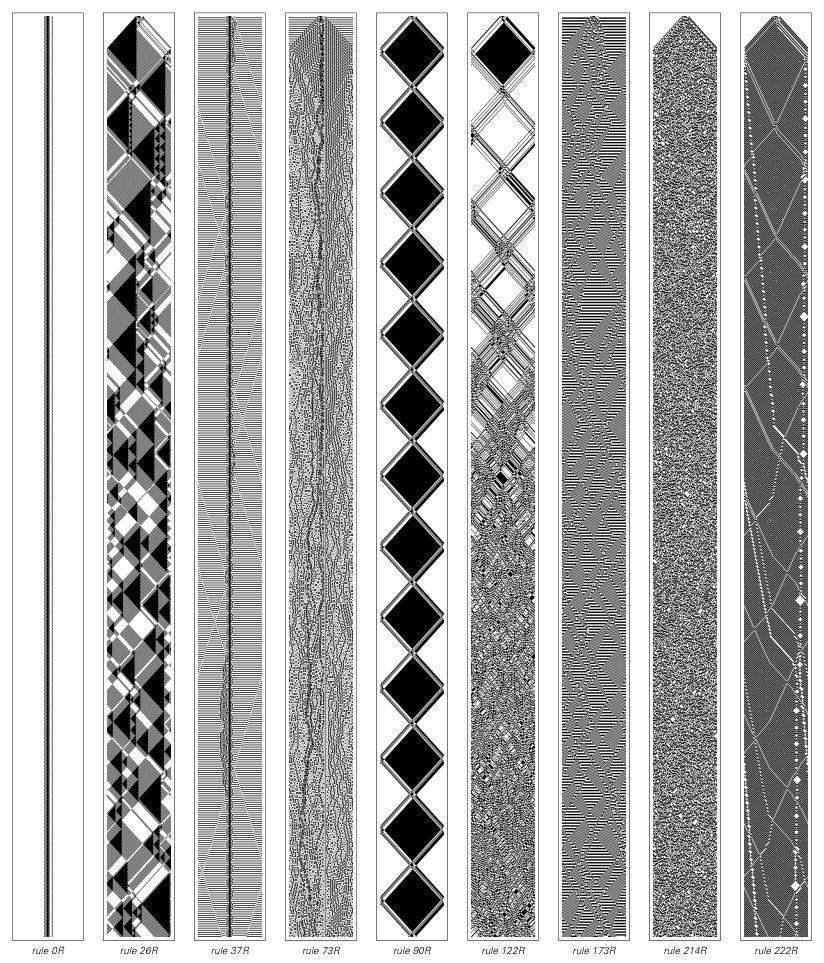
<!-- ORIGINAL_FIGURES page=0468 end -->

图：具有各种规则的可逆元胞自动机例子。有些会很快随机化，正如热力学第二定律所提示的。但另一些不会，因此实际上并不遵守热力学第二定律。

---

[[PDF page 469]]

对页上的图片显示了各种可逆元胞自动机的例子。我们从这些图片立刻看到，虽然有些系统表现出第二定律所蕴含的那种随机化，另一些却没有。

最明显的例外是规则 0R 和规则 90R 这类情形，其中产生的行为只有非常简单的固定或重复形式。现有数学研究确实已经识别出第二定律的这些简单例外。但它们不知为何隐含地假定，不可能存在其他种类的例外。

然而，下一页的图片显示了规则 37R 在许多步中的行为。观察这幅图片时，我们看到一种惊人现象：既没有朝随机性增加的系统性趋势，也没有任何形式的简单可预测行为。事实上，系统似乎从不安定下来，而是永远持续波动，有时变得不那么有序，有时又更有序。

那么在第二定律语境中怎样理解这种行为？我相信别无选择，只能得出结论：出于实际目的，规则 37R 根本不遵守第二定律。

事实证明，规则 37R 中发生的事情，同自然界许多系统中似乎发生的事情并没有多么不同。如果第二定律总是被遵守，那么人们也许会预期，到现在为止，我们宇宙的每个部分都已经演化到完全随机的平衡状态。

然而非常明显的是，这并没有发生。事实上，有许多类型的系统，尤其是生物系统，似乎至少暂时显示出一种向有序增加而不是随机性增加的趋势。

这类系统怎样运作？一个共同特征似乎是存在某种分隔：系统实际上分解成多个部分，而这些部分会在相当长时期内至少有些独立地演化。

第 456 页上的图片显示了如果用单个小随机区域启动规则 37R 会发生什么。有一段时间，我们看到插入的随机性会持续存在。但最终系统反而似乎组织自身，只产生少数简单重复结构。

---

[[PDF page 470]]

<!-- ORIGINAL_FIGURES page=0470 start -->
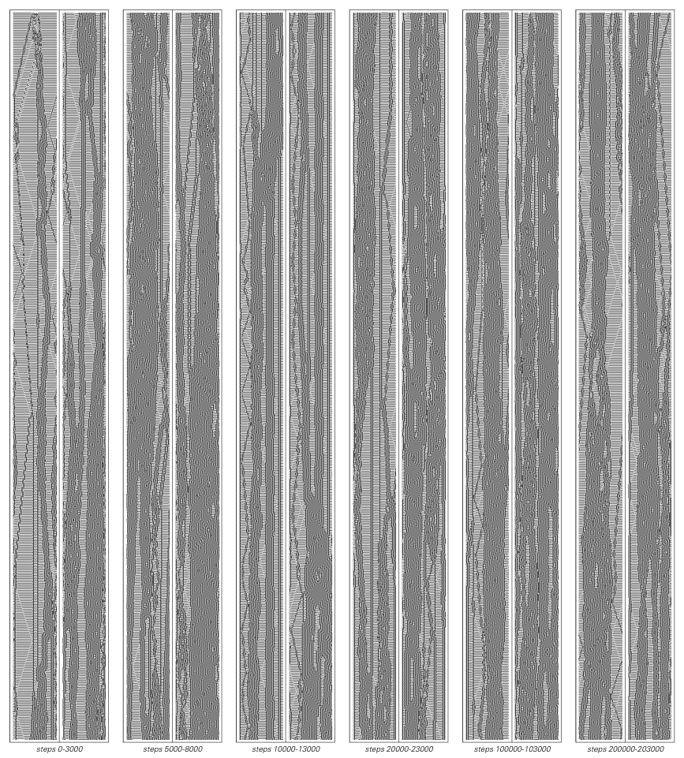
<!-- ORIGINAL_FIGURES page=0470 end -->

图：可逆元胞自动机规则 37R 演化中的更多步骤。这个系统是一个例子，它并不以任何有意义方式遵守热力学第二定律。它没有表现出逐渐更随机的行为，而似乎在相当有序和相当无序的状态之间波动。

---

[[PDF page 471]]

这种自组织同人们从第二定律中预期的情况相当相反。一开始，它似乎也同系统的可逆性不一致。因为如果最后剩下的只是少数简单结构，怎么会有足够信息向后演化并重构初始条件？

答案是，人们必须不仅考虑停留在系统中央的静止结构，也必须考虑演化过程中发出的各种小结构。要向后演化，就需要把事情设定成正好吸收向前演化时发出的那一串结构。

不过，如果只是让发出的结构逃逸，并且从不吸收任何其他结构，那么实际上就在丢失信息。结果，人们看到的演化可以内在地不可逆，因此本书前面在不具有可逆规则的元胞自动机中看到的各种自组织形式，都有可能发生。

如果在大尺度上观察宇宙，事实证明，在某种意义上发出的辐射多于吸收的辐射。事实上，这同夜空显得黑暗，而不是每个方向都有明亮星光这一事实有关。但最终，发射和吸收之间的不对称，是宇宙随时间膨胀而不是收缩的结果。

结果，尽管有第二定律，尽管底层规则可逆，宇宙中的一些区域仍有可能变得越来越有组织。这在很大程度上就是有组织的星系、恒星和行星能够形成的原因。

允许信息逃逸，是规避第二定律的一种相当直接的方式。但对页上的图片表明，即便在完全封闭、没有任何信息被允许逃逸的系统中，像规则 37R 这样的系统仍然不遵循第二定律所提示的那种朝随机性增加的均一趋势。

相反，发生的是系统不同区域之间形成了某种膜；在每个区域内部，只要膜还存在，有序行为就可以发生。

---

[[PDF page 472]]

<!-- ORIGINAL_FIGURES page=0472 start -->
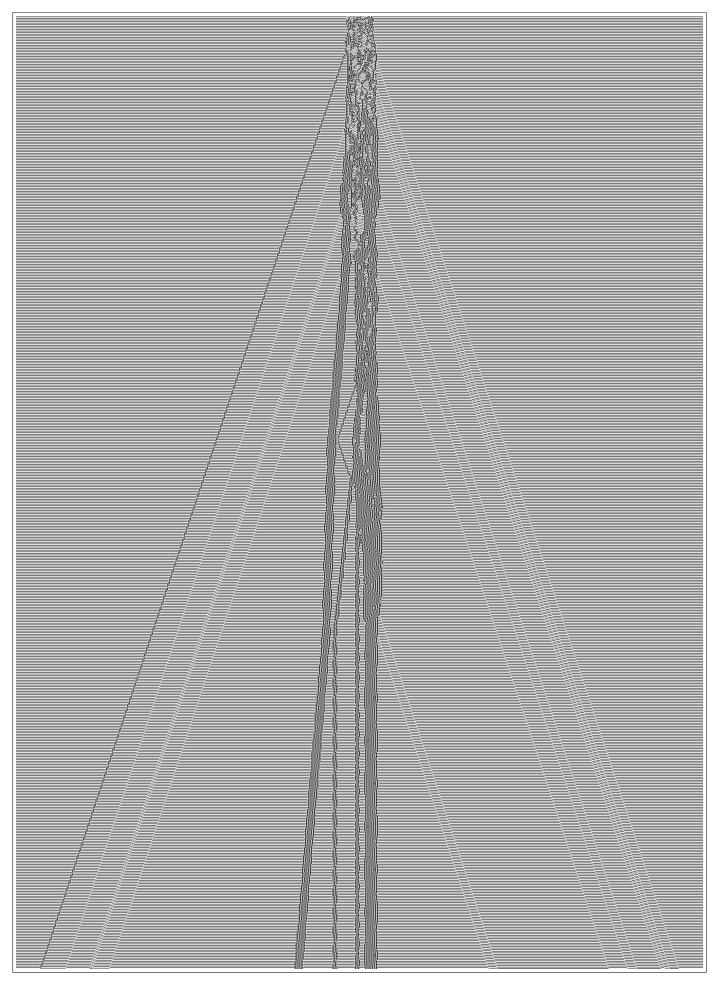
<!-- ORIGINAL_FIGURES page=0472 end -->

图：从包含相当随机区域的初始条件出发，按照规则 37R 演化的例子。尽管系统是可逆的，这一区域倾向于组织自身，从而呈现简单得多的形式。关于初始条件的信息最终由向外辐射的局部结构携带。

---

[[PDF page 473]]

这种基本机制很可能是许多生物系统中起作用的主要机制：每个细胞或每个有机体同其他细胞或有机体分离开来，而只要它存活，就可以表现出有组织的行为。

但看着第 454 页上规则 37R 的图片，人们也许会问，我们看到的效应是否只是暂态；如果等得足够久，是否会发生别的事情。

对于有限大小的封闭系统，最终得到的行为必定会重复，这是不可避免的特征。在第 452 页所示的规则 0R 和 90R 这类规则中，重复周期总是很短。但对于规则 37R，它通常相当长。事实上，对于第 454 页所示的具体例子，周期为 293,216,266。

不过，一般而言，包含一定数量元胞的系统能达到最大可能周期，只有当该系统从任意初始条件出发的演化最终访问系统所有可能状态时才行，如第 258 页所讨论的。如果实际发生这种情况，那么至少最终，系统会不可避免地把大多数时间花在看起来相当随机的状态上。

但在规则 37R 中并没有这种遍历性。相反，从任何特定初始条件出发，系统只会访问所有可能状态中极小的一部分。不过，由于总状态数是天文数字，对于大小为 100 的系统约为 `10^60`，规则 37R 访问的状态数以及由此产生的重复周期仍然可以极其长。

对规则 37R 在很长时间之后的极限行为作形式研究，会涉及各种微妙之处。但不管这些微妙之处如何，基本事实仍然是，据我所能判断，规则 37R 根本不遵循第二定律的预测。

事实上，我强烈怀疑自然界中有许多系统会以或多或少相同的方式行为。第二定律是一个重要且相当一般的原理，但它并非普遍有效。通过以简单程序来思考，我们在本节不仅能够理解为什么第二定律常常为真，也能够看到它的一些局限。

---

[[PDF page 474]]

<!-- ORIGINAL_FIGURES page=0474 start -->
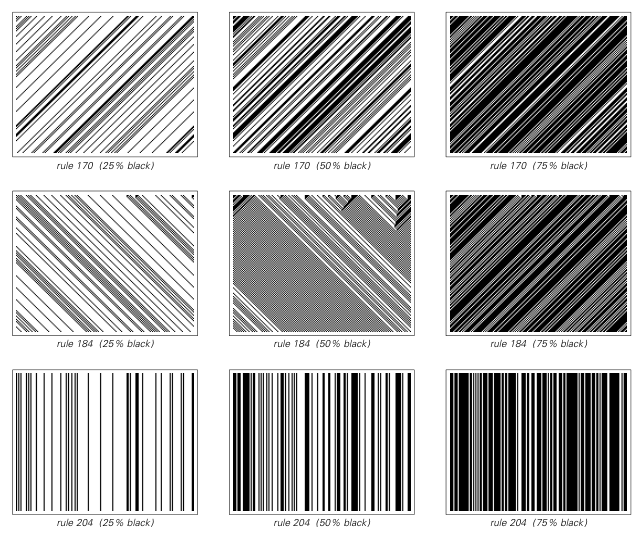
<!-- ORIGINAL_FIGURES page=0474 end -->

## 守恒量与连续现象

可逆性是物理基本定律中似乎存在的一个一般特征。另一个特征是各种量的守恒，也就是说，例如任何封闭物理系统的演化中，能量和电荷等量的总值似乎总是保持相同。

对于大多数规则，像元胞自动机这样的系统通常并不表现出这类守恒律。但同可逆性一样，事实证明，可以找到例如守恒每一步中出现的黑色元胞总数的规则。

在只有两种颜色和最近邻规则的初等元胞自动机中，唯一类型的例子是下面图片显示的相当平凡的那些。

图：演化守恒黑色元胞总数的初等元胞自动机。这里显示的规则行为足够简单，以至于在每一种情况下，黑色元胞数怎样在每一步保持相同都相当明显。

---

[[PDF page 475]]

<!-- ORIGINAL_FIGURES page=0475 start -->
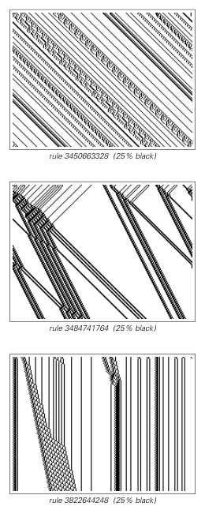
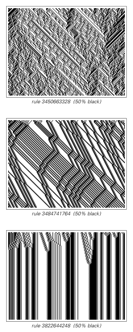
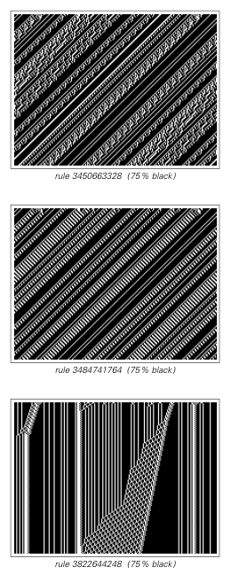
<!-- ORIGINAL_FIGURES page=0475 end -->

但如果使用次近邻规则，更复杂的例子就成为可能，如下面的图片所示。

图：具有次近邻规则的元胞自动机例子，其演化守恒黑色元胞总数。尽管用眼睛看并不立刻明显，但在每幅图中，黑色元胞总数在每一个连续步骤上都精确保持相同。在 4,294,967,296 条可能的次近邻规则中，只有 428 条表现出这里显示的这种守恒性质。

生成必然表现出守恒量的一组系统，一种直接方式是不使用普通元胞自动机，而改用分块元胞自动机。下一页顶部说明了分块元胞自动机的基本思想。每一步发生的是，相邻元胞块按照某条确定规则被同样大小的其他块替换。随后在连续步骤上，这些块的对齐方式移动一个元胞。

---

[[PDF page 476]]

<!-- ORIGINAL_FIGURES page=0476 start -->
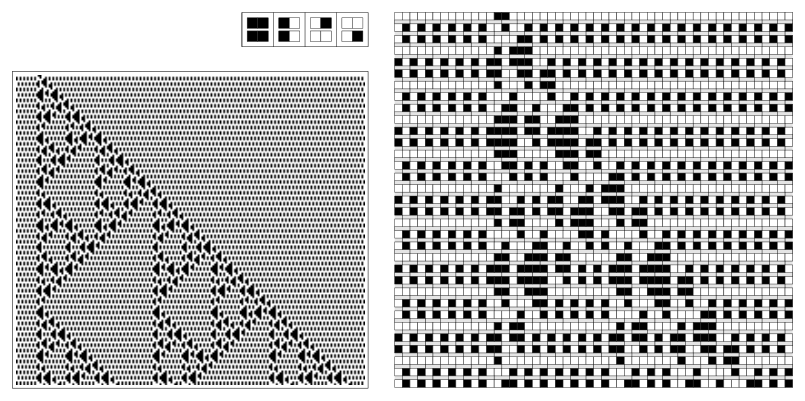
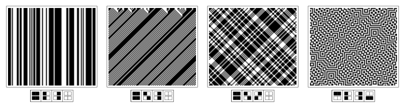
<!-- ORIGINAL_FIGURES page=0476 end -->

图：分块元胞自动机的例子。系统的工作方式是把每一步存在的元胞序列划分为成对元胞，然后按所示规则把这些对替换为其他对。一个元胞究竟同左邻还是右邻配对，会在连续步骤上交替。像许多分块元胞自动机一样，所示系统是可逆的，因为在规则中每一对都有唯一前身。不过，它并不守恒黑色元胞总数。

在这种设定下，如果底层规则把每个块替换为包含相同数量黑色元胞的块，那么整个系统就不可避免地会守恒黑色元胞总数。

对于两种可能颜色和大小为二的块，唯一守恒黑色元胞总数的分块元胞自动机类型是下面所示这些，而且它们全都表现出相当平凡的行为。

图：具有两种可能颜色和大小为二的块、并守恒黑色元胞总数的分块元胞自动机（最后一个例子只在交替步骤上具有这一性质）。碰巧的是，除了第二条规则外，这里显示的所有规则不仅守恒黑色元胞总数，而且还是可逆的。

---

[[PDF page 477]]

<!-- ORIGINAL_FIGURES page=0477 start -->
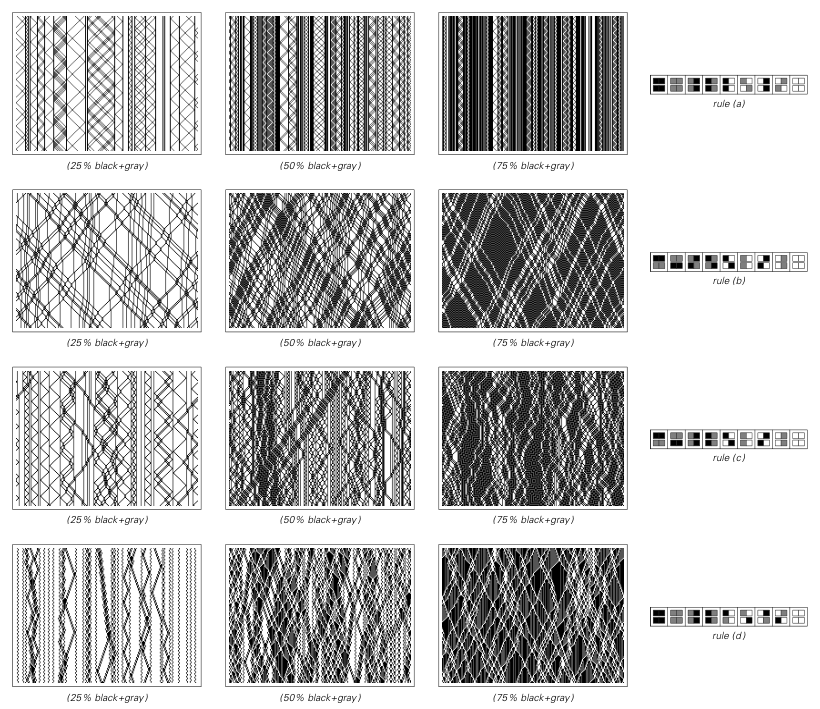
<!-- ORIGINAL_FIGURES page=0477 end -->

但如果允许三种可能颜色，并要求例如黑色和灰色元胞合计总数守恒，那么就可以出现更复杂的行为，如下面的图片所示。

图：具有三种可能颜色并守恒黑色与灰色元胞合计数的分块元胞自动机。在规则 (a) 中，黑色和灰色元胞停留在局部区域内。在规则 (b) 中，它们以相当简单的方式移动；在规则 (c) 和 (d) 中，它们以看似有些随机的方式移动。这里显示的规则是可逆的，尽管它们的行为至少在几步之后类似不可逆规则。

事实上，正如下页图片所表明的，这类系统即使从非常简单的初始条件出发，也能产生相当多的随机性。

---

[[PDF page 478]]

<!-- ORIGINAL_FIGURES page=0478 start -->
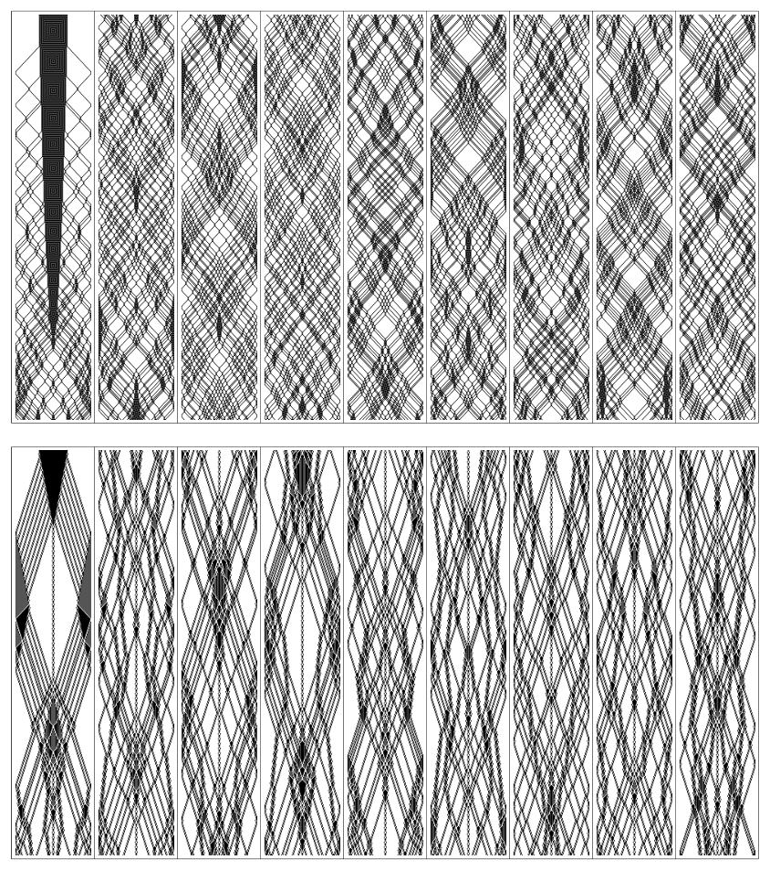
<!-- ORIGINAL_FIGURES page=0478 end -->

图：从非常简单初始条件出发，前一页规则 (c) 和 (d) 的行为。每个图板显示 500 步演化，可以看到迅速随机化。黑色和灰色元胞的行为很像物理粒子：它们总数守恒，而且使用这里的特定规则时，它们的相互作用是可逆的。注意边界的存在至关重要；如果没有边界，从某种意义上说粒子之间就不会有碰撞，两个系统的行为都会相当平凡。

---

[[PDF page 479]]

<!-- ORIGINAL_FIGURES page=0479 start -->
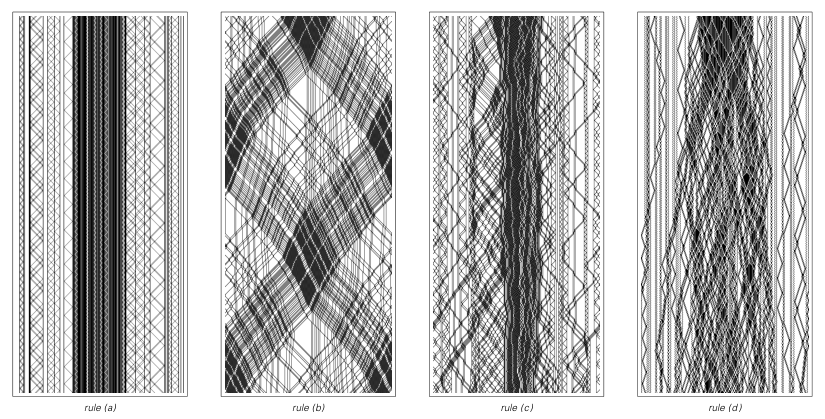
<!-- ORIGINAL_FIGURES page=0479 end -->

但行为仍有一个重要约束：即使黑色和灰色元胞实际上可以随机四处移动，它们的总数也必须始终守恒。这意味着，如果观察整个系统中色元胞的总平均密度，它必须始终保持相同。但系统不同部分的局部密度不必如此，而且通常会随着色元胞流入流出而改变。

下面的图片显示了四条不同规则发生的情况，其中初始时中间密度较高、两侧密度较低。对于规则 (a) 和 (b)，每个不同区域实际上永远保持分离。但对于规则 (c) 和 (d)，这些区域逐渐混合。

像许多种系统一样，元胞初始排列的细节通常会影响所发生行为的细节。但下面图片提示，如果只观察总体密度分布，那么这些细节会变得在很大程度上无关；因此，一个给定的初始密度分布，总会倾向于以相同的总体方式演化，而不管构成这个分布的具体元胞排列碰巧是什么。

图：前几页的分块元胞自动机，从包含不同密度区域的初始条件出发。在规则 (a) 和 (b) 中，区域永远保持分离；但在规则 (c) 和 (d) 中，它们逐渐相互扩散。

---

[[PDF page 480]]

<!-- ORIGINAL_FIGURES page=0480 start -->
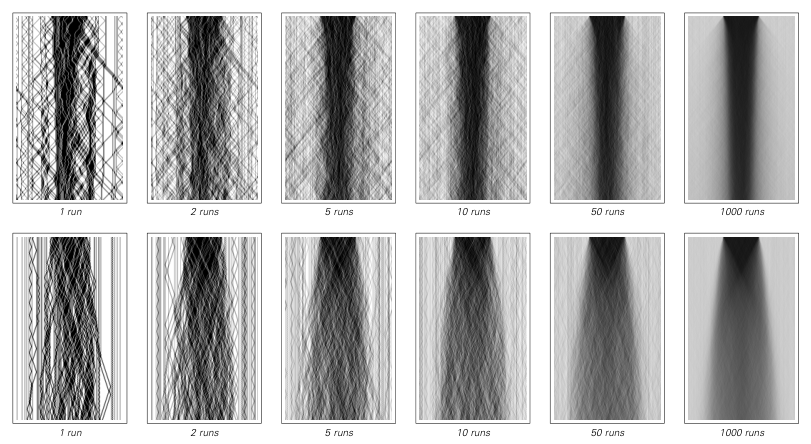
<!-- ORIGINAL_FIGURES page=0480 end -->

图：前一页分块元胞自动机 (c) 和 (d) 的总体密度演化。尽管在底层层面这些系统由离散元胞组成，它们的总体行为却显得平滑而连续。这里显示的结果通过对越来越多次运行求平均得到；这些运行的初始条件在细节上不同，但具有相同的总体密度分布。在运行次数无穷多（或元胞数无穷多）的极限下，第二种情况的行为接近连续扩散方程所蕴含的形式。（在第一种情况下，相关性实际上持续得太久，无法精确得到这种行为。）

于是，上面的图片显示了系统 (c) 和 (d) 中平均密度怎样演化。令人瞩目的是，尽管在最低层面上这两个系统都由离散元胞组成，但两种情况下涌现出来的总体密度分布都显示出平滑连续行为。

同流体这样的物理系统中一样，最终导致这一点的是小尺度表观随机性的存在，它冲洗掉了单个元胞或分子的细节；同时还存在守恒量，迫使某些总体特征不能变化得太快。事实上，只要给定这些性质，事实证明本质上总会得到相同的总体连续行为。

人们也许会以为，连续行为以某种方式依赖实际物理系统中的特殊特征。但事实上，我们在这里看到的是，再一次，负责这种行为的基本机制已经以小得多的方式出现在一些程序中，而这些程序具有惊人简单的底层规则。

---

[[PDF page 481]]

## 宇宙的终极模型

物理学的历史见证了一系列越来越精确的宇宙模型的发展，从经典力学，到量子力学，再到量子场论及其之后。人们也许会想，这个过程会永远继续下去，还是在某个时刻会到达终点，抵达一个关于宇宙的最终终极模型。

物理学中的实际结果经验大概不会让人这样想。因为似乎每当人们试图达到另一层精确性，就会遇到更复杂的现象。至少按传统科学直觉，这一事实提示需要越来越复杂的模型。

但本书发现的关键点之一是，更复杂的现象并不总是需要更复杂的模型。事实上，我已经表明，即便基于极其简单程序的模型，也能产生在某种意义上任意复杂的行为。

那么，宇宙中发生的会不会正是这种情况？是否甚至可能，在我们于物理中看到的所有复杂现象之下，存在某个简单程序；只要运行足够久，它就会在每个细节上复现我们的宇宙？

发现这样一个程序当然会是一件令人兴奋的事件，也会是对我在本书中发展出的这种新的科学的戏剧性认可。

除其他事情外，有了这样一个程序，人们最终会拥有一个并非任何意义上的近似或理想化的自然模型。相反，它会是对宇宙实际运作的完整而精确的表示，只不过全部化约为容易陈述的规则。

从某种意义上说，这样一个程序的存在会最终验证这样一个想法：人类思想能够理解宇宙的构造。但仅仅知道底层程序，并不意味着人们能立刻推导出宇宙将如何行为的每个方面。因为正如我们在本书中多次看到的，底层规则和总体

---

[[PDF page 482]]

行为之间常常有很大距离。事实上，这恰恰就是一个简单程序有可能复现我们在物理中看到的一切复杂性的原因。

给定一个特定底层程序，原则上总是可以通过运行它来弄清它会做什么。但对于整个宇宙来说，进行这种显式模拟几乎按定义就是不可能的。那么，怎样才能指望判断某个特定程序是否是宇宙的正确模型？小尺度模拟当然可能。而我预期，把这同一定量的、也许相当复杂的数学和逻辑推导结合起来，就有可能至少走到复现已知物理定律的程度，从而判断某个特定模型是否有可能正确。

所以，如果宇宙确实存在一个确定的终极模型，人们该怎样着手寻找它？对于熟悉现有科学的人来说，一开始会有一种极强倾向，试图从已知物理定律向后倒推，并本质上尝试“工程化”一个宇宙，使它具有我们观察到的特定特征。

但如果事实上存在一个相当简单的终极模型，那么根据本书中我们看到的东西，我强烈相信这种方法在现实中永远不会成功。因为人类思维，即便辅以当代数学和逻辑中最复杂的思想，也远远无法完成所需的事情。

例如，想象一下试图从对页图片总体特征的知识出发，反向构造一条会复现它的规则。通过巨大努力，人们也许能想出某条极其复杂、在多数情况下都可用的规则。但从总体特征出发，绝不可能真的得到实际使用的那条极其简单的规则。

从一条底层规则推导它会产生什么行为，已经足够困难。而以任何系统方式反过来做，很可能甚至原则上也超出任何现实计算所能做到的范围。

那么，在这种情况下，人们怎么可能指望找到底层规则？几乎总是，最好的策略似乎是一个简单策略：提出一个合适的一般规则类别，然后

---

[[PDF page 483]]

<!-- ORIGINAL_FIGURES page=0483 start -->
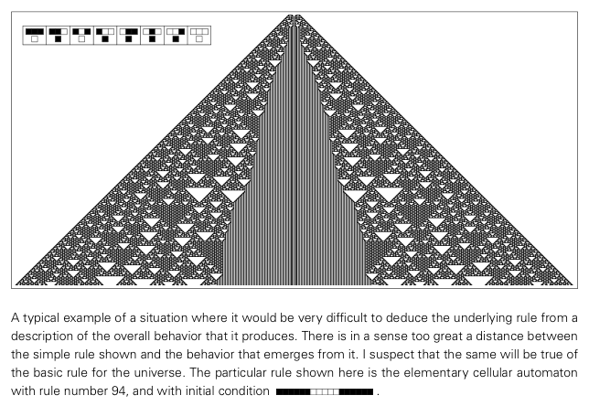
<!-- ORIGINAL_FIGURES page=0483 end -->

图：一个典型例子，说明从某个系统产生的总体行为描述中推断底层规则会非常困难。在某种意义上，所示简单规则同从中涌现出来的行为之间距离太大。我怀疑，宇宙的基本规则也会如此。这里显示的特定规则是规则号为 94 的初等元胞自动机，带有图中所示初始条件。

搜索这些规则，逐一尝试，并查看它是否产生人们想要的行为。

但宇宙的规则又如何？我们当然不能只是搜索某些种类的可能规则，寻找一条其行为碰巧符合我们在物理中看到的东西的规则吧？

凭传统科学直觉，这种方法显得荒谬。但关键是，如果宇宙的规则足够简单，而本书的结果提示它可能如此，那么想象系统地搜索它，就并不那么不合理。

不过，要开始进行这种搜索，首先需要弄清应该考虑哪些种类的规则。我怀疑，本书迄今讨论过的具体规则类型，没有一种最终会是充分的。因为我相信所有这些规则类型，在某种意义上大概都已经内置了太多结构。

例如，元胞自动机大概已经有过于刚性的内置空间概念。因为元胞自动机的定义性特征是，其元胞总是排列在空间中的一个刚性阵列中。然而我强烈怀疑，在我们宇宙的底层规则中不会有这种内置结构。相反，正如我在接下来几节中讨论的，我的猜测是，在最低层面只会存在某些倾向于存在的连接模式，而我们所知道的空间随后会作为某种大尺度极限从这些模式中涌现出来。

---

[[PDF page 484]]

事实上，总的来说，我预期我们宇宙中惊人少数的熟悉特征，会以任何直接方式实际反映在其终极底层规则中。因为如果所有这些特征都以某种方式显式且分别地包含进去，规则就必然复杂得足以把它们全都装下。

所以，如果规则确实简单，那么几乎不可避免地，我们将无法在其中直接认出我们通常感知到的宇宙的大多数特征。这意味着规则，或者至少它的行为，对我们而言必然会显得陌生而抽象。

最可能的是，例如并没有什么容易的办法，通过观察一组布置在空间中的元素来可视化规则所做的事情。也很可能甚至不会有运动这类基本现象的任何直接痕迹。

但尽管缺乏这些熟悉特征，我仍预期实际规则本身对我们来说不会太难表示。因为我相当确定，本书中讨论过的逻辑和计算构造类型将足够一般，能够覆盖所需内容。事实上，我猜测，用本书所使用的那类图片，或 Mathematica 程序，来表达时，宇宙的终极规则最终会看起来相当简单。

毫无疑问，会有许多不同的可能表述，其中一些彼此之间会完全无法识别为同一类东西。毫无疑问，最终会找到一种表述，其中这条规则以某种方式开始显得相当明显且不可避免。

但我相信，如果并不知道规则，就基本不可能找到这种表述。因此，我猜测，首先找到规则的唯一现实方式，是从某种非常直接的表示开始，然后在这种表示中搜索大量可能规则。

大概绝大多数规则会导致完全不可用的宇宙，其中例如没有合理的空间概念，或没有合理的时间概念。

---

[[PDF page 485]]

但我的猜测是，在合适的规则类别中，实际会有相当多的规则导致的宇宙至少同我们自己的宇宙共享某些特征。就像相同的连续流体力学定律可以在分子相互作用底层规则不同的系统中涌现出来一样，我也怀疑，表观连续空间的存在，以及引力和量子力学的某些特征，会在许多不同的可能宇宙底层规则中涌现出来。

但我猜测，对于基本粒子质量谱这样的东西，或者甚至对于空间的总体维数这样的东西，这类性质会相当特异地对应于特定底层规则。

在传统建模方法中，人们通常先尝试复现系统的一些特征，然后继续复现另一些特征。但如果宇宙的终极规则竟然简单，那么随之而来的是，这条规则的每一部分在某种意义上都必须负责宇宙的许多不同特征。结果，不太可能调节规则的单个部分而不影响宇宙中一整组各异特征。

因此，这意味着人们不能合理期望使用某种增量过程来找到宇宙的终极规则。但它也意味着，如果人们一旦发现一条规则复现了宇宙足够多的特征，那么这条规则就极有可能确实是整个宇宙最终且正确的规则。

我强烈怀疑，即便在许多最基本的日常物理过程中，宇宙底层规则的每一个元素都会被非常广泛地调用。结果，如果这些基本过程被正确复现，那么我相信人们就可以相当有信心地认为自己事实上已经拥有宇宙的完整规则。

回顾物理学历史，人们也许会认为，仅仅复现日常物理过程完全不够。因为人们可能会预期，总会有某个其他深奥现象，例如粒子物理中的现象，会被发现，并显示人们找到的任何规则都以某种方式不完整。

---

[[PDF page 486]]

但我并不这样认为。因为如果我们宇宙的规则竟然简单，那么我预期引入一个新现象，无论它多么深奥，都将涉及修改规则的某个基本部分，而这也会影响甚至普通的日常现象。

但为什么我们应该相信，我们宇宙的规则事实上是简单的？当然，在某一类型的所有可能规则中，只有有限数量的规则能被认为简单，而这些规则按定义在某种意义上是特殊的。然而看看科学史，人们也许会预期，最终会发现我们宇宙的规则并没有什么特殊之处，正如事实已经表明，我们在太阳系或银河系中的位置没有什么特殊之处一样。

事实上，人们也许会假定，实际存在无限多个宇宙，每个宇宙有不同规则，而我们只是生活在其中一个特定且本质上任意的宇宙里。

要确定地证明这种理论不正确，可能并不现实。但它的一个后果是，它没有给我们任何理由认为我们这个特定宇宙的规则应以任何方式简单。因为在所有可能规则中，压倒性多数都不会简单；事实上，它们反而会倾向于几乎无限复杂。

然而我认为，我们知道宇宙的规则并不过分复杂。因为如果规则的不同部分数量例如可以同宇宙历史中曾经出现过的不同情形数量相比，那么我们就不会期望能够只用有限数量的物理定律描述宇宙的行为。

事实上，如果观察当代物理，不仅物理定律数量有限，而且单个定律常常似乎在各种替代形式中具有最简单的形式。知道这一点后，人们也许会被引导去相信，由于某种原因，宇宙被设定成处处具有最简单规则。

但也许很遗憾，我并不认为这个结论必然随之而来。因为正如我上面讨论的，我强烈怀疑迄今发现的绝大多数物理定律并不真正基本，而只是某种终极底层规则的大尺度行为的涌现特征。这

---

[[PDF page 487]]

意味着，在已知物理定律中观察到的任何简单性，可能同底层规则的简单性关系很小。

事实上，事实证明，简单的总体定律几乎可以不管底层规则如何而涌现出来。因此，例如本质上作为随机性生成的结果，范围很广的元胞自动机会显示第 464 页上的简单密度扩散定律，而不管其底层规则是否碰巧简单。

所以，可能的情况是，我们在现有物理中表述出的定律之所以简单，并不是因为某个终极底层规则简单，而是因为对于我们容易感知的宇宙总体特征来说，涌现行为具有某种一般性质。

事实上，根据这种论证，人们可能会认为，宇宙根本没有单一终极规则，而是以某种方式存在一个无穷规则层级序列，其中每一层都有某种简单性，并越来越独立于其下方层级的细节。

但不应想象，这种设定会使人无需再问为什么我们的宇宙是这个样子。因为即使某些特征可能由涌现行为的一般性质变得不可避免，我相信在抵达我们生活的宇宙时，仍会有许多看似任意的选择必须被作出。因此，人们再一次不得不问，为什么作出的是这些选择，而不是其他选择。

所以，如果我是正确的，即宇宙只是遵循一条单一、简单的底层规则，那么最终需要解释的东西也许最少。

当然会有关于为什么是这条特定规则而不是另一条规则的问题。我怀疑这类问题永远不会有有意义的答案。

但找到终极规则将是科学的一次重大胜利，并且清楚表明，至少在某个方向上，人类思想已经抵达可能性的边缘。

---

[[PDF page 488]]

## 空间的本性

在努力发展宇宙终极模型时，关键的第一步是思考空间的本性，因为宇宙中的过程不可避免地发生在空间中。

当代物理几乎总是假定空间是一个完美连续体，对象可以放在其中绝对任意的位置。但当然也可以想象，空间可能以非常不同的方式运作。例如，在元胞自动机中，空间不是连续体，而只是由离散元胞组成。

在我们的日常经验中，空间看起来仍然是连续的。但空气和水这样的流体例如也同样看起来连续。然而在这些流体的情况下，我们知道在底层层面它们由离散分子构成。事实上，在过去一个世纪中，物理世界的许多方面最初看似连续，但最终都被发现由离散元素建成。我非常强烈地怀疑，空间也会如此。

粒子物理实验已经表明，空间在约 `10^-20` 米的距离以下，或者说一个质子半径的十万分之一尺度上，仍表现为连续体。但完全没有理由认为，在更小距离上不会发现离散元素。

事实上，过去人们假定空间是完美连续体的主要原因之一，是这使得它在传统数学语境中更容易处理。但当人们用程序和本书讨论过的那类系统来思考时，假定空间是完美连续体就不再显得那么有吸引力。

所以，如果空间事实上不是连续体，那么它可能是什么？例如，它会不会像元胞自动机中那样，是一个规则元胞阵列？

一开始，人们也许会认为这同日常观察完全不一致。因为即使阵列中的单个元胞极小，人们仍可能想象，自己例如会看到这个阵列总体取向的各种迹象。

---

[[PDF page 489]]

<!-- ORIGINAL_FIGURES page=0489 start -->
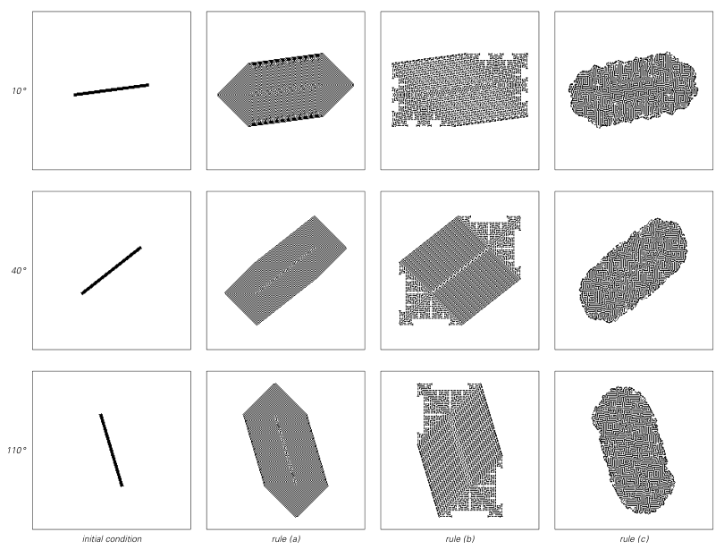
<!-- ORIGINAL_FIGURES page=0489 end -->

下面的图片显示了三个不同元胞自动机，它们全都建立在同一个二维网格上。为了看出网格的影响，我显示了当这些元胞自动机分别从以三个不同角度排列的黑色元胞块开始时会发生什么。

图：固定网格上的二维元胞自动机行为中取向依赖性的例子。显示了三个不同初始条件，每个都由三个不同角度的块组成。对于规则 (a) 和 (b)，所产生的图案总是表现出与底层网格方向保持对齐的特征。但对于规则 (c)，不管取向如何，得到的本质上都是同样的圆润图案。这里显示的规则是外总和型：(a) 4 邻居代码 468，(b) 4 邻居代码 686，(c) 8 邻居代码 746。在情形 (a) 和 (b) 中使用 40 步演化；情形 (c) 使用 100 步。

在所有情况下，所产生的图案至少在某种程度上遵循初始块的取向。但在情形 (a) 和 (b) 中，底层网格的效应仍相当明显，因为所产生图案总是具有同该网格方向对齐的晶面。但在情形 (c) 中情况不同，现在所产生的图案

---

[[PDF page 490]]

总是具有相同的总体圆润形式，本质上独立于它们相对于底层网格的取向。

事实上，发生的事情同本书中我们已经多次看到的情况相似：元胞自动机的演化生成了足够随机性，以至于底层网格的效应倾向于被冲洗掉；结果，所产生的总体行为最终基本不显示空间中不同方向之间的区别。

那么是否应该由此断定，宇宙事实上是一个带有类似情形 (c) 规则的巨大元胞自动机？

这或许并非不可能，但我非常怀疑。

因为立刻就有一些简单问题，例如人们想象元胞自动机阵列边缘会发生什么。但更重要的是，我并不相信元胞自动机基本构造所蕴含的空间与其内容之间的区分。

因为当人们建立一个元胞自动机时，从某种意义上说，总是先设定一个元胞阵列来表示空间本身，然后才考虑空间的内容，也就是由赋给这个阵列中元胞的颜色排列来表示的内容。

但如果宇宙的终极模型要尽可能简单，那么空间和其内容以某种方式由同一种东西构成，就显得合理得多；于是从某种意义上说，空间成为宇宙中唯一的东西。

过去已经有几次探索过类似思想。事实上，1915 年提出的标准引力理论，正是基于这样一个观念：引力可以仅仅被看作空间的一种特征。但尽管在 1930 年代以及更近时期有过各种尝试，似乎从来不可能把这一点扩展到覆盖我们实际在宇宙中看到的那整套精巧的力和粒子。

然而我怀疑，这在很大程度上只是因为假定空间是由传统数学描述的完美连续体。因为正如我们在本书中已经多次看到的，如果观察带有离散元素的程序这类系统，高度复杂行为立刻就更容易涌现出来。我相信，在我们整个宇宙的最低层面，空间中发生的根本上就是这种事情。

---

[[PDF page 491]]

## 作为网络的空间

上一节我论证说，如果物理的终极模型要尽可能简单，那么我们应当预期，宇宙的所有特征都必须在某个层面上纯粹从空间性质中涌现出来。但如果要做到这一点，空间应该是什么样？

上上节的讨论提示，为了涌现出最丰富的性质，底层内置的刚性结构在某种意义上应当尽可能少。考虑到这一点，我相信，到目前为止最可能的是，在最低层面空间实际上是一个巨大的节点网络。

在像元胞自动机那样的元胞阵列中，每个元胞总是被赋予某个确定位置。但在节点网络中，节点并不内在地被赋予任何位置。事实上，关于每个节点被定义的唯一事情，是它同哪些其他节点相连接。

然而，尽管这种设定相当抽象，我们将看到，只要节点数量足够大，熟悉的空间性质就有可能涌现出来，同时还会涌现物理中看到的其他现象。

我在第五章已经引入过一种特定类型的网络，其中每个节点正好有两个指向其他节点的外向连接，并且可以有任意数量的内向连接。我在第五章选择这种网络的原因，是碰巧有一种相当容易的方法为这类网络设定演化规则。但在试图寻找空间的终极模型时，最好从基本结构以某种方式尽可能简单的网络开始考虑；事实证明，第五章的网络比所需要的略微复杂。

首先，并不需要区分内向连接和外向连接，甚至并不需要给每个连接关联任何方向。此外，要求网络中所有节点同其他节点具有完全相同的连接总数，并不会损失任何根本东西。

如果每个节点有两个连接，那么只能得到非常平凡的网络。但如果使用三个连接，范围巨大的网络会立刻成为可能。人们也许会认为，如果允许例如四个或五个连接，而不只是三个连接，就可以得到

---

[[PDF page 492]]

<!-- ORIGINAL_FIGURES page=0492 start -->
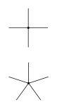
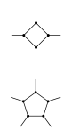
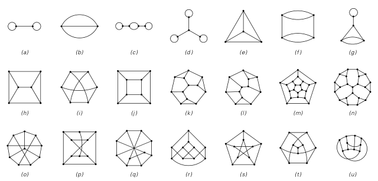
<!-- ORIGINAL_FIGURES page=0492 end -->

从根本上更大的范围。但事实并非如此，因为任何具有三个以上连接的节点实际上总能分解成一组正好具有三个连接的节点，如左侧图片所示。

图：具有三个以上连接的节点怎样可以分解成由正好三个连接的节点组成的集合的例子。

这意味着，从某种意义上说，考虑每个节点正好有三个连接的网络总是足够的。因此，我将在这里讨论空间的基本模型时使用这类网络。

下面的图片显示了这类网络的几个小例子。相当多样性已经很明显。但所示网络都似乎没有多少普通空间中熟悉的性质。

图：每个节点正好有三个连接的小型网络例子。第一行显示了最多四个节点的所有可能网络。下文我只考虑非退化网络，其中任意两个节点之间至多有一个连接。例 (i) 是无法在二维中无交叉线画出的最小网络。例 (k) 和 (l) 是不同节点之间没有对称性的最小网络。例 (e) 对应四面体的网，(j) 对应立方体的网，(m) 对应十二面体的网。例 (o) 到 (u) 显示了绘制同一网络的七种方式，在此即所谓 Petersen 网络。

那么怎样得到对应于普通空间的网络？第一步是考虑节点数大得多的网络。作为例子，对页顶部的图片显示了一些被专门构造成对应普通一维、二维和三维空间的网络。

---

[[PDF page 493]]

<!-- ORIGINAL_FIGURES page=0493 start -->
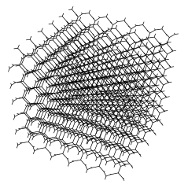
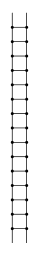
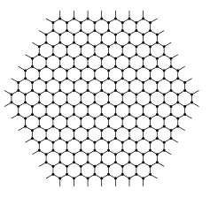
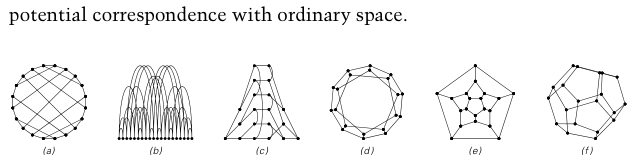
<!-- ORIGINAL_FIGURES page=0493 end -->

图：每个节点有三个连接、实际上为一维、二维和三维的网络例子。这些网络可以无限延续，而且都具有均匀性，也就是说每个节点都有同其他每个节点相同的环境。

这些网络中的每一个，在最低层面都只是一组带有某些连接的节点。但关键是，这些连接的总体模式使得在大尺度上会涌现出同某个特定维数的普通空间的清楚对应。

上面的图片是为了让这种对应显而易见而绘制的。但如果人们只是得到某个网络的原始连接模式呢？怎样才能看出这个网络是否可能对应于某个特定维数的普通空间？

下面的图片说明了主要困难：如果只给定某个网络的连接模式，这个网络可以用许多完全不同的方式布局，而其中大多数方式对判断它同普通空间的潜在对应关系帮助很小。

图：布局同一网络的六种不同方式：(a) 节点围绕圆排列；(b) 节点沿一条线排列；(c) 节点按照它们距某个特定节点的距离横跨页面排列；(d) 让网络距离和空间距离尽可能接近的二维布局；(e) 平面布局；(f) 三维布局。

那么人们怎样继续？基本思想是考察网络的某些性质：这些性质既可以很容易从其连接模式中推出，也可以至少在某种

---

[[PDF page 494]]

大尺度极限下同普通空间的性质相识别。距离概念也许是这类性质中最基本的。

定义两点之间距离的一种简单方法，是说它等于两者之间最短路径的长度。在普通空间中，这通常通过减去这些点位置的数值坐标来计算。但在网络上，事情更直接；两个节点之间的距离可以被取为从一个节点到达另一个节点所必须沿着走过的最少连接数。

但能否仅通过查看这类距离来判断某个特定网络是否对应于某个维数的普通空间？

在很大程度上可以。一个检验是看是否有办法把网络中的节点布局到普通空间中，使得根据节点在空间中的位置计算出的距离，至少在某种近似下，同直接沿网络连接计算出的距离一致。

上一页顶部的三个网络正是分别为了让一维、二维和三维空间具有这种性质而布局的。但例如为什么第二个网络不能同样好地布局在一维而不是二维空间中？一种看法是数一数，在网络中距某个特定节点给定距离处会出现多少节点。

对于这个具体网络，答案非常简单：在距离 `r` 处恰好有 `3 r` 个节点，因此到距离 `r` 为止的节点总数像 `r^2` 那样增长。但如果试图把所有这些节点布局在一维中，网络就不可避免地必须鼓出来，才能容纳所有节点。事实证明，只有在二维中，这个特定网络才能以规则方式布局，使得沿其中连接得到的距离同普通空间距离一致。

对于上一页顶部另外两个网络，也可以给出类似论证。事实上，一般而言，一个网络对应于普通 `d` 维空间的条件，恰恰是距 `r` 以内出现的节点总数在某种极限意义下像 `r^d` 那样增长；这个结果类似于标准

---

[[PDF page 495]]

<!-- ORIGINAL_FIGURES page=0495 start -->
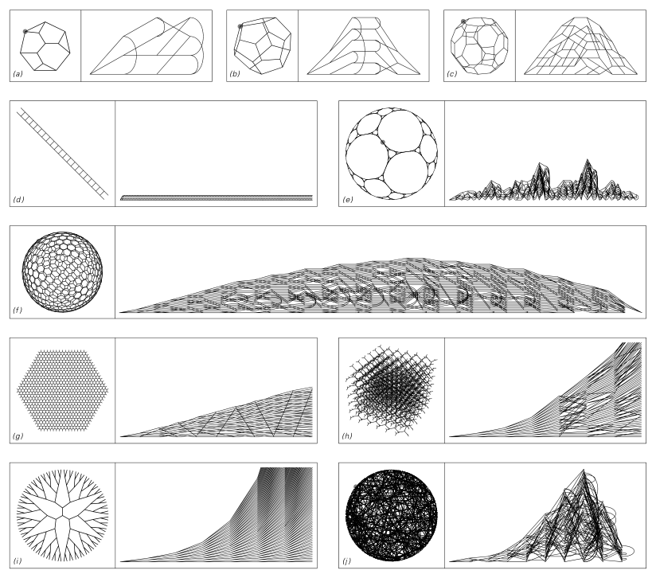
<!-- ORIGINAL_FIGURES page=0495 end -->

数学事实：二维圆的面积是 `pi r^2`，而三维球的体积是 `(4/3) pi r^3`，四维超球的体积是 `(1/2) pi^2 r^4`，依此类推。

下面我显示了各种网络的图片。在每一种情况下，第一幅图被画成强调网络中的明显规则性。但第二幅图则以更系统的方式绘制：选择一个具体起始节点，然后布局其他节点，使得处在

图：各种网络的例子，先以强调其规则性的方式显示，再以说明从给定节点连续走更多步所到达节点数的方式显示。对于在极限意义上对应于普通 `d` 维空间的网络，这个数像 `r^(d-1)` 那样增长。所示较大网络都近似均匀，也就是说从任意节点开始会得到类似结果。网络 (e) 实际上具有极限维数 `Log[2, 3] ~= 1.58`。

---

[[PDF page 496]]

连续更大网络距离上的节点出现在页面上连续的列中。这种设定具有这样一个特征：第 `r` 列的高度给出网络距离为 `r` 的节点数。

因此，通过观察这些高度怎样横跨页面增长，人们就可以看出是否同普通 `d` 维空间所预期的 `r^(d-1)` 形式对应。事实上，例如在情形 (g) 中，可以看到正好是 `r^1` 的线性增长，反映维数 2。

类似地，在情形 (d) 中可以看到 `r^0` 增长，反映维数 1；而在情形 (h) 中可以看到 `r^2` 增长，反映维数 3。

情形 (f) 说明了稍微复杂的行为。这个情况下的基本网络在局部本质上具有二维形式，但在大尺度上，由于包裹在一个球面上而发生弯曲。因此发生的是，对于相当小的 `r`，人们看到 `r^1` 增长，反映局部二维形式；但对于更大的 `r`，增长变慢，反映曲率的存在。

本章后面我们会看到，这种曲率怎样同引力现象相关。但现在的要点只是，网络 (f) 再一次非常像具有确定维数的普通空间。

那么，所有足够大的网络是否都会以某种方式对应于某个维数中的普通空间？答案肯定是否定的。作为例子，上一页的网络 (i) 具有树状结构，距离 `r` 处有 `3^r` 个节点。这个数对任何 `d` 都增长得比 `r^d` 快，这意味着该网络不对应于任何有限维数中的普通空间。

如果网络中的连接是随机选择的，如情形 (j)，那么同样几乎绝不会有所需的那种局域性，来得到对应于普通有限维空间的东西。

那么，我们宇宙中实际的空间网络会是什么样？

它当然不会像上一页大多数网络那样简单规则。因为在其连接模式之中，必须编码我们在宇宙中看到的一切。

因此，在单个连接层面，这个网络一开始最可能看起来相当随机。但在更大尺度上，它必须被排列成对应于普通三维空间。并且，无论是什么规则更新这个网络，都必须以某种方式保持这一特征。

---

[[PDF page 497]]

## 空间和时间的关系

要建立物理学的终极理论，不仅需要理解空间的真实本性，也需要理解时间的真实本性。我相信，在这里，用程序来思考的思想再次提供了一些关键洞见。

在我们的日常经验中，空间和时间似乎非常不同。例如，我们可以大体以自己选择的任何方式从空间中的一点移动到另一点。但我们似乎被迫以一种非常特定的方式穿过时间向前推进。然而，尽管有这些明显的表观差异，当代基础物理中的几乎所有模型都建立在这样一个想法上：空间和时间以某种方式在根本上相同。

但对于我在本书中讨论过的大多数基于程序的系统，这当然并不正确。因此，例如在元胞自动机中，从空间中的一点移动到另一点，只是对应于从一个元胞移到另一个元胞。但从时间中的一点移动到另一点，则涉及实际应用元胞自动机规则。

然而，当我们绘制元胞自动机行为的图片时，仍倾向于用相同的视觉方式表示空间和时间：空间横跨页面，时间沿页面向下。事实上，把空间中位置的思想扩展为时间中位置的思想，在科学思维中已经常见了五百多年。

但在过去一个世纪中，发生的是空间和时间开始被看作在更根本的层面上相似得多。正如本章后面将讨论的，其主要起源是，在相对论中，空间和时间的某些方面似乎变得可以互换。由此出现了用时空连续体来思考的想法，在其中，时间看起来只是第四个维度，就像空间的三个普通维度一样。

所以，虽然在像元胞自动机这样的系统中，人们通常想象每个时间步都会以某种方式产生系统的一个新的分离状态，当代物理则更倾向于把宇宙贯穿时间的完整历史，看作只是一个布置在时空四维中的单一结构。

那么，什么可能决定这个结构的形式？

---

[[PDF page 498]]

物理定律实际上为这个结构提供了一组约束。虽然这些定律传统上用复杂的数学方程来陈述，但它们的基本性质类似于我在第五章末尾讨论过的、关于黑白元胞阵列的简单约束。不过现在，物理定律不只是定义空间中的约束，而可以被看作定义空间和时间中能够发生什么的约束。

正如对于空间一样，我强烈相信时间在根本上是离散的。从上一节关于空间网络的讨论出发，人们也许会想象，宇宙在时空中的整个历史或许可以由一个巨大的四维网络表示。

类比第五章末尾的系统，一个简单模型会是：这个网络由这样一个约束决定，即在其每个节点周围，其他节点的总体排列必须匹配某个特定模板或一组模板。

然而，就像第五章中那样，事实证明，通常并不特别容易弄清是否有网络满足这类具体约束，以及有哪些网络满足。尽管如此，对页上的图片仍显示了相当多模板选择的结果，其中每一种情况下，模板中的悬空连接都被认为通向不属于模板本身的节点。

图片 (a) 和 (b) 显示了两个最简单可能模板，即只涉及单个节点的模板，会发生什么。在情形 (a) 中，除了节点直接连接到自身的网络外，所有网络都被允许。在情形 (b) 中，只允许所示的单个网络。

对于涉及距一以内节点的模板，一共有 11 个不同的非平凡情形。其中 8 个不允许形成任何完整网络，如图片 (e) 所示。但事实证明，有三种情形，即图片 (c)、(d) 和 (f) 所示，可以形成完整网络；而在每一种情形中，人们发现实际上允许一组相当简单的无限网络。

不过，为了得到一个有意义的宇宙模型，大概必须发生的是，本质上只有一个网络能够满足所有约束，而这个网络随后必须表示我们宇宙的整个复杂时空历史。

---

[[PDF page 499]]

<!-- ORIGINAL_FIGURES page=0499 start -->
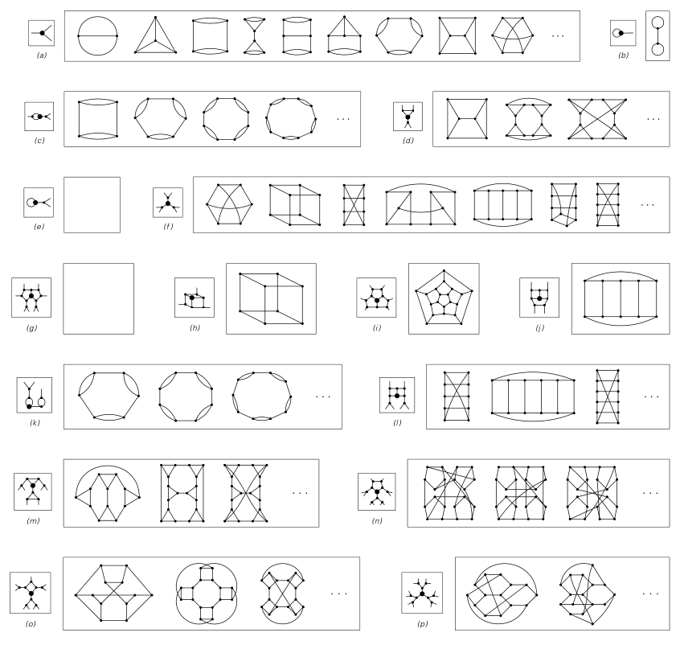
<!-- ORIGINAL_FIGURES page=0499 end -->

图：由约束决定的网络例子。在每一种情况下，所示网络都被要求满足这样的约束：每个节点周围的形式必须对应于所示模板，并且模板中的悬空连接不得彼此连接。这些图片包括所有 14 个涉及距至多二的节点、并且可以形成完整网络的模板。在大多数只要能形成这种网络的情形中，都会允许一个无限网络序列。但在情形 (b)、(h)、(i) 和 (j) 中，事实证明只允许单个网络。这里显示的网络约束系统，是第五章末尾讨论的基于约束的二维系统的类似物。

---

[[PDF page 500]]

那么，如果允许模板包含距二以内的节点，会发现什么？这类不同的非平凡模板共有 690 个，其中 681 个不允许形成任何完整网络，如情形 (g) 所示。剩下模板中有六个再次允许一个无限网络序列。但有三个模板，即情形 (h)、(i) 和 (j) 所示，事实证明只允许单个网络。不过这些网络相当简单；事实上其中最复杂的情形 (i) 只有 20 个节点，并对应一个十二面体。

那么，事实上是否存在相当简单的约束集合，最终只允许一个高度复杂网络，或者也许允许一族相似网络？我倾向于怀疑。因为我们在第五章的经验是，即便在刚性得多的黑白方格阵列情形中，也相当难找到能成功强迫除非常简单图案之外的任何东西出现的约束。

那么，这对得到我们在宇宙中看到的那种复杂性意味着什么？本书中讨论过的元胞自动机等系统，要得到惊人复杂性并不困难。但这些系统并不是通过被要求满足约束来工作的，而是通过反复应用显式规则来工作。

那么，最终把宇宙看成一个位于时空中的单一结构，并且其形式由一组约束决定，这是否合理？我们真的应该想象，宇宙完整的时空历史以某种方式始终存在，而随着时间推进，我们只是探索其中的不同部分吗？还是应该转而认为，宇宙更像元胞自动机这类系统，会在时间中显式演化，因此在每个时刻实际上都会创造出宇宙的新状态，而旧状态会消失？

基于传统数学方程的模型，其中空间和时间只是作为抽象符号变量出现，从来不太需要区分这两种看法。但在试图理解宇宙的终极底层机制时，我相信人们不可避免地必须区分这些看法。

我强烈相信，第二种看法最有可能为我们的宇宙提供有意义的底层模型。不过，虽然这种看法更接近我们对时间的日常感知，它似乎

---

[[PDF page 501]]

<!-- ORIGINAL_FIGURES page=0501 start -->
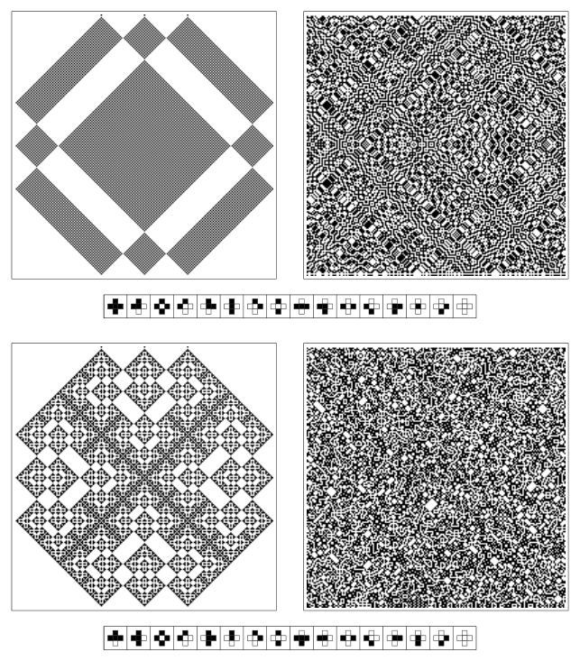
<!-- ORIGINAL_FIGURES page=0501 end -->

同大多数当代物理中内置的空间与时间之间的对应相矛盾。因此人们也许会问，它怎样才能同已经完成的物理实验一致？

一种可能性如下图所示：有一个系统按显式规则在时间中演化，但这些规则本身内置了空间与时间之间的对称性。

图：表现出空间和时间对称性的一维元胞自动机例子。每幅图都可以通过从顶部初始条件出发，然后反复应用元胞自动机规则沿页面向下演化而生成。所示具体规则是编号为 90R 和 150R 的可逆二阶规则。

---

[[PDF page 502]]

但我非常怀疑，我们宇宙的基本规则中存在任何这种明显的空间与时间对称性。相反，我预期发生的情形同本书中我们多次看到的很像：即使在最低层面上空间和时间之间没有直接对应，当人们以适当方式查看实际实验探测的大尺度时，这种对应仍然会涌现出来。

正如我将在接下来几节中讨论的，我怀疑，对于许多目的，宇宙历史事实上可以由某种因果网络表示。但这个网络形成的方式实际上相当不同地对待空间和时间。特别是，正像在元胞自动机这类系统中一样，网络可以通过从某些初始条件开始，然后一遍又一遍应用适当底层规则来增量建立。

原则上，任何这类规则都可以被看作为空间网络提供了一组约束。但重要的一点是，不需要单独搜索来寻找满足这类约束的网络，因为规则本身会直接定义一个建立所需网络的程序。

## 时间和因果网络

上一节我论证说，时间的推进在基本层面上应当很像元胞自动机这类系统的演化。但元胞自动机的一个特征是，它被设定为一起更新所有元胞，好像在某个全局时钟的每一次滴答中如此。然而，正如想象宇宙由空间中的刚性元胞网格组成并不合理一样，想象存在一个全局时钟来定义宇宙中每个元素在时间上同步更新，也并不合理。

但替代方案是什么？一开始这可能显得古怪，但我相信最终并不离正确太远的一种可能性是，宇宙的运作方式可能不像所有元胞同时更新的元胞自动机，而更像移动自动机或图灵机，其中每一步只有一个单独元胞被更新。

---

[[PDF page 503]]

<!-- ORIGINAL_FIGURES page=0503 start -->
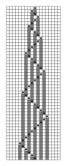
<!-- ORIGINAL_FIGURES page=0503 end -->

正如第三章所讨论并由右侧图片所示，移动自动机只有一个单独的活跃元胞，它从一步到下一步四处移动。因为这个活跃元胞是唯一会被更新的元胞，所以在给定步骤上从不存在同步不同元素行为的问题。

然而，一开始认为我们的宇宙可能像移动自动机那样工作，似乎荒谬。因为我们当然并没有注意到任何活跃元胞按顺序访问宇宙中的不同位置。事实上，恰恰相反，我们的感知是宇宙的不同部分似乎并行演化，并一起穿过时间推进。

但事实证明，人们感知像移动自动机这样的系统中发生什么，可能极大取决于人们是从外部观察系统，还是自己以某种方式就是系统的一部分。从外部看，人们可以很容易看到移动自动机演化中的每一个单独步骤，也可以看出只有一个单独活跃元胞按顺序访问系统的不同部分。但对于实际作为移动自动机一部分的观察者，感知可以相当不同。

因为为了意识到时间已经过去，或者甚至意识到任何事情已经发生，观察者的状态必须以某种方式改变。但如果观察者自身只是由移动自动机内部的一组元胞组成，那么除非移动自动机中的活跃元胞访问这组元胞，否则这种改变不会发生。

这意味着，在移动自动机内部的观察者所感知的任意两个连续时间瞬间之间，可以有许多步底层移动自动机演化。

如果一个观察者能够分辨每一步上发生了什么，那么很容易识别元胞以什么样的顺序方式被更新。但因为作为移动自动机一部分的观察者实际上只能偶尔分辨发生过什么，所以就这种观察者而言，在连续时间瞬间之间，许多元胞可以看起来像是被并行更新了。

要更详细地看这是怎样工作的，也许有必要为观察者建立一个具体模型。但事实上，事实证明，只需要不以单个步骤来观察移动自动机的演化，而以更新事件及其之间的因果关系来观察就足够了。

---

[[PDF page 504]]

对页上的图片显示了这种做法的一个例子。图片 (a) 是我在本书其他地方用于移动自动机演化的标准表示的一个版本，其中连续各行给出连续步骤上的元胞颜色，每一步活跃元胞的位置由一个灰点表示。对页后续图片最终都给出本质上相同的信息，但逐渐把它呈现为更强调更新事件和因果关系的表示。

图片 (b) 同 (a) 非常相似，但把移动自动机演化的连续步骤分开显示，中间的灰色斑块表示与每一次应用底层移动自动机规则相对应的“更新事件”。图片 (b) 仍然为移动自动机演化的每个单独步骤设置了确定的一行元胞。但在图片 (c) 中，某一步未被更新的元胞被合并在一起，产生从一个更新事件延伸到另一个更新事件的彩色竖条。

那么这些竖条的意义是什么？本质上，它们用于携带决定下一个更新事件将是什么所需的信息。正如图片 (d) 开始强调的，可以把这些竖条看作指示更新事件之间存在什么因果关系或连接。

这一概念随后提示了移动自动机整个演化的一种完全不同的表示。因为与其采用基于连续单个演化步骤的图片，不如形成更新事件之间各种因果关系的网络，其中每个更新事件都是网络中的一个节点，每条竖条都是从一个节点到另一个节点的连接。

图：移动自动机演化的一系列视图，显示怎样可以创建更新事件之间的因果关系网络。这个网络为宇宙中的时空提供了一个非常简单的模型。图片 (a) 本质上是我在本书中使用的移动自动机演化标准表示。图片 (b) 包含灰色斑块，用来表示更新事件。图片 (c) 合并未被更新的元胞。图片 (d) 强调竖条作为更新事件之间连接的作用。图片 (e) 到 (g) 显示怎样形成一个网络，其中节点对应更新事件。图片 (h) 和 (i) 表明，在这里使用的特定底层规则下，会产生一个高度规则的网络。

---

[[PDF page 505]]

<!-- ORIGINAL_FIGURES page=0505 start -->
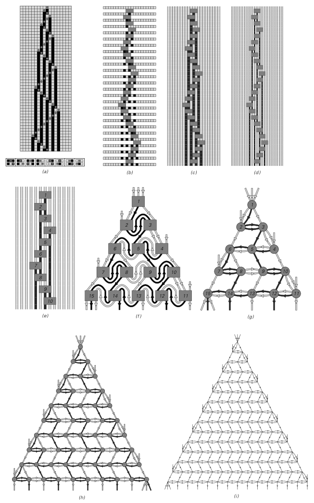
<!-- ORIGINAL_FIGURES page=0505 end -->

图示续：移动自动机演化视图与由更新事件形成的因果网络。

---

[[PDF page 506]]

图片 (e) 显示了图片 (d) 顶部的更新事件和竖条，其中更新事件现在被明确编号。图片 (f) 和 (g) 接着显示，怎样可以取图片 (e) 中的连接模式，并把更新事件布局为节点，从而产生一个有序网络。对于这里使用的特定移动自动机规则，得到的网络最终高度规则，如图片 (h) 和 (i) 所示。

那么这个网络的意义是什么？事实证明，它可以被看作定义了移动自动机内部观察者所感知的时空结构，其方式非常类似于两节前我们讨论的那些网络可以被看作定义空间结构。每一个更新事件，对应于网络中的每个节点，都可以被想象为发生在时空中的某一点。而网络中节点之间的连接则可以被看作定义了时空点的邻居模式。

但不同于两节前讨论的空间网络，我们这里考虑的因果网络中的连接总是只朝一个方向：每个连接对应一种因果关系，其中一个事件导致另一个事件，而不是反过来。

然而，这种方向性恰恰是要让有意义的时间概念涌现出来所需要的。因为时间的推进可以这样定义：只有那些在时间上晚于某个特定事件发生的事件，才能受到该事件影响。

事实上，上一页图片 (g) 到 (i) 中的网络经过专门布局，使得沿页面向下的连续节点行至少粗略地对应于发生在连续更晚时间的事件。

正如图片 (e) 到 (g) 中的编号所说明的，这种时间概念同移动自动机底层演化中发生的更新事件序列没有直接对应。因为关键是，作为移动自动机一部分的观察者永远不会看到这种演化中的全部单独步骤。他们至多能够分辨的是，存在某个因果关系网络，因此他们的时间感知必然纯粹来自这个网络的性质。

---

[[PDF page 507]]

那么，涌现出来的时间概念是否真的具有我们所知道的时间的熟悉特征？人们也许会认为，例如网络中可能存在环，从而偏离我们似乎经验到的线性时间推进。但事实上，如果因果网络像这里这样从某个底层演化过程构造出来，这类环永远不会出现。

那么，原始移动自动机中演化顺序性质的痕迹又如何？人们也许会想象，由于每一步只有一个单独活跃元胞被更新，系统不同部分必然会被感知为一个接一个地穿过时间推进。但第 489 页上的图片表明，情况未必如此。事实上，在那里显示的网络中，每一行上的所有节点实际上都并行连接到下一行上的节点。因此，尽管移动自动机的底层规则不涉及全局同步，移动自动机内部的观察者仍有可能把时间感知为以同步方式推进。

本章后面我会讨论空间在因果网络语境中怎样运作，以及相对论思想怎样涌现。但现在，可以把第 489 页上的那些网络简单地看作布局成时间沿页面向下、空间横跨页面。于是人们可以看到，如果沿网络中的连接前进，就总是被迫逐渐向页面下方走，尽管可以在页面横向上前后移动；这同我们的日常经验一致：我们能够在空间中大体向任何方向移动，但总是被迫在时间中继续向前。

那么其他移动自动机会发生什么？

接下来两页的图片显示了几个例子。

规则 (a) 和 (b) 产生非常简单的重复网络，其中实际上存在时间概念，但没有空间概念。任何移动自动机的底层工作方式都会迫使时间永远继续。但对于规则 (a) 和 (b)，在空间中永远只能到达有限数量的点。

不过，所示其他规则没有这个问题：在所有这些规则中，随着时间推进，空间中会到达越来越多的点。规则 (c) 和 (d) 产生的网络能够以相当

---

[[PDF page 508]]

<!-- ORIGINAL_FIGURES page=0508 start -->
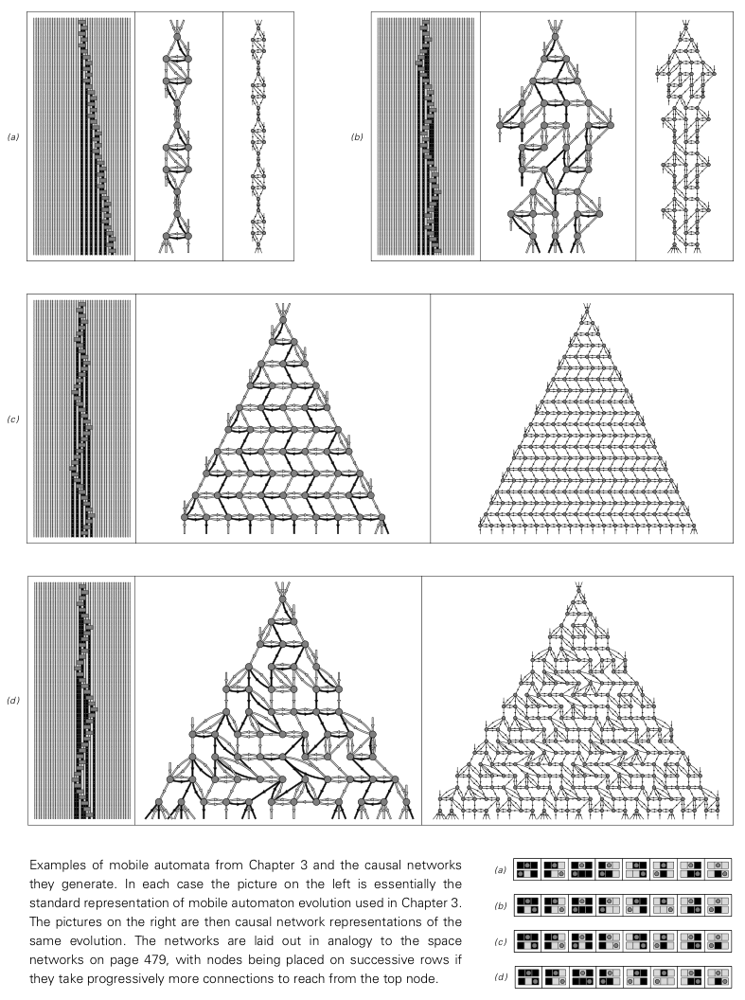
<!-- ORIGINAL_FIGURES page=0508 end -->

规则的方式布局。

图：第三章中的移动自动机以及它们生成的因果网络例子。每一种情况下，左侧图片本质上是第三章中使用的移动自动机演化标准表示。右侧图片则是同一演化的因果网络表示。这些网络的布局方式类似于第 479 页上的空间网络：如果从顶部节点出发需要沿越来越多连接才能到达某个节点，那么该节点会被放在连续的行上。

---

[[PDF page 509]]

<!-- ORIGINAL_FIGURES page=0509 start -->
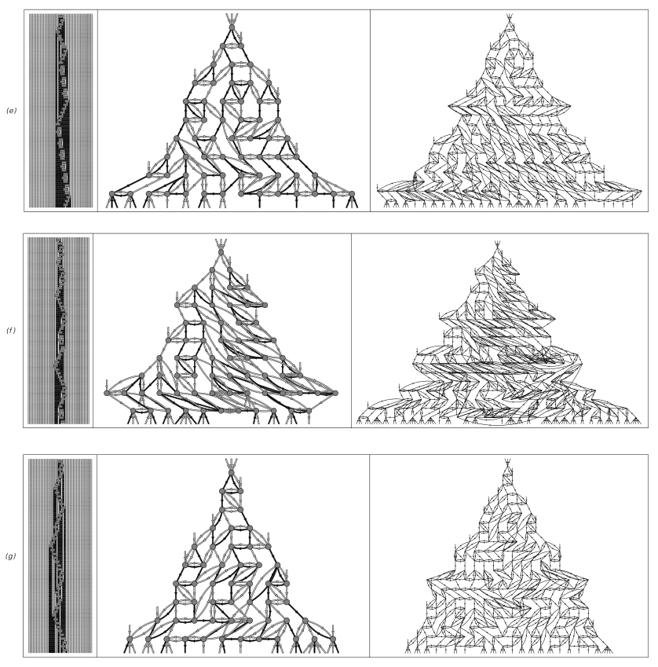
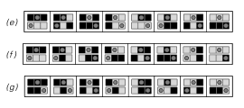
<!-- ORIGINAL_FIGURES page=0509 end -->

图示续：注意，单个连接可以连接在底层移动自动机演化中相隔非常多步骤的事件。事实上，要构造因果网络哪怕很小的一部分，也可能需要在底层移动自动机中进行任意长的计算。例如，为了生成图片 (e)、(f) 和 (g) 中的因果网络，需要分别查看移动自动机演化的 2447、731 和 322 步。并且，在某些情况下会有实际上永远得不到解决的连接。例如，在图片 (a) 中有一些向下连接永远不会到达任何其他节点，这反映了移动自动机演化左侧存在一些活跃元胞再也不会返回的位置。

---

[[PDF page 510]]

但对于规则 (e)、(f) 和 (g)，网络更复杂，并开始显得有些随机。

前两页用来布局网络的过程，是第 479 页上用于空间网络过程的直接类似物：某个特定节点将被放在哪一行，由从顶部节点出发为到达该节点所必须沿着走过的最少连接数决定。

在情形 (a) 和 (c) 中，以这种方式得到的网络具有这样一个性质：节点之间的所有连接都要么横跨页面，要么向页面下方。但在显示的其他每一种情况下，至少有一些连接也会向页面上方走。那么这对我们的时间概念意味着什么？如前所述，任何来自演化过程的因果网络中都不可能有环。但如果把时间同页面向下的位置相识别，那么既向上又向下的连接的存在意味着，从某种意义上说，时间并不总是沿同一方向推进。然而至少在这里显示的情形中，仍存在一种强烈的平均向下流动，这同我们日常感知中时间只朝一个方向推进相一致。

就像本书研究过的许多其他系统一样，我们在因果网络中发现的随机性不可避免地倾向于冲洗掉网络构造方式的细节。因此，例如尽管移动自动机的底层规则总是非常不同地对待空间和时间，涌现出来的因果网络却常常表现出某种均匀随机性，其中空间和时间以某种方式在许多方面运作得相同。

但尽管在因果网络层面存在这种均匀性，从移动自动机演化到因果网络的变换却常常远非均匀。例如，对页顶部的图片显示了上一页规则 (e) 和 (f) 的因果网络，但现在每个节点都编号，以指定它来自移动自动机演化中的哪一步。

我们看到，即使是离因果网络顶部很近的节点，也可以对应于发生在大量移动自动机演化步骤之后的事件。事实上，仅仅要填充二十行

---

[[PDF page 511]]

<!-- ORIGINAL_FIGURES page=0511 start -->
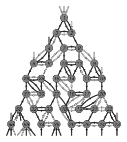
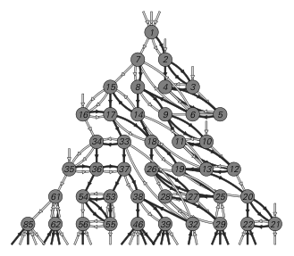
<!-- ORIGINAL_FIGURES page=0511 end -->

规则 (e) 和 (f) 的因果网络，就分别需要跟踪底层移动自动机演化 2447 和 731 步。

图：对应于第 493 页规则 (e) 和 (f) 的因果网络，其中每个节点都明确标注，以指定它来自移动自动机演化的哪一步。即使只填入这类因果网络的最初几行，也必须追踪许多步底层移动自动机演化。

因果网络的一个特征是，它不仅告诉人们某个特定事件的后果会是什么，也在某种意义上告诉人们它的原因是什么。例如，如果从上方第一个因果网络中的事件 17 开始，要弄清它的原因是事件 11 和 16，只需要沿通向它的连接向后追踪。

对于这里使用的特定底层移动自动机类型，每个节点正好有三个传入连接和三个传出连接。而至少当存在总体表观随机性时，从某个特定节点向前和向后得到的网络看起来会非常相似。在多数情况下仍会有小差别；但右侧上方的因果网络是专门构造成精确可逆的，很像我们在本章开头附近讨论的元胞自动机。

看着迄今见过的因果网络，人们也许会问，它们的形式在多大程度上取决于用来产生它们的底层移动自动机的具体性质。

例如，人们也许会认为，迄今看到的所有网络至多随时间线性增长这一事实，必然是所用移动自动机规则一维性质的后果。但下面的图片表明，即使使用这种一维规则，事实上也可以得到增长更快的因果网络。事实上，在下方显示的情况下，连续各行上的节点数大约每行多一个因子 1.22，对应于总体近似指数增长。

---

[[PDF page 512]]

<!-- ORIGINAL_FIGURES page=0512 start -->
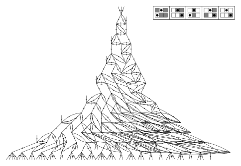
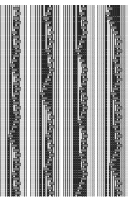
<!-- ORIGINAL_FIGURES page=0512 end -->

图：一个一维移动自动机，它产生实际上随时间指数增长的因果网络。底层移动自动机像二进制计数器那样工作，产生一个宽度随步数对数增长的图案。规则中未显示的三种情形，在这里给定的初始条件下从不使用。

一个系统的因果网络，在某种意义上总是同该系统的底层演化对偶。在这里显示的情况下，底层演化中活跃元胞所访问区域的缓慢增长，反映为对应因果网络的快速增长。

正如本章后面将看到的，一维移动自动机以及类似系统能够产生的因果网络种类最终有一些限制。但使用不同移动自动机规则，已经可以得到巨大的多样性。

即使从外部看，移动自动机这类系统似乎几乎没有我们宇宙的熟悉特征，我们仍看到，如果我们作为观察者在某种意义上是这类系统的一部分，那么立刻就会有一些同我们宇宙非常相似的主要特征涌现出来。

---

[[PDF page 513]]

<!-- ORIGINAL_FIGURES page=0513 start -->
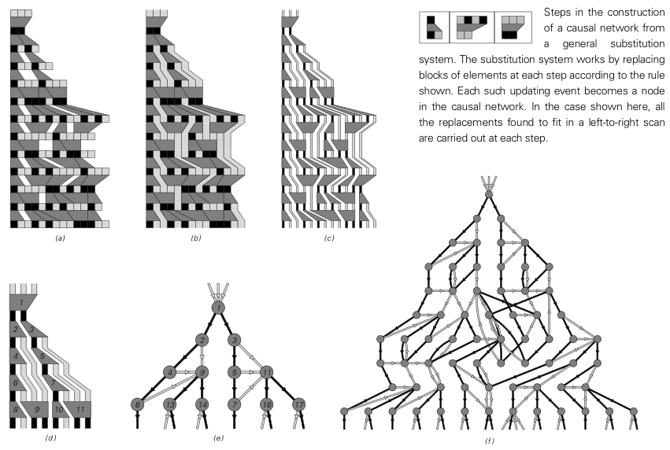
<!-- ORIGINAL_FIGURES page=0513 end -->

## 宇宙中事件的排序

上一节我讨论了一类模型，其中熟悉的时间概念可以在没有任何内置全局时钟的情况下涌现出来。我使用的具体模型基于移动自动机，其中单个活跃元胞的存在迫使宇宙中任何时刻只发生一个事件。但正如本节将看到的，事实上并不需要如此刚性的设定，甚至也不需要任何类似活跃元胞的构造。

可以把移动自动机看作我在第三章引入的那类替换系统的特殊情形。一般而言，这类系统取一串元素，并在每一步按照某条确定规则把这些元素的块替换为其他元素。

下面的图片显示了这样一个系统的例子，并说明了同移动自动机中一样，更新事件之间的关系可以怎样由因果网络表示。

图：从一般替换系统构造因果网络的步骤。替换系统按照所示规则在每一步替换元素块。每一个这样的更新事件都成为因果网络中的一个节点。在这里显示的情况下，在从左到右扫描中发现适配的所有替换都会在每一步执行。

---

[[PDF page 514]]

<!-- ORIGINAL_FIGURES page=0514 start -->
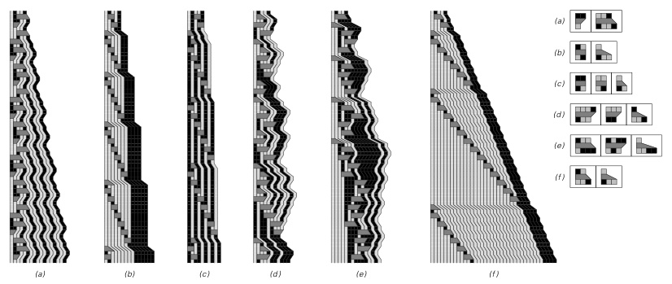
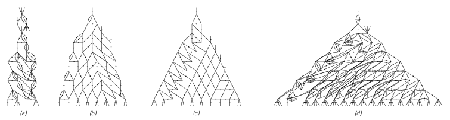
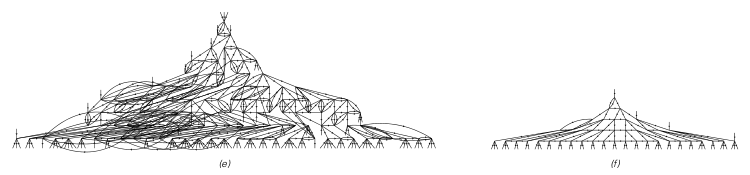
<!-- ORIGINAL_FIGURES page=0514 end -->

图：第 88 页讨论的那类顺序替换系统，以及从中涌现的因果网络例子。在顺序替换系统中，每一步只执行在从左到右扫描中发现的第一个适用替换。上面的规则 (a) 产生的因果网络是纯重复的，因此不给出有意义的空间概念。规则 (b)、(c) 和 (d) 产生实际上大致随时间线性增长的因果网络。在规则 (f) 中，因果网络指数增长；而规则 (e) 中因果网络也增长得相当快，尽管其总体增长性质并不清楚。注意，为了得到规则 (e) 的因果网络中这里显示的 10 个层级，必须跟踪底层替换系统演化总共 258 步。

---

[[PDF page 515]]

对应于移动自动机的替换系统，可以被看作具有特别设定的规则和初始条件，使得任何特定步骤上永远只可能发生一个更新事件。但对于大多数规则，包括上一页显示的规则，每一步通常可以作出若干种可能替换。

决定作出哪一种替换的一个方案，是从左到右扫描字符串，然后选择第一个适用替换。这个方案同我们在第三章讨论过的顺序替换系统精确对应。

对页上的图片显示了可能发生的几个例子。得到的行为常常相当简单，但在某些情况下最终可以高度复杂。并且，正如在移动自动机中一样，涌现出来的因果网络通常实际上随时间线性增长。但也同移动自动机中一样，存在规则 (a) 这样的规则，其中没有增长，实际上没有空间概念。还存在规则 (f) 这样的规则，它们在一般替换系统中比在移动自动机中常见得多，其因果网络实际上随时间指数增长。

但为什么每一步只做一个替换？下一页的图片显示了如果再次从左到右扫描，但现在执行所有适配替换，而不只是第一个，会发生什么。

对于规则 (a) 和 (b)，结果是在每一步更新每一个单独元素。但由于这些特定规则中的替换一次只涉及一个元素，实际上得到的是我们在第 82 页讨论过的那类邻居无关替换系统。正如我们在那里发现的，这类系统永远只能产生相当简单的行为：每个元素反复分枝成若干其他元素，产生具有规则树形式的因果网络。

那么涉及不止一个元素的替换会发生什么？许多情况下，行为仍然相当简单。但正如下页若干图片所显示的，相当简单的规则已经足够，正如本书讨论过的许多其他系统中那样，能够得到高度复杂的行为。

---

[[PDF page 516]]

<!-- ORIGINAL_FIGURES page=0516 start -->
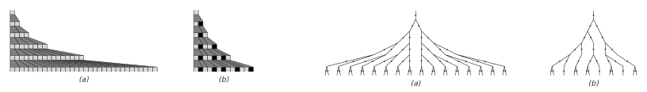
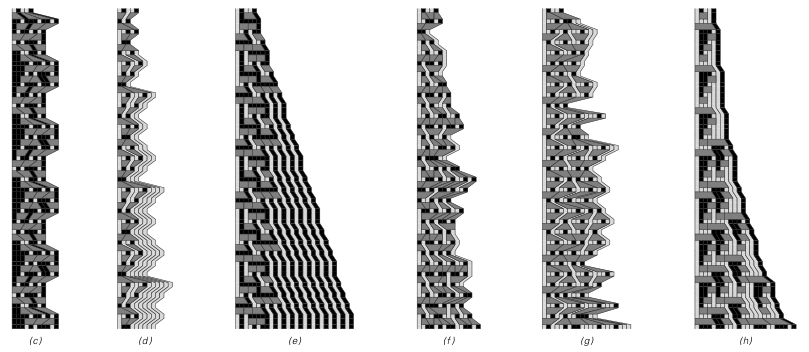
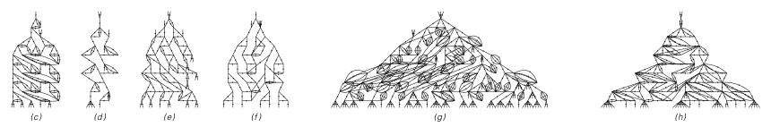
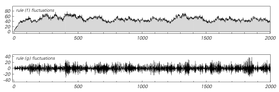
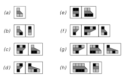
<!-- ORIGINAL_FIGURES page=0516 end -->

图：一般替换系统及从中涌现的因果网络例子。这里显示的图片中，在从左到右扫描中发现的每个适配替换，都会在每一步执行。规则 (a) 和 (b) 像第 84 页讨论的邻居无关替换系统那样行动，并产生指数增长的树状因果网络。底部曲线显示规则 (f) 和 (g) 所产生图案的增长速率。在规则 (f) 的情况下，图案事实证明是重复的，周期为 796 步。

---

[[PDF page 517]]

<!-- ORIGINAL_FIGURES page=0517 start -->
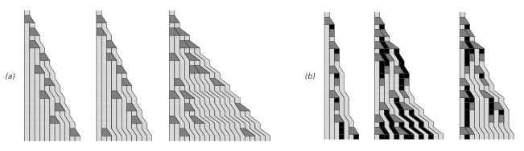
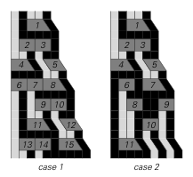
<!-- ORIGINAL_FIGURES page=0517 end -->

然而，人们也许会问，所看到的行为在多大程度上依赖于选择每一步应用哪些替换的确切方案。答案是，对于绝大多数规则，包括对页图片中的规则 (c) 到 (g)，使用不同方案会产生相当不同的行为，也会产生相当不同的因果网络。

但相当惊人的是，确实存在这样的规则：不管使用什么方案，都会得到完全相同的因果网络。事实证明，对页图片中的规则 (a) 和 (b) 就提供了这种现象的简单例子，如下面图片所示。

图：对页规则 (a) 和 (b) 在随机执行替换时的行为。尽管得到的详细图案不同，这些特定规则中表示替换事件之间关系的因果网络始终完全相同。

对于每条规则，上面显示的三幅不同图片对应于三种不同替换方式。虽然每幅图中特定更新事件的位置不同，关键是这些事件之间的因果连接网络总是完全相同。

这当然并非对每个替换系统都为真。事实上，右侧图片显示了它怎样可能失败，例如对页规则 (e) 就会如此。在这些图片中看到的是，在事件 4 之后，两种情况下作出了不同替换选择，而这些替换所蕴含的因果关系不同。

那么，什么能保证某个特定替换系统中永远不会出现这种情况？本质上需要为真的是，仅凭元素序列本身，必须总能唯一决定系统每个部分中可以作出哪些替换。人们仍可选择是否在某个特定步骤实际执行给定替换，或者是否把该替换延迟到后续步骤。但必须为真的是，对于系统中任何给定部分最终将作出什么替换，永远不能有任何歧义。

---

[[PDF page 518]]

<!-- ORIGINAL_FIGURES page=0518 start -->
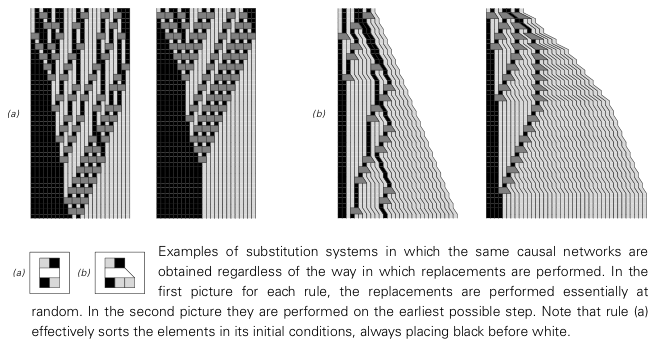
<!-- ORIGINAL_FIGURES page=0518 end -->

在第 500 页顶部那种规则中，每个替换只涉及单个元素，因此事情不可避免地必须以这种方式运作。但对于替换涉及多个元素块的规则又如何？这类规则仍能具有所需性质吗？

下面的图片显示了两个确实具有这种性质的规则例子。对于每条规则，第一幅图中替换在随机选择的步骤上作出；第二幅图中，它们在某种意义上总是在最早可能步骤作出。但关键是，在任何情况下，对于系统中任何特定位置最终将作出什么替换，都不存在任何歧义。结果，表示不同更新事件之间关系的因果网络始终完全相同。

图：一些替换系统例子，其中不管替换以何种方式执行，都会得到同样的因果网络。对于每条规则，第一幅图中替换基本随机执行，第二幅图中替换在最早可能步骤执行。注意，规则 (a) 实际上对其初始条件中的元素排序，总是把黑色放在白色之前。

那么，为了使整个系统以这种方式运行，替换系统的规则必须具有怎样的底层性质？基本答案是，不同替换必须以某种方式永远不能相互干扰。保证这一点的一种方式是，替换所涉及的块永远不能重叠。

---

[[PDF page 519]]

<!-- ORIGINAL_FIGURES page=0519 start -->
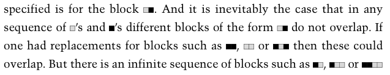
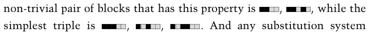
<!-- ORIGINAL_FIGURES page=0519 end -->

在对页显示的两条规则中，唯一指定的替换都是针对同一个块。不可避免地，在任意由两种元素组成的序列中，这种形式的不同块不会重叠。如果对某些更短或不同形式的块设置替换，它们就可能重叠。但存在一个无限序列的块，具有不可能重叠的性质，因此不同替换永远不能相互干扰。

如果一条规则涉及若干不同块的替换，那么为了避免干扰可能性，必须要求这些块永远不能同自身或彼此重叠。具有这一性质的最简单非平凡块对，以及最简单三元组，在原图中给出。任何其规则只为这类块指定替换的替换系统，都保证不管替换执行顺序如何，都会产生相同的因果网络。

一般来说，条件事实上稍弱一些。并不需要替换中根本不存在任何重叠；只需要在替换系统演化实际能够生成的元素序列中，不出现重叠。

最终会有各种各样的替换系统具有这样的性质：它们生成的因果网络总是独立于其规则的应用顺序。

那么这对宇宙模型意味着什么？

在元胞自动机这样的系统中，同一条底层规则在某种意义上总是在每一步精确同步地应用于每个元胞。但本节我们看到，也存在这样的系统，其中规则实际上可以在人们想要的任意时间和任意位置应用，但总会涌现出同一个确定因果网络。

这意味着，不需要任何内置全局时钟，甚至不需要任何类似活跃元胞的机制。只要选择适当的底层规则，就有可能保证与这些规则一致的任意事件序列都会产生同样的因果网络，并因此实际上产生同样被感知到的宇宙历史。

---

[[PDF page 520]]

<!-- ORIGINAL_FIGURES page=0520 start -->
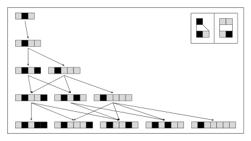
<!-- ORIGINAL_FIGURES page=0520 end -->

## 时间中的唯一性和分支

如果我们的宇宙没有内置全局时钟，也没有类似活跃元胞的构造，那么在最低层面上，其规则如何应用几乎不可避免地会有至少某种任意性。

然而在上一节中，我们发现了一个相当惊人的事实：存在一些规则具有这样一种性质，本质上不管它们怎样应用，总会涌现出同一个因果网络，并因此涌现出同一个被感知到的宇宙历史。

但最终是否真的必须如此，即我们宇宙的底层规则强迫存在唯一的被感知历史？在第五章接近结尾处，我引入多路系统作为允许多重历史的系统例子。事实证明，多路系统在基本结构上实际上同上一节讨论的替换系统极为相似。

两类系统都在元素字符串上执行同一种替换。但在替换系统中，人们每一步总是只执行单一一组替换，得到一个单独的新字符串；而在多路系统中，则执行每一种可能替换，因此通常生成许多新字符串。

下面的图片显示了一个简单例子，说明这种做法怎样运作。在这幅特定图片的第一步中，碰巧只有一种替换可以按规则执行，所以只产生一个字符串。但在后续步骤上，若干不同替换都是可能的，因此产生若干字符串。一般而言，穿过这样的图片的每一条路径，都对应于多路系统演化中存在的一种可能历史。

图：一个简单多路系统，其中替换在每一步以所有可能方式应用于每个字符串。

---

[[PDF page 521]]

那么，宇宙的终极模型是否可以想象为基于多路系统？一开始人们也许不会这样想。因为我们的日常印象是，我们的宇宙只有一个确定历史，而不是某种由不同历史组成的完整集合。如果能够从外部观察多路系统，人们会立刻看到存在不同路径，对应于不同历史。

但关键是，如果我们宇宙的完整状态实际上像多路系统中的一个单独字符串，那么我们永远没有办法从外部观察这个多路系统。作为多路系统内部的实体，我们的感知不可避免地会是只走过了一条单独路径，对应一个单独历史。

如果能够从外部观察多路系统，这条路径会显得相当任意。但对于身处多路系统内部的我们来说，它就是代表我们曾经拥有的经验线索的唯一路径。

直到几个世纪以前，人们还广泛相信地球在空间中具有某种根本独特的位置。但逐渐地，事情变得清楚：事实并非如此；从某种意义上说，只是我们自己的存在让我们在空间中的特定位置显得有任何独特性。然而对于时间，人们仍然相信我们以及我们的宇宙以某种方式拥有唯一历史。但如果我们的宇宙事实上是多路系统的一部分，那么这就不是真的。事实上，我们宇宙所经历的特定历史唯一独特之处，只会是它是我们已经经验过的那一条。

在纯粹人类层面上，想到我们存在的几乎所有细节都不以任何方式独特，而且多路系统中也许有其他路径上一切都会不同，我觉得相当令人失望。在科学上，也不令人满意的是不得不说，我们宇宙中有些特征并非由任何有限的底层规则集决定，而是在某种意义上只是历史的纯粹偶然，关联于我们在多路系统中碰巧走过的特定路径。

在第七章前半部分，我们讨论了自然系统中所见表观随机性的各种可能起源。如果宇宙由多路系统描述，那么

---

[[PDF page 522]]

<!-- ORIGINAL_FIGURES page=0522 start -->
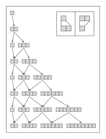
<!-- ORIGINAL_FIGURES page=0522 end -->

就会有一个额外的随机性来源：同我们经验过的历史相对应的路径的任意性。

在许多方面，这种随机性类似于我们在第七章开头讨论的来自环境的随机性。但一个重要差异是，即使人们实际上能够把一个系统同宇宙其余部分完美隔离开来，它仍然会发生。过去，如果在这样一个系统中看到表观随机性，似乎别无选择，只能假定某种底层多路系统。但本书的一个发现是，完全可以仅仅通过遵循确定底层规则来生成看起来近乎完美的随机性。

事实上，我不预期随机性观察能够被合理地用来证明我们的宇宙是多路系统的一部分。我的猜测是，唯一能相当确定地证明这一点的方法，将是真正找到一组具体的多路系统规则，它们具有这样的性质：不管走过哪条路径，这些规则总会产生同我们宇宙各种已观察特征一致的行为。

在某个层面上，多路系统竟能一致地表现出某种特定行为形式，可能显得令人惊讶。因为人们也许会想象，有这么多不同路径可选，通常几乎任何行为都能在某条路径上发生。事实上，正如左侧图片所示，要构造能产生某种类型所有可能字符串的多路系统并不困难。

图：一个多路系统，其中任意长度的字符串都可以被生成，但任何路径上实际出现的长度序列只有特定几种。

但如果不只观察单个字符串，而是观察多路系统中沿路径存在的字符串序列，就会发现这些序列不再能如此任意。事实上，在任何具有有限规则集的多路系统中，这类序列必然受到各种约束。

一般而言，多路系统中的每条路径都可以被看作由一串可能方式来定义，而这些方式说明如何应用多路系统规则所指定的替换。每条这样的路径继而定义了上一节讨论的那种因果网络。但正如我们在那里看到的，某些底层规则具有

---

[[PDF page 523]]

<!-- ORIGINAL_FIGURES page=0523 start -->
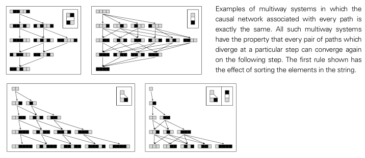
<!-- ORIGINAL_FIGURES page=0523 end -->

这样的性质：不管替换应用顺序如何，也因此不管多路系统中走过哪条路径，因果网络的形式最终都相同。

下面的图片显示了一些具有这种性质的简单规则例子。事实证明，从所发生的多路系统路径的总体模式中，相当容易识别出这种性质的存在。

图：一些多路系统例子，其中同每条路径相关的因果网络完全相同。所有这类多路系统都具有这样一个性质：任何一对在某个步骤分叉的路径，都可以在下一步重新汇合。所示第一条规则的作用是对字符串中的元素排序。

如果从一个给定初始字符串出发，通常会通过应用不同替换生成不同字符串。但如果要得到相同的因果网络，那么必须总是存在一些替换，可以应用于已经生成的字符串并产生相同的最终字符串。这意味着，多路系统中任何一对发生分叉的路径，都必须能够在仅仅一步之内重新汇合；所以像上面图片中的所有箭头都必须位于四边形的边上。

不过，大多数多路系统并不精确具有这种性质，因此沿其中不同路径得到的因果网络不会绝对相同。但事实仍然表明，只要路径总能最终汇合，即使不是在固定步数内汇合，所得因果网络在足够大尺度上就必然存在相似性。

在单个事件层面，因果网络的结构通常会差异很大。但如果观察足够大的事件集合，这些细节就倾向于被冲洗掉；

---

[[PDF page 524]]

不管选择哪条路径，因果网络的总体形式都将本质上相同。这意味着，在足够大尺度上，宇宙会显得具有唯一历史，尽管在单个事件层面会有相当多的任意性。

如果多路系统中没有足够多的汇合，仍可能被困在永远不会通向彼此的不同类型字符串中。如果发生这种情况，就意味着宇宙历史实际上可以沿许多真正分离的分支前进。但只要多路系统演化产生显著随机性，这种情况通常似乎不会出现。

因此，这表明，事实上在某个层面上，多路系统要复现我们的日常感知，即宇宙中发生的事情或多或少是确定的，并不太困难。但尽管这意味着宇宙因果网络中可能存在任意性，我仍然倾向于怀疑并不存在这种任意性；事实上，宇宙最终遵循的特定规则具有这样的性质：它们总是产生同一个因果网络。

## 网络的演化

本章前面，我提出在最低层面空间也许由一个巨大的节点网络组成。但这样的网络可能怎样演化？

最直接的可能性是，它可以非常像过去几节讨论过的替换系统那样工作：在每一步中，网络的某个或某些片段可以按照某条固定规则被其他片段替换。

对页顶部的图片显示了两个非常简单的例子。从连接像四面体边的网络开始，所示两条规则的工作方式都是在每一步把每个节点替换为某个固定节点簇。

这种设定同我们在第 83 页和第 187 页讨论的邻居无关替换系统非常相似。正如在那些系统中一样，可以产生精巧结构，但这些结构结果总是具有高度规则的嵌套形式。

---

[[PDF page 525]]

<!-- ORIGINAL_FIGURES page=0525 start -->
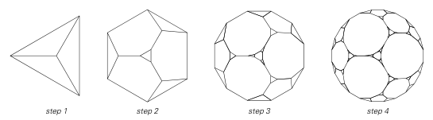
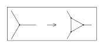
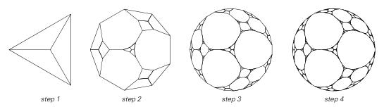
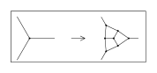
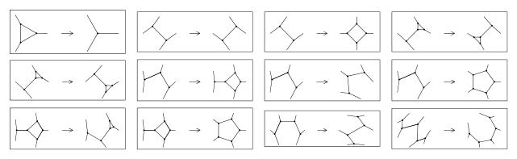
<!-- ORIGINAL_FIGURES page=0525 end -->

图：网络演化，其中每个节点在每一步被一个固定节点簇替换。所得网络具有规则嵌套形式。极限网络的维数分别为 `Log[2, 3] ~= 1.58` 和 `Log[3, 7] ~= 1.77`。

那么更一般的替换系统又如何？网络是否有其类似物？答案是有，而且它们基于不只是替换单个节点，而是替换节点簇，如下面图片所示。

图：涉及把网络中的节点簇替换为其他节点簇的规则例子。所有这些规则都保持网络的平面性。注意，其中有些规则不能反向运行，因为它们右侧过于对称，无法决定应使用左侧的哪一种取向。

在前几节讨论的字符串替换系统中，给出的规则可以涉及把任意元素块替换为任意其他元素块。但在网络中，不可避免地有一些限制。例如，如果一个节点簇同网络其余部分有一定数量连接，那么它就不能被具有不同连接数量的节点簇替换。此外，不能有

---

[[PDF page 526]]

<!-- ORIGINAL_FIGURES page=0526 start -->
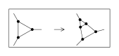
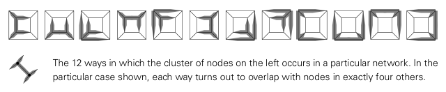
<!-- ORIGINAL_FIGURES page=0526 end -->

左侧那种从对称节点簇出发，却需要选择特定取向结果的替换。

图：一种结果取向无法被确定的替换。

但尽管有这些限制，仍有相当多的替换是可能的；例如，涉及不超过五个节点的不同替换总共有 419 个。

那么，给定某种特定形式节点簇的替换，这样的替换实际应怎样应用于网络？一开始，人们也许会认为，可以设定某种元胞自动机类似物，并同时替换所有相关节点簇。

但一般而言，这行不通。因为正如下图所说明的，某种特定形式的节点簇通常可以以许多彼此重叠的方式出现在给定网络中。

图：左侧节点簇出现在某个特定网络中的 12 种方式。在这里显示的特定情况下，每一种方式恰好同另外四种方式中的节点重叠。

这个问题本质上同前几节在字符串替换系统中遇到的元素块问题没有区别。但一个额外复杂性是，在网络中，不像字符串中那样，元素没有立即明显的排序。

尽管如此，仍然可以设计方案来决定应在网络的哪些位置执行替换。对页说明了一种相当简单的方案，它每一步只允许执行单个替换，并选择该替换的位置，使其影响最近最少被更新的节点。

页面上半部分的每一对图片中，上图显示替换之前网络的形式，下图显示执行替换之后的结果，两种情况下都高亮显示替换所涉及的节点簇。在页面下半部分的三维图片中，连续步骤上出现的网络彼此堆叠显示，而每次替换中涉及的节点用灰线连接。

---

[[PDF page 527]]

<!-- ORIGINAL_FIGURES page=0527 start -->
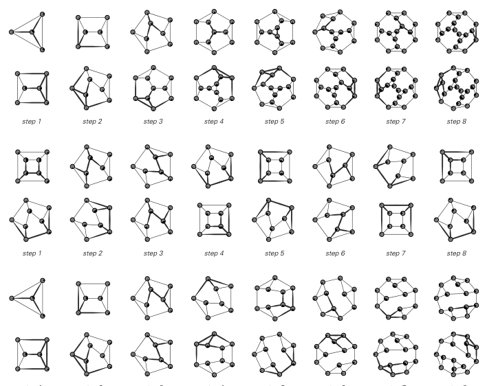
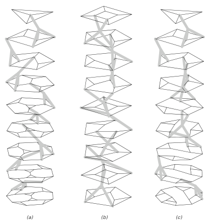
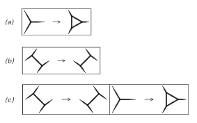
<!-- ORIGINAL_FIGURES page=0527 end -->

图：网络演化例子，其中每一步按照所示规则替换单个节点簇。上方每一对图片表示每次替换前后网络的状态。替换影响的节点在两种情况下都被高亮显示。替换执行的位置由要求它涉及网络中尽可能最旧的节点来决定。上方图片中的节点画有“时钟”。黑色扇区起点的角度表示节点何时被创建，终点的角度表示当前步骤，因此更旧的节点具有更大的黑色扇区。

---

[[PDF page 528]]

<!-- ORIGINAL_FIGURES page=0528 start -->
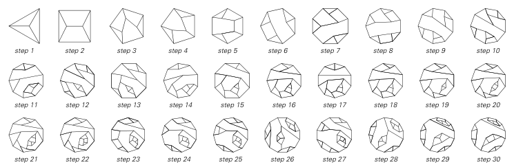
<!-- ORIGINAL_FIGURES page=0528 end -->

这些图片的绘制方式不可避免地存在某种任意性。因为底层规则只指定网络中的连接模式应该是什么，并不指定其节点应怎样布局在页面上。在努力明确不同步骤得到的网络之间关系时，即便相同网络也可能被画得略有不同。

不过，对于规则 (a)，相当容易看出它产生了一个简单嵌套结构，直接类似于第 509 页所示结构。对于规则 (b)，得到明显重复行为。

那么更复杂的行为又如何？事实证明，即便是规则 (c)，它本质上只是规则 (a) 和 (b) 的组合，也已经可以出现明显更复杂的行为。

下面的图片显示了这条规则演化中的更多步骤。得到的行为似乎从不重复，所产生的网络也不表现出任何明显嵌套形式。

图：前一页规则 (c) 演化中的更多步骤。节点数在连续步骤中不规则地增加，尽管大致为线性增加。

应用替换的其他方案又如何？对页图片显示了如果每一步不只允许单个替换，而允许所有不重叠替换，会发生什么。

建立网络所需步数更少，但结果在定性上同上一页类似：规则 (a) 产生嵌套结构，规则 (b) 给出重复行为，而规则 (c) 产生看似复杂并在某些方面随机的行为。

---

[[PDF page 529]]

<!-- ORIGINAL_FIGURES page=0529 start -->
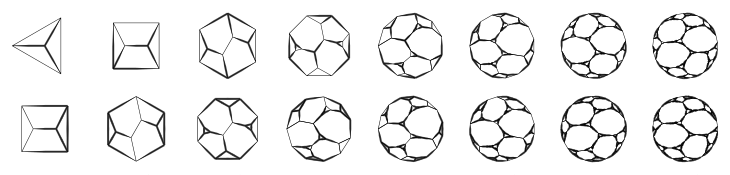
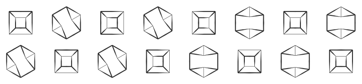
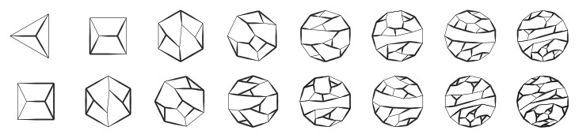
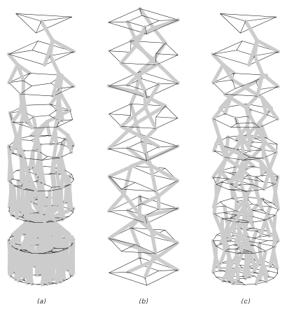

<!-- ORIGINAL_FIGURES page=0529 end -->

图：按照与第 511 页相同的基本底层规则进行网络演化的例子，但现在每一步替换所有可能且互不重叠的节点簇。

---

[[PDF page 530]]

<!-- ORIGINAL_FIGURES page=0530 start -->
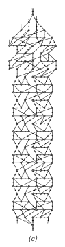
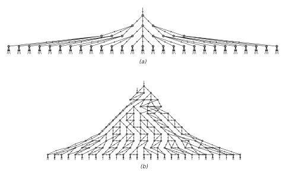
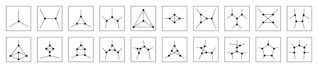
<!-- ORIGINAL_FIGURES page=0530 end -->

正如对于字符串上的替换系统一样，可以找到表示网络上不同更新事件之间因果连接的因果网络。下面的图片给出了上一页演化过程的这类因果网络例子。

图：表示上一页所示网络演化过程中更新事件之间关系的因果网络。

在规则 (a) 这种相当简单的情况下，结果事实证明独立于所使用的更新方案。但对于规则 (b) 和 (c)，不同方案通常会产生不同因果网络。

那么，什么样的底层替换规则会导致独立于规则应用方式的因果网络？情况同字符串中非常相似，基本判据只是：规则中出现的所有替换都应针对永远不能同自身或彼此重叠的节点簇。

下面的图片显示了最多五个节点的所有可能不同节点簇，且不要求平面性；其中除三个之外，所有节点簇都已经可以同自身重叠。

图：最多包含五个节点的所有可能不同节点簇，不要求平面性。

---

[[PDF page 531]]

<!-- ORIGINAL_FIGURES page=0531 start -->
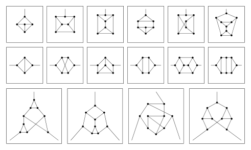
<!-- ORIGINAL_FIGURES page=0531 end -->

但在稍微更大的节点簇中，事实证明有许多不会同自身重叠；事实上，只要每个悬空端之间至少有两个连接，这一点就会变得常见。

下面显示了最初几个例子。几乎在所有这些例子中，不仅单个节点簇内部没有重叠，不同节点簇之间也没有重叠。这意味着，基于这些节点簇集合的替换规则会具有这样的性质：它们产生的因果网络独立于所使用的更新方案。

图：最简单的不会同自身重叠的节点簇，而且大多数也不会彼此重叠。对不重叠节点簇集合的替换具有因果不变性。

我前面显示的各种规则的一个特征是，它们都保持网络的平面性，也就是说，如果从一个可以在平面上无交叉线布局的网络开始，那么后续得到的每个网络也都具有这一性质。

然而在我们的日常经验中，空间当然并不显得具有这种性质。但除开显示正在发生什么的实际问题，设置能够生成非平面性的规则并没有根本困难；事实上，许多基于上面节点簇的规则例如会做到这一点。

所以最终，如果人们设法找到宇宙的终极规则，我预期它们会产生一些网络，这些网络在小尺度上看起来大体随机。但这种随机性最可能恰恰就是例如允许空间维数涌现出确定而稳健的值 3 的东西，尽管我们宇宙中的所有许多复杂现象，也必须以某种方式表示在同一网络的结构之中。

---

[[PDF page 532]]

<!-- ORIGINAL_FIGURES page=0532 start -->
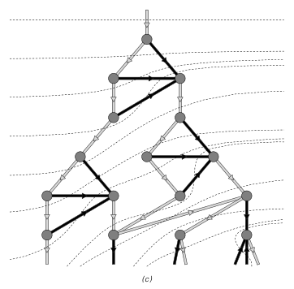
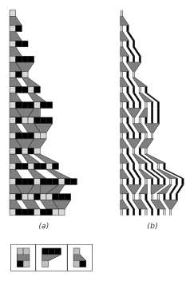
<!-- ORIGINAL_FIGURES page=0532 end -->

## 空间、时间和相对论

几节前我论证说，作为宇宙内部的观察者，我们能够观察到的一切，在某个层面上都必须纯粹同宇宙中事件之间的因果连接网络相关。过去几节我概述了一系列模型类型，用来说明这种因果网络实际上可能怎样建立起来。

但因果网络的性质怎样同我们通常的空间和时间概念相关？事实证明有一些细微之处，而这些细微之处似乎恰恰最终产生了相对论。

正如前几节中看到的，如果有一个系统的显式演化历史，那么从中推出因果网络很直接。但如果只给定因果网络，人们能对演化历史说什么？

下面的图片显示了一个例子：怎样通过取穿过由某个特定演化历史导出的因果网络的一组特定切片，恢复该演化历史中的连续步骤。但如果选择另一组切片又会怎样？一般而言，得到的字符串序列不会对应于任何可能由同一个底层替换系统产生的东西。

图：怎样通过对因果网络取适当切片，恢复演化历史中的状态序列。任何一致的这类切片选择，都将对应于一种可能演化历史，具有相同底层规则，但用于决定应用替换顺序的方案可能不同。

---

[[PDF page 533]]

但如果一个系统产生的因果网络独立于用来应用其底层规则的方案，情况就不同了。在这种情况下，任何一致地把因果网络分成过去和未来的切片，都必须对应于底层系统的一种可能状态；而任何不重叠的这类切片序列，都必须表示该系统的一种可能演化历史。

如果我们能够明确看到对应于我们宇宙的系统的特定底层演化历史，那么这在某种意义上会立刻提供关于宇宙中空间和时间的绝对信息。但如果我们只能观察宇宙的因果网络，那么我们关于空间和时间的信息不可避免地必须通过观察因果网络的切片来间接推出。

事实上，只有某些因果网络甚至能够给出一个合理的空间概念。因为可以把穿过因果网络的连续切片看作对应于连续时间瞬间的状态。但为了存在某种可以合理看作空间的东西，人们必须能够识别出一些或多或少保持相同的背景特征；这意味着因果网络必须在它于连续时间瞬间生成的状态之间给出一致相似性。

人们也许会以为，如果有一个在连续步骤上并不改变的底层系统，就会立刻得到固定的空间结构。但事实上，如果没有更新事件，就根本不会建立因果网络。因此，下一页顶部那样的系统，大约是能产生哪怕有点让人想起普通空间的东西的最简单系统。

在实践中，我当然不预期我们宇宙中即便是看起来没什么事情发生的部分，实际也会有像下一页顶部那样简单的因果网络。事实上，正如我在上一节末尾提到的，我预期相反，永远会倾向于在小尺度上存在各种复杂而看似随机的行为，尽管在更大尺度上，这些行为通常会被冲洗掉，从而产生我们通常同空间关联的那类一致平均性质。

---

[[PDF page 534]]

<!-- ORIGINAL_FIGURES page=0534 start -->
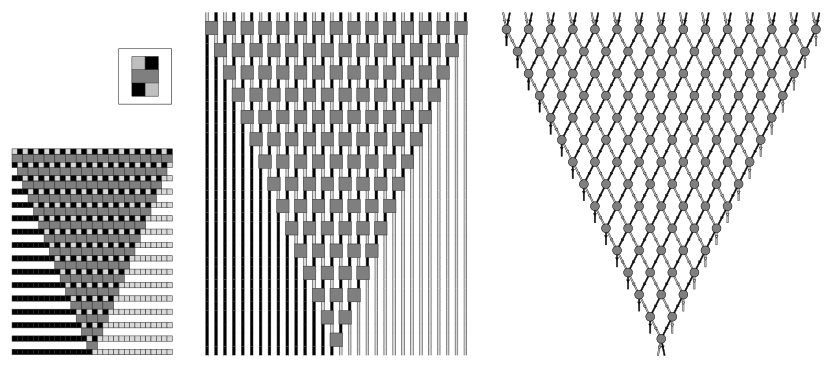
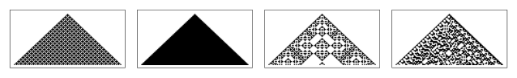
<!-- ORIGINAL_FIGURES page=0534 end -->

图：一个非常简单的替换系统，其因果网络具有一些切片，可以被看作对应于一维普通空间的高度规则理想化。规则实际上只是对元素排序，使黑色元素先出现，并且不管使用什么更新方案，都会产生相同因果网络。

我们通常经验到的空间的定义性特征之一，是某种局域性，它使发生在某个特定位置的大多数事情，起初只能影响离它非常近的事情。

这种局域性内置于元胞自动机这类系统的基本结构中。因为在这类系统中，底层规则允许某个特定元胞的颜色在每一步只影响其直接邻居。这带来的后果是，这类系统中的影响只能以有限速率传播，例如在下面图片中那类图案边缘的最大斜率中表现出来。

图：元胞自动机产生的图案例子，说明第六章讨论过的事实：每个图案边缘都有一个等于每步一个元胞的最大斜率，对应于信息传输速率的绝对上限，类似于物理中的光速。

在物理学中，任何事件的影响传播似乎也有一个最大速度：光速，约等于每秒 3 亿

---

[[PDF page 535]]

<!-- ORIGINAL_FIGURES page=0535 start -->

<!-- ORIGINAL_FIGURES page=0535 end -->

米。在时空物理中，人们常画右侧所示的“光锥”，用来表示从空间中某个位置、某个时间发出的光信号会到达的区域。那么，在因果网络中，其类似物是什么？

图：物理中光锥的示意图。从空间中某一点发出的光，通常会随时间向外扩展成一个锥体，此处示意性地显示其截面。

答案很直接，因为因果网络的定义本身表明，要看某个特定事件的影响怎样扩散，只需沿着因果网络中从它出发的连续连接前进。

但在抽象上，并没有理由认为这些连接会导向任何可以被看作在空间中邻近的点。在我本书研究过的各种底层系统中，许多系统的基本规则没有特定局域性。但我在过去几节讨论的字符串和网络系统类型确实有某种局域性，因为它们作出的每个单独替换只涉及少数邻近元素。

人们也许会选择考虑这类系统，只是因为似乎更容易指定它们的规则。但它们的局域性对产生任何可以合理识别为空间的东西也显得重要。

因为没有局域性，在所产生因果网络的连续切片中，通常不会有特定方式来匹配对应部分。结果，也不会有拥有稳定空间概念所需的连续切片之间的一致性。

对于字符串替换系统，底层替换规则的局域性立刻意味着系统中影响的总体局域性。因为系统中的不同元素始终只是排列成一维字符串，结果局部替换规则永远只能把影响传播到字符串中邻近的元素，非常像一维元胞自动机中那样。

不过，如果处理的是基于网络的底层系统，情况会稍微复杂一些。因为正如几节前讨论过的，也正如本章最后几节还将再次讨论的，网络结构同普通空间结构之间通常只有近似对应。因此，例如正如我们稍后联系量子现象讨论的那样，有时可能存在某种线索，连接网络中那些

---

[[PDF page 536]]

在三维空间中通常不会被认为邻近的部分。因此，当相对于网络连接而言邻近的节点簇被更新时，它们有可能把影响传播到在空间中可能被认为遥远的点。

尽管如此，如果一个网络要对应于我们宇宙中似乎存在的空间，这类现象就不能太重要；最终，必须在很好的近似下存在类似第 518 页简单因果网络中那种直接局域性。

下一节我会讨论粒子这样的实际物理实体怎样在由因果网络表示的系统中传播。但因果网络的全部要点最终在于，它们的连接表示影响传播的所有可能方式。然而，这些连接也最终定义了我们在系统中的空间和时间概念。特别是在像第 518 页那样规则的因果网络中，立刻就可以把因果网络中的每个连接看作对应于一种影响在一定时间间隔内传播了一定空间距离。

那么更复杂的因果网络又如何？人们也许会想象，它的连接或许可以表示空间中的不同距离和时间中的不同间隔。但除了查看因果网络中的连接之外，并没有独立方式来算出空间距离或时间间隔。因此，最终唯一有意义的事情是这样测量空间和时间：把因果网络中的每个连接都看作对应于相同的基本空间距离和相同的基本时间间隔。

人们也许会猜测，这个基本距离约为 `10^-35` 米，基本时间间隔约为 `10^-43` 秒。但无论这些值是多少，一个关键点是它们的比值必须是一个固定速度，我们可以把它同光速相识别。因此，这意味着，从某种意义上说，因果网络中的每个连接都可以被看作表示一个影响以光速传播。

意识到这一点后，我们现在已经接近能够看出，我讨论过的这类系统怎样几乎不可避免地成功复现相对论的基本特征。

---

[[PDF page 537]]

<!-- ORIGINAL_FIGURES page=0537 start -->
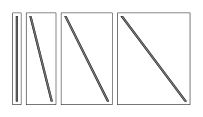
<!-- ORIGINAL_FIGURES page=0537 end -->

但首先必须考虑运动概念。

说一个人没有运动，意味着人们想象自己在某种意义上贯穿时间一直采样同一片空间区域。但如果一个人在运动，例如以固定速度运动，那么这意味着人们想象自己正在采样的空间区域会随时间系统地移动，如右侧简单图片示意所示。

图：空间和时间中固定速度运动的图形表示。

但正如我们在讨论因果网络时已经看到的，一般而言，人们怎样选择匹配不同时刻的空间是相当任意的。事实上，可以把不同运动状态看作对应于不同的这种选择：每一种情况下，人们都匹配空间，使得自己所处的点贯穿时间被视为同一点。

固定速度运动随后是最简单的情况，也是所谓狭义相对论强调的情况。至少在像第 518 页图片中那样高度规则的因果网络语境中，对此有一个简单解释：它只是对应于以不同角度穿过因果网络查看切片。

穿过因果网络的连续平行切片，一般对应于底层系统在连续时间瞬间的连续状态。但在第 518 页那类图片中，并没有什么东西以任何绝对方式决定这些切片的总体角度。关键是，事实上可以把不同角度的切片解释为对应于不同固定速度的运动。

如果角度大到使切片之间既有向上的连接也有向下的连接，那么会出现问题。但除此之外，无论角度如何，连续切片总是必须对应于底层系统的可能演化历史。

人们也许会以为，不同角度切片得到的状态必然只同不同底层规则集一致。但事实并非如此；相反，完全相同的规则可以复现所有角度的切片。这是第 518 页替换系统具有因果不变性这一事实的后果，也就是说，它给出相同的因果网络，而不依赖用于应用其底层规则的方案。

在不像第 518 页那样规则的因果网络中表示匀速运动，会稍微复杂一些。但

---

[[PDF page 538]]

只要存在足够均匀性来为空间提供稳定结构，仍然可以把类似不同角度的平行切片看作表示不同固定速度的运动。

关键点是，只要底层系统具有因果不变性，完全相同的底层规则就会解释人在不同角度切片中所看到的东西。这意味着，实际上无论人运动得多快，同样的规则都会适用。

令人瞩目的是，这也正是物理中似乎发生的事情。因为日常经验以及各种详细实验都强烈支持这样一个想法：只要没有加速度或外力效应，物理系统就会完全相同地工作，而不管它们运动得多快。

起初，似乎不可想象，任何在某个层面上只是把固定程序应用于各种底层元素的系统，能够成功捕捉运动现象。典型元胞自动机这样的系统当然不能，因为例如它在不同角度上的有效演化规则通常会相当不同。但有两个关键思想，使运动能够在我这里讨论的这类系统中运作。第一，因果网络可以表示所有可观察的东西。第二，在因果不变性下，穿过因果网络的不同切片可以由同样的底层规则产生。

历史上，物理过程应当总是独立于总体运动这一思想，至少可以追溯到三百年前。由这一思想，人们例如会预期，光相对于发射它的任何东西总会以其通常速度传播。但如果人们碰巧相对于这个发射体运动，会怎样？光是否会显得以不同速度传播？对于声音，答案会是肯定的。但 19 世纪末前后发现，对于光并非如此。狭义相对论本质上正是为解释这一令人惊讶的事实而发展出来的。

然而过去似乎没有明显底层机制可以解释这一基本理论为什么有效。但现在事实证明，我所描述的这类离散因果网络模型几乎不可避免地最终能够做到这一点。

---

[[PDF page 539]]

这其中的原因本质上是，如我上面讨论的，任何因果网络中的每个单独连接，几乎按定义都必须表示以光速传播的影响。涌现出来的总体空间结构可能很复杂，也可能有一些对象最终以各种速度运动。但至少在局部，单个连接基本把光速定义为任何影响传播的固定最大速率。关键是，它们这样做与影响源运动得多快无关。

由此，人们可以使用本质上标准的论证，推导普通相对论中熟悉的各种现象。一个典型例子是时间膨胀，其中对于某个以某速度运动的系统而言固定的时间间隔，对静止系统来说似乎对应于更长时间间隔。下一页图片示意性地显示了这个起初出人意料的结果怎样产生。

基本想法是考虑一个能够充当简单时钟的系统在不同速度下会发生什么。在传统物理层面，可以把时钟想象为一个光子在固定间距的镜子之间来回反弹。但更一般地，也可以把它想象为跟随某个因果网络固定片段中存在的交叉连接。

下一页图片中，时间沿页面向下。时钟的内部机制显示为一条之字形黑线，该线每完成一次往返就对应于一个时间单位过去。

黑线总是假定以光速运动，因此总是位于光锥表面上，如顶部一行图片所示。随后，在连续图片中，整个时钟被设定为以越来越大的光速分数运动。

每幅图片中的深灰区域表示对时钟而言的固定时间量，对应于黑线固定次数的往返。但正如图片所示，随后本质上只是一个几何问题即可看出，对于静止系统来说，这个深灰区域会对应于越来越长的时间量，其方式正如相对论时间膨胀的标准公式所预测的。

---

[[PDF page 540]]

<!-- ORIGINAL_FIGURES page=0540 start -->
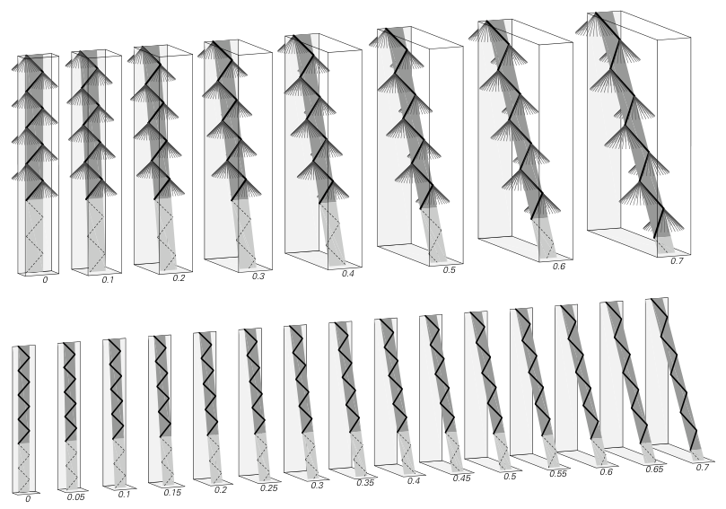
<!-- ORIGINAL_FIGURES page=0540 end -->

图：经典相对论时间膨胀现象的一个简单推导。图片显示一个非常简单的理想化时钟在以不同光速分数运动时的行为。可以把该时钟看作由一个光子在固定距离的两面镜子之间来回反弹组成。（在我的方法中，更一般地也可以把它看作因果网络的一个片段。）时间沿页面向下显示，因此时钟中的光子描绘出之字形路径。基本假定，在我的方法中只是因果网络基本性质的后果，是光子总是以光速运动，因此其路径总是在顶部一行图片那样的光锥表面上。对时钟而言的固定时间间隔，如较深灰色区域长度所示，对应于静止时越来越长的时间间隔。这个时间膨胀量由经典相对论公式 `1/sqrt(1 - v^2/c^2)` 给出，其中 `v/c` 是时钟速度与光速之比。这种时间膨胀在粒子加速器中被常规观察到，并且必须在 GPS 卫星中校正。它导致所谓双生子佯谬，其中乘高速航天器旅行的双胞胎成员经历的时间会少于留在静止状态的成员。在我的方法中，时间膨胀是一种一般现象而不局限于这里显示的简单时钟，这依赖于因果网络的一般性质。一旦基本假定建立，这里给出的时间膨胀推导，在原则上同 1905 年最初给出的推导并无不同，尽管我相信它在许多方面清楚得多。注意，必须考虑二维中的运动，使得整个时钟可以垂直于其中光子的路径运动。如果二者平行，就不可避免地不只是得到纯粹时间膨胀，而是得到时间膨胀和长度收缩的混合。

---

[[PDF page 541]]

<!-- ORIGINAL_FIGURES page=0541 start -->
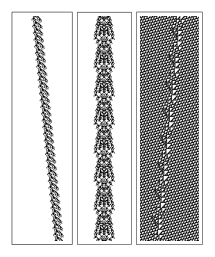
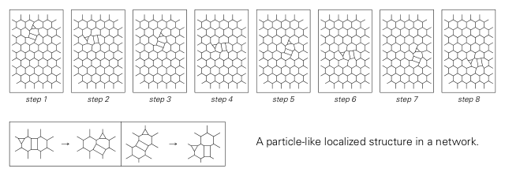
<!-- ORIGINAL_FIGURES page=0541 end -->

## 基本粒子

宇宙有一些方面，尤其是空间和时间的结构，当代物理倾向于假定它们是连续的。但在过去一个世纪中，人们至少已经普遍接受，所有物质都由可识别的离散粒子组成。

实验发现了相当少量的基本不同粒子种类，电子、光子、μ 子以及六种基本夸克类型就是其中几个例子。宇宙中一个醒目的观察规则性是，给定种类的所有粒子，例如电子，在其性质上似乎绝对相同。

但粒子实际上是什么？就当代实验所能判断的而言，例如电子具有零大小，而且没有子结构。但特别是如果空间是离散的，那么电子和其他粒子似乎几乎不可避免地必须由更基本元素构成。

这可能怎样运作？我怀疑一个直接可能性实际并不离目标太远：这类粒子是本书前面在第 4 类元胞自动机等系统中看到的局部结构的类似物。如果是这样，那么意味着在最低层面，宇宙规则不需要提到具体粒子。相反，我们看到的一切粒子都只是从更基本元素形成的结构中涌现出来。

图：第 4 类元胞自动机中粒子式局部结构的典型例子。

在网络中，可视化局部结构可能有些困难。但下面的图片仍然显示了一个简单例子，说明局部结构怎样可以穿过规则平面网络移动。

本页两个例子都显示了存在于非常规则背景上的结构。但为了得到任何关于实际

图：网络中的粒子式局部结构。

---

[[PDF page 542]]

<!-- ORIGINAL_FIGURES page=0542 start -->
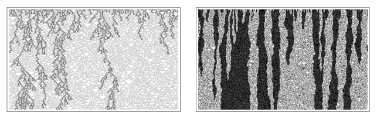
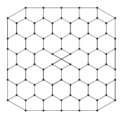
<!-- ORIGINAL_FIGURES page=0542 end -->

物理粒子的真实模型，必须考虑更复杂和随机得多的背景上的结构。因为任何有严肃机会表示实际空间的网络，哪怕是所谓空的部分，无疑都会显示各种看似随机的活动。因此，任何可能表示粒子的局部结构，都必须以某种方式即便在这种随机背景上也能持续存在。

然而一开始，人们也许会认为，这种随机性不可避免地会扰乱任何确定的持久结构。但下面的图片显示了两个不会如此的简单例子。在第一种情况下，存在持续的局部裂缝。在第二种情况下，存在两种不同类型的区域，由一些边界分隔开来，而这些边界像具有确定性质的局部结构一样行动，并持续存在直到彼此湮灭。

图：一维元胞自动机的例子，它们即便在大体随机的背景上也支持各种形式的持久结构。这些是 3 色总和型规则，代码为 294 和 1893。

那么网络又如何？事实证明，在这里也有可能得到一些确定结构，即使存在随机性也会持续存在。要看一个例子，可以设置类似第 509 页那样保持网络平面性的规则。

从一个平面网络开始，也就是可以无交叉线平铺在页面上的网络，这类规则当然可以给出各种复杂而表观随机的行为。但按照规则的设定方式，它们产生的所有网络仍必须是平面的。

如果从左侧那样只能有交叉线才能画出的网络开始，那么发生的将是网络的非平面性会被保持下来。但这种非平面性在多大程度上对应于网络中的确定结构？

图：具有单个不可约线交叉的网络。

---

[[PDF page 543]]

<!-- ORIGINAL_FIGURES page=0543 start -->
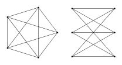
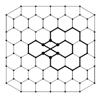
<!-- ORIGINAL_FIGURES page=0543 end -->

通常有许多不同方式绘制一个非平面网络，每一种都有在不同位置交叉的线。但图论中有一个基本结果表明，如果一个网络不是平面的，那么总能在其中识别出某个特定部分，可以把它化约为右侧显示的两种形式之一；对于每个节点有三个连接的网络，则只需第二种形式。

图：导致网络非平面性的 `K5` 和 `K3,3` 形式。

因此，这意味着人们事实上可以有意义地把一个确定结构同非平面性关联起来。虽然在某个层面上，这种结构可以在网络中扩散开来，关键是它实际上总必须有一个局部核心，具有右侧所示形式。

一般来说，可以想象网络中有若干片非平面性，也许每一片都像一个提手。但如果网络的底层规则保持平面性，那么这些非平面性片段中的每一个本身都必须是持久的，并且在某种意义上只能通过彼此湮灭这类过程消失。

图：`K3,3` 怎样嵌入对页网络中。

那么这些会不会像物理中的实际粒子？

在宇宙网络规则的真实情况下，平面性本身大概并不守恒。但物理观察提示，存在若干类似电荷的守恒量。最终，这些量的值必须反映底层网络中由网络演化规则保持的性质。

如果这些规则满足我在前几节讨论的因果不变性约束，那么我怀疑这意味着它们将不可避免地表现出各种额外特征，也许尤其包括例如通常所说的局域规范不变性。

但这里最相关的是，看起来很可能，像非平面性的情况一样，网络演化规则所守恒的量的非零值，可以被看作同网络中某种局部结构或连接缠结相关。我怀疑，正是这类结构本质上定义了物理中看到的各种基本粒子类型的核心。

---

[[PDF page 544]]

在本书结果出现之前，任何类似这样的想法可能都显得完全不可置信。因为撇开任何关于网络及其演化的具体论证不谈，传统直觉也会倾向于让人认为，粒子的精巧性质必然是某种精巧底层设定的结果。但本书中我们已经一再看到，事实上即便底层设定惊人简单，也完全有可能得到高度复杂现象。我怀疑，物理中的粒子以及它们的各种性质和相互作用，只不过是这一非常一般现象的又一个例子。

有一件直接的事情似乎会提示，基本粒子必定以某种方式基于简单离散结构：电荷这类量的值似乎总是处在简单有理比中。在传统粒子物理中，这通过说许多粒子甚至所有粒子以某种方式只是同一底层抽象对象的表现来解释，而它们由一组简单固定对称操作相关联。但从网络角度，可以想象一种更显式的解释：粒子的核心只有一组简单离散的可能结构，而每一种也许以某种相当机械的方式由这组对称操作相关。

但除电荷这类量外，所有粒子的另一个重要内禀性质是质量。不同于例如电荷，观察到的基本粒子质量似乎从不处在简单比例中，例如 μ 子质量约为电子质量的 206.7683 倍，而 τ 轻子约为 μ 子质量的 16.819 倍。但尽管有这类结果，仍然可以想象，真正基本粒子质量之间最终可能存在简单关系，因为事实证明，实际观察到的质量实际上也包括数量不等的相互作用能量。

任何粒子的一个定义性特征是，它能够以某种方式在空间中运动并保持其身份。在传统物理中，这种运动有直接的数学表示，而且人们通常并不觉得追问其底层是什么有意义。但在我这里采用的方法中，运动不再是这样一个内禀概念；粒子的运动必须被看作由一整串显式低层步骤组成的过程。

所以一开始，让某种特定类型的粒子以不同速度运动似乎甚至会令人惊讶。但从上一节的讨论可知，这实际上是底层规则表现出

---

[[PDF page 545]]

因果不变性的几乎不可避免的后果。因为假定粒子周围的因果网络，以及由此而来的空间表观结构，具有某种均匀性，那么以适当角度穿过因果网络取切片，总会使任何粒子显得静止。关键是，因果不变性随后意味着，在所有这类情况下，都可以使用相同底层规则来更新网络。

但如果有两个以不同速度运动的粒子，会发生什么？如果取穿过因果网络的切片，使第一个粒子看起来静止，那么同第二个粒子相关的事件会是什么样？答案是，第二个粒子在连续切片之间移动得越多，就必须涉及越多更新事件。因为实际上任何在某一个切片或下一个切片上同该粒子相关的节点都必须被更新，而粒子移动得越多，这些节点之间的重叠就越少。此外，相对于粒子运动方向，事件模式中不可避免地会出现不对称。

这里有许多微妙之处；事实上，要解释正在发生事情的细节，无疑需要相当多新的、相当抽象的概念。但我相信最终会出现的一般图像是，当粒子运动得更快时，它们会显得有更多节点同自身相关。

最可能的是，粒子的内禀性质，例如电荷，会同某种核心相关，而这个核心对应于涉及大致固定节点数的确定网络结构。但我怀疑，粒子的表观运动会同一种外衣相关，这种外衣以某种方式从核心过渡到周围空间的均匀背景。对因果网络取不同切片时，这种外衣的表观大小可以改变。但我怀疑，在某个具体情况下，外衣大小会以某种方式同该情况下粒子的表观能量和动量相关。

传统物理中的一个重要事实是，粒子之间的相互作用似乎守恒总能量和总动量。可以想象，其原因是这类相互作用以某种方式倾向于保持网络节点总数。事实上，也许在大多数

---

[[PDF page 546]]

情形中，除了同宇宙总体膨胀相关的情形外，网络的基本规则至少平均而言只是重新排列节点，而从不改变其数量。

在传统物理中，能量和动量总是假定具有连续值。但正如位置的情形一样，这同足够小的底层离散元素并不矛盾。

正如本章最后一节将讨论的，量子力学倾向于让人把动量更高的粒子想象为在空间中以某种方式越来越不扩散。那么，这怎样同更高动量关联于更多节点的想法一致？答案的一部分大概同这样一个事实有关：在对应于粒子的那片网络之外，网络大概会以同没有粒子时大致相同的方式匹配起来，产生均匀空间。而在对应于粒子的那片网络内部，空间的有效结构可能非常不同，例如添加了更多长程连接以降低有效总体距离。

## 引力现象

在同基本粒子相反的极端上，可以问宇宙在最大可能尺度上怎样行为。在这类尺度上最明显的效应是引力现象。那么，它可能怎样从我在这里讨论的这类模型中涌现出来？

近一个世纪以来，引力的标准理论是广义相对论；它基于这样一个思想：把引力同空间曲率关联起来，然后指定这种曲率怎样同存在的任何物质的能量和动量相关。

像磁场这样的东西，通常会对由不同材料构成的对象产生不同效应。但一个已经由实验相当精确验证的关键观察是，引力对不同对象运动具有完全相同的影响，而不管这些对象由什么构成。正是这一点允许人们把引力看作空间的一种一般特征，而不是例如某种专门作用于不同对象的力。

---

[[PDF page 547]]

<!-- ORIGINAL_FIGURES page=0547 start -->
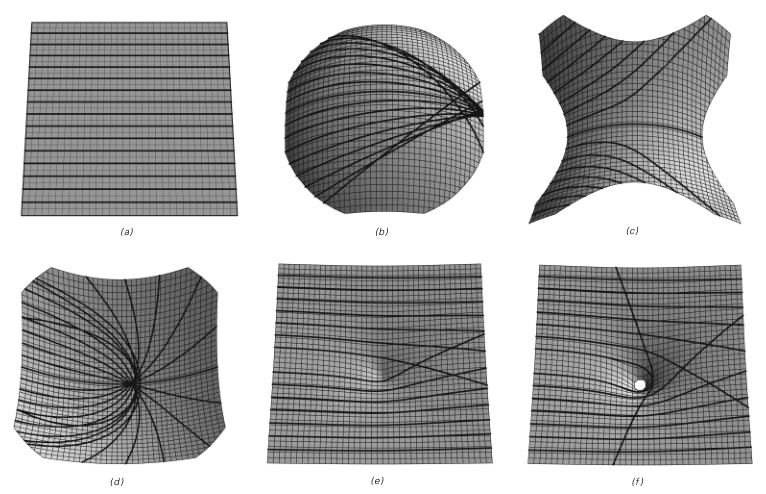
<!-- ORIGINAL_FIGURES page=0547 end -->

在没有任何引力或其他力的情况下，我们对空间的通常定义意味着，当一个对象从一点移动到另一点时，它总是沿直线前进，而直线对应于最短路径。但当存在引力时，对象通常沿弯曲路径运动。然而，如果把空间看作弯曲的，这些路径仍然可以是最短路径，或所谓测地线。事实上，如果空间具有适当曲率，就可以得到各种路径，如下面图片所示。

图：空间曲率对对象所取路径影响的例子。每种情况下，所示所有路径都从平行状态开始，但当存在曲率时并不保持平行。这些路径是测地线，在表面上走过最小距离到达其所到达的各点。（一般而言，这个最小值可能只是局部的。）情形 (b) 显示球面的顶部，是一个正曲率表面。情形 (c) 显示负曲率表面 `z = x^2 - y^2`，(d) 是抛物面 `z = x^2 + y^2`，(e,f) 是 `z = 1/(r + d)`，即由一个有质量球体产生的空间曲率的粗略类似物。

但在我们的实际宇宙中，什么决定空间曲率？广义相对论给出的答案是，爱因斯坦方程用存在物质的能量和动量来给出某种特定曲率值的条件。关键随后是，具有这种曲率的空间中的最短路径，似乎同对象在给定物质分布相关的引力影响下所沿路径

---

[[PDF page 548]]

<!-- ORIGINAL_FIGURES page=0548 start -->
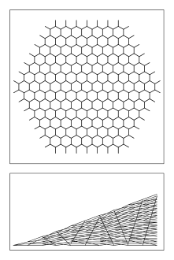
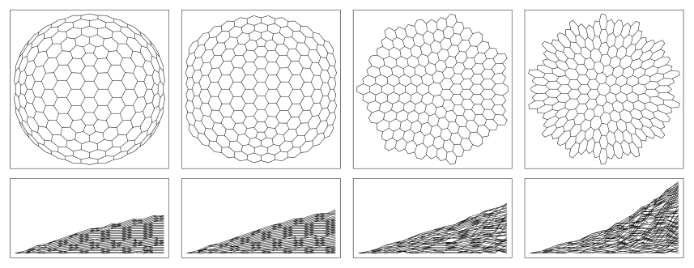
<!-- ORIGINAL_FIGURES page=0548 end -->

一致。

对于连续表面，或者一般连续空间，曲率思想在传统几何中是熟悉的。但如果宇宙在底层层面只是一个离散节点网络，那么曲率怎样工作？在某个层面上，答案是：在大尺度上，离散网络必须近似连续空间。

但事实证明，人们实际上也可以在网络的基本结构中识别曲率。如果有一个简单六角形阵列，如左侧图片所示，那么它可以很容易地平铺在二维平面上。但如果把其中一些六角形替换为五角形，会怎样？人们仍然有一个根本上二维的表面。但如果试图保持所有边长度相同，表面就不可避免地会弯曲，像足球或测地穹顶一样。

图：对应于平坦二维空间的六角阵列。

因此，这提示，在网络中，仅仅改变连接模式实际上就可以改变总体曲率。下面的图片确实显示了一系列网络，它们实际上具有一系列负值和正值曲率。

图：具有各种极限曲率的网络。如果网络中的每个区域实际上都是六角形，如本页顶部图片所示，那么网络会表现得仿佛是平坦的。但如果引入五角形，如左侧情形所示，网络会越来越表现得仿佛具有正曲率，像球面的一部分。如果引入七角形，如右侧情形所示，网络会表现得仿佛具有负曲率。图片底行中，网络按第 479 页的方式布局，因此连续高度给出距某个特定节点连续距离 `r` 处的节点数。在大 `r` 极限中，这个数近似为 `r^2 (1 - k r^2 + ...)`，其中 `k` 事实证明正比于曲率。

---

[[PDF page 549]]

<!-- ORIGINAL_FIGURES page=0549 start -->
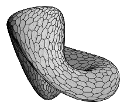
<!-- ORIGINAL_FIGURES page=0549 end -->

但怎样从每个网络结构中确定曲率？本章前面我们看到，如果一个网络要对应于某个维数 `d` 的普通空间，那么这意味着从任一给定节点出发走 `r` 个连接，必须到达约 `r^(d-1)` 个节点。事实证明，当存在曲率时，它会导致对此的系统修正。

在对页每幅图片中，所示网络都可以被看作对应于二维空间。这意味着，作为第一近似，到达的节点数必须随 `r` 线性增加。但图片底行显示对此存在修正。发生的是，当存在正曲率时，如左侧图片中，最终到达的节点会逐渐少于 `r` 个。但当存在负曲率时，如右侧，最终到达的节点会逐渐多于 `r` 个。一般而言，到达节点数的主导修正项事实证明正比于曲率乘以 `r^(d+1)`。

那么超过二维时会发生什么？一般而言，结果可能非常复杂，并且例如可能涉及各种不同形式的曲率以及空间的其他特征。但实际上，到达节点数的主导修正总是相当简单：它只是正比于所谓里奇标量曲率，乘以 `r^(d+1)`。这里已经有了广义相对论的一点迹象，因为里奇标量曲率也事实证明是爱因斯坦方程中的一个中心量。

但在试图看到更详细对应时，立刻会出现各种复杂情况。也许最明显的是，广义相对论的传统数学表述似乎依赖连续空间的许多详细性质。虽然人们预期足够大的网络在某种意义上平均起来应当像连续空间那样行动，但一开始远不清楚与广义相对论相关的那些性质怎样会涌现出来。

如果从一个普通连续表面开始，那么用右侧图片中那样的一组平面面片来近似它是直接的。人们也许会认为，这些面片的边会定义一个我一直在讨论的那类网络。

图：由平面面片近似的表面，其边形成一个三价网络。

---

[[PDF page 550]]

但事实上，这样一个网络包含的信息少得多。因为仅给定节点之间的一组连接，并没有明显方式甚至知道哪些连接应当同一个面相关，更不用说计算面之间的角度之类的东西了。

然而尽管如此，事实证明，最终与广义相对论相关的所有几何特征，实际上都可以在大网络中仅由节点连接性来决定。

其中一个是所谓里奇张量的值，它实际上指定里奇标量曲率怎样由同不同方向相关的不同曲率分量组成。

如上所示，同网络相关的标量曲率直接关系到在网络上距给定节点连续距离 `r` 内有多少节点，或者实际上有多少节点位于围绕该节点的连续广义球内。事实证明，里奇张量沿某个特定方向的投影随后正是同位于一个朝该方向取向的柱体内部的节点数相关。但即便在网络中定义一个一致方向，也并不完全直接。不过一种做法是简单地选择网络中的两点，然后说，如果网络中的路径是这两点之间同一最短路径的片段，那么这些路径就朝同一方向。用这个定义，一个近似柱体的区域就可以通过在路径上每个点为中心设定球来形成。

但现在还有另一个问题要处理：至少在标准表述中，广义相对论不是按照三维空间的性质来设定的，而是按照四维时空的性质来设定的。这意味着，相关的并不只是表示空间的具体网络的性质，而是完整因果网络的性质。

因果网络同空间网络不同的一个直接特征是，它们的连接只朝一个方向。但事实证明，这恰恰是设定时空里奇张量类似物所需要的。想法是从因果网络中的某个特定事件开始，然后形成实际上可以从那里到达的一锥事件。为了定义时空里奇张量，人们考虑如第 516 页上那样穿过这个锥的一串类空间切片，

---

[[PDF page 551]]

并询问当走到连续切片时，位于锥内的事件数怎样增加。经过 `t` 步后，到达的事件数会正比于 `t^d`。随后会有一个正比于 `t^(d+2)` 的修正项，其系数是时空里奇标量和时空里奇张量沿一个方向的投影的组合，而这个方向实际上就是所选类空间切片序列定义的时间方向。

那么这怎样同广义相对论相关？事实证明，当不存在物质时，爱因斯坦方程只是说时空里奇张量，以及由此其所有投影，恰好为零。例如仍然可以有高阶曲率，但在里奇张量描述的层面上不能有曲率。

这意味着，任何其行为服从爱因斯坦方程的因果网络，在锥中计数节点的层面上，必须具有同它要对应于普通平坦空间时一样的均匀结构。几节前我们看到，许多底层替换规则最终会产生例如连接过于广泛、无法对应于任何有限维数普通空间的网络。但我怀疑，如果有一些替换规则具有因果不变性，并且实际上成功维持固定维数，它们几乎不可避免地会导致接近爱因斯坦方程的行为。

这种情况大概有点类似于我们在第八章元胞自动机中的流体行为所看到的：至少如果存在一些底层规则，其行为复杂得足以生成显著有效随机性，那么只要规则导致总粒子数和动量守恒，几乎总会涌现出接近普通纳维-斯托克斯方程的行为。

那么物质又如何？

作为第一步，可以问空间结构对粒子这类东西有什么影响，假定可以忽略粒子反过来对空间的影响。在传统广义相对论中，总是假定一个不与任何其他东西相互作用的粒子会沿着空间中的最短路径，或所谓测地线，运动。

---

[[PDF page 552]]

但上一节讨论的那种作为网络中结构而存在的显式粒子又如何？给定网络中的两个节点，总能识别出一条从一个节点到另一个节点的最短路径，它沿着网络中的一串单独连接前进。但在某种意义上，对应于粒子的结构通常无法穿过这条路径。因为这个结构通常会涉及许多节点，因此通常需要许多大体朝同一方向的连接，才能够穿过网络移动。

但如果假定网络中存在某种均匀性，特别是因果网络中存在均匀性，那么仍然可推出上一节讨论的那类粒子将倾向于沿测地线运动。在传统广义相对论中，沿测地线运动的想法本质上是一个假定；而现在原则上可以从底层网络模型中明确推导出来。

人们也许会以为，在没有物质时，关于引力就没有多少可说，毕竟爱因斯坦方程随后说空间中不能有曲率，至少不能有里奇张量所描述的那类曲率。但事实证明，仍然可以有其他类型的曲率，例如由所谓黎曼张量描述的曲率，而这些曲率事实上可以导致各种现象。例子包括大质量物体周围反平方引力场这样的熟悉现象，以及引力波这样的不熟悉现象。

但尽管广义相对论的数学结构复杂到常常难以看出时空中的效应究竟来自哪里，人们通常仍假定，物质以某种方式最终需要为引力提供来源。在完整爱因斯坦方程中，里奇张量不必为零；相反，它在空间中每一点被指定为等于该点处物质能量和动量密度的某种组合。因此，这意味着，要知道甚至主要同引力相关的现象中会发生什么，人们通常也必须知道关于物质的各种性质。

但为什么物质究竟必须被显式引入？传统物理一直假定，尽管引力可以用空间性质来表示，我们宇宙的其他元素却不能。但在我的方法中，一切都只是

---

[[PDF page 553]]

从同一个底层网络中涌现，或者实际上从空间结构中涌现。事实上，即便在传统广义相对论中，人们也可以尝试避免显式引入物质，例如想象我们称为物质的一切实际上都由纯粹引力能量，或类似引力波的东西组成。

但就人们能够判断的而言，这些细节并不成功，因此在广义相对论层面别无选择，只能显式引入物质。然而我怀疑，这实际上只是爱因斯坦方程和广义相对论局限性的一个迹象。

因为虽然在大尺度上，它们也许为网络中的平均行为提供了合理描述，但几乎不可避免地，在接近单个连接尺度时，它们必须被修改。不过，大概仍然可以在大尺度上使用爱因斯坦方程，只要引入具有适当性质的物质，作为表示网络小尺度效应的一种方式。

上一节我提出，能量和动量也许实际上同网络中多余节点的存在相关。这现在似乎有可能同本节所见相当吻合。因为如果网络底层规则要在某种近似下维持同平坦空间相同的平均节点数，那么只要某处有更多对应于能量和动量的节点，就必须由某种减少节点数的东西来平衡。而这种减少恰恰正是对应于在存在普通物质时由爱因斯坦方程蕴含的那种正曲率所需要的。

## 量子现象

从我们能看见和触摸的对象的日常经验中，我们发展出某种关于事物怎样运作的直觉。但近一个世纪前，人们清楚地认识到，对于电子这类东西而言，其中一些直觉不再正确。然而，量子理论中发展出了一套精巧的数学形式体系，它成功复现了许多观察结果。虽然这个

---

[[PDF page 554]]

形式体系的一些方面仍然神秘，人们越来越相信任何基础物理理论都必须以某种方式基于它。

然而，我在本书中讨论的程序类型并不以任何明显方式设置成适合这个形式体系。但正如我们在本书过程中已经无数次看到的，从程序中涌现出来的东西可以同其底层规则中明显可见的东西非常不同。事实上，我强烈怀疑，我在过去几节讨论的程序类型最终实际会表现出量子理论的许多关键特征，甚至也许全部关键特征。

不过，看出这一点并不容易。因为量子理论标准形式体系中强调的构造，同我讨论过的程序中立刻可见的构造非常不同。最终，建立联系唯一可靠的方式，大概是建立相当完整且真实的实验模型，然后逐渐看出这些模型的极限和理想化怎样能够同标准形式体系所预期的内容匹配。但根据我们在本章和本书前面所见，已经可以识别出一些令人鼓舞的迹象。

不过，一开始事情可能并不显得有希望。因为我关于电子这类粒子是网络中持久结构的模型，起初似乎暗示这些粒子以某种方式是确定对象，就像日常经验中熟悉的对象一样。但量子理论中有各种现象似乎表明，电子事实上并不像普通对象那样具有独立于我们对它进行观察的确定性质。

这怎样可能一致？基本答案只是，一个表示我们整个宇宙的网络，也必须包括作为观察者的我们。这意味着，我们没有办法从外部查看网络，并把电子看作一个确定对象。相反，我们对电子推断出的任何东西，都必须来自网络内部显式发生的过程。

这不仅是研究电子这类东西时的问题：它实际上是我所讨论模型的完全一般特征。事实上，正如我们在本章前面看到的，正是这一点使它们能够支持甚至时间这样基本概念的有意义概念。在

---

[[PDF page 555]]

更形式的层面上，它也意味着，我们能够观察到的一切都可以由因果网络捕捉。正如我稍后会简要讨论的，我怀疑这种网络的因果不变性思想随后会解释量子理论的一些关键特征。

过去几节我概述的宇宙基本图像，是一个其连接按照某个简单底层规则集不断被更新的网络。过去人们也许会假定这样的系统远远太简单，不可能对应于我们的宇宙。但根据本书的发现，我们现在知道，即使一个系统的底层规则简单，其总体行为仍然可以极其复杂。

在最低层面，我预期尽管正在应用的规则完全确定，对应于我们宇宙的网络中将存在的总体连接模式，会不断以复杂到看起来有效随机的方式重新排列。

但在稍大尺度上，这种随机性随后会导致某种平均均匀性。我相信，本质上正是这一点负责维持类似普通空间的东西，并由渐进变化产生引力现象。

不过，叠加在这个有效随机背景之上的，大概还会有一些确定结构，它们经过网络的许多次更新仍然持续存在。我相信，正是这些结构对应于电子这类粒子。

正如我在前两节讨论的，底层规则的因果不变性意味着，这类结构应当能够以一系列匀速穿过背景运动。通常，电荷这类性质会同对应于粒子的结构核心中的某种具体连接模式相关；而粒子的能量和动量则会同核心周围某个外部区域中的大致节点数相关。

那么相互作用又如何？如果对应于不同粒子的结构彼此隔离，那么底层规则会使它们持续存在。但如果它们以某种方式重叠，同样这些规则通常会使某种不同的粒子构型产生。

---

[[PDF page 556]]

<!-- ORIGINAL_FIGURES page=0556 start -->
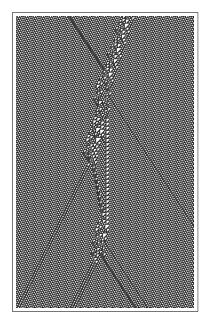
<!-- ORIGINAL_FIGURES page=0556 end -->

在某个层面上，情况无疑会有点像典型第 4 类元胞自动机的演化，如左侧所示。给定某组初始持久结构，这些结构可以相互作用，产生某种中间行为图案，然后最终解析为一组最终结构，而这些结构再次持续存在。

在中间行为图案中，人们也许还能识别出某些确定结构。持续时间不长的结构，可以同将永远持续的结构非常不同。但持续时间更长的结构，会倾向于具有越来越接近真正持久结构的性质。虽然持久结构可以被看作对应于真实粒子，中间结构在许多方面则类似于传统粒子物理中的虚粒子。

图：规则 110 第 4 类元胞自动机中局部结构之间的一次碰撞。

这意味着，左侧上方那样的图片可以在一种相当字面的意义上被看作粒子相互作用的时空图，有点像粒子物理中的费曼图。

不过，一个直接差别是，在传统粒子物理中，人们并不想象有像上图那样确定而被决定的行为图案。事实上，在我的宇宙模型中，已经清楚还有更多事情发生。因为任何像上图那样的过程，都必须发生在网络小尺度表观随机重排的背景之上。这个背景实际上所做的是引入一种随机环境，它可以使即便相同的粒子初始构型，也会以某些概率发生许多不同的详细行为图案。

即便没有粒子的真空也会具有复杂并在某些方面随机的形式，这一思想也存在于传统物理的标准量子场论中。量子场论的完整数学结构远未完全弄清。但基本概念是，对于每种可能粒子类型，都有某种连续场存在于整个空间中；而粒子的存在对应于这个场中的一种简单结构。

一般而言，量子场论方程似乎蕴含，即使没有实际粒子，场中也可以有各种复杂构型。但作为第一近似，可以只考虑短寿命的虚粒子和反粒子对。事实上，对于网络，人们常常可以做类似事情。因为即便在第 527 页讨论的平面

---

[[PDF page 557]]

网络中，也可以把许多不同连接排列看作由附近非平面持久结构对的不同构型形成。

谈论影响宇宙过程的随机背景，会立刻倾向于提示不同过程的概率之间存在某些确定关系。因此，例如，如果某个过程有两种不同发生方式，它提示整个过程的总概率应当只是该过程以两种不同方式发生的概率之和。

但量子理论的标准形式体系说这并不正确；事实上，人们必须看所谓概率振幅，而不是普通概率。在数学层面，这类振幅类似于波之类事物的振幅，实际上就是带有方向的数。量子理论说，整个过程的概率可以通过把该过程不同发生方式的振幅线性组合起来，然后查看结果大小的平方，或者类似波强度的量，来得到。

这种数学过程可能怎样从我所讨论的模型类型中涌现出来？答案似乎很复杂。因为尽管这个过程本身听起来也许很直接，它所操作的构造实际上远不容易仅基于底层网络来定义；而且我没有看到简单方法来解开必须作出的各种极限和理想化。

尽管如此，一个可能重要的点是，把网络中的粒子想成只是按照某种确定规则相互作用，并受到本质上随机背景的扰动，在某些方面是误导性的。因为这提示，每一次粒子相互作用实际上都有唯一历史，由初始条件和随机背景中存在的构型决定。

但真实图像更复杂。因为对底层网络的更新序列可以按任何顺序作出，而每一种顺序实际上都会给出网络的一个不同详细历史。但如果存在

---

[[PDF page 558]]

因果不变性，那么所有这些不同历史最终在某种意义上都必须等价。在这个约束下，如果把某个过程分解成若干部分，通常并没有简单方式描述这些部分的效应怎样组合在一起。

至少对于某些目的，明确思考不同可能历史，并组合分配给每一条历史的某种类似振幅的东西，可能很有意义。不过，这究竟怎样运作，当然取决于人们试图查看网络的什么特征。

在量子理论中，一个重大问题一直是：人们究竟怎样判断电子这类特定粒子正在发生什么。根据我们对日常对象的经验，也许会认为应该可以以某种方式做到这一点，而不影响电子。但如果我们拥有的东西只有粒子，那么要了解某个给定粒子的某些事情，就不可避免地必须让某个其他粒子，例如一个光子，显式地同它相互作用。在这种相互作用中，原始粒子不可避免地会以某种方式受到影响。

事实上，仅仅一次相互作用肯定不够。因为作为人类，我们通常无法感知单个粒子。确实，通常必须有大量粒子做或多或少相同的事情，我们才能成功登记到它。

最常见的办法是设置某种探测器，它最初处在足够不稳定的状态，以至于一个单独粒子就能启动一整串后果。通常这种探测器被安排成演化到某个稳定状态之一，而这个状态具有足够均匀的性质，使我们能把它识别为对应于一次测量的确定结果。

然而一开始，这种向有组织状态的演化可能似乎同微观可逆性不一致。但事实上，正如在许多其他看似不可逆的过程中一样，为了保持可逆性，需要的只是：如果查看系统足够多细节，就可以有任意且看似随机的行为。关键只是，在对测量结果作出结论时，我们选择忽略这类细节。

因此，尽管我们从一次测量中带走的实际结果可能相当简单，得到它的过程总会涉及许多粒子和许多事件。

---

[[PDF page 559]]

事实上，在传统量子理论中，除非实际上涉及无限数量的粒子，否则任何测量最终都不能给出确定结果。

正如我上面提到的，普通量子过程可以看起来遵循不同历史，具体取决于用什么方案决定底层规则的应用顺序。但取一个涉及无限数量粒子的测量的理想化极限，大概会实际上建立单一历史。

这意味着，如果知道构成我们宇宙的网络的全部底层细节，就应当总能算出任何测量的结果。我强烈相信，宇宙的初始条件相当简单。但像本书中看到的许多过程一样，宇宙的演化无疑会内在生成表观随机性。

结果，表示我们宇宙当前状态的网络的大多数方面都会显得本质上随机。这意味着，为了知道它的形式，我们本质上必须采样其中每一个细节；如果我们必须使用每次都涉及大量粒子的测量，这当然是不可能的。

不过，人们也许会想象，作为第一近似，可以通过说粒子以特定方式行为有某些概率，来考虑底层表观随机性。但关于量子理论基础最常被引用的结果之一是，实践中可以观察到粒子之间的关联，而这些关联似乎不可能至少用最明显的一类所谓隐变量理论来解释。

具体来说，如果取两个来自同一源的粒子，那么对其中一个粒子进行测量的结果，在某种意义上被发现过分依赖于另一个粒子上进行了什么测量，即使没有足够时间让以光速传播的信息从一个粒子到达另一个粒子。事实上，这一事实常被用来暗示，量子现象最终绝不可能是任何确定底层演化过程的结果。

---

[[PDF page 560]]

但这个结论很大程度上依赖关于空间和粒子本性的传统假定。事实证明，对于我在这里讨论的这类模型，它一般不再成立。

基本原因是，如果宇宙是一个网络，那么从某种意义上说，它可以很容易包含一些线索，即使粒子在普通空间意义上相距很远，这些线索仍继续把粒子连接起来。

由此涌现出来的图像是：背景中包含非常大量的连接，这些连接维持对三维空间的近似，同时还有少数线索实际上越出这个空间，在粒子之间建立直接连接。

如果两个粒子一起被创造出来，可以合理预期，表示其核心的缠结会倾向于有少数共同连接；事实上，例如对于我们在第 527 页讨论的那类非平面性块就是如此。但直到有相互作用改变核心结构之前，这些共同连接会一直保留，并继续定义一条直接从一个粒子到另一个粒子的线索。

但这里立刻有一个小微妙之处。因为本章前面我讨论过，在网络上测量距离，只要数一数为了从一点到达另一点所必须沿着走过的连续单个连接的最小数量。然而，如果使用这种距离测度，那么两个粒子之间的距离总会倾向于保持为线索中的连接数。

但关键是，这种距离测度实际上只是对实践中相关内容的简单理想化。因为我们最终实际能够测量物理距离的唯一方式，实际上是观察光子或其他粒子的传播。然而，这类粒子总是涉及许多节点。虽然它们可以通过定义背景空间的大量连接从一点到达另一点，但在某种意义上它们无法穿过一条线索中的少数连接。因此，这意味着，我们通常经验到的距离通常不会受线索影响。

但这并不意味着线索完全没有影响。事实上，我怀疑，正是线索的存在导致了在粒子测量中看到的关联。

---

[[PDF page 561]]

碰巧的是，量子理论的标准形式体系为这些关联提供了相当简单的数学描述。它可能怎样从同网络中线索相关的详细机制中涌现出来，当然远非明显。但量子理论标准形式体系中这一结果以及其他结果显得简单，不应被视为意味着它们在任何意义上特别基本。事实上，我猜测，其中大多数最终会实际依赖量子理论中的各种极限和理想化，并且只会作为对复杂得多的底层行为的简单近似而涌现出来。

自 20 世纪初以来的发展中，量子理论已经产生各种精巧结果。要试图从我在这里概述的这类模型中推导出全部这些结果，当然需要极其巨大的工作。但我认为非常令人鼓舞的是，一些最基本的量子现象似乎同因果不变性以及空间的网络结构这样的性质相连，而这些性质已经在我们讨论物理学中相当不同的基础问题时出现了。

所有这一切都支持我的强烈信念：最终事实将表明，我们宇宙的每一个细节确实都遵循可以由一个非常简单程序表示的规则；而我们看到的一切，最终都只是从运行这个程序中涌现出来的。
