# 第 10 章：感知与分析的过程

[[PDF page 563]]

<!-- ORIGINAL_FIGURES page=0563 start -->
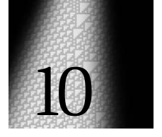
<!-- ORIGINAL_FIGURES page=0563 end -->

# 感知与分析的过程

## 引言

在前面几章中，我们已经讨论了造成自然界中各种现象的基本机制。但如果要解释我们对自然世界的实际经验，我们不仅需要考虑自然界中的现象是怎样产生的，还需要考虑我们怎样感知和分析这些现象。因为归根结底，我们对自然世界的经验并不是直接建立在自然界中发生的行为之上，而是建立在我们对这些行为进行感知和分析之后得到的结果之上。

例如，当我们观察某个特定自然系统的行为时，会有一些特征是我们用眼睛注意到的，也会有另一些也许不同的特征，是我们通过各种数学分析或其他分析方法检测出来的。

在前面几章中，我曾论证说，自然界中许多过程背后的基本机制，可以由基于简单规则的简单计算机程序来捕捉。那么，感知与分析所涉及的过程又怎样呢？

特别是在较高层次的感知方面，我们还有许多不能确定的东西。但我将在本章论证：我们已有的证据表明，其中起作用的基本机制同样可以成功地由基于简单规则的简单程序来捕捉。

[[PDF page 564]]

在传统科学中，人们很少认为有必要以任何明确方式讨论感知与分析所涉及的过程。因为在大多数情况下，研究对象都只是一些相当简单的特征，它们可以由非常直接的过程轻易提取出来，例如只用几个数或一个简单数学公式就可以描述。

但一旦人们试图研究任何具有实质复杂性的行为，就会发现所需使用的感知与分析过程不再那么直接。而人们得到的结果也会依赖于这些过程。

传统科学通常假定，任何不基本独立于获得它时所用的感知与分析过程的结果，都不够确定，也不够客观，因此没有多少科学价值。但关键在于，如果我们显式研究感知与分析的过程，那么即使在这类情况下，也仍然可以作出相当确定和客观的陈述。

事实上，我将在本书结尾得出的一些最重要结论，正是基于对两类过程的比较：一类是产生某些行为形式所涉及的过程，另一类是感知和分析这些行为形式所涉及的过程。

## 感知与分析做什么

在日常生活中，我们不断被大量数据轰击，这些数据以图像、声音等等形式出现。为了能够利用这些数据，我们必须把它们缩减到更容易处理的规模。而这正是感知与分析试图完成的事情。它们的作用实际上就是获取大量原始数据，并从中提取我们能够使用的摘要。

例如，从原始数据层面看，对页顶部的图像可以被认为由数以万计的黑白元胞组成。但借助我们的视觉感知与分析能力，我们立刻就能看出，这幅图像可以简单概括为：它本质上由一组重复的黑色菱形构成。

[[PDF page 565]]

<!-- ORIGINAL_FIGURES page=0565 start -->
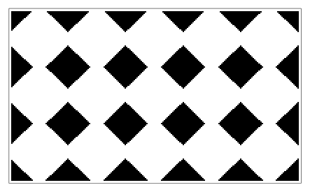
<!-- ORIGINAL_FIGURES page=0565 end -->

一个图像例子：我们的感知与分析能力很容易让我们用简单几何术语对它作出相当简洁的概括。但在最低层次上，这幅图像由 24,000 个黑白元胞组成。

一般说来，感知与分析可以通过两种方式缩减数据。第一，凡是与某个目的无关的数据方面，可以直接忽略。第二，可以利用人们看到的规律性，避免显式指定数据中的每一个元素。

因此，例如在概括上面的图像时，我们选择忽略一些细节，然后用它简单、重复的整体几何结构来描述剩余部分。

只要数据中存在规律性，这实际上就意味着数据的一部分是冗余的。比如，如果某个图案重复出现，那么人们就不必不止一次地指定这个图案的形式，因为原始数据只要通过重复该图案的一个副本就可以重现。一般而言，规律性的存在使得我们能够把数据的逐字描述替换为更短的描述，而这些描述基于重现数据的过程。

感知与分析有许多形式。有些自动发生在我们的眼睛、耳朵和大脑中，这些我们通常称为感知。另一些则需要显式的有意识努力，以及数学或计算工作，这些我们通常称为分析。但在所有情况下，基本目标都是一样的：把原始数据缩减为一种有用的摘要形式。

当人们想要高效地存储或传达数据时，这种摘要很重要。如果人们想把新数据与旧数据比较，或基于数据作出有意义的外推或预测，它同样重要。在现代信息技术中，数据压缩、特征检测、模式识别

[[PDF page 566]]

和系统识别等问题，实际上都围绕着为数据寻找有用摘要展开。

在传统科学中，统计分析一直是试图寻找数据摘要的最常用方法。一般来说，感知与分析可以被看作等同于寻找模型，用来重现人们认为相关的数据方面。

在许多方面，感知与分析对应于本书中我们研究过的大多数内容的逆过程。因为我们通常做的是从一个简单计算机程序出发，然后观察这个程序产生什么行为。但在感知与分析中，我们从观察到的行为出发，然后试图推断什么过程或程序能够重现这些数据。

那么，做到这一点有多容易呢？事实表明，对于传统数学中使用的大多数规则类型，这确实相当容易。但对于我在本书中讨论的更一般规则，它似乎常常极其困难。因为即使规则可能很简单，它们产生的行为也常常高度复杂，并且完全没有明显痕迹显示其简单来源。

作为一个例子，面对页上的图像都是从单个黑色元胞开始，然后应用非常简单的二维元胞自动机规则生成的。然而，如果只看这些最终图像，并没有什么容易的方法能判断它们是怎样生成的。我们的标准感知与分析方法当然可以确定这些图像例如是对称的。但这些方法通常远远不能识别出，事实上可以用多么简单的过程来产生这些图像。

人们也许会认为，我们无法找到这样的过程，只是由于我们作为人类碰巧发展出的特定感知与分析方法有局限。因此也许会假设，某种外星智能可能存在，它能够看着我们的图像并立刻判断出它们由一个非常简单的过程产生。

但事实上，我非常怀疑这种事情会发生。因为我怀疑，感知与分析究竟能够被期望做到什么，存在根本限制。似乎有许多种

[[PDF page 567]]

<!-- ORIGINAL_FIGURES page=0567 start -->
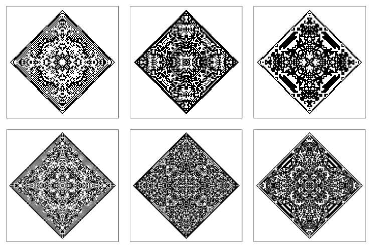
<!-- ORIGINAL_FIGURES page=0567 end -->

图案由单个黑色元胞开始，然后依照外总和型元胞自动机规则 54、222 和 374 演化 50 步和 100 步产生。尽管这个过程可以被简单描述，但只给出这里显示的最终图像时，我们的标准感知与分析方法并不能轻易推断出这个描述。

系统，在其中生成高度复杂行为要比识别这种行为的来源容易得多。

正如我在本书中所发现的，从简单初始条件出发并遵循简单规则集合，产生复杂行为相当容易。但关键在于，如果从某个特定行为片段出发，通常并不存在同样简单的规则让人能够反向追溯，找出这种行为怎样产生。这个问题通常类似于寻找满足某些约束的解。而正如我们在本书中已经多次看到的，这类问题可能极其困难。

因此，只要实际使用的感知与分析过程相当简单，就不可避免地会出现这样的情形：人们无法识别自己看到的行为的来源，即使这种行为实际上是由非常简单的规则产生的。

[[PDF page 568]]

## 定义随机性的概念

在本书中，我已经多次说过某个系统或另一个系统的行为似乎是随机的。但到目前为止，我还没有精确定义我所说的随机性是什么意思。而在本节中我们会发现，要提出一个恰当定义，就别无选择，必须考虑感知与分析的问题。

人们也许会以为，传统数学和统计学早已给出某种随机性的标准定义。但尽管偶尔有人宣称给出了特定定义，随机性的概念事实上一直相当含混。的确，我相信，只有借助本书中的发现，我们现在才终于有条件真正理解随机性是什么。

在日常语言层面，当我们说某物似乎随机时，通常意思是说其中没有我们能够辨认出的显著规律性，至少在我们所使用的感知与分析方法下是如此。

因此，我们通常不会说面对页顶部的前两幅图像似乎随机，因为我们很容易识别出其中高度规则的重复图案和嵌套图案。但第三幅图像，我们大概会说它确实似乎随机，因为至少在普通视觉感知层面，我们无法识别出其中有任何显著规律性。

那么，给定这种日常的随机性概念，我们怎样在它的基础上发展出更精确的定义？第一步是澄清，在某物中不能识别规律性意味着什么。根据上一节的讨论，我们知道，只要找到规律性，就意味着存在冗余，而这又意味着可以给出更短的描述。因此，当我们说无法识别任何规律性时，就等同于说我们找不到更短的描述。

面对页上的三幅图像总是可以通过显式列出其中 6561 个元胞各自的颜色来描述。但通过利用我们在前两幅

[[PDF page 569]]

<!-- ORIGINAL_FIGURES page=0569 start -->
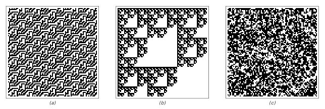
<!-- ORIGINAL_FIGURES page=0569 end -->

(a) (b) (c)

显示不同程度表观随机性的图像。图像 (a) 和 (b) 有明显规律性，绝不会被认为特别随机。但图像 (c) 几乎没有明显规律性，通常会被认为相当随机。事实证明，图像 (c) 和 (a)、(b) 一样，其实也能由一个相当简单的过程生成。但关键在于，这个过程的简单性并不改变这样一个事实：以我们的标准感知与分析方法而言，图像 (c) 在实践目的上是随机的。

图像中看到的规律性，我们很容易为这些图像构造更短但仍然完整的描述。

图像 (a) 的重复结构意味着，要重现这幅图像，我们只需要指定一个 `49 x 2` 块中的颜色，然后说这个块应当重复适当次数。同样，图像 (b) 的嵌套结构意味着，要重现这幅图像，我们只需要指定一个 `3 x 3` 块中的颜色，然后说每个黑色元胞应当像在二维替换系统中那样，反复被这个块替换。

但图像 (c) 又怎样呢？有没有什么能够给出的简短描述？还是说我们别无选择，只能显式指定其中每一个元胞的颜色？

我们的视觉感知能力当然没有揭示出任何显著规律性，使我们能够构造更短描述。而事实证明，任何标准的数学或统计分析方法也没有做到这一点。因此，在实践目的上，我们几乎只能显式指定每个元胞的颜色。

但我们的通常感知与分析过程找不到短描述，并不在任何意义上意味着根本不存在这样的描述。事实上，图像 (c) 确实允许一个非常短的描述。因为它只要从单个黑色元胞开始，然后应用一个简单二维元胞自动机规则 250 步就可以生成。

[[PDF page 570]]

但这个短描述的存在是否意味着图像 (c) 不应被认为是随机的？从实践角度看，如果我们永远无法通过任何可用的感知与分析方法找到某个短描述，那么这个短描述可能存在这一事实大概并不太相关。但从概念角度看，一个依赖于我们的感知与分析方法、而不是在某种意义上绝对的随机性定义，似乎又令人不满意。

因此，一个可能性是这样定义随机性：只有当某物完全不存在任何短描述时，它才被认为是随机的。在本书的发现之前，这样的定义也许似乎与我们日常的随机性概念相去不远。因为我们大概会假定，任何由足够短描述生成的东西，必定看起来相当简单。但本书中我们发现，这绝对不是事实；事实上，即使从描述非常短的规则出发，也很容易产生这样的行为：我们的标准感知与分析方法无法识别其中任何显著规律性。

所以，说某物只有在完全不存在任何短描述时才是随机的，结果变成了一个高度限制性的随机性定义。事实上，正如我在第 7 章中提到的，它本质上意味着，如果起初没有随机性，那么任何基于确定规则的过程都永远不能设法产生随机性。因为规则本身有短描述，任何遵循这些规则产生的东西也会有相应短描述，因此按此定义不会被认为是随机的。

而即使人们并不关心随机性可能从何而来，还有另一个问题：一般而言，不可能用任何有限方式确定某个特定东西是否能由一个短描述生成。人们也许会想，总可以试着运行描述越来越长的所有程序，看其中是否有哪个会生成自己想要的东西。但问题在于，一般来说人们永远无法预先知道，为了确信某个特定行为片段不会出现，需要观察多少步演化。因此，一般不存在任何有限过程能够保证某个特定东西不存在短描述。

[[PDF page 571]]

通过设置各种限制，比如限制允许的演化步数，可以得到稍微更容易处理的随机性定义。但即使在这种情况下，判断某物是否应被认为随机所需的计算工作量通常也是天文数字。更重要的是，虽然这类定义也许有某种概念上的兴趣，却与我们对随机性的直觉概念对应得很差。事实上，如果遵循这类定义，我在本书中称为看起来随机的大多数图像，包括例如第 553 页上的图像 (c)，都会被认为不是随机的。根据第 7 章的讨论，自然界中许多我们通常认为随机的现象也会如此。

的确，我怀疑，任何有用的随机性定义最终都不能只建立在某物原则上可能有哪些短描述这个问题之上。相反，我相信，任何有用的定义都必须至少以某种方式涉及这些短描述应该怎样被找到。

多年来，人们提出过各种基于缺乏某些特定规律性的随机性定义。这些定义常常被说成在某种意义上是根本性的。但事实上，它们通常只相当于查看某个特定过程，而且通常是一个相当简单的过程，是否成功识别规律性并由此生成更短描述。

一个常见例子，稍后两节还会进一步讨论，是取一个黑白元胞序列，然后计数每种颜色以及每种颜色块出现的频率。这些频率之间只要有任何偏离相等的情形，就代表序列中有规律性，并揭示出非随机性。但尽管过去存在一些混淆，单单检查颜色块频率是否相等，哪怕检查任意长的颜色块，当然也不足以保证根本不存在任何规律性。这个过程确实可以用来检查是否不存在纯粹重复图案，但正如我们将在本章稍后看到的，它甚至不能成功检测出某些高度规则的嵌套图案的存在。

[[PDF page 572]]

那么，我们怎样才能发展出一个有用而精确的随机性定义？我们需要的本质上只是本节开头那句话的精确版本：如果我们的标准感知与分析方法都不能成功检测出某物中的任何规律性，那么它就应被认为是随机的。但我们怎样可能期望找到对所有各种标准感知与分析方法所做之事的某种精确一般刻画？

本章将显现出的关键点是：归根结底，几乎所有这些方法都可以被看作基于相当简单的程序。因此，这提示了一个可以给出的随机性定义：只要本质上不存在任何简单程序能够成功检测出某物中的规律性，那么该物就应被认为是随机的。

通常，如果人们研究的东西本身是由简单程序创造的，那么总会有少数密切相关的程序能够成功检测出规律性。但如果某物可以合理地被认为是随机的，那么关键在于，绝大多数简单程序都不应能够检测出其中任何规律性。

那么，为了确定这一点，是否真的需要基本尝试所有足够简单的程序呢？根据我的经验，答案通常是否定的。因为一旦对应于几种标准感知与分析方法的少数简单程序没能检测出规律性，其他任何简单程序再成功检测出规律性的情况就极其罕见。

这意味着，我们在本节最开始讨论的日常随机性定义，最终已经相当明确。因为通常并不太重要的是我们使用哪些标准感知与分析方法：在尝试其中几种之后，我们几乎总能得出相当确定的结论，判断某物是否应被认为是随机的。

[[PDF page 573]]

## 定义复杂性

我在本书中所做的许多事情，都以某种方式关系到与复杂性相关的现象。但就像研究生物学并不需要对生命作出形式定义一样，到目前为止，本书也并未证明必须先有复杂性的形式定义。不过，经过上一节关于随机性的讨论，我们现在已经可以考虑复杂性这个概念应当怎样被形式化定义。

在日常语言中，当我们说某物似乎复杂时，通常意思是说，我们没有设法找到它的任何简单描述，至少没有找到它那些我们碰巧感兴趣的特征的简单描述。但感知与分析的目标恰恰是寻找这样的描述。因此，当我们说某物似乎复杂时，实际是在说我们的感知与分析能力在它面前失败了。

正如两节之前讨论的，感知与分析通常可以通过两种方式运作。第一，它们可以直接丢弃我们不感兴趣的细节。第二，它们可以移除与它们设法识别出的任何规律性相关的冗余。

上一节讨论的随机性定义建立在这两个功能中第二个功能的失败之上。因为它说的是：如果我们的标准感知与分析方法无法找到一个短描述，使得某物可以从该描述被忠实重现，那么这个东西就应被认为是随机的。

但在定义复杂性时，我们需要同时考虑感知与分析的这两个功能。因为我们想知道的不是，能否为某物的每一个细节找到简单或短的描述，而仅仅是，能否为我们碰巧感兴趣的那些特征找到这样的描述。

在日常语言中，“复杂性”和“随机性”这两个词有时几乎可以互换使用。例如下一页顶部的三幅图像中任何一幅，都有可能被称作“相当随机”或“相当复杂”。但如果人们选择只看

[[PDF page 574]]

<!-- ORIGINAL_FIGURES page=0574 start -->
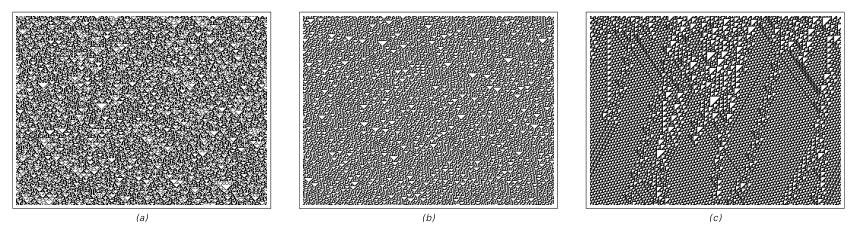
<!-- ORIGINAL_FIGURES page=0574 end -->

整体特征，那么通常会倾向于说第三幅图像看起来比另外两幅更复杂。

(a) (b) (c)

一些图像例子，在日常层面上人们通常可能把它们描述为“相当随机”或“相当复杂”。

因为尽管前两幅图像中黑白元胞的详细位置似乎并不容易描述，但在整体层面，这些图像仍然允许一个相当简单的描述：本质上，它们只是涉及某种均匀随机性，其中每个区域看起来多少都和其他区域一样。但第三幅图像即使在整体层面也没有显示出这种均匀性。因此，即使我们忽略它的小尺度细节，也无法给出它的短描述。

当然，如果走到极端，例如只看每幅图像有多大，那么三幅图像都有非常短的描述。一般说来，人们能为某物找到多短的描述，将取决于希望捕捉它的哪些特征。这就是为什么当人们为了不同目的观察某物时，最终可能赋予它不同的复杂性。

但如果人们使用某种特定的感知或分析方法，就总可以查看这种方法设法产生的描述有多短。而描述越短，人们就认为复杂性越低。

不过，究竟在多大程度上可以定义一个不依赖于特定感知与分析方法细节的复杂性概念？在本章中，我论证说，几乎所有常见形式的感知与分析都对应于相当简单的程序。如果人们关心的是不丢失信息的描述，如上一节关于随机性的讨论中那样，那么正如我在上一节所提到的，在实践中，不同简单程序在能否找到短描述方面似乎通常相当一致。

[[PDF page 575]]

但当人们处理允许丢失信息的描述时，这一点似乎就远不如前者那么真实。因为相当常见的情况是，一个系统可能只有少数特征难以描述，而取决于某个给定程序是否碰巧对这些特征敏感，它可能赋予该系统相当高或相当低的复杂性。

不过，作为实践问题，我们判定复杂性水平时最常用的方法，远远是使用我们的眼睛和视觉感知能力。因此在实践中，当我们说某物似乎复杂时，最常指的是人类视觉感知所涉及的特定过程未能提取出短描述。

事实上，我怀疑即使在有意识思考层面之下，我们的大脑也已经有某种相当明确的复杂性概念。因为当我们面对一个复杂图像时，我们的眼睛往往会停留在它上面，想必是在努力给大脑机会去提取简单描述。

如果我们找不到任何简单特征，例如在完美随机性的情况下，我们往往会失去兴趣。但不知何故，最吸引我们的图像，也通常是我们觉得最具审美愉悦的图像，是那些一部分特征对我们来说容易描述、另一些特征却没有任何我们的标准视觉感知过程能够找到的短描述的图像。

在本书的发现之前，人们也许会以为，要创造任何具有显著表观复杂性的东西，必然需要一个自身也具有显著复杂性的过程。但本书中我们发现，事实上有一些极其简单的程序能够产生极其复杂的行为。这意味着，正如本书中的图像反复展示的，最终要制造出让我们的视觉系统找不到简单整体描述的图像，其实相当容易。

[[PDF page 576]]

<!-- ORIGINAL_FIGURES page=0576 start -->
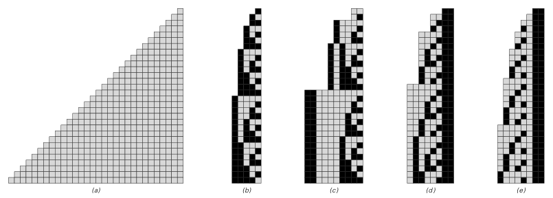
<!-- ORIGINAL_FIGURES page=0576 end -->

## 数据压缩

人们通常认为，感知与分析主要是为了给人类直接使用提供材料。但在大多数现代计算机和通信系统中，当数据为了更高效地存储或传输而被压缩时，与感知和分析等价的过程一直在发生。

这种过程的一个简单例子是游程编码。这是一种实践中广泛使用的方法，用来压缩包含长串相同元素的数据，例如有大片白色区域的文本页位图图像。

游程编码的基本思想是把数据分解成由相同元素组成的连续段，然后只通过给出这些连续段的长度来指定数据。这意味着，例如不必显式列出一段 53 个相同元胞中的全部元胞，而只要给出数字“53”。关键在于，即使“53”本身也用黑白元胞表示，这种表示也可以比 53 个元胞短得多。

(a) (b) (c) (d) (e)

数字 1 到 30 的各种表示。(a) 是一进制，其中任意给定数字都由长度等于该数字的元胞序列表示。(b) 是普通二进制或 2 进制表示。(c)、(d) 和 (e) 被设置为自定界，使得一个数字的结尾可以只通过查看其内部的元胞来识别。(c) 类似于 (b)，但在前面加入了数字位数的说明。(d) 本质上是二进制编码的三进制，数字结尾由一对黑色元胞指示。(e) 使用一种从斐波那契序列导出的非整数进制，其性质是：一对黑色元胞只能出现在每个数字的末尾。

[[PDF page 577]]

<!-- ORIGINAL_FIGURES page=0577 start -->
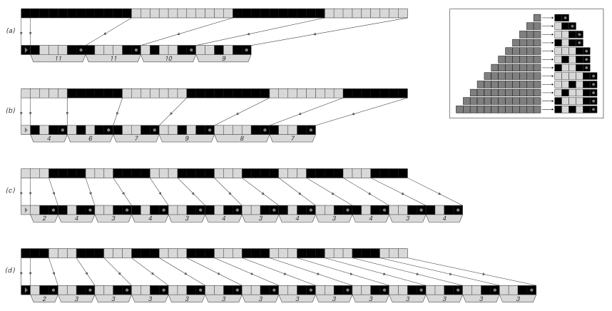
<!-- ORIGINAL_FIGURES page=0577 end -->

事实上，任何数字序列都可以被看作一个数字的短表示。但对于游程编码来说，普通 2 进制数字序列并不完全可行。因为如果对应于连续游程长度的数字一个接一个给出，就没有办法判断一个数字的位在何处结束，下一个数字又从何处开始。

不过，有几种办法可以避免这个问题。一种办法如面对页底部图像 (c) 所示，是在每个数字开头插入一个说明，说明该数字包含多少位。另一种办法如图像 (d) 所示，实际是用两个元胞表示每一位，然后用一对黑色元胞标示数字结束。这个办法的一个变体如图像 (e) 所示，使用一种非整数进制，其中成对的黑色元胞只能出现在数字末尾。

(a) (b) (c) (d)

游程编码的例子。每种情况下，输入数据显示在上方，输出显示在下方。输入和输出之间的箭头显示数据怎样被分解为由相同元素组成的连续游程。然后，每个游程由一个数字指定，该数字表示为一个以两个黑色元胞结尾的序列，如插图以及面对页图像 (e) 所示。对于前两组输入数据，存在足够多的长游程，因此实现了压缩。但对于另外两组，则没有实现压缩。注意，输出中的第一个元胞用来指定第一个游程是黑色还是白色。在这幅图以及后面的图中，输出完全由黑白元胞组成；灰色注释只是作为解释辅助。

[[PDF page 578]]

对于小数字，所有这些办法都会产生至少稍长于图像 (a) 中显式序列的表示。但对于较大数字，这些表示很快就会短得多。这意味着它们有潜力用于在游程编码中实现压缩。

上一页底部的图像显示了，当人们把第 560 页的表示 (e) 用于游程编码并应用到各种数据序列时，会发生什么。在前两种情况下，存在足够多的长游程，因此实现了压缩。但在后两种情况下，短游程太多，游程编码的输出实际上比输入更长。

下面的图像显示了把游程编码应用到元胞自动机产生的典型图案时得到的结果。当图案包含足够多的均匀颜色区域时，就实现了压缩。但当图案更加错综复杂时，即使只是以简单重复方式错综复杂，也几乎没有或完全没有实现压缩。

把游程编码应用到元胞自动机产生图案的例子。原始图像中的连续行被首尾相接排成一个一维序列，然后进行游程编码，再重新切成行。只要图像大部分由均匀颜色区域组成，通常就能实现压缩。

[[PDF page 579]]

<!-- ORIGINAL_FIGURES page=0579 start -->
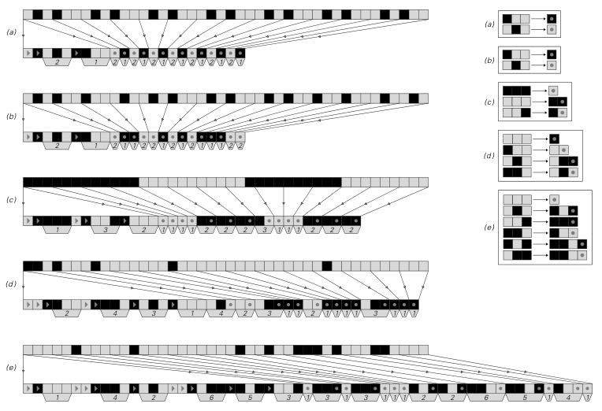
<!-- ORIGINAL_FIGURES page=0579 end -->

游程编码基于把数据分解为长度不等的相同元素连续段这一思想。另一种常见数据压缩方法则基于形成固定长度的块，然后用特定码字表示出现的各种不同块。

下面的图像显示了这种方法怎样工作的一些例子。每种情况下，输入都被看作分解为长度为 3 的块。在前两种情况下，随后只出现两个不同块，因此每个块都可以用由单个元胞组成的码字表示，结果实现了显著压缩。

基于长度为 3 的块的霍夫曼编码例子。在情形 (a) 和 (b) 中，只出现两个可能块，它们分别被分配由单个黑色元胞和单个白色元胞组成的码字。在情形 (c) 中，出现 3 个可能块；最常见的块被分配由单个白色元胞组成的码字，其他块被分配由两个元胞组成的码字。在情形 (d) 中，8 个可能块中有 4 个出现；在情形 (e) 中，有 6 个出现。在所有情况下，输出都从一个前导部分开始，说明哪个块将由哪个码字表示。这些块在前导部分中显式出现，并由带编号的标签标出。码字则由带箭头的元胞排列隐式表示。前导部分之后是表示数据的实际码字。码字是自定界的，因此可以一个接一个给出，中间不需要分隔符。

[[PDF page 580]]

当出现的不同块数量较多时，不可避免地必须使用更长的码字。但如果常见块的码字相对于块本身足够短，仍然可以实现压缩。

分配码字的一种简单策略，是按频率递减顺序给所有不同块编号，然后直接使用得到的数字，例如用上面讨论的某种表示方式给出的数字，作为码字。但如果不仅考虑不同块的排名，还考虑它们的实际频率，那么事实表明，有更好的方式来分配码字。

下面的图像显示了基于一种称为霍夫曼编码的方法的例子。每种情况下，输出的第一部分说明哪些块由哪些码字表示，然后输出剩余部分给出与数据中出现的块对应的实际码字序列。正如下图所示，只要以高频出现的不同块相当少，就可以实现显著压缩。

把长度为 6 的块上的霍夫曼编码应用到元胞自动机产生图案的例子。最大可能压缩因子为 6；这里达到的最大值大约为 3。最后两个例子结果大小的差异，主要是由于其中第一个存在大片白色区域。

[[PDF page 581]]

<!-- ORIGINAL_FIGURES page=0581 start -->
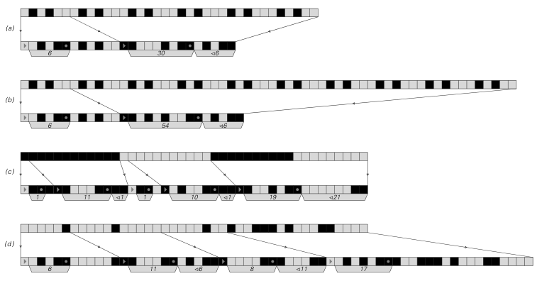
<!-- ORIGINAL_FIGURES page=0581 end -->

但这种方法能够得到的压缩程度终究有一个限制。因为即使在最好的情况下，输入中的任意元胞块也永远不能被压缩为少于输出中的一个元胞。

那么怎样才能实现更大的压缩呢？一种办法是设置一种编码：长度超过某个值的任意特定元素序列只显式给出一次，而后来出现的相同序列都通过指向第一次出现位置的指针来指定。这种办法事实证明类似于实践中大多数现行高性能通用压缩系统所使用的方法。

下面的图像显示了把这种方法应用到几个短序列时会发生什么。每种情况下，输出都由两类对象组成，一类给出首次出现的序列，另一类给出指向先前出现序列的指针。两类对象都以一个指定其类型的单个元胞开始。

基于指针的编码例子，其中在数据中已经出现过一次的序列，后来只由指针指定。每一段输出都从一个元素开始，指示后面是一个新序列还是指向先前序列的指针。随后是对该段输出所代表序列长度的说明，数字采用上面游程编码中使用的形式。然后接着要么是一个字面序列，要么是一个数字，说明所需序列最近一次在数据中出现的位置相对于当前位置的偏移量。在所示例子中，只有长度至少为 6 的序列才使用指针。基于指针的编码类似于实践中高性能通用压缩系统广泛使用的 Lempel-Ziv 算法。

[[PDF page 582]]

<!-- ORIGINAL_FIGURES page=0582 start -->
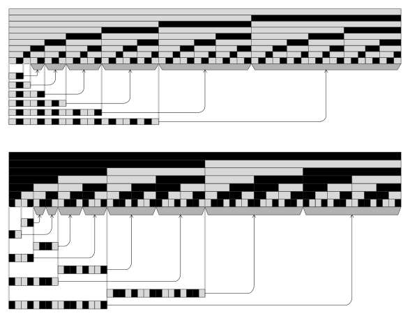
<!-- ORIGINAL_FIGURES page=0582 end -->

接下来是对该对象所描述序列长度的说明。在第一类对象中，随后给出实际序列；而在第二类对象中，给出的则是所需序列可以在数据中向前回溯多远找到。

对于纯粹重复的数据，这种方法能实现非常显著的压缩。因为一旦指定了要重复的基本序列，随后需要给出的就只是指向这个序列的指针，以及整个数据长度的表示。

纯粹嵌套的数据也能被压缩到几乎同样程度。如下图所示，每一个完整嵌套层次都可以被看作只是添加了固定数量的重复序列。

纯粹嵌套数据中发现的重复模式例子。如这些图所示，任何这样的数据都必定对应于某个邻域无关替换系统的输出（见第 83 页）。在基于指针的编码中，表示数据所需指针的数量本质上像替换系统演化步数那样增长。考虑到每个指针表示的长度，一个长度为 `n` 的嵌套序列，其压缩形式的长度通常会像 `Log[n]^2` 那样增长。（这可以与纯粹重复序列的 `Log[n]` 增长比较。）注意，实际的基于指针的编码算法通常会发现稍微不如这里图中所示那样规则的重复模式。

[[PDF page 583]]

那么二维图案又怎样呢？下面的图像显示了，如果取各种图案，把它们的行一个接一个排成长线，然后对得到的序列应用基于指针的编码，会发生什么。当原始图案中存在明显规律性时，通常能得到某些压缩，但在大多数情况下压缩量并不惊人。

把一维基于指针的编码应用到元胞自动机产生图案的例子。每幅图像中的连续行被首尾相接，以得到一个可应用编码的序列。只有长度至少为 4 的重复才使用指针。在最后一个例子中，大区域内没有这样的重复，因此它们在输出中看起来就和输入中一样。

那么怎样才能做得更好？基本答案是，必须考虑这些图案的二维性质。过去实践中使用的大多数压缩方案，主要只是为处理一维序列而设置的。但设置直接作用于二维数据的方案并不困难。

下一页的图像显示了一种方法，它基于把图像分解为一组嵌套片段，每个片段都具有均匀颜色。从某些方面看，这个方案是游程编码的二维类比；当存在大面积均匀颜色区域时，它会产生显著压缩。

也很容易把基于块的编码推广到二维：所需做的只是为二维块而不是

[[PDF page 584]]

<!-- ORIGINAL_FIGURES page=0584 start -->
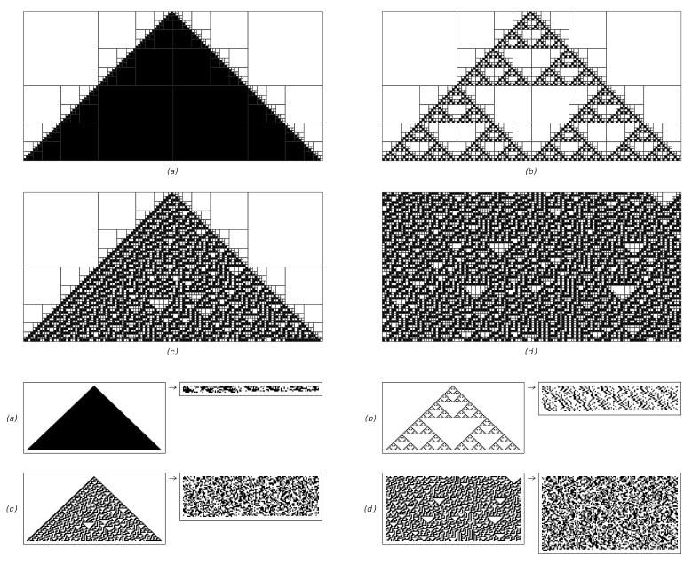
<!-- ORIGINAL_FIGURES page=0584 end -->

一维块分配码字。正如面对页顶部的图像所示，这个过程可以导致显著压缩。特别值得注意的是情形 (d) 中发生的事情。因为尽管这个图案是由一个简单的一维元胞自动机规则产生的，而且即使用眼睛也能看出它至少包含某些小尺度规律性，但到目前为止我们讨论过的所有方案都完全没有成功压缩它。

二维递归细分编码的例子。其思想是使用二维替换系统的一种推广，其中每一步里，一个正方形要么保持不变，要么被细分为四个小正方形。编码指定每一步中每个正方形作出哪种选择。这个方法类似于计算机图形学中有时使用的四叉树表示。即使在情形 (c) 中也能看到显著压缩，这是由于存在大片均匀白色区域。

[[PDF page 585]]

<!-- ORIGINAL_FIGURES page=0585 start -->
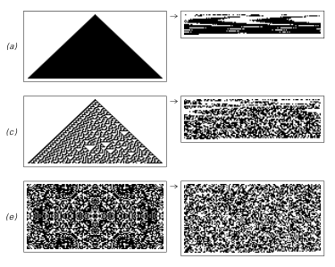
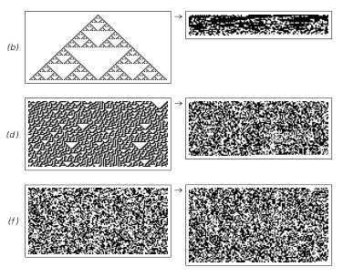
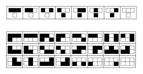
<!-- ORIGINAL_FIGURES page=0585 end -->

二维基于块的编码例子。每幅图像被分解为 `3 x 2` 块，然后用霍夫曼方案为这些块分配码字。注意，在情形 (d) 中也出现了压缩。这是因为元胞自动机规则只允许某些块出现在图案中，如下图所示。(e) 由二维元胞自动机生成；(f) 是规则 30 中心列上出现的序列。

下面的图像展示了为什么二维块编码确实能够压缩它。关键在于，人们形成的二维块总是包含一些元胞，而这些元胞的颜色由元胞自动机规则彼此关联，这大大减少了可能出现的不同颜色排列的数量。

元胞自动机规则 30，以及在它生成的大图案中出现的 `3 x 2` 块。总共有 `2^6 = 64` 种可能的黑白元胞 `3 x 2` 块；在规则 30 生成的图案中只有 24 种出现，这一事实使二维基于块的编码能够压缩这类图案。

然而在情形 (e) 和 (f) 中，没有从一行到下一行的简单规则，二维块编码和我们到目前为止讨论过的所有其他编码方案一样，并不产生任何实质压缩。

和块编码一样，基于指针的编码也可以推广到二维。基本思想只是扫描二维数据，寻找重复的不是一维序列，而是二维区域。虽然这样一个过程过去似乎没有在实践中使用过，但实现起来相当直接。面对页上的图像显示了一些结果例子。在许多情况下，事实证明所得的整体压缩水平远大于本节讨论的任何其他方案。也许更引人注目的是，重复区域的模式似乎捕捉了几乎每一种我们用眼睛容易注意到的规律性，以及一些我们没有注意到的规律性。例如在图像 (c) 和 (d) 中，左侧相当微妙的重复被捕捉到了；在图像 (e) 中，四重对称性也被捕捉到了。

[[PDF page 586]]

人们也许会以为，要捕捉所有这些规律性，需要一整套复杂过程。但面对页上的图像展示的是，事实上只需一个相当直接的过程就足够了。事实上，这个过程在不同情况下达到的压缩量，似乎与我们关于存在多少规律性的直觉印象相当吻合。

本节讨论过的所有数据压缩方法都可以被看作对应于相当简单的程序。但每种方法涉及的程序结构都相当不同，因此人们也许会以为，它们不可避免地会对相当不同种类的规律性敏感。

然而我们在本节中看到，事实上不同数据压缩方法具有惊人相似的特征。基本上每种方法都会成功压缩大面积均匀颜色区域。大多数方法也能够压缩重复行为，并至少在某种程度上压缩嵌套行为，而这正是我们在本书中已经多次注意到的两类简单行为。

不过，对于更复杂的行为，这些方法似乎都不能进行实质压缩。并不是说原则上永远不可能压缩。事实上，面对页上的每一幅图像都例如可以由非常短的元胞自动机程序生成。

但关键在于，除非整体行为显示出重复或嵌套，否则本节讨论过的任何标准数据压缩方法都远远不能找到这样的短描述。因此，至少相对于这些方法，我们能合理说出的也只是：我们看到的行为在实践目的上似乎是随机的。

[[PDF page 587]]

<!-- ORIGINAL_FIGURES page=0587 start -->
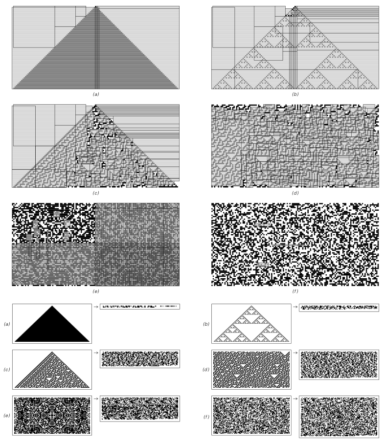
<!-- ORIGINAL_FIGURES page=0587 end -->

二维基于指针的编码例子。上方图像中的灰色矩形表示用指针编码的重复区域。在这里使用的特定方案中，每个这样的区域都必须包含至少 25 个尚未用指针编码的元胞。图像被按顺序扫描；在每一点上，都寻找一个向右和向下延伸的最大矩形，它是先前遇到过的某个矩形的重复，并包含数量最多的尚未用指针编码的元胞。在许多情况下，这个最大矩形会与后来各点找到的矩形重叠。

[[PDF page 588]]

<!-- ORIGINAL_FIGURES page=0588 start -->
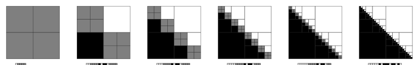
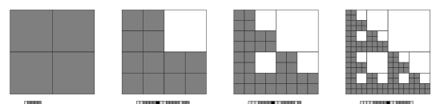
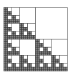
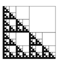
<!-- ORIGINAL_FIGURES page=0588 end -->

## 不可逆数据压缩

上一节讨论的所有数据压缩方法都被设置为可逆的，也就是说，从任意数据片段的编码版本总是可以恢复原始数据的每一个细节。如果处理的数据对应于文本或程序，这种可逆性通常是必不可少的。但对于图像或声音，它通常不再那么必要；因为在这些情况下，最终通常重要的只是能够恢复出看起来或听起来正确的东西。而通过丢弃几乎没有或完全没有可感知效果的细节，人们常常能够实现高得多的压缩水平。

在图像的情况下，一个简单方法就是忽略小于某个最小尺寸的特征。下面的图像显示了，如果把图像分解为一组嵌套正方形，但对这些正方形的大小施加下限，会发生什么。

用嵌套正方形表示图像时，逐步纳入更小特征的效果。每幅图像的编码版本显示在图像下方。当纳入更小正方形时，指定图像所需的数据量迅速增加。

[[PDF page 589]]

<!-- ORIGINAL_FIGURES page=0589 start -->
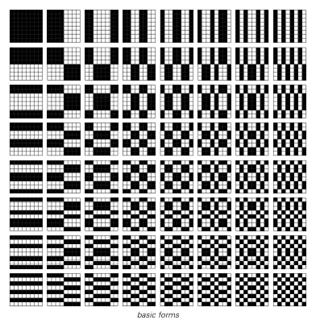
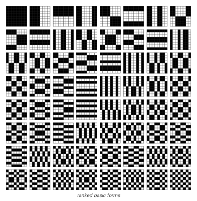
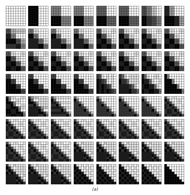
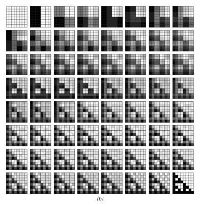
<!-- ORIGINAL_FIGURES page=0589 end -->

基本形状；排序后的基本形状。

图像怎样可以通过把由所谓二维 Walsh 函数组成的基本形状相加来构建的例子。左上角的基本形状按所谓序率顺序给出。右上角则把它们大致重新排序，使其系统地从较粗到较细。底部图像数组中，每一幅连续图像都是通过以适当权重加入相应基本形状得到的。这里显示的基本形状具有正交性质，因此每个形状的权重可以只通过把原始图像乘以该形状来推断。注意，这些形状涉及数值 -1 和 +1，分别对应涂成白色和黑色的元胞。这里显示的图像都经过重新缩放，使最小值为白色，最大值为黑色。JPEG 图像压缩方法使用了类似于这里所示的方法，不过其基本形状具有连续灰度层级，而不只是黑白两色。

[[PDF page 590]]

人们看到的是，随着下限增大，压缩量迅速增加，尽管代价是图像质量相应迅速下降。

那么，能否在保持图像质量方面做得更好？实践中使用了各种方案，其中几乎所有方案都基于传统数学中的一个思想：通过把数据看成数字，可以把数据分解为固定基本形状之和，其中一些基本形状可以被丢弃以实现压缩。

上一页的图像显示了这种方法怎样工作的一个例子。左上角是一组基本形状，它们具有这样的性质：任何二维图像都可以通过把这些形状以适当权重相加而构建出来。右上角随后把这些形状大致从最粗到最细排序。给定这个排序，底部的图像数组显示了两幅不同图像怎样可以通过逐步加入越来越多基本形状构建出来。

如果纳入所有基本形状，那么原始图像就会被忠实重现。但如果丢弃一些后面的形状，从而减少必须指定的权重数量，就只能得到图像的一个近似。面对页显示了，当保留不同比例的形状时，各种图像会发生什么。

足够简单的图像即使只纳入很小一部分形状也已经可以被识别，这对应于非常高的压缩水平。但大多数其他图像通常需要纳入更多形状，因此不允许这么高的压缩水平。

事实上，这种情形非常符合我在两节之前给出的复杂性定义。简单图像和完全随机图像的相关特征，即使在相当高的压缩水平下也容易被识别。但我们通常认为复杂的图像，往往具有一些特征，只有在压缩水平显著降低时才能被识别。

不过，面对页上的所有图像都是从上一页显示的特定基本形状排序生成的。于是

[[PDF page 591]]

<!-- ORIGINAL_FIGURES page=0591 start -->
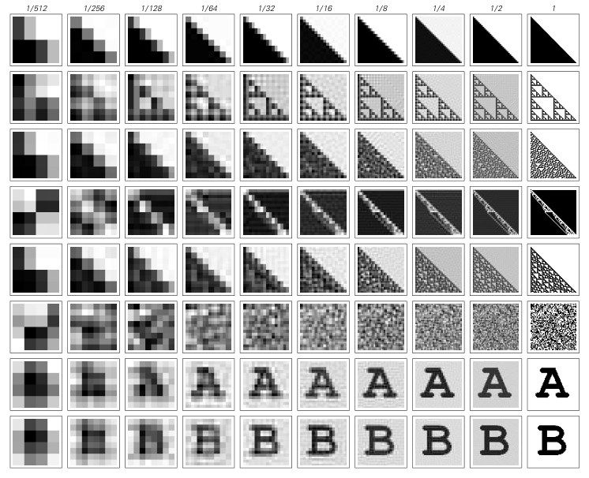
<!-- ORIGINAL_FIGURES page=0591 end -->

只保留完整基本形状集合中某些比例时得到的图像例子。在简单图像和完全随机图像的情况下，即使只有相当少的基本形状，许多特征也能被识别，这意味着可以给出高度压缩的表示。

人们也许会问，是否某种其他排序会使压缩更复杂的图像变得更容易。

一种简单办法是汇集大量典型图像，这些图像代表想要压缩的图像类型，然后按照基本形状在这个图像集合中平均出现权重更大的程度对它们排序。下一页的图像显示了，如果先对元胞自动机图像这样做，然后对字母图像这样做，会发生什么。确实可以达到稍高一些的压缩水平。但无论采用哪种排序，事实似乎仍然是：我们通常认为复杂的图像，依然不能系统地被压缩超过一小部分。

[[PDF page 592]]

<!-- ORIGINAL_FIGURES page=0592 start -->
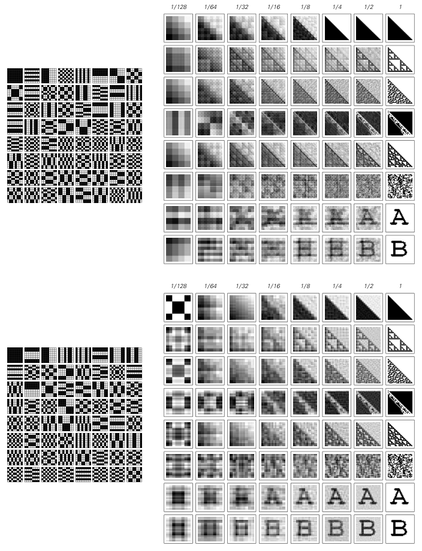
<!-- ORIGINAL_FIGURES page=0592 end -->

从元胞自动机图像集合（上）和字母图像集合（下）推断基本形状最优排序后得到的结果。基本形状的排序显示在左侧，每种情况下都从在图像集合上求平均时绝对权重最大的形状开始。注意，这些排序显示的是 `8 x 8` 基本形状，而实际图像是 `32 x 32`。这些排序分别从 256 个初等元胞自动机的图像，以及 52 个大小写字母的图像推断出来。

[[PDF page 593]]

## 视觉感知

在现代，人们通常已经认为，把很多东西仅仅建立在眼睛看起来怎样之上，是相当不科学的。但事实仍然是，尽管各种数学分析和其他分析方法已经发展出来，我们的视觉系统仍然代表着我们拥有的最强大、最可靠的工具之一。在写作本书时，我当然也大量依赖我们根据视觉表示进行各种推断的能力。

那么，人类视觉系统实际上是怎样工作的？它有哪些局限？还有许多细节有待解决，但在过去几十年里，至少这个系统的最低层次怎样工作已经开始变得相当清楚。事实证明，正如本书中我们在许多其他情形里看到的那样，其中发生的许多事情可以用极其简单的程序来理解。

事实上，在几乎每一种人类感知中，似乎反复使用的基本方案都是：设置特定种类的细胞，使它们响应数据中的某些特定固定特征，然后忽略所有其他特征。

颜色感知提供了一个经典例子。在我们眼睛的视网膜上有三种对颜色敏感的细胞，每一种本质上响应红、绿、蓝之一的水平。来自一个物体的光通常涉及一整个波长谱。但我们只有三种颜色敏感细胞这一事实，意味着我们的眼睛本质上只采样这个光谱的三个特征。这就是为什么例如我们会有这样的印象：只混合三种固定颜色，就能成功重现所有其他颜色。

那么图案和纹理呢？我们的视觉系统是否也是通过挑出其中的特定特征来工作？日常经验提示，它确实如此。因为如果我们看下一页上的图像，我们并不会立刻注意到每个细节。相反，我们的视觉系统似乎只是挑出某些特征，这些特征很快让我们把这幅图像看成一组具有确定纹理的斑块。

[[PDF page 594]]

<!-- ORIGINAL_FIGURES page=0594 start -->
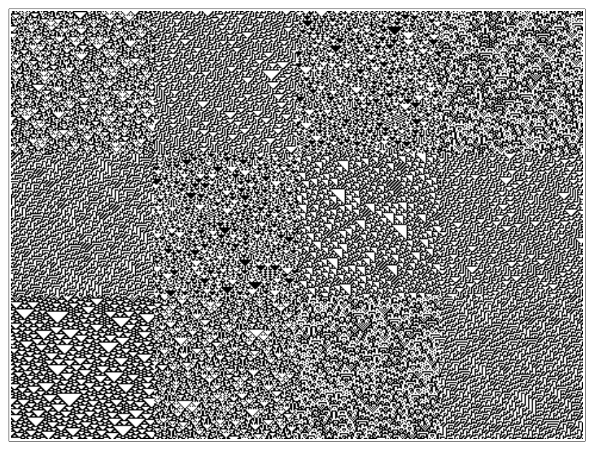
<!-- ORIGINAL_FIGURES page=0594 end -->

由各种一维元胞自动机规则生成的斑块。每个斑块都被设置为黑白方格数量大致相等。但尽管如此，我们的视觉系统很快就会注意到不同斑块具有不同纹理。想必这是因为视觉系统自动识别了每个斑块中的特定特征。每个人看到这幅图时似乎都会立刻看到某些斑块。但在看了一会儿之后，斑块之间的边界似乎会变得更清楚一些。

那么这是怎样工作的？基本答案似乎是：我们的眼睛和大脑中有一些神经细胞，被设置为响应眼睛视网膜上形成图像中的特定局部图案。

这个过程的形成方式似乎令人惊讶地直接。在我们视网膜上大约一亿个感光细胞后面，是一系列神经细胞层，先在眼中，然后在脑中。这些细胞之间的连接被设置成，使视觉皮层中的某个给定细胞通常只会从视网膜上一个相当小的区域中的细胞接收输入。如果这个区域某一部分中的图像比如被涂成白色，那么其中一些输入会为正；如果被涂成黑色，另一些输入会为正。随后视觉皮层中的这个细胞只有在足够多输入为正时才会响应，对应于图像中存在某种特定图案。

[[PDF page 595]]

<!-- ORIGINAL_FIGURES page=0595 start -->
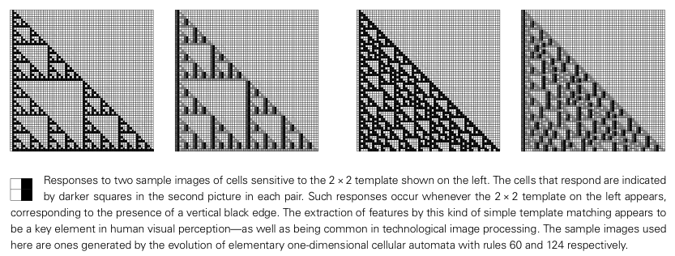
<!-- ORIGINAL_FIGURES page=0595 end -->

实践中，这种设置的许多细节都相当复杂。但作为一种简单理想化，可以考虑视网膜上的一个方格阵列，其中每个方格或黑或白。然后可以假定，视觉皮层中有一个对应的细胞阵列，每个细胞从比如一个 `2 x 2` 方格块接收输入，并遵循这样的规则：只要这些方格的颜色形成某个特定图案，它就响应。

下面的图像显示了一个简单例子。每种情况下，第一幅图显示视网膜上的图像，第二幅图显示哪些细胞对它响应。对于这里使用的特定规则，实际发生的是原始图像中的垂直黑色边缘被挑出。

对两个样本图像中对左侧所示 `2 x 2` 模板敏感的细胞响应。响应的细胞在每对图的第二幅中用较深的方格表示。只要左侧 `2 x 2` 模板出现，就会发生这样的响应，对应于存在一条垂直黑色边缘。通过这种简单模板匹配来提取特征，似乎是人类视觉感知中的一个关键元素，在技术图像处理中也很常见。这里使用的样本图像是初等一维元胞自动机分别按规则 60 和 124 演化产生的图像。

神经生理学实验提示，视觉皮层中的细胞会响应各种特定种类的图案。作为一种简单理想化，下一页的图像显示了当细胞分别响应 16 种可能的黑白方格 `2 x 2` 排列时会发生什么。每种情况下，人们都可以把结果看作对应于在原始图像中挑出某种特定局部特征。

[[PDF page 596]]

<!-- ORIGINAL_FIGURES page=0596 start -->
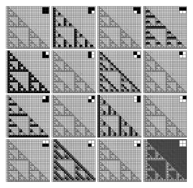
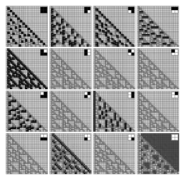
<!-- ORIGINAL_FIGURES page=0596 end -->

样本图像中，对上一页 16 种可能黑白方格局部排列各自敏感的细胞响应。每种情况下，所得图案可以被看作原始图像的过滤版本，其中只有表现出特定特征的部分被保留。这些图案也可以被看作二维块元胞自动机演化一步后的输出，其中规则指定：如果一个块具有所示元胞排列，它就变暗；否则变亮。深色块相对稀疏，是因为在任何给定位置，一个深色块只能出现在所示 16 种情况之一中。许多所示情形中完全没有深色块，可以看作反映了由一维元胞自动机规则构造图像所引入的约束。

那么，这种非常简单的过程真的是我们看似复杂的图案和纹理感知背后的基础吗？我强烈怀疑，在很大程度上确实如此。不过，一个重要细节是，视觉皮层中有些细胞实际上从视网膜上更大的区域接收输入。但作为一种简单理想化，可以假定这类细胞最终只是响应基本 `2 x 2` 图案的重复版本。

有了这种设置，面对页上的图像显示了，对于像第 578 页那样的图像会发生什么。结果有些惊人。因为尽管整幅图像中黑白方格的平均密度完全相同，我们却看到，在不同斑块中最终被挑出的特征具有不同密度。而我怀疑，正是这一点让我们把不同斑块看成具有不同纹理。

[[PDF page 597]]

<!-- ORIGINAL_FIGURES page=0597 start -->
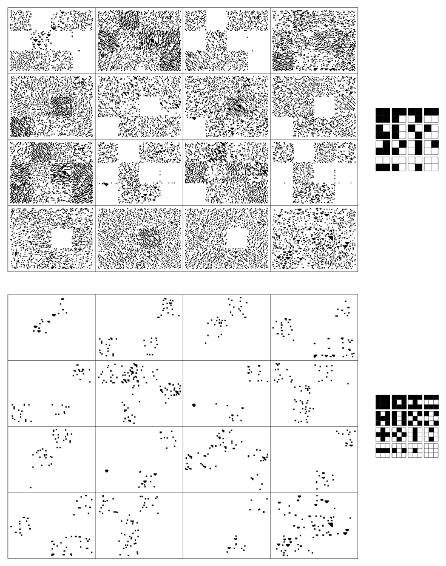
<!-- ORIGINAL_FIGURES page=0597 end -->

对第 578 页图像较小版本的响应，响应细胞对所有 16 种可能的 `2 x 2` 块以及它们的重复性 `3 x 3` 扩展敏感。在原始图像中看起来具有不同纹理的斑块，可以看到含有这些不同块的特征性不同密度。我强烈怀疑，正是这类密度差异让我们的视觉系统能够区分纹理。

[[PDF page 598]]

<!-- ORIGINAL_FIGURES page=0598 start -->
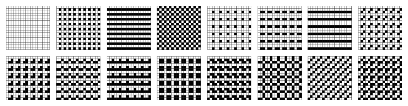
<!-- ORIGINAL_FIGURES page=0598 end -->

就像我们通过红、绿、蓝的密度来区分颜色一样，看来我们也很可能通过某些局部特征的密度来区分纹理。当我们看一幅图像时，这件事发生得如此之快，无疑是因为挑出这些特征的过程非常简单，可以由我们眼睛和大脑中大量相互独立的细胞并行轻易完成。

不过，对于图案和纹理，不像对于颜色，我们总能超越视觉系统提供的即时印象。因此，例如通过有意识地努力，我们可以用眼睛扫描一幅图，依次仔细查看不同部分，并比较我们想要的任何细节。

但用这种方式我们可以期望判断出哪些东西呢？如下图所提示的，通常很容易看出一幅图像是否纯粹重复，即使重复的块相当大也是如此。

由 `2 x 2` 和 `3 x 3` 块阵列能够形成的所有不同重复图案的例子。在每一种情况下，用眼睛都很容易识别纯重复的存在。注意，在通过重复某个特定块生成的图案中，通常还会有其他按不同对齐方式出现的块。第 215 页显示了基于约束的系统中得到的图案，其中人们实际上要求只有某些块或块集合出现。

但对于嵌套，情况就很不一样。面对页上的八幅图像都是由所示二维替换系统生成的，因此对应于纯粹嵌套图案。但除了每一行最后一幅图像以外，这些图像恰好由大面积本质上均匀的颜色主导，我们极其难以判断这些图案是嵌套的。这可以被看作我们视觉感知能力局限的一个清楚例子。

正如我们在两节之前发现的，许多标准数据压缩方法也有同样局限。但在该节结尾，我显示了二维基于指针编码这个相当简单的过程

[[PDF page 599]]

<!-- ORIGINAL_FIGURES page=0599 start -->
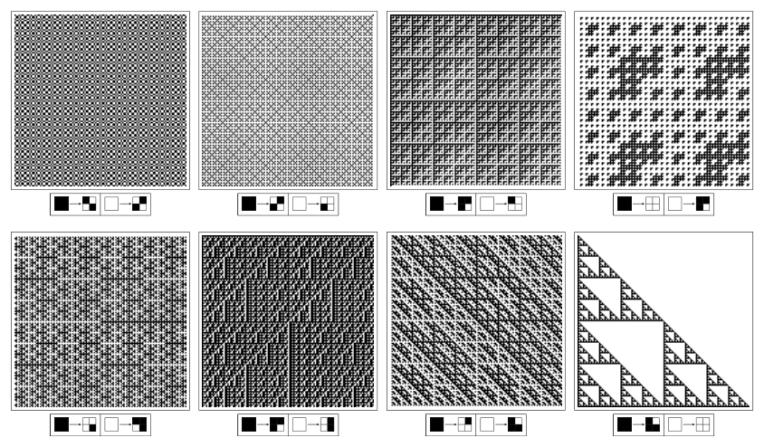
<!-- ORIGINAL_FIGURES page=0599 end -->

会成功识别嵌套。因此并不是嵌套以某种方式从根本上难以识别；只是人类视觉感知中碰巧出现的特定过程通常没有设法做到这一点。

按照所示二维替换规则生成的嵌套图案例子。除了每行最后一个例子外，即使相当仔细地审视，也极难用眼睛识别这些图案中的嵌套结构。不过，第 571 页的二维基于指针的编码方案确实能够在所有情况下识别该结构。

那么随机性呢？下一页的图像显示了一些具有不同随机性程度的图像例子。仅仅通过观察这些图像，极其难以判断其中哪一幅事实上最随机。

基本问题在于，我们的视觉系统会让我们注意到局部特征，例如黑色方格成团，即使它们的密度与完全随机阵列中应有的密度一致。结果，就像面对星座一样，即使在完全随机的图案中，我们也倾向于识别出看起来像规律性的东西。

原则上，也许会有一些图像，其中我们的视觉系统基本不注意到任何局部特征。事实上，

[[PDF page 600]]

<!-- ORIGINAL_FIGURES page=0600 start -->
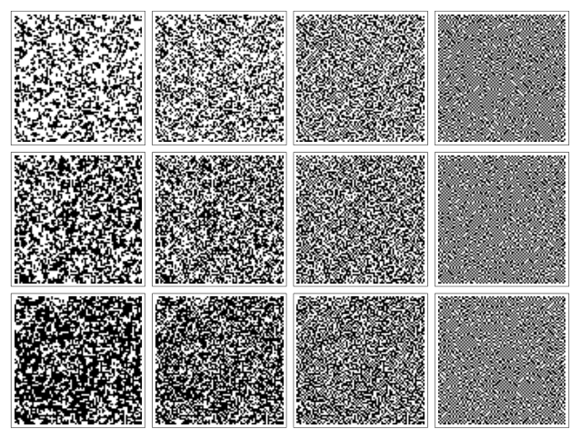
<!-- ORIGINAL_FIGURES page=0600 end -->

近似完美随机性的图像例子。每一行第二幅图像中的方格被独立选择为黑色，概率分别为 0.4、0.5 和 0.6。在其他图像中，各种特征被添加或移除。在每一行第一幅图像中，如果任何方格被四个颜色相同的方格包围，那么该方格就被迫具有同样颜色。在第三幅图像中，任何颜色相同的方格团块都通过反转中心方格的颜色被打散。在第四幅图像中，对颜色相同的方格线也做同样处理。

上面每一行最后两幅图像中，颜色相同的所有方格团块，以及随后颜色相同的所有方格线，确实都被显式移除了。乍看之下，这些图像在某些方面似乎更随机。但只要我们的视觉系统包含会响应每一种可能方格局部排列的元素，就不可避免地会在绝对任何图像中识别出某种特征。

实践中，想必有一些局部图案类型会比其他类型更强烈地引发我们视觉系统的响应。知道这种层级之后，人们应当能够产生在某种意义上对我们来说显得尽可能随机的图像。但不可避免的是，这样的图像反映的更多会是我们视觉感知过程的细节，而不是关于实际底层随机性的任何东西。

[[PDF page 601]]

<!-- ORIGINAL_FIGURES page=0601 start -->
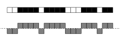
<!-- ORIGINAL_FIGURES page=0601 end -->

## 听觉感知

在本书中，我大量使用了图像。那么为什么不也使用声音呢？除了声音显然不能直接包含在印刷书中之外，还有一个问题：人们可以按自己想要的任意速度研究图像的细节，而声音在某种意义上一旦播放结束就消失了。

但日常经验非常清楚地表明，人们仍然可以通过聆听声音学到很多。那么，我们的听觉系统能够挑出的声音特征究竟是什么？

在根本层面，所有声音都由快速振动的模式组成。我们听见声音的方式，是这些振动被传递到内耳中的毛细胞阵列。内耳的力学结构被设置成，使每一排毛细胞最终都对某个特定频率的振动特别敏感。因此，这意味着我们关于声音最倾向于感知到的，就是它们包含的频率。

音乐音符通常只有一个基本频率，而浊语音音素有两三个。但来自自然系统，或来自本书中我们研究过的那类系统的声音，又怎样呢？

人们可以想象用这类系统生成声音的若干方式。右侧所示的一个简单办法，是考虑系统产生的元素序列，然后让每个元素对应于一个短暂时间内，例如千分之一秒内，朝两个方向之一的振动。

一个离散元素序列，以及一种可能对应的声音波形。

那么，这样的声音是什么样的？如果元素序列是重复的，那么人们听到的本质上就是某个特定频率上的纯音，非常类似音乐音符。但如果序列是随机的，那么人们听到的只是无定形的嘶声。

这些极端之间会发生什么？如果一个序列的性质随着时间以明确方式逐渐改变，那么人们常常可以在对应声音中听出这种变化。但如果序列具有或多或少均匀的性质呢？我们的听觉系统能在其中检测出哪些规律性？

[[PDF page 602]]

<!-- ORIGINAL_FIGURES page=0602 start -->
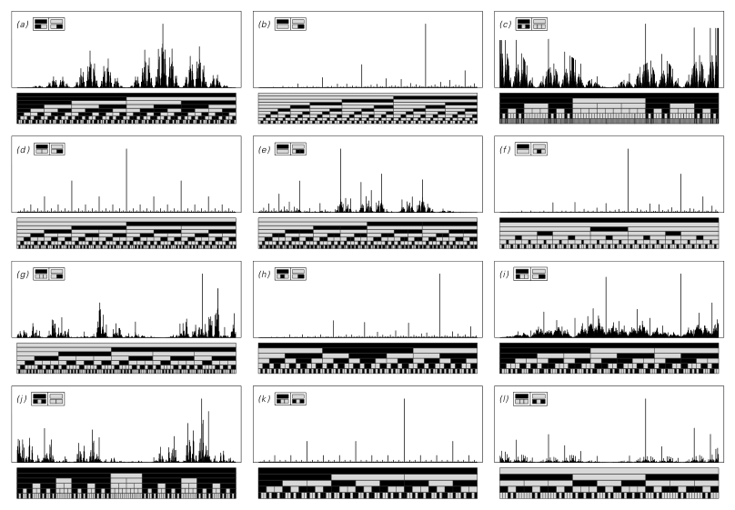
<!-- ORIGINAL_FIGURES page=0602 end -->

答案似乎出奇地简单：我们很容易识别明确频率上的精确或近似重复，而除此之外基本什么也识别不了。因此，如果我们聆听嵌套序列，例如我们并没有直接方法判断它们是嵌套的；事实上，我们似乎只对出现的频率谱中的一些相当简单特征敏感。

下面的图像显示了由各种简单一维替换系统产生的嵌套序列所得到的频谱。这些频谱的多样性相当惊人：有些具有简单嵌套形式，由特定频率上的少数孤立峰主导；另一些则具有覆盖大范围频率的相当复杂形式。

由一维邻域无关替换系统生成的嵌套序列的频谱。规则与第 83 和 84 页所示相同。注意，其中既有孤立峰，也有复杂背景图案。如果一个序列对应于纯音并且每 `n` 个元素重复一次，那么它的频谱将由 `n/2` 个等间距峰组成。频谱中没有主导峰的序列通常听起来像随机噪声，尽管有时可以听到显式的时间变化；事实上，序列 (c) 听起来就像一连串理想化的青蛙叫声。强度谱或功率谱通过对所示量平方得到。

[[PDF page 603]]

<!-- ORIGINAL_FIGURES page=0603 start -->
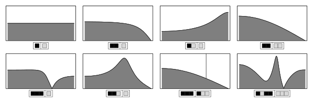
<!-- ORIGINAL_FIGURES page=0603 end -->

而如果只给出替换系统的底层规则，事实证明甚至很难大致判断频谱会是什么样。但给定频谱之后，人们就可以立刻判断我们会怎样感知声音。当频谱只由一个大峰主导时，我们听到一个明确音调。当有两个大峰时，我们通常也会听到明确音调。但随着峰的数量增加，追踪它们很快变得不可能，我们最终只听到随机噪声，即使这些峰的频率碰巧是常见音乐和弦的比例也是如此。

因此结果是，我们的耳朵对许多嵌套序列的频谱中看到的大部分精巧结构并不敏感。事实上，似乎只要频谱覆盖任何宽广频率范围，除了非常大的峰之外，其他峰都往往会完全被掩盖，就像日常生活中，如果一个声音要在背景噪声中被听到，它必须足够响。

那么，序列中的其他种类规律性又怎样呢？如果一个序列基本是随机的，但包含某些短程相关，那么这些相关会导致频谱中的平滑变化。例如，由特定块随机次序串接而成的序列，可以产生下面所示的任何类型频谱，并且可以分别听起来像嘶声、低吼声或汩汩声。

通过按随机顺序串接块而得到的长序列的频谱。这类频谱可以用随机分析中的相当标准方法计算。所示第一种情形对应于白噪声。倒数第二种情形在每第三个位置总有一个黑色元素，因此在对应重复频率上表现出一个峰。

要得到具有更精巧结构的频谱，需要长程相关，如嵌套序列中存在的相关。但就我所能判断的而言，最终对我们的听觉系统重要的相关类型，只有那些导致某种重复的相关。

[[PDF page 604]]

因此归根结底，一个系统行为中任何超越纯重复的特征，都会在我们的耳朵听来基本是随机的。

## 统计分析

当涉及研究大量数据时，现代科学中几乎排他性使用的方法是统计分析。那么，这样的分析涉及哪些过程？实践中通常做的是从原始数据中计算各种相当简单的量，然后用这些量的值评估可能提供数据摘要的模型。

大多数统计分析在根本上基于这样一种假定：这些模型必须是概率性的，也就是说，它们只给出行为的概率，而不具体说明行为将是什么。在不同情况下，使用这种概率模型的理由有所不同；但在本书的发现之前，一个关键点是，人们似乎难以想象，会存在确定性模型能够重现实践中经常看到的那种复杂性和表观随机性。

如果人们有一个确定性模型，那么至少在原则上，要判断这个模型是否正确相当直接：只需把模型预测的任何具体行为与人们观察到的行为比较。但如果人们有一个概率模型，那么评估它的有效性就是一件困难得多的事。事实上，统计学领域许多技术发展以及许多广为人知的问题，都可以追溯到这个问题。

作为一个简单例子，考虑一个模型，其中所有可能的黑白方格序列都被假定以相等概率出现。通过有效枚举所有这样的序列，很容易看出，这个模型预测在任意特定序列中，黑色方格比例最可能是 `1/2`。

[[PDF page 605]]

但如果实际观察到的一个序列 10 个方格中有 9 个黑色呢？尽管这不是最可能看到的情况，人们当然不能因此就断定模型错了。因为这个模型并没有说这样的序列不可能；它只是说它们大约只应在 1% 的时间里出现。

事实上，如果没有更多信息，就没有一种有意义的方式能推断模型正确性的任何绝对概率。因此，实践中几乎总是做这样的事：不只考虑单个模型，而是考虑一整类模型，然后试图识别这个类中哪一个模型最好，例如用它生成观测数据的似然尽可能大这一准则来衡量。

对于黑白方格序列，一个可以考虑的简单模型类，是每个方格都以某个固定独立概率 `p` 取黑色的模型。给定一组原始数据，寻找这个类中哪个模型最佳的过程，例如按最大似然准则衡量，极其直接：只需计算数据中黑色方格的比例，这个值就立刻给出最佳模型的 `p` 值。

那么，更复杂的模型又怎样？例如，不把每个方格的颜色看作完全独立地选择，而是可以让某个给定长度的方格块一起选择颜色。在这种情况下，最佳模型同样很容易找到：它只是把不同块的概率取为这些块在数据中出现的频率。

然而，如果人们不预先决定块长度，那么事情会变得更复杂。因为在这种情况下，人们总可以编造一个极端模型，其中只允许一个非常长的块，而这个块正好就是数据中观察到的序列。

不用说，对于大多数目的，这样的模型不会被认为特别有用，而且它当然没有成功提供数据的任何短摘要。但要以系统方式排除这样的模型，就需要超越最大似然这类准则，并以某种方式显式考虑模型本身的复杂性。

[[PDF page 606]]

<!-- ORIGINAL_FIGURES page=0606 start -->
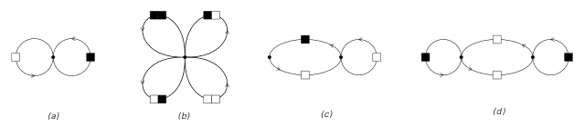
<!-- ORIGINAL_FIGURES page=0606 end -->

对于特定类型的模型，人们可以提出各种准则，例如基于模型所含独立数值参数的数量。但一般来说，弄清对任意给定数据集什么模型最合适，是一个极其困难的问题。事实上，正如第 8 章开头讨论的那样，从某种意义上说，它是任何经验科学方法中的核心问题。

不过，传统统计分析通常远未到必须面对这类问题的程度。因为它通常把自身限制于非常特定的模型类，而且通常是即使按本书标准看也极其简单的模型。对于黑白方格序列，例如像上面那样仅仅给固定方格块分配概率的模型，是远远最常见的。另一种通常被认为相当高级的做法，是通过查看这类序列在如下所示网络中对应的路径，来给序列分配概率。

定义概率模型的网络。每个网络中的每条连接都有某个概率与之相关联，模型把黑白方格序列看作通过按这些概率在网络中追踪路径而生成。情形 (a) 和 (b) 是所谓 Markov 模型，实际上不涉及记忆，等价于上面讨论的模型。情形 (c) 和 (d) 对应于所谓隐 Markov 模型，带有某些短期记忆。

网络 (a) 和 (b) 表示上面已经讨论过的情形。网络 (a) 指定连续方格的颜色应当独立选择，而网络 (b) 指定应当对连续方格对这样做。不过，网络 (c) 指定：取决于路径已经到达网络中的左节点还是右节点，应使用不同概率。但至少

[[PDF page 607]]

<!-- ORIGINAL_FIGURES page=0607 start -->
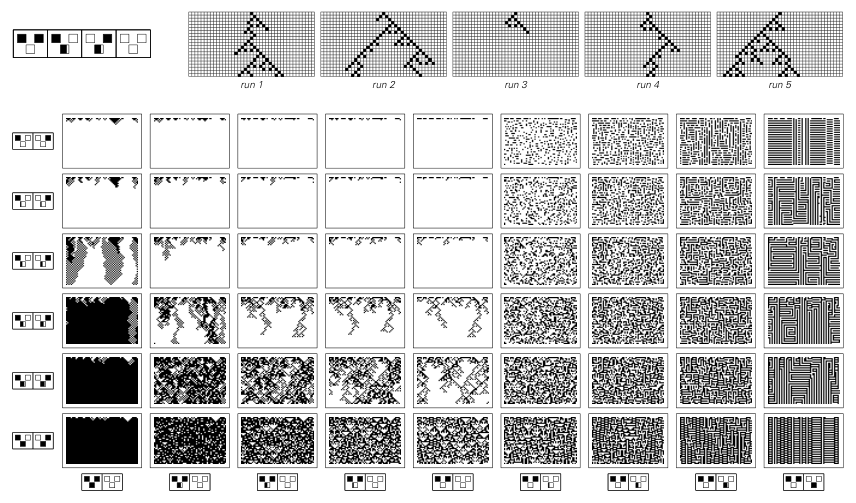
<!-- ORIGINAL_FIGURES page=0607 end -->

只要网络结构保持不变，即使在这种情况下，从给定数据集推断网络中哪些概率为数据提供最佳模型也相当容易，因为本质上需要做的只是沿着对应于数据的路径前进，并查看从每个节点出发的每条连接最终被使用的频率。

那么二维数据又怎样？根据第 5 章的讨论，可以得出，在这种情况下无法构造上述概率模型类型的直接类似物。但作为替代，事实证明可以使用一维元胞自动机的概率版本，如下图所示。

概率元胞自动机的例子，其中规则指定：给定上一步两个邻居的颜色，每种元胞颜色生成的概率是多少。因为规则是概率性的，所以每次运行元胞自动机时通常都会得到不同的详细演化图案，如上方一行图像所示。尽管如此，任何特定概率元胞自动机通常都会表现出某种特征性的整体行为图案，如上方图像阵列所示。注意，相变相当常见，在这种情况下，底层概率的连续变化会导致典型行为的离散变化。概率元胞自动机可以被看作所谓有向渗流模型的推广。

[[PDF page 608]]

<!-- ORIGINAL_FIGURES page=0608 start -->
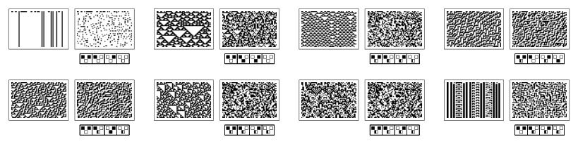
<!-- ORIGINAL_FIGURES page=0608 end -->

这类元胞自动机的规则通过给每种可能元胞邻域分配生成每种颜色元胞的某个概率来工作。对于任何特定邻域形式，要为任意给定数据集找到最佳模型，也同样相当直接。因为本质上需要做的只是计算，在数据中每种可能邻域之下，每种颜色的元胞以什么频率出现。

但这样得到的结果有多好呢？如果看整体黑色元胞密度这类量，而这些量实际上正是寻找模型时使用过的，那么不可避免地，得到的结果看起来相当不错。但只要看下面这样的显式图像，就会立刻看到原始数据和模型给出的结果之间存在显著差异。

普通元胞自动机生成的数据与被认为最适合它的概率元胞自动机之间的比较。虽然黑色元胞密度等性质通常被设置为在数据和模型之间一致，但图像清楚显示，更细节的特征并不一致。

在大多数情况下，模型产生的典型行为看起来比数据随机得多。事实上，在某种层面上这并不令人惊讶：因为使用概率模型时，人们在某种意义上是从随机性的假定出发。

模型可以引入某些规律性，但这些规律性似乎几乎从来不足以迫使数据中除相当简单特征以外的任何东西被正确重现。

不用说，就像大多数其他感知与分析形式一样，统计分析通常并不以寻找数据的精确而完整表示为目标。相反，它的目的通常只是

[[PDF page 609]]

提取某些与对数据作出特定结论相关的特征。

一个基本例子是试图确定某个给定序列是否可以被认为完全随机，还是它包含某种明显规律性。

从统计分析角度看，如果一个序列在某种意义上与所有可能序列以相等概率出现的模型一致，那么它就是完全随机的。

但怎样判断是否如此？实践中通常做的是取一个给定序列，从中计算各种特定量的值，然后把这些值与通过查看所有可能序列得到的平均值比较。

因此，例如可以计算某个给定序列中黑色方格的比例，并把它与 `1/2` 比较。或者可以计算超过两个连续黑色方格连在一起出现的频率，并把它与对所有可能序列求平均得到的值 `1/4` 比较。

如果发现从某个特定序列计算出的值接近所有可能序列的平均值，那么可以把这看作该序列确实随机的证据。但如果发现这个值离平均值很远，那么可以把这看作该序列不随机的证据。

下一页顶部的图像显示了对各种序列中不同块频率进行计算的结果，每种情况下，每一连续行都显示某个给定长度的所有可能块的结果。每一行上的灰度水平都被设置成，使所有可能序列的平均值对应于下面显示的均匀灰色图案。因此，任何偏离这种均匀灰色的情形，都可能提供偏离随机性的证据。

我们看到，在前三幅图像中存在许多明显的这类偏离，而在剩余图像中没有明显偏离。因此，很容易由此得出结论：前三个序列肯定不是随机的，而剩余序列仍可能是随机的。

[[PDF page 610]]

<!-- ORIGINAL_FIGURES page=0610 start -->
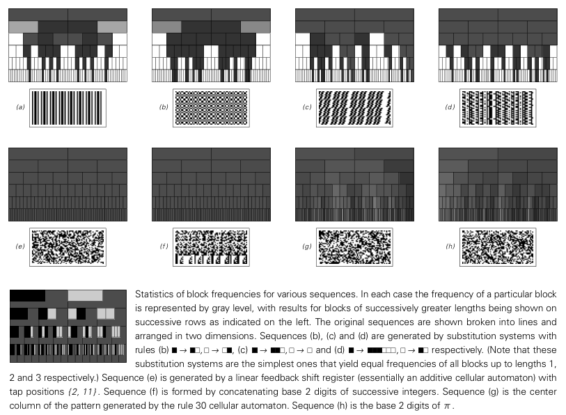
<!-- ORIGINAL_FIGURES page=0610 end -->

各种序列的块频率统计。每种情况下，一个特定块的频率由灰度水平表示，连续更长的块的结果显示在连续行上，如左侧所示。原始序列被断成行并排列成二维形式。序列 (b)、(c) 和 (d) 分别由替换系统生成，规则如图所示。（注意，这些替换系统是能分别产生长度到 1、2 和 3 的所有块等频率的最简单系统。）序列 (e) 由抽头位置为 `{2, 11}` 的线性反馈移位寄存器生成，本质上是一个加性元胞自动机。序列 (f) 由连续整数的 2 进制数字串接而成。序列 (g) 是规则 30 元胞自动机产生图案的中心列。序列 (h) 是 `pi` 的 2 进制数字。

序列 (a) 当然不是随机的；事实上它是纯粹重复的。一般说来，很容易看出，在任何纯粹重复的序列中，超过某个长度后必定有许多块的频率远非相等。

事实证明，嵌套序列也同样如此。在上图中，序列 (b)、(c) 和 (d) 都是嵌套的。

但剩余序列又怎样？序列 (e) 和 (f) 似乎在每种情况下都给出与所有可能序列求平均所得结果精确对应的频率。序列 (g) 和 (h) 给出相当类似的结果，但表现出某些明确波动。

那么，这些波动是否代表序列 (g) 和 (h) 事实上并非随机的证据？如果查看所有可能序列的集合，人们可以相当容易地计算任意特定块频率的分布。根据这个分布，人们可以判断，对于一个真正随机选择的序列，给定偏离平均值的情形会以什么概率发生。

[[PDF page 611]]

结果表明，这与图像 (g) 和 (h) 中看到的情况相当一致。但它与图像 (e) 和 (f) 中看到的情况相差很远。因此，尽管单个块频率似乎提示序列 (d) 和 (e) 是随机的，但这些频率缺乏任何扩散，提供了它们事实上并非随机的证据。

那么，序列 (g) 和 (h) 最终是否真正随机？就像本章讨论的其他序列一样，它们在某种意义上不是，因为二者都能由简单底层规则生成。但面对页上的图像展示的是，如果人们只通过计算块频率来做统计分析，就看不到任何这种底层简单性的证据。

人们也许会想，如果计算其他量，就能立刻找到这样的证据。但事实证明，人们可能考虑计算的许多显然的量，最终都等价于块频率的各种组合。也许正因为如此，有时人们曾认为，如果只要能计算所有长度块的频率，就会有一种普遍的随机性检验。但面对页上的序列 (e) 和 (f) 清楚表明，情况并非如此。

那么，在做统计分析时，最终可以使用哪些量？答案是，至少在原则上可以使用任何量，特别是可以使用本章到目前为止讨论过的任何感知与分析过程所产生的量。因为每种情况下，需要做的只是从某个特定数据序列计算一个量的值，然后把这个值与对所有可能序列求平均得到的结果比较。然而在实践中，序列统计分析中实际使用的量往往相当有限。事实上，除了块频率之外，唯一常见的其他量是基于相关、频谱，有时还有游程长度的量，而这些我们已经在本章前面讨论过。

不过，一般来说，人们可以想象取绝对任何过程，并把它用作统计分析的基础。给定某个

[[PDF page 612]]

特定过程，人们可以把它应用到一段原始数据上，然后查看结果与从所有可能序列得到的结果相比如何。

如果这个过程足够简单，那么通过传统数学有时可以相当完整地弄清所有可能序列会发生什么。但在绝大多数情况下，这是做不到的。因此在实践中，别无选择，只能与从某个相当有限的可能序列集合抽样得到的结果比较。

在这些情况下，要注意到平均行为的细微偏离就变得相当不现实。因此，唯一可靠的策略通常只是寻找这样的情况：特定数据片段的结果与典型序列的结果之间存在巨大差异。因为任何这样的差异都提供了清楚证据，表明该数据事实上不能被认为是随机的。

作为简单过程应用于数据时可能发生什么的一个例子，面对页上的图像显示了按照各种元胞自动机规则演化的结果，其初始条件由第 594 页的序列给出。每一行中的第一幅图像展示每个元胞自动机的典型行为。关键在于，如果用作其他图像初始条件的序列要被认为是随机的，那么它们产生的行为应当与典型行为类似。

但我们看到，在许多情况下，实际得到的行为显著不同。这意味着，在这类情况下，基于简单元胞自动机的统计分析成功识别出这些序列事实上并非随机。

那么像 (g) 和 (h) 这样的序列又怎样？对于这些序列，这里显示的简单元胞自动机规则没有一个产生能轻易与典型情形区别开的行为。事实上，对于我搜索过的所有简单元胞自动机，我发现的也是这样。

因此我们必须得出结论：正如本章讨论的所有其他感知与分析方法一样，统计分析即使经过某些推广，也不能轻易识别出像 (g) 和 (h) 这样的序列并非完全随机，即使在底层层面上，这些序列由相当简单的规则生成。

[[PDF page 613]]

<!-- ORIGINAL_FIGURES page=0613 start -->
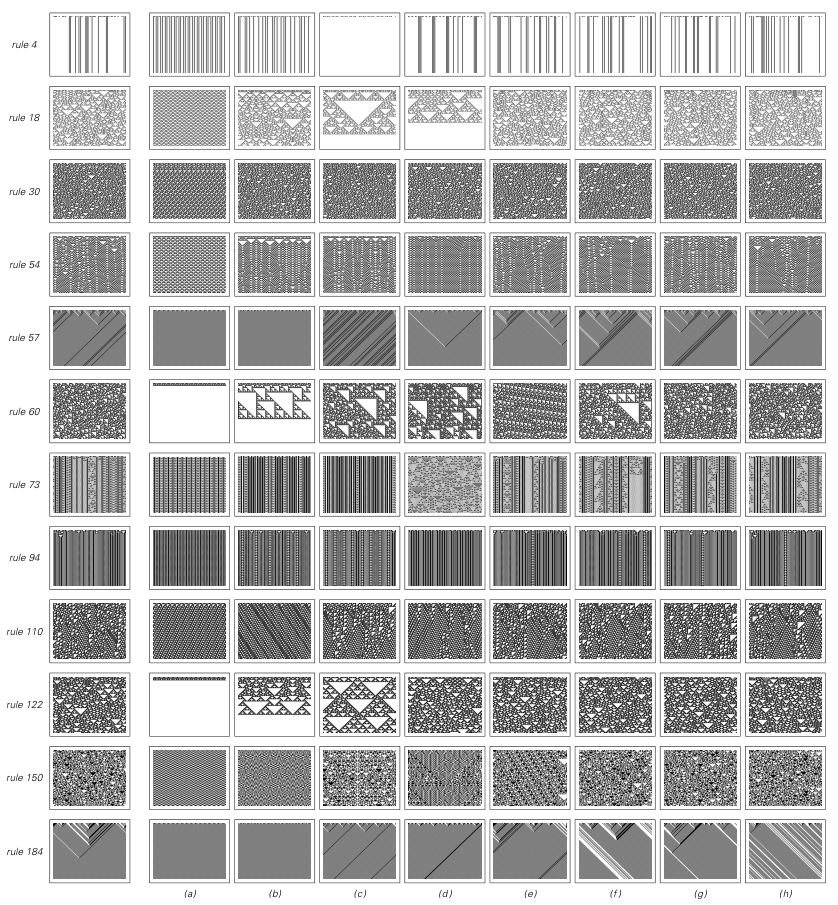
<!-- ORIGINAL_FIGURES page=0613 end -->

把各种元胞自动机演化规则应用到第 594 页序列的例子。每一行最左端的图像被选择来显示给定任意初始条件时每个元胞自动机的典型行为。每个元胞自动机规则实际上对应一种不同的统计分析过程。规则 4 挑出孤立黑色元胞。规则 60 本质上为元素序列构造差分表。规则 57 和 184 检验黑色元胞的整体密度。（如第 136 页所示，情形 (h) 中规则 184 下白色条纹占多数是一种波动。）

[[PDF page 614]]

<!-- ORIGINAL_FIGURES page=0614 start -->
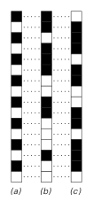
<!-- ORIGINAL_FIGURES page=0614 end -->

## 密码学与密码分析

密码学的目的是通过加密消息来隐藏消息内容，使其除了给定了特殊解密密钥的人之外无法识别。密码分析的目的则是击败这一点，寻找不被给定密钥而解密消息的方法。

左侧图像显示了一种加密由黑白方格序列表示的消息的标准方法。基本思想是有一个加密序列，如左侧 (b) 列所示；然后从原始消息 (a) 得到消息的加密版本 (c)，方法是凡是加密序列 (b) 中对应方格为黑色，就反转原始消息中对应方格的颜色。

加密方案例子。从原始消息 (a) 出发，通过反转每个对应于加密序列 (b) 中黑色方格的位置的方格颜色，生成加密消息 (c)。这个方案是几乎所有实用流密码的基础。

那么，如果人们收到加密消息 (c)，怎样恢复原始消息 (a)？如果知道加密序列 (b)，那就很直接。因为所需做的只是重复用于加密的过程：凡是 (b) 中对应方格为黑色，就反转 (c) 中的方格颜色。

但怎样安排只有消息的目标接收者知道加密序列 (b)？在某些情形中，或许可行的是以某种安全方式传输整个加密序列。但更常见的是，人们只能以安全方式传输某个短密钥，然后必须从这个密钥生成加密序列。

那么，可以使用什么样的过程从密钥得到加密序列？面对页顶部的图像显示了一种极其简单的方法，直到不到一个世纪以前，它还在实际密码学中广泛使用。其思想只是通过反复循环密钥中的元素来形成加密序列。正如图中所示，把它与原始消息结合，会得到一个加密消息，其中原始消息中的至少一部分结构被遮蔽。

但也许并不令人意外的是，在这种情况下做密码分析相当容易。因为如果人们能够弄清加密序列中任何足够长片段是什么，那么这会立刻给出密钥，

[[PDF page 615]]

<!-- ORIGINAL_FIGURES page=0615 start -->
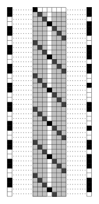
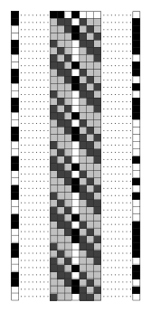
<!-- ORIGINAL_FIGURES page=0615 end -->

并且从密钥可以立刻生成加密序列的其余全部部分。

一个简单加密系统例子，其中加密序列通过反复循环密钥元素得到。图中显示了用两个不同密钥加密。每种情况下，原始消息在左，加密消息在右，加密序列对应于高亮的元胞列。这个系统本质上是 1500 年代到 1900 年代早期广泛使用的那类维吉尼亚密码。

那么，为了找到加密序列中的一个片段，需要什么样的分析？在一种极端但实践中常见的情况下，人们也许碰巧知道原始消息中某些部分是什么，可能是标准问候语之类；通过比较这些部分的原始形式和加密形式，就能立刻推断出加密序列对应部分必定是什么。

即使只知道原始消息使用某种确定语言，这通常也已经足够。因为这意味着在原始消息中会有某些块，例如对应英语中 “the” 这样的词，比其他块出现得频繁得多。由于这类块只要出现在加密序列重复周期的同一点上，就必定以同样方式被加密，因此它们会在加密消息中导致偶然重复，而这类重复的间距总是加密序列重复周期的某个倍数。因此，只要查看重复之间的间距分布，人们就可以期望确定加密序列的重复周期。

一旦这一点已知，通常就相当容易找到实际密钥。因为人们可以从加密消息中挑出所有在加密序列重复周期中某一点出现的方格，它们因此都使用密钥中的某个特定元素加密。然后可以询问这些方格是更常为黑色还是更常为白色，并可以把这个结果与查看原始消息语言中字母频率得到的结果比较。如果这两个结果相同，那么它提示密钥中的对应元素为白色；如果它们不同，则提示该元素为黑色。一旦找到候选密钥，只要试着用它恢复原始消息中某个相当长的部分，就很容易检查该密钥是否正确。因为除非拥有正确密钥，否则恢复出的内容在原始消息语言中有意义的机会绝对可以忽略。

[[PDF page 616]]

<!-- ORIGINAL_FIGURES page=0616 start -->
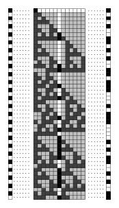
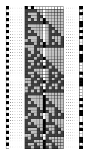
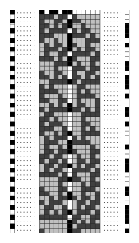
<!-- ORIGINAL_FIGURES page=0616 end -->

那么，如果用更复杂的规则从密钥生成加密序列，会发生什么？事实证明，像上面这样的方法仍然允许找到加密序列的特征。因此，要让密码学起作用，就必须做到：即使人们知道加密序列的某些特征或部分，也仍然难以推断原始密钥，或者以其他方式生成序列的其余部分。

下面的图像显示了一种生成加密序列的方法，它在电子密码学早期曾被广泛使用，如今有时仍被使用。基本思想是在有限宽度的寄存器中观察一个加性元胞自动机的演化。密钥给出元胞自动机的初始条件，而加密序列则例如通过在连续步骤中采样某个特定元胞提取出来。

使用规则 60 加性元胞自动机进行加密。这本质上等价于一个线性反馈移位寄存器。

[[PDF page 617]]

<!-- ORIGINAL_FIGURES page=0617 start -->
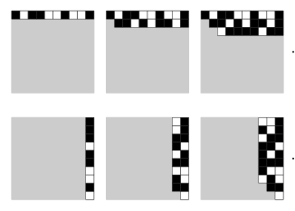
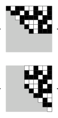
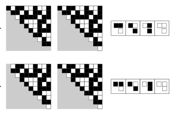
<!-- ORIGINAL_FIGURES page=0617 end -->

那么，给定这样的加密序列，是否有容易的方法做密码分析，反向求出密钥？

事实证明有。如下图所示，在这里考虑的这种加性元胞自动机中，底层规则具有这样的性质：它不仅允许人们从上一行推断某一行的形式，还允许人们从右侧相邻列推断某一列的形式。这意味着，如果人们有加密序列的某个片段，对应于某列的一部分，那么就可以立刻用它推断出一系列其他列的形式，由此找到元胞自动机中某一行的形式，从而得到原始密钥。

加性元胞自动机密码分析基础的一个例子。第一组图像显示规则 60 元胞自动机的普通演化，其中每一连续行由其上一行推断出。第二组图像显示一种横向演化，其中规则被重新解释，以便允许从紧邻右侧的一列元胞推断出一列元胞。注意，在两种情况下，如果不知道比图中所示更多初始元胞的颜色，右下区域中元胞的颜色都无法确定。

但如果加密序列并不包含某个特定列中的每一个元胞，会发生什么？这时不能立刻使用上面描述的方法。但事实证明，底层规则的加性仍然使相对直接的密码分析成为可能。

下一页的图像显示了它怎样工作。由于加性，事实证明，人们只要查看顶部一行中特定位置上的黑色元胞数量是奇数还是偶数，就可以推断某一列向下若干步处的某个元胞是否为黑色。然后可以立刻

[[PDF page 618]]

<!-- ORIGINAL_FIGURES page=0618 start -->
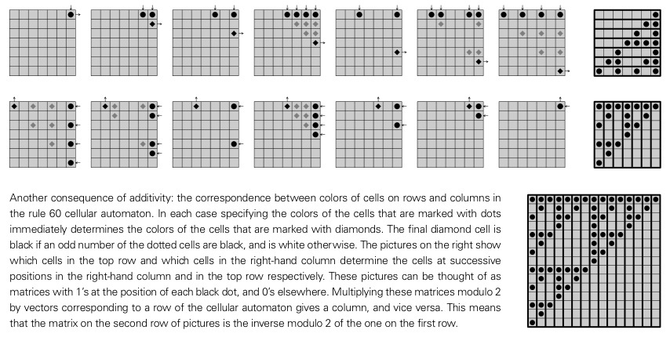
<!-- ORIGINAL_FIGURES page=0618 end -->

反转这个过程，从给定列中某些元胞组合的颜色推断某一行中元胞的颜色。

加性的另一个后果：规则 60 元胞自动机中行与列上元胞颜色之间的对应关系。每种情况下，只要指定带点元胞的颜色，就会立刻确定带菱形元胞的颜色。最后一个菱形元胞在带点元胞中有奇数个为黑色时为黑色，否则为白色。右侧图像显示了顶行中哪些元胞、右侧列中哪些元胞，分别决定右侧列和顶行中连续位置上的元胞。可以把这些图像看作矩阵，黑点位置为 1，其余位置为 0。把这些矩阵模 2 乘以对应于元胞自动机某一行的向量，就得到一列；反之亦然。这意味着第二行图像中的矩阵，是第一行图像中矩阵的模 2 逆。

一列中哪些元胞已知，将取决于加密序列怎样形成。但几乎对于任何方案，最终都有可能确定任何有限宽度寄存器中每个横向位置上的元胞颜色。因此，一个相当简单的过程又足以找到原始密钥。

那么，怎样才能构造一个不那么容易受到密码分析攻击的系统？实践中常用的一种方法是形成上述规则的组合，然后希望这类规则的复杂性会以某种方式使密码分析变难。

但正如本书中我们已经多次看到的，更复杂的规则并不必然产生从根本上更复杂的行为。相反，我们发现的是，即使在极其简单的规则中，也有一些规则似乎会产生在某种意义上复杂到不能再复杂的行为。

[[PDF page 619]]

<!-- ORIGINAL_FIGURES page=0619 start -->
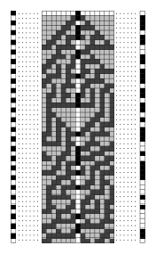
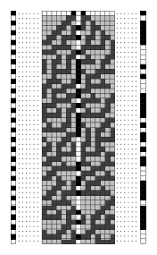
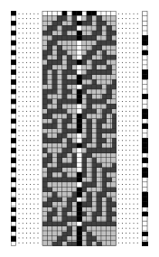
<!-- ORIGINAL_FIGURES page=0619 end -->

那么，这类规则能否用于密码学？我强烈怀疑可以，而且事实上它们允许人们构造出在抵抗密码分析方面至少与任何已知系统一样安全的系统。

下面的图像显示了一个基于规则 30 元胞自动机的简单例子，这个元胞自动机我在本书前面已经讨论过几次。其思想是从由密钥定义的初始条件开始，通过采样元胞自动机的演化来生成加密序列。

使用规则 30 的一列作为加密序列进行加密。我最早在 1985 年提出这种方法。

在上一页所示的加性元胞自动机中，它的嵌套结构使人们可以使用本章讨论过的许多感知与分析方法识别规律性。但对于规则 30，生成的大多数序列，即使来自简单初始条件，相对于到目前为止讨论过的所有感知与分析方法都显得完全随机。

那么密码分析又怎样？它是否也不能发现规律性，还是说它至少在上面所示这种设置的语境中提供了某种特殊方式，能够识别出人们为了推断初始条件并由此确定密钥所必需的那些规律性？

有一种方法原则上总会有效：人们可以枚举每一种可能初始条件，然后查看其中哪一种给出自己想要的序列。但随着元胞自动机宽度增加，可能初始条件的总数迅速变成天文数字，逐一测试完全不可行。

[[PDF page 620]]

<!-- ORIGINAL_FIGURES page=0620 start -->
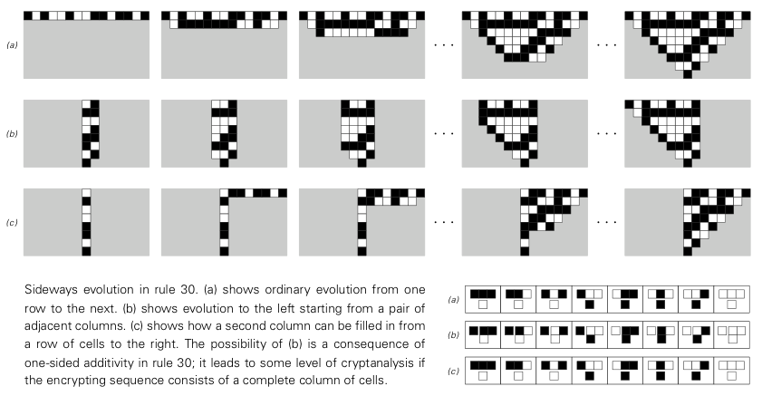
<!-- ORIGINAL_FIGURES page=0620 end -->

那么，还有没有其他可以使用的方法？事实证明，如下图所示，规则 30 具有某种类似于两页前讨论的加性元胞自动机的性质：除了允许由上一行推断下一行之外，它还允许由右侧的列推断左侧的列。但与加性元胞自动机不同的是，要做到这一点需要的不是一列，而是相邻的两列。

规则 30 中的横向演化。(a) 显示从一行到下一行的普通演化。(b) 显示从一对相邻列开始向左演化。(c) 显示怎样从右侧一行元胞填出第二列。(b) 的可能性是规则 30 中单侧加性的后果；如果加密序列由一整列元胞组成，它会导致某种程度的密码分析。

那么，如果加密序列对应于单列，人们怎样找到相邻列？上面最后一行图像显示了一种办法。人们为顶行右半部分选取某个元胞序列，然后向页面下方演化。有些令人惊讶的是，事实表明，给定一列元胞后，邻近列可能是什么的可能性相当少。因此，通过采样数量有限的顶行序列，人们常常可以找到第二列，从而允许确定左侧各列，并由此找到一个候选密钥。

[[PDF page 621]]

<!-- ORIGINAL_FIGURES page=0621 start -->
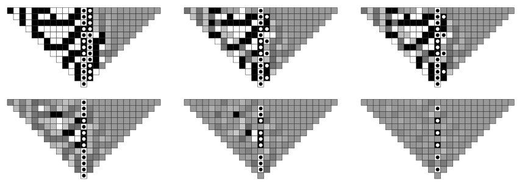
<!-- ORIGINAL_FIGURES page=0621 end -->

但要挫败这种特定密码分析方法相当容易：在形成加密序列时，只需不采样某个给定列中的每一个元胞。因为如果没有每个元胞，似乎就没有足够信息让任何局部规则能够从其他列推断出某一列。

下面的图像给出了这一点的证据。带点元胞的颜色被看作已知，然后其他元胞的颜色按照从所有可能初始条件出发所得到的平均结果填入。

在对所有能够重现带点元胞中颜色排列的可能初始条件取平均之后，由规则 30 生成的图案。如果一个元胞完全为黑色或完全为白色，就意味着它的颜色由给定约束唯一确定。如果元胞显示为灰色，就意味着它有某个概率为黑色，也有某个概率为白色。注意，当指定两整条相邻列时，左侧所有元胞都被确定。但当指定的元胞更少时，被确定的元胞数量迅速减少，表明密码分析可能变得困难。

给定两整列时，左侧所有元胞都被确定为黑色或白色。给定一整列时，仍然有显著片区的元胞颜色被确定。但如果只给出某一列中每隔一个元胞的颜色，那么关于其他元胞颜色，几乎没有任何确定结论。

那么第 602 页的方法呢？这里不能使用它吗？事实证明，该方法关键依赖于底层规则的加性。由于规则 30 不是加性的，它根本不起作用。发生的情况是，由附近某列中元胞的颜色决定某个特定元胞颜色的函数迅速变得极其复杂，因此这种方法大概最终本质上不比枚举可能初始条件更好。

[[PDF page 622]]

<!-- ORIGINAL_FIGURES page=0622 start -->
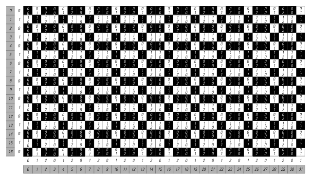
<!-- ORIGINAL_FIGURES page=0622 end -->

因此结论是，至少对于标准密码分析方法以及其他少数方法来说，似乎没有容易的办法从任何适当选择的加密序列中推断规则 30 的密钥。但怎样才能确信，真的绝对不存在容易的方法做到这一点？在第 12 章中，我会讨论处理这类问题的一些基本方法。但作为实践问题可以说，直接尝试寻找推断规则 30 密钥的容易方法不仅已经失败，而且尽管付出了相当努力，在解决各种与这个问题等价的问题方面也几乎没有取得进展。

## 传统数学与数学公式

长期以来，传统数学一直是整个理论科学中使用的主要分析方法。它的目标通常可以被看作试图寻找一个数学公式，用来概括一个系统的行为。因此，在一个简单情况下，如果有一个黑白方格阵列，人们通常要找的是一个公式，它取得指定某个特定方格位置的数字，并由此告诉人们该方格是黑色还是白色。

[[PDF page 623]]

<!-- ORIGINAL_FIGURES page=0623 start -->
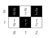
<!-- ORIGINAL_FIGURES page=0623 end -->

对于纯粹重复的图案，公式总是直接的，如面对页底部的图像所示。因为人们所需要做的，无非是算出某个特定方格的位置除以基本重复块大小所得的余数，而这就立刻告诉人们怎样查找所需颜色。

那么嵌套图案又怎样？事实证明，在大多数传统数学中，这类图案已经被看作相当高级。但采用正确方法，最终仍然相当直接地可以为它们找到公式。

关键思想很像第 4 章中那样，是按照数字序列而不是按照数字大小来思考数字。借助这个思想，下一页的图像显示了一个例子，说明怎样为一个嵌套图案构造出实际上相当于公式的东西。

人们要做的是查看给出某个方格竖直和水平位置的数字的数字序列。然后在所示特定情况下，比较这两个序列中的对应数字；如果这些数字曾经分别为 0 和 1，那么该方格为白色，否则为黑色。

那么，这个过程为什么有效？

正如我们在本书中已经多次讨论的，任何嵌套图案几乎按定义都必须能够由一个邻域无关替换系统重现。在下一页所示情形中，这个系统的规则使每一步中每个方格都被一个新的 `2 x 2` 方格块替换。因此，如图所示，这意味着新的方格总是具有包含一个额外数字位的位置。对于所示特定规则，新方格总是与旧方格颜色相同，只有一个特定情形例外：当一个黑色方格被替换时，出现在右上角的新方格总是白色。但这个方格

一个例子，说明怎样可以通过一个简单数学过程，从重复图案中任意方格的坐标找到其颜色。该过程取方格的 `x` 和 `y` 坐标，并分别计算它们除以 3 和 2 后的余数。利用这些余数，图中显示在每个方格内部，可以通过左侧所示重复块中的简单查找确定某个特定方格的颜色。整个过程可以用一个数学公式表示，其中涉及 `Mod` 这样的函数，或者 `Sin` 这样的更传统函数。

[[PDF page 624]]

<!-- ORIGINAL_FIGURES page=0624 start -->
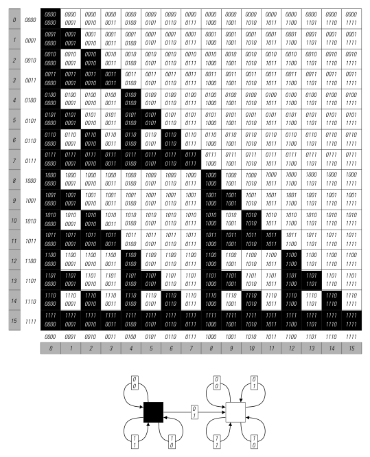
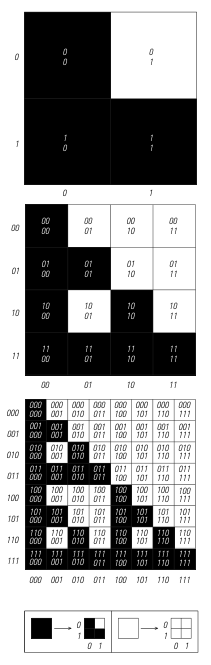
<!-- ORIGINAL_FIGURES page=0624 end -->

一个例子，说明怎样可以通过相当简单的数学过程，从嵌套图案中任意方格的坐标找到其颜色。该过程通过查看坐标的 2 进制数字序列来工作。如果某个特定方格的 `y` 坐标中任意一位为 0，而 `x` 坐标中对应位为 1，那么该方格为白色；否则为黑色。右下方的有限自动机给出了这条规则的一种表示。从黑色方格开始，人们沿着对应于在 `y` 和 `x` 坐标中遇到的连续数字的连接序列前进。最终停在有限自动机中的哪个方格，就给出所需颜色。左侧图像说明了这个过程为什么有效。嵌套图案可以由所示规则的二维替换系统构建出来。在这个替换系统的每一步演化中，人们得到一个更精细的方格网格，其中每个方格实际上由其坐标中的又一位数字指定。

具有这样的性质：它的竖直位置以 0 结尾，水平位置以 1 结尾。因此，如果对应于某个特定方格位置的数字在任何位置包含这种数字组合，就可以推出该方格必定是白色。

那么其他嵌套图案又怎样？事实证明，使用上述论证的一个扩展，总是可以取生成某个特定嵌套图案的替换系统规则，

[[PDF page 625]]

<!-- ORIGINAL_FIGURES page=0625 start -->
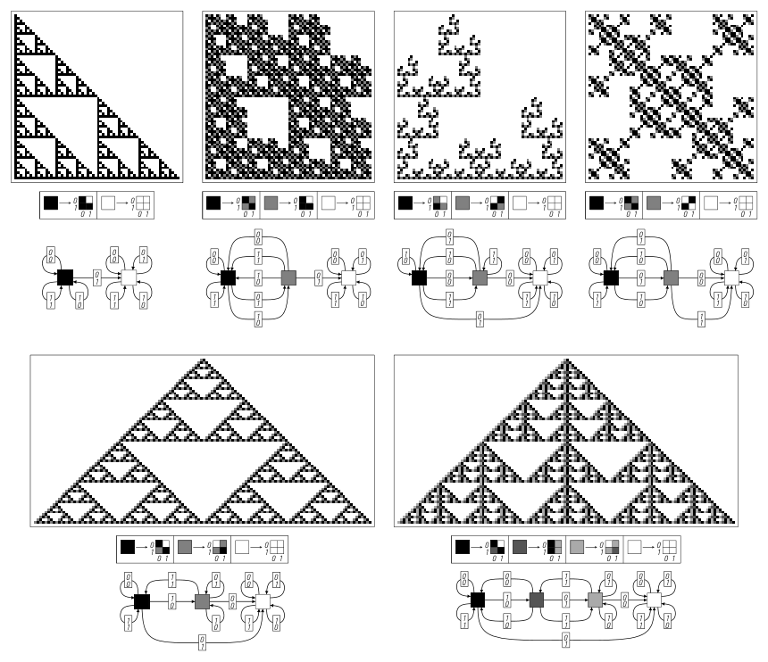
<!-- ORIGINAL_FIGURES page=0625 end -->

并从这些规则构造一个过程，用来根据方格位置找出该图案中某个方格的颜色。下面的图像显示了几个例子，在所有情况下，过程都相当直接。

确定各种嵌套图案中给定位置方格颜色的过程。每种情况下，整个图案都可以通过反复应用所示替换系统规则生成。任意特定方格的颜色也可以通过把其 `y` 和 `x` 坐标的数字序列输入所示有限自动机来找到。所示第一个例子对应于元胞自动机规则 60；最后两个例子分别对应于规则 90 和 150。在上排例子中，替换系统的初始条件是单个黑色方格，有限自动机的起始状态也是其黑色状态。在第二排例子中，初始条件由一个浅灰色方格紧挨一个黑色方格组成。在这些情况下，中心左侧方格的颜色可以通过从有限自动机中的浅灰色状态开始来找到；中心右侧方格的颜色可以通过从黑色状态开始来找到。

[[PDF page 626]]

<!-- ORIGINAL_FIGURES page=0626 start -->
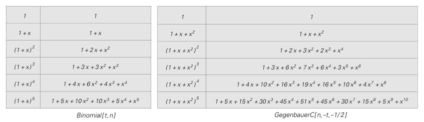
<!-- ORIGINAL_FIGURES page=0626 end -->

不过，虽然这些过程很容易实现为程序，但在某种意义上，它们并不基于传统上被认为是普通数学函数的东西。那么，是否事实上有可能得到只涉及这类函数的方格颜色公式？

在面对页顶部所示的一个特定情况下，事实证明这相当容易。因为碰巧这个特定图案，也等价于前一页每一行开头的图案，可以仅仅通过以帕斯卡三角形的形式把成对数字相加，然后在条目为奇数时放置黑色方格来得到。

如下表所示，帕斯卡三角形中的条目就是展开 `(1 + x)` 的幂时出现的二项式系数。因此，要判断图案中某个特定方格是黑色还是白色，人们只需要计算对应的二项式系数，并查看它是否为奇数。这意味着，如果用 1 表示黑色，用 0 表示白色，那么就可以为第 `y` 行位置 `x` 处方格的颜色给出一个显式公式：它就是 `(1 - (-1)^Binomial[y, x])/2`。

面对页图案的代数表示。每一行中 `x^n` 的系数给出每个方格的值。这些系数也可以由以 `Binomial` 和 `GegenbauerC` 表示的公式得到。当某个特定方格的值 `a` 为奇数时，它被涂成黑色。这既可以从 `Mod[a, 2]` 确定，也可以等价地从 `(1 - (-1)^a)/2` 或 `Sin[pi a/2]^2` 确定。上面的多项式序列可以通过展开生成函数 `1/(1 - (1 + x) y)` 和 `1/(1 - (1 + x + x^2) y)` 得到。`Binomial[m, n]` 是普通二项式系数 `m!/(n! (m - n)!)`。`GegenbauerC` 是所谓正交多项式，一种高等数学函数。

那么面对页底部图像又怎样？和顶部图像很相似，可以给每个方格分配数字，但现在这些数字是通过连续把三个数字相加而不是把两个数字相加来计算的。

[[PDF page 627]]

<!-- ORIGINAL_FIGURES page=0627 start -->
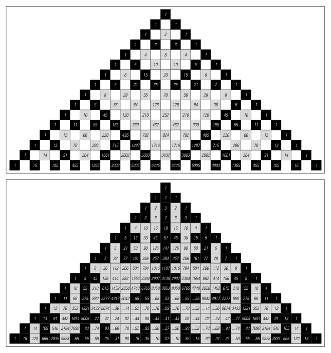
<!-- ORIGINAL_FIGURES page=0627 end -->

用算术运算构造的嵌套图案。顶部例子是帕斯卡三角形，通过让每个数字等于上一行中其左上和右上两个数字之和形成。底部例子是帕斯卡三角形的推广，其中每个数字等于上一行中其正上、左上和右上三个数字之和。两种情况下，当方格中出现的数字为奇数时，方格被涂成黑色。颜色的极限排列对应于嵌套图案。对于顶部图像，该图案就是遵循规则 90 的加性元胞自动机会生成的图案；对于底部图像，则是遵循规则 150 的加性元胞自动机会生成的图案。顶部图像中的数字是二项式系数；底部图像中的数字是特定三项式系数。

而且数字再次作为系数出现，不过这次不是在 `(1 + x)` 的幂展开中，而是在 `(1 + x + x^2)` 的幂展开中。

那么，这些系数是否有显式公式？如果把自己限制在固定数量的初等数学函数以及阶乘和多项式系数之内，那么似乎没有。但如果也允许高等数学函数，那么事实证明这样的公式确实可以找到：如上表所示，每个系数都由所谓 Gegenbauer 函数或超球函数的某个特定值给出。

[[PDF page 628]]

那么其他嵌套图案又怎样？上一页显示的两个图案都相当特殊，因为它们除了可以由替换系统生成之外，也可以由带有简单加性规则的一维元胞自动机逐行演化产生。事实上，上面使用的方法可以被看作这类加性规则向普通数字领域的直接推广。

对于少数其他嵌套图案，也存在与加性元胞自动机及类似系统的相当简单联系，尽管通常是在更高维度或带有更多邻居的情况下。但对于大多数嵌套图案，似乎没有明显方法把它们与普通数学函数联系起来。尽管如此，我猜想最终事实上会证明，可以用适当推广的超几何函数，或者也许用传统数学中所用函数的某些直接推广，来为任何嵌套图案得到公式。

然而，鉴于嵌套图案往往看起来多么简单和规则，用传统数学公式表示它们竟会如此困难，多少有些令人惊讶。如果这个例子具有任何代表性，那么它开始让人觉得，本书中我们多次见到的更复杂图案类型，不太可能现实地由这类公式表示。

但事实证明，至少有些情形中，即使在眼睛看来，或相对于其他感知与分析方法，某个图案似乎高度复杂，仍然可以找到传统数学公式。

面对页顶部的图像就是一个例子。一个图案通过叠加一系列重复网格而构建起来，眼睛看来这个图案似乎高度复杂。但事实上，每个方格颜色都有一个简单公式：给定指定该方格水平和竖直位置的两个数字，取它们的最大公因子，只要这个因子为 1，该方格为白色，否则为黑色。

[[PDF page 629]]

<!-- ORIGINAL_FIGURES page=0629 start -->
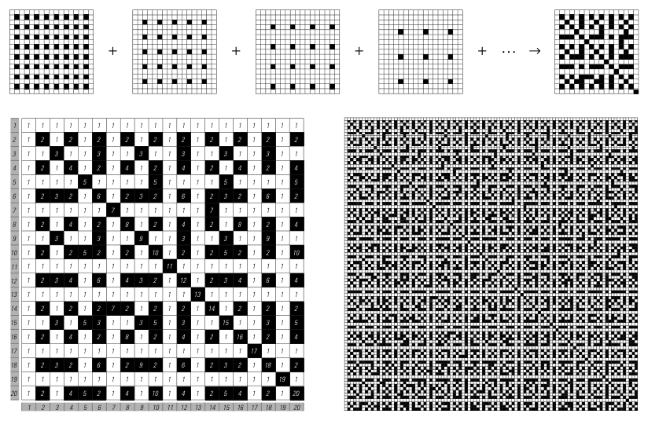
<!-- ORIGINAL_FIGURES page=0629 end -->

一个看起来复杂、但仍然可以由简单数学公式表示的图案例子。给定水平和竖直位置 `x` 与 `y`，当 `GCD[x, y] = 1` 时方格为白色，否则为黑色。条件 `GCD[x, y] = 1` 等价于说 `x` 和 `y` 互素，或者说不需要约分即可把分数 `x/y` 化为最简形式。可以证明，如果图案延伸得足够远，黑色方格的任何可能局部排列最终都会出现，尽管不一定以相同频率出现。

那么，像元胞自动机这样具有确定演化规则的系统又怎样？是否存在这样的情况：这类系统生成的图案在眼睛看来复杂，但事实上可以由简单数学公式描述？

我知道有一类会发生这种事情的例子，如下一页图像所示。其思想是设置一行元胞，对应于某个给定进制中一个数字的各位，然后在每一步把这个数字乘以某个固定因子。

这样的系统立刻具有许多令人想起元胞自动机的特征。但至少在 2 进制中乘以 3 的情况下，乘法过程中进位数字的存在，使该系统并不完全是普通元胞自动机。不过，事实证明，6 进制中乘以 3，或 10 进制中乘以 2 或 5，永远不会导致进位数字，因此在这些情况下，系统可以被认为遵循一种纯粹局部的元胞自动机规则，如下所示。

[[PDF page 630]]

<!-- ORIGINAL_FIGURES page=0630 start -->
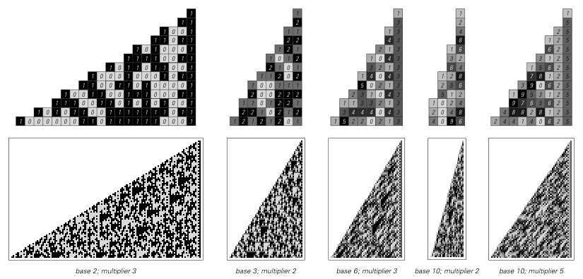
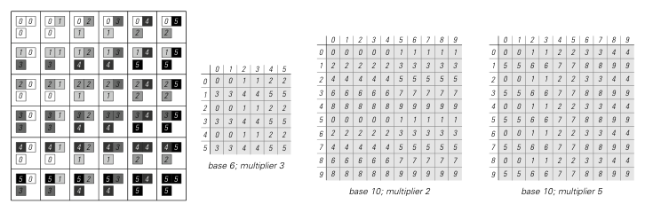
<!-- ORIGINAL_FIGURES page=0630 end -->

通过在各种进制中反复乘以固定因子生成的数字图案。这样的系统曾在第 120 页讨论。乘数为 `m` 时，第 `t` 行对应于幂 `m^t`。因此第 `t` 行从末端数第 `n` 个位置的元胞值，是 `m^t` 的第 `n` 位，即 `Mod[Quotient[m^t, k^n], k]`。尽管这些图案表观复杂，但其中每个方格的颜色都有一个相当简单的数学公式。

等价于各种进制中数字序列乘法的元胞自动机规则。图像左侧部分显示了 6 进制乘以 3 的规则显式形式。数字阵列概括了该情形和其他情形的规则。注意，只有某些特定进制和乘数组合会导致普通元胞自动机；其他选择会产生可以任意远传播的进位。（见第 661 页。）

[[PDF page 631]]

<!-- ORIGINAL_FIGURES page=0631 start -->
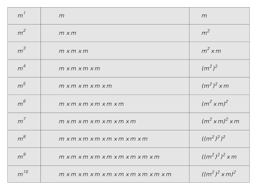
<!-- ORIGINAL_FIGURES page=0631 end -->

正如面对页顶部的图像展示的，所有情况下产生的整体图案都往往看起来复杂，并且在许多方面随机。但关键点在于，由于系统构造的方式，每个元胞的颜色仍然有一个简单公式：它只由把乘数提升到等于步数的幂后所得数字中的某一位给出。因此，尽管具有表观复杂性，面对页上的所有图案实际上都可以由简单传统数学公式描述。

但如果考虑实际使用这样的公式，人们一开始也许会怀疑它究竟有什么用。因为如果通过显式执行 `t` 次乘法来算出幂 `m^t` 的值，这将非常类似于显式跟随 `t` 步元胞自动机演化。但关键在于，由于幂的某些数学特征，事实证明可以如下面表中所示，用远少于 `t` 次的运算找到 `m^t`；事实上，例如对 `t` 的 2 进制表示中的每一位，只需一两次运算总是足够的。

幂怎样可以比连续相乘更高效地计算的例子。在所示情形中，在计算 `m^t` 的每一步选择平方还是再乘以一个额外的 `m` 因子，是根据数字 `t` 的 2 进制表示中的连续数字作出的。

那么，由元胞自动机和类似系统产生的其他图案又怎样？最终是否可能所有这样的图案都只需由简单数学公式描述？我并不这样认为。事实上，正如我将在第 12 章中论证的，我强烈相信，在绝大多数情况下，由于相当根本的原因，不可能找到任何这样的简单公式。

[[PDF page 632]]

<!-- ORIGINAL_FIGURES page=0632 start -->
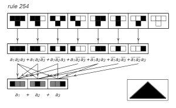
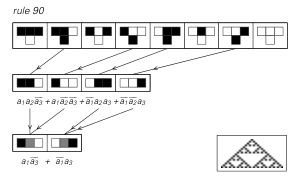
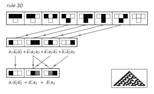
<!-- ORIGINAL_FIGURES page=0632 end -->

但即使不存在简单公式，原则上仍然总是可以用至少某种公式表示任何元胞自动机演化过程的结果。

下面的图像显示了怎样为三个初等元胞自动机演化的一步做到这一点。基本思想是把某个给定元胞自动机的规则翻译成一个依赖三个变量 `a1`、`a2` 和 `a3` 的公式，这些变量的值对应于三个初始元胞的颜色。公式由若干项之和组成，每一项都为零，除非三个元胞的颜色匹配规则会产生黑色元胞的某种情况。

三个初等元胞自动机规则的布尔表达式表示。第一行显示原始元胞自动机规则。第二行显示根据各规则会产生黑色元胞的元胞组合。第三行显示最小化版本，其中引入灰色元胞来表示黑色或白色都可以。在第二行和第三行下方的公式中，变量 `ai` 表示第 `i` 个元胞的颜色。乘积 `ei ej` 类似于逻辑与，`ei + ej` 类似于逻辑或，`ei` 上的横线类似于逻辑非。给出的公式采用所谓析取范式 (DNF)。它们被设置成，对于任何特定颜色配置，每个公式中至多只有一项相关。

首先，每一项都可以被设置为直接对应于原始规则中的一种情形。但一般来说，这会导致比必要更复杂的公式。正如图像所示，通常可以通过忽略某些变量的值，把若干情形合并为一项。

面对页顶部的图像显示了，如果考虑两步元胞自动机演化会发生什么。现在总共有五个变量，但至少对于规则 254 和规则 90 这样的规则，各项最终并不依赖于这些变量中的大多数。

[[PDF page 633]]

<!-- ORIGINAL_FIGURES page=0633 start -->
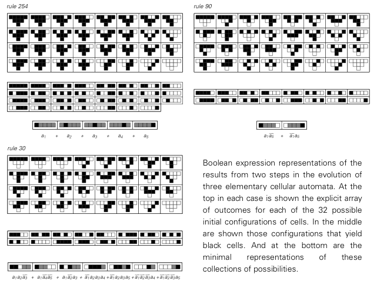
<!-- ORIGINAL_FIGURES page=0633 end -->

三个初等元胞自动机演化两步后的结果的布尔表达式表示。每种情况下，顶部显示的是 32 种可能初始元胞配置各自结果的显式阵列。中间显示会产生黑色元胞的那些配置。底部是这些可能性集合的最小表示。

那么，如果考虑更多步会发生什么？正如下页图像所示，像规则 254 和 90 这样具有相当简单行为的规则，会导致始终相当简单的公式。但对于规则 30，公式很快变得复杂得多。

这强烈提示，至少在这里所用类型的公式中，不存在简单公式能够描述像规则 30 这样的系统经过显著多步演化后生成的图案。

但其他类型的公式又怎样？我们到目前为止使用的公式可以被看作总是由变量乘积的和组成。但如果允许具有更一般结构的公式，而不只是两层固定运算，会怎样？

事实证明，任何黑白元胞块规则都可以表示为仅由单一类型运算的某种组合，例如数字电子中常用的所谓 NAND 函数。于是，人们可以想象，对于任何特定规则，寻找涉及最少数量 NAND 函数的公式。

[[PDF page 634]]

<!-- ORIGINAL_FIGURES page=0634 start -->
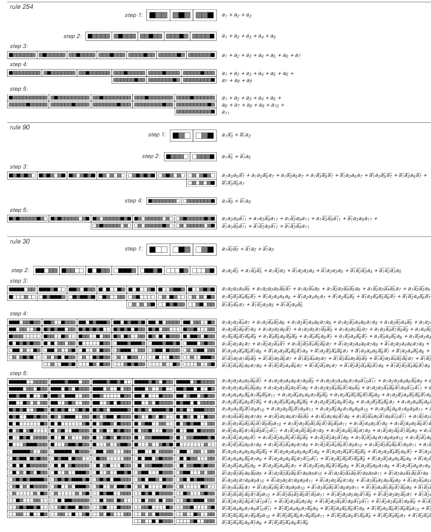
<!-- ORIGINAL_FIGURES page=0634 end -->

规则 254、规则 90 和规则 30 演化第 1 到第 5 步结果的最小布尔表达式表示。规则 254 和 90 的整体行为都相当简单，并产生比较小的布尔表达式。规则 30 的行为复杂得多，产生的布尔表达式大小从一步到下一步迅速增长。（对于第 1 到第 6 步，表达式分别涉及 3、7、17、41、102 和 261 项。）每种情况下，给出的布尔表达式都是所使用析取范式 (DNF) 中可能的最小表达式。

[[PDF page 635]]

<!-- ORIGINAL_FIGURES page=0635 start -->
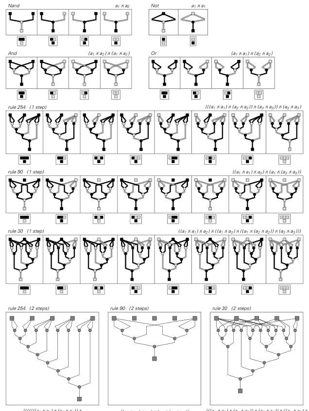
<!-- ORIGINAL_FIGURES page=0635 end -->

下面的图像显示了一些结果例子。我们再次看到，对于行为相当简单的规则，公式通常相当简单。但在像规则 30 这样的情况下，即使只经过两步，得到的公式也已经相当复杂。

以 NAND 函数表示同一组元胞自动机演化前两步的最小表示。每种情况下，所示网络和公式都是涉及绝对最少运算数的表示。有效找到它们需要搜索数十亿种可能性。左上角图像显示单个 NAND 函数的作用。接下来三幅图显示 DNF 公式中使用的运算怎样可以由 NAND 构建出来。

[[PDF page 636]]

因此，即使允许相当一般的结构，证据也表明，最终没有办法设置任何简单公式来描述规则 30 这样系统的演化结果。

即使接受复杂公式，在特定情况下仅仅找到最不复杂的一个，也会迅速变得极其困难。事实上，对于第 618 页所示类型的公式，难度也许已经会在每一步翻倍。而对于上一页所示的更一般公式，难度可能会以一个自身几乎每一步都指数增长的因子增加。

这意味着，就像我们考虑过的每一种其他分析方法一样，我们几乎别无选择，只能得出结论：传统数学和数学公式最终不能被现实地期望告诉我们多少关于规则 30 这类系统生成图案的信息。

## 人类思维

当我们面对新数据时，总可以做的一件事就是把我们一般的人类思维能力应用到它上面。毫无疑问，这让我们只需相当有限的努力，就能很好地处理日常生活中我们选择与之互动的各种数据。但对于由本书讨论的那类系统生成的数据，人类一般思维表现怎样呢？

肯定有一些限制。毕竟，如果人类一般思维可以轻易找到例如本书中所有各种图像的简单描述，那么我们就根本不会认为它们中的任何一个复杂。

过去人们也许会假定，如果某段数据存在简单描述，那么通过恰当思考和智力，通常不会太难找到它。但本书中的结果确立的是，事实远非如此。因为在本书中，我们已经看到大量系统，它们的底层规则极其简单，而整体行为却足够复杂，以至于即使非常努力地思考，我们也无法识别其简单来源。

[[PDF page 637]]

通常，少量思考会让我们至少识别出一些规律性。但这些规律性通常也是本章前面讨论的许多标准感知与分析方法可以相当轻易找到的规律性。

那么，人类思维最终究竟有什么贡献？它区别于其他感知与分析方法的最明显方式，是它大规模使用记忆。

因为我们讨论过的所有其他方法，实际上都是取每一个新的数据片段，并对它单独应用某个固定过程。但在人类思维中，我们常规地利用通过接触数十亿个先前数据片段而建立起来的巨大记忆。

有时结果会相当令人印象深刻。因为相当常见的是，即使没有其他方法能对某个特定数据片段说出什么，我们也能通过记起先前遇到过的某个类似数据片段，立刻给出一个描述。

因此，例如由于我本人看过数千幅由元胞自动机产生的图像，我几乎可以立刻凭记忆识别由任何初等规则生成的任何图案，即使只要这类图案稍微复杂一些，其他感知与分析方法就几乎无法走得很远。

但如果人类记忆所能做到的事情中存在精巧之处，这种精巧只是来自存储在记忆中的经验，还是以某种方式来自记忆本身的实际机制？

存储大量数据并按各种准则检索它的思想，在实用计算中的数据库里当然相当熟悉。但典型数据库的工作方式与人类记忆的工作方式之间至少有一个重要差异。在标准数据库中，人们往往只能找到满足某个精确规范的数据，例如包含与某个特定文本字符串完全匹配的数据。而在人类记忆中，我们似乎常规地能够基于更一般的相似性概念检索数据。

[[PDF page 638]]

一般而言，如果想找到具有某种性质的数据片段，不管这种性质是精确的还是近似的，一种办法就是扫描已经存储的所有数据片段，并逐一测试它们。但即使使用各种并行处理，这种办法最终想必也会变得相当不现实。

那么还能做什么？在精确匹配的情况下，有几种实践中广泛使用的办法。

也许最熟悉的是典型词典中的做法：所有条目按字母顺序排列，因此查找某项时不需要扫描每一个条目，而可以迅速定位到想要的条目。

实用数据库系统几乎普遍使用一种稍微更高效的方案，称为哈希。基本思想是有某个确定过程，取任意单词或其他数据片段，并从中导出所谓哈希码，用来决定数据将存储在哪里。关键在于，如果人们正在寻找某个特定数据片段，就可以把同一个过程应用到该数据上，得到该数据的哈希码，并立刻确定该数据本应存储在哪里。

但要让这件事起作用，是否需要一个复杂的哈希过程，并针对正在处理的特定数据类型仔细调校？事实证明不需要。事实上，真正必要的只是哈希过程生成足够的随机性，使得即使原始数据中可能有规律性，产生的哈希码最终仍会在所有可能性中大致均匀分布。

正如从本书的结果中可以预期的，即使用极其简单的程序也很容易达到这一点，程序可以基于数字，就像大多数实用数据库系统中那样，也可以基于像元胞自动机这样的系统。

因此，这意味着不管存储的是什么数据，只需要一个非常简单的程序，就能建立一种哈希方案，让人非常高效地检索数据片段。我怀疑，这类机制至少有某些方面参与了人类记忆的运行。

[[PDF page 639]]

但我们常规地从记忆中检索的不只是完全匹配的数据，也包括仅仅相似的数据，这又怎样？普通哈希不会让我们做到这一点。因为一个哈希过程通常会把不同数据片段放到相当不同的位置，即使这些数据片段碰巧在某种意义上相似。

那么，有没有可能设置某些哈希形式，使相似数据片段实际上会保持在一起？从某种意义上说，所需的是一种哈希过程，其中生成的哈希码只依赖于那些真正造成差异的数据特征，而不依赖于其他特征。

一个实际例子是，一种常用于按发音而非拼写查找姓名的简单过程。在典型形式中，这个过程会删除所有元音，并把像 “d” 和 “t” 这样发音相似的字母归为一组，结果至少近似地保留下来的只有那些会影响单词发音方式的特征。

那么，一般情况下怎样达到这一点？

从许多方面看，所有形式的感知与分析的主要目标之一，恰恰就是挑出那些被认为相关的数据特征，并丢弃所有其他特征。

因此，正如本章前面讨论的，例如人类视觉系统似乎基于这样一些神经细胞：它们只响应图像中的某些特定特征。这意味着，如果只看这些神经细胞的输出，那么就会得到视觉图像的一种表示，其中两个只在某些细节类型上不同的图像，将被赋予相同表示。

[[PDF page 640]]

<!-- ORIGINAL_FIGURES page=0640 start -->
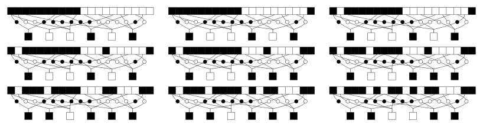
<!-- ORIGINAL_FIGURES page=0640 end -->

所以，如果正是这样的表示被用作在记忆中存储数据的基础，结果就是人们将很容易不仅检索到完全匹配的数据，也检索到只是足够相似以至于具有同一表示的数据。

在真实大脑中，相当清楚的是，各种感觉系统接收的输入首先会由神经细胞群处理，这些神经细胞群实际上提取某些特定特征。而似乎很可能，特别是在较低等生物中，直接由这类特征形成的表示常常就是存储在记忆中的东西。

但至少在人类中，想必还有更多事情发生。因为我们相当常见地能够立刻认出自己以前遇到过某个特定物体，即使它表面上以相当不同的方式呈现。这提示，在至少某些情况下，来自感觉系统的相当不同的原始数据模式仍然可以导致记忆中本质上相同的表示。

那么这可能怎样实现？一种可能是，我们的大脑也许被设置为提取某些特定高级特征，例如三维空间中的拓扑结构，而这些特征碰巧能成功刻画我们传统上处理的某些对象类型。

但我强烈怀疑，事实上起作用的是某种简单得多也一般得多的机制，它本质上只在任意数据元素层面运作，而不直接参考这些数据元素的来源或意义。

人们可以想象这种机制用神经细胞以许多方式潜在地设置起来。

下面的图像展示了一个特别简单方案中的一步。基本思想是有一系列神经细胞层，很像已知存在于大脑中的那样；每一连续层中的每个细胞，只有在它从上一层某个固定随机细胞集合接收到的输入形成某种确定图案时才响应。

一个非常简单模型中的一步，说明大脑中神经细胞层可能怎样为任意数据生成哈希码。图中显示一层理想化神经细胞对一系列逐渐不同输入的响应。每个神经细胞只有在它从某些固定位置接收的输入匹配某个特定模板时，才会放电并给出黑色输出。所有神经细胞的输出序列可以用作哈希码；对于只因小变化而不同的输入，这个哈希码的值往往相同。

[[PDF page 641]]

从某种意义上说，这是本章前面讨论的视觉感知方案的直接推广。但关键在于，在这种设置下，对第一层细胞输入的细节变化，只有很少情况下最终会影响最后一层细胞的输出。

不难找到不同输入常常给出相同输出的系统。事实上，这正是我们在第 6 章讨论的非常一般的吸引子现象的本质，在绝大多数元胞自动机中都可以看到，事实上在几乎任何遵循确定规则的系统中都可以看到。

但上面设置稍微特殊的地方在于，给出相同输出的输入往往是那些可以合理地被认为相似的输入，而给出不同输出的输入往往显著不同。

因此，例如单个输入元胞的变化通常不会有很高概率影响输出，而很大一部分输入元胞发生变化则会影响输出。

所以，完全不依赖于原始数据中哪些特征对应于哪些输入元胞，这种基本机制提供了一种简单方式，用来得到一种表示，也就是哈希码，它往往会对那些以某种方式具有足够多相似特征的数据片段保持相同。

那么，这样的表示最终怎样被使用？在类似上面的方案中，输出细胞想必会连接到实际执行某种动作的细胞，也许导致肌肉运动，也许只是为更进一步的神经细胞提供输入。

但在这一切中，我们记忆的实际内容位于哪里？几乎可以肯定，在某个层次上，它被编码在神经细胞之间连接的细节中。

那么这些细节又可能怎样被设置起来？

有证据表明，个体神经细胞可以由于其周围神经细胞的行为而产生永久性变化。当大脑接收数据时，想必至少在某些细胞中确实会发生这类变化。但如果查看例如参与视觉系统早期阶段的神经细胞，那么一旦大脑成熟到某个阶段之后，它们似乎就不再显著改变自身性质。

[[PDF page 642]]

许多参与进行类似产生哈希码的一般过程的神经细胞，很可能也是如此。

这种缺乏变化的原因，可以设想只是因为在相关层次上，对应于典型经验的数据流的整体性质保持相当恒定。但也可能是，如果人们期望可靠地检索记忆元素，就别无选择，只能把事情设置成，使所使用的哈希过程始终基本保持相同。

如果存在这样一个固定方案，那么这意味着，虽然数据片段之间的某些相似性会立刻被识别出来，其他相似性却不会。

这与我们关于实际人类记忆的认识相比如何？有许多种相似性是我们非常轻松就能识别的。但也有一些不是。因此，例如给定一个稍微复杂的视觉图像，比如一张脸或一个元胞自动机图案，我们常常甚至无法立刻识别它与同一图像倒置之后的相似性。

那么，这类局限最终是人类记忆底层机制的内在限制，还是以某种方式仅仅反映了我们碰巧从世界的典型实际经验中建立起来的记忆特征？

我的猜测是，某种程度上两者都有。但只要更重要的局限往往源自我们记忆系统相当低层次的方面，那么即使这些方面原则上可以改变，实践中也几乎不可能做到。因为我们记忆系统的低层次暴露在巨大的数据流之中。因此，要造成任何实质变化，想必必须插入数量相当、且具有所需特殊性质的数据。但对于一个在类似正常环境中互动的人来说，这在实践中绝对不可能。

所以最终我强烈怀疑，人类记忆运作所依照的基本规则几乎总是可以被看作本质上固定，而且我相信，相当简单。

[[PDF page 643]]

但整个人类思维过程又怎样？它最终涉及什么？我强烈怀疑，记忆的使用事实上构成了人类思维几乎每个主要方面的基础。

概括、类比和直觉这类能力，立刻显得与基于相似性从记忆中检索数据的能力密切相关。但逻辑推理这类能力又怎样？它们是否也许对应于更高层次的人类思维？

过去，人们常常认为逻辑也许是所有人类思维的一种恰当理想化。很大程度上由于这个原因，实用计算机系统一直把逻辑当作相当基本的东西。但我强烈怀疑，事实上逻辑远远不是基本的，特别是在人类思维中。

其中一个原因是，在思考过程中，我们常规地能够几乎瞬间从记忆中检索出非凡的联系；而我们进行逻辑推理时，往往只能费力地一步一步进行。我强烈怀疑，当我们这样做时，实际上又只是在使用记忆，并检索我们从经验中学到的逻辑论证模式。

现代以来，计算机语言常常被认为提供了精确表示那些本来也许由人类思维执行的过程的方式。但事实表明，今天使用的几乎所有主要语言，都基于设置过程，而这些过程本质上是逐步逻辑论证的直接类似物。

不过，碰巧有一个显著例外，那就是 Mathematica。事实上，在设计 Mathematica 时，我专门试图模仿人类似乎思考许多种计算的方式。而我最终为 Mathematica 提出的结构，可以被看作颇像人类记忆运作的一种精确理想化。

因为 Mathematica 的核心是存储规则集合的概念，其中每条规则指定怎样转换所有足够相似、能够匹配单个 Mathematica 模式的数据片段。Mathematica 的成功为这种方法的力量提供了相当证据。

[[PDF page 644]]

但归根结底，像其他计算机语言一样，Mathematica 往往主要关心的是为相当确定的计算设置相当短的规范。而在日常人类思维中，我们似乎转而使用大量存储数据来执行一些定义和目标常常相当含糊的任务。

过去有一种强烈倾向，认为既然人类思维具有所有这些表观复杂性，它就必定以某种方式是一个完全根本复杂的过程，在任何层面上都不适合简单解释或有意义理论。

但根据本书中的发现，我们现在知道，高度复杂的行为事实上可以从非常简单的基本规则中产生。这立刻使人可以设想，现实中可能确实有相当简单的机制构成人类思维的基础。

当然，大脑构造中有许多复杂细节，而且毫无疑问，人类思维的某些特定方面依赖其中一些细节。但我强烈怀疑，人类思维现象存在一个确定核心，它在很大程度上独立于这些细节，并且最终会证明基于相当简单的规则。

那么，我们怎样才能判断事实是否如此？对大脑及其运作进行详细直接研究也许会给出一些线索。但我猜想，真正令人信服的证据只会在实际技术系统被构造出来，并能成功地被看作模拟人类思维时获得。

事实上，到目前为止，实用计算方面的经验并没有给我们太多鼓励，让我们相信这件事终会可能。确实有一些任务，例如下国际象棋或做代数，曾经被认为是类人思维的标志，但现在已经常规地由计算机完成。然而，当涉及看起来平凡得多、日常得多的思维类型时，目前存在的计算机和程序往往几乎滑稽地不充分。

[[PDF page 645]]

那么，为什么我们没有做得更好？答案的一部分无疑与计算机和存储系统的各种实践细节有关。但我怀疑，更重要的一部分与方法论问题有关。

因为人们几乎总是假定，要在任何一般意义上模拟像人类思维这样精巧的过程，必然需要一个极其复杂的系统。因此，大多数时候人们所做的是试图构造只执行相当特定任务的系统。

但为了确保适当任务实际会被执行，这些系统往往被设置成像传统工程中那样，使它们的行为可以很容易预见，通常通过标准数学或逻辑方法预见。而这几乎总是意味着，它们的行为被迫相当简单。事实上，即使当系统被设置为有某种学习能力时，它们通常也倾向于以远远过于简单和可预测的方式行动，非常类似古典小说中的机器人，因而不符合现实中典型的人类思维。

基于传统直觉，人们也许会假定，解决这个问题的办法必然是使用具有更复杂底层规则的系统，也许更接近人类心理学或神经生理学细节。但根据本书中的发现，我们知道事实并非如此；实际上，非常简单的规则完全足以产生高度复杂的行为。

不过，如果维持执行特定明确任务的目标，可能仍然存在问题。因为只要得到的行为是复杂的，通常就很难把它导向特定任务，这个问题在与真实人类打交道时相当熟悉。因此，这意味着在某个层面上，重现一般的类人思维很可能要比设置某种只用于特定任务的特殊类人思维版本容易得多。

最终我强烈怀疑，一般类人思维所需的大多数核心过程，都能够由相当简单的规则实现。

但一个关键点是，单靠这些过程本身，很可能不足以创造出一个人们容易承认表现出类人思维的系统。因为为了能够以有意义的方式与真实人类发生关联，这个系统几乎肯定必须已经建立起一个类人的经验基础。

[[PDF page 646]]

毫无疑问，作为实践问题，这在某种程度上可以只通过大规模记录真实人类经验来完成。但看起来并非不可能的是，为了得到足够准确的经验基础，系统本身必须以非常接近真实人类的方式与世界互动，因此必须具有一些模拟人类生物结构和其他结构中许多精巧细节的元素。

不过，一旦有了一个成功模拟人类思维的显式系统，人们就可以想象逐步移除其中一些复杂性，并查看人类思维的哪些特征最终被保留下来。

那么，以人类语言为例又怎样？它是否纯粹是从人类经验细节中学习来的？还是说，其中有些特征反映了人类思维更基本的方面？

当人们学习一种语言，至少作为幼童学习时，往往会隐式推断出简单语法规则，这些规则实际上是对人们遇到过的例子作出的特定概括。我怀疑，在这样做时，人们作出的概括类型，本质上对应于人们从记忆中检索数据时容易识别的相似性类型。

实际人类语言通常对任何简单语法规则都有许多例外。看来，只要付出足够努力，我们事实上可以学会几乎任何结构的语言。但大多数现代计算机语言被专门设置为遵循简单语法规则这一事实，似乎使它们的结构特别容易被我们学习，也许是因为它们很好地适配人类思维的低层过程。

但在一个进行类人思维的系统中，语言这个概念最终究竟在多大程度上是必要的？在真实人类中，语言当然似乎对交流至关重要。但人们可以设想，如果某类系统中不同个体的底层细节足够相同，那么交流也许可以通过直接转移低层活动模式来实现。然而，我的猜测是，只要不同个体的经验开始不同，这就不会奏效，

[[PDF page 647]]

因此某种一般的中间表示或语言将是必需的。

但人们真的需要一种具有普通人类语言那种顺序语法结构的语言吗？计算机系统的图形用户界面当然经常使用某些不同方案。在简单情形中，这些方案可以运作良好。但我的一致经验是，如果人们想以一种可以合理理解的方式指定任何具有显著复杂性的过程，那么唯一现实的方法就是使用一种类似 Mathematica 的语言，它本质上具有普通的顺序语法结构。

我并不确定这究竟为什么如此。也许它只是我们熟悉传统人类语言的结果。也许它是我们显然一次只能注意一件事的能力限制的结果。但如果最终证明它反映了人类思维中相当基本的特征，我并不会感到惊讶。

事实上，我们在思考本书中系统产生的许多图案时所遇到的困难，可能也并非无关。因为普通人类语言在描述重复图案甚至嵌套图案时没有多少困难，但对于更复杂图案似乎几乎无能为力。从某种意义上说，这就是为什么例如本书如此严重地依赖视觉呈现。

一开始，人们也许会想象，人类思维必定涉及根本特殊的过程，与我们讨论过的所有其他过程都完全不同。但正如过去几个世纪已经清楚的是，人类的基本物理构成并不特别特殊，尤其在本书的发现之后，我也相当确信，最终会证明人类思维所涉及的基本过程并没有什么特别特殊之处。

事实上，我强烈怀疑，尽管人类思维表面上很精巧，但其背后的大多数重要过程实际上非常简单，非常像本章中我们讨论过的所有其他感知与分析形式所似乎涉及的过程。

[[PDF page 648]]

## 更高形式的感知与分析

在本章中，我们依次讨论了实践中使用的每一种主要感知与分析方法。如果我们的目标是理解我们对世界获得的实际经验，那么没有理由继续往更远处走。但作为原则问题，人们可以问，我们讨论过的感知与分析方法在某种意义上是否覆盖了最终可能的一切；或者相反，是否存在更高的、根本上更强大的感知与分析形式，只是由于某种原因我们目前没有使用。

正如本章开头讨论的，任何感知或分析方法在某个层面上都可以被看作试图为数据片段寻找简单描述的一种方式。过去我们也许会假定，如果某段数据可以从足够简单的描述生成，那么这段数据本身必然会让我们觉得相当简单，并因此具有许多可以由我们的标准感知与分析方法识别出来的规律性。

但本书的核心发现之一是，事实远非如此。实际上，描述极其简单的规则产生高度复杂的数据相当常见，而这些数据没有任何我们的标准方法能够识别的规律性。

不过，正如本章前面讨论的，一个简单规则最终能够负责产生这类数据这一事实，意味着在某个层面上这些数据必然包含规律性。因此关键在于，这些规律性并不是我们的标准感知与分析方法能够检测出的那种。

然而，最终确实存在规律性这一事实意味着，至少在原则上，可能存在更高形式的感知与分析，能够成功识别这些规律性。

那么，是否有一天会发明某种新的感知与分析方法，在某种意义上能够识别所有可能规律性，并因此能够立刻判断任意特定数据片段是否可以由某种简单描述生成？

[[PDF page 649]]

我强烈相信，正如我将在第 12 章中论证的，至少在完全一般的意义上，这永远不可能。但这并不意味着不存在更高形式的感知与分析，能够成功识别至少某些我们现有方法不能识别的规律性。

然而，本章的结果似乎可以提供一些旁证，说明在实践中甚至连这一点也可能做不到。因为在本章过程中，我们讨论了许多不同种类的感知与分析，但在基本所有情况下，我们都发现它们表现出的整体能力相当相似。例如大多数方法识别重复，一些也识别嵌套。但几乎没有任何方法识别更复杂的东西。

因此，这也许提示，最终可能只有某些特定能力能够在实用感知与分析方法中实现。当然，也并非不可想象会存在这样一个根本性结果：在实际系统中经常出现、并且可以被足够快识别以作为实用感知与分析方法基础的规律性种类，只是重复和嵌套这类规律性。

但对于本章中我们看到的东西，还有另一种可能解释：也许只是我们作为人类，在所使用的感知与分析方法上总是非常狭窄。因为确实值得注意的是，我们通常使用的那些方法最终似乎都没有设法比我们内置的感知能力已经能达到的程度走出多远。这也许提示，我们选择使用的方法，本质上就是那些只挑出我们已经通过自身内置感知能力在某种程度上非常熟悉的规律性的方式。

因为原则上，构造能力与我们的标准感知与分析方法非常不同的过程并不困难。事实上，作为一个例子，人们可以想象只枚举某种特定类型的所有可能简单描述，然后在每一种情况下测试所得结果是否匹配自己已有的一段数据。

在某些特定情况下，这很可能成功为数据找到极其简单的描述。但要在

[[PDF page 650]]

任何一般性下使用这种方法，几乎不可避免地需要远远超过实践感知或分析方法中通常认为合理的计算资源。

事实上，并没有什么真正理由去考虑这样复杂的过程。因为从某种意义上说，任何程序，包括一个非常简单且运行非常快的程序，都可以被认为实现了一种感知或分析方法。因为如果把一段数据作为输入交给程序，那么得到的输出，不管是什么，都可以被看作对应于该数据的某种描述。

但问题在于，在大多数情况下，这种描述并不会特别有用。事实上，使它有用通常似乎所需的是，人们已经以某种方式熟悉类似描述，并知道它们的意义。

例如，基于一个从未见过的元胞自动机规则输出的描述，很可能没有用。但挑出像重复这样我们已经非常熟悉的特征的描述，通常会有用得多。

因此，潜在地说，我们缺乏更高形式的感知与分析，最终也许与实现这些形式有什么困难无关，而只是反映了这样一个事实：只有当数据描述与我们从自身内置人类感知方法得到的描述相当接近时，我们才有足够语境让这些描述变得有用。

但为什么这些方法本身并不更强大呢？毕竟，人们也许会认为，生物进化不可避免地会让我们尽可能善于处理与自然界中任何常见系统相关的数据。

然而正如本书中所看到的，几乎只要存在显著复杂性，我们的人类感知能力最终就远不足以找到任何种类的数据最小摘要。

而在传统观点中，生物进化以某种方式被看作具有无限力量，这似乎使人几乎别无选择，只能得出结论：可能有用的感知方法存在根本限制。

[[PDF page 651]]

也许可以想象，虽然原则上可能存在识别出超越例如重复和嵌套特征的感知方法，但任意一种这样的特征也许永远不会出现在足够广泛的系统中，因而不能使其识别对生物有机体具有一般用途。

但到目前为止，我不知道有什么根本原因说明事情必定如此。而根据我在第 8 章中的论证，如果生物进化过程只是错过了某些在某种意义上相当明显的感知方法，我一点也不会惊讶。

那么，外星智能又怎样？摆脱地球生物进化的任何影响之后，它是否可能已经发展出各种更高形式的感知与分析？

当然，我们对此没有直接信息。但我们到目前为止没有发现任何外星智能证据这一事实本身，也许可以设想已经是一个迹象，说明更高形式的感知与分析可能正在被使用。

因为正如我将在第 12 章中讨论的，我们接收到并假定为随机噪声的某些外星无线电信号和其他信号，事实上可能是有意义的信息，这并非完全不可想象，只不过它们以一种只有比我们目前应用的形式更高的感知与分析才能识别的方式编码。

然而，不管是否如此，外星智能的能力最终与理解我们自身对世界的经验并无直接关系。未来我们很可能设法使用更高形式的感知与分析，结果我们对世界的经验将会改变，毫无疑问，我们科学和数学的某些方面也会随之改变。但就目前而言，必须构成我们关于世界所作结论之基础的，仍然是本章大部分内容中讨论的那些感知与分析方法。
