# 第 11 章：计算的概念

[[PDF page 653]]

<!-- ORIGINAL_FIGURES page=0653 start -->
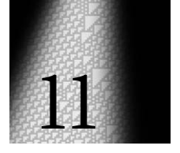
<!-- ORIGINAL_FIGURES page=0653 end -->

# 计算的概念

## 作为框架的计算

在本书前面部分，我们已经看到许多例子，展示元胞自动机以及其他具有简单底层规则的系统能够产生哪些种类的行为。在本章和下一章中，我的目标是发展一个一般框架，用来思考这类行为。

传统科学的经验也许会提示，标准数学分析应当为任何这样的框架提供恰当基础。但正如我们在上一章看到的，这类分析往往只有在所研究的整体行为相当简单时才有用。

那么，当行为更复杂时，人们该怎么办？

如果传统科学是我们的唯一指南，那么到这里我们大概会相当卡住。但我写作本书的目的，正是发展一种新的科学，使得在这类情况下仍然能够取得进展。而在许多方面，支撑这种新科学的唯一最重要思想，就是计算这个概念。

贯穿本书，我一直把元胞自动机这样的系统称为简单计算机程序。因此，现在关键就是实际按照这些系统能够执行的计算来思考它们。

在典型情况下，像元胞自动机这样的系统的初始条件可以被看作对应于某个计算的输入，而若干步之后系统的状态则对应于输出。于是关键思想就是以纯粹抽象的方式思考所执行的计算，而不必一定查看它实际怎样工作的所有细节。

[[PDF page 654]]

<!-- ORIGINAL_FIGURES page=0654 start -->
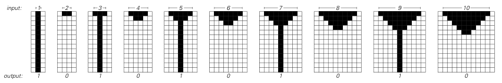
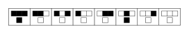
<!-- ORIGINAL_FIGURES page=0654 end -->

为什么这样的抽象有用？主要原因在于，它潜在地允许人们以统一方式讨论底层规则完全不同的系统。因为即使两个系统的内部工作方式几乎没有共同点，它们执行的计算仍然可能非常相似。

通过按这类计算来思考，人们就可以想象提出一些原则，适用于种类极其广泛的不同系统，而不依赖于它们底层规则的详细结构。

## 元胞自动机中的计算

我说过，像元胞自动机这样的系统的演化可以被看作一种计算。但它是什么样的计算？它与我们通常在实践中进行的计算相比如何？

下面的图像显示了一个元胞自动机例子，它的演化可以被看作执行某个特定的简单计算。

如果从偶数个黑色元胞开始运行这个元胞自动机，那么经过几步演化之后，就不会剩下任何黑色元胞。但如果从奇数个黑色元胞开始，那么就会有一个黑色元胞永远存活。因此，这个元胞自动机实际上可以被看作在计算一个给定数是偶数还是奇数。

一个简单元胞自动机，其演化实际上计算一个数除以 2 后的余数。从一行 `n` 个黑色元胞开始，如果 `n` 为偶数，就有 0 个黑色元胞存活；如果 `n` 为奇数，就有 1 个黑色元胞存活。该元胞自动机遵循左侧所示的初等规则 132。

[[PDF page 655]]

<!-- ORIGINAL_FIGURES page=0655 start -->
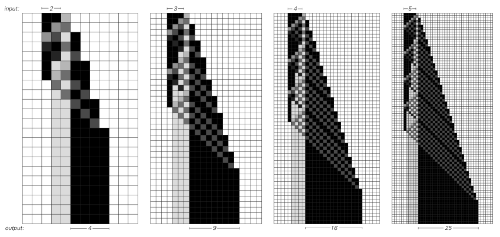
<!-- ORIGINAL_FIGURES page=0655 end -->

人们通过设置适当数量的初始黑色元胞来指定计算的输入。然后通过查看最终有多少黑色元胞存活，来确定计算结果。

按大多数尺度衡量，检验一个数是偶数还是奇数是一个相当简单的计算。但人们也可以让元胞自动机做更复杂的计算。作为一个例子，下面的图像显示了一个计算任意数平方的元胞自动机。如果例如从 5 个黑色方格开始，那么经过一定步数之后，元胞自动机会产生一个恰好由 `5 x 5 = 25` 个黑色方格组成的块。

一个计算任意数平方的元胞自动机。该元胞自动机实际上通过把原数 `n` 加上自身 `n` 次来工作。这里使用的底层规则让每个元胞有八种可能颜色。

一开始，一个具有元胞自动机这样简单底层结构的系统竟然能够被安排来执行这样的计算，也许显得令人惊讶。但正如我们将在本章稍后看到的，元胞自动机事实上能够执行实际上任意精巧的计算。作为一种稍微更精巧的计算的例子，下一页的图像显示了一个计算连续素数 `2, 3, 5, 7, 11, 13, 17` 等的元胞自动机。

[[PDF page 656]]

<!-- ORIGINAL_FIGURES page=0656 start -->
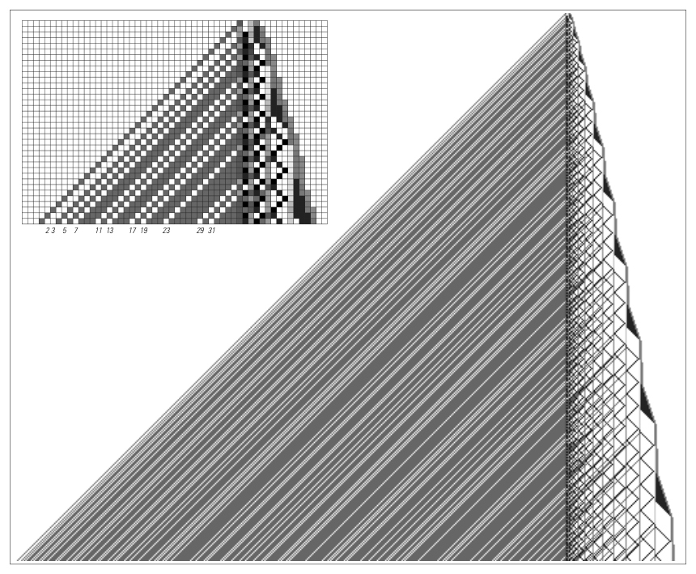
<!-- ORIGINAL_FIGURES page=0656 end -->

这个元胞自动机的规则有些复杂，每个元胞总共有十六种可能颜色，但这个例子展示了这样一点：原则上，元胞自动机可以计算素数。

一个被构造来计算素数的元胞自动机。系统在左侧所有对应于除 1 之外的数之乘积的位置产生一条深灰色条纹。随后，白色空隙保留在对应于素数 `2, 3, 5, 7, 11, 13, 17` 等的位置。这个元胞自动机实际上使用标准埃拉托色尼筛法来进行计算。右侧结构以对应于连续奇数的重复周期来回反弹。每个周期中它们产生一次向左传播的灰色条纹，因此最终每个数的每个倍数都对应于一条灰色条纹。这里显示的元胞自动机规则让每个元胞有 16 种可能颜色。

[[PDF page 657]]

<!-- ORIGINAL_FIGURES page=0657 start -->
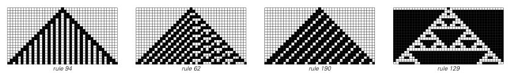
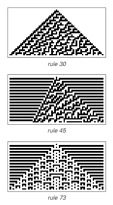
<!-- ORIGINAL_FIGURES page=0657 end -->

那么，本书前面讨论过的元胞自动机又怎样？它们能够执行什么种类的计算？

在某个层面上，任何元胞自动机，或者就此而言任何系统，都可以被看作执行一种计算，用来确定其未来行为将是什么。

但对于本节中我讨论的元胞自动机，碰巧它们执行的计算也可以方便地用传统数学概念描述。

而事实证明，对于本书前面讨论过的一些元胞自动机，也可以做到这一点。因此，例如如下图所示，规则 94 实际上可以描述为枚举偶数。类似地，规则 62 可以被认为枚举 3 的倍数，规则 190 枚举 4 的倍数。而如果查看规则 129 所产生图案的中心列，它可以被认为枚举 2 的幂。

一些简单元胞自动机的例子，其演化对应于可以用传统数学术语轻易描述的计算。类比上一页，规则 94 图像底部白色元胞的位置对应于偶数，规则 62 左侧对应于 3 的倍数，规则 190 对应于 4 的倍数，规则 129 的中心列对应于 2 的幂。

但右侧这些元胞自动机正在执行什么种类的计算？如果把它们产生的图案与本节到目前为止看到的图案比较，我们立刻会怀疑，不能用任何像“它们生成素数”这样简单的说法来描述这些计算。

那么我们究竟怎样才能期望描述这些计算？传统数学帮不上太多忙，但我们将看到，实用计算中熟悉的一组思想，至少提供了所需框架的开端。

一些元胞自动机例子：它们有简单底层规则，但整体行为似乎并不对应于任何可用标准数学或其他术语给出简单描述的计算。

[[PDF page 658]]

## 通用性现象

在上一节中我们看到，可以让元胞自动机执行一些相当精巧的计算。但对于每个我们想做的特定计算，总是要设置一个具有不同底层规则集合的元胞自动机。事实上，我们关于机械装置和其他装置的日常经验也可能让我们假定，一般而言，为了执行不同种类的任务，我们总是必须使用具有不同底层构造的系统。

但启动计算机革命的非凡发现是：事实并非如此。相反，人们可以构造通用系统，其底层构造保持固定，却只需以不同方式编程，就能执行不同任务。

事实上，这正是实用计算机工作的方式：计算机硬件保持固定，但通过载入不同软件片段，计算机就可以为不同任务编程。

通用性的思想也是计算机语言的基础。因为在每种语言中，都有某个原始操作集合，然后这些操作以不同方式串接起来，为不同任务创造程序。

特定计算机系统或计算机语言的细节当然会影响执行某个特定任务的容易程度。但如今已经成为常识的关键事实是，通过恰当编程，任何计算机系统或计算机语言最终都可以被安排来执行完全相同的一组任务。

一种看出这必定为真的方式，是注意到任何特定计算机系统或计算机语言，总可以通过恰当编程被设置为模拟任何另一个系统或语言。

通常这样做的方式，是让被模拟系统中的每个单独动作由另一系统中的某个动作序列重现。事实上，这最终也是例如 Mathematica 的工作方式。因为当人们输入像 `Log[15]` 这样的命令时，实际发生的是，实现 Mathematica 语言的程序通过在所用计算机系统上执行适当的机器指令序列来解释这个命令。

[[PDF page 659]]

既然已经在实用计算的语境中识别出通用性现象，人们立刻就能在普通经验的其他领域看到它的各种类似物。人类语言提供了一个例子。因为人们知道，给定一种固定底层语言，可以描述几乎任意广泛范围的事物。给定任意两种语言，在大多数情况下总可以在它们之间翻译。

那么自然科学又怎样？通用性现象在那里也相关吗？尽管通用性在计算以及其他领域极为重要，但事实证明，过去它从未在自然科学中被严肃考虑过。

但我将在本章和下一章中显示，事实上通用性在寻找一般方法以刻画和理解我们在自然系统中看到的复杂性时，例如是至关重要的。

基本点在于，如果一个系统是通用的，那么它实际上必定能够模拟任何其他系统，因此它必定能够产生与任何其他系统行为一样复杂的行为。所以，知道某个特定系统是通用的，就立刻意味着该系统能够产生在某种意义上任意复杂的行为。

但现在的问题是，事实上哪些种类的系统是通用的。

例如，大多数当代机械装置只为相当特定的任务而建造，并不是通用的。在电子装置中，也有简单计算器和电子通讯录这类并不通用的例子。但到目前为止，绝大多数实用电子装置尽管表面差异巨大，却都基于通用计算机。

不过，在某个层面上，这些计算机往往极其相似。事实上，它们基本上都基于同类逻辑电路、同样的数据通路基本布局等等。知道这一点后，人们也许会得出结论，任何通用系统都必须包含这些特定元素的直接类似物。但从计算机语言的经验中，已经有迹象表明，通用系统的范围也许要宽一些。

[[PDF page 660]]

事实上，Mathematica 是一个特别好的例子，在其中人们可以选择非常不同的操作集合来使用，却仍然能够实现完全同样种类的程序。

那么元胞自动机以及其他具有简单规则的系统又怎样？这类系统是否可能是通用的？

起初，这似乎相当不可信。因为人们从实用计算机和计算机语言中得到的直觉似乎提示，要实现通用性，必须存在一些从根本上相当精巧的元素。

但正如我们发现“简单规则不能导致复杂行为”这种直觉是错误的一样，“简单规则不能通用”这种直觉也同样证明是错误的。事实上，在本章稍后，我会展示一个具有极其简单底层规则的元胞自动机例子，尽管如此，它最终可以被看出是通用的。

过去，人们往往假定通用性以某种方式是一种罕见而特殊的品质，通常只由专门构造来拥有它的系统具备。但本章的一个结果是，事实上通用性是一种广泛得多的现象。在下一章中，我将论证，例如它也出现在我们在自然界中看到的许多重要系统中。

## 一个通用元胞自动机

作为表现出通用性的系统的第一个具体例子，本节讨论一个特定的通用元胞自动机；它被设置成使其运作尽可能容易跟随。

这个元胞自动机自身的规则始终相同。但它是通用的这一事实意味着，如果给它适当初始条件，它实际上可以被编程来模拟例如任何可能的元胞自动机，无论其规则集合是什么。

接下来三页显示了三个例子。

[[PDF page 661]]

<!-- ORIGINAL_FIGURES page=0661 start -->
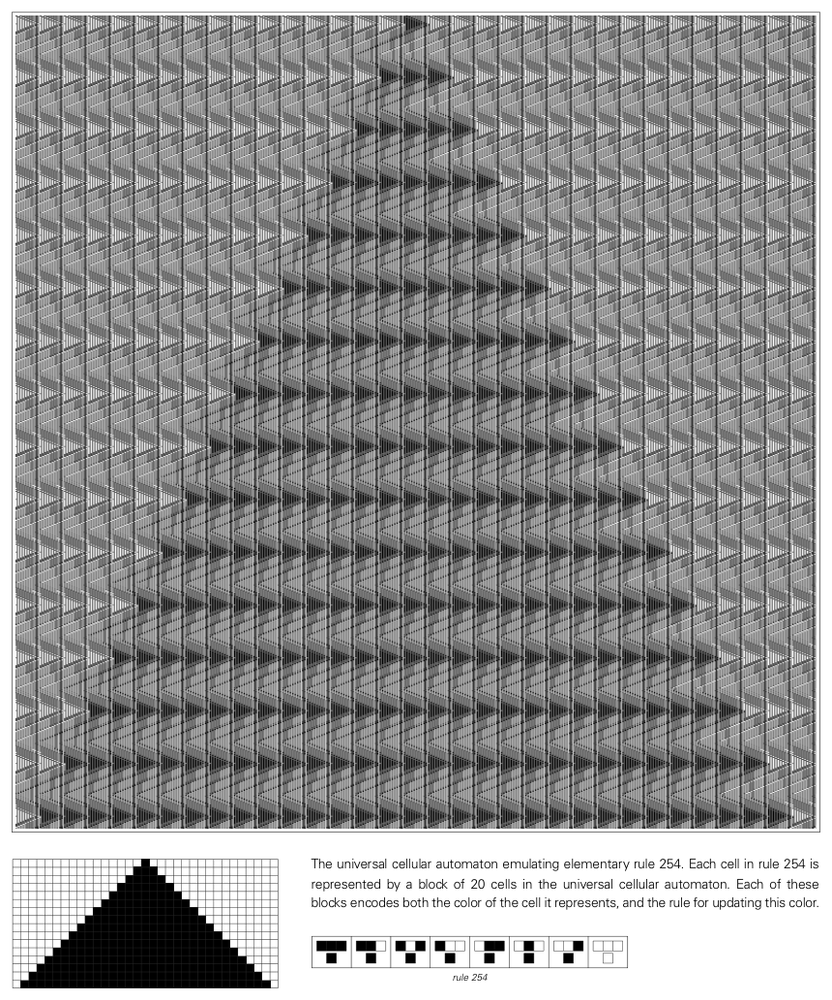
<!-- ORIGINAL_FIGURES page=0661 end -->

通用元胞自动机模拟初等规则 254。规则 254 中的每个元胞由通用元胞自动机中的一个 20 元胞块表示。每个这样的块既编码它所表示元胞的颜色，也编码更新该颜色的规则。

[[PDF page 662]]

<!-- ORIGINAL_FIGURES page=0662 start -->
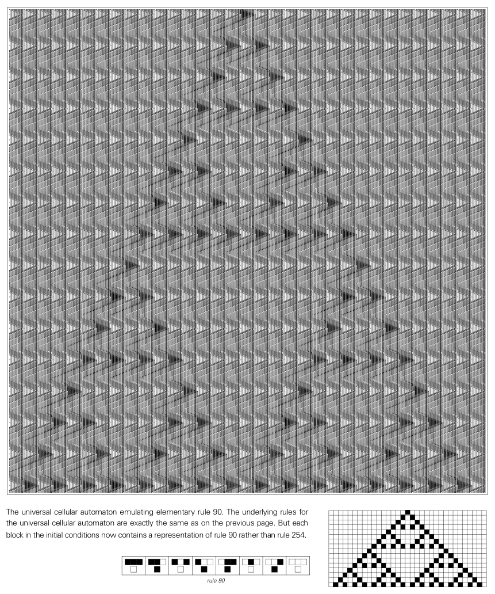
<!-- ORIGINAL_FIGURES page=0662 end -->

通用元胞自动机模拟初等规则 90。通用元胞自动机的底层规则与上一页完全相同。但初始条件中的每个块现在包含的是规则 90 而非规则 254 的表示。

[[PDF page 663]]

<!-- ORIGINAL_FIGURES page=0663 start -->
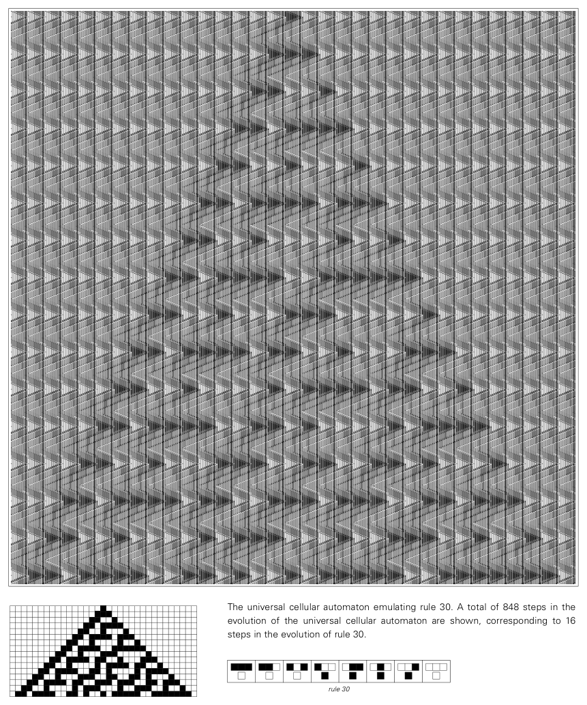
<!-- ORIGINAL_FIGURES page=0663 end -->

通用元胞自动机模拟规则 30。图中显示了通用元胞自动机演化的 848 步，对应于规则 30 演化的 16 步。

[[PDF page 664]]

<!-- ORIGINAL_FIGURES page=0664 start -->
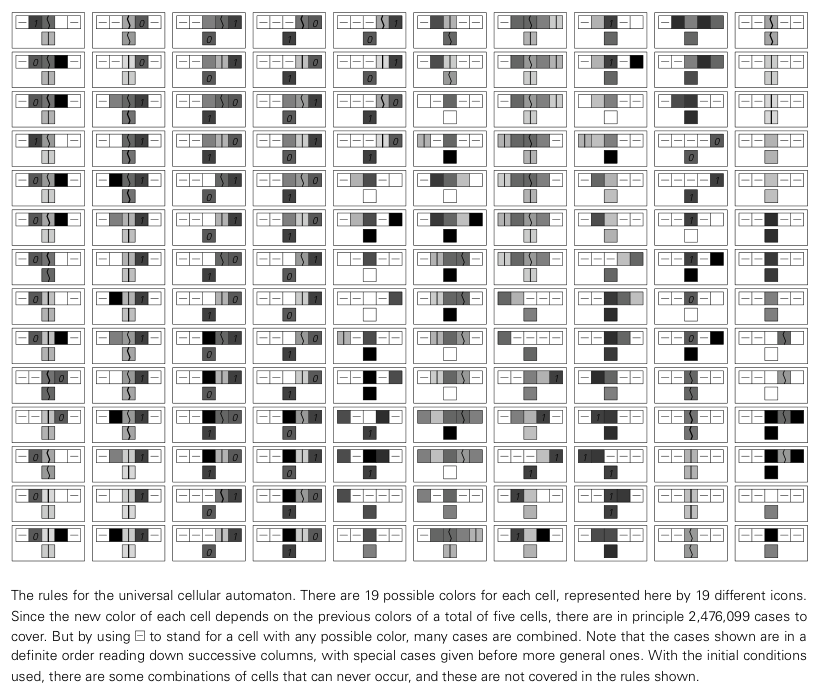
<!-- ORIGINAL_FIGURES page=0664 end -->

每一页上，通用元胞自动机的底层规则完全相同。但第一页中，初始条件被设置为让通用元胞自动机模拟规则 254；第二页中被设置为让它模拟规则 90；第三页中则模拟规则 30。

后面几页显示了这是怎样工作的。基本思想是，用通用元胞自动机中的一个 20 元胞块表示被模拟元胞自动机中的每一个单独元胞。而在这个 20 元胞块内部，既编码了被表示元胞当前颜色的说明，也编码了该颜色应当怎样更新的规则。

通用元胞自动机的规则。每个元胞有 19 种可能颜色，这里用 19 个不同图标表示。由于每个元胞的新颜色取决于总共五个元胞此前的颜色，原则上有 2,476,099 种情况需要覆盖。但通过使用表示可以为任意颜色的元胞的通配图标，许多情况被合并。注意，所示情况按照连续列从上到下阅读有确定顺序，特殊情况列在更一般情况之前。对于所使用的初始条件，有些元胞组合永远不会出现，因此没有包含在所示规则中。

[[PDF page 665]]

<!-- ORIGINAL_FIGURES page=0665 start -->
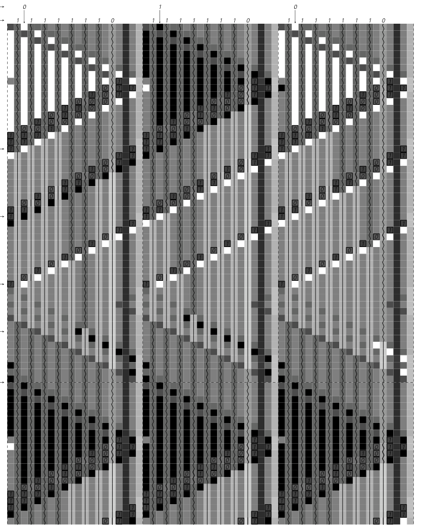
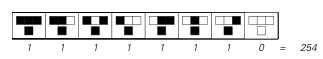
<!-- ORIGINAL_FIGURES page=0665 end -->

下图显示通用元胞自动机怎样模拟规则 254 的细节。通用元胞自动机中的每个块都表示规则 254 中的单个元胞，并同时编码该元胞的当前颜色以及用于更新它的规则形式。

[[PDF page 666]]

<!-- ORIGINAL_FIGURES page=0666 start -->
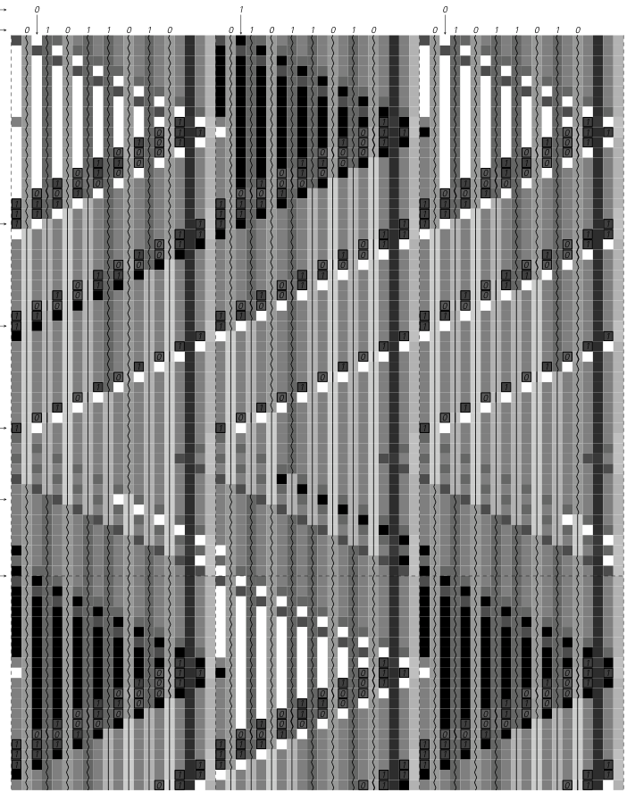
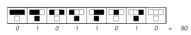
<!-- ORIGINAL_FIGURES page=0666 end -->

通用元胞自动机怎样模拟规则 90 的细节。与上一页图像中的初始条件相比，唯一差异是每个块现在编码的是规则 90，而不是规则 254。

[[PDF page 667]]

<!-- ORIGINAL_FIGURES page=0667 start -->
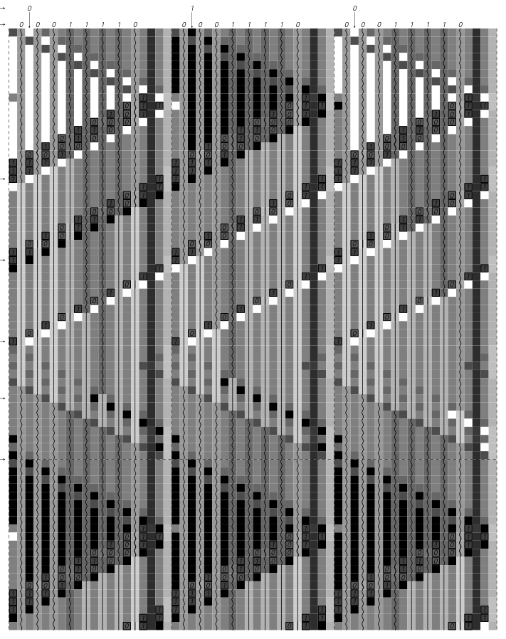
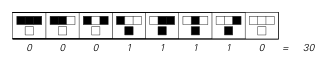
<!-- ORIGINAL_FIGURES page=0667 end -->

下图显示通用元胞自动机怎样模拟规则 30 的细节。再次，与面对页相比，初始条件的唯一差异是每个块现在编码的是规则 30，而不是规则 90。

[[PDF page 668]]

在所示例子中，被模拟的元胞自动机规则中有 8 种情况，每种情况给出一个元胞及其直接邻居的 8 种可能颜色组合之一的结果。在通用元胞自动机的每个 20 元胞块中，这些规则以非常直接的方式编码：按顺序列出 8 种可能情况各自的结果。

为了更新某个特定块所表示元胞的颜色，通用元胞自动机随后必须确定 8 种情况中哪一种适用于该元胞。它这样做的方式是依次消除不适用的情况，直到最终只剩下一种情况。这个消除过程可以在前几页图像中相当直接地看到。在每个大的黑色或白色三角形下方，最初有 8 条竖直深色线。每条线对应于规则中的 8 种情况之一，而系统被设置成，一旦某条线对应的情况被消除，该线就结束。

碰巧的是，在这里讨论的通用元胞自动机中，某个给定元胞的消除过程总是发生在表示该元胞的块左侧紧邻的块中。但这个过程本身并不太难理解；事实上，它的工作方式非常类似人们对实际电子逻辑电路的预期。

可以在图像中看到三个基本阶段，表现为三条向左穿过每个块的条纹。第一条条纹携带左侧邻居的颜色，并导致规则中所有该邻居不具有适当颜色的情况被消除。接下来两条条纹则携带元胞自身以及其右侧邻居的颜色。三条条纹全都经过之后，8 种情况中始终只剩下一种，而这一种就是给出该元胞新颜色的情况。

过去几页图像已经显示，通用元胞自动机实际上可以被编程来模拟任何规则涉及最近邻、且每个元胞有两种可能颜色的元胞自动机。但通用元胞自动机绝不限于只模拟涉及最近邻的规则。因此，例如在面对页上，它被显示为模拟一种既涉及次近邻也涉及最近邻的规则。

[[PDF page 669]]

<!-- ORIGINAL_FIGURES page=0669 start -->
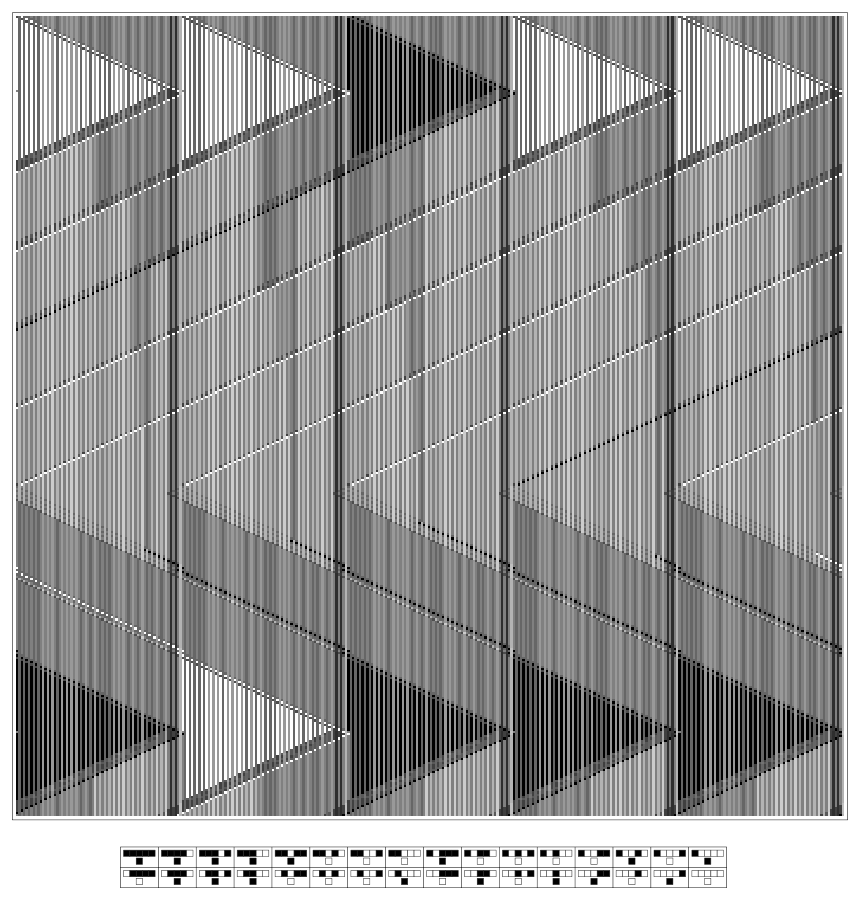
<!-- ORIGINAL_FIGURES page=0669 end -->

通用元胞自动机模拟上方所示规则一步演化，该规则既涉及次近邻元胞，也涉及最近邻元胞。现在规则覆盖总共 32 种情况，对应于一个元胞及其最近邻和次近邻颜色的可能排列。图像显示五个元胞按照所示规则演化，每个元胞现在由通用元胞自动机中的一个 70 元胞块表示。

[[PDF page 670]]

表示每个元胞所需的块现在更大，因为它们必须包括规则中的全部 32 种情况。消除阶段也不是三个，而是五个。但尽管有这些差异，通用元胞自动机的底层规则仍然完全相同。

如果规则让每个元胞有两种以上可能颜色，又怎样？事实证明，有一种一般方法可以用只有两种颜色但有更多邻居的规则来模拟这类规则。面对页的图像显示了一个例子。其思想是，三色元胞自动机中的每个元胞由二色元胞自动机中的一个三元胞块表示。通过查看两侧距离五以内的邻居，二色元胞自动机可以在每一步更新这些块，使其与三色元胞自动机的规则直接对应。

同样的基本方案可以用于具有任意颜色数的规则。因此结论是，通用元胞自动机最终可以模拟具有绝对任何规则集合的元胞自动机，无论这些规则涉及多少邻居和多少颜色。

这是一个重要且起初令人惊讶的结果。其中一个含义是，通用元胞自动机可以模拟规则比它自身更复杂的元胞自动机。如果不知道基本的通用性现象，人们很可能会假定，使用更复杂规则时，总能产生新的、不同种类的行为。

但通过研究本节中的通用元胞自动机，我们现在知道事实并非如此。因为给定通用元胞自动机，总是实际上可以把这个元胞自动机编程为模拟任何其他元胞自动机，因此产生其他元胞自动机能够产生的任何行为。

因此，从某种意义上说，我们现在可以看到，使用比通用元胞自动机规则更复杂的规则，永远不能获得任何根本性东西。因为给定通用元胞自动机，更复杂的规则总可以只通过设置适当初始条件来模拟。

[[PDF page 671]]

<!-- ORIGINAL_FIGURES page=0671 start -->
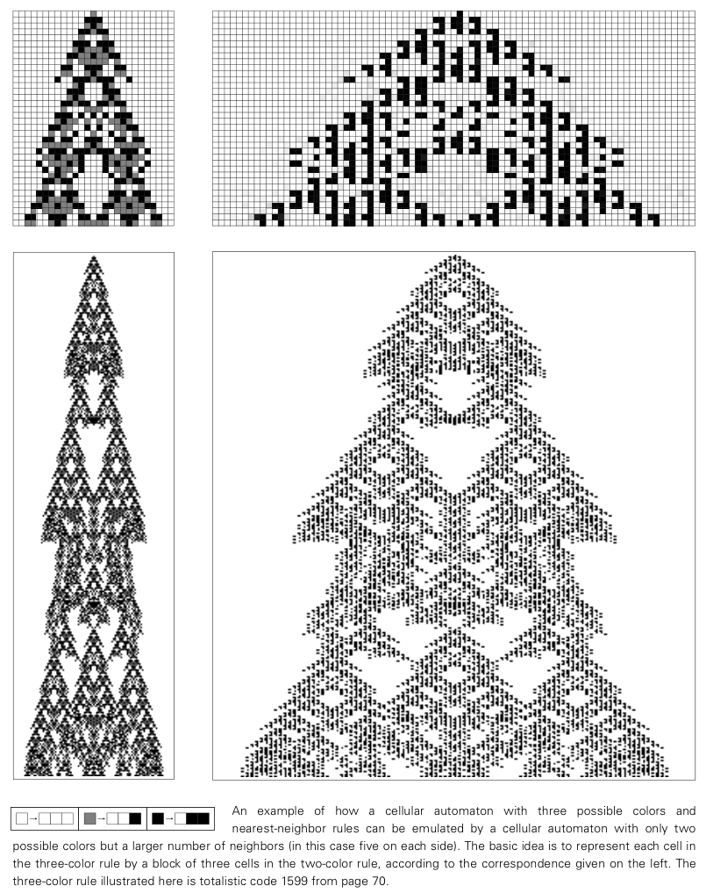
<!-- ORIGINAL_FIGURES page=0671 end -->

一个例子，说明具有三种可能颜色和最近邻规则的元胞自动机，怎样可以由只有两种可能颜色但邻居数量更多的元胞自动机模拟（在此例中为每侧五个）。基本思想是，按照左侧给出的对应关系，用二色规则中的一个三元胞块表示三色规则中的每个元胞。这里说明的三色规则是第 70 页中的总和型代码 1599。

[[PDF page 672]]

不过，查看本节中讨论的这个具体通用元胞自动机，我们大概会被引向这样的假定：通用性现象也许原则上重要，但很少在实践中相关。因为本节中通用元胞自动机的规则相当复杂，每个元胞涉及 19 种可能颜色，并且既涉及次近邻也涉及最近邻。如果这样的复杂性确实是实现通用性所必需的，那么人们就不会期望通用性在例如我们自然界中看到的系统里很常见。

但我们将在本章稍后发现，底层规则中事实上并不需要这样的复杂性。事实上，最终我们会看到，通用性实际上可以出现在只有两种颜色和最近邻的元胞自动机中。这类元胞自动机的运作，比本节讨论的通用元胞自动机难跟随得多。但具有如此简单底层规则的通用元胞自动机的存在，清楚表明我们在本节得到的基本结果具有潜在的极其广泛意义。

## 用元胞自动机模拟其他系统

上一节显示，某个特定通用元胞自动机可以模拟任何可能的元胞自动机。但其他类型的系统又怎样？元胞自动机是否也能模拟它们？

鉴于元胞自动机简单且相当特定的底层结构，人们也许会认为它们绝不可能模拟范围非常广泛的其他系统。但我将在本节显示，事实并非如此；最终，元胞自动机实际上可以被安排来模拟本书中讨论过的几乎每一种系统。

作为第一个例子，面对页上的图像显示了怎样让元胞自动机模拟移动自动机。

移动自动机与元胞自动机的主要差异是，在移动自动机中有一个特殊活跃元胞，它会从一步到下一步四处移动；而在元胞自动机中，所有元胞始终实际上都被完全同等对待。

[[PDF page 673]]

<!-- ORIGINAL_FIGURES page=0673 start -->
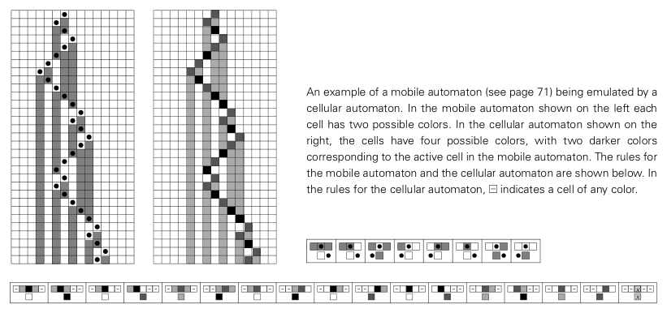
<!-- ORIGINAL_FIGURES page=0673 end -->

一个移动自动机（见第 71 页）由元胞自动机模拟的例子。左侧所示移动自动机中，每个元胞有两种可能颜色。右侧所示元胞自动机中，元胞有四种可能颜色，其中两种较深颜色对应于移动自动机中的活跃元胞。移动自动机和元胞自动机的规则显示在下方。在元胞自动机规则中，通配标记表示任意颜色的元胞。

事实证明，要用元胞自动机模拟移动自动机，所需做的只是把元胞自动机中元胞的可能颜色分成两组：较浅的一组对应于移动自动机中的普通元胞，较深的一组对应于活跃元胞。然后，通过设置适当规则并选择只包含一个较深元胞的初始条件，就可以在元胞自动机中精确模拟移动自动机每一步的演化，如上图所示。

同样的基本方法可以用来构造一个模拟图灵机的元胞自动机，如下一页所示。再次，元胞自动机中的较浅颜色表示图灵机中的普通元胞，而较深颜色表示读写头所在位置的元胞，每种可能的读写头状态对应一种特定较深颜色。

人们也许会认为，移动自动机和图灵机能够由元胞自动机模拟，是因为它们都像元胞自动机一样由固定元胞阵列组成。于是人们可能会问，例如没有固定元素阵列的替换系统会怎样。

[[PDF page 674]]

<!-- ORIGINAL_FIGURES page=0674 start -->
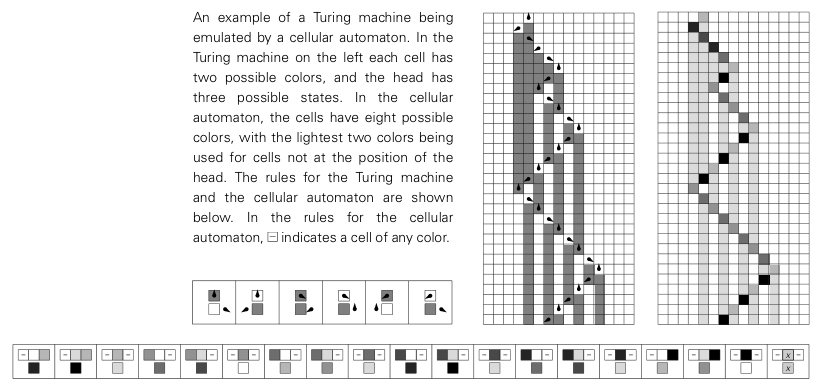
<!-- ORIGINAL_FIGURES page=0674 end -->

一个图灵机由元胞自动机模拟的例子。左侧图灵机中每个元胞有两种可能颜色，读写头有三种可能状态。在元胞自动机中，元胞有八种可能颜色，其中最浅的两种颜色用于不在读写头位置的元胞。图灵机和元胞自动机的规则显示在下方。在元胞自动机规则中，通配标记表示任意颜色的元胞。

面对页上的图像表明，事实上这些系统也可以由元胞自动机模拟。但尽管人们可以用一步元胞自动机演化来模拟移动自动机或图灵机演化中的每一步，对于替换系统而言，一般来说这不再是真的。

这最终必定如此，可以从以下事实看出：替换系统中元素总数可以从一步到下一步乘以某个因子，而在元胞自动机中，图案大小每一步最多只能增加固定量。这意味着，重现替换系统演化中的每个连续步骤，可能需要越来越多的元胞自动机步骤，如面对页图像所示。

同样的问题也出现在顺序替换系统以及标记系统中。但再次，如第 660 页的图像所示，使用元胞自动机模拟这类系统仍然完全可能。

不过，元胞自动机最终能模拟的系统集合到底有多广？到目前为止我展示的所有系统例子，在某个层面上都可以被认为涉及元素序列，而这些元素序列与元胞自动机中的元胞相当直接地类似。

[[PDF page 675]]

<!-- ORIGINAL_FIGURES page=0675 start -->
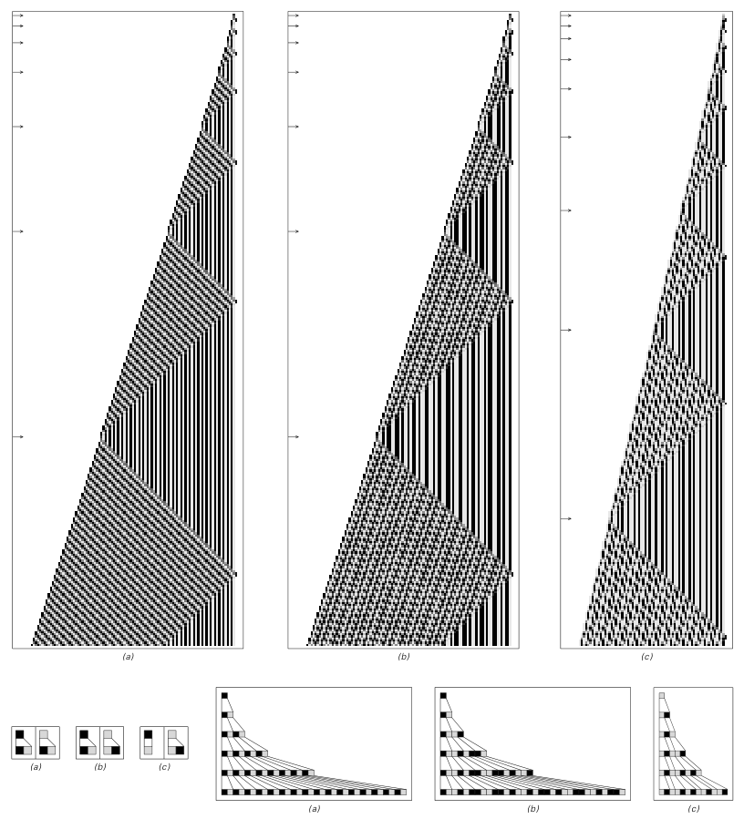
<!-- ORIGINAL_FIGURES page=0675 end -->

模拟替换系统的元胞自动机例子。每个替换系统演化的连续步骤在箭头所示位置获得。注意，元胞自动机生成的元素序列在右侧对齐，而所示替换系统图像中它们在左侧对齐。这三个元胞自动机的规则只涉及最近邻，并允许每个元胞有 12 种可能颜色。

[[PDF page 676]]

<!-- ORIGINAL_FIGURES page=0676 start -->
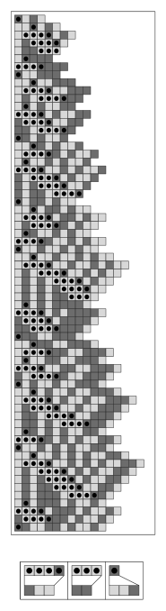
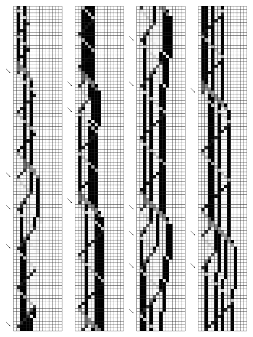
<!-- ORIGINAL_FIGURES page=0676 end -->

一个被设置来模拟顺序替换系统的元胞自动机。该元胞自动机涉及 28 种颜色和最近邻规则。顺序替换系统产生的字符串出现在右侧元胞自动机演化中由箭头标出的连续对角条纹上。

但寄存器机就是一个不存在这种直接类比的例子。起初人们也许不会想象，这样的系统竟然能被元胞自动机轻易模拟。

但事实上，如面对页顶部所示，做到这一点相当直接。基本思想是让元胞自动机产生一个在两侧扩张和收缩的图案，其方式对应于寄存器机中第一和第二寄存器数值大小的递增和递减。

[[PDF page 677]]

<!-- ORIGINAL_FIGURES page=0677 start -->
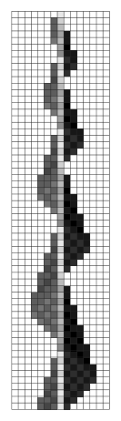
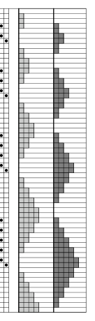
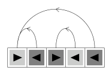
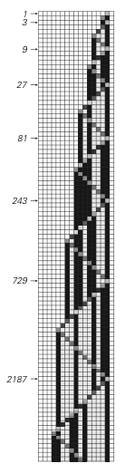
<!-- ORIGINAL_FIGURES page=0677 end -->

一个寄存器机由元胞自动机模拟的例子。元胞自动机中每个元胞有 12 种可能颜色。其中 5 种由中心元胞使用，用来表示寄存器机程序中已经到达的位置。其余 7 种用于实现向左和向右传播的信号，以完成对每个寄存器进行递增和递减的类似操作。

在元胞自动机中心有一个元胞，其可能颜色对应于寄存器机程序中可能的位置。随着这个元胞从一种颜色转变到另一种颜色，它实际上发出向左或向右移动的信号，以遵循寄存器机程序中的每条指令的方式修改元胞自动机中的图案。

那么基于数字的系统又怎样？它们也能由元胞自动机模拟吗？作为一个例子，右侧图像显示了怎样设置元胞自动机，让它对 2 进制数字反复乘以 3。在这种情况下，唯一真正困难的是，乘法过程中生成的进位可能需要从数字一端传播到另一端。

那么实用计算机又怎样？它们也能由元胞自动机模拟吗？根据刚讨论的寄存器机和基于数字的系统例子，我们已经知道，元胞自动机可以模拟计算机中通常出现的一些低层操作。接下来两页的图像显示，元胞自动机也可以被安排来模拟实用计算机的另外两个重要方面。

由一个具有 11 种颜色的元胞自动机执行 2 进制中的反复乘以 3。

[[PDF page 678]]

<!-- ORIGINAL_FIGURES page=0678 start -->
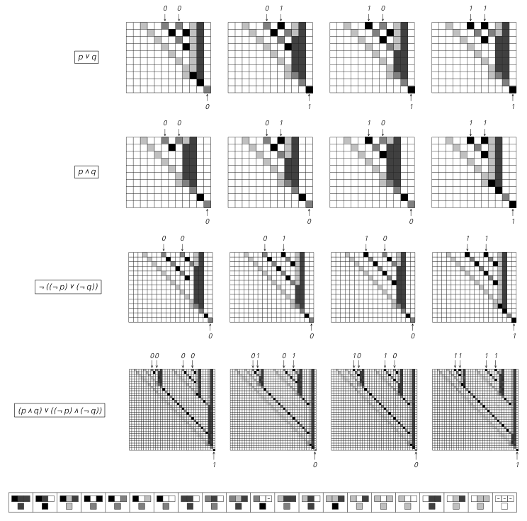
<!-- ORIGINAL_FIGURES page=0678 end -->

下面的图像显示了元胞自动机怎样能够求值以某种形式给出的任意逻辑表达式。面对页上的图像随后显示了元胞自动机怎样能够从实际上是随机访问内存的编号位置中取回数据。

一个模拟基本逻辑电路的元胞自动机。每种情况下，该元胞自动机的底层规则都完全相同，涉及最近邻以及每个元胞五种可能颜色。但初始条件可以表示一个逻辑表达式，其中涉及任意数量变量以及 AND、OR 和 NOT 运算。上面的例子使用两个变量 `p` 和 `q`，每种情况下都显示了 `p` 和 `q` 四种可能取值组合下得到的行为。

[[PDF page 679]]

<!-- ORIGINAL_FIGURES page=0679 start -->
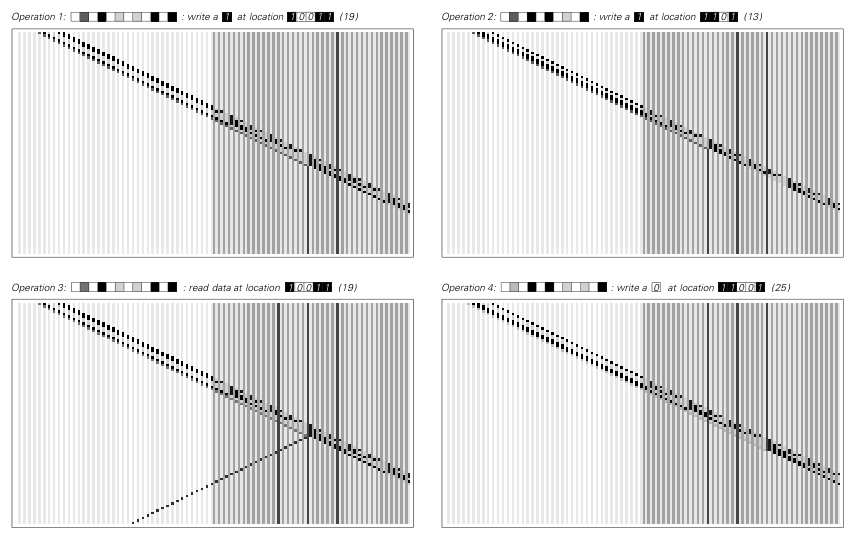
<!-- ORIGINAL_FIGURES page=0679 end -->

一个被设置来模拟计算机中随机访问内存的元胞自动机。内存在右侧，可以有任意大小。指令从左侧进入，内存位置由二进制数字组成的地址指定。

任意特定情况下的细节都相当复杂，但最终事实证明，原则上可以构造一个完整模拟实用计算机的元胞自动机。

因此，人们可以得出结论：实用计算机能够执行的极其广泛的任何计算，也都可以由元胞自动机完成。

根据上一节，我们知道任何元胞自动机都可以由一个通用元胞自动机模拟。但现在我们看到，通用元胞自动机实际上比上一节看到的还要通用得多。因为它不仅可以模拟任何元胞自动机，也可以模拟范围广泛的其他系统，包括实用计算机。

[[PDF page 680]]

<!-- ORIGINAL_FIGURES page=0680 start -->
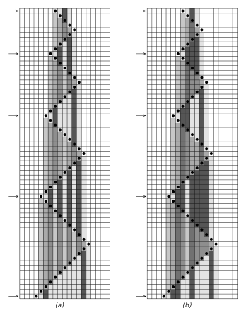
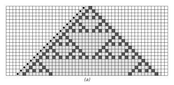
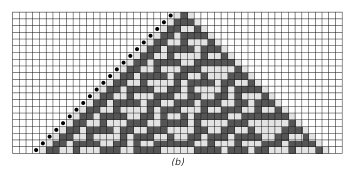
<!-- ORIGINAL_FIGURES page=0680 end -->

## 用其他系统模拟元胞自动机

上一节中，我们发现了一个相当非凡的事实：元胞自动机可以被设置来模拟极其广泛的其他类型系统。但这是否以某种方式是元胞自动机的特殊特征？还是其他系统也有类似能力？

本节中我们将发现，事实上上一节以及第 3 章中考虑过的几乎所有系统，都有同样能力。正如我们已经显示这些各种系统都能由元胞自动机模拟一样，现在我们将显示这些系统也能模拟元胞自动机。

作为第一个例子，下面的图像显示了怎样设置移动自动机来模拟元胞自动机。基本思想是让移动自动机中的活跃元胞来回扫过，在前进过程中更新元胞，使得每完成一次完整扫描之后，它实际上已经执行了元胞自动机演化的一步。

移动自动机模拟元胞自动机的例子。在情形 (a) 中，移动自动机的规则被设置来模拟规则 90 初等元胞自动机；在情形 (b) 中，它们被设置来模拟规则 30。右侧图像通过只保留左侧箭头所示步骤得到，这些步骤对应于移动自动机中的活跃元胞比之前任何时候都更靠左的位置。这里使用的移动自动机让每个元胞有 7 种可能颜色。

[[PDF page 681]]

<!-- ORIGINAL_FIGURES page=0681 start -->
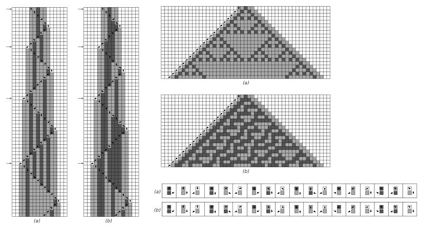
<!-- ORIGINAL_FIGURES page=0681 end -->

面对页底部的具体图像，是针对每个元胞有两种可能颜色且规则涉及最近邻的初等元胞自动机。但同样的基本思想可以用于具有任何种类规则的元胞自动机。这意味着，例如可以构造一个模拟几节之前讨论过的通用元胞自动机的移动自动机。

这样的移动自动机随后本身必定是通用的，因为它所模拟的通用元胞自动机又可以模拟范围广泛的其他系统，包括所有可能的移动自动机。

类似于移动自动机方案的办法也可以用于图灵机，如下面图像所示。再次，通过模拟通用元胞自动机，就可以构造一个通用图灵机。

但事实证明，早在 1936 年，人们已经用稍微不同的方法构造出一个通用图灵机。事实上，那个通用图灵机提供了历史上在任何系统中看到的第一个清楚通用性例子。

模拟规则 90 和规则 30 元胞自动机的图灵机例子。右侧图像通过只保留左侧箭头所示步骤得到。这些图灵机有 6 个状态，每个元胞有 3 种可能颜色。

[[PDF page 682]]

<!-- ORIGINAL_FIGURES page=0682 start -->
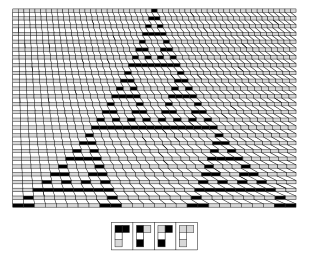
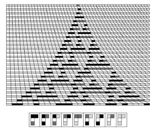
<!-- ORIGINAL_FIGURES page=0682 end -->

继续上一节中的系统类型，我们接下来来到替换系统。这里难得地发现，至少一开始，我们一般无法模拟元胞自动机。因为正如第 83 页讨论的，邻域无关替换系统只能生成重复或嵌套图案，因此永远不能产生例如模拟规则 30 所需的更复杂图案。

但如果推广到邻域相关替换系统，那么模拟元胞自动机立刻变得非常直接，如下图所示。

模拟规则 90 和规则 30 元胞自动机的邻域相关替换系统。所示系统是邻域相关替换系统的简单例子，其高度均匀的规则始终只产生一个元胞，并且与元胞自动机相当直接地对应。

顺序替换系统又怎样？这里事实证明也相当容易模拟元胞自动机，如面对页顶部的图像所示。

也许更令人惊讶的是，普通标记系统也同样如此。即使这类系统以极其简单的底层方式运作，面对页底部的图像也表明，它们仍然可以相当容易地模拟元胞自动机。

符号系统又怎样？这些系统的结构当然与元胞自动机大不相同。但再次，如第 668 页顶部的图像所示，让这些系统模拟元胞自动机相当容易。

[[PDF page 683]]

<!-- ORIGINAL_FIGURES page=0683 start -->
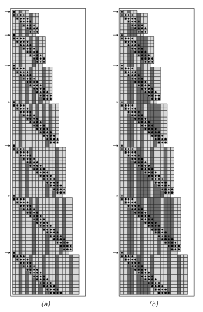
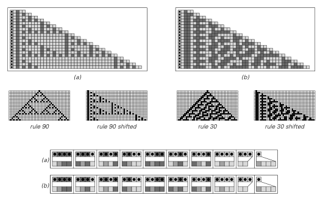
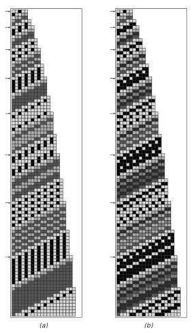
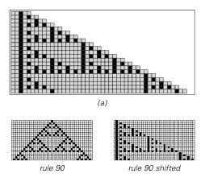
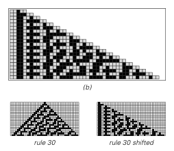
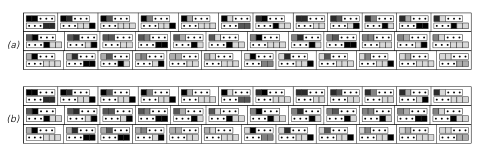
<!-- ORIGINAL_FIGURES page=0683 end -->

模拟规则 90 和规则 30 元胞自动机的顺序替换系统。上方顶部图像通过只保留左侧箭头所示步骤得到。这些顺序替换系统涉及具有 3 种可能颜色的元素。

模拟规则 90 和规则 30 元胞自动机的标记系统。上方顶部图像通过只保留左侧箭头所示步骤得到。两个标记系统都涉及 6 种颜色。

[[PDF page 684]]

<!-- ORIGINAL_FIGURES page=0684 start -->
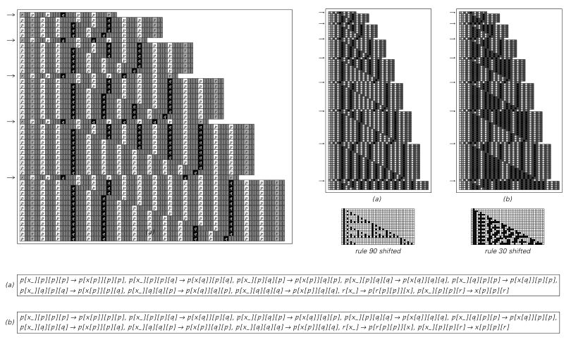
<!-- ORIGINAL_FIGURES page=0684 end -->

被设置来模拟规则 90 和规则 30 元胞自动机的符号系统。不同于第 3 章中只涉及一个符号的符号系统，这些符号系统涉及三个符号。

一旦知道某个特定类型的系统能够模拟任何元胞自动机，就立刻推出，该类型系统中必定存在通用例子。

那么第 3 章中我们考虑过的其他系统类型又怎样？这里尚未讨论的一类是循环标记系统。事实证明，本章稍后我们将正好使用这类系统，作为建立一个引人注目的通用性例子的一部分。

但要展示循环标记系统能够模拟元胞自动机，并不像对到目前为止讨论过的各种系统那样直接。事实上，我们最终会分几个阶段来做。第一阶段显示在面对页顶部图像中，是让循环标记系统模拟一个普通标记系统，该标记系统具有这样的性质：它的规则只依赖于每一步出现的第一个元素。

[[PDF page 685]]

<!-- ORIGINAL_FIGURES page=0685 start -->
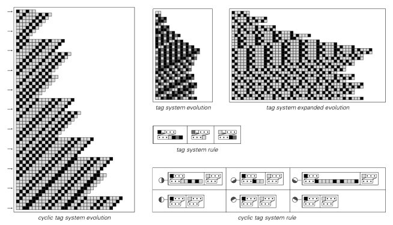
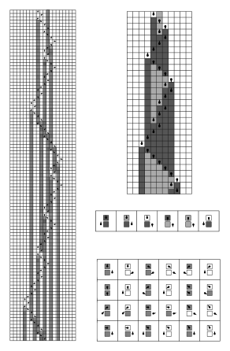
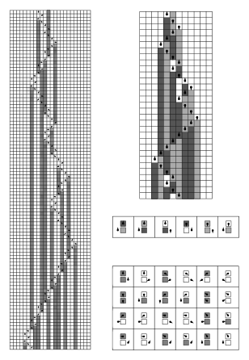
<!-- ORIGINAL_FIGURES page=0685 end -->

一个循环标记系统模拟一个每一步只依赖第一个元素的标记系统。在扩展的标记系统演化中，元素的连续颜色通过在一个固定白色元胞块内部的连续位置上放置黑色元胞来编码。

完成这一步后，下一阶段就是让这样的标记系统模拟图灵机。下一页的图像说明了怎样做到这一点。但至少对于所示特定构造，得到的图灵机只能具有两种可能颜色的元胞。不过，下面的图像表明，这样的图灵机很容易被安排来模拟具有任意更多颜色的图灵机。

具有两种颜色的图灵机模拟具有更多颜色的图灵机。

[[PDF page 686]]

<!-- ORIGINAL_FIGURES page=0686 start -->
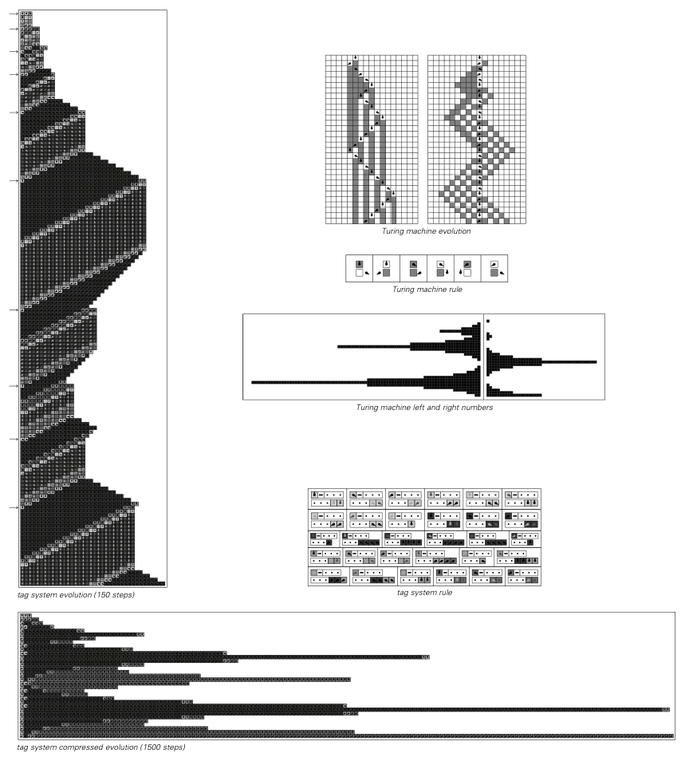
<!-- ORIGINAL_FIGURES page=0686 end -->

用每一步只依赖第一个元素的标记系统模拟图灵机。图灵机读写头两侧的元胞配置被看作 2 进制数字。在箭头所示步骤，标记系统产生深色元胞序列，其长度对应于这些数字中的每一个。

[[PDF page 687]]

<!-- ORIGINAL_FIGURES page=0687 start -->
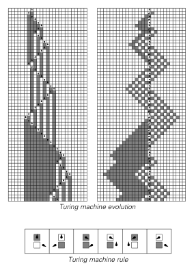
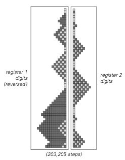
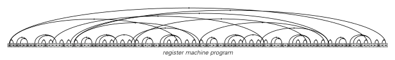
<!-- ORIGINAL_FIGURES page=0687 end -->

而通过第 665 页的构造，这最终显示循环标记系统可以成功模拟任何元胞自动机，因此可以是通用的。

这只剩下第 3 章中的一种系统类型：寄存器机。尽管这又稍微复杂一些，下一页以及下面的图像显示，即使这类系统也可以被安排来模拟图灵机，从而模拟元胞自动机。

一个寄存器机模拟比下一页稍微更复杂的图灵机。

那么像第 4 章中讨论过的基于数字的系统又怎样？作为一个例子，可以考虑第 122 页讨论的算术系统的一种推广：其中有一个整数 `n`，每一步先找到除以某个常数后的余数，然后根据这个余数的值，对 `n` 应用某个指定算术操作。

[[PDF page 688]]

<!-- ORIGINAL_FIGURES page=0688 start -->
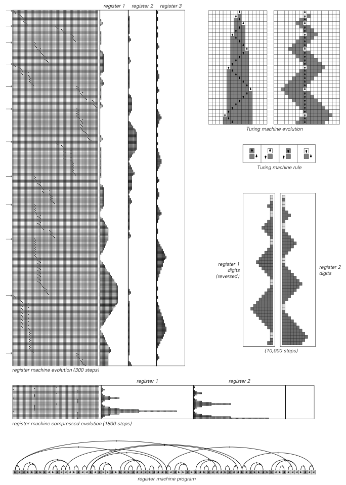
<!-- ORIGINAL_FIGURES page=0688 end -->

一个被设置来模拟图灵机的寄存器机例子。这里使用的图灵机有两个读写头状态；寄存器机程序有 72 条指令，并使用三个寄存器。寄存器机的压缩演化只保留每隔一次第三寄存器从零递增时对应的步骤。

[[PDF page 689]]

<!-- ORIGINAL_FIGURES page=0689 start -->
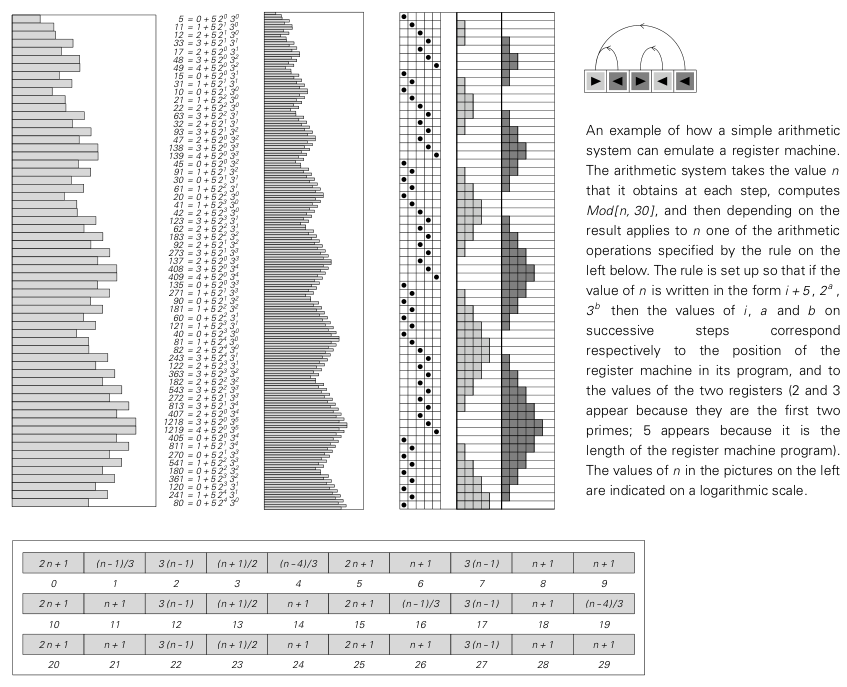
<!-- ORIGINAL_FIGURES page=0689 end -->

下面的图像显示，这样的系统可以被设置来模拟寄存器机。由于寄存器机是通用的，随之可知这类算术系统也是通用的。

事实上，可以基本只使用普通算术运算来设置一个通用系统，这一事实与第 784 页讨论的哥德尔定理证明密切相关。

但根据本章中我们学到的东西，算术能够实现通用性已不再显得令人惊讶。事实上，考虑到我们已经发现能够表现出通用性的所有系统类型，如果算术以某种方式不能支持通用性，那反而会相当奇怪。

一个简单算术系统怎样能够模拟寄存器机的例子。该算术系统取每一步得到的值 `n`，计算 `Mod[n, 30]`，然后取决于结果，把左下规则所指定的算术操作之一应用到 `n`。规则被设置成，如果 `n` 的值写成 `i + 5 x 2^a x 3^b` 的形式，那么连续步骤中的 `i`、`a` 和 `b` 的值，就分别对应于寄存器机在其程序中的位置，以及两个寄存器的值（2 和 3 出现是因为它们是前两个素数；5 出现是因为寄存器机程序的长度）。左侧图中的 `n` 值按对数尺度表示。

[[PDF page 690]]

## 通用性的含义

当我们在第 3 章中首次讨论元胞自动机、图灵机、替换系统、寄存器机等等时，这些种类的系统似乎相当不同。但已经在第 3 章中，我们发现，在整体行为层面，它们都有某些共同特征。现在，终于通过按照计算来思考，我们可以开始看到为什么情况会是这样。

前两节已经展示的要点是，所有这些各种系统，尽管底层结构差异巨大，最终本质上都可以被安排来彼此模拟。

这是一个非常非凡的结果，而且事实将证明，它对我在本书中发展的新科学至关重要。

从某种意义上说，它最重要的后果是，它意味着从计算角度看，极其广泛的系统，哪怕有非常不同的底层结构，在某个层面上也从根本上是等价的。因为人们也许会以为，例如第 3 章中讨论的每一种不同系统，都能够执行完全不同种类的计算。

但我们在这里发现，事实并非如此。相反，结果证明，这些系统中基本每一种最终都能执行完全相同种类的计算。

其中一个含义是，以纯粹抽象方式讨论计算概念确实有意义，而不必指称任何特定类型的系统。因为我们现在知道，最终使用哪种系统并不重要：到头来，基本任何种类的系统都可以被编程来执行相同计算。因此，如果我们在抽象层面研究计算，就可以期望得到的结果会适用于极其广泛的实际系统。

但必须强调，在任何特定类型的系统中，例如元胞自动机，并不是所有可能底层规则都能支持相同种类的计算。

事实上，正如本章开头看到的，一些元胞自动机只能执行非常简单的计算，例如总是产生纯粹重复图案。

[[PDF page 691]]

但关键点是，当人们查看具有逐渐更大计算能力的元胞自动机时，最终会越过通用性阈值。一旦越过这个阈值，可以执行的计算集合总是完全相同。

人们也许会假定，通过使用越来越精巧的底层规则，总能构造出计算能力越来越强的系统。但通用性现象意味着事实并非如此；一旦越过通用性阈值，在某种意义上就再也得不到更多东西。

事实上，一旦有了一个通用系统，它的性质就令人惊讶地独立于其构造细节。至少就它能够执行的计算而言，系统底层规则有多精巧并不重要，甚至该系统是元胞自动机、图灵机还是其他什么都不重要。正如我们将看到的，这个相当非凡的事实构成了解释我们在第 3 章所作许多观察的基础，并且也构成发展本书中新科学所需概念框架大部分内容的基础。

## 规则 110 元胞自动机

在前几节中，我已经显示，范围广泛的不同种类系统原则上都可以被安排来表现通用性现象。但在具体情况下，为了实际实现通用性，底层规则需要多复杂？

我在本章前面描述的通用元胞自动机有相当复杂的底层规则，涉及每个元胞 19 种可能颜色，并且依赖于次近邻以及最近邻。但这个元胞自动机是专门构造出来，使其运作容易理解的。如果不施加这个限制，人们也许会期望能够找到底层规则至少稍微简单一些的通用元胞自动机。

对本章前面显示的通用元胞自动机作相当直接的修改，可以把颜色数量从 19 降到 17。事实上，早在 1970 年代早期，人们已经知道，具有 18 种颜色和最近邻规则的元胞自动机可以是通用的。到 1980 年代后期，经过一些巧妙构造，也构造出了具有 7 种颜色的通用元胞自动机例子。

[[PDF page 692]]

<!-- ORIGINAL_FIGURES page=0692 start -->
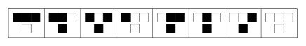
<!-- ORIGINAL_FIGURES page=0692 end -->

但这类规则仍然涉及 343 个不同情况，按几乎任何尺度衡量都非常复杂。而如此复杂的规则当然不能被合理期望在我们通常于自然界中看到的系统类型中常见。然而，根据我在 1980 年代早期对元胞自动机的实验，我确信简单得多的规则也应当显示通用性。到 1980 年代中期，我开始怀疑，即使在最简单的可能规则中，也就是只有两种颜色和最近邻的规则中，也可能有通用性的例子。

最主要候选者是我称为规则 110 的元胞自动机。事实上，我们已经在本书中多次讨论过它。像 256 个所谓初等规则中的任何一个一样，规则 110 可以如下指定：给出一个元胞及其最近邻的八种可能颜色组合各自的结果。

本节讨论的规则 110 元胞自动机的底层规则。和本书其他地方一样，八种情况中的每一种都显示一个元胞的新颜色应当怎样基于其自身此前颜色以及其邻居此前颜色来决定。尽管底层规则极端简单，本节将展示的是，规则 110 元胞自动机事实上是通用的，因此在某种意义上能够具有任意复杂行为。如果每个块中的元胞值标记为 `p`、`q` 和 `r`，那么规则 110 可以写成 `Mod[(1 + p) q r + q + r, 2]` 或等价的布尔表达式。

不过，只看这个非常简单的规格说明，起初认为规则 110 可能是通用的似乎相当荒谬。但只要看一幅规则 110 实际行为的图像，它可能通用的想法就开始显得远没有那么荒谬。因为尽管底层规则简单，规则 110 支持一整套局部结构，它们四处移动并以许多复杂方式相互作用。从面对页这样的图像看，开始显得并非不合理的是，也许这些局部结构可以被安排来执行有意义的计算。

[[PDF page 693]]

<!-- ORIGINAL_FIGURES page=0693 start -->
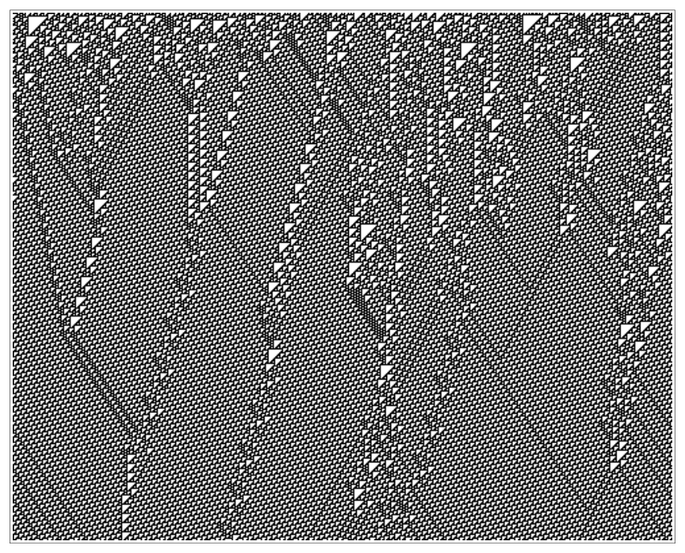
<!-- ORIGINAL_FIGURES page=0693 end -->

规则 110 在随机初始条件下行为的一个典型例子。从这样的图像中，人们可以开始想象，也许有可能安排规则 110 中的局部结构，使它们能够执行有意义的计算。注意，第 292 页已经显示了规则 110 中可能出现的许多局部结构类型。

在本章前面讨论的通用元胞自动机中，参与其运作的各种组件各自具有显式内建到底层规则中的性质。事实上，在大多数情况下，每种不同类型的组件只是由一种不同元胞颜色表示。但在规则 110 中，每个元胞只有两种可能颜色。因此人们也许会问，怎样可能期望表示不同种类的组件。

[[PDF page 694]]

关键思想是，用规则在某种意义上已经产生的局部结构组合来构建组件。如果这能奏效，那么它实际上是一种非常经济的方案。因为它潜在地允许人们得到大量不同种类的组件，而完全不需要增加底层规则的复杂性。

但这种方法的问题在于，通常很难看出一个特定元胞自动机中碰巧出现的各种结构怎样能够组装成有用组件。

事实上，在规则 110 的情况下，发展出必要思想和工具花了数年工作。但最终证明，规则 110 元胞自动机确实是通用的。

一个具有如此简单底层规则的系统，竟然能够执行实际上任意精巧的计算，这确实非常了不起，但这正是其通用性所蕴含的。

那么，通用性证明怎样进行？

基本思想是显示规则 110 能够模拟某一类系统中的任何可能系统，而这类系统已经知道存在通用性。事实证明，一类方便的系统就是我们在第 95 页引入的循环标记系统。

本章前面我们看到，可以构造一个能够模拟任何给定图灵机的循环标记系统。由于我们知道至少某些图灵机是通用的，这个事实就确立了通用循环标记系统是可能的。

所以，如果我们能够成功展示规则 110 可以模拟任何循环标记系统，那么就已经设法证明规则 110 本身是通用的。面对页上的一系列图像显示了所需内容的开端。基本思想是从循环标记系统的通常表示出发，然后逐步改变这种表示，使它越来越接近可以由规则 110 直接实际模拟的东西。

图像 (a) 显示了一个循环标记系统在第 95 和 96 页标准表示下的演化例子。图像 (b) 随后显示同一演化的另一个版本，但现在重新排列，使每个元素保持在同一位置，而不是每一步总是向左移动。

[[PDF page 695]]

<!-- ORIGINAL_FIGURES page=0695 start -->
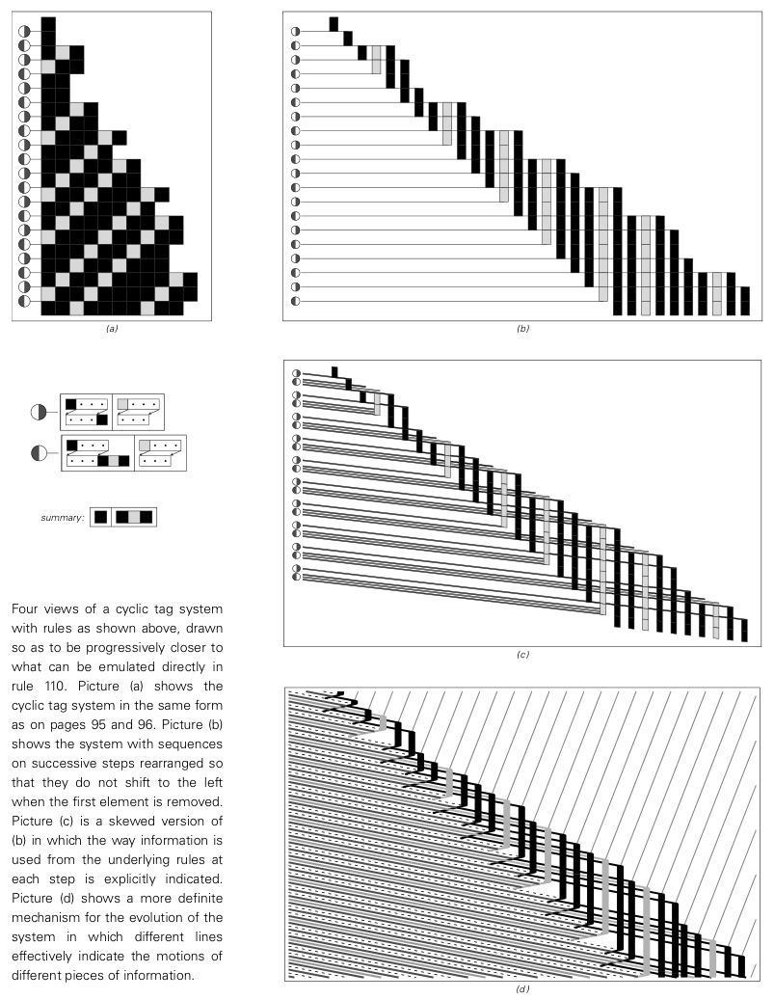
<!-- ORIGINAL_FIGURES page=0695 end -->

循环标记系统的四种视图，其规则如上所示，绘制方式逐步接近规则 110 可以直接模拟的形式。图像 (a) 以第 95 和 96 页相同形式显示循环标记系统。图像 (b) 显示该系统，其中连续步骤上的序列被重新排列，使它们在第一个元素被移除时不向左移动。图像 (c) 是 (b) 的一个倾斜版本，其中每一步怎样使用底层规则中的信息被显式标出。图像 (d) 显示了系统演化的一种更确定机制，其中不同线条实际上表示不同信息片段的运动。

[[PDF page 696]]

循环标记系统一般通过移除每一步存在序列中的第一个元素来运作；如果该元素为黑色，就向序列末尾添加一个新的元素块。循环标记系统的一个关键特征是，能够添加什么元素块的选择完全不依赖于序列的形式。因此，例如在上一页中，只有两种可能性，而这些可能性在连续步骤中交替出现。

上一页的图像 (a) 和 (b) 展示了应用循环标记系统规则的后果，但在某种意义上并没有指出这些规则可能由什么显式机制来应用。不过，在图像 (c) 中，我们看到了这种机制的开端。

基本思想是，在系统演化的每一步，有一条从左侧进入的条纹，携带关于该步可以添加的块的信息。然后，当这条条纹撞到该步存在序列中的第一个元素时，只有当该元素为黑色时才允许它通过。一旦通过，条纹继续向右，最终把它所代表的块添加到序列末尾。

但图像 (c) 虽然显示了各种携带信息的线条在系统中四处移动的效果，却没有说明这些线条为什么应当以它们所表现的方式行动。而图像 (d) 显示了一个明确得多的机制。从左侧进入的线条集合表示连续步骤中可以添加的块。每个块的开头由虚线表示，而块内元素由实心黑线和灰线表示。

当虚线撞到某个特定步骤中存在序列的第一个元素时，它实际上以一条向左传播、携带该第一个元素颜色的线的形式反弹。

当这条线为灰色时，它会吸收所有其他从左侧来的线，直到下一条虚线到达。但当这条线为黑色时，它会让从左侧来的线通过。随后这些线继续前进，直到与从右侧来的灰线相撞；在这时，它们生成一个与自身颜色相同的新元素。

通过查看图像 (d)，人们可以开始看出，循环标记系统怎样可能由规则 110 模拟：基本

[[PDF page 697]]

<!-- ORIGINAL_FIGURES page=0697 start -->
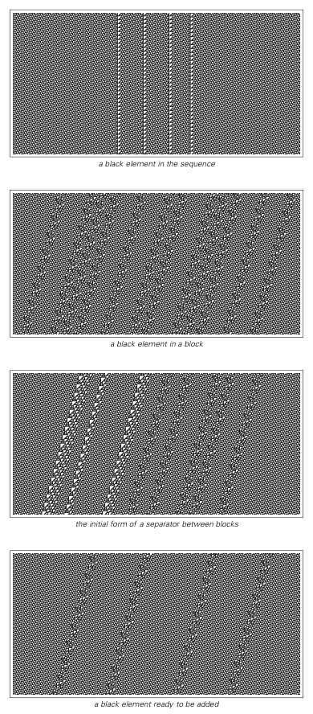
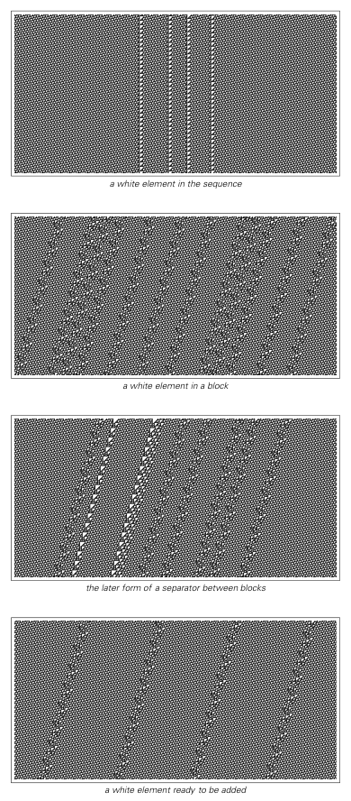
<!-- ORIGINAL_FIGURES page=0697 end -->

思想是让图中的每一种线，都由规则 110 中的某个局部结构集合来模拟。

规则 110 中由局部结构构造出的对象，用于模拟循环标记系统。每幅图像宽 500 个元胞。顶部两幅图像中的对象对应于第 679 页图像 (d) 中粗竖直黑线和灰线。接下来两幅图像中的对象对应于图像 (d) 中从左侧进入的深灰和浅灰线。（注意，在规则 110 中，所有结构都是左右反转的。）第三对图像对应于图像 (d) 中虚线的两个版本。第四对图像对应于图像 (d) 右侧向右运动的线。上面图像中涉及的所有局部结构都已在第 292 页单独显示。注意，结构之间的间距对于确定它们表示什么对象至关重要。

[[PDF page 698]]

但一开始完全不清楚，是否能够找到以适当方式行动的局部结构集合。

不过，经过一些努力，事实证明可以找到必要构造。事实上，上一页显示了由规则 110 中的局部结构形成的各种对象，它们可以用来模拟第 679 页图像 (d) 中大多数类型的线。

前两幅图像显示了对应于图像 (d) 中粗竖直线所标示黑色和白色元素的对象。这两个对象碰巧都由同样四个局部结构组成，但它们由这些结构之间的间距区分。

上一页的第二组两幅图像使用了同样思想，用局部结构之间的不同间距来表示第 679 页图像 (d) 中从左侧进入的黑线和灰线。

注意，由于规则 110 的特定形式，上一页第二组两幅图像中的对象向左而不是向右移动。事实上，在建立与规则 110 的对应时，把所有循环标记系统图像左右反转是方便的。随后，使用上一页中的各种对象，再加上少数其他对象，就可以用规则 110 设置对循环标记系统的完整模拟。

面对页上的示意图显示了这怎样做到。图中每条线对应于规则 110 中的一个单独局部结构，虽然整张图不能完全按比例绘制，但线条之间的碰撞正确显示了结构之间发生的所有基本相互作用。

随后几页给出示意图中由圆圈标出的每个区域内发生的事情的细节。

区域 (a) 显示一个块分隔符，对应于第 679 页图像 (d) 中的虚线，撞到第一步存在序列中的单个黑色元素。由于被撞到的元素是黑色的，必须产生一个允许该步块中信息通过的对象。区域 (a) 中大部分活动都与产生这样一个对象有关。但事实证明，作为副作用会产生两个额外的局部结构，它们可以被看到向左传播。

[[PDF page 699]]

<!-- ORIGINAL_FIGURES page=0699 start -->
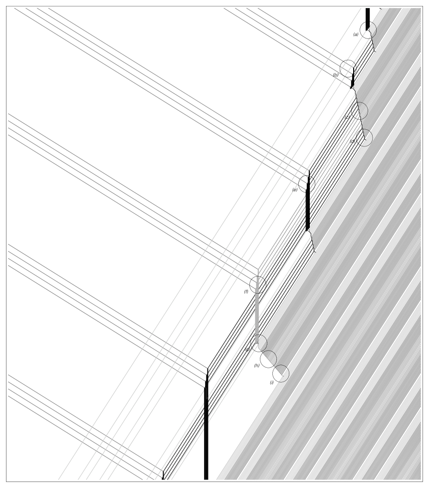
<!-- ORIGINAL_FIGURES page=0699 end -->

规则 110 怎样能够被安排来模拟循环标记系统的示意图。此图中的每条线都对应于规则 110 中的一个局部结构。注意，这里忠实重现了结构的相对斜率，但没有重现它们的间距。还要注意，这里以不同颜色显示的线，在规则 110 中往往对应于同一个结构。

[[PDF page 700]]

<!-- ORIGINAL_FIGURES page=0700 start -->
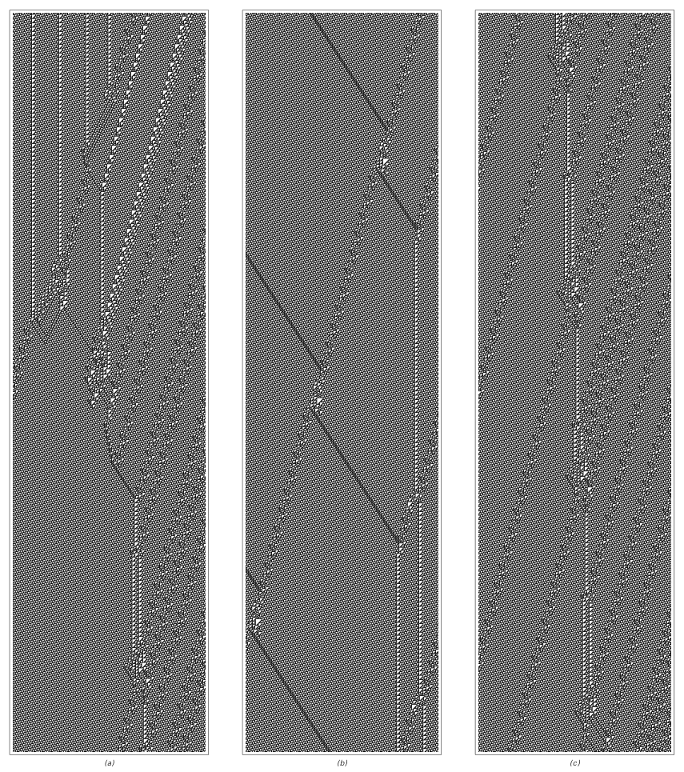
<!-- ORIGINAL_FIGURES page=0700 end -->

上一页示意图中圈出区域的近景。每幅图像宽 320 个元胞，显示 1200 步演化。

[[PDF page 701]]

<!-- ORIGINAL_FIGURES page=0701 start -->
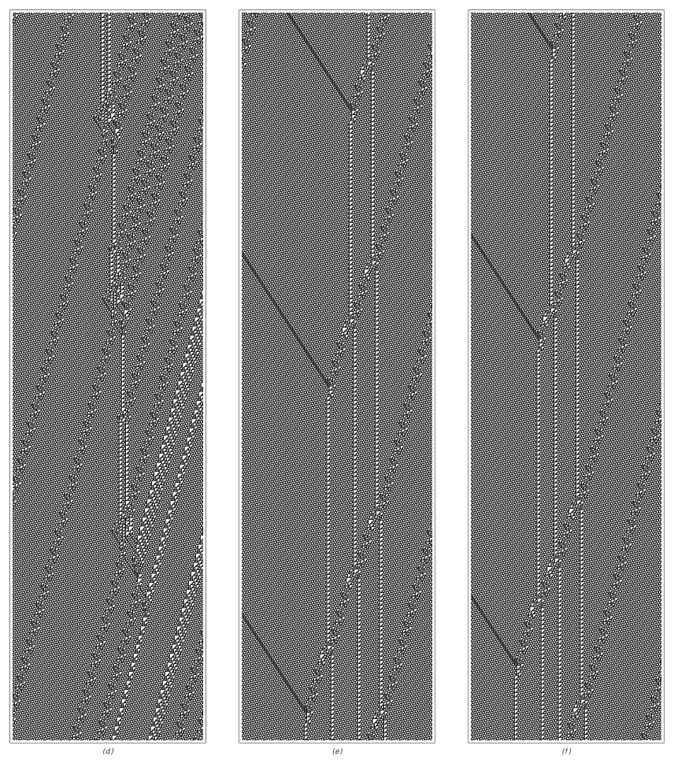
<!-- ORIGINAL_FIGURES page=0701 end -->

近景（续）。

[[PDF page 702]]

<!-- ORIGINAL_FIGURES page=0702 start -->
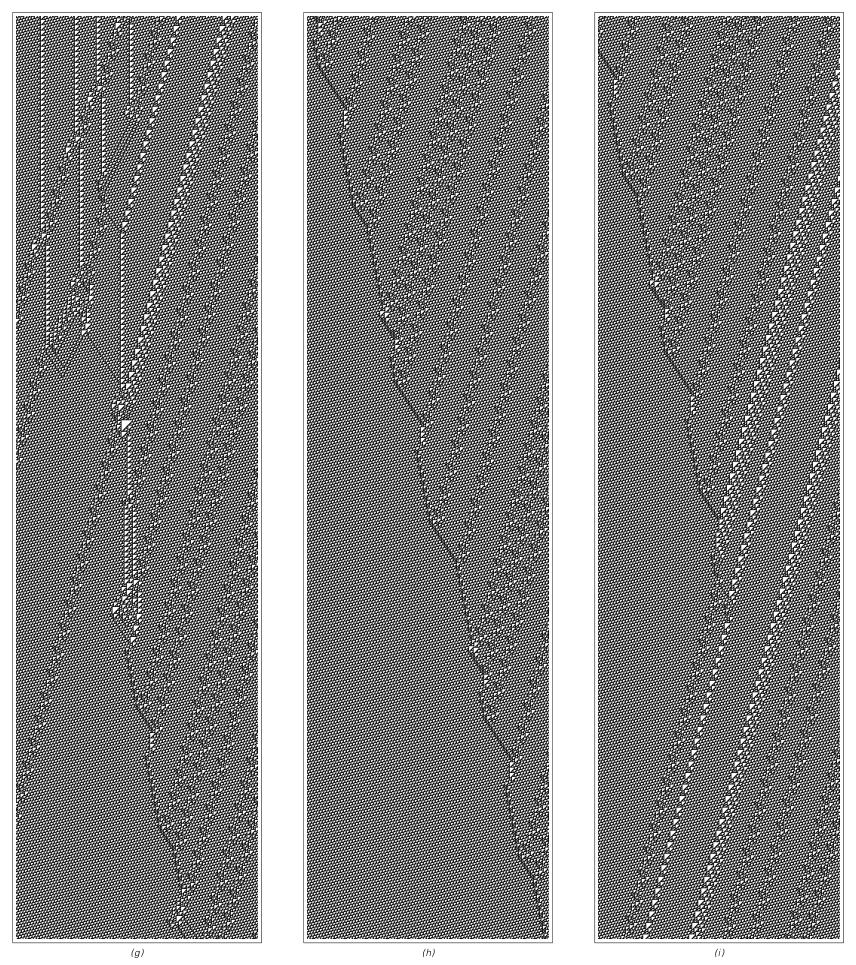
<!-- ORIGINAL_FIGURES page=0702 end -->

近景（续）。

[[PDF page 703]]

这些结构后来可能造成麻烦，但查看区域 (b)，我们看到事实上它们只是穿过所遇到的其他结构，并没有任何不利影响。

区域 (c) 显示当对应于某个块中一个元素的信息穿过区域 (a) 中产生的那类对象时会发生什么。表示该元素的局部结构数量从十二个减少到四个，但这些结构的间距继续指定其颜色。区域 (d) 随后显示，当下一步的块分隔符开头到达时，区域 (c) 中的对象怎样结束。

区域 (e) 显示块中一个黑色元素对应的信息怎样实际转换成循环标记系统产生序列中的一个新黑色元素。发生的是，对应于块中该元素的四个局部结构，与四个朝相反方向运动的其他局部结构碰撞，结果是四个静止结构，对应于序列中的新元素。

区域 (f) 显示与区域 (e) 相同的过程，但针对白色元素。该元素为白色这一事实，被编码在从右侧来的结构之间更宽的间距中，这导致静止结构之间的间距更窄。

区域 (g) 显示区域 (a) 的类似物，但现在针对白色元素而不是黑色元素。该区域开始时很像区域 (a)，只是顶部四个局部结构间距更窄。然而，从该区域中部附近开始，行为与区域 (a) 变得很不相同：区域 (a) 产生一个允许信息通过的对象，而区域 (g) 产生一个阻止所有信息的对象，如区域 (h) 和 (i) 所示。

注意，尽管区域 (d) 和 (i) 的开始非常不同，它们以同样方式结束，这反映了这样一个事实：两种情况下，系统都准备好处理一个新的块，不管这个块可能是什么。

过去几页中的图像都是针对具有某个特定底层规则的循环标记系统制作的。但无论底层规则是什么，都可以使用完全相同的原则。

[[PDF page 704]]

<!-- ORIGINAL_FIGURES page=0704 start -->
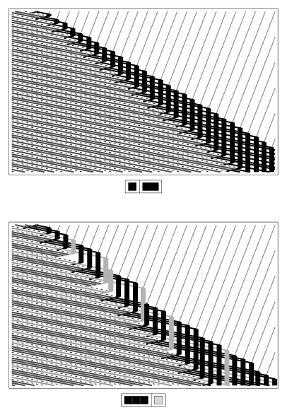
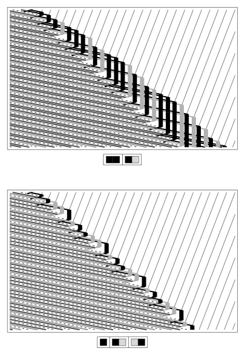
<!-- ORIGINAL_FIGURES page=0704 end -->

下面的图像示意显示了对于几种其他规则选择会发生什么。

每幅图内部线条相互作用的方式始终完全相同。但从一个规则变到另一个规则时，改变的是进入图像的线条排列。

在下面图像的绘制方式中，每条规则中出现的块都编码在从图像左边缘进入的线条模式中。但如果把每幅图向左延伸得足够远，那么所有这些线最终都会被看到从顶部开始。这意味着，线条排列因此总是可以被看作系统的初始条件。

四种不同底层规则的循环标记系统怎样可以被模拟的示意图。每幅图中的线本质上对应于规则 110 中的局部结构集合。每幅图内部发生的过程始终相同；不同的循环标记系统规则由进入每幅图的不同线条排列实现。

[[PDF page 705]]

这最终就是规则 110 中实现通用性的方式。思想只是设置初始条件，使其对应于任何想要模拟的循环标记系统规则中出现的块。

所需初始条件由元胞块的重复组成，其中每个元胞块都包含一个局部结构模式，对应于循环标记系统规则中出现的元素块。元胞块总是相当复杂，对于本节大部分内容讨论的循环标记系统，每个块宽度都超过 3000 个元胞；但关键点是，可以为任何循环标记系统构造这样的块。这意味着，通过合适初始条件，规则 110 事实上可以被安排来模拟任何循环标记系统。

不过，这时应当提到，为了设置适当初始条件使规则 110 模拟许多循环标记系统，还涉及少数额外复杂性。因为正如本节前面的图像展示的，我们使规则 110 模拟循环标记系统的方式，依赖于规则 110 中局部结构相互作用的许多细节。事实证明，为了确保在使用的具体构造下，适当的相互作用在每一步持续发生，人们必须对被模拟的循环标记系统施加一些约束。

这些约束本质上最终是：循环标记系统规则中出现的块长度必须总是六个元素的倍数，并且在向循环标记系统序列连续添加新元素之间可以经过的步数必须有某个上界。

不过，使用第 669 页讨论的思想，构造一个满足这些约束但能模拟任何其他循环标记系统的循环标记系统并不困难。因此，我们可以得出结论：规则 110 事实上能够成功模拟绝对任何循环标记系统。这意味着规则 110 确实是通用的。

[[PDF page 706]]

## 规则 110 中通用性的意义

传统上，实用计算机和计算机语言一直是我们遇到的唯一常见通用性例子。由于这类系统的构造往往相当复杂，人们形成了一种一般直觉：任何设法实现通用性的系统，必定也以某种方式基于相当复杂的底层规则。

但上一节的结果以相当壮观的方式显示，事实并非如此。如果我们找到一个例如有四五种颜色的元胞自动机例子，并发现它是通用的，那已经是一回事。但我们事实上看到的是，一个拥有 256 个可能规则中最简单规则之一的元胞自动机，竟然设法成为通用的。

那么这个结果有什么含义？最重要的是，它提示通用性是一种比人们本来可能想象的普遍得多的现象。因为如果只知道实用计算机以及本章前面讨论的通用元胞自动机这类系统，人们大概会假定，通用性即使在专门构造来表现它的系统之外出现，也极其罕见。

但知道像规则 110 这样的系统是通用的之后，整个图景就改变了。现在看来，通用性实际上很可能应当出现在范围极其广泛的系统中，包括许多规则相当简单的系统。

几节之前我们讨论过这样一个事实：只要拥有一个通用系统，给它的规则添加进一步复杂性就不可能产生任何根本影响。因为凭借它的通用性，该系统最终总能直接模拟任何更复杂规则集合会得到的行为。

[[PDF page 707]]

所以，这意味着，如果查看一个规则逐渐更复杂的系统序列，应当期望它们产生的整体行为只会在达到通用性阈值之前变得更复杂。一旦越过这个阈值，所看到的东西就不应再发生进一步的根本变化。

不过，这个现象在实践上的重要性，在很大程度上取决于人们必须走多远才能达到通用性阈值。

但知道像规则 110 这样的系统是通用的之后，人们现在会怀疑这个阈值极其容易达到。这意味着，在任何特定种类中，超出最简单的规则之后，人们看到的行为应当很快就达到它所能达到的复杂程度。

相当令人惊讶的是，事实证明这本质上就是我们已经在第 3 章中观察到的情况。事实上，不仅对于元胞自动机，对于我们研究过的基本所有其他系统类型，我们也发现，即使用相当简单的规则也可以得到高度复杂行为；而继续给这些规则添加复杂性，在大多数情况下并不会明显影响产生的复杂性水平。

所以回头看，第 3 章的结果本应已经提示，像规则 110 这样的简单底层规则也许能够实现通用性。但上一节中的精巧构造所做的，是确定地显示情况确实如此。

## 第 4 类行为与通用性

如果查看规则 110 在随机初始条件下的典型行为，那么所见内容中最明显的特征是有大量局部结构四处移动，并以复杂方式彼此相互作用。但正如我们在第 6 章看到的，这种行为绝非规则 110 独有。事实上，它正是所有属于我称为第 4 类的元胞自动机的特征。

下一页的图像显示了一些这样的第 4 类系统例子。尽管每种情况下细节不同，行为的一般特征总是相当相似。

那么这对于这类系统的计算能力意味着什么？我强烈怀疑，一般来说，任何显示整体第 4 类行为的元胞自动机，最终都会像规则 110 一样证明是通用的。

我们在第 6 章结尾看到，第 4 类规则似乎总是产生一系列逐渐更复杂的局部结构。我预期，如果人们足够努力地查看任何

[[PDF page 708]]

<!-- ORIGINAL_FIGURES page=0708 start -->
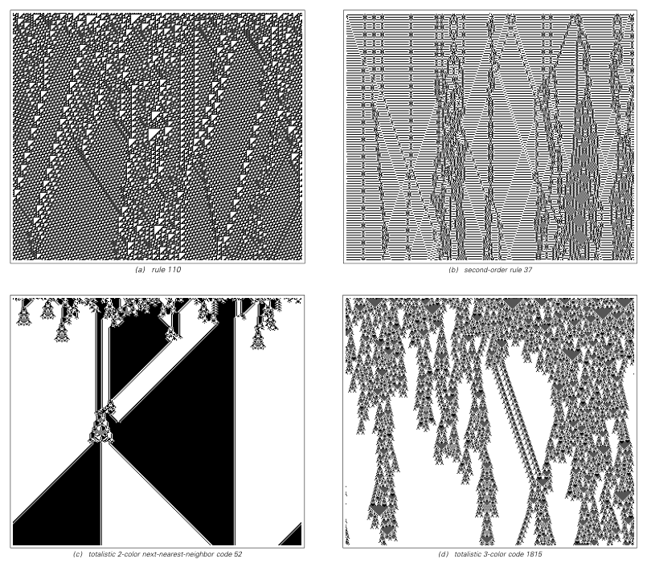
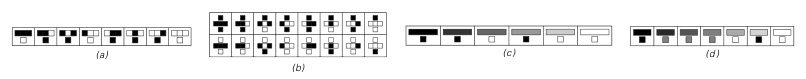
<!-- ORIGINAL_FIGURES page=0708 end -->

特定规则，最终总能找到一组足够丰富、能够支持通用性的局部结构。

具有第 4 类整体行为的元胞自动机例子，如第 6 章所讨论。我强烈怀疑，所有第 4 类规则都将像规则 110 一样证明是通用的。

最终证明某个给定规则是通用的，无疑会涉及与规则 110 情形同样精巧的构造。

[[PDF page 709]]

但关键在于，到目前为止我拥有的所有证据都提示，对于任何第 4 类规则，这样的构造最终都会证明可能。

那么，什么种类的规则显示第 4 类行为？

在 256 个所谓初等元胞自动机中，也就是每个元胞只允许两种可能颜色且只依赖最近邻的那些规则中，唯一清楚直接的例子是规则 110，以及通过平凡地左右反转或黑白反转得到的规则 124、137 和 193。但只要允许两种以上可能颜色，或允许依赖的不只是最近邻，就会立刻发现各种进一步的第 4 类行为例子。

事实上，如面对页上的图像所说明的，在这类情况下只使用所谓总和型规则就足够了。在这类规则中，一个元胞的新颜色只依赖于其邻域中元胞颜色的平均值，而不依赖于它们各自的颜色。

在二维中，第 4 类行为可以出现在只涉及两种颜色和最近邻的规则中，如第 249 页所示。事实上，这类规则的一个例子就是所谓生命游戏，自 1970 年代以来它一直在娱乐计算中很流行。

一般来说，在二维元胞自动机中展示通用性的策略，与一维中非常相同。但在实践中，局部结构流在二维中能够比较容易地交叉，这可以减少涉及的一些技术困难。事实证明，早在 1970 年代，就已经有一个证明二维元胞自动机生命游戏是通用的提纲。

回到一维，人们可以问，在 256 个初等元胞自动机中，除了规则 110 之外，是否还有任何规则显示出第 4 类行为的迹象。正如下一节将看到的，一个可能性是规则 54。如果这个规则事实上属于第 4 类，那么我的预期是，通过查看它所支持的局部结构之间的相互作用，最终在足够努力之后，也可以证明它表现出通用性现象。

[[PDF page 710]]

<!-- ORIGINAL_FIGURES page=0710 start -->
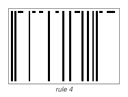
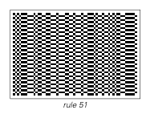
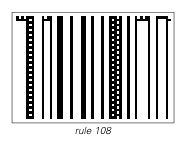
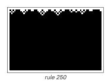
<!-- ORIGINAL_FIGURES page=0710 end -->

## 元胞自动机中的通用性阈值

通过显示规则 110 是通用的，我们已经确立，甚至在具有最简单底层规则类型的元胞自动机中，通用性也是可能的。但仍然存在这样一个问题：为了让一个元胞自动机，或任何其他种类的系统，能够实现通用性，最终需要什么？

一般而言，如果一个系统要是通用的，这意味着通过设置适当初始条件选择，就可以让该系统模拟任何其他系统中可能发生的任何类型行为。作为后果，像下面图像中的元胞自动机肯定不是通用的，因为无论使用什么初始条件，它们始终只产生简单均匀或重复的行为图案。

只显示纯粹均匀或纯粹重复行为的初等元胞自动机例子，因此它们肯定不能是通用的。这些元胞自动机必然全部属于第 1 类或第 2 类系统。

从某种意义上说，造成这一点的根本原因，正如第 252 页讨论的，是这类第 1 类和第 2 类元胞自动机从不允许信息传播超过有限距离。结果是，它们只能支持涉及有限数量元胞的相关行动的过程。

在面对页顶部这样的元胞自动机中，一些信息可以传播较长距离。但这发生的方式受到高度约束，最终这些系统只能产生本质上纯粹嵌套的图案，因此通用性同样不可能实现。

像规则 90 和 150 这样的加性规则又怎样？

对于简单初始条件，这些规则总是产生非常规则的嵌套图案。但对于更复杂的初始条件，它们产生更复杂的行为图案，如本页底部图像所示。

[[PDF page 711]]

<!-- ORIGINAL_FIGURES page=0711 start -->
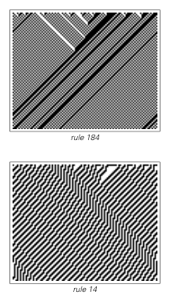
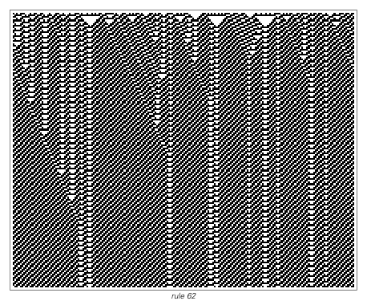
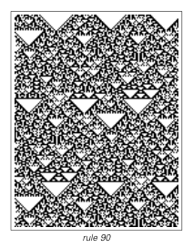
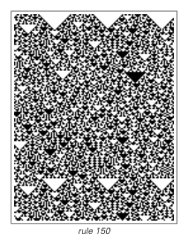
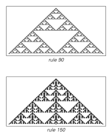
<!-- ORIGINAL_FIGURES page=0711 end -->

确实允许信息传播较远距离、但传播方式非常受限的元胞自动机例子。这类元胞自动机产生的整体图案本质上是嵌套的。任何这类元胞自动机都不可能是通用的。

不过，正如我们在第 264 页看到的，这些图案事实上从未真正对应于超过对初始条件进行相当简单变换的东西。事实上，即使经过例如 1,048,576 步，或任何 2 的幂次步数，产生的元胞阵列也总是只对应于初始条件的两个或三个移位副本的简单叠加。

具有加性规则的元胞自动机例子。对应于初始条件简单变换的状态重复出现，阻止了这类元胞自动机成为通用的可能。

[[PDF page 712]]

<!-- ORIGINAL_FIGURES page=0712 start -->
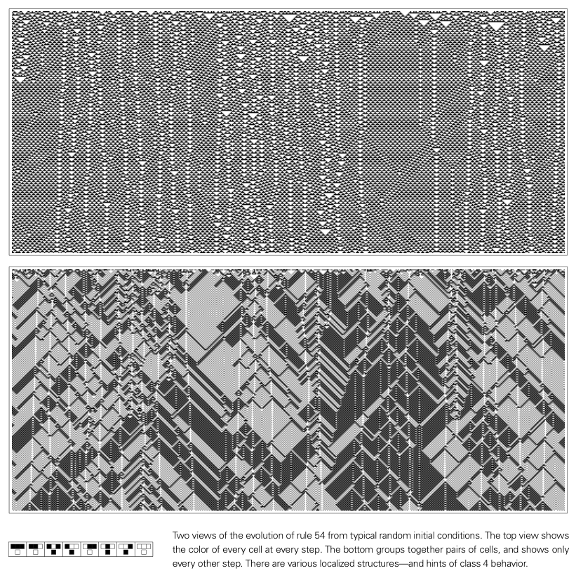
<!-- ORIGINAL_FIGURES page=0712 end -->

由于有许多种行为不会在任何有限步数之后回到这种可预测形式，人们必须得出结论：加性规则不能是通用的。

在上一节末尾，我提到规则 54 是除规则 110 之外另一个可能属于第 4 类的初等元胞自动机。下面的图像显示了规则 54 典型行为的例子。

规则 54 从典型随机初始条件演化的两种视图。上方视图显示每一步每个元胞的颜色。下方把元胞成对分组，并且只显示每隔一步。可以看到各种局部结构，以及第 4 类行为的迹象。

[[PDF page 713]]

<!-- ORIGINAL_FIGURES page=0713 start -->
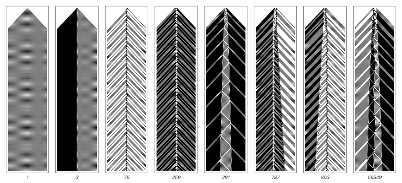
<!-- ORIGINAL_FIGURES page=0713 end -->

确实可以看到一些局部结构。但它们是否足以支持第 4 类行为和通用性？下面的图像显示了，如果依次查看规则 54 的每一种可能初始条件，会发生什么。起初只看到简单重复行为。到初始条件 291 时，人们看到一种非常简单的嵌套形式。随着继续查看，人们又看到各种其他重复和嵌套形式。但至少直到第一亿个初始条件，人们看不到任何从根本上更复杂的东西。

规则 54 前 1 亿个初始条件中看到的行为形式。在初始条件 291 中，右侧第 `n` 条新条纹在步骤 `2 n^2 + 8 n - 9` 产生。即使在所示最后一种情况下，条纹排列最终也变得完全规则，其中第 `n` 条新条纹在步骤 `n^2 + 21 n/2 - {6, 5, -4, 3}_{Mod[n, 4]} + 11/2` 产生。每幅图像中元胞都像面对页底部那样成对分组。

那么规则 54 能否实现通用性？我不确定。也许如果在查看初始条件时再往前走一点，就会看到更复杂行为。也许即使上面显示的结构也可以组合起来，产生通用性所需的全部丰富性。但也可能无论人们怎样做，规则 54 最终都只会显示纯粹重复或嵌套行为，而这本身不能支持通用性。

其他初等元胞自动机又怎样？

[[PDF page 714]]

正如我将在下一章讨论的，我的一般预期是，几乎任何行为不以某种方式从根本上重复或嵌套的系统，最终都会证明是通用的。但我怀疑，对某些系统确立这一事实会比对另一些容易得多，而规则 110 是最容易的情况之一。

一般来说，为了证明通用性，需要做的是找到一个过程，用来在一个系统中设置初始条件，使它模拟其他系统的某个一般类别。在某个层面上，主要挑战是，我们来自编程和工程的经验往往只给我们一组有限的方法来想出这样的过程。我们通常习惯做的是分阶段构造东西。一般我们先构建组件，然后逐步把这些组件组装成越来越大的结构。关键在于，在每个阶段，我们只需要直接思考当前正在处理的结构尺度，而不需要例如思考组成这些结构的所有小片段。

在证明规则 110 通用性时，我们能够遵循基本相同的方法。我们先识别各种局部结构，然后把这些结构作为组件，用来构建我们所需的逐渐更大的结构。

因此，从某种意义上说，对我们的方法至关重要的是，我们可以容易地控制系统中信息的传输。因为这允许我们把不同局部结构当作分离且独立的对象来处理。

事实上，在任何具有第 4 类行为的系统中，事情通常总会或多或少以同样方式工作。但在第 3 类系统中则不会。因为这类系统中通常发生的是，即使只对单个元胞作出改变，最终也会扩散并影响所有其他元胞。这种不受控制的信息传输，使得很难识别出可以在构造中用作确定组件的片段。

那么在这类情况下可以做什么？最明显的可能性是，人们也许能够找到特殊的初始条件类别，使信息传输可以被控制。一个可能做到这一点的例子是规则 73。

[[PDF page 715]]

<!-- ORIGINAL_FIGURES page=0715 start -->
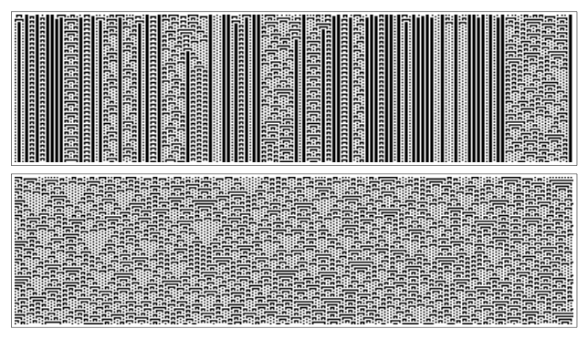
<!-- ORIGINAL_FIGURES page=0715 end -->

下面的图像显示规则 73 的典型行为，首先是在完全随机初始条件下，其次是在没有偶数个黑色方格连续段出现的初始条件下。

规则 73 的两个例子。顶部例子使用完全随机初始条件；底部例子使用的初始条件中，从不出现偶数个黑色方格的连续段。底部例子实际上是从单个黑色元胞得到的图案的一部分，位于中心列稍右处，从第 1000 步开始。

第二种情况下，规则 73 表现出典型第 3 类行为，带有通常那种不受控制的信息传输。然而在第一种情况下，存在的黑色墙壁似乎阻止了任何长程信息传输。

那么，能否在规则 73 中实现某种中间情形，其中信息可以传输，但只能以受控方式传输？

下一页顶部的图像给出了这可能怎样做到的一些迹象。因为它们显示，在适当背景下，规则 73 支持各种局部结构，其中有些会移动。尽管这些结构起初可能看起来更像规则 54 中的结构，而不是规则 110 中的结构，但我强烈怀疑，规则 73 典型行为的复杂性会反映在这些结构之间更精巧的相互作用中，并且最终提供所需东西，使人能够以与规则 110 很相似的方式证明通用性。

[[PDF page 716]]

<!-- ORIGINAL_FIGURES page=0716 start -->
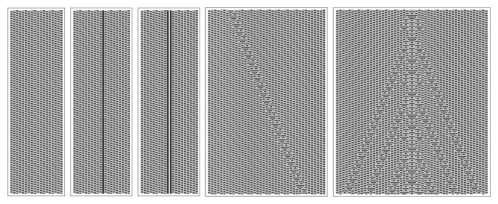
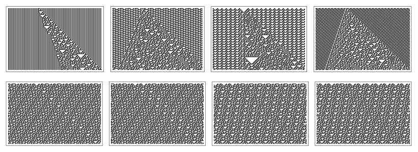
<!-- ORIGINAL_FIGURES page=0716 end -->

规则 73 中局部结构的例子。注意，在所示最后一种情况下，两侧的背景图案互为镜像。

那么像规则 30 这样的情形又怎样？对于严格重复初始条件，像任何元胞自动机一样，它必定产生纯粹重复行为。但只要扰动这类初始条件，通常似乎只会得到复杂且看似随机的行为，如下面顶部一行图像所示。

规则 30 在重复背景下产生图案的例子。顶部一行显示在各种背景中插入一个额外黑色元胞的效果。底部一行显示规则 30 在块长度不超过 25 的重复背景上所支持的所有长度不超过 25 个元胞的局部结构。注意，这些局部结构总是每一步向右移动一个元胞，这使它们不可能以非平凡方式相互作用。

然而，事实证明仍然可以得到局部结构，如上面底部一行图像所示。但这些结构

[[PDF page 717]]

<!-- ORIGINAL_FIGURES page=0717 start -->
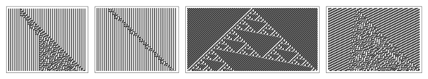
<!-- ORIGINAL_FIGURES page=0717 end -->

似乎总是以同样速度移动，因此永远不能相互作用。即使搜索了数十亿种情况，我也从未成功在规则 30 中找到任何有用的局部结构集合。

下面的图像显示了规则 45 中会发生什么。对重复初始条件的许多可能扰动再次产生看似随机的行为。但在一种情况下，会产生嵌套图案。而保持局部化的结构现在相当常见，但就像规则 30 中那样，它们似乎总是以同样速度移动。

通过向规则 45 的重复背景中插入单个额外黑色元胞而产生图案的例子。注意，出现了规则 90 嵌套图案的一个倾斜版本。在规则 45 中，局部结构证明相当常见，但像规则 30 中一样，它们似乎总是以同样速度移动，因此大概不能相互作用以产生任何第 4 类行为。

因此，尽管这意味着我们用于展示规则 110 通用性的特定方法不能立刻用于规则 30 或规则 45，但这当然并不意味着这些规则最终不是通用的。正如我将在下一章讨论的，我非常强烈地相信，事实上它们将证明是通用的。

那么，我们可能怎样得到这一点的证据？

如果一个系统是通用的，这意味着在适当编码初始条件时，它的演化必须模拟任何其他系统的演化。因此这提示，人们也许能够只通过尝试不同可能编码，然后查看它们允许模拟哪些范围的其他系统，来得到关于通用性的证据。

在第 645 页的 19 色通用元胞自动机情况下，事实证明，用特定 20 元胞块表示单个黑白元胞的编码，足以让通用元胞自动机模拟所有 256 个可能的初等元胞自动机，其中每个初等元胞自动机演化一步，对应于原系统演化 53 步。

[[PDF page 718]]

<!-- ORIGINAL_FIGURES page=0718 start -->
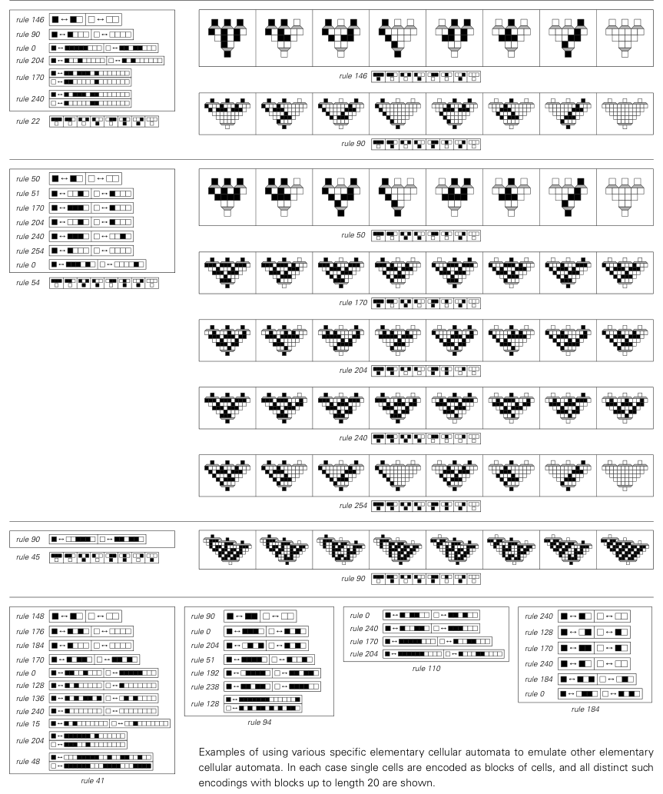
<!-- ORIGINAL_FIGURES page=0718 end -->

使用各种特定初等元胞自动机模拟其他初等元胞自动机的例子。每种情况下，单个元胞被编码为元胞块，并显示了长度不超过 20 的块的所有不同编码。

[[PDF page 719]]

<!-- ORIGINAL_FIGURES page=0719 start -->
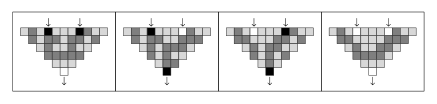
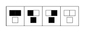
<!-- ORIGINAL_FIGURES page=0719 end -->

因此，给定某个特定初等元胞自动机，人们可以询问，在使用不超过某个长度的块时，它能够模拟哪些其他初等元胞自动机。

面对页上的图像显示了几个例子。

结果并不特别戏剧化。没有任何单个规则能够模拟很多其他规则，而且被模拟的规则往往相当简单。一个略微令人惊讶的例子是，规则 45 最终能够模拟规则 90。但至少在块长度不超过 25 的情况下，例如规则 30 完全不能模拟任何非平凡规则。

根据我们给出的通用性证明，可以推出规则 110 必定能够用某种大小的块模拟任何其他初等元胞自动机，但在我们讨论的实际构造中，这个大小会相当巨大。面对页图像中，规则 110 当然似乎并不突出。

不过，尽管用一个元胞自动机模拟另一个元胞自动机的完整演化似乎有些困难，事实证明，对于有限步数模拟演化片段要容易得多。作为一个例子，下面的图像显示了规则 30 怎样能够模拟规则 90 一步中的基本动作。

规则 30 被设置来模拟单个 XOR 运算，即规则 90 演化一步中使用的运算。规则 30 的初始条件是固定的，除了所示两个位置之外；在这两个位置可以实际给出输入。图像显示，对于每种可能输入组合，规则 30 演化得到的结果都与 XOR 的输出精确对应。

思想是在规则 30 中设置一个配置，使得如果在特定位置插入输入，那么底层规则 30 演化的输出，就恰好对应于规则 90 演化一步会得到的结果。在所示特定情形中，这是通过在每个输入位置之间放置宽 3 个元胞的块来实现的。

但如下页图像所示，通过使用适当的宽 5 元胞块，规则 30 实际上可以被安排来模拟

[[PDF page 720]]

<!-- ORIGINAL_FIGURES page=0720 start -->
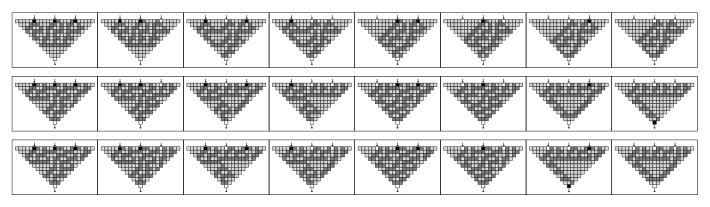
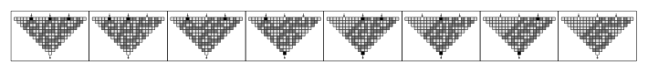
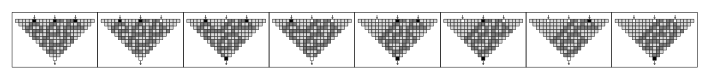
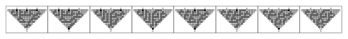
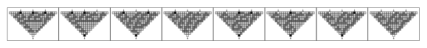
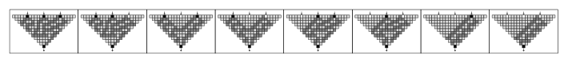
<!-- ORIGINAL_FIGURES page=0720 end -->

所有 256 个可能初等元胞自动机各自演化的一步。

规则 30 怎样可以被设置来模拟所有初等元胞自动机演化的一步的示意。

那么其他底层规则又怎样？

面对页上的图像显示，对于几个不同底层规则，用越来越宽的块时，256 个可能初等规则中哪些可以被成功模拟。在底层规则只有相当简单行为的情况下，例如规则 90 和 184，事实证明永远不可能模拟 256 个可能初等规则中的几个以上。

[[PDF page 721]]

<!-- ORIGINAL_FIGURES page=0721 start -->
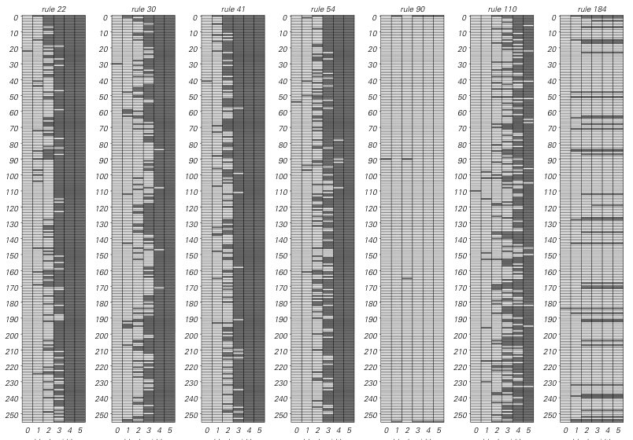
<!-- ORIGINAL_FIGURES page=0721 end -->

但对于具有更复杂行为的底层规则，如规则 22、30 或 110，事实证明最终总能模拟全部 256 个初等规则。

关于各种底层元胞自动机使用面对页方案和连续更大宽度的块，在模拟 256 个可能初等元胞自动机中每一个的一步演化方面表现如何的概括。

不过，这里的模拟只针对单步。因此，它的可能性并不立刻在任何普通意义上确立通用性。但它再次支持这样一个思想：几乎任何其行为在我们看来复杂的元胞自动机，都可以被安排来进行在某种意义上任意精巧的计算。

这提示，这类元胞自动机最终会证明是通用的，结果在 256 个初等规则中，人们预期也许多达 27 个事实上将是通用的。

[[PDF page 722]]

<!-- ORIGINAL_FIGURES page=0722 start -->
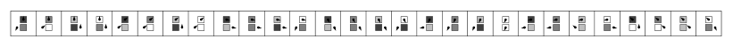
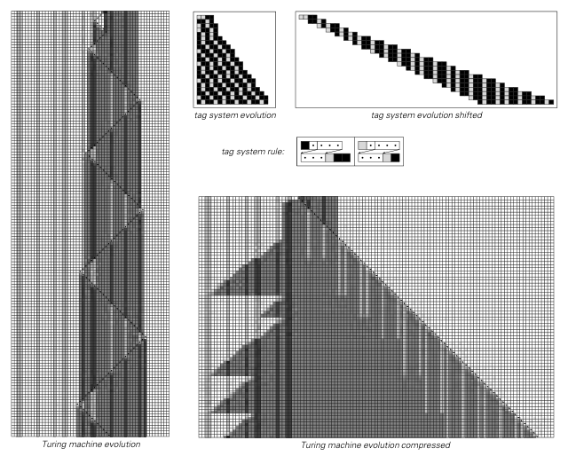
<!-- ORIGINAL_FIGURES page=0722 end -->

## 图灵机和其他系统中的通用性

根据前几节的结果，我们现在对元胞自动机中通用性阈值位于何处已经有了一些认识。但其他种类的系统，如图灵机，又怎样？为了得到通用性，规则需要多复杂？

在 1950 年代和 1960 年代早期，人们做过一些工作，试图构造小型通用图灵机。这项工作的主要成就是构造出如下所示的具有 7 个状态和 4 种可能颜色的通用机器。

1962 年构造出的具有 7 个状态和 4 种颜色的通用图灵机规则。直到现在，这基本上是已知最简单的通用图灵机。注意，规则中的一个元素可以被认为指定图灵机应当“停机”，且读写头保持在同一位置和同一状态。

上面的图灵机怎样能够模拟标记系统的一个例子。标记系统中的黑色元素被设置为对应于图灵机中的四个元胞块，而白色元素对应于单个元胞。

[[PDF page 723]]

<!-- ORIGINAL_FIGURES page=0723 start -->
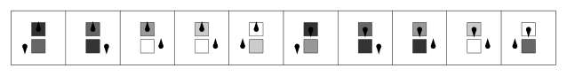
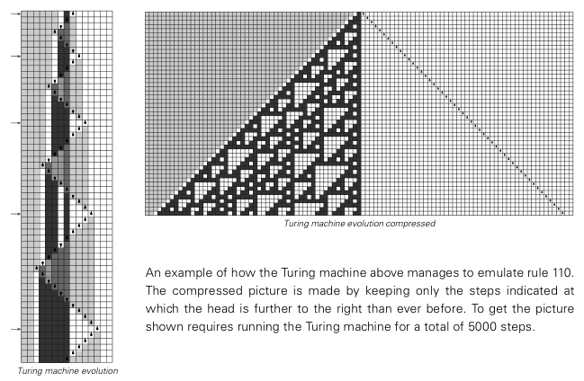
<!-- ORIGINAL_FIGURES page=0723 end -->

面对页底部的图像显示了怎样在这种情况下证明通用性。基本思想是，通过在左侧设置适当初始条件，图灵机可以被安排来模拟某一类标记系统中的任何系统。但根据第 667 页的讨论，事实证明这类标记系统中存在通用系统。

找到一个像面对页上这样相对简单的通用图灵机已经是一项成就。事实上，在这个例子被发现后的四十年里，没有找到显著更简单的例子。因此人们也许会由此得出结论，面对页上的机器以某种方式处在图灵机通用性的阈值上。

但正如人们从本书发现中可能预期的那样，这远非正确。事实上，通过使用规则 110 的通用性，事实证明可以得到如下所示的极其简单的通用图灵机，它只有 2 个状态和 5 种可能颜色。

基于本书发现而得到的目前已知最简单通用图灵机的规则。该机器有 2 个状态和 5 种可能颜色。

上面的图灵机怎样设法模拟规则 110 的一个例子。压缩图像通过只保留读写头比此前任何时候都更靠右的那些步骤制成。要得到所示图像，需要让图灵机总共运行 5000 步。

[[PDF page 724]]

<!-- ORIGINAL_FIGURES page=0724 start -->
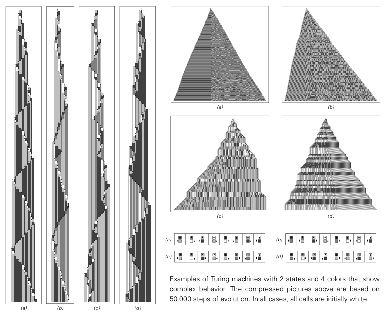
<!-- ORIGINAL_FIGURES page=0724 end -->

正如上一页底部图像所说明的，这个图灵机以相当直接的方式模拟规则 110：它的读写头系统地来回移动，每完成一次完整扫描，就按照规则 110 演化的一步更新所有元胞。由于本章前面已经知道规则 110 是通用的，随之可知这个 2 状态 5 色图灵机也必定是通用的。

那么，这是否就是可能的最简单通用图灵机？

我相当确信不是。事实上，我预期会有一些显著更简单的。但它们究竟能有多简单？

如果查看具有 2 个状态和 2 种颜色的 4096 个图灵机，很容易看到它们的行为在所有情况下都太简单，不能支持通用性。那么，在 2 状态 2 色与 2 状态 5 色之间，图灵机通用性阈值位于哪里？

显示复杂行为的 2 状态 4 色图灵机例子。上方压缩图像基于 50,000 步演化。在所有情况下，所有元胞最初都是白色。

[[PDF page 725]]

<!-- ORIGINAL_FIGURES page=0725 start -->
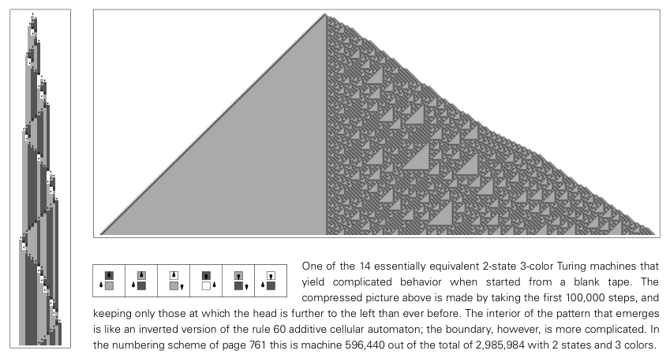
<!-- ORIGINAL_FIGURES page=0725 end -->

面对页底部的图像给出了一些显示复杂行为的 2 状态 4 色图灵机例子。我几乎毫不怀疑，这些机器中大多数，如果不是全部，都是通用的。

在这类 2 状态 4 色图灵机中，从空白带开始时，大约每 50,000 个中也许有一个显示复杂行为。在 4 状态 2 色图灵机中，同样种类的复杂行为也会看到，如第 81 页所讨论，但现在它也许只出现在每 200,000 个案例中的一个。

那么 2 状态 3 色图灵机又怎样？这类机器总共有 2,985,984 个。它们大多数产生相当简单的行为。但事实证明，其中有 14 个，本质上全都等价，即使从空白带开始，也会产生相当大的复杂性。

下面的图像显示了一个例子。

14 个本质等价的 2 状态 3 色图灵机之一，从空白带开始时会产生复杂行为。上方压缩图像通过取前 100,000 步，并只保留读写头比此前任何时候都更靠左的那些步骤制成。出现图案的内部类似于规则 60 加性元胞自动机的一个反转版本；不过边界更复杂。在第 761 页的编号方案中，这是 2 状态 3 色总共 2,985,984 个机器中的第 596,440 号。

虽然无疑很难证明，但看来这个图灵机最终很可能证明是通用的。如果如此，那么按大多数尺度衡量，它大概将是最简单的通用图灵机。

[[PDF page 726]]

<!-- ORIGINAL_FIGURES page=0726 start -->
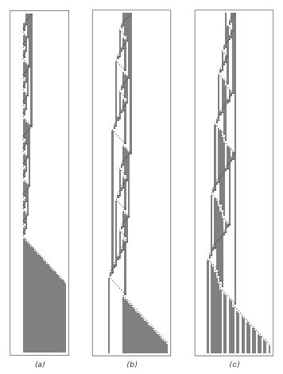
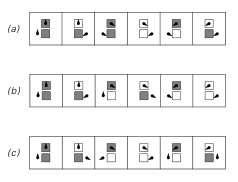
<!-- ORIGINAL_FIGURES page=0726 end -->

对于 3 状态 2 色的情形，事实证明，在空白初始条件下，这类 2,985,984 个可能图灵机全部都很快演化并产生简单重复或嵌套行为。使用更复杂初始条件时，所看到的行为有时可以至少暂时更复杂一些，如下面图像所示。但最终它似乎总是仍然解析成简单形式。

一些 3 状态 2 色图灵机的例子，它们会暂时以稍微复杂的方式行动。使用更精巧初始条件，可以让这些机器表现复杂行为更久。

然而尽管如此，仍然可以设想，在适当初始条件下，也许会发生显著更复杂的行为，并最终允许 3 状态 2 色图灵机中的通用性。

根据规则 110 的通用性，我们知道，如果只按某个特定顺序枚举元胞自动机，那么最多经过 110 个规则，就必定会看到通用性。根据本章前面的其他结果，事实上人们很可能会倾向于更早看到通用性，也许只需经过十几个或二十个规则。

在图灵机中，第 707 页的通用 2 状态 5 色规则可以被赋予编号 8,679,752,795,626。这意味着

[[PDF page 727]]

<!-- ORIGINAL_FIGURES page=0727 start -->
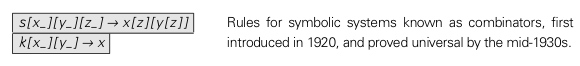
<!-- ORIGINAL_FIGURES page=0727 end -->

经过也许九万亿个图灵机之后，人们必定会倾向于找到一个通用例子。但想必实际上会早得多就找到例子，因为例如第 709 页的 2 状态 3 色机器编号只有 596,440。

尽管这些数字比元胞自动机更大，事实仍然是，最简单的潜在通用图灵机结构仍然非常简单，这提示图灵机中的通用性阈值和元胞自动机中一样，在许多方面都非常低。

那么其他类型的系统又怎样？

我怀疑，几乎在本书前面已经看到复杂行为的任何情形中，最终都有可能显示存在通用性。事实上，正如我将在下一章详细讨论的，我相信一般来说，通用性与复杂行为的出现之间有紧密联系。

先前已知通用的系统例子，其规则通常复杂得多，以至于无法清楚看出这一点。但有一个几乎独一无二的例子，即使很早以前也本来有可能看出这一点，那就是所谓组合子。

组合子是我们在第 3 章第 102 页讨论过的符号系统的一个特例。组合子最初是作为一种理想化方式提出，用来表示逻辑中定义的函数结构；它们事实上最早在 1920 年被引入，比图灵机早十六年。尽管过去八十年里人们对它们作过一些研究，但在大多数情况下，它们被看作相当晦涩且无关紧要的构造。

组合子的基本规则如下给出。

称为组合子的符号系统规则；它们最早在 1920 年引入，并在 1930 年代中期被证明通用。

使用短初始条件时，下一页顶部的图像显示，组合子往往很快演化到简单固定点。但对于长度为 8 的初始条件 (e)，图像显示

[[PDF page 728]]

<!-- ORIGINAL_FIGURES page=0728 start -->
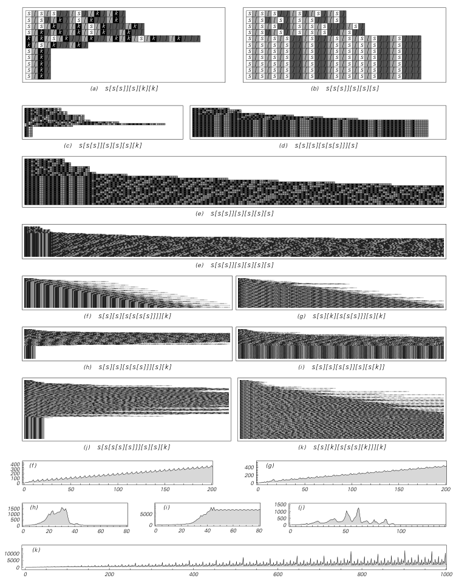
<!-- ORIGINAL_FIGURES page=0728 end -->

没有达到固定点，而是总大小出现指数增长，内部行为看起来相当随机。

组合子演化的例子。情形 (e) 中的表达式是导致无限增长的最短表达式。底部图表显示连续步骤达到的表达式总大小。注意，演化的详细模式，尽管不是最终达到的任何固定点，可能依赖于组合子规则在 Mathematica 的 `/.` 顺序中每一步怎样应用。

[[PDF page 729]]

<!-- ORIGINAL_FIGURES page=0729 start -->
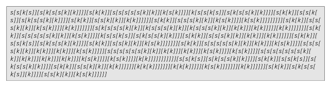
<!-- ORIGINAL_FIGURES page=0729 end -->

其他组合子产生甚至更复杂的行为，有时带有整体重复或嵌套，但常常没有。

组合子有一些特征并不容易直接在图像中捕捉。但从面对页这样的图像看，相当清楚的是，尽管底层规则相当简单，组合子的行为也可以高度复杂。

而虽然典型行为的问题过去并没有真正被研究过，但几乎从通用性概念在 1930 年代首次引入以来，人们就已经知道组合子是通用的。

我们现在可以展示这一点的一种方式，是证明组合子可以模拟规则 110。正如下页图像所说明的，事实证明，只要反复应用下面的组合子表达式，就能重现规则 110 演化的连续步骤。

一个对应于执行规则 110 演化一步操作的组合子表达式。

过去一直没有一个整体语境来理解组合子中的通用性。但现在我们看到的东西提示，这类通用性在某种意义上只是与一般复杂行为相关联。

然而我们在第 3 章看到，存在规则甚至比组合子更简单却仍然显示复杂行为的符号系统。因此我现在怀疑，这些系统也同样是通用的。

事实上，无论往哪里看，通用性阈值似乎都比人们曾经想象的低得多。这是促使我提出下一章将讨论的计算等价原理的重要基本观察之一。

[[PDF page 730]]

<!-- ORIGINAL_FIGURES page=0730 start -->
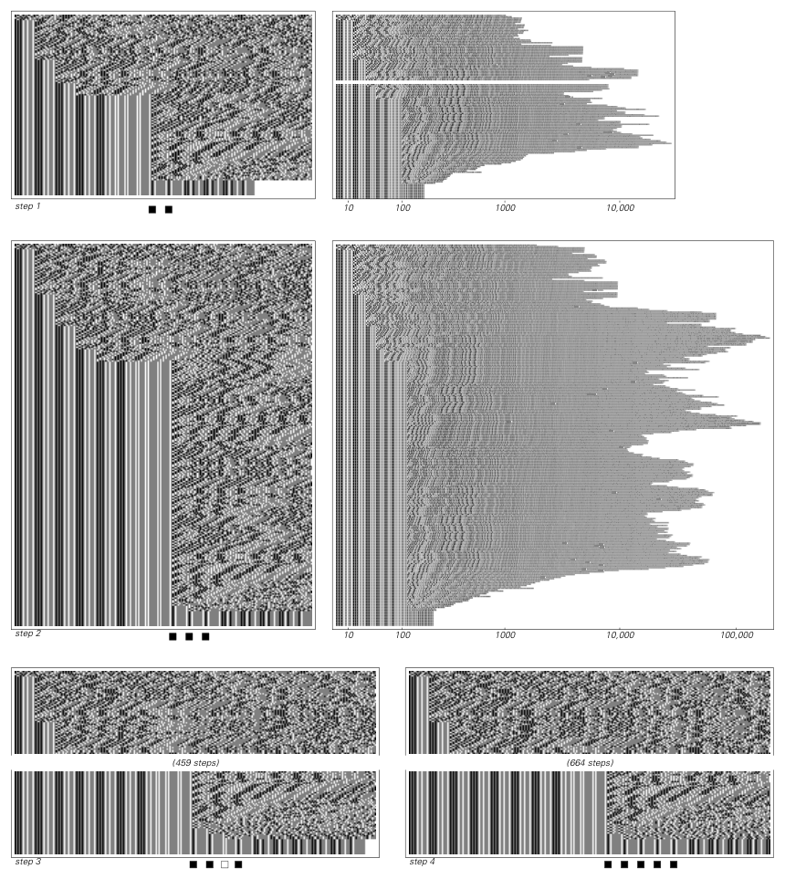
<!-- ORIGINAL_FIGURES page=0730 end -->

使用组合子模拟规则 110 元胞自动机。上一页的规则 110 组合子，对规则 110 演化的每一步应用一次。初始状态取为由单个黑色元胞组成。
