# 第 12 章：计算等价原理

[[PDF page 731]]

<!-- ORIGINAL_FIGURES page=0731 start -->
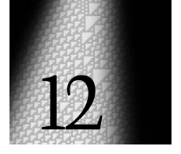
<!-- ORIGINAL_FIGURES page=0731 end -->

# 计算等价原理

## 基本框架

在上一章讨论了计算这个概念之后，现在我已经准备好在本章描述一个大胆假说。这个假说是我基于本书中的发现发展出来的，我称之为计算等价原理。

在科学原理中，计算等价原理的广度几乎史无前例，因为它适用于本质上任何种类的任何过程，无论是自然的还是人工的。它的含义既广且深，不仅触及科学中的许多长期问题，也触及数学、哲学以及其他领域中的许多问题。

使我能够提出计算等价原理的关键统一思想，是一个简单但极其有力的思想：所有过程，无论由人类努力产生，还是在自然界中自发发生，都可以被看作计算。

在我们关于计算机的实践经验中，我们主要关心的是那些专门被设置来执行特定任务的计算。但正如我在本书开头讨论的，计算并没有什么根本理由必须具有任何这类确定目的。正如我在上一章讨论的，例如像元胞自动机这样的系统的演化过程，完全可以被看作计算，尽管在某种意义上，这个计算所做的一切只是生成该系统的行为。

[[PDF page 732]]

但自然界中的过程又怎样？它们也能被看作计算吗？还是说，计算这个概念以某种方式只适用于具有抽象元素的系统，比如元胞自动机中的黑白元胞？

在现代计算机应用出现之前，人们也许会假定确实如此。但现在每天我们都看到计算以范围极其广泛的不同数据类型来进行，从数字到文本、图像，几乎无所不包。这提示，只要任何过程遵循确定规则，就可以把它看作一种计算，无论它涉及什么种类的元素。

因此，特别地，这意味着应当可以把自然界中的过程看作计算。事实上，最终唯一不熟悉的方面只是：这类过程遵循的规则不是由我们作为人类构造的某个计算机程序定义的，而是由自然的基本定律定义的。

但无论涉及的规则有什么细节，关键点都是：可以把自然界或其他地方发生的每一个过程都看作一种计算。正是这种非凡的统一性，使得提出像计算等价原理这样广阔而有力的原理成为可能。

## 原理概述

在自然界以及我们构造的系统中，我们看到的各种过程差异极大，起初人们也许会认为它们之间几乎没有什么共同点。但任何过程都可以被看作计算这一思想，立刻至少提供了一个统一框架，让人能够讨论不同过程。

计算等价原理就是使用这个框架来表述的。因为这个原理所断言的是，当以计算术语来看时，许多不同种类的过程之间存在一种根本等价。

计算等价原理可以有各种表述方式，但也许最一般的说法只是：几乎所有并非明显简单的过程，都可以被看作具有等价精巧程度的计算。

[[PDF page 733]]

尽管起初这个陈述可能显得含糊，也许几乎无足轻重，但在本章过程中我们将看到，事实上它具有许多非常具体且惊人的含义。

人们也许会假定，不同过程之间会存在范围巨大的不同计算精巧程度。但计算等价原理作出的非凡断言是，在实践中情况并非如此；相反，本质上只有一个最高层次的计算精巧程度，而几乎所有并不显得明显简单的过程都会达到这个层次。

什么会把人引向这个相当令人惊讶的思想？一个重要线索来自我在上一章讨论的通用性现象，它也支撑了现代计算机技术的许多成功。这个现象的本质是，可以构造出能够执行本质上任何计算的通用系统，因此它们在某种意义上都必定能够表现出最高层次的计算精巧程度。

今天最熟悉的通用系统例子是实用计算机和通用计算机语言。但在通用性现象首次被识别之后的大约五十年里，各种类型的系统都被发现能够表现出通用性。事实上，正如我在上一章显示的，人们例如可以在元胞自动机、图灵机、寄存器机中得到通用性，实际上也可以在我在本书中考虑过的几乎每一种系统中得到通用性。

因此，这意味着从计算角度看，即使具有相当不同底层结构的系统，也通常仍会显示某种等价性：可以为它们找到实现通用性的规则，因此它们总能表现出同样层次的计算精巧程度。

但虽然这已经是一个非凡结果，它还只是迈向计算等价原理的第一步。

[[PDF page 734]]

因为这个结果意味着，在许多种系统中，可以找到实现通用性、从而显示同样计算精巧程度的特定规则。但这个结果并没有说明这类规则究竟是某种典型现象，还是非常罕见而特殊。

在实践中，几乎无一例外，已经被确立为通用的实际规则往往相当复杂。事实上，最常见的是，它们实际上由各种组件工程化地构造出来，而这些组件又是实际数字电子计算机中各种精巧结构的直接理想化。

基于传统直觉，人们几乎总是假定这在某种意义上是不可避免的；为了得到像通用性这样精巧的东西，除了设置本身特殊而精巧的规则之外别无选择。

然而，本书的一个惊人发现是，事实并非如此；事实上，即使极其简单的规则也可以是通用的。根据上一章的讨论，我们已经知道，在 256 个最简单的可能元胞自动机规则中，至少规则 110 以及另外三个类似规则是通用的。

我强烈怀疑，这只是开端；随着时间推移，其他简单规则中会有相当一部分也被证明是通用的。因为计算等价原理的一个含义是，几乎任何行为不明显简单的规则，最终都应当能够达到同一层次的计算精巧程度，因此实际上应当是通用的。

所以，通用性远不是只存在于那些被精心构造来表现它的系统中的罕见而特殊性质。计算等价原理反而意味着，这种性质应当极其常见。除其他外，这意味着我们可以期望通用性不仅出现在许多种抽象系统中，也出现在自然界的各种系统中。

正如我们将在本章看到的，这个思想已经有许多重要且令人惊讶的后果。但它仍远不及完整计算等价原理所要表达的内容。

[[PDF page 735]]

因为知道某个特定规则是通用的，只告诉人们可以设置初始条件来导致某个精巧计算发生。但它并没有告诉人们，如果例如从典型简单初始条件出发，会发生什么。

然而计算等价原理断言，即使在这种情况下，只要人们看到的行为并不明显简单，它几乎总会对应于等价精巧程度的计算。

这意味着，即使在从非常简单初始条件开始的元胞自动机中，也可以期望其行为中那些看起来不明显简单的方面，通常对应于等价精巧程度的计算。

因此，根据计算等价原理，一个过程的规则或初始条件有多简单或多复杂并不重要：只要过程本身看起来不明显简单，它几乎总会对应于等价精巧程度的计算。

这提示，自然界及其他地方范围巨大的过程之间存在一种根本统一性：尽管它们在细节上各不相同，每个过程都可以被看作对应于一种计算，而这种计算最终在其精巧程度上是等价的。

## 原理的内容

像科学中许多其他基本原理一样，计算等价原理可以部分被看作一条新的自然定律，部分被看作一个抽象事实，部分被看作一个定义。因为在一种意义上，它告诉我们在我们的宇宙中哪些种类的计算能够发生、哪些不能发生；但它也概括了关于可能计算的纯抽象推论，并为计算这一概念本身的更一般定义提供基础。

如果没有计算等价原理，人们也许会假定，不同系统总能执行完全不同的计算；特别是，人们也许会认为，对于结构足够复杂的系统能够执行的计算，其精巧程度没有上限。

[[PDF page 736]]

但上一章关于通用性的讨论已经提示，情况并非如此。因为它意味着，至少在上一章考虑的那些系统之间，事实上存在一个可执行计算精巧程度的上限。

正如我们讨论的，一旦有了一个通用系统，这样的系统就可以模拟我们考虑过的任何种类系统，甚至包括那些构造比它自身更复杂的系统。因此这意味着，无论通用系统能够执行什么种类的计算，其他系统都永远不能执行具有更高精巧程度的计算。

结果，人们常常觉得合理的是，把所谓计算精确定义为上一章讨论的那类通用系统能够完成的事情。

但尽管如此，在抽象层面，人们总可以想象有一些系统执行超出上一章中任何元胞自动机、图灵机或其他类型系统能力之外的计算。因为一旦识别出任何这样一类计算，人们就可以想象设置一个系统，其中包含这些计算结果的无限表。

不过，尽管人们完全可以想象这样的系统，计算等价原理断言的是，在我们的实际宇宙中，这样的系统事实上永远不可能被构造出来。

因此，本质上，计算等价原理引入了一条新的自然定律，其效果是：任何系统都永远不能执行比元胞自动机和图灵机这类系统所执行的计算更精巧的显式计算。

什么会让人认为这是真的？一个重要证据是，我在本书中基于元胞自动机这类系统讨论过的各种自然系统模型所取得的成功。但尽管有这些成功，人们也许仍会想象，自然界中可能存在其他系统，比如基于连续数学的系统，它们允许执行比元胞自动机这类系统中的计算更精巧的计算。

不用说，我并不相信情况如此。事实上，如果能够找到一种真正根本的物理理论，类似我在第 9 章中讨论的方向，那么就可以完全确定地确立这一点。

[[PDF page 737]]

因为这样的理论将具有这样一个特征：它可以由我在上一章讨论的那类通用系统模拟。结果是，在我们的宇宙中任何地方，都不可能发生比我们讨论过的通用系统所执行的计算更精巧的计算。

那么，我们用计算机或在大脑中抽象执行的计算又怎样？它们也许能更精巧吗？想必不能，至少如果我们想要实际结果而不只是一般性说法的话。因为如果一个计算要被显式执行，那么它最终必须实现为一个物理过程，因此必定受制于任何这类过程所受的同样限制。

但正如我在上一节讨论的，计算等价原理除了断言计算精巧程度有一个上限之外，还作出了强得多的陈述：几乎所有除了明显简单之外的过程实际上都会达到这个上限。

这与我相信是非常根本的一个抽象事实相关：在所有可能的、行为不明显简单的系统中，压倒性多数都是通用的。

那么，要确立这个事实会涉及什么？

人们可以想象像我在本书早期所做的那样，连续查看某种系统类型，例如元胞自动机的每一种可能规则。如果这样做，人们会发现许多规则表现出明显简单的重复或嵌套行为。但正如我在本书早期发现的，许多规则并不如此，而是表现出常常复杂得多的行为。

计算等价原理随后断言，这类规则中的绝大多数将是通用的。

如果从零开始，那么构造出一些知道是通用的规则并不特别困难，尽管这些规则通常相当复杂。根据上一章规则 110 是通用的这个结果，例如可知任何包含规则 110 的规则也必定是通用的。但如果只是给出一个任意规则，特别是一个简单规则，那么判断这个规则是否通用可能极其困难。

[[PDF page 738]]

正如上一章讨论的，展示一个规则通用的通常方法，是找到一个设置初始条件并解码输出的方案，使该规则模拟另一个已经知道是通用的规则。

但问题在于，在任意特定情况下，几乎没有限制说明这种方案可能需要多复杂。事实上，差不多唯一的限制是，该方案本身不应当仅仅在设置初始条件和解码输出时就表现出通用性。

事实上，这个方案几乎不可避免地必须至少有些复杂：因为如果一个系统是通用的，那么它必须能够模拟范围巨大的其他通用系统中的任何一个。结果是，为了证明而指定它将模拟这些系统中的哪一个，通常需要给出相当多信息，而所有这些信息都必须以某种方式成为编码方案的一部分。

证明一个系统不是通用的，往往比证明它是通用的还要困难。因为需要显示不存在任何可能方案，能够让该系统模拟任何其他通用系统。通常，要确信这一点，唯一方法是对该系统能够表现出的所有可能行为作出或多或少完整的分析。

如果这种行为总是具有明显重复或嵌套形式，那么它通常会相当容易分析。但正如我们在第 10 章看到的，在几乎所有其他情况下，标准感知与分析方法都几乎不能让人取得多少进展。

不过，正如第 10 章中提到的，我确实知道少数基于数字的系统，即使其整体行为并不重复、嵌套或以其他方式明显简单，也能给出相当完整的分析。毫无疑问，还存在一些类似例子。但我强烈相信，正如计算等价原理所体现的，最终行为不明显简单的绝大多数系统都会证明是通用的。

[[PDF page 739]]

如果人们试图使用某种系统化过程来测试系统是否通用，那么不可避免地会有三类结果。有时该过程会成功证明一个系统是通用的，有时会证明它不是。但很多时候，即使花费大量努力，该过程也根本不会得出明确结论。

然而在几乎所有这类情况下，计算等价原理都断言这些系统事实上是通用的。尽管几乎不可避免的是，在任何极大一般性下证明这一点都绝不容易，但我的猜测是，随着几十年过去，会有越来越多具体规则最终被证明表现出通用性。

但即使人们确信一个抽象事实，即在所有不会产生明显简单行为的可能规则中，绝大多数是通用的，这仍然还没有完全确立计算等价原理的断言：自然界和其他地方出现的这类规则几乎总是通用的。

因为仍然可能出现这样的情况：实际出现的特定规则以某种方式被特别选择成不是通用的。确实，有各种情形中，规则受到约束，使其行为过于简单而不能支持通用性。因此，例如在大多数工程中，人们往往选择行为足够简单、容易预测的规则。正如我在第 8 章中讨论的，由自然选择决定的生物学规则似乎也发生类似事情。

但当不存在迫使简单整体行为的约束时，我猜想，自然界中出现的大多数规则可以被看作并没有以特殊方式被选择，除了也许规则自身结构往往相当简单这一事实。

这意味着，这类规则通常会显示与从所有可能性中随机选择的规则相同的特征。结果可以推测，在几乎所有整体行为不明显简单的情况下，它们最终确实表现出通用性。

但即使范围广泛的系统确实可以被显示为通用，这仍不足以确立完整的计算等价原理。因为计算等价原理关心的

[[PDF page 740]]

不仅是完整系统的计算精巧程度，也关心系统内部发生的特定过程的计算精巧程度。

当人们说某个特定系统是通用的，意思是可以通过选择适当初始条件，让系统执行本质上任意精巧程度的计算。但这并不保证绝大多数初始条件，也许包括所有容易在自然界中出现的初始条件，不会只产生对应于非常简单计算的行为。

事实上，在上一章规则 110 通用性的证明中，即使执行相当简单的计算，也使用了极其复杂的初始条件。

但计算等价原理断言，事实上即使行为来自简单初始条件，几乎所有不明显简单的行为最终也会对应于等价精巧程度的计算。

当然，本书中有各种图像支持这个思想。我们一再看到，简单初始条件完全足以产生巨大复杂性的行为，而让初始条件更复杂通常并不会导致看起来有何不同的行为。

相当常见的是，原因的一部分如面对页图像所示：即使从单个非常简单初始条件出发，系统的实际演化也会生成本质上对应于所有可能初始条件的块。这意味着，任何给定整体初始条件下会看到的行为，也会在从某个特定初始条件生成的单个图案中的适当位置看到。

因此，这提示了一种方式，可以在单个图案而不是完整系统中拥有某种类似通用性的东西。其思想是，一个通用图案可以充当一种可能计算目录，其中图案的不同区域给出所有可能不同初始条件的结果。

[[PDF page 741]]

<!-- ORIGINAL_FIGURES page=0741 start -->
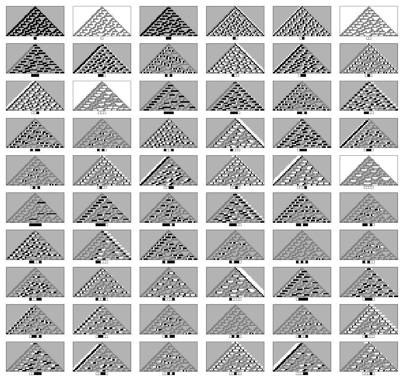
<!-- ORIGINAL_FIGURES page=0741 end -->

规则 30 从单个黑色元胞开始生成的图案中，逐渐更长的块的出现。就我所能判断的而言，所有可能块最终都会出现，这潜在地让该图案充当所有可能计算的一种目录。

所以，作为一个简单例子，人们可以想象在三维阵列上铺开一个图案，其中每个连续竖直平面给出某个一维通用系统从其连续可能初始条件之一开始的演化。在这样的设置中，任何计算，无论其精巧程度如何，都必定在图案中某处出现。

[[PDF page 742]]

在像上面由规则 30 得到的图案中，不同计算想必并不是以任何这样直接的方式排列的。但我强烈怀疑，即使要找到想要的特定计算可能相当不现实，本质上任何可能计算仍然存在于图案中的某处。

不过，与完整系统的通用性情形很相似，计算等价原理并不只是说，在像规则 30 这样的系统产生的图案中某处会找到精巧计算。相反，它断言，除非明显简单，否则人们看到的本质上任何行为，都应当对应于等价精巧程度的计算。

从某种意义上说，这可以被看作提供了一种新的方式来定义计算这个概念本身。因为它意味着，我们看到的本质上任何复杂行为片段，都对应于某种计算块，而这些计算块在某个层面上是等价的。

这有点像热力学中发生的事情，其中各种复杂的微观运动都以某种统一方式被识别为对应于热这个概念。

但计算是一个比热更一般、也更有力得多的概念。因此，计算等价原理具有比热力学定律，甚至基本上比科学中任何单一成组定律，都丰富得多的含义。

## 原理的有效性

凭借传统科学的直觉，计算等价原理，特别是它的许多含义，可能显得几乎荒谬。但随着我从本书的发现中发展出越来越多的新直觉，我也越来越确信计算等价原理必定有效。

不过，像科学中任何真正有内容的原理一样，未来总可能发现计算等价原理至少某个方面无效。作为自然定律，它可能最终与我们宇宙中的观测不一致；作为抽象事实，它可能只是一个不正确的推论；甚至作为定义，它也可能被证明无用或不相关。

[[PDF page 743]]

但随着支持该原理所蕴含现象的证据越来越多，期望该原理本身至少以某种表述形式是有效的，也就越来越合理。

像许多基本原理一样，计算等价原理最一般的陈述起初可能显得相当含糊。但该原理的几乎任何具体应用，都会倾向于提示更具体、更精确的陈述。

不用说，人们总能提出一些看起来与计算等价原理相关但实际上并不相同的陈述。事实上，我怀疑未来多年里这种事情会发生许多次。因为如果试图使用传统科学和数学的方法，就几乎不可避免会被引向与真正计算等价原理相当不同的陈述。

事实上，我猜想，除非使用本书所引入的那种科学方法，否则基本没有办法给出该原理的准确陈述。这意味着，几乎任何能够例如容易地由数学证明的传统方法研究的陈述，都往往与真正的计算等价原理大体无关。

在本书过程中，我作出了各种可以被解释为计算等价原理有限版本的发现。随着岁月和几十年过去，我预期还会有更多这样的发现出现。随着这些发现被吸收，我怀疑科学中的一般直觉会逐渐转变，直到最终计算等价原理会显得几乎显而易见。

但就现在而言，对于大多数直觉源自传统科学的人来说，这个原理远非显而易见。结果，毫无疑问，会出现各种对该原理的反对意见。其中一些想必基于这样的信念：实际系统的计算精巧程度低于该原理所蕴含的程度；另一些则基于这样的信念：它们具有更高的计算精巧程度。

[[PDF page 744]]

但在底层层面，我怀疑最常见的反对原因，会是对传统系统模型中作出的各种理想化产生混淆。因为即使一个系统本身遵循计算等价原理，也不能保证该系统的理想化版本也同样如此。

正如我在第 8 章开头讨论的，为一个系统寻找好模型，主要就是寻找尽可能简单、但仍能捕捉该系统重要特征的理想化。关键在于，过去从未有一个清楚观念认为系统的计算能力可能重要，因此在建立模型时通常没有正确捕捉这些能力。

然而，我在本书中发展出的基于简单程序的那类模型，有一个特征是，它们确实似乎成功捕捉了自然界及其他地方广泛系统的计算能力。在这类模型的语境中，我发现确实有各种证据支持计算等价原理。

但如果使用过去常见的传统数学模型，事情可能显得相当不同。

例如，许多这类模型把系统理想化到这样的程度：其完整行为只需一个把少数整体数值量联系起来的简单数学公式就能描述。如果只思考这种理想化，人们几乎不可避免地会得出结论：该系统几乎没有计算精巧程度。

传统数学模型也常常提示过多的计算精巧程度。例如，正如我在第 7 章结尾讨论的，基于传统数学方程的模型常常给出的是对行为的约束，而不是生成行为的显式规则。

如果假定实际系统以某种方式总能设法找到满足这类约束的方式，人们就会得出结论：这些系统必定比我讨论过的任何通用系统在计算上更精巧，因此必定违反计算等价原理。

[[PDF page 745]]

因为正如我将在本章稍后更详细描述的，普通通用系统不能在任何有限步数内保证能够判断例如是否存在某个黑白方格图案满足我在第 5 章结尾讨论的那类约束。然而，传统数学模型实际上常常暗示，自然界中的系统能够做这类事情。

但我在第 7 章结尾解释过，这大概只是一种理想化。因为在简单情况下，复杂分子例如也许会把自身排列到使能量最小的配置中；但证据表明，在更复杂情况下，它们通常并不会这样做。事实上，它们实际似乎所做的，是通过一个显式演化过程探索不同配置，而这与计算等价原理完全一致。

元胞自动机以及本书讨论的大多数其他计算系统的一个特征是，它们在某种根本意义上是离散的。然而传统数学模型几乎总是涉及连续量。过去，这常常被认为意味着自然界中的系统能够进行某种从根本上比标准计算系统更精巧的计算。

但出于若干原因，我并不相信这个结论。

首先，经验表明，如果人们实际尝试建造利用连续物理过程的模拟计算机，它们通常最终会比普通数字计算机更弱，而不是更强。

事实上，正如我在本书中多次讨论的，在许多情况下很清楚，连续性这个整个概念只是一种理想化，尽管如果想使用传统数学方法，它碰巧几乎是必需的。

流体提供了一个明显例子。通常人们认为流体由连续数学方程描述。但在底层层面，真实流体由离散粒子组成。这意味着，无论数学方程可能提示什么，流体的实际最终计算能力必定是一个离散粒子系统的计算能力。

[[PDF page 746]]

不过，虽然已知自然界中许多系统由离散元素构成，人们仍几乎普遍相信，有些东西从根本上是连续的，特别是空间中的位置以及量子力学概率振幅的值。

然而正如我在第 9 章中讨论的，我强烈怀疑，在根本层面，我们宇宙的绝对每个方面最终都会证明是离散的。如果如此，那么这立刻意味着，在我们的宇宙中，最终不可能存在任何违反计算等价原理的连续性形式。

但如果人们以某种方式把自己限制在某个特定系统显得连续的领域中，又怎样？是否即使在这个层面上，也能执行比离散系统更精巧的计算？

我的猜测是，对于所有实践目的而言不能。事实上，我怀疑，在几乎任何合理假设集合下，即使理想化的完美连续系统，事实上也永远不能执行从根本上更精巧的计算。

从某种意义上说，连续系统最基本的定义特征是，它们作用于任意连续数字。但一般而言，仅仅表示每个这样的数字就需要类似无限数字序列的东西。因此，这意味着连续系统实际上必须总是能够作用于无限序列。

但这本身并不特别非凡。因为即使一维元胞自动机也可以被看作在其演化每一步更新一个无限元胞序列。但这个过程的一个特征是，它从根本上是局部的：每个元胞的行为完全由其周围局部邻域中的元胞决定。

然而，即使是连续数字上的最基本算术运算，通常也涉及显著的非局部性。因此，例如当人们把两个数相加时，数字序列中可能有任意远传播的进位。而即使计算像 `1/x` 这样的函数，`x` 中几乎任何数字通常也会影响结果中的几乎任何数字，如面对页图像所示。

[[PDF page 747]]

<!-- ORIGINAL_FIGURES page=0747 start -->
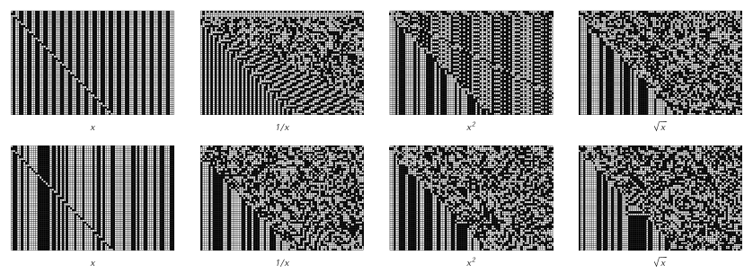
<!-- ORIGINAL_FIGURES page=0747 end -->

对具有相似数字序列的数字进行数学运算的结果。每幅图中的连续行给出一个数字序列，该序列通过使用一个 `x` 值得到，其中连续某一位被反转。顶部一行图像从 `x = 3/5` 的重复 2 进制数字序列开始；底部一行图像从 `x = pi/4` 开始。每幅图中连续数字序列之间缺乏连贯性，反映了数学运算应用于数字序列时的非局部性。

但这种细节层面的现象真的能被用作执行从根本上更精巧计算的基础吗？要比较连续系统和离散系统的一般计算能力，需要找到某种构造输入和解码输出的基本方案，而且这个方案可以用于两类系统。最明显也最实际的方法，是要求这始终由有限离散过程完成。

但至少在这种情况下，看起来相当清楚的是，上面显示的简单函数中没有任何一个能够例如导致超出普通离散系统演化可以轻易生成的结果的结果。如果使用本质上任何通常被认为是标准数学函数的函数，情况想必也是如此。但如果人们假定可以设置一个系统，它不仅能够求出这类函数的值，也能够求出涉及这些函数的任意方程的解，会发生什么？

对于纯多项式方程，人们可以从代数结果推断出，不会有从根本上更精巧的计算成为可能。但只要甚至允许三角函数，例如事实证明就可以构造一些方程，对它们求解等价于寻找像元胞自动机这样的系统演化无限步之后的结果。

[[PDF page 748]]

<!-- ORIGINAL_FIGURES page=0748 start -->
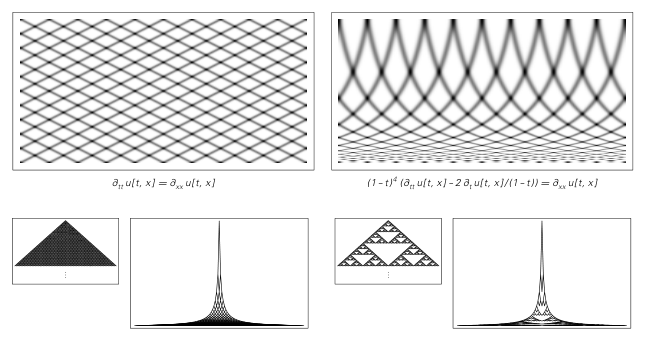
<!-- ORIGINAL_FIGURES page=0748 end -->

虽然这些特定类型方程从未被严肃地提出作为自然界或其他地方实际过程的理想化，事实证明，一个相关现象大概可以在微分方程中发生，而微分方程正是传统科学大多数领域中数学模型最常见的基础。

我们在第 4 章结尾讨论的那类微分方程，在某个层面上有点像元胞自动机。给定一个系统的状态，它们提供规则，用来确定该系统在后续时间的状态。但元胞自动机总是只按离散步骤演化，而微分方程则经历一个连续演化过程，其中时间只是作为一个参数出现。

通过对时间进入微分方程的方式作简单代数改变，人们常常可以如下面图像所示，安排那些通常需要无限时间的过程实际上总是在有限时间内发生。

关于连续系统中原则上怎样可以在有限时间内执行无限量计算工作的示意，例如偏微分方程。左上图显示波动方程的一个解。右上图显示从波动方程通过按 `t -> 1 - 1/t` 变换时间变量而得到的方程的一个解。底部一行显示同样变换会对简单元胞自动机生成的那类图案产生什么效果。大概可以构造出同时给出这些图案原始版本和变换版本的偏微分方程。

[[PDF page 749]]

所以，如果这类过程可以对应于像元胞自动机这样的系统的演化，那么至少在形式上可以推出，微分方程应当能够在有限时间内完成离散系统如元胞自动机需要无限时间才能完成的计算。

但正如要让模拟计算机忠实重现离散计算中的许多步骤很困难一样，设置微分方程使其在任意长时间内成功模拟元胞自动机这类系统的精确行为，似乎也很可能很困难。事实上，我怀疑，要让这件事奏效，将需要取一些极限，而这些极限相当类似于跟随微分方程演化无限时间。

所以我的猜测是，即使在传统连续数学的形式体系内部，对实际过程的现实理想化，最终也永远不能执行比计算等价原理所蕴含的更精巧的计算。

但人类思维过程又怎样？它也遵循计算等价原理吗？还是说，它以某种方式设法执行了比计算等价原理所蕴含的更精巧的计算？

我们有一种强烈倾向，会假定人类思维必定有某种极其精巧之处。如今的计算机系统甚至不能模拟它某些最明显特征，这一事实当然也似乎支持这个观点。但正如我在第 10 章讨论的，特别是在本书发现之后，我强烈相信，人类思维的基本机制最终会证明对应于相当简单的计算过程。

所以，这一切提示，自然界中的系统并不会执行比计算等价原理允许的更精巧的计算。但仅凭这一点，还不足以确立完整的计算等价原理。因为该原理也蕴含了计算精巧程度的下限，断言几乎任何不明显简单的过程，都会倾向于在计算精巧程度上等价。

[[PDF page 750]]

其后果之一是，它意味着大多数行为显得复杂的系统应当是通用的。然而到目前为止，我们只确切知道相当少的系统是通用的，尽管其中包括像规则 110 这样具有非凡简单规则的系统。毫无疑问，会有人提出反对说，其他行为显得复杂的系统事实上也许并不通用。

特别是，人们可能会认为，像规则 30 这样的系统的行为，虽然显然至少有一定计算精巧程度，但也许以某种方式过于随机，以至于无法被驾驭来允许完整通用性。尽管在第 11 章我确实给出了一些指向规则 30 通用性的证据，在这一点被确定证明之前，仍然可能存在疑问。

事实上，数学逻辑中有一个特别晦涩的结果，可能被认为显示存在这样的系统：它们表现出任意精巧计算的某些特征，

[[PDF page 751]]

但仍然不是通用的。因为在 1950 年代后期，人们构造了一整套具有所谓中间度的系统层级，其性质是：关于它们演化最终输出的问题，一般不能由有限计算回答；但这种输出的实际形式又不够灵活，无法模拟完整范围的其他系统，因此也不能支持通用性。

但当人们考察这类系统的已知例子时，会发现它们全都有非常错综复杂的底层规则。尽管其行为中被识别为输出的特定部分受到足够限制，从而避免通用性，但其行为的几乎每个其他部分仍然确实表现出通用性，正如人们会从计算等价原理预期的那样。

那么，像规则 30 这样的系统还可能因为什么原因而无法通用？我们从第 11 章知道，行为纯粹重复或纯粹嵌套的系统不能是通用的。因此我们也许会问，是否可能存在某种其他形式的规律性，会阻止像规则 30 这样的系统成为通用的。

当我们查看这类系统产生的图案时，它们当然并不显得有任何很大规律性；事实上，在大多数方面，它们看起来远比规则 110 这类我们已经知道通用的系统产生的图案随机。

但我们怎样才能确信，自己没有被自身感知与分析能力的局限误导？例如，外星智能会不会立刻识别出某种规律性，显示通用性是不可能的？

正如我们在第 10 章看到的，我们通常使用的感知与分析方法，不能检测远超重复，最多远超嵌套的任何规律性形式。因此这意味着，即使某种更高形式的规律性事实上存在，我们作为人类也许永远无法判断。

在科学和数学史中，重复和嵌套都占据显著位置。如果存在某种常见的更高规律性形式，它的发现无疑会带来各种重要的新科学和数学进展。

当我最初开始研究像元胞自动机这样的系统时，实际上隐含地假定必定存在某种这样的规律性。因为我非常确信，即使我看到的行为对我来说显得复杂，底层规则的简单性也必定以某种方式最终导致其中有巨大的规律性。

但随着岁月过去，随着我研究越来越多系统、尝试越来越多分析方法，我逐渐得出结论：在任何大类系统中都不存在隐藏规律性；相反，计算等价原理所提示的是正确的：除了具有明显规律性如重复和嵌套的系统之外，大多数系统都是通用的，并且在计算精巧程度上是等价的。

[[PDF page 752]]

## 解释复杂性现象

在本书早期，我描述了一个非凡发现：即使具有极其简单底层规则的系统，也能产生在我们看来极其复杂的行为。在本书过程中，我已经展示了这个现象的大量例子，并论证它负责自然界及其他地方我们看到的许多复杂性。

但到目前为止，我还没有为这个现象给出根本解释。现在，借助计算等价原理，我终于能够做到这一点。

关键点是，要比较我们所研究系统的计算精巧程度，与我们用来研究它们的系统的计算精巧程度。

起初，我们也许会假定，我们的大脑和数学方法总是能够具有远高于基于简单规则的系统的计算精巧程度，结果这类系统的行为不可避免地会在我们看来相当简单。

但计算等价原理意味着事实并非如此。因为它断言，本质上任何并不明显简单的过程，在计算精巧程度上都是等价的。所以这意味着，即使一个系统可能具有简单底层规则，它的演化过程在计算上仍可以和我们用于感知与分析的任何过程一样精巧。

这就是具有简单规则的系统能够显示在我们看来复杂的行为的根本原因。

起初，人们也许会认为这个解释取决于我们作为人类碰巧使用的特定感知与分析方法。但计算等价原理的一个后果是，它并不取决于这些方法。因为该原理断言，对于任何实际可用的感知与分析方法，都存在同样的计算等价。

在传统科学中，通常会作出这样一种理想化：感知与分析在某种意义上无限强大，因此人们在对一个系统得出结论时不必把它们考虑进去。但只要人们试图处理行为并非相当简单的系统，就会发现这种理想化崩溃，并有必要把感知与分析本身作为显式过程来考虑。

[[PDF page 753]]

如果人们研究自然界中的系统，那么系统自身的演化以及用于研究它们的感知与分析方法，都不可避免地必须是基于自然定律的过程。但至少在近代科学史中，人们通常假定自然界中典型系统的演化，以某种方式是比感知与分析低级得多的过程。

然而计算等价原理现在断言，事实并非如此；一旦达到相当低的阈值，任何真实系统都必定表现出本质上同一层次的计算精巧程度。这意味着观察者往往会与他们观察的系统在计算上等价，其不可避免的后果是，他们会认为这类系统的行为复杂。

所以归根结底，我们看到如此多复杂性的事实，可以相当直接地归因于计算等价原理，也归因于我们在实践中遇到的如此多系统事实上在计算上等价。

## 计算不可约性

从计算角度看，理论科学历史上大多数伟大胜利，在其基本特征上都显得惊人相似。因为在某个层面上，它们几乎全都基于寻找减少所需计算工作量的方法，以预测某个特定系统将怎样行动。

大多数时候，思想是推导一个数学公式，让人能够确定系统演化的结果，而不必显式追踪其步骤。

因此，例如理论科学的一个早期胜利，是推导出单个理想化行星绕恒星运行的位置公式。给定这个公式，人们只需代入数字，就能算出该行星在未来任意时刻的位置，而不必显式追踪其运动步骤。

但促使我发展本书这种新科学的整个努力的一个起点，是意识到存在许多常见系统，人们从未找到能够轻易描述其整体行为的传统数学公式。

[[PDF page 754]]

<!-- ORIGINAL_FIGURES page=0754 start -->
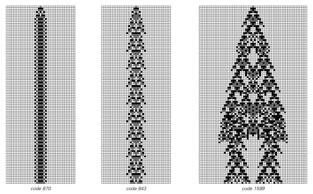
<!-- ORIGINAL_FIGURES page=0754 end -->

起初，人们也许会认为这必定只是某种暂时问题，只要足够聪明就可以克服。但从本书的发现中，我得出的结论是，事实上并非如此；相反，它是一个非常根本现象的后果。这个现象来自计算等价原理，我称之为计算不可约性。

如果把系统演化看作计算，那么这个演化的每一步都可以被认为需要该系统付出一定计算努力。但传统理论科学在某种意义上隐含依赖的是，这种努力中很大一部分以某种方式是不必要的，事实上应当可以用少得多的努力找到演化结果。

元胞自动机演化中计算可约性和不可约性的例子。前两个规则产生简单重复的计算可约行为，其中许多步之后的结果可以不追踪每一步而轻易推断。第三个规则产生看起来计算不可约的行为，因此其结果实际上只能通过显式追踪每一步来找到。这里显示的元胞自动机都有 3 色总和型规则。

在上面的前两个例子中，情况当然如此。因为就像理想化行星轨道一样，实际上存在一个直接公式，可以给出每个系统在任意步数之后的状态。所以即使系统自身通过经历一整个步骤序列来生成行为，我们也可以轻易绕过这个过程，用少得多的努力找到结果。

[[PDF page 755]]

但面对页上的第三个例子又怎样？在这种情况下要找到结果需要什么？人们总可以做实验，显式运行系统若干步，看看它怎样表现。但要拥有任何种类的传统理论，就必须找到一个涉及少得多计算的捷径。

然而，从面对页图像看，人们当然不清楚可能怎样做到这一点。查看下一页图像时，开始显得相当不可信的是，在这个系统的演化中事实上竟可能有任何方式找到显著捷径。

因此，面对页上前两个系统的行为很容易被看出是计算可约的，而第三个系统的行为似乎反而是计算不可约的。

传统科学通常假定，如果能够成功找到一个系统的确定底层规则，那么这意味着最终总会有相当容易的方式预测该系统将怎样行动。

几十年前，混沌理论指出，要有足够信息作出完整预测，一般不仅必须知道系统规则，也必须知道其完整初始条件。

但现在，计算不可约性导致了一个关于预测的更根本问题。因为它意味着，即使原则上拥有计算某个特定系统将怎样行动所需的全部信息，实际完成这件事仍可能需要不可约的计算工作量。

事实上，只要一个系统中存在计算不可约性，它就意味着，除了经历几乎与系统自身演化一样多的计算步骤之外，实际上不可能有办法预测该系统将怎样行动。

传统科学很少甚至意识到，有必要考虑用于作出预测的系统实际怎样运作。但导致计算不可约性现象的是，事实上总存在一种根本竞争，

[[PDF page 756]]

<!-- ORIGINAL_FIGURES page=0756 start -->
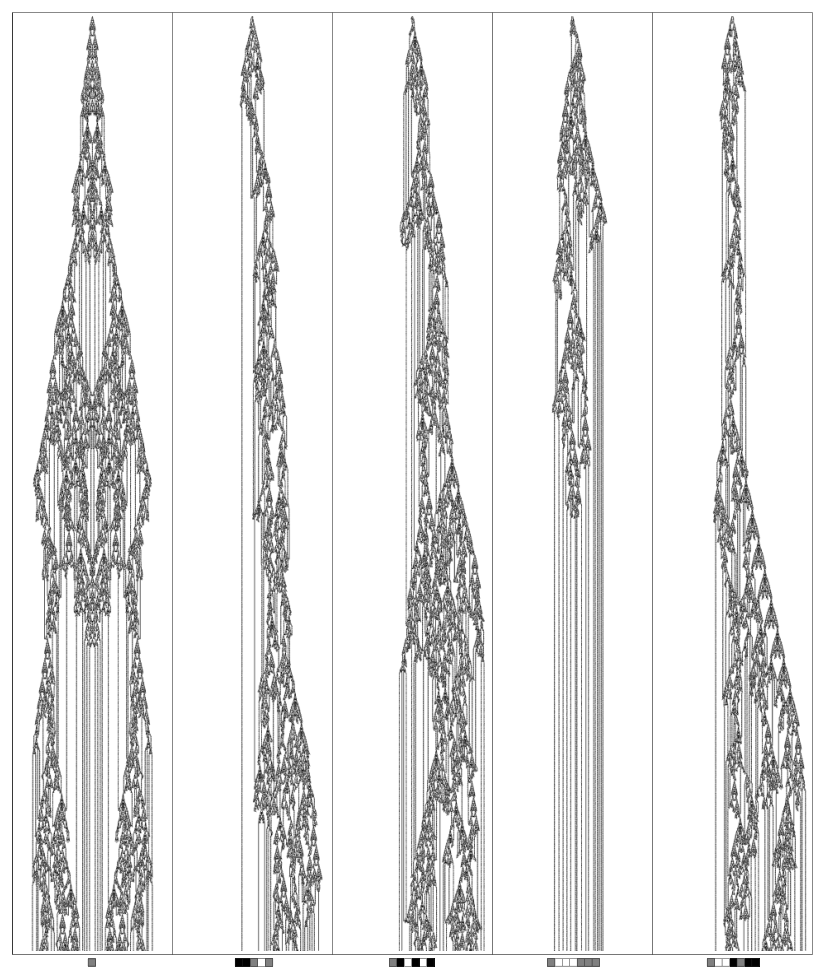
<!-- ORIGINAL_FIGURES page=0756 end -->

存在于用于作出预测的系统与人们试图预测其行为的系统之间。

前一页第三个系统从若干初始条件开始演化 5000 步。行为的复杂性使人觉得不可想象竟会存在某个过程，能够总是立刻找到其结果。

[[PDF page 757]]

因为如果要有可能作出有意义的一般预测，那么在某个层面上，作出预测的系统必须能够跑赢它试图预测的系统。但要做到这一点，作出预测的系统必须能够执行比它试图预测的系统更精巧的计算。

在传统科学中，这从来没有显得是太大问题。因为人们通常隐含假定，凭借我们的数学能力和一般思维能力，我们用于作出预测的计算，必定几乎无限地比大多数自然界及其他地方我们试图预测其行为的系统中发生的计算更精巧。

但计算等价原理作出的非凡断言是，这个假定并不正确；事实上，几乎任何行为不明显简单的系统，最终都执行精巧程度完全等价的计算。

这意味着，人们用于作出预测的系统，不能被期望执行比各种我们也许试图预测其行为的系统中发生的计算更精巧的计算。由此推出，对于许多系统，不可能进行系统性预测，因此不存在一般方式绕过其演化过程；结果，它们的行为必须被认为是计算不可约的。

如果一个系统的行为明显简单，例如是重复或嵌套的，那么它总是计算可约的。但根据计算等价原理，在实际上所有其他情况下，它都将是计算不可约的。

我相信，这就是传统理论科学在研究大多数其行为最终并不相当简单的系统类型时从未取得太大进展的根本原因。

因为关键在于，在底层层面，这种科学一直试图依赖计算可约性。例如，它用数学公式描述行为的整个思想，只有在行为是计算可约的时候才有意义。

[[PDF page 758]]

所以当计算不可约性存在时，传统理论科学的通常方法不可避免地不会奏效。事实上，我怀疑过去这种失败之所以没有更明显，唯一原因是理论科学通常倾向于专门定义自己的领域，以避开那些碰巧没有简单到计算可约的现象。

但我发展的新科学的一个主要特征是，它不需要作任何这样的限制。事实上，本书中我研究的许多系统无疑是计算不可约的。这就是为什么，不同于大多数传统理论科学著作，本书几乎没有数学公式，却有大量系统演化的显式图像。

过去几十年中，在实践中通过显式计算机模拟系统行为来研究系统已经变得越来越常见。但通常人们假定，这类模拟最终只是做那些本来可以用数学公式完成之事的一种方便方式。

但我关于计算不可约性的发现现在意味着，事实并非如此。相反，存在许多常见系统，其行为最终除了通过某种类似显式模拟的东西之外，根本无法确定。

已知通用系统存在这一点，已经告诉人们这在至少某些情况下必定为真。因为考虑试图跑赢一个通用系统的演化。由于这样的系统可以模拟任何系统，它特别可以模拟任何试图跑赢它的系统。由此推出，没有任何东西可以系统地跑赢这个通用系统。因为任何能够做到这一点的系统，实际上也必须能够跑赢自身。

但在本书的发现之前，人们也许会认为这几乎没有实践相关性。因为人们相信，除了专门构造的系统之外，通用性很罕见。人们还假定，即使存在通用性，如果要执行达到大多数预测方法所涉及的精巧程度的计算，也会需要非常特殊的初始条件。

[[PDF page 759]]

但计算等价原理断言，事实并非如此；事实上，几乎任何行为不明显简单的系统都会表现出通用性，并且即使在典型简单初始条件下也会执行精巧计算。

所以结果是，计算不可约性最终可以被预期是常见的，因此确实应当实际上不可能跑赢各种系统的演化。

思考计算不可约性时有一个稍微微妙的问题：给定绝对任何系统，人们总可以至少名义上想象通过设置一条规则来加速其演化，例如这条规则一次执行若干步演化。

但只要这样的规则自身更复杂，它最终也许并没有实现计算努力的真正减少。更重要的是，事实证明，当存在真正计算可约性时，其效果通常要显著得多。

下一页的图像显示了基于表现重复和嵌套行为的元胞自动机的典型例子。左侧图案中，任意给定步骤上每个元胞的颜色，实际上通过追踪该元胞自动机到那一步的显式演化来找到。但右侧图像中，特定元胞的结果则由需要少得多计算努力的过程来找到。

这些过程再次基于元胞自动机。但现在这些元胞自动机所做的是取得元胞位置的说明，然后实际上直接从中计算元胞的颜色。

事情被设置成，这些元胞自动机的初始条件由给出位置的数字的数字序列组成。然后，通过演化步数等于这些输入数字序列长度的步骤数，来找到某个特定元胞的颜色。

这意味着，例如左侧任一元胞自动机演化一百万步后的结果，现在只由 20 步演化确定，其中 20 是数字 1,000,000 的 2 进制数字序列长度。

事实证明，这与传统理论科学中典型数学公式发生的事情非常相似。因为这类公式的要点通常是允许人给出一个数字作为

[[PDF page 760]]

<!-- ORIGINAL_FIGURES page=0760 start -->
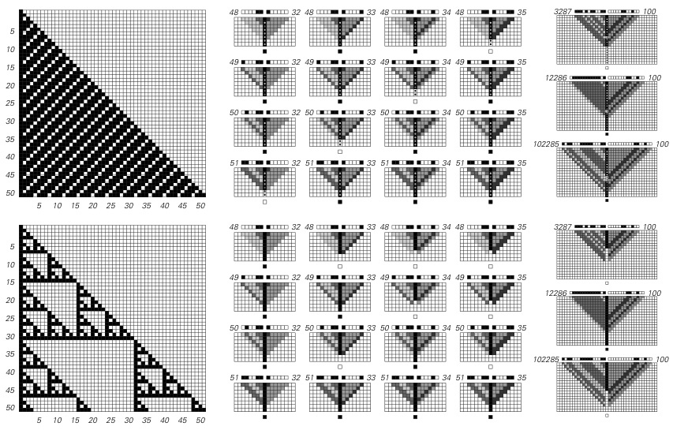
<!-- ORIGINAL_FIGURES page=0760 end -->

输入，然后直接计算出某个对应于例如系统演化该数字步数后结果的东西。

计算可约性实际发生的例子。左侧图像显示初等规则 188 和 60 的元胞自动机普通演化所产生的图案。右侧图像显示怎样可以用少得多的计算努力，找到这些图案中特定元胞的颜色。每种情况下，一个元胞的位置由一对数字指定，这些数字以 2 进制数字序列形式给出，作为一个元胞自动机的初始条件。该元胞自动机的演化随后迅速确定左侧图案中该位置处元胞的颜色。对于规则 188，执行此任务的元胞自动机涉及 12 种颜色；对于规则 60，则涉及 6 种颜色。一般而言，要找到规则 188 或规则 60 演化 `t` 步后某个元胞的颜色，需要大约 `Log[2, t]` 步。参见第 608 页。

在传统数学中，通常假定一旦有了涉及标准数学函数的显式公式，就实际上总能立刻计算这个公式。

但计算公式，像其他任何事情一样，是一个计算过程。除非某些数字位实际上永远不重要，否则这个过程通常不能少于其输入所含数字位数的步骤。

事实上，原则上这个过程可能需要与其输入数值大小成比例的步数。但如果真是这样，那么这就意味着，计算公式会需要和直接追踪原始过程每一步一样多的努力，而该公式本来应当给出这个原始过程的结果。

[[PDF page 761]]

<!-- ORIGINAL_FIGURES page=0761 start -->
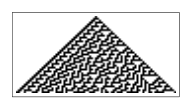
<!-- ORIGINAL_FIGURES page=0761 end -->

结果构成传统理论科学许多成功基础的关键点是，事实上大多数标准数学函数可以用远少于其输入数值大小的步数来求值，并且通常只随着其输入数字序列长度缓慢增长。

所以结果是，如果一个过程的结果存在传统数学公式，那么这几乎总是意味着该过程必定显示出很大的计算可约性。

不过，在实践中，已知传统数学公式的绝大多数情形，涉及的行为最终要么均匀，要么重复。事实上，正如我们在第 10 章看到的，如果只使用标准数学函数，那么甚至重现许多简单嵌套例子也相当困难。

但如面对页以及第 10 章中的图像所说明的，如果允许更一般种类的底层规则，那么设置一些过程就变得非常直接，这些过程只需很少计算努力，就能找到任意嵌套图案中任意元素的颜色。

那么，更复杂的图案又怎样，比如页面底部的规则 30 元胞自动机图案？

当我最初生成这类图案时，我花了大量时间试图分析它们，并试图找到一个过程，让我能够直接计算每个元胞的颜色。事实上，正是我在这方面一直无法取得多少进展，最先让我考虑可能存在计算不可约性这样的现象。

现在，计算等价原理所蕴含的是，事实上几乎任何行为不明显简单的系统都往往表现出计算不可约性。

不过，特别是当底层规则简单时，通常仍然存在某些表层的计算可约性。因此，例如在右侧规则 30 图案中，只要做一个非常短的计算，测试某个给定位置是否位于该图案中心三角区域之外，就能判断这个位置处的元胞是否有任何机会不是白色。

一个难以直接计算某个特定元胞颜色的图案例子。

[[PDF page 762]]

在规则 110 这样的第 4 类元胞自动机中，只要某些位置恰好只有少数彼此分离很好的局部结构存在，人们就可以轻易绕过至少有限步数的演化过程。

事实上，一般来说，我们在系统行为中设法识别出的几乎任何规律性，往往都反映了该行为中的某种计算可约性。

如果把行为图案看作一段数据，那么正如第 10 章讨论的，其中的规律性允许找到压缩描述。但压缩描述的存在本身并不意味着计算可约性。因为任何具有简单规则和简单初始条件的系统，包括例如规则 30，总会有这样的描述。

真正导致计算可约性的是，只需短计算就能从压缩描述中找到实际行为的任何特征。

事实证明，我们在实践中使用、并在第 10 章讨论过的感知与分析方法所能得到的压缩描述，本质上都具有这个性质。因此，这就是为什么我们用这些方法识别出的规律性确实反映了计算可约性的存在。

但正如我们在第 10 章看到的，在几乎任何不只是重复或嵌套行为的情况下，我们正常的感知与分析能力只识别出很少规律性，即使在某个层面上，我们看到的行为仍可能由极其简单的规则生成。

这支持了这样的断言：除了也许少量表层计算可约性之外，许多系统最终都是计算不可约的。事实上，这个断言至少部分解释了为什么不能期望我们的感知与分析方法在识别规律性方面走得更远。

但如果我们看到的行为对我们来说显得复杂，这是否必然意味着它不可能表现出任何计算可约性？试图对此形成一些认识的一种方式，是直接构造一些图案，

[[PDF page 763]]

<!-- ORIGINAL_FIGURES page=0763 start -->
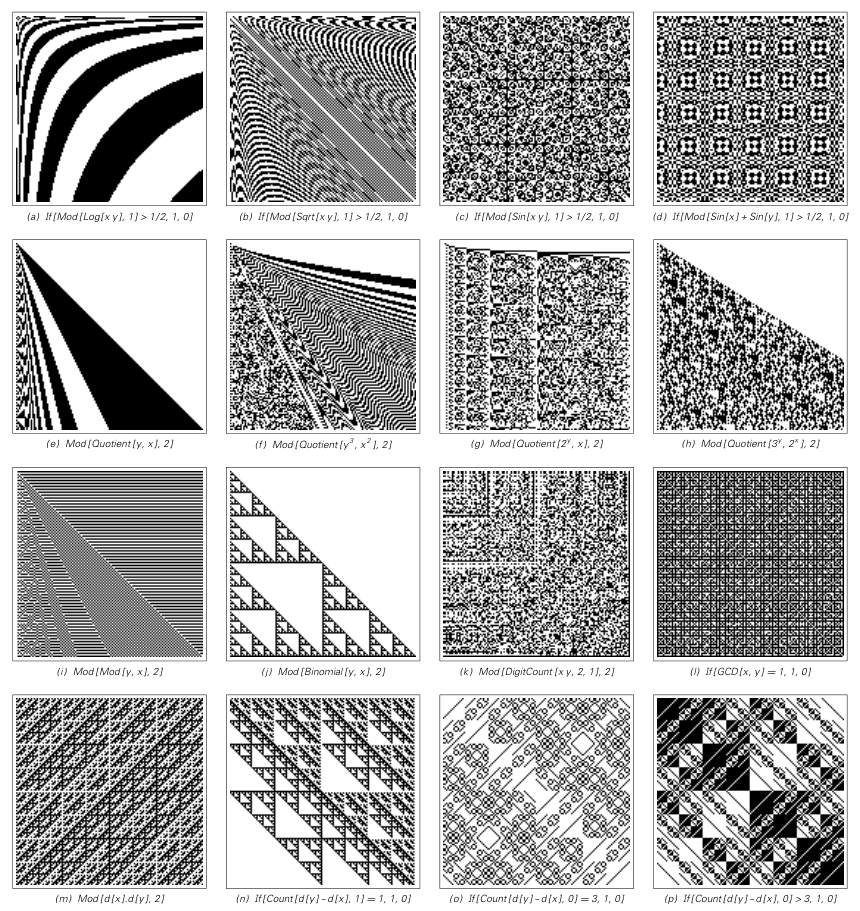
<!-- ORIGINAL_FIGURES page=0763 end -->

其中我们显式设置每个元胞的颜色，使其由代表该元胞位置的数字通过某个短计算来决定。

一些图案例子，其中每个元胞的颜色都被设置成可以从表示其位置的数字通过短计算来确定。大多数这样的图案在我们看来相当简单，但这里显示的例子是专门选择出来看起来更复杂的。它们大多数使用相当标准的数学函数，但组合方式不寻常。每幅图中 `x` 和 `y` 都从 1 到 127。`d[n]` 表示 `IntegerDigits[n, 2, 7]`。(h) 等价于 2 进制中 3 的幂的数字序列（见第 120 页）。(j) 本质上是帕斯卡三角形（见第 611 页）。(l) 曾在第 613 页讨论。(m) 是第 583 页见过的一个嵌套图案。已知唯一能通过按照简单局部规则向页面下方演化得到的图案是 (j)，它对应于规则 60 初等元胞自动机。

[[PDF page 764]]

当我们查看这类图案时，它们大多数在我们看来相当简单。但正如上一页图像所显示的，事实证明可以找到并非如此的例子，在这些例子中，图案在我们看来至少有些复杂。

不过，为了让这类图案给出有意义的计算可约性例子，还必须能够通过某个演化过程，例如通过反复应用某个元胞自动机规则，来产生它们。然而，对于这里显示的大多数情形，至少没有明显方法做到这一点。

不过，我确实找到了一类系统，它们已经在第 10 章中提到过，其行为并不显得简单，但事实证明仍然是计算可约的，如面对页图像所示。然而，我强烈怀疑，这类系统非常罕见；在自然界及其他地方我们看到的行为对我们来说显得复杂的绝大多数情况下，它最终确实与计算不可约性相关联。

那么，这对科学意味着什么？

过去，人们通常假定，对于科学可以期望做到什么，并没有最终限制。近几个世纪科学的进展当然如此令人印象深刻，以至于人们很常见地认为，最终它应当为几乎任何事物给出一个容易的理论，也许是一个数学公式。

但计算不可约性的发现现在意味着，这从根本上永远不可能发生；事实上，对于几乎任何在我们看来复杂的行为，都不可能有容易的理论。

这并不是说不能为这类行为找到底层规则。事实上，正如我在本书中论证的，特别是当这些规则以程序形式表述时，我怀疑它们常常极其简单。但关键在于，推断这些规则的后果可能需要不可约的计算努力量。

人们总可以实际上做一个实验，直接观看自己想研究的任何系统的实际行为。但一般来说，不能做的是找到一个容易的理论，让人不费多少努力就知道这种行为的每个方面将是什么。

[[PDF page 765]]

<!-- ORIGINAL_FIGURES page=0765 start -->
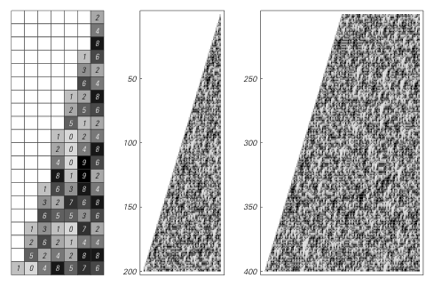
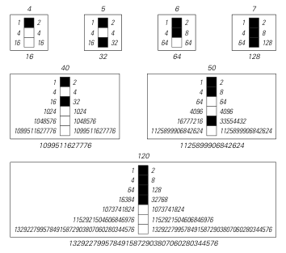
<!-- ORIGINAL_FIGURES page=0765 end -->

一个行为看起来复杂但仍然证明是计算可约的系统。该系统是一个每个元胞有 10 种可能颜色的元胞自动机。但它也可以被看作一个基于数字的系统，其中连续行是 2 的连续幂的 10 进制数字序列。事实证明，有一种快速方法可以只从 `n` 的 2 进制数字序列计算第 `n` 行，如右侧图像所说明的。这个过程基于寻找 `2^n` 的标准重复平方法：从 2 开始，然后连续对所得数字平方，如果 `n` 中对应 2 进制位为 1，就再乘以 2。使用这个过程，人们当然可以通过大约 `n Log[n]^3` 次运算来计算第 `n` 行任意元胞的颜色，而不是在显式执行元胞自动机演化时所需的 `n^2` 次。

那么，给定这些，理论科学是否仍然有用？

答案肯定是肯定的。即使在最传统形式中，它也常常能够很好处理那些碰巧简单到计算可约的行为方面。由于人们永远无法预先知道计算可约性在某个特定系统中会走多远，所以至少尝试应用传统理论科学方法总是值得的。

但如果最终存在计算不可约性，那么这些方法会失败。然而，仍然常有许多理由让人想使用抽象理论模型，而不是只对自然界和其他地方的实际系统做实验。正如本书中的结果提示的，只要使用恰当种类的模型，就可以取得许多成果。

任何一个准确模拟表现计算不可约性的系统的模型，在某个层面上都不可避免地必须涉及与该系统自身一样精巧的计算。但正如我在本书中显示的，即使具有非常简单底层规则的系统，仍然可以执行与任何系统中一样精巧的计算。

[[PDF page 766]]

<!-- ORIGINAL_FIGURES page=0766 start -->
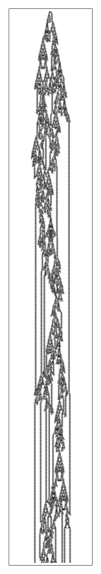
<!-- ORIGINAL_FIGURES page=0766 end -->

这意味着，为了捕捉即使具有非常复杂行为的系统的基本特征，使用具有极其简单基本结构的模型也可能足够。给定这些模型，找出它们会做什么的唯一方式通常只是运行它们。但关键在于，如果这些模型的结构足够简单，并且与可在实用计算机上高效实现的东西足够契合，那么找到模型的许多后果仍然常常完全可能。

从某种意义上说，这也正是本书大部分内容一直在做的事情。

## 自由意志现象

自古以来，一个巨大谜团就是：宇宙怎么能够遵循确定定律，而我们作为人类却仍常常设法以看起来相当不受明显定律支配的方式，决定怎样行动。

但根据本书中的发现，现在似乎终于可以对此给出解释。我相信，关键就是计算不可约性现象。

因为这个现象所蕴含的是，即使一个系统可能遵循确定底层定律，它的整体行为仍可能有一些方面从根本上不能由合理定律描述。

如果一个系统的演化对应于不可约计算，那么这意味着，要弄清该系统将怎样行动，唯一方法本质上就是执行这个计算。结果是，从根本上不可能存在一些定律，让人能够更直接地算出行为。

一个元胞自动机，其行为似乎显示出自由意志的一种类似物。尽管其底层定律是确定的，而且简单，行为却足够复杂，以至于它的许多方面似乎不遵循任何确定定律。（所用规则与第 740 页相同。）

我相信，正是这一点构成人类意志表观自由的最终来源。因为尽管我们大脑的所有组成部分想必遵循确定定律，我强烈怀疑，它们的整体行为对应于一种不可约计算，其结果实际上永远不能由合理定律找到。

事实上，在左侧元胞自动机这样的简单系统中，人们已经可以看到非常相同种类的事情在发生。因为

[[PDF page 767]]

尽管这个系统的底层定律完全确定，它的整体行为最终足够复杂，以至于许多方面似乎完全不遵循任何明显定律。

事实上，如果要谈论这个元胞自动机似乎怎样行动，人们很可能会说它只是决定做这个或那个，从而实际上赋予它某种自由意志。

但这可能合理吗？因为如果查看元胞自动机中的单个元胞，人们可以清楚看到，它们只是遵循确定规则，完全没有任何自由。

但在某个层面上，我们大脑中的单个神经细胞大概也是如此。然而不知怎的，作为整体，我们的大脑仍然设法以某种表观自由行动。

传统科学使理解这怎么可能发生变得非常困难。因为它通常假定，只要找到一个系统组成部分的底层规则，那么在某种意义上这些规则就告诉人们关于该系统的一切重要东西。

但我们在本书中一再看到，这甚至远远不接近正确；事实上，一个系统的行为中可能存在远远多于仅仅查看其底层规则所能预见的东西。从根本上说，这是计算不可约性现象的后果。

因为如果一个系统是计算不可约的，这意味着在该系统的底层规则与其整体行为之间，实际上存在一种有形分离，而这种分离与从前者到后者所需的不可约计算工作量相关。

我相信，我们在各种系统中看到的表观自由的基本来源，正位于这种分离之中，无论这些系统是抽象元胞自动机还是真实有生命的大脑。

但最终是什么让我们认为一个系统所做的事情中有自由？在实践中，主要标准似乎是我们不能轻易预测该系统的行为。

因为如果我们当然能够预测，那么这会向我们显示，行为必定以确定方式被决定，因此不可能是自由的。但至少用我们正常的感知与分析方法，通常需要相当简单的行为，我们才能实际识别出让我们作出合理预测的整体规则。

[[PDF page 768]]

然而，事实上即使在生物体中，这类行为也相当常见。例如特别是在较低等动物中，可以看到各种对刺激的非常简单和可预测的响应。但关键在于，这些通常只被认为是不可避免的反射，不给决策或自由留下空间。

然而，只要我们看到的行为变得更复杂，我们很快就倾向于想象它必定与某种底层自由相关。因为至少在传统直觉下，一个只遵循确定底层规则的系统中竟会出现任何真正不可预测性，始终显得相当不可信。

所以，为了解释我们作为人类表现出的行为，人们常常假定其中必定还有某种从根本上更多的东西，也许是人类独有的东西。

过去最常见的信念是，必定存在某种来自命运的外部影响，也许与超自然存在的干预相关，也许与天体配置相关。近来，对初始条件的敏感性和量子随机性则被提出作为更恰当的科学解释。

但这很像我们在第 6 章关于随机性的讨论，实际上并不需要这样的东西。因为正如本书中我们已经多次看到的，即使具有相当简单且确定底层规则的系统，也能产生复杂到看似不受明显规则支配的行为。

关键点在于，这只通过系统的内在演化发生，不需要来自外部或任何显式随机性来源的额外输入。

我相信，正是这种内在过程，我们现在知道它出现在范围巨大的系统中，主要负责我们大脑运作中的表观自由。

但这并不是说我们大脑中发生的一切都有内在来源。事实上，作为实践问题，通常似乎发生的是，我们接收外部输入，引出某个思绪序列，这个序列持续一段时间，然后消退，直到我们获得更多输入。而且这种思绪序列的实际形式常常受到我们从过去输入中发展出的记忆影响，因此即使输入完全相同，也不一定可重复。

[[PDF page 769]]

但似乎很可能，每个思绪序列中的单个步骤都遵循相当确定的底层规则。关键点随后是，我怀疑应用这些规则所执行的计算常常足够精巧，以至于是计算不可约的，结果它必定内在地产生在我们看来不受明显定律支配的行为。

## 不可判定性与难处理性

计算不可约性是一个非常一般的现象，有许多后果。这些后果包括抽象计算理论中已经被广泛研究的各种现象。

过去，人们通常假定这些现象只出现在相当特殊的系统中，而不会例如出现在具有简单规则的典型系统中，也不会出现在可能见于自然界的系统中。但我关于计算不可约性的发现现在提示，这类现象事实上应当非常广泛，并且例如应当出现在自然界及其他地方的许多系统中。

到目前为止，本章中我主要关心的是持续进行的计算过程，类似于自然界及其他地方系统持续进行的行为。但作为理论问题，人们可以询问一个计算在也许无限多步之后的最终结果是什么。如果这样做，就会遇到 1930 年代识别出的不可判定性现象。

下一页的图像显示了一个例子。每种情况下，知道最终结果都等价于判断由元胞自动机演化生成的图案最终会发生什么。它会消失吗？它会稳定下来并变得重复吗？还是它会以某种方式永远继续增长？

人们可以通过运行系统若干步并查看发生什么来试图找出答案。事实上，在例子 (a) 中，这种方法效果很好：只用 36 步就发现图案

[[PDF page 770]]

<!-- ORIGINAL_FIGURES page=0770 start -->
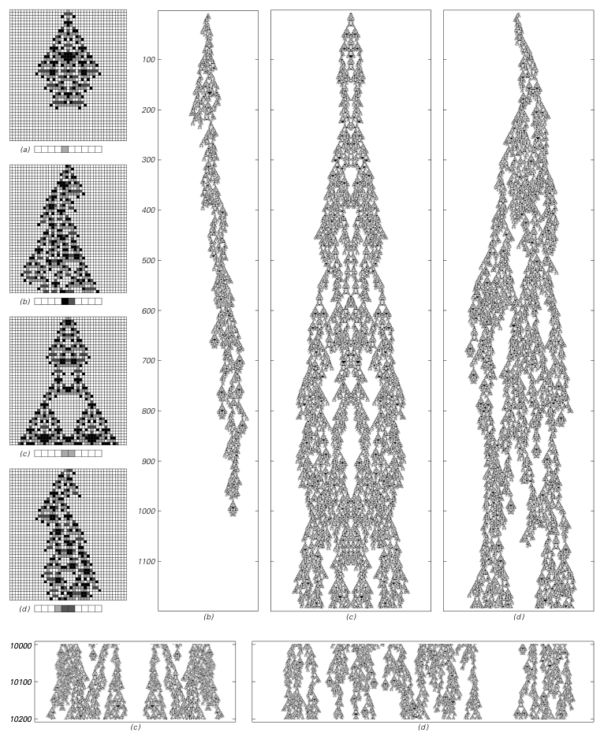
<!-- ORIGINAL_FIGURES page=0770 end -->

消失了。但已经在例子 (b) 中，事情就不那么容易。人们可以运行 1000 步，却仍不知道会发生什么。只有经过 1017 步之后，最终才清楚该图案事实上会消失。

说明不可判定性现象的元胞自动机演化。图案 (a) 在 36 步后消失；图案 (b) 需要 1017 步。但在情形 (c) 和 (d) 中，即使经过一百万步，最终结果会是什么仍不清楚。一般来说，似乎不存在任何有限计算可以保证确定无限步演化之后的最终结果。所使用的元胞自动机规则是一个代码为 1004600 的 4 色总和型规则。元胞自动机中的图案是否曾经消失，可以看作类似于图灵机停机问题的一个版本。

[[PDF page 771]]

那么例子 (c) 和 (d) 呢？它们会发生什么？一百万步之后，二者都没有消失；事实上，它们宽度分别为 31,000 和 39,718 个元胞。到一千万步之后，二者仍然继续，现在宽度为 339,028 和 390,023 个元胞。但即使已经把演化追踪到这么远，人们仍然不知道其最终结果会是什么。

在任何系统中，要想一般地保证知道这一点，唯一方式是有某种办法绕过系统演化，并能够把系统需要无限步做的事情归约为有限计算。

但如果该系统的行为是计算不可约的，正如我怀疑面对页上的元胞自动机以及许多其他具有简单底层规则的系统就是如此，那么关键在于，最终不存在这样的捷径。这意味着，关于系统最终会做什么的一般问题，可以被正式认为是不可判定的，也就是说，不存在能够保证判定它的有限计算。

对于任意特定初始条件，也许只要运行系统若干步，人们就能判断它会做什么。但关键点是，没有保证这会奏效：事实上，不存在任何有限计算量，人们总能确信它足以回答系统在无限步之后做什么的问题。

这种情况从 1930 年代以来已经为人所知。但通常人们假定，除了特殊而复杂的情形外，这类不可判定性的影响很少会被看到。然而，面对页的图像说明，事实上，即使底层规则非常简单、初始条件非常简单，不可判定性也可以有相当明显的影响。

我怀疑，对于几乎任何其行为在我们看来复杂的系统，关于该系统无限步之后做什么的几乎任何非平凡问题都会是不可判定的。所以，例如，系统从某个特定初始条件开始的演化是否曾经生成某个特定元胞颜色排列，或者它是否会产生一个例如最终重复或最终嵌套的图案，通常都会是不可判定的。

[[PDF page 772]]

如果人们询问是否存在任何初始条件会导致例如一个不消失的图案，那么这一般也会是不可判定的，尽管在某种意义上，这只是给定一个特定初始条件时不能判断它产生的图案是否最终会消失这一事实的直接后果。

但如果只查看可能序列，比如可用作初始条件的序列，并询问其中是否有任何序列满足某个约束，又怎样？即使这个约束容易测试，事实证明仍然可能出现不可判定性。因为人们可能没有上限能够说明必须走多远，才能确信在无限多个可能序列中，确实没有任何一个满足该约束。

面对页上的图像显示了一个简单例子。思想是挑选一组上下块对，然后询问是否存在这些块对的某个序列，满足这样一个约束：最终形成的上方字符串和下方字符串精确对应。

当只有两种块对时，事实证明回答这个问题相当直接。因为如果任何序列将满足约束，那么可以证明必定已经有一个长度有限的序列做到这一点；必要时可以通过显式查看所有可能性找到这个序列。

但只要有两个以上的块对，事情就变得复杂得多。正如面对页图像所展示的，即使块非常短，为了满足约束，也可能需要极长且看起来相当随机的序列。

事实上，我强烈怀疑，即使只有三个块对，也已经存在计算不可约性。因此，回答约束是否可以满足这一问题，实际上唯一方法就是显式追踪任意长序列中某个部分的全部可能性，使这个问题一般来说不可判定。

事实上，只要人们的问题以某种方式涉及查看无限数量的步骤、元素或其他东西，

[[PDF page 773]]

<!-- ORIGINAL_FIGURES page=0773 start -->
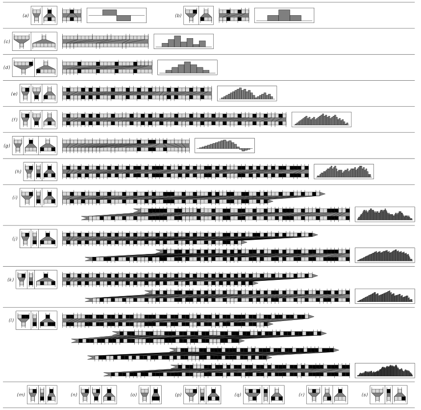
<!-- ORIGINAL_FIGURES page=0773 end -->

如果它询问的是一个表现计算不可约性的系统，那么这样的问题几乎不可避免地是不可判定的。

一维约束类别的例子，其中一般不可判定这些约束是否可以满足。约束要求按某种顺序串接所示块，得到相同的上方和下方字符串。在情形 (a)-(l) 中，约束可以满足，并显示了满足约束的最短字符串。右侧图表给出每添加一个新块时，上下字符串长度之间的连续差；这个差达到零反映了约束得到满足。情形 (m)-(s) 显示不能由任何有限长度字符串满足的约束。当约束涉及两个以上块时，一般似乎没有上限说明可能需要考虑多长的字符串，才能判断约束是否可以满足。图像 (a)、(b)、(h) 和 (j) 显示了在涉及总元素数分别为 7、8、9 和 10 的块的 4096、16384、65536 和 262144 个约束中，所需最长最短字符串的情况。满足这里所示这类约束的一般问题称为 Post 对应问题。找到本页中的系统，需要通过计算机以及其他方式构造大量证明，以证明特定约束不可能被满足。

[[PDF page 774]]

那么有限问题又怎样？

这类问题最终总可以由有限计算回答。但当存在计算不可约性时，这类计算可能被迫具有某个难度水平，有时使它们相当难处理。

当人们做实用计算时，往往通过查看一个计算需要多少时间、也许还看它涉及多大程序和需要多少内存，来评估计算难度。

但通常人们没有办法判断自己用于某个特定计算的方案是否是可能的最高效方案。过去当然有几次，新算法突然让各种计算可以比此前任何人认为可能的效率高得多地完成。

事实上，尽管计算复杂性理论领域几十年来付出了巨大努力，关于计算难度的坚实下界几乎从未被确立。但使用本书的方法，事实证明可以开始至少得到少数结果。

关键是考虑非常小的程序。因为对于这类程序，枚举某一特定种类的每一个程序变得现实，然后可以显式查看哪一个在执行某个特定计算时最高效。

过去，这种方法不会显得明智，因为人们通常假定，小到足以让这种枚举奏效的程序只会做相当平凡的计算。但我的发现显示，事实上即使非常小的程序也完全有能力做各种精巧计算。

作为第一个例子，基于一个相当简单的计算，面对页顶部的图像显示了一个被设置为对任意数字加 1 的图灵机。图灵机的输入是该数字的 2 进制数字序列。机器读写头从这个序列的右端开始，机器运行直到其读写头第一次向右走得更远，在这时机器停止，留下的任何数字序列被取为计算输出。

[[PDF page 775]]

<!-- ORIGINAL_FIGURES page=0775 start -->
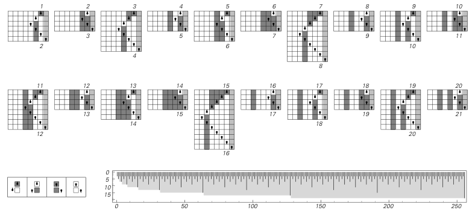
<!-- ORIGINAL_FIGURES page=0775 end -->

一个简单图灵机行为的例子，它执行给一个数字加 1 的计算。该数字作为 2 进制数字序列给出；图灵机运行到其读写头碰到右侧灰色条纹为止。图表显示这所需的步数作为输入数字 `x` 的函数。结果由 `2 IntegerExponent[x + 1, 2] + 3` 给出，其最大值为 `2 n + 3`，其中 `n` 是 `x` 的数字序列长度，即 `Floor[Log[2, x]]`。对于给定输入长度，平均值不随 `n` 增加，并且总是精确等于 5。

上方图像显示，对于这台特定机器，完成计算所需步数在不同输入之间差异很大。但如果只看任意给定输入长度下步数的绝对最大值，就会发现它随这个长度精确线性增长。

那么，是否有其他方式可以用不同步数做同样计算？人们很容易枚举全部 4096 个具有 2 个状态和 2 种颜色的可能图灵机。事实证明，其中恰好 17 个执行给数字加 1 的计算。

它们各自以稍微不同的方式工作，但全部遵循下一页顶部显示的三种方案之一，并且它们最终全都表现出步数随输入长度同样的整体线性增长。

那么其他计算又怎样？

事实证明，有 351 个不同函数可以由一个或多个 4096 个 2 状态 2 色图灵机计算。

[[PDF page 776]]

<!-- ORIGINAL_FIGURES page=0776 start -->
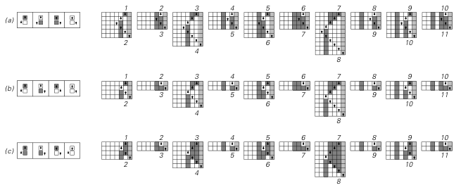
<!-- ORIGINAL_FIGURES page=0776 end -->

2 状态 2 色图灵机所使用的三种给数字加 1 的方案。随着输入大小增加，所有方案在最大步数上都显示同样的线性增长。这种增长可以看作潜在地必须把进位数字从输入数字一端传播到另一端的后果。所示机器编号为 445、461 和 1512。

正如面对页图像所示，不同图灵机执行它们所做的计算时，可能需要非常不同数量的步骤。

例如，图灵机 (a) 总是在最多 5 步后完成其计算，而不依赖于输入长度。但在所示大多数其他图灵机中，所需最大步数通常随输入长度增加。

图灵机 (b)、(c) 和 (d) 总是计算同一函数。但虽然这意味着对于给定输入，它们各自给出同样输出，图像却显示它们通常需要不同步数来做到这一点。不过，如果查看任意给定输入长度所需的最大步数，就会发现这仍然总是精确线性增加，正如本页顶部所示那些加 1 的图灵机一样。

那么，是否存在增长更快的情形？图灵机 (e) 显示了一个例子，其中最大步数像输入长度的平方那样增长。事实证明，至少在 2 状态 2 色图灵机中，这是唯一计算它所计算函数的机器。因此，至少如果想使用这样简单的程序，就没有更快方式完成这个计算。

[[PDF page 777]]

<!-- ORIGINAL_FIGURES page=0777 start -->
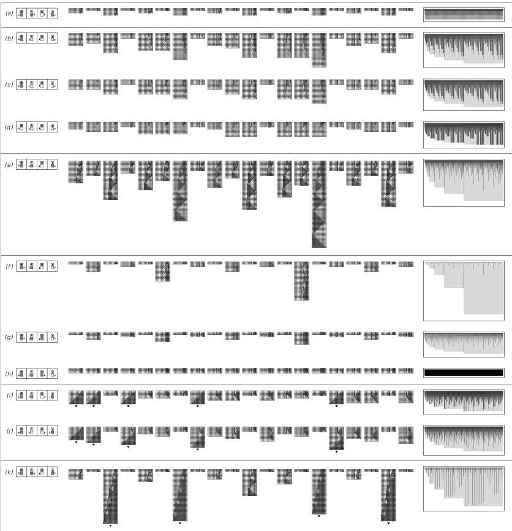
<!-- ORIGINAL_FIGURES page=0777 end -->

由 2 状态 2 色图灵机执行计算的例子。图中显示了从一系列初始条件出发的演化，对应于数字 1 到 20 的输入。每个图灵机块对给定输入都产生同样输出。当图灵机读写头走到比开始时更靠右的位置时，计算被认为完成。图表显示输入长度到 9 时连续输入所需步数。长度为 `n` 的输入的最大值为：(a) 5，(b) `6 n + 3`，(c) `4 n + 3`，(d) `2 n + 3`，(e) `2 n^2 + 8 n + 7`，(f) `2^(n+1) - 1`（尽管平均值为 `n + 2`），(g) `2 n + 1`，(h) 3，(i) `2 n + 1`，(j) `4 n - 1`，(k) 大约 `2.5 n^2`。在情形 (i)、(j) 和 (k) 中，有些输入会让读写头越来越向左移动，图灵机永不停机。所示机器编号为 3279、1285、3333、261、1447、1953、1969、3517、3246、3374、1507。

[[PDF page 778]]

那么，是否有需要更长时间完成的计算？在图灵机 (f) 中，最大步数随输入长度指数增长。但不同于例子 (e)，这个图灵机并不是唯一计算该函数的机器。事实上，(g) 和 (h) 也计算同一函数，但分别只需要线性增加和常数数量的步骤。

其他图灵机又怎样？一般来说，无法保证某个特定图灵机甚至会在有限步数内完成计算。因为正如例子 (i) 和 (j) 中几个输入所发生的那样，读写头可能最终只是越来越向左移动，永远不到达计算被认为完成所需的右侧位置。

但如果忽略发生这种情况的输入，那么至少在例子 (i) 和 (j) 中，最大步数仍然以非常系统的线性方式随输入长度增长。

不过，在例子 (k) 中，增长更不规则。但最大步数最终再次只是像输入长度的平方那样增加。事实上，如果查看全部 4096 个 2 状态 2 色图灵机，事实证明人们看到的增长率只有线性、平方和指数三种。

而在出现指数增长的六个例子中，所有都像上面的例子 (f) 那样，也就是说，存在另一个 2 状态 2 色图灵机计算同一函数，但最大步数完全不随输入长度增加。

那么，如果考虑更复杂的图灵机会发生什么？对于 3 状态 2 色，总共有 2,985,984 个可能机器。事实证明，其中一个或多个机器计算的不同函数约有 33,000 个。

大多数时候，计算某个给定函数最快的机器再次表现出线性或最多二次增长。但面对页显示了一些情形，其中它反而表现出指数增长。

事实上，在少数情况下，增长似乎甚至更快。例子 (h) 是 3 状态 2 色图灵机中最极端的：对于大小为 7 的输入 106，它已经需要 1,978,213,883 步

[[PDF page 779]]

<!-- ORIGINAL_FIGURES page=0779 start -->
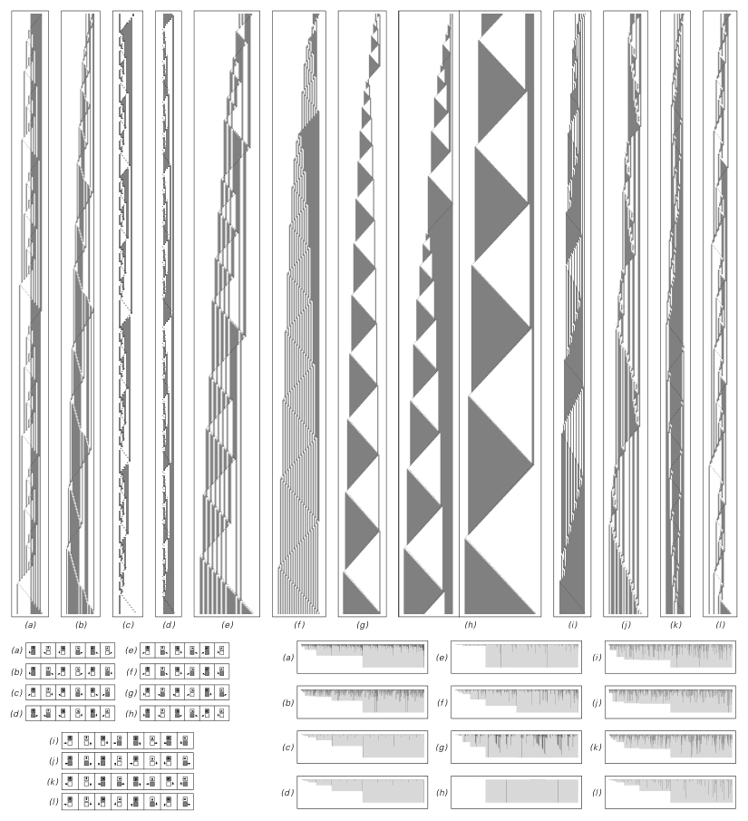
<!-- ORIGINAL_FIGURES page=0779 end -->

才能生成其输出；一般而言，对于大小为 `n` 的输入，它也许能够需要超过 `2^(2^n)` 步。

3 状态和 4 状态图灵机的例子，其中计算完成前最大步数至少随输入长度指数增长。在所有情况下，没有同状态数的图灵机能以更少步数计算同样函数。在情形 (h) 中，步数增长如此迅速，以至于图表中只看到两个峰。顶部一行图像都被缩放为完全相同高度，尽管初始条件无法选择到让每种情况下的步数超过大致相同的程度。机器编号为：582285、657939、2018806、2868668、2138664、2139050、132527、600720、3374234978、1806221583、1232059922、3238044559。像 (c) 和 (d) 这样的情形显示嵌套行为，令人想起生成连续整数数字序列的计数器。

[[PDF page 780]]

但如果允许具有更复杂规则的图灵机呢？对于 4 状态 2 色规则，事实证明可以只用固定步数生成与例子 (c) 和 (d) 相同的输出。但对于所示其他 3 状态 2 色图灵机，没有任何一个 4 状态规则提供加速。

不过，如果仔细查看例子 (a) 到 (h)，每个都显示出大区域的重复或嵌套行为。看来这很可能反映了某种计算可约性，使足够复杂的程序能够用少于指数数量的步骤生成同样输出。

但查看 4 状态 2 色图灵机，例子 (i) 到 (l) 再次似乎表现出大致指数增长。然而现在，很像第 3 章中的 4 状态图灵机，所看到的实际行为并不显示任何明显计算可约性。

因此，这提示，尽管它们可以由非常简单规则指定，确实存在一些图灵机计算，除了花费随输入长度指数增加的计算努力量之外，实际上无法完成。

当然，如果只允许不超过 4 状态 2 色图灵机，我已经能够通过显式搜索约 40 亿个可能规则，确立绝对没有办法加速图像 (i) 到 (l) 中的计算。

但其他种类的系统又怎样？

一旦拥有一个通用系统，原则上它可以被安排来做任何计算。但问题是以什么速率完成。如果没有特殊优化，一个通用图灵机例如通常只会以它被设置来模拟的任意特定图灵机速度的某个固定分数运行。

如果查看不同计算机和计算机语言，实践经验往往提示，至少在指数增长这类问题层面，给定计算最终在几乎每个这类系统中能够完成的速率相当类似。

[[PDF page 781]]

<!-- ORIGINAL_FIGURES page=0781 start -->
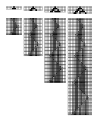
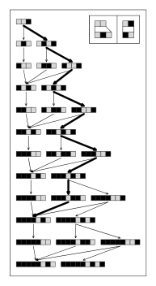
<!-- ORIGINAL_FIGURES page=0781 end -->

但人们也许会想象，在我本书考虑过的、并且想必出现在自然界中的范围广泛得多的计算系统中，对于给定计算可以完成的速率，仍然可能存在巨大差异。

然而，根据我们在第 11 章看到的东西，人们会怀疑事实上并非如此。因为在那一章中，逐渐清楚的是，本书中几乎所有非常多样的系统实际上都可以用相当可比的步数互相模拟。

事实上，我们常常发现，可以用另一个系统中的固定步骤序列来模拟某个特定系统中的每一步。但如果一个步骤中可更新的元素数量差异足够大，这往往就变得不可能。

因此，例如右侧图像显示，一个每一步只更新一个元胞的图灵机，可能需要 `t` 步，才能构建出与一维元胞自动机在 `t` 步中通过并行更新每个元胞而构建出的同样图案。在 `d` 维中，一个系统模拟另一个系统 `t` 步演化常常可能需要比如 `t^(d+1)` 步。

模拟该元胞自动机 `t` 步演化，图灵机需要 `2 t^2 + 5 t - 6` 步。

但它是否可能需要指数数量的步骤？如果有一个产生指数多个元素的替换系统，那么要用普通图灵机重现所有这些元素，就需要指数多步骤。类似地，如果有一个产生指数多个字符串的多路系统，那么要重现所有这些字符串，也同样需要指数多步骤。

但如果只询问输出的某个有限特征，例如某个特定字符串是否在多路系统演化 `t` 步之后出现，又怎样？给定像右侧图像中那样的特定路径，普通图灵机只需要比 `t` 多不了多少的步数，就能测试这条路径是否产生所需字符串。

但一个图灵机要找出多路系统中是否有任何路径成功产生该字符串，可能需要多久？如果图灵机实际上必须依次检查也许指数多个路径中的每一个，那么这可能需要指数多步骤。但计算复杂性理论中著名的 `P=NP` 问题问的是，一般而言是否有某种方法能够用不是指数增长、而只是幂次增长的步数得到这样的答案。

图灵机可以快速测试高亮路径，但测试所有路径可能需要指数长时间。

[[PDF page 782]]

尽管这从未被确定证明，但现在看来，在大多数有意义的意义上很可能没有这样的方法。因此，这所蕴含的是，要回答关于一个多路系统 `t` 步行为的问题，任何普通图灵机可能都需要数量增长快于 `t` 的任何幂的步骤。

这种现象有多常见？询问多路系统中的可能结果，可以被看作类似于询问满足约束的可能方式。许多实践问题当然可以用约束来表述。

但这类问题彼此如何比较？计算等价原理提示，那些显得困难的问题应当以某种方式倾向于等价。事实上，过去几十年里，相当多这类问题确实已经全都被发现是所谓 NP 完全的。

这意味着，这些问题表现出某种通用性的类似物，使得可以用少于指数的努力，把它们中任何一个问题的任何实例翻译成任何另一个问题的实例。作为一个例子，面对页上的图像显示了关于所谓非确定性图灵机的一类问题，怎样可以被翻译成关于元胞自动机的另一类问题。

非常像多路系统，非确定性图灵机的规则允许每一步作出多个选择，从而导致多条可能演化路径。于是，NP 完全问题的一个例子是，这些路径中是否有任何一条满足某个约束，例如在特定步数之后，图灵机读写头是否曾经走到比起始位置更靠右的位置。

面对页图像顶部一行显示了，在某个特定非确定性图灵机中作出连续选择序列时，指数多个可能路径中的前几个。在所示例子中，可以看到其中两条路径让读写头向右移动，因此整体约束得到满足。

那么图像下方的元胞自动机又怎样？给定一个特定初始条件，它的演化是完全确定性的。

[[PDF page 783]]

<!-- ORIGINAL_FIGURES page=0783 start -->
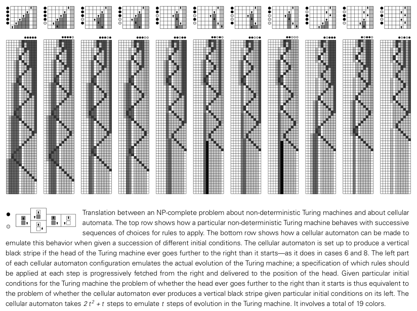
<!-- ORIGINAL_FIGURES page=0783 end -->

一个关于非确定性图灵机的 NP 完全问题与一个关于元胞自动机的问题之间的翻译。顶部一行显示某个特定非确定性图灵机在连续规则选择序列下的行为。底部一行显示给定一系列不同初始条件时，元胞自动机怎样可以被安排来模拟这种行为。如果图灵机读写头曾经走到比起始位置更靠右，元胞自动机就被设置为产生一条竖直黑色条纹，如情形 6 和 8 中那样。每个元胞自动机配置的左侧部分模拟图灵机的实际演化；关于每一步应应用哪些规则的说明则从右侧逐步取出，并送到读写头位置。给定图灵机的特定初始条件，读写头是否曾经走到比起始位置更靠右的问题，就等价于给定元胞自动机左侧的特定初始条件时，它是否曾经产生一条竖直黑色条纹的问题。该元胞自动机需要 `2 t^2 + t` 步来模拟图灵机的 `t` 步演化。它总共涉及 19 种颜色。

但图像显示的是，随着连续初始条件，它模拟非确定性图灵机中的每一条可能路径。

因此，这意味着，寻找是否存在使元胞自动机产生某个结果的初始条件的问题，等价于上面的非确定性图灵机问题，因此一般而言是 NP 完全的。

那么其他种类的问题又怎样？

下一页的图像显示了经典可满足性问题与本页顶部非确定性图灵机问题之间的等价。在可满足性问题中，人们从一组黑色、白色和灰色方格行开始。然后要问的是，是否存在一个只由黑白方格组成的序列，满足这样的约束：

[[PDF page 784]]

<!-- ORIGINAL_FIGURES page=0784 start -->
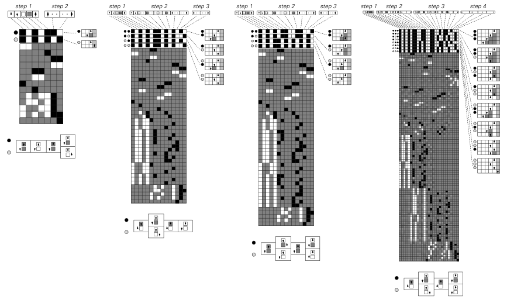
<!-- ORIGINAL_FIGURES page=0784 end -->

在每一行上，至少有一个方格的颜色与该序列中对应方格的颜色一致。

非确定性图灵机中的停机 NP 完全问题与经典可满足性 NP 完全问题之间的翻译。在可满足性问题中，人们设置一组黑色、白色和灰色方格行，然后询问是否存在任何黑白方格序列，满足每一行至少一个方格的颜色与该序列中对应方格的颜色一致这一约束。每一行可以被看作合取范式布尔表达式中的一项，每一列对应于一个不同变量。某一行上的给定方格为黑色或白色时，表示一个变量或其否定出现在该项中。来自图灵机问题的翻译通过表示图灵机行为来实现：在每一步，关于它的一系列基本陈述中哪些为真，例如读写头是否处于某个状态，读写头下方元胞是黑色还是白色，以及读写头是否处于它可能处于的每个位置。布尔表达式随后给出约束，说明这些陈述中哪些可以同时为真。例如在前两幅图中，第一行对应于这样的约束：在图灵机演化第一步，读写头不能同时处于上状态和下状态。每个布尔表达式中大约前半数项对应于关于图灵机运作的类似一般约束。随后有少数项指定这里使用的特定初始条件，接着是给出所用图灵机规则的项。最后一项陈述图灵机会停机。正如图像所示，图灵机的每条可能演化路径都对应于与每个基本陈述相关变量的一种可能真值赋值。如果存在任何一条路径让图灵机停机，布尔表达式就是可满足的。所示第一和第四个例子属于这种情况，另外两个则不是。一般而言，可以用一个含有最多 `t^3` 项、`t^2` 个变量的布尔表达式表示非确定性图灵机 `t` 步演化。这里所示翻译的一个版本，启动了 1970 年代早期对 NP 完全性的研究。

[[PDF page 785]]

为了看出它与图灵机问题的等价，人们可以想象把图灵机行为的描述分解成一系列基本陈述：在某个特定步骤读写头是否处于某个特定状态，某个元胞是否具有某个特定颜色，等等。图灵机的底层规则随后定义了关于这些陈述序列中哪些可以为真的约束。在面对页图像中，几乎每一行黑色、白色和灰色方格都对应于一个这样的约束。

不过，最后一行表示一个进一步约束：图灵机读写头必须在某个时刻走到比起始位置更靠右。因此，在可满足性问题中询问是否存在任何序列遵守所有约束，就等价于寻找上面描述的图灵机问题的答案。

从可满足性出发，可以显示离散数学中各种著名计算问题都是 NP 完全的。此外，几乎任何涉及简单约束的不可判定问题，例如第 757 页上的对应问题，只要限制到有限情形，都会成为 NP 完全问题。

在研究 NP 完全性现象时，过去主要做的是试图构造相当一般问题的特定实例，使它们表现出与其他问题的等价。但实际构造出来的东西几乎总是相当复杂，当然不是人们期望会经常出现的东西。

然而，基于计算等价原理带来的直觉，我强烈怀疑，在大多数情况下，一般 NP 完全问题中已经存在相当简单的实例，它们和任何 NP 完全问题一样困难。因此，例如我怀疑，要让“是否存在初始条件导致特定行为”这一问题成为 NP 完全问题，并不需要一个像第 767 页上那样复杂得多的元胞自动机。

[[PDF page 786]]

<!-- ORIGINAL_FIGURES page=0786 start -->
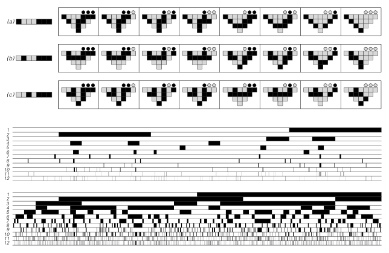
<!-- ORIGINAL_FIGURES page=0786 end -->

事实上，我预期，即使对于规则 30 元胞自动机，询问 `t` 步演化的可能结果也已经是 NP 完全的，如下图所示。

一个我怀疑是 NP 完全的简单问题例子。问题是判断规则 30 初始条件中的右侧元胞是否可以被填入，从而在 `t` 步演化后形成的中心列底部产生一条具有某个高度的竖直黑色条纹。顶部图像显示，在情形 (a) 中可以产生高度到 3 的条纹，在情形 (b) 中高度到 2，在情形 (c) 中只有高度到 1。底部图像用黑色标出，在 `2^(t+1)` 个连续左侧 `t + 1` 元胞序列中，哪些不可能分别得到高度为 1 和 2 的条纹。这些图案的表观随机性反映了该问题可能的困难性。这个问题与第 603 页讨论的规则 30 密码分析问题相关。

就像第 761 和 763 页的图灵机一样，会有某种密度的情形，其中问题相当容易解决。但看起来很可能的是，随着 `t` 增大，没有普通图灵机或元胞自动机能够保证用只像 `t` 的某个幂那样增长的步数解决这个问题。

尽管如此，原则上自然界中仍可能存在某种其他系统能够做到这一点。例如，如果能够使用指数级小的组件，人们也许可以想象这会成为可能。但我们拥有的几乎所有证据

[[PDF page 787]]

都提示，在我们的实际宇宙中，我们能够期望操纵的组件大小和密度存在限制。

在当代物理中，量子力学的标准数学形式体系常常被解释为提示，量子系统像多路系统一样工作，潜在地并行遵循许多路径。事实上，在通常形式体系内，人们可以构造量子计算机，它们也许能够比普通图灵机指数级更快地解决至少少数特定问题。

但特别是在第 9 章中的发现之后，我强烈怀疑，即使这在形式上成立，它仍不会被证明是最终物理实在的真实表示，而只会被发现反映了迄今所用模型中作出的各种理想化。

因此，最终看起来很可能，在某种根本意义上，寻找一个系统在给定特定初始条件下的行为所需计算努力量，与解决反问题，即判断哪些初始条件如果存在会产生特定行为所需计算努力量之间，确实可能存在几乎指数级差异。

事实上，我怀疑这种差异会存在于几乎任何行为在我们看来复杂的系统中。除其他外，这随后意味着对第 10 章中讨论的感知与分析过程存在许多根本限制。

这些限制最终可以被看作计算不可约性现象的后果。但一个更直接的后果，是我们之前已经讨论过的：即使给定一个特定初始条件，要找到某个给定演化步数之后的结果，也可能需要不可约的计算工作量。

人们可以通过给出 `t` 的数字序列来指定想要的步数 `t`。对于行为足够简单的系统，例如重复或嵌套系统，第 744 页的图像显示，人们通常可以用本质上与该数字序列长度成比例的努力量确定结果。

但关键在于，当计算不可约性存在时，人们实际上可能必须显式跟随 `t` 个演化步骤中的每一步，再次需要指数多的计算工作量。

[[PDF page 788]]

## 对数学及其基础的影响

我在本书中所做的许多事情，都是由试图理解自然界中的现象所激发。但我发展出的思想足够一般，并不只适用于自然界。事实上，在本节中我要做的是显示，它们也可以用来为数学中的基础问题提供重要的新洞见。

在某个相当抽象的层面上，人们可以立刻识别出自然与数学之间的一种基本相似性：在自然界中，人们知道相当简单的底层定律以某种方式导致我们看到的丰富而复杂的行为；而在数学中，整个领域在某种意义上基于这样一个概念：像面对页上那些相当简单的公理，可以导致各种丰富而复杂的结果。

这种相似性来自哪里？起初人们也许会认为，它必定是自然以某种方式内在遵循数学的结果。因为数学在其早期历史中，当然是专门被设置来捕捉自然的某些简单方面的。

但本书中科学的起点之一是，当涉及更复杂的行为时，数学事实上从未很好解释我们在自然界中每天看到的大多数东西。

然而在某个层面上，数学中仍然有各种复杂性。事实上，如果查看几乎任何现代数学片段的呈现，它往往会显得相当复杂。但关键在于，这种复杂性通常与我们在自然界中看到的任何东西都没有明显关系。事实上，在过去一个世纪中，数学所做的事情大多越来越努力地使自身远离与自然界的任何特定对应。

因此，这提示数学和自然之间的整体相似性必定有更深来源。我相信，最终它只是我在本章中讨论的非常一般的计算等价原理的又一个后果。

因为数学和自然都涉及可以被看作计算的过程。关键随后在于，所有这些计算都遵循计算等价原理，

[[PDF page 789]]

<!-- ORIGINAL_FIGURES page=0789 start -->
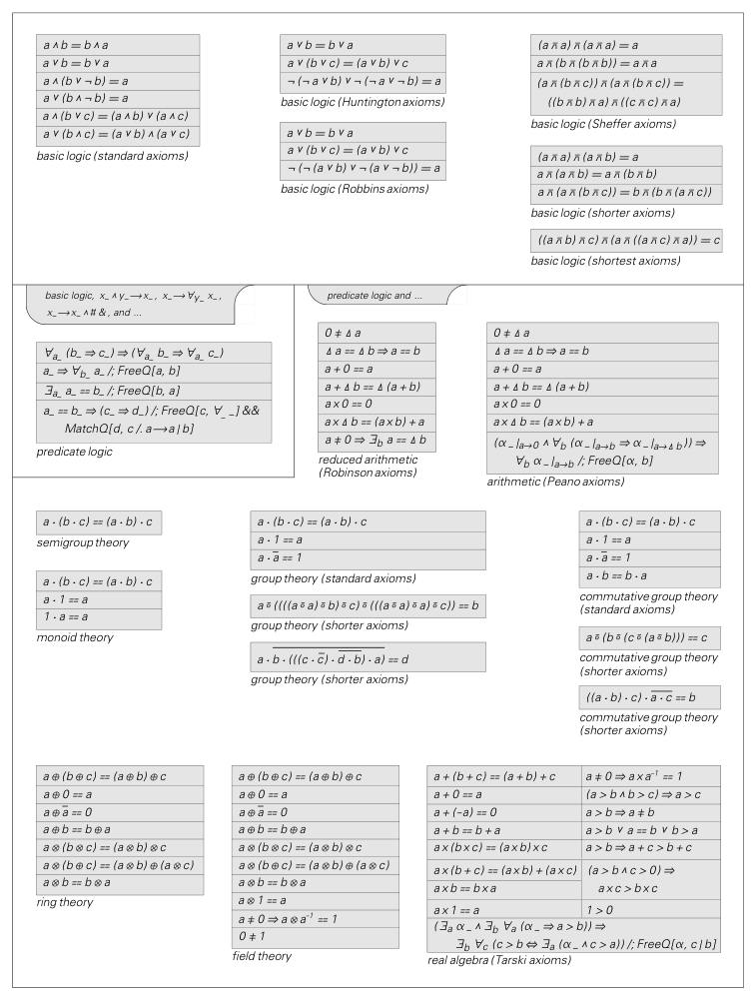
<!-- ORIGINAL_FIGURES page=0789 end -->

因此它们最终往往在计算精巧程度上等价，并且因此显示各种相似现象。

传统数学的公理系统。本页和下一页上的公理系统，是数学文献中数以百万计定理最终被推导出来的来源。注意，在若干情况下，这里给出的公理系统比标准数学教材中的形式短得多。（另见下一页的定义。）

[[PDF page 790]]

<!-- ORIGINAL_FIGURES page=0790 start -->
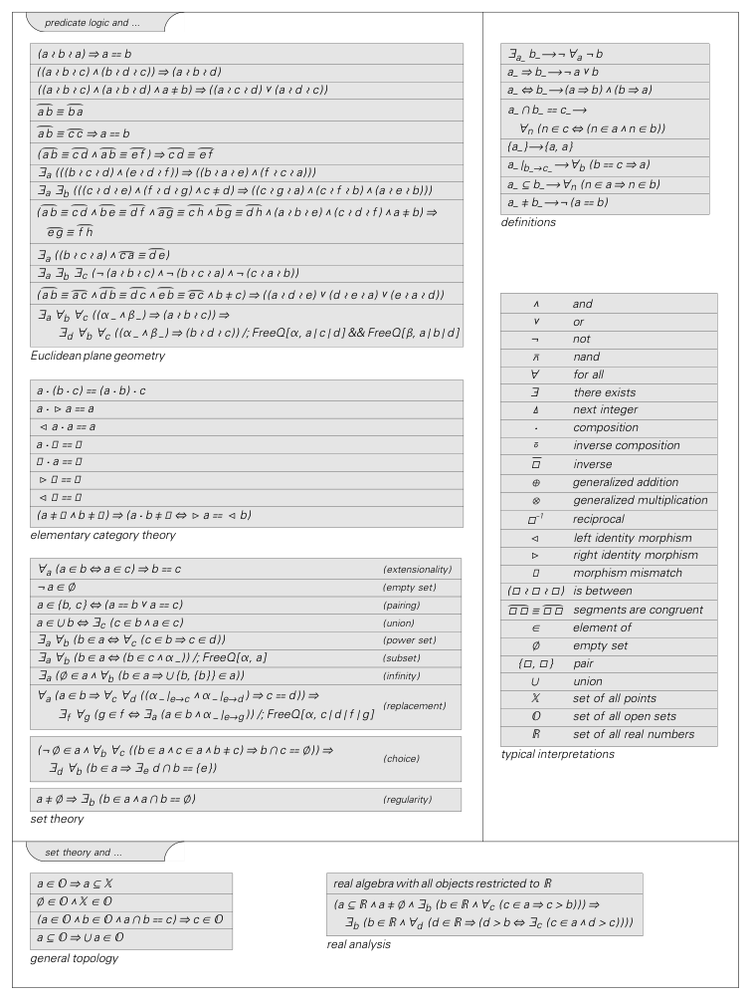
<!-- ORIGINAL_FIGURES page=0790 end -->

传统数学的进一步公理系统。典型解释与应用相关，尽管与定理的形式推导无关。集合论列出的最后两个公理通常被认为是可选的。

[[PDF page 791]]

<!-- ORIGINAL_FIGURES page=0791 start -->
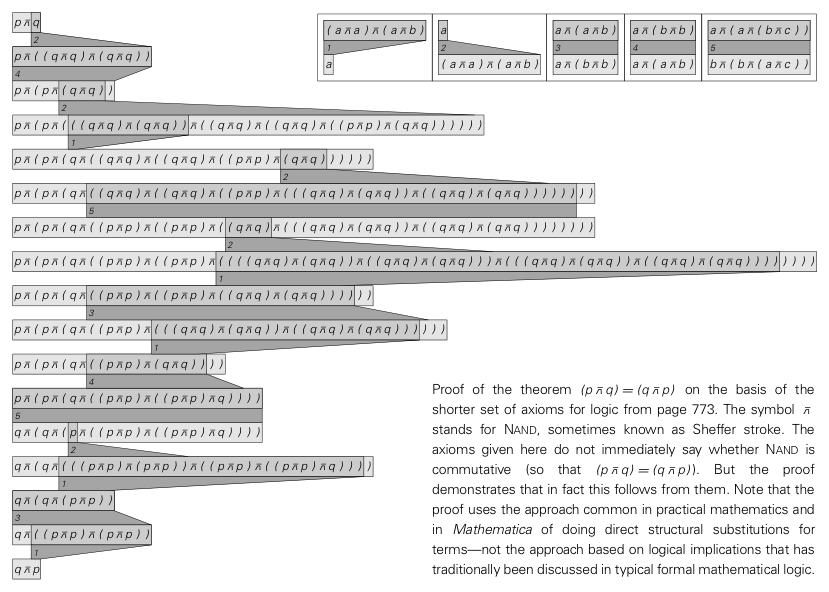
<!-- ORIGINAL_FIGURES page=0791 end -->

本节中我们将看到，虽然其中一些现象对应于数学的已知特征，例如哥德尔定理，但许多现象从未被成功识别出来。

不过，数学中究竟涉及哪些基本过程？

自古以来，数学几乎就把自己定义为关心寻找定理并给出它们的证明。在数学的任何特定分支中，一个证明由一系列步骤组成，最终基于前两页那样的公理。

下面的图像给出了基础逻辑中这是怎样工作的一个简单例子。右上方是指定逻辑表达式之间某些基本等价的公理。随后，通过按所示特定序列应用这些公理，形成逻辑表达式之间等价 `p | q = q | p` 的证明。

基于第 773 页较短逻辑公理集合，对定理 `(p NAND q) = (q NAND p)` 的证明。符号 `NAND` 有时称为 Sheffer 竖线。这里给出的公理并不直接说明 NAND 是否交换，也就是 `(p NAND q) = (q NAND p)` 是否成立。但证明显示，这事实上由它们推出。注意，这个证明使用实践数学和 Mathematica 中常见的方法，即对项进行直接结构替换，而不是典型形式数学逻辑中传统讨论的基于逻辑蕴含的方法。

[[PDF page 792]]

<!-- ORIGINAL_FIGURES page=0792 start -->
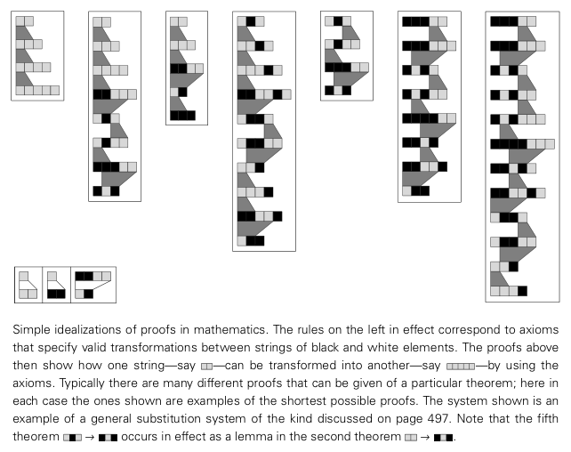
<!-- ORIGINAL_FIGURES page=0792 end -->

在大多数数学种类中，还有各种额外细节，特别是关于怎样确定在证明的每一步中，一个或多个先前表达式的哪些部分实际被使用。但就像我们研究自然界中的系统时那样，人们可以试图用一个简单理想化模型来捕捉可能发生事情的基本特征。

因此，例如人们可以想象把证明中的一步仅仅表示为由黑白方格这类简单元素组成的字符串。随后可以把一个系统的公理看作定义从这些元素的一个序列到另一个序列的可能变换，正如我们在第 5 章讨论的多路系统中的规则。

下面的图像显示，在这种设置下定理证明怎样工作。每个定理定义字符串之间的一条连接，而证明该定理就是寻找一系列变换，每个变换都与一条公理相关，把一个字符串导向另一个字符串。

数学证明的简单理想化。左侧规则实际上对应于公理，它们指定黑白元素字符串之间的有效变换。上方证明随后显示，怎样可以使用这些公理把一个字符串转变为另一个字符串。通常，一个特定定理可以给出许多不同证明；这里每种情况下显示的是最短可能证明的例子。所示系统是第 497 页讨论的那类一般替换系统的一个例子。注意，第五个定理实际上作为引理出现在第二个定理中。

不过，就像第 5 章中的多路系统一样，人们也可以考虑一个显式演化过程，其中从一个

[[PDF page 793]]

<!-- ORIGINAL_FIGURES page=0793 start -->
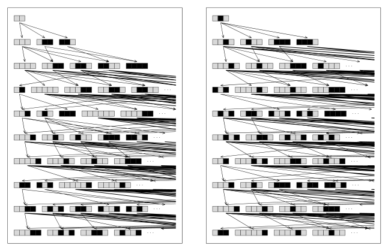
<!-- ORIGINAL_FIGURES page=0793 end -->

特定字符串开始，然后在每个连续步骤中应用所有可能变换，最终构建出字符串之间的整个连接网络，如下图所示。

应用与面对页相同的变换，但以所有可能方式应用的结果，对应于一个多路系统的演化，该系统表示所有可以从公理推导出的可能定理。使用这里的公理时，字符串总数每一步大约增长 1.7 倍；在所示最后几步中，分别总共有 237 和 973 个字符串。

从某种意义上说，这样的网络随后可以被认为表示由人们使用的任何公理集合所能推导出的整个数学领域，其中字符串之间的每条连接对应于一个定理，而每条可能路径对应于一个证明。

但像上面这样的网络真的能反映数学实际实践的样子吗？因为传统数学每个领域中的通常公理当然都比上面使用的任何多路系统规则复杂得多。

但就像本书中许多其他情况一样，似乎即使底层规则极其简单的系统，也已经能够捕捉数学的许多基本特征。

数学中的一个明显观察是，证明可能很难做。人们起初也许会假定，任何容易陈述的定理也会容易证明。

[[PDF page 794]]

<!-- ORIGINAL_FIGURES page=0794 start -->
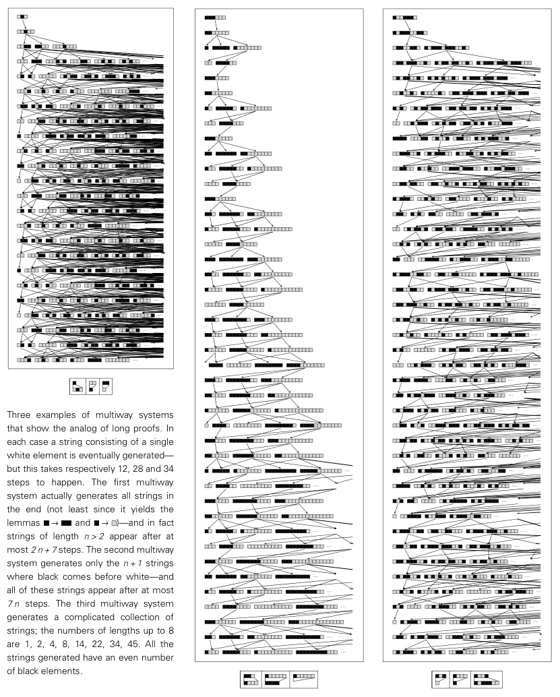
<!-- ORIGINAL_FIGURES page=0794 end -->

但经验提示，事实远非如此。事实上，有各种著名例子，如费马大定理和四色定理，其中一个容易陈述的定理似乎需要极长的证明。

三个多路系统例子，它们显示了长证明的类似物。每种情况下，一个由单个白色元素组成的字符串最终生成，但这分别需要 12、28 和 34 步才发生。第一个多路系统事实上最终生成所有字符串，尤其因为它产生了所示引理；长度 `n > 2` 的字符串在最多 `2 n + 7` 步后出现。第二个多路系统只生成黑色在白色之前的 `n + 1` 个字符串，而所有这些字符串在最多 `7 n` 步后出现。第三个多路系统生成复杂的字符串集合；长度不超过 8 的数量为 1、2、4、8、14、22、34、45。所有生成的字符串都有偶数个黑色元素。

[[PDF page 795]]

那么，多路系统中是否有这种类似现象？事实证明常常有，即一个字符串即使可能很短，仍可能需要许多步骤才能到达。

如果多路系统的规则总是增加字符串长度，那么任何最终会被生成的给定字符串，都不可避免地必须在有限步数后出现。但如果规则既能增加也能减少字符串长度，情况就很不同，如面对页图像所说明的。人们常常发现，即使短字符串也可能需要相当多步才能产生。

但这些步骤真的全都必要吗？还是只是所用规则以某种方式低效，而存在其他规则可以更快生成这些短字符串？

当然，人们可以取任何多路系统的规则，并添加能够立刻生成特定短字符串的变换。但关键点在于，像我在本书中讨论过的许多其他系统一样，有许多多路系统我怀疑是计算不可约的，因此没有办法绕过它们的演化，也没有一般方法快速生成它们的短字符串。

我相信，本质上同样的现象在几乎每个数学领域中运作。就像在多路系统中一样，人们总可以添加公理，使证明特定定理更容易。但我怀疑最终几乎总有计算不可约性，而这使短定理只允许长证明成为本质上不可避免的。

上一节中我们看到，计算不可约性往往使无限问题不可判定。因此，例如在多路系统演化中，某个特定字符串是否曾经会被生成，不管等多久，一般是不可判定的。类似地，对于具有特定公理的数学系统中的某个具体结果，是否存在任何证明，不管证明有多长，也可能是不可判定的。

[[PDF page 796]]

<!-- ORIGINAL_FIGURES page=0796 start -->
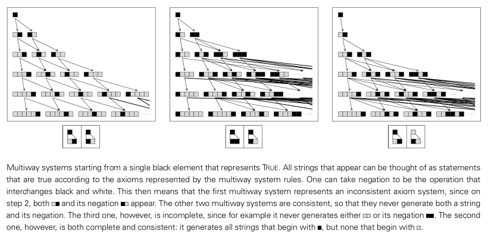
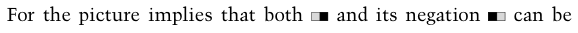
<!-- ORIGINAL_FIGURES page=0796 end -->

那么，这有什么含义？

也许最引人注目的含义出现在试图应用传统逻辑思想，特别是真和假的概念时。

按照我设置的方式，人们可以找到在某个特定公理系统中可被证明为真的所有陈述，只需从一个表示“真”的表达式开始，然后使用公理系统的规则，如面对页图像所示。

在多路系统中，人们可以想象把“真”识别为由单个黑色元素组成的字符串。这意味着，像下面这样的网络中出现的每个字符串，都应当对应于按所用多路系统规则表示的公理系统为真的陈述。

从表示 TRUE 的单个黑色元素开始的多路系统。出现的所有字符串都可以被认为是根据多路系统规则所表示公理为真的陈述。可以把否定看作交换黑白的操作。这随后意味着，第一个多路系统表示一个不一致的公理系统，因为在第 2 步，同时出现了某个字符串及其否定。另外两个多路系统是一致的，因此它们永远不会同时生成一个字符串及其否定。不过第三个是不完备的，因为例如它永远不会生成某个字符串，也不会生成其否定。第二个则既完备又一致：它生成所有以特定符号开始的字符串，但不生成任何以另一符号开始的字符串。

但这真的合理吗？在传统逻辑中，总有一种否定操作，它把任何真陈述变成假陈述，反之亦然。在多路系统中，否定可能工作的一种方式，就是直接反转字符串中元素的颜色。但这随后在上面的第一幅图中导致问题。

因为该图意味着，一个字符串及其否定都可以被证明为真陈述。但这不可能正确。

[[PDF page 797]]

<!-- ORIGINAL_FIGURES page=0797 start -->
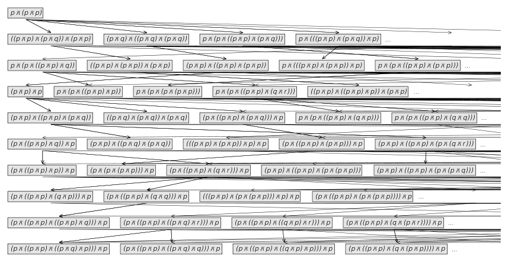
<!-- ORIGINAL_FIGURES page=0797 end -->

使用第 775 页逻辑公理系统可以被证明为真的陈述网络。`p NAND (p NAND p)` 是当逻辑用 NAND 运算符设置时 TRUE 的最简单表示。每个箭头表示通过应用单个公理建立的等价。在每一行上，只给出此前没有出现过的陈述。陈述经过排序，最简单的排在前面。注意，有些相当简单的陈述至少好几行后才出现。连续行上陈述总数增长快于指数；最前面几个为 1、6、91、2180、76138。如果永远继续下去，该网络最终会包含逻辑的所有可能真陈述（重言式）（另见第 818 页）。像第 808 页那些其他简单逻辑公理系统，会产生与这里所示类似的网络。

这意味着，在所使用的设置下，底层公理系统是不一致的。那么面对页上的其他多路系统又怎样？至少在图像中可以看到的字符串范围内，没有不一致。但更长字符串又怎样？对于所示特定规则，相当容易证明永远不会有不一致。但一般来说，做不到这一点，因为在某个给定字符串出现之后，例如该特定字符串的否定是否曾经出现，可能是不可判定的。

那么实际数学中通常使用的公理系统又怎样？第 773 和 774 页上的那些系统没有一个看起来是不一致的。这意味着，可以证明为真的陈述集合永远不会与可以证明为假的集合重叠。

但每个可能被期望为真或假的陈述，最终真的都能被证明为真或假吗？

[[PDF page 798]]

<!-- ORIGINAL_FIGURES page=0798 start -->
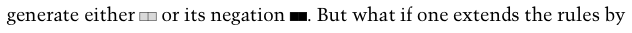
<!-- ORIGINAL_FIGURES page=0798 end -->

在 1900 年代早期，人们广泛相信，在所有合理的数学公理系统中，实际情况都会是这样。因为当时数学的力量似乎没有限制，可证明的定理也似乎没有尽头。

但这一切在 1931 年发生改变，当时哥德尔定理显示，至少在任何包含标准算术的有限指定公理系统中，必然存在一些陈述，使用该公理系统的规则既不能证明其为真，也不能证明其为假。

这对关于数学基础的既有思想是一个巨大冲击。事实上，直到今天，哥德尔定理仍然被广泛认为是一个令人惊讶且相当神秘的结果。

但本书中的发现终于开始使它显得不可避免，事实上几乎显而易见。因为事实证明，在某个层面上，它可以被看作非常一般的计算等价原理的又一个后果。

那么，哥德尔定理在多路系统中的类似物是什么？给定第 780 页上的设置，人们可以询问某个特定多路系统是否完备，也就是说，对于每个可能字符串，该系统最终是否生成该字符串或其否定。

人们可以看到，第三个多路系统事实上是不完备的，因为按照它的规则，例如永远不能生成某个字符串，也不能生成其否定。但如果通过添加更多变换，也就是对应于更多公理，来扩展规则呢？最终是否总能使系统完备？

如果不够小心，就会生成太多字符串，并不可避免地得到不一致，也就是一个字符串及其否定同时出现，如面对页第二幅图中那样。但至少如果只需要担心有限步数，总可以把事情设置成，得到一个既完备又一致的系统，如面对页第三幅图所示。

事实上，在面对页所示的特定情形中，找到让系统始终完备且一致的规则相当直接。但知道怎样做到这一点，需要行为在某种意义上足够简单，使人能够预见其每个方面。

[[PDF page 799]]

<!-- ORIGINAL_FIGURES page=0799 start -->
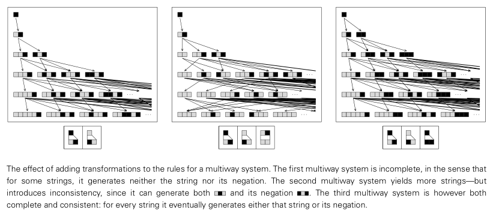
<!-- ORIGINAL_FIGURES page=0799 end -->

向多路系统规则中添加变换的效果。第一个多路系统是不完备的，也就是说，对于某些字符串，它既不生成该字符串，也不生成其否定。第二个多路系统产生更多字符串，但引入了不一致，因为它可以生成一个字符串及其否定。第三个多路系统则既完备又一致：对于每个字符串，它最终生成该字符串或其否定。

然而，如果一个系统是计算不可约的，这将不可避免地不可能。因为在任何一点上，系统实际上总能做更多人们没有预期到的事情。这意味着，一般来说，人们不能构造一个有限公理集合，并保证它会导致最终的完备性和一致性。

事实上，事实证明，只要某个特定字符串是否曾经可达的问题是不可判定的，就立刻推出必定存在不完备性或不一致性。因为说这样一个问题不可判定，就是说一般不能由任何保证会完成的过程回答它。

但如果有一个完备且一致的系统，那么很容易提出这样的过程：只需运行该系统，直到到达正在寻找的字符串，或者到达它的否定。因为系统的完备性保证必定总能到达两者之一，而一致性则意味着，到达其中一个就允许人得出结论：另一个永远不会到达。

所以结果是，如果多路系统的演化是计算不可约的，使关于其最终行为的问题不可判定，那么该系统不可能既完备又一致。如果假定一致性，那么随之可知，必定存在一些字符串，在其中既无法到达该字符串，也无法到达其否定。

[[PDF page 800]]

这对应于这样一个事实：必定存在一些陈述，它们不能从给定公理集合中被证明为真或假。

但要确立这种不完备性实际上会出现在某个具体系统中，需要什么？

基本方法是证明该系统是通用的。

但对于公理系统这样的东西，通用性究竟意味着什么？实际上，它意味着任何关于其他任意通用系统行为的问题，都可以编码成该公理系统中的一个陈述；而如果这个问题的答案可以通过观察另一个通用系统演化任意有限步数而确立，那么它也必须能够通过在该公理系统中给出一个有限长度的证明来确立。

那么，数学中的哪些公理系统是通用的？

基础逻辑不是通用的，因为至少原则上，人们总能通过一个有限过程来判定该系统中任何陈述的真值，尽管这个过程也许会长到指数级：尝试其中出现的变量的所有可能真值组合。

而纯谓词逻辑本质上也属于同样情况；在其中，人们只是形式化地添加“对于所有”和“存在”这样的构造。但只要同时放入一个带有一个以上参数的抽象函数或关系，就会得到通用性。

事实上，哥德尔定理的基础正是这样一个结果：基本整数算术的标准公理支持通用性。

集合论以及另外若干标准公理系统，可以很容易地重现算术，因此它们也是通用的。群论以及环论等其他代数系统同样如此。

如果对所用公理施加足够多限制，最终可以阻止通用性；事实上，交换群论，以及第 773 和 774 页上实代数与几何的简化版本，都会出现这种情况。

但在当代数学研究中实际使用的公理系统里，现在已知每一个都是通用的。

从第 773 页可以看到，这些公理系统中有许多都能以相当简单的方式表述。过去，人们也许会觉得难以相信，如此简单的系统竟然可能是通用的，并因而在某种意义上能够模拟几乎任何系统。

[[PDF page 801]]

但从本书中的发现来看，这一点现在几乎显得不可避免。事实上，计算等价原理意味着，一旦越过某个很低的门槛，几乎任何公理系统都应当被预期是通用的。

那么在算术的情形中，通用性实际上怎样起作用？

下一页的图示说明了一种方法。其思路是设置一个算术陈述：如果一个元胞自动机从给定初始条件出发演化后，在给定步数的给定元胞上出现给定颜色，那么这个算术陈述就能被证明为真；如果没有出现，它就能被证明为假。

通过改变这个算术陈述中的数字，人们实际上就可以采样元胞自动机演化的不同方面。而当这个元胞自动机是像规则 110 这样的通用元胞自动机时，这就意味着算术公理可以支持通用性。

这种通用性随后推出哥德尔定理，并表明必定存在一些关于算术的陈述，永远不能从算术的通常公理中被证明为真或假。

那么，这类陈述有哪些例子？

哥德尔定理的原始证明基于考虑一个特殊的自指陈述：“这个陈述不可证明”。

起初看起来并不明显，这样一个陈述怎么可能被设置成算术中的陈述。但如果它可以做到，那么立刻就能看到，正如这个陈述本身所说，它不能被证明；因为否则就会出现不一致。

事实上，哥德尔定理原始证明中的主要技术困难，正是在于通过一种实际上等同于确立算术通用性的做法，来表明这个陈述确实能够有意义地被编码为一个纯粹算术陈述。

但至少在原始证明所用的编码下，如果把这个陈述用第 773 页那样的记号完整写出，它会长到天文规模。于是从这个结果出发，人们也许会想象，不可证明性永远不会在数学中的任何实际情形里真正相关。

但一个陈述真的必须如此复杂，才会无法从算术公理中证明吗？

[[PDF page 802]]

<!-- ORIGINAL_FIGURES page=0802 start -->
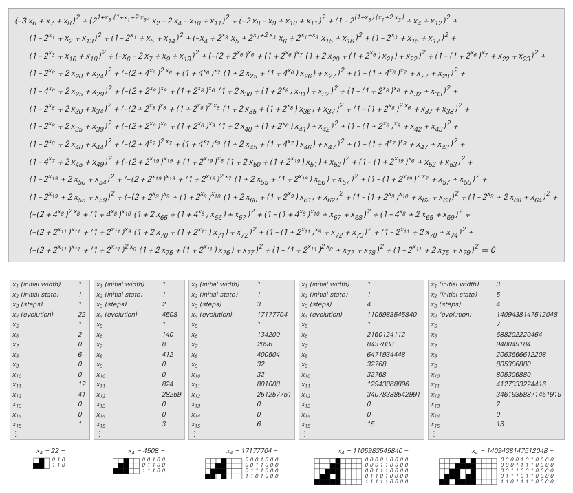
<!-- ORIGINAL_FIGURES page=0802 end -->

算术中的通用性，可以用一个整数方程来说明；这个方程的解实际上模拟了第 11 章中的规则 110 通用元胞自动机。该方程有许多解，但所有这些解都满足这样一个约束：变量 `x1` 到 `x4` 必须编码规则 110 可能的初始条件和演化历史。如果为 `x1`、`x2` 和 `x3` 填入固定值，那么 `x4` 只可能有一个值；它对应于规则 110 从宽度为 `x1`、由 `x2` 的数字序列给出的初始条件出发，演化 `x3` 步后的演化历史。一般来说，关于规则 110 可能行为的任何陈述，都可以编码为关于该方程解的算术陈述。因此，例如如果填入 `x1`、`x2` 和 `x4` 的值，但不填入 `x3`，那么“该方程对任何 `x3` 都没有解”这一陈述，就对应于规则 110 即使经过任意步数也永远不能表现出某种行为的陈述。但规则 110 的通用性意味着，这类陈述一般必定是不可判定的。于是由此推出，至少在某些实例中，算术公理永远不能被用来给出关于该陈述是否为真的有限证明。这里显示的构造可以被看作提供了哥德尔定理的一个简单证明，也就是证明算术中存在不可证明的陈述。注意，图中方程是所谓指数丢番图方程，其中某些变量出现在指数中。付出大幅增加复杂度的代价，例如使用 2154 个变量，就可以避免指数。不过，上面的方程已经可以被看作抓住了证明丢番图方程一般不可解性以及希尔伯特第十问题所需的核心内容。

[[PDF page 803]]

在过去七十年里，人们构造出了一些更简单的例子，其中大多数并没有明显的自指特征。

但通常这些例子涉及相当复杂而晦涩的数学构造，最常见的是某种被设置为增长极快的函数。然而至少原则上，应当存在一些只基于“某些特定整数方程不存在解”这类陈述而构造出来的例子。

如果一个整数方程，例如 `x^2 = y^3 + 12`，有某个由特定有限整数给出的明确解，例如 `x = 47`、`y = 13`，那么这个事实当然可以用算术公理证明。因为检验这个解只需要有限计算，而这个计算本身实际上总可以被看作一个证明。

但如果方程没有解呢？要显式检验这一点，就必须考察无穷多个可能的整数。但关键在于，即便如此，仍然有可能存在一个有限的数学证明，表明这些整数中没有任何一个可行。

有时这个证明可能很直接，例如基于证明方程一边总是奇数而另一边总是偶数。在其他情况下，证明可能更困难，例如基于确立解的某个很大的最大尺寸，然后检查直到该尺寸为止的所有整数。

关键在于，一般来说，事实上可能绝对不存在一个能用通常算术公理给出的证明。

怎样看出这一点？

面对页的图显示，人们可以构造一个整数方程，其解表示像元胞自动机这样的系统的行为。这一做法的工作方式是，例如方程中的一个变量给出演化步数，而另一个变量给出该步数之后的结果。

于是，在这种设置下，人们可以指定步数，然后求解该步数之后的结果。但如果反过来，例如指定一个结果，然后试图求解该结果出现时的步数，会怎样？

如果一般来说人们能够判断这样的解是否存在，那就意味着人们总能回答这样的问题：例如，在给定元胞自动机的演化中，某个特定模式是否最终会消失。

[[PDF page 804]]

但从上一节的讨论中我们知道，这在一般情况下是不可判定的。

因此可知，某个具有特定一般形式的整数方程是否有解，必定是不可判定的。而从上面的论证进一步推出，必定存在一些具体整数方程，它们没有解，但这一事实无法从通常的算术公理中证明出来。

那么，这到底怎样发生？

在某个层面上，这是涉及无穷所造成的结果。因为至少在像算术这样的通用系统中，任何完全有限的问题最终总能由某个有限过程回答。

但那些以某种方式询问例如无穷多个可能整数的问题呢？首先建立典型数学公理系统的主要理由，往往最终正是为了能以有限方式处理这类问题。

关键在于，公理系统不直接处理整数这样的对象，而是可以只给出用于操作关于它们的陈述的抽象规则。而在这样的陈述中，人们可以例如仅用一个像 `S` 这样的符号来指称无穷整数集。

特别是在过去一个世纪里，数学中有许多成功都可以归因于这种基本方法。但从哥德尔定理推出的显著事实是，无论人们怎样做，总会有一些情形使这种方法最终必然失败。事实证明，其原因本质上就是计算不可约性现象。

因为简单的无穷量，例如 `1/0` 或整数总数，往往可以很容易地以有限方式概括，通常只需使用像无穷大或 `aleph_0` 这样的符号；但并非所有无穷过程一般都如此。特别是，如果一个无穷过程是计算不可约的，那么一般就不可能存在关于它所做事情的任何有用有限概括，因为这种概括一旦存在，就意味着计算可约性。

[[PDF page 805]]

因此，这至少意味着，必然会有一些问题，是基于在普通计算系统中运行的公理而给出的有限证明一般永远无法回答的。

而对于整数方程来说，一旦有一个通用的一般方程，通常就会推出：会存在一些具体实例，其中不存在解，或者至少不存在某种特定类型的解，而这一点永远不能根据通常的算术公理证明。

几十年来，人们已经知道通用整数方程是存在的。但实际构造出来的例子相当复杂，例如第 786 页上的那个；其中最简单的也涉及 9 个变量和数量巨大的项。

然而，从本书中的发现来看，我相当确信存在远为简单的例子；也就是说，归根到底存在相当简单的整数方程，其无解性永远无法从通常算术公理中证明。

如果人们只是开始考察整数方程序列，如下一页所示，那么在最简单的情形中，通常相当容易判断某个特定方程是否会有解。但这件事会迅速变得困难得多。因为哪些方程最终有解、哪些没有，常常没有明显模式。而即便方程确实有解，所涉及的整数也可能相当大。因此，例如 `x^2 = 61 y^2 + 1` 的最小解是 `x = 1766319049`、`y = 226153980`；而 `x^3 + y^3 = z^3 + 2` 的最小解是 `x = 1214928`、`y = 3480205`、`z = 3528875`。

像 `a x + b y + c z = d` 这样每个变量只以线性方式出现的整数方程，早在古代就已大体被理解。像 `x^2 = a y^2 + b` 这样的二变量二次方程，到 1800 年代已经被理解。但即使是像 `x^2 = a y^3 + b` 这样的方程，直到 1980 年代才得到恰当理解。而对于含有更高次幂或更多变量的方程，关于解是否存在的问题很快就会变成数论中尚未解决的问题。

几个世纪以来，人们当然已经知道，关于整数方程和数论其他方面，有些问题容易陈述，却似乎极难回答。但在实践中，人们几乎普遍假定，随着数学的持续发展，这些问题最终都能得到回答。

[[PDF page 806]]

<!-- ORIGINAL_FIGURES page=0806 start -->
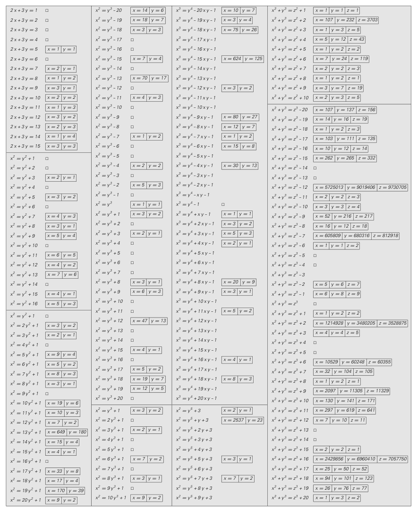
<!-- ORIGINAL_FIGURES page=0806 end -->

若干整数方程序列的最小解表。表中条目列出不同整数方程以及对应的最小整数解；图注与说明见下一页。

[[PDF page 807]]

然而，哥德尔定理显示，总会存在某些问题，永远不能使用通常的算术公理来回答。可是由于少数已知的显式例子极其复杂，这使得这种现象看起来似乎从根本上与数学实际实践无关。

但从本书中的发现来看，现在似乎可以相当确定，远为简单的例子也存在。而且我强烈怀疑，在当前数论中受到认真研究的所有未解问题里，最终会有相当一部分被证明是永远不能使用通常算术公理回答的问题。

如果考察近来的数论工作，会发现其中大多数往往基于相当复杂的方法，而这些方法并不明显只依赖通常的算术公理。例如，人们已经发展出来的费马大定理的复杂证明，至少可能使用了一些来自集合论等领域、超出通常算术公理的公理。

但只要人们仍停留在第 773 和 774 页上的那些标准数学公理系统之内，并且实际上没有把自己试图证明的结果隐含地添加为公理，我强烈怀疑，人们最终永远不能比仅用通常算术公理走得远多少。

事实上，根据计算等价原理，我强烈相信，一般来说，在数学的几乎任何领域中，只要越过那些总是容易回答的问题层级，不可判定性和不可证明性几乎立刻就会开始出现。

但如果是这样，那么数学为什么还能发展到今天这样的程度？当然，数学中有一些问题长期没有解决。我怀疑其中许多最终确实会涉及不可判定性和不可证明性。但问题仍然是，为什么这些现象在日常数学工作中没有明显得多。

各种整数（也称丢番图）方程序列的最小解。符号表示可以证明没有解。空白表示我只知道在十亿以下没有解。第一列中某些方程的求解方法在古代就已经知道；到 1800 年代，第一列中的所有方程都已被解决。用于求解第二列所谓椭圆曲线方程的实用方法直到 1980 年代才发展出来。对于给出的其他大多数方程，目前仍没有一般方法；其中某些类别事实上可能表现出不可判定性。

[[PDF page 808]]

在某个层面上，我怀疑原因相当直接：像大多数人类探究领域一样，数学倾向于把自身界定为只关心那些其方法能够成功处理的问题。而由于数学中传统使用的主要方法围绕证明展开，涉及不可判定性和不可证明性的问题便不可避免地被回避了。

但这真的说得通吗？至少在过去一个世纪里，数学一直给人一种印象：它关心的是某种尽可能任意而一般的问题。

但我在本书中所做工作的一个重要结论是，这种印象远非正确。事实上，例如传统数学在很大程度上甚至从未考虑过本书中讨论的大多数系统，尽管它们基于一些可能最简单的规则。

这是怎样发生的？我认为要点在于，无论在所研究的系统上，还是在所提出的问题上，数学都远比通常意识到的更是其历史的产物。

事实上，尤其是与我在本书中所做的事情相比，今天所实践的绝大多数数学似乎仍然惊人地紧密沿袭着早在巴比伦时代就已经存在的算术和几何传统。

认为数学甚至应当试图处理任意系统或一般系统，是一个相当晚近的观念。因为直到一百多年以前不久，数学基本上仍把自身看作只是在为日常经验的某些方面提供精确表述，主要是与数和空间相关的那些方面。

但在 1800 年代，随着非欧几何、四元数、群论和超穷数等发展，人们开始假定，数学这一学科可以成功应用于任何抽象系统，不管它多么任意或一般。

然而，如果考察数学实际研究的系统类型，它们即使到今天也远没有达到尽可能一般的程度。事实上，在某个层面上，其中大多数都可以被看作是通过一种相当特定的方法得到的：从某个已知的定理集合出发，然后试图寻找越来越一般、却仍然能够满足这些定理的系统。

[[PDF page 809]]

而在这种方法下，被认为有趣的问题往往围绕着该系统原本被设置来满足的那些定理展开；这使得这些问题本身相当可能能够由类似定理处理，而不会与不可判定性或不可证明性发生正面遭遇。

但如果人们考察其他类型的系统呢？

我在本书中所做的一项主要工作，从某种意义上说，是引入了一种新的泛化方法：考虑那些具有简单但完全任意规则的系统，而这些规则并不是为了满足某些定理而受约束地设置出来的。

但如果有这样一个系统，人们怎样决定哪些问题值得提出？在没有已知定理引导的情况下，显然要做的事情就是直接观察该系统怎样行动，也许通过画出某种图像。

而如果这样做，我发现人们通常会立刻被引向涉及不可判定性等现象的问题。事实上，从我的实验来看，几乎只要一离开数学传统的限制，不可判定性和不可证明性就会变得相当常见。

如下一页的图所示，建立一个处理关于元胞自动机之逻辑陈述的公理系统，是相当直接的。在这样的公理系统中，人们可以提出一些问题，例如元胞自动机在任意步数之后是否曾经会以某种特定方式行动。

但正如我们在上一节所见，这类问题一般是不可判定的。这意味着，在这些问题中，不可避免地会存在一些情形，使得无论使用什么公理系统，都永远无法给出某个特定答案的证明。

由此，人们也许会得出结论：只要一考察元胞自动机，或其他通常不在数学中研究的系统，使用传统数学方法取得进展实际上立刻就会变得不可能。

[[PDF page 810]]

<!-- ORIGINAL_FIGURES page=0810 start -->
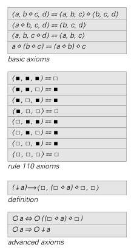
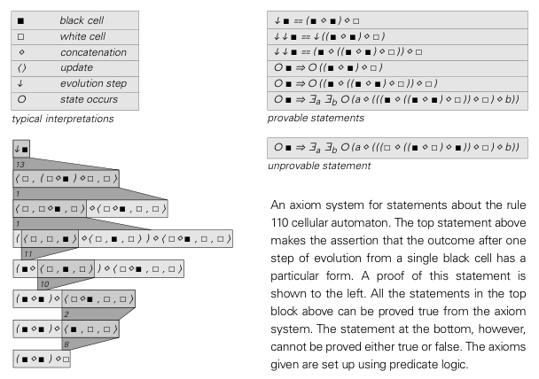
<!-- ORIGINAL_FIGURES page=0810 end -->

一个用于关于规则 110 元胞自动机之陈述的公理系统。上方最顶端的陈述断言：从单个黑色元胞出发，演化一步后的结果具有某种特定形式。左侧显示了这一陈述的一个证明。上方区块中的所有陈述都可以由该公理系统证明为真。然而底部的陈述既不能被证明为真，也不能被证明为假。给出的公理使用谓词逻辑来设置。

但事实上，自从我最初强调元胞自动机的重要性以来，大约十五年间，关于它们已经完成了各种传统数学工作。那么，这怎么可能？

基本要点是，这些工作倾向于集中在元胞自动机的某些特定方面，而这些方面足够简单，可以避开不可判定性和不可证明性。通常它以两种方式之一做到这一点：要么只考虑那些已经被观察到或构造为简单的非常具体的情形，要么从极高的一般性层面考察事物，以至于只有相当简单的性质能够保留下来。

例如，根据我的经验，当数学家面对第 55 页上显示的 256 种初等元胞自动机模式时，常见反应有两种：要么挑出一些具有简单重复形式或嵌套形式的特定模式，要么进行泛化，不考察单个模式，而考察例如从所有可能初始条件演化得到的总体性质。

而对于涉及某个在我们看来复杂的模式之结构的问题，几乎普遍的反应是，这类问题不可能真正具有数学兴趣。

不必说，在本书这种新科学的框架中，这类问题现在具有极大兴趣。我的结果表明，如果人们终究要研究自然界中出现的许多重要现象，就也不可避免地会遇到它们。

[[PDF page 811]]

但对传统数学来说，它们显得无趣而且相当陌生。

正如我上面所说，在某个层面上，如果一个领域的方法能够对某些问题说出有用的东西，那么这些问题才会在该领域中被认为有趣，这并不令人惊讶。但我相信，这最终就是为什么历史上数学中很少出现不可判定性或不可证明性迹象的原因。因为任何出现这类现象的问题，通常都不适合数学中基于证明的标准方法；结果，这些问题不可避免地被看作不属于数学应当认为有趣的范围。

那么，怎样才能为实际实践中的数学建立一个合理的理想化模型？第一步，正如我在本节前面讨论过的那样，是不要太多考虑那些可能由数学描述的系统，而要考虑与证明相关、发生在数学内部的内在过程。

一个证明最终必须基于一个公理系统。人们也许会想象，随着时间推移，数学已经采样了范围广泛的可能公理系统。但实际上，在历史发展中，数学通常只坚持使用相当少的这类系统；每一个基本上对应于某个可识别的数学领域，其中大多数列在第 773 和 774 页。

那么，如果人们考察所有可能的简单公理系统，会发生什么？这很像我们在本书前面考察所有可能的简单元胞自动机。我们看到的东西在多大程度上捕捉了数学的特征？把公理系统理想化为多路系统后，下一页的图显示了一些结果。

在某些情形中，能够被证明的定理总数是有限的。但定理数量常常会随着证明长度迅速增加；在大多数情形中，最终可以证明无穷多个定理。根据数学经验，在这样的情形下，一个显然要问的问题是：系统在多大程度上一致、完备，或者两者兼具？

[[PDF page 812]]

<!-- ORIGINAL_FIGURES page=0812 start -->
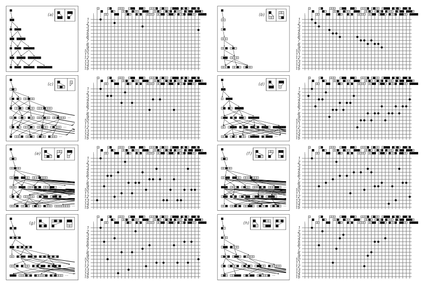
<!-- ORIGINAL_FIGURES page=0812 end -->

这些图显示了在各种多路系统演化的前 15 步中，哪些可能字符串被生成。每个被生成的字符串都可以被看作一个定理，它由该多路系统规则所表示的公理集合推出。一个点表示某个给定字符串首次出现在哪一步，并指示该字符串所代表定理的最短证明。在大多数情形中，许多字符串永远不会产生；这意味着许多可能陈述根本不会从给定公理推出。因此，例如在第一个例子中，只有完全由黑色元素组成的字符串会被产生。

但要以有意义的方式表述这样的问题，人们需要一个否定概念。一般来说，否定只是某种操作，它接受一个字符串并产生另一个字符串；如果第二次应用，就返回原来的字符串。本节前面我们讨论过一些情形，其中否定只是反转字符串中每个元素的颜色。作为对此的泛化，人们可以考虑否定是任意保持字符串长度的操作。

在这种情况下，事实证明，判断一个系统是否完备且一致的准则很简单：如果从表示“真”的字符串出发，那么给定长度的所有可能字符串中，最终必须恰好有一半被生成。

[[PDF page 813]]

因为如果生成的字符串超过一半，那么某处必定会同时出现一个字符串及其否定，这意味着系统必定不一致。类似地，如果生成的字符串少于一半，那么必定存在某个字符串，使得该字符串及其否定都永远不出现，这意味着系统不完备。

下一页的图显示了在各种多路系统中，给定长度字符串的多少比例会在连续步骤中被生成。一般来说，人们也许必须等待任意多步，才能知道某个给定字符串是否终会生成。但在实践中，只经过几步以后，人们似乎已经能得到关于最终会生成的字符串总体比例的合理指示。

所看到的是一个很宽的分布：从只能生成极少字符串的情形，对应于非常不完备的公理系统；到能够生成全部或几乎全部字符串的情形，对应于非常不一致的公理系统。

那么，在这个分布中，普通数学的典型公理系统位于哪里？想必没有一个是不一致的。而少数系统，例如基础逻辑和实代数，既完备又一致，因此实际上正好处在分布中间。但大多数系统已知是不完备的。正如上面讨论过的，只要存在通用性，这就是不可避免的。

但它们究竟有多不完备？答案似乎是：通常不太严重。因为如果考察数学中广泛使用的公理系统，它们几乎全都足够完备，至少能够把相当一部分陈述证明为真或假。

为什么会这样？我怀疑，这与数学中人们通常想要这样的公理系统有关：它们应当能被看作以某种方式描述了明确类型的对象，而人们随后期待能够建立关于这些对象的各种明确陈述。

当然，如果考察数学史，大多数基本公理系统都是通过以下方式得到的：从一些对象，例如有限整数或有限集合出发，然后试图寻找若干公理集合，以某种方式捕捉这些对象的相关性质。

[[PDF page 814]]

<!-- ORIGINAL_FIGURES page=0814 start -->
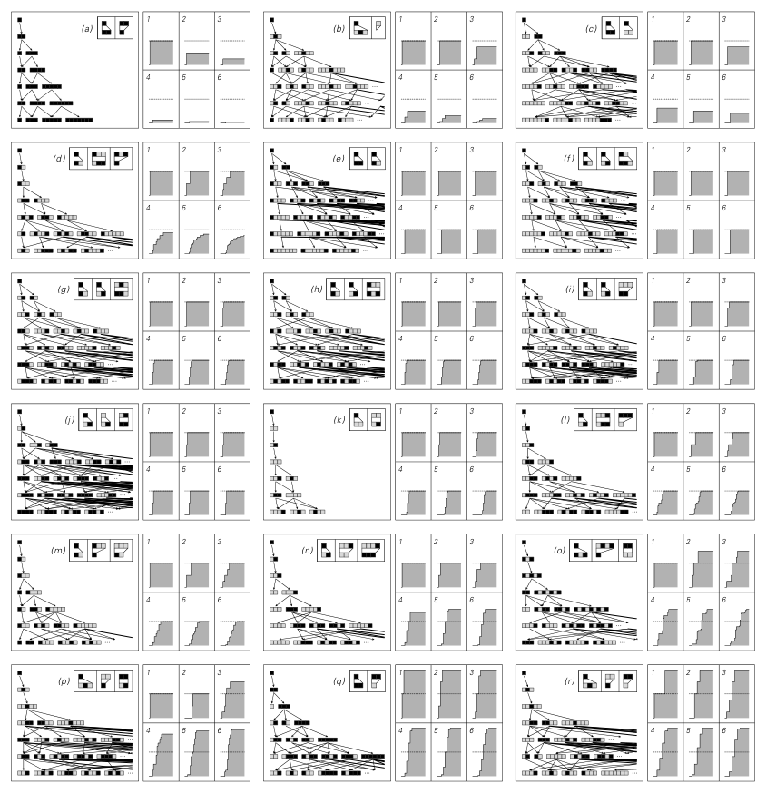
<!-- ORIGINAL_FIGURES page=0814 end -->

生成不同比例可能字符串的多路系统例子；从效果上看，它们的范围从高度不完备到高度不一致。图中显示了在每个多路系统演化的前 25 步中，给定长度字符串有多大比例已经被产生。如果某个给定长度的字符串中，最终产生的少于一半，这意味着必定有一些字符串及其否定都无法被证明，显示出不完备性。但如果产生的超过一半，就必定存在一些情形，其中一个字符串及其否定都能被证明，显示出不一致性。不过规则 (f) 到 (i) 恰好产生任意给定长度字符串的一半，因此可以被认为既完备又一致。

[[PDF page 815]]

但有一个特征是，通常所得公理系统在某种意义上比起始对象更一般。这就是为什么例如人们常常可以用该公理系统外推到无穷情形。但这也意味着，并不清楚该公理系统实际上是否只描述了人们想要的对象，或者例如它是否也描述了各种其他相当不同的对象。

人们可以把一个公理系统，例如第 773 和 774 页列出的某个系统，看作给出了一组约束，任何它所描述的对象都必须满足这些约束。但正如我们在第 5 章看到的，常常可以用若干相当不同的方式来满足同一组约束。

当这种情况发生在一个公理系统中时，它通常表明不完备性。因为只要有两个对象都满足约束，而对于某个陈述，其中一个对象上为真、另一个对象上为假，就立刻推出至少这个陈述不能一致地被证明为真或假，因此该公理系统必定是不完备的。

人们也许会想象，如果向一个公理系统添加更多公理，最终总能迫使只有一种对象会满足该系统的约束。但正如我们前面看到的，只要存在通用性，通常就不可能避免不完备性。而如果一个公理系统是不完备的，就必然存在不同类型的对象满足它的约束。因为对于任何不能由公理证明的陈述，必定存在某些不同对象，使该陈述在其中为真或为假。

如果一个公理系统距离完备很远，也就是说有很大一部分陈述不能被证明为真或假，那么通常会有许多不同类型的对象，它们易于指定并且都满足该系统的约束，但具有相当明显的不同性质。可是如果一个公理系统接近完备，也就是说绝大多数陈述都能被证明为真或假，那么满足其约束的不同类型对象几乎不可避免地只会以晦涩方式相互不同。

这想必正是第 773 页中标准算术公理系统的情形。最初，这个公理系统旨在只描述普通整数。但哥德尔定理显示它是不完备的，因此必定有不止一种对象能够满足其约束。

[[PDF page 816]]

然而，它相当接近完备；正如我们前面看到的，人们必须至少经过数百万个陈述，才会找到它不能证明为真或假的陈述。

这意味着，尽管除了普通整数之外，还有其他对象满足算术的标准公理，但它们相当晦涩；事实上晦涩到这样的程度：还没有任何一个被真正以相当明确的方式构造出来。这就是为什么人们一直可以合理地把算术的标准公理系统看作基本上就是关于普通整数的。

但如果不用这个标准公理系统，而使用第 773 页上的缩减公理系统，也就是通常的归纳公理被削弱的那个系统，那么情况就大不相同。这里同样存在不完备性，但现在它严重得多，因为即使像 `x + y = y + x` 和 `x + 0 = x` 这样简单的陈述，也不能由公理证明为真或假。虽然普通整数仍满足所有约束，但该系统已经不完备到足以让各种具有相当不同性质的其他对象也满足这些约束。因此，这意味着该系统在某种意义上不再关于任何非常明确类型的数学对象；想必这就是为什么它在数学实践中并不被使用。

在这里或许应当提到，数学中相当多著名公理系统，如果按其原始形式来看，实际上也远非完备。第 773 页给出的群论公理系统就是一个例子。但关键在于，这个公理系统在某种意义上只代表群论的开端。因为它只产生那些对任何群都抽象成立的定理。

然而，在实践中做群论时，人们通常会添加公理，使自己实际上被限制在处理例如某个特定群，而不是所有可能群。这样一来，通常又会得到一个至少接近完备的公理系统。

在基础算术中，以及通常在群论等领域中，人们设想所描述的底层对象，在某个层面上可以用相当具体的方式操作并理解。但在集合论这样的领域中，这一点就不那么成立。即便如此，历史上仍然有人试图得到一个以某种方式描述明确对象类型的公理系统。只是现在，做到这一点的主要方式，是逐步添加公理，以便更接近一个完备系统；至于人们真正期望描述的底层对象究竟是什么，则只有相当模糊的观念。

[[PDF page 817]]

在研究证明的基本过程时，多路系统似乎很适合作为最小理想化。但如果人们想研究那些可能描述明确对象的公理系统，使用我所谓的运算符系统似乎稍微更方便。事实上，第 775 页所用的逻辑版本，以及第 773 和 774 页上的许多公理系统，本质上已经就是按运算符系统设置的。

运算符系统的基本思想，是处理一些表达式，例如由某个运算符构造出的 `p * q` 或更复杂的嵌套表达式，然后考察这些表达式之间可能存在什么等价关系。如果某个运算符的值由某个有限表给出，那么判断表达式是否等价总是很直接。因为人们只需像下一页顶部的图中那样，对每个变量的所有可能取值求出表达式的值，然后看所得结果模式是否相同。

用这种方式，人们可以很容易地判断，例如所示第一个运算符是幂等的，因此 `p * p = p`；而前两个运算符都是结合的，因此 `(p * q) * r = p * (q * r)`；除第三个以外的所有运算符都是交换的，因此 `p * q = q * p`。原则上，人们可以用这种方法确立任何特定形式运算符下任意表达式之间存在的任何等价关系。

但传统数学证明方法背后的关键思想是：人们也应当能够仅通过以纯符号形式操作表达式，并使用公理系统规则，来推出这些结果，而不必做任何类似填入变量显式取值的事情。

这种方法的一个优点是，至少原则上，它允许人们处理那些并不基于有限表的运算符，例如许多数学领域中出现的运算符。但即便对于由有限表给出的运算符，要找到能够成功重现某个特定运算符所有结果的公理系统，往往也很困难。

[[PDF page 818]]

<!-- ORIGINAL_FIGURES page=0818 start -->
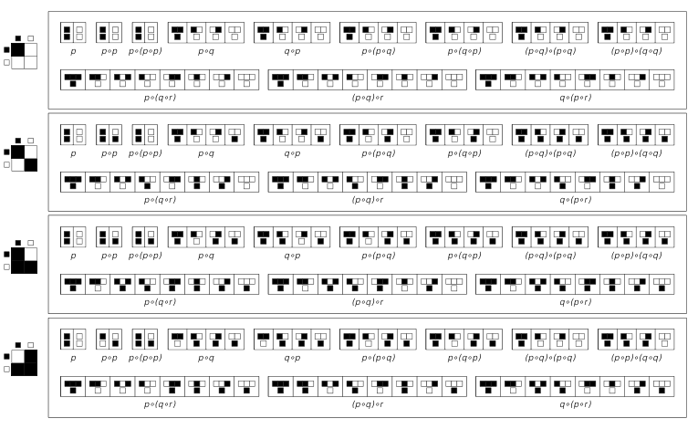
<!-- ORIGINAL_FIGURES page=0818 end -->

使用各种形式的运算符得到的表达式取值。对于每个表达式，图中显示了变量所有可能取值组合下所得值的序列。当两个表达式的取值序列相同，它们就是等价的。如果把黑色和白色解释为 TRUE 和 FALSE，这里显示的运算符形式分别对应于 AND、EQUAL、IMPLIES 和 NAND。（每个运算符的第一个参数显示在左侧，第二个参数显示在上方。）生成的取值阵列可以被看作类似真值表。

按照我这里的设置，任何公理系统本身都只是一个等价结果的集合。因此问题随之变成：为了使所有其他等价结果都能够仅由这些结果推出，哪些等价结果需要被包含在公理系统中？

一般来说，这可能是不可判定的，因为即使单个证明需要多长也没有上限。但在某些情形中，事实证明可以确立某个特定公理集合确实能够成功生成某个给定运算符的所有等价结果；事实上，面对页顶部的图给出了上图中四个运算符各自的例子。

所以，如果两个表达式等价，那么通过应用适当公理系统的规则，必定可以从一个得到另一个；事实上，第 775 页的图显示了怎样为上方第四个公理系统做到这一点的一个例子。

[[PDF page 819]]

<!-- ORIGINAL_FIGURES page=0819 start -->
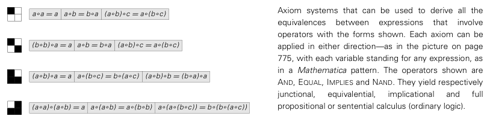
<!-- ORIGINAL_FIGURES page=0819 end -->

可用于推出涉及所示形式运算符之表达式间所有等价关系的公理系统。每个公理都可以双向应用，就像第 775 页图中那样；每个变量都代表任意表达式，如同 Mathematica 模式。所示运算符为 AND、EQUAL、IMPLIES 和 NAND。它们分别产生联结演算、等价演算、蕴涵演算，以及完整命题演算或句子演算（普通逻辑）。

但如果从上方任何一个公理系统中只去掉一个公理，事实证明它们就不再有效；例如，它们无法建立由被去掉公理所陈述的那个等价结果。

一般来说，可以把运算符系统的公理看作给出了关于运算符形式的约束。如果要重现某个特定形式下成立的所有等价关系，那么这些约束实际上就必须能够强制该形式出现。

那么，对于任意公理系统，一般会发生什么？它们通常会强制运算符具有某个特定形式吗，还是不会？

接下来两页的图显示了各种不同公理系统允许哪些运算符形式。在每一种情形中，连续的结果区块给出的是当每个变量有越来越多可能取值时所允许的形式。

图中靠近底部用星号标出的，是本页顶部的四个公理系统。对其中每一个而言，只允许有限数量的形式，而这些形式最终全都等价于面对页所示的单一形式。

但其他公理系统又怎样？每个公理系统都必须至少允许某种形式的运算符。但接下来两页的图显示，绝大多数公理系统实际上都允许各种不同形式的运算符。

这意味着，这些公理系统在某种意义上并不真正关于任何特定形式的运算符。因此，它们实际上也远非完备，因为它们只能证明那些对其允许的每一种不同运算符都成立的等价结果。

[[PDF page 820]]

<!-- ORIGINAL_FIGURES page=0820 start -->
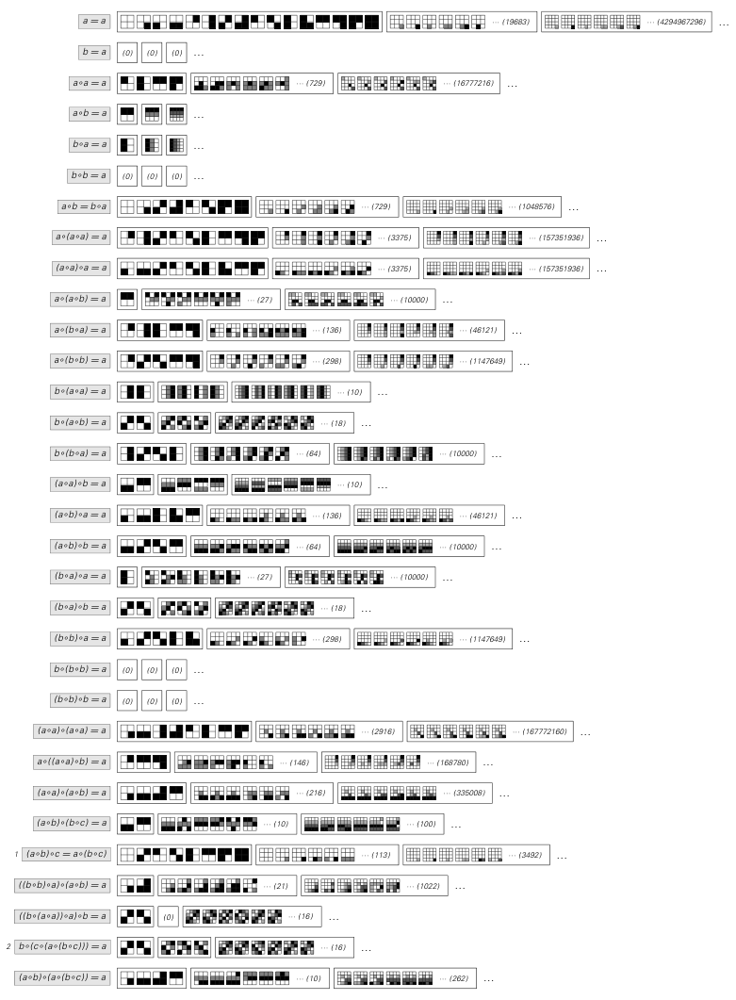
<!-- ORIGINAL_FIGURES page=0820 end -->

二元运算符在一系列不同公理系统约束下所满足的形式（表格第一页）。各情形中连续的结果区块显示了当可能元素数为 2、3 和 4 时允许的运算符形式。对于 3 个和 4 个元素，只显示在交换元素标签下不等价的形式。

[[PDF page 821]]

<!-- ORIGINAL_FIGURES page=0821 start -->
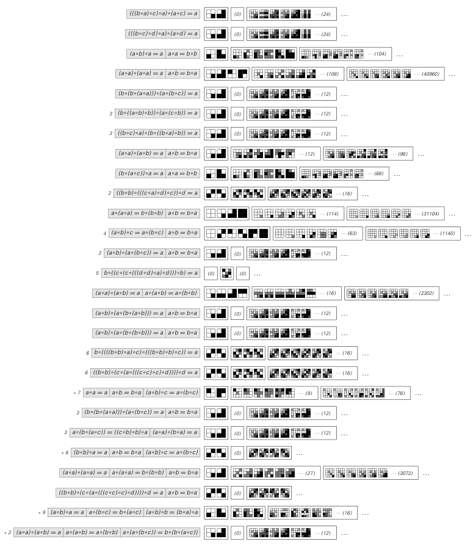
<!-- ORIGINAL_FIGURES page=0821 end -->

二元运算符在一系列不同公理系统约束下所满足的形式（表格续页）。数学中若干著名系统的表示为：(1) 半群论，(2) 交换群论，(3) 基础逻辑，(4) 交换半群论，(5) squag 理论，(6) 群论，(7) 联结演算，(8) 等价演算，(9) 蕴涵演算。每种情形下，所示运算符形式分别对应于具有 2、3 和 4 个可能元素的半群、交换群、逻辑系统（布尔代数）等。所示运算符形式可以被看作给出乘法表。在模型论中，这些形式通常称为一个公理系统的模型。

[[PDF page 822]]

<!-- ORIGINAL_FIGURES page=0822 start -->
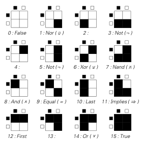
<!-- ORIGINAL_FIGURES page=0822 end -->

那么，如果列出所有可能的公理系统，例如从最简单的开始，那么在这样的列表中，人们应当预期在哪里看到对应于传统数学领域的公理系统？

多数公理系统按典型教科书中的写法都足够复杂，因此根本不会很早出现。事实上，唯一直接的例外是所谓半群的公理系统 `(a * b) * c = a * (b * c)`；具有讽刺意味的是，半群通常被看作相当高级的数学对象。

但传统数学领域的公理系统到底需要有多复杂？它们常常似乎可以比教科书形式简单得多。例如，如第 773 页所示，如果把运算符解释为除法，那么某些相当短的单公理表达式已知可作为交换群论的公理系统；另一些稍长表达式则可作为一般群论的公理系统。

那么基础逻辑怎样？它需要多复杂的公理系统？教科书中关于逻辑的讨论，大多使用至少与第 773 页第一个系统一样复杂的公理系统。而这些公理系统不仅包含多个公理，通常还包含三个独立运算符：AND、OR 和 NOT。

但这事实上是表述逻辑的唯一方式吗？

如下图所示，有 16 种可能的不同运算符，它们接受两个参数，并允许两个值，比如真和假。在这些运算符中，AND、OR 和 NOT 确实是日常语言和大多数数学中最常用的。

两个参数的逻辑函数及其常用名称。黑色代表 TRUE；白色代表 FALSE。AND、OR、NOT 和 IMPLIES 在传统逻辑中广泛使用。EQUAL（当且仅当）在更数学化的场合中很常见，而 XOR 在离散数学中很普遍。NAND 和 NOR 大多只用于电路设计以及少数逻辑基础研究。每个函数的第一个参数在图中左侧，第二个参数在上方。这些函数的编号方式类似于第 53 页元胞自动机规则的二邻域类似物。

[[PDF page 823]]

<!-- ORIGINAL_FIGURES page=0823 start -->
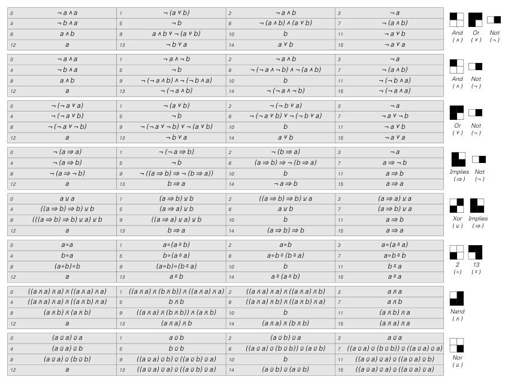
<!-- ORIGINAL_FIGURES page=0823 end -->

但至少在形式层面上，逻辑可以简单地看作关于函数的理论：这些函数在具有两个可能取值的变量给定时，也取两个可能值。正如我们在第 616 页讨论过的，任何这样的函数都可以表示为 AND、OR 和 NOT 的组合。

但下表表明，只要一越过语言和数学的熟悉传统，也有其他运算符完全可以同样用作原语。事实上，早在 1900 年以前，人们就已经知道 NAND 和 NOR 各自单独就可以工作；这一事实我已经在第 617 和 775 页使用过。

可用于表述逻辑的函数。每种情形都给出了重现两个参数的 16 个逻辑函数中每一个所需的原始函数的最小组合。由这些函数出发，可以得到任意参数个数的任何可能逻辑函数。大多数逻辑教科书使用 AND、OR 和 NOT 作为原始函数。NAND 和 NOR 是唯一可以单独工作的原始函数。

[[PDF page 824]]

<!-- ORIGINAL_FIGURES page=0824 start -->
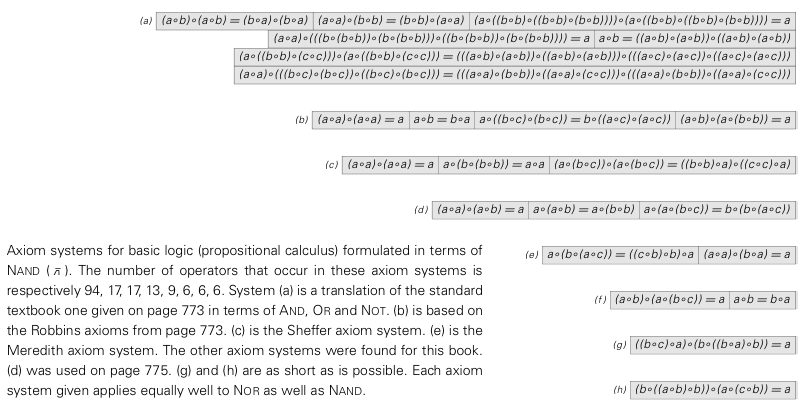
<!-- ORIGINAL_FIGURES page=0824 end -->

因此，这意味着逻辑可以只用一个运算符来设置。

但它随后需要多复杂的公理系统？下图第一个框显示，第 773 页标准教科书中 AND、OR、NOT 公理系统的直接翻译非常复杂。

用 NAND 表述的基础逻辑（命题演算）公理系统。这些公理系统中出现的运算符数量分别为 94、17、17、13、9、6、6、6。系统 (a) 是第 773 页中以 AND、OR 和 NOT 给出的标准教科书系统的翻译。(b) 基于第 773 页中的 Robbins 公理。(c) 是 Sheffer 公理系统。(e) 是 Meredith 公理系统。其他公理系统是为本书找到的。(d) 已在第 775 页使用。(g) 和 (h) 达到了可能的最短长度。给出的每个公理系统对 NOR 和 NAND 同样适用。

但框 (b) 和 (c) 显示，逻辑的已知替代公理系统可以把公理系统大小减少约一个数量级。通过操作所得公理，还能进一步缩短，从而得到上面使用并在框 (d) 中给出的公理系统。

但还能继续缩短吗？如果人们只是尝试搜索能工作的简单公理系统，又会发生什么？

人们原则上可以通过查看哪些运算符满足公理系统约束，来测试公理系统，就像第 805 页那样。第一个甚至允许 NAND 运算符的非平凡公理系统是一个很短的单公理系统。而在涉及 2 个可能取值的运算符中，第一个只允许 NAND 和 NOR 的公理系统，也是一个短的单公理系统。

[[PDF page 825]]

<!-- ORIGINAL_FIGURES page=0825 start -->
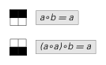
<!-- ORIGINAL_FIGURES page=0825 end -->

但如果现在考察涉及 3 个可能取值的运算符，事实证明这个公理系统允许一些并不等价于 NAND 和 NOR 的运算符。这意味着它不能成功重现逻辑的所有结果。然而，如果任何只有一个公理的公理系统能够做到这一点，那么该公理必须具有某种以 `... = a` 结尾的形式。

在包含最多 6 个 NAND 和 2 个变量时，这类 16896 个可能公理系统中没有一个能在 3 值运算符层面工作。但在包含 6 个 NAND 和 3 个变量时，288684 个可能公理系统中有 296 个能在 3 值运算符层面工作，有 100 个能在 4 值运算符层面工作。

在其中 25 个并非平凡等价的系统中，事实证明，面对页给出的 (g) 和 (h) 这两个，实际上可以像接下来两页那样被证明为逻辑的公理系统；这表明，相对于普通教科书公理系统，最终可以实现相当惊人的简化。

如果考察形如 `... = a, a * b = b * a` 的公理系统，那么第一个允许 2 值运算符中只有 NAND 和 NOR 的系统，是一个包含交换性公理的短系统。但只要总共使用 6 个 NAND，就会突然发现，在 3402 个含有 3 个变量的可能系统中，有 32 个与上面情形 (f) 等价的公理系统，最终至少一直工作到 4 值运算符。事实上，随后可以证明 (f) 的确可作为逻辑的公理系统。

这意味着，如果人们只是浏览最简单的几千个公理系统的列表，就已经相当可能找到一个表示逻辑的系统。

在人类思想史中，逻辑具有重大意义。但如果只看公理系统，那些用于逻辑的系统有什么明显特殊之处吗？我的猜测是，除非询问非常具体的细节，否则其实没有；标准逻辑在某种意义上最终只是因为其历史语境而显得特别。

逻辑的一个特征是，它的公理实际上描述了单个特定运算符。但事实证明，还有各种其他公理也能做到这一点。我在第 803 页给出了三个例子，在右侧图中又给出两个非常简单的例子。事实上，对于许多运算符形式，总能找到描述它的公理系统。

重现所示运算符形式之等价结果的公理系统。

[[PDF page 826]]

<!-- ORIGINAL_FIGURES page=0826 start -->
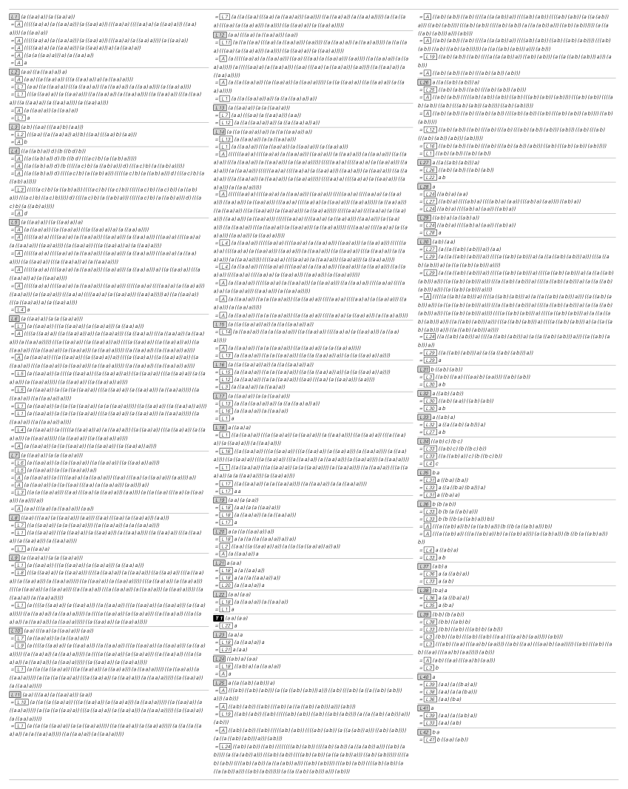
<!-- ORIGINAL_FIGURES page=0826 end -->

第 825 页例子 (g) 的形式证明图（第一页）。图中展开的是一条很长的符号证明链，用来说明一个极短的 NAND 单公理系统如何推出 Sheffer 公理系统。

[[PDF page 827]]

<!-- ORIGINAL_FIGURES page=0827 start -->
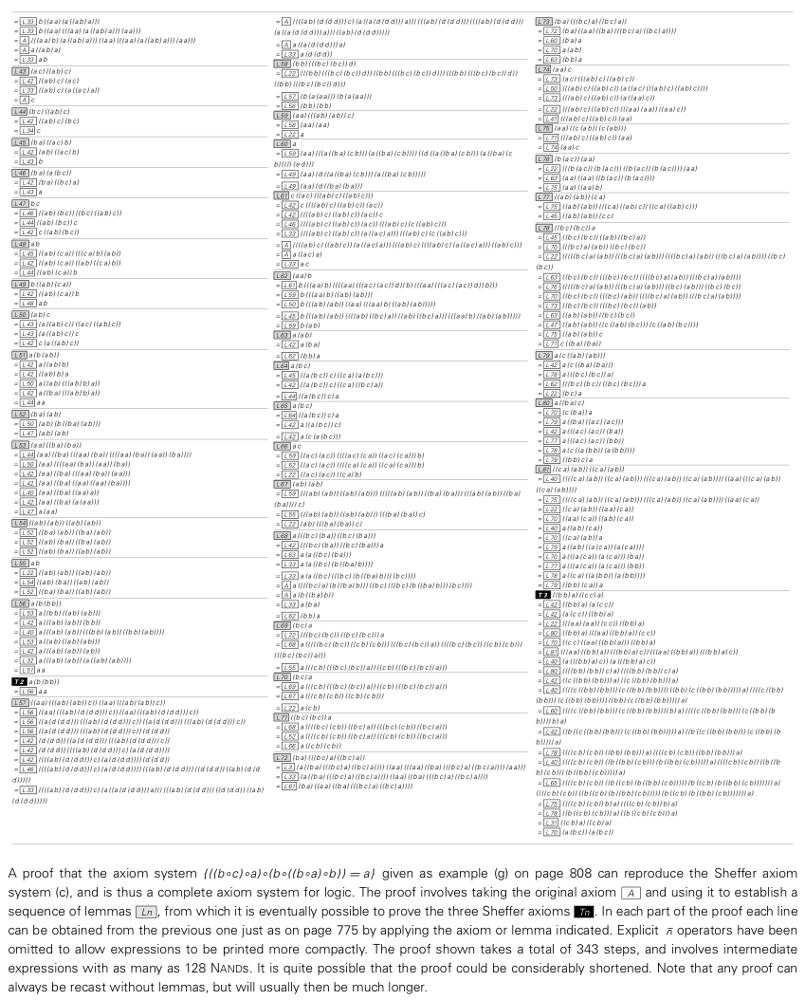
<!-- ORIGINAL_FIGURES page=0827 end -->

对第 808 页例子 (g) 中给出的公理系统 `{((b * c) * a) * (b * ((b * a) * b)) = a}` 的证明：它可以重现 Sheffer 公理系统 (c)，因此是逻辑的一个完备公理系统。该证明从原始公理 `A` 出发，用它建立一系列引理 `L_n`，最终由这些引理证明三个 Sheffer 公理 `T_n`。在证明的每一部分中，每一行都可以像第 775 页那样，通过应用所标明的公理或引理从前一行得到。显式的 NAND 运算符被省略，以便表达式能以更紧凑的方式排印。这里显示的证明总共需要 343 步，并涉及最多含有 128 个 NAND 的中间表达式。这个证明完全可能被大幅缩短。注意，任何证明总能不使用引理而重新表述，但那样通常会长得多。

[[PDF page 828]]

<!-- ORIGINAL_FIGURES page=0828 start -->
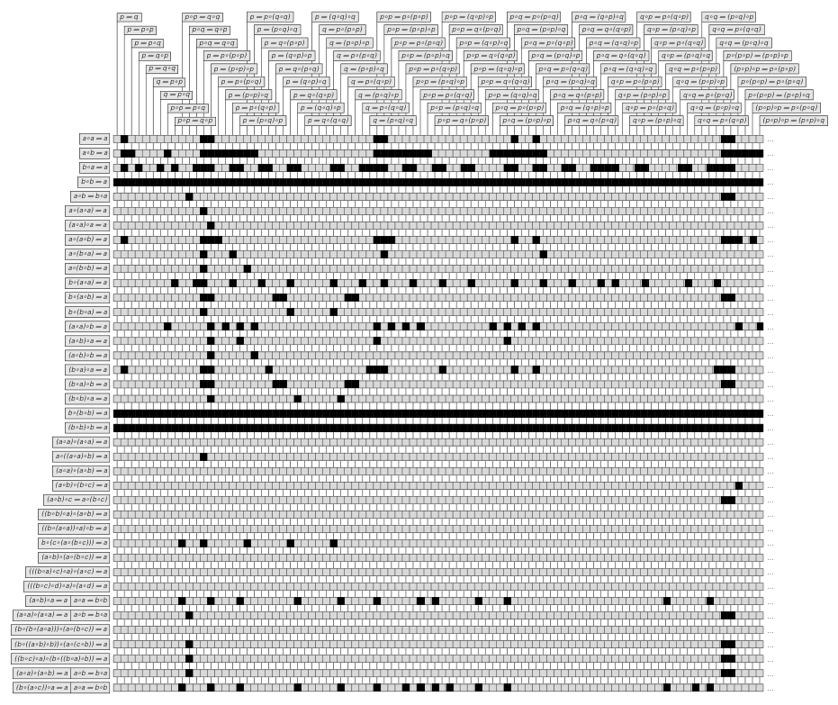
<!-- ORIGINAL_FIGURES page=0828 end -->

那么定理模式又怎样？从这些模式来看，逻辑是否以某种方式显得突出？下图显示了第 805 页系统中哪些可能的简单等价定理成立。

与第 805 页相比可以看到，通常一个公理系统的约束允许的运算符形式越多，该公理系统中成立的等价结果就越少。

基于第 805 页简单公理系统可以证明的定理。黑色方块表示某个特定定理在某个特定公理系统中成立。一般来说，给定定理是否成立的问题是不可判定的，但这里给出的特定定理足够简单，因此经过一定努力可以确切建立相应结果。

[[PDF page 829]]

<!-- ORIGINAL_FIGURES page=0829 start -->
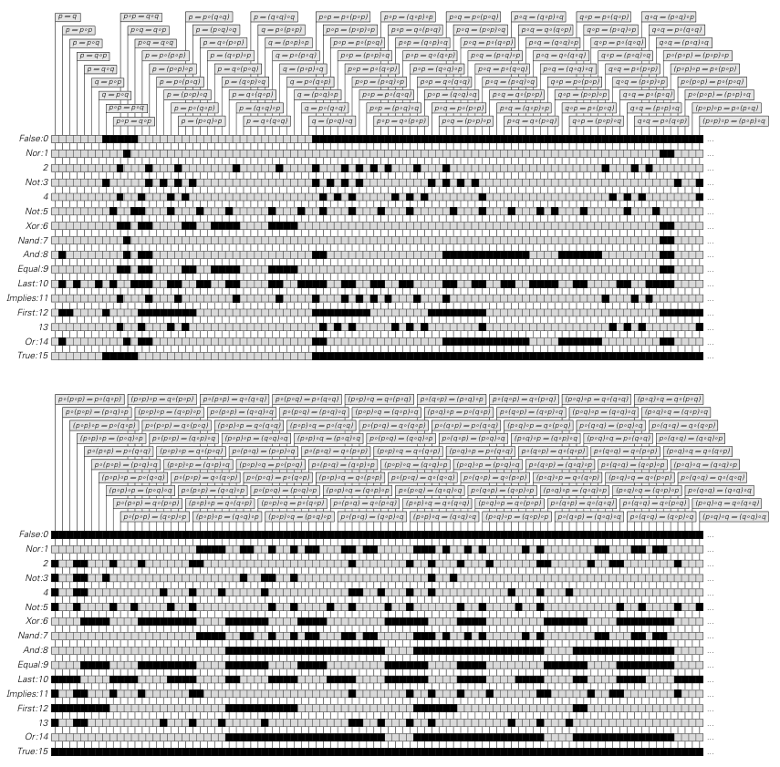
<!-- ORIGINAL_FIGURES page=0829 end -->

如果本质上只允许单一运算符形式，会发生什么？下图显示了第 806 页中的 16 种形式的结果；在这些形式中可以看到，逻辑给出的定理数量最少。

对第 806 页所示每种运算符形式成立的定理。NAND 和 NOR 产生的定理数量最少。

[[PDF page 830]]

<!-- ORIGINAL_FIGURES page=0830 start -->
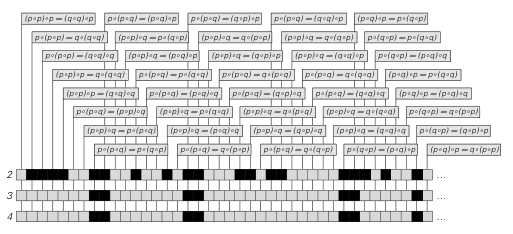
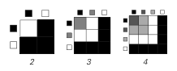
<!-- ORIGINAL_FIGURES page=0830 end -->

但如果例如考虑允许变量取两个以上可能值的逻辑类似物，下图显示，人们立刻会得到定理更少的系统。

允许不同真值数量的逻辑类似物中的定理。像 `p = NOT NOT p` 这样的陈述，在超过 2 个真值时一般并不成立。

那么证明又怎样？在普通逻辑的情形中，证明是否有什么特殊之处？

在第 803 页的公理系统中，证明的典型长度似乎从一个系统到下一个系统逐渐增加，最终在最后一个公理系统中最长；而这个系统对应于逻辑。

但如果人们为逻辑选择一个不同的公理系统，例如第 808 页上的其他系统之一，那么某个特定证明的长度通常会改变。不过，由于人们总可以先证明新的公理，这种改变只能差一个固定量。事实证明，即使是第 808 页给出的最简单公理系统 (f)，似乎也允许至少大多数短定理具有相当短的证明。

但当人们试图证明越来越长的定理时，无论使用哪个逻辑公理系统，证明长度似乎都可以快到指数级增长。然而关键一点是，对于给定长度的定理，所需证明长度总有一个明确上限。不过，这同样不是逻辑独有的。事实上，任何像第 803 页那些最终本质上只允许单一形式运算符的公理系统，情况都必定如此。

那么其他公理系统又怎样？

第 805 和 812 页上最简单的那些公理系统，似乎产生的证明总是比较短。但当考察哪怕稍微复杂一点的公理系统时，除了最简单结果之外，任何结果的证明都可能变得长得多；这使得在实践中往往很难判断某个给定结果实际上到底能不能被证明。

[[PDF page 831]]

在某种意义上，这只是我们在本节开头的多路系统中已经看到、并且似乎经常在真实数学中出现的同一基本现象的另一个例子：即使一个定理陈述起来很短，它的证明也可以任意长。

我相信，这最终是计算等价原理的反映。因为该原理表明，大多数后果并不显然简单的公理系统，都倾向于通用。这意味着它们会表现出计算不可约性和不可判定性，并且不允许对任何给定结果可能需要多长证明设置一般上限。

正如我前面讨论过的，传统数学中多数常见公理系统已知是通用的；基础逻辑是少数例外之一。但人们也许会以为，为了达到通用性，这些公理系统必须被特别设置，带有各种具体而精巧的特征。

然而，从本书的结果，也就是计算等价原理所体现的结果来看，我们现在知道情况并非如此；事实上，即使在非常简单的公理系统中，例如第 805 页上的那些，通用性也已经应当相当常见。

而且，尽管运算符系统和多路系统有许多表面差异，我怀疑在通用性方面它们的工作方式非常相似。因此，在任一理想化中，人们都不应当走很远就能得到表现出通用性的公理系统，就像传统数学中的大多数系统一样。

但一旦到达一个通用公理系统，为什么在某种意义上还需要继续往前走？毕竟，一个公理系统是通用的，意味着通过设置合适的编码，原则上必定可以让这个公理系统重现任何其他可能的公理系统。

关键在于，数学中通常使用的编码类型在实践中相当有限。因为虽然人们常常会把例如几何中的问题重新表述为代数中的问题，但这几乎总是只通过在所描述对象之间建立一种直接翻译来完成，通常实际上只是重命名用于操作它们的运算符。

[[PDF page 832]]

然而，要充分利用通用性，人们必须不仅考虑对象之间的翻译，还要考虑完整证明之间的翻译。如果这样做，例如把算术编程为重现集合论中的任意证明，确实完全是可能的。事实上，人们只需要把集合论公理编码进类似第 786 页的算术方程系统中。

但除了哥德尔定理这个显著例外之外，这类编码通常并不在数学中使用。因此，这意味着即使存在通用性，数学的现实理想化仍必须区分不同公理系统。

那么归根到底，是什么决定了数学中实际使用哪些公理系统？在本节中，我讨论了一些准则。但最终，历史似乎是唯一真正的决定因素。因为对于像第 773 和 774 页那些公理系统中几乎任何可以挑出的普遍性质，通常似乎都有各种运算符系统和多路系统，往往还包括一些相当简单的系统，恰好共享同样的性质。

这就导致这样一个结论：传统上在数学中使用的特定公理系统，在某种意义上并没有什么根本特殊之处；事实上，还有各种其他公理系统完全可以被用作实际上新的数学领域的基础，这些领域会和传统领域一样丰富，只是没有历史联系。

那么现有数学领域又怎样？正如我在本节前面提到的，我强烈相信，即便在这些领域内部，实际被研究的内容也一直受到隐含施加的根本限制。最常见的情况是，只有某些类型的问题或陈述被认为具有真正的数学兴趣。

面对页的图显示了一个相当直接的版本。它按顺序列出基础逻辑中的大量定理，并只突出显示那些被典型逻辑教科书认为足够有趣、因而被明确命名的少数定理。

[[PDF page 833]]

<!-- ORIGINAL_FIGURES page=0833 start -->
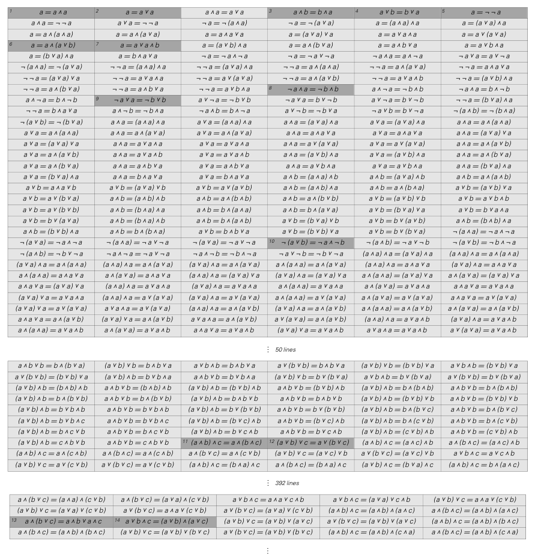
<!-- ORIGINAL_FIGURES page=0833 end -->

基础逻辑的定理，按复杂度递增顺序写出。那些在典型教科书中被认为足够有趣而命名的定理被突出显示。这些定理分别是：(1)、(2) AND 与 OR 的幂等律（重言律）；(3)、(4) AND 与 OR 的交换律；(5) 双重否定律；(6)、(7) 吸收律（冗余律）；(8) 非矛盾律（FALSE 的定义）；(9) 排中律（TRUE 的定义）；(10) 德摩根律；(11)、(12) AND 与 OR 的结合律；(13)、(14) 分配律。除了第二个分配律之外，事实证明，被突出显示的定理正好就是那些不能由列表中先前定理推出的定理。分配律出现在列表的第 2813 和 2814 个位置；要从先前定理得到第二个分配律，需要一个很长的证明。

[[PDF page 834]]

<!-- ORIGINAL_FIGURES page=0834 start -->
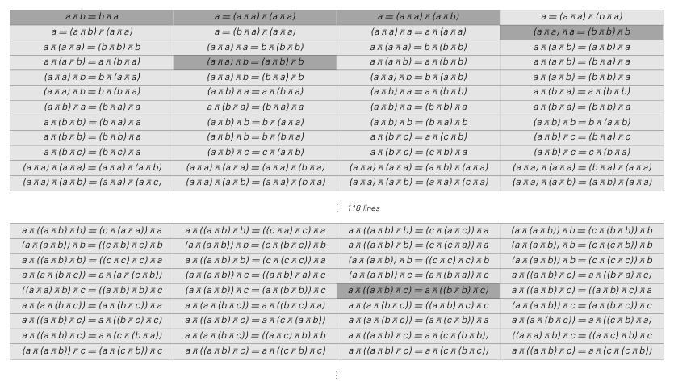
<!-- ORIGINAL_FIGURES page=0834 end -->

但是什么决定这些定理会是哪一些？人们也许会以为这纯粹是历史问题。但实际考察定理列表时，看起来总是那些在某种意义上表现出最少不必要复杂性的定理会显得有趣。

事实上，如果从列表开头开始，人们会发现大多数定理都可以很容易地从列表中更早出现的更简单定理推出。但有少数定理不能这样推出，因此在某种意义上提供了真正新信息的最简单陈述。相当令人惊讶的是，我发现这些定理几乎正好就是上一页中那些传统上被识别为有趣并被突出显示的定理。

那么，如果把同一准则应用到其他设置中，会发生什么？下图给出一个例子，显示的是上面讨论的基于 NAND 的逻辑表述中的定理。

用 NAND 表述的逻辑定理。那些不能由列表中更早定理推出的定理被突出显示。最后一个被突出显示的定理是列表中的第 539 个。之后不会再有定理被突出显示，因为所示定理已经构成一个完备公理系统，从它可以推出任何逻辑定理。然而，最后一个被突出显示的定理，是一个从公理可推出但难以证明的例子。

[[PDF page 835]]

现在没有特定历史传统可以依靠。但这个准则尽管如此似乎仍然与人类可能作出的判断相当一致。就像第 817 页图中那样，可以看到在列表一开始就有几个定理被识别为有趣。但此后必须走很远，才会找到其他这样的定理。

那么，如果继续走得更远，最终还会找到更多吗？事实证明，按照我们使用的准则，不会。原因在于，已经突出显示的六个定理恰好构成一个公理系统，任何可能的 NAND 定理最终都可以由它推出。

事实上，只要处理的是可由有限公理系统推出的定理，这个准则就意味着，永远只有有限数量的定理应当被认为有趣；一旦在某种意义上获得了足够多定理，能够重现公理系统的某种表述，它就结束了。

但这本质上就像是在说，一旦人们知道了一个系统的规则，关于它的其他任何事情都不应当再被认为有趣。然而本书大部分内容恰恰关心的是：即使知道了一个系统的规则，仍能涌现出来的所有有趣行为。

关键在于，如果存在计算不可约性，那么关于一个系统行为的各种信息，在某种意义上只能通过从规则出发做不可约地大量计算工作才能找到。而在公理系统中的类似物就是：有些定理只能通过某种不可约地长的证明才能到达。

因此，这表明，一个定理被认为有趣，不仅可能因为它完全不能由更简单定理推出，也可能因为它不能由这些定理推出，除非经过某种很长的证明。事实上，在基础逻辑中，第 817 页上被识别为有趣的最后一个定理，也就是 OR 的分配性，就是这样的例子：它原则上可以由更早定理推出，但似乎只能通过一个比同等大小的其他定理长得多的证明推出。

然而在逻辑中，所有证明最终实际上都有有限长度上限。但在任何存在通用性并因此存在不可判定性的公理系统中，情况就不再如此；正如我上面讨论过的，我怀疑各种短定理只有极长证明的情形实际上会相当常见。

[[PDF page 836]]

毫无疑问，许多这样的定理在实践中太困难，永远无法被证明。但即使它们能够被证明，它们会被认为有趣吗？它们当然会提供本质上新的信息，但我强烈怀疑，在当前实践中的数学里，它们只有很少时候会被认为有趣。

对此最常见的理由会是：它们似乎不适合纳入任何数学结果的一般框架，而只是像孤立的随机数学事实。

在做数学时，人们常用困难、有力、惊奇、深刻这样的词来描述定理。但这些词真正意味着什么？正如我上面提到的，任何数学领域在某个层面上都可以被看作一个由陈述构成的巨大网络，其中连接对应于定理。我怀疑，我们对定理的直觉性刻画，实际上只是我们对这个网络结构中各种特征之感知的反映。

事实上，我怀疑，通过考察例如某个给定定理使人从网络一部分到达另一部分变得多容易，就有可能形式化许多关于数学实践的直觉观念，就像本书前面我们能够形式化复杂性和随机性等日常经验概念那样。

不同数学领域的网络很可能具有特征上不同的性质。例如，通常被视为较成功的纯数学领域，可能具有更紧凑的网络；而那些似乎涉及各种孤立事实的领域，例如初等数论或特定元胞自动机理论，可能具有更稀疏、带有更多枝蔓的网络。

这种差异会反映在可给出的证明中。例如，在更稀疏的网络里，某个特定定理的证明可能不包含许多可用于证明其他定理的部分。但在更紧凑的网络里，可能会有一些中间定义和概念，可以用于一整片不同定理。

[[PDF page 837]]

事实上，在一个极端情形中，甚至可能可以做出类似符号积分计算中已经做到的事情，建立某种统一过程，用来寻找几乎任何短定理的证明。

一般来说，只要单个证明内部或不同证明之间存在足够多重复元素，这就表明存在计算可约性。然而，尽管这意味着每个被证明的定理实际上包含较少新信息，事实证明在大多数数学领域中，这些定理通常正是被认为有趣的定理。

通用性的存在意味着，在某个层面上必定存在计算不可约性，因此必定存在无法由任何短过程到达的定理。但关键在于，数学倾向于忽略这些定理，而只是集中于所有可能定理网络中实际上有限的计算可约性片区。

然而，在某种意义上，这与物理学中发生的事情并无不同；在那里，传统上被研究的现象大多只是那些表现出足够计算可约性，从而允许用传统理论物理方法分析的现象。

但在物理学中，人们只需观察自然世界，就能看到其他更复杂的现象存在；而通常的数学方法几乎不给出任何类似暗示。

然而，通过本书所采用的、基于显式实验的新方法，现在变得相当清楚：像计算不可约性这样的现象确实出现在抽象数学系统中。

事实上，计算等价原理意味着，这类现象应当在几乎每个方向上都近在咫尺；只不过，尽管数学以一般性著称，它过去一直隐含地倾向于把自身界定为避开这些现象。

这意味着，在未来，当本书的思想和方法被成功吸收之后，今天存在的数学领域将被看作实际可能事物中的一个很小而且令人惊讶地不典型的样本。

[[PDF page 838]]

## 宇宙中的智能

我们人类是否是宇宙中智能的唯一例子，是科学中尚未回答的重大问题之一。

究竟应当怎样定义智能，一直并不十分清楚。但近来，人们通常假定它与执行精巧计算的能力有关。

按照传统直觉，一个像人类这样复杂的系统才会表现出这种能力，似乎一直完全合理；地球生命的整个精巧历史似乎也必须发生，才会产生这样的系统。

随着计算机技术的发展，人们清楚地看到，智能的许多特征可以在非生物系统中实现。然而我们的经验仍然表明，建造计算机需要精巧工程，而这种工程在某种意义上只因为人类的生物和文化发展才存在。

但本书的一个核心发现是，要得到精巧计算，实际上并不需要如此复杂的东西。事实上，计算等价原理意味着，范围极其广泛的系统，甚至底层规则非常简单的系统，在它们所执行计算的精巧程度上都应当是等价的。

因此，只要智能与进行精巧计算的能力相关，它就绝不应当需要数十亿年的生物演化才能产生；事实上，我们应当在各处、在各种系统中都看到它，无论这些系统是生物的还是非生物的。

当然，某些日常说法或许会暗示我们确实这样看。例如，当我们说天气有自己的主意时，我们实际上是在把某种类似智能的东西归因于流体的运动。然而有人也许会说，真正的智能，也就是我们人类拥有的那种智能，当然一定还包含某种根本更多的东西。

那么，这种东西可能是什么？

当然，人们可以识别出人类智能的各种具体特征：理解语言、做数学、解谜题的能力，等等。但问题在于，是否存在更一般的特征，能以某种方式捕捉真正智能的本质，并且独立于人类智能的具体细节。

[[PDF page 839]]

也许它可以是学习和记忆的能力。或者是适应范围广泛的不同复杂情形的能力。或者是处理数据的抽象一般表示的能力。

起初，所有这些似乎都可以作为真正智能的合理指标。但只要试图脱离人类智能这一特定例子来思考它们，事情就变得远没有那么清楚。事实上，从本书中的发现来看，我现在相当确信，这些能力中的任何一种，实际上都可以在我们通常绝不会认为显示出任何类似智能之东西的系统中实现。

例如，学习和记忆实际上可以发生在任何这样的系统中：其中有一些结构会响应输入而形成，并且能够长期持续、影响系统行为。这甚至可以发生在简单元胞自动机中；也可以发生在像流体这样的物理系统中，比如流体在固体表面上刻出一种长期模式。

对各种复杂情形的适应，也发生在许多系统中。当自然选择存在时，这一点已被充分认识。但在某个层面上，只要某个约束最终得到满足，也可以把它看作适应发生了；例如，绕过复杂物体流动的流体会最小化其耗散能量。

处理抽象在某种意义上也相当常见。事实上，只要把一个系统看作在执行计算，人们就可以立刻把这些计算的某些特征视为类似该系统输入的抽象表示。

那么，鉴于这一切，是否有任何办法定义一种关于真正智能的一般概念？我的猜测是，最终没有；事实上，任何可行的、关于我们通常所说智能的定义，最终都必须与人类智能中各种看似相当具体的细节绑定在一起。

事实证明，如果试图定义一个看起来简单得多的概念，也就是生命，也会发生相当类似的事情。

曾经有一段时间，人们认为几乎任何自发运动并响应刺激的系统都必定是活的。

[[PDF page 840]]

<!-- ORIGINAL_FIGURES page=0840 start -->
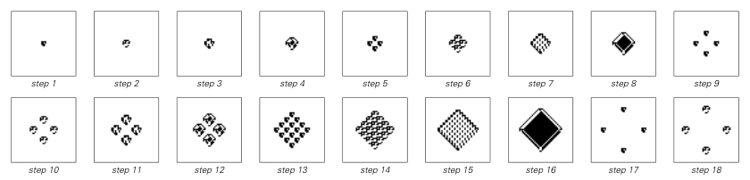
<!-- ORIGINAL_FIGURES page=0840 end -->

但随着带有哪怕最原始传感器的机器得到发展，人们清楚地看到，这并不正确。

热力学领域的工作带来一种想法：也许可以通过生命系统获取无组织物质并自发组织它的能力来定义生命，通常是把这些物质纳入自身结构。然而，各种非生命系统，从晶体到火焰，也会这样做。第 6 章还显示，即使在具有简单规则的系统中，自组织实际上也极其常见。

有一段时间，人们认为也许可以通过自我复制能力来定义生命。但在 1950 年代，人们构造出了同样具有这种能力的抽象计算系统。不过当时看起来，它们需要高度复杂的规则，与实际活细胞中的规则并无太大不同。但事实上，这种复杂性并非真正必要。按照本书中的直觉，现在人们也许会预期，即使像下方这样规则极其简单的系统，也仍能表现出自我复制，尽管它们与普通生命系统几乎没有其他相似之处。

一个二维元胞自动机，表现出一种几乎平凡的自我复制形式：每当演化步数加倍时，任何初始模式的多个副本都会出现。所用规则是加性规则；当一个元胞在前一步的邻居中有奇数个为黑色时，它就取黑色（外总和型代码 204）。同样的基本自我复制现象出现在初等规则 90 中，也出现在本质上任何维数中的几乎任何其他加性规则中。

如果考察典型生命系统，它们最明显的特征之一是巨大的表观复杂性。长期以来，人们一直认为这种复杂性必定以某种方式为生命系统所独有，也许需要数十亿年的生物演化才能发展出来。但我在本书中显示，情况并非如此；事实上，范围极其广泛的系统，包括那些底层规则非常简单的系统，都能生成至少与典型生命系统组成部分中所见同样多的复杂性。

[[PDF page 841]]

然而，尽管如此，在日常经验中，我们通常并不太难把生命系统和非生命系统区分开来。但原因在于，地球上的所有生命系统都共享极其大量的细节性结构和化学特征，这反映了它们漫长的共同生物演化历史。

那么地外生命又怎样？要能识别它，我们需要某种一般的生命定义，独立于地球生命的细节。但正如智能的情形一样，我相信实际上不可能给出这种合理定义。

事实上，基于本书中的发现，我已经得出结论：几乎任何人们可能认为刻画生命的一般特征，实际上即使在许多具有非常简单规则的系统中也会出现。我毫不怀疑，在地球上和地外都可以识别出各种这样的系统，而且它们的产生当然不需要任何类似地球生命那样复杂的历史。

但我们很可能不会认为这些系统哪怕接近真正的生命例子。事实上，我预期最终只有当我们发现某个系统与地球生命共享许多具体细节时，我们才会毫无疑问地把它看作生命的例子；这些细节大概会细到例如由胶状材料构成，并具有类似蛋白质、酶、细胞膜等等的组成部分，甚至也许细到基于水、糖、ATP 和 DNA 等特定化学物质。

那么地外智能又怎样？它必须在多大程度上表现出与人类智能相同的细节，甚至同样类型的知识，我们才会把它识别为一个有效的智能例子？

即使只在人类之间，在没有共同教育和文化的情况下，实践中识别智能也可能有些困难。事实上，在幼童中，不同智能方面到底在哪个阶段变得活跃，仍几乎完全不清楚。

而涉及其他动物时，事情变得更加困难。如果人们专门训练动物解决数学谜题，或使用人类语言交流，那么通常可以识别出它所表现出的智能。

[[PDF page 842]]

但如果只是观察动物的正常活动，要判断它们是否涉及智能，可能会异常困难。因此，作为典型例子，鸟类或鲸类的歌声是否与智能有关，仍然相当不清楚。

对我们来说，这些歌声也许听起来很有音乐性；事实上，它们甚至似乎表现出某些与人类音乐相同的组织原则。但生成它们真的需要智能吗？

特别是在鸟类那里，人们已经越来越能够追踪歌声产生的细节过程。看起来，至少其中一些复杂元素只是鸟类声道中出现的复杂气流模式的直接后果。

但鸟的大脑肯定也提供了输入。然而，在大脑内部，已知有一些负责的神经通路。人们也许会想，如果所有这样的通路都能被找到，那就会立即表明其中没有智能参与。

当然，如果可以以某种方式看到这些通路只支持简单计算，那么这是合理结论。但仅仅使用确定的通路，或确定的底层规则，并不会以任何方式排除智能。事实上，如果观察人脑内部，例如在生成言语的过程中，无疑也会看到确定通路和确定规则被使用。

那么，我们怎样判断像鸟鸣、鲸歌，或者就此而言地外信号这样的东西，是否是智能的反映？我们倾向于使用的根本准则是：它是否具有意义，或者它是否传达了什么。

日常经验告诉我们，这往往很难判断。因为即使我们只是听到一种自己不懂的人类语言，也几乎不可能识别所说内容是否有意义。如果我们接收到任何以未知格式编码的数据，同样如此。

我们也许会先尝试使用自己的感知和分析能力，在数据中寻找规律。如果发现太多规律，我们也许会断定这些数据不可能表示足够的信息来传达任何重要内容；事实上，至少某些高度重复的鸟鸣也许就是这种情况。

[[PDF page 843]]

但如果我们找不到任何特定规律呢？我们对人类语言的日常经验也许会让我们以为，这些数据于是就不可能有意义。但没有任何理由说明它不能是一条完全有意义的信息，甚至是人类语言中的信息，只不过碰巧被加密或压缩到了不显示可检测规律的程度。

事实上，令人警醒的是，如果只是聆听鸟鸣和鲸歌，也几乎没有什么从根本上把它们同自然界各种过程可以产生的东西区分开来，比如风中风铃的运动，或地球磁层中等离子体的运动。

人们也许会想，可以通过寻找发送者和接收者行为之间由信息诱发的相关性，来判断某个特定情形中是否传达了有意义的信息。但在各种自然系统中，看到效应从一个元素传播到另一个元素，是极其常见的。即使涉及鲸歌，事实证明最终也从未识别出发送者与接收者之间明确的相关性。

但如果人们注意到发送者身上发生了某个事件呢？如果以某种方式在发送者产生的东西中看到这一事件的表示，难道这不是有意义交流的证据吗？

再次说，并不一定。因为有大量情形中，系统会生成反映其所遭遇事情的信号。例如，一个鼓如果以某种特定模式被敲击，就会产生反映并实际上表示该模式的声音。

另一方面，即使在人类之间，不同训练或文化也可能导致对某个给定事件的反应极为不同。对于动物，还存在另一个问题：它们强调不同形式的感知。大概狗能够感知其环境中气味的细节模式，而海豚能够感知其周围流体运动的细节模式。然而，我们人类几乎肯定无法识别以这些术语呈现的描述。

[[PDF page 844]]

因此，如果不能通过寻找有意义交流来识别智能，那么我们至少能不能判断某个给定对象的产生是否涉及智能？

当然，我们的日常经验是，通常很容易判断某物是不是由人类创造的人造物。

但其原因很大程度上只是：实践中我们遇到的大多数人造物都有一些看起来相当相似的特定元素。而这大概在很大程度上只是工程历史发展的反映，也是同样基本几何形式和其他形式一再被使用的反映。

那么，是否存在更一般的方法来识别人造物？

在实践中，猜测某物是否为人造物的一个相当好办法，就是看它是否显得简单。因为虽然有一些例外，例如晶体、气泡和动物角，但自然界中存在的大多数对象具有不规则且常常极其复杂的形式，看起来比典型人造物复杂得多。

事实上，这一点常被用来说明，自然界中的对象必定是由能力超越人类智能的神灵创造的。因为传统直觉表明，如果人们看到更多复杂性，那么它在某种意义上一定有更复杂的起源。

但本书的主要发现之一是，即使在底层规则极其简单的系统中，巨大复杂性也能产生。因此归根到底，无需任何规则复杂到人类智能程度，更不用说超越人类智能的东西，就能解释我们在自然界中看到的那种复杂性。

但问题随后变成：为什么当人类智能参与时，它倾向于创造看起来比自然中自行出现的对象简单得多的人造物？我相信，基本答案与这样一个事实有关：当我们人类设置人造物时，通常需要能够预见它们会做什么；否则我们就无法判断它们是否会实现我们想要的目的。

然而，自然大概不受这种约束。事实上，我已经论证过，在自然界出现的系统中，有许多表现出计算不可约性；因此，在某种意义上，要预见它们会做什么，会变得不可约地困难。

[[PDF page 845]]

然而，至少按照传统方法论，工程倾向于依赖计算可约性。因为它通常通过这样一种方式构建系统：每个元素的行为总是能够很容易地由类似简单数学公式的东西预测。

其结果是，工程创造的大多数系统在某种意义上被迫显得简单；例如在机械情形中，它们通常只基于简单的重复运动。

但简单性是人造物的必要特征吗？地外智能创造的人造物，或者未来人类技术创造的人造物，是否可能看不出任何简单性迹象？

只要我们说一个系统实现了明确目的，就意味着我们至少可以通过描述这个目的来概括该系统所做事情的一部分。所以，如果我们对目的有一个简单描述，就推出我们必定能够对该系统所做事情的至少一部分给出简单概括。

但这是否意味着系统的整体行为必须简单？传统工程也许会让人这样想。因为我们的典型经验是，如果我们能够让某种特定系统产生某种特定结果，那么为做到这一点所涉及的行为通常相当简单。

但本书的一个结果是，一般而言事情不必这样运作。因此，例如在第 5 章末尾，我们看到若干系统，其中实现某个特定结果这一简单约束，实际上只能通过相当复杂的行为来满足。

正如我将在下一节讨论的，我相信，在努力优化事物时，即使为了实现相对简单的目的，更高级的技术也几乎不可避免地会利用具有越来越复杂行为的系统。

因此，这意味着归根到底没有理由认为，目的简单的人造物必然看起来简单。

那么，如果我们面前只有某个东西，怎样判断它是否有目的？即使对于我们知道由人类创造的东西，这也已经可能很困难。例如，有许多考古结构，如巨石阵，其中哪些特征是有意为之，充其量也是不清楚的。

[[PDF page 846]]

<!-- ORIGINAL_FIGURES page=0846 start -->
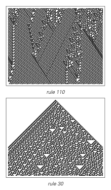
<!-- ORIGINAL_FIGURES page=0846 end -->

即使在当代情形中，如果我们接触到人类活动中自己碰巧不熟悉领域内的对象或活动，要判断哪些特征是直接有目的的，哪些是无意的，或者比如主要具有装饰或仪式功能，也可能非常困难。

事实上，即使我们被告知某个目的，也常常无法识别它。通常，只有当我们理解某整条后果链怎样能够导向恰好适合我们自身特定个人语境的目的时，我们才会相信其有效性。

既然如此，我们一般怎么可能期望识别目的的存在，例如把它作为地外智能的标志？

举个例子，如果我们看到一个元胞自动机，怎样才能判断它是否是为某个目的而创造的？

在本书中的元胞自动机中，尤其是在第 11 章，有少数是专门构造来实现特定目的的。但绝大多数最初只是作为我研究最简单可能底层规则会发生什么的一部分而出现。

起初，我完全没有把其中大多数看作在实现任何特定目的。但随着我逐渐建立起本书这门科学的整体语境，我意识到它们中许多事实上可以被看作在实现非常明确的目的。

左侧所示的规则 110 这样的系统，在其行为中有一种局部一致性，让人想到传统工程系统的运作，或者有目的的人类活动。但规则 30 这样的系统就不是这样。因为尽管可以看到这类系统中发生了许多事情，人们往往会假定，不知怎么地其中没有任何东西足够连贯，可以实现任何明确目的。

其行为会或不会给人以有目的印象的元胞自动机。

然而，在本书思想的语境中，像规则 30 这样的系统可以被看作实现了执行相当精巧计算这一目的。事实上，我们知道这种计算在实践中可用于生成看似随机的序列。

当然，在描述规则 30 的行为时，我们并不需要谈论目的。我们完全可以只谈机制，以及元胞自动机的底层规则怎样导致我们所看到的行为。

[[PDF page 847]]

<!-- ORIGINAL_FIGURES page=0847 start -->
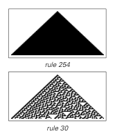
<!-- ORIGINAL_FIGURES page=0847 end -->

事实上，对任何系统来说都是如此。但作为实践问题，当用目的来描述系统所做事情，在我们看来比用机制来描述更简单时，我们往往最终就会使用目的来描述。

例如，如果我们能够识别出一个系统总是在试图满足的某个简单约束，我们把它说成该系统的目的并不罕见。事实上，即使在物理系统中的能量最小化，或生物系统中对适应度的自然选择这样的情形中，我们也会这样做，尽管其中并不涉及我们通常认为的任何智能。

因此，我们也许能够把一个系统解释为实现某个目的，并不必然意味着这个系统真的就是以该目的为意图创造的。事实上，仅仅观察该系统，我们最终永远无法确定它是这样。

但我们仍然常常能够猜测。给定某个特定的假定目的，一个可用的潜在准则是：系统在某种意义上不要显得做了太多与该目的无关的额外事情。

例如，看右侧图像时，通常会显得更合理的是：规则 254 可能是为了生成均匀扩展模式而设置的，而不是规则 30。因为虽然规则 30 确实生成这样的模式，它还做了许多看起来与这一目的无关的其他事情。

如果目的在于生成均匀扩展模式，那么看起来更可信的是，上方的元胞自动机才是为这一目的而创造的。

因此，这也许会暗示：如果某个系统在某种意义上恰好是实现给定目的的最小系统，那么人们或许可以判断它就是为该目的而设置的。

但一个直接问题是，在传统工程中，我们通常完全没有接近得到最小系统。然而，似乎可以合理设想，随着技术变得更先进，为给定目的而设置的系统更常会是最小的系统。

作为所有这些的一个例子，考虑一些实现如下目的的元胞自动机：把输入中给定模式的宽度加倍。下一页图中的情形 (a)，是人们可能使用传统工程思想为这一目的构造出的元胞自动机。

但虽然这个元胞自动机似乎没有多少额外事情发生，它以缓慢而顺序的方式运行，而且它的底层规则远非最小。

[[PDF page 848]]

<!-- ORIGINAL_FIGURES page=0848 start -->
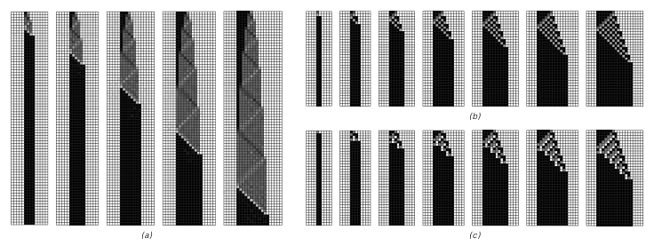
<!-- ORIGINAL_FIGURES page=0848 end -->

因为情形 (b) 更快地得到结果，实际上是通过并行运作来做到这一点，而且其规则涉及四种可能颜色，而不是六种。

但情形 (b) 真的是实现输入加倍目的的最小元胞自动机吗？仅凭思考，人们也许想不出更好的东西。但如果实际显式搜索所有涉及少于四种颜色的大约 8 万亿条规则，事实证明可以找到 4277 条能工作的三色规则。

面对页的图显示了一些典型例子。每一个至少使用略有不同的方案，但全都实现了把输入加倍的同一目的。然而，它们的运作方式常常看起来比大多数熟悉的人造物复杂得多。事实上，其中一些例子在我们看来也许更像自然中自行出现的系统，而不是人造物。

但关键在于，有了足够先进的技术，人们也许会预期，输入加倍会用某种意义上最优的规则来实现。不同的最优性准则可能导致不同规则，但通常会是面对页上那样的规则，有时还会是具有相当复杂行为的规则。

那么现在的问题是，如果人们只是偶然遇到这样一条规则，是否能够猜出它是为某个目的而创造的？

一些元胞自动机例子，它们可以被看作实现了把输入中给定模式的宽度加倍这一目的。规则 (a) 涉及 6 种颜色，并以顺序方式工作，很像典型传统工程系统可能的方式。规则 (b) 涉及 4 种颜色，并以并行方式工作。规则 (c) 是通过大规模搜索找到的，只涉及 3 种颜色。在所有三色规则中，它生成结果所需步数最少。其规则编号为 5407067979。

[[PDF page 849]]

<!-- ORIGINAL_FIGURES page=0849 start -->
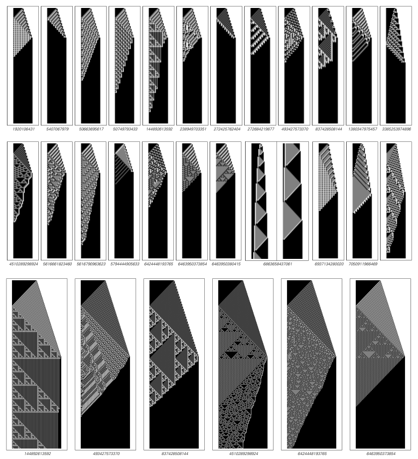
<!-- ORIGINAL_FIGURES page=0849 end -->

一些三色规则例子，它们实现了把输入中给定模式宽度加倍的目的。这些例子取自实际通过穷举搜索所有 7625597484987 条可能三色规则而找到的 4277 条规则。在大多数情形中，生成最终模式所需步数大致随输入宽度线性增加；不过第二行倒数第四条规则的情形中，对于宽度 `n`，步数为 `2 (n^2 - n + 1)`。

[[PDF page 850]]

毕竟，这些规则的行为中有各种特征，原则上都可以表示某个可能目的。但像上一页那些规则的特殊之处在于，它们是在表现输入加倍这一特定特征的最小规则。

一般来说，如果在一个系统的行为中看到某个特征，而随后发现该系统的规则是产生该特征的最小或最优规则，那么这也许会让人觉得，至少在足够先进的技术下，该系统可能确实是专门为表现该特征这一目的而创造的。

计算不可约性意味着，寻找最小或最优规则可以任意困难。然而，给定任何尝试这样做的过程，这个过程当然总有可能只是出现在自然界中，并没有任何目的或智能参与。

事实上，对于我最终用来找到上一页图中元胞自动机规则的那种相当直接的穷举搜索，人们也许会认为这并不是特别不可能。

那么，所有这些对地外智能意味着什么？

从我们自身的发展外推，人们也许会预期，只要有足够先进的技术，构造天文尺度的人造物几乎不可避免，例如可能是以恒星这样的对象为组成部分的巨型机器。

然而，我们并不相信自己曾经见过任何这样的人工物。

但我们怎么能确定？当然，我们的天文观测已经揭示了各种现象，而我们尚未对其中许多现象给出非常令人满意的解释。事实上，就在几个世纪以前，大多数这样的未解释现象通常还会被归因于某种神圣智能。

但在更近的时代，人们几乎普遍假定，它们必定是物理过程的结果，其中并不涉及任何类似智能的东西。

然而，本书中的发现显示，即使这样的物理过程也常常可以对应于至少与我们人类所执行的任何计算同样精巧的计算。

不过我们相信，不知怎么地，我们看到的这些现象都没有任何类似典型人造物的目的感。

[[PDF page 851]]

偶尔，我们确实会看到一些简单几何形状的证据，类似人造物中熟悉的形状，或者从太空可见的地球上的形状。但通常我们对这些现象的解释最终足够短，似乎不给任何类似智能的东西留下空间。而当我们在星云或星系中看到复杂模式时，我们会假定这些模式不可能有目的，尽管它们可能在某种程度上让我们想到人类艺术。

那么，如果我们不识别任何看起来像人造物的对象，那么可能对应于信息的信号又怎样？

如果从遥远处看地球，人类智能最明显的迹象大概会在无线电信号中找到。

事实上，过去人们常常假定，只要能产生无线电信号，就必定需要智能和技术。因此，当 1900 年代早期发现并非人类来源的复杂无线电信号时，最初人们认为它们必定来自地外智能。但最终人们意识到，这些信号其实只是由地球磁层中的效应产生的。

随后在 1960 年代，当脉冲星的强烈且高度规则的信号被发现时，人们也曾短暂认为它们必定来自地外智能。但很快人们意识到，这些信号实际上可以仅由快速旋转中子星磁层中的普通物理过程产生。

那么，来自地外智能的真实信号可能是什么样子？当前人类无线电信号往往以存在清晰确定的载波频率为特征，这实际上对应于几乎完美的小尺度重复。但这种规律性极大降低了信息可以被传输的速率。随着技术进步，所需出现的规律性会越来越少。

但实践中，到目前为止几乎所有严肃的地外智能搜索，都是基于使用射电望远镜寻找具有清晰确定频率的信号。事实上，没有发现这样的信号。但正如我们在第 10 章看到的，即使是嵌套而不是纯重复的信号，也不能仅通过寻找频谱峰值来可靠识别。

[[PDF page 852]]

当然，一般来说，我们从银河系周围及更远处接收到的无线电信号并不少。但关键在于，这些信号通常在我们看来相当随机。通常，这使我们假定它们实际上必定只是由若干简单物理过程之一产生的某种无线电噪声。

但是否可能其中一些信号实际上来自地外智能，而且事实上是有意义的信息？

地外文明之间持续的通信似乎很可能局限在它们需要通信的空间区域，因此大概不会被我们接触到。即使这类通信中的某些信号被广播出来，我猜它们也基本不会表现出可检测规律。因为任何这样的规律在某种意义上都代表冗余或低效，而发送者和接收者都使用适当数据压缩时，这种冗余或低效可以被去除。

但如果存在一些灯塔，旨在即使人们事先不知道它们在那里也能被注意到，那么它们产生的信号就必然必须具有可识别的区分特征，从而具有至少能被其潜在使用者检测到的规律性。

所以也许问题只是，我们人类拥有的感知和分析方法不够强大。也许只要找到合适的新方法，我们就会突然清楚地看到，我们以为是随机无线电噪声的一些东西，实际上是地外智能设置的灯塔输出。

因为正如我们在第 10 章看到的，我们目前使用的大多数感知和分析方法，一般所能做的几乎只是不超过识别重复，有时识别嵌套。然而在本书过程中，我们已经看到大量例子：在我们看来相当随机的数据，事实上可以由非常简单的底层规则产生。

虽然我对此多少有些怀疑，但当然可以想象，如果把规则 30 的中列或 `π` 的数字序列这样的数据展示给某个地外生命，它们会立刻能够推导出能产生这些数据的简单规则。

但即使在某个时候，我们发现所探测到的一些看似随机的无线电噪声可以由简单规则生成，这对地外智能又意味着什么？

[[PDF page 853]]

在许多方面，规则越简单，它们看起来也许越可能与普通物理过程相关，而不涉及任何类似智能的东西。

然而，正如我们上面讨论过的，如果人们能够实际确定某个给定情形中使用的规则是可能的最简单规则，那么这也许会暗示它们以某种方式被有目的地设置了。但在实践中，如果只是接收一个信号，人们通常没有办法判断所有可能产生它的规则中，实际上使用的是哪一个。

那么，是否存在某种可以发送的信号，能够毫不含糊地传达智能的存在？

过去，人们也许会认为，只要信号的产生涉及精巧计算就足够了。但本书中的发现已经清楚表明，事实上，这类计算在各种并不显示任何我们通常会认为是智能的系统中相当常见。

事实上，似乎很可能，例如恒星周围气体中的流体湍流这样的普通物理过程，会相当迅速地完成比按大多数衡量标准人类整个思想史中曾完成的计算还要多的计算。

在关于地外智能的讨论中，人们常常声称，数学构造，例如素数序列，会以某种方式充当智能的普遍标志。

但从本书的结果来看，很清楚这并不正确。

因为虽然过去看起来似乎只有使用智能才能生成素数，但我们现在知道，所需的相当直接的计算事实上可以由范围极其广泛的不同系统完成，而且并没有明显需要智能。

尽管如此，人们也许仍会想象，任何足够先进的智能都会以某种方式至少认为素数重要。

但在这里，我同样不认为这是正确的。因为即使当前人类技术，也很少依赖关于素数的思想。我也相当确信，不能从素数碰巧在当代人类数学中流行这一事实推导出多少东西。

因为尽管数学以一般性著称，我在上一节已详细论证过，我们人类历史上发展出的整个数学领域，最终只覆盖了可能事物中极小的一部分；

[[PDF page 854]]

尤其遗漏了我在本书中研究的大多数系统。

如果识别出某个在许多可能系统中都常见的特征，例如重复或嵌套，那么这个特征就不可避免地不仅会在涉及智能或数学时出现，也会在自然中自行出现的各种系统中出现。

那么，尝试设置一个能够证明自己以某种方式为某个目的而创造的信号，又怎样？我在上面论证过，如果一个系统的规则已经尽可能简单，那么这也许暗示目的的存在。但这种准则依赖于看到的不只是信号，还包括信号产生的机制。

那么单独一个信号又怎样？人们也许会想象，可以设置某种东西，例如一个困难数学问题的解，它可以用约束或目的很容易地描述，却很难用显式机制来解释。

但在某种意义上，这样的东西不可能存在。因为给定一个约束，原则上总可以很简单地设置一个穷举搜索，作为寻找满足该约束之物的机制。

不过，这仍可能需要大量计算工作。但我们不能仅用这一点作为准则。因为正如我们已经看到的，许多自然中自行出现的系统，最终事实上完成了比我们为某个目的而显式设置的典型系统更多的计算。

那么，即使我们无法找到抽象方式来证明目的或智能，能否利用发送者和接收者都存在于同一个物理宇宙中这一实践事实？人们是否可以使用例如天文学、物理学或化学中的实际数据表示作为信号？

正如我前面讨论过的，表示越直接，普通物理过程就越容易产生它，智能迹象也就越少；正如例如照片基本上只通过投射光线就能产生，而图解或绘画则需要更多东西。

但只要涉及对数据的解释，结果就会变得非常难以识别。因为不同形式的感知、不同经验和语境，会导致极为不同的特征被强调。

[[PDF page 855]]

因此，例如我们能够很容易地识别石器时代人类洞穴绘画中的动物图像，很大程度上依赖于这样一个事实：我们的视觉系统仍然提取同样的具体特征。

但更抽象的艺术又怎样？

虽然人们感觉它涉及更多人类输入，但要判断什么是有目的地创造出来的，会迅速变得极其困难。例如，如果看到一片颜料泼溅，没有详细的文化背景和语境，几乎不可能知道它是否意在成为有目的的艺术。

那么，所有这些对地外智能意味着什么？

我的主要结论与第 10 章中关于人工智能的结论相当类似：基本问题不是找到执行足够精巧计算的系统，而是找到那些细节碰巧与我们人类足够相似，以至于我们能够把它们所做的事情识别为显示智能的系统。

这里或许与一开始识别精巧计算能力有某种类比。因为虽然这种能力无疑在例如元胞自动机中非常常见，但最直接暗示它存在的，是像规则 110 这样的第 4 类系统；它们实际上碰巧以一种至少有些类似我们人类习惯进行计算的方式来进行计算。

那么，我们是否应当预期，某种可识别的地外智能会以几个百分点的水平出现，就像第 4 类系统那样？

智能现象显然还不止于此。但如果我们要求某种东西遵循我们人类太多细节，就已经有证据表明它并不存在。因为如果这样的智能过去曾经出现过，那么从我们自身历史外推，我们会预期其中一些早已殖民我们的星系，至少以信号方式，如果不是以物理对象方式。

但我怀疑，如果我们哪怕只是相当温和地泛化智能定义，就会找到一些例子，至少在有足够强大的感知和分析方法时会如此。然而，它们的行为很可能在某些方面与人类智能古怪地不同，就像本书中许多简单程序与人类数学和科学传统上研究的系统古怪地不同一样。

[[PDF page 856]]

## 技术方面的含义

我在本书中的主要目的，是建立一种新的基础科学。但我预期，随着时间推移，我所做的工作也会对技术产生许多影响。毫无疑问，特定结果和思想会有各种具体应用。但从长远看，最重要的后果大概是引入范围极其广泛的新系统和新过程，可用于技术。

事实上，本书揭示的一件事情是，传统工程实际上只考虑了原则上可能存在的所有系统和过程类型中极小且相当不具代表性的一部分。

原因想必正如我在本书中多次提到的：传统工程的整个方法论倾向于基于设置这样的系统，即其行为足够简单，几乎每个方面总能很容易预测。但这样做立刻排除了我在本书中研究的许多系统，也排除了自然界中出现的许多系统。毫无疑问，这就是为什么工程创造的系统过去通常最终看起来比自然界中的典型系统简单得多。

按照传统直觉，人们通常假定，要创造显示更高复杂度的系统，唯一办法就是以某种方式把这种复杂性内置进其底层规则。

但本书的核心发现之一是，情况并非如此。事实上，即使底层规则极其简单的系统，也完全可能产生具有巨大复杂性的行为，而且看起来就像人们在自然界中看到的东西。

我相信，如果使用这样的系统，范围极其广泛的新技术几乎不可避免地会成为可能。

有些地方，单纯从简单规则产生复杂性的抽象能力已经很重要。第 10 章讨论的密码学就是一个例子。其他例子包括各种实际过程：其中通过使用随机性来避免偏差或僵局，或者其中人们想生成某种对对手而言过于复杂、无法预测的行为。

[[PDF page 857]]

能够产生甚至只是大致类似自然中所见的复杂性，也会产生直接后果，例如生成逼真纹理和计算机图形，或者制作我们抽象感知为具有自然中熟悉特征的艺术图像。

计算不可约性现象意味着，要弄清楚某个具有复杂行为的特定系统会做什么，可能需要显式模拟，而这种模拟涉及不可约数量的计算工作。但作为实践问题，如果人们能够建立一个基于足够简单规则的模型，那么即使面对自然中某个显示复杂行为的系统，也更有可能设计并构造出能够工作的控制装置。

那么计算机又怎样？虽然所用组件已经从真空管转向半导体，但半个世纪以来，计算机运行所遵循的基本规则变化很小。

但计算等价原理意味着，实际上有范围极其广泛、非常不同的规则，都会导致完全相同的计算能力，因此原则上全都可以作为制造计算机的基础。

传统直觉表明，要能够进行精巧计算，就不可避免地需要一个底层规则复杂的系统。但我在本书中显示，情况并非如此。事实上，即使规则极其简单的系统，例如规则 110 元胞自动机，也常常可以是通用的，因此能够进行与任何其他系统同样精巧的计算。

底层规则可以如此简单这一事实，极大扩展了现实中可用于实现它们的组件类型。因为虽然某个简单化学过程不太可能成功地从原子组装出一台传统计算机，但为类似规则 110 元胞自动机这样的东西做到这一点，似乎相当可能。

事实上，似乎很可能可以设置这样一个系统，其中仅一个或少数几个原子就对应于类似元胞自动机系统中的一个元胞。这意味着，进行计算随后几乎直接转化为用原子建造实际物理结构。

[[PDF page 858]]

过去，生物学以及其中 DNA、蛋白质、核糖体等等所有细节，是我们唯一拥有的原子尺度可编程构造例子。但本书中的发现表明，还有远为简单的系统也可用于此。

事实上，我猜测，在生命系统中看到的各种精巧结构的基本特征，实际上都能用极其简单的规则重现；这例如会使技术有可能修复或替换范围全新的生物组织和器官功能。

但给定某种也许复杂的行为，怎样找到能够生成它的规则？传统工程方法如果能工作，几乎不可避免地会给出实际上至少与所要得到的行为同样复杂的规则。

乍看之下，生物学通过不断对遗传程序做随机修改，然后施加自然选择，似乎做得更好。但虽然这一过程确实经常产生具有复杂行为的程序，我在本书前面论证过，它通常并不能塑造这种行为中除了相当简单方面之外的东西。

那么人们能做什么？偶尔，某种迭代搜索或定向搜索可能会奏效。但以我的经验，简单程序可能发生的不同且出人意料的事情实在太多，以至于最终找到自己想要的东西的唯一办法，本质上就是对所有可能性做穷举搜索。

以今天的计算机，人们已经常常能够考察数万亿个情形，如第 833 页所示。虽然这足以看到极其广泛的行为，但并不能保证事实上一定会遇到自己正在寻找的任何特定特征。

然而，在某种意义上，这是一个熟悉的问题。尤其在许多技术分支的早期历史中，人们最终都会在自然界中寻找服务于特定目的的成分或系统，无论是为了制造灯泡灯丝还是药物。在某种意义上，这里的唯一区别是，在简单程序的抽象世界中进行搜索会变得更加系统。

[[PDF page 859]]

但是，虽然传统工程对于它所考虑的有限类型系统通常最终找到了避免搜索的方法，计算不可约性现象却使得这样一点不可避免：如果考虑所有可能的简单程序，那么寻找特定行为形式可能需要进行包含不可约大量计算工作的搜索。

在某种意义上，这意味着，如果人们试图直接产生特定技术部件，潜在地总可能陷入停滞。所以在实践中，更好的方法往往实际上只是做基础科学；就像我在本书中所做的那样，尝试建立关于各种简单程序怎样行动的一套抽象知识。

例如在化学中，人们也许会先研究各种不同物质行为的基础科学。但一旦发展出一个结果库，人们随后就能挑出可能与某个特定技术目的相关的物质。

我相信，简单程序也会发生非常类似的事情。事实上，以我的经验，令人惊讶的是，即使像规则 90 和规则 30 这样的初等元胞自动机，也常常能以这样或那样的方式应用于技术情形。

一般来说，可以把技术看作试图获取自然界或其他地方存在的系统，并驾驭它们来实现人类目的。但历史表明，如果没有先看到至少某种实现该目的的东西，甚至想象一个目的本身也常常很困难。

事实上，当前大量技术最终都基于试图设置我们自己的系统，以模拟我们注意到存在于普通生物系统或物理系统中的特征。

但不可避免地，我们倾向于只注意那些以某种方式适合我们所用整个概念框架的特征。而只要这个框架哪怕只是隐含地基于传统科学，它就会倾向于错过我在本书中讨论的许多东西。

因此，在未来几十年里，当本书中的科学被吸收之后，我预期它不仅会提示许多实现既有技术目的的新方法，也会提示许多技术可以处理的新目的。

[[PDF page 860]]

## 历史视角

如果科学能够证明我们人类在某种根本意义上是特殊的，并且高于宇宙中的一切，那将会非常令人满意。但如果考察科学史，许多最伟大的进展恰恰来自识别我们并不特殊的方式；因为正是这一点让科学能够对宇宙以及其中事物作出越来越一般的陈述。

四个世纪前，例如我们知道了自己的行星并不处在宇宙中的特殊位置。一个半世纪前，我们知道了我们物种的起源并没有什么非常特殊之处。在过去一个世纪里，我们知道了我们的各种物理、化学和其他组成部分并没有什么特殊之处。

然而，在西方思想中，仍有一种强烈信念，认为我们必定有某种根本特殊之处。而今天最常见的假定是，这种特殊性必定与我们所表现出的智能水平或复杂性水平有关。但基于我在本书中发现的东西，计算等价原理现在作出了一个相当惊人的陈述：即使在这些方面，我们也没有什么根本特殊之处。

因为如果以计算术语思考，问题本质上是我们是否以某种方式显示出特别高的计算精巧程度。然而，计算等价原理断言，几乎任何行为并不显然简单的系统，在其计算精巧程度上都会倾向于完全等价。

因此，这意味着归根到底，人类所达到的计算精巧程度，与自然界和其他地方各种系统所达到的计算精巧程度之间没有差别。

因为我的发现意味着，无论底层系统是人脑、湍流流体还是元胞自动机，它表现出的行为都将对应于精巧程度等价的计算。

从现代思想的角度看，这也许相当令人震惊，但在日常经验层面上，它也许并不那么令人惊讶。因为自然界中当然有许多系统，其行为复杂到我们常常用人类术语描述它。

[[PDF page 861]]

事实上，在早期人类思想中，泛灵论的观念很常见：自然中具有复杂行为的系统必定由与人类同类的某种本质精神驱动。

但几千年来，这一直被看作幼稚并且与科学进步相悖。然而现在，通过本书中的发现并以计算术语来看，本质上这一思想又显现为关键。因为正如我在本章前面讨论的，正是我们作为观察者与我们所观察自然系统之间的计算等价性，使这些系统在我们看来如此复杂而不可预测。

过去，人们常常假定这种复杂性必定以某种方式为自然系统所特有。但我的发现和计算等价原理现在显示，事实上它远为一般。因为本书中我们已经看到，即使底层规则几乎尽可能简单，像元胞自动机这样的抽象系统也能达到与任何其他事物完全相同的计算精巧程度。

发现我们人类实际上在计算上并不比具有非常简单规则的元胞自动机更有能力，也许有点令人谦卑。但计算等价原理还意味着，同样的事情最终也适用于我们的整个宇宙。

因此，虽然科学常常使我们人类看起来与宇宙相比不知怎地微不足道，计算等价原理现在显示，在某种意义上，我们与宇宙处在同一层级。因为该原理意味着，我们内部发生的事情最终能够达到与整个宇宙完全相同的计算精巧程度。

然而，虽然过去科学已经显示，在许多方面我们人类并没有什么特殊之处，科学本身的成功却倾向于让我们产生这样一种观念：凭借我们的智能，我们以某种方式高于宇宙。但现在，计算等价原理意味着，我们智能的计算精巧程度在某种意义上应当由宇宙中的许多部分共享；这个想法也许更像来自宗教而不是科学。

特别是随着科学取得各种成功，人们强烈希望以抽象科学术语捕捉人类境况的本质。

[[PDF page 862]]

随着用技术复制这种境况开始显得现实，这一点变得更加相关。但计算等价原理表明，抽象描述最终永远不会把我们与自然界和其他地方的各种系统区分开来。这意味着，在某种意义上，不可能存在关于人类境况的抽象基础科学；只能存在某种涉及人类及其历史各种具体细节的东西。

因此，虽然我们也许曾经想象，科学最终会向我们展示怎样超越所有人类细节，但我们现在看到，事实上这些细节实际上是关于我们的唯一重要之处。

事实上，在某个层面上，正是计算等价原理使这些细节能够重要。因为它导致了计算不可约性现象。而这反过来实际上使历史能够重要，并意味着一个系统的演化可以达成某种不可约的东西。

考察历史上科学的进展，人们也许会假定，一切终究以某种方式被科学预测，只是时间问题。但计算等价原理以及计算不可约性现象现在显示，这永远不会发生。

总会有一些细节可以进一步被约化，从而允许科学继续显示进步。但我们现在知道，科学和知识存在一些根本边界。

事实上，归根到底，计算等价原理同时概括了科学的终极力量和终极弱点。因为它意味着，我们宇宙中的一切奇迹实际上都可以由简单规则捕捉；但它也显示，除了实际上观看并看看这些规则怎样展开之外，不可能有任何方式知道这些规则的全部后果。
