# 注释

[[PDF page 865]]

## 通用说明

- 网站。与本书及这些注释相关的大量补充材料，将逐步通过网站 `www.wolframscience.com` 提供。（另见本书开头的版权页。）

- 这些注释的作用。这些注释中的材料旨在补充正文，并不总是独立自足。因此，重要的是把这些注释与它们所对应的正文各节并行阅读，因为某些必要要点可能只在正文中给出。正文中图像的图注也常常包含这些注释中不再重复的细节。

- 写作风格。本书并不容易写，尤其因为它包含许多用平实语言呈现的复杂思想论证。为了尽可能让这些论证易于理解，我不得不采用一些修辞手段。对有文字编辑倾向的人来说，也许最恼人的是我偏爱用连词开头写句子。我这样做的主要原因，是为了打断那些否则会极长的句子。因为我提出的要点往往足够复杂，需要相当长的解释。为了让我所写内容比例如典型经典哲学著作更易读，我把这些解释拆成几个句子，而每个句子开头必然会有连词。另一个可能让一些人恼火的地方，是我广泛使用短段落。在正文中，我通常遵循这样一个原则：任何段落都只传达一个基本思想。我的希望是，读者读完每段后会停顿片刻，吸收这一思想，然后再继续下一段。（本书引入了我在出版物中使用的第三种主要不同写作风格。第一种是我为科学论文发展出来的；第二种用于《Mathematica Book》这样的文档。）

- 十亿。按照标准美式用法，本书中的 billion 表示 `10^9`，trillion 表示 `10^12`，依此类推。

- 清晰与谦逊。有一种常见的低调科学写作风格，我曾经是它的忠诚信奉者。但在某个时候我发现，如果以这种风格呈现，更重要的结果通常会变得难以理解。因为如果人们不能现实地理解某件事有多重要，就很难安置或吸收它。因此，在写本书时，我选择直截了当地解释我相信自己的各种结果具有怎样的重要性。也许我可以通过更多表现谦逊来避免一些批评，但代价会是清晰度大幅降低。

- 解释思想。在像本书这样呈现重大新思想时，存在一种取舍：是尝试直接按思想本身解释它们，还是使用以往思想来提供语境。对某些读者来说，引用以往思想并讨论它们在何种程度上正确或错误，会有明确的短期好处。但对另一些读者来说，这种方式可能只会引入混乱。而随着时间推移，典型读者所知道的思想也会改变。因此，为了让本书尽可能广泛地可理解，我在正文中大多尽量直接讨论思想；但随后在这些注释中概述其历史语境。正文中我偶尔确实会提到既有思想，尽管我尽力避免那些我预期几年内不会被广泛记住的时尚潮流。在全书中，我的主要目标是解释新思想，而不是批评过去的思想。有时清晰性要求我明确说过去某件事是错的，但一般我会避免这样做，而宁愿只是陈述我现在相信为真的东西。毫无疑问，本书会激怒一些人的思想，因为其结果与他们的思想不一致；但尽管我很想避免这一点，现实中我不可能仅通过呈现自己发现的方式来避免。

- 技术引用。为了尽量使本书正文经得起时间考验，我通常避免引用那些我预期会随着技术进步而改变性质或名称的日常系统。不过不可避免地，我确实讨论计算机，尽管我完全预期，我与计算机相关使用的一些术语和概念，在几十年内最终会显得过时。

[[PDF page 866]]

- 奇趣性。元胞自动机以及本书中的大多数其他系统，都很容易产生各种有趣甚至俏皮的描述。例如，规则 30 元胞自动机可以这样描述。想象一个坐满人的体育场，每个人有两张卡片：一张黑色，一张白色。让最上排座位中间的人举起黑卡片，让该排其他所有人举起白卡片。然后，每一后续排中的每一个后续人，都通过观察正上方的人以及正上方左、右相邻的人，并应用第 27 页上的简单规则，来决定自己举起哪种颜色的卡片。体育场的一张照片随后就会显示规则 30 产生的图案。这样的描述也许会让抽象系统看起来与至少人为的日常情形更有联系，但如果目标是像本书这样专注于基本思想，那么以我的经验，这类俏皮性通常只是很大的干扰。

- 写作时间线。我从 1991 年 6 月开始，到 2002 年 1 月结束，断断续续很少，花了略多于十年时间写作本书。各章大致写作时间如下：第 1 章：1991、1999、2001；第 2 章：1991-1992；第 3 章：1992；第 4 章：1992-1993；第 5 章：1993；第 6 章：1992-1993；第 7 章：1994-1996；第 8 章：1994-1995、1997；第 9 章：1995-1998、2001；第 10 章：1998-1999；第 11 章：1995；第 12 章：1999-2001。某些章节中的一些节（通常是较晚的章节）是在其余部分之后很久才加入的。这些注释有时也是在对应章节正文之后很久才写成的。

- 识别新材料。本书中绝大多数结果以前从未以出版形式出现过。不过，有少数结果曾隐含或明确地包含在我 1980 年代早期的出版物中（见第 881 页）。凡是我知道正文中重要材料有前身的地方，我都在注释中指出。在注释本身内部，那些没有历史讨论、也没有“已知”之类表述的结果，通常都是本书的新结果。寻求进一步信息的研究者应查阅本书网站。

- 引文和参考文献。在发展本书所描述思想的过程中，我查阅了数千本书、论文和网站，并与数百人互动（见第 xiii 页）。但我没有试图给出一张巨大的具体参考文献列表，而是在这些注释中加入了追溯关键贡献的历史信息。根据我提到的概念名和人名，可以很容易地做网络或数据库搜索，得到远比一本可管理篇幅的书中可能容纳的参考文献更完整的图景；而若要不凭巨大考据就正确创建这样的图景，也是不可能的。注意，虽然当代大多数科学作品倾向于主要只引用很近的材料，本书却常常引用数百年甚至数千年前的材料，在某些方面更接近哲学等领域的传统。

- 历史注释。我在本书中加入大量历史注释，部分是出于对既往工作的尊重，部分是为了给思想提供语境（并看出当前信念怎样成为现在这个样子），也部分是因为人们理解事物时经历的步骤，可能会追踪历史上曾经经历的步骤。在本书中，我关于某个领域的结论常常从根本上不同于传统看法；为了确认自己的理解，研究历史并看出我所得结论过去是怎样被错过的，对我一直很重要。本书中我对科学的讨论通常相当精确，除其他东西外，它基于容易重现的计算机实验。但我对历史的讨论不可避免地不那么精确。虽然我已花费相当大努力确保其主要元素正确，最终的客观确认通常仍不可能。我一直尽量阅读原始著作，因为我常发现后来的刻画会删去对我的目的至关重要的元素，或者为简化教学而重塑历史。但即使对于相关人物仍然在世的历史片段，也往往没有原始书面记录，使我不得不依赖二手来源和私人访谈中提取的回忆，而这些不可避免地会受到后来思想和理解的影响。并且，虽然经过足够努力，通常可以给科学中的基本思想作出相当简单的解释，但其历史却未必如此。观察本书的历史注释，一个引人注意的特征是，经常提到名声很大的人，但不是因为他们通常出名的原因。也许部分解释是：现在可以看出对我所处理基础问题作出贡献的大多数人，都足够有能力在某些事情上取得成功；但如果没有本书的整个语境，他们倾向于把我讨论的这类结果主要看作奇闻，因此从未试图对它们做太多事情。注意，在把人物与思想和结果联系起来时，我尽量集中于那些在我的目的下似乎作出最本质贡献的人，即使这并不完全符合特定学术领域的传统或标准。

[[PDF page 867]]

<!-- ORIGINAL_FIGURES page=0867 start -->
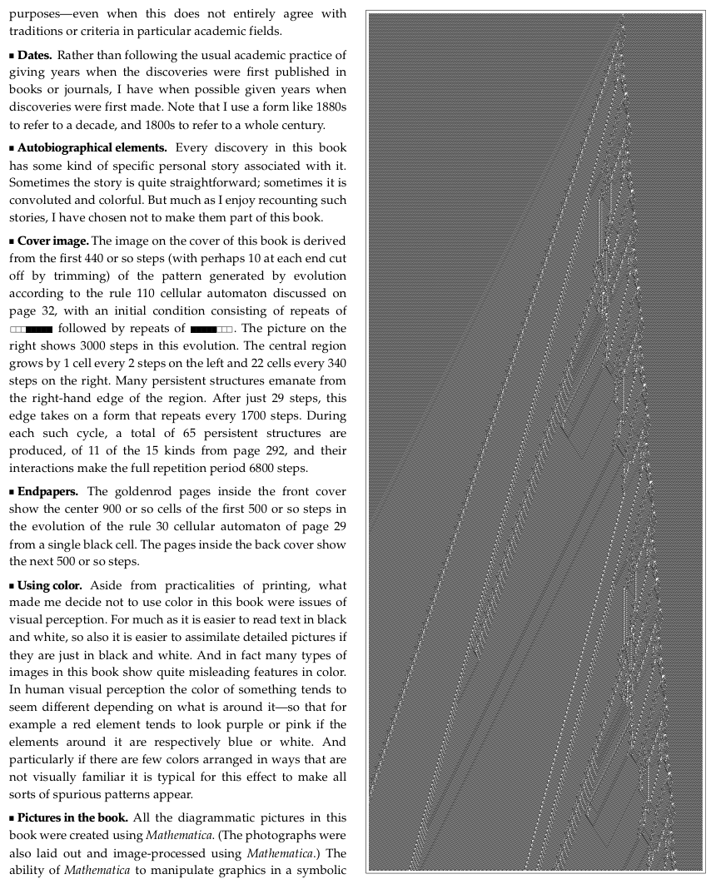
<!-- ORIGINAL_FIGURES page=0867 end -->

- 日期。通常的学术做法是给出发现首次在书籍或期刊中发表的年份；与此不同，我在可能时给出发现首次被作出的年份。注意，我用 `1880s` 这样的形式指一个十年，用 `1800s` 指整个世纪。

- 自传性元素。本书中的每个发现都有某种与之相关的具体个人故事。有时故事相当直接；有时则曲折而丰富。尽管我很喜欢讲述这样的故事，我还是选择不让它们成为本书的一部分。

- 封面图像。本书封面图像来自按第 32 页讨论的规则 110 元胞自动机演化产生的图案的最初约 440 步（两端可能各裁掉约 10 步）；初始条件由一段重复序列后接另一段重复序列组成。右侧图显示了这次演化的 3000 步。中心区域左侧每 2 步增长 1 个元胞，右侧每 340 步增长 22 个元胞。许多持久结构从该区域右侧边缘发出。仅 29 步后，这个边缘就呈现出每 1700 步重复一次的形式。在每个这样的周期中，总共产生 65 个持久结构，属于第 292 页 15 种结构中的 11 种；它们的相互作用使完整重复周期达到 6800 步。

- 环衬。前封面内侧的金黄色页面显示的是第 29 页规则 30 元胞自动机从单个黑色元胞出发演化的最初约 500 步中，中间约 900 个元胞。后封面内侧页面显示的是接下来的约 500 步。

- 色彩使用。除了印刷的实际问题之外，让我决定不在本书中使用彩色的，是视觉感知方面的问题。正如黑白文字更容易阅读，细节丰富的图像如果只是黑白，也更容易吸收。事实上，本书中许多类型的图像如果使用彩色，会显示出相当误导性的特征。在人类视觉感知中，某物的颜色往往会随其周围事物而显得不同；例如，如果周围元素分别为蓝色或白色，红色元素往往会看起来偏紫或偏粉。特别是如果颜色很少，并以视觉上不熟悉的方式排列，这种效应通常会让各种伪模式出现。

- 本书中的图像。本书中所有图解式图像都是用 Mathematica 创建的。（照片也使用 Mathematica 进行排版和图像处理。）Mathematica 以符号方式操作图形的能力至关重要，最终正是它使本书能够拥有如此多精巧图像。

[[PDF page 868]]

对于熟悉书籍版式的人来说，我能够包含如此多形状和尺寸各异的图像，而不必诉诸图号这样的装置，也许显得令人惊讶。事实上，要做到这一点需要解决无数小几何谜题。但最终使它成为可能的是，生成图像的 Mathematica 程序几乎总是足够一般，因此我可以很直接地得到例如不同元胞数或步数的图像。

- 断字。本书文本的一个不同寻常特征是，它几乎从不使用断字；至少对我来说，看到计算机上这么多自动换行文本之后，断字已经显得是一种丑陋且误导性的装置。

- 图书制作系统。除了实际内容之外，本书的制作是一个高度复杂的过程，它依赖我公司在过去十五年中为软件发布发展出来的方法论。如果我现在才开始写这本书，我很可能会直接在 Mathematica 和 Publicon 中完成全部写作。但十年前，我决定用 FrameMaker 撰写本书全部原始源文件。随后，这些源文件通过一个精巧的自动化过程处理，很像标准软件构建。第一步是把完整源文件的 MIF 版本转换成一个 Mathematica 符号表达式。然后在 Mathematica 内部，对这个表达式进行各种变换和测试；例如这些注释中的每个程序都使用类似 Mathematica `StandardForm` 的规则来格式化并换行。所得符号表达式随后再转换回 MIF，在 FrameMaker 中排版，并自动输出为 PDF。（注意，程序中的特殊字符使用专为本书创建的新 Mathematica-Sans 字体渲染。）（另见本书最后的版权页说明。）

- 印刷。本书中的许多图像具有与通常印刷品很不相同的性质。因为不同于由可见独立元素构成的传统图表，或者包含平滑色彩渐变的照片，它们常常例如每英寸包含数百个元胞，每个元胞实际上独立地为黑色或白色。要恰当地捕捉这一点，需要在足够光滑、能避免显著油墨扩散的纸张上进行仔细的单张纸印刷。（另见本书最后的版权页说明。）

- 索引。在本书索引中，我试图同时照顾已经仔细读过本书的人和还没有读过的人。我的做法通常是包含任何在思考某个主题，或回忆本书关于该主题所说内容时，现实中可能浮现在脑海中的术语。这意味着，即使本书只是顺带提到某个术语，只要我出于某种原因认为它对具有某些经验或兴趣的人可能容易记住，我也倾向于把它列入。注意，查找与某个问题相关使用的 Mathematica 函数，常常是识别相关问题的好方法。在实际构建本书索引时，排序、处理和检查都使用各种自动化 Mathematica 过程完成，它们作用于本书全文和索引的符号表示。通常可以通过阅读索引识别一本书中的重要问题。这里在某种程度上也可以，尽管更多子条目的出现常常只是反映材料分布更分散，而不代表更重要。

- 索引中的人物。不同文化和历史时期对人名的约定差异很大。我在索引中尽量以这些姓名可能出现在现代美国标准化文件中的形式给出所有姓名。对于非拉丁字符集，我使用标准转写。我完整给出我认为某个人最常使用或曾最常使用的名字；对于其他名字（包括例如俄语父称），我只给首字母。我通常给出名字的正式形式；不过对于我亲自认识的人，我在正文中给出我通常称呼他们时会使用的名字形式。我去掉所有尊称或头衔，除非它们会显著改变姓名。若一个姓名有多个版本，我通常使用最接近我所提工作发生时期的那个版本。对于索引中的每个人，我列出他主要工作的国家或地区。注意，这不一定反映此人出生、受教育、服兵役或去世的地方。相反，它试图指出此人大部分工作发生的地方，特别是与本书相关的工作。我通常使用最接近当代对应物的国家或地区名称，仿佛它们会出现在邮政地址中。边界发生变化时，我倾向于采用其语言为此人通常所说或曾说语言的国家。我通常按一个人在其中工作的顺序列出国家，忽略重复。注意，虽然列出的许多人很有名，但要追踪其中相当一部分人，需要大量研究（常常通过私人联系，以及机构和政府记录）。（对于在本书写作完成后的 2002 年 1 月之后去世的人，显然不包含结束日期。）

[[PDF page 869]]

- 记号。在正文中，我几乎完全避免任何正式符号记法，通常依赖图解式图像。但在这些注释中，常常方便使用这种记法，以便对对象和操作给出精确而紧凑的表示。过去，理论科学中基本上唯一可用的大规模记法是传统数学记法。但仅靠它对我帮助不大，因为我不仅需要表示传统数学，还需要表示更一般的规则和程序，以及过程和算法。我创建 Mathematica 语言的原因之一，正是为了提供一种远为一般的记法。因此，在这些注释中，我始终使用这种语言作为记法。这有许多重要优点；事实上，很难想象如果没有它，我还能写出这些注释。一个要点是，它完全统一且标准化：关于某段特定记法的含义，永远不可能有隐藏假设或歧义，因为它最终由实际的 Mathematica 软件系统及其文档定义（见下文）。在某个东西存在传统数学记法的情形中，对应的 Mathematica 记法通常几乎相同，尽管偶尔会改变一些细节以避免歧义。不过，一切都是符号表达式这一概念，使 Mathematica 记法能够表示本质上任何类型的抽象对象。而在涉及过程和算法时，Mathematica 语言中的原语被选择为让典型步骤易于表示，结果是一行 Mathematica 常常能捕捉原本需要许多段英文文本以及大量伪代码或较低级计算机语言代码才能表达的内容。Mathematica 记法的另一个非常重要的实践特征是，如今已有大量人熟悉它，当然比例如熟悉数学逻辑中精巧传统记法的人更多。Mathematica 记法最后一个至关重要的优点是，人们不仅可以读它，还可以真正在计算机上执行它并与之互动。这使它既更容易被应用和扩展，也更容易分析和理解。

- Mathematica。我创建 Mathematica，是为了使它成为面向一般计算、尤其是技术计算的集成语言和环境。自 1988 年发布以来，Mathematica 已经在科学、技术、教育及其他领域得到非常广泛的使用。（现在它也越来越多地作为组件用于其他软件系统内部。）Mathematica 由 Wolfram Research 提供，适用于所有标准计算机系统；关于它的更多信息可以在网上找到，特别是 `www.wolfram.com`。关于 Mathematica 有许多书，最早的一本是我的《The Mathematica Book》。

Mathematica 的核心是它的语言，它基于符号编程概念。该语言支持大多数传统编程范式，但用我为它发展出的符号编程思想对这些范式作了相当大的推广。近些年，Mathematica 的语言组件开始越来越多地用于技术计算领域之外的各种应用；而作为整体，Mathematica 传统上在技术计算中使用最广。

这些注释中的程序是为 Mathematica 4.1（2000 年发布）创建的。它们应当无需任何修改即可在所有后续 Mathematica 版本中运行，其中大多数也可在早期版本中运行，一直回溯到 Mathematica 1（1988 年发布）或 Mathematica 2（1990 年发布）。大多数程序只需要 Mathematica 的语言组件，而不需要其数学知识库，因此应当能在所有由 Mathematica 驱动并启用语言能力的软件系统中运行。

以下是本书注释中使用的一些基本 Mathematica 构造怎样工作的例子：

迭代：

```text
Nest[f, x, 3] -> f[f[f[x]]]
NestList[f, x, 3] -> {x, f[x], f[f[x]], f[f[f[x]]]}
Fold[f, x, {1, 2}] -> f[f[x, 1], 2]
FoldList[f, x, {1, 2}] -> {x, f[x, 1], f[f[x, 1], 2]}
```

函数式操作：

```text
Function[x, x + k][a] -> a + k
(# + k &)[a] -> a + k
(r[#1] + s[#2] &)[a, b] -> r[a] + s[b]
Map[f, {a, b, c}] -> {f[a], f[b], f[c]}
Apply[f, {a, b, c}] -> f[a, b, c]
Select[{1, 2, 3, 4, 5}, EvenQ] -> {2, 4}
MapIndexed[f, {a, b, c}] -> {f[a, {1}], f[b, {2}], f[c, {3}]}
```

列表操作：

```text
{a, b, c, d}[[3]] -> c
{a, b, c, d}[[{2, 4, 3, 2}]] -> {b, d, c, b}
Take[{a, b, c, d, e}, 2] -> {a, b}
Drop[{a, b, c, d, e}, -2] -> {a, b, c}
Rest[{a, b, c, d}] -> {b, c, d}
ReplacePart[{a, b, c, d}, x, 3] -> {a, b, x, d}
Length[{a, b, c}] -> 3
Range[5] -> {1, 2, 3, 4, 5}
Table[f[i], {i, 4}] -> {f[1], f[2], f[3], f[4]}
```

[[PDF page 870]]

<!-- ORIGINAL_FIGURES page=0870 start -->
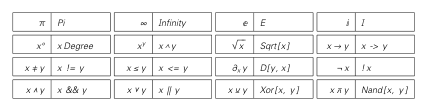
<!-- ORIGINAL_FIGURES page=0870 end -->

```text
Table[f[i, j], {i, 2}, {j, 3}] ->
{{f[1, 1], f[1, 2], f[1, 3]}, {f[2, 1], f[2, 2], f[2, 3]}}
Array[f, {2, 2}] -> {{f[1, 1], f[1, 2]}, {f[2, 1], f[2, 2]}}
Flatten[{{a, b}, {c}, {d, e}}] -> {a, b, c, d, e}
Flatten[{{a, {b, c}}, {{d}, e}}, 1] -> {a, {b, c}, {d}, e}
Partition[{a, b, c, d}, 2, 1] -> {{a, b}, {b, c}, {c, d}}
Split[{a, a, a, b, b, a, a}] -> {{a, a, a}, {b, b}, {a, a}}
ListConvolve[{a, b}, {1, 2, 3, 4, 5}] -> {2 a + b, 3 a + 2 b, 4 a + 3 b, 5 a + 4 b}
Position[{a, b, c, a, a}, a] -> {{1}, {4}, {5}}
RotateLeft[{a, b, c, d, e}, 2] -> {c, d, e, a, b}
Join[{a, b, c}, {d, b}] -> {a, b, c, d, b}
Union[{a, a, c, b, b}] -> {a, b, c}
```

变换规则：

```text
{a, b, c, d} /. b -> p -> {a, p, c, d}
{f[a], f[b], f[c]} /. f[a] -> p -> {p, f[b], f[c]}
{f[a], f[b], f[c]} /. f[x_] -> p[x] -> {p[a], p[b], p[c]}
{f[1], f[b], f[2]} /. f[x_Integer] -> p[x] -> {p[1], f[b], p[2]}
{f[1, 2], f[3], f[4, 5]} /. f[x_, y_] -> x + y -> {3, f[3], 9}
{f[1], g[2], f[2], g[3]} /. f[1] | g[_] -> p -> {p, p, f[2], p}
```

数值函数：

```text
Quotient[207, 10] -> 20
Mod[207, 10] -> 7
Floor[1.45] -> 1
Ceiling[1.45] -> 2
IntegerDigits[13, 2] -> {1, 1, 0, 1}
IntegerDigits[13, 2, 6] -> {0, 0, 1, 1, 0, 1}
DigitCount[13, 2, 1] -> 3
FromDigits[{1, 1, 0, 1}, 2] -> 13
```

这些注释中的 Mathematica 程序以 Mathematica `StandardForm` 格式排版。下表说明如何只用普通键盘字符，在 Mathematica `InputForm` 中输入这些程序：

```text
Pi -> Pi
Infinity -> Infinity
E -> E
I -> I
xDegree -> x Degree
x^y -> x^y
Sqrt[x] -> Sqrt[x]
x -> y -> x -> y
x != y -> x != y
x <= y -> x <= y
D[y, x] -> D[y, x]
!x -> !x
x && y -> x && y
x || y -> x || y
Xor[x, y] -> Xor[x, y]
Nand[x, y] -> Nand[x, y]
```

- 关于程序。与本书阐述的其他方面一样，我已经花费相当大努力，使这些注释中的程序尽可能清晰而简洁。我相信最终程序既适合执行，也适合阅读和研究，必要时甚至不借助计算机也可以。大多数程序只涉及 Mathematica 内置函数，因此无需进一步设置定义即可在 Mathematica 中运行。（不过许多程序包含一些变量，需要在运行前为它们赋值，例如可以使用 `Block[{k = 2}, program]`。当使用辅助函数时，这些函数通常也需要在程序运行前定义，尽管在这些注释中我常常把必要定义显示在程序之后。注意，大多数程序没有显式进行输入检查或生成错误。程序只有偶尔会为了优雅而显著牺牲效率。）理解任何程序的良好第一步，是在几个输入上运行它。Mathematica 语言的符号性质还允许拆解程序，使其各个片段可以分别运行和分析。仔细研究这些注释中的各种程序，应当不仅为实现本书讨论的内容提供良好背景，也为进行任何类型的高级编程提供良好背景。许多程序使用 Mathematica 中可用的若干编程范式，使得用任何较低级语言捕捉它们的本质基本上不可能。注意，一个给定程序本质上总能以许多不同方式用 Mathematica 写出，尽管其他方式常常最终会比这里呈现的方式长得多。关于这些程序的材料应会在本书网站上提供，包括例如用于检查程序的一些自动化测试，以及关于程序怎样工作的注释。

- 计算机实验。本书几乎所有计算机实验都使用 Mathematica 完成，运行在标准工作站级计算机以及后来的 PC 上（最初是 33 MHz 的 NeXTstation，然后是运行 NeXTSTEP 的 100 MHz HP 700，再然后是运行 Windows 95 的 200 MHz P6 PC，最后是运行 Windows 95、后来运行 Windows NT 的 450 MHz、700 MHz 及更快 PC，并配有 Linux 文件服务器）。在项目早期的一些较大搜索中，我编写了通过 MathLink 连接到 Mathematica 的专用 C 程序。（计算机速度提升和 Mathematica 后续版本效率提高，逐渐几乎消除了我对 C 的使用。）在某些情形中，我让程序运行许多天或数周，有时通过 MathLink 分布到我公司网络中的几百台计算机上。到目前为止，我一生中使用过的主要计算机硬件系统是：Elliott 903（1973-1976）；IBM 370（1976-1978）；CDC 7600（1978-1979）；VAX 11/780（1980-1982）；Sun-1、2、Ridge 32（1982-1984）；CM-1（1985）；Sun-3（1985-1988）；SPARC（1988-1991）；NeXT（1991-1994）；HP 700（1995-1996）；PC（1996- ）。主要语言是：汇编语言（1973-1976）；FORTRAN（1976-1979）；C（1979-约 1994）；SMP（1980-1986）；Mathematica（1987- ）。（另见第 899 页。）

[[PDF page 871]]

- 教育问题。本书这种新科学代表了一个独特的教育机会。因为它触及科学中范围极广的重要而引人入胜的日常现象和问题，但理解其关键思想不需要任何先前科学或技术教育。因此，它有现实可能被用作全面介绍科学思想的基础。事实上，一旦理解了它的基本元素，理解传统科学的许多方面，并看出它们怎样适合整个知识框架，就会容易得多。

起初，毫无疑问会有一种倾向：沿着科学史的发展顺序，只在教育过程的高级阶段、讲授传统科学许多方面之后，才呈现本书中的思想。但很清楚，解释本书中的许多内容，远比解释传统科学中的许多思想容易得多。除其他原因外，本书这种新科学不依赖传统数学中精巧的抽象概念；相反，它主要基于图像，以及随着计算机实际使用而日益熟悉的思想。事实上，以我的经验，如果呈现得好，年龄小得令人惊讶的儿童也能掌握本书中的许多关键思想，即使他们的数学知识还没有超出最简单的数字运算。

在过去大约五十年里，传统数学已经成为教育的核心部分。虽然其更初等的方面当然对现代日常生活至关重要，但在基础代数以外，它在教育中的中心地位大概必须更多地基于促进整体思维模式，而不是提供与日常相关的具体事实知识来辩护。但事实上，我相信本书这种新科学的基本方面，在许多方面比传统数学更适合作为通识教育材料。它们涉及某些同样精确的思维类型，但不依赖可能非常难以传达的抽象概念。而在它们涉及技术专长发展的范围内，方向是计算；这比高等数学与现代生活远为相关。

本书这种新科学以各种方式与数学和既有科学相连接；在教育层面上，它可以用来把这些领域中的一些基本思想置于更清晰的语境中。在计算机科学中，它也可以作为基础例子的丰富来源，很像物理学在传统数学教育中作为基础例子来源那样。

本书这种新科学的一个显著特征是，它使几乎没有具体技术知识的人也能接触真正的研究。因为几乎可以肯定，对于例如某个规则从大集合中随机选择的特定元胞自动机，相关实验从未被做过。要从这类实验中得出有趣结论，仍需要一定科学方法论和判断；但从教育角度看，这代表了一个独特可及的环境，可用来发展这些技能。

在许多领域，高等教育似乎只有当人们打算从事这些特定领域时才有用。但少数领域，如物理学，以培养具有广泛适用技能的人而著称。我相信，本书中的新科学终将起到类似作用。

- 阅读本书。这是一本很长的书，密集包含思想和结果，仔细读完全书是一项重大任务。第 1 章第一节提供了一些关键思想的基本概览，尽管是压缩的概览。第 2 章描述了促使我发展本书这种新科学的一些基本结果。随后的每一章都以这样或那样的方式建立在前面章节之上。有些人大概会发现本书最后一章的宏大结论最有趣；另一些人大概会对前面章节中的具体结果和应用更感兴趣。

这些注释从来不是本书任何论证基本脉络所必需的，尽管它们常常提供语境和重要支持信息，也包含相当数量新的第一手材料。特定领域的专家在对我要说的内容作出任何最终结论之前，应当务必阅读与其领域相关的注释。

我写本书时相当用心；我相信，对认真关心其内容的人来说，它值得仔细且反复阅读。注意，在正文中，我试图通过各种文体手段强调重点。但为了在这些注释中尽可能装入更多内容，我常常无法这样做。一般来说，这些注释的信息密度足够高，即使相当仔细地阅读一遍，也很少能轻易吸收其中所说的一切。

[[PDF page 872]]

- 学习这种新科学。我希望会有许多人想学习本书中的内容，无论是出于一般思想兴趣，为了以某种方式应用它，还是为了参与其进一步发展。但无论目的如何，最好的第一步当然是尽可能仔细阅读本书。随着时间推移，毫无疑问还会有各种补充材料和教育选项可用。但最终，真正理解的关键是亲自体验思想。而对于本书这种新科学来说，这在某种意义上前所未有地容易，因为所需的只是一个可用来做计算机实验的标准计算机。

起初，最好的做法大概只是重复我在本书中描述的一些实验，使用网站上描述的软件和资源，或者也许只是输入这些注释中的一些程序。即使人们已经能在本书图像中看到某个实验的结果，我一贯观察到，如果通过自己运行程序得到实验结果，而不是只在书中看到印刷出来的结果，人们会好得多地内化这些结果。不过，要得到更深理解，总需要尝试自己表述实验。例如，人们也许会想知道，如果某个特定系统运行比我在本书中显示更多的步数，会发生什么。该系统会继续做书中看到的事情，还是会开始做完全不同的事情？在适当设置下，人们可以立刻运行一个程序来发现答案。人们常常会对答案应当是什么有某种猜测。起初，如果我的经验可作参考，这种猜测会相当经常地错误。但逐渐地，在看到足够多情形中会发生什么之后，人们会开始发展出一种正确而稳健的新直觉。现实地说，即使对最有天赋且思想最开放的人，这似乎也需要数月。但随着这种新直觉成熟，本书中像计算等价原理这样的思想，最初也许难以相信，会慢慢变得几乎显而易见。

一个人要吸收我在本书中描述的整个新科学，需要相当长的时间。事实上，在传统教育环境中，我预期它需要与学习物理学这样的领域相当的多年投入。某个给定个人需要多长时间才能达到能够用本书这种新科学做某种具体事情的程度，将很大程度上取决于其背景和具体目标。但几乎在任何情形中，一个关键实践步骤，如果尚未完成，就是很好地学习 Mathematica 以及它所体现的语言。因为虽然大多数简单程序可以在几乎任何计算环境中实现，不使用 Mathematica 的能力会立刻成为障碍；例如，这肯定会阻止我发现现在本书中绝大多数内容。

- 发展这种新科学。直到目前为止，在其历史中，本书中的科学本质上只是我的个人项目。但现在本书已经出版，各种其他人都可以开始参与，把他们自己的个人成就加入我在本书中建立的思想结构的发展中。

首先显而易见但至关重要的事情，是解释和阐释本书中已经有的内容。因为尽管这是一本很长的书，我也已经尽力写得清楚，其中几乎所有思想和结果仍有极其多内容可以而且应当以许多不同方式继续讲述。有时更技术性的呈现会有用；有时较少技术性的呈现会有用。有时，与某个既有思想或学术领域建立更多联系会有帮助。有时，本书中的特定思想和结果只是会因有整篇论文、整本书或整个网站专门讨论它们而受益。

我在本书中的目标之一，是回答关于我所处理每个主题的最显然问题。我相信，在这一点上我取得了中等程度的成功。但我在本书中发展出的科学开启了一个如此广阔的领域，以至于我花二十年研究它，也只允许我探索其中极小部分。事实上，几乎从本书每一页都会涌现出各种新问题。即使对于我已经像元胞自动机那样广泛研究过的系统，我也总是惊讶于识别出尚未处理的有价值问题竟如此容易。一般来说，本书的思想和方法似乎会产生一条无穷无尽的重要问题之流，且问题类型范围惊人地广。

在与本书相关的网站上，我计划维护一份我认为特别有趣的问题列表。这些问题会有许多类型和许多层级。有些问题只需相当直接但有组织的计算机实验就可以处理，而另一些会受益于来自既有科学、数学或其他领域的不同水平技术技能和知识。

与任何严肃思想追求一样，做好本书中的新科学并不容易。在写本书时，我已投入很大努力用直截了当的方式解释事情。但我也许在某个特定情形中成功做到这一点，并不意味着底层科学是容易的。事实上，我的一贯经验是，要在我于本书中描述的这类科学中取得进展，在纯粹智力层面上至少需要与任何传统科学领域一样多。多数传统科学领域所特有的大量细致技术知识通常并不需要，尽管它可能有帮助。但如果说有什么不同的话，这里比那些有既有技术形式体系可依靠的领域更需要更高的思想清晰度和组织性。在实践层面上，最重要的基础技能大概是 Mathematica 编程。因为能够快速尝试新思想和新实验至关重要；以我的经验，用 Mathematica 的精确语言表述事物这种纪律也很重要。

[[PDF page 873]]

本书的一个特征是，它覆盖宽广领域，并得出非常宽广的结论。但要达到能够做到这一点的程度，我用了二十年，从具体细致的结果和思想逐渐构建起来。我毫不怀疑，未来本质上所有重要贡献也都将通过建立在具体细致事实的基础上而作出。事实上，我预期，从本书发展出来的科学的主干，将是越来越多不同具体细节知识的逐步积累。

我在本书中试图以身作则，定义我认为事情应当怎样做。也许我遵循的最重要的单一原则，就是尽量让一切保持尽可能简单。研究最简单的系统。提出最显然的问题。寻找最直截了当的解释。除其他原因外，这最终也是获得最有用、最有力结果的方式。并不是说这容易做到。因为虽然最终可能到达某个简单而优雅的东西，但要看清怎样做到这一点，常常需要巨大智力努力。而如果没有强大的韧性，人们会极其倾向于在走得足够远之前停下来。

在大多数既有科学领域中，需要学习并跟进的技术细节如此之多，以至于除了职业科学家，很少有人能够作出任何重要贡献。但在我于本书中描述的新科学中，我相信至少一开始，会有机会让范围宽广得多的人作出贡献。在既有科学领域中，它们大体封闭的共同体倾向于主要通过直接的制度和个人接触来维持质量标准。然而，特别是当一个领域有技术方面时，实践者也比较容易只从一项工作处理和呈现其技术细节的整体方式来评估这项工作。事实上，在我于本书中描述的新科学中，这一点有明显类似物。首先，是是否以有效方式使用计算机等工具的问题。但在许多方面更核心的是，一项工作是否具有某种基本层面的清晰性和简单性。做到这一点常常很困难。但关键在于，做到这一点所需的技能，与真正做好这门科学本身所需的技能相当直接地对应。

- 应用。本书核心是一组思想和结果，它们定义了一种新的基础科学。我毫不怀疑，随着时间推移，这会产生范围异常广泛的应用。有时，特别是在技术中，这些应用可能相当直接。但如果目标是为自然界或其他地方某个具体系统发展模型，那么这几乎不可避免地不会容易。因为虽然我相信本书中发展的基础科学提供了异常有力的新框架，但提出一个实际模型需要各种细致工作和分析。如果人们能只是拿本书中的思想和结果，并以某种方式立刻用它们为各种系统创建模型，那当然很好。事实上，特别是从第 8 章给出的例子来看，大概至少会有少数情形可以这样做。但大多数时候，类似的事情并不可能。相反，就像在任何其他框架中一样，人们别无选择，只能先学习一个系统的各种细节，然后用判断和创造力看出其中哪些对模型真正本质，哪些不是。（另见第 364 页。）

[[PDF page 874]]

[[PDF page 875]]

## 第 1 章注释

### 一种新科学的基础

### 基本思想概述

- 科学中的数学。通常被视为标志现代数学化科学方法开端的主要事件，是艾萨克·牛顿 1687 年著作《自然哲学的数学原理》（《原理》）的出版。然而，数学可能与科学相关这一想法，在实践传统和哲学传统中都有很长的先驱。公元前 500 年以前，巴比伦人已经使用算术描述并预测天文数据。到公元前 500 年，毕达哥拉斯学派已经开始相信，所有自然现象都应当以某种方式还原为数字之间的关系。随后，许多希腊哲学家讨论了这样一个一般概念：自然应当适合以数学中使用的那种抽象推理来处理。在更实践的层面上，欧几里得约公元前 300 年的几何工作成果和方法论，成为天文学、光学和力学研究的基础，尤其是在阿基米德和托勒密那里。中世纪时期，人们对数学在科学中的效用有一些怀疑；例如在 1200 年代晚期，大阿尔伯特说过：“几何学家的许多图形并不存在于自然物体中，而许多自然图形，特别是动物和植物的图形，并不能由几何技艺来确定。”尽管如此，罗杰·培根在 1267 年写道：“数学是科学之门和钥匙。”到 1500 年代，人们常常相信，科学要有意义，就必须以某种方式遵循数学的系统性质。（当时典型说法是列奥纳多·达·芬奇的表述：“凡不通过数学阐述和证明而行进的人类探究，都不能称为科学。”）约在 1500 年代末，伽利略开始在数学概念和物理概念之间发展出更明确的联系，并得出结论：宇宙只能用“数学语言”理解，而其“字符是三角形、圆和其他几何图形”。

牛顿随后所做的，实际上是提出：自然系统在某个基本层面上确实由纯抽象规律支配，而这些规律可以用数学方程指定。这个思想在物理学中取得了最大成功；过去三个世纪里，基本上每一个主要物理理论都用数学方程来表述。从 1800 年代中期开始，它在化学中也越来越成功。在过去一个世纪里，它在处理生物学和经济学等领域中的较简单现象时，也取得了一些零散成功。但尽管自然界中仍有范围极广的现象从未成功以数学术语描述，人们已经相当普遍地假定，正如大卫·希尔伯特在 1900 年所说，“数学是一切关于自然现象的精确知识的基础”。科学中仍有一些理论并不显式是数学的，例如大陆漂移和自然选择演化；但正如阿尔弗雷德·怀特海在 1911 年所说，人们通常相信，“所有科学在走向完善时，其思想都会变成数学的”。

- 数学的定义。本书中我使用“数学”一词时，所指的是实践中传统上被称为数学的人类活动领域。原则上，人们可以想象把数学定义为涵盖所有抽象系统研究；事实上，当我选择 Mathematica 这个名称时，我心中本质上就是这样的定义。但在实践中，数学把自身界定得窄得多，例如完全不包括本书中讨论的大多数程序。事实上，在许多方面，今天所谓的数学可以被看作显然起源于巴比伦时代的某些特定算术和几何观念的直接延伸。典型词典定义也反映了这一点，它们把数学描述为对数和空间及其抽象与推广的研究。即使逻辑这样一个可追溯到古代的抽象系统，通常也不被视为主流数学的一部分。

[[PDF page 876]]

特别是在过去一个世纪里，数学研究的界定特征越来越是定理和证明方法论的使用。虽然所研究系统的类型发生了一些泛化，但这种泛化通常很大程度上受到维持某组定理有效性的愿望限制（见第 793 页）。对定理的强调也导致关注静态陈述事实的方程，而不是像本书多数系统中那样定义行动的规则。但尽管有所有这些问题，许多数学家仍隐含地倾向于假定，实践中的数学不知怎么地是普遍的，任何可能的抽象系统都会被数学的某个领域覆盖。然而，本书的结果相当清楚地表明，情况并非如此；事实上，传统数学只触及了原则上可以研究的所有抽象系统类型中的极小一部分。

- 数学在科学中的原因。科学中会有数学相关的问题并不令人惊讶，因为直到大约一个世纪以前，数学的整体目的在某个层面上都被认为是为物理现实的某些方面提供抽象理想化（其结果是，高于 3 的维度和超穷数等概念即使在数学中也不容易被接受为有意义）。但没有任何理由认为，数学史到目前为止产生的具体概念应当覆盖全部科学；事实上，本书给出了大量证据，说明它们并没有做到。数学在科学中的作用有时在哲学中被用作人类思维终极力量的指标。1900 年代中期，特别是在物理学家中，偶尔有人对数学在自然科学中的有效性表示惊讶。阿尔伯特·爱因斯坦提出的一种解释是，我们能够识别的物理定律，只有那些容易在我们的数学系统中表达的定律。

- 程序与自然的历史。给定使用程序作为描述自然基础这一想法，人们可以回到历史中，找到至少几个粗略先驱。例如约公元 100 年，卢克莱修继承更早的希腊思想，提出一个略显模糊的建议：宇宙也许由原子组成，而原子按照类似人类语言中字母和词语的语法规则组装。从公元前 500 年左右的毕达哥拉斯学派，到约公元 150 年的托勒密，再到约 1595 年约翰内斯·开普勒的早期工作，都有这样一种观念：行星也许遵循像机械钟组件那样的明确几何规则。但在 1600 年代末牛顿的工作之后，人们越来越相信，系统只有通过其所满足的数学方程才能被有意义地描述，而不能通过任何显式机制或规则描述。以太概念的失败和 1900 年代早期量子力学的兴起强化了这一看法，以至于至少在物理学中，任何类型的机制性解释都在很大程度上变得声名不佳。（不过，从 1800 年代开始，基于非常简单规则的系统仍被用于遗传学和遗传研究。）随着 1940 年代和 1950 年代电子学与计算机的出现，神经网络和元胞自动机等模型开始被引入，主要是在生物学中（见第 876 和 1099 页）。但在本质上所有情形中，它们都只是被看作基于传统数学方程之模型的近似。在 1960 年代和 1970 年代，早期计算机黑客共同体中出现了一种一般想法：宇宙也许以某种方式像程序一样运行。但尝试使用实用编程中的构造来工程化我们宇宙的显式特征并未成功，这个想法在很大程度上失去了声誉（见第 1026 页）。尽管如此，从 1970 年代开始，人们编写了许多程序来模拟各种科学和技术系统，而这些程序常常实际上定义了所用模型。但在几乎所有情形中，模型元素都牢固地基于传统数学方程，程序本身高度复杂，并不很像我在本书中讨论的简单程序。（另见第 363 和 992 页。）

- 数学的扩展。见第 793 页。

- 逻辑的作用。除标准数学之外，自古以来讨论最广泛的形式系统是逻辑（见第 1099 页）。事实上，从亚里士多德开始，就有一条很长的传统，试图把逻辑用作对自然得出结论的框架。1600 年代早期，实验方法被提出作为更好的替代。到了 1600 年代末，数学开始在描述自然方面显示出广泛成功之后，似乎不再有以逻辑为基础做这件事的大规模努力。哥特弗里德·莱布尼茨在 1600 年代末或许曾想尝试，但当他的工作在 1800 年代末由戈特洛布·弗雷格等人继续发展时，重点是从逻辑构建数学，而不是自然科学（见第 1149 页）。事实上，到这一点为止，逻辑大多被看作人类思维的一种可能表示，而不是与自然相关的形式系统。因此，当计算机出现时，通常被假定与自然科学相关的是它们的数值和数学能力，而不是逻辑能力。但在 1980 年代早期，我研究的元胞自动机常被我描述为基于逻辑规则，而不是传统数学规则。

[[PDF page 877]]

然而，正如我们将在第 806 页看到的，与我在本书中实际考虑的、基于简单程序的整个规则范围相比，传统逻辑在许多方面其实非常狭窄。

- 复杂性与神学。自然世界中的复杂性和秩序都曾被引用为智能创造者存在的证据（比较第 1195 页）。早期神话最常假定宇宙始于混沌，由某个超自然存在加入秩序，然后创造出一系列具体复杂的自然系统。在希腊哲学中，人们通常认为，天文学和其他地方看到的规律性（例如太阳和月亮明显的圆形）反映了与神圣存在相关的完美数学形式。关于复杂性，亚里士多德确实指出自然所造之物“比技艺更精细”，尽管这并不是他关于自然现象原因论证的核心。然而，到基督纪元之初，已有证据表明一种普遍信念：自然的复杂性必定是超自然存在的作品；例如《圣经》中有些陈述可以这样解读。约 1270 年，托马斯·阿奎那把自然中事物似乎“为某个目的而行动”（例如总是以同样方式行动所显示的）这一事实，作为上帝存在的论据；因此它们必定是以那个目的为念专门设计的。在天文学中，随着具体自然定律开始被发现，上帝的角色开始有所后退；例如牛顿声称，上帝必定最初把行星放到各自轨道上，但随后数学定律接管并支配它们后来的行为。不过，特别是在生物学中，所谓“设计论证”变得越来越流行。典型例子是约翰·雷 1691 年的《造物中显明的上帝智慧》，其中给出了一长串来自生物学的例子，并声称它们复杂到必定是超自然存在的作品。到 1800 年代早期，这类思想导致自然神学领域出现；威廉·佩利给出了被大量引用的论证：如果构造一只手表需要一位精巧的人类钟表匠，那么对于生物系统远为巨大的复杂性，唯一合理解释就是它们必定由超自然存在创造。查尔斯·达尔文 1859 年《物种起源》出版后，许多科学家开始主张自然选择能够解释生物学中的所有基本现象；虽然一些宗教团体仍强烈抵制，但到 1900 年代中期，人们广泛假定不需要其他解释。然而事实上，复杂性究竟怎样产生从未真正得到解决；最终我相信，只有通过本书中的思想，才能成功做到这一点。

- 人造物和自然系统。见第 828 页。

- 复杂性与科学。自古以来，科学倾向于把自己的主要目的看作研究规律性；这意味着，只要复杂性被看作规律性的缺失，它就倾向于被忽略或回避。不过，人们也偶尔讨论过复杂性的各种一般方面以及什么可以解释它们。因此，例如到公元前 200 年，伊壁鸠鲁学派正在讨论这样一种思想：自然界中多样而复杂的形式，可以由少数基本原子类型的排列构成，很像多样而复杂的书面文本由少数类型的字母构成。虽然其后果非常混乱，但单一底层物质可以变形成任何东西，不论有生命还是无生命，这一观念也是炼金术的核心。从 1600 年代开始，物理学的成功以及血液循环等发现，导致一种想法：应当有可能用本质上机械的术语解释几乎任何自然系统的运作；例如勒内·笛卡尔在 1637 年声称，有一天我们应当能够像解释钟表那样解释一棵树的运作。但随着数学方法发展，它们似乎主要适用于物理系统，而不适用于例如生物系统。事实上，伊曼努尔·康德在 1790 年写道：“希望未来会出现另一个牛顿，按照自然法则使我们理解一片草叶的产生，是荒谬的。”在 1700 年代晚期和 1800 年代早期，数学方法开始用于经济学，后来用于研究人口。部分受这些结果影响，查尔斯·达尔文在 1859 年提出自然选择作为生物学中许多现象，包括复杂性的基础。到 1800 年代晚期，化学进展已经确立，生物系统由与物理系统相同的基本组成部分构成。但生物学仍继续集中于非常具体的观察，而没有对复杂性这种一般现象作出严肃理论讨论。1800 年代，统计学越来越被视为一种处理实际社会系统中复杂过程的科学方法。随后在 1800 年代晚期，统计力学又被用作分析物理学中复杂微观过程的基础。1800 年代晚期和 1900 年代早期物理学中的大多数进展，实际上通过集中于足够简单、可由显式数学公式描述的性质和系统，回避了复杂性。当其他领域在 1900 年代早期和中期试图模仿物理学成功时，它们通常也倾向于集中于看似适合显式数学公式处理的问题。

[[PDF page 878]]

在数学本身内部，特别是在数论和三体问题中，有些计算产生了看似复杂的结果。但通常这种复杂性只被看作需要克服的东西，要么通过换一种方式看待事物，要么通过证明更强大的定理；它并不被看作应当独立研究、甚至值得太多评论的东西。

然而在 1940 年代，对后勤系统和电子系统分析的成功，导致人们讨论一种想法：也许可以建立某种处理复杂系统，尤其是生物和社会复杂系统的一般方法。到 1940 年代晚期，控制论运动越来越流行；诺伯特·维纳强调反馈控制和随机微分方程，约翰·冯·诺依曼等人则强调基于元素网络的系统，这些元素常以神经元为模型。出现了一些衍生领域，如控制论和博弈论，但复杂性的核心问题进展不多；到 1950 年代中期，开始占主导的是涉及精神病学和人类学等领域时髦问题的模糊讨论。机器人学和人工智能传统也出现了，其中建造或模拟的一些系统确实显示出某些行为复杂性（见第 879 页）。但在大多数情形中，这种复杂性只被看作为了达到所追求工程目标而需要克服的东西。特别是在 1960 年代，人们讨论大型人类组织中的复杂性，尤其是与管理科学发展和各种层级结构特征相关的复杂性，并出现了所谓系统理论；它在实践中通常涉及模拟微分方程网络，而这些网络常表示流程图中的关系。例如人们尝试过全球模型，但到 1970 年代，这些模型的结果，尤其是在经济学中，声誉受损。（不过，类似方法今天仍被使用，特别是在环境建模中。）

由于强烈强调简单定律和数字测量，物理学通常倾向于把自身界定为避开复杂性。但至少从 1940 年代开始，复杂性问题仍偶尔被物理学家提到为重要问题，最常见的是与流体湍流或非线性微分方程特征相关。关于模式形成的问题，特别是在生物学以及与热力学相关的语境中，导致一系列关于反应-扩散方程的研究；到 1970 年代，它们以自组织、协同学和耗散结构等名称，被呈现为与复杂性的一般问题相关。到 1970 年代晚期，伯努瓦·曼德布罗关于分形的工作，为处理某种复杂性提供了一个重要的一般方法例子。混沌理论以动力系统理论的数学为基础，也在 1970 年代晚期开始流行，特别是在与流体湍流相关的讨论中被提到。然而，在本质上所有情形中，重点仍然是试图找到复杂行为的某个方面，使其可以由一个单一数字或传统数学方程概括。

正如第 44-50 页所讨论的，到 1980 年代初，已有各种抽象系统，其规则简单，却仍然表现出复杂行为，特别是在计算机模拟中。但这通常很大程度上被认为只是奇闻，并没有一种特别意识，认为复杂性也许是一种可以在自然科学中占据核心兴趣的一般现象。事实上，当时仍几乎普遍相信，要捕捉任何具有真实科学相关性的复杂性，就必须有一个复杂的底层模型。然而，我在 1980 年代早期关于元胞自动机的工作提供了强有力证据，表明与自然中所见非常相似的复杂行为，事实上可以以非常一般的方式从极其简单的底层规则中产生。从 1980 年代中期左右开始，人们不再很少听到“复杂行为可以从简单规则中产生”这一说法，尽管关于这到底在说什么，以及例如什么应被认为是复杂行为或简单规则，常常存在很大混乱。

我大约从 1984 年开始强调，复杂性可以被识别为一种连贯现象，并可以作为自身的科学对象来研究。在创造出我认为必要的思想结构的开端之后，我开始尝试发展一种组织结构，使我称为复杂系统研究的东西传播开来。我所做的一些事情产生了相当直接的影响，但许多没有；到 1986 年末，我已经开始构建 Mathematica，并决定以更独立的方式追求自己的科学兴趣（见第 20 页）。不过到 1980 年代晚期，所谓复杂性理论已经被广泛讨论。（我曾避免使用这个名称，以免与基本无关的计算复杂性理论领域混淆。）事实上，我曾提出的关于该领域前景的许多要点，正在大众叙述中被热情重复，也开始出现相当多专门研究该领域的新机构。（一个著名例子是圣塔菲研究所，其复杂性取向似乎是我努力的相当直接后果。）

[[PDF page 879]]

但尽管如此，并没有出现重大的新科学发展，尤其因为人们极其倾向于忽略简单底层规则的思想以及我在元胞自动机中发现的东西，而是建立规则过于复杂的计算机模拟，以至于它们无法用于研究基本问题。再加上偏好考虑社会科学和生物科学中那些似乎难以明确界定的问题，这导致许多科学家产生相当多怀疑；结果到 1990 年代中期，该领域在某种程度上退潮了，尽管“复杂性以某种方式是一个重要而基本的问题”这一说法仍继续受到强调，尤其是在生态系统和商业系统研究中。

观察复杂性理论领域的历史，使我特别清楚地看到，如果没有一个重大的新思想结构，复杂性就无法现实地以有意义的科学方式被研究。而现在，我相信在本书中，我终于正是建立起了这样一种结构。

### 与其他领域的关系

- 第 7 页 · 数学。我主要在第 772-821 页以及相当广泛的对应注释中讨论本书对数学基础的含义。不过，如果采用足够一般的数学定义，本书的整个核心事实上可以被看作一项实验数学工作。即使采用更传统的定义，这至少也适用于我在第 4 章中关于基于数字之系统的大部分讨论。本书几乎所有章节的注释都包含大量新的数学结果，它们主要来自我对本书中考虑的一些较简单行为的分析。第 606-620 页和第 737-750 页一般性地讨论数学分析的能力，而第 588-597 页讨论统计学基础。注意，有些与当前数学前沿高度相关的思想和结果出现在本书中相当意想不到的地方。具体例子包括我在第 407 页结合植物叶片形状讨论的参数空间集合，以及我在第 810 页讨论的逻辑最小公理。一个更一般的例子，是我在第 9 章结合基础物理中的空间性质讨论的、光滑对象从组合数据中产生的问题。

- 第 8 页 · 物理学。我在第 7 章讨论与物理系统相关的一般机制和模型，在第 8 章讨论特定类型的日常物理系统，并在第 9 章讨论对物理学基本基础问题的应用。我还在第 730 页附近提到物理学中的一些进一步基本问题，并在第 1193 页提到化学中的问题。

- 第 8 页 · 生物学。我讨论生物学应用的主要地方，是第 8 章第 383-429 页；在那里，我先考虑关于生物学和演化的一般问题，然后考虑生物体中生长和模式的更具体问题。我在第 577-588 页考虑视觉和听觉感知，在第 620-631 页考虑大脑的运作。我还在第 823 和 1178 页讨论生命的定义，并在第 1003 和 1184 页提到蛋白质折叠和结构。

- 第 9 页 · 社会科学及相关科学。我在第 429-432 页讨论金融系统这个特定例子，并在第 1014 页作出一些一般评论。第 10 章结尾以及第 12 章的若干部分，也讨论了各种可被视为基础问题的议题。

- 第 10 页 · 计算机科学。第 11 章以及第 12 章的部分内容（尤其第 753-771 页）处理计算机科学中的基础问题。第 3 章使用图灵机和寄存器机等标准计算机科学模型作为简单程序的例子。在本书许多地方，尤其是这些注释中，我讨论了各种与当前计算机科学直接相关的具体问题和议题。例子包括密码学（第 598-606 页）、布尔函数（第 616-619 和 806-814 页）、用户界面（第 1102 页）和量子计算（第 1147 页）。

- 第 10 页 · 哲学。第 12 章是我处理传统哲学问题的主要地方。不过在第 8 章第 363-369 页，我讨论了一些关于建模的一般问题；在第 10 章中，我详细考虑了关于感知的实践问题和基础问题，并在某种程度上考虑了一般思维和意识的问题。（见第 1196 页。）

- 第 11 页 · 技术。本书注释提到了许多具体技术联系，我预期本书中使用的许多模型和分析方法都可以相当直接地应用于技术目的。我主要在第 840-843 页讨论技术的基础问题。

- 既有科学的范围。人们也许会想象，例如物理学会关心物理系统的所有方面，生物学会关心生物系统的所有方面，依此类推。但事实上，按它们实际实践的方式，大多数传统科学的范围要窄得多。历史上通常发生的是，在每门科学中，某种思维方式作为最成功的方式出现。然后随着时间推移，这门科学本身的范围被定义为只涵盖那些这种思维方式能够处理的问题。

[[PDF page 880]]

因此，当观察到一个新现象时，某门特定科学通常会倾向于只关注该现象中那些能够由这门科学所采用的思维方式研究的方面。而当该现象涉及实质复杂性时，过去通常发生的是：人们研究越来越简单的方面，直到找到一个足够简单、可用所选择思维方式分析的方面。

### 本书科学的个人故事

- 第 17 页 · 统计物理封面。图中显示表示理想化分子的圆盘在盒子中弹来弹去；该书声称，随着时间推移，随机化几乎不可避免地增加。这些图大约由 Berni Alder 和 Frederick Reif 在 1964 年制作，来自当时 Lawrence Radiation Laboratory 的 LARC 计算机示波器输出。总共 40 个圆盘以由平方取中随机数生成器确定的位置和速度开始（见第 975 页），其运动被跟踪了约 10 个碰撞时间，之后所用 64 位数字中的舍入误差增长得太大。从本书角度看，这些图中看到的随机化很大程度上只是反映了这样一个事实：初始条件中使用了一串随机数字。但本书中的发现显示，这种随机性也可以在没有任何这类随机输入的情况下生成，最终澄清了统计物理中的一些非常基本问题。（见第 441 页。）

- 第 17 页 · 我 1973 年的计算机实验。我使用的是一台英国 Elliott 903 计算机，配有 8 千字的 18 位铁氧体磁芯内存。我写的汇编语言程序占用了相当大一部分内存。我考察的系统是一个二维元胞自动机，其中离散粒子在方格上碰撞。如果我当时没有关心类似物理学的守恒律，或者如果我使用的不是方格，那么我生成的电传打字机输出就会显示随机化。（见第 999 页。）

- 第 19 页 · 计算机打印输出。这些打印输出显示了一系列从随机初始条件开始的初等元胞自动机（见第 232 页）。我在 1981 年用运行在 VAX 11/780 计算机上的 C 程序生成它们，当时使用的是早期版本的 Unix 操作系统。（另见第 880 页。）

- 时间线。我工作的主要时期为：

```text
1974-1980：粒子物理和宇宙学
1979-1981：开发 SMP 计算机代数系统
1981-1986：元胞自动机等
1986-1991：密集开发 Mathematica
1991-2001：写作本书
```

（Wolfram Research, Inc. 成立于 1987 年；Mathematica 1.0 于 1988 年 6 月 23 日发布；公司以及 Mathematica 的连续版本一直是我生活的重要部分。）

- 详细历史。见第 880-882 页。

[[PDF page 881]]

<!-- ORIGINAL_FIGURES page=0881 start -->
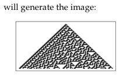
<!-- ORIGINAL_FIGURES page=0881 end -->

## 第 2 章注释

### 关键实验

### 简单程序怎样行动？

- 实现元胞自动机。把元胞自动机每一步的状态表示成一个列表很方便，例如 `{0, 0, 1, 0, 0}`，其中 `0` 对应白色元胞，`1` 对应黑色元胞。由 `n` 个白色元胞和中间一个黑色元胞组成的初始条件，可以用下面的函数得到（关于这个函数和其他 Mathematica 函数的说明见下文）：

```wolfram
CenterList[n_Integer] :=
  ReplacePart[Table[0, {n}], 1, Ceiling[n/2]]
```

对于本章讨论的那类元胞自动机，规则也可以用列表表示。因此，例如第 27 页上的规则 30 对应列表 `{0, 0, 0, 1, 1, 1, 1, 0}`。（规则编号方式见第 53 页。）一般来说，特定规则的列表可以用下面的函数得到：

```wolfram
ElementaryRule[num_Integer] := IntegerDigits[num, 2, 8]
```

给定一个规则，以及表示某个特定步骤中元胞自动机状态的列表 `a`，下面这个简单函数给出下一步的状态：

```wolfram
CAStep[rule_List, a_List] :=
  rule[[8 - (RotateLeft[a] + 2 (a + 2 RotateRight[a]))]]
```

对应于演化 `t` 步的状态列表随后可以这样得到：

```wolfram
CAEvolveList[rule_, init_List, t_Integer] :=
  NestList[CAStep[rule, #] &, init, t]
```

这种演化的图形可以用下面方式生成：

```wolfram
CAGraphics[history_List] := Graphics[
  Raster[1 - Reverse[history]], AspectRatio -> Automatic]
```

设置好上面的定义之后，Mathematica 输入

```wolfram
Show[CAGraphics[CAEvolveList[
  ElementaryRule[30], CenterList[103], 50]]]
```

将生成对应图像。

刚才给出的描述应足以用于大多数元胞自动机模拟。在 Mathematica 的某些早期版本中，可以使用下面的定义创建速度快得多的程序版本：

```wolfram
CAStep = Compile[{{rule, _Integer, 1}, {a, _Integer, 1}},
  rule[[8 - (RotateLeft[a] + 2 (a + 2 RotateRight[a]))]]]
```

此外，在 Mathematica 4 及以上版本中，可以使用

```wolfram
CAStep[rule_, a_] := rule[[8 - ListConvolve[{1, 2, 4}, a, 2]]]
```

或者直接用规则编号 `num` 表示为

```wolfram
Sign[BitAnd[2^ListConvolve[{1, 2, 4}, a, 2], num]]
```

（在本书发布后的 Mathematica 版本中，可以使用内置 `CellularAutomaton` 函数，如第 867 页所讨论。）也可以让 `CAStep` 通过 MathLink 调用下面的外部 C 语言程序，尽管通常随着 Mathematica 版本更新，所获得的速度优势会逐渐不那么显著：

```c
#include "mathlink.h"

main(argc, argv)
int argc; char *argv[];
{
  MLMain(argc, argv);
}

void casteps(revrule, rlen, a, n, steps)
int *revrule, rlen, *a, n, steps;
{
  int i, *ap, t, tp;
  for (i = 0; i < steps; i++)
  {
    a[0] = a[n-2];     /* right boundary */
    a[n-1] = a[1];     /* left boundary */
    t = a[0];
    for (ap = a+1; ap <= a+n-2; ap++)
    {
      tp = ap[0];
      ap[0] = revrule[ap[1] + 2*(tp + 2*t)];
      t = tp;
    }
  }
  MLPutIntegerList(stdlink, a, n);
}
```

这个外部程序与 Mathematica 函数 `CAStep` 的连接，通过下面的 MathLink 模板实现（注意可选的第三个参数，它允许 `CAStep` 一次执行若干步元胞自动机演化）：

[[PDF page 882]]

```text
:Begin:
:Function: casteps
:Pattern: CAStep[rule_List, a_List, steps_Integer:1]
:Arguments: {Reverse[rule], a, steps}
:ArgumentTypes: {IntegerList, IntegerList, Integer}
:ReturnType: Manual
:End:
```

上面的 C 程序中有几个棘手问题。首先，元胞自动机规则总是被定义为使用邻居的旧值来确定任何特定元胞的新值。但由于 C 程序显式地从左到右顺序更新值，当尝试更新某个特定元胞本身时，它左侧邻居已经被赋予新值。因此，有必要把左侧邻居的旧值存储在一个临时变量中，以便用于更新该元胞本身。（处理这个问题的另一种方法，是保持元胞数组的两个副本，并在元胞自动机每一步演化之后交换指向它们的指针。）

元胞自动机程序中的另一个棘手点涉及边界条件。由于实际计算机中只能使用有限元胞数组，人们必须决定元胞自动机规则怎样应用于数组两端的元胞。在上面的 Mathematica 和 C 程序中，我们实际上使用了一个循环数组，其中最左元胞的左邻居被看作最右元胞，反之亦然。在 C 程序中，这是通过在更新数组中的值之前，显式地把最左元胞的值复制到数组最右位置，并反向复制，来实现的。（在某种意义上，这个程序有一个 bug：更新只把新值放进 `n` 个数组元素中的 `n - 2` 个。）

- 关于 Mathematica 函数的说明。`CenterList` 的工作方式是先创建一个由 `n` 个 `0` 组成的列表，然后把中间的 `0` 替换为 `1`。（在 Mathematica 4 及以上版本中，可以改用 `PadLeft[{1}, n, 0, Floor[n/2]]`。）`ElementaryRule` 通过把 `num` 转换为 2 进制数字序列并在左侧补零，使其成为长度为 8 的列表来工作。规则编号方案的工作方式是：如果某个特定元胞的值为 `q`，其左邻居值为 `p`，右邻居值为 `r`，那么从 `ElementaryRule` 得到的列表中位置 `8 - (r + 2 (q + 2 p))` 的元素会给出该元胞的新值。

`CAStep` 使用了 Mathematica 可以一次操作列表中所有元素这一事实。`RotateLeft[a]` 和 `RotateRight[a]` 生成原始元胞值列表 `a` 的移位版本。随后当这些列表相加时，其对应元素会被组合，例如

```wolfram
{p, q, r} + {s, t, u} -> {p + s, q + t, r + u}
```

结果是产生一个列表，它为每个元胞指定规则中的哪一个元素适用于该元胞。实际的新元胞值列表随后通过类似下面的事实生成：

```wolfram
{i, j, k}[[{2, 1, 1, 3, 2}]] -> {j, i, i, k, j}
```

注意，使用 `RotateLeft` 和 `RotateRight` 会自动得到循环边界条件。

`CAEvolveList` 应用 `CAStep` 共 `t` 次。这些注释中的许多其他演化函数使用同样机制。一般来说，

```wolfram
NestList[s[r, #] &, i, 2] -> {i, s[r, i], s[r, s[r, i]]}
```

等等。

- 按位优化。上面的 C 程序把每个元胞值存储在整数数组的一个单独元素中。但由于每个值必定为 `0` 或 `1`，事实上可以只用单个位来编码它。由于实际计算机中的整数变量通常涉及 32 或 64 位，许多元胞的值可以打包进一个整数变量中。这样做的要点是，典型机器指令会并行作用于这种变量中的所有位。因此，例如由整数变量 `a` 表示的所有元胞值，可以通过单条 C 语句按规则 30 并行更新：

```c
a = a >> 1 ^ (a | a << 1);
```

不过，这条语句只会更新编码在 `a` 中的那个特定元胞块。把一系列这类块的更新粘合在一起，需要稍微复杂的代码。（在 Mathematica 中实现要容易得多，如上面所讨论，因为像 `BitXor` 这样的函数可以作用于任意长度的整数。）一般来说，按位优化要求不是用简单查找表表示元胞自动机规则，而是用布尔表达式表示；这些表达式必须为每条规则推导出来，并且可能相当复杂（见第 869 页）。不过，可以通过位切片来避免移位操作，从而更快地应用规则。其思想是把元胞自动机配置存储在例如 `m` 个变量 `w[i]` 中，其位分别对应元胞值 `{a1, a(m+1), a(2m+1), ...}`、`{a2, a(m+2), a(2m+2), ...}` 等。这样，`w[i]` 中第 `j` 位的左邻居和右邻居就分别是 `w[i - 1]` 和 `w[i + 1]` 中的第 `j` 位；因此，例如一步规则 30 演化可以只通过 `w[i] = w[i - 1] ^ (w[i] | w[i + 1])` 实现，而不需要移位操作（除 `w[0]` 和 `w[m - 1]` 上的边界条件外）。如果需要许多步演化，只需在开始时打包所有元胞值，并在结束时解包即可。

- 更一般的规则。到目前为止给出的程序适用于本章描述的特定类型规则的元胞自动机。不过一般来说，一维元胞自动机规则可以作为对每个邻域中所有可能元胞块的一组显式替换给出（见第 60 页）。

[[PDF page 883]]

因此，例如规则 30 可以写为

```wolfram
{{1, 1, 1} -> 0, {1, 1, 0} -> 0, {1, 0, 1} -> 0, {1, 0, 0} -> 1,
 {0, 1, 1} -> 1, {0, 1, 0} -> 1, {0, 0, 1} -> 1, {0, 0, 0} -> 0}
```

为了使用这种形式的规则，`CAStep` 可以改写为

```wolfram
CAStep[rule_, a_List] :=
  Transpose[{RotateRight[a], a, RotateLeft[a]}] /. rule
```

或者

```wolfram
CAStep[rule_, a_List] := Partition[a, 3, 1, 2] /. rule
```

现在，给出的规则可以包含模式，因此例如规则 90 可以写为

```wolfram
{{1, _, 1} -> 0, {1, _, 0} -> 1, {0, _, 1} -> 1, {0, _, 0} -> 0}
```

但怎样设置一个能够处理几种不同形式规则的程序？一种方便方法是在每条规则外面加一个“包装器”，指定该规则处于什么形式。于是，例如可以定义

```wolfram
CAStep[ElementaryCARule[rule_List], a_List] :=
  rule[[8 - (RotateLeft[a] + 2 (a + 2 RotateRight[a]))]]

CAStep[GeneralCARule[rule_, r_Integer : 1], a_List] :=
  Partition[a, 2 r + 1, 1, r + 1] /. rule

CAStep[FunctionCARule[f_, r_Integer : 1], a_List] :=
  Map[f, Partition[a, 2 r + 1, 1, r + 1]]
```

注意，后两个定义已经推广到允许规则涉及每侧 `r` 个邻居。在每种情形中，`Partition` 的使用都可以由 `Transpose[Table[RotateLeft[a, i], {i, -r, r}]]` 替换。为了在 Mathematica 早期版本中提高效率，第二个定义中的显式规则列表可以使用 `Dispatch[rules]` 预处理，第三个定义中的函数可以使用 `Compile[{{x, _Integer, 1}}, body]` 预处理。

我在第 886 页讨论总和型元胞自动机的实现，在第 927 页讨论高维元胞自动机的实现。

- 内置元胞自动机函数。本书发布后的 Mathematica 版本将包含一个非常通用的元胞自动机演化函数。描述如下（另见第 886 页）：

```text
CellularAutomaton[rnum, init, t]
  生成一个列表，表示元胞自动机规则 rnum 从初始条件 init 出发演化 t 步。

CellularAutomaton[rnum, init, t, {off_t, off_x, ...}]
  只保留具有指定偏移的演化列表部分。
```

`rnum` 的可能设置包括：

```text
n                         k = 2, r = 1 的初等规则
{n, k}                    有 k 种颜色的一般最近邻规则
{n, k, r}                 有 k 种颜色、范围为 r 的一般规则
{n, k, {r1, r2, ..., rd}} d 维规则，邻域大小为 (2 r1 + 1) x (2 r2 + 1) x ... x (2 rd + 1)
{n, k, {{off1}, {off2}, ..., {offs}}}
                          邻居位于指定偏移处的规则
{n, {k, 1}}               k 色最近邻总和型规则
{n, {k, 1}, r}            k 色、范围 r 的总和型规则
{n, {k, {wt1, wt2, ...}}, rspec}
                          第 i 个邻居被赋予权重 wti 的规则
{fun, {}, rspec}          把函数 fun 应用于每个邻居列表，并以步数作为第二参数
```

`CellularAutomaton[{n, k}, ...]` 等价于 `CellularAutomaton[{n, {k, {k^2, k, 1}}}, ...]`。二维元胞自动机的常见形式包括：

```text
{n, {k, 1}, {1, 1}}                                  9 邻居总和型规则
{n, {k, {{0, 1, 0}, {1, 1, 1}, {0, 1, 0}}}, {1, 1}}  5 邻居总和型规则
{n, {k, {{0, k, 0}, {k, 1, k}, {0, k, 0}}}, {1, 1}}  5 邻居外总和型规则
{n + k^5 (k - 1), {k, {{0, 1, 0}, {1, 4 k + 1, 1}, {0, 1, 0}}}, {1, 1}}  5 邻居生长规则
```

通常，`init` 和演化列表中的所有元素都是 `0` 到 `k - 1` 之间的整数。但当使用一般函数时，`init` 和演化列表中的元素不必是整数。传给 `fun` 的第二个参数是步数，从 `0` 开始。初始条件从 `init` 按如下方式构造：

```text
{a1, a2, ...}                         显式值列表 ai，假定为循环
{{a1, a2, ...}, b}                    值 ai 叠加在背景 b 上
{{a1, a2, ...}, {b1, b2, ...}}        值 ai 叠加在重复 b1, b2, ... 的背景上
{{{{a11, a12, ...}, off1}, {{a21, ...}, off2}, ...}, bspec}
                                      偏移 offi 处的值 aij，置于背景 bspec 上
{{a11, a12, ...}, {a21, ...}, ...}    二维中的显式值列表
{aspec, bspec}                        d 维中的值，带 d 维填充
```

`aspec` 的第一个元素会沿相对于原点的每个坐标正方向叠加到背景的第一个位置。这意味着 `bspec[[1, 1, ...]]` 与 `aspec[[1, 1, ...]]` 对齐。时间偏移 `off_t` 指定如下：

```text
All             0 到 t 的所有步骤（默认）
u               0 到 u 的步骤
-1              最后一步（步骤 t）
{u}             步骤 u
{u1, u2}        u1 到 u2 的步骤
{u1, u2, du}    步骤 u1, u1 + du, ...
```

`CellularAutomaton[rnum, init, t]` 会生成长度为 `t + 1` 的演化列表。初始条件被看作具有偏移 `0`。空间偏移 `off_x` 指定如下：

```text
All             所有可能受指定初始条件影响的元胞
Automatic       与背景不同的区域中的所有元胞
0               与 aspec 开头对齐的元胞
x               右侧最多偏移 x 的元胞
-x              左侧最多偏移 x 的元胞
{x}             右侧偏移 x 处的元胞
{-x}            左侧偏移 x 处的元胞
{x1, x2}        偏移 x1 到 x2 的元胞
{x1, x2, dx}    元胞 x1, x1 + dx, ...
```

在一维中，默认认为 `aspec` 的第一个元素具有空间偏移 `0`。在任意维数中，默认认为 `aspec[[1, 1, 1, ...]]` 具有空间偏移 `{0, 0, 0, ...}`。`CellularAutomaton` 产生的演化列表中每个元素总是同样大小。如果初始条件由宽度为 `w` 的 `aspec` 指定，那么范围为 `r` 的元胞自动机在 `t` 步后可能受影响区域宽度为 `w + 2 r t`。

[[PDF page 884]]

<!-- ORIGINAL_FIGURES page=0884 start -->
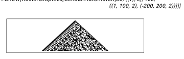
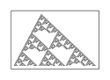
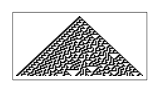
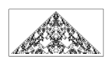
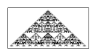
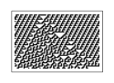
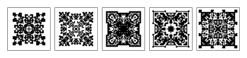
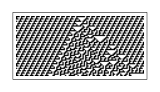
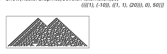
<!-- ORIGINAL_FIGURES page=0884 end -->

如果没有指定 `bspec` 背景，`All` 和 `Automatic` 的空间偏移会包含 `aspec` 中的每个元胞。`All` 的空间偏移包含所有可能受初始条件影响的元胞。`Automatic` 的空间偏移可用于从元胞自动机图案两侧裁掉背景。在计算要保留的区域宽度时，`Automatic` 只查看 `off_t` 指定步骤上的结果。

一些例子包括：

这给出从由单个 `1` 周围环绕 `0` 构成的初始条件开始，运行规则 30 三步所得的值数组。

```wolfram
In[1]:= CellularAutomaton[30, {{1}, 0}, 3]
Out[1]= {{0, 0, 0, 1, 0, 0, 0},
         {0, 0, 1, 1, 1, 0, 0},
         {0, 1, 1, 0, 0, 1, 0},
         {1, 1, 0, 1, 1, 1, 1}}
```

这运行规则 30 共 50 步，并为结果作图。

```wolfram
In[2]:= Show[RasterGraphics[CellularAutomaton[30, {{1}, 0}, 50]]]
```

如果初始条件中的所有值都显式给出，它们实际上被假定为循环延续。下面以 5 个元胞运行规则 30 共 3 步。

```wolfram
In[3]:= CellularAutomaton[30, {1, 0, 0, 1, 0}, 3]
Out[3]= {{1, 0, 0, 1, 0}, {1, 1, 1, 1, 0}, {1, 0, 0, 0, 0}, {1, 1, 0, 0, 1}}
```

这从无限重复 `{1, 0, 1, 1}` 块的背景上的 `{1, 1}` 开始。默认情况下，只给出受 `{1, 1}` 影响的图案区域。

```wolfram
In[4]:= Show[RasterGraphics[
  CellularAutomaton[30, {{1, 1}, {1, 0, 1, 1}}, 50]]]
```

这给出所有可能受影响的元胞，不管它们实际上是否受影响。

```wolfram
In[5]:= Show[RasterGraphics[CellularAutomaton[30,
  {{1, 1}, {1, 0, 1, 1}}, 50, {All, All}]]]
```

这把若干块放到初始条件中的偏移 `-10` 和 `20` 处。

```wolfram
In[6]:= Show[RasterGraphics[CellularAutomaton[30,
  {{{{1}, {-10}}, {{1, 1}, {20}}}, 0}, 50]]]
```

这只给出运行 10 步后的最后一行。

```wolfram
In[7]:= CellularAutomaton[30, {{1}, 0}, 10, -1]
Out[7]= {{1, 1, 0, 0, 1, 0, 0, 0, 0, 1, 0, 1, 1, 1, 1, 0, 1, 1, 0, 0, 1, 0}}
```

这运行 5 步，并在每一步给出中间 3 列上的元胞。

```wolfram
In[8]:= CellularAutomaton[30, {{1}, 0}, 5, {All, {-1, 1}}]
Out[8]= {{0, 1, 0}, {1, 1, 1}, {1, 0, 0}, {0, 1, 1}, {0, 1, 0}, {1, 1, 1}}
```

这在空间和时间上每隔一个元胞选取一次，从左侧 200 个元胞处开始。

```wolfram
In[9]:= Show[RasterGraphics[CellularAutomaton[30, {{1}, 0}, 100,
  {{1, 100, 2}, {-200, 200, 2}}]]]
```

这运行规则编号为 921408 的一般 `k = 3, r = 1` 规则。

```wolfram
In[10]:= Show[RasterGraphics[
  CellularAutomaton[{921408, 3, 1}, {{1}, 0}, 100]]]
```

这运行代码为 867 的总和型 `k = 3, r = 1` 规则。

```wolfram
In[11]:= Show[RasterGraphics[
  CellularAutomaton[{867, {3, 1}, 1}, {{1}, 0}, 50]]]
```

这使用一种基于把函数应用于每个元胞邻域的规则。

```wolfram
In[12]:= Show[RasterGraphics[CellularAutomaton[
  {Mod[Apply[Plus, #], 4] &, {}, 1}, {{1}, 0}, 50]]]
```

这运行二维 9 邻居总和型代码 3702 共 25 步，并给出最后 5 步的结果。

```wolfram
In[13]:= Show[GraphicsArray[Map[RasterGraphics,
  CellularAutomaton[{3702, {2, 1}, {1, 1}}, {{{1}}, 0}, 25, -5]]]]
```

- 专用硬件。元胞自动机的简单结构使人很自然地想到用专用硬件实现它们。事实上，从 1950 年代起，人们已经建造了一系列专用机器来实现一维、二维，有时也实现三维元胞自动机。使用过两种基本思想：并行和流水线。这两种思想都依赖元胞自动机规则的局部性质。

在并行方法中，机器有许多独立处理器，每个处理器专门处理一个元胞或一小组元胞。在流水线方法中，只有一个处理器（或也许少数几个处理器），不同元胞的数据依次通过它流动。不过关键点在于，在每个阶段都很容易知道需要什么数据，因此这些数据可以预取，潜在地通过专门构建的存储系统预取。

[[PDF page 885]]

<!-- ORIGINAL_FIGURES page=0885 start -->
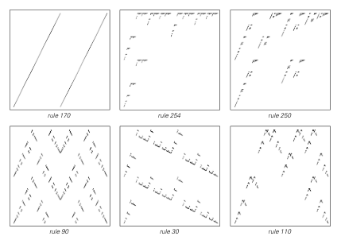
<!-- ORIGINAL_FIGURES page=0885 end -->

一般来说，能够实现的速度提升取决于内存和通信架构的许多细节。多年来，随着微处理器片上内存变得更大，而把数据从一个芯片发送到另一个芯片所需时间按比例变得更重要，这些提升倾向于变得不那么显著。

然而在未来，新技术可能改变这种取舍；事实上，元胞自动机显然是纳米技术和光计算中早期实现的候选对象。（另见第 841 页。）

- 音频表示。元胞自动机演化中的一步可以表示为声音，方法是把每个元胞像钢琴上的一个键那样处理，如果元胞为黑色，就把该键看作被按下。这会产生如下和弦：

```wolfram
Play[Evaluate[Apply[Plus, Flatten[Map[Sin[1000 # t] &,
  N[2^(1/12)]^Position[list, 1]]]]], {t, 0, 0.2}]
```

这类和弦序列有时可以为元胞自动机演化提供有用表示。（另见第 1080 页。）

- 作为公式的元胞自动机规则。本章任何元胞自动机中，步骤 `t` 上位置 `i` 处元胞的值 `a[t, i]` 可以由下面的定义得到：

```wolfram
a[t_, i_] := f[a[t - 1, i - 1], a[t - 1, i], a[t - 1, i + 1]]
```

不同规则对应于函数 `f` 的不同选择。例如，第 25 页上的规则 90 对应于

```wolfram
f[1, _, 1] = 0; f[0, _, 1] = 1; f[1, _, 0] = 1; f[0, _, 0] = 0
```

人们可以例如这样指定初始条件：

```wolfram
a[0, 0] = 1; a[0, _] = 0
```

（步骤 `0` 上位置 `0` 处的元胞值为 `1`，但该步骤上所有其他元胞值为 `0`。）随后，只需询问 `a[4, 0]`，就会立即得到位置 `0` 处元胞 4 步后的值。（为了效率，在实践中主要定义应写为

```wolfram
a[t_, i_] := a[t, i] = f[a[t - 1, i - 1], a[t - 1, i], a[t - 1, i + 1]]
```

这样，所有被计算出的中间值都会自动存储。）

上面给出的规则 90 的函数 `f` 定义，本质上只是一个查找表。但也可以用代数方式定义该函数：

```wolfram
f[p_, q_, r_] := Mod[p + r, 2]
```

其他规则也可以给出代数定义：

```text
规则 254（第 24 页）：1 - (1 - p)(1 - q)(1 - r)
规则 250（第 25 页）：p + r - p r
规则 90（第 25 页）：Mod[p + r, 2]
规则 30（第 27 页）：Mod[p + q + r + q r, 2]
规则 110（第 32 页）：Mod[(1 + p) q r + q + r, 2]
```

在这些定义中，我们用数字 `1` 或 `0` 表示元胞值。如果改用值 `+1` 和 `-1`，就会得到不同公式；例如规则 90 对应于 `p r`。也可以把元胞值表示为 `True` 和 `False`。在这种情形中，元胞自动机规则变成逻辑表达式：

```text
规则 254：Or[p, q, r]
规则 250：Or[p, r]
规则 90：Xor[p, r]
规则 30：Xor[p, Or[q, r]]
规则 110：Xor[Or[p, q], And[p, q, r]]
```

（注意，`Not[p]` 对应于 `1 - p`，`And[p, q]` 对应于 `p q`，`Xor[p, q]` 对应于 `Mod[p + q, 2]`，`Or[p, q]` 对应于 `Mod[p q + p + q, 2]`。）

给定元胞自动机规则的代数形式或逻辑形式，至少原则上可以为元胞自动机演化结果生成符号公式。因此，例如可以使用初始条件

```wolfram
a[0, -1] = p; a[0, 0] = q; a[0, 1] = r; a[0, _] = 0
```

来生成一个元胞值公式，该公式对三个初始中心元胞值的任何选择都成立。不过在实践中，大多数这样的公式会迅速变得非常复杂，如第 618 页所讨论。

- 元胞自动机的数学解释。在纯数学语境中，具有无穷多个元胞的一维元胞自动机的状态空间可以被看作康托尔集。元胞自动机规则随后对应于这个康托尔集到自身的连续映射（连续性来自规则的局部性）。（比较第 959 页。）

上方图像显示了对应于各种规则的映射表示，其做法是绘制 `Sum[a[t + 1, i] 2^-i, {i, -n, n}]` 相对于 `Sum[a[t, i] 2^-i, {i, -n, n}]` 的图。

[[PDF page 886]]

<!-- ORIGINAL_FIGURES page=0886 start -->
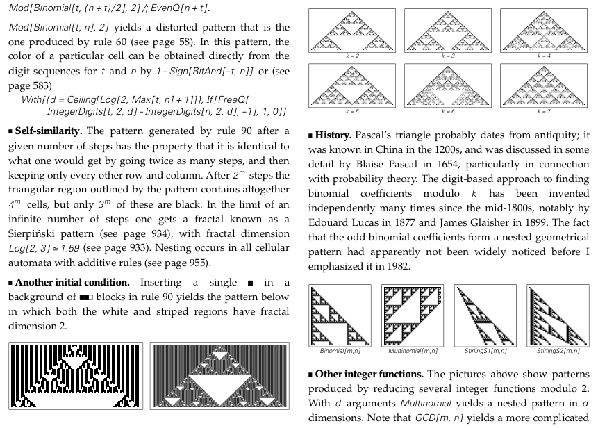
<!-- ORIGINAL_FIGURES page=0886 end -->

这里考虑的是 `a[t, i]` 的所有可能选择。（使用周期边界条件，因此 `a[t, i]` 可以被看作精确对应于有理数的数字。）规则 170 是经典移位映射，它把所有元胞值向左移动一个位置而不改变它们。在下方图像中，这个映射具有 `Mod[2 x, 1]` 的形式（比较第 153 页）。

- 第 26 页 · 帕斯卡三角形和规则 90。如第 611 页所示，规则 90 产生的图案正好是二项式系数的帕斯卡三角形按模 2 化简所得：黑色元胞对应于奇数二项式系数。

第 `t` 行上的黑色元胞数由 `2^DigitCount[t, 2, 1]` 给出，其中 `DigitCount[t, 2, 1]` 在第 902 页作图。黑色元胞的位置由下式给出（这也建立了与第 117 页图像的联系）：

```wolfram
Fold[Flatten[{#1 - #2, #1 + #2}] &, 0, 2^DigitPositions[t]]

DigitPositions[n_] :=
  Flatten[Position[Reverse[IntegerDigits[n, 2]], 1]] - 1
```

规则 90 实际生成的图案对应于 `PolynomialMod[Expand[(1/x + x)^t], 2]` 中的系数（见第 1091 页）；因此，特定元胞的颜色由

```wolfram
Mod[Binomial[t, (n + t)/2], 2] /; EvenQ[n + t]
```

给出。`Mod[Binomial[t, n], 2]` 产生一个变形图案，也就是规则 60 产生的图案（见第 58 页）。在这个图案中，特定元胞的颜色可以直接由 `t` 和 `n` 的数字序列得到：

```wolfram
1 - Sign[BitAnd[-t, n]]
```

或者（见第 583 页）：

```wolfram
With[{d = Ceiling[Log[2, Max[t, n] + 1]]},
  If[FreeQ[IntegerDigits[t, 2, d] - IntegerDigits[n, 2, d], -1], 1, 0]]
```

- 自相似性。规则 90 在给定步数后生成的图案具有这样一个性质：它与走两倍步数、然后只保留每隔一行和每隔一列所得图案完全相同。经过 `2^m` 步之后，图案勾勒出的三角区域总共包含 `4^m` 个元胞，但其中只有 `3^m` 个为黑色。在无限步数极限下，人们得到一种称为谢尔宾斯基图案的分形（见第 934 页），其分形维数为 `Log[2, 3]`，约为 1.59（见第 933 页）。嵌套出现在所有具有加性规则的元胞自动机中（见第 955 页）。

- 另一个初始条件。在规则 90 中，把一个单个元素插入某种块状背景，会产生下方图案，其中白色区域和条纹区域都具有分形维数 2。

- 更多颜色。下方图像显示了规则 90 向 `k` 种可能颜色的推广，使用规则

```wolfram
CAStep[k_Integer, a_List] :=
  Mod[RotateLeft[a] + RotateRight[a], k]
```

或者等价地使用 `Mod[ListCorrelate[{1, 0, 1}, a, 2], k]`。这种情形中第 `t` 行上非白色元胞的数量由 `Apply[Times, 1 + IntegerDigits[t, k]]` 给出。（对于非素数 `k`，图案由对应于 `k` 的因子的图案叠加得到。）一个相关结果是，`IntegerExponent[Binomial[t, n], k]` 由以 `k` 为底从 `t` 中减去 `n` 时发生的借位次数给出。对于素数 `k`，`Mod[Binomial[t, n], k]` 由下式给出：

```wolfram
With[{d = Ceiling[Log[k, Max[t, n] + 1]]},
  Mod[Apply[Times, Apply[Binomial, Transpose[
    {IntegerDigits[t, k, d], IntegerDigits[n, k, d]}], {1}]], k]]
```

任意 `k` 所得图案都是嵌套的。对于素数 `k`，到步骤 `k^m` 为止非白色元胞的总数为 `(1/2 k (k + 1))^m`，图案的分形维数为 `1 + Log[k, (k + 1)/2]`（见第 955 页）。这些是加性规则的例子，第 952 页会进一步讨论。（连续情形另见第 922 页。）

- 历史。帕斯卡三角形大概可以追溯到古代；它在 1200 年代的中国已为人所知，并由布莱兹·帕斯卡在 1654 年作了相当详细的讨论，特别是结合概率论。基于数字寻找模 `k` 的二项式系数的方法，自 1800 年代中期以来被多次独立发明，著名例子包括 1877 年的爱德华·卢卡斯和 1899 年的 James Glaisher。奇数二项式系数形成嵌套几何图案这一事实，在我于 1982 年强调它以前，显然没有被广泛注意到。

- 其他整数函数。上方图像显示了把若干整数函数按模 2 化简所得的图案。对于 `d` 个参数，`Multinomial` 会产生 `d` 维嵌套图案。注意，`GCD[m, n]` 会产生更复杂的图案（见第 613 页），`JacobiSymbol[m, 2 n - 1]`（见第 1081 页）以及各种函数组合（见第 747 页）也是如此。

[[PDF page 887]]

<!-- ORIGINAL_FIGURES page=0887 start -->
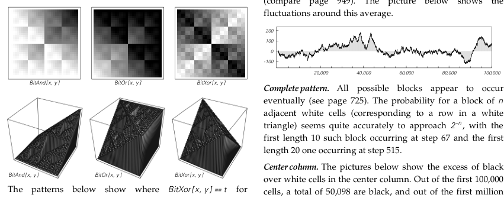
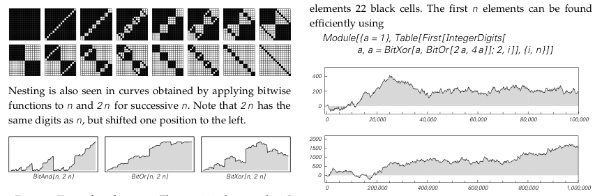
<!-- ORIGINAL_FIGURES page=0887 end -->

- 按位函数。按位函数通常产生嵌套图案。（如上面讨论，任何元胞自动机规则都可以表示为按位函数的适当组合。）注意，`BitOr[x, y] + BitAnd[x, y] = x + y`，而 `BitOr[x, y] - BitAnd[x, y] = BitXor[x, y]`。

下方图案显示了连续 `t` 下满足 `BitXor[x, y] = t` 的位置，并对应于 1962 年在 PDP-1 计算机上研究的 “munching squares” 程序中的步骤。把按位函数应用于连续 `n` 的 `n` 和 `2 n` 所得曲线中，也可以看到嵌套。注意，`2 n` 与 `n` 具有相同数字，只是向左移动了一位。

- 第 28 页 · 随机性测试。我执行过的统计测试包括第 1084 页列出的八种。

- 第 29 页 · 规则 30。所示图案左侧具有明显重复特征。一般来说，如果沿着距图案任一边缘 `n` 个元胞的对角线观察，那么重复周期最多可以是 `2^n`。在右侧边缘，最初看到的几个周期为

```text
{1, 2, 2, 4, 8, 8, 16, 32, 32, 64, 64, 64, 64, 64, 128, 256}
```

一般来说，周期似乎随深度指数增长。在左侧边缘，周期增长极其缓慢：周期 2 首次在深度 3 达到，周期 4 在深度 8，周期 8 在 29，周期 16 在 400，周期 32 在 87867，周期 64 在 2107985255 或更大，依此类推。（事实证明，每次周期加倍都恰好发生在图案中某条对角线最终变成白色条纹，并且其左侧对角线在每个重复块中有奇数个黑色元胞的时候。）把左侧重复性与右侧随机性分开的边界，平均每一步向左移动约 0.252 个元胞（比较第 949 页）。下方图显示围绕这个平均值的波动。

完整图案。所有可能块似乎最终都会出现（见第 725 页）。长度为 `n` 的相邻白色元胞块（对应于白色三角形中的一行）的概率，似乎相当准确地趋近于 `2^-n`；第一个长度为 10 的这种块出现在第 67 步，第一个长度为 20 的出现在第 515 步。

中心列。下方图像显示中心列中黑色元胞相对白色元胞的超额。在最初 100000 个元胞中，总共有 50098 个为黑色；在最初一百万个中，有 500768 个为黑色。最初 100000 个元胞中最长的同色连续段由 21 个黑色元胞组成；最初一百万个元素中最长的同色连续段由 22 个黑色元胞组成。最初 `n` 个元素可以用下面方式高效找到：

```wolfram
Module[{a = 1},
  Table[First[IntegerDigits[
    a, a = BitXor[a, BitOr[2 a, 4 a]]; 2, i]], {i, n}]]
```

这个序列至少在最初一百万步中没有重复；如果它曾经重复，我会感到惊讶，但到目前为止，我还不知道对此有严格证明。（Erica Jen 在 1986 年显示，没有任何一对列可能重复；第 1087 页的论证暗示，中心列连同偶尔的相邻元胞也不能重复。）

- 第 32 页 · 规则 110。关于规则 110 的更多细节见第 229 和 675 页。可能出现的局部结构见第 292 页。注意，规则 110 基本规则的 8 种情形中，只有一种不同于规则 102；规则 102 是通过反射规则 60 得到的简单加性规则。

[[PDF page 888]]

### 对新直觉的需要

- 科学家的反应。许多科学家发现本章图像中的复杂性如此令人惊讶，以至于起初他们会假定它不可能是真的。他们通常会想象，虽然图像看起来复杂，但只要受到适当类型的分析，它们实际上就会显得简单。在第 10 章中，我会给出大量证据说明并非如此。但这里可以说的是，在寻找规律性方面，即使数学和统计学中最先进的方法，也往往并不比我们的眼睛更有力。无论人们使用什么形式定义复杂性（见第 557 页），我们的眼睛在本章讨论的系统中感知到复杂性这一事实，本身已经非常重要。

- 来自实际计算的直觉。关于计算机和编程的日常经验，会导致如下观察：

```text
可以构造通用计算机和通用编程语言。
可以设置用于做各种不同事情的不同程序。
任何给定程序都可以用许多方式实现。
程序可以以复杂且看似随机的方式行动，尤其是在它们没有正常工作时。
调试程序可能很困难。
通过阅读程序代码，常常很难预见程序能够做什么。
程序代码表示层级越低，通常越难理解。
有些计算问题容易陈述但难以求解。
模拟自然系统的程序属于计算代价最高的程序。
人们可以创建大型程序，至少可以逐片创建。
几乎总能进一步优化一个程序，但优化后的版本可能更难理解。
较短程序有时更高效，但优化常常要求许多情形被分别处理，使程序变得更长。
如果程序被打太多补丁，它们通常会完全停止工作。
```

- 对设计的应用。本书中的许多图像看起来与各种风格的艺术设计惊人相似。这大概并不太反映底层规则相似，而是反映了对人类视觉系统最显著的特征相似。注意，本章元胞自动机中那样由彩色元胞构成的方格，可以相当直接地用作织造图案。（另见第 929 页。）

### 为什么这些发现以前没有被作出

- 第 43 页 · 装饰艺术。几乎所有主要文化时期都与某些特征性装饰形式相关。用于特定类型对象上的装饰形式，往往大概源于对这些对象更早或更自然形式的理想化模仿；因此，例如对织物、砖块和各种植物形式的模仿很常见。在伊斯兰等文化传统中，大规模纯抽象图案也是艺术核心，因为自然形式被认为是上帝的作品，不应被直接表现。装饰风格一旦建立，就倾向于被广泛重复，作为提供某种舒适和熟悉感的方式，尤其是在建筑中。绝大多数复杂装饰似乎由工匠创造，几乎没有正式理论讨论，尽管特别是自 1800 年代以来，人们曾多次尝试寻找系统方式来编目装饰形式，有时基于与语法的类比。（不过，比例问题长期以来一直是相当多理论讨论的主题。）值得注意的是，重复图案在装饰中被广泛使用，而即使嵌套也相当少见。并且，尽管例如人们设计了复杂的对称规则，似乎从未出现任何类似元胞自动机规则的东西。本书的结果现在显示，这类规则能够捕捉自然中发生的许多复杂过程的本质；因此，尽管它们缺乏历史语境，这类规则仍有潜力为一些装饰形式提供基础，而这些形式作为自然的理想化对我们来说会很熟悉。（比较第 929 页。）

正文中的图像显示了一系列各种特征性装饰形式的早期例子。

[[PDF page 889]]

<!-- ORIGINAL_FIGURES page=0889 start -->
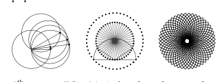
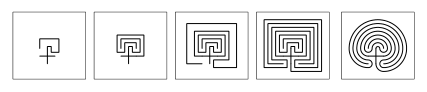
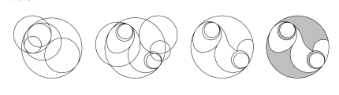
<!-- ORIGINAL_FIGURES page=0889 end -->

公元前 22000 年（旧石器时代）。来自乌克兰 Mezin 的猛犸象牙手镯。同一时期其他对象中也可见类似锯齿设计。在所示例子中，值得注意的是，锯齿角度与猛犸象牙本质中自然出现的 Schreger 线角度相当。

公元前 3000 年（苏美尔）。来自美索不达米亚乌鲁克 Eanna 神庙墙壁的柱状装饰，由三种颜色的陶钉嵌入泥中形成（Warka，伊拉克），也许在《吉尔伽美什史诗》中被提到。（现藏柏林国家博物馆。）这是已知最早的明确马赛克例子。

公元前 1200 年（希腊）。来自希腊 Pylos 的陶制记账板背面。该图案大概由下方所示过程制作。传说称，它是克里特岛克诺索斯宫中容纳弥诺陶洛斯的迷宫平面图，由代达罗斯设计。也有人说它是特洛伊城的标志，或者也许是其某些城墙的平面图。这个图案，无论方形还是圆角形式，都以惊人少的变化出现在世界各地极为多样的地方，从克里特钱币，到庞贝涂鸦，到沙特尔大教堂地面，到秘鲁雕刻，再到原住民部落标志。大概三千年来，它一直是迷宫中最常用的单一设计。

公元前 900 年（腓尼基）。大概来自地中海地区的象牙雕刻。（现藏大英博物馆。）这是一种常见装饰图案，通过以三角阵列排列的孔为圆心画圆形成。它也见于埃及和其他艺术。这类图案曾由欧几里得以及后来的列奥纳多·达·芬奇结合月牙形理论讨论。

公元前 1 世纪（凯尔特）。所谓 Desborough Mirror 的背面；这是一面来自英格兰 Desborough 的青铜镜，制作于公元前 50 年到公元 50 年之间的铁器时代。（现藏大英博物馆。）雕刻图案由彼此恰好相切的圆弧部分构成，如下方图像所示。

公元 2 世纪（罗马）。来自意大利罗马某建筑群的马赛克。（现藏罗马国家博物馆。）这个几何图案大概先通过重复角平分构造出 48 条均匀间隔的辐条，如下方第一幅图所示；随后以每条辐条末端为圆心画半圆；最后通过交点添加同心圆。类似玫瑰花窗图案可能在约公元前 350 年的希腊已经使用；它们在 1500 年代的教堂中变得流行。

8 世纪（伊斯兰）。西班牙科尔多瓦大清真寺外墙上的一处细节，该清真寺约建于公元 785 年。

8 世纪（凯尔特）。《凯尔经》极其精巧的 chi-rho 页中字母 `Ρ` 内部一块不到 2 英寸见方的区域；《凯尔经》是一部彩饰福音书手稿，历经多年在不同修道院中创作，大概约公元 800 年始于苏格兰 Iona 岛上的爱尔兰修道院。仅这一页上，就也许还有十来个非常相似的嵌套结构。

12 世纪（意大利）。西西里 Palermo 的 Palatine Chapel 中一扇窗，大概建于约公元 1140 年。该礼拜堂具有所谓阿拉伯-诺曼风格特征。

13 世纪（英格兰）。英格兰 Lincoln 大教堂的 Dean’s Eye 玫瑰窗，建于约公元 1225 年。同一大致时期的许多哥特式窗户中可见类似树状图案。

13 世纪（意大利）（4 幅图）。意大利 Anagni 大教堂地面上的大理石马赛克，由 Cosmati 团体的 Cosmas 于约公元 1226 年制作。（第四幅图是第三幅的特写。）第三幅图，特别是第四幅图放大的部分，显示出近似嵌套结构，大概如下面图像所示创建。所有三角形都是等边的，其结果是在给定步骤上出现若干不同大小的三角形，尽管该图案的基本结构仍与规则 90 元胞自动机相同。（比较第 986 页的 Apollonian 堆积。）Cosmati 团体主要由一个家族四代人组成，在约 1190 到 1300 年间制作精巧几何及其他马赛克，混合拜占庭、伊斯兰和其他影响，主要在罗马及周边，也包括例如英格兰 Westminster Abbey。他们的作品中含一级嵌套的三角形相当常见；这里显示的三级嵌套则很少见。

[[PDF page 890]]

<!-- ORIGINAL_FIGURES page=0890 start -->
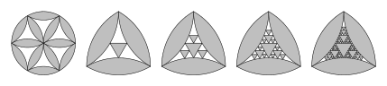

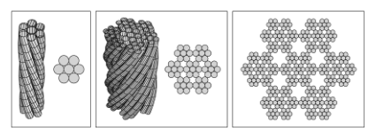
<!-- ORIGINAL_FIGURES page=0890 end -->

值得注意的是，在后来对 Cosmati 马赛克的仿制中，这类图案几乎从未被使用。

14 世纪（伊斯兰）。伊朗 Linjan 的 Pir-i-Bakran 陵墓墙面装饰，建于约 1299-1312 年。该图案是《古兰经》中广泛引用的一节经文的方体库法体书法。从传统 Naskhi 阿拉伯文字开始，如下方图像所示，库法体约在公元 900 年开始发展，到约 1100 年，方体库法体已用于建筑装饰。

14 世纪（伊斯兰）。西班牙 Seville 的 Alcázar 瓷砖墙，建于 1364 年。（几乎同一时期，西班牙 Granada 的 Alhambra 也使用了同一图案。）该图案可以从三角形网格开始制作，然后一致地把每个三角形的边向内或向外推。（Maurits Escher 从 1930 年代开始显著使用这类图案。）

其他情形。已知情形不可避免地倾向于是由石材或陶瓷材料创造而保存下来的；毫无疑问，也有其他情形例如用木材或纺织品创造。木材中的一个情形是中国格窗。保存下来的大多显示重复图案，但冰裂纹风格大概可追溯到公元 100 年，具有近似嵌套，尽管带有许多随机元素。所示图案基本都是二维的。一维装饰图案的一个例子是线脚轮廓。自古以来，这些图案常常相当复杂，有时可以想象它们被解释为显示嵌套。

- 艺术识别。一种古怪的可能性是，类似规则 30 的形式很久以前曾作为艺术被创造出来，但现在未被识别。因为虽然很容易看出洞穴中动物绘画是一件有目的的艺术品，岩石上按近似规则 30 图案刻出的点，甚至可能不会被注意到是人类起源的东西。不过，尽管在可能早至公元前 30000 年的洞穴中有许多看似随机的绘制图案，如果其中任何一个实际由明确简单规则产生，我会感到惊讶。（见第 839 页。）

- 规则概念。基于规则的过程出现在人类活动的许多领域中。有时规则主要作为约束。但它们也常常像在元胞自动机中那样，被用作指定结构应怎样构建的方式。然而，几乎无一例外，过去选择规则都是为了只产生相当具体而简单的结果。除装饰艺术外，具有悠久历史的例子包括：

建筑。像阶梯塔和金字塔这样的结构，大概是通过按照简单规则组装石块集合而建成的。埃及大金字塔建于约公元前 2500 年，包含约两百万块大石头。（相比之下，第 29 和 30 页上的规则 30 图像总共包含约一百万个元胞。）也许早在公元前 1000 年，印度教寺庙就以不同尺度上的相似元素建造，产生一种近似嵌套形式。在罗马及后来的建筑中，建筑中的房间经常按粗略嵌套图案排列（一个极端例子是 1200 年代的 Castel del Monte）。从中世纪起，许多波斯花园（例如约 1650 年的泰姬陵花园）具有相当规则的嵌套结构，由若干连续四分得到。从 1200 年代早期开始，哥特式窗户常常由大致树状嵌套形式的层级构成（见上文）。嵌套似乎并未用于物理城市规划（除了 Vauban 星形堡垒中很小程度上使用），尽管它在组织结构中很常见。（如上面所示，建筑装饰也常常实际上使用明确规则构造。）

纺织制造。自人类历史早期以来，织造中似乎就使用了明确规则。但只要目的在于生产织物，线的基本排列通常总是重复的。

绳索。至少自公元前 3000 年以来，人们通过把本身由捻合形成的股再捻合在一起制作绳索，产生具有某些嵌套的横截面，如下方第二幅图所示。（自 1870 年代钢丝绳发展以来，人们使用了精确设计，至少最近包括最后所示的 `7 x 7 x 7` 设计。）

[[PDF page 891]]

<!-- ORIGINAL_FIGURES page=0891 start -->
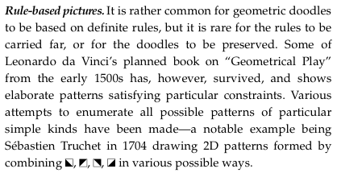
<!-- ORIGINAL_FIGURES page=0891 end -->

结和绳形图。几千年来，人们一直使用明确规则来打结，大概也使用明确规则来制作绳形图。但当规则超过少数几步时，它们倾向于重复。

折纸。虽然折纸大概已经实践了至少 2000 年，但即使第 892 页上的嵌套形式似乎也是直到最近才被注意到。

数学。自巴比伦时代以来，算术一直通过对数字中的数位反复应用简单规则来完成。自古希腊时代以来，迭代方法一直被用于构造几何图形。到 1600 年代晚期，也出现了这样一种想法：数学证明可以被看作由明确规则的重复应用构成。但研究可能的简单规则并独立于它们生成结果的目的这一想法，似乎从未出现。随着数学开始聚焦于连续系统，枚举可能规则的观念也变得越来越困难。

逻辑。逻辑规则自约公元前 400 年以来就被使用。但除了三段论这样的形式之外，似乎很少有人研究如何由它们生成可识别图案。（见第 1099 页。）

语法。人类语言由词语按照明确语法规则构成这一思想，至少自大概公元前 500 年 Panini 给出梵语语法以来就已经存在。（较少形式化的版本在古希腊时期也很常见。）但在很大程度上，直到约 1950 年代，语法规则才开始被看作生成结构的规范，而不只是约束。（见第 1103 页。）

诗歌。诗歌节奏的明确规则在古代已经相当发达；到大概公元前 200 年，印度关于枚举其可能形式的工作似乎导致了帕斯卡三角形和斐波那契数。涉及迭代长度为 6 的排列（六行诗）和交错重复序列（三韵句）的押韵图案，到 1300 年代已经被使用，特别是在但丁那里。

音乐。至少自毕达哥拉斯时代以来，简单进行和各种重复形式大概已用于音乐。从 1200 年代开始，更复杂的交错形式，例如卡农中的形式，偶尔被使用。过去一个世纪里，少数作曲家隐含或显式地使用了基于简单斐波那契和其他替换系统的结构。注意，对位法等规则主要作为约束使用，而不是作为生成结构的方式。

军事操练。使用明确规则来组织和调动士兵队形的观念，似乎在巴比伦和亚述时代就已经存在，到罗马时代已经被很好地编纂。例如 Niccolo Machiavelli 在 1521 年描述了相当复杂的情形，但所有这些都被设置为只产生相当简单的行为，例如把一列士兵重新排列成若干行。（见第 1035 页的行刑队问题。）

游戏。游戏通常基于明确规则，但被设置成每一步都涉及通过技巧或随机性在许多可能性中选择一个。围棋起源于公元前 500 年以前，或许早至公元前 2300 年，是一个特别简单的规则能够允许异常复杂的对局图案出现的情形。（围棋涉及把黑白棋子放在网格上，因此视觉上类似元胞自动机。）

谜题。与今天常见谜题惊人接近的几何和算术谜题，似乎早在公元前 2000 年就已经存在。它们通常基于约束，偶尔可以被看作提供了简单约束可能有复杂解的证据。

密码术。加密信息的规则也许自公元前 2000 年以来就被使用，非平凡重复方案在 1500 年代变得常见，但更复杂方案直到 1900 年代深处才出现。（见第 1085 页。）

迷宫设计。从古代直到约 1500 年代，大多数迷宫遵循少数几种设计，最常见的是直接基于第 873 页所示设计，或含有类似子单元。（现在已知还有许多其他设计也是可能的。）

基于规则的图像。几何涂鸦基于明确规则相当常见，但规则被推进很远或涂鸦被保存下来则很少见。不过，列奥纳多·达·芬奇 1500 年代早期计划撰写的《几何游戏》一书中有一部分保存了下来，显示出满足特定约束的精巧图案。人们曾多次尝试枚举特定简单类型的所有可能图案，一个著名例子是 Sébastien Truchet 在 1704 年绘制由四种基本方块以各种可能方式组合形成的二维图案。

- 第 44 页 · 理解自然。在希腊时代，人们注意到简单几何规则可以解释天文学中的许多特征，最明显的是恒星的表观旋转以及太阳和月亮的圆形。但人们也注意到，除了少数例外，如蜂巢，地上出现的自然对象似乎并不遵循任何简单几何规则。（希腊几何中最复杂的曲线也只是蔓叶线和蚌线之类。）因此，人们由此得出结论：只有某些所谓完美对象，如天体，才可能完全适合人类理解。

[[PDF page 892]]

在犹太-基督教传统中，人们实际上为自然对象尝试过什么规则并不那么清楚；不过例如《约伯记》确实评论了“以智慧数算云彩”的困难。除了炼金术士这个显著例外，整个中世纪人们仍继续相信，自然的奇迹超出了人类理解。

- 原子论。万物也许由大量离散元素构成这一思想，大概在公元前 450 年左右由留基伯和德谟克利特讨论过。稍后，伊壁鸠鲁学派提出，只需少数类型的元素也许就足够了，并作出一个类比（约公元 100 年卢克莱修尤为突出）：不同字母配置可以构成一种语言中的所有词语。但希腊哲学中只有少数学派曾支持原子论，它很快便失宠。到 1600 年代晚期，当关于光和物质的微粒理论开始被广泛讨论时，原子论得到复兴。1800 年代早期，基于原子的论证在化学中取得成功；1800 年代晚期，大量原子集合的统计力学被用来解释物质性质（见第 1019 页）。随着 1900 年代早期量子理论兴起，物理系统包含离散粒子这一点被牢固确立。但通常仍假定，人们应当只思考具有现实机械性质的显式粒子，因此像元胞自动机这样的抽象理想化并未出现。（另见第 1027 和 1043 页。）

- 元胞自动机的历史。尽管其构造非常简单，但在大约 1950 年代以前，似乎没有人考虑过任何类似一般元胞自动机的东西。然而在 1950 年代，以各种方式受到电子计算机出现的启发，几种等价于元胞自动机的不同系统被独立引入。可以识别出多种先驱。对数字序列的操作自古以来就用于算术。对微分方程的有限差分近似在 1900 年代早期开始出现，到 1930 年代已经相当为人所知。1936 年发明的图灵机，则基于对离散元素序列上任意操作的思考。（物理学中的 Ising 模型等观念似乎没有直接影响。）

元胞自动机被引入的最著名方式，也是最终导致其名称的方式，是约翰·冯·诺依曼试图发展生物学中自我复制抽象模型的工作；这个主题来自控制论研究。约 1947 年，也许基于化学工程，冯·诺依曼最初思考的是由偏微分方程描述的三维工厂模型。很快，他转向思考机器人学，并想象也许可用玩具构造套件实现一个例子。然而，通过类比电子电路布局，他意识到二维应当足够。随后，按照 Stanislaw Ulam 1951 年的建议（Ulam 也许已经独立考虑过这个问题），他简化了模型，最终得到一个二维元胞自动机（他显然希望后来把结果转换回微分方程）。他在 1952-1953 年构造的特定元胞自动机，每个元胞有 29 种可能颜色，并具有复杂规则，专门设置来模拟电子计算机组件和各种机械装置的操作。为了给自我复制的可能性提供数学证明，冯·诺依曼随后概述了一个由 200000 个元胞构成并会复制自身的配置（细节由 Arthur Burks 在 1960 年代早期补全）。冯·诺依曼似乎相信，部分大概是因为看到了实际生物体和电子计算机的复杂性，一个系统要表现出自我复制等精巧能力，类似这种层级的复杂性必然是必要的。本书显示，这绝对不是事实；但凭借他从既有数学和工程中得到的直觉，冯·诺依曼大概从未想象到这一点。

冯·诺依曼的工作立刻产生了两条线索。第一条主要在 1960 年代，是越来越带有奇趣性的讨论：建造实际自我复制自动机，常常以航天器形式。第二条是尝试通过对元胞自动机细节性质的数学研究，捕捉自我复制的更多本质。在 1960 年代，人们找到了越来越简单的、能够自我复制（见第 1179 页）和通用计算（见第 1115 页）的元胞自动机构造。从 1960 年代早期开始，一些被认为与自我复制相关的元胞自动机相当简单的一般特征被注意到，并使用越来越精巧的技术形式体系研究。（一个例子是所谓伊甸园结果，即元胞自动机中可能存在只能作为初始条件出现的配置；见第 961 页。）人们也对一些元胞自动机作了各种显式构造，其行为显示出也许与自我复制相关的特定简单特征（例如所谓行刑队同步，如第 1035 页）。

到 1950 年代末，人们已经注意到元胞自动机可以被看作并行计算机；特别是在 1960 年代，关于其形式计算能力，人们证明了一系列越来越细致和技术化的定理，这些定理常常类似关于图灵机的定理。

[[PDF page 893]]

到 1960 年代末，人们随后开始尝试把元胞自动机与动力系统的数学讨论联系起来；不过如下所述，事实上早在十年前，这件事已经以不同术语完成。到 1970 年代中期，关于元胞自动机的工作大多变得相当深奥，人们对它的兴趣也大幅减弱。（不过仍有一些工作继续进行，特别是在俄罗斯和日本。）注意，即使在计算机科学中，元胞自动机也曾使用各种名称，包括镶嵌自动机、元胞空间、迭代自动机、齐次结构和通用空间。

正如正文中提到的，到 1950 年代晚期，已经有各种通用计算机，在其上执行元胞自动机模拟会很容易。但这些计算机大多用于研究传统上复杂得多的系统，例如偏微分方程。不过约 1960 年，有过几次与二维元胞自动机相关的模拟。Stanislaw Ulam 等人在 Los Alamos 使用计算机产生了少数他们称为递归定义几何对象的例子，本质上是从单个黑色元胞演化广义二维元胞自动机所得结果（见第 928 页）。特别是在 1967 年得到更大图像后，Ulam 注意到，在至少一个情形中，相当简单的生长规则生成了复杂图案，并提到这也许与生物学相关。但也许由于传统数学方法在这方面几乎没有取得进展，该结果并未广为人知，也从未被追究下去。（Ulam 尝试构造一维类似物，但最终得到的不是元胞自动机，而是第 908 页讨论的基于数字的序列。）约 1961 年，Edward Fredkin 在 PDP-1 计算机上模拟了规则 90 的二维类似物，并注意到其自我复制性质（见第 1179 页），但他通常更感兴趣的是寻找类似物理学的简单特征。

尽管科学中缺乏研究，元胞自动机的一个例子在 1970 年代早期以重要方式进入娱乐计算。John Conway 显然部分受数学逻辑问题，部分受 Ulam 等人关于“模拟游戏”的工作激发，从 1968 年开始对各种不同二维元胞自动机规则做实验（主要手工做，后来在 PDP-7 计算机上做）；到 1970 年，他提出了一组简单规则，称为“生命游戏”，它们表现出一系列复杂行为（见第 249 页）。主要通过 Martin Gardner 在《科学美国人》上的普及，生命游戏变得广为人知。大量努力被用于寻找给出特定重复行为或其他行为形式的特殊初始条件，但几乎没有系统科学工作被完成（部分原因也许是 Conway 本人也很大程度上把该系统看作娱乐）；并且几乎无一例外，只有生命游戏这套非常特定的规则被研究。（不过在 1978 年，Jonathan Millen 曾把后来证明是第 283 页代码 20 的 `k = 2, r = 2` 总和型规则，作为更易在早期个人计算机上实现的生命游戏一维类似物而短暂考虑。）

与这一切相当脱节的是，即使在 1950 年代，特定类型的二维和一维元胞自动机已经被用于各种电子设备和专用计算机。事实上，当数字图像处理在 1950 年代中期开始进行时（用于光学字符识别和显微粒子计数等应用），二维元胞自动机规则通常就是用于去除噪声的东西。从 1960 年开始的几十年中，人们建造了一长串所谓元胞逻辑系统，用来实现二维元胞自动机，主要用于图像处理。使用的大多数规则被专门设置为具有简单行为，但偶尔有人主要作为娱乐注意到，例如可以生成交替条纹图案（“成簇”）。

在 1950 年代晚期和 1960 年代早期，电子小型化和早期集成电路方案常常基于把相同逻辑元件排列在线或网格上，形成所谓元胞阵列。1960 年代早期，人们一度对迭代阵列感兴趣，其中数据会反复通过这类系统运行。但很少出现设计原则，而制造更复杂、更不均匀电路芯片的技术迅速发展。不过自 1960 年代以来，制造阵列计算机或并行计算机的想法反复重新出现，著名例子包括 1960 和 1970 年代的 ILLIAC IV，以及 1980 年代的脉动阵列和各种大规模并行计算机。不过，为这类系统中每个元素设想的规则，通常比我考虑的任何简单元胞自动机都复杂得多。

至少从 1940 年代早期起，电子或其他数字延迟线或移位寄存器就是存储数字位等数据的常见方式；到 1940 年代晚期，人们已经注意到所谓线性反馈移位寄存器（见第 974 页）可以生成复杂输出序列。事实证明，这些系统本质上是元胞数量有限的一维加性元胞自动机（如规则 90）（比较第 259 页）。从 1950 年代中期开始，人们对它们的行为进行了广泛代数分析，但其中大多数集中于重复周期等问题，甚至没有显式揭示嵌套图案。

[[PDF page 894]]

<!-- ORIGINAL_FIGURES page=0894 start -->
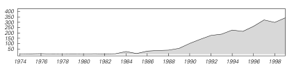
<!-- ORIGINAL_FIGURES page=0894 end -->

（关于有限域上线性递推的相关分析，在 1800 年代已经在少数情形中完成，并在 1930 年代作了相当详细的研究。）一般一维元胞自动机与非线性反馈移位寄存器有关；Solomon Golomb 在 1956-1959 年使用专用硬件探索过其中一些，包括令人惊讶地接近规则 30 的系统（见第 1088 页），用于抗干扰无线电控制应用，尽管同样主要集中于重复周期等问题。线性反馈移位寄存器很快在通信应用中广泛使用。非线性反馈移位寄存器似乎被广泛用于军事密码术，但尽管传闻不断，具体做了什么仍然保密。

在纯数学中，自 1800 年代晚期以来，人们已经以各种形式考虑由 `0` 和 `1` 构成的无穷序列。从 1930 年代开始，符号动力学的发展（见第 960 页）导致人们研究这类序列到自身的映射。到 1950 年代中期，人们（尤其 Gustav Hedlund）正在研究所谓与移位交换的块映射，而这些映射事实证明正好就是一维元胞自动机（见第 961 页）。1950 年代和 1960 年代早期，美国至少有若干杰出纯数学家在这一领域工作，但由于这在很大程度上是为了应用于密码术，许多内容被保密。公开发表的内容大多是关于过于全局化的特征的抽象定理，无法揭示我所讨论的那种复杂性。

特定类型的元胞自动机也在范围极广的情形中出现，通常使用不同名称。在 1950 年代晚期和 1960 年代早期，本质上是一维元胞自动机的东西被研究为优化算术和其他操作电路的方法。从 1960 年代起，理想化神经网络的模拟有时让神经元连接到网格上的邻居，产生二维元胞自动机。类似地，各种活性介质模型，特别是心脏和其他肌肉，以及反应-扩散过程，使用离散网格和离散激发状态，对应于二维元胞自动机。（在物理学中，统计力学的离散理想化，以及 Ising 模型等系统的动态版本，有时接近元胞自动机，只是有一个关键差异：其底层规则内置了随机性。）像规则 90 这样的加性元胞自动机，曾在 1800 年代关于二项式系数模素数的研究中隐含出现（见第 870 页），也出现在其他各种设置中，例如约 1970 年研究的“矮树森林”。

然而，到 1970 年代晚期，尽管存在所有这些不同方向，关于等价于元胞自动机的系统的研究已经大体逐渐消退。这竟然发生在计算机刚刚开始广泛可用于探索性工作的时候，是很讽刺的。但在某种意义上，这也很幸运，因为它使我在 1981 年开始研究元胞自动机时，能够以一种新方式定义这个领域（尽管后来多少有些遗憾的是，我为了承认历史，选择使用“元胞自动机”这个名称来称呼我正在研究的系统）。我关于元胞自动机的第一篇论文在 1983 年发表（见第 881 页），引发了该领域兴趣的迅速增加；从那以后，关于元胞自动机的论文数量持续增长（如下方所示科学引文索引中的源文档数量所表明），几乎全都沿着我定义的方向展开。

- 接近的路径。本章中的基本现象过去曾多次至少有些接近被发现。主要例子的历史进展似乎如下：

```text
公元前 500-200 年代：寻找素数或完全数等简单陈述的问题，大概被看出具有复杂解，但没有赋予其一般意义（见第 132 和 910 页）。
1200 年代：斐波那契序列、帕斯卡三角形和其他基于规则的数值构造被研究，但发现它们只显示简单行为。
1500 年代：列奥纳多·达·芬奇实验了对应于简单几何约束的规则（见第 875 页），但只找到满足这些约束的简单形式。
1700 年代：Leonhard Euler 等人为具有简单公式的数字计算连分数表示（见第 143 和 915 页），注意到某些情形中的规律性，但没有评论其他情形。
1700 和 1800 年代：pi 和其他超越数的数字被看出表现出表观随机性（见第 136 页），但并未出现把这种随机性看作来自计算过程的想法。
1800 年代：素数分布得到广泛研究，但主要考虑其规律性，而不是其不规律性。（见第 132 页。）
```

[[PDF page 895]]

```text
1800 年代：三体问题中发现复杂行为，但人们假定随着更好的数学技术出现，它最终会得到解决。（见第 972 页。）
1880 年代：John Venn 等人注意到 pi 的数字的表观随机性，但不知怎地把它视为当然。
1906 年：Axel Thue 研究简单替换系统（见第 893 页），并发现似乎复杂的行为，尽管事实证明它是嵌套的。
1910 年代：Gaston Julia 等人研究迭代映射，但集中于适合简单描述的性质。
1920 年：Moses Schonfinkel 引入组合子（见第 1121 页），但主要考虑专门构造来对应于普通逻辑函数的情形。
1921 年：Emil Post 考察一个简单标记系统（见第 894 页），其行为难以预测；但由于未能证明关于它的任何东西，转向其他问题。
1920 年：Ising 模型被引入，但人们只研究配置的统计，而不研究任何动力学。
1931 年：Kurt Godel 建立哥德尔定理（见第 782 页），但他使用的构造如此复杂，以至于他和其他人假定简单系统永远不能表现类似现象。
1930 年代中期：Alan Turing、Alonzo Church、Emil Post 等人引入各种计算模型，但把它们用于构造证明，而不研究简单例子的实际行为。
1930 年代：提出 `3 n + 1` 问题（见第 904 页），并发现不可预测行为，但主要焦点是证明关于它的简单结果。
1940 年代晚期和 1950 年代：伪随机数生成器得到发展（见第 974 页），但被看作技巧，其行为没有特别科学意义。
1940 年代晚期和 1950 年代早期：为说明控制论思想而构建的相当简单电子设备中，偶尔观察到复杂行为，但通常被看作应当避免的东西。
1952 年：Alan Turing 把计算机应用于生物系统研究，但使用传统数学模型，而不是例如图灵机。
1952-1953 年：John von Neumann 对复杂元胞自动机作理论研究，但没有尝试考察更简单情形，或在计算机上模拟这些系统。
1950 年代中期：Enrico Fermi 及合作者在计算机上模拟简单非线性弹簧系统，但没有注意到简单初始条件可以导致复杂行为。
1950 年代中期到 1960 年代中期：特定二维元胞自动机用于图像处理；少数表现出轻微复杂行为的规则被注意到，但被认为只是纯娱乐兴趣。
1950 年代晚期：进行了迭代映射的计算机模拟，但主要集中于重复行为。（见第 918 页。）
1950 年代晚期：动力系统理论中的思想开始应用于等价于一维元胞自动机的系统，但除平凡情形外，没有研究具体行为细节。
1950 年代晚期：理想化神经网络在数字计算机上被模拟，但所见略复杂行为主要被看作对感兴趣现象的干扰，并未被研究。（见第 1099 页。）
1950 年代晚期：Berni Alder 和 Thomas Wainwright 对硬球理想化分子的动力学作计算机模拟，但集中于不显示复杂性的大尺度特征。（见第 999 页。）
1956-1959 年：Solomon Golomb 模拟非线性反馈移位寄存器，其中一些规则接近规则 30，但主要研究其重复周期，而不是其细节复杂行为。（见第 1088 页。）
1960、1967 年：Stanislaw Ulam 及合作者模拟接近二维元胞自动机的系统，并注意到复杂图案的出现（见上文）。
1961 年：Edward Fredkin 模拟规则 90 的二维类似物，并注意到等同于嵌套的特征（见上文）。
1960 年代早期：MIT 的学生尝试运行许多小型计算机程序，并在某些情形中可视化其输出。他们发现了各种例子（如 “munching foos”），产生嵌套行为（见第 871 页），但没有继续深入。
1962 年：Marvin Minsky 等人研究许多简单图灵机，但没有走得足够远，以发现第 81 页所示的复杂行为。
1963 年：Edward Lorenz 模拟一个显示复杂行为的微分方程（见第 971 页），但集中于其无周期性和对初始条件的敏感依赖。
1960 年代中期：进行了随机布尔网络模拟（见第 936 页），但集中于简单平均性质。
```

[[PDF page 896]]

```text
1970 年：John Conway 引入生命游戏二维元胞自动机（见上文）。
1971 年：Michael Paterson 考虑一类简单二维图灵机，他称之为蠕虫，它们表现出复杂行为（见第 930 页）。
1973 年：我考察了一些二维元胞自动机，但强制规则具有防止复杂行为的性质（见第 864 页）。
1970 年代中期：Benoit Mandelbrot 发展分形思想（见第 934 页），并强调计算机图形在研究复杂形式中的重要性。
1970 年代中期：Tommaso Toffoli 模拟了最简单类型的全部 4096 个二维元胞自动机，但主要只研究它们从随机初始条件出发的稳定化。
1970 年代晚期：Douglas Hofstadter 研究一个具有复杂行为的递归序列（见第 907 页），但没有推进到足以得出很多结论。
1979 年：Benoit Mandelbrot 发现 Mandelbrot 集（见第 934 页），但集中于其嵌套结构，而不是其整体复杂性。
1981 年：我开始研究一维元胞自动机，并生成了一幅类似第 27 页规则 30 图像的小图，但没有研究它。
1984 年：我对规则 30 作出详细研究，并开始理解它和类似系统的重要性。
```

- 显式性的重要性。浏览本书时，与多数先前科学叙述相比，一个显著差异是存在大量显式图像，显示系统中每个元素怎样行动。过去，人们倾向于认为，只给出这类数据的数值概括会更科学。但如果没有这样的显式图像，我在本书中讨论的大多数现象都不可能被发现。（另见第 108 页。）

- 我关于元胞自动机的工作。我在 1981 年中期开始认真研究元胞自动机。当时我已经思考了一段时间：复杂图案怎样会在自然系统中出现，似乎违反热力学第二定律。我特别感兴趣的是自引力气体，其中基本物理似乎清楚，但星系形成等复杂现象似乎会发生。我也对神经网络感兴趣，而 Warren McCulloch 和 Walter Pitts 在 1940 年代已经发展出相当简单的模型。我提出元胞自动机，是为了尝试捕捉从自引力气体到神经网络的一系列系统的本质特征。我想找到一些模型，它们具有统计力学中 Ising 模型那样的简单结构（自 1920 年代以来被研究），但具有明确的时间演化规则，并且可以很容易在计算机上模拟。颇具讽刺意味的是，虽然元胞自动机适合许多事情，事实证明它们并不太适合为自引力气体或神经网络建模。（见第 1021 页。）但到我意识到这一点时，已经很清楚元胞自动机对许多其他目的非常有趣。

我在 1981 年末完成了第一次关于元胞自动机的大型计算机实验（见第 19 页）。最初最吸引我的有两个特征。第一，从随机初始条件出发，元胞自动机可以自组织产生复杂图案。第二，在规则 90 这样的情形中，简单初始条件会导致嵌套或分形图案。在 1982 年上半年，我努力使用来自统计力学、动力系统理论和离散数学的思想分析元胞自动机行为。1982 年 6 月，我完成了第一篇关于元胞自动机的论文，题为 “Statistical Mechanics of Cellular Automata”。这篇论文于 1983 年 7 月发表在 Reviews of Modern Physics 上，已经以原始形式呈现了许多关键思想，后来导致本书所描述科学的发展。它讨论了这样一个事实：通过不使用传统数学方程，简单模型潜在地可以重现复杂现象；它还提到把元胞自动机这类模型看作计算系统的一些后果。该论文还包含一幅从单个黑色元胞开始的规则 30 小图。但当时我没有详细研究这幅图，并默默假定每当我看到随机性，它都必定来自我使用的随机初始条件。（见第 112 页。）

我第一次知道自己发明的系统版本以前曾以“元胞自动机”这一名称被研究，是在 1981 年秋天的某个时候（在与当时几位年轻 MIT 计算机科学家共进晚餐时）。（我知道生命游戏，但其娱乐重点让我不想研究它。）知道“元胞自动机”这个名称后，我能够追踪到 1950 和 1960 年代相当多相关论文。但我发现，所谓元胞自动机的活跃研究已经差不多消退了（当时 MIT 有一个小组主要关心为二维元胞自动机构建专用硬件，这是轻微例外）。到 1982 年末，我关于元胞自动机论文的预印本已经引起相当轰动，我也参与组织了 1983 年 3 月在 Los Alamos 举办的会议，把许多新近对元胞自动机感兴趣的人与该领域早期工作者聚集在一起。

[[PDF page 897]]

作为准备那次会议的一部分，我决定使用刚获得的新工作站计算机（Sun Microsystems 的一台非常早期设备）的图形能力，系统研究大量不同元胞自动机的行为。花了几周时间看了一屏又一屏图案，并试图分析它们的性质之后，我得出结论：在具有随机初始条件的元胞自动机行为中，可以识别出四个基本类，每一类都有自己的特征（见第 231 页）。

在 1982 年和 1983 年早期，我分析元胞自动机的努力主要基于离散数学和动力系统理论中的思想。在 1983 年过程中，我也开始认真使用形式语言理论和计算理论。但在很大程度上，我集中于刻画从所有可能初始条件得到的行为。事实上，我仍隐约假定，如果使用简单初始条件，只会得到相当简单的行为。我的几篇论文实际上已经显示了相当详细的图像，说明情况并非如此。我注意到了它们，但它们从未成为我深入研究的例子，部分是因为一些表面原因：它们涉及的规则不对称，或者不可避免地导致不太方便展示的图案。我并不确切知道是什么让我开始更仔细地考察简单初始条件，尽管我相信我第一次系统生成所有 `k = 2, r = 1` 元胞自动机的高分辨率图像，是作为早期激光打印机练习，可能是在 1984 年初。我确实知道，例如在 1984 年 6 月 1 日，我打印出规则 30、规则 110 和 `k = 2, r = 2` 总和型代码 10（见下方注释）的图像，带着它们从纽约飞往伦敦；几天后，我在瑞典讨论规则 30 中的随机性及其潜在意义。

大约一个月后，为《科学美国人》撰写一篇名义上关于科学和数学中软件的文章，使我更仔细地思考计算和建模的基本问题，并第一次描述了计算不可约性的思想（见第 737 页）。1984 年秋，我开始研究我关于元胞自动机的发现对科学基础问题的一些含义。到 1985 年初，我已经写出我认为是那一时期最基本的两篇论文（尽管过短）：一篇关于理论物理中的不可判定性和难处理性，另一篇关于内禀随机性生成以及物理系统中随机性的起源。

1985 年初夏，我在一家名为 Thinking Machines Corporation 的初创公司做顾问，该公司开发了一种名为 Connection Machine 的大规模并行计算机，相当适合元胞自动机模拟。部分作为这台计算机的一个应用，我随后对规则 30 及其随机性作了详细研究，除其他事情外，提出把它作为实际随机序列生成器和密码系统。

我一直认为，元胞自动机可以成为处理热力学和流体动力学基础问题的一种方式。1985 年中期，部分为了寻找 Connection Machine 的用途，我设计了一种用元胞自动机做流体力学的实用方案（见第 378 页）。随后在那个冬天和次年春天，我分析了这一方案，并弄清它与传统连续方法的对应关系。

然而，到 1986 年，我觉得自己至少已经回答了关于元胞自动机的第一轮显然问题，并且越来越觉得使用当时可用的计算工具继续推进不会更容易。1986 年 6 月，我组织了最后一次元胞自动机会议；然后在 1986 年 8 月，我基本离开该领域，开始 Mathematica 的开发。

多年来，我一次又一次回来看元胞自动机，而每一次，我都会被它们表现出的现象丰富性震惊并愉悦。正如我在本书中论证的，范围极广的系统最终必定显示同样的基本现象。但元胞自动机，尤其是一维元胞自动机，使这些现象特别清楚；这就是为什么即使在研究过各种其他系统之后，一维元胞自动机仍然是本书中我使用得最多的例子。

- 我的论文。我发表的关于元胞自动机以及与本书相关其他问题的主要论文如下（日期表示我完成每篇论文工作的时间；论文实际发表在 6-12 个月之后）：

```text
"Statistical mechanics of cellular automata"（1982 年 6 月）
  引入一维元胞自动机并研究其许多性质
"Algebraic properties of cellular automata"（与 Olivier Martin 和 Andrew Odlyzko 合作）（1983 年 2 月）
  分析规则 90 等加性元胞自动机
"Universality and complexity in cellular automata"（1983 年 4 月）
  对元胞自动机行为分类
"Computation theory of cellular automata"（1983 年 11 月）
  使用形式语言理论刻画行为
```

[[PDF page 898]]

<!-- ORIGINAL_FIGURES page=0898 start -->
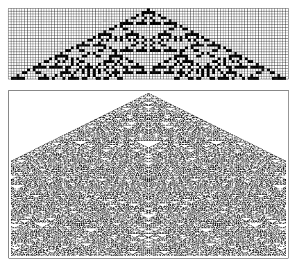
<!-- ORIGINAL_FIGURES page=0898 end -->

```text
"Two-dimensional cellular automata"（与 Norman Packard 合作）（1984 年 10 月）
  把结果扩展到二维
"Undecidability and intractability in theoretical physics"（1984 年 10 月）
  引入计算不可约性
"Origins of randomness in physical systems"（1985 年 2 月）
  引入内禀随机性生成
"Random sequence generation by cellular automata"（1985 年 7 月）
  对规则 30 作详细研究
"Thermodynamics and hydrodynamics of cellular automata"（与 James Salem 合作）（1985 年 11 月）
  从元胞自动机得到连续行为
"Approaches to complexity engineering"（1985 年 12 月）
  寻找实现指定目标的系统
"Cellular automaton fluids: Basic theory"（1986 年 3 月）
  从元胞自动机推导 Navier-Stokes 方程
```

这些论文中前五篇以及最后一篇的思想，在过去约十五年中已经得到相当好的吸收。但另外五篇中的思想还没有；事实上，它们似乎需要本书的整个发展，才能以恰当方式呈现。

我其他给出相关概述的重要出版物如下（这里的日期为实际发表日期，有时接近写作时间，但有时拖延很久）：

```text
"Computers in science and mathematics"（1984 年 9 月）
  《科学美国人》文章，关于科学和数学中计算方法的基础
"Cellular automata as models of complexity"（1984 年 10 月）
  Nature 文章，介绍元胞自动机
"Geometry of binomial coefficients"（1984 年 11 月）
  加性元胞自动机和嵌套图案
"Twenty problems in the theory of cellular automata"（1985 年）
  一份待攻克的未解问题列表，其中大多数现在终于在本书中解决
"Tables of cellular automaton properties"（1986 年 6 月）
  初等元胞自动机的特征
"Cryptography with cellular automata"（1986 年）
  使用规则 30 作为密码系统
"Complex systems theory"（1988 年）
  1984 年演讲，为新的 Santa Fe Institute 建议研究方向
```

- 代码 10。按许多衡量，规则 30 是从单个黑色初始元胞生成随机性的最简单元胞自动机。但还有其他简单例子，历史上我注意到它们略早于规则 30，尽管没有研究；它们出现在 `k = 2, r = 2` 总和型规则中。事实上，在这 64 条规则中，有 13 条显示随机性。下方所示例子是代码 10，它指定：如果 5 个元胞中有 1 个或 3 个为黑色，那么下一元胞为黑色；否则为白色。

[[PDF page 899]]

<!-- ORIGINAL_FIGURES page=0899 start -->
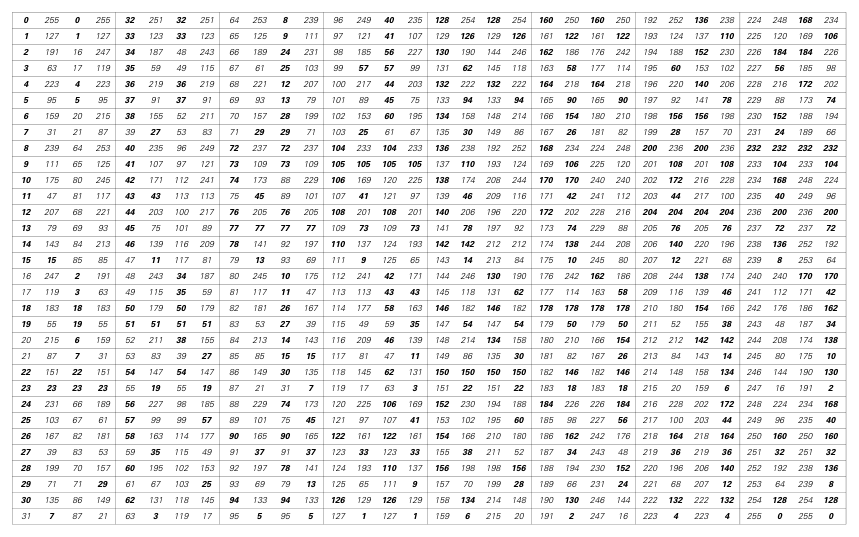
<!-- ORIGINAL_FIGURES page=0899 end -->

## 第 3 章注释

### 简单程序的世界

### 更多元胞自动机

- 第 53 页 · 编号方案。我在 1983 年首次讨论一维元胞自动机的论文中引入了这里使用的编号方案（见第 881 页）。我把双色最近邻元胞自动机称为“初等”，以反映这样一种思想：它们的规则已经尽可能简单。

- 第 55 页 · 规则等价。下表给出初等元胞自动机规则之间的基本等价关系。每个区块中，第二项是交换黑白后得到的规则，第三项是交换左右后得到的规则，第四项是同时应用这两种操作后得到的规则。（最小规则编号以粗体给出。）对于编号为 `n` 的规则，这两种操作分别对应于计算 `1 - Reverse[list]` 和 `list[[{1, 5, 3, 7, 2, 6, 4, 8}]]`，其中 `list = IntegerDigits[n, 2, 8]`。

- 特殊规则。规则 51：取补；规则 170：左移；规则 204：恒等；规则 240：右移。这些规则在每个邻域中只依赖一个元胞。

- 规则表达式。下一页的表给出每条初等规则的布尔表达式。这些表达式使用尽可能少的运算符；当存在几种等价形式时，我给出最统一和对称的形式。

[[PDF page 900]]

<!-- ORIGINAL_FIGURES page=0900 start -->
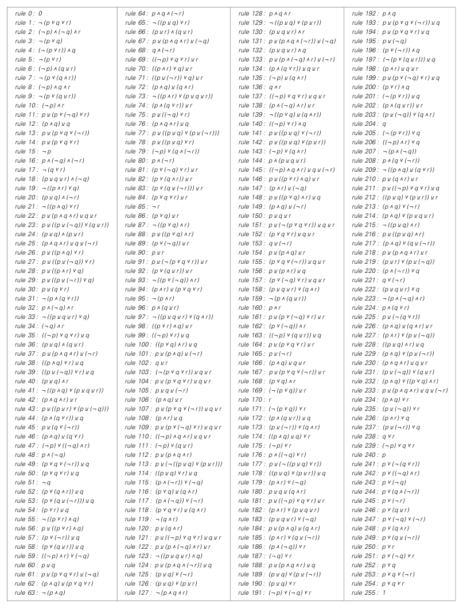
<!-- ORIGINAL_FIGURES page=0900 end -->

初等规则的布尔表达式表。表中按规则编号列出每条规则对应的表达式；这里的运算符记号包括 AND、OR、NOT 和 XOR 等。由于原表主要是公式清单，译文保留其作为图版说明，不逐项重排全部 256 条表达式。

[[PDF page 901]]

<!-- ORIGINAL_FIGURES page=0901 start -->
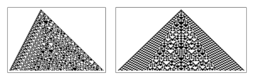
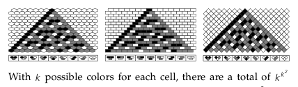
<!-- ORIGINAL_FIGURES page=0901 end -->

注意，表中的 `Xor` 表示异或。

- 规则排序。相继规则常常显示非常不同的行为这一事实，似乎并不会因使用 Gray 码等替代排序而受影响（见第 901 页）。

- 第 58 页 · 代数形式。这里的规则可以用代数术语（见第 869 页）表示如下：

```text
规则 22：Mod[p + q + r + p q r, 2]
规则 60：Mod[p + q, 2]
规则 105：Mod[1 + p + q + r, 2]
规则 129：Mod[1 + p + q + r + p q + q r + p r, 2]
规则 150：Mod[p + q + r, 2]
规则 225：Mod[1 + p + q + r + q r, 2]
```

注意，规则 60、105 和 150 与规则 90 一样，都是加性的。

- 规则 150。这个规则可以被看作规则 90 的类似物，只不过它把三个元胞而不是两个元胞的值按模 2 相加。对应于第 870 页关于规则 90 的结果，规则 150 图案中第 `t` 行黑色元胞的数量由下式给出：

```wolfram
Apply[Times, Map[(2 # + 2 - (-1)^# + 2)/3 &,
  Cases[Split[IntegerDigits[t, 2]], k : {(1)..} -> Length[k]]]]
```

到步骤 `2^m` 为止所得图案中，总共有 `2^m Fibonacci[m + 2]` 个黑色元胞，这意味着分形维数为 `Log[2, 1 + Sqrt[5]]`。（另见第 956 页。）

紧邻中心的列在步骤 `t` 上的值，是第 892 页讨论的嵌套序列，由 `Mod[IntegerExponent[t, 2], 2]` 给出。事实证明，第 `t` 行位置 `n` 处的元胞由 `Mod[GegenbauerC[n, -t, -1/2], 2]` 给出，如第 612 页所讨论。

- 规则 225。经过 `t` 步后的图案宽度，在 `Sqrt[3/2] Sqrt[t]`（当 `t = 3 x 2^(2 n + 1)` 时达到）和 `Sqrt[9/2] Sqrt[t]`（当 `t = 2^(2 n + 1)` 时达到）之间变化。该图案在水平方向和垂直方向上的缩放不同，分别对应于分形维数 `Log[2, 5]` 和 `Log[4, 5]`。注意，对于更复杂的初始条件，规则 225 往往不再产生规则嵌套图案，如第 951 页所示。所得图案通常以大致恒定的平均速率生长。

- 规则 22。对于更复杂的初始条件，图案往往不再嵌套，如第 263 页所示。

- 第 59 页 · 代数形式。这里的规则可以用代数术语（见第 869 页）表示如下：

```text
规则 30：Mod[p + q + r + q r, 2]
规则 45：Mod[1 + p + r + q r, 2]
规则 73：Mod[1 + p + q + r + p r + p q r, 2]
```

- 规则 45。该图案中心列在实践目的上显得随机，就像规则 30 中一样。图案左边缘每 2 步移动 1 个元胞；重复与随机之间的边界平均每步移动 0.17 个元胞。

- 规则 73。该图案有一些明确规律。元胞中心列是重复的，在连续步骤中黑白交替。在所有情形中，黑色元胞只出现在宽度为奇数个元胞的块中。（规则 73 中任何由偶数个黑色元胞构成的块都会演化为永远保持固定的结构，如第 954 页所提到。）图案中更复杂的中心区域每 7 步增长 4 个元胞；外部区域由宽度为 12 个元胞并每 3 步重复的块组成。

- 交替颜色。下方图像显示了规则 45 和 73，但把交替步骤上的元胞颜色反转。

- 二元胞邻域。通过把连续步骤上的元胞排列得像六边形或错列砖块，如下方图像所示，可以设置这样的元胞自动机：每个元胞的新颜色取决于前一步两个邻近元胞的颜色，而不是三个。

如果每个元胞有 `k` 种可能颜色，那么这种类型的可能规则总数为 `k^(k^2)`，每条规则由一个以 `k` 为底的 `k^2` 位数字指定（上方所示规则为 7743）。对于 `k = 2`，有 16 条可能规则，所得最复杂图案像规则 90 初等元胞自动机那样嵌套。对于 `k = 3`，有 19683 条可能规则，其中 1734 条在根本上不等价，并且会看到更多复杂图案，如下一页顶部图像所示。

[[PDF page 902]]

<!-- ORIGINAL_FIGURES page=0902 start -->
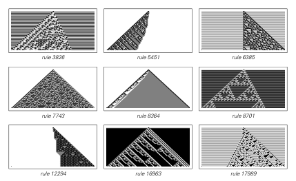
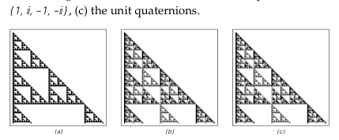
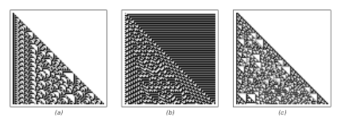
<!-- ORIGINAL_FIGURES page=0902 end -->

如果规则由 `IntegerDigits[num, k, k^2]` 给出，那么一步演化可以实现为

```wolfram
CAStep[{k_, rule_}, a_List] := rule[[k^2 - RotateLeft[a] - k a]]
```

- 第 60 页 · 规则数量。允许每个元胞有 `k` 种可能颜色，并考虑每侧 `r` 个邻居时，元胞自动机规则总数为 `k^(k^(2 r + 1))`，其中对称规则为 `k^((k^(2 r + 1) + k^(r + 1))/2)` 条，总和型规则为 `k^(1 + (k - 1)(2 r + 1))` 条。（因此，对于 `k = 2, r = 1`，总共有 256 条可能规则，其中 16 条为总和型。对于 `k = 2, r = 2`，总共有 4294967296 条规则，其中 64 条为总和型。对于 `k = 3, r = 1`，总共有 7625597484987 条规则，其中 2187 条为总和型。）注意，当 `k > 2` 时，某条特定规则一般只会在颜色值某个特定赋值下为总和型。我在 1983 年首次引入总和型规则。

- 一般元胞自动机的实现。对于有 `k` 种颜色、每侧有 `r` 个邻居的一般元胞自动机，其演化的一步由下式给出：

```wolfram
CAStep[CARule[rule_List, k_, r_], a_List] :=
  rule[[-1 - ListConvolve[k^Range[0, 2 r], a, r + 1]]]
```

其中 `rule` 由规则编号 `num` 通过 `IntegerDigits[num, k, k^(2 r + 1)]` 得到。（另见第 927 页。）

- 总和型元胞自动机的实现。为了处理涉及 `k` 种颜色和最近邻的总和型规则，可以在第 867 页给出的内容上添加定义

```wolfram
CAStep[TotalisticCARule[rule_List, 1], a_List] :=
  rule[[-1 - (RotateLeft[a] + a + RotateRight[a])]]
```

下面的定义也处理更一般的 `r` 个邻居情形：

```wolfram
CAStep[TotalisticCARule[rule_List, r_Integer], a_List] :=
  rule[[-1 - Sum[RotateLeft[a, i], {i, -r, r}]]]
```

可以用下面方式从代码编号生成这些函数所使用的总和型规则表示：

```wolfram
ToTotalisticCARule[num_Integer, k_Integer, r_Integer] :=
  TotalisticCARule[IntegerDigits[num, k, 1 + (k - 1)(2 r + 1)], r]
```

- 共同框架。第 867 页讨论的 Mathematica 内置函数 `CellularAutomaton`，通过使用 `ListConvolve[w, a, r + 1]`，并让权重 `w` 分别取 `k^Table[i - 1, {i, 2 r + 1}]` 和 `Table[1, {2 r + 1}]`，在同一框架中处理一般规则和总和型规则。

- 第 63 页 · 模 3 规则。代码 420 是一个加性规则例子，并产生对应于帕斯卡三角形按模 3 化简的图案，如第 870 页所讨论。

- 元胞自动机的复合。从较简单规则的复合构造较复杂规则，是一种方式。例如，人们可以考虑每一步先应用一个初等元胞自动机规则，再应用另一个。所得结果实际上是一条 `k = 2, r = 2` 规则。通常，两个初等规则应用的顺序会有影响，所得整体行为与任一单独规则的行为没有简单关系。（另见第 956 页。）

- 基于代数系统的规则。如果把元胞值看作某个有限代数系统的元素，那么可以设置具有如下规则的元胞自动机：

```wolfram
a[t_, i_] := f[a[t - 1, i - 1], a[t - 1, i]]
```

其中 `f` 是该系统中乘法的类似物（另见第 1094 页）。`t` 步后所得图案随后由

```wolfram
NestList[f[RotateRight[#], #] &, init, t]
```

给出。下方图像显示了 `f` 为 `Times` 时的结果，元胞取值分别为 (a) `{1, -1}`，(b) 单位复数 `{1, I, -1, -I}`，(c) 单位四元数。

一般来说，对于 `n` 个元素，`f` 可以由一个 `n x n` “乘法表”指定。对于 `n = 2`，所得图案至多是嵌套的。不过下方图像 (a) 和 (b) 对应于 `n = 3` 的乘法表 `{{1, 1, 3}, {3, 3, 2}, {2, 2, 1}}` 和 `{{3, 1, 3}, {1, 3, 1}, {3, 1, 2}}`。注意，对于 (b)，该表是对称的，对应于交换乘法运算。

如果 `f` 是结合的（平坦的），使得 `f[f[i, j], k] = f[i, f[j, k]]`，那么该代数系统称为半群。（另见第 805 页。）

[[PDF page 903]]

<!-- ORIGINAL_FIGURES page=0903 start -->
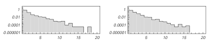
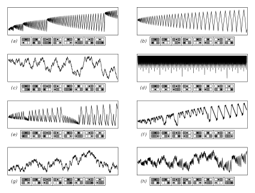
<!-- ORIGINAL_FIGURES page=0903 end -->

从单元胞种子出发，在这样的系统中无法得到比嵌套更复杂的图案。而对于任意种子，似乎需要一个至少含有六个元素的半群，才能得到更复杂图案。

如果 `f` 有单位元，使得对所有 `i` 都有 `f[1, i] = i`，并且有逆元，使得对某个 `j` 有 `f[i, j] = 1`，那么该系统就是一个群。（见第 945 页。）如果该群是 Abel 群，使得 `f[i, j] = f[j, i]`，那么只会产生嵌套图案（见第 955 页）。但事实证明，最简单的可能非 Abel 群就会产生上方 (c) 中的图案。所用群为 `S_3`，它有六个元素，乘法表为

```text
{{1, 2, 3, 4, 5, 6},
 {2, 1, 5, 6, 3, 4},
 {3, 4, 1, 2, 6, 5},
 {4, 3, 6, 5, 1, 2},
 {5, 6, 2, 1, 4, 3},
 {6, 5, 4, 3, 2, 1}}
```

初始条件包含 `{5, 6}`，周围环绕 `1`。

### 移动自动机

- 实现。某一步上移动自动机的状态可以表示为 `{list, n}`，其中 `list` 给出各元胞的值，`n` 指定活动元胞的位置（因此活动元胞的值为 `list[[n]]`）。例如，第 71 页所示移动自动机的规则可以写成

```wolfram
{{1, 1, 1} -> {0, 1}, {1, 1, 0} -> {0, 1},
 {1, 0, 1} -> {1, -1}, {1, 0, 0} -> {0, -1},
 {0, 1, 1} -> {0, -1}, {0, 1, 0} -> {0, 1},
 {0, 0, 1} -> {1, 1}, {0, 0, 0} -> {1, -1}}
```

其中每种情形的左边给出活动元胞及其左右邻居的值，右边则是一个二元组，包含活动元胞的新值和其位置位移。（类比元胞自动机，这条规则可以标为 `{35, 57}`，其中第一个数对应颜色，第二个数对应位移。）在这种形式下，移动自动机演化中的每一步对应于函数

```wolfram
MAStep[rule_, {list_List, n_Integer}] /; 1 < n < Length[list] :=
  Apply[{ReplacePart[list, #1, n], n + #2} &,
    Replace[Take[list, {n - 1, n + 1}], rule]]
```

多步的完整演化随后可以用

```wolfram
MAEvolveList[rule_, init_List, t_Integer] :=
  NestList[MAStep[rule, #] &, init, t]
```

得到。（如果在把规则作为输入给出之前先对它应用 `Dispatch`，程序会运行得更高效。）

对于第 73 页的移动自动机，规则可以写成

```wolfram
{{1, 1, 1} -> {{0, 0, 0}, -1}, {1, 1, 0} -> {{1, 0, 1}, -1},
 {1, 0, 1} -> {{1, 1, 1}, 1},  {1, 0, 0} -> {{1, 0, 0}, 1},
 {0, 1, 1} -> {{0, 0, 0}, 1},  {0, 1, 0} -> {{0, 1, 1}, -1},
 {0, 0, 1} -> {{1, 0, 1}, 1},  {0, 0, 0} -> {{1, 1, 1}, 1}}
```

而 `MAStep` 必须改写为

```wolfram
MAStep[rule_, {list_List, n_Integer}] /; 1 < n < Length[list] :=
  Apply[{Join[Take[list, {1, n - 2}], #1, Take[list, {n + 2, -1}]],
    n + #2} &, Replace[Take[list, {n - 1, n + 1}], rule]]
```

- 压缩演化。第 488 页讨论了用于移动自动机的另一种压缩方案。

- 第 72 页 · 行为分布。下方图像显示了这里所描述类型的 65,318 个最终重复的移动自动机中，暂态长度和周期长度的分布。规则 (f) 的周期达到最大值 16。

- 第 75 页 · 活动元胞运动。下方图像显示了各种移动自动机在 20,000 步演化中活动元胞的位置。(a)、(b)、(c) 分别对应第 73、74、75 页的规则。(c) 的外包络边界以约 `{-1.5, 0.3} Sqrt[t]` 的速率增长。(d) 产生第 496 页所示的对数增长（类似第 79 页的图灵机 (f)）。在最终重复的大多数情形中，暂态和周期似乎遵循上面注释中相同的近似指数分布。不过 (g) 在 405,941 步之后突然进入周期为 4032 的重复行为。(h) 看来不会演化到严格重复或嵌套，但确实显示出越来越长、相当有序的片段。(c) 至少在前十亿步中没有显示出明显偏离随机性的迹象（此时它产生的图案宽 57,014 个元胞）。

- 广义移动自动机的实现。某一步上广义移动自动机的状态可以表示为

[[PDF page 904]]

<!-- ORIGINAL_FIGURES page=0904 start -->
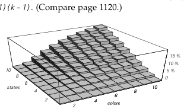
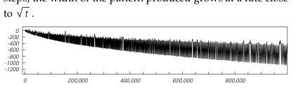
<!-- ORIGINAL_FIGURES page=0904 end -->

`{list, nlist}`，其中 `list` 给出各元胞的值，`nlist` 是活动元胞位置的列表。规则可以通过指定一组情形给出，例如 `{0, 0, 0} -> {1, {1, -1}}`；在每种情形中，第二个子列表指定新的活动元胞相对位置。在这种设置下，系统演化的连续各步可以由

```wolfram
GMAStep[rules_, {list_, nlist_}] := Module[{a, na},
  {a, na} = Transpose[
    Map[Replace[Take[list, {# - 1, # + 1}], rules] &, nlist]];
  {Fold[ReplacePart[#1, Last[#2], First[#2]] &,
    list, Transpose[{nlist, a}]], Union[Flatten[nlist + na]]}]
```

得到。

### 图灵机

- 实现。某一步上图灵机的状态可以表示为三元组 `{s, list, n}`，其中 `s` 给出读写头的状态，`list` 给出各元胞的值，`n` 指定读写头的位置（因而读写头下方元胞的值为 `list[[n]]`）。例如，第 78 页所示图灵机的规则可以写成

```wolfram
{{1, 0} -> {3, 1, -1}, {1, 1} -> {2, 0, 1},
 {2, 0} -> {1, 1, 1},  {2, 1} -> {3, 1, 1},
 {3, 0} -> {2, 1, 1},  {3, 1} -> {1, 0, -1}}
```

其中每种情形左边给出读写头的状态和读写头下方元胞的值，右边则是一个三元组，给出读写头的新状态、读写头下方元胞的新值以及读写头的位移。

如果规则以这种形式给出，图灵机演化中的单步可以用函数

```wolfram
TMStep[rule_List, {s_, a_List, n_}] /; 1 < n < Length[a] :=
  Apply[{#1, ReplacePart[a, #2, n], n + #3} &,
    Replace[{s, a[[n]]}, rule]]
```

实现。多步演化随后可以用

```wolfram
TMEvolveList[rule_, init_List, t_Integer] :=
  NestList[TMStep[rule, #] &, init, t]
```

得到。另一种做法是把图灵机的完整状态表示为 `MapAt[{s, #} &, list, n]`，随后使用

```wolfram
TMStep[rule_, c_] := Replace[c,
  {a___, x_, h_List, y_, b___} :>
    Apply[{{a, x, #2, {#1, y}, b},
           {a, {#1, x}, #2, y, b}}[[#3]] &, h /. rule]]
```

从空白纸带出发演化 `t` 步的结果也可以由下面程序得到（另见第 1143 页）：

```wolfram
s = 1; a[_] = 0; n = 0;
Do[{s, a[n], d} = {s, a[n]} /. rule; n += d, {t}]
```

- 规则数。若每个元胞有 `k` 种可能颜色、读写头有 `s` 种可能状态，则共有 `(2 s k)^(s k)` 条可能的图灵机规则。通常其中许多规则立即等价，或者只能表现出很简单的行为（见第 1120 页）。

- 编号方案。可以用下面方式给图灵机编号并得到其规则：

```wolfram
Flatten[
  MapIndexed[{1, -1} #2 + {0, k} ->
      {1, 1, 2} Mod[Quotient[#1, {2 k, 2, 1}], {s, k, 2}] +
        {1, 0, -1} &,
    Partition[IntegerDigits[n, 2 s k, s k], k], {2}]]
```

第 79 页的例子编号为 3024、982、925、1971、2506 和 1953。

- 第 79 页 · 计数器机器。图灵机 (f) 像一个二进制计数器那样工作：在其读写头位于最左端的位置的那些步骤上，元胞颜色对应于连续整数二进制数字序列的反转。因此，所有可能的颜色排列最终都会产生。整体图案在 `2^j - j` 步之后达到宽度 `j`。

- 第 80 页 · 行为分布。对于每个元胞有 2 种可能颜色、读写头有 2 种可能状态，并从空白纸带开始的情形，得到的最大重复周期为 9 步；4096 条可能规则中有 12 条（约 0.29%）产生非重复行为。对于 3 个状态、2 种颜色，最大周期为 24，约 0.37% 的规则产生非重复行为，而且总是嵌套的。（通常即使用同时含有黑白元胞的初始条件，我也没有在这类规则中发现更复杂的行为，不过见第 761 页。）对于 2 个状态、3 种颜色，最大重复周期同样为 24，约 0.65% 的规则产生非重复行为，第 709 页讨论的 14 条规则则产生更复杂的行为。随着颜色数或状态数增加，产生非重复行为的规则比例稳步上升，如下方所示，大致像 `0.28 (s - 1)(k - 1)`。（比较第 1120 页。）

- 第 81 页 · 读写头运动。下方图像显示了前一百万步中读写头的运动。约 20,000 步之后，所得图案的宽度以接近 `Sqrt[t]` 的速率增长。

- 局部结构。即使一个图灵机的整体行为很复杂，也可能存在简单的局部结构，这很像

[[PDF page 905]]

<!-- ORIGINAL_FIGURES page=0905 start -->
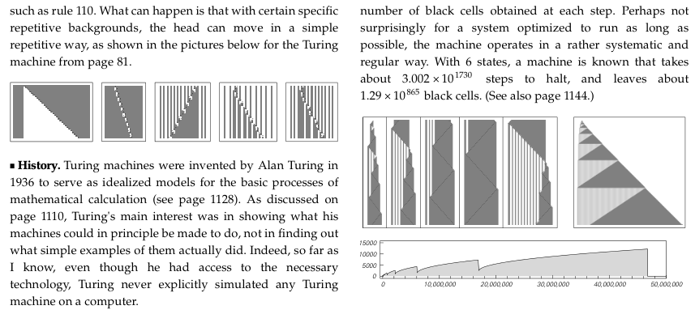
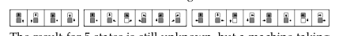
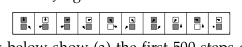
<!-- ORIGINAL_FIGURES page=0905 end -->

规则 110 这样的元胞自动机中发生的情况。可能出现的是：对于某些特定重复背景，读写头能够以简单重复的方式移动，如下方第 81 页图灵机的图像所示。

- 历史。Alan Turing 于 1936 年发明图灵机，作为数学计算基本过程的理想化模型（见第 1128 页）。如第 1110 页所讨论，Turing 主要关心的是展示他的机器原则上能被构造成做什么，而不是弄清简单实例实际上会做什么。事实上，据我所知，尽管 Turing 可以接触到必要技术，他从未明确地在计算机上模拟过任何图灵机。

自 Turing 之后，图灵机已被理论计算机科学广泛用作抽象模型。但几乎没有人考虑过简单图灵机的显式行为。不过在 1960 年代早期，Marvin Minsky 等人确实研究过能表现某些性质的最简单图灵机。他们的大部分努力都放在寻找巧妙构造以创建适当机器上（见第 1119 页）。但在 1961 年前后，他们系统研究了全部 4096 个 2 状态 2 颜色机器，并在计算机上模拟了一些简单图灵机的行为。他们发现了重复和嵌套行为，但没有考察足够多的例子来发现正文中显示的更复杂行为。

作为图灵机抽象研究的一个分支，Tibor Rado 在 1962 年提出了他称为忙碌海狸问题（Busy Beaver Problem）的问题：在指定状态数下，寻找一个图灵机，使它在最终达到某个特定“停机状态”（下文编号为 0）之前尽可能多地“保持忙碌”。（该问题的一个变体询问机器停机时留下的黑色元胞最大数目。）到 1966 年，2、3、4 个状态的结果已经找到：最大步数分别为 6、21 和 107，最终黑色元胞数分别为 4、5 和 13。达到这些界的规则见原书相应图示。

5 个状态的结果仍然未知，但 Heiner Marxen 和 Jurgen Buntrock 在 1990 年发现了一台运行 47,176,870 步并留下 4098 个黑色元胞的机器。其规则见原书图示。下方图像显示了 (a) 前 500 步演化，(b) 压缩形式的前一百万步，(c) 每一步得到的黑色元胞数。对于一个被优化为尽可能长时间运行的系统来说，也许并不令人惊讶的是，这台机器以相当系统、规则的方式工作。对于 6 个状态，已知有一台机器需要约 `3.002 x 10^1730` 步才会停机，并留下约 `1.29 x 10^865` 个黑色元胞。（另见第 1144 页。）

### 替换系统

- 实现。对于像第 82 页第一个例子那样与邻居无关的替换系统，规则可以方便地写成 `{1 -> {1, 0}, 0 -> {0, 1}}`。用这种表示，`t` 步演化由

```wolfram
SSEvolveList[rule_, init_List, t_Integer] :=
  NestList[Flatten[# /. rule] &, init, t]
```

给出；第 82 页第一个例子的初始条件为 `{1}`。

另一种做法是使用字符串，把规则表示为 `{"B" -> "BA", "A" -> "AB"}`，把初始条件表示为 `"B"`。在这种情形中，演化可以用

```wolfram
SSEvolveList[rule_, init_String, t_Integer] :=
  NestList[StringReplace[#, rule] &, init, t]
```

得到。

对于像第 85 页第一个例子那样依赖邻居的替换系统，规则可以写成

```wolfram
{{1, 1} -> {0, 1}, {1, 0} -> {1, 0},
 {0, 1} -> {0},    {0, 0} -> {0, 1}}
```

用这种表示，`t` 步演化由

```wolfram
SS2EvolveList[rule_, init_List, t_Integer] :=
  NestList[Flatten[Partition[#, 2, 1] /. rule] &, init, t]
```

给出；第 85 页第一个例子的初始条件为 `{0, 1, 1, 0}`。

- 第 83 页 · 性质。这里显示的例子都在本书许多不同语境中出现。注意，它们实际上都产生一个单一序列，并在每一步变得越来越长；另一些规则会使元素颜色在连续步骤中交替。

(a)（连续数字序列）产生的序列是重复的：位置 `n` 上的元素当 `n`

[[PDF page 906]]

<!-- ORIGINAL_FIGURES page=0906 start -->
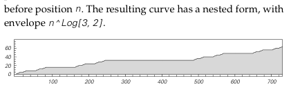
<!-- ORIGINAL_FIGURES page=0906 end -->

为奇数时为黑色，当 `n` 为偶数时为白色。`t` 步之后共有 `2^t` 个元素。把所有步骤合在一起观察所形成的完整图案，与第 117 页所示连续整数的二进制数字排列具有相同结构。

(b)（Thue-Morse 序列）位置 `n` 上元素的颜色 `s[n]` 由 `1 - Mod[DigitCount[n - 1, 2, 1], 2]` 给出。这些颜色满足

```wolfram
s[n_] := If[EvenQ[n], 1 - s[n/2], s[(n + 1)/2]]
```

并有 `s[1] = 1`。`t` 步之后序列中共有 `2^t` 个元素。第 `t` 步的序列可以由 `Nest[Join[#, 1 - #] &, {1}, t - 1]` 得到。每一步黑白元素的数目总是相同。所有四种可能的连续元素对都会出现，尽管频率并不相等。三个相同元素的连续串永远不会出现，而且一般而言，任何元素块都不可能出现超过两次。序列的前 `2^m` 个元素可以由（见第 1081 页）

```wolfram
(CoefficientList[Product[1 - z^(2^s), {s, 0, m - 1}], z] + 1)/2
```

得到。前 `n` 个元素也可以由（见第 1092 页）

```wolfram
Mod[CoefficientList[
  Series[(1 + Sqrt[(1 - 3 x)/(1 + x)])/(2 (1 + x)),
    {x, 0, n - 1}], x], 2]
```

得到。这个序列在本书中多次出现；例如，它可以从第 885 页讨论的规则 150 元胞自动机图案的一列取值中导出。

(c)（斐波那契相关序列）第 `t` 步的序列可以由

```wolfram
a[t_] := Join[a[t - 1], a[t - 2]];
a[1] = {0}; a[2] = {0, 1};
```

得到。这个序列长度为 `Fibonacci[t + 1]`（约为 `1.618^(t + 1)`；见下方注释）。位置 `n` 上元素的颜色由 `2 - (Floor[(n + 1) GoldenRatio] - Floor[n GoldenRatio])` 给出（见第 904 页），而第 `k` 个白色元素的位置由所谓 Beatty 序列 `Floor[k GoldenRatio]` 给出。第 `t` 步白色元素与黑色元素数目的比为 `Fibonacci[t - 1]/Fibonacci[t - 2]`，当 `t` 很大时趋近于 `GoldenRatio`。对于所有 `m < Fibonacci[t - 1]`，在 `2^m` 种可能中实际出现的长度为 `m` 的不同连续元素块数为 `m + 1`（这使它成为第 1084 页讨论的所谓 Sturmian 序列）。

(d)（Cantor 集）位置 `n` 上元素的颜色由 `If[FreeQ[IntegerDigits[n - 1, 3], 1], 1, 0]` 给出，而这等价于

```wolfram
If[OddQ[n], Sign[Mod[Binomial[n - 1, (n - 1)/2], 3]], 0]
```

`t` 步之后共有 `3^t` 个元素，其中 `2^t` 个为黑色。下方图像显示了位置 `n` 之前出现的黑色元胞数。所得曲线具有嵌套形式，其包络为 `n^Log[3, 2]`。

- 增长率。在与邻居无关的替换系统中，每一步出现的每种颜色元素总数，可以通过构造矩阵 `m` 来求得，其中 `m[[i, j]]` 给出替换颜色 `i + 1` 的元素的块中出现颜色 `j + 1` 元素的数目。对于上面的情形 (c)，`m = {{1, 1}, {1, 0}}`。随后，给出第 `t` 步每种颜色元素数目的列表可以由 `init . MatrixPower[m, t]` 找到，其中 `init` 给出每种颜色元素的初始数目，在情形 (c) 中为 `{1, 0}`。当 `t` 很大时，元素总数通常像 `lambda^t` 那样增长，其中 `lambda` 是 `m` 的最大特征值；每种颜色元素的相对数目由对应特征向量给出。对于情形 (c)，`lambda` 为 `GoldenRatio`，即 `(1 + Sqrt[5])/2`。

也有一些例外情形中 `lambda = 1`，增长不是指数的。对于规则 `{0 -> {0, 1}, 1 -> {1}}`，有 `m = {{1, 1}, {0, 1}}`，从 `{0}` 开始时第 `t` 步的元素数只是 `t`。对于 `{0 -> {0, 1}, 1 -> {1, 2}, 2 -> {2}}`，有 `m = {{1, 1, 0}, {0, 1, 1}, {0, 0, 1}}`，从 `{0}` 开始时元素数为 `(t^2 - t + 2)/2`。对于与邻居无关的规则，大 `t` 时的增长必须遵循某种指数形式，或者小于可能颜色数的某个整数幂。对于依赖邻居的规则，原则上可以得到任意形式的增长。

- 斐波那契数。斐波那契数 `Fibonacci[n]`（简写为 `f[n]`）可以由递推关系

```wolfram
f[n_] := f[n] = f[n - 1] + f[n - 2]
f[1] = f[2] = 1
```

生成。前几个斐波那契数为：1, 1, 2, 3, 5, 8, 13, 21, 34, 55, 89, 144, 233, 377。对于大的 `n`，比值 `f[n]/f[n - 1]` 趋近于 `GoldenRatio`，即 `(1 + Sqrt[5])/2 ~= 1.618`。

`Fibonacci[n]` 可以用许多方式得到，例如：

```wolfram
(GoldenRatio^n - (-GoldenRatio)^(-n))/Sqrt[5]
Round[GoldenRatio^n/Sqrt[5]]
2^(1 - n) Coefficient[(1 + Sqrt[5])^n, Sqrt[5]]
MatrixPower[{{1, 1}, {1, 0}}, n - 1][[1, 1]]
Numerator[NestList[1/(1 + #) &, 1, n]]
Coefficient[Series[1/(1 - t - t^2), {t, 0, n}], t^(n - 1)]
Sum[Binomial[n - i - 1, i], {i, 0, (n - 1)/2}]
2^(n - 2) - Count[IntegerDigits[Range[0, 2^(n - 2)], 2], {___, 1, 1, ___}]
```

一种快速求 `Fibonacci[n]` 的方法是

```wolfram
First[Fold[f, {1, 0, -1}, Rest[IntegerDigits[n, 2]]]]
f[{a_, b_, s_}, 0] = {a (a + 2 b), s + a (2 a - b), 1}
f[{a_, b_, s_}, 1] = {-s + (a + b) (a + 2 b), a (a + 2 b), -1}
```

斐波那契数似乎最早可能出现在公元前 200 年左右 Pingala 关于由两种长度音节形成的诗歌可能模式枚举的工作中。Leonardo Fibonacci 于 1202 年把它们作为一个关于兔子繁殖的数学谜题的解独立讨论；Johannes Kepler 于 1611 年在关于五边形近似的语境中也讨论过它们。它们的递推关系似乎从 1600 年代早期起就已被理解，但直到过去很少几十年，它们才总体上受到广泛讨论。

[[PDF page 907]]

<!-- ORIGINAL_FIGURES page=0907 start -->
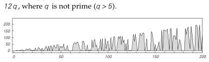
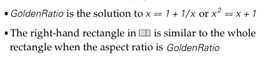
<!-- ORIGINAL_FIGURES page=0907 end -->

对于 `m > 1`，使 `m` 约等于 `Fibonacci[n]` 的 `n` 值为 `Round[Log[GoldenRatio, Sqrt[5] m]]`。

序列 `Mod[Fibonacci[n], k]` 总是纯粹重复的；最大周期为 `6 k`，在 `k = 10 x 5^m` 时达到（比较第 975 页）。

`Mod[Fibonacci[n], n]` 具有下方所示的相当复杂的形式。它看来只有当 `n` 形如 `5^m` 或 `12 q`，且 `q` 不是素数（`q > 5`）时才为零。

数 `GoldenRatio` 自古以来似乎已用于艺术和建筑。`1/GoldenRatio` 是 Mathematica 图形的默认 `AspectRatio`。此外：

- `GoldenRatio` 是 `x = 1 + 1/x` 或 `x^2 = x + 1` 的解。
- 当纵横比为 `GoldenRatio` 时，右侧矩形与整个矩形相似。
- `Cos[Pi/5] = Cos[36 Degree] = GoldenRatio/2`。
- 正五边形中对角线长度与边长之比为 `GoldenRatio`。
- 正二十面体的顶点可取坐标

```wolfram
Flatten[Array[NestList[RotateRight,
  {0, (-1)^#1 GoldenRatio, (-1)^#2}, 3] &, {2, 2}], 2]
```

- `1 + FixedPoint[N[1/(1 + #), k] &, 1]` 可以把 `GoldenRatio` 近似到 `k` 位，`FixedPoint[N[Sqrt[1 + #], k] &, 1]` 也可以。
- 连续角差为 `GoldenRatio` 弧度时，所得点在圆周上达到最大分离（见第 1006 页）。

- Lucas 数。Lucas 数 `Lucas[n]` 满足与斐波那契数相同的递推关系 `f[n_] := f[n - 1] + f[n - 2]`，但初始条件为 `f[1] = 1; f[2] = 3`。Lucas 数满足的关系包括：

```wolfram
Lucas[n_] := Fibonacci[n - 1] + Fibonacci[n + 1]
GoldenRatio^n = (Lucas[n] + Fibonacci[n] Sqrt[5])/2
```

- 广义斐波那契序列。任何线性递推关系都会产生许多性质与斐波那契数相同的序列，只是 `GoldenRatio` 被其他代数数取代。Perrin 序列 `f[n_] := f[n - 2] + f[n - 3]; f[0] = 3; f[1] = 0; f[2] = 2` 有一个奇特性质：`Mod[f[n], n] = 0` 大多但并非总是只在 `n` 为素数时出现。（关于递推关系的更多内容，见第 128 页。）

- 与数字序列的联系。在由与邻居无关的替换系统生成的序列中，位置 `n` 上元素的颜色总会与数 `n` 在某个适当进制中的数字序列相关。其基本原因在于，如第 84 页所示，替换系统的演化总会产生一棵树，而 `n` 的连续数字决定了为了到达位置 `n` 上的元素，在每一层应走哪一个分支。在第 83 和 84 页的情形 (a) 与 (b) 中，树的每个节点都有两个分支，因此 `n` 的二进制数字决定了必须连续选择的左右分支。给定已经到达某种颜色的分支之后，下一步应走分支的颜色就纯粹由 `n` 的数字序列中的下一位决定。对于第 83 和 84 页的情形 (b)，用当前分支颜色和下一位数字给出下一分支颜色的规则为 `{{0, 0} -> 0, {0, 1} -> 1, {1, 0} -> 1, {1, 1} -> 0}`。用这条规则，位置 `n` 上元素的颜色由

```wolfram
Fold[Replace[{#1, #2}, rule] &, 1, IntegerDigits[n - 1, 2]]
```

给出。

这里使用的规则可以看作一个有两个状态的有限自动机。一般来说，任何与邻居无关、且每个元素都恰好细分成 `k` 个元素的替换系统，其行为都可以由一个在 `k` 进制数字序列上运行、具有 `k` 个状态的有限自动机复现。因此，所产生图案的嵌套结构是这些数字序列图案中所见嵌套性的直接结果，如第 117 页所示。

注意，如果有限自动机的规则例如表示为 `{{1, 2}, {2, 1}}`，其中每个子列表对应一个特定状态，子列表元素给出输入为 `Range[0, k - 1]` 时的后继状态，那么输出序列中的第 `n` 个元素可以由

```wolfram
Fold[rule[[#1, #2]] &, 1, IntegerDigits[n - 1, k] + 1] - 1
```

得到，而前 `k^m` 个元素可以由

```wolfram
Nest[Flatten[rule[[#]]] &, 1, m] - 1
```

得到。

为了处理像情形 (c) 那样元素可以细分成若干不同长度块的例子，必须推广数字序列的概念。在 `k` 进制中，一个数由数字序列 `a[r], ..., a[1], a[0]`（其中 `0 <= a[i] < k`）按照 `Sum[a[i] k^i, {i, 0, r}]` 构造。但给定一个每位都是 0 或 1 的数字序列，也可以例如按照

[[PDF page 908]]

<!-- ORIGINAL_FIGURES page=0908 start -->
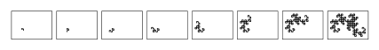
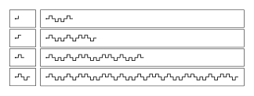
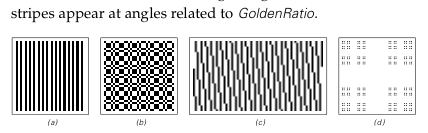
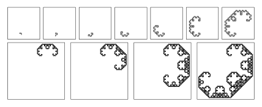
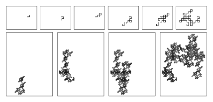
<!-- ORIGINAL_FIGURES page=0908 end -->

`Sum[a[i] Fibonacci[i + 2], {i, 0, r}]` 来构造数。（如第 1070 页所讨论，只要不允许数字序列中出现任何相邻的两个 1，这种表示就是唯一的。）于是事实证明，如果把位置 `n` 表示为这种广义数字序列，那么替换系统 (c) 中相应元素的颜色就只是该序列的最后一位数字。

- 与平方根的联系。上面 (c) 这样的替换系统与具有二次无理斜率的直线投影有关，如第 904 页所讨论。

- 替换系统的谱。见第 1080 页。

- 用路径表示。除了用黑白方块的一维序列来表示替换系统，也可以使用由一连串左转和右转组成的二维路径。上面规则 (b) 在连续步骤中得到的路径如下方所示。

下方图像显示了从 `{0}` 开始、规则为 `{1 -> {1}, 0 -> {0, 0, 1}}` 时得到的路径。注意它与第 190 页所示二维系统的相似性。

当路径不与自身相交时，嵌套结构是明显的。但在像规则 `{1 -> {0, 0, 1}, 0 -> {1, 0}}` 从 `{1}` 开始这样的情形中，大量交叉会倾向于隐藏这种规则性，如下方图像所示。

- 折纸序列。一条纸带被连续对折时，向上和向下折痕的序列由一个替换系统给出；`t` 步之后的序列为 `NestList[Join[#, {0}, Reverse[1 - #]] &, {0}, t]`。对应路径（实际上是把每个折痕都做成直角）如下方所示。（见第 189 页。）

- 二维表示。来自一维替换系统的单个序列可以通过把它们分割成连续的行而显示为二维图案。下方图像显示了第 83 页替换系统的结果。在情形 (b) 中，如果行长度选择为 `2^j` 个元素，最左列将总是与序列开头相同；此外，任一内部元素恰好在其所在列顶部元胞与其所在行开头元胞颜色相同时为黑色。在情形 (c) 中，会出现角度与 `GoldenRatio` 相关的条纹。

- 第 84 页 · 其他例子。

(a)（倍周期序列）`t` 步之后共有 `2^t` 个元素，序列由 `Nest[MapAt[1 - # &, Join[#, #], -1] &, {0}, t]` 给出。它总共包含 `Round[2^t/3]` 个黑色元素；如果去掉最后一个元素，它形成回文。第 `n` 个元素由 `Mod[IntegerExponent[n, 2], 2]` 给出。如第 885 页所讨论，该序列出现在元胞自动机规则 150 的一条竖直列中。第 890 页讨论的 Thue-Morse 序列可以通过对它应用下面表达式得到：

```wolfram
1 - Mod[Flatten[Partition[FoldList[Plus, 0, list], 1, 2]], 2]
```

(b) 第 `n` 个元素只是 `Mod[n, 2]`。

(c) 与 (a) 相同，只是在每个序列中替换 `1 -> {1, 1}`。注意，尽管如此，(a) 与 (c) 的谱仍然不同，如第 1080 页所讨论。

(d) 第 `t` 步的序列长度满足 `a[t] = 2 a[t - 1] + a[t - 2]`，因此对 `t > 1` 有 `a[t] = Round[(1 + Sqrt[2])^(t - 1/2)]`。第 `t` 步白色元素的数目则为 `Round[a[t]/Sqrt[2]]`。很像第 83 页例子 (c)，长度为 `m` 的不同块有 `m + 1` 个，并且如果 `f = Floor[(1 - 1/Sqrt[2]) (# + 1/Sqrt[2])] &`，序列的第 `n` 个元素由 `f[n + 1] - f[n]` 给出（见第 903 页）。

[[PDF page 909]]

(e) 当 `t` 很大时，元素数像 `lambda^t` 那样增加，其中 `lambda = (Sqrt[13] + 1)/2`；白色元素数总是黑色元素数的 `lambda` 倍。

(f) 第 `t` 步元素数为 `Round[(1 + Sqrt[2])^t/2]`，第 `n` 个元素由 `Floor[Sqrt[2] (n + 1)] - Floor[Sqrt[2] n]` 给出（见第 903 页）。

(g) 元素数与 (f) 相同。

(h) 黑色元素数为 `2^(t - 1)`；元素总数为 `2^(t - 2) (t + 1)`。

(i) 和 (j) 元素总数为 `3^(t - 1)`。

- 历史。在各种表示下，一维替换系统已经为许多不同目的被独立发明过许多次。作为具有某些组合性质的序列生成器，第 83 页例子 (b) 这样的替换系统出现在 Axel Thue 1906 年的工作中。（Thue 在这项工作中宣称的目标，是通过寻找可能与数论相联系的困难问题来发展逻辑科学。）例子 (b) 的序列在 1917 年由 Marston Morse 重新发现，当时它与他发展符号动力学、并研究连续系统离散近似中可能发生的现象有关。一般与邻居无关的替换系统（有时以序列同态、迭代态射、均匀标记系统等名称出现）的研究，在这个语境中一直延续至今。此外，特别是自 1980 年代以来，它们也在形式语言理论和所谓词的组合学中被研究。（倍周期现象也从 1970 年代末开始导致了与物理学的接触。）

独立于符号动力学中的工作，作为序列生成器的替换系统在 1968 年由 Aristid Lindenmayer 以 L 系统之名重新发明，用来构造分枝植物模型（见第 1005 页）。所谓 0L 系统对应于我这里的与邻居无关的替换系统；1L 系统对应于第 85 页的依赖邻居的替换系统。关于 L 系统的工作沿着两条相当不同的路线展开：为具体植物系统建模，以及研究一般计算能力。到 1980 年代中期，特别是通过 Alvy Ray Smith 的工作，L 系统在计算机图形学中被广泛用于植物的真实感渲染。

根据确定规则构造抽象树（如家族树）的想法，大概可以追溯到古代。例如，第 83 页规则 (c) 的树表示可能已经由 Leonardo Fibonacci 于 1202 年画出。第 83 页例子 (a) 中特定图案的前六层，恰好对应于早在公元前 2000 年中国就已出现的《易经》分划图。黑色区域表示阴，白色区域表示阳。第六层上的元素对应于《易经》的 64 卦。分划图首次绘制的确切时间并不清楚，但几乎肯定早于公元 1000 年；在 1600 年代，它似乎影响了 Gottfried Leibniz 发展二进制数。

从数字序列角度看，第 83 页例子 (d) 由 Georg Cantor 在 1883 年关于连续性概念的研究中讨论过。数字序列与由邻居无关的替换系统产生的序列之间的一般关系，是在 1960 年代发现的。像 (c) 这样的序列与代数数的联系（见第 903 页），则出现在小波研究的先驱工作中。

表示一维替换系统序列的路径，可以由二维几何替换系统生成，如第 189 页所示。对页和第 190 页显示的 “C” 曲线，例如由 Paul Levy 在 1937 年描述过，并在 1960 年代由 William Gosper 作为一个简单计算机程序的输出重新发现。折纸曲线或所谓 dragon 曲线（如上所示）由 John Heighway 在 1960 年代中期讨论，并由 Chandler Davis、Donald Knuth 等人分析。这些曲线具有最终填满空间的性质。基于稍复杂替换系统的空间填充曲线，已经由 Giuseppe Peano 于 1890 年和 David Hilbert 于 1891 年在关于微积分基础的问题中讨论过。

多年来，来自替换系统的序列无疑曾作为大量数学工作的偶然特征出现。例如早在 1851 年，Eugene Prouhet 就已经证明，如果整数序列按照第 83 页序列 (b) 分划，那么这些整数的幂和会相等：也就是说，如果 `s` 是第 83 页 (b) 形式、长度为 `2^m` 且 `m > k` 的序列，那么

```wolfram
Apply[Plus, Flatten[Position[s, i]]^k]
```

对于 `i = 0` 和 `i = 1` 相等。1883 年发明的汉诺塔谜题的最优解，也事实证明是一个替换系统序列的例子。

### 顺序替换系统

- 实现。顺序替换系统可以非常直接地通过 Mathematica 把变换规则应用于符号表达式的标准机制来实现。作出定义

[[PDF page 910]]

```wolfram
Attributes[s] = Flat
```

之后，某一步上顺序替换系统的状态可以表示为形如 `s[1, 0, 1, 0]` 的符号表达式。第 82 页的规则随后可以简单写成

```wolfram
s[1, 0] -> s[0, 1, 0]
```

而第 85 页的规则变成

```wolfram
{s[0, 1, 0] -> s[0, 0, 1], s[0] -> s[0, 1, 0]}
```

`s` 的 `Flat` 属性使这些规则不仅能应用于整个序列，例如 `s[1, 0, 1, 0]`，也能应用于任何子序列，例如 `s[1, 0]`。（当 `s` 为 `Flat` 时，`s[s[1, 0], 1, s[0]]` 等价于 `s[1, 0, 1, 0]`，如此等等。一个 `Flat` 函数在数学上具有结合性。）在这种设置下，`t` 步演化可以用

```wolfram
SSSEvolveList[rule_, init_s, t_Integer] :=
  NestList[# /. rule &, init, t]
```

找到。

注意，作为让 `s` 为 `Flat` 的替代，也可以显式设置基于模式的规则，例如

```wolfram
s[x___, 1, 0, y___] -> s[x, 0, 1, 0, y]
```

并且通过使用像

```wolfram
s[x___, 1, 0, y___] :> {s[x, 0, 1, 0, y], Length[s[x]]}
```

这样的规则，可以跟踪发生替换的位置。（`StringReplace` 会替换给定子串的所有出现，而不只是第一个，因此不能直接作为拥有平坦函数的替代。）

- 能力。即使只有单条规则 `{s[1, 0] -> s[0, 1]}`，顺序替换系统也可以把初始条件排序，使所有 0 都出现在所有 1 之前。（另见第 1113 页。）

- 替换顺序。对于许多顺序替换系统，演化实际上会停止，因为产生了一个不适用于任何给定替换的字符串。在大多数顺序替换系统中，原则上在某一步有不止一个可应用的替换，因此尝试替换的顺序很重要。（第 497 页讨论的多路系统，就是在每一步执行所有可能替换时得到的结果。）不过，也有特殊的顺序替换系统（具有第 1036 页讨论的所谓合流性质），其中在某种意义上替换顺序并不重要。

- 历史。顺序替换系统与第 938 页讨论的多路系统密切相关，并常常被看作产生式系统或字符串重写系统的例子。在我这里讨论的形式中，它们似乎最早以“正规算法”之名出现在 Andrei Markov 于 1940 年代后期关于可计算性和数学过程理想化的工作中。从 1960 年代开始，TECO 和 ed 等文本编辑器使用了顺序替换系统规则，SNOBOL 和 perl 等字符串处理语言也是如此。Mathematica 使用顺序替换系统规则的类似物来变换一般符号表达式。新的规则可以增量加入顺序替换系统而不改变其基本结构，这使这类系统在自适应编程研究中很受欢迎。

### 标记系统

- 实现。以第 94 页情形 (a) 的规则为例，可写成

```wolfram
{2, {{0, 0} -> {1, 1}, {1, 0} -> {}, {0, 1} -> {1, 0},
     {1, 1} -> {0, 0, 0}}}
```

标记系统的演化可以由

```wolfram
TSEvolveList[{n_, rule_}, init_, t_] :=
  NestList[If[Length[#] < n, {}, Join[Drop[#, n], Take[#, n] /. rule]] &,
    init, t]
```

得到。另一种实现基于每一步对列表应用如下规则：

```wolfram
{{0, 0, s___} -> {s, 1, 1}, {1, 0, s___} -> {s},
 {0, 1, s___} -> {s, 1, 0}, {1, 1, s___} -> {s, 0, 0, 0}}
```

如果每一步可添加长度至多为 `r` 的块，并允许 `k` 种颜色，则可能规则总数为 `((k^(r + 1) - 1)/(k - 1))^(k^n)`。对于 `r = 3`、`k = 2`、`n = 2`，这个数为 50,625。

- 第 94 页 · 随机性。为了对行为的随机性有某种了解，可以考察连续步骤中产生的首元素序列。在情形 (a) 中，黑色元素的比例围绕 `1/2` 波动；在 (b) 中，它趋近于 `3/4`；在 (d) 中，它围绕接近 0.3548 的值波动；而在 (e) 和 (f) 中，它似乎不会稳定下来。

- 历史。我考虑的标记系统，是 Emil Post 在 1920 年首先讨论的系统的推广；他当时把它们作为 Alfred Whitehead 和 Bertrand Russell 的《数学原理》中某些句法归约规则的简单理想化（见第 1149 页）。Post 的标记系统不同于我的系统之处在于：他的系统只允许每一步添加哪个块取决于该步序列中最开头的那个元素（不过见第 670 页）。（Hao Wang 于 1963 年研究的滞后系统允许依赖不只是第一个元素，但每一步只移除第一个元素。）事实证明，为了在这类系统中得到复杂行为，人们要么需要允许每个元素有两种以上可能颜色，要么需要每一步从序列开头移除两个以上元素。1921 年前后，Post 显然研究了他的类型中所有每一步移除和添加都不超过两个元素的标记系统，并断定它们都不会产生复杂行为。但随后他考察了每一步移除三个元素的规则，并发现了规则 `{3, {{0, _, _} -> {0, 0}, {1, _, _} -> {1, 1, 0, 1}}}`。正如他指出的，这条规则的行为会随所用初始条件而有很大变化。但至少对于所有长度不超过 28 的初始条件，该规则最终只会导致周期为 1、2、6、10、28 或 40 的重复行为。若颜色超过两种，人们会发现 Post 类型中每一步只移除两个元素的规则可以产生复杂行为，甚至从 `{0, 0}` 这样的初始条件开始也可以。一个例子是 `{2, {{0, _} -> {2, 1}, {1, _} -> {0}, {2, _} -> {0, 2, 1, 2}}}`。（另见第 1113 和 1141 页。）

[[PDF page 911]]

<!-- ORIGINAL_FIGURES page=0911 start -->

<!-- ORIGINAL_FIGURES page=0911 end -->

### 循环标记系统

- 实现。以第 95 页的循环标记系统规则 `{{1, 1}, {1, 0}}` 为例，演化可以由

```wolfram
CTEvolveList[rules_, init_, t_] :=
  Map[Last, NestList[CTStep, {rules, init}, t]]
CTStep[{{r_, s___}, {0, a___}}] := {{s, r}, {a}}
CTStep[{{r_, s___}, {1, a___}}] := {{s, r}, Join[{a}, r]}
CTStep[{u_, {}}] := {u, {}}
```

得到。远多于 `t` 个连续步骤的首元素可以直接由

```wolfram
CTList[rules_, init_, t_] :=
  Flatten[Map[Last, NestList[CTListStep, {rules, init}, t]]]
CTListStep[{rules_, list_}] :=
  {RotateLeft[rules, Length[list]],
   Flatten[rules[[Mod[Flatten[Position[list, 1]], Length[rules], 1]]]]}
```

得到。

- 第 95 页 · 推广。上面的实现立即允许循环通过两个以上块的循环标记系统。（若只有一个块，行为总是重复的。）允许每个元素取任意值的循环标记系统可以通过加入规则

```wolfram
CTStep[{{r_, s___}, {n_, a___}}] :=
  {{s, r}, Flatten[{a, Table[r, {n}]}]}
```

得到。在这种情形中，首元素可以用

```wolfram
CTListStep[{rules_, list_}] :=
  {RotateLeft[rules, Length[list]], With[{n = Length[rules]},
    Flatten[Apply[Table[#1, {#2}] &,
      Map[Transpose[{rules, #}] &, Partition[list, n, n, 1, 0]], {2}]]]}
```

得到。

- 机械实现。循环标记系统有一种特别直接的机械实现。黑白球被放在下方图像那样的槽中。每一步，槽中最左端的球被释放；如果这个球是黑色的（例如由大小判定），某个机制就会在槽的右端加入一个新的球块。这个机制可以有几种工作方式；通常它会包含一个旋转部件，用来决定每一步使用规则中的哪种情形。正文中的规则 (e) 允许一种特别简单的新球供给方式。注意，如果槽中球溢出，系统就必然失效。

- 第 96 页 · 性质。假设黑白元素以不相关的方式出现，那么在有 `n` 个块的循环标记系统中，序列平均每一步应增长 `Count[Flatten[rules], 1]/n - 1` 个元素。对于 `n = 2` 个块，这意味着只有当两个块中的黑色元素总数大于 3 时才会发生增长。因此，像 `{{1, 0}, {0, 1}}` 和 `{{1, 1}, {0}}` 这样的规则会产生序列长度有限的重复行为。

注意，如果一个有 `n` 个块的循环标记系统中所有块的长度都能被 `n` 整除，那么可以预先知道哪些步骤会添加块，所得整体行为必定对应于某个与邻居无关的替换系统。不过，相关替换系统的规则可能取决于循环标记系统的初始条件。

```wolfram
Flatten[{1, 0, CTList[{{1, 0, 0, 1}, {0, 1, 1, 0}}, {0, 1}, t]}]
```

例如给出了 Thue-Morse 替换系统 `{1 -> {1, 0}, 0 -> {0, 1}}`。

在例子 (a) 中，元素是相关的，所以增长比上面的估计更慢。在例子 (c) 中，元素也同样相关：增长为平均每步 `((Sqrt[5] - 1)/2) ~= 0.618` 个元素，交替步骤上的首元素形成与替换系统 `{1 -> {1, 0}, 0 -> {1}}` 所得相同的嵌套序列。在例子 (d) 中，序列首元素中 1 的频率约为 `3/4`；`{0, 0}` 永不出现，`{1, 1}` 的频率约为 `1/2`。在例子 (e) 中，1 的频率也约为 `3/4`，但此时 `{0, 0}` 以 0.05 的频率出现，`{1, 1}` 以 0.55 的频率出现，而 `{0, 0, 0}` 和 `{0, 1, 0}` 不可能出现。

- 历史。Matthew Cook 在 1994 年为本书研究规则 110 元胞自动机时，研究了循环标记系统。序列 `{1, 2, 2, 1, 1, 2, ...}` 由性质 `list = Map[Length, Split[list]]` 定义，William Kolakoski 于 1965 年曾把它作为一个数学谜题提出；它等价于

```wolfram
Join[{1, 2}, Map[First, CTEvolveList[{{1}, {2}}, {2}, t]]]
```

已知这个序列不重复，包含不超过两个相同的连续块，并且 1 和 2 的数目至少非常接近相等。把 2 换成 3 会产生一个形式相当简单的嵌套序列。

[[PDF page 912]]

<!-- ORIGINAL_FIGURES page=0912 start -->
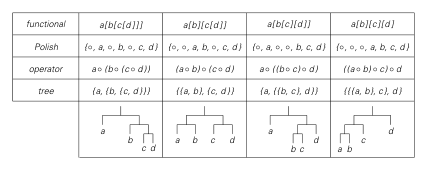
<!-- ORIGINAL_FIGURES page=0912 end -->

### 寄存器机

- 实现。某一步上寄存器机的状态可以表示为二元组 `{n, list}`，其中 `n` 给出程序中当前正在执行的指令位置（“程序计数器”），`list` 给出各寄存器的值。第 99 页的寄存器机程序随后可以写成

```wolfram
{i[1], d[2, 1], i[2], d[1, 3], d[2, 1]}
```

其中 `i[_]` 表示递增指令，`d[_, _]` 表示递减跳转。

在这种设置下，任意寄存器机的演化可以用下面函数实现（一个典型初始条件为 `{1, {0, 0}}`）：

```wolfram
RMStep[prog_, {n_Integer, list_List}] := If[n > Length[prog],
  {n, list}, RMExecute[prog[[n]], {n, list}]]
RMExecute[i[r_], {n_, list_}] := {n + 1, MapAt[# + 1 &, list, r]}
RMExecute[d[r_, m_], {n_, list_}] :=
  If[list[[r]] > 0, {m, MapAt[# - 1 &, list, r]}, {n + 1, list}]
RMEvolveList[prog_, init:{_Integer, _List}, t_Integer] :=
  NestList[RMStep[prog, #] &, init, t]
```

使用 `k` 个寄存器、长度为 `n` 的可能程序总数为 `(k (1 + n))^n`。注意，通过在前面添加适当的 `i[r]` 指令，人们实际上可以设置寄存器中具有任意值的初始条件。

- 停机。有时可以方便地把寄存器机看作：如果它们试图执行超出程序末尾的指令，就进入一个特殊停机状态。（见第 1137 页。）从初始条件 `{1, {0, 0}}` 出发会这样做的可能寄存器机比例，会随着程序长度 `n` 稳步下降；当 `n = 8` 时达到约 0.76。停机前最常见的步数总是 `n`，而 `n` 不超过 8 时的最大步数为 `{1, 3, 5, 10, 16, 37, 215, 1280}`；最后一种情形由下面程序达到：

```wolfram
{i[1], d[2, 7], d[2, 1], i[2], i[2], d[1, 4], i[1], d[2, 3]}
```

- 第 101 页 · 扩展指令集。还可以考虑加入如下指令：

```wolfram
RMExecute[eq[r1_, r2_, m_], {n_, list_}] :=
  If[list[[r1]] == list[[r2]], {m, list}, {n + 1, list}]
RMExecute[add[r1_, r2_], {n_, list_}] :=
  {n + 1, ReplacePart[list, list[[r1]] + list[[r2]], r1]}
RMExecute[jmp[r1_], {n_, list_}] := {list[[r1]], list}
```

注意，由于每一步只能加 1 或减 1，正文中所示的寄存器机必然运行得相当慢：它们总是至少需要 `n` 步才能构造出大小为 `n` 的数。不过，尽管扩展指令集可以提高操作速度，它似乎并不会显著提高具有复杂行为的机器密度。

- 历史。寄存器机（也称计数器机和程序机）是对实际计算机相当自然的理想化，并且以略有差异的形式被发明过多次。John Shepherdson 和 Howard Sturgis 在 1959 年前后、Marvin Minsky 在 1960 年前后都曾早期使用它们。Kurt Godel 1931 年关于在算术中表示逻辑的工作里，也有一些相当相似的构造（见第 1158 页）。

- 第 102 页 · 随机程序。见第 1182 页。

### 符号系统

- 实现。第一个所示符号系统 `t` 步演化可以简单地由

```wolfram
NestList[# /. e[x_][y_] -> x[x[y]] &, init, t]
```

实现。

- 符号表达式。像 `Log[x]` 和 `f[x]` 这样给出函数值的表达式，在数学和典型计算机语言中都很熟悉。像 `f[g[x]]` 这样给出函数复合的表达式也很熟悉。但一般来说，像在 Mathematica 中那样，完全可以有这样的表达式：`h[x]` 中的头部 `h` 本身可以是任何表达式，而不只是一个单独符号。因此，例如 `f[g][x]`、`f[g[h]][x]` 和 `f[g][h][x]` 都是可能的表达式。这类表达式在 Mathematica 中经常出现，尤其是在把函数作为整体加以操作、然后再把它们应用于参数时。（例如，`D[f[x], {x, 2}]` 给出 `Derivative[2][f][x]`。）原则上，人们可以想象把所有形如 `f[x, y]` 的对象都通过所谓柯里化表示为 `f[x][y]`；事实上我在 1980 年代早期的 SMP 中也尝试过这样做。但尽管当 `f` 是矩阵这样的离散函数时这会很方便，它却不符合一般数学和其他用法，因为在这些用法中，例如 `Gamma[x]` 和 `Gamma[a, x]` 都被看作函数值。

- 表示法。表达式可用的表示包括：

```text
函数式:   a[b[c[d]]]        a[b][c[d]]        a[b[c][d]]        a[b][c][d]
波兰式:   {op,a,op,b,op,c,d} {op,op,a,b,op,c,d} {op,a,op,op,b,c,d} {op,op,op,a,b,c,d}
运算符:   a op (b op (c op d)) (a op b) op (c op d) a op ((b op c) op d) ((a op b) op c) op d
树:       {a,{b,{c,d}}}     {{a,b},{c,d}}     {a,{{b,c},d}}     {{{a,b},c},d}
```

在所有这些表示中，典型变换规则都是非局部的。表达式的波兰表示（其反向形式已用于 HP 计算器）可以用下面方式得到（另见第 1173 页）：

```wolfram
Flatten[expr //. x_[y_] -> {op, x, y}]
```

[[PDF page 913]]

<!-- ORIGINAL_FIGURES page=0913 start -->
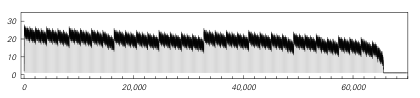
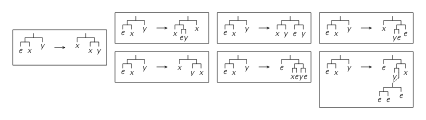
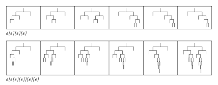
<!-- ORIGINAL_FIGURES page=0913 end -->

原表达式可以用下面方式恢复：

```wolfram
First[Reverse[list] //. {w___, x_, y_, op, z___} -> {w, y[x], z}]
```

（用波兰记法绘制的符号系统演化图像在细节上不同于正文中用函数式记法绘制的图像，但在定性上看起来类似。）

表达式的树表示可以用 `expr //. x_[y_] -> {x, y}` 得到；当每个对象都只有一个参数时，这棵树就是二叉树，就像 LISP 中那样。

如果只出现一个单一符号，那么真正重要的只是表达式的整体结构；如正文中那样，它可以由开括号和闭括号的序列捕捉，该序列由

```wolfram
Flatten[Characters[ToString[expr]] /. {"[" -> 1, "]" -> 0, "e" -> {}}]
```

给出。

- 可能表达式。`LeafCount[expr]` 给出表达式中任意位置出现的符号数，而 `Depth[expr]` 给出其函数式表示末尾闭括号的数目，也等于树表示中最右分支的层数。（树中的最大层数可以由 `expr /. _Symbol -> 1 //. x_[y_] -> 1 + Max[x, y]` 计算。）

给定可能符号的列表 `s`，`c[s, n]` 给出所有满足 `LeafCount[expr] = n` 的可能表达式：

```wolfram
c[s_, 1] = s;
c[s_, n_] := Flatten[
  Table[Outer[#1[#2] &, c[s, n - m], c[s, m]], {m, n - 1}]]
```

这样的表达式共有 `Binomial[2 n - 2, n - 1] Length[s]^n/n` 个。当 `Length[s] = 1` 时，这些表达式对应于可能的平衡开闭括号序列（见第 989 页）。

- 第 103 页 · 性质。所有初始条件最终都会演化到 `Nest[e, e, m]` 形式的表达式，随后保持固定。量 `expr //. {e -> 0, x_[y_] -> 2 x + y}` 事实证明在演化中保持不变，因此它给出了任意初始条件的最终 `m` 值。最大值为 `Nest[2 # &, 0, n]`（比较第 906 页），由 `Nest[#[e] &, e, n]` 形式的初始条件达到。（类比第 1122 页，任何 `e` 表达式都可以解释为 Church 数：

```wolfram
u = expr //. {e -> 2, x_[y_] -> y^x} = 2^(2^m)
```

于是 `expr[a][b]` 演化为 `Nest[a, b, u]`。）演化过程中，规则只能应用于表达式的内部部分 `FixedPoint[Replace[#, e[x_] -> x] &, expr]`。初始条件 `e[e][e][e][e][e]` 的这个内部部分深度如下方所示。对于所有初始条件，这个深度似乎起初线性增加，然后按照

```wolfram
FoldList[Plus, 0, Flatten[Table[
  {1, 1, Table[-1, {IntegerExponent[i, 2] + 1}]}, {i, m}]]]
```

以嵌套方式下降。该量在位置 `2^j` 处取值 1，在位置 `2^j - j + 1` 处取值 `j`。一旦深度达到 0，它就达到固定点。对于大小为 `n` 的初始条件，这最多在 `Sum[Nest[2 # &, 0, i] - 1, {i, n}] + 1` 步之后发生。（另见第 1145 页。）

- 其他规则。如果规则中只出现一个变量，那么通常只能生成嵌套行为；不过像 `e[x_][_] -> e[x[e[e][e]][e]]` 这样的例子可以相当复杂。每条规则左边可以由任意表达式组成；`e[e[x_]][y_]` 和 `e[e][x_[y_]]` 是两种可能。不过，至少在小初始条件下，基于 `e[x_][y_]` 的规则似乎更容易实现复杂行为。注意，左边没有显式 `e` 的规则总会给出具有规则嵌套结构的树；例如 `x_[y_] -> x[y][x[y]]`（或 Mathematica 中的 `x_ -> x[x]`）产生平衡二叉树。

- 很长的停机时间。具有 `e[x_][y_] -> Nest[x, y, r]` 形式规则的符号系统总会演化到固定点；不过对于大小为 `n` 的初始条件，这可能需要 `Nest[r # &, 0, n]` 量级的步数（见上文）。一般来说，会存在这样的符号系统：演化到固定点所需步数随 `n` 任意迅速地增长（见第 1145 页）；事实上我怀疑，甚至有一些规则相当简单的系统，要证明它们总是在有限步内达到固定点，也会超出例如算术公理系统的能力（见第 1163 页）。

- 树。第 103 和 104 页给出的规则对应于下方所示的树变换。第 103 页系统从两个初始条件出发演化的最初几步，对应于下方树序列。

[[PDF page 914]]

<!-- ORIGINAL_FIGURES page=0914 start -->

<!-- ORIGINAL_FIGURES page=0914 end -->

- 顺序依赖。Mathematica 中的操作 `expr /. lhs -> rhs` 会从左到右扫描 `expr` 的函数式表示，并在可能时应用规则，同时避免重叠。（Mathematica 中的标准求值等价于 `expr //. rules`，并使用相同顺序；`Map` 则使用不同顺序。）可以用下面方式使一条规则只应用一次：

```wolfram
Module[{i = 1}, expr /. lhs :> rhs /; i++ == 1]
```

许多符号系统（包括第 103 页的系统）具有所谓 Church-Rosser 性质（见第 1036 页），这意味着如果系统演化达到了固定点，那么无论规则以什么顺序应用，这个固定点都会相同。

- 历史。我这里讨论的一般类型符号系统，似乎最早出现于 Moses Schonfinkel 1920 年关于后来被称为组合子的对象的工作中。如第 1121 页所讨论，Schonfinkel 引入了一些特定规则，并建议它们可以用来构造逻辑中定义的函数。从 1930 年代开始，关于如何用组合子建立逻辑和数学，出现了各种理论研究，尤其是 Haskell Curry 的工作。不过在大多数情况下，人们只使用 Schonfinkel 的那些特定规则，并且只研究相当特定的行为形式。1970 和 1980 年代，人们曾有兴趣把组合子作为函数式编程语言编译的基础，但只考虑了与直接实际用途有关的相当特定的情形。（组合子也曾被用作逻辑游戏，尤其是 Raymond Smullyan 的工作。）

像组合子这样的构造似乎几乎从未在主流纯数学中被研究过。最可能的原因是，基于符号表达式结构构造函数，似乎从未明显对应于传统数学中把函数看作映射的观点。事实上，即使在数理逻辑中，组合子通常也未被视为主流。最可能的原因是，自 1900 年代早期 Bertrand Russell 的工作以来，人们通常一直假定应当区分函数和对象的不同类型层级，这类似于大多数编程语言所支持的数据类型。但组合子的设置中没有任何与类型相关的限制。结果表明，在编程语言中，Mathematica 几乎独一无二地也具有同样特征。而从 Mathematica 的经验来看，现在已经清楚：一个像组合子那样没有内置类型概念的符号系统，允许极大的普遍性和灵活性。（人们总可以通过只为头部具有特定结构的表达式设置规则，来建立类型的类似物。）

- 运算符系统。可以通过让规则为任意 Mathematica 模式定义变换，来推广符号系统。通常，这些可以看作运算符系统公理（见第 1172 页）的单向版本，但每一步只应用一次（如 `/.` 所做的那样），而不是以所有可能方式应用（如在多路系统中那样），因此演化只是由 `NestList[# /. rule &, init, t]` 给出。例如规则 `x_ -> x op x` 会生成一棵平衡二叉树。下方图像显示了几种情形中由运算符系统演化规则得到的开括号和闭括号图案。

```text
x_ -> x op x
x_ op y_ -> (y op x) op y
x_ op y_ -> (y op y) op (x op x)
x_ op y_ -> y op (x op x)
```

- 网络类似物。符号系统的状态总可以看作对应于一棵树。如果允许更一般的网络，那么可以使用基于第 508 页网络替换系统类似物的规则。（也可以像第 277 页那样，通过跟随一般网络的所有可能路径来构造一棵无限树，但在大多数情形中，没有简单方式把符号系统规则应用到这样的树上。）

### 本章发现是怎样作出的

- 第 109 页 · 可重复性与数值分析。我在本书大部分内容中考察的系统具有离散性质，这使得对它们进行的计算机实验几乎必然完全可重复。但如果像过去那样，人们试图在连续数学系统上做计算机实验，情况就可能不同。因为在这类情形中，人们不可避免地必须对数的底层表示以及所执行的运算作离散近似。而在许多实际情形中，人们会依赖“机器算术”来作这些近似，而机器算术可能因计算机系统不同而不同。

- 第 109 页 · 研究简单系统。多年来，我一直失望地看到，大多数科学家和数学家持续未能理解在最简单可能系统上做计算机实验这一思想。具有物理科学背景的人往往向系统中添加特征，试图产生某种被认为更真实的东西。而具有数学背景的人往往添加特征，使系统符合现代数学中那些复杂而抽象的思想，这些思想常常与连续性有关。所有这一切的结果是，真正有意义的计算机实验最终竟然少得惊人。

[[PDF page 915]]

- 第 111 页 · 定理的相关性。按照传统数学思维，人们可能会想，要确信某个特定系统中究竟可能发生什么，最好的方式就是证明关于它的一个定理。但在我的经验中，证明往往会遭遇许多与计算机实验相同类型的问题：人很容易最终作出隐含假设，而这些假设可能被无法预见的情况破坏。事实上，到现在为止，除了最简单的证明之外，相比证明，我更信任基于简单、系统的计算机实验所得结论的正确性。

- 数学家的态度。数学家常常似乎觉得，计算机实验在某种意义上不如他们的标准数学方法精确。确实，在研究与连续数学相关的问题时，使用计算机时常常会作出不精确的数值近似（见上文）。但离散或符号计算可以是绝对精确的。在某种意义上，展示实验发现的一个特定对象（例如一个演化显示某种特定性质的元胞自动机），可以看作对此类对象的构造性存在证明。在数学实践中，人们常有这样一种想法：证明应当解释它所证明的结果；如果只是展示一个具有某些性质的对象，人们也许会认为这做不到。但能够详细观察这样一个对象如何工作，在许多情形中会比标准抽象数学证明提供好得多的理解。而且，不可避免地，通过实验方法找到新结果要比通过基于证明的传统方法容易得多。

- 实验数学史。通过计算实验寻找数学结果的一般思想，有一段显赫、尽管并不广为讨论的历史。例如，Carl Friedrich Gauss 在 1800 年代研究数论时大量使用了这种方法；Srinivasa Ramanujan 在 1900 年代早期提出许多代数恒等式时大概也是如此。Fourier 分析中的 Gibbs 现象，是 Albert Michelson 构造的一台机械计算机在 1898 年显示出来的。孤子在 Enrico Fermi 及其合作者约 1954 年于一台早期电子计算机上进行的实验中被重新发现。（John Scott Russell 在 1834 年已在物理系统中看到过它们，但它们并未受到广泛研究。）混沌现象由 Edward Lorenz 在 1962 年的一次计算机实验中注意到（见第 971 页）。迭代映射中的通用行为（见第 921 页）由 Mitchell Feigenbaum 于 1975 年通过查看电子计算器上的例子发现。分形的许多方面由 Benoit Mandelbrot 在 1970 年代使用计算机图形发现。1960 和 1970 年代，人们用计算机代数发现了各种代数恒等式，尤其是 William Gosper。（从 1970 年代中期开始，我常规地做计算机代数实验，以寻找理论物理中的公式，尽管我在展示这些公式时没有提到这一点。）原则上数学中应当存在只能通过某种归纳推理才能达到的真理，类似自然科学中的情形，这一思想由 Kurt Godel 在 1940 年代、Gregory Chaitin 在 1970 年代讨论过。但它没有受到多少关注。随着 Mathematica 在 1988 年发布，数学实验开始成为实际数学教学中的一个标准元素，并且逐渐也成为至少某些类型数学研究中可以尝试的一种方法，尤其是接近数论的研究。但即使现在，与几乎所有其他科学分支不同，主流数学仍完全由理论方法而非实验方法支配。而且即使做实验，其目的也几乎总是仅仅为以另一种方式观察传统数学系统中的传统问题。然而，我在本书中所做的事情，也就是我从 1980 年代早期开始做的事情，相当不同：我用计算机实验来考察那些可被视为具有数学性质、但传统数学过去从未以任何方式考虑过的问题和系统。

- 第 113 页 · 实际细节。本章所描述的研究使用 Mathematica 完成，主要是在 1992 年。对于较大的搜索，我有时会创建优化过的 C 程序，并通过 Mathematica 中的 MathLink 控制它们，不过以今天存在的 Mathematica 版本来看，这现在已没有必要。对于我最大规模的搜索，我使用 Mathematica 把程序分派到网络上的大量不同计算机，然后让这些计算机一旦找到有趣结果就给我发送电子邮件。（另见第 854 页。）

[[PDF page 916]]

[[PDF page 917]]

<!-- ORIGINAL_FIGURES page=0917 start -->

<!-- ORIGINAL_FIGURES page=0917 end -->

## 第 4 章注释

### 基于数的系统

### 数的概念

- 数字序列的实现。整数 `n` 可以用 `IntegerDigits[n, k]` 转换为 `k` 进制数字序列，或者用（另见第 1094 页）

```wolfram
Reverse[Mod[NestWhileList[Floor[#/k] &, n, # > k &], k]]
```

转换；也可以用 `FromDigits[list, k]` 或

```wolfram
Fold[k #1 + #2 &, 0, list]
```

从数字序列转换回来。

对于 0 到 1 之间的数 `x`，其 `k` 进制数字序列的前 `m` 位由 `RealDigits[x, k, m]` 或

```wolfram
Floor[k NestList[Mod[k #, 1] &, x, m - 1]]
```

给出；并且可以用 `FromDigits[{list, 0}, k]` 或

```wolfram
Fold[#1/k + #2 &, 0, Reverse[list]]/k
```

从这些数字重构该数的一个近似。

- Gray 码。在考察数字序列时，有时按不同于数值大小的标准给数排序会很有用。一个例子是 Gray 码排序，其中连续的数被排列成只相差一个数字。对于总共有 `m` 位的数，一种这样的排序为

```wolfram
GrayCode[m_] :=
  Nest[Join[#, Length[#] + Reverse[#]] &, {0}, m]
```

按这种方式排序的数值大小和数字序列如下方所示。（注意，相对于正文中的图，数字序列图像是侧向放置的。）出现在位置 `i` 的数由 `BitXor[i, Floor[i/2]]` 给出。（迭代相关函数 `BitXor[i, 2 i]` 会产生其数字序列对应于规则 60 元胞自动机的数。）

- 给数学家的说明。有些数学家起初会觉得我在本章所说的东西相当怪异。不过也许有帮助的一点是：在过去几十年关于动力系统的许多研究中，传统的数的观点已经表现出瓦解迹象。因此，例如，人们得到的结果常常不是连续函数，而是 Cantor 集。事实上，动力系统理论中常用的符号动力学方法，与我这里使用的数字序列方法相当接近；动力系统理论中的 Markov 分划本质上只是数字展开的推广。不过，在动力系统理论所分析的情形中，对数字序列通常只执行移位和其他非常简单的操作。因此，我在本章讨论的大多数现象，并未出现在动力系统理论中所做的工作里。

- 数的历史。数大概最早在几千年前用于商业，一开始只需要整数，或许还有有理数。但早在巴比伦时代，几何中的实际问题就开始需要平方根。尽管如此，在很长时间里，即使代数已有某种发展，人们所考虑的仍只是那些原则上可以以某种方式机械构造出来的数。Isaac Newton 在 1600 年代后期发明流数法，引入了连续变量的思想，也就是具有连续取值范围的数。虽然这是一个方便而强大的概念，它也包含一种新的抽象层次，并带来了相当多关于基础问题的混乱。事实上，真正要到 1800 年代后期严格数学分析的发展，这种混乱才最终开始消除。而到 1880 年代，Georg Cantor 等人已经构造出完全不连续的函数；在这些函数中，把数看作只有大小才重要的连续变量这一思想受到了质疑。但直到几乎 1970 年代，随着分形几何和混沌理论出现之前，这些函数基本上都被看作没有实际相关性的

[[PDF page 918]]

<!-- ORIGINAL_FIGURES page=0918 start -->

<!-- ORIGINAL_FIGURES page=0918 end -->

数学奇物。（另见第 1168 页。）

然而，独立于纯数学之外，数的实际应用总是不得不超出连续变量的抽象理想化。因为无论是手算、用机械计算器，还是用电子计算机计算，人们总需要数的一个显式表示，典型地是用一定长度的数字序列。（从 1930 年代到 1960 年代，人们曾研究所谓模拟计算机，用电压表示连续变量，但这类机器事实证明对大多数实际目的来说不够可靠。）不过，从电子计算的最早时期起，人们就付出了巨大努力，试图尽可能接近地近似一个数的连续体。事实上，对于研究行为相当简单的系统，这样的近似通常可以奏效。但正如我们稍后在本章会看到的，对于更复杂的行为，近似几乎不可避免地会崩溃，于是除了考察数的显式表示之外别无选择。（另见第 1128 页。）

- 数字序列史。在算盘或类似装置上，数实际上由数字序列表示。不过在古代，大多数书写数的系统都像罗马数字那样，并不基于数字序列。一个例外是巴比伦的 60 进制系统（时:分:秒记法即由此而来）。现代形式的印度-阿拉伯 10 进制系统大概起源于公元 600 年前后，尤其在 Leonardo Fibonacci 1200 年代早期的工作之后，到 1400 年代变得普遍。2 进制似乎最早在 1600 年代早期被明确考虑（特别是 John Napier 于 1617 年），并由 Gottfried Leibniz 从 1679 年开始详细研究。任意进制的可能性由 Blaise Pascal 在 1658 年提出。各种进制曾用于谜题，但很少用于纯数学（Georg Cantor 在 1860 年代的工作是一个例外）。2 进制第一次被广泛使用是在电子计算机中，从 1940 年代后期开始。即使在 1980 年代，大多数数学家仍把数字序列看作与纯数学目的基本无关。然而，对分形和嵌套的研究、许多涉及数字序列的算法的出现，以及 Mathematica 中长数字的日常使用，已经逐渐使数字序列被视为数学中更核心的对象。

### 初等算术

- 第 117 页 · 替换系统。数字序列与替换系统之间有许多联系，如第 891 页所讨论。这里显示的图案，本质上是第 83 页第一个替换系统所生成图案的一个旋转版本。

- 第 117 页 · 数字计数。这里显示的图案中第 `n` 行的黑色方块数由 `DigitCount[n, 2, 1]` 给出，并绘制如下。这个函数已在第 870 页关于二项式系数模 2 的讨论中出现，并且会在本书其他几个地方再次出现。注意不等式 `1 < DigitCount[n, 2, 1] < Log[2, n]`。`DigitCount[n, 2, 1]` 的公式包括 `n - IntegerExponent[n!, 2]` 和

```wolfram
2 n - Log[2, Denominator[Derivative[n][(1 - #)^(-1/2) &][0]/n!]]
```

可以直接把 `DigitCount` 推广到整数和非整数进制，并且不仅考察总数字数，也考察数字之间的相关性。在所有情形中，下方图像的类似物都具有嵌套结构。

- 负进制。给定一个由 0 到 `k - 1` 中的数字组成的适当列表，可以用 `FromDigits[list, -k]` 得到任意正数或负数。下方图像显示了连续整数在 -2 进制中的数字序列；从底部数第 `j` 行事实证明由长度为 `2^j` 的黑白交替块组成。（在普通二进制中，一个数 `-n` 可以像典型电子计算机上那样，通过把每一位取补，包括前导 0，来表示。）（另见第 1093 页。）

- 非幂进制。可以考虑用 `Sum[a[n] f[n], {n, 0, Infinity}]` 表示数，其中 `f[n]` 不必是 `k^n`。只要 `f[n]` 增长慢于 `2^n`（例如 `f = Fibonacci` 或 `f = Prime`），数字 0 和 1 就已足够，尽管这种表示通常并不唯一。（见第 1070 页。）

- 乘法式数字序列。可以考虑数字序列的推广，其中数被分解成若干部分，而这些部分不是通过加法而是通过乘法组合。由于数可以唯一分解为素数幂的乘积，一个数可以由一个列表指定：在适当的 `Prime[m]^n`（可按大小排序）的位置出现 1，其他位置出现 0，如下方所示。注意，与普通加性数字的情形不同，要指定一个数 `m`，需要远多于 `Log[m]` 个数字。

[[PDF page 919]]

<!-- ORIGINAL_FIGURES page=0919 start -->


<!-- ORIGINAL_FIGURES page=0919 end -->

- 第 120 页 · 2 进制中的 3 的幂。所示图案中的第 `n` 行可以简单地由 `IntegerDigits[3^n, 2]` 得到。即使是这样的单独行，在许多方面也显得随机。下方图像显示连续行中出现的 1 的比例。该比例似乎趋向于 `1/2`。

如果只观察该图案最右侧的 `s` 列，就会看到重复，但重复周期像 `2^s` 那样增长。典型竖直列有一种明显偏离随机性的地方：连续步骤上出现相同颜色的概率，是出现相反颜色概率的两倍。（对于 `k` 进制中的乘数 `m`，数对 `{i, j}` 的相对频率由 `Quotient[m i - j - 1 + m, k] - Quotient[m i - j - 1, k]` 给出。）

从最右侧 `s` 位得到的序列 `Mod[3^n, 2^s]` 对应于一个简单的线性同余伪随机数生成器。这类生成器在实际计算机系统中广泛使用，第 974 页会进一步讨论。（注意，在这里使用的特定情形中，数对 `Mod[{3^n, 3^(n + 1)}, 2^s]` 总是位于若干直线上；使用 3 以外的乘数时，这类规则性可能出现在更长的数块中。）

注意，如果使用 6 进制而非 2 进制，那么如第 614 页所示，3 的幂仍会产生复杂图案，但所有操作都是严格局部的，而且该系统对应于一个每个元胞有 6 种可能颜色的元胞自动机，其规则为

```wolfram
{a_, b_, c_} -> 3 Mod[b, 2] + Floor[c/2]
```

（见第 1093 页。）

- 首位数字。在 `b` 进制中，幂的首位数字并非等概率，而是遵循第 914 页的对数定律。

- 第 122 页 · `3/2` 的幂。这里图中显示的第 `n` 个值为 `Mod[(3/2)^n, 1]`。测量表明这些值在 0 到 1 的范围内均匀分布，但尽管自 1940 年代以来已有相当多数学工作，人们在证明这一点上并没有取得实质进展。在 6 进制中，`(3/2)^n` 是一个具有如下规则的元胞自动机：

```wolfram
{a_, b_, c_} ->
  3 Mod[a + Quotient[b, 2], 2] +
    Quotient[3 Mod[b, 2] + Quotient[c, 2], 2]
```

（注意这条规则是可逆的。）考察 `u (3/2)^n` 随后对应于研究一个初始条件由 `u` 的 6 进制数字给出的元胞自动机。于是可以找到 `u` 的特殊值（一个例子是 `0.166669170371...`），使得 `u (3/2)^n` 的小数部分第一位数字总是非零，从而 `Mod[u (3/2)^n, 1] > 1/6`。一般来说，似乎可以让 `Mod[u (3/2)^n, 1]` 保持大到约 0.3（例如 `u = 0.38906669065...`），但不能更大。

- 一般幂。原则上自 1930 年代起，人们已经知道对于几乎所有 `h` 值，`Mod[h^n, 1]` 会在 0 到 1 范围内均匀分布。然而，从未明确找到过一个具体的 `h` 值并证明它具有这一性质。（1970 年代曾有一些构造这类值的尝试。）已知例外包括所谓 Pisot 数，例如 `GoldenRatio`、`Sqrt[2] + 1` 和 `Root[#^3 - # - 1 &, 1]`（所有 Pisot 数中数值最小的一个）；对于这些数，`Mod[h^n, 1]` 在大的 `n` 时会变为 0 或 1。注意，`Mod[x h^n, 1]` 实际上会提取 `x` 在 `h` 进制中的连续数字（见第 149 和 919 页）。

- 无理数的倍数。除了幂，也可以考虑某个数 `h` 的连续倍数 `Mod[h n, 1]`。下方图像显示了对若干 `h` 选择作为 `n` 的函数所得到的结果。（这些对应于一个粒子在理想化盒子中来回反弹的位置，如第 971 和 1022 页所讨论。）

当 `h` 是有理数时，序列总是重复。但在所有其他情形中，序列并不重复，而且事实上已知会得到取值的均匀分布。（如第 891 页所提到，连续取值的平均差在 `h = GoldenRatio` 时最大。）

- 与替换系统的关系。尽管上面的注释中有均匀分布结果，序列 `Floor[(n + 1) h] - Floor[n h]` 绝不是完全随机的；事实上，它可以由一列替换规则生成。对于任意非有理数 `h`，前 `m` 条规则（会产生远多于 `m` 个原序列元素）可由 `h` 的连分数形式（见第 914 页）通过

```wolfram
Map[({0 -> Join[#, {1}], 1 -> Join[#, {1, 0}]} &)[Table[0, {# - 1}]] &,
  Reverse[Rest[ContinuedFraction[h, m]]]]
```

得到。给定这些规则，原序列由

```wolfram
Floor[h] + Fold[Flatten[#1 /. #2] &, {0}, rules]
```

给出。

如果 `h` 是某个二次方程的解，那么它的连分数形式是重复的，因此只有有限多条不同的替换规则。在这种情形中，原序列可以由第 82 页讨论的那类与邻居无关的替换系统找到。对于 `h = GoldenRatio`，替换系统为 `{0 -> {1}, 1 -> {1, 0}}`（见第 890 页）；对于 `h = Sqrt[2]`，为 `{0 -> {0, 1}, 1 -> {0, 1, 0}}`（见第 892 页）；对于 `h = Sqrt[3]`，为 `{0 -> {1, 1, 0}, 1 -> {1, 1, 0, 1}}`。（嵌套结构的存在在 `FoldList[Plus, 0, Table[Mod[h n, 1] - 1/2, {n, max}]]` 中尤为明显。）（另见第 892、916、932 和 1084 页。）

[[PDF page 920]]

<!-- ORIGINAL_FIGURES page=0920 start -->

<!-- ORIGINAL_FIGURES page=0920 end -->

- 其他均匀分布序列。`Mod[a[n], 1]` 均匀分布的情形包括 `Sqrt[n]`、`n Log[n]`、`Log[Fibonacci[n]]`、`Log[n!]`、`h n^2` 和 `h Prime[n]`（`h` 为无理数），并且很可能还有 `n Sin[n]`。（另见第 914 页。）

- 第 122 页 · 实现。页面顶部系统的 `t` 步演化可以简单地由

```wolfram
NestList[If[EvenQ[#], 3 #/2, 3 (# + 1)/2] &, 1, t]
```

计算。

- 第 122 页 · `3 n + 1` 问题。这里描述的系统类似于所谓 `3 n + 1` 问题：人们考察规则 `n -> If[EvenQ[n], n/2, (3 n + 1)/2]`，并询问对于任意初始值 `n`，系统是否最终都会演化到 1（此后只是重复序列 1, 2, 1, 2, ...）。已经观察到，对于至少高达 `10^16` 的所有初始 `n` 值都会发生这种情况；但尽管自该问题在 1930 年代首次提出以来已有相当多数学努力，人们从未找到适用于所有 `n` 值的一般证明。（对于负的初始 `n`，演化似乎总会达到 -1、-5 或 -17，然后分别以周期 1、3 或 11 重复。）

一种替代表述是询问是否对所有 `n` 都有

```wolfram
FixedPoint[(3 #/2^IntegerExponent[#, 2] + 1)/2 &, n] == 2
```

在正文使用的规则 `n -> If[EvenQ[n], 5 n/2, (n + 1)/2]` 下，如果 `n` 曾经达到 2、4 或 40（以及可能更大的数），所产生的序列就会重复。但对于高达 10,000 的初始 `n` 值，这只在 642 种情形中发生；对于高达 100,000 的值，也只在 2683 种情形中发生。在所有其他情形中，序列中的 `n` 值似乎会永远增长。

为了对这种行为的起源有些了解，可以假设连续的 `n` 值以相等概率随机为偶数或奇数。在这个假设下，`n` 应当有一半时间增加一个因子 `5/2`，其余时间减少一个接近 `1/2` 的因子；因此 `t` 步之后，它应当总体上乘上约 `(Sqrt[5]/2)^t` 的因子。从 `n = 6` 开始，对于 `t = 10^Range[6]`，有效指数为 `{39.6, 245.1, 1202.8, 9250.7, 98269.8, 1002020.4}`。并非所有序列都永远增长的一个原因是：即使完全随机，也会有涨落，偶尔 `n` 会达到一个较低值，使它卡入重复序列。

如果把同样类型的论证应用于标准 `3 n + 1` 问题，那么会得出结论：`n` 平均每一步应当减少一个因子 `Sqrt[3]/2`，所以至少在大多数情形中，`n` 最终达到值 1 并不令人惊讶。事实上，对许多初始 `n` 值取平均，随机近似的预测与实际 `3 n + 1` 问题之间有很好的定量一致。但由于随机近似没有根本基础，因此仍然可以设想存在某个特定 `n` 值并不遵循其预测。

下方图像显示了从不同 `n` 值开始，需要多少步才能达到值 1。情形 (a) 是标准 `3 n + 1` 问题。情形 (b) 和 (c) 使用略有不同的规则，产生明显更简单的行为。在情形 (b) 中，步数等于 `n` 的二进制数字数；在情形 (c) 中，步数由 `n` 的二进制数字序列中 1 的数目决定。

```wolfram
(a) n -> If[EvenQ[n], n/2, (3 n + 1)/2]
(b) n -> If[EvenQ[n], n/2, (n + 1)/2]
(c) n -> If[EvenQ[n], n/2, n + 1]
```

- 作为元胞自动机的 `3 n + 1` 问题。如果把 `n` 的数字写成 6 进制，那么更新数字序列的规则就是一个有 7 种可能颜色的元胞自动机（颜色 6 充当端点标记，出现在实际数字序列左右两端）：

```wolfram
{a_, b_, c_} -> If[b == 6, If[EvenQ[a], 6, 4],
  3 Mod[a, 2] + Quotient[b, 2] /. 0 -> 6 /; a == 6]
```

`3 n + 1` 问题随后可以看作关于这个元胞自动机中是否存在持久结构的问题。

- 重构初始条件。给定一个特定起始值 `n`，很难预测第 122 页系统中会得到怎样精确的奇偶值序列。但给定这个序列中的 `t` 步，以 0 和 1 的列表表示，

[[PDF page 921]]

<!-- ORIGINAL_FIGURES page=0921 start -->


<!-- ORIGINAL_FIGURES page=0921 end -->

下面函数会重构起始值 `n` 最右侧的 `t` 个数字：

```wolfram
IntegerDigits[First[Fold[
  {Mod[If[OddQ[#2], 2 First[#1] - 1,
      2 First[#1] PowerMod[5, -1, Last[#1]]], Last[#1]],
   2 Last[#1]} &, {0, 2}, Reverse[list]]], 2, Length[list]]
```

- 一个可逆系统。在普通 `3 n + 1` 问题和正文讨论的系统中，不同的数常常演化到同一个值，因此没有唯一方式反向演化。不过，对于规则

```wolfram
n -> If[EvenQ[n], 3 n/2, Round[3 n/4]]
```

总可以用规则

```wolfram
n -> If[Mod[n, 3] == 0, 2 n/3, Round[4 n/3]]
```

向后演化。图像显示了从 `n = 8` 出发向后和向前演化所得到数的十进制位数。对于 `n < 8`，系统总会进入一个短循环。从 `n = 44` 开始，还存在一个长度为 12 的循环。但除这些循环外，所产生的数似乎总是无界增长，平均增长率在向前方向为 `3/(2 Sqrt[2])`，在向后方向为 `2^(4/3)/3`（至少所有不超过 10,000 的数都会增长到超过 `10^100`）。大约每 20 个数中有 1 个具有这样一种性质：从它出发无论向后还是向前演化，都永远不会达到更小的数。

- 第 125 页 · 反转-相加系统。这里执行的操作是

```wolfram
n -> n + FromDigits[Reverse[IntegerDigits[n, 2]], 2]
```

经过若干步之后，所得数字序列通常是反转对称的（一种广义回文），只是 0 与 1 互换，并且存在局部结构。序列每两步至少扩展一位；更快的扩展通常与随机性增加相关。对于大多数初始 `n`，所得整体图案很快变成重复的，有效周期为 4 步。但初始条件 `n = 512` 至少在一百万步内没有发生重复，此时 `n` 有 568,418 个二进制数字。下方图像显示了在前一百万步过程中，第 126 页图像右边缘可见的连续规则性区域长度。

如果直接使用固定长度的数字序列，并丢弃左侧的所有进位，那么通常会相当快地得到重复图案。如果每一步总是在左侧加入一个新数字，即使它是 0，也会产生相当随机的图案。

- 历史。与这里描述的系统相似的系统（尽管常常在 10 进制中）至少早在 1939 年就已在娱乐数学文献中被提到。1970 年前后做过一些小型计算机实验，但此前似乎没有进行过大规模研究。

- 数字反转。如下所示的形式为

```wolfram
Table[FromDigits[Reverse[IntegerDigits[n, k, m]], k], {n, 0, k^m - 1}]
```

的序列，出现在快速 Fourier 变换等算法中；在对不同坐标使用不同 `k` 值时，也出现在某些拟 Monte Carlo 方案中。（见第 1073 和 1085 页。）Johannes van der Corput 在 1935 年曾考虑过这类序列。

- 迭代游程长度编码。例如从 `{1}` 开始，反复把 `list` 替换为（见第 1070 页）

```wolfram
Flatten[Map[{Length[#], First[#]} &, Split[list]]]
```

所得序列只包含数 1、2 和 3，但除此之外起初看起来相当随机。不过，如 John Conway 在 1986 年前后注意到的，这些序列实际上可以由一个与邻居无关的替换系统得到；该系统作用于 92 个子序列，具有例如

```wolfram
{3, 1, 1, 3, 3, 2, 2, 1, 1, 3} ->
  {{1, 3, 2}, {1, 2, 3, 2, 2, 2, 1, 1, 3}}
```

这样的规则。因此，该系统最终产生的图案是纯嵌套的，尽管由相当复杂的元素组成。第 `n` 步的序列长度像 `lambda^n` 那样增长，其中 `lambda ~= 1.3` 是一个 71 次多项式的根，对应于替换系统转移矩阵的最大特征值。

- 数字计数序列。例如从 `{1}` 开始，反复把 `list` 替换为

```wolfram
Join[list, IntegerDigits[Apply[Plus, list], 2]]
```

所得序列的长度大致像 `n Log[n]` 那样增长。下方图像显示了第 1000 步所得序列中，到位置 `m` 为止 1 的累计数相对于 `m/2` 的涨落。可以看到与第 130 页图 (c) 相似的明确嵌套结构。

[[PDF page 922]]

<!-- ORIGINAL_FIGURES page=0922 start -->

<!-- ORIGINAL_FIGURES page=0922 end -->

- 迭代按位运算。下方图像显示了通过反复应用按位运算与算术运算的组合而生成的数字序列。第一个例子对应于初等元胞自动机规则 60。注意，任何元胞自动机规则都可以由按位运算和算术运算的某种适当组合复现。

```wolfram
BitXor[2 n, n]
BitXor[3 + 2 n, n]
BitXor[3 n, n]
BitXor[6 n, n]
BitOr[2 n, n]
BitOr[6 n, n]
```

### 递归序列

- 第 128 页 · 递推关系。这里给出的序列规则都具有线性递推关系的形式。通过对递推关系应用替换 `f[m_] -> t^m` 而得到的代数方程，可以找到每个序列第 `n` 项的显式公式。（例如在情形 (e) 中，方程为 `t^n = -t^(n - 1) + t^(n - 2)`。）注意，(d) 是第 890 页讨论的斐波那契序列。

不来自线性递推关系的递归序列的标准例子包括阶乘

```wolfram
f[1] = 1; f[n_] := n f[n - 1]
```

以及 Ackermann 函数（见下文）。这两个序列都增长很快，但很平滑。

像

```wolfram
f[0] = x; f[n_] := a f[n - 1] (1 - f[n - 1])
```

这样的递推关系，对应于第 920 页讨论的那类迭代映射，并且对许多有理 `x` 具有复杂行为。

- Ackermann 函数。一个方便的例子是

```wolfram
f[1, n_] := n; f[m_, 1] := f[m - 1, 2]
f[m_, n_] := f[m - 1, f[m, n - 1] + 1]
```

Wilhelm Ackermann 在 1926 年前后构造的原始函数本质上是

```wolfram
f[1, x_, y_] := x + y;
f[m_, x_, y_] := Nest[f[m - 1, x, #] &, x, y - 1]
```

或者

```wolfram
f[m_, x_, y_] :=
  Nest[Function[z, Nest[#1, x, z - 1]] &, x + # &, m - 1][y]
```

对于连续的 `m`（遵循所谓 Grzegorczyk 层级），这给出 `x + y`、`x y`、`x^y`、`Nest[x # &, 1, y]` 等。`f[4, x, y]` 也可以写作 `Array[x &, y, 1, Power]`，有时称为 tetration，并记作 `x^^y`。

- 第 129 页 · 序列计算。计算这里给出的各种序列很直接，但为了避免计算时间迅速增加，必须把已经算出的所有 `f[n]` 值存储起来，而不是每次需要时重新计算。这可以例如通过下面定义实现：

```wolfram
f[n_] := f[n] = f[n - f[n - 1]] + f[n - f[n - 2]]
f[1] = f[2] = 1
```

哪些递归定义会产生有意义序列，这个问题可能取决于规则应用方式的细节。例如，可能出现 `f[-1]`，但如果完整表达式是 `f[-1] - f[-1]`，那么 `f[-1]` 的实际值并不相关。所有标准计算机语言（包括 Mathematica）实现递归函数时的默认求值形式，是所谓最左最内侧方案；它会先试图为最先出现的每个 `f[k]` 找到显式值，因此永远不会注意到 `f[k]` 实际上只以 `f[k] - f[k]` 的组合形式出现。（我在 1980 年前后构建的 SMP 系统允许不同方案，但它们很少显得有用，而且难以理解。）

- 第 131 页 · 序列性质。序列 (d) 由

```wolfram
f[n_] := (n + g[IntegerDigits[n, 2]])/2
g[{(1)..}] = 1; g[{1, (0)..}] = 0
g[{1, s__}] := 1 + g[IntegerDigits[FromDigits[{s}, 2] + 1, 2]]
```

给出。直到值 `m` 为止的序列元素列表由

```wolfram
Flatten[Table[Table[n, {IntegerExponent[n, 2] + 1}], {n, m}]]
```

给出。这些元素的前 `2 (2^k - 1)` 个差分为

```wolfram
Nest[Replace[#, {x___} -> {x, 1, x, 0}] &, {}, k]
```

使 `f[n] = m` 的最大 `n` 由 `2 m + 1 - DigitCount[m, 2, 1]` 或 `IntegerExponent[(2 m)!, 2] + 1` 给出（它满足 `h[1] = 2; h[m_] := h[Floor[m/2]] + m`）。

序列 (c) 的形式类似于第 913 页的串接数所得形式。序列 (c) 图像中的第 `m` 个隆起由

```wolfram
FoldList[Plus, 0, Flatten[Nest[Delete[NestList[Rest, #,
  Length[#] - 1], 2] &, Append[Table[1, {m}], 0], m]]] - 1/2
```

给出。该序列的前 `2^m` 个元素也可以用重新排序的二进制数字序列生成：

```wolfram
FoldList[Plus, 1, Map[Last[Last[#]] &,
  Sort[Table[({Length[#], Apply[Plus, #], 1 - #} &)[
    IntegerDigits[i, 2]], {i, 2^m}]]]]
```

注意，序列 (f) 中的正负涨落并非完全随机：尽管单个涨落向两个方向发生的概率似乎相同，但连续两个正涨落的概率小于连续两个负涨落的概率。

在这里讨论的序列中，`f[n_]` 总是具有 `f[p[n]] + f[q[n]]` 的形式。下一页顶部的图显示了 `p[n]` 和 `q[n]` 作为 `n` 的函数的情况。

[[PDF page 923]]

<!-- ORIGINAL_FIGURES page=0923 start -->

<!-- ORIGINAL_FIGURES page=0923 end -->

为某个特定 `n` 求值 `f[n]` 的过程，可以看作产生一棵树，其中每个节点都是某个特定 `f[k]`，并有两个后继 `f[p[k]]` 和 `f[q[k]]`。例如，对于序列 (f)，从 `f[12]` 出发到达的不同节点为 `{{12}, {3, 7}, {1, 2, 4}, {1, 2}, {1}}`。这些链的总长度（对应于求值树的深度）似乎对本页所有规则都大致像 `Log[n]` 那样增加。对于斐波那契序列，它则为 `n - 1`。树中任一层上的最大不同节点数有很大涨落，但对本页所有规则而言，其峰值似乎大致线性增加（在斐波那契情形中为 `Ceiling[n/2]`）。

- 历史。后面项由前面项推出的序列思想，在古代已经存在，尤其见于归纳法和各种近似方案中（比较第 918 页）。斐波那契序列似乎也已在古代出现（见第 890 页）。自大约 1600 年代以来，整数递推关系已有相当清楚的概念，但直到很近以前，主流数学几乎从未研究它们。1800 年代末和 1900 年代初，关于数学基础的问题（见下方注释）导致了所谓递归函数的形式定义。但几乎无一例外，重点都放在研究这类函数原则上能做什么，而不是观察具体函数的实际行为。事实上，尽管它们形式简单，我这里讨论的这类递归序列大体上似乎以前从未被研究过，尽管序列 (c) 曾由 John Conway 在 1988 年前后的讲座中提到，序列 (e) 的前 17 项则由 Douglas Hofstadter 在 1979 年给出。

- 原始递归函数。作为试图形式化算术基础的一部分，Richard Dedekind 在 1888 年前后开始讨论可以用递归（归纳）定义的可能函数。到 1920 年代，原始递归函数已经形成一个明确概念。1931 年 Godel 定理的证明使用了原始递归函数和一般递归函数；到 1930 年代中期，重点已经转移到对一般递归函数的讨论。

原始递归函数被定义为处理非负整数，并通过把基本函数 `z = 0 &`（零）、`s = # + 1 &`（后继）和

```wolfram
p[i_] := Slot[i] &
```

（投影）用复合和原始递归操作组合起来设置：

```wolfram
f[0, y___Integer] := g[y]
f[x_Integer, y___Integer] := h[f[x - 1, y], x - 1, y]
```

例如，`Plus` 和 `Times` 可以定义为

```wolfram
plus[0, y_] = y; plus[x_, y_] := s[plus[x - 1, y]]
times[0, y_] = 0; times[x_, y_] := plus[times[x - 1, y], y]
```

大多数熟悉的整数数学函数也事实证明是原始递归的；例子包括 `Power`、`Mod`、`Binomial`、`GCD` 和 `Prime`。事实上，在 1900 年代早期，人们曾以为也许任何可合理计算的函数都是原始递归的（见第 1125 页）。但 1920 年代后期构造出的上面讨论的 Ackermann 函数 `f[m, x, y]` 表明这并不正确。因为对于大的 `x`，任何原始递归函数至多都能像固定 `m` 的 `f[m, x, x]` 那样增长。然而 `f[x, x, x]` 最终总会比这增长得更快，从而说明整个 Ackermann 函数不可能是原始递归的。（见第 1162 页。）

原始递归函数的一个关键特征是，求值所需步数总是有限的，并且实际上总可以预先确定，因为原始递归的基本操作可以简单展开为

```wolfram
f[x_, y___] := Fold[h[#1, #2, y] &, g[y], Range[0, x - 1]]
```

这意味着，任何例如从根本上涉及可能不终止搜索的计算，都不能由原始递归函数实现。不过，一般递归函数还允许

```wolfram
m[f_] = NestWhile[# + 1 &, 0, Function[n, f[n, ##1] != 0]] &
```

这样的操作，它可以执行无界搜索。（普通原始递归函数总是全函数，对每个可能输入都给出确定值。但一般递归函数可以是偏函数，即对某些输入不终止。）如第 1121 页所讨论，事实证明一般递归函数是通用的，因此可用于表示任何可能可计算函数。（注意，任何一般递归函数都可以表示为 `c[f, m[g]]` 的形式，其中 `f` 和 `g` 为原始递归函数。）

枚举递归函数时，使用符号定义来表示复合和原始递归很方便：

```wolfram
c[g_, h___] = Apply[g, Through[{h}[##]]] &
r[g_, h_] =
  If[#1 == 0, g[##2], h[#0[#1 - 1, ##2], #1 - 1, ##2]] &
```

其中更高效的展开形式为

```wolfram
r[g_, h_] = Fold[Function[{u, v}, h[u, v, ##2]],
  g[##2], Range[0, # - 1]] &
```

于是例如 `plus = r[p[1], s]`。

[[PDF page 924]]

<!-- ORIGINAL_FIGURES page=0924 start -->


<!-- ORIGINAL_FIGURES page=0924 end -->

递归函数的总数随着这类表达式大小（`LeafCount`）大致指数增长，并随参数个数大致线性增长。

大多数随机选择的原始递归函数显示出非常简单的行为：当连续整数作为参数输入时，它们要么为常数，要么线性增加。显示出其他行为的最小例子包括：

- `r[z, r[s, s]]`，即 `1/2 # (# + 1) &`，具有二次增长。
- `r[z, r[s, c[s, s]]]`，即 `2^(# + 1) - # - 2 &`，具有指数增长。
- `r[z, r[s, p[2]]]`，即 `2^Ceiling[Log[2, # + 2]] - # - 2 &`，显示出非常简单的嵌套。
- `r[z, r[c[s, z], z]]`，即 `Mod[#, 2] &`，具有重复行为。
- `r[z, r[s, r[s, s]]]`，即 `Fold[1/2 #1 (#1 + 1) + #2 &, 0, Range[#]] &`，像 `2^(2^x)` 那样增长。

`r[z, r[s, r[s, r[s, p[2]]]]]` 是第一个显示明显更复杂行为的函数，而且如下方图像所示，它已经显示出显著的随机性。根据其定义，该函数可以写成

```wolfram
Fold[Fold[2^Ceiling[Log[2, Ceiling[(#1 + 2)/(#2 + 2)]]]
    (#2 + 2) - 2 - #1 &, #2, Range[#1]] &, 0, Range[#]] &
```

它最初的零点位于 `{4, 126, 813, 966, 1166, 1177, 1666, 1897}`。每个零点后面紧接着一个等于 `x` 的最大值；如下方图像所示，取值倾向于聚集在例如 `+- x/2^u +- (2 m + 1) 2^v` 形式的直线上。

注意，`Nest[r[c[s, z], #] &, c[s, s], n]` 形式的函数，用上面注释中的原始 Ackermann 函数表示为 `f[n + 1, 2, # + 1] - 1 &`。

在上面的例子出现之前，人们也许会以为原始递归函数总必须显示相当简单的行为。但一个直接的反例已经是 `Prime`。而且事实证明，只要不采样低于 `f[0]` 的值，正文中的函数也全都是原始递归的。（它们的定义具有原始递归结构，但为了正确工作，必须给它们非负整数。）

在具有简单显式定义的函数中，本质上已知不是原始递归的例子，几乎只有那些与 Ackermann 函数密切相关的例子。不过，给定原始递归函数的一个枚举（例如先按 `LeafCount` 排序，再用 `Sort` 排序），其中第 `m` 个函数为 `w[m]`，对角化（见第 1128 页）产生下方所示函数 `w[x][x]`，而它不可能是原始递归的。该函数最终必然会比任何原始递归函数增长得更快（在 `x = 356` 时其值为 `6^3190`，而在 `x = 1464` 时为 `10^73844`）。但如果把结果按模 2 化简，就得到一个不增长、而且似乎行为相当随机的函数；然而它大概同样不是原始递归的。

注意，递归函数的多个参数可以用类似第 1120 页的 beta 函数编码为单个参数，尽管这类函数的不规则性往往会使人很难看清底层递归函数中究竟发生了什么。

- Ulam 序列。用数给出的略微更复杂定义，可以产生各种形式非常复杂的序列。Stanislaw Ulam 在 1960 年前后提出的一个例子（这是一次颇为奇特的尝试，想获得二维元胞自动机的一维类似物；见第 877 和 928 页）从 `{1, 2}` 开始，然后连续追加一个最小的数，使它能以恰好一种方式写成两个先前数之和，得到

```text
{1, 2, 3, 4, 6, 8, 11, 13, 16, 18, 26, 28, 36, 38, 47, 48, 53, 57, ...}
```

对于这个初始条件，已知序列会无限继续。至少直到 `n = 10^6` 项，它大致像 `13.5 n` 那样增长，但如下方所示，涨落似乎是随机的。

[[PDF page 925]]

<!-- ORIGINAL_FIGURES page=0925 start -->


<!-- ORIGINAL_FIGURES page=0925 end -->

### 素数序列

- 素数史。巴比伦人是否已有素数概念并不清楚，但到公元前 400 年以前，毕达哥拉斯学派已经把素数引入为这样一些对象数：它们只能排成一条线，而不能排成其他矩形阵列。公元前 300 年前后，Euclid 在《几何原本》中讨论了素数的各种性质，例如给出了素数有无限多个的证明。Eratosthenes 筛法在公元前 200 年被描述，显然是沿用了 Plato 的思想。随后从 1600 年代早期开始，人们发展了各种因数分解方法，并提出关于素数公式的猜想。Pierre Fermat 建议把 `2^(2^n) + 1` 作为素数来源，Marin Mersenne 则建议 `2^Prime[n] - 1`（见第 911 页）。1752 年，Christian Goldbach 证明没有普通多项式只能生成素数，不过如 Leonhard Euler 指出，`n^2 - n + 41` 对 `n < 40` 可以做到这一点。（如果包含 `If` 或 `Floor`，则已知至少有一些复杂情形，可以设置类似多项式的公式，使其求值对应于显式素数生成过程，见第 1162 页。）大约从 1800 年开始，人们大量研究素数分布的解析近似（见下文）。寻找具体大素数的工作持续缓慢推进；`2^31 - 1` 在 1750 年前后被发现为素数，`2^127 - 1` 在 1876 年被发现为素数。（`2^25 + 1` 在 1732 年被发现为合数，现在所有 `2^(2^n) + 1` 在 `n < 32` 的情形也都已知为合数。）随后从 1950 年代使用电子计算机开始，许多新的大素数被发现。过去二十年里，已知最大素数的位数随时间大致指数增长；现在已知一个超过 400 万位的素数（`2^13466917 - 1`，见第 911 页）。

- 第 132 页 · 寻找素数。如果想找出所有素数，图中显示的 Eratosthenes 筛法是合适过程；但测试单个数是否为素数则可以高效得多，例如 Mathematica 中的 `PrimeQ[n]`，可使用 Fermat 的所谓小定理：当 `p` 为素数时，`Mod[a^(p - 1), p] == 1`。第 `n` 个素数 `Prime[n]` 也可以用解析数论中的思想相当高效地计算（见下文）。

- 抽除系统。一个有些相似的系统从一排元胞开始，随后每一步移除剩下的每第 `k` 个元胞，如下方图像所示。位置 `n` 上的元胞会存活多少步，可以用下面程序计算：

```wolfram
Module[{q = n + k - 1, s = 1},
  While[Mod[q, k] != 0, q = Ceiling[(k - 1) q/k]; s++]; s]
```

如果一个元胞会存活 `s` 步，那么事实证明，只需查看其位置的 `k` 进制表示中最后 `s` 位即可确定。对于 `k = 2`，一个元胞存活 `s` 步当且仅当这些数字全为 0（因此 `s == IntegerExponent[n, k]`）。但对于 `k > 2`，似乎不存在如此简单的刻画。

如果元胞排列在大小为 `n` 的圆上，那么哪个元胞最后被移除的问题就是所谓 Josephus 问题。解为 `Fold[Mod[#1 + k, #2, 1] &, 0, Range[n]]`，或者当 `k = 2` 时为 `FromDigits[RotateLeft[IntegerDigits[n, 2]], 2]`。

- 第 132 页 · 因子。下方图像以黑色方块显示每个连续整数的因子（对应正文图中的灰点）。素数只有因子 1 和 `n`。（另见第 902 和 747 页。）

- 第 133 页 · 关于素数的结果。`Prime[n]` 近似由 `n Log[n] + n Log[Log[n]]` 给出。（`Prime[10^9]` 为 22,801,763,489，而该近似给出 `2.38 x 10^10`。）`PrimePi[n]` 的一阶近似为 `n/Log[n]`。一个更好的近似是 `LogIntegral[n]`，等于 `Integrate[1/Log[t], {t, 2, n}]`。Carl Friedrich Gauss 在 1792 年基于查看素数表经验地发现了这一点。（`PrimePi[10^9]` 为 50,847,534，而 `LogIntegral[10^9]` 约为 50,849,235。）更好的近似还可以通过减去涉及 Riemann zeta 函数 `Zeta[s]` 的复零点 `rho` 的项 `Sum[LogIntegral[n^rho], rho]` 来得到，这在第 918 页讨论。根据 Riemann 假设，`PrimePi[n]` 与 `LogIntegral[n]` 之间的差为 `Sqrt[n] Log[n]` 量级。对 `PrimePi[n]` 更精细的解析估计已经足够好，以致 Mathematica 用它们计算大的 `n` 的 `Prime[n]`。

已知形如 `4 k + 1` 和 `4 k + 3` 的素数数目之比渐近趋近于 1，但关于涨落几乎没有任何东西被证明。

相邻素数之间的间隙 `Prime[n] - Prime[n - 1]` 被认为平均至多像 `Log[Prime[n]]^2` 那样增长。已知对于充分大的 `n`，任意大小的间隙都必然存在。人们相信但尚未证明，存在无穷多个间隙恰好为 2 的“双生素数”。

- 数论史。数学的大多数领域从诞生到成熟最多只需一个世纪。但在

[[PDF page 926]]

数论中，有些问题在 2000 多年前就已提出（例如是否存在奇完美数），至今仍未得到回答。数论中已经确立的许多原则，最初都是通过显式实验揭示出来的。从古典时代的开端，到 1600 年代至 1800 年代的发展，数论在很大程度上与数学其他领域相分离。但从 1800 年代末开始，人们发现它与连续和离散数学的其他领域都有越来越多联系。通过这些联系，人们构造出了诸如 Fermat 大定理这类悬而未决 350 年结果的精深证明。数论长期被看作相当玄奥的数学分支，但近年来由于在编码理论、密码学和统计力学等领域的使用，其实际重要性已经增加。数的性质和数论的某些初等方面，也一直在业余数学和娱乐数学中发挥核心作用。而正如本章所表明的，数论也可以用来提供本书讨论的基本现象的许多例子。

- 第 134 页 · 素数表。古代似乎没有明确的素数表流传下来，但很可能所有小于约 5000 到 10000 之间某处的素数都已为人所知。（公元前 348 年，Plato 提到 5040 的因子；到公元 100 年，有证据表明第五个完美数已为人所知，这需要知道 8191 是素数。）1202 年，Leonardo Fibonacci 明确给出过一个小于 100 的素数列表作为例子。到 1600 年代中期，已有小于 100,000 的印刷素数表，其中包含的数据量与图 (c) 和 (d) 中一样多。1700 和 1800 年代，人们构造了许多数的因数分解表；到 1770 年代已有小于 200 万的表，到 1860 年代已有小于 1 亿的表。用当前计算机技术，现在可以相当容易地生成一个小于一万亿的素数表，不过对大多数目的来说，计算特定素数更有用。

- 第 134 页 · 素数个数。John Littlewood 于 1914 年证明曲线 (c) 必须穿过坐标轴，并且已知它在 `10^317` 以下至少有一个交点。与这里显示的曲线有些相关的是函数 `MoebiusMu[n]`：如果 `n` 有重复素因子，则它等于 0；否则等于 `(-1)^Length[FactorInteger[n]]`。量

```wolfram
FoldList[Plus, 0, Table[MoebiusMu[i], {i, n}]]
```

行为很像随机游走。1897 年的所谓 Mertens 猜想声称这个量的大小小于 `Sqrt[n]`。但该猜想在 1983 年被推翻，尽管所需的 `n` 并没有明确知道。

- 互素。单个数如果没有非平凡因子就是素数。两个数如果没有共同的非平凡因子，就称为互素。由具有这一性质的数形成的图案见第 613 页。

- 第 135 页 · 性质。(a) `n` 的因子数由 `DivisorSigma[0, n]` 给出，等于 `Length[Divisors[n]]`。对于大的 `n`，这个数平均为 `Log[n] + 2 EulerGamma - 1` 量级。

(b)（真因子和）图中绘制的量为 `DivisorSigma[1, n] - 2 n`，等于 `Apply[Plus, Divisors[n]] - 2 n`。这个量在古代被认为意义重大，尤其受到毕达哥拉斯学派重视。数会根据该量为正、负或零而被称为过剩数、亏数或完美数。（见下方关于完美数的注释。）对于大的 `n`，已知 `DivisorSigma[1, n]` 至多像 `Log[Log[n]] n Exp[EulerGamma]` 那样增长，平均像 `Pi^2 n/6` 那样增长（见第 1093 页）。如 Srinivasa Ramanujan 在 1918 年发现的，其涨落（见下文）可以由公式

```wolfram
1/6 Pi^2 n Sum[
  Apply[Plus, Cos[2 Pi n Select[Range[s], GCD[s, #] == 1 &]/s]]/s^2,
  {s, Infinity}]
```

得到。

(c) 平方数被理解为正整数、负整数或零的平方。把整数 `n` 表示为两个这样的平方之和的方式数为 `4 Apply[Plus, Im[I^Divisors[n]]]`。当 `n` 的所有形如 `4 k + 3` 的素因子都以偶数指数出现时，这个数非零。对于把一个整数表示为三个平方之和的方式数，并没有已知简单公式，尽管正文中关于整数能否以这种方式表示的条件的一部分由 Rene Descartes 在 1638 年确立，另一部分由 Adrien Legendre 在 1798 年确立。注意，小于 `n` 且可表示为三个平方之和的整数总数，大致像 `5 n/6` 那样增加，并且其涨落与 `IntegerDigits[n, 4]` 相关。已知所有满足 `x^2 + y^2 + z^2 <= n` 的向量 `{x, y, z}` 的方向，在大的 `n` 极限下均匀分布。

小于 `n` 的整数可表示为 `d` 个平方之和的总方式数，等于位于 `d` 维空间中半径 `Sqrt[n]` 的球内的整数格点数。对于 `d = 2`，当 `n` 很大时这趋近于 `Pi n`，误差为 `n^c` 量级，其中 `1/4 < c <= 0.315`。

(d) 如 Carl Jacobi 在 1829 年确立的，所有数 `n` 都可以表示为四个平方之和，并且恰好有 `8 Apply[Plus, Select[Divisors[n], Mod[#, 4] != 0 &]]` 种方式。Edward Waring 在 1770 年声称，任意数都可以表示为至多 9 个立方数和 19 个四次幂之和。除了 17 个数之外，七个立方数似乎对所有数都足够，其中最后一个例外为 455；除了 113,936,676 个数之外，四个

[[PDF page 927]]

<!-- ORIGINAL_FIGURES page=0927 start -->


<!-- ORIGINAL_FIGURES page=0927 end -->

立方数也许对所有数都足够，其中最后一个例外为 7,373,170,279,850。（另见第 1166 页。）

(e) Goldbach 猜想已经对所有不超过 `4 x 10^14` 的偶数验证过。1973 年有人证明，任意偶数都可以写成一个素数与一个最多有两个素因子（不必不同）的数之和。把整数 `n` 写成两个素数之和的方式数可以显式计算为 `Length[Select[n - Table[Prime[i], {i, PrimePi[n]}], PrimeQ]]`。G. H. Hardy 和 John Littlewood 在 1922 年猜想该量与

```wolfram
2 n Apply[Times, Map[(# - 1)/(# - 2) &,
  Map[First, Rest[FactorInteger[n]]]]]/Log[n]^2
```

成比例。Ivan Vinogradov 于 1937 年证明，任意足够大的奇整数都可以表示为三个素数之和。

- 梯形素数。如果把 `n` 个对象排成 `a x b` 的矩形阵列，那么 `n` 为素数意味着 `a` 或 `b` 必须为 1。沿用毕达哥拉斯关于形数的思想，人们也可以考虑把对象排成一个有 `b` 行的阵列，其中各行依次含有 `a, a - 1, ...` 个对象。事实证明，除 2 的幂以外，所有数都可以这样表示。

- 其他整数函数。`IntegerExponent[n, k]` 会产生像第 909 页抽除系统那样的嵌套行为，而 `MultiplicativeOrder[k, n]` 和 `EulerPhi[n]` 产生更复杂的行为，如第 257 和 1093 页所示。

- 谱。下方图像显示了由正文中序列得到的频谱。可以看到某些规则性；在情形 (a) 和 (b) 中，它可以由上文讨论的 Ramanujan 三角和公式理解（另见第 586 和 1081 页）。

- 完美数。满足 `Apply[Plus, Divisors[n]] == 2 n` 的完美数，至少自公元前 500 年前后毕达哥拉斯时代起就受到研究。前几个完美数为 `{6, 28, 496, 8128, 33550336}`（当时总共已知 39 个）。Euclid 在公元前 300 年证明，只要 `2^n - 1` 为素数，`2^(n - 1) (2^n - 1)` 就是完美数。Leonhard Euler 随后在 1780 年前后证明，每个偶完美数都必须具有这种形式。已知 Mersenne 素数 `2^n - 1` 的 `n` 值如下方所示。这些值可以用所谓 Lucas-Lehmer 测试

```wolfram
Nest[Mod[#^2 - 2, 2^n - 1] &, 4, n - 2] == 0
```

找到，而且在所有情形中 `n` 本身都必须是素数。

是否存在奇完美数，大概是数学中单个最古老的未解问题。已知任何奇完美数都必须大于 `10^300`，必须有一个至少为 `10^6` 的因子，并且如果它只有 `s` 个素因子，就必须小于 `4^(4^s)`。不过，查看第 135 页曲线 (b)，奇完美数存在似乎也不是不可想象的。对于不超过 5 亿的奇 `n`，该曲线中出现在 0 附近的值只有 `{-6, -5, -4, -2, -1, 6, 18, 26, 30, 36}`；例如，第一个 6 出现在 `n = 8925`，最后一个 18 出现在 `n = 159030135`。人们已经考虑了完美数的各种推广，例如要求 `IntegerQ[DivisorSigma[1, n]/n]`（超完美数）或 `Abs[DivisorSigma[1, n] - 2 n] < r`（准完美数）。

- 迭代真因子和。与上面情形 (b) 相关的是一个系统，它反复执行替换 `n -> Apply[Plus, Divisors[n]] - n`，或等价地 `n -> DivisorSigma[1, n] - n`。这个过程的固定点是完美数（见上文）。其他数通常会演化到完美数，或演化到短的数字重复序列。但如果例如从数 276 开始，下方图像显示了每一步得到值的十进制位数。

500 步之后，所得值是原书中列出的一个 53 位数。Eugene Catalan 在 1887 年考虑过这类值是否可以永远增加的问题，此后它一直未解决。

### 数学常数

- 第 137 页 · `Pi` 的数字。这里显示的 `Pi` 的数字，在当前一台典型计算机上可以用 Mathematica 中的 `N[Pi, 7000]` 在不到一秒内得到。历史上，已计算出的 `Pi` 的十进制数字数大致如下：公元前 2000 年（巴比伦人、埃及人）：2 位；公元前 200 年（Archimedes）：5 位；公元 1430 年：14 位；1610 年：35 位；1706 年：100 位；1844 年：200 位；1855 年：500 位；1949 年（ENIAC 计算机）：2037 位；1961 年：100,000 位（IBM 7090）；1973 年：100 万位；1983 年：1600 万位；1989 年：10 亿位；1997 年：500 亿位；1999 年：2060 亿位。在前 200

[[PDF page 928]]

<!-- ORIGINAL_FIGURES page=0928 start -->

<!-- ORIGINAL_FIGURES page=0928 end -->

亿位中，0 到 9 的频率与 200 亿的差分别为

```text
{30841, -85289, 136978, 69393, -78309,
 -82947, -118485, -32406, 291044, -130820}
```

`Pi` 的一个早期近似为

```wolfram
4 Sum[(-1)^k/(2 k + 1), {k, 0, m}]
```

30 位数字可以由

```wolfram
2 Apply[Times, 2/Rest[NestList[Sqrt[2 + #] &, 0, m]]]
```

得到。把 `Pi` 计算到 `n` 位精度的一种高效方式是

```wolfram
(#[[2]]^2/#[[3]] &)[NestWhile[
  Apply[Function[{a, b, c, d},
    {(a + b)/2, Sqrt[a b], c - d (a - b)^2, 2 d}], #] &,
  {1, 1/Sqrt[N[2, n]], 1/4, 1/4}, #[[1]] != #[[2]] &]]
```

这需要约 `Log[2, n]` 步，或者总共大约 `n Log[n]^2` 次操作（见第 1134 页）。

- 直接计算第 `n` 位。大多数计算数学常数的方法都会逐步生成每一个额外数字。但继 Simon Plouffe 等人 1995 年的工作之后，人们清楚看到，有时至少能以压倒性概率在不明确求出前面数字的情况下生成第 `n` 位。作为例子，`Log[2]` 在 2 进制中的第 `n` 位形式上由

```wolfram
Round[FractionalPart[2^n Sum[2^(-k)/k, {k, Infinity}]]]
```

给出。而在实践中，只需按下面方式计算略多于 `n` 项的和，就能找到第 `n` 位：

```wolfram
Round[FractionalPart[
  Sum[FractionalPart[PowerMod[2, n - k, k]/k], {k, n}] +
  Sum[2^(n - k)/k, {k, n + 1, n + d}]]]
```

其中可以尝试几个 `d` 值，以检查结果没有改变。（注意，在有限精度算术中，存在某个指数级小的概率，使数的截断导致不正确结果。）与 `Log[2]` 相同的基本方法，也可以从下面关于 `Pi` 的公式中得到 `Pi` 的 16 进制数字：

```wolfram
Sum[16^(-k) (4/(8 k + 1) - 2/(8 k + 4) -
  1/(8 k + 5) - 1/(8 k + 6)), {k, 0, Infinity}]
```

类似方法还可以用于许多其他可看作与 `PolyLog` 值相关的常数。

- 第 139 页 · 有理数。上方图像显示了连续 `m` 的数 `m/n` 的二进制数字序列。`1/n` 在 `b` 进制中的数字以周期

```wolfram
MultiplicativeOrder[b, FixedPoint[#/GCD[#, b] &, n]]
```

重复；当 `n` 为素数时，它等于 `MultiplicativeOrder[b, n]`，并且至多为 `n - 1`。每个重复数字块通常似乎相当随机，并具有诸如直到某个长度为止所有可能数字子块都会出现这样的性质（见第 1084 页）。

- 第 139 页 · 数字序列性质。关于 `Sqrt[n]`、`Pi` 等的数字序列具有随机性的经验证据，自 1940 年代早期的计算机实验以来一直在积累。这些证据基于应用各种标准随机性统计检验，并且仍然有些零散。（早在 1888 年，John Venn 就已经注意到，例如 `Pi` 的前 707 位会导致一个看起来典型的二维随机游走。）（见第 1089 页。）

`Sqrt[2]` 不是有理数这一事实由毕达哥拉斯学派发现。作为多项式方程解出现的数称为代数数；不是这样的数称为超越数。`E` 和 `Pi` 分别在 1873 和 1882 年被证明是超越数。已知对于整数 `n`（分别排除 0 和 1），`Exp[n]` 和 `Log[n]` 是超越数。还已知例如 `Gamma[1/3]` 和 `BesselJ[0, n]` 是超越数。但例如甚至还不知道 `EulerGamma` 是否为无理数。

如果在某个特定进制中，每个数字以及任意长度的每个数字块都以相同频率出现，就称一个数在该进制中是“正规”的。注意，一个数在某个进制中正规，并不蕴含它在另一个进制中正规（除非这些进制之间例如都为 2 的幂那样相关）。尽管有经验证据，还从未有只用标准数学函数表示的数被严格证明为正规。然而，自 Emile Borel 1909 年的工作以来，人们已经知道，如果根据数值随机选取数，它们几乎总是正规的。事实上，通过按数字作显式构造，很直接就能得到正规数。一个例子是把 10 进制中的连续整数数字串接起来得到的数 `0.1234567891011121314...`（见下文）。David Champernowne 在 1933 年讨论了这个数，并且已知它是超越数。还已知另外一些结果。一个基于 Richard Stoneham 自 1971 年起工作逐步扩展得到的结果是，对于素数 `p > 2`，形如 `Sum[1/(p^n b^(p^n)), {n, Infinity}]` 的数在 `b` 进制中正规（当 `GCD[b, p] == 1` 时），并且是超越数。

[[PDF page 929]]

<!-- ORIGINAL_FIGURES page=0929 start -->


<!-- ORIGINAL_FIGURES page=0929 end -->

- 第 141 页 · 平方根。计算 `Sqrt[n]` 的一种标准方式是 Newton 方法（实际上巴比伦人在公元前 2000 年已经使用过），其中取一个值 `x` 的估计，然后连续应用规则 `x -> 1/2 (x + n/x)`。`t` 步之后，这种方法得到的结果约有 `2^t` 位数字准确。另一种计算平方根的方法基于这样一个事实：例如序列 `f[i] = 2 f[i - 1] + f[i - 2]` 且 `f[1] = f[2] = 1` 中连续项之比趋向于 `1 + Sqrt[2]`。这种方法在 `t` 步之后给出约 `2.5 t` 个二进制数字。

正文中显示的平方根计算方法效率较低（它用 `t` 步计算 `t` 位数字），但说明了更多相关机制。基本思想是在每一步 `t` 保持关系 `s^2 + 4 r == 4^t n`，并让 `r` 尽可能小，从而使 `s < 2^t Sqrt[n] < s + 4`。注意，该方法不仅适用于整数，也适用于任意满足 `1 < n < 4` 的有理数 `n`。

- 嵌套数字序列。由替换系统 `{1 -> {1, 0}, 0 -> {0, 1}}` 得到的数，在 10 进制中约为 0.587545966。当然可以设想，像 Feigenbaum 常数（约 4.6692016091）这样的量，可能具有这种嵌套结构的数字序列。

根据第 890 页的结果，其数字由 `{1 -> {1, 0}, 0 -> {1}}` 得到的数由

```wolfram
Sum[2^(-Floor[n GoldenRatio]), {n, Infinity}]
```

给出。已知这个数是超越数。其连分数表示中的第 `n` 项事实证明为 `2^Fibonacci[n - 2]`。

嵌套数字序列不对应于代数数这一事实，来自 Alfred van der Poorten 等人在 1980 年代早期的工作。论证基于证明：总存在一个代数函数，使其幂级数中的系数在对某个 `p` 取模时对应于任意给定的嵌套序列。（见第 1092 页。）但随后有一个一般结果：如果某个特定幂级数系数序列可以从一个代数（但非有理）函数模某个特定 `p` 得到，那么在任何其他 `p` 下，或在整数上，它只能从超越函数得到。

- 串接序列。可以考虑通过串接连续整数在 `k` 进制中的数字来形成序列，例如 `Flatten[Table[IntegerDigits[i, k], {i, n}]]`。在极限中，这类序列以相同频率包含任意给定长度的所有可能块；但如第 597 页所示，它们显示出其他明显偏离随机性的地方。下方图像显示了把 `k = 2` 的序列切成长度 256 的块。

对整个序列应用 `FoldList[Plus, 0, 2 list - 1]`，得到下方所示图案。系统性的增加是每个被串接序列中的前导 1 所导致的。去掉这个 1 则得到下方图案。这类似第 131 页图 (c)，并且是下面表达式的逐数字版本：

```wolfram
FoldList[Plus, 0,
  Table[Apply[Plus, 2 Rest[IntegerDigits[i, 2]] - 1], {i, n}]]
```

注意，尽管上方图像具有嵌套结构，原始串接序列并不是嵌套的，因此不能由替换系统生成。不过，上面讨论的第一个序列中位置 `n` 上的元素，可以用约 `Log[n]` 步由下面表达式得到：

```wolfram
((IntegerDigits[#3 + Quotient[#1, #2], 2][[Mod[#1, #2] + 1]] &)[
    n - (# - 2) 2^(# - 1) - 2, #, 2^(# - 1)] &)[
  NestWhile[# + 1 &, 0, (# - 1) 2^# + 1 < n &]]
```

其中 `NestWhile` 的结果可以表示为

```wolfram
Ceiling[1 + ProductLog[1/2 (n - 1) Log[2]]/Log[2]]
```

根据 Maxim Rytin 在 1990 年代后期的工作，串接序列的大约 `k^(n + 1)` 位数字可以相当高效地由下面形式找到：

```wolfram
k/(k - 1)^2 -
  (k - 1) Sum[
    k^((k^s - 1) (1 + s - s k)/(k - 1)) *
      (1/((k - 1) (k^s - 1)^2) -
       k/((k - 1) (k^(s + 1) - 1)^2) +
       1/(k^(s + 1) - 1)),
    {s, n}]
```

串接序列也可以通过把数的其他表示中的数字连接起来生成；下方图像显示了第 901 页 Gray 码表示的结果。

[[PDF page 930]]

<!-- ORIGINAL_FIGURES page=0930 start -->

<!-- ORIGINAL_FIGURES page=0930 end -->

- 特别构造的超越数。已知为超越数的数包括这样一些数：其数字序列只在位置 `n!`、`2^n` 或 `Fibonacci[n]` 上含有 1。串接序列，以及通过把多项式在连续整数点上的值串接起来形成的推广，也已知会产生超越数。

- 数字游程。任何二进制数字序列都可以看作由连续的 0 和 1 游程组成，并由游程长度列表通过

```wolfram
Fold[Join[#1, Table[1 - Last[#1], {#2}]] &, {0}, list]
```

构造。这种表示与所谓超现实数有关（尽管最初几个数字不同）。游程长度对应于连续整数的数（因此第 `n` 个数字为 `Mod[Floor[1/2 + Sqrt[2 n]], 2]`）事实证明为

```wolfram
(1 - 2^(1/4) EllipticTheta[2, 0, 1/2] + EllipticTheta[3, 0, 1/2])/2
```

并且至少看来不是代数数。

- 首位数字。即使在由简单数学过程生成的单个数中，所有可能数字常常看起来以相同频率出现，数列中的首位数字通常也不会如此。相反，在 `b` 进制中，首位数字 `s` 常常以频率 `Log[b, (s + 1)/s]` 出现（因此在 10 进制中，1 出现 30% 的时间，9 出现 4.5% 的时间）。只要 `FractionalPart[Log[b, a[n]]]` 均匀分布，就会发生这种情况；如第 903 页所讨论，这已知对 `r^n`（其中 `Log[b, r]` 为无理数）、`n^n`、`n!`、`Fibonacci[n]` 等序列成立，但对 `r n`、`Prime[n]` 或 `Log[n]` 不成立。许多实际数值表中也发现了首位数字的对数定律，Simon Newcomb 于 1881 年、Frank Benford 于 1938 年都注意到这一点。

- 第 143 页 · 连分数。数 `x` 的连分数表示中的前 `n` 项，可以用 Mathematica 内置函数 `ContinuedFraction` 找到，或者用

```wolfram
Floor[NestList[1/Mod[#, 1] &, x, n - 1]]
```

找到。可以使用 `FromContinuedFraction` 从连分数重构 `x` 的有理近似，或者用

```wolfram
Fold[1/#1 + #2 &, Last[list], Rest[Reverse[list]]]
```

来做。下方图像显示了对若干数 `x`，从 `NestList[1/Mod[#, 1] &, x, n]` 得到的连续迭代的数字序列。

不同于普通数字，连分数中的单项可以有任意大小。在随机选取的数的连分数中，找到大小为 `s` 的项的概率为 `Log[2, (1 + 1/s)/(1 + 1/(s + 1))]`，因此得到 1 的概率约为 41.50%，而得到大项的概率像 `1/s^2` 那样下降。如果考察许多项，那么它们的几何平均有限，并趋近于 Khinchin 常数 `Khinchin ~= 2.68545`。

在 `Pi` 的连分数前 1000 项中，有 412 个 1，几何平均约为 2.6656。最大的单项是第 432 项，等于 20,776。在前一百万项中，有 414,526 个 1，几何平均为 2.68447，最大项是第 453,294 项，等于 12,996,958。

注意，虽然 `Pi` 的普通连分数看起来相当随机，但像

```wolfram
4/(Fold[#2/#1 + 2 &, 2, Reverse[Range[1, n, 2]^2]] - 1)
```

这样的修改形式可以非常规则。

`Exp[2/k]` 和 `Tan[k/2]` 的连分数具有简单形式（Leonhard Euler 在 1700 年代中期讨论过）；`E` 的其他有理幂和正切函数似乎没有这种形式。奇数序列给出 `Coth[1]` 的连分数；偶数序列给出 `BesselI[0, 1]/BesselI[1, 1]` 的连分数。一般而言，第 `n` 项为 `a n + b` 的连分数，对应于由 `BesselI[b/a, 2/a]/BesselI[b/a + 1, 2/a]` 给出的数。连分数项为 `n` 的多项式的数，大概也可以用适当推广的超几何函数表示。（所有所谓 Hurwitz 数都有由交错多项式序列组成的连分数，而这一性质在 `x -> (a x + b)/(c x + d)` 下保持不变。）

如 Jeffrey Shallit 在 1979 年发现的，形如 `Sum[1/k^(2^i), {i, 0, Infinity}]` 的数，也就是在 `k` 进制中非零数字只出现在位置 `2^i` 上的数，其连分数项事实证明大小有限，并且具有一种可用替换系统找到的嵌套结构：

```wolfram
{0, k - 1, k + 2, k, k, k - 2, k, k + 2, k - 2, k}[[
  Nest[Flatten[{{1, 2}, {3, 4}, {5, 6}, {7, 8}, {5, 6}, {3, 4},
    {9, 10}, {7, 8}, {9, 10}, {3, 4}}[[#]]] &, 1, n]]]
```

平方根的连分数总是周期性的；更高次根的连分数似乎从不显示任何显著规则性。`2^(1/3)` 的连分数前一百万项含有 414,983 个 1，几何平均为 2.68505，最大项为第 484,709 位上的 4,156,269。任意大小的项大概最终都会出现在更高次根的连分数中，不过这一点尚未确切知道。有些相当大的项有时很早就出现：在 `5^(1/3)` 中第 19 项为 3052，而在 `Root[10 + 8 # - #^3 &, 1]` 中第 34 项

[[PDF page 931]]

<!-- ORIGINAL_FIGURES page=0931 start -->


<!-- ORIGINAL_FIGURES page=0931 end -->

为 1,501,790。大项的存在表示对有理数的紧密近似。在少数已知情形中，简单公式会给出接近但并不等于整数的数。Srinivasa Ramanujan 在 1913 年前后发现的一个例子是 `Exp[Pi Sqrt[163]]`，它与整数的相对误差约为 `10^(-30)`，其连分数第二项为 1,333,462,407,511。（这个特定例子可以从如下事实理解：随着 `d` 增加，`Exp[Pi Sqrt[d]]` 会极其接近 `-1728 KleinInvariantJ[(1 + Sqrt[-d])/2]`；当形如 `a + b Sqrt[-d]` 的数具有唯一分解时，后者事实证明是整数，而 `d = 163` 是具有这一性质的 9 种情形中最大的一个。）其他不那么惊人的例子包括 `Exp[Pi] - Pi` 和 `163/Log[163]`。

数字由任意 `k` 进制中的串接序列给出的数（见上方注释），似乎具有不同寻常的连分数：其中大多数项相当小，但有些项极大。因此当 `k = 2` 时，第 30 项为 4,534,532，第 64 项为 4,682,854,730,443,938，第 152 项约为 `2 x 10^34`，第 669,468 项约为 `2 x 10^78902`。（对于原始 Champernowne 数的 `k = 10` 情形，甚至第 18 项就已经约为 `5 x 10^165`。）下方连续项位数的图，事实证明具有峰值图案，并显示出某些嵌套迹象。

类比串接序列中的数字，序列

```wolfram
Flatten[Table[Rest[ContinuedFraction[a/b]], {b, 2, n}, {a, b - 1}]]
```

中的项，已知会以与随机选取的数的连分数表示中相同的频率出现。

下方图像显示了作为 `n` 的函数的量

```wolfram
With[{r = FromContinuedFraction[ContinuedFraction[x, n]]},
  -Log[Denominator[r], Abs[x - r]]]
```

它度量对 `x` 的连续有理近似的接近程度。对于任意无理数，这个量不能小于 2；而对于代数无理数，Klaus Roth 在 1955 年证明，它只能有有限多个峰值达到任何给定水平以上。

- 历史。Euclid 算法说明，从整数 `{a, b}` 开始，迭代

```wolfram
{a_, b_} -> If[a > b, {a - b, b}, {a, b - a}]
```

最终会达到 `{GCD[a, b], 0}`。（见第 1093 页。）下方图像显示了其工作方式。连续更小正方形的数目（对应于算法步数）事实证明恰好为 `ContinuedFraction[a/b]`。

古代已经发现，Euclid 算法从 `{x, 1}` 开始时，只有当 `x` 为有理数才会终止。不过在所有情形中，与连分数的关系仍然存在，如下方所示。

无限连分数似乎最早在 1500 年代中期被明确写下，并到 1700 年代在数论中的许多问题里变得流行。Leonhard Euler 研究了许多连分数，而 Joseph Lagrange 似乎曾认为，也许有可能从任意代数数的连分数识别它。二次无理数连分数的周期性由 Evariste Galois 在 1828 年证明。从 1800 年代后期起，对连分数本身的兴趣逐渐减弱；它最终在 1980 年代由于动力系统理论中的问题而再次增加。

- 埃及分数。沿用古埃及数系，有理数可以表示为倒数之和，例如 `3/7 = 1/3 + 1/11 + 1/231`。用适当的不同整数 `a[n]`，可以把任意数表示为 `Sum[1/a[n], {n, Infinity}]`。这种表示并不唯一；`a[n] = 2^n`、`n (n + 1)` 和 `(n + 1)!/n` 都给出 1。`a[n]` 的简单选择会产生许多标准超越数：`n!` 给出 `E - 1`；`n!^2` 给出 `BesselI[0, 2] - 1`；`n 2^n` 给出 `Log[2]`；`n^2` 给出 `Pi^2/6`；`(2 n - 1) (2 n - 3)` 给出 `Pi Sqrt[3]/9`；`3 - 16 n + 16 n^2` 给出 `Pi/8`；`n n!` 给出 `ExpIntegralEi[1] - EulerGamma`。（另见第 902 页。）

- 嵌套根式。给定一个像数字一样起作用的整数列表，可以考虑用下面形式表示数：

```wolfram
Fold[Sqrt[#1 + #2] &, 0, Reverse[list]]
```

一列相同数字 `d` 随后对应于数 `(1 + Sqrt[4 d + 1])/2`。（注意 `Nest[Sqrt[# + 2] &, 0, n] == 2 Cos[Pi/2^(n + 1)]`。）数字块 `b` 的重复给出满足 `Fold[#1^2 - #2 &, x, b] == x` 的数。看起来数字 0、1、2 已足以唯一表示 1 和 2 之间的所有数。

[[PDF page 932]]

<!-- ORIGINAL_FIGURES page=0932 start -->


<!-- ORIGINAL_FIGURES page=0932 end -->

对于任意数 `x`，前 `n` 个数字由

```wolfram
Ceiling[NestList[(2 - Mod[-#, 1])^2 &, x^2, n - 1] - 2]
```

给出。即使是 `3/2` 这样的有理数，也不会产生简单数字序列。对于随机 `x`，数字 0、1、2 似乎分别以极限频率 `Sqrt[2 + d] - Sqrt[1 + d]` 出现。

- 数字斜率表示。可以像下方图像那样，用方格网（例如数字显示设备）上的一列线段近似任意斜率 `h` 的直线。在第 `n` 个水平位置上移动的竖直距离为 `Floor[n h] - Floor[(n - 1) h]`，由此得到的序列（只含有项 `Floor[h]` 和 `Floor[h] + 1`）为 `h` 提供一种唯一表示。如第 903 页所讨论，这个序列可以通过应用从 `h` 的连分数形式导出的替换规则来生成。如果 `h` 为有理数，序列是重复的；如果 `h` 为二次无理数，序列是嵌套的。给定长度为 `n` 的序列，可以用下面方式重构 `h` 的一个近似：

```wolfram
Max[MapIndexed[#1/First[#2] &,
  FoldList[Plus, First[list], Rest[list]]]]
```

所得结果的小数部分总是 Farey 序列

```wolfram
Union[Flatten[Table[a/b, {b, n}, {a, 0, b}]]]
```

的一个元素。（另见第 892、932 和 1084 页。）

- 整数的表示。见第 560 页。

- 运算符表示。除了对数字序列反复应用一个操作，也可以考虑通过对单一常数执行树状操作来形成整数（或其他数）。因此，例如任意整数 `m` 都可以由 `m - 1` 次对 1 的加法树得到，如 `(1 + (1 + 1)) + 1`。另一个可用于生成任意整数的运算符是 `a op b = 2 a + b - 1`。在这种情形中，6 是 `(1 op (1 op 1)) op 1`，而整数 `m` 可以由 `Tr[1 + IntegerDigits[m, 2]] - 2` 次，或至多 `Log[2, m]` 次 `op` 应用得到。对于任意 `k`，都可以使用运算符 `k a + b - k + 1`。事实证明 `BitXor[2 a, b] + 1` 也可以，不过在这种情形中，即使对 2，最小表示也是 `(1 op 1) op (1 op ((1 op 1) op 1))`。（对于 `BitOr[2 a, b] - 1`，所需应用次数为 `With[{i = IntegerDigits[m, 2]}, Tr[i + 1] + i[[2]] (1 + i[[3]]) - 1]`。）

下方图像显示了连续整数所需的最小运算符应用次数。对于运算符对 `a + b` 和 `a b`（娱乐数学中为 n 元运算符考虑过的一种情形），形如 `3^s` 的数有特别小的表示。注意，在所有情形中，最小表示的大小在某种层次上都必须像 `Log[m]` 那样增加（比较第 1067 和 1070 页），但可能有一些“算法上简单”的整数具有较短表示。

- 数的分类。可以想象按照需要哪些操作才能从整数得到实数来分类。 有理数只需要除法（或求解线性方程），而代数数需要求解多项式方程。关于需要求解超越方程的数，人们知道得相当少；事实上，两个方程是否能产生同一个数甚至可能是不可判定的（见第 1138 页）。

从整数开始，然后应用算术运算和分数次幂，可以容易地复现所有次数不超过 4 的代数数，但不能超过这个次数。通过应用 `Exp`、`Log` 和 `Sin` 等初等函数所能得到的数的集合，在各种意义上似乎与代数数不相交。但如果应用多变量椭圆函数或超几何函数，那么在 1800 年代末和 1900 年代初已经确立，原则上可以达到任意代数数。也可以问，通过积分（或求解微分方程）可以生成什么数。对于有理函数 `f[x]`，`Integrate[f[x], {x, 0, 1}]` 必定总是对代数数应用 `Log` 和 `ArcTan` 所得值的线性函数（例如 `f[x] = 1/(1 + x^2)` 给出 `Pi/4`）。有理函数的多重积分可以更复杂，例如

```wolfram
Integrate[1/(1 + x^2 + y^2), {x, 0, 1}, {y, 0, 1}] ==
  HypergeometricPFQ[{1/2, 1, 1}, {3/2, 3/2}, 1/9]/6 +
    1/2 Pi ArcSinh[1] - Catalan
```

而且大概经常完全无法用标准数学函数表示。近年来，人们以“periods”之名讨论了定义在由多项式不等式给出的区域上的有理函数积分。许多与 `Zeta` 和 `Gamma` 相关的数很容易生成，不过显然例如 `E` 和 `EulerGamma` 不能。还可以考虑从无穷和（或通过求解递推方程）得到的数。

[[PDF page 933]]

<!-- ORIGINAL_FIGURES page=0933 start -->


<!-- ORIGINAL_FIGURES page=0933 end -->

如果 `f[n]` 是有理函数，`Sum[f[n], {n, Infinity}]` 必定只是 `PolyGamma` 函数的线性组合；但同样，多变量情形可以复杂得多。

### 数学函数

- 第 145 页 · 数学函数。（见第 1091 页。）当 `x` 很大时，`BesselJ[0, x]` 像 `Sin[x]/Sqrt[x]`，而 `AiryAi[-x]` 像 `Sin[x^(3/2)]/x^(1/4)`。在大的 `x` 时振荡的其他标准数学函数包括 `JacobiSN` 和 `MathieuC`。大多数超几何类型函数在大自变量时要么指数增加，要么指数减少，不过在复平面 Stokes 线的方向上，它们可能像正弦那样振荡。（对于 `AiryAi[x]`，Stokes 线位于 `(-1)^({1, 2, 3}/3)` 的方向上。）

- Lissajous 图形。把多个正弦函数分别绘制在不同坐标轴上，会得到所谓 Lissajous 或 Bowditch 图形，如下所示。如果所有正弦函数中的系数都是有理数，那么从 `t = 0` 到 `t = 2 Pi Apply[LCM, Map[Denominator, list]]` 会得到一条闭合曲线。系数的无理比会导致曲线永不闭合，并最终均匀填满空间。

- 第 146 页 · 两个正弦函数。`Sin[a x] + Sin[b x]` 可以（用 `TrigFactor`）改写为 `2 Sin[1/2 (a + b) x] Cos[1/2 (a - b) x]`，这意味着该函数有两族等间隔零点：`2 Pi n/(a + b)` 和 `2 Pi (n + 1/2)/(b - a)`。

- 微分方程。函数 `Sin[x] + Sin[Sqrt[2] x]` 可以作为微分方程 `y''[x] + 2 y[x] - Sin[x] == 0` 在初始条件 `y[0] == 0`、`y'[0] == 1 + Sqrt[2]` 下的解得到。

- 音乐和弦。在所谓十二平均律音阶中，构成一个八度的 12 个标准音具有频率序列 `2^(n/12)`。多数音乐调律方案都使用对这些数的有理近似。直到上个世纪，且至少自 1300 年代以来，由两个音（例如 C 和 F#）组成、频率比为 `Sqrt[2]` 的减五度或三全音和弦，通常都因听起来不协和而被避免。（另见第 1079 页。）

- 第 146 页 · 三个正弦函数。函数 `Sin[a x] + Sin[b x]` 的所有零点都位于实轴上。但对于 `Sin[a x] + Sin[b x] + Sin[c x]`，通常会有实轴之外的零点（即使例如 `a = 1`、`b = 3/2`、`c = 5/3`），如下方图像所示。

如果 `a`、`b`、`c` 为有理数，`Sin[a x] + Sin[b x] + Sin[c x]` 以周期 `2 Pi/GCD[a, b, c]` 重复，并且零点之间只有有限多种不同间距。但在像 `Sin[x] + Sin[Sqrt[2] x] + Sin[Sqrt[3] x]` 这样的情形中，零点间距具有连续分布，如下方以对数尺度显示。（对于 `0 < x < 10^6`，总共有 448,494 个零点，最大间距约 4.6，最小间距约 0.013。）

- 第 147 页 · 替换系统。`Cos[a x] - Cos[b x]` 有两族零点：`2 Pi n/(a + b)` 和 `2 Pi n/(b - a)`。假设 `b > a > 0`，第二族中出现在第一族第 `n` 个和第 `n + 1` 个零点之间的零点数为

```wolfram
(Floor[(n + 1) #] - Floor[n #] &)[(b - a)/(a + b)]
```

而如第 903 页所讨论，这个序列可以通过应用一列替换规则得到。对于 `Sin[a x] + Sin[b x]`，一个更复杂的替换规则序列会产生类似序列，只是在每个 `Floor` 中插入 `-1/2`。

- 多个正弦函数。把许多正弦函数相加会产生所谓 Fourier 级数（见第 1074 页）。下方图像显示了对不同项数 `k` 的 `Sum[Sin[n x]/n, {n, k}]`。除去一个随 `k` 增加而变窄的小异常（所谓 Gibbs 现象）外，结果具有简单的三角形形式。其他所谓 Fourier 级数，如果 `Sin[m x]` 的系数对所有整数 `m` 都是 `m` 的光滑函数，也会产生类似简单结果。

下方图像显示了 `Sum[Sin[n^2 x]/n^2, {n, k}]`，其中实际上除了 `m` 为完全平方数时以外，所有 `Sin[m x]` 的系数都被设为零。结果是一条复杂得多的曲线。注意，对于形如 `Pi p/q` 的 `x`，`k = Infinity` 时的和只是

```wolfram
(Pi/(2 q))^2 Sum[Sin[n^2 Pi p/q]/Sin[n Pi/(2 q)]^2, {n, q - 1}]
```

[[PDF page 934]]

<!-- ORIGINAL_FIGURES page=0934 start -->


<!-- ORIGINAL_FIGURES page=0934 end -->

下方图像显示了 `Sum[Cos[2^n x], {n, k}]`（Karl Weierstrass 于 1872 年研究过）。这种情形中得到的曲线显示出明确的嵌套结构，其中点 `x` 处的值本质上直接由 `x` 的二进制数字序列决定。（另见第 1080 页。）

下方曲线是 `Sum[Cos[2^n x]/2^(a n), {n, Infinity}]` 的近似。它们可以看作具有维数 `2 - a`，以及平滑后的幂谱 `omega^-(1 + 2 a)`。

- FM 合成。更复杂的曲线可以例如用 FM 合成得到，如第 1079 页所讨论。

- 第 148 页 · Zeta 函数。对于实数 `s`，Riemann zeta 函数 `Zeta[s]` 由 `Sum[1/n^s, {n, Infinity}]` 或 `Product[1/(1 - Prime[n]^(-s)), {n, Infinity}]` 给出。Bernhard Riemann 于 1859 年研究了作为复数 `s` 的解析延拓的 zeta 函数，并显示 `PrimePi[n]` 可以（见第 909 页）由 `LogIntegral[n] - Sum[LogIntegral[n^rho[i]], {i, -Infinity, Infinity}]` 近似到 `Sqrt[n]` 量级，其中 `rho[i]` 为 `Zeta[s]` 的复零点。Riemann 假设随后断言所有 `rho[i]` 都满足 `Re[rho[i]] == 1/2`，这意味着素数分布中的某种随机性，并给出 `PrimePi[n] - LogIntegral[n]` 的 `Sqrt[n] Log[n]` 量级界。Riemann 假设还等价于这样一个陈述：`Abs[Log[Apply[LCM, Range[n]]] - n]` 存在 `Sqrt[n] Log[n]^2` 量级的界。

正文中的图显示了 `RiemannSiegelZ[t]`，定义为 `Zeta[1/2 + I t] Exp[I RiemannSiegelTheta[t]]`，其中

```wolfram
RiemannSiegelTheta[t_] =
  Arg[Gamma[1/4 + I t/2]] - 1/2 t Log[Pi]
```

`RiemannSiegelZ[t]` 近似中的第一项为 `2 Cos[RiemannSiegelTheta[t]]`；要得到给定精度的结果，需要求和的项数像 `Sqrt[t]` 那样增加，这使得直到 `t ~ 10^10` 的常规计算成为可能。

已知：

- 零点之间的平均间距像 `1/Log[t]` 那样减小。
- 起伏的振幅随 `t` 增长，但慢于 `t^0.16`。
- 至少前 100 亿个零点都有 `Re[s] == 1/2`。

Andrew Odlyzko 等人从 1970 年代末开始研究零点的统计分布（沿用 David Hilbert 和 George Polya 在 1900 年代早期的思想），并发现零点间距以很好的近似像随机酉矩阵特征值之间的间距那样分布（见第 977 页）。

1972 年，Sergei Voronin 证明 `Zeta[z + (3/4 + I t)]` 具有某种通用性：原则上总存在某个 `t`（在实践中大概通常大到天文数字），使它能在例如区域 `Abs[z] < 1/4` 上以任意指定精度复现任何没有零点的解析函数。

### 迭代映射与混沌现象

- 迭代映射史。Newton 在 1600 年代后期用于寻找多项式根的方法（古代已经在具体情形中使用过），可以看作一个光滑迭代映射（见第 920 页），其中反复应用一个有理函数（见第 1101 页）。收敛性问题在 1800 年代末和 1900 年代初导致了人们对迭代理论的兴趣，尤其是对复平面中的有理函数（见第 933 页）。当时偶尔有人评论复杂行为（特别是 Arthur Cayley 于 1879 年），但似乎没有真正调查。1890 年代，Henri Poincare 研究了所谓回归映射，例如给出物体在连续轨道上的位置。从 1930 年代开始，迭代映射有时被考虑为种群生物学和商业周期理论等领域中的可能模型，通常来自 1800 年代中期 Verhulst logistic 微分方程这类连续方程的离散年度化版本。在大多数情形中，人们最多注意到简单振荡行为，不过例如 William Ricker 在 1954 年迭代了鱼类的经验繁殖曲线，并看到了更复杂的行为，尽管对此很少评论。1950 年代，Paul Stein 和 Stanislaw Ulam 对非线性函数的各种迭代映射作了广泛计算机研究。他们集中于收敛性问题，但仍然注意到了复杂行为。（早在 1940 年代后期，John von Neumann 就已经建议把 `x -> 4 x (1 - x)` 用作随机数生成器，并评论了它对初始条件数字的提取，如第 921 页所提到。）

[[PDF page 935]]

<!-- ORIGINAL_FIGURES page=0935 start -->

<!-- ORIGINAL_FIGURES page=0935 end -->

1950 年代末和 1960 年代初，人们对 `x -> a x (1 - x)` 形式的 logistic 映射作了一些详细解析研究；到 1970 年代中期，迭代映射开始流行，人们对它们进行了大量分析和计算机实验。不过研究通常集中在重复、嵌套和对初始条件的敏感依赖上，而不是复杂性的一般问题。

Carl Friedrich Gauss 在研究连分数时，于 1799 年注意到迭代映射 `x -> FractionalPart[1/x]` 的行为具有复杂性。从 1800 年代末开始，与映射 `x -> FractionalPart[a x]` 相关的序列 `FractionalPart[a^n x]`（见第 903 页）受到了数论研究，尤其是 G. H. Hardy 和 John Littlewood 在 1914 年的工作。人们确立了均匀分布等各种随机性特征，并且在 1930 年代末符号动力学发展之后，它们与光滑迭代映射的联系开始出现。

- 混沌理论史。见第 971 页。

- 第 150 页 · 精确迭代。对于任意整数 `a`，`x -> FractionalPart[a x]` 的第 `n` 次迭代可以写作 `FractionalPart[a^n x]`，或等价地写作 `1/2 - ArcTan[Cot[a^n Pi x]]/Pi`。在特定情形 `a = 2` 中，`If[x < 1/2, a x, a (1 - x)]` 的迭代具有形式 `ArcCos[Cos[2^n Pi x]]/Pi`。（见第 903 和 1098 页。）

- 第 151 页 · 计算机实验的问题。展示混沌的系统的定义性特征是：在连续步骤上，系统会采样其初始条件中越来越靠右的数字。但在实际计算机中，能够存储的数字数总是有限的。在 Mathematica 中，人们可以选择存储多少位数字（而正文中所示图像使用了足够多数字，以避免本注释讨论的问题）。但 FORTRAN、C 或 Java 这样的低层语言，在其标准双精度浮点数表示中总是存储固定数量的数字，通常约为 53 位。

那么，当被模拟的系统试图采样其初始条件中超过已存储数字之外的数字时，会发生什么？答案取决于所用计算机系统处理算术的方式。

在进行高精度算术时，Mathematica 遵循这样一个原则：只给出那些根据所提供输入已知为正确的数字。这意味着在模拟混沌系统时，产生的数通常会逐渐拥有越来越少的数字：如果没有更精确地知道这个初始条件，就不可能知道后面数字是否正确。（一个例子是 `NestList[Mod[2 #, 1] &, N[Pi/4, 40], 200]`；`Map[Precision, list]` 给出列表中每个元素的有效数字数。）

但当前大多数语言和硬件系统遵循一种相当不同的做法。（对于低精度机器算术，Mathematica 也被迫遵循这种做法。）它们所做的是为每次计算结果给出固定数量的数字，无论所有这些数字是否已知为正确。随后，数值分析的任务就是确立：在某个特定计算中，最终得到的结果不会被那些并不知道正确与否的数字过度影响。在实践中，对于许多种计算，这在很大程度上成立。但只要涉及混沌，就不可避免地不成立。

作为例子，考虑正文中讨论的迭代映射 `x -> Mod[2 x, 1]`。每一步，这个映射都会把 `x` 的所有二进制数字向左移动一位。但如果计算机在每一步给出固定数量的数字，那么右侧就必须填入额外数字。在大多数计算机上，这些额外数字总是 0。因此经过若干步之后，`x` 中所有数字都为 0，于是 `x` 的值就只是 0。

但事实证明，典型袖珍计算器会给出不同结果。因为袖珍计算器实际上以 10 进制（准确说是所谓二进制编码十进制）而非 2 进制表示数，并在 10 进制中用 0 填入未知数字。（使用 10 进制是为了让例如 `1/3` 乘以 3 精确给出 1，而不是得到 2 进制中更令人困惑的结果 `0.9999...`。）下方图 (a) 和 (c) 显示了在典型计算机上对移位映射的模拟，而图 (b) 和 (d) 显示了袖珍计算器上的对应模拟。（从初始条件 `x` 开始，计算机上第 `n` 步的数字序列本质上为

```wolfram
IntegerDigits[Mod[2^n Floor[2^53 x], 2^53], 2, 53]
```

而计算器上为

```wolfram
Flatten[IntegerDigits[IntegerDigits[
  Mod[2^n Floor[10^12 x], 10^12], 10, 12], 2, 4]]
```

在两种情形中，有限数字数都意味着行为最终会重复，但这种重复只会在我们讨论的其他效应已经发生之后很久才出现。）

[[PDF page 936]]

<!-- ORIGINAL_FIGURES page=0936 start -->

<!-- ORIGINAL_FIGURES page=0936 end -->

在最初若干步中，相应图像顶部显示的结果是一致的。但一旦采样超出初始条件中显式存储数字的效应变得重要，结果就完全不同。计算机只给出 0，而袖珍计算器给出看起来随机的序列，事实证明它们类似于第 319 页讨论的序列。

其他混沌系统对计算机算术细节有类似敏感性。但移位映射的简单行为事实证明相当少见：在多数情形中，例如下方图像所示的乘以 `3/2`，即使在典型计算机上也会产生表观随机性。

不过必须意识到，这种随机性与初始条件的细节关系很小。相反，就像本书其他例子中那样，随机性来自一种内在过程，即使从上方图 (c) 和 (d) 所示简单重复初始条件出发，这个过程也会发生。

从 1950 年代开始，人们就已经对混沌系统作计算机模拟。而人们经常观察到，这些模拟中生成的序列看起来相当随机。但正如我们现在看到的，这种随机性实际上不可能是混沌现象和对初始条件敏感依赖的结果。

尽管如此，令人困惑的是，即使这种随机性并不来自对初始条件的敏感依赖，它却使模拟的整体性质通常遵循混沌理论的理想化数学预测。关键在于，随机性的存在使系统在不同步骤上表现得仿佛它从略有不同的初始条件开始演化。但对不同初始条件的统计平均，通常本质上会给出从一个包含无限多个随机选择数字的单一初始条件演化所会得到的结果。

- 第 152 页 · 数学视角。数学家可能会被我关于迭代映射中复杂性的讨论弄糊涂。首先要说明的是，我研究的问题与这些系统的数学中传统研究的问题相当不同。其次，我特意选择不作数学中通常对数以及数上运算所作的那些理想化。

特别是，人们通常假定执行某个标准数学运算，例如取平方根，不会对所研究的系统产生显著影响。但在试图追踪复杂行为的起源时，这类运算的效应可能很显著。事实上，正如我们在第 141 页看到的，例如取平方根就可以生成看似随机的数字序列。

许多数学家也许会反对说，数字序列这种对象太脆弱，不值得研究。他们可能会主张，只有鲁棒和不变的概念才有用。但相对于数学运算的鲁棒性，与相对于计算操作的鲁棒性，是两个不同问题。事实上，我们稍后会在本书中看到，大类数字序列可以相对于计算操作被看作等价，但这些类别与相对于数学运算被看作等价的类别相当不同。

- 初始条件的信息含量。常识表明，指定一个简单初始条件，比如白色背景上的单个黑色元胞，与指定一个包含无限随机选择元胞序列的初始条件，是相当不同的事情。但在传统数学中，这些不同种类的指定通常并不加区分。因此，数学家可能会发现很难理解我在系统演化内在生成的随机性与来自初始条件的随机性之间所作的区分（见第 299 页）。如果考虑例如顺序替换系统或循环标记系统，这一区分也许会显得更明显。因为这类系统无法有意义地被赋予无限随机初始条件，但它们仍然完全可以生成高度随机的行为。（从某种意义上说，它们的初始条件对应于整数，而不是实数。）

- 光滑迭代映射。正文中用作映射的所有函数都由线性片段组成，通常以不连续方式连接。但使用光滑函数时，也会出现这类映射中看到的同样基本现象。一个研究得特别充分的例子（见第 918 页）是所谓 logistic 映射 `x -> a x (1 - x)`。从 `x = 1/8` 出发，对不同 `a` 值用这个映射得到的二进制数字序列如下方所示。映射的二次性质通常会使数字总数在每一步加倍。但至少对于较小的 `a`，左侧越来越多数字显示出纯重复行为。随着 `a` 增加，重复周期经历一系列加倍。每个 `a` 值的详细行为都不同，但只要重复周期为 `2^j`，事实证明对于任意初始条件，最左侧数字最终总会遵循一个序列，该序列由替换系统 `{1 -> {1, 0}, 0 -> {1, 1}}` 从 `{0}` 或 `{1}` 开始演化的第 `j` 步重复而成。当 `a` 接近 3.569946 时，周期加倍越来越靠近，最终达到这样一个点：最左侧数字序列不再重复，而是对应于替换系统无限多步演化之后形成的嵌套图案。（Mitchell Feigenbaum 在 1975 年发现的一个重要结果是，这种基本设置对所有函数具有单峰的光滑映射都是通用的。）当 `a` 进一步增加时，通常不再有重复或嵌套行为。尽管通常有一些约束，所得行为往往取决于初始条件数字序列的细节。在特殊情形 `a = 4` 下，事实证明把 `x` 替换为 `Sin[Pi u]^2` 会使映射变成 `u -> FractionalPart[2 u]`，从而揭示出对初始数字序列的简单移位映射依赖。（见第 1090 和 1098 页。）

[[PDF page 937]]

<!-- ORIGINAL_FIGURES page=0937 start -->

<!-- ORIGINAL_FIGURES page=0937 end -->

- 高维推广。可以考虑所谓 Anosov 映射，例如 `{x, y} -> Mod[m . {x, y}, 1]`，其中 `m` 是 `{{2, 1}, {1, 1}}` 这样的矩阵。任何只含有有理数的初始条件都会产生重复行为，很像移位映射。但只要 `m` 本身包含无理数，即使初始条件为 `{1, 1}`，也可以得到复杂行为。

- 混沌行为的分布。对于迭代映射，不同于元胞自动机这样的离散系统，人们可以通过改变参数得到连续范围的规则。对于基于分段线性函数的映射，发生混沌行为的参数区域通常形状简单；但对于例如基于二次函数的映射，会出现精巧的嵌套形状。（见第 934 页。）

- 第 155 页 · Lyapunov 指数。初始条件中的一个小变化在每一步所影响的新数字数，给出演化的所谓 Lyapunov 指数 `lambda`。`t` 步之后，由初始条件变化导致的大小差异将乘上约 `2^(lambda t)`，至少直到这种差异达到 1 的量级为止。（见第 950 页。）

- 自然中的混沌。见第 304 页。

- 按位运算。元胞自动机可以看作迭代映射的类似物，只是使用 `BitXor` 等按位运算，而不是普通算术运算。（见第 906 页。）

### 连续元胞自动机

- 实现。某一步上连续元胞自动机的状态可以表示为一个数列表，其中每个数都在 0 到 1 之间。随后可以用下面程序更新这个列表：

```wolfram
CCAEvolveStep[f_, list_List] :=
  Map[f, (RotateLeft[list] + list + RotateRight[list])/3]
CCAEvolveList[f_, init_List, t_Integer] :=
  NestList[CCAEvolveStep[f, #] &, init, t]
```

对于第 157 页的规则，`f` 为 `FractionalPart[3 #/2] &`；对于第 158 页的规则，`f` 为 `FractionalPart[# + 1/4] &`。

注意，在上面的定义中，`list` 的元素可以是精确有理数，也可以是用 `N` 得到的近似数。对于粗略计算，标准机器精度数有时可能足够，但对于详细计算，精确有理数是必不可少的。事实上，如果只使用 64 位双精度数，指数增加误差的存在会使第 157 页图像底部在定性上错误。在第 160 页，这种效应更大，几乎所有图像都会完全错误，唯一值得注意的例外是显示局部结构的那幅。

- 历史。连续元胞自动机曾以若干不同名称被独立引入过多次。在所有情形中，规则都至少比我这里考虑的规则略微复杂，而且从简单初始条件出发的行为似乎以前没有被研究过。连续元胞自动机的版本在 1970 年代中期出现，一方面作为非线性振荡器阵列的耦合常微分方程的理想化，另一方面也隐含于偏微分方程的有限差分近似中。它们在 1980 年代早期开始通过广泛计算机模拟被研究，大概是在我关于普通元胞自动机的工作之后。最常被考虑的是所谓“耦合映射格子”或“格子动力系统”，尤其见于 Kunihiko Kaneko 及其合作者的工作；其中每一步把一个迭代映射（典型地是 logistic 映射）应用于相邻

[[PDF page 938]]

<!-- ORIGINAL_FIGURES page=0938 start -->


<!-- ORIGINAL_FIGURES page=0938 end -->

元胞值的组合。人们观察到从规则第 2 类行为到不规则第 3 类行为的转变，中间有涉及局部结构的第 4 类行为；Hugues Chate 和 Paul Manneville 从 1980 年代末开始对此进行了详细研究。

- 第 158 页 · 性质。在第 `t` 步，背景为 `FractionalPart[a t]`。对于有理 `a`，这总会重复，在 `Denominator[a]` 个可能值之间循环（比较第 255 页）。在多数由例如包含单个黑色元胞的初始条件生成的图案中，大多数其值未被迫相同的元胞最终都会至少略有不同，即使在 `a = 0.375` 这样的情形中也是如此。注意，在像 `a = 0.475` 这样的情形中，每一步都有某种图案痕迹，但只有当它使数值从 1 回绕到 0 时才会变得明显。下方图像显示了第 159 页系统中对每个 `a = n/500`（从 0 到 1），(a) 背景（比较第 950 页）和 (b) 中心元胞的连续颜色。（比较第 243 页。）

如果 `a` 不是有理数，背景永不重复，但所得图案的主要特征似乎相似。

- 加性规则。当 `a = 0` 时，第 159 页的系统是纯加性的。一个更简单的例子是规则

```wolfram
Mod[RotateLeft[list] + RotateRight[list], 1]
```

若有一个值为 `1/k` 的单个非零初始元胞，所得图案就是 Pascal 三角形模 `k`。如果 `k` 为有理数，只会出现有限集合的值，图案具有类似第 870 页所示图案的嵌套形式。如果 `k` 为无理数，那么 `Mod[Binomial[t, x], k]` 的等分布意味着所有可能值最终都会出现；相应图案看起来相当不规则，如下方所示。（比较第 953 和 1092 页。）

- 概率元胞自动机。除了让每个元胞具有连续值，也可以考虑具有离散值的普通元胞自动机，但为例如在每个元胞应用两条不同规则引入概率。第 591 页显示了概率元胞自动机的例子；它们的行为通常与连续元胞自动机相当相似。

### 偏微分方程

- 常微分方程。也可以设置只具有有限多个连续变量（例如 `a[t]`、`b[t]` 等），并且这些变量随时间连续变化的系统。这类系统的规则对应于常微分方程。过去一个世纪，动力系统理论领域已经产生了许多关于这类系统的结果。如果所有方程都具有 `a'[t] == f[a[t], b[t], ...]` 等形式，那么已知例如至少需要三个方程，才能得到并非最终固定或重复的行为。（Lorenz 方程是一个例子。）如果函数 `f` 显式依赖于时间，那么两个方程就足够。（van der Pol 方程是一个例子。）

正如在迭代映射中那样，初始值 `a[0]` 等的一个小变化，常常会导致后续值 `a[t]` 等中指数增加的差异。但也像在迭代映射中一样，这个过程中已被分析的主要部分，只是对数 `a[0]` 中越来越不显著数字的挖掘。

（注意，计算机上对 ODE 的数值模拟必须用离散步骤近似连续时间，从而使系统本质上成为一个迭代映射，并且常常产生伪复杂行为。）

- Klein-Gordon 方程。Klein-Gordon 方程

```wolfram
D[u[t, x], {t, 2}] == D[u[t, x], {x, 2}] - u[t, x]
```

的行为在视觉上与 sine-Gordon 方程所示行为非常相似。不过，对于 Klein-Gordon 方程，有一个精确解：

```wolfram
u[t, x] = If[x^2 > t^2, 0, BesselJ[0, Sqrt[t^2 - x^2]]]
```

- 方程的起源。扩散方程在物理中来自温度或气体密度的演化。

[[PDF page 939]]

<!-- ORIGINAL_FIGURES page=0939 start -->


<!-- ORIGINAL_FIGURES page=0939 end -->

波动方程表示线性波的传播，例如沿着可压缩弹簧传播。sine-Gordon 方程表示非线性波，例如可作为非常多摆全都连接到一根弹簧时的极限得到。该方程的传统名称是对 Klein-Gordon 方程的双关；后者出现在相对论量子力学以及弹性介质中弦的描述中。值得注意的是，与 ODE 不同，几乎所有被广泛研究的 PDE 都相当直接地来自物理。不过，第 165 页我的 PDE 是一个例外。

- 非线性。下方图像显示了包含两个 Gaussian 的初始条件（以及周期边界条件）下的行为。扩散方程和波动方程是线性的，因此结果是单个 Gaussian 所得结果的线性和。sine-Gordon 方程是非线性的，但其解满足一种广义线性叠加原理。第 165 页的方程则没有这样的简单叠加原理。注意，即使对于线性方程，边界条件有时也会导致相当复杂的行为图案出现。

- 高维。下方图像展示了从静止方形脉冲出发，波动方程在一维、二维和三维中的解作为例子。在每种情形中，都显示穿过解的一维切片，并把解乘以 `r^(d - 1)`。对于波动方程以及相当多其他方程，偶数维和奇数维的行为不同。在一维和三维中，原点处的值很快精确变为 0；在二维中，它由 `1 - t/Sqrt[t^2 - 1]` 给出，只像 `-1/(2 t^2)` 那样趋于零（这意味着声脉冲无法在二维中以正常方式传播）。

- 第 164 页 · 奇异行为。一个产生不一致行为的方程例子是具有负扩散常数的扩散方程：

```wolfram
D[u[t, x], t] == -D[u[t, x], {x, 2}]
```

这个方程使 `u` 作为 `x` 的函数的任何变化最终变得无限迅速。

物理中使用的许多方程都会导致奇异性：流体流动的 Navier-Stokes 方程会产生激波，而 Einstein 方程会产生黑洞。在物理层面，这类奇异性通常表示方程没有捕捉到的过程已经变得重要。但在数学层面，人们可以简单地问某个特定方程是否总有至少与其初始条件同样规则的解。尽管已有大量工作，沿这条路线得到的结果仍然很少。

- 存在性和唯一性。不同于元胞自动机这样的系统，PDE 没有内置的“演化”或“时间”概念。相反，如第 940 页所讨论，PDE 本质上只是对一个函数在不同时刻或不同位置的值的约束。在求解 PDE 时，人们通常感兴趣的是：基于边界上值的信息，确定某个特定区域内部满足这一约束的值。于是，一个基本问题是边界上可以指定多少信息以得到唯一解。如果指定太少，可能有许多可能解；如果指定太多，则可能完全没有一致解。对于一些非常简单的 PDE，唯一解的条件是已知的。所谓双曲型方程（例如波动方程、sine-Gordon 方程和我的方程）有点像元胞自动机，因为至少在一维中，信息只能以有限速度传播，例如 `c`。结果是，在这类方程中，在 `t = 0` 时对 `-s < x < s` 给出 `u[t, x]` 的值，会唯一决定较大 `t` 时 `-s + c t < x < s - c t` 上的 `u[t, x]`。在其他 PDE 中，例如所谓椭圆型方程，信息传播速率没有这种限制；因此，为了确定任意 `t > 0` 的 `u[t, x]`，立即就需要知道所有 `x` 上以及区域边界上的 `u[t, x]` 值。

- 第 165 页 · 场方程。任何形式为

```wolfram
D[u[t, x], {t, 2}] == D[u[t, x], {x, 2}] + f[u[t, x]]
```

的方程，都可以看作一个标量场的经典场方程。定义

```wolfram
v[u] = -Integrate[f[u], u]
```

该场随后具有 Lagrangian 密度

```text
((D_t u)^2 - (D_x u)^2)/2 - v[u]
```

并守恒 Hamiltonian（能量函数）

```wolfram
Integrate[((D_t u)^2 + (D_x u)^2)/2 + v[u], {x, -Infinity, Infinity}]
```

对于这里选择的 `f[u]`（其中 `a > 0`），`v[u]` 有下界，因此可推出 `u[t, x]` 永远不会出现奇异性。

[[PDF page 940]]

<!-- ORIGINAL_FIGURES page=0940 start -->

<!-- ORIGINAL_FIGURES page=0940 end -->

- 背景方程。如果 `u[t, x]` 与 `x` 无关，如在离主图案足够远处那样，那么第 165 页的偏微分方程化为常微分方程

```wolfram
u''[t] == (1 - u[t]^2) (1 + a u[t])
u[0] == u'[0] == 0
```

对于 `a = 0`，这个方程的解可以用 Jacobi 椭圆函数写成

```wolfram
Sqrt[3] JacobiSN[t/3^(1/4), 1/2]^2/
  (1 + JacobiCN[t/3^(1/4), 1/2]^2)
```

一般解为

```wolfram
b d JacobiSN[r t, s]^2/(b - d JacobiCN[r t, s]^2)
```

其中

```wolfram
r = -Sqrt[1/8 a c (b - d)]
s = d (c - b)/(c (d - b))
```

而 `b`、`c`、`d` 由方程

```wolfram
(x - b) (x - c) (x - d) == -(12 + 6 a x - 4 x^2 - 3 a x^3)/(3 a)
```

确定。在所有情形中（除了 `-8/3 < a < -1/Sqrt[6]` 时），解都是周期且非奇异的。对于 `a = 0`，周期为 `2 3^(1/4) EllipticK[1/2] ~= 4.88`。对于 `a = 1`，周期约为 4.01；对于 `a = 2`，约为 3.62；对于 `a = 4`，约为 3.18。对于 `a = 8/3`，解可以不用 Jacobi 椭圆函数写出，形式为

```wolfram
3 Sin[Sqrt[5/6] t]^2/(2 + 3 Cos[Sqrt[5/6] t]^2)
```

- 数值分析。为了在数字计算机上求 PDE 的数值解，除了作近似之外别无选择。在有限差分方法的典型情形中，人们设置一个在空间和时间上都具有离散元胞的系统，它很像连续元胞自动机，然后希望当这个系统中的元胞足够小时，其行为会接近连续 PDE 的行为。

不过，有几件事可能出错。下方图像作为一个例子，显示了当元胞在时间上的大小为 `dt`、空间上的大小为 `dx` 时，扩散方程会发生什么。只要满足所谓 Courant 条件 `dt/dx < 1/2`，结果就是正确的。但当 `dt/dx` 变大时，会发展出不稳定性，离散近似给出与连续 PDE 完全不同的结果。

过去 30 年里，人们发明了许多有限差分以外的方法来求 PDE 的数值解。不过所有这些方法最终都涉及离散化，并且可能遭遇类似于有限差分的困难，尽管这些困难常常更隐蔽。

对于至少能接近拥有显式代数解公式的方程，人们常常可以证明某种离散化过程会给出正确结果。但当真实解的形式更复杂时，这类证明通常不可能。事实上，在实践中往往很难判断所看到的复杂性究竟真是底层 PDE 的后果，还是仅仅反映了离散化过程。我强烈怀疑，过去几十年研究的许多方程，特别是流体力学中的许多方程，展现出高度复杂行为。但在大多数出版物中，这类行为从未显示出来，大概是因为作者并不确定这种行为是否真是他们所研究方程的真实后果。

- 实现。所有显示的数值解都是用 Mathematica 内置的 `NDSolve` 函数找到的。一般来说，可以使用有限差分方法、线方法和伪谱方法。对于形式为

```wolfram
D[u[t, x], {t, 2}] == D[u[t, x], {x, 2}] + f[u[t, x]]
```

的方程，可以把 `f` 作为纯函数，并用空间步长 `dx` 和时间步长 `dt` 从它创建一个核，从而设置一个简单有限差分方法：

```wolfram
PDEKernel[f_, {dx_, dt_}] := Compile[{a, b, c, d},
  Evaluate[(2 b - d) + ((a + c - 2 b)/dx^2 + f[b]) dt^2]]
```

随后对 `n` 步作迭代：

```wolfram
PDEEvolveList[ker_, {u0_, u1_}, n_] :=
  Map[First, NestList[PDEStep[ker, #] &, {u0, u1}, n]]
PDEStep[ker_, {u1_, u2_}] := {u2, Apply[ker, Transpose[
  {RotateLeft[u2], u2, RotateRight[u2], u1}], {1}]}
```

用这种方法，第 165 页顶部例子的一个近似可以由

```wolfram
PDEEvolveList[PDEKernel[
  (1 - #^2) (1 + #) &, {0.1, 0.05}], Transpose[
  Table[{1, 1} N[Exp[-x^2]], {x, -20, 20, 0.1}]], 400]
```

得到。对于这个例子以及中间那个例子，随着 `dx` 减小，结果迅速收敛。但对于底部例子，下方图像显示收敛并不那么快；事实上，正如处理 PDE 时很典型的那样，尽管使用了大量计算时间，我并不知道正文图像中的细节是否真的正确。能量函数（见上文）至少大致守恒，但可见的“激波”似乎很可能只是所用离散化过程的后果。

[[PDF page 941]]

<!-- ORIGINAL_FIGURES page=0941 start -->

<!-- ORIGINAL_FIGURES page=0941 end -->

- 不同幂次。方程

```wolfram
D[u[t, x], {t, 2}] ==
  D[u[t, x], {x, 2}] + (1 - u[t, x]^n) (1 + a u[t, x])
```

在 `n = 4, 6, 8` 等情形中，似乎显示出与正文中 `n = 2` 方程相似的行为。

- 其他 PDE。上方图像显示了近年来被研究的三个 PDE：

```text
Burgers 方程: D[u[t, x], t] == D[u[t, x], {x, 2}] - u[t, x] D[u[t, x], x]
非线性 Schrodinger 方程: I D[u[t, x], t] == -D[u[t, x], {x, 2}] + 4 Abs[u[t, x]]^2 u[t, x]
Kuramoto-Sivashinsky 方程: D[u[t, x], t] == -D[u[t, x], {x, 2}] - 1/2 D[u[t, x], {x, 4}] + D[u[t, x], x]^2
```

它们全都是所谓抛物型方程，因此与我的方程不同，它们没有信息传播速率限制；所以任意区域中的解都会立即依赖边界上的值，而下方图像中边界取为周期的。（确定性 Kardar-Parisi-Zhang 方程 `D[u[t, x], t] == a D[u[t, x], {x, 2}] + 1/2 b D[u[t, x], x]^2` 产生类似 Burgers 方程但对称的行为。注意第二幅图绘制的是 `Abs[u]`，而对最后一个方程，一个常见但不那么对称的形式会把最后一项替换为 `u[t, x] D[u[t, x], x]`。）

### 连续系统与离散系统

- 历史。从 1600 年代后期微积分被发明开始，数学家花了约两个世纪才适应它所要求的连续性概念。为做到这一点，必须放弃具体直觉，转而依赖抽象数学定理。（见第 1149 页。）我在本书中考虑的离散系统，使人可以回到一种更具体的数学形式，而无需这类抽象。

- “Calculus”。现在与连续系统联系在一起的 “calculus” 一词，在语言上颇具讽刺意味：它来自拉丁语，意思是一种用于离散计算的小石子（与 “calcium” 同源）。

[[PDF page 942]]

[[PDF page 943]]

## 第 5 章注释

### 二维及更高维

### 引言

- 其他格子。见第 929 页。

- 第 170 页 · 一维现象。不能在一维中发生的现象包括与形状、绕行和打结相关的现象，也包括具有可逆演化规则的传统相变（见第 981 页）。

### 元胞自动机

- 实现。一个 `n x n` 的白色方块阵列，中间有一个黑色方块，可以由

```wolfram
PadLeft[{{1}}, {n, n}, 0, Floor[{n, n}/2]]
```

生成。

对于第 170 页引入的 5 邻居规则，每一步可以由

```wolfram
CAStep[rule_, a_] := Map[rule[[10 - #]] &,
  ListConvolve[{{0, 2, 0}, {2, 1, 2}, {0, 2, 0}}, a, 2], {2}]
```

实现，其中 `rule` 由代码编号通过 `IntegerDigits[code, 2, 10]` 得到。

对于第 177 页引入的 9 邻居规则，

```wolfram
CAStep[rule_, a_] := Map[rule[[18 - #]] &,
  ListConvolve[{{2, 2, 2}, {2, 1, 2}, {2, 2, 2}}, a, 2], {2}]
```

其中 `rule` 由 `IntegerDigits[code, 2, 18]` 给出。

在有 `k` 种颜色的 `d` 维情形中，5 邻居规则推广为 `(2 d + 1)` 邻居规则：

```wolfram
CAStep[{rule_, d_}, a_] :=
  Map[rule[[-1 - #]] &, a + k AxesTotal[a, d], {d}]
AxesTotal[a_, d_] := Apply[Plus, Map[RotateLeft[a, #] +
  RotateRight[a, #] &, IdentityMatrix[d]]]
```

其中 `rule` 由 `IntegerDigits[code, k, k (2 d (k - 1) + 1)]` 给出。

9 邻居规则推广为 `3^d` 邻居规则：

```wolfram
CAStep[{rule_, d_}, a_] :=
  Map[rule[[-1 - #]] &, a + k FullTotal[a, d], {d}]
FullTotal[a_, d_] :=
  Array[RotateLeft[a, {##}] &, Table[3, {d}], -1, Plus] - a
```

其中 `rule` 由 `IntegerDigits[code, k, k ((3^d - 1) (k - 1) + 1)]` 给出。

在三维中，黑色元胞的位置可以方便地用

```wolfram
Graphics3D[Map[Cuboid[-Reverse[#]] &, Position[a, 1]]]
```

显示。

- 一般规则。可以通过给出用于更新某个给定元胞的元胞偏移列表，在任意维数中指定任意规则的邻域。对于一维初等规则，该列表为 `{{-1}, {0}, {1}}`；而对于二维 5 邻居规则，它为 `{{-1, 0}, {0, -1}, {0, 0}, {0, 1}, {1, 0}}`。在本书中，这类偏移列表总按 `Sort` 给出的顺序使用，因此对于 `d` 维中范围为 `r` 的规则，其顺序与

```wolfram
Flatten[Array[List, Table[2 r + 1, {d}], -r], d - 1]
```

相同。可以按照与偏移列表相同的顺序，给出邻域中每个元胞的颜色，以指定一个邻域配置。若偏移列表为 `os` 且有 `k` 种颜色，则可能邻域配置为

```wolfram
Reverse[Table[IntegerDigits[i - 1, k, Length[os]], {i, k^Length[os]}]]
```

（这些在第 53 页为初等规则显示，在第 941 页为 5 邻居规则显示。）如果一个元胞自动机规则把具有邻域配置 `IntegerDigits[i, k, Length[os]]` 的元胞的新颜色取为 `u[[i + 1]]`，那么其规则编号可以定义为 `FromDigits[Reverse[u], k]`。状态为 `a`、规则编号为 `num` 的一般元胞自动机的一步演化随后由

```wolfram
Map[IntegerDigits[num, k, k^Length[os]][[-1 - #]] &,
  Apply[Plus, MapIndexed[k^(Length[os] - First[#2])
    RotateLeft[a, #1] &, os]], {-1}]
```

给出，或等价地由

```wolfram
Map[IntegerDigits[num, k, k^Length[os]][[-# - 1]] &,
  ListCorrelate[Fold[ReplacePart[k #1, 1, #2 + r + 1] &,
    Array[0 &, Table[2 r + 1, {d}]], os], a, r + 1], {d}]
```

给出。

- 可能规则数。下表给出每个元胞有两种可能颜色时，各类二维规则的总数。给定具有某种对称性的初始图案，如果规则使对称性下等价的每个邻域都产生相同元胞颜色，那么该规则就会保持这种对称性。下表中，如果规则保持与底层元胞排列相一致的任何可能旋转对称性，就被视为旋转对称。总和型规则只依赖邻域中黑色元胞的总数；外总和型规则（如上一条注释中那样）还依赖中心元胞的颜色。生长总和型规则会让任何变黑的元胞永远保持黑色。

[[PDF page 944]]

<!-- ORIGINAL_FIGURES page=0944 start -->


<!-- ORIGINAL_FIGURES page=0944 end -->

在这样的规则中，给定一个列表，指定某个元胞周围有多少邻居（总共 `s` 个可能邻居）会使该元胞变黑，则该规则的外总和型代码可由

```wolfram
Apply[Plus, 2^Join[2 list, 2 Range[s + 1] - 1]]
```

得到。

```text
                  5 邻居方格          9 邻居方格           六角形
一般规则          2^32 ~= 4.7 x 10^9   2^512 ~= 10^154      2^128 ~= 3.7 x 10^38
旋转对称          2^12 = 4096          2^140 ~= 10^42       2^28 ~= 3.7 x 10^8
完全对称          2^12 = 4096          2^102 ~= 5.7 x 10^30 2^26 ~= 7.7 x 10^7
外总和型          2^10 = 1024          2^18 ~= 3.7 x 10^5  2^14 = 16384
总和型            2^6 = 64             2^10 = 1024          2^8 = 256
生长总和型        2^5 = 32             2^9 = 512            2^7 = 128
```

- 对称 5 邻居规则。例如第 941 页显示的 32 种可能 5 元胞邻域中，有 12 个由对称性关联的类，给定为

```wolfram
s = {{1}, {2, 3, 9, 17}, {4, 10, 19, 25},
  {5}, {6, 7, 13, 21}, {8, 14, 23, 29}, {11, 18},
  {12, 20, 26, 27}, {15, 22}, {16, 24, 30, 31}, {28}, {32}}
```

完全对称的 5 邻居规则可以从 0 到 4095 编号，其中每个数字指定这些邻域对称类中每一类的元胞新颜色。这类规则编号可以用下面方式转换为一般形式：

```wolfram
FromDigits[Map[Last, Sort[Flatten[Map[Thread,
  Thread[{s, IntegerDigits[n, 2, 12]}]], 1]]], 2]
```

- 生长规则。下方图像显示了一些规则的例子：当一个元胞恰好有指定数目的黑色邻居时，它就变黑（所用初始条件包含发生生长所需的最少黑色元胞数）。这些情形中的代码编号由 `2/3 (4^n - 1) + Apply[Plus, 4^list]` 给出，其中 `n` 是邻居数，这里为 5。（另见第 373 页的 9 邻居例子。）

- 第 171 页 · 代码 942 的切片。下面是以一系列相对于中心的偏移，对该图案取竖直切片的结果。

- 历史。如第 876-878 页所指出，二维元胞自动机在历史上比一维元胞自动机被研究得更广泛，尽管很少使用简单初始条件。第 170 页的 5 元胞邻域由 John von Neumann 在 1952 年考虑过；第 177 页的 9 元胞邻域由 Edward Moore 在 1962 年考虑过。（二者在数值分析中的有限差分近似里也很常见。）（第 369 页的 7 元胞六角邻域由 Marcel Golay 在 1959 年为图像处理目的考虑过。）自 1970 年前后生命游戏发明以来，数量惊人的硬件和软件模拟器被建成，用来观察其演化。但直到我在 1980 年代的工作之后，更一般二维元胞自动机的模拟器才变得不稀少。尽管如此，从 1970 年代中期开始，Tommaso Toffoli 以及后来的 Norman Margolus 构建了一系列硬件模拟器。而如第 1077 页所提到，追溯到 1950 年代，一些图像处理系统已经基于二维元胞自动机规则的特定族。

- Ulam 系统。Stanislaw Ulam 及其合作者（见第 877 页）在 1960 年前后提出该系统之后，于 1967 年模拟了下方所示过程的 120 步；`t` 步之后黑色元胞出现在由

```wolfram
Map[First,
  First[Nest[UStep[p[q[r[#1], #2]] &, {{1, 0}, {0, 1}, {-1, 0},
    {0, -1}}, #] &, ({#, #} &)[{{{0, 0}, {0, 0}}}], t]]]
UStep[f_, os_, {a_, b_}] := ({Join[a, #], #} &)[f[Flatten[
  Outer[{#1 + #2, #1} &, Map[First, b], os, 1], 1], a]]
r[c_] := Map[First, Select[Split[Sort[c],
  First[#1] == First[#2] &], Length[#] == 1 &]]
q[c_, a_] := Select[c,
  Apply[And, Map[Function[u, qq[#1, u, a]], a]] &]
p[c_] := Select[c,
  Apply[And, Map[Function[u, pp[#1, u]], c]] &]
pp[{x_, u_}, {y_, v_}] := Max[Abs[x - y]] > 1 || u == v
qq[{x_, u_}, {y_, v_}, a_] := x == y || Max[Abs[x - y]] > 1 ||
  u == y || First[Cases[a, {u, z_} -> z]] == y
```

给出的位置。

[[PDF page 945]]

<!-- ORIGINAL_FIGURES page=0945 start -->

<!-- ORIGINAL_FIGURES page=0945 end -->

这些规则相当复杂，并且比普通元胞自动机涉及更多历史。但从本书中的发现我们现在知道，简单得多的规则同样可以产生非常复杂的行为。而如下方图像所示，即使只取上面规则的一部分，这一点也成立（单独的 `s` 在二维中产生外总和型代码 686，在一维中产生规则 90）。

Ulam 在 1967 年还考虑了外总和型代码为 12 的纯二维元胞自动机（尽管他以复杂方式陈述了其规则）。如下方图像所示，当从某些大小的块开始时，这条规则会产生复杂图案，尽管 1967 年没有人注意到类似情况。

- 极限形状。当生长以最大速率发生时，元胞自动机图案的外边界反映其底层规则涉及的邻域（这粗略类似于晶体形状的 Wulff 构造）。当生长以较慢速率发生时，可以得到各种多边形和其他形状，正文中已有展示。

- 加性规则。见第 1092 页。

- 第 174 页 · 元胞自动机艺术。二维元胞自动机可以用于为地毯、墙纸和类似物体制作各种设计。可以通过使用周期边界条件来产生重复的图案方块。有时使用超过两种颜色的规则会更合适。对于地毯，通常希望每个元胞对应多于一个绒簇，否则对大多数规则而言，地毯会显得过于繁忙。（比较第 872 页。）

- 第 177 页 · 代码 175850。另见第 980 页。

- 第 178 页 · 代码 746。如第 979 页所讨论，生成的图案并非完美圆形。其内部大多固定，但有一些分散的小区域以各种周期循环。

- 第 181 页 · 代码 174826。下方图像显示了更多步骤中的右上象限。可见的大多数线宽 8 个元胞，并且每 12 步增长 4 个元胞。它们通常能在来自侧面的更复杂生长撞击下存活。但偶尔会有宽 3 个元胞的游动结构从某条线的侧面开始。由于这些结构每 3 步走 2 个元胞，它们总会追上线，产生复杂生长，并常常终止这些线。

- 第 183 页 · 来自三维的投影。从上方观察，把较近的元胞显示得较暗，下列图像显示了 30 步之后生成的图案：(a) 第 183 页顶部的规则，(b) 第 183 页底部的规则，(c) 当一个元胞恰好有 26 个邻居中的 3 个为黑色时变黑的规则，(d) 与 (c) 相同，但初始黑色元胞块为 `3 x 3 x 1` 而不是 `3 x 1 x 1`。

- 其他几何。类似元胞自动机的系统可以很容易地设置在任意几何结构上，只要能够识别出有限多种元胞类型，并且给定类型的每个元胞都有相似邻域。

在最简单情形中，所有元胞都相同，并以相同方向排列在重复阵列中。元胞中心形成一个格子，其坐标是某组基向量的整数倍。这类格子的可能完整对称性在晶体学中受到大量研究。但对于最近邻元胞自动机规则，重要的不是详细几何，而只是哪些元胞与某个给定元胞相邻。这可以通过查看格子中每个点的 Voronoi 区域（见第 987 页）来确定。在任意给定维数中，这个区域（又称 Dirichlet 域或 Wigner-Seitz 元胞，并且与原胞、第一 Brillouin 区或 Wulff 形状对偶）只有有限多种可能整体形状。这些形状中最对称的版本，在二维中是方形（4 个邻居）和六角形（6 个），在三维中（如 Evgraf Fedorov 于 1885 年发现）是立方体（6 个）、六角柱（8 个）、菱形十二面体（12 个；例如面心立方晶体）、

[[PDF page 946]]

<!-- ORIGINAL_FIGURES page=0946 start -->


<!-- ORIGINAL_FIGURES page=0946 end -->

菱-六角十二面体或拉长十二面体（12 个），以及截角八面体或十四面体（14 个；例如体心立方晶体），如下方所示。（在四维中，可能有 8、16 和 24 个最近邻；在更高维中，相关可能性已在球堆积问题中被研究。）（比较第 1029 和 986 页。）

一般来说，元胞自动机中的单个元胞并不需要具有相同方向。三角格子就是一个它们方向不同的例子。事实上，任何由全等图形构成的铺砌都可以很容易地用于制作元胞自动机，如下方五边形例子所示。（外总和型代码指定规则；第一条规则在某个元胞的五个邻居中任意一个为黑色时使该元胞变黑，代码为 4094。注意，即使单个元胞是五边形，大尺度元胞自动机图案通常也具有 2 重、4 重或 8 重对称性。）

甚至铺砌也不必重复；下方图像显示了嵌套 Penrose 铺砌上的元胞自动机（见第 932 页）。这种铺砌有两种不同形状的瓦片，但这里元胞自动机规则把二者同等处理，该规则由一个外总和型代码编号给出。第一个例子为代码 254，它使某个元胞在三个邻居中任意一个为黑色时变黑。（这里的大尺度元胞自动机图案可以具有 5 重对称性。）（另见第 1027 页。）

- 网络。可以设置元胞自动机，使每个元胞对应于网络中的一个节点。（见第 936 页。）唯一要求是每个节点周围的网络必须具有相同结构（或至少只有有限多种可能结构）。对于最近邻规则，只要每个节点有相同连接数就足够了。对于更长程规则，网络必须满足第 483 页讨论的那类约束。（群的 Cayley 图总具有必要的齐性。）如果每个节点上的连接没有标号，那么只能实现总和型元胞自动机规则。底层网络的许多拓扑和几何性质都可以影响其上元胞自动机的整体行为。

### 图灵机

- 实现。若规则表示为形如 `{s, a} -> {sp, ap, {dx, dy}}` 的元素列表（`s` 是读写头状态，`a` 是读写头下方元胞颜色），则二维图灵机演化的每一步由

```wolfram
TM2DStep[rule_, {s_, tape_, r:{x_, y_}}] :=
  Apply[{#1, ReplacePart[tape, #2, {r}], r + #3} &,
    {s, tape[[x, y]]} /. rule]
```

给出。

- 历史。在形式层面，二维图灵机至少自 1950 年代以来就受到研究。而且在若干场合，也有人构造了与特定简单二维图灵机等价的系统。事实上，很像元胞自动机，关于二维图灵机的显式实验比关于一维图灵机的更多。早期机器人学有一条可追溯到 1940 年代、并最终导致 Logo 计算机语言的传统，涉及研究移动海龟的理想化。1971 年，Michael Paterson 和 John Conway 构造了他们描述为史前蠕虫理想化的对象，本质上是一个二维图灵机，其中读写头状态记录每一步运动的方向。Michael Beeler 在 1973 年使用 MIT 的一台计算机，研究了六角网格上规则最简单类型的全部 1296 种可能蠕虫，并发现其中若干具有相当复杂的行为。但这个发现似乎没有被继续追踪，而与简单二维图灵机等价的系统在 1980 年代中期又多次基本独立地被重新发明：Christopher Langton 在 1985 年以 “vants” 之名发明；Rudy Rucker 在 1987 年以 “turmites” 之名发明；Allen Brady 在 1987 年以 “turning machines” 之名发明。特定的 4 状态规则

```wolfram
{s_, c_} :> With[{sp = s (2 c - 1) I},
  {sp, 1 - c, {Re[sp], Im[sp]}}]
```

[[PDF page 947]]

<!-- ORIGINAL_FIGURES page=0947 start -->


<!-- ORIGINAL_FIGURES page=0947 end -->

被称为 Langton 蚂蚁，人们在 1990 年代对它进行了各种研究。

- 可视化。下方图像显示了第 185 页各规则在连续 500 步中读写头的二维位置。某些二维图灵机会在某些步骤上表现出随机性元素，但随后每隔一段时间又填充起来，形成简单重复图案。一个例子是原书图示中的 3 状态规则。

- 基于转向的规则。正文中使用的规则，是根据底层网格中的固定方向来指定每一步读写头位移的。另一种做法是指定读写头运动中每一步要作出的转向。Logo 计算机语言中的海龟就是这样设置的。（比较第 892 页关于替换系统中路径的讨论。）

- 二维移动自动机。移动自动机可以像图灵机一样推广。不过，即使在最简单情形中，只涉及四个邻居时，也已经有 `(4 k)^(k^5)` 条可能规则；即使 `k = 2`，也接近 `10^29`。

### 替换系统与分形

- 实现。若第 187 页的规则例如给为 `{1 -> {{1, 0}, {1, 1}}, 0 -> {{0, 0}, {0, 0}}}`，则从 `{{1}}` 这样的初始条件出发，二维替换系统演化 `t` 步的结果由

```wolfram
SS2DEvolve[rule_, init_, t_] :=
  Nest[Flatten2D[# /. rule] &, init, t]
Flatten2D[list_] :=
  Apply[Join, Map[MapThread[Join, #] &, list]]
```

给出。

- 与数字序列的联系。正如第 891 页讨论的一维情形那样，二维替换系统中位置 `{i, j}` 处元胞的颜色，可以由一个有限自动机从数 `i` 和 `j` 的数字序列确定。在第 `n` 步，完整元胞阵列为

```wolfram
Table[If[FreeQ[Transpose[IntegerDigits[{i, j}, k, n]], form],
  1, 0], {i, 0, k^n - 1}, {j, 0, k^n - 1}]
```

对于第 187 页的图案，`k = 2` 且 `form = {0, 1}`。对于第 188 页的图案 (a) 到 (f)，`k = 3`，`form` 分别为 (a) `{1, 1}`，(b) `{0 | 2, 0 | 2}`，(c) `{0 | 2, 0 | 2} | {1, 1}`，(d) `{i_, j_} /; j > i`，(e) `{0, 2} | {1, 1} | {2, 0}`，(f) `{0, 2} | {1, 1}`。注意，被排除的数字对，恰好对应于替换系统底层规则中哪些方块为 0 的位置。（见第 608 和 1091 页。）

- 第 187 页 · Sierpinski 图案。在各种方向上生成这里所示图案第 `n` 步的其他方式包括：

```wolfram
Mod[Array[Binomial, {2, 2}^n, 0], 2]
1 - Sign[Array[BitAnd, {2, 2}^n, 0]]
NestList[Mod[RotateLeft[#] + #, 2] &,
  PadLeft[{1}, 2^n], 2^n - 1]
NestList[Mod[ListConvolve[{1, 1}, #, -1], 2] &,
  PadLeft[{1}, 2^n], 2^n - 1]
IntegerDigits[NestList[BitXor[2 #, #] &, 1, 2^n - 1], 2, 2^n]
NestList[Mod[Rest[FoldList[Plus, 0, #]], 2] &,
  Table[1, {2^n}], 2^n - 1]
Table[PadRight[
  Mod[CoefficientList[(1 + x)^(t - 1), x], 2], 2^n - 1], {t, 2^n}]
Reverse[Mod[CoefficientList[Series[1/(1 - (1 + x) y),
  {x, 0, 2^n - 1}, {y, 0, 2^n - 1}], {x, y}], 2]]
Nest[Apply[Join, MapThread[
  Join, {{#, #}, {0 #, #}}, 2]] &, {{1}}, n]
```

黑色方块的位置可以由下面方式找到：

```wolfram
Nest[Flatten[2 # /. {x_, y_} -> {{x, y}, {x + 1, y}, {x, y + 1}},
  1] &, {{0, 0}}, n]
(Transpose[{Re[#], Im[#]}] &)[
  Flatten[Nest[{2 #, 2 # + 1, 2 # + I} &, {0}, n]]]
Position[Map[Split, NestList[Sort[Flatten[{#, # + 1}]] &,
  {0}, 2^n - 1]], _?(OddQ[Length[#]] &), {2}]
Flatten[Table[Map[{t, #} &,
  Fold[Flatten[{#1, #1 + #2}] &, 0, Flatten[2^(Position[
    Reverse[IntegerDigits[t, 2]], 1] - 1)]]], {t, 2^n - 1}], 1]
Map[Map[FromDigits[#, 2] &, Transpose[Partition[#, 2]]] &,
  Position[Nest[{{#, #}, {#}} &, 1, n], 1] - 1]
```

[[PDF page 948]]

<!-- ORIGINAL_FIGURES page=0948 start -->


<!-- ORIGINAL_FIGURES page=0948 end -->

一个给出同样视觉图案的排版技巧是

```wolfram
DisplayForm[Nest[SubsuperscriptBox[#, #, #] &, "1", n]]
```

- 非白色背景。下方图像显示了这样一些替换系统：白色方块会被含有黑色方块的块替换。此时仍有嵌套结构，但通常不像以前那样视觉上明显。（见第 583 页。）

- 高维推广。一个 `d` 维替换系统的状态可以表示为深度为 `d` 的嵌套列表。系统演化 `t` 步可以由

```wolfram
SSEvolve[rule_, init_, t_, d_Integer] :=
  Nest[FlattenArray[# /. rule, d] &, init, t]
FlattenArray[list_, d_] :=
  Fold[Function[{a, n}, Map[MapThread[Join, #, n] &,
    a, -{d + 2}]], list, Reverse[Range[d] - 1]]
```

得到。第 187 页二维规则在三维中的类似物是

```wolfram
{1 -> Array[If[LessEqual[##], 0, 1] &, {2, 2, 2}],
 0 -> Array[0 &, {2, 2, 2}]}
```

注意，在 `d` 维中，为了得到不被限制在 `d - 1` 维超平面中的对象，每个黑色元胞在每一步必须至少被 `d + 1` 个黑色元胞替换。

- 其他形状。第 187 和 188 页的系统基于把正方形细分为更小正方形。但也可以设置基于细分其他几何图形的替换系统，如下方所示。

第二个例子涉及两种不同形状：正方形和具有 `GoldenRatio` 纵横比的矩形。用不同颜色标记每种形状和方向，这个系统的行为可以用等大小正方形通过规则

```wolfram
{3 -> {{1, 0}, {3, 2}}, 2 -> {{1}, {3}},
 1 -> {{3, 2}}, 0 -> {{3}}}
```

从初始条件 `{{3}}` 出发复现。

- Penrose 铺砌。下方显示的嵌套图案由 Roger Penrose 在 1974 年研究过（见第 943 页）。

第 `t` 步的三角形排列可以按照替换系统由下面表达式得到：

```wolfram
With[{f = GoldenRatio}, Nest[# /. a[p_, q_, r_] :>
  With[{s = (p + f q) (2 - f)}, {a[r, s, q], b[r, s, p]}] /.
  b[p_, q_, r_] :> With[{s = (p + f r) (2 - f)}, {a[p, q, s], b[
    r, s, q]}] &, a[{1/2, Sin[2 Pi/5] f}, {1, 0}, {0, 0}], t]]
```

这个图案可以看作第 83 页一维 Fibonacci 替换系统 (c) 所生成图案的推广。如第 903 页所讨论，这个一维序列可以通过观察一条具有 `GoldenRatio` 斜率的直线如何切过二维方格格子来得到。Penrose 铺砌则可以通过观察一个斜率基于 `GoldenRatio` 的二维平面如何切过五维超立方格子来得到。所得铺砌事实证明具有近似 5 重对称性。（另见第 943 页。）

一般来说，从任何维数的任意正规格子向具有任意二次无理斜率的超平面作投影，都会产生可由某个形状按照替换系统细分而生成的嵌套图案。不过，尽管文献中存在一些混淆，这个过程只能复现所有可能嵌套图案中极小的一部分。

- 第 189 页 · Dragon 曲线。这里显示的图案可以用几种相关方式得到，包括从 `I - 1` 进制中的数得到（见下文），以及从一维折纸替换系统生成路径的双倍版本得到（见第 892 页）。其边界的分形维数为 `2 Log[2, Root[2 + #1^2 - #1^3, 1]] ~= 1.52`。

[[PDF page 949]]

<!-- ORIGINAL_FIGURES page=0949 start -->


<!-- ORIGINAL_FIGURES page=0949 end -->

- 实现。最方便的方法是用复数列表表示每个图案，其中每个方块的中心由每个复数 `z` 的 `{Re[z], Im[z]}` 给出。`n` 步之后的图案随后由 `Nest[Flatten[f[#]] &, {0}, n]` 给出，其中对于第 189 页的规则，

```wolfram
f[z_] = 1/2 (1 - I) {z + 1/2, z - 1/2}
```

（`f[z_] = (1 - I) {z + 1, z}` 给出一个变换后的版本）。对于第 190 页的规则，

```wolfram
f[z_] = 1/2 (1 - I) {I z + 1/2, z - 1/2}
```

对于第 191 页的规则 (a)、(b)、(c)（Koch 曲线），`f[z_]` 的形式分别为：

```wolfram
(0.296 - 0.57 I) z - 0.067 I - {1.04, 0.237}
N[1/40 {17 (Sqrt[3] - I) z, -24 + 14 z}]
N[(1/2 (1/(Sqrt[3] - 1) (I + {1, -1}) - I -
  (1 + {I, -I}/Sqrt[3]) z)/2]
```

- 与数字序列的联系。`t` 步之后的图案可以看作包含某个适当复进制中的所有 `t` 位整数。因此，第 189 页的图案可以由 `I - 1` 进制中只含数字 0 和 1 的 `t` 位整数形成，由

```wolfram
Table[FromDigits[IntegerDigits[s, 2, t], I - 1], {s, 0, 2^t - 1}]
```

给出。在基为 `I - q` 且数字为 0 到 `q^2` 的特定情形中，事实证明只要 `t` 足够大，任意复整数都可以表示，因此会成为图案的一部分。（比较第 1094 页。）

- 可视化。下方三维图像显示了正文中每个几何替换系统连续步骤的演化。

- 参数空间集合。关于改变几何替换系统中的参数，见第 407 和 1006 页的讨论。

- 仿射变换。任何所谓仿射变换的集合，只要它们取每个点的向量、把它乘以一个固定矩阵、然后加上一个固定向量，都会产生与正文中所示类似的嵌套图案。上文讨论的那类复数线性运算，在几何上对应于旋转、平移和重新缩放。一般仿射变换还允许反射和斜切。此外，仿射变换可以很容易推广到任意维数，而复数只表示二维。

- 复映射。复数上的许多非线性变换都会产生嵌套图案。形如 `z -> (a z + b)/(c z + d)` 的所谓 Mobius 变换集合总会产生这类图案（而当 `a d - b c == 1` 时对应于所谓模群）。形如 `z -> {Sqrt[z - c], -Sqrt[z - c]}` 的变换产生所谓 Julia 集，它们对许多 `c` 值形成嵌套图案（见下方注释）。事实上，基于代数函数的所有可能变换中，有相当一部分会产生嵌套图案。通常，这类函数的连续性意味着，在任何尺度上，只能出现有限多种不通过局部放大率的有限变化相互关联的形状。

- 分形维数。嵌套图案的某些特征可以由所谓分形维数刻画。下方图像显示了五个图案，上面叠加了三种连续更细的网格。一个图案的维数可以通过考察含有任何灰色的网格方块数如何随每个网格方块边长 `a` 变化来计算。在所示第一个情形中，当 `a` 很小时，这个数像 `(1/a)^1` 那样变化；而在最后一个情形中，它像 `(1/a)^2` 那样变化。一般而言，如果这个数像 `(1/a)^d` 那样变化，就可以取 `d` 为图案的维数。在所示中间情形中，事实证明 `d` 具有非整数值。

上方图像中的网格以非常规则的方式覆盖图案。但即使这并不发生，对于任何嵌套图案，小 `a` 时的极限行为仍然是 `(1/a)^d`。如果底层图案实际上在所有尺度上都有相同结构，这种形式就是不可避免的。不过，对于本书中遇到的一些更复杂图案，不同尺度上会持续存在不同结构，因此随着尺度改变，`d` 的有效值会发生涨落，并且可能不会收敛到任何确定值。（例如基于 `d` 曾达到过的最大值来给出的精确定义，通常在一般情形中会形式上蕴含不可计算值，如第 1138 页的讨论。）

[[PDF page 950]]

<!-- ORIGINAL_FIGURES page=0950 start -->


<!-- ORIGINAL_FIGURES page=0950 end -->

分形维数刻画了嵌套图案的某些方面，但具有相同维数的图案常常看起来非常不同。获得更好刻画的一种方法是考察每个网格方块，并且不仅问其中是否有任何灰色，还问有多少灰色。从概率分布的均值、方差和其他矩导出的量，可以充当分形维数的推广。（比较第 959 页。）

- 分形史。在艺术中使用嵌套二维形状的思想大概可以追溯到古代；第 43 页显示了一些例子。在数学中，嵌套形状从 1800 年代末开始被使用，主要作为对从微积分研究中产生的连续性思想的反例。最早的例子是函数图像：第 918 页的曲线由 Bernhard Riemann 在 1861 年和 Karl Weierstrass 在 1872 年讨论过。后来出现了几何图形：第 191 页例子 (c) 由 Helge von Koch 在 1906 年引入，第 187 页的例子由 Waclaw Sierpinski 在 1916 年引入，第 188 页例子 (a) 和 (c) 由 Karl Menger 在 1926 年引入，第 190 页的例子由 Paul Levy 在 1937 年引入。类似图形也在 1960 年代早期计算机图形实验过程中被独立产生，主要是在 MIT。

不过，从数学角度看，嵌套形状往往被视为罕见而病态的例子，没有一般意义。但 Benoit Mandelbrot 在 1960 年代末和 1970 年代早期发展出的关键思想是，事实上嵌套形状可以在大量自然系统以及若干数学分支中被识别出来。借助早期基于光栅的计算机显示技术，Mandelbrot 能够产生他称为分形的醒目图像。Mandelbrot 1975 年的书出版之后，人们对分形的兴趣迅速增加。最简单分形所蕴含的纯幂律与自然系统观测之间的定量比较成败参半，这导致引入具有更多参数的多重分形；但 Mandelbrot 关于分形重要性的一般思想，现在已在科学和数学中牢固确立。

- Mandelbrot 集。下方图像显示了这样产生的 Julia 集：取上文讨论的变换 `z -> {Sqrt[z - c], -Sqrt[z - c]}`，并从 `z = 0` 开始，对复平面中一组 `c` 值迭代它。

Benoit Mandelbrot 于 1979 年引入的 Mandelbrot 集，定义为使这类 Julia 集连通的 `c` 值集合。事实证明，这等价于这样一组 `c` 值：从 `z = 0` 开始，反向映射 `z -> z^2 + c` 只会导致有界的 `z` 值。Mandelbrot 集具有许多精巧特征，既因美学价值而被广泛复制，也受到数学家研究。下方第一幅图显示集合的整体形式；后续图像显示所示区域的连续放大。已知 Mandelbrot 集的所有部分都是连通的。整个集合并非自相似。不过，如第三和第四幅图所见，集合内部有孤立的小型整体副本。此外，如最后一幅图所见，在多数 `c` 值附近，Mandelbrot 集的边界看起来非常像该 `c` 值对应的 Julia 集。

我在第 407 和 1006 页讨论了一些与 Mandelbrot 集有些类似的参数空间集合，但它们的性质在许多方面清楚得多。从这种讨论中，可以得到下面这种对 Mandelbrot 集的解释；这种解释似乎并不广为人知，但我觉得最有启发。考察 Julia 集的阵列，并对每个 `c` 问：相应 Julia 集是否包含点 `z = 0`。

[[PDF page 951]]

<!-- ORIGINAL_FIGURES page=0951 start -->

<!-- ORIGINAL_FIGURES page=0951 end -->

满足这一条件的 `c` 值集合，恰好对应于 Mandelbrot 集的边界。下方图像显示了这一思想的一种推广：灰度表示 Julia 集中任意点 `z` 到某个固定点 `z0` 的最小距离 `Abs[z - z0]`。第一幅图显示 `z0 = 0` 的情形，对应通常的 Mandelbrot 集。

- 第 192 页 · 依赖邻域的替换系统。给定一组个体替换规则，例如

```wolfram
{{_, 1}, {0, 1}} -> {{1, 0}, {1, 1}}
```

图中所示演化的每一步对应于

```wolfram
Flatten2D[Partition[list, {2, 2}, 1, -1] /. rule]
```

可以考虑这样的规则：某些替换会导致元素细分，而另一些不会。不过，与一维情形不同，在二维中，任意给定元胞周围通常会有任意大的不同可能邻域配置集合。

- 第 192 页 · 空间填充曲线。扫描有限二维网格的一种便利方式，是依次沿每一行前进。可以用第 1127 页的 `s` 函数扫描无限网格的一个象限；也可以扫描整个网格，例如按方形螺旋前进，使第 `t` 步到达相应位置。

### 网络系统

- 实现。网络系统中的节点可以方便地用数字 `1, 2, ..., n` 标记；某一步得到的网络可以表示为一列成对元素，其中位置 `i` 处的那一对，给出从节点 `i` 沿上方连接和下方连接到达的节点编号。在这种设置下，只含一个节点的网络是 `{{1, 1}}`，而含 `n` 个节点的一维数组可由

```wolfram
CyclicNet[n_] := RotateRight[
  Table[Mod[{i - 1, i + 1}, n] + 1, {i, n}]]
```

得到。若把上方连接表示为 `1`、下方连接表示为 `2`，则从节点 `i` 出发，按照一串连接 `s` 到达的节点由

```wolfram
Follow[list_, i_, s_List] := Fold[list[[#1, #2]] &, i, s]
```

给出。

沿长度不超过 `d` 的所有可能连接序列前进时，到达的不同节点总数由

```wolfram
NeighborNumbers[list_, i_Integer, d_Integer] :=
  Map[Length, NestList[Union[Flatten[list[[#]]]] &,
    Union[list[[i]]], d - 1]]
```

给出。对于每个这样的列表，网络系统的规则随后指定从节点 `i` 发出的连接应如何重新布线。规则 `{2, 3} -> {{2, 1}, {1}}` 表示，当 `NeighborNumbers` 对节点 `i` 给出 `{2, 3}` 时，从该节点发出的连接应变为 `{Follow[list, i, {2, 1}], Follow[list, i, {1}]}`。规则 `{2, 3} -> {{{2, 1}, {1, 1}}, {1}}` 则表示要在上方连接中插入一个新节点，并使这个新节点具有连接 `{Follow[list, i, {2, 1}], Follow[list, i, {1, 1}]}`。

按这种方式设置规则之后，网络系统演化的每一步由

```wolfram
NetEvolveStep[{depth_Integer, rule_List}, list_List] := Block[
  {new = {}}, Join[Table[Map[NetEvolveStep1[#, list, i] &,
    Replace[NeighborNumbers[list, i, depth], rule]],
    {i, Length[list]}], new]]
NetEvolveStep1[s : {___Integer}, list_, i_] := Follow[list, i, s]
NetEvolveStep1[{s1 : {___Integer}, s2 : {___Integer}},
  list_, i_] := Length[list] + Length[
    AppendTo[new, {Follow[list, i, s1], Follow[list, i, s2]}]]
```

给出。从节点 `i` 可到达的节点集合由

```wolfram
ConnectedNodes[list_, i_] :=
  FixedPoint[Union[Flatten[{#, list[[#]]}]] &, {i}]
```

给出，而不连通的节点可用

```wolfram
RenumberNodes[list_, seq_] :=
  Map[Position[seq, #][[1, 1]] &, list[[seq]], {2}]
```

去掉。连续步骤中得到的网络序列，通过应用规则并随后去掉所有不与编号为 `1` 的节点连通的节点而得到：

```wolfram
NetEvolveList[rule_, init_, t_Integer] :=
  NestList[(RenumberNodes[#, ConnectedNodes[#, 1]] &)[
    NetEvolveStep[rule, #]] &, init, t]
```

注意，每个网络中的节点编号不一定按正文图中连续行上出现的顺序排列。若要找到这种顺序，必须维护关于每个新节点来源的额外信息。

- 规则结构。对于深度 1，`NeighborNumbers` 的可能结果是 `{1}` 和 `{2}`。对于深度 2，可能结果是 `{1, 1}`、`{1, 2}`、`{2, 1}`、`{2, 2}`、`{2, 3}` 和 `{2, 4}`。一般而言，`NeighborNumbers` 所得列表中的每个后继元素都不可能超过前一元素的两倍。

- 无向网络。没有确定方向的连接所构成的网络，在第 9 章中有详细讨论，主要是作为宇宙中空间的潜在模型。事实证明，更新这类网络的规则

[[PDF page 952]]

<!-- ORIGINAL_FIGURES page=0952 start -->


<!-- ORIGINAL_FIGURES page=0952 end -->

比这里讨论的网络系统规则更难应用。

- 第 199 页 · 计算机科学。这里讨论的网络可以看作实际计算机程序中数据结构的非常简单的类似物。连接对应于这些数据结构中元素之间的指针。每个节点都有两个发出的连接，这一点让人想起 LISP 语言；但这里考虑的网络没有对应于 LISP 中原子的叶。注意，丢弃变得不连通的节点这一过程，类似于数据结构中的所谓“垃圾收集”。这里考虑的网络也与第 1121 页讨论的组合子系统有关。

- 第 202 页 · 性质。在这里所示类型的随机选取规则中，大约每几千条中会有少数出现随机行为。在情形 (c) 中，下面给出到第 `t` 步为止生成的节点数列表：

```wolfram
FoldList[Plus, 1, Join[{1, 4, 12, 10, -20, 6, 4},
  Map[d, IntegerDigits[Range[4, t - 5], 2]]]]
d[{___, 1}] = 1
d[{1, p : ((0) ..), 0}] :=
  -Apply[Plus, 4 Range[Length[{p}]] - 1] + 6
d[{__, 1, p : ((0) ..), 0}] := d[{1, p, 0}] - 7
d[{___, p : ((1) ..), q : ((0) ...), 1, 0}] :=
  4 Length[{p}] + 3 Length[{q}] + 2
d[{___, p : ((1) ..), 1, 0}] := 4 Length[{p}] + 2
```

- 顺序网络系统。正文讨论的网络系统中，每一步所有节点都并行更新。不过，也可以考虑这样的系统：只有一个活动节点，并且在任意特定步骤只对该节点执行操作。活动节点可以沿其上方连接或下方连接移动，移动方式由依赖于网络局部结构的规则决定。下方图像显示了顺序网络系统的一些例子；活动节点的路径用粗黑线表示。

活动节点最终卡在网络中某个特定位置，是相当常见的；下方图像显示了这对上面最后一个例子中节点总数的影响。该系统的规则是

```wolfram
{{1, 1} -> {{{{}, {1, 1}}, {2}}, 2},
 {1, 2} -> {{{2, 2}, {{}, {2, 2}}}, 2},
 {2, 1} -> {{{}, {2, 2}}, 2},
 {2, 2} -> {{{1, 2}, {{1}, {2}}}, 1},
 {2, 3} -> {{{{1, 2}, {1}}, {{2}, {2, 1}}}, 2},
 {2, 4} -> {{{2, 2}, {{2, 1}, {}}}, 1}}
```

- 网络的维数。如第 479 页所讨论，若足够大的网络具有 `d` 维形式，那么从某个给定节点连续沿 `r` 条连接前进，应能到达大约 `r^d` 个不同节点。下方图表显示了第 202 和 203 页系统在第 `1, 10, 20, ..., 200` 步时，可到达节点数作为 `r` 的函数。

- 网络上的元胞自动机。到目前为止我们考虑的元胞自动机，都让元胞排列在规则数组中。但也可以建立推广形式，使元胞对应于任意网络中的节点。给定正文这一节讨论的那类网络，可以给每个节点指定一种颜色，然后在每一步根据该节点连接所到达节点的颜色，按照某条规则更新这种颜色。所得行为极大依赖于网络形式；但对于有限大小的网络，结果通常类似于第 259 页讨论的其他有限大小元胞自动机。

- 实现。给定一个网络，将其表示为一个列表，其中元素 `i` 是 `{a, i, b}`，`a` 为从节点 `i` 沿上方连接到达的节点，`b` 为沿下方连接到达的节点，则每一步对应于

```wolfram
NetCAStep[{rule_, net_}, list_] :=
  Map[Replace[#, rule] &, list[[net]]]
```

- 布尔网络。控制论运动中的若干发展脉络（特别是在免疫学、遗传学和管理科学中）导致 1960 年代人们开始研究随机布尔网络，尤其是 Stuart Kauffman 和 Crayton Walker 的工作。这类系统类似于网络上的元胞自动机，只不过在设置系统时，每个节点都有一条从所有具有 `s` 个输入的 `2^(2^s)` 种可能规则中随机选取的规则。当 `s = 2` 时，第 2 类行为（见第 6 章）倾向于

[[PDF page 953]]

<!-- ORIGINAL_FIGURES page=0953 start -->


<!-- ORIGINAL_FIGURES page=0953 end -->

占主导。但对于 `s > 2`，所见行为很快接近随机映射中的典型情形：表示底层 `m` 个节点的 `2^m` 个状态之演化的网络，本身基本上随机连接（见第 963 页）。（1980 年代有人曾尝试把 `s` 的函数所给出的相变，按类似渗流和自旋玻璃中的方式加以研究。）注意，在关于随机布尔网络的几乎所有工作中，实际上都会对可能配置取平均，因此不可能看到我在本书中针对元胞自动机以及许多其他系统所讨论的那类复杂行为。

### 多路系统

- 实现。把多路系统在每一步的状态表示为字符串列表很方便，其中单个字符串例如可以是 `"ABBAAB"`。多路系统的规则随后可写成例如

```wolfram
{"AAB" -> "BB", "BA" -> "ABB"}
```

系统的演化由下面函数给出：

```wolfram
MWStep[rule_List, slist_List] := Union[Flatten[
  Map[Function[s, Map[MWStep1[#, s] &, rule]], slist]]]
MWStep1[p_String -> q_String, s_String] :=
  Map[StringReplacePart[s, q, #] &, StringPosition[s, p]]
MWEvolveList[rule_, init_List, t_Integer] :=
  NestList[MWStep[rule, #] &, init, t]
```

另一种方法使用列表而不是字符串，并且实际上追踪 Mathematica 在尝试可能匹配时经历的内部步骤。若把上面的规则写成

```wolfram
{{x___, 0, 0, 1, y___} -> {x, 1, 1, y},
 {x___, 1, 0, y___} -> {x, 0, 1, 1, y}}
```

则 `MWStep` 可重写为

```wolfram
MWStep[rule_List, slist_List] :=
  Union[Flatten[Map[ReplaceList[#, rule] &, slist], 1]]
```

第 206 页所示情形是

```wolfram
{"AB" -> "", "ABA" -> "ABBAB", "ABABBB" -> "AAAAABA"}
```

初始条件为 `{"ABABAB"}`。注意，这些规则的设置方式使得某一步中没有适用替换的字符串会直接被丢弃。

- 一般性质。状态的合并（如上面用 `Union` 所做的）对所见行为至关重要。注意，图中只显示哪些状态产生哪些状态，而不显示例如规则能以多少种方式应用于某个给定状态并产生某个给定新状态。

如果没有合并，那么只要典型状态产生不止一个新状态，状态总数就不可避免地指数增长。但有合并时，这并不一定发生，从而难以给出生长率的概率估计。注意，同一条规则在不同初始条件下可产生非常不同的生长率。例如，对于 `{"A" -> "AA", "AB" -> "BA", "BA" -> "AB"}`，生长率为 `t^(n + 1)`，其中 `n` 是初始 `B` 的个数。对于多数规则，某一步出现的状态可在后续步骤中消失。但若 `"A" -> "A"` 及其类似规则成为规则的一部分，那么每个状态都会一直保留，几乎不可避免地在第 208 页那样的图像中导致总体嵌套。

在所有出现在规则和初始条件中的字符串都已排序的情形中，例如 `A` 总是在 `B` 之前，生成的任何字符串也会保持排序，因此只需给出其中出现多少个 `A` 和多少个 `B`，就可指定该字符串。系统规则随后可用差向量陈述；例如 `{"BA" -> "AAA", "BAA" -> "BBBA"}` 的差向量为 `{{2, -1}, {-1, 2}}`。给定一列字符串说明，多路系统演化的一步对应于

```wolfram
Select[Union[Flatten[Outer[Plus, diff, list, 1], 1]],
  Abs[#] == # &]
```

- 第 206 页 · 性质。字符串总数近似二次增长；其差分以周期 1071 重复（有偏移 1）。连续步骤中新生成的字符串数近似线性增长；其差分以周期 21 重复。规则中的第三个元素最初只在某些步骤中使用，但在第 50 步之后，它似乎在每一步的某处都会被使用。

下方图像以堆叠形式（如第 208 页）显示了在若干演化步骤中生成的所有序列。注意，仅仅几步之后，产生的序列似乎总是由白色元素随后接黑色元素组成，白色区域中可能还有一个黑色块。如果没有这个额外黑色块，规则中只有第一种情形能够适用。

[[PDF page 954]]

这个多路系统的不同初始条件会导致不同结果：有的行为会消亡（如 `"ABA"`），有的则会永远指数增长（如 `"ABAABABA"`）。

- 行为频率。在随机选取规则的多路系统中，可以发现快速增长和完全消亡的数量大致相当。少数几个百分点表现出重复行为，而只有几百万个中大约一个表现出更复杂的行为。更复杂行为的一种常见形式是二次增长，并叠加本质上周期性的涨落，如第 206 页所示。

- 历史。多路系统的不同版本曾在各种语境中多次被发明出来。在数学中，其具体例子在 1800 年代末左右的形式群论中出现（见下文）。Axel Thue 在 1912 年考虑了带双向规则的版本（类似于下文讨论的半群），因此一般多路系统有时被称作 semi-Thue 系统。多路系统的其他名称包括字符串重写系统、项重写系统、产生式系统和结合演算。

从 1900 年代早期开始，多路系统的各种推广被用作数学证明的理想化形式（见第 1150 页）；带有显式模式变量（如 `s_`）的多路系统，从 1920 年代起由 Emil Post 以规范系统之名研究。自 1950 年代以来，多路系统被广泛用作形式语言的生成器（见下文）。多路系统的简单类似物也被用于生物学中的遗传分析，以及物理学和其他领域中对粒子簇射和其他分支过程的模型。

- 半群和群。我所讨论的多路系统可被看作熟悉数学结构之推广版本的表示。半群通过要求规则成对出现而得到：对于每条规则，例如 `"ABB" -> "BA"`，还必须有反向规则 `"BA" -> "ABB"`。这样的规则对对应于半群中的关系，例如指定 `"ABB"` 等价于 `"BA"`。（半群中的运算是字符串拼接；`""` 充当恒等元素，因此事实上总会得到一个幺半群。）群不仅要求规则成对出现，也要求符号成对出现。因此，例如除符号 `A` 外，还必须有逆符号 `a`，并有规则 `"Aa" -> ""`、`"aA" -> ""` 及其反向规则。

在通常的数学方法中，为许多目的最感兴趣的对象，是那些不能通过任何给定规则相互变换的序列集合。这样的集合对应于群或半群中的不同元素；一般而言，底层规则的许多不同选择可能产生具有相同性质的相同元素。用多路系统的话说，每个元素对应于由所有可能序列形成的网络中的一个不连通部分。

给定某个以多路系统规则表示的群或半群，常常有用的一个对象是所谓 Cayley 图：这是一种网络，其中每个节点是群的一个元素，连接显示把每个可能符号附加到表示给定元素的序列之后会到达哪些元素。所谓自由半群没有关系，因而没有规则，所以所有由生成元组成的字符串都对应于不同元素，Cayley 图就是类似第 196 页所示的树。最简单的非平凡交换半群有规则 `"AB" -> "BA"` 和 `"BA" -> "AB"`，因此由不同顺序的 `A` 和 `B` 组成的生成元字符串等价，而 Cayley 图是一个二维网格。

对于某些底层规则集合，群或半群中不同元素的总数是有限的。（比较第 945 页。）1980 年代数学上的一项重大成就，是完整分类所有可能的所谓有限单群；这些群实际上没有因子。（对于半群尚未作出这样的分类。）在每种情形中，都有许多不同规则选择会产生同一个群（以及类似的 Cayley 图）。并且已知，即使相当简单的规则集合也能产生庞大而复杂的群。由规则 `x^2 = y^3 = (x y)^5 = 1` 定义的二十面体群 `A5` 有 60 个元素。但在最复杂的情形中，十几条规则会产生 Monster 群，其元素数量极其庞大。（另见第 945 和 1032 页。）

根据 Mikhael Gromov 及其他人在 1980 和 1990 年代的工作，还已知，对于底层规则随机选取的群，Cayley 图通常要么是有限的，要么具有快速分支的树状结构。但大概也存在一些边缘情形，表现出与正文中所见类似的复杂行为。事实上，例如，尽管曾有相反猜想，Rostislav Grigorchuk 在 1980 年代发现，可以构造出复杂的群，在其中出现介于多项式增长和指数增长之间的增长。（注意，不同的生成元选择可产生具有不同局部子图的 Cayley 图；但对于一个特定群，足够大的图的整体结构始终相同。）

- 形式语言。我所讨论的多路系统类似于形式语言理论中的所谓生成文法。生成文法的思想是：通过以所有可能方式应用文法给出的一组替换规则，就可以产生某一特定形式语言中的所有可能表达式。

[[PDF page 955]]

因此，例如从 `"x"` 出发，规则 `{"x" -> "xx", "x" -> "(x)", "x" -> "()"}` 会生成由平衡括号序列组成的所有表达式。（最终表达式对应于不含“非终结”符号 `x` 的表达式。）Noam Chomsky 在 1956 年描述的层级区分四类生成文法（见第 1104 页）：

正规文法。每条规则的左侧必须由一个非终结符号组成，右侧只能含有一个非终结符号。一个例子是从 `"x"` 出发的 `{"x" -> "xA", "x" -> "yB", "y" -> "xA"}`，它生成的序列中永远不会相邻出现一对 `B`。正规语言中的表达式可由第 957 页讨论的那类有限自动机识别。

上下文无关文法。每条规则左侧必须由一个非终结符号组成，但右侧可含有多个非终结符号。例子包括上面提到的括号语言、从 `"x"` 出发的 `{"x" -> "AxA", "x" -> "B"}`，以及 Mathematica 和多数其他现代计算机语言的语法定义。上下文无关语言可由只使用一个后进先出栈作为内存的计算机识别。（见第 1091 和 1103 页。）

上下文有关文法。每条规则左侧长度不超过右侧，但除此之外不受限制。一个例子是从 `"AAxBA"` 出发的 `{"Ax" -> "AAxx", "xA" -> "BAA", "xB" -> "Bx"}`，它生成形如 `Table["A", {n}] <> Table["B", {n}] <> Table["A", {n}]` 的表达式。

无限制文法。允许任意规则。（另见第 944 页。）

- 多维多路系统。作为基于一维字符串的多路系统的推广，可以考虑规则作用于任意维数数组中任意元素块的系统。更一般的网络替换系统在第 508 页讨论。

- 有限大小版本。可以通过对字符串循环地应用变换，建立有限大小的多路系统。

- 多路标记系统。见第 1141 页。

- 基于数字的多路系统。可以考虑例如规则 `n -> {n + 1, 2 n}`，其实现为

```wolfram
NestList[Union[Flatten[{# + 1, 2 #}]] &, {0}, t]
```

在这种情形中，第 `t` 步得到 `Fibonacci[t + 2]` 个不同数字。一般而言，基于简单算术运算的规则只产生简单的嵌套结构。若允许数字 `n` 同时具有实部和虚部，就会得到类似于第 933 页针对替换系统所讨论的结果。（基于递归序列的若干相关系统见第 907 页。另可比较第 937 页的排序多路系统。）

- 非确定性系统。多路系统是计算机科学中常称为非确定性系统的例子。非确定性系统的一般思想是拥有带有若干可能结果的规则，然后允许每种结果都被追随。非确定性图灵机是一个常见例子。对于多数类型的系统（如图灵机），这类非确定性版本最终并不允许执行比确定性版本更广泛的计算。（但见第 766 页。）

- 基础物理。见第 504 页。

- 游戏系统。可以把游戏中的局面或配置看作大型网络中的节点，把游戏中可能的走法看作节点之间的连接。多数游戏都有这样的规则：如果到达某些状态，则无论某个玩家具体怎么走，他最终都可能被强迫失败。尽管游戏底层规则可能很简单，这类必胜位置的模式却往往相当复杂。多数游戏都有结构难以可视化的巨大网络（例如，即使井字棋的网络也有 5478 个节点）。一个容易可视化的例子，是若干常见游戏的简化形式，称作 nim。它有 `k` 堆对象，两名玩家轮流从任意一堆中取走任意数量对象。取走最后一个对象的玩家获胜。只有两堆时，一名玩家可以通过在自己每次走完后让两堆高度相等，来迫使另一名玩家失败。超过两堆时，人们在 1901 年发现，一名玩家通常可通过安排自己每次走完后 `Apply[BitXor, h] == 0` 来迫使对方失败，其中 `h` 是高度列表。对于 `k > 1`，这产生类似第 871 页所示的嵌套图案。若每一步只允许取走特定数量的对象，也会再次得到嵌套图案。对于更一般的规则，似乎几乎不可避免会出现复杂得多的图案。

[[PDF page 956]]

### 基于约束的系统

- 方程的概念。在精确科学传统上使用的数学框架中，自然定律通常不是由显式演化规则表示，而是由抽象方程表示。一般而言，这类方程所做的，是指定系统必须满足的约束。有时这些约束只是把系统在某一时刻的状态与此前时刻的状态联系起来。在这种情形中，约束通常可以转化为显式演化规则。但如果约束把系统在某一特定时刻的不同特征联系起来，那么它们就不能转化为演化规则。在计算机程序和其他离散系统中，显式演化规则和隐式约束通常表现得非常不同。但在传统连续数学中，事实证明这些差异在某种程度上被遮蔽了。首先，在形式层面上，对应于这两种情形的方程看起来可能非常相似。其次，这些方程几乎总是非常难以处理，以至于这两种情形之间的区别并不容易被注意到。

用微分方程这一传统科学中最广泛使用的模型语言来说，我们讨论的两种情形本质上是所谓初值问题和边值问题，见第 923 页。在形式层面上，这两种情形如此相似，以至于研究偏微分方程时，人们往往先从一个方程开始，然后才试图弄清需要初值还是边值，才能得到某个解或唯一解。对于二阶方程这一具体情形，一般来说已经知道需要什么。椭圆型方程如 Laplace 方程需要边值，而双曲型和抛物型方程如波方程和扩散方程需要初值。但对于更高阶方程，要弄清需要什么初值或边值可能极其困难，而且这确实已经成为数十年来大量研究的主题。

给定带有初值或边值的偏微分方程之后，接下来就是求解问题。要在计算机上做到这一点，就需要构造离散近似。但事实证明，所使用的标准方法（如有限差分和有限元）对于初值问题和边值问题涉及极其相似的计算，没有留下这两种情形之间重大差异的痕迹；而这种差异在本书大部分内容讨论的离散系统中是如此明显。

- 线性和非线性系统。传统数学的大量不同应用，归根到底基于形如 `u == m . v` 的线性方程，其中 `u` 和 `v` 是向量（列表），`m` 是矩阵（列表的列表），它们都含有普通连续数。如果 `v` 已知，那么这类方程本质上为计算 `u` 提供显式规则。但若只有 `u` 已知，则这些方程可被看作对 `v` 提供隐式约束。不过，碰巧的是，即使在这种情形中，仍然可以用 `LinearSolve[m, u]` 相当直接地找到 `v`。对于长度为 `n` 的向量，给定 `v` 计算 `u` 一般需要约 `n^2` 步，而给定 `u` 计算 `v` 需要略少于 `n^3` 步（已知最好的算法基于矩阵乘法，目前约需 `n^2.4` 步）。但只要原方程变成非线性的，例如 `u == m1 . v + m2 . v^2`，情况就会剧烈改变。给定 `v` 计算 `u` 仍然只需约 `n^2` 步，但给定 `u` 计算 `v` 会变得困难得多，可能需要 `2^(2 n)` 步。（一般会有 `2^n` 个 `v` 的解；并且即使系数是 `-r` 到 `+r` 范围内的整数，一旦 `r > 6`，在 `n = 2` 时就已有 95% 的情形有 4 个解。）

- 基于约束的解释。在科学的一些领域中，常见做法是用约束而不是机制给出解释。因此，例如在物理学中有所谓变分原理，断言物理系统会以使某些量最小化或最大化的方式行动。这样一条原理意味着分子中的原子会倾向于排列成使能量最小的方式。对于简单分子，这是一条有用的原理。但对于生命系统中常见的复杂分子，这条原理就远没有那么有用。事实上，要弄清这类分子实际采用什么配置，通常更相关的是知道分子在形成时如何随时间演化，而不是知道其哪一种配置在形式上具有最低能量。（见第 342 和 1185 页。）

- 第 211 页 · 一维约束。正文中的约束可看作指定长度为 `n` 的 `k^n` 个可能元胞块（每个元胞有 `k` 种可能颜色）中只有某些被允许。为了看出这类约束的后果，可把一个颜色序列分解为长度为 `n` 的块，每个块与前一个块重叠 `n - 1` 个元胞，如 `Partition[list, n, 1]`。如果所有可能颜色序列都被允许，那么在给定某一块之后，后续块会有 `k` 种可能性，由 `Map[Rest, Table[Append[list, i], {i, 0, k - 1}]]` 给出。可出现的长度为 `n` 的块序列，方便地由所谓 de Bruijn 网络中的可能路径表示；下方显示的是 `k = 2` 且 `n = 2` 到 `5` 的情形。

[[PDF page 957]]

<!-- ORIGINAL_FIGURES page=0957 start -->

<!-- ORIGINAL_FIGURES page=0957 end -->

给定某个特定 `n` 的网络之后，如果只允许某些长度为 `n` 的块，便很容易看出会发生什么：只保留网络中对应于允许块的弧，丢弃其他所有弧。然后，如果仍能沿剩余弧形成无限路径，这条路径就对应于满足约束的图案。有时这样的路径唯一；在其他情形中，沿路径前进时会有选择。但关键在于，由于网络中只有 `k^(n - 1)` 个节点，只要任何无限路径是可能的，就必定存在这样一条路径：它访问同一节点，并因而在至多 `k^(n - 1)` 个元胞之后重复。第 210 页的约束具有 `k = 2` 和 `n = 3`；满足它的图案以周期 4 重复，因此达到了这个界限。（另见第 266 页。）

- 一维元胞自动机。在具有 `k` 种颜色和 `r` 个邻居的元胞自动机中，按照元胞自动机规则演化 `t` 步之后保持不变的配置，恰好是那些只含长度 `2 r + 1` 的块的配置，其中中心元胞在演化前后相同。因此，这类配置服从正文所讨论的那类约束。正如第 225 页将看到的，有些元胞自动机会从任意初始条件演化到不变配置，但多数不会。（见第 954 页。）

- 动力系统理论。排除某个有限块集合的序列集合，有时称为有限补语言，或有限型子移位。（见第 958 页。）

- 第 215 页 · 二维约束。这里显示的约束是最小的，意思是在每种情形中，只要去掉任一允许模板，就会使约束永远无法被满足。注意，只相差整体旋转、反射或黑白互换的约束没有显式显示。在所示约束中，允许模板的数量在总共 32 种可能模板中从 1 到 15 不等，其中 12 最常见。较小的允许模板集合通常似乎会导致可由视觉上更简单的图案满足的约束。

- 编号方案。编号为 `n` 的约束允许下方列表中位于 `Position[IntegerDigits[n, 2, 32], 1]` 的模板。（另见第 927 页。）

- 识别 171 个图案。通过利用对称性、丢弃那些为已知可满足模板集合之超集的集合，并要求集合中每个模板在八个紧邻位置中的每一个上都能与自身或至少另一个模板兼容，可以减少需要考虑的约束数量。剩余约束随后可以通过尝试构造满足它们的显式图案来分析，如下文所述。

- 检查约束。一组允许模板可用形如 `t1 | t2 | t3` 等的 Mathematica 模式指定，其中 `t` 例如为 `{{_, 1, _}, {0, 0, 1}, {_, 0, _}}`。为了检查数组 `list` 是否只含对应于允许模板的颜色排列，可以使用

```wolfram
SatisfiedQ[list_, allowed_] :=
  Apply[And, Map[MatchQ[#, allowed] &,
    Partition[list, {3, 3}, {1, 1}], {2}], {0, 1}]
```

- 表示重复图案。重复图案往往最方便地表示为矩形的铺砌，其中矩形角点发生重叠。第 213 页的图案 (a) 可指定为

```wolfram
{{2, -1, 2, 3}, {{0, 0, 0, 0}, {1, 1, 0, 0}, {1, 0, 0, 0}}}
```

给定这一表示后，填充了该图案的完整 `nx` 乘 `ny` 数组可由

```wolfram
c[{d1_, d2_, d3_, d4_}, {x_, y_}] :=
  With[{d = d1 d2 + d1 d4 + d3 d4},
    Mod[{{d2 x + d4 x + d3 y, d4 x - d1 y}}/d, 1]]
Fill[{dlist_, data_}, {nx_, ny_}] :=
  Array[c[dlist, {##}] &, {nx, ny}] /. Flatten[MapIndexed[
    c[dlist, Reverse[#2]] -> #1 &, Reverse[data], {2}], 1]
```

- 搜索图案。寻找在无限元胞数组上满足某个特定约束的图案时，基本方法是从一个在小区域中满足约束的图案开始，然后尝试扩展这个图案。约束常常会立刻迫使图案作出唯一扩展，至少在一段距离内如此。但最终通常会出现一些位置，在那里图案尚未被唯一决定，于是必须作出一系列选择。本书中用于得到这些结果的程序，试图沿方形螺旋扩展图案，作出所需选择，并在这些选择后来证明与约束不一致时回溯。在程序每一步中，都会测试是否存在意味着可能有无限重复图案的规律性。

[[PDF page 958]]

<!-- ORIGINAL_FIGURES page=0958 start -->

<!-- ORIGINAL_FIGURES page=0958 end -->

此外，只要存在选择，首先尝试的情形会被设定为倾向于延续已经形成的任何规律性。需要回溯时，程序总是回到最近一次真正影响所发现不一致性的选择。此外，它会记住已经算出的内容，以避免例如不必要地再次计算螺旋另一侧的图案。

- 不可判定性。某个特定约束是否存在满足它的无限图案，这一一般问题在形式上是不可判定的（见第 1139 页）。这意味着，一般来说，即使约束不能在完整无限网格上被满足，也不可能存在一个区域大小的上界，使得只要超过这个大小就一定无法满足约束。

- NP 完全性。即使在有限区域中，是否能找到满足约束的图案这一问题也是 NP 完全的。（见第 1145 页。）这表明，要判定是否存在重复块大小为 `n` 的重复图案，一般可能需要比任何 `n` 的多项式增长得更快的步骤数。

- 枚举图案。比较第 959 页。

- 第 219 页 · 非周期图案。该图案中位置 `x, y` 处的颜色由

```wolfram
a[x_, y_] := Mod[y + 1, 2] /; x + y > 0
a[x_, y_] := 0 /; Mod[x + y, 2] == 1
a[x_, y_] :=
  Mod[Floor[(x - y) 2^(x + y - 6)/4], 2] /; Mod[x + y, 4] == 2
a[x_, y_] := 1 - Sign[Mod[x - y + 2, 2^(-x - y + 8)/4]]
```

给出。`x, y` 坐标原点是这个图案中唯一的自由度。其嵌套结构类似于第 117 页所示的二进制数字序列推进。负数实际上由数字序列的补表示，这很像典型实际计算机中的做法。使用上文描述的寻找满足约束图案的程序，一旦识别出适当约束，生成这里显示的图案就是直接的。

- 其他类型的约束。基于较小模板的约束只需要较少数量的重复图案。为了扩展正文中考虑的系统类别，可以增加模板大小，或增加每个元胞可能颜色的数量。对于具有两种颜色的 `3 x 3` 模板，大规模随机搜索未能发现强制出现非重复图案的例子。正文中约束的另一种扩展，是要求不只是某个单一模板，而是集合中的每个模板，都必须在图案某处出现。对这类系统的搜索，也未能在正文所示例子之外发现强制非重复图案的例子。

- 强制嵌套图案。找到允许嵌套图案的约束是直接的；难点在于找到强迫这类图案出现的约束。许多嵌套图案（例如由规则 90 生成的图案）含有大面积均匀白色区域，而通常很难防止这一区域的纯重复。寻找只能由嵌套图案满足的约束的一种方法，是从具体嵌套图案出发，观察其中出现哪些模板，然后看这些模板是否不允许任何纯重复图案。生成一大类嵌套图案的一种便利方式，是使用第 188 页讨论的那类二维替换系统。但对所有约 40 亿个具有 `2 x 2` 块且最多四种颜色的可能系统进行搜索，没有发现一个会强制嵌套图案出现的情形。不过，可以证明，只要有足够多的额外颜色，任何嵌套图案都可以被强制出现。并且事实证明，Robert Ammann 在 1970 年代中期针对相关铺砌问题（见下文）得到的一个结果，使人可以构造一个具体的 16 色系统，其中这里讨论的那类约束会强迫嵌套图案出现。可以从具有以下规则的替换系统开始：

```wolfram
{1 -> {{3}}, 2 -> {{13, 1}, {4, 10}}, 3 -> {{15, 1}, {4, 12}},
 4 -> {{14, 1}, {2, 9}}, 5 -> {{13, 1}, {4, 12}},
 6 -> {{13, 1}, {8, 9}}, 7 -> {{15, 1}, {4, 10}},
 8 -> {{14, 1}, {6, 10}}, 9 -> {{14}, {2}},
 10 -> {{16}, {7}}, 11 -> {{13}, {8}}, 12 -> {{16}, {3}},
 13 -> {{5, 11}}, 14 -> {{2, 9}}, 15 -> {{3, 11}},
 16 -> {{6, 10}}}
```

这产生下方嵌套图案，其中只含 16 色元胞所有 `2 x 2` 可能块 `65,536` 种中的 51 种。于是可以证明，如果约束规定唯一可出现的 `2 x 2` 颜色排列就是与这 51 个块匹配的排列，就会被迫得到下方的嵌套图案。

- 与二维元胞自动机的关系。这里讨论的那类约束，恰好就是在二维元胞自动机演化中保持不变的配置必须满足的约束。其论证类似于第 941 和 954 页针对一维元胞自动机给出的论证。关键在于，二维元胞自动机规则所涉及的 32 种五元胞邻域中，只有某个子集会具有这样的性质：应用规则之后中心元胞保持不变。而任何不发生变化的配置，都只能包含这些子集。于是利用本节结果可知，在第 170 页讨论的那类所有二维

[[PDF page 959]]

<!-- ORIGINAL_FIGURES page=0959 start -->


<!-- ORIGINAL_FIGURES page=0959 end -->

元胞自动机的演化中，都存在保持不变的纯重复配置。

- 与一维元胞自动机的关系。显示一维元胞自动机演化的图像，可以看作一个二维元胞数组，其中每个元胞的颜色都满足一条约束：这条约束按照元胞自动机规则，把它同上方的元胞联系起来。于是，这条约束可用一组允许模板来表示；规则 30 的集合如下。

为了复现普通的元胞自动机演化图像，必须预先指定一整行黑白元胞。在这一行下方，就会有一个唯一图案，对应于元胞自动机规则的应用。但在这一行上方，除非规则是可逆的，否则不能保证存在任何满足约束的图案。

不过，如果像正文讨论的系统那样，事先不指定任何元胞，或至多只指定少数元胞，问题就不同了。现在总是可以构造出满足约束的重复图案，方法很简单：从空间上重复的初始条件出发，在元胞自动机演化中找到重复行为。

- 不可计算图案。已知可以设置一些约束，迫使图案具有这样的性质：要找出某个特定元胞的颜色，可能需要做类似求解停机问题的事情，而这种事情一般不能由任何有限计算完成。（另见第 1139 页。）

- 铺砌。这里讨论的约束类似于用各种形状的瓦片覆盖平面时遇到的约束。在正多边形中，只有正方形、三角形和六边形可用于做到这一点；并且在这些情形中，铺砌总是重复的。曾经有一段时间，人们相信任何能覆盖平面的瓦片集合，都可以被安排成以重复方式覆盖平面。但 Robert Berger 在 1964 年证明事实并非如此，并构造了一个约 20,000 种瓦片的集合，它只能以嵌套方式覆盖平面。后来 Berger 把所需瓦片数减少到 104。随后 Raphael Robinson 在 1971 年把瓦片数减少到 6；1974 年 Roger Penrose 证明只需要 2 种瓦片。

Penrose 瓦片只能以嵌套图案覆盖平面，而这种嵌套图案可由一个替换系统构造出来，该系统逐步细分每块瓦片，如第 932 页所示。（注意，也可以使用这些瓦片的各种剖分。严格地说，应当区分所示具体形状的边，以防止平凡的周期排列。）构造中的三角形角度是 `pi/5` 的倍数，因此整个铺砌具有近似 5 重对称性（见第 994 页）。平面的重复铺砌只能具有 3 重、4 重或 6 重对称性。目前尚不知道是否存在单一形状具有这样的性质：它只能以非重复方式铺砌平面，不过人们强烈怀疑这样的形状必定存在。在三维中，John Conway 发现了一个单一双棱柱，它只能按一系列层填充空间，并且每层之间的旋转角为无理数。

此外，从未发现过简单瓦片集合能强迫产生比嵌套图案更复杂的图案。本书第 221 页的结果可用于构造具有这种性质的复杂瓦片集合，但我怀疑可以找到简单得多的集合。（另见第 1139 页。）

- 多联骨牌。有一类铺砌问题在某些方面特别接近正文讨论的基于网格的约束系统：用由若干正方形粘合而成的多联骨牌覆盖平面。多联骨牌铺砌至少自 1950 年代末以来就受到研究，尤其是 Solomon Golomb 的工作；但只是到很近的时候，人们才找到会强迫非周期图案的多联骨牌集合。下方集合 (a) 由 Roger Penrose 在 1994 年宣布；稍小的集合 (b) 是 Matthew Cook 在本书研究过程中发现的。

这两个集合都产生嵌套图案。下方显示了集合 (b) 的图案构造步骤。在阶段 `n`，每种类型的多联骨牌数量为 `Fibonacci[2 n - {2, 0, 1}]/{1, 2, 1}`。集合 (a) 以大体类似的方式工作，但递归要复杂得多。

[[PDF page 960]]

<!-- ORIGINAL_FIGURES page=0960 start -->

<!-- ORIGINAL_FIGURES page=0960 end -->

- 自旋系统的基态。正文中讨论的约束类似于二维自旋系统物理中出现的约束。这类系统的一个例子是第 981 页讨论的所谓 Ising 模型。所有这类系统的思想都是：有一个自旋数组，每个自旋可以向上或向下。与每个自旋相关的能量随后由某个函数给出，该函数依赖于邻近自旋的配置。系统的基态对应于总能量最小的自旋排列。在普通 Ising 模型中，这个基态只是所有自旋向上或所有自旋向下。但在具有更复杂能量函数的 Ising 模型推广中，得到最低可能能量状态的条件可恰好对应于正文讨论的约束。从所示结果可见，在某些情形中应当会出现看似随机的基态。注意，得到某种相似基态的一种相当不同的方法，是考虑自旋玻璃：其中使用标准 Ising 模型能量函数，但对每个自旋随机乘以 `-1` 或 `+1`。

- 对应系统。关于一类基于约束的一维系统，见第 757 页。

- 序列方程。另一种建立基于约束的一维系统的方法，是使用形如 `Flatten[{x, 1, x, 0, y}] === Flatten[{0, y, 0, y, x}]` 的方程，其中每个变量代表一个列表。相当简单的这类方程可以强迫相当复杂的结果，不过如第 1141 页所讨论，已知这种复杂性存在限度。

- 避免模式的序列。作为另一种约束形式，可以要求例如任意一对相同块永不相邻出现，因此序列不匹配 `{___, x__, x__, ___}`。若只有两种可能元素，长度超过 3 的序列无法满足这一约束。但若有 `k = 3` 种可能元素，就存在可以满足它的无限嵌套序列，例如从 `{0}` 出发由替换系统 `{0 -> {0, 1, 2}, 1 -> {0, 2}, 2 -> {1}}` 产生的序列。可用下面表达式找到有效的长度 `n` 序列：

```wolfram
Nest[DeleteCases[Flatten[Map[Table[Append[#, i - 1],
  {i, k}] &, #], 1], {___, x__, x__, ___}] &, {{}}, n]
```

这些序列的数量大约像 `3^(n/4)` 那样增长。

事实证明，不允许三个相同块连续出现的约束，由第 83 页的 Thue-Morse 嵌套序列满足；Axel Thue 在 1906 年已经指出了这一点。（有效序列数量似乎大约像 `2^(n/2)` 那样增长。）

对于任何给定的 `k`，许多块组合在足够长的序列中不可避免会出现（比较第 1068 页）。（例如，当 `k = 2` 时，`{___, x__, y__, x__, y__, ___}` 总会匹配任何长度超过 18 的序列。）但有些块模式可以避免。例如，已知当 `k > 2` 时，任何长度为 6 或更长（不包括 `___`）且只含两个不同变量（如 `x__` 和 `y__`）的模式，总是可以避免。不过也已知，在做到这一点的无限序列中，总会存在嵌套序列（有时需要先迭代一条替换规则，最后再应用一次另一条替换规则）。然而，若变量更多，似乎可能存在一些模式，只有结构更复杂的序列才能避免它们。一个潜在线索是：某些模式会使避免它们的序列数量随长度以复杂方式变化。

- 形式语言。第 938 页讨论的那类形式语言可用于定义一维序列上的约束。第 210 页所示约束对应于正规语言的特例（见第 940 页）。对于正规语言和上下文无关语言，所谓泵引理都意味着：如果有任何有限序列满足这些约束，那么也必定存在一个本质上重复的无限序列满足它们。

- 丢番图方程。任何代数方程，例如 `x^3 + x + 1 == 0`，如果允许变量取任意数值，都很容易求解。但如果坚持变量必须为整数，那么问题就更类似于正文中的离散约束，也变得困难得多。事实上，虽然这种所谓丢番图方程的研究远早于大约公元 250 年 Diophantus 的时代，人们对它们也只知道有限的结果。

线性丢番图方程如 `a x == b y + c` 会产生简单重复的结果，如下方图像所示，并且基本上只需知道 `ExtendedGCD[a, b]` 就能处理。

即使最简单的二次丢番图方程，也已经能表现出复杂得多的行为。方程 `x^2 == a y^2` 除非 `a` 是完全平方数，否则没有解。但 Pell 方程 `x^2 == a y^2 + 1`（古代已经有人研究）只要 `a` 为正且不是完全平方数，就有无穷多个解。`x` 的最小解由

```wolfram
Numerator[FromContinuedFraction[
  ContinuedFraction[Sqrt[a], (If[EvenQ[#], #, 2 #] &)[
    Length[Last[ContinuedFraction[Sqrt[a]]]]]]]]
```

给出。

[[PDF page 961]]

<!-- ORIGINAL_FIGURES page=0961 start -->


<!-- ORIGINAL_FIGURES page=0961 end -->

下方对它作图；可以看到复杂变化和一些非常大的值（例如当 `a = 61` 时，`x == 1766319049`）。

在三个变量中，方程 `x^2 + y^2 == z^2` 给出所谓 Pythagorean 三元组 `{3, 4, 5}`、`{5, 12, 13}` 等。即使在这种情形中，下方图像中 `x` 和 `y` 的可能解集合看起来也相当复杂；不过去掉公因子之后，它们事实上只是由 `{x == r^2 - s^2, y == 2 r s, z == r^2 + s^2}` 给出。（见第 1078 页。）

下方图像显示了各种丢番图方程中 `x` 和 `y` 的可能解。与其他基于数字的系统一样，嵌套图案并不常见，尽管第 1160 页显示了原则上如何用一个其解满足 `Mod[Binomial[x, y], 2] == 1` 的方程来实现嵌套图案。（例如，方程 `(2 x + 1) y == z` 也只有当 `z` 不是形如 `2^j` 的数时才有解。）

许多丢番图方程至多只有非常稀疏的解。事实上，例如 Fermat 大定理断言，当 `n > 2` 时，`x^n + y^n == z^n` 永远不能满足。若有四个变量，则例如有 `3^3 + 4^3 + 5^3 == 6^3`、`1^3 + 6^3 + 8^3 == 9^3`；但对于四次幂，最小结果是 `95800^4 + 217519^4 + 414560^4 == 422481^4`。（见第 791 和 1164 页。）

- 满足约束的矩阵。可以考虑例如幻方、拉丁方（拟群乘法表），以及具有第 1073 页讨论的 Hadamard 性质的矩阵。也可以考虑其幂含有某些图案的矩阵。（另见第 805 页。）

- 有限群和半群。任何有限群或半群，都可以看作由一个满足第 887 页给出的约束的乘法表定义。半群总数随大小增加得比指数还快，方式看起来相当均匀。但群的数量随大小以复杂方式变化，如下方图像所示。（已知峰值大约像 `n^(2/27 Log[2, n]^2)` 那样增长，介于多项式和指数之间。）如第 938 页所提到，通过重大的数学努力，人们已经完整分类了所有有限的所谓单群；它们实际上没有因子。多数这类群属于容易刻画的族；少数所谓散在群要难发现得多。但这种分类并不直接提供一种实际可行的方法来枚举所有可能的群。（另见第 938 和 1032 页。）

- 公式上的约束。代数计算中的许多标准问题，都可以看作是在寻找满足某些约束的公式。一个例子是代数方程的精确求解。对于二次方程，标准公式用平方根给出任意系数的解。自 1500 年代以来，人们已知道对于次数 `n` 最高到 4 的方程，可用 `n` 次根写出类似公式，不过从 `n = 1` 开始，其 `LeafCount` 依次像 `6, 25, 183, 718` 那样增加。对于更高次数，已知这类一般公式必须涉及其他函数。对于次数 5 和 6，1800 年代末已经证明 `EllipticTheta` 或 `Hypergeometric2F1` 足够，不过对于次数 5 和 6，相应所需公式的 `LeafCount` 分别达到数十亿。（若共享公共子表达式，`LeafCount` 可降到数千。）（另见第 1129 页。）

[[PDF page 962]]

[[PDF page 963]]

<!-- ORIGINAL_FIGURES page=0963 start -->

<!-- ORIGINAL_FIGURES page=0963 end -->

## 第 6 章注释

## 从随机性出发

### 秩序的涌现

- 第 226 页 · 图案性质。对于随机初始条件，黑色元胞的平均密度恰好为 `1/2`。对于规则 126，许多步之后密度仍为 `1/2`。对于规则 22，密度约为 `0.35095`。对于规则 30 和规则 150，密度恰好为 `1/2`；而对于规则 182，密度为 `3/4`。并且只要规则 110 收敛到一个确定密度，该密度就是 `4/7`。（估计这些密度的一种方法见第 953 页。）

即使经过许多步，由规则 30 和 150 产生的图案中，各个单独行总体上仍完全随机。但在规则 126 中，黑色元胞总是倾向于成对出现；而在规则 182 中，每个白色元胞都倾向于被黑色元胞包围。在规则 22 中，则有涉及 4 个元胞块的更复杂条件。

大小为 `n` 的三角形密度，对于规则 126、30（另见第 871 页）、150 和 182 大约像 `2^-n` 那样变化；对于规则 22 则大约像 `1.3^-n` 那样变化。

在第 869 页讨论的代数表示中，规则 22 为 `Mod[p + q + r + p q r, 2]`，规则 126 为 `Mod[(p + q)(q + r) + (p + r), 2]`，规则 150 为 `Mod[p + q + r, 2]`，规则 182 为 `Mod[p r (1 + q) + (p + q + r), 2]`。

- 持续注入随机性。在正文中，我们讨论的是从随机初始条件出发，然后按照确定的元胞自动机规则演化会发生什么。另一种做法是考虑从非常简单的初始条件出发，例如所有元胞都是白色，然后在每一步随机改变中心元胞的颜色。上一栏底部显示了会发生什么的一些例子。所得结果通常非常类似于从随机初始条件得到的结果。

- 历史。尽管最初存在随机性，像摩擦这样的过程仍能使系统稳定到确定配置；这一事实贯穿历史，构成了各种工程的基础。1800 年代末统计力学的兴起，强调熵增加的思想，以及系统在演化到热力学平衡时逐渐变得更加无序的基本倾向。尽管如此，人们仍为少数自发图案形成情形发展出理论，特别是在对流、卷云和海浪中。1940 年代反馈与稳定性研究流行起来时，关于即使输入随机，时间上特定的简单固定或重复行为如何涌现，也出现了许多结果。1950 年代有人提出，反应-扩散过程可能负责生物学中的自发图案形成（见第 1012 页）；从 1970 年代开始，这类过程被讨论为自组织现象的主要例子。但在通常形式下，它们本质上只产生相当简单的重复图案。

大约从 1900 年以来，人们倾向于假定，任何具有许多组分的系统的基础理论都必须基于统计力学。但统计力学领域中几乎所有工作都集中在处于热平衡或非常接近热平衡的系统上；从某种意义上说，这类系统几乎完全无序。1970 年代开始有更多关于远离平衡现象的讨论，不过通常也只是考虑外部作用力如何导致类似反应-扩散的现象。我自己 1981 年关于元胞自动机的工作，一部分源于思考自引力系统（见第 880 页）：在那里似乎可以设想存在一些非常基本、却与统计力学通常研究的规则相当不同的规则。

[[PDF page 964]]

<!-- ORIGINAL_FIGURES page=0964 start -->

<!-- ORIGINAL_FIGURES page=0964 end -->

当我第一次生成任意元胞自动机规则行为的图像时，最让我吃惊的是即使从随机初始条件出发也会涌现秩序。不过，虽然立刻可以看出，多数元胞自动机并不具有传统统计力学所假定的那种可逆底层规则，但最初仍然非常令人惊讶的是，它们的整体行为竟能如此精巧，并且如此远离人们基于传统熵最大化思想可能预期的完全无序状态。

### 行为的四类

- 不同运行。对于某个给定元胞自动机规则，所见定性行为通常在本质上所有不同的大型随机初始条件下都看起来完全相同，正如在同一初始条件的不同部分中也相同一样。并且如第 597 页所讨论，任何明显差异实际上都可以看作揭示了初始条件中偏离随机性的部分。

- 第 232 页 · 基本规则。所示例子的规则编号 `n` 满足 `IntegerDigits[n, 2, 8]` 匹配 `{_, i_, _, j_, i_, _, j_, 0}`。

- 第 235 页 · 物质状态。正如第 944 和 1193 页所暗示的，弄清某种特定物质在某个特定温度下会是固体、液体还是气体，实际上在计算难度上可能与弄清某个特定元胞自动机会表现出哪类行为相当。

- 第 235 页 · 第 4 类规则。其他具有 `k = 3` 种颜色的第 4 类总和型规则例子包括 357（第 282 页）、438、600、792、924、1038、1041、1086、1329（第 282 页）、1572、1599（见第 70 页）、1635（见第 67 页）、1662、1815（第 236 页）、2007（第 237 页）和 2049（见第 68 页）。

- 类别频率。下方饼图显示了一维总和型元胞自动机在 `k` 种颜色和范围 `r` 下的结果。随着规则中元素数量增加，第 3 类倾向于变得更常见，因为只要这些元素中任何一个产生第 3 类行为，该行为就会支配系统。

- 历史。我在 1983 年末发现了这里描述的元胞自动机分类方案，并在 1984 年 1 月宣布。关于如何使分类方案变得精确，我和其他人做了许多工作。第 4 类可被看作介于第 2 类和第 3 类之间的概念，1986 年 Christopher Langton、Wentian Li 和 Norman Packard 针对普通元胞自动机，1985 年 Hyman Hartman 针对概率元胞自动机，以及 1990 年 Hugues Chaté 和 Paul Manneville 针对连续元胞自动机，都特别研究过这一点。

- 第 4 类内部的子类。不同第 4 类系统可显示形式惊人相似的局部结构，这或许允许识别第 4 类内部的子类。此外，第 4 类系统显示不同活动水平，并且可能存在离散转变，也许类似渗流，可用于定义子类之间的边界。

- 第 240 页 · 不可判定性。几乎任何用于确定某个特定规则类别的确定程序，都会具有这样的特征：在边界情形中可能耗费任意长时间，并且常常会形式上显示出不可判定性，如第 1138 页所讨论。（一个例子是基于检查任意大小的任何初始图案都无法存活来测试第 1 类。引入概率会有所帮助，但总还会有边界情形和潜在不可判定性。）

- 第 244 页 · 连续元胞自动机。在普通元胞自动机中，从规则序列中的一条规则转到下一条规则，涉及某种离散变化。但在连续元胞自动机中，规则参数可以平滑变化。尽管如此，事实证明，在所产生的整体行为中仍存在离散转变。实际上，往往存在一个复杂的转变集合，它更多依赖于参数的数字序列，而不是参数大小。在这些转变之间，通常会有一些参数值范围产生确定的第 4 类行为。（比较第 922 页。）

- 邻近元胞自动机规则。在范围为 `r` 的元胞自动机中，某个特定元胞的新颜色只依赖于距离至多为 `r` 的元胞。可以通过设置一条规则，让距离超过 `r` 的元胞不起作用，从而构造一个等价但范围更大的元胞自动机。于是可以把邻近元胞自动机定义为这样一些元胞自动机：规则差异只涉及接近范围边缘的元胞。随着范围越来越大，可以构造出越来越接近连续元胞自动机序列的近似。

- 二维第 4 类元胞自动机。无论是 5 邻居或 9 邻居总和型规则，还是 5 邻居外总和型规则，在白色背景下似乎都不会产生

[[PDF page 965]]

<!-- ORIGINAL_FIGURES page=0965 start -->

<!-- ORIGINAL_FIGURES page=0965 end -->

第 4 类行为。但在 9 邻居外总和型规则中，有编号 224（生命游戏）、226、4320（有时称为 HighLife）、5344、6248、6752、6754 和 8416 等例子。事实证明，在编号 224、226 和 4320 中，最简单的移动结构相同。

- 第 249 页 · 生命游戏。生命二维元胞自动机由 John Conway 在 1970 年左右发明（见第 877 页），它在娱乐计算中受到大量研究，并且如第 964 页所描述，人们已经识别出其中许多局部结构。其演化的每一步可用

```wolfram
LifeStep[a_List] :=
  MapThread[If[#1 == 1 && #2 == 4 || #2 == 3, 1, 0] &,
    {a, Sum[RotateLeft[a, {i, j}], {i, -1, 1}, {j, -1, 1}]}, 2]
```

实现。更高效的实现方式不是在完整的黑白元胞数组上操作，而是只在黑色元胞位置列表上操作。在这种设置下，每一步对应于

```wolfram
LifeStep[list_] :=
  With[{p = Flatten[Array[List, {3, 3}, -1], 1]},
    With[{u = Split[Sort[Flatten[Outer[Plus, list, p, 1], 1]]]},
      Union[Cases[u, {x_, _, _} -> x],
        Intersection[Cases[u, {x_, _, _, _} -> x], list]]]]
```

（一种更高效的实现则基于在 `Sort[u]` 中寻找长度为 3 和 4 的连续段。）

- 三维第 4 类规则。对于第 183 页所示类型的立方格子，以及形如

```wolfram
LifeStep3D[{p_, q_, r_}, a_List] := MapThread[If[
  #1 == 1 && p < #2 < q || #2 == r, 1, 0] &,
  {a, Sum[RotateLeft[a, {i, j, k}], {i, -1, 1},
    {j, -1, 1}, {k, -1, 1}] - a}, 3]
```

的更新规则，Carter Bays 在 1986 到 1990 年之间发现了三个例子：`{5, 7, 6}`、`{4, 5, 5}` 和 `{5, 6, 5}`。下方图像显示了这些规则中第二个规则里某个移动结构连续步骤的演化。

- 其他系统中的随机初始条件。只要一个系统的初始条件可以涉及无限元素序列，这些元素就可能随机选择。在移动自动机和图灵机这类系统中，初始元胞颜色可以随机，但活动元胞必须从某个确定位置开始；并且依赖于行为，可能只有这一位置附近有限区域内的初始元胞会被采样。普通替换系统可以作用于随机选择的无限元素序列。然而，顺序替换系统依赖于扫描有限元素序列，因此不容易赋予无限随机初始条件。普通标记系统和循环标记系统也是如此。基于连续数的系统涉及无限数字序列，这些数字可以很容易随机选择（见第 154 页）。但基于整数的系统（包括寄存器机）总是处理有限数字序列，而对这类序列并没有唯一的随机性定义。（不过参见第 1070 页关于数表示的讨论。）随机网络（见第 963 和 1038 页）可用于为网络系统提供随机初始条件。多路系统无法被有意义地赋予无限随机初始条件，因为这通常会导致无限多个可能状态。基于约束的系统没有初始条件。（另见第 920 页。）

### 对初始条件的敏感性

- 第 251 页 · 性质。在规则 126 中，变化区域的外边缘每一步总是精确扩展一个元胞。规则 30 的右边缘也是如此，不过在这种情形中，左边缘平均每步只扩展约 `0.2428` 个元胞。在规则 22 中，两侧边缘平均每步都扩展约 `0.7660` 个元胞。

规则 30 中右边缘的运动可以这样理解：在这条规则下，如果某个特定元胞左侧元胞的颜色在上一步发生变化，那么该元胞的颜色总会变化（见第 601 页）。对于左边缘，并不存在同样简单的性质；事实上它似乎执行一种本质上随机的游走，平均每步移动约 `0.2428` 个元胞。注意，在近似地假定图案中所有元胞颜色完全独立且随机时，应当会有每步 `0.25` 个元胞的运动。奇妙的是，如第 871 页所讨论，按照规则 30 从单个黑色元胞出发演化时，非重复行为区域似乎以类似但并不相同的速度增长，约为每步 `0.252` 个元胞。（对于规则 45，差异图案的左边缘每步移动约 `0.1724` 个元胞；对于规则 54，两侧边缘每步都移动约 `0.553` 个元胞。）

- 差异图案。变化区域能够增长的最大速率由底层元胞自动机规则的范围决定。如果规则涉及最多 `r` 个最近邻，那么在每一步中，某个给定元胞颜色的变化可以影响距离至多为 `r` 的元胞，因此变化区域的边缘可以移动 `r` 个元胞。

对于多数第 3 类规则，一旦进入变化区域内部，元胞颜色通常会变得本质上不相关。

[[PDF page 966]]

<!-- ORIGINAL_FIGURES page=0966 start -->


<!-- ORIGINAL_FIGURES page=0966 end -->

然而，对于加性规则，差异图案恰好就是从只包含所作变化的初始条件出发演化得到的图案。一般而言，变化概率的图案可以看作有些类似于数学物理中的 Green 函数，尽管多数元胞自动机的非加性使得这种类比不那么有用。（注意，对于一条有 `k` 种可能颜色的规则，两个初始条件之间的差异图案，总可以通过考察某个合适的 `2 k` 色规则从单个初始条件出发的演化来复现。）在二维第 3 类元胞自动机中，变化区域通常最终具有大致圆形的形状，这个结果大概与中心极限定理有关（见第 976 页）。

对于任何加性或部分加性的第 3 类元胞自动机（如规则 90 或规则 30），初始条件中的任何变化总会导致不断扩张的差异。但在其他规则中，有时并不如此。因此，例如在规则 22 中，如果某个单元两侧都有一个块，那么改变单个元胞的颜色甚至一步之后就没有影响。不过，虽然还有少数其他初始条件会让差异在若干步之后消失，但多数平均方式都会说，大多数初始条件导致增长的差异图案。

- Lyapunov 指数。如果把一维元胞自动机中某个点右侧的元胞看作实数中的数字，那么，与更右侧某个变化相关联的差异区域线性增长，就类似于第 155 页所示对初始条件的指数敏感依赖。因此，元胞自动机中差异区域扩展的速度，可以看作给出一个 Lyapunov 指数（见第 921 页），用于刻画系统中的不稳定性。

### 有限大小系统与第 2 类行为

- 第 255 页 · 循环加法。经过 `t` 步之后，点会在位置 `Mod[m t, n]`，其中 `n` 是位置总数，`m` 是每一步移动的位置数。重复周期由 `n/GCD[m, n]` 给出。第 613 页的图像显示了使其等于 `n` 的 `m` 和 `n` 值。

这里讨论的系统还有另一种解释：把可能位置排成一个圆，使点在每一步绕圆前进 `m/n` 的比例。当 `m/n` 是最简分数时，重复周期最大。下方图像显示了重复周期作为数量 `m/n` 的数值大小的函数。

- 第 257 页 · 循环乘法。若每一步乘以 `k`，则经过 `t` 步之后，点会在位置 `Mod[k^t, n]`。如果 `k` 与 `n` 没有公因子，则会存在某个 `t` 使 `Mod[k^t, n] == 1`，于是点回到位置 1。最小的这种 `t` 由 `MultiplicativeOrder[k, n]` 给出，它总是整除 `EulerPhi[n]`（见第 1093 页），并且取值介于 `Log[k, n]` 和 `n - 1` 之间；只有当 `n` 为素数时才达到上界。（这个值与以 `k` 为基的 `1/n` 数字序列的重复周期有关，如第 912 页所讨论。）当 `GCD[k, n] != 1` 时，点永远不能访问位置 0。但如果 `n == k^s`，点会在 `s` 步之后到达 0，然后停在那里。一般而言，点会每隔 `MultiplicativeOrder[k, n/m]` 步访问位置 `m = k^IntegerExponent[n, k]`。

- 第 260 页 · 最大周期。具有 `n` 个元胞和 `k` 种颜色的元胞自动机有 `k^n` 个可能状态；但如果系统具有循环边界条件，则最大重复周期小于 `k^n`。原因是元胞自动机的不同状态具有不同对称性性质，因此不能位于同一个循环上。特别是，如果元胞自动机的某个状态具有某个空间周期，即满足 `RotateLeft[list, m] == list` 的最小正 `m`，那么这个状态永远不能演化为具有更大空间周期的状态。空间周期为 `m` 的状态数由

```wolfram
s[m_, k_] :=
  k^m - Apply[Plus, Map[s[#, k] &, Drop[Divisors[m], -1]]]
```

给出，或者等价地由

```wolfram
s[m_, k_] := Apply[Plus,
  (MoebiusMu[m/#] k^# &)[Divisors[m]]]
```

给出。

在总共有 `n` 个元胞的元胞自动机中，最大可能重复周期因而是 `s[n, k]`。对于 `k = 2`，`n` 到 10 为止的最大周期是 `{2, 2, 6, 12, 30, 54, 126, 240, 504, 990}`。在所有情形中，`s[n, k]` 都可被 `n` 整除。对于素数 `n`，`s[n, k]` 为 `k^n - k`。对于大的 `n`，`s[n, k]` 在约 `k^n - k^(n/2)` 与 `k^n - k` 之间振荡。（见第 963 页。）

[[PDF page 967]]

<!-- ORIGINAL_FIGURES page=0967 start -->


<!-- ORIGINAL_FIGURES page=0967 end -->

- 加性元胞自动机。对于像规则 90 和规则 60 这样的加性规则，可以给出关于重复周期的数学分析（Olivier Martin、Andrew Odlyzko 和我在 1983 年做过）。首先把每一步的元胞颜色列表转换成多项式 `FromDigits[list, x]`。然后，对于具有 `n` 个元胞和循环边界条件的规则 60，经过 `t` 步之后得到的状态由

```wolfram
PolynomialMod[(1 + x)^t z, {x^n - 1, 2}]
```

给出，其中 `z` 是表示初始状态的多项式；若初始状态是在第一个位置有一个黑色元胞，则 `z = 1`。状态 `z = 1` 经过一步演化为状态 `z = 1 + x`；对于奇数 `n`，后一状态总会最终再次出现。利用对任意 `m` 都有 `1 + x^(2^m) == (1 + x)^(2^m)` 模 2 的结果，随后可发现重复周期总是整除

```wolfram
p[n] = 2^MultiplicativeOrder[2, n] - 1
```

这个量本身至多为 `2^(n - 1) - 1`。实际周期常常小于 `p[n]`，并出现下面这些比值：

```text
n      11 13 19 25 27 29 37 41 43 53
ratio   3  5 27 41 19 565 21255 25 3 1266205
```

似乎没有 `n > 5` 的情形让周期达到绝对最大值 `2^(n - 1) - 1`。

对于规则 90，可以给出类似分析，只是每一步使用的 `1 + x` 换成 `1/x + x`。现在，对于奇数 `n`，重复周期整除

```wolfram
q[n] = 2^MultiplicativeOrder[2, n, {1, -1}] - 1
```

这里的指数总是介于 `Log[k, n]` 和 `(n - 1)/2` 之间，并且只有当 `n` 为素数时才达到上界。与规则 60 的情形不同，周期通常等于 `q[n]`（第 260 页图像也假定如此），第一个例外出现在 `n = 37`。

- 规则 30 和 45。最大周期常常由只含单个黑色元胞的初始条件达到。不过，特别是对于规则 30，有相当多例外。例如，当 `n = 13` 时，最大周期为 832，而单个黑色元胞的周期为 260。对于规则 45，上文讨论的最大可能周期在 `n = 9` 时达到，但似乎在更大的 `n` 上都没有达到。（见第 962 页。）

- 规则比较。规则 45、30 和 60，连同它们的共轭和反射，产生所有基本规则中最长的重复周期（见第 1087 页）。下方图像比较了它们的周期作为 `n` 的函数。

- 实现边界条件。在第 865 页讨论的按位表示中，宽度 `n` 之外的 0 可通过在每一步应用 `BitAnd[a, 2^n - 1]` 来实现。循环边界条件可在支持循环移位指令的计算机上用汇编高效实现。

### 第 3 类系统中的随机性

- 第 263 页 · 规则 22。对于由两个相隔 `4 m` 个位置的黑色方块组成的初始条件，只要 `m > 2`，就会得到随机性。19、25、37、39、41、45、47、51、57、61、... 的二进制数字序列也给出产生随机性的初始条件。尽管页底所示图案整体上随机，其中仍有一些规律性。黑色元胞的总体密度不是 `1/2`，而是约 `0.35`，正如随机初始条件的情形一样。如果观察图案中的中心元胞，会发现它从不在连续两步中都是黑色，并且白色之后跟白色的概率约为黑色之后跟白色概率的两倍。图案两侧也有重复行为区域；中间的随机部分以每步约 `0.766` 个元胞的速度扩展，这与第 949 页中发现的该规则中变化传播速度相同。

- 规则 225。对于由单个黑色元胞组成的初始条件，这条第 3 类规则会产生规则的嵌套图案，如第 58 页所示。但对于图中所示的初始条件，它会产生下方复杂得多的图案。若背景由图中所示块的重复组成，插入单个初始白色元胞会产生一个大体随机、且每步扩展一个元胞的图案。规则 225 可表达为 `Xor[Not[p], Or[q, r]]`。

- 规则 94。对于适当初始条件，这条第 2 类规则既能产生嵌套行为，也能产生随机行为，如下方所示。

[[PDF page 968]]

<!-- ORIGINAL_FIGURES page=0968 start -->


<!-- ORIGINAL_FIGURES page=0968 end -->

- 规则 218。如果初始条件中任意位置出现相邻黑色元胞对，这条第 2 类规则会给出均匀黑色；但若没有这样的相邻对，它会给出一个规则 90 的嵌套图案。

- 加性规则。在 256 个基本元胞自动机中，有 8 个是加性的：`{0, 60, 90, 102, 150, 170, 204, 240}`。所有这些规则要么平凡，要么本质上等价于规则 90 或 150。

在所有具有 `k` 种颜色和范围 `r` 的 `k^(k^(2 r + 1))` 条规则中，事实证明总是恰有 `k^(2 r + 1)` 条加性规则；每一条都通过取邻域中的元胞，并以 0 到 `k - 1` 之间的权重对它们模 `k` 相加而得到。如第 955 页所讨论，任何基于模 `k` 加法的规则必定产生嵌套图案，因此任何加性规则都必定给出嵌套图案，如下方例子所示。（另见第 870 页。）

注意，任何加性元胞自动机演化的每一步，都可以计算为

```wolfram
Mod[ListCorrelate[w, list, Ceiling[Length[w]/2]], k]
```

（关于部分加性的讨论见第 1087 页。）

- 第 264 页 · 广义加性。一般来说，一个系统为加性，意思是某种加法运算 `op` 可用于组合任意一组演化历史，以产生另一个可能的演化历史。如果 `f` 是系统规则，那么这要求对任意状态 `u` 和 `v` 都有分配性质

```wolfram
f[u op v] == f[u] op f[v]
```

（用数学术语说，这等价于说 `f` 在 `op` 的作用下与自身共轭；或者说 `f` 定义了一个关于 `op` 运算的同态。）在通常情形中，`u op v` 就是 `Mod[u + v, k]`，例如对规则 90 会产生下方结果。

但事实证明，有些基本规则会相对于其他加法运算表现出加性。如下所示的一个例子是规则 250，其中 `u op v` 取为 `Max[u, v]`（`Or`）。

如果一个系统是加性的，就意味着只需组合从某些基本初始条件得到的图案（“Green 函数”），例如只含单个黑色元胞的初始条件，就能算出系统从任意初始条件出发会如何表现。为了得到所有熟悉的加性性质，需要一个结合（`Flat`）且交换（`Orderless`），并具有恒等元素（上例中为白色或 0）的加法运算，从而定义一个交换幺半群。（通常，能通过组合少数基本生成元来得到所有可能元素也很方便。）

具有最多 `k = 4` 种颜色的非等价交换幺半群如下（总计有 `1, 2, 5, 19, 78, 421, 2637, ...` 个这样的对象）。对于 `k = 2, r = 1`，相对于这些幺半群具有加性的规则数分别为 `{8, 9}`；对于 `k = 2, r = 2` 为 `{32, 33}`；对于 `k = 3, r = 1` 为 `{28, 27, 35, 244, 28}`；对于 `k = 4, r = 1` 为

```text
{1001, 65, 540, 577, 126, 4225, 540, 9065,
 757, 408, 65, 133, 862, 224, 72, 72, 91, 4096, 64}
```

事实证明，可以证明任何相对于某种加法运算 `op` 具有加性的规则 `f`，都必须通过把这种运算应用于与其邻域中元胞相关的值来工作。这些值通过对每个位置处的元胞应用某个一元运算（自同态）`s` 得到，`s` 对单个元胞值 `a` 和 `b` 满足 `s[a op b] == s[a] op s[b]`。（对于 `Xor`，有 2 个可能的 `s`；而对于 `Or`，有 3 个。）

基本例子随后是形如 `RotateLeft[a] op RotateRight[a]` 的规则，它们是规则 90 在其他加法运算下的类似物（比较第 886 页）。`s` 可用于给出上面注释中出现的权重的类似物。涉及两个以上元胞的规则，可通过使用若干个 `op` 实例得到，而这些实例总可以被展平。但在所有情形中，第 956 页关于结合规则的一般结果都显示，所得到的图案至多是嵌套的。

如果考虑的不是颜色数量有限的普通元胞自动机，而是每个元胞可以取任意整数值的系统，那么相对于普通加法的加性就变成传统线性性。实现这一点的唯一方式，是使规则中某个元胞的新值由形如 `a x + b y` 的线性形式给出。若允许元胞值为任意实数，则

[[PDF page 969]]

<!-- ORIGINAL_FIGURES page=0969 start -->


<!-- ORIGINAL_FIGURES page=0969 end -->

形如 `a x + b y` 的线性形式同样会给出相对于普通加法的加性。但一般而言，可以对每个元胞值应用任意满足所谓 Cauchy 函数方程 `s[x + y] == s[x] + s[y]` 的函数 `s`。如果要求 `s[x]` 连续，那么它唯一可能的形式是 `c x`。但如果允许 `s` 不连续，就会有一些其他奇异可能性。在任何有理相关的 `x` 值集合内，必然有固定 `c` 使 `s[x] = c x`。但若假定选择公理，那么原则上可以构造出这样的 `s[x]`：它对不同的 `x` 值集合具有不同的 `c`。（不过注意，我并不相信这类 `s` 真能由任何实际计算系统以任何显式方式构造出来；事实上，我也不相信我们宇宙中的任何系统能做到。）

一般而言，`op` 不必是普通加法，而可以是任何定义交换幺半群的运算，包括无限交换幺半群。一个例子是对无理数取模的普通数。事实上，规则基于 `Mod[x + y, p]` 的元胞自动机，会相对于这种运算表现出加性（见第 922 页）。如果 `op` 具有逆，从而定义一个群，那么唯一的连续（Lie 群）例子事实证明是普通加法和模加法（群 `U(1)`）的组合。不过，这里假定底层元胞自动机具有离散元胞。但也可以想象建立这样的系统：其状态是位置的连续函数。此时 `f` 定义从一个这样的函数到另一个函数的映射。为了类似于元胞自动机，可以要求这个映射是局部的；在这种情形中，如果它连续，就只能是涉及 `Derivative[n]` 的线性微分算子，并且在某种层面上其行为必定相当简单。（比较第 161 页。）

- 概率估计。获得第 3 类元胞自动机密度和其他性质估计的一种方法，是假定每个元胞在每一步的颜色都完全随机。在这种假定下，如果某一步黑色元胞的总体密度为 `p`，那么该步中每个元胞应当独立地以概率 `p` 为黑色。这意味着，例如找到一个黑色元胞后面跟两个白色元胞的概率为 `p (1 - p)^2`。一般而言，3 个元胞所有 8 种可能组合的概率由

```wolfram
probs = Apply[Times, Table[IntegerDigits[8 - i, 2, 3],
  {i, 8}] /. {1 -> p, 0 -> 1 - p}, {1}]
```

给出。用这些概率，规则编号为 `m` 的元胞自动机演化下一步的密度随后由

```wolfram
Simplify[probs . IntegerDigits[m, 2, 8]]
```

给出。

例如对于规则 22，这意味着如果某一步密度为 `p`，那么下一步密度应为 `3 p (1 - p)^2`，后续步骤的密度应通过迭代这个函数得到。（至少对于 256 个基本元胞自动机，这种迭代映射从不混沌。）许多步之后的稳定密度随后由 `Solve[3 p (1 - p)^2 == p, p]` 给出，因此 `p -> 1 - 1/Sqrt[3]`，约为 `0.42`。然而规则 22 的实际密度为 `0.35095`。差异的原因是不同元胞的概率事实上相关。可以通过一次考察更多步演化，系统地纳入更多这类相关。对于两步，必须考虑 5 个元胞全部 32 种组合的概率；对于规则 22，函数变为 `p (1 - p)^2 (2 + 3 p^2)`，给出密度 `0.35012`；对于三步，函数为 `p (1 - p)^2 (p^4 - 18 p^3 + 41 p^2 - 22 p + 6)`，给出密度 `0.379`。下方图显示更多步时发生什么：结果似乎缓慢收敛到灰线所示的精确结果。

（对于规则 90 和 30，一步之后得到的函数分别为 `2 p (1 - p)` 和 `p (2 p^2 - 5 p + 3)`，二者都恰好意味着最终密度为 `1/2`。）

这类概率近似方案在统计物理中常以平均场理论之名使用。一般而言，这类近似在维数更多的系统中效果往往更好，因为相关性在那里倾向于不那么重要。

概率估计也可用于其他数量，例如差异图案的生长率（见第 949 页）。不过在多数情形中，相关性的积累倾向于阻碍这类近似的系统改进。

- 规则 90 中的密度。根据上面的叠加原理，以及从单个黑色元胞出发的图案在第 `t` 步中的黑色元胞数（见第 870 页），可以计算出：对于初始条件密度为 `p` 的规则 90 演化，第 `t` 步之后的密度为（另见第 602 页）

```wolfram
1/2 (1 - (1 - 2 p)^(2^DigitCount[t, 2, 1]))
```

- 其他规则中的密度。下方图像显示连续步骤中的密度如何依赖初始密度。密度由灰度表示。初始密度横跨每幅图显示。连续步骤沿页面向下显示。规则 236 是第 2 类，密度保留其初始值的记忆。但在第 3 类规则 126 和 30 中，密度迅速收敛到固定值。

[[PDF page 970]]

<!-- ORIGINAL_FIGURES page=0970 start -->


<!-- ORIGINAL_FIGURES page=0970 end -->

第 339 页显示了一个具有非常不同表现的元胞自动机。

- 规则 73 中的密度振荡。虽然总会有一些涨落，多数规则产生的密度都以或多或少均匀的方式收敛到最终值。一个例外是规则 73，它产生的密度会永远以 3 步为周期持续振荡。这一现象的来源是：在完全随机初始条件下，规则 73 会演化成一组相互独立的区域，如下方图像所示，而这些区域中许多含有周期为 3 的重复图案。区域之间的边界来自初始条件中偶数个黑色元胞组成的块；如果不允许任何这样的块，密度振荡就不再发生。（另见第 699 页。）

### 特殊初始条件

- 第 267 页 · 重复块。正文中的讨论主要涉及严格每 `p` 步重复，且不更早重复。（如果一个系统例如每 3 步重复，那么它也不可避免地会以同样方式每 6、9、12、15 等步重复。）在一维元胞自动机中寻找以某个特定周期重复的配置，等价于满足第 211 页讨论的那类约束。正如那里所描述，如果这样的约束能够被满足，那么也必定可以用由相同块重复组成的配置来满足它们。事实上，对于周期 `p`，所需块长度至多为 `2^(2 p)`（对于范围为 `r` 的规则则为 `2^(2 p r)`）。

上一栏底部的图像概括了各种规则可得到哪些周期。周期 1 到 15 由不同行表示，周期 1 在底部。每一行中的灰条表示某个特定周期可由某种长度的块得到。黑点表示最大到 25 的具体有效块大小。

在规则 90 中（以及在规则 60 和 150 等其他加性规则中），任何周期都可以出现，但所有重复的配置都必须由一列相同块组成。对于最高到 10 的周期，规则 90 中这类块的例子由下面数字的二进制位给出：

```text
{0, 40, 24, 2176, 107904, 640, 96, 8421376,
 7566031296234863392, 15561286137}
```

周期 1 和周期 2 的可能块在图中显示。规则 90 中，周期整除 `p` 的所有重复配置总数始终为 `4^p`。

规则 30 和 45（以及其他单侧加性规则）也具有这样的性质：所有重复配置都必须由一列相同块组成。规则 30 中，周期整除 1 到 10 的配置总数为 `{3, 3, 15, 10, 8, 99, 18, 14, 30, 163}`。一般而言，对于单侧加性规则，这类配置数量在大的 `p` 下像 `k^(h_tx p)` 那样增加，其中 `h_tx` 是第 960 页的时空熵。（这是动力系统理论中关于膨胀同胚的一个标准结果的类似物。）

对于不显示至少单侧加性的规则，具有给定周期的重复配置可能有无限多个。为了找到它们，可以考虑所有长度为 `2 p r + 1` 的可能块，并挑出那些经过 `p` 步演化后中心元胞最终与原来颜色相同的块。具有周期 `p` 的可能重复配置，随后对应于把这些块串接起来所得到的有限补语言（见第 958 页）。对于 `p = 2`，规则 18 使 32 个可能的长度 5 块中有 20 个保持不变，但这些块只能串接成 `{a, b, 0, 0}` 的重复，其中 `a` 和 `b` 现在并不固定，但在每种情形中都可以分别为 `{1}` 或 `{0, 1}`。（另见第 700 页。）

- 局部结构。见第 281 和 1118 页。

- 二维元胞自动机。正如从第 942 页关于约束的讨论中可以预期的，在二维中寻找重复配置的问题比在一维中困难得多。因此，例如与一维不同，在二维中无法保证某个特定周期的重复配置中，必然有一个只是由固定块的重复数组组成。事实上，如第 1139 页所讨论，从某种意义上说，唯一的重复配置可能任意复杂。注意，如果

[[PDF page 971]]

考虑二维中只由无限长条带组成的配置，那么问题又退化为一维情形。（另见第 349 页。）

- 基于数字的系统。第 150 页讨论的那类迭代映射，若规则为 `x -> Mod[a x, 1]`（其中 `a` 为有理数），则在初始条件为有理数时会产生重复行为。对于更高维推广，如所谓 Anosov 映射 `{x, y} -> Mod[m . {x, y}, 1]`，同样如此。第 914 页讨论的连分数映射 `x -> Mod[1/x, 1]`，只要初始条件是某个二次方程的解，就会变得重复。

对于映射 `x -> f[x]`，其中 `f[x]` 是如 `a x (1 - x)` 的多项式，产生周期 `p` 的实初始条件由

```wolfram
Select[x /. Solve[Nest[f, x, p] == x, x], Im[#] == 0 &]
```

给出。对于 `x -> a x (1 - x)`，超过周期 2 后，结果通常不能用显式根式表达。（见第 961 页。）

- Sarkovskii 定理。对于任何基于连续函数（如多项式）的迭代映射，人们在 1962 年证明：如果存在一个初始条件产生周期 3，那么必定存在其他初始条件产生任何其他周期。一般而言，如果周期 `m` 是可能的，那么所有使 `p = {m, n}` 满足

```wolfram
OrderedQ[(Transpose[If[MemberQ[p/#, 1], Map[Reverse,
  {p/#, #}], {#, p/#}]] &)[2^IntegerExponent[p, 2]]]
```

的周期 `n` 也必定可能。把这一结果扩展到其他类型系统似乎很困难，但可以设想，当被看作 Cantor 集上的连续映射时（见第 869 页），至少某些元胞自动机可能表现出类似性质。

- 第 269 页 · 规则模拟。见第 702 和 1118 页。

- 重整化群。通过观察改变观看尺度会产生什么影响来研究系统的思想，大约自 1970 年以来在物理学中得到广泛使用；这与我在这里对元胞自动机所做的事情有某种类比。在物理学中的格子版本里，人们通常考虑：如果做一种所谓分块变换，把元素块替换为单个元素，那么一个系统所有可能配置的平均会发生什么。人们发现，在某些情形中，特别是在与相变相关临界点处的嵌套有关的情形中（见第 981 页），某些平均事实证明与不进行分块、而只是改变底层规则中指定不同配置权重的参数（“耦合常数”）所得到的平均相同。这类有效参数如何随尺度改变，随后由所谓重整化群微分方程支配。而当观察大尺度时，这些方程在实践中出现的版本本质上总会显示不动点，其性质并不太依赖方程细节，从而在许多不同底层系统中导向某些普适结果（见第 983 页）。

正文中我所做的事情，可以看作对元胞自动机执行分块变换。但这类变换很少会产生规则类型与起点相同的元胞自动机。而在多数情形中，即使取平均，这样的规则也不够用。事实上，据我所知，只有在具有相当简单的嵌套行为的情形中，重整化群方法的任何直接类似物才有用。（见第 989 页。）

- 第 271 页 · 加性规则的自相似性。规则 90 能模拟自身这一事实，可以很容易从规则的符号描述中看出来。给定三个元胞 `{a1, a2, a3}`，规则指定中心元胞的新值为 `Mod[a1 + a3, 2]`。但给定 `{a1, 0, a2, 0, a3, 0}`，一步之后的值为 `{Mod[a1 + a2, 2], 0, Mod[a2 + a3, 2], 0}`，两步之后又是 `{Mod[a1 + a3, 2], 0}`。事实证明，只要 `k` 为素数，这个论证就可以推广到任何基于模 `k` 约化的加性规则（见第 952 页）：在元素之间插入 `k - 1` 个 0，并演化 `k` 步。由此可知，在这种情形中，从单个非白元胞出发经过某个步数生成的图案，总是与演化 `k` 倍那么多步、然后只保留每第 `k` 行和每第 `k` 列所得图案相同。这立刻意味着图案必定始终具有嵌套形式。如果 `k` 不是素数，图案相对于只保留每第 `k` 行和列不再严格不变，但实际上仍是若干具有这种性质的图案的叠加，对应于 `k` 的因子。（比较第 870 页。）

- 分形维数。从单个初始 `1` 出发，具有 `k` 种颜色和权重 `w` 的加性元胞自动机（见第 952 页）演化生成的图案，其前 `t` 行中的非零元胞总数可用

```wolfram
g[w_, k_, t_] := Apply[Plus, Sign[NestList[Mod[
  ListCorrelate[w, #, {-1, 1}, 0], k] &, {1}, t - 1]], {0, 1}]
```

求出。这个图案的分形维数随后由大 `m` 极限

```wolfram
Log[k, g[w, k, k^(m + 1)]/g[w, k, k^m]]
```

给出。当 `k` 为素数时，事实证明它可由下面表达式计算：

```wolfram
d[w_, k_: 2] := Log[k, Max[Abs[Eigenvalues[With[
  {s = Length[w] - 1}, (Map[Function[u, Map[Count[u, #] &,
  #1]], Map[Flatten[Map[Partition[Take[#, k + s - 1], s, 1] &,
  NestList[Mod[ListConvolve[w, #], k] &, #, k - 1]], 1] &,
  Map[Flatten[Map[{Table[0, {k - 1}], #} &, Append[#,
  0]]] &, #]]] &)[Array[IntegerDigits[#, k, s] &, k^s - 1]]]]]]]
```

[[PDF page 972]]

<!-- ORIGINAL_FIGURES page=0972 start -->


<!-- ORIGINAL_FIGURES page=0972 end -->

对于规则 90，得到 `d[{1, 0, 1}] = Log[2, 3] ~= 1.58`。对于规则 150，`d[{1, 1, 1}] = Log[2, 1 + Sqrt[5]] ~= 1.69`。（见第 58 页。）对于第 952 页的其他规则：

```wolfram
d[{1, 1, 0, 1, 0}] =
  Log[2, Root[4 + 2 # - 2 #^2 - 3 #^3 + #^4 &, 2]] ~= 1.72
d[{1, 1, 0, 1, 1}] =
  Log[2, Root[-4 + 4 # + #^2 - 4 #^3 + #^4 &, 2]] ~= 1.8
```

其他情形包括（见第 870 页）：

```wolfram
d[{1, 0, 1}, k] = 1 + Log[k, (k + 1)/2]
d[{1, 1, 1}, 3] = Log[3, 6] ~= 1.63
d[{1, 1, 1}, 5] = Log[5, 19] ~= 1.83
d[{1, 1, 1}, 7] =
  Log[7, Root[-27136 + 23280 # - 7288 #^2 +
    1008 #^3 - 59 #^4 + #^5 &, 1]] ~= 1.85
```

- 一般结合规则。对于一种元胞自动机规则，如果某个元胞的新颜色由 `f[a1, a2]` 给出（比较第 886 页），那么事实证明，只要函数 `f` 具有结合性或 `Flat` 性质，从单个非白元胞出发演化生成的图案就总是嵌套的。事实上，对于涉及 `k` 种颜色的系统，产生的图案本质上总只是由 `k` 种或更少颜色的某个加性规则得到的图案之一。一般而言，演化 `t` 步产生的图案由

```wolfram
NestList[
  Inner[f, Prepend[#, 0], Append[#, 0], List] &, {a}, t]
```

给出，因此最初几步为

```wolfram
{a}
{f[0, a], f[a, 0]}
{f[0, f[0, a]], f[f[0, a], f[a, 0]], f[f[a, 0], 0]}
{f[0, f[0, f[0, a]]],
 f[f[0, f[0, a]], f[f[0, a], f[a, 0]]],
 f[f[f[0, a], f[a, 0]], f[f[a, 0], 0]],
 f[f[f[a, 0], 0], 0]}
```

不过，如果 `f` 为 `Flat`，那么这里最后两行变为

```wolfram
{f[0, 0, a], f[0, a, a, 0], f[a, 0, 0]}
{f[0, 0, 0, a], f[0, 0, a, 0, a, a, 0],
 f[0, a, a, 0, a, 0, 0], f[a, 0, 0, 0]}
```

一般而言，某个特定元素中出现的 `a` 的数量，像 Pascal 三角形中那样由二项式系数给出。如果 `f` 是交换的（`Orderless`），那么元素值唯一可能相关的就是其中 `a` 的数量。由于每个元素只有有限个可能值，立刻可知所得图案本质上必定是某个整数模下的 Pascal 三角形。即使 `f` 不交换，只要 `f[0, a] == a` 且 `f[a, 0] == a`，同样结果也会成立，因为此时任何元素都可以化约为 `f[a, a, a, ...]`。这个结果也可推广到基本规则涉及两个以上元素的元胞自动机，因为如果 `f` 为 `Flat`，`f[a1, a2, a3]` 总只是 `f[f[a1, a2], a3]`。

如果不只是从单个非 0 元素出发，那么只要 `f` 同时结合且交换，仍然会产生嵌套图案。并且根据第 952 页的讨论，这意味着任何表现出广义加性的规则都必定总是产生嵌套图案。但如果 `f` 不交换，那么即使它结合，也可能产生非嵌套图案。事实上，第 887 页显示了一个基于非交换群 `S3` 的例子。（一般而言，`f` 可对应于几乎任意半群；但若只有单个初始元素，则实际探索到的只是它的一个循环子半群。）

- 规则 45 中的嵌套。如第 701 页所示，从重复块背景上的单个黑色元胞出发，规则 45 会产生规则 90 嵌套图案的倾斜版本。

- 图案的唯一性。从某个特定初始条件出发，不同规则常常可以产生相同图案。下方图像按排序顺序显示了所有 256 个基本元胞自动机从单个黑色元胞出发演化时，在连续步骤中得到的配置。经过大量步骤之后，会得到 94 到 105 个不同的单独配置，以及 143 个不同的完整图案。（比较第 1186 页。）

- 规则 30 的平方根。虽然规则 30 显然不能分解为其他 `k = 2, r = 1` 元胞自动机，但它可以看作规则编号为 11736、11739 和 11742 的 `k = 3, r = 1/2` 元胞自动机的平方。

- 第 272 页 · 嵌套初始条件。下方图像显示了规则 90 从第 83 页的嵌套序列出发生成的图案。（见第 1091 页。）

### 吸引子的概念

- 第 275 页 · 离散系统。在传统数学中，力学系统和其他系统被假定为连续的；因此，例如一个摆可能指数地接近它已经停下来的吸引子状态，但永远不会严格到达这个吸引子。

[[PDF page 973]]

然而，在像元胞自动机这样的离散系统中，显式到达至少简单吸引子并不存在问题。

- 实现。可以用形如 `{{1 -> 2}, {0 -> 3, 1 -> 2}, {0 -> 3, 1 -> 1}}` 的列表表示网络，其中每个元素表示一个节点，其编号对应于元素所在位置；对于每个节点，都有规则指定带有不同值的弧通向哪些节点。从一个节点列表出发，沿值为 `a` 的弧前进一步所到达的节点由

```wolfram
NetStep[net_, i_, a_] :=
  Union[ReplaceList[a, Flatten[net[[i]]]]]
```

给出。于是，当且仅当

```wolfram
Fold[NetStep[net, #1, #2] &,
  Range[Length[net]], list] =!= {}
```

时，一个值列表对应于从某个节点出发在网络中的一条路径。

给定由某个特定网络表示的一组值序列，经过一步元胞自动机演化后得到的集合由

```wolfram
NetCAStep[{k_, r_, rtab_}, net_] := Flatten[
  Map[Table[# /. (a_ -> s_) :>
    rtab[[i k + a + 1]] -> k^(2 r) (s - 1) +
      1 + Mod[i k + a, k^(2 r)],
    {i, 0, k^(2 r) - 1}] &, net], 1]
```

给出，其中基本规则 126 例如指定为 `{2, 1, Reverse[IntegerDigits[126, 2, 8]]}`。从所有可能序列的集合出发，即

```wolfram
AllNet[k_: 2] := {Thread[Range[k] - 1 -> 1]}
```

随后对规则 126 得到网络

```wolfram
{{0 -> 1, 1 -> 2}, {1 -> 3, 1 -> 4},
 {1 -> 1, 1 -> 2}, {1 -> 3, 0 -> 4}}
```

总是可以找到表示一个序列集合的最小网络。可以先创建一个“确定性”网络，其中每个节点最多发出一条带有每种值的弧，然后合并等价节点。整个过程可以用 `MinNet`、`DSets` 和 `ISets` 实现：其意图是对可达节点集合作确定化，再按等价类最小化。

如果 `net` 有 `q` 个节点，那么一般而言 `MinNet[net]` 最多可有 `2^q - 1` 个节点。这里给出的 `MinNet` 形式，为产生一个有 `n` 个节点的结果，最多可能需要约 `n^2` 步；已知有 `n Log[n]` 的程序。规则 126 的 `MinNet` 结果为 `{{1 -> 3}, {0 -> 2, 1 -> 1}, {0 -> 2, 1 -> 3}}`。

一般而言，`MinNet` 会产生这样一个网络：任何允许值序列都对应于一条从节点 1 出发的路径。然而，在正文中，网络允许路径从任意节点出发。为了得到这种修剪后的网络，可以应用函数 `TrimNet`。

- 有限自动机。正文讨论的网络可被看作有限自动机（也称有限状态机）。网络中的每个节点对应于自动机中的一个状态，每条弧表示当某个特定值作为输入给定时发生的一次转移。上面的 `NetCAStep` 一般会产生一个非确定性有限自动机（NDFA），其中某个特定值序列并不决定穿过网络的一条唯一路径。`MinNet` 创建等价的 DFA，然后使其最小化。Myhill-Nerode 定理保证总能找到一个唯一的最小 DFA（尽管做到这一点一般是 PSPACE 完全问题）。

当每条弧有 `k = 2` 种可能标号时，不同最小有限自动机总数随节点数增长如下：`3, 7, 78, 1388, ...`。（基于连接 `n` 个节点的方式数得到的简单结果 `(n + 1)^(n k)` 是显著高估，因为具有不同连接模式的自动机之间存在等价性。）

- 正规语言。通过有限网络中可能路径得到的序列集合，常被称作正规语言，并出现在许多系统的研究中。（见第 939 页。）

- 正则表达式。正规语言中的序列，对应于可由不使用显式模式名的 Mathematica 模式匹配的序列。因此，例如 `{(0 | 1) ...}` 对应于所有可能的 0 和 1 序列，而 `{1, 1, (1) ..., 0, (0) ...} ...` 对应于规则 126 经过 2 步后可出现的序列；`{(0) ..., 1, {0, (0) ..., 1, 1} | {1, (1) ..., 0}} ...` 则对应于规则 110 经过 2 步后可出现的序列（见第 279 页）。

- 生成函数。正规语言中的序列可被看作对应于非交换变量的乘积，它们作为系数出现在某个生成函数的形式幂级数展开中。一个基本结果是，对于正规语言，这个生成函数

[[PDF page 974]]

总是有理函数。（比较下文关于熵的讨论。）

- 历史。简单有限自动机已经在机电机器中被隐式使用了一个多世纪。其形式版本于 1943 年出现在 McCulloch-Pitts 神经网络模型中。（更早的类似物已经出现在 Markov 链中。）1950 年代对它们的密集研究（有时称为顺序机器）确立了许多基本性质，包括解释为正规语言，以及与正则表达式等价。它们与形式幂级数和替换系统（见第 891 页）的联系在 1960 年代得到研究。随着 Unix 操作系统在 1970 年代发展起来，正则表达式开始在实际计算中的词法分析（`lex`）和文本搜索（`ed` 与 `grep`）中广泛使用。正规语言也在 1970 年代早期以 sofic 系统之名出现在动力系统理论中。

- 第 278 页 · 网络性质。第 `t > 1` 步的节点数和连接数为：规则 108：`8, 13`；规则 128：`2 t, 2 t + 2`；规则 132：`2 t + 1, 3 t + 3`；规则 160：`(t + 1)^2, (t + 1)(t + 3)`；规则 184：`2 t, 3 t + 1`。对于规则 126，最初几个情形为

```wolfram
{{1, 2}, {3, 5}, {13, 23}, {106, 196}, {2866, 5474}}
```

对于规则 110，它们为

```wolfram
{{1, 2}, {5, 9}, {20, 38}, {206, 403}, {1353, 2666}}
```

经过 `t` 步元胞自动机演化后可能生成的网络最大大小为 `2^(k^(2 r t)) - 1`。对于 `t = 1`，最大值 15（带有 29 条连接）由 256 条可能基本规则中的 16 条达到，包括 22、37、73、94、104、122、146 和 164。对于 `t = 2`，规则 22 给出最大网络，有 280 个节点和 551 条弧。`k = 2, r = 2` 的总和型规则编号 20，仅 1 步之后就给出一个有 65535 个节点的网络。注意，产生最大大小网络的规则，从某种意义上说接近于允许所有可能序列。（编号 20 最短的被排除块长度为 36。）

- 被排除块。随着元胞自动机演化进行，可出现的序列集合通常会收缩，越来越多的块被排除。在某些情形中，允许序列集合形成所谓有限补语言（或有限型子移位），只需说明某个有限块集合被排除，就可以完全刻画它。但只要整体行为有任何复杂性，就倾向于存在无限的被排除块集合，使得必须使用正文讨论的那类网络。若这样的网络有 `n` 个节点，那么如果有任何块被排除，其中最短者长度必定小于 `n`。并且如果会有无限多个被排除块，就必定还会有长度介于 `n` 和 `2 n` 之间的额外被排除块。在规则 126 中，连续步骤中新出现的最短被排除块长度为 `0, 3, 12, 13, 14, 14, 17, 15`。常见情形是这类长度逐渐增加，尽管理论上它们从一步到下一步可减少多达 `2 r`。（例如在规则 54 中，它们在第 4 步和第 5 步之间从 9 降到 7。）

- 熵与维数。对于 `n` 个元胞、每个元胞或黑或白的情形，有 `2^n` 个可能序列。但正如我们已经看到的，在多数元胞自动机中，除初始条件外，并非所有这些序列都能出现。长度为 `n`、实际可出现的序列数 `s_n` 由

```wolfram
Apply[Plus, Flatten[MatrixPower[m, n]]]
```

给出，其中邻接矩阵 `m` 由

```wolfram
MapAt[1 + # &, Table[0, {Length[net]}, {Length[net]}],
  Flatten[MapIndexed[{First[#2], Last[#1]} &, net, {2}], 1]]
```

给出。例如对于规则 32，`s_n` 事实证明为 `Fibonacci[n + 3]`，因此对于大的 `n`，它近似为 `GoldenRatio^n`。对于任意规则，大 `n` 下 `s_n` 会像 `lambda^n` 那样表现，其中 `lambda` 是 `m` 的最大特征值。规则 126 在 1 步之后，`m` 的特征多项式为 `x^3 - 2 x^2 + x - 1`，给出 `lambda ~= 1.755`。在 2 步之后，多项式为

```wolfram
x^13 - 4 x^12 + 6 x^11 - 5 x^10 + 3 x^9 - 3 x^8 +
  5 x^7 - 3 x^6 - x^5 + 4 x^4 - 2 x^3 + x^2 - x + 1
```

给出 `lambda ~= 1.732`。注意，`lambda` 总是代数数，严格说是所谓 Perron 数，也就是来自首项系数为 1 的多项式的数。（注意，任何可能的 Perron 数都可以例如从某个有限补语言得到。）

通常方便的做法，是把大的 `n` 下的 `s_n` 拟合为 `2^(h n)`，其中 `h` 是所谓空间（拓扑）熵（见第 1084 页），由 `Log[2, lambda]` 给出。这个值随连续的 `t` 从不增加；例如规则 126 最初 3 步中，它约为 `1, 0.811, 0.793`。更多步之后 `h` 的精确值往往非常难找；事实上，无穷多步之后其极限值是否满足某个给定界限，甚至只是它是否非零，一般都是不可判定的（见第 1138 页）。

如果给每个可能的长度 `n` 序列关联一个数 `Sum[a[i] 2^-i, {i, n}]`，那么某个给定步骤中实际出现的序列集合会形成一个 Cantor 集（见下方注释），其 Hausdorff 维数事实证明恰好为 `h`。

- 循环和 zeta 函数。可重复出现的 `n` 个元胞序列数，对应于网络中的循环；它由邻接矩阵 `m` 通过 `Tr[MatrixPower[m, n]]` 给出。这些数也可以作为

[[PDF page 975]]

`x D[Log[z[m, x]], x]` 的级数展开中 `x^n` 的系数得到，其中所谓 zeta 函数总是 `x` 的有理函数，由

```wolfram
z[m_, x_] := 1/Det[IdentityMatrix[Length[m]] - m x]
```

给出，并对应于对所有循环取乘积 `1/(1 - x^n)`。

- 二维推广。在一维以上，似乎不存在用于寻找熵的精确公式的系统方法（这也可从第 5 章末尾的讨论预期到）。事实上，即使只是弄清大的 `n` 下，在黑白方块组成的 `n x n` 网格的 `2^(n^2)` 种可能配置中，有多少不含相邻黑色元胞对，也是困难的。把结果拟合到 `2^(h n^2)`，可得 `h ~= 0.589`，但从未找到 `h` 的精确公式。不过，对于六边形元胞，所谓硬六边形格气模型在 1980 年的精确解显示，`h ~= 0.481` 是某个 12 次多项式最大根的对数。（所谓二聚体问题在 1961 年的解也显示，对于用 2 元胞多米诺完全覆盖正方形网格，`h = Catalan/(pi Log[2]) ~= 0.421`。）

- 基于概率的熵。本节集中刻画一维元胞自动机中哪些序列可能出现，而不考虑它们的概率。事实证明，要把关于网络的讨论严格扩展到包括概率是困难的。但定义考虑概率的熵版本是直接的；事实上，与物理或信息论中通常熵最接近的类似物，是取长度为 `n` 的 `k^n` 个块（假定有 `k` 种颜色）的概率 `p[i]`，然后构造

```wolfram
-Limit[Sum[p[i] Log[k, p[i]], {i, k^n}]/n, n -> Infinity]
```

我倾向于把这个量称为测度熵，尽管在其他语境中，它常常就称为熵或信息，有时也称为信息维数。量

```wolfram
Limit[Log[k, Sum[UnitStep[p[i]], {i, k^n}]]/n, n -> Infinity]
```

就是上面注释中讨论的熵，它又被称作集合熵、拓扑熵、容量和分形维数。一个推广例子是对大小为 `n` 的块给出的量

```wolfram
h[q_, n_] := Log[k, Sum[p[i]^q, {i, k^n}]]/(n (1 - q))
```

其中 `q = 0` 给出集合熵，极限 `q -> 1` 给出测度熵，`q = 2` 给出所谓相关熵。对于任意 `q`，当所有 `p[i] == k^-n` 时，最大值 `h[q, n] == 1` 出现。总有 `h[q + 1, n] < h[q, n]`。几乎相同形式的 `h[q]` 曾多次被引入，特别是 Alfréd Rényi 在 1950 年代把它作为概率分布的信息测度引入，1970 年代它作为动力系统热力学形式主义的一部分出现，1980 年代又作为多重分形的广义维数出现。（相关对象也曾在与不连续函数的 Hölder 指数有关的语境中出现。）

- 熵估计。从大小为 `n` 的块计算出的熵 `h[n]` 总是随 `n` 减小；量 `n h[n]` 相对于 `n` 总是凸的（负二阶差分）。至少在基本层面上，要计算拓扑熵，实际上需要数出每个可能生成的序列。但可以只通过采样可能序列来估计测度熵。不过，一个问题是，即使这类采样会给出无偏的概率估计（并具有 Gaussian 误差），由它们直接计算测度熵，也倾向于给出系统性偏小的值。（一个潜在绕开办法，是使用恰好高于和低于 `p Log[p]` 的多项式无偏估计量理论。）

- 吸引子的嵌套结构。把每个长度为 `n` 的序列（每个元素有 `k` 种可能颜色）关联到一个数 `Sum[a[i] k^-i, {i, n}]`，则在极限 `n -> Infinity` 中出现的序列集合形成一个 Cantor 集。对于 `k = 3`，第二种颜色从不出现的序列集合对应于标准的三分 Cantor 集。一般而言，只要可能序列对应于穿过有限网络的路径，就可推出所得 Cantor 集具有嵌套结构。事实上，通过考察越来越长的序列来逐层构造 Cantor 集，实际上等价于跟随第 83 页讨论的那类替换系统的连续步骤。（要看出这种等价性，可先在替换系统中设置 `s` 种元素，对应于网络中的 `s` 个节点。）注意，如果可能序列不能由网络描述，那么所得 Cantor 集就不可避免地不具有严格嵌套形式。

- 满射性和单射性。可以把元胞自动机规则看作从元胞自动机可能状态空间到其自身的映射（自同态）。（见第 869 页。）通常这个映射是收缩的，因此并非所有作为映射输入出现的状态也都能作为输出出现。但在某些情形中，映射是满射的，意思是任何作为输入出现的状态也都能作为输出出现。在 `k = 2, r = 1` 的基本元胞自动机中，事实证明，这恰好发生在那 30 条至少相对于其所依赖的第一个或最后一个位置具有加性的规则中（见第 601 和 1087 页）；这包括规则 90 和 150，也包括规则 30 和 45。对于 `k = 2, r = 2`，总共有 4,294,967,296 条可能规则。其中 141,884 条是满射的，并且这些规则中有 11,388 条并不相对于任何位置具有加性。检验某条特定规则是否满射，最容易的方法似乎本质上就是构造第 957 页讨论的最小有限自动机。这些满射的

[[PDF page 976]]

<!-- ORIGINAL_FIGURES page=0976 start -->

<!-- ORIGINAL_FIGURES page=0976 end -->

`k = 2, r = 2` 规则，是 Gustav Hedlund 等人在 1961 年的一项计算机研究中发现的；它们后来显然为 DES 密码术的 S 盒设计提供了输入（见第 1085 页）。

即使元胞自动机映射是满射的，它仍常常是多对一的，意思是多个输入状态可产生同一个输出状态。（因此，例如规则 90 和 150 这样的加性规则，以及规则 30 和 45 这样的单侧加性规则，总是 4 对 1。）但有些满射规则还具有单射性质，使得不同输入状态总会产生不同输出状态。在这种情形中，元胞自动机映射是一对一的，或称双射（自同构）。这等价于说规则是可逆的，如第 1017 页所讨论。（在二维中，这类性质一般不可判定；见第 1138 页。）

- 时间序列。到目前为止，我们考虑的是元胞自动机演化中某个特定步骤可能出现的元胞序列。但也可以考虑由某个特定元胞在连续步骤中的颜色形成的序列。对于第 1 类和第 2 类元胞自动机，通常只允许数量有限的任意长度可能序列。而当长度很大时，序列几乎总是均匀的或重复的。然而，对于第 3 类元胞自动机，长度为 `n` 的序列数量通常随 `n` 快速增长。对于规则 60 和 90 这样的加性规则，以及规则 30 和 45 这样的部分加性规则，只要给定适当初始条件，任何可能序列都可以出现。对于规则 18，似乎任何不含两个以上相邻黑色元胞的序列都可以出现。

我不知道有什么类似于上面用于空间序列的有限自动机方法，可对时间序列作一般刻画。不过，如果类比上面的空间序列定义，为时间序列定义熵或维数 `h_t`，那么例如可推出 `h_t < 2 ell h_x`，其中 `ell` 是元胞自动机中变化增长的最大速率。下方图像指出了这个不等式的来源。基本思想是，在 `t` 步过程中，能够影响某个给定元胞的区域大小为 `2 ell t`。但对于大的空间大小 `x`，这一区域的可能配置总数为 `k^(h_x x)`。（在基于数字的动力系统中，熵与 Lyapunov 指数之间的不等式也很常见，但推导更困难。）注意，实际上 `h_x` 给出空间序列的信息含量，单位是每单位距离的位数；而 `h_t` 给出时间序列的相应量，单位是每单位时间的位数。（也可以基于不同斜率上的序列定义方向熵；当斜率跨过 `ell` 时，这类熵的值倾向于不连续变化。）

不同类别的元胞自动机表现出有特征的不同熵值。第 1 类有 `h_x = 0` 且 `h_t = 0`。第 2 类有 `h_x > 0` 但 `h_t = 0`。第 3 类有 `h_x > 0` 且 `h_t > 0`。第 4 类倾向于显示涨落，使得无法找到确定的 `h_x` 和 `h_t` 值。

- 时空片。可以设想定义与元胞自动机时空历史中任意形状区域相关的熵和维数。作为例子，可以考虑在空间上横跨 `x` 个元胞、在时间上向下延伸 `t` 个元胞的片。如果这样一个片中每个元胞的颜色都可以独立选择，那么完整片会有 `k^(t x)` 种可能配置。但实际上，只要在初始条件中指定长度为 `x + 2 r t` 的块，元胞自动机规则就唯一决定片中每个元胞的颜色，因此总共最多允许 `s[t, x] = k^(x + 2 r t)` 种配置。可以把拓扑时空熵 `h_tx` 定义为

```wolfram
Limit[Limit[Log[k, s[t, x]]/t, t -> Infinity], x -> Infinity]
```

并通过把 `s` 替换为 `p Log[p]` 来定义测度时空熵 `h_tx^m`。一般而言，`h_t < h_tx < 2 ell h_x` 且 `h_t < 2 r h_x`。对于规则 90 和规则 150 这样的加性规则，初始块的每种可能配置都会为该片导致一种不同配置，因此 `h_tx = 2 r = 2`。但对于其他规则，初始块的许多不同配置可为该片导致同一种配置，从而给出可能小得多的 `h_tx` 值。正如多数其他熵一样，当元胞自动机显示复杂行为时，往往很难找到比 `h_tx` 上界更多的东西。对于规则 30，`h_tx^m < 1.155`，并且有一些证据表明其真实值实际上可能是 1。对于规则 18，似乎 `h_tx^m = 1`；对于规则 22，`h_tx^m < 0.915`；对于规则 54，`h_tx^m < 0.25`。

- 历史。本节给出的元胞自动机分析，大体是我在 1980 年代早期发展出来的。不过，其中一些部分与更早的研究有关，特别是在动力系统理论中。从 1930 年代开始，符号动力学的思想逐渐出现：把系统中的连续值划分到由离散符号表示的箱中，然后考察系统演化能产生哪些这样的符号序列。

[[PDF page 977]]

<!-- ORIGINAL_FIGURES page=0977 start -->

<!-- ORIGINAL_FIGURES page=0977 end -->

在混沌理论的早期工作中，人们注意到，有些系统表现得像“全移位”：它们生成的序列集合包括所有可能性，并对应于从任何可能数字出发，然后连续把数字向左移位、每一步取出前导数字所得到的东西。人们也注意到，有些系统可以产生各种子移位，它们是全移位的子集。但由于所研究的符号序列不像元胞自动机中那样，而是通过对连续值作相当任意的划分得到，于是出现了一个问题：使用不同划分会产生什么影响。一种方法是试图找到在不同划分下保持不变的不变量；这例如导致了 1960 年代对拓扑熵的研究。另一种方法是考察划分之间实际可能的变换；这从 1950 年代末开始导致了对所谓与移位交换的块映射（或滑动块码）的各种研究，而它们事实证明恰好就是一维元胞自动机（见第 878 页）。元胞自动机规则的局部性，被看作使它们成为符号序列中对应于实数连续函数的类似物（比较第 869 页）。特别令人感兴趣的是可逆元胞自动机规则，因为由这类规则联系起来的系统被认为是共轭的或拓扑等价的。

在 1950 和 1960 年代，完全独立于符号动力学，也有一些工作围绕自我复制思想（见第 876 页）展开，研究在一维和二维元胞自动机中可以安排产生哪些配置。这例如导致人们研究所谓伊甸园状态：它们只能出现在初始条件中；也导致了对满射性等性质的一些一般讨论。

当我在 1980 年代早期开始研究元胞自动机时，我想看看沿着统计力学和动力系统理论的思想，试图为单个元胞自动机的可能行为寻找全局刻画，究竟可以走多远。在连续系统的传统符号动力学中，人们一直假定，有意义的量必须在符号序列的连续可逆变换下保持不变。事实证明，前一条注释中定义的时空（或“不变”）熵具有这一性质。但我引入的空间熵和时间熵并不具有这一性质；事实上，在研究具体元胞自动机时，似乎没有特别理由认为这种性质会有用。

- 基于数字的系统中的吸引子。特别是对于基于常微分方程的系统（见第 922 页），存在一种关于可能吸引子的几何分类。有不动点、极限环以及所谓奇异吸引子。（前两者在 1800 年代末左右已经被识别；最后一种直到 1960 年代才清楚地被识别。）不动点对应于可能状态空间中的零维子集，极限环对应于一维子集（圆、螺线管等）。奇异吸引子往往具有嵌套结构，并有非整数分形维数。但即使在某个特定随机初始条件下得到的行为非常复杂，吸引子的结构几乎总是相当简单。

- 迭代映射。对于第 920 页讨论的形如 `x -> a x (1 - x)` 的映射，当 `a` 较小时，吸引子是不动点，随后是周期 2 的极限环，再随后是周期 4、8、16 等。在 `a ~= 3.569946` 处有极限环的积聚，此时系统具有特殊的嵌套结构。（见第 920 和 955 页。）

- 图灵机中的吸引子。在理论研究中，图灵机常被设置为：如果其初始条件服从某个特定形式文法（见第 938 页），那么它们会演化到“接受”状态；这可被看作有些类似于吸引子。

- 有限大小系统。对于任何总状态数有限的系统，都可以创建一个给出系统行为全局表示的有限网络。这个网络的思想（它与上文讨论的有限自动机网络非常不同）是让每个节点表示系统的一个完整状态。在系统演化的每一步，每个状态都演化为某个新状态，而这个过程在网络中由一条把每个节点连接到新节点的弧表示。下方图像给出了第 255 页所示那类系统得到的网络。每个节点用点的一个可能位置标记。在第一种所示情形中，例如从位置 4 开始，点随后访问位置 5、0、1、2 等，每一步都从网络中的一个节点前进到下一个节点。

下方图像给出了第 257 页所示系统在不同 `n` 值下得到的网络。对于奇数 `n`，网络纯粹由循环组成。但对于偶数 `n`，还存在通向这些循环的状态树。

[[PDF page 978]]

<!-- ORIGINAL_FIGURES page=0978 start -->

<!-- ORIGINAL_FIGURES page=0978 end -->

一般而言，任何表示具有确定规则的系统之演化的网络，都有相同基本形式。存在一些循环，其中包含会被反复访问的状态；也可能存在一些树，它们表示暂态状态，而每个暂态状态在系统演化中最多只能出现一次。

下方图像显示了一个第 1 类元胞自动机（规则 254）在 4 个元胞、因此 16 个可能状态下得到的网络。这 16 个状态中除一个以外，所有状态都在至多两步之后演化到状态 15，而状态 15 对应于所有元胞都是黑色。

下方图像显示了在上述元胞自动机中包含更多元胞时得到的网络。可以观察到同样向单一不动点收敛。

下方图像给出了一个第 2 类元胞自动机（规则 132）的相应结果。现在不同循环的数量随系统大小增加。（如下文所讨论，网络中的相同片段常常与底层元胞自动机系统的对称性有关。）

在第 3 类中，通常会得到更大的循环，并且整个网络常常由一个最大循环支配。下方第二组图像概括了一些更大的元胞自动机结果。每个不同区域对应于网络的一个不连通部分，区域面积正比于所涉及节点数。暗色块表示循环。（见第 1087 页。）

[[PDF page 979]]

<!-- ORIGINAL_FIGURES page=0979 start -->


<!-- ORIGINAL_FIGURES page=0979 end -->

对于大的大小，它与无限大小情形有粗略对应，但许多特征仍然不同。（要恢复正确的无限大小结果，必须在保持演化步数固定的同时增加大小；然而上面显示的网络实际上依赖于任意多步演化。）

- 对称性。上面许多网络包含大量相同片段。通常原因是每个片段中的状态是彼此的平移副本；在这类情形中，片段数量会是 `n` 的一个因子。（见第 950 页。）如果底层元胞自动机规则表现出某种不变性，例如在空间反射或颜色置换下不变，这也常常会导致最终网络中存在相同片段，对应于对称变换的陪集。

- 移位规则。下方图像显示了规则 170 得到的网络；这条规则只是每一步把每个配置向左移动一个位置。对于任何这类移位规则，所有状态都位于循环上，并且这些循环的长度是大小 `n` 的因子。每个循环实际上对应于一个有 `n` 颗珠子的不同项链；若有 `k` 种颜色，这类项链总数为

```wolfram
Apply[Plus, (EulerPhi[n/#] k^# &)[Divisors[n]]]/n
```

长度恰好为 `m` 的循环数为 `s[m, k]/m`，其中 `s[m, k]` 在第 950 页定义。对于素数 `k`，每个循环（全 0 循环除外）对应于乘积 `Factor[x^(k^n - 1) - 1, Modulus -> k]` 中的一项。（见第 975 页。）

- 加性规则。下方图像显示了加性元胞自动机规则 60 和 90 得到的网络。这些网络高度规则，可以用第 951 页提到的代数方法分析。最长循环的长度在第 951 页给出；所有其他循环的长度都必须整除这些长度。在每个循环上的每个状态处，都根植着一个相同结构。当元胞数 `n` 为奇数时，这个结构由单条弧组成，因此所有状态中有一半位于循环上。当 `n` 为偶数时，这个结构是一棵平衡树：对于规则 60，其深度为 `2^IntegerExponent[n, 2]`、度为 2；对于规则 90，其深度为 `2^IntegerExponent[n/2, 2]`、度为 4。在两种情形中，位于循环上的状态总比例均为 `2^(-2^IntegerExponent[n, 2])`。含单个黑色元胞的状态总在最长循环上。没有黑色元胞的状态总形成长度为 1 的循环。

- 随机网络。下方图像显示的网络中，一组 `n` 个节点中的每个节点，都以后继节点的形式连接到从该集合中随机选取的一个节点。这样的可能网络总数为 `n^n`。对于大的 `n`，所有这类网络中不同循环的平均数量为 `Sqrt[pi/2] Log[n]`，这些循环的平均长度为 `Sqrt[pi n/8]`。没有前驱的节点平均比例为 `(1 - 1/n)^n`，在极限 `n -> Infinity` 中为 `1/e`。注意，像元胞自动机演化这样的过程，并不会产生性质特别接近纯随机网络的网络。

[[PDF page 980]]

<!-- ORIGINAL_FIGURES page=0980 start -->


<!-- ORIGINAL_FIGURES page=0980 end -->

### 第 4 类系统中的结构

- 第 283 页 · 存活数据。下方图像显示了编号 20 中前 1000 个初始条件各自产生的图案会存活多少步。其中 72 个初始条件会导向持久结构。在前一百万个初始条件中，60,171 个会导向持久结构；在前十亿个初始条件中，这个数量为 71,079,205。

- 第 290 页 · 背景。在每一步中，规则 110 的背景图案都由块

```wolfram
b = {1, 0, 0, 1, 1, 0, 1, 1, 1, 1, 1, 0, 0, 0}
```

的重复组成，如下方图像所示。在第 `t` 步，位置 `x` 处元胞的颜色由 `b[[Mod[x + 4 t, 14] + 1]]` 给出。

- 第 292 页 · 结构。所示持久结构可由下列 `{n, w}` 得到：把序列 `IntegerDigits[n, 2, w]` 插入背景块 `b` 的重复之间。

```wolfram
{{152, 8}, {183, 8}, {18472955, 25}, {732, 10}, {129643, 18},
 {0, 5}, {152, 13}, {39672, 21}, {619, 15}, {44, 7},
 {334900605644, 39}, {8440, 15}, {248, 9}, {760, 11}, {38, 6}}
```

这些结构的重复周期和每个周期移动的距离分别为

```wolfram
{{4, -2}, {12, -6}, {12, -6}, {42, -14},
 {42, -14}, {15, -4}, {15, -4}, {15, -4}, {15, -4},
 {30, -8}, {92, -18}, {36, -4}, {7, 0}, {10, 2}, {3, 2}}
```

注意，背景的周期性迫使所有规则 110 结构的周期和距离都由 `{4, -2} r + {3, 2} s` 给出，其中 `r` 和 `s` 为非负整数。结构 (d) 到 (i) 的扩展版本可通过与 (a) 碰撞得到。结构 (b) 和 (c) 的扩展版本可由

```wolfram
Flatten[{IntegerDigits[1468, 2], Table[
  IntegerDigits[102524348, 2], {n}], IntegerDigits[v, 2]}]
```

得到，其中 `n` 是非负整数，`v` 为下列之一：

```wolfram
{1784, 801016, 410097400, 13304, 6406392, 3280778648}
```

注意，在多数情形中，同一结构的多个副本可以彼此相邻地移动，如第 290 页所见。

- 第 293 页 · 滑翔机枪。所示初始条件对应于 `{n, w} = {1339191737336, 41}`。

- 第 294 页 · 碰撞。一个基本结果是，参与相互作用的所有持久结构的宽度之和，必须在模 14 意义下守恒。

- 生命游戏。第 949 页描述的二维元胞自动机支持一整类持久结构，其中许多被爱好者赋予了有趣的名字。对于典型随机初始条件，最常出现的结构是 `"block"`、`"beehive"`、`"blinker"` 和 `"glider"`。下一种最常见的移动结构是所谓 `"spaceship"`。每一步演化中都保持不变、且少于 8 个黑色元胞的完整结构集合如下方图像所示。更复杂的重复结构和移动结构显示在后续图像中。如果观察单行元胞的历史，它通常看起来很像我们在一维第 4 类元胞自动机中看到的完整历史。

[[PDF page 981]]

<!-- ORIGINAL_FIGURES page=0981 start -->

<!-- ORIGINAL_FIGURES page=0981 end -->

人们已经在生命游戏中找到所有最高到 18 的重复周期结构；下方图像显示了例子。人们也找到了在水平和垂直方向具有各种速度的持久结构，如下方所示。

生命游戏中无界增长的第一个例子，是所谓“滑翔机枪”，由 William Gosper 于 1970 年发现，如下方所示。这个对象每 30 步发射一个滑翔机。已知最简单的会导致滑翔机枪的初始条件含有 21 个黑色元胞。1971 年发现的所谓“switch engine”通过移动时留下痕迹而产生无界增长；现在已知它可以由含 10 个黑色元胞的初始条件得到，或者由只位于 `5 x 5` 或 `39 x 1` 区域中的黑色元胞得到。还已知，从少于 10 个初始黑色元胞出发，不可能产生无界增长。

1970 和 1980 年代，人们又发现了许多类似滑翔机枪的更精巧结构；下方显示了两个例子。

如果从一条无限黑色元胞线出发，会出现一种更简单的无界增长。在这种情形中，演化实际上是一维的，并且事实证明服从基本规则 22，因此产生第 263 页所示的无限增长嵌套图案。

长期以来，人们并不清楚生命游戏是否支持从有限黑色元胞初始区域出发的任何均匀无界增长。不过，David Bell 在 1993 年从 206 个黑色元胞出发发现了下方所示的 `"spacefiller"`。这个对象与第 287 页编号 1329 所示对象非常相似。

与其他第 4 类元胞自动机一样，生命游戏中也有一些结构需要非常长时间才能稳定下来。下方所谓 `"puffer train"` 从 23 个黑色元胞出发，只有经过超过 1100 步后才以周期 140 重复。

- 其他二维元胞自动机。在二维中寻找持久结构的一般问题，比在一维中困难得多；例如，并没有完全一般的程序可用来寻找任意大小、具有某个特定重复周期的所有结构。

- 图灵机中的结构。见第 888 页。

[[PDF page 982]]
